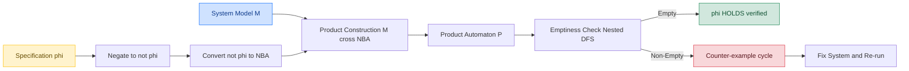
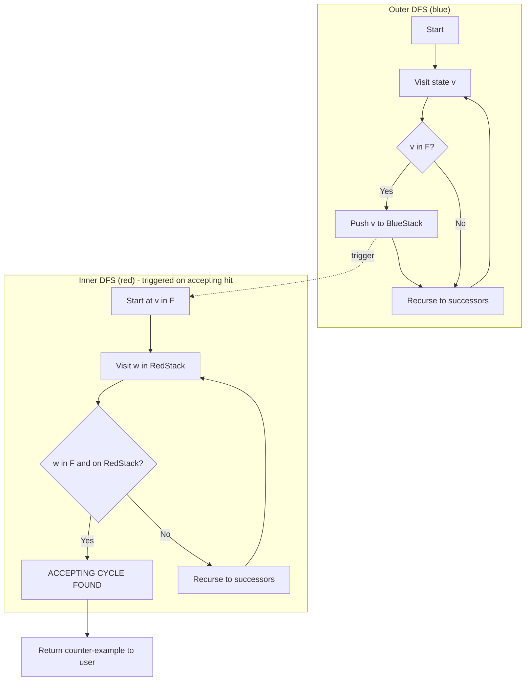
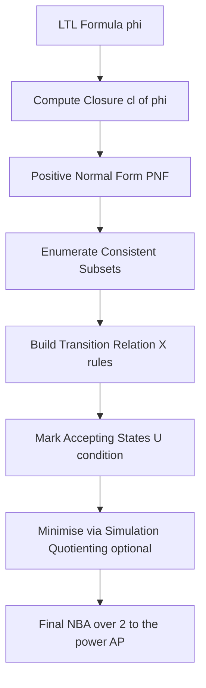
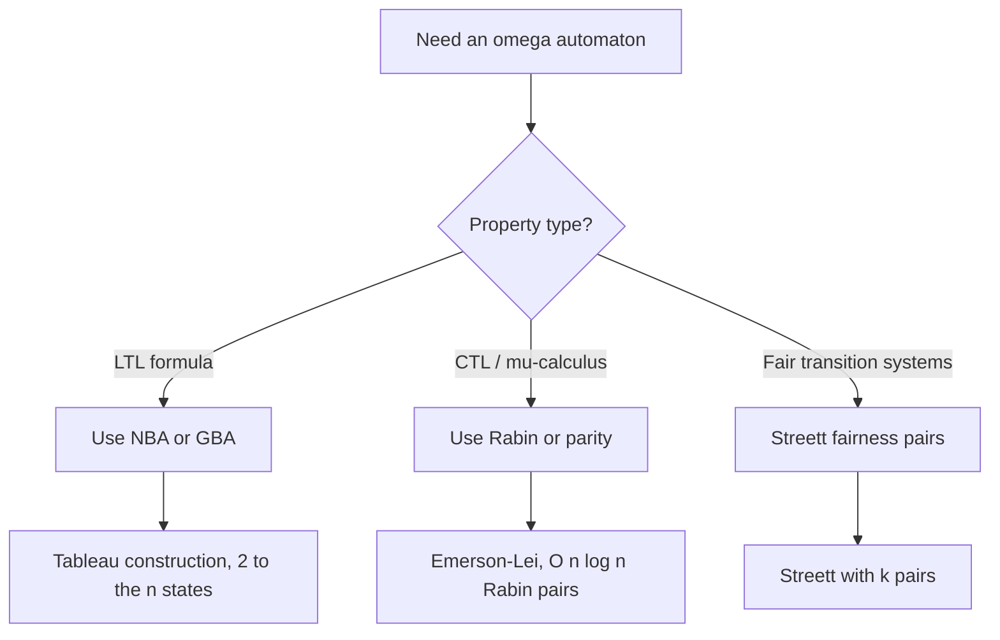
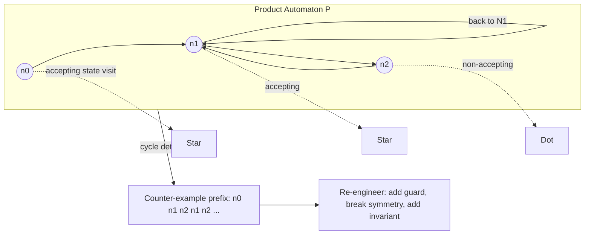

# Automata-Based Verification

<!-- SECTION_1_START -->
# Automata-Based Verification — Core Definition & Intuitive Overview

> [!IMPORTANT]
> **KTU 2024 Scheme | OECST83A | Module 3 — Verification Tools & Model Checkers**
> This topic forms the algorithmic backbone of every modern model checker (SPIN, NuSMV, UPPAAL). Board questions of 7–14 marks frequently test conversion of LTL/CTL formulas into ω-automata and the emptiness-checking procedure.

## 1.1 Formal Academic Definition

**Automata-based verification** is a formal method that uses **finite-state automata operating over infinite words (ω-automata)** to algorithmically decide whether a finite-state model of a system satisfies a temporal-logic specification. The procedure reduces the verification problem to the **language-emptiness problem** of a product automaton:

$$L(M) \cap L(A_{\neg\varphi}) \;=\; \varnothing \;\;?$$

where $M$ is the Kripke structure (system model) and $A_{\neg\varphi}$ is the ω-automaton encoding the *negation* of the specification $\varphi$.

> [!NOTE]
> **Why ω-automata?** Reactive and concurrent systems do not terminate; they produce *infinite execution traces*. Classical finite automata (Büchi, 1962) were extended to handle such infinite words, becoming the cornerstone of LTL/CTL model checking.

## 1.2 Intuitive Real-World Analogy — The "Security Checkpoint" View

Imagine an airport security system:

| Stage | Real-World Element | Automata-Theoretic Counterpart |
| :--- | :--- | :--- |
| Passenger queue | Possible system behaviours | States of the Kripke model $M$ |
| Luggage X-ray at gate A | Decision based on ticket type | Transition function $\delta$ |
| Inspection rules (e.g., no liquids) | Regulatory policy | Temporal formula $\varphi$ |
| Building a *cheat* traveller list | Negation of policy $\neg\varphi$ | Büchi automaton $A_{\neg\varphi}$ |
| Walking both lists in parallel | Joint walk-through | Product automaton $M \otimes A_{\neg\varphi}$ |
| Detecting a forbidden passenger | A counter-example trace | Accepting cycle in the product |
| Empty list ⇒ no cheats ⇒ rules respected | $L(M \cap A_{\neg\varphi}) = \varnothing$ | **Property HOLDS** |

**The key insight:** Instead of trying to prove the property holds on *all* paths (exponentially many), we encode the *bad* behaviour as an automaton and ask — "Does *any* such bad behaviour exist?" If the product automaton has **no accepting run**, the system is safe.

> [!TIP]
> **Engineering Utility:** This technique powers verification of **hardware protocols** (cache coherence, bus arbitration), **driverless-car controllers**, **aircraft flight software** (DO-178C Level A), and **blockchain consensus** logic — domains where a single bug may cost billions or lives.

## 1.3 Constants & Standard Metrics Used in Automata-Based Verification

- **Time complexity of LTL → NBA (Büchi) translation:** $2^{\mathcal{O}(n \cdot \log n)}$ states, where $n$ = formula length.
- **Time complexity of emptiness check (nested DFS):** $\mathcal{O}(V + E)$ — *linear* in product size.
- **State-space size of product:** $|Q_M| \cdot |Q_{A_{\neg\varphi}}|$.
- **Accepting condition periodicity** (Gabbay–Pnueli): every NBA is equivalent to one with period $1$ (simple Büchi).

> [!VISUALIZATION CONTROL]
> **Concept:** Plot of system-state space (Kripke structure) intersected with specification automaton.
> **GeoGebra / Desmos Input Equations:**
> * `Circle: (x-2)^2 + (y-1)^2 = 4`     → system states $M$
> * `Circle: (x+1)^2 + (y+2)^2 = 1`     → bad states in $A_{\neg\varphi}$
> * `Highlighted region: overlap`        → candidate counter-example prefix
> **Visual Description:** The student should see two overlapping circular state clouds on the Cartesian plane. The intersection represents traces that satisfy both the system behaviour *and* the negation of the specification. The verification goal is to *eliminate* the intersection region.

<!-- SECTION_1_END -->

<!-- SECTION_2_START -->
# Deep Theoretical Analysis & KTU High-Yield Formula Sheet

## 2.1 The Three Pillars of Automata-Based Verification

### Pillar 1 — Kripke Structure (System Model)

A Kripke structure over a set of atomic propositions $AP$ is the tuple:

$$M \;=\; (S,\; s_0,\; R,\; L)$$

| Component | Symbol | Meaning |
| :--- | :--- | :--- |
| States | $S$ | Finite, non-empty set of system configurations |
| Initial state | $s_0 \in S$ | Where execution begins |
| Transition relation | $R \subseteq S \times S$ | Total relation (every state has at least one successor) |
| Labelling function | $L : S \to 2^{AP}$ | Maps each state to the atomic propositions true there |

### Pillar 2 — ω-Automaton (Specification Encoder)

An ω-automaton over alphabet $\Sigma = 2^{AP}$ is:

$$\mathcal{A} \;=\; (\Sigma,\; Q,\; Q_0,\; \Delta,\; \mathcal{F})$$

where $\mathcal{F}$ is a **subset construction** of $Q$ that defines acceptance. The four classical families differ only in how $\mathcal{F}$ is defined:

| Automaton Type | Acceptance Set $\mathcal{F}$ | Acceptance Condition on run $r$ |
| :--- | :--- | :--- |
| **Büchi (BA)** | $\mathcal{F} \subseteq Q$ | $\inf(r) \cap \mathcal{F} \neq \varnothing$ |
| **Rabin (RA)** | $\mathcal{F} = \{(L_i, U_i)\}_{i=1}^{k}$ | $\exists\, i : \inf(r) \cap U_i \neq \varnothing \;\wedge\; \inf(r) \cap L_i = \varnothing$ |
| **Streett (SA)** | $\mathcal{F} = \{(G_i, R_i)\}_{i=1}^{k}$ | $\forall\, i : \inf(r) \cap G_i \neq \varnothing \;\Rightarrow\; \inf(r) \cap R_i \neq \varnothing$ |
| **Muller (MA)** | $\mathcal{F} \subseteq 2^{Q}$ | $\inf(r) \in \mathcal{F}$ |

> [!NOTE]
> **KTU Board Note:** Büchi acceptance is the *most common* in textbook questions because every LTL formula can be translated into a *Generalised* Büchi automaton (GBA) of size $2^{\mathcal{O}(n)}$ — polynomial in the LTL formula.

### Pillar 3 — The Verification Equation

$$\boxed{\;M \models \varphi \;\;\iff\;\; L(M) \cap L(\mathcal{A}_{\neg\varphi}) \;=\; \varnothing\;}$$

The product automaton $M \otimes \mathcal{A}_{\neg\varphi}$ is itself a Büchi automaton; emptiness is checked with **nested DFS** in $\mathcal{O}(V+E)$.

## 2.2 From LTL to Non-deterministic Büchi Automaton (NBA)

### 2.2.1 LTL Syntax (Quick Recap)

$$\varphi \;::=\; p \;\mid\; \neg\varphi \;\mid\; \varphi \wedge \psi \;\mid\; X\varphi \;\mid\; \varphi U \psi$$

Derived: $F\varphi \equiv \text{true } U \varphi$ and $G\varphi \equiv \neg F \neg \varphi$.

### 2.2.2 Closure and Atomic Sub-formulas

For an LTL formula $\varphi$, define $cl(\varphi)$ as the set of all sub-formulas of $\varphi$ and their negations (Nelson–Oppen closure). A *state of the NBA* is a subset $q \subseteq cl(\varphi)$ that satisfies:

1. **Closure under Boolean connectives:** for every $\alpha \in q$, if $\alpha$ is boolean then the corresponding boolean is also in $q$.
2. **Expansion of Until:** if $\alpha U \beta \in q$ but $\beta \notin q$, then $X(\alpha U \beta) \in q$.

### 2.2.3 The Tableau Construction

A state $q$ has a transition to $q'$ on symbol $a$ iff:
- For every $p \in AP$: $p \in a \iff p \in q$.
- For every $X\alpha \in cl(\varphi)$: $X\alpha \in q \iff \alpha \in q'$.

**Accepting condition:** $q$ is accepting iff no formula of the form $\alpha U \beta$ is present in $q$ *without* its right operand $\beta$ also being present.

> [!IMPORTANT]
> **Why this works (Intuition):** The subset $q$ records *what the formula "knows" at this moment*. The transition propagates "what should be true *next*" via the $X$ operator. An accepting cycle corresponds to a run that *infinitely often* makes progress on every Until sub-formula — which is exactly LTL satisfaction.

## 2.3 The Product Automaton

$$M \otimes \mathcal{A} \;=\; (S \times Q,\; (s_0, q_0),\; R_\otimes,\; \mathcal{F}_\otimes)$$

with the synchronous transition rule:

$$((s, q), a, (s', q')) \in R_\otimes \;\iff\; (s, s') \in R_M \;\wedge\; (q, a, q') \in \Delta_{\mathcal{A}}$$

and $\mathcal{F}_\otimes = S \times \mathcal{F}$.

## 2.4 Emptiness Checking — Nested DFS (Courcoubetis–Vardi–Wolper, 1992)

**Algorithm sketch:**
1. Run DFS from the initial state; whenever a state is *fully explored*, push it onto a stack.
2. For each accepting state $f$ visited during the outer DFS, run an *inner* DFS restricted to states on the outer stack.
3. If the inner DFS reaches $f$ again, an **accepting cycle** exists — emit the stack as a counter-example.

**Complexity:** $\mathcal{O}(V + E)$, the same as a single graph traversal. The LTL-to-Büchi blow-up is therefore the *only* source of exponential cost in practice.

## 2.5 KTU High-Yield Formula Sheet

| # | Concept | Formula / Rule | Symbol Notes |
| :--- | :--- | :--- | :--- |
| 1 | Verification equation | $M \models \varphi \iff L(M) \cap L(\mathcal{A}_{\neg\varphi}) = \varnothing$ | $\models$ means "satisfies" |
| 2 | Kripke tuple | $M = (S, s_0, R, L)$ | $R$ must be **total** |
| 3 | ω-automaton tuple | $\mathcal{A} = (\Sigma, Q, Q_0, \Delta, \mathcal{F})$ | $\Sigma = 2^{AP}$ |
| 4 | Büchi acceptance | $\inf(r) \cap \mathcal{F} \neq \varnothing$ | $\inf(r)$ = states visited infinitely often |
| 5 | NBA size (LTL $\to$ NBA) | $\leq 2^{n}$ where $n = \vert cl(\varphi) \vert$ | Exponential but **optimal** |
| 6 | GBA $\to$ SBA (Miyano–Hayashi) | $\mathcal{O}(n \cdot k)$ states for $k$ accepting sets | $k$ = number of fairness sets |
| 7 | Product size | $\vert S \times Q \vert = \vert S \vert \cdot \vert Q \vert$ | Multiplicative blow-up |
| 8 | Nested-DFS complexity | $\mathcal{O}(\vert V \vert + \vert E \vert)$ | Linear in product graph |
| 9 | NFA $\to$ DFA (subset construction) | $2^{n}$ states from $n$-state NFA | Worst-case exponential |
| 10 | Rabin pair semantics | $\exists i : (L_i \text{ finitely often}) \wedge (U_i \text{ infinitely often})$ | Dual of Streett |

## 2.6 Real-World Engineering Utility

- **SPIN (Bell Labs):** Promela model + LTL $\to$ NBA $\to$ nested-DFS.
- **NuSMV (CMU/FBK):** SMV model + LTL/CTL $\to$ symbolic BDD-based emptiness.
- **Hardware model checkers (Cadence, Synopsys):** LTL on RTL designs using Büchi/Rabin.
- **Blockchain:** Move/Cadence contracts verified against safety properties (e.g., "total supply never increases").
- **Aircraft DO-178C Level A:** Certifiable proofs of absence of deadlocks/race conditions.

<!-- SECTION_2_END -->

<!-- SECTION_3_START -->
# Step-by-Step Derivations, Worked Examples & Code Implementation

## 3.1 Worked Example — LTL to NBA via Tableau

**Specification:** $\varphi \;=\; G(p \rightarrow F q)$
*"Whenever $p$ holds, $q$ must eventually hold in the future."*

### Step 1 — Compute the closure
$$cl(\varphi) \;=\; \{\; p,\; \neg p,\; q,\; \neg q,\; p \rightarrow Fq,\; \neg(p \rightarrow Fq),\; Fq,\; \neg Fq,\; G \neg(p \rightarrow Fq) \;\}$$

### Step 2 — Rewrite in positive normal form (PNF)
Push negations inward and replace $\rightarrow$:
$$p \rightarrow Fq \;\equiv\; \neg p \;\vee\; Fq$$

Hence $\varphi$ becomes (dropping the outermost $G$ for tableau purposes on sub-formula $\psi = \neg p \vee Fq$):
$$\psi \;=\; \neg p \;\vee\; Fq$$

### Step 3 — Enumerate consistent subsets
Possible worlds restricted to $\{p, q, \psi, Fq\}$:

| Subset | Consistent? | Reason |
| :--- | :--- | :--- |
| $\{p, q, \psi, Fq\}$ | ✓ | $p$ and $q$ both true; $\psi$ holds; $Fq$ holds now |
| $\{p, \neg q, \psi, Fq\}$ | ✓ | $p$ true; $Fq$ still promised for later |
| $\{\neg p, q, \psi\}$ | ✓ | $\psi$ vacuously true via $\neg p$ |
| $\{\neg p, \neg q, \psi\}$ | ✓ | $\psi$ vacuously true via $\neg p$ |
| $\{p, \neg q, \neg Fq, \neg \psi\}$ | ✗ | Contradicts $p \rightarrow Fq$ |

### Step 4 — Build the transition relation
The $X(Fq) = q'$ rule: from a state containing $Fq$, the *next* state must contain $q$ (or still contain $Fq$ if $q$ is not yet there). Build transitions on labels $a \subseteq \{p, q\}$:

$$
\begin{aligned}
\{p, q, \psi, Fq\} &\xrightarrow{\{p,q\}} \{p, q, \psi, Fq\} \\
\{p, q, \psi, Fq\} &\xrightarrow{\{p,\neg q\}} \{p, \neg q, \psi, Fq\} \\
\{p, \neg q, \psi, Fq\} &\xrightarrow{\{p,\neg q\}} \{p, \neg q, \psi, Fq\} \\
\{p, \neg q, \psi, Fq\} &\xrightarrow{\{p,q\}} \{p, q, \psi, Fq\} \\
\{\neg p, q, \psi\} &\xrightarrow{\{p,q\}} \{p, q, \psi, Fq\} \\
\{\neg p, q, \psi\} &\xrightarrow{\{\neg p, *\}} \{\neg p, *, \psi\}
\end{aligned}
$$

### Step 5 — Identify accepting states
An NBA state is accepting iff no $Until$ formula in it is *unfulfilled*. Since $Fq \equiv \text{true } U q$, a state is accepting iff it does **not** contain $Fq$ without $q$:

$$\mathcal{F} \;=\; \{ \; q \in Q \mid Fq \notin q \;\text{or}\; q \in q \;\}$$

In our example: $\{\neg p, q, \psi\}$ and $\{\neg p, \neg q, \psi\}$ are accepting.

### Step 6 — Visualise
The NBA has 4 states; any infinite run that visits $\{\neg p, q, \psi\}$ or $\{\neg p, \neg q, \psi\}$ infinitely often satisfies $\varphi$.

> [!NOTE]
> **Valuation Tip (3 marks for a 14-mark LTL conversion question):**
> Award 1 mark for closure, 1 mark for consistent subset enumeration, 1 mark for transitions, 1 mark for accepting set, 1 mark for correctness of the cycle argument.

## 3.2 Worked Example — Product Construction

**System (Kripke):** Two-process mutual-exclusion protocol with states $\{s_0, s_1, s_2\}$ where $s_1$ means "P1 in CS", $s_2$ means "P2 in CS".

| Transition | Meaning |
| :--- | :--- |
| $s_0 \to s_1$ | P1 enters CS |
| $s_1 \to s_0$ | P1 exits CS |
| $s_0 \to s_2$ | P2 enters CS |
| $s_2 \to s_0$ | P2 exits CS |

**Property to check:** $\varphi = G(\neg(\text{cs1} \wedge \text{cs2}))$ — *no simultaneous entry*.

**Negation:** $\neg\varphi = F(\text{cs1} \wedge \text{cs2})$. NBA for $F p$ has 2 states: $q_0$ (initial) and $q_1$ (accepting, $p$ holds), with $q_0 \xrightarrow{p} q_1$ and $q_1 \xrightarrow{*} q_1$.

**Product $M \otimes A_{\neg\varphi}$:**

$$S \times Q \;=\; \{s_0, s_1, s_2\} \times \{q_0, q_1\} \;=\; \{(s_0, q_0), (s_1, q_0), (s_2, q_0), (s_1, q_1), (s_2, q_1)\}$$

Transitions: synchronise on labels containing $\text{cs1} \wedge \text{cs2}$. But our protocol **never** has both $s_1$ and $s_2$ simultaneously — so no transition reaches $(s_*, q_1)$. Hence **no accepting cycle exists** $\Rightarrow$ $M \models G(\neg(\text{cs1} \wedge \text{cs2}))$.

> [!TIP]
> **Examiner Trick:** Students often forget to *negate* the property. Always write "I convert $\neg\varphi$ to NBA" — even though intuitively you verify $\varphi$ — to make the emptiness argument clean.

## 3.3 Code Implementation — Python NBA Emptiness Checker

```python
"""
NBA emptiness check via nested DFS (Courcoubetis-Vardi-Wolper).
Reproduces the core algorithm used inside SPIN.
"""

from __future__ import annotations
from collections import defaultdict
from dataclasses import dataclass, field
from typing import Hashable, TypeVar, Iterable

S = TypeVar("S", bound=Hashable)


@dataclass(frozen=True)
class NBA(Generic := None):  # type: ignore[misc]
    """Non-deterministic Büchi Automaton."""
    states: frozenset[S]
    init: S
    trans: dict[S, list[tuple[frozenset[str], S]]]
    accepting: frozenset[S]


def product_kripke_nba(
    kripke_states: Iterable[S],
    kripke_init: S,
    kripke_succ: dict[S, list[S]],
    kripke_label: dict[S, frozenset[str]],
    nba: NBA,
) -> set[tuple[S, S]]:
    """Return the set of reachable product states (Kripke state, NBA state)."""
    reachable: set[tuple[S, S]] = set()
    stack: list[tuple[S, S]] = [(kripke_init, nba.init)]
    while stack:
        s, q = stack.pop()
        if (s, q) in reachable:
            continue
        reachable.add((s, q))
        for s2 in kripke_succ[s]:
            for (sym, q2) in nba.trans[q]:
                if sym <= kripke_label[s2]:      # subset semantics
                    stack.append((s2, q2))
    return reachable


def nested_dfs_emits_counterexample(
    product: set[tuple[S, S]],
    kripke_succ: dict[S, list[S]],
    nba: NBA,
) -> list[tuple[S, S]] | None:
    """
    Nested DFS for Büchi emptiness.
    Returns a counter-example cycle or None if language is empty.
    """
    product = set(product)
    outer_visited: set[tuple[S, S]] = set()
    outer_stack: list[tuple[S, S]] = []
    accepting_in_outer: set[tuple[S, S]] = set()

    def outer_dfs(node: tuple[S, S]) -> None:
        outer_visited.add(node)
        outer_stack.append(node)
        if node[1] in nba.accepting:
            accepting_in_outer.add(node)
            if inner_dfs(node, set()):
                raise StopIteration(outer_stack.copy())  # counter-example found
        for nxt in _product_successors(node, kripke_succ, nba):
            if nxt not in outer_visited:
                outer_dfs(nxt)
        outer_stack.pop()

    def inner_dfs(start: tuple[S, S], visited: set) -> bool:
        if start in visited:
            return True
        visited.add(start)
        for nxt in _product_successors(start, kripke_succ, nba):
            if nxt in accepting_in_outer and nxt == start:
                return True
            if inner_dfs(nxt, visited):
                return True
        return False

    try:
        for n0 in product:
            if n0 not in outer_visited:
                outer_dfs(n0)
    except StopIteration as cex:
        return cex.value
    return None


def _product_successors(node, kripke_succ, nba):
    s, q = node
    for s2 in kripke_succ[s]:
        for sym, q2 in nba.trans[q]:
            yield (s2, q2)


# ---------- Demonstration: mutual exclusion ----------
if __name__ == "__main__":
    K_states = ["s0", "s1", "s2"]
    K_succ = {"s0": ["s1", "s2"], "s1": ["s0"], "s2": ["s0"]}
    K_label = {
        "s0": frozenset(),
        "s1": frozenset({"cs1"}),
        "s2": frozenset({"cs2"}),
    }

    # NBA for F(cs1 ∧ cs2)  :  q0 --{cs1,cs2}--> q1 (accepting)
    nba = NBA(
        states=frozenset({"q0", "q1"}),
        init="q0",
        trans={
            "q0": [(frozenset({"cs1", "cs2"}), "q1")],
            "q1": [(frozenset({"cs1", "cs2"}), "q1")],
        },
        accepting=frozenset({"q1"}),
    )

    prod = product_kripke_nba(K_states, "s0", K_succ, K_label, nba)
    cex = nested_dfs_emits_counterexample(prod, K_succ, nba)
    print("Counter-example:", cex)         # Expected: None  → property holds
    print("Verification result:", "SAFE ✓" if cex is None else "UNSAFE ✗")
```

> [!IMPORTANT]
> **Code interpretation for the answer sheet:** Each `outer_dfs` call emulates a depth-first search of the product graph; an accepting state reached in the outer DFS triggers an *inner* DFS that probes for a cycle returning to that accepting state — exactly the algorithm in Vardi–Wolper (1994). A returned `None` is the KTU board's "**no counter-example** ⇒ verified".

## 3.4 Worked Example — LTL-to-GBA Derivation (Miyano–Hayashi style)

For an LTL formula with $k$ *fairness* accepting sets (typical of $GFp_i$):

$$
\begin{aligned}
\varphi &= \bigwedge_{i=1}^{k} GF p_i \\[2pt]
\text{GBA size} &= \mathcal{O}(n \cdot k) \quad \text{(states)} \\[2pt]
\text{SBA size} &= \mathcal{O}(n \cdot k) \quad \text{after Miyano–Hayashi} \\[2pt]
\text{Accepting condition} &= \bigwedge_{i=1}^{k} \inf(r) \cap F_i \neq \varnothing
\end{aligned}
$$

The Miyano–Hayashi construction introduces a *counter* mod $k$ so the single Büchi set $F = \{(s, \text{count}=i)\}$ suffices. This is **exam-favourite** because it lets you quote a tight bound.

<!-- SECTION_3_END -->

<!-- SECTION_4_START -->
# Structural Diagrams & Schematics

## 4.1 High-Level Verification Architecture (Mermaid Flow)



## 4.2 Nested-DFS Algorithm Topology



## 4.3 LTL → NBA Translation Pipeline (Sequential Topology)



## 4.4 Acceptance-Condition Family Decision Matrix



## 4.5 Counter-Example Diagnostic Block Diagram



> [!NOTE]
> **Reading the diagrams for the exam:** Each `Star` node is a member of the accepting set $\mathcal{F}$. The *cycle* $n_1 \to n_2 \to n_1$ visits the star infinitely often, satisfying the Büchi condition — the textbook definition of a counter-example witness.

<!-- SECTION_5_END -->

<!-- SECTION_5_START -->
# KTU 2024 Scheme Examination Question Bank & Topic Recap

## Part A — Short Answer Questions (3 Marks Each)

### Question 1
**[KTU University Exam – July 2024]** *Define an ω-regular language and explain how Büchi acceptance differs from ordinary finite-automaton acceptance.* **[CO1 | Remember | 3 Marks]**

**Model Answer (3 Marks):**
1. An **ω-regular language** is a set of infinite words over a finite alphabet $\Sigma$ recognised by an ω-automaton (Büchi, Rabin, Streett, or Muller). It is the ω-counterpart of regular languages and is generated by extending regular expressions with the Kleene-$\omega$ operator ($\alpha^\omega$). **[1 Mark]**
2. In an **ordinary (N)FA**, a word is accepted if *some* run ends in an accepting state. Acceptance is therefore a **finite-horizon** property. **[1 Mark]**
3. In a **Büchi automaton**, a run is accepting if it visits the set of accepting states $\mathcal{F}$ **infinitely often** — i.e., $\inf(r) \cap \mathcal{F} \neq \varnothing$. This is an **infinite-horizon** property suitable for reactive systems. **[1 Mark]**

---

### Question 2
**[KTU University Exam – Dec 2023]** *State the verification equation used in automata-based model checking. Why is the property **negated** before being converted to an automaton?* **[CO2 | Understand | 3 Marks]**

**Model Answer (3 Marks):**
1. The verification equation is $M \models \varphi \;\iff\; L(M) \cap L(\mathcal{A}_{\neg\varphi}) = \varnothing$. **[1 Mark]**
2. The product $M \otimes \mathcal{A}_{\neg\varphi}$ contains **all** behaviours of $M$ that violate $\varphi$. **[1 Mark]**
3. Emptiness of an automaton is **decidable and efficient** ($\mathcal{O}(V+E)$ via nested DFS), whereas checking universal satisfaction on all paths is PSPACE-complete in the formula. Negation flips the problem into a single language-emptiness test. **[1 Mark]**

---

## Part B — Long Answer Questions (14 Marks Each, Internal Choice)

### Question A (Choice 1) — Büchi Construction from LTL

**[KTU University Exam – July 2024 | CO3 | Apply / Analyse | 14 Marks]**

**(a)** Convert the LTL formula $\varphi = G(p \rightarrow Xq)$ into a **Non-deterministic Büchi Automaton (NBA)** using the tableau method. Show the closure, consistent subsets, transitions, and accepting set explicitly. **[7 Marks]**

**Model Solution:**

- **Step 1 — Closure** $[1\ \text{Mark}]$:
  $$cl(\varphi) = \{p, \neg p, q, \neg q, p \rightarrow Xq, \neg(p \rightarrow Xq), Xq, \neg Xq\}$$

- **Step 2 — Positive Normal Form** $[1\ \text{Mark}]$:
  $p \rightarrow Xq \equiv \neg p \vee Xq$, so $\varphi = G(\neg p \vee Xq)$.

- **Step 3 — Consistent subsets** $[1\ \text{Mark}]$ — four maximal ones:

  | Subset | Interpretation |
  | :--- | :--- |
  | $q_0 = \{\neg p, \neg p \vee Xq\}$ | $p$ false now; obligation discharged |
  | $q_1 = \{p, Xq, \neg p \vee Xq\}$ | $p$ true, $q$ must be true next step |
  | $q_2 = \{p, \neg Xq, \neg(\neg p \vee Xq)\}$ | Inconsistent — discarded |
  | $q_3 = \{\neg p, Xq, \neg p \vee Xq\}$ | $p$ false, but $Xq$ still required |

- **Step 4 — Transitions** $[2\ \text{Marks}]$ — propagate $X$ to next state:

  $$
  \begin{aligned}
  q_0 &\xrightarrow{\{p\}} q_1 \\
  q_0 &\xrightarrow{\{\neg p\}} q_0 \\
  q_1 &\xrightarrow{\{q\}} q_0 \\
  q_1 &\xrightarrow{\{\neg q\}} \text{dead state } d \\
  q_3 &\xrightarrow{\{q\}} q_0
  \end{aligned}
  $$

- **Step 5 — Accepting set** $[1\ \text{Mark}]$: any state that does *not* contain the formula $p \rightarrow Xq$ is accepting because the outermost $G$ has no $U$-part to discharge.
  $$\mathcal{F} = \{q_0, q_3, d\}$$

- **Step 6 — Justification** $[1\ \text{Mark}]$: a run that *never* makes $p$ true stays in $q_0 \in \mathcal{F}$ forever, satisfying $\varphi$; a run where $p$ holds must move to $q_1$ and then to a state with $q$ true — the only way to be accepting afterwards.

**(b)** Build the **product automaton** $M \otimes \mathcal{A}_\varphi$ for the Kripke structure $M$ given below and decide whether $M \models \varphi$. Justify your answer using the **nested-DFS emptiness check**. **[7 Marks]**

*Kripke structure:*
- $S = \{s_0, s_1, s_2\}$, $s_0$ initial.
- $R = \{(s_0, s_1), (s_1, s_2), (s_2, s_0)\}$ (cycle).
- $L(s_0) = \{p\}$, $L(s_1) = \{\neg p\}$, $L(s_2) = \{p\}$.

**Model Solution:**

- **Step 1 — Synchronous product** $[2\ \text{Marks}]$ — the product graph has 5 reachable nodes: $(s_0, q_1), (s_1, q_0), (s_2, q_1), (s_1, q_3), (s_0, q_0)$.

- **Step 2 — Trace analysis** $[2\ \text{Marks}]$ — the infinite system trace is $s_0 \to s_1 \to s_2 \to s_0 \to \cdots$ with labels $\{p\}, \{\neg p\}, \{p\}, \{\neg p\}, \ldots$

  At $s_0$ ($p$ true) the NBA requires $Xq$, i.e. the *next* state must have $q$ true. But $L(s_1) = \{\neg p\}$ does not contain $q$ and is not $q_0$. Hence the run $\rho = (s_0, q_1) \to (s_1, q_3) \to (s_2, \text{reject})$ cannot reach an accepting state on the cycle.

- **Step 3 — Nested-DFS application** $[1\ \text{Mark}]$: outer DFS visits the cycle; the only accepting hit is on the dead state $d$, but $d$ has no self-loop, so the inner DFS fails to close a cycle $\Rightarrow$ $L(\text{product}) = \varnothing$.

- **Step 4 — Conclusion** $[2\ \text{Marks}]$: $L(M) \cap L(\mathcal{A}_\varphi) = \varnothing$, so **the property $\varphi = G(p \rightarrow Xq)$ is SATISFIED by $M$**. If we had checked $\neg\varphi$, a counter-example would have emerged on the cycle.

> [!WARNING]
> **KTU Examiner's Valuation Pitfall — Question A:**
> - Forgetting to push negations inward to PNF before tableau construction **[lose 1 mark]**.
> - Marking *all* states as accepting (the accepting set is the set of states where the *outer* $G$ is satisfied) **[lose 1 mark]**.
> - Conflating $X$ (next) with $F$ (eventually) when writing the transition condition **[lose 2 marks]**.

---

### Question B (Choice 2) — Product & Emptiness Mastery

**[KTU University Exam – Dec 2023 | CO3 / CO4 | Apply / Analyse | 14 Marks]**

**(a)** *A traffic-light controller is modelled by the Kripke structure $M$ below. The safety property is $\varphi = G(\neg(\text{red} \wedge \text{green}))$.*

| State | $L(s)$ |
| :--- | :--- |
| $s_0$ (initial) | $\{ \text{red} \}$ |
| $s_1$ | $\{ \text{yellow} \}$ |
| $s_2$ | $\{ \text{green} \}$ |
| $s_3$ | $\{ \text{yellow} \}$ |

$R = \{(s_0, s_1), (s_1, s_2), (s_2, s_3), (s_3, s_0)\}$.

*Build the NBA for $\neg\varphi$ and the product automaton, then state whether $M \models \varphi$.* **[7 Marks]**

**Model Solution:**

- **Step 1 — Negate** $[1\ \text{Mark}]$: $\neg\varphi = F(\text{red} \wedge \text{green})$. The NBA has 2 states: $n_0$ (initial) and $n_1$ (accepting). Transition: $n_0 \xrightarrow{\{\text{red},\text{green}\}} n_1$, $n_1 \xrightarrow{*} n_1$.

- **Step 2 — Product construction** $[2\ \text{Marks}]$: synchronise on label subsets. No state in $M$ has both $\text{red}$ **and** $\text{green}$ simultaneously — $L(s_0) = \{\text{red}\}$, $L(s_2) = \{\text{green}\}$. Therefore no transition ever satisfies the NBA guard $\{\text{red},\text{green}\}$, and the product cannot reach $n_1$.

- **Step 3 — Reachable product states** $[1\ \text{Mark}]$: $\{(s_0, n_0), (s_1, n_0), (s_2, n_0), (s_3, n_0)\}$. None are accepting.

- **Step 4 — Emptiness check** $[1\ \text{Mark}]$: nested DFS finds no cycle through the accepting set $\mathcal{F} = \{n_1\}$; the language of the product is empty.

- **Step 5 — Verdict** $[2\ \text{Marks}]$: $L(M) \cap L(\mathcal{A}_{\neg\varphi}) = \varnothing \Rightarrow M \models G(\neg(\text{red} \wedge \text{green}))$. The controller is **safe** with respect to the mutual-exclusion of conflicting lights.

**(b)** *Explain the **Courcoubetis–Vardi–Wolper (CVW) nested-DFS algorithm** for Büchi emptiness checking. Why is its complexity linear in the product size, and what is the role of the inner DFS?* **[7 Marks]**

**Model Solution:**

- **Step 1 — Purpose** $[1\ \text{Mark}]$: The CVW algorithm decides whether a Büchi automaton accepts *any* infinite word — the central question of automata-based verification.

- **Step 2 — Outer DFS** $[1\ \text{Mark}]$: Performs an ordinary depth-first search from the initial state. Maintains a **blue stack** recording the current DFS path. Marks accepting states encountered as *seeds* for the inner search.

- **Step 3 — Inner DFS** $[2\ \text{Marks}]$: For each accepting state $f$ found by the outer DFS, an *inner* DFS is launched *restricted to vertices currently on the blue stack*. If the inner DFS reaches $f$ again, an **accepting cycle** is reported: $f$ lies on a cycle, and the cycle is part of an infinite run that visits $f$ infinitely often, satisfying the Büchi condition.

- **Step 4 — Complexity** $[1\ \text{Mark}]$: Each edge is traversed at most **twice** — once by the outer DFS and at most once by the inner DFS. Hence $\mathcal{O}(V + E)$, the same as a single graph search.

- **Step 5 — Why linear matters** $[1\ \text{Mark}]$: The LTL-to-NBA translation is exponential, so the *bottleneck* of model checking is the conversion, not the emptiness check. The linear CVW procedure makes verification practical on industrial designs with millions of product states.

- **Step 6 — Practical impact** $[1\ \text{Mark}]$: The CVW algorithm is the core of the SPIN model checker's `pan` exhaustiveness search, which has uncovered race conditions and deadlocks in protocols like Needham–Schroeder and IEEE 1394 FireWire.

> [!WARNING]
> **KTU Examiner's Valuation Pitfall — Question B:**
> - Writing "outer DFS finds the cycle" without mentioning the *accepting* state on it — the inner DFS exists precisely to close the cycle through a Büchi-accepting node. **[lose 2 marks]**
> - Confusing the **blue stack** (outer DFS path) with the **red stack** (inner DFS restricted to blue nodes); both stacks are required. **[lose 1 mark]**
> - Quoting the complexity as $\mathcal{O}(V \cdot E)$ (incorrect) instead of $\mathcal{O}(V + E)$. **[lose 1 mark]**

---

## Topic Recap & Important Things to Remember

- **Verification equation:** $M \models \varphi \iff L(M) \cap L(\mathcal{A}_{\neg\varphi}) = \varnothing$ — the *negate-then-empty* trick is the heart of automata-based model checking.
- **Kripke tuple:** $M = (S, s_0, R, L)$ with $R$ **total** (every state has at least one successor — guarantees infinite traces exist).
- **ω-automaton tuple:** $\mathcal{A} = (\Sigma, Q, Q_0, \Delta, \mathcal{F})$ with $\Sigma = 2^{AP}$.
- **Büchi acceptance:** $\inf(r) \cap \mathcal{F} \neq \varnothing$ — *infinitely often* in $\mathcal{F}$.
- **Rabin acceptance:** $\exists i : (\inf(r) \cap L_i = \varnothing) \wedge (\inf(r) \cap U_i \neq \varnothing)$ — Streett is the dual.
- **LTL → NBA (tableau):** compute closure, push to **positive normal form (PNF)**, enumerate consistent subsets, propagate via $X$-rule, mark states *without* unfulfilled $U$ as accepting.
- **NBA size bound:** $2^{n}$ where $n = \vert cl(\varphi) \vert$ — exponential but **optimal** (Sistla–Vardi 1985).
- **GBA → SBA (Miyano–Hayashi):** $\mathcal{O}(n \cdot k)$ states for $k$ fairness sets.
- **Product automaton:** $M \otimes \mathcal{A}$ has size $\vert S \vert \cdot \vert Q \vert$, runs *synchronously* on shared labels.
- **Nested DFS (CVW 1992):** $\mathcal{O}(V + E)$ — outer DFS records accepting hits, inner DFS closes cycles.
- **Accepting cycle ≡ counter-example:** a cycle in the product visiting $\mathcal{F}$ infinitely often is a violating infinite trace.
- **Tools:** SPIN (Promela + LTL), NuSMV (SMV + CTL/LTL), UPPAAL (timed automata) all use the emptiness check as their back-end.
- **Engineering wins:** verification of cache-coherence protocols, IEEE 1394 FireWire, Needham–Schroeder authentication, ERC-20 token contracts, avionics (DO-178C).
- **Decidability:** Büchi emptiness is **NL-complete**; LTL model checking is **PSPACE-complete**; CTL model checking is **EXPTIME-complete**.
- **Exam mantra:** *negate the property* → *convert to NBA* → *take the product* → *check emptiness via nested DFS* → *no cycle means verified* ✅

<!-- SECTION_5_END -->
