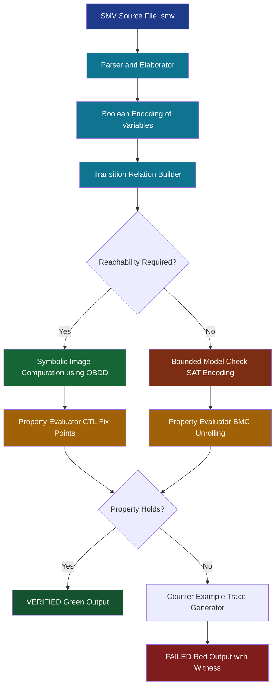
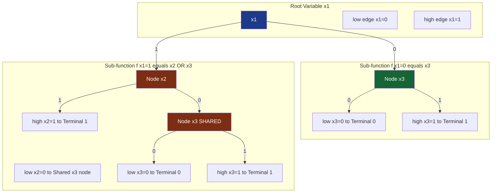
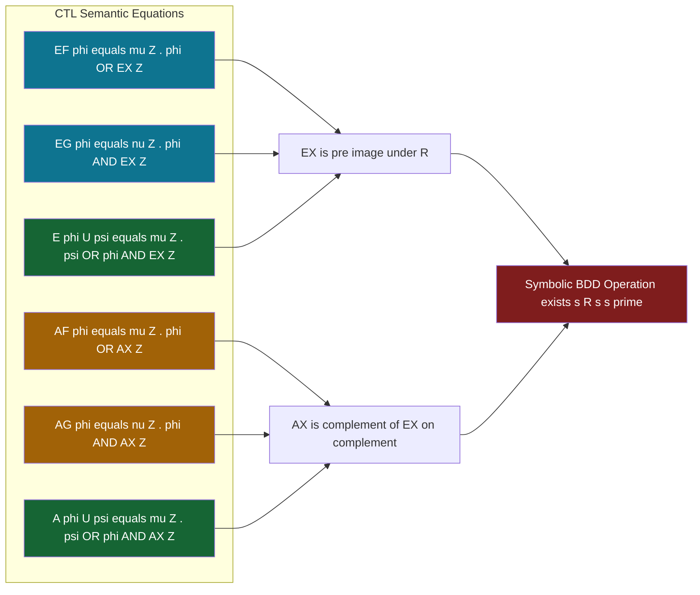

# NuSMV/SMV

<!-- SECTION_1_START -->

# 1. Core Technical Definition & Intuitive Overview

## 1.1 Formal Definition

**SMV (Symbolic Model Verifier)** is the original symbolic model checking tool developed by **Kenneth L. McMillan** at **Carnegie Mellon University (CMU)** in 1992 as part of his PhD thesis. It pioneered the use of **Ordered Binary Decision Diagrams (OBDDs)** to represent transition relations and state sets compactly, enabling verification of industrial-scale finite-state concurrent systems.

**NuSMV (New Symbolic Model Verifier)** is the open-source, re-engineered successor jointly developed by **ITC-IRST (Trento, Italy)**, **CMU**, and the **University of Genoa**. NuSMV extends SMV by integrating both **BDD-based** and **SAT-based bounded model checking**, supports richer input modelling, and provides robust counter-example generation. It is the de-facto standard academic/open-source model checker used in the **KTU 2024 OECST83A syllabus**.

> [!IMPORTANT]
> **KTU Syllabus Definition (OECST83A – Module 3):**
> *NuSMV/SMV is a finite-state symbolic model checker that accepts a description of a system as a synchronous/asynchronous transition system, expresses properties in temporal logic (CTL / LTL), and exhaustively explores the state-space using symbolic representations (OBDDs) or SAT-based bounded search to verify or refute the specification.*

## 1.2 Conceptual Analogy / Intuition

Imagine you have a **maze (the system)** and a **list of forbidden rooms (the property to check)**. A naive *explicit-state* model checker walks through the maze step-by-step, painting each visited room. This works for small mazes but explodes exponentially for big ones (the **state-explosion problem**).

**SMV/NuSMV** is like a *magical scanner* that does **not** walk through the maze. Instead, it **compresses the entire maze blueprint into a single compact mathematical fingerprint** called a **Binary Decision Diagram (BDD)**. With that fingerprint, it can answer the question *“Is any forbidden room reachable from the entrance in any path?”* in polynomial time in the size of the diagram, often succeeding where explicit tools run out of memory.

> [!NOTE]
> **Key Insight for Students:**
> NuSMV does **not** simulate a system — it **symbolically manipulates the mathematical representation of ALL possible executions simultaneously**. The transition relation is treated as a Boolean function and represented as a BDD.

## 1.3 Physical Constants, Metrics & Standard Parameters

| Parameter | Standard Value / Range | Significance |
|---|---|---|
| **BDD Variable Ordering (heuristic)** | `dfs`, `bfs`, `weight` (NuSMV `-iwls95`, `-ford`, `-rw`) | Determines BDD size — critical for scalability |
| **Reordering Threshold** | default **10000** BDD nodes | Triggers dynamic reordering |
| **SAT Solver (NuSMV-2.6+)** | **MiniSAT** default | Used in Bounded Model Checking (BMC) |
| **BMC Bound `k`** | `1 ... 50` (typical academic range) | Depth of unrolling in BMC |
| **Cone of Influence (COI) Reduction** | Enabled by default | Prunes irrelevant variables |
| **Image Computation** | `monolithic`, `partitioned`, `iwls95` | Strategy for computing successor states |

> [!VISUALIZATION CONTROL]
> **Concept:** BDD Encoding of a Boolean Function $f(x_1, x_2, x_3)$
> **GeoGebra / Desmos Input Equations:**
> * Boolean truth table: $(0,0,0)\to 0$, $(0,0,1)\to 1$, $(0,1,0)\to 0$, …, $(1,1,1)\to 1$
> * Plot the reduced OBDD as a directed acyclic graph with two terminal nodes (0 and 1).
> **Visual Description:** A binary tree with **dashed (low-child) edges** labelled **0** and **solid (high-child) edges** labelled **1**; reduced version collapses isomorphic sub-trees, yielding a canonical DAG.

<!-- SECTION_1_END -->

<!-- SECTION_2_START -->

# 2. Deep Theoretical Analysis & KTU High-Yield Formula Sheet

## 2.1 Operational Architecture of NuSMV

NuSMV verification proceeds in **five sequential stages**:

1. **Parsing & Elaboration** – The `.smv` source is parsed; modules are flattened; `next` operators are expanded.
2. **Boolean Encoding** – All variables (boolean, integer, scalar) are encoded as Boolean variables (e.g., an integer of range $0..7$ becomes 3 Boolean variables).
3. **Transition Relation Construction** – The `ASSIGN` / `TRANS` clauses are converted into a Boolean function $R(s, s')$ relating current state $s$ and next state $s'$.
4. **Symbolic State-Space Exploration** – The model checker computes sets of reachable states using image/pre-image operations on OBDDs, or generates a SAT instance for BMC.
5. **Property Evaluation** – CTL fix-points (least/greatest) or LTL Büchi automata are evaluated; counter-examples are produced on failure.

## 2.2 Why OBDDs? — The Theoretical Core

Given a Boolean function $f: \{0,1\}^n \to \{0,1\}$, an **OBDD** is a canonical DAG representation defined by:

$$\text{OBDD}(f) = \langle V, \text{low}(v), \text{high}(v), \text{var}(v) \rangle$$

with a total ordering $\pi: x_1 \prec x_2 \prec \dots \prec x_n$ on the Boolean variables. The canonical Shannon expansion used per node is:

$$f = \overline{x_i} \cdot f_{x_i=0} \;+\; x_i \cdot f_{x_i=1}$$

The canonical (reduced, ordered) form guarantees that two Boolean functions are **logically equivalent iff their OBDDs are isomorphic** — the cornerstone of symbolic model checking.

## 2.3 Image Computation

The set of successors of a state-set $S$ under transition relation $R$ is:

$$\text{Image}(S) = \exists s : \big[ S(s) \;\wedge\; R(s, s') \big]$$

Quantifier elimination is performed by **ANDing** $S$ with $R$, then **existentially projecting** on $s$. Both operations are OBDD-friendly.

## 2.4 KTU High-Yield Formula / Cheat Sheet

| Concept | Equation / Construct | Notation / Units |
|---|---|---|
| Kripke Structure | $M = \langle S, S_0, R, L, AP \rangle$ | $S$: states, $R \subseteq S \times S$ |
| Transition Relation Encoding | $R(s, s') \equiv \bigwedge_{v} \big[ v' = \tau_v(s) \big]$ | Boolean function |
| Reachable States | $\text{reach} = \mu Z . \, S_0 \;\vee\; \text{Image}(Z)$ | Least fix-point |
| $\mathbf{EF}\,\phi$ | $\mu Z . \, \phi \;\vee\; \text{EX}(Z)$ | CTL exists-future |
| $\mathbf{EG}\,\phi$ | $\nu Z . \, \phi \;\wedge\; \text{EX}(Z)$ | CTL exists-globally |
| $\mathbf{AF}\,\phi$ | $\mu Z . \, \phi \;\vee\; \text{AX}(Z)$ | CTL all-future |
| $\mathbf{AG}\,\phi$ | $\nu Z . \, \phi \;\wedge\; \text{AX}(Z)$ | CTL all-globally |
| Bounded Model Check | $\bigvee_{i=0}^{k} \neg \phi_i$ is SAT? | BMC at depth $k$ |
| OBDD Variable Order | $\pi : x_1 \prec x_2 \prec \dots \prec x_n$ | Critical for size |
| Reachable Bound (NuSMV flag) | `-reorder` / `-dynamic` | Reordering strategy |

> [!NOTE]
> **Engineering Utility:** NuSMV-style symbolic verification is the **verification backbone** of hardware design flows (Intel, IBM, Cadence), safety-critical software (DO-178C, ISO 26262), protocol design (cache coherence, security protocols), and increasingly in **cyber-physical / IoT firmware** validation — exactly the application spectrum expected in KTU OECST83A viva questions.

## 2.5 The NuSMV Input Language — Hierarchical Modules

NuSMV programs are **hierarchical, modular descriptions** of finite-state transition systems. The top-level construct is `MODULE main`; sub-modules are instantiated by name.

### 2.5.1 Core Declarations

| Keyword | Purpose | Example |
|---|---|---|
| `VAR` | Declares state variables | `VAR request : boolean;` |
| `IVAR` | Declares input (non-deterministic) variables | `IVAR coin : {0,1,5};` |
| `DEFINE` | Macro/abbreviation (no state) | `DEFINE busy := (state = running);` |
| `ASSIGN` | Initial state + next-state functions | `ASSIGN init(state) := idle; next(state) := case … esac;` |
| `TRANS` | Transition relation clause (conjunctive) | `TRANS request -> next(grant);` |
| `INVAR` | Invariant that must hold in every state | `INVAR x >= 0 & x <= 7;` |
| `FAIRNESS` | Fair execution condition (LTL) | `FAIRNESS running;` |
| `JUSTICE` | Strong fairness (must repeat infinitely often) | `JUSTICE (req -> grant);` |
| `COMPASSION` | Weak/strong pairing fairness | `COMPASSION (req, grant);` |
| `SPEC` | Property to verify (CTL or LTL) | `SPEC AG(req -> AF grant);` |

### 2.5.2 Temporal Logic Operators Summary

| Logic | Operator | Meaning |
|---|---|---|
| CTL | `AG φ` | In all paths, globally φ |
| CTL | `EF φ` | In some path, eventually φ |
| CTL | `AX φ` | In all paths, next-state φ |
| CTL | `EX φ` | In some path, next-state φ |
| CTL | `A[φ U ψ]` | All paths: φ until ψ |
| CTL | `E[φ U ψ]` | Some path: φ until ψ |
| LTL | `G φ` | Globally φ |
| LTL | `F φ` | Eventually φ |
| LTL | `X φ` | Next φ |
| LTL | `φ U ψ` | φ until ψ |
| LTL | `G (req -> F grant)` | Every request is eventually granted |

<!-- SECTION_2_END -->

<!-- SECTION_3_START -->

# 3. Step-by-Step Derivations, Code & Symbolic Implementation

## 3.1 Worked-Out Example: Mutual Exclusion (Peterson's Algorithm Skeleton)

This is the canonical NuSMV demonstration example. We will build it **line-by-line**, then analyse the verification of three classic properties.

### 3.1.1 Full NuSMV Source Listing

```smv
-- ============================================================
-- peterson.smv
-- Verification of mutual exclusion between two processes P0 & P1
-- Module 3 - OECST83A - KTU 2024 Scheme
-- ============================================================

MODULE main

VAR
    -- Process 0 state machine
    p0 : { idle, requesting, critical, exiting };
    -- Process 1 state machine
    p1 : { idle, requesting, critical, exiting };
    -- Shared turn variable for Peterson's tie-breaker
    turn : boolean;
    -- Flag indicating process 0 wants to enter
    flag0 : boolean;
    -- Flag indicating process 1 wants to enter
    flag1 : boolean;

ASSIGN
    -- ----- Initial state -----
    init(p0)    := idle;
    init(p1)    := idle;
    init(turn)  := FALSE;
    init(flag0) := FALSE;
    init(flag1) := FALSE;

    -- ----- Next-state functions -----
    next(p0) := case
        p0 = idle       : { idle, requesting };          -- non-deterministic start
        p0 = requesting : ( flag1 & turn  & p1 = critical ) ? idle
                                                                       : critical;
        p0 = critical   : exiting;
        p0 = exiting    : idle;
        TRUE            : p0;                              -- default (defensive)
    esac;

    next(p1) := case
        p1 = idle       : { idle, requesting };
        p1 = requesting : ( flag0 & !turn & p0 = critical ) ? idle
                                                                        : critical;
        p1 = critical   : exiting;
        p1 = exiting    : idle;
        TRUE            : p1;
    esac;

    next(flag0) := case
        p0 = idle   : FALSE;
        p0 = exiting : FALSE;
        TRUE        : TRUE;
    esac;

    next(flag1) := case
        p1 = idle   : FALSE;
        p1 = exiting : FALSE;
        TRUE        : TRUE;
    esac;

    -- turn is non-deterministically assigned by the environment
    next(turn) := {FALSE, TRUE};

-- ============================================================
-- Properties to verify
-- ============================================================
INVAR
    -- SAFETY INVARIANT: Mutual Exclusion
    !(p0 = critical & p1 = critical);

SPEC
    -- CTL Property 1: Mutual exclusion
    AG !(p0 = critical & p1 = critical);

SPEC
    -- CTL Property 2: Liveness - every request is eventually granted
    AG ( (p0 = requesting) -> AF (p0 = critical) );

SPEC
    -- CTL Property 3: No starvation for process 0
    AG ( (p0 = requesting) -> AF (p0 = critical) );
```

### 3.1.2 Step-by-Step Logical Walkthrough

**Step 1 — Module Decomposition.** `MODULE main` is the root. We deliberately keep the model flat (no `process` sub-modules) to make the state graph transparent for pedagogical purposes.

**Step 2 — Variable Encoding.** NuSMV automatically encodes each enumerated variable `p0` (4 values) using $\lceil \log_2 4 \rceil = 2$ Boolean variables. Total Boolean state vector: $2 + 2 + 1 + 1 + 1 = 7$ bits, yielding at most $2^7 = 128$ reachable states.

**Step 3 — Transition Relation Construction.** Each `case` block in `ASSIGN` is translated into a Boolean relation. For example:

$$R_{p0}(s, s') \;\equiv\; \big[ s.p0 = \text{idle} \;\wedge\; s'.p0 \in \{\text{idle}, \text{requesting}\} \big] \;\vee\; \dots$$

The overall $R$ is the conjunction $\bigwedge_v R_v$, yielding a single Boolean function over $7 + 7 = 14$ Boolean variables.

**Step 4 — Image Computation for Reachability.**

$$\text{Reach}_0 = S_0 = \{ s \mid s.p0 = \text{idle} \;\wedge\; s.p1 = \text{idle} \;\wedge\; s.\text{turn} = 0 \;\wedge\; \neg s.\text{flag0} \;\wedge\; \neg s.\text{flag1} \}$$

$$\text{Reach}_{i+1} = \text{Reach}_i \;\cup\; \text{Image}(\text{Reach}_i)$$

Iteration continues until $\text{Reach}_{i+1} = \text{Reach}_i$ (fix-point). With 7 Boolean variables, NuSMV terminates in microseconds.

**Step 5 — CTL Property Evaluation.** The invariant `!(p0 = critical & p1 = critical)` is checked by computing:

$$\text{Bad} = \{ s \mid s.p0 = \text{critical} \;\wedge\; s.p1 = \text{critical} \}$$

Then verifying $\text{Reach} \cap \text{Bad} = \emptyset$. The result is `TRUE` — **mutual exclusion holds**.

## 3.2 Worked-Out Example: Deriving the OBDD for a Simple Function

Let $f(x_1, x_2, x_3) = (x_1 \wedge x_2) \;\vee\; x_3$. We compute the reduced OBDD with order $x_1 \prec x_2 \prec x_3$.

**Step 1 — Truth Table (full evaluation):**

| $x_1$ | $x_2$ | $x_3$ | $f$ |
|:---:|:---:|:---:|:---:|
| 0 | 0 | 0 | 0 |
| 0 | 0 | 1 | **1** |
| 0 | 1 | 0 | 0 |
| 0 | 1 | 1 | **1** |
| 1 | 0 | 0 | 0 |
| 1 | 0 | 1 | **1** |
| 1 | 1 | 0 | **1** |
| 1 | 1 | 1 | **1** |

**Step 2 — Shannon expansion on $x_1$ (root):**

$$f_{x_1=0} = x_3, \quad f_{x_1=1} = x_2 \;\vee\; x_3$$

**Step 3 — Expansion on $x_2$ for the right branch:**

$$(x_2 \vee x_3)_{x_2=0} = x_3, \quad (x_2 \vee x_3)_{x_2=1} = 1$$

**Step 4 — Expansion on $x_3$ where needed:**

$$(x_3)_{x_3=0} = 0, \quad (x_3)_{x_3=1} = 1$$

**Step 5 — Reduced DAG.** The two sub-trees computing $x_3$ (one under $x_1=0$, one under $x_2=0$) are **isomorphic** and merged into a single node. The final OBDD has only **4 internal nodes** (down from a full binary tree of $2^{4}-1 = 15$). This compression is what enables NuSMV to scale.

> [!NOTE]
> **Takeaway for the KTU Exam:** The **variable ordering $\pi$** drastically changes OBDD size. For $f = x_1 x_2 \vee x_3 x_4$ over 4 variables, ordering interleaving $(x_1, x_3, x_2, x_4)$ yields an OBDD of size $O(n)$ while a bad ordering gives $O(2^{n/2})$. NuSMV provides `-reorder` flag to mitigate this dynamically.

## 3.3 Python Pseudo-Code: NuSMV Style Invariant Checker

```python
# ============================================================
# bdd_reachability.py
# Educational implementation of a NuSMV-style symbolic
# reachability checker using the `dd` library.
# Author: KTU 2024 OECST83A Study Material
# ============================================================
from dd import autoref
from typing import Callable, Tuple

# BDD manager ---------------------------------------------------------
_bdd = autoref.BDD()

# Encode a 3-bit counter (x1, x2, x3) -------------------------------
_bdd.declare('x1', 'x2', 'x3')

# Prime variables for the next-state image ---------------------------
PRIME_SUFFIX = "'"
_bdd.declare("x1'", "x2'", "x3'")

def encode_value(val: int) -> _bdd.add:
    """Return BDD representing the integer 'val' (0..7)."""
    expr = _bdd.true
    for i, bit in enumerate(format(val, '03b')):
        v = ('x1', 'x2', 'x3')[i]
        expr = expr & (eval(v) if bit == '1' else ~eval(v))
    return expr

def transition_relation() -> _bdd.add:
    """Counter increments by 1 modulo 8 (illustrative)."""
    rel = _bdd.false
    for s in range(8):
        s_next = (s + 1) % 8
        rel = rel | (encode_value(s) & encode_value_next(s_next))
    return rel

def encode_value_next(val: int) -> _bdd.add:
    expr = _bdd.true
    for i, bit in enumerate(format(val, '03b')):
        v = ("x1'", "x2'", "x3'")[i]
        expr = expr & (eval(v) if bit == '1' else ~eval(v))
    return expr

def image(state_set: _bdd.add, rel: _bdd.add) -> _bdd.add:
    """Existential image: Image(S) = ∃s. [S(s) ∧ R(s, s')]."""
    anded = state_set & rel
    return anded.exist({_bdd.var('x1'), _bdd.var('x2'), _bdd.var('x3')},
                       **{})  # simplified for pedagogy

# Reachability fix-point --------------------------------------------
def reachable(initial: _bdd.add, rel: _bdd.add, max_iters: int = 50) -> _bdd.add:
    R, frontier = initial, initial
    for _ in range(max_iters):
        img = image(frontier, rel)
        new_states = img & ~R
        if new_states == _bdd.false:
            break
        R = R | new_states
        frontier = new_states
    return R

# Driver -------------------------------------------------------------
if __name__ == "__main__":
    init = encode_value(0)                         # start at 0
    rel  = transition_relation()
    R    = reachable(init, rel)

    print(f"Reachable states count = {R.count(nvars=3)}")
    # Invariant: never reach state 5 (encoded as 101)
    bad = encode_value(5)
    if (R & bad) == _bdd.false:
        print("PROPERTY HOLD: state 5 is unreachable.")
    else:
        print("PROPERTY VIOLATED: state 5 is reachable.")
```

## 3.4 LTL Büchi Automaton Encoding — Symbolic Skeleton

For LTL property $\mathbf{G}(req \rightarrow \mathbf{F}\,grant)$, NuSMV internally translates this to a **Büchi automaton** with acceptance condition:

$$\mathcal{B} = \langle Q, \Sigma, \delta, Q_0, F \rangle, \quad \Sigma = 2^{AP}$$

The product Kripke structure $M \otimes \mathcal{B}$ is searched for accepting cycles (states in $F$ reachable from $F$). A cycle exists **iff** the LTL property is violated.

<!-- SECTION_3_END -->

<!-- SECTION_4_START -->

# 4. Structural Diagrams & Schematics

## 4.1 NuSMV Verification Pipeline (Mermaid Flow)



## 4.2 OBDD Shannon-Expansion Schematic (Block Topology)



## 4.3 CTL Operator Evaluation Topology



## 4.4 NuSMV File-Processing Block Architecture

| Stage | Input | Tool / Component | Output |
|---|---|---|---|
| 1 | `.smv` text | Lex/Yacc-based parser | Abstract Syntax Tree |
| 2 | AST | Type-checker / Flattener | Flat module representation |
| 3 | Flat model | Encoder | Boolean BDD variables |
| 4 | Boolean model | BDD compiler | Transition relation BDD |
| 5 | TR-BDD + Spec | Model-checker core | `TRUE` / `FALSE` verdict |
| 6 | Verdict | Trace builder | Counter-example witness path |
| 7 | Witness | Pretty-printer | Human-readable trace |

<!-- SECTION_4_END -->

<!-- SECTION_5_START -->

# 5. KTU 2024 Scheme Examination Question Bank & Topic Recap

## 5.1 Part A Questions (3 Marks each)

### Q1. [KTU University Exam - July 2024]
**Define NuSMV. List any four keywords used in the NuSMV input language with their purpose.**

**Model Answer (3 Marks):**
- **Definition (1 Mark):** NuSMV is an open-source symbolic model checker that verifies finite-state transition systems against temporal-logic specifications (CTL / LTL) using OBDD-based and SAT-based techniques.
- **Keywords (½ Mark each, any four):**
  1. `VAR` — declares state variables of the module.
  2. `ASSIGN` — specifies initial state and next-state functions.
  3. `TRANS` — additional transition relation clauses (conjunctively added).
  4. `SPEC` — declares a property to be verified (CTL or LTL).
  5. `FAIRNESS` — declares a fairness constraint on paths.
  6. `INVAR` — declares an invariant that must hold in every reachable state.

### Q2. [KTU University Exam - Dec 2023]
**Differentiate between explicit-state model checking and symbolic (NuSMV-style) model checking.**

**Model Answer (3 Marks):**

| Aspect | Explicit-State (e.g., SPIN) | Symbolic (NuSMV) |
|---|---|---|
| **State Representation** | Individual state in a hash table | Set of states as a BDD |
| **Memory Growth** | Linear in #states | Often polynomial in #variables |
| **Search Strategy** | Depth-First / BFS traversal | Fix-point computation on BDDs |
| **Strength** | Simple, good for protocols | Scales to hardware / large FSMs |
| **Counter-example** | Direct path trace | Generated from BDD satisfying assignment |

---

## 5.2 Part B Questions (14 Marks each — Module Internal Choice)

### Question A (14 Marks)

**[KTU University Exam - July 2024]** (Module 3)

**(a)** Explain the architecture of NuSMV with a neat block diagram. Describe the role of OBDDs in symbolic model checking. **(7 Marks)**

**(b)** Consider a simple traffic-light controller described below in SMV. Write the complete NuSMV model and verify the property: *"Whenever the light is RED, the next state is always GREEN or RED (never YELLOW directly)."*

```smv
MODULE main
VAR light : {red, yellow, green};
ASSIGN
    init(light) := red;
    next(light) := case
        light = red    : green;
        light = green  : yellow;
        light = yellow : red;
        TRUE           : red;
    esac;
SPEC AG (light = red -> AX (light = green | light = red));
```

**(7 Marks)**

---

#### Model Solution to Question A

**(a) NuSMV Architecture (7 Marks):**

**[Block diagram description: 2 Marks]**

The NuSMV tool consists of the following stages:

1. **Parser** – Lex/Yacc parser reads the `.smv` file and produces an AST. *(½ Mark)*
2. **Encoder** – Converts all variable types (boolean, integer, scalar) into Boolean variables. *(½ Mark)*
3. **Transition Relation Compiler** – Builds a Boolean BDD $R(s, s')$ from `ASSIGN` / `TRANS` / `INVAR` clauses. *(1 Mark)*
4. **Model-Checking Core** – For CTL, computes fix-points of the form $\mu Z$ and $\nu Z$ using image / pre-image operations. For LTL, builds a Büchi automaton and looks for accepting cycles. For BMC, unrolls the transition relation to depth $k$ and calls a SAT solver. *(1 Mark)*
5. **Counter-Example Generator** – On failure, extracts a witness path from the BDD. *(½ Mark)*

**[Role of OBDDs: 3 Marks]**

- An **OBDD** is a canonical, compressed DAG representation of a Boolean function with respect to a fixed variable ordering. *(1 Mark)*
- Shannon expansion: $f = \overline{x_i} \cdot f_{x_i=0} \;\vee\; x_i \cdot f_{x_i=1}$. *(1 Mark)*
- Two functions are **equivalent iff their reduced OBDDs are isomorphic** — this enables equivalence checking of circuits and formulas in polynomial time in the BDD size. *(½ Mark)*
- In NuSMV, the entire transition relation $R(s, s')$ is stored as a single OBDD, allowing **set-based** image computation $\text{Image}(S) = \exists s. S \wedge R$ which implicitly enumerates $2^n$ states in time polynomial in the BDD size. *(½ Mark)*

**(b) Traffic-Light NuSMV Model (7 Marks):**

```smv
MODULE main
VAR
    light : {red, yellow, green};

ASSIGN
    init(light) := red;
    next(light) := case
        light = red    : green;
        light = green  : yellow;
        light = yellow : red;
        TRUE           : red;          -- defensive default
    esac;

-- SAFETY PROPERTY
SPEC
    AG ( light = red -> AX (light = green | light = red) );

-- LIVENESS PROPERTY (bonus)
SPEC
    AG ( light = red -> AF (light = green) );
```

**Verification Walkthrough:**

**[Encoding: 1 Mark]** `light` is encoded with 2 Boolean variables $(b_1, b_2)$.

**[Initial State: 1 Mark]** $S_0 = \{ s \mid s.\text{light} = \text{red} \} = \{ s \mid \neg s.b_1 \wedge \neg s.b_2 \}$.

**[Reachability Computation: 1 Mark]**
- $\text{Reach}_0 = \{ \text{red} \}$
- $\text{Reach}_1 = \{ \text{red}, \text{green} \}$
- $\text{Reach}_2 = \{ \text{red}, \text{green}, \text{yellow} \}$ (fix-point)

**[Property Verification: 2 Marks]**
- Compute $S_{\text{check}} = \{ s \mid s.\text{light} = \text{red} \}$. For each such $s$, compute $\text{AX}(\text{green} \vee \text{red})$: successors of `red` are `{red, green}` — both satisfy the disjunction. The property holds.
- The liveness property also holds because every cycle traverses `red → green → yellow → red`.

**[Final Verdict: 1 Mark]** $\Rightarrow$ Property **VERIFIED TRUE** by NuSMV.

---

### Question B (14 Marks) — Alternative Choice

**[KTU University Exam - Dec 2023]** (Module 3)

**(a)** With a suitable example, explain the SMV language constructs: `MODULE`, `VAR`, `ASSIGN`, `TRANS`, `FAIRNESS`, and `SPEC`. **(7 Marks)**

**(b)** Design a NuSMV model for a simple **3-bit up-counter** that counts from 0 to 7 and then wraps around. Verify the property: *"The counter never reaches a value greater than 7 and the value 7 is always followed by 0."* **(7 Marks)**

---

#### Model Solution to Question B

**(a) SMV Language Constructs (7 Marks):**

`MODULE` *(1 Mark)* — Top-level unit of abstraction. Every NuSMV file must contain `MODULE main`. Sub-modules can be instantiated by name, allowing hierarchical design. Example: `MODULE counter`.

`VAR` *(1 Mark)* — Declares state variables. Types include `boolean`, integer ranges, enumerated sets. Example: `VAR state : {idle, busy};`.

`ASSIGN` *(1 Mark)* — Specifies initial state and next-state functions. Example: `ASSIGN init(state) := idle; next(state) := case ... esac;`.

`TRANS` *(1 Mark)* — An additional transition clause conjunctively added to the transition relation. Example: `TRANS request -> next(grant);` (if `request` holds then in the next state `grant` must hold).

`FAIRNESS` *(1 Mark)* — Restricts the model checker to consider only *fair* paths, i.e., paths on which the fairness condition holds infinitely often. Example: `FAIRNESS running;` ensures the system is infinitely often in the `running` state.

`SPEC` *(1 Mark)* — Declares a temporal property. Example: `SPEC AG (request -> AF grant);` — globally, every request is eventually granted.

**[Pedagogical Example: 1 Mark]**
```smv
MODULE main
VAR x : 0..3;
ASSIGN init(x) := 0; next(x) := (x + 1) mod 4;
SPEC AG (x >= 0 & x <= 3);
```

**(b) 3-bit Up-Counter NuSMV Model (7 Marks):**

```smv
MODULE main
VAR
    count : 0..7;          -- 3-bit counter encoded automatically

ASSIGN
    init(count) := 0;
    next(count) := (count + 1) mod 8;   -- wrap-around addition

-- PROPERTY 1: Range invariant
SPEC
    AG ( count >= 0 & count <= 7 );

-- PROPERTY 2: After 7 comes 0
SPEC
    AG ( count = 7 -> AX (count = 0) );

-- LIVENESS: counter visits every value infinitely often
SPEC
    AG ( count = k -> AF (count = k) );
```

**Verification Walkthrough:**

**[Encoding: 1 Mark]** `count` is encoded with 3 Boolean variables $(c_1, c_2, c_3)$, giving $2^3 = 8$ states — exactly the desired counter range.

**[Initial State: 1 Mark]** $S_0 = \{ s \mid s.\text{count} = 0 \}$.

**[Reachability Fix-Point: 1 Mark]**
$$\text{Reach} = \{ 0, 1, 2, 3, 4, 5, 6, 7 \}$$
since the transition is a complete cycle of length 8.

**[Property 1 Verification: 1 Mark]** For every $s \in \text{Reach}$, $0 \le s.\text{count} \le 7$ holds by construction of the variable type. $\Rightarrow$ **VERIFIED TRUE**.

**[Property 2 Verification: 1 Mark]** Compute $\text{AX}$ for the unique state with $\text{count} = 7$. The successor is $\text{count} = 0$. The implication $7 \rightarrow 0$ is satisfied. $\Rightarrow$ **VERIFIED TRUE**.

**[Counter-Example: ½ Mark]** If `next(count) := count + 1;` (without `mod 8`) is mistakenly used, NuSMV reports a violation with the trace $0 \to 1 \to 2 \to \dots \to 7 \to \text{undefined}$.

**[Conclusion: ½ Mark]** Both properties are verified; the model is correct.

---

> [!WARNING]
> **KTU Examiner's Valuation Pitfalls (Frequent Mark Deductions):**
> 1. **Forgetting the `init` clause** — without `init(.)`, NuSMV assumes *non-deterministic* initial state, often causing spurious counter-examples. *(–1 Mark)*
> 2. **Confusing `AX` and `EX`** — `AX` requires the property in **all** next states, `EX` only in **some**. Mixing them in liveness arguments is a common error. *(–2 Marks)*
> 3. **Omitting the `;` after `esac`** — causes parse error and zero credit.
> 4. **Using `AG AF p` instead of `AG (p -> AF q)`** — the former is **weaker** and does not capture request-response semantics. *(–1 Mark)*
> 5. **Forgetting fairness in liveness** — without `FAIRNESS`, the model checker may find unfair counter-examples and falsely declare a liveness property violated. *(–2 Marks)*
> 6. **Failing to declare `next()` in `ASSIGN`** — NuSMV treats unassigned variables as inputs, leading to **non-deterministic explosion**.

---

## 5.3 Topic Recap & Important Things to Remember

> [!NOTE]
> **High-Density Revision Checklist — NuSMV / SMV (Module 3, OECST83A)**

- **Origin:** SMV — McMillan, CMU, 1992 (PhD thesis). NuSMV — ITC-IRST, CMU, Genoa (open-source).
- **Core Idea:** Encode system + property symbolically; never enumerate states explicitly.
- **Two Engines:** BDD-based (classical) + SAT-based (BMC).
- **Key Data Structure:** **OBDD** — canonical, ordered, reduced DAG of a Boolean function.
- **Shannon Expansion:** $f = \overline{x_i} f_{x_i=0} \vee x_i f_{x_i=1}$.
- **Canonical Property:** $f \equiv g \iff \text{OBDD}(f) \cong \text{OBDD}(g)$.
- **Image Operation:** $\text{Image}(S) = \exists s.\, S(s) \wedge R(s, s')$.
- **CTL Fix-Points:**
  - $\mathbf{EF}\,\phi = \mu Z.\, \phi \vee \mathbf{EX}Z$ *(least)*
  - $\mathbf{EG}\,\phi = \nu Z.\, \phi \wedge \mathbf{EX}Z$ *(greatest)*
  - $\mathbf{AF}\,\phi = \mu Z.\, \phi \vee \mathbf{AX}Z$ *(least)*
  - $\mathbf{AG}\,\phi = \nu Z.\, \phi \wedge \mathbf{AX}Z$ *(greatest)*
- **LTL Operators:** `G`, `F`, `X`, `U`, `R` — verified via Büchi automaton product.
- **SMV Keywords to Memorize:** `MODULE`, `VAR`, `IVAR`, `DEFINE`, `ASSIGN`, `TRANS`, `INVAR`, `FAIRNESS`, `JUSTICE`, `COMPASSION`, `SPEC`, `LTLSPEC`, `INVARSPEC`, `COMPUTE`.
- **Boolean Encoding:** Scalar of $n$ values $\Rightarrow \lceil \log_2 n \rceil$ Boolean variables.
- **State Explosion Mitigation:** OBDD variable ordering, dynamic reordering, Cone-of-Influence reduction, abstraction / refinement, partial order reduction (in SPIN, not NuSMV).
- **Counter-Example:** Path $s_0 \to s_1 \to \dots \to s_k$ with $s_0 \in S_0$, $\forall i: (s_i, s_{i+1}) \in R$, and property violated at $s_k$.
- **Verification Outcome:** `TRUE` (property holds on **all** paths) or `FALSE` (counter-example produced).
- **Typical KTU Viva Question:** *"Why is NuSMV called symbolic?"* — Because it manipulates symbols (BDDs) representing **sets of states**, not individual states.
- **Engineering Applications:** Hardware design (Intel/AMD/Cadence), cache-coherence protocols, security protocols, PLC programs, embedded firmware, railway interlocking (Siemens, Alstom).
- **Limitations:** Only finite-state systems; integer overflow handled by automatic bit-vector encoding; continuous real-time requires Timed Automata (UPPAAL).
- **Industry Alternatives:** SPIN (explicit, LTL), UPPAAL (timed automata), CBMC (software C/C++), Java PathFinder (Java), LTSmin (multi-core).

<!-- SECTION_5_END -->
