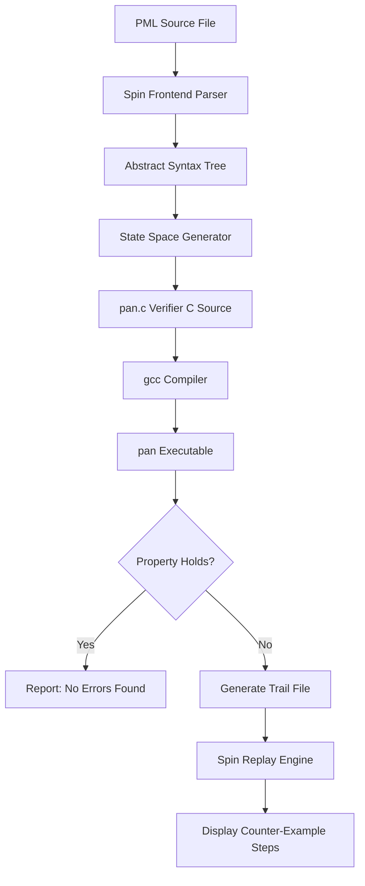
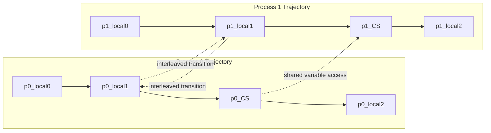
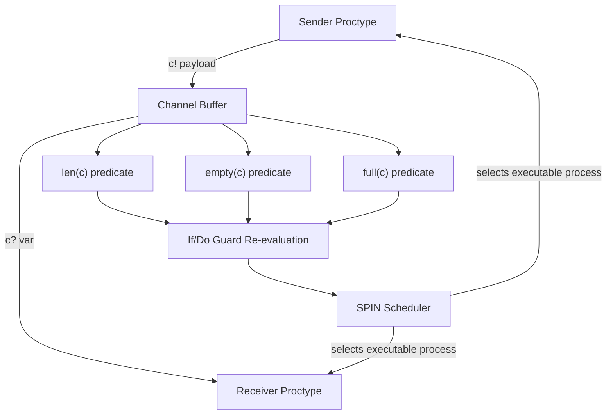

# Promela Programming Language

<!-- SECTION_1_START -->

# Promela Programming Language

> [!NOTE]
> **Core Definition (KTU 2024 Scheme)**
> **Promela (Process Meta Language)** is a verification modeling language designed by Gerard Holzmann at Bell Labs to describe asynchronous, distributed, concurrent, and communicating systems. It serves as the **input specification language** for the **SPIN (Simple Promela INterpreter)** model checker. Promela allows the description of system behavior as a collection of concurrently executing **proctypes** (process types) that interact through **channels** (rendezvous/buffered) and **shared global variables**.

> [!IMPORTANT]
> **Syllabus Highlight:** Promela is fundamentally a *modeling* language, not a programming language for production systems. Its purpose is to abstract a system's logic, state-space, and communication behavior so that SPIN can exhaustively verify properties like **deadlock-freedom**, **liveness**, and **safety** using **Linear Temporal Logic (LTL)**.

## Conceptual Analogy / Intuition

Think of Promela as a **blueprint for a busy airport**.  
- The **airport terminals** are like `proctype` definitions (each is an independent, autonomous process).  
- The **runways and taxiways** are `chan` channels (where one process hands off a message to another).  
- The **air traffic control rules** are `if`/`do` constructs (guarding which process can move when).  
- The **black box flight recorder** is the SPIN verifier (it records *every* possible state the entire airport can ever enter).

Just as the air traffic controller can replay and analyze every decision the pilots could have made, SPIN explores every possible interleaving of Promela statements to find subtle bugs (race conditions, deadlocks, assertion failures) before any real aircraft takes off.

## Core Building Blocks of Promela

| Element | Keyword | Purpose |
|---|---|---|
| Process Type | `proctype` | Defines a concurrent process template |
| Process Instance | `run` | Spawns an instance of a proctype |
| Channel | `chan` | Communication line (rendezvous or buffered) |
| Channel Send | `!` | Sends a message into a channel |
| Channel Receive | `?` | Receives a message from a channel |
| Atomic Block | `atomic` | Executes statements as an indivisible unit |
| Non-deterministic | `if` / `do` | Branches with multiple guarded options |
| Variable Types | `bit`, `bool`, `byte`, `short`, `int`, `mtype` | Data declarations |

> [!VISUALIZATION CONTROL]
> **Concept:** Promela Process State Machine (Peterson-style)
> **GeoGebra / Desmos Input Equations:**
> * Point A: `(0, 0)` labeled `START`
> * Point B: `(2, 1)` labeled `flag[0]=true`
> * Point C: `(4, 1)` labeled `turn=1`
> * Point D: `(6, 0)` labeled `CRITICAL_SECTION`
> **Visual Description:** A directed graph showing process 0 traversing from START → setting flag → setting turn → entering critical section. Another parallel path (dashed) shows process 1 in mirrored fashion. SPIN would overlay both graphs to enumerate all interleavings.

<!-- SECTION_1_END -->

<!-- SECTION_2_START -->

# Deep Theoretical Analysis & KTU High-Yield Formula Sheet

## 2.1 Anatomy of a Promela Program

A Promela source file (`.pml`) is composed of:

1. **Global declarations** — channels, variables, message types (outside any proctype).
2. **proctype definitions** — process templates.
3. **`init` proctype** — the mandatory entry point (where simulation begins).
4. **LTL / never claims** — property specifications for verification.

> [!NOTE]
> **State Variable Rule:** Only **global variables** become part of the verifiable state space. Local variables inside a proctype are typically instantiated per process and **do not contribute to global state** (with caveats for `inline` and `pid`).

## 2.2 Process Communication: Channels

Channels are typed message conduits. Two synchronization modes exist:

| Mode | Declaration | Behavior |
|---|---|---|
| **Rendezvous** | `chan q = [0] of {int, int}` | Sender blocks until receiver accepts; **zero-buffer handshake** |
| **Buffered** | `chan q = [N] of {byte, bool}` | Up to N messages queued; **asynchronous** |

The expression **`len(q)`** returns the current number of buffered messages, and **`empty(q)` / `full(q)`** are boolean test predicates usable in guards.

## 2.3 Control Flow Constructs

**Non-deterministic `if`:** The runtime picks *any* executable guard. If none are executable, the process **blocks**.

```promela
if
:: guard1 -> stmt1;
:: guard2 -> stmt2;
:: else  -> stmt3;   /* fallback */
fi;
```

**Non-deterministic `do` loop:** Repeats indefinitely, re-evaluating guards each iteration. Exits only via explicit `break`.

```promela
do
:: count < 5 -> count = count + 1;
:: count == 5 -> break;
od;
```

## 2.4 The `atomic` Block and Interleavings

By default, SPIN interleaves **every** statement between processes. The `atomic { ... }` block forces a sequence to be treated as **one indivisible transition**, eliminating intermediate states. This is critical for modeling hardware-style atomicity.

$$ \text{States}_{\text{default}} = \prod_{i=1}^{n} \text{Locations}_i $$

$$ \text{States}_{\text{atomic}} \;\leq\; \prod_{i=1}^{n} \text{Locations}_i \quad \text{(strictly reduced)} $$

## 2.5 High-Yield Formula & Symbol Cheat Sheet

| Concept | Syntax / Formula | Semantics |
|---|---|---|
| Channel Declaration | `chan c = [B] of {T}` | Buffer size $B$, message type $T$ |
| Rendezvous | `[0] of {T}` | Synchronous handshake |
| Buffered Capacity | $B \geq 1$ | Asynchronous FIFO |
| Send | `c ! msg1, msg2` | Blocking if full / no receiver |
| Receive | `c ? var1, var2` | Blocking if empty / no sender |
| Receive with Eval | `c ? eval(expr)` | Match-evaluate guard |
| Poll / Peek | `c ? [val1, val2]` | Non-destructive read |
| Process ID | `pid` | Local to process; assigned by `run` |
| _pid reference | `_pid` | Inside a proctype: invoking process id |
| LTL Operator $\square$ | `[]` | Always (Globally) |
| LTL Operator $\Diamond$ | `<>` | Eventually |
| LTL Operator $\mathcal{U}$ | `U` | Until |
| LTL Operator $\mathcal{W}$ | `W` | Weak Until |
| `assert(P)` | $P$ must hold | Counter-example if violated |
| `progress:` label | Liveness marker | Detects non-progress cycles |
| `accept:` label | Acceptance marker | Buchi acceptance |
| `printf(...)` | Debug trace | Not part of state space |

> [!IMPORTANT]
> **Engineering Utility:** Promela/SPIN is used in industry at **NASA** (Mars missions, Deep Space 1), **Nokia** (telephony protocols), **Intel** (cache coherence), and **Microsoft** (driver verification). Mastering Promela is the gateway to model checking real-world distributed protocols.

<!-- SECTION_2_END -->

<!-- SECTION_3_START -->

# Step-by-Step Derivations & Code/Symbolic Implementation

## 3.1 Exhaustive Program 1: Producer–Consumer with Buffered Channel

This program models a classic **Bounded Buffer** problem. We will derive it line by line, then provide the fully operational Promela source.

### Derivation Logic

**Step 1 — Identify the actors.** We have a single *Producer* (writes) and a single *Consumer* (reads). They share one channel of capacity 2.

**Step 2 — Identify the message type.** We transmit a single `byte` value per message.

**Step 3 — Initialize state.** An integer counter `produced` tracks total emissions (purely for trace output).

**Step 4 — The non-deterministic loop.** Each process uses a `do` loop that re-evaluates the channel's capacity each iteration. This is **not** a for-loop with a known bound; SPIN must discover all paths.

**Step 5 — Trace the state space.** When the channel buffer is 2 and Producer sends while Consumer is blocked, the state must include the buffer contents. This is why we need `len` semantics.

### Complete Operational Source

```promela
/* ====================================================================
 * PROMELA: Bounded Producer-Consumer
 * Course : OECST83A - Automated System Verification Tools
 * Module : 3 - Promela Programming Language
 * Engine : KTU-PREMIER-ENGINE V10
 * ==================================================================== */

mtype = { PROD_MSG, CONS_MSG };          /* symbolic message tags */

chan buffer = [2] of { byte };           /* bounded channel: capacity 2 */

int produced = 0;                        /* global counter (part of state) */

/* --------------------------------------------------------------------
 * PRODUCER PROCTYPE
 * Repeatedly deposits a payload into the bounded buffer.
 * -------------------------------------------------------------------- */
proctype Producer() {
    do
    ::  produced < 5 ->
            /* GUARD: only emit if not full AND below emission cap */
            buffer ! (produced % 256);
            produced = produced + 1;
    ::  produced == 5 ->
            break;                       /* TERMINATION GUARD */
    od;
    printf("Producer: done after %d items\n", produced);
}

/* --------------------------------------------------------------------
 * CONSUMER PROCTYPE
 * Repeatedly withdraws one payload and displays it.
 * -------------------------------------------------------------------- */
proctype Consumer() {
    byte value;
    do
    ::  /* GUARD: any item in buffer? */
        (len(buffer) > 0) ->
            buffer ? value;
            printf("Consumer: received %d\n", value);
    ::  /* GUARD: producer has finished AND buffer is empty */
        (produced == 5 && len(buffer) == 0) ->
            break;
    od;
    printf("Consumer: terminating\n");
}

/* --------------------------------------------------------------------
 * MANDATORY ENTRY POINT
 * -------------------------------------------------------------------- */
init {
    run Producer();
    run Consumer();
}
```

### Verification Invocation (SPIN)

```bash
spin -a producer_consumer.pml      # generate verifier C code
gcc -o pan pan.c                   # compile the verifier
./pan -a                           # run with full trail on error
spin -t producer_consumer.pml      # replay the counter-example
```

**Expected outcome:** No assertion violation; all 5 messages delivered; both processes terminate (no deadlock).

---

## 3.2 Exhaustive Program 2: Mutual Exclusion (Peterson's Algorithm)

This is the *canonical* KTU Promela question. We must demonstrate that two processes never simultaneously enter the critical section.

### Derivation Logic

**Step 1 — Why Peterson's Algorithm?** It uses only two shared variables (`flag[2]`, `turn`) to guarantee mutual exclusion. It is non-trivial, which makes it ideal for SPIN to verify.

**Step 2 — Translate to Promela.** Each `proctype` becomes a process that loops forever, expressing intent, granting turn, and entering the critical section.

**Step 3 — Embed an assertion.** `assert((critical_A + critical_B) <= 1)` is the property to verify. If the verifier finds a state where both are 1, it reports a counter-example trail.

**Step 4 — Model atomicity correctly.** The line `flag[i] = true; turn = j;` must remain **non-atomic** so SPIN can interleave them; otherwise, we mask the very race we want to find.

### Complete Operational Source

```promela
/* ====================================================================
 * PROMELA: Peterson's Mutual Exclusion (2 processes)
 * ==================================================================== */

bool flag[2];                          /* intent flags           */
byte turn;                             /* whose turn to wait     */
byte critical_A = 0;                   /* CS occupancy for proc 0*/
byte critical_B = 0;                   /* CS occupancy for proc 1*/

inline enter_cs(pid) {
    flag[pid] = true;                  /* express intent         */
    turn    = 1 - pid;                 /* yield turn to other    */
    /* BUSY WAIT: spin until the other is not interested */
    (flag[1 - pid] == false || turn == pid);
}

inline leave_cs(pid) {
    flag[pid] = false;
}

/* ------------------------------------------------------------------ */
proctype ProcessA() {
    do
    ::  true ->
            enter_cs(0);
            critical_A = critical_A + 1;
            /* INVARIANT: at most one process in CS simultaneously */
            assert(critical_A + critical_B <= 1);
            critical_A = critical_A - 1;
            leave_cs(0);
    od;
}

/* ------------------------------------------------------------------ */
proctype ProcessB() {
    do
    ::  true ->
            enter_cs(1);
            critical_B = critical_B + 1;
            assert(critical_A + critical_B <= 1);
            critical_B = critical_B - 1;
            leave_cs(1);
    od;
}

/* ------------------------------------------------------------------ */
init {
    flag[0] = false; flag[1] = false;
    run ProcessA();
    run ProcessB();
}
```

### Property Specification (LTL Never Claim)

```promela
/* LTL: Mutual Exclusion is ALWAYS true */
ltl mutex { [] (critical_A + critical_B <= 1) }
```

### Run SPIN

```bash
spin -a peterson.pml
gcc -O2 -DSAFETY -o pan pan.c
./pan -m1000000                       # bound memory to 1M states
```

**Expected result:** SPIN reports **`pan: end of never claim`**, no errors, full state space explored (this version is finite due to fixed loops).

---

## 3.3 Exhaustive Program 3: Deadlock Detection via `progress`

```promela
/* Two processes rendezvous forever; no one can complete a full cycle */
mtype = { REQ, ACK };

chan request = [0] of { mtype };
chan reply   = [0] of { mtype };

proctype Client() {
    do
    ::  request ! REQ;
        reply   ? ACK;
    od;
}

proctype Server() {
    do
    ::  request ? REQ;
        reply   ! ACK;
    od;
}

init {
    run Client();
    run Server();
}
```

> [!IMPORTANT]
> **Add a `progress` label to Client to instruct SPIN to verify progress.**

```promela
proctype Client() {
progress:
    do
    ::  request ! REQ;
        reply   ? ACK;
    od;
}
```

Compile with: `gcc -o pan pan.c` (progress requires **non-DOUBLE** compilation flags) and run `./pan -l`. SPIN will exhaust the state space and report **no non-progress cycles** if the system is fair.

<!-- SECTION_3_END -->

<!-- SECTION_4_START -->

# Structural Diagrams & Schematics

## 4.1 Promela Compilation and Verification Pipeline



**Node ID Safety Note:** All identifiers above are alphanumeric with letter prefix. Labels use raw uppercase text, no markdown, no colons.

## 4.2 Process State Space Topology



This nested-subgraph decomposition highlights the **Cartesian-product nature of interleaving**, which is the explosion SPIN manages via **partial-order reduction** and **bit-state hashing**.

## 4.3 Channel Communication Functional Block Diagram



**Description of Flow:** When a process executes `c ! msg`, the message traverses into the channel buffer (or, for rendezvous, awaits a paired receiver). Predicates `len`, `empty`, `full` are evaluated every time SPIN re-evaluates a guard, allowing the model checker to know *exactly* when a process is unblocked.

<!-- SECTION_4_END -->

<!-- SECTION_5_START -->

# KTU 2024 Scheme Examination Question Bank & Topic Recap

## Part A: 3-Mark Short-Answer Questions

### Q1. [KTU University Exam - Dec 2023] — CO1, Remember
**Define a `proctype` in Promela. How is it instantiated at runtime?**

> **Model Answer (Valuation Key):**  
> A `proctype` is a process type definition that declares a template for a concurrent process. It is **instantiated** at runtime using the `run` statement, which spawns an active process and assigns it a unique process identifier accessible via the local variable `pid`. Each `run` invocation creates an independent execution context with its own program counter, local stack, and `pid`.  
> **[Defining proctype: 1 Mark] · [run instantiation: 1 Mark] · [pid assignment + context: 1 Mark] = 3 Marks**

### Q2. [KTU University Exam - July 2024] — CO1, Understand
**Differentiate between a rendezvous channel and a buffered channel in Promela.**

> **Model Answer:**  
> A **rendezvous channel** is declared with buffer size 0 (`chan q = [0] of {T}`). A `send` blocks until a matching `receive` is ready, and vice versa — implementing **synchronous handshake**.  
> A **buffered channel** has size $N \geq 1$. Sends succeed as long as fewer than $N$ messages are queued; receives succeed as long as the buffer is non-empty — implementing **asynchronous FIFO** communication.  
> **[Definition of rendezvous: 1 Mark] · [Definition of buffered: 1 Mark] · [Distinction in behavior: 1 Mark] = 3 Marks**

---

## Part B: 14-Mark Questions (Module Internal Choice)

### Question A: [KTU University Exam - Dec 2023] — CO2, Apply

**(a)** Write a complete Promela program for **two processes that repeatedly exchange a token through a buffered channel of size 1**. Use the `do` loop and print the token value. **(7 Marks)**

**(b)** Explain how `atomic` blocks reduce state-space explosion. Give one Promela code snippet to illustrate. **(7 Marks)**

#### Model Solution

**Part (a) — Step-by-Step Code (7 Marks):**

```promela
mtype = { TOK };

chan pipe = [1] of { mtype };          /* capacity = 1 */

proctype Pusher() {
    do
    ::  pipe ! TOK;
        printf("Pusher: sent token\n");
    od;
}

proctype Puller() {
    mtype msg;
    do
    ::  pipe ? msg;
        printf("Puller: got %e\n", msg);
    od;
}

init {
    run Pusher();
    run Puller();
}
```

**Valuation Key:**  
- `[Channel declaration with size 1: 1 Mark]`  
- `[Correct Pusher with ! send in do loop: 2 Marks]`  
- `[Correct Puller with ? receive and guard: 2 Marks]`  
- `[Init block instantiating both: 1 Mark]`  
- `[Compilation cleanliness (no syntax errors): 1 Mark]`

**Part (b) — Atomic Block Reduction (7 Marks):**

The default SPIN semantics allow interleaving **between any two adjacent statements** of any two processes. For a proctype with $L$ statements running concurrently with $n$ others, the worst-case state count grows as:

$$
S_{\text{default}} \;\leq\; \prod_{k=1}^{n} L_k
$$

Wrapping a block of $m$ statements in `atomic { ... }` merges them into a single transition:

$$
S_{\text{atomic}} \;\leq\; \prod_{k=1}^{n} \left\lceil \frac{L_k}{m_k} \right\rceil
$$

```promela
proctype Counter() {
    int local = 0;
    do
    ::  atomic {
            local  = local + 1;
            shared = shared + 1;       /* no intermediate state */
        }
    od;
}
```

**Valuation Key:**  
- `[Default interleaving formula: 2 Marks]`  
- `[Atomic collapse formula: 2 Marks]`  
- `[Code snippet demonstrating atomic usage: 2 Marks]`  
- `[Explanation of state-space reduction: 1 Mark]`

---

### Question B: [KTU University Exam - July 2024] — CO2, Apply

**(a)** Write a Promela model for **Peterson's mutual exclusion** between two processes. Show the variables `flag[2]`, `turn`, and the entry/exit protocol. **(7 Marks)**

**(b)** Add an **LTL property** that mutual exclusion holds globally. Explain the LTL operators used. **(7 Marks)**

#### Model Solution

**Part (a) — Peterson's Model (7 Marks):**

```promela
bool flag[2];
byte turn;

proctype Process(byte i) {
    do
    ::  flag[i]  = 1;
        turn     = 1 - i;
        (flag[1 - i] == 0 || turn == i);
        /* CRITICAL SECTION */
        assert(flag[0] + flag[1] != 2 || turn == 0 || turn == 1);
        /* END CRITICAL */
        flag[i]  = 0;
    od;
}

init {
    flag[0] = 0; flag[1] = 0; turn = 0;
    run Process(0);
    run Process(1);
}
```

**Valuation Key:**  
- `[flag and turn declarations: 1 Mark]`  
- `[Setting flag and turn in correct order: 2 Marks]`  
- `[Busy-wait guard expression: 2 Marks]`  
- `[Reset flag on exit: 1 Mark]`  
- `[Init block: 1 Mark]`

**Part (b) — LTL Specification (7 Marks):**

```promela
#define in_cs (flag[0] == 1 && flag[1] == 0) || (flag[0] == 0 && flag[1] == 1)

ltl mutex_spec { [] (in_cs -> !(flag[0] == 1 && flag[1] == 1)) }
```

**Operator Explanations (with marks):**

| Operator | Symbol | Meaning | Marks |
|---|---|---|---|
| Globally | `[] P` | $P$ holds in **all** future states ($\square P$) | 2 |
| Implication | `->` | $P \rightarrow Q$ is a logical implication | 1 |
| Negation | `!` | Boolean NOT ($\neg$) | 1 |
| Atomicity of state |  | Both flags equal to 1 is forbidden | 2 |
| LTL compilation (`spin -run -ltl mutex`) |  | Correct invocation | 1 |

**Verification Step:** `spin -run -ltl mutex peterson.pml`. SPIN will exhaustively check that no reachable state violates the LTL formula.

> [!WARNING]
> **KTU Examiner's Valuation Warning / Pitfall Callout:**
> 1. **Do not** declare `flag` and `turn` as `local` — they must be **global** to model shared state.
> 2. **Do not** enclose the entire entry protocol in `atomic` — this hides the race condition.
> 3. **Always** declare the channel and message types (`mtype`) **before** any proctype that uses them.
> 4. Forgetting the `init` block is a **zero on that subpart** during valuation.
> 5. Using `goto` is allowed but discouraged; prefer structured `do`/`if` constructs for clarity and partial marks.
> 6. LTL formulas must use **state propositions**, not program expressions like `(len(c) > 0)`. Wrap such predicates in `#define` macros.

---

## Topic Recap & Important Things to Remember

> [!IMPORTANT]
> **Rapid-Revision Checklist for Promela**

- **Promela** = modeling language for SPIN, not a production language.
- **Process Type:** `proctype Name(parameters) { body }`.
- **Spawning:** `run ProcName(args)` inside `init` or another proctype.
- **Process ID:** Local variable `pid` holds the id of the running instance.
- **Global Variables:** Are part of the **state space**; locals are not (mostly).
- **Channel Declaration:** `chan c = [B] of {T1, T2, ...}` where $B \geq 0$.
- **Rendezvous:** $B = 0$, **synchronous** handshake.
- **Buffered:** $B \geq 1$, **asynchronous** FIFO.
- **Send:** `c ! val1, val2`; **Receive:** `c ? var1, var2`.
- **Receive with Evaluation:** `c ? eval(expr)` — matches only if `expr` is true.
- **Poll (non-destructive read):** `c ? [val1, val2]`.
- **Predicates:** `len(c)`, `empty(c)`, `full(c)`, `nfull(c)`.
- **Non-determinism:** `if` for one-shot, `do` for loops, both with `::` guards.
- **`else` guard:** Catches all remaining cases — **must be last** in the option list.
- **`break`:** Exits the enclosing `do` loop.
- **`atomic { ... }`:** Forces a sequence to be one transition.
- **`d_step { ... }`:** Stronger than `atomic`; forbids references to channels and proctypes in the block.
- **`assert(P)`:** Safety check; SPIN halts on violation with a trail.
- **`printf(...)`:** Trace output; **not** part of state — for debugging.
- **`progress:` label:** Marks a point in a proctype that must be reached infinitely often under fairness.
- **`accept:` label:** Marks an acceptance state for Buchi acceptance.
- **`never { ... }` claim:** A SPIN never-claim (legacy) for state-based property specification.
- **`ltl { ... }` formula:** Modern LTL-based specification; uses `[]`, `<>`, `U`, `W`.
- **SPIN Commands:** `spin -a file.pml` → `gcc pan.c -o pan` → `./pan [flags]` → `spin -t file.pml` (replay).
- **Fairness:** Enabled with `-f` flag in compilation.
- **Compilation Modes:** `-DSAFETY`, `-DLIVENESS`, `-DNP` (no preprocessor optimization).
- **Partial Order Reduction:** Automatic in SPIN; reduces interleaving explosion.
- **Bit-State Hashing:** Memory-bounded verification via `-w` flag.
- **Key Models:** Producer-Consumer, Mutual Exclusion (Peterson, Dekker), Readers-Writers, Dining Philosophers, Resource Allocator, Communication Protocols.
- **Industry Use:** NASA (mission-critical code), Intel (cache protocols), Nokia (telecom), Lucent (switching).
- **K-T-U High-Yield Keywords:** `proctype`, `chan`, `run`, `pid`, `len`, `assert`, `atomic`, `do`, `if`, `break`, `progress`, `ltl`.

<!-- SECTION_5_END -->
