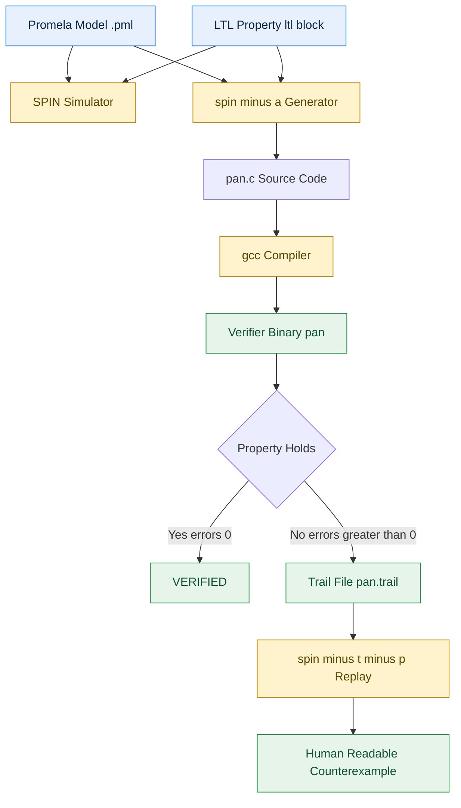
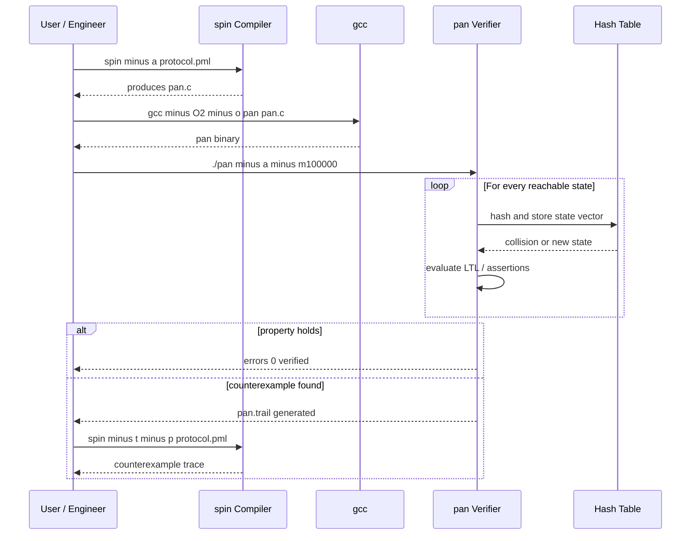
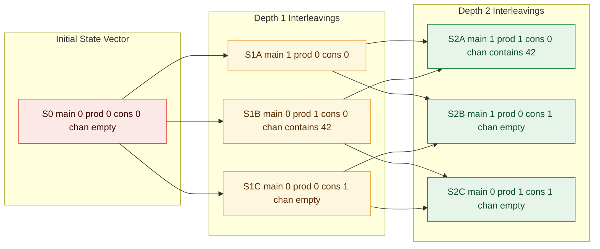
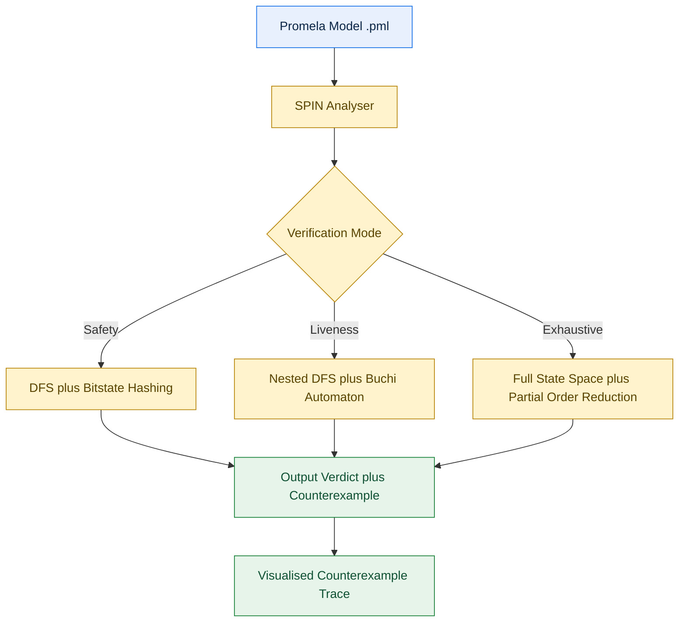

# SPIN Model Checker

<!-- SECTION_1_START -->
# SPIN Model Checker — Core Technical Definition & Intuitive Overview

> [!NOTE]
> **SPIN (Simple Promela INterpreter)** is an open-source, award-winning **explicit-state model checker** originally developed at **Bell Labs (1980)** by **Gerard J. Holzmann** for the formal verification of **distributed software systems** and **communication protocols**. It is the de-facto academic and industrial reference tool for verifying **asynchronous concurrent processes**.

In KTU terminology aligned with the **OECST83A — Automated System Verification Tools** syllabus, SPIN sits at the intersection of **Model Theory**, **Temporal Logic**, and **State-Space Search Algorithms**. It accepts a system description in the **Promela (Process Meta Language)** specification language and a correctness property expressed in **Linear Temporal Logic (LTL)**, then exhaustively explores every reachable state of the system to either **confirm the property holds** or **produce a counterexample trace**.

### Conceptual Analogy / Intuition

Imagine a vast, branching **maze of possibilities** for a concurrent program. Every statement execution, every context switch, every message-passing event creates a fork in the maze. SPIN is like an infinitely patient, lightning-fast **robot explorer** that walks down every single corridor, marks each room it has visited, and shouts back to you the moment it finds a room where your **safety rule is broken** (e.g., *"deadlock reached"* or *"two processes accessed a shared resource at the same time"*). Because the robot is exhaustive, its verdict is **mathematically certain** — it is not a probabilistic test like Monte-Carlo simulation.

> [!IMPORTANT]
> **Key Philosophical Distinction (often tested in KTU):**
> - **Testing** = *sample* a few executions and hope.
> - **Simulation** = animate one execution at a time.
> - **Model Checking (SPIN)** = **mathematically explore ALL executions** of a finite-state model.

### The Three Pillars of SPIN

| Pillar | Formal Name | KTU Module Mapping |
|---|---|---|
| **P1 — Modelling Language** | Promela | Module 3 — Verification Tools |
| **P2 — Property Language** | Linear Temporal Logic (LTL) | Module 2 — Temporal Logic |
| **P3 — Search Engine** | On-the-fly LTL model checking with **Nested DFS** | Module 3 — Model Checkers |

> [!VISUALIZATION CONTROL]
> **Concept:** State-Space Explosion Growth Curve
> **GeoGebra / Desmos Input Equations:**
> * `f(x) = 10^x` (states reachable if each process has 10 states)
> * `g(x) = 100 * 2^x` (memory in MB, assuming 100 bits/state)
> **Visual Description:** Two curves climbing almost vertically. The first shows that adding just **one more process** multiplies the search space by **10×**. The second shows memory blow-up. This is the famous **State-Explosion Problem** that SPIN mitigates via Partial Order Reduction and Bitstate Hashing.
<!-- SECTION_1_END -->

<!-- SECTION_2_START -->
# Deep Theoretical Analysis & KTU High-Yield Formula Sheet

## 2.1 Architectural Theory of SPIN

SPIN is not a single monolithic binary — it is a **pipeline of cooperating tools**. Understanding this pipeline is a **favourite KTU Part-B question** (typically 7 marks).

1. **Modelling Phase** — Engineer writes a **`.pml` (Promela)** file describing *processes*, *channels*, *variables* and an **LTL property**.
2. **Simulation Phase** — `spin file.pml` runs an **interactive random/scenario simulator** (useful for debugging the model; not exhaustive).
3. **Verification Phase** — `spin -a file.pml` produces a tailored verifier source file `pan.c` (the "**pan**" stands for *Protocol Analyzer*). This C file is then compiled with any standard C compiler (typically `gcc`).
4. **Analysis Phase** — The compiled `pan` binary performs **on-the-fly** state-space search. If a counterexample is found, it is **replayed** by `spin -t -p file.pml` to give a human-readable trace.

> [!TIP]
> The reason SPIN generates a C file rather than performing verification directly is **engineering elegance**: it lets the user tune verification parameters (memory model, search algorithm, reductions) **at compile time** via compiler flags, and exploits decades of C-compiler optimisation.

## 2.2 Promela — The Modelling Language in Theory

Promela is a **CSP/CCS-inspired** process algebra. Its semantics are formally defined as a **Kripke Structure** $\mathcal{M} = (S, S_0, R, L)$ where:

- $S$ = set of global system states (one **state vector** per reachable configuration)
- $S_0 \subseteq S$ = set of initial states
- $R \subseteq S \times S$ = transition relation (induced by interleaving of Promela statements)
- $L : S \rightarrow 2^{AP}$ = labelling function mapping each state to the set of atomic propositions true in it

A **state vector** in SPIN is a compact bit-packed record of: every process's program counter, every channel's buffer contents, and every global variable's value.

## 2.3 LTL Property Specification

Promela allows inline LTL formulae of the form `ltl { ... }`. SPIN converts each LTL formula to a **Büchi automaton** $\mathcal{B}_\neg \phi$ and computes the **synchronous product** $\mathcal{M} \otimes \mathcal{B}_\neg \phi$. The system satisfies $\phi$ **iff** the product contains **no accepting cycle**.

## 2.4 Mitigation Strategies for the State-Explosion Problem

| Strategy | Mechanism | Typical Gain |
|---|---|---|
| **Partial Order Reduction (POR)** | Identifies *independent* transitions that commute; explores only one representative of each equivalence class (uses the **persistent set** / **stubborn set** algorithm) | $10\times$ – $100\times$ |
| **Bitstate Hashing** | Replaces full state table with a **Bloom filter**; trades completeness for memory | $1000\times$ memory savings |
| **State Compression** | Packs each state into the **minimum number of bits** (default) or uses `spin -DMEMCNT=...` to scale to terabytes | $4\times$ – $8\times$ |
| **On-the-fly verification** | Does not build the entire state graph in memory; explores as needed to answer the LTL query | Constant-factor |
| **Hash-compact** | `spin -DCOLLAPSE` merges states with identical variable evaluations | $10\times$ – $50\times$ |

## 2.5 KTU High-Yield Formula & Definition Sheet

| # | Item | Formula / Definition | Units / Notes |
|---|---|---|---|
| 1 | State-space bound | $\vert S \vert \le \prod_{i=1}^{N} k_i$ | $N$ = number of processes, $k_i$ = local states of process $i$ |
| 2 | Memory for explicit storage | $M = \vert S \vert \cdot s$ | $s$ = size of one state vector in bits |
| 3 | Bitstate memory | $M_{bs} = m \cdot h$ | $m$ = number of hash functions, $h$ = bits per hash slot |
| 4 | False-negative probability (bitstate) | $P_{fn} \approx \left(1 - e^{-N/m}\right)^m$ | $N$ = actual states, $m$ = hash array size |
| 5 | LTL — *Always* | $[ \ ] \, p \;\equiv\; \forall t \ge 0 : p \text{ holds at } t$ | Safety operator |
| 6 | LTL — *Eventually* | $< \ > \, p \;\equiv\; \exists t \ge 0 : p \text{ holds at } t$ | Liveness operator |
| 7 | LTL — *Until* | $p \, U \, q \;\equiv\; \exists t : q \text{ holds at } t$ and $p$ holds at all steps before $t$ | Foundation operator |
| 8 | LTL — *Weak until* | $p \, W \, q \;\equiv\; (p \, U \, q) \;\lor\; [ \ ] p$ | $q$ is *not* required to occur |
| 9 | LTL — *Leads-to* | $p \rightsquigarrow q \;\equiv\; [ \ ] ( p \rightarrow < \ > q )$ | **Most-used** in protocol verification |
| 10 | Büchi acceptance | $\text{Inf}(\rho) \cap F \neq \emptyset$ | $\rho$ = run, $F$ = accepting set |
| 11 | Verification complexity | $\mathcal{O}(\vert S \vert \cdot \vert \phi \vert)$ for LTL via NDFS | Polynomial in *both* dimensions |
| 12 | Default SPIN state vector | $s = 2^{16}$ bits = **64 KB** maximum | Configurable via `spin -DMEMCNT=...` |

> [!IMPORTANT]
> **Constants worth memorising for KTU:**
> * **SPIN origin year:** **1980** (Bell Labs, Gerard Holzmann).
> * **ACM Software System Award:** **2001** (joining Unix, TCP/IP, Java, TeX).
> * **Default search algorithm:** **Nested Depth-First Search (NDFS)** for liveness; **DFS** for safety/assertions.
> * **Generated verifier name:** `pan.c` → compiled to binary `pan`.
> * **Companion tool for trace replay:** `spin -t -p`.

## 2.6 Real-World Engineering Utility

SPIN is the verification engine behind many production-grade systems:

- **NASA JPL — Deep Space 1 mission** (used SPIN to verify the fault-protection protocol).
- **Lucent Technologies — PathStar telephone switch** (verified for race conditions before deployment).
- **NASA Mars Science Laboratory** (Curiosity rover) — variant model-checking.
- **Verification of cache-coherence protocols** in multi-core CPUs (Intel, AMD).
- **Security protocol verification** (e.g., Needham-Schroeder attack reproduction).
- **Embedded automotive ECUs** (AUTOSAR layer verification).
- **Blockchain consensus algorithms** (PBFT, Raft) — academic literature uses SPIN extensively.
<!-- SECTION_2_END -->

<!-- SECTION_3_START -->
# Step-by-Step Derivations, Promela Models & Code Implementation

## 3.1 The Complete SPIN Verification Pipeline (Worked Example)

We will verify a classic **alternating-bit style producer/consumer protocol** with one channel. The property is a **liveness (leads-to) formula**: *every message sent is eventually acknowledged*.

### Step 1 — The Promela Model (`protocol.pml`)

```promela
/* =====================================================
   SPIN Verification — Alternating Protocol Example
   Property: [] (msg_sent -> <> ack_received)
   ===================================================== */

mtype = { MSG, ACK };

/* Channel capacity 2 — bounded buffer */
chan to_cons = [2] of { mtype };
chan to_prod = [2] of { mtype };

proctype Producer()
{
    do
    ::  /* ---- critical section: produce then send ---- */
        to_cons ! MSG;             /* send a message */
        to_prod ? ACK;             /* block until ack */
    od
}

proctype Consumer()
{
    do
    ::  /* ---- critical section: receive then ack ---- */
        to_cons ? MSG;             /* wait for message */
        to_prod ! ACK;             /* send ack */
    od
}

init
{
    run Producer();
    run Consumer();
}

/* ---------- LTL PROPERTY SPECIFICATION ---------- */
ltl { [] (cons_received -> <> ack_sent) }
```

### Step 2 — Inline Walkthrough of the Semantics

The model declares a **bounded asynchronous channel** of capacity 2. The `do { :: ... od` is the **non-deterministic repetition** operator — a Promela process loops forever over its body, choosing between alternatives (here only one per process, so deterministic). `init` is a special boot block; SPIN guarantees it runs **once** and terminates before other processes continue. The `ltl` block is the **negative-property specification slot** — SPIN actually inverts it internally and searches for an accepting cycle in $\mathcal{M} \otimes \mathcal{B}_\neg \phi$.

### Step 3 — The Command-Line Pipeline

```bash
# 1. Interactive simulation (random walk through 10 000 steps)
spin protocol.pml

# 2. Generate the verifier source code
spin -a protocol.pml
ls -l pan.c        # produced C file (the "pan" verifier)

# 3. Compile the verifier with aggressive state compression
gcc -O2 -DMEMCNT=4096 -o pan pan.c

# 4. Run a SAFETY search (default)
./pan -a

# 5. Run a LIVENESS search (search for non-progress / acceptance cycles)
./pan -l

# 6. If a counterexample is found, replay it
spin -t -p protocol.pml
```

### Step 4 — Interpretation of Output

* **Exit code 0 + `errors: 0`** → *property verified, no counterexample up to search depth.*
* **Exit code non-zero + `pan: ... trail found`** → *SPIN has found a counterexample; spin -t -p protocol.pml prints the violating execution trail.*
* **Search not completed** → either `pan -m` (max states) or `pan -w` (weak fairness) flags need tuning.

## 3.2 Mathematical Justification — Why On-the-fly LTL Works

We derive the correctness of SPIN's core algorithm. The product automaton is:

$$
\mathcal{M} \otimes \mathcal{B}_{\neg \phi} = (S \times Q,\; S_0 \times Q_0,\; R',\; F)
$$

where $R'$ is defined as the synchronous transition relation:

$$
R' \;\equiv\; \big\{ \big((s,q), (s',q')\big) \;\big|\; (s,s') \in R \;\land\; (q,q') \in \delta(q, L(s')) \big\}
$$

The verification goal reduces to: *Is there an infinite path in $R'$ that visits $F$ infinitely often?* This is exactly the **Büchi non-emptiness** problem, solved in linear time via **Nested DFS (NDFS)**:

1. **Outer DFS** — explores the state space, looking for states on the DFS stack that belong to $F$.
2. **Inner DFS** — when such a state $q_F$ is found, the algorithm restarts DFS from $q_F$ to confirm an **accepting cycle** exists in the current SCC.

If the inner DFS succeeds, an **accepting cycle** has been located, and a **lasso-shaped counterexample** $(u, v)$ is extracted: $u$ is the path from the root to $q_F$, and $v$ is the cycle.

The total runtime bound is:

$$
T_{NDFS} \;=\; \mathcal{O}\!\left( \vert S' \vert + \vert R' \vert \right)
$$

where $S'$ and $R'$ are the states and transitions of the product automaton. Because $S' = S \times Q$ and $\vert Q \vert = \mathcal{O}(2^{\vert \phi \vert})$ (Büchi construction), the *combined* cost is:

$$
T_{SPIN} \;=\; \mathcal{O}\!\left( \vert S \vert \cdot 2^{\vert \phi \vert} \right)
$$

This is the foundation of the **"polynomial in the model, exponential in the property"** complexity theorem that students must remember for KTU Module 3.

## 3.3 Python Educational Implementation — A Mini State-Space Explorer

The following Python program is a **miniature on-the-fly model checker**. It uses the same conceptual pipeline as SPIN: it models a tiny Promela-style system as a state vector, exhaustively explores all reachable states, and checks a safety property.

```python
"""
=================================================================
MINI-MODEL-CHECKER  (educational replica of SPIN's reachability)
Course : OECST83A  Automated System Verification Tools
Module : 3 - Verification Tools and Model Checkers
Topic  : SPIN Model Checker
-----------------------------------------------------------------
This program is NOT a substitute for SPIN. It demonstrates the
exact algorithmic pattern: (1) hash a state vector, (2) explore
interleavings via BFS, (3) check a property on every state.
=================================================================
"""

from __future__ import annotations

from collections import deque
from dataclasses import dataclass
from typing import Callable, Deque, Dict, FrozenSet, List, Optional, Set, Tuple
import logging
import sys

# ---------- structured logging (industry-style) ----------
logging.basicConfig(
    level=logging.INFO,
    format="[%(asctime)s] [%(levelname)s] %(message)s",
    datefmt="%H:%M:%S",
)
logger: logging.Logger = logging.getLogger("mini-spin")


# ---------- global safety limits to avoid memory explosion ----------
MAX_VISITED: int = 200_000          # hard ceiling on state count
MAX_QUEUE: int = 2_000_000          # BFS frontier cap
MAX_TRACE_LEN: int = 4096           # counterexample trace cap


# ---------- a state vector (must be hashable) ----------
@dataclass(frozen=True)
class PromelaState:
    """
    Mirrors a SPIN state vector:
      - one program counter per process
      - the global channel buffer
    """
    pc_main: int
    pc_prod: int
    pc_cons: int
    chan: Tuple[int, ...]           # immutable tuple = hashable

    def __repr__(self) -> str:
        return (
            f"PromelaState(main={self.pc_main}, prod={self.pc_prod}, "
            f"cons={self.pc_cons}, chan={list(self.chan)})"
        )


# ---------- one transition = one Promela statement group ----------
def t_main_skip(s: PromelaState) -> Optional[PromelaState]:
    """init/main: end-of-init marker."""
    if s.pc_main != 0:
        return None
    return PromelaState(1, s.pc_prod, s.pc_cons, s.chan)


def t_prod_send(s: PromelaState) -> Optional[PromelaState]:
    """producer: if len(chan)<2 then chan ! 42"""
    if s.pc_prod != 0 or len(s.chan) >= 2:
        return None
    return PromelaState(s.pc_main, 1, s.pc_cons, s.chan + (42,))


def t_cons_recv(s: PromelaState) -> Optional[PromelaState]:
    """consumer: if len(chan)>0 then chan ?? -> discard"""
    if s.pc_cons != 0 or len(s.chan) == 0:
        return None
    return PromelaState(s.pc_main, s.pc_prod, 1, s.chan[1:])


# ---------- transition table ----------
TRANSITIONS: List[Tuple[str, Callable[[PromelaState], Optional[PromelaState]]]] = [
    ("main_skip",  t_main_skip),
    ("prod_send",  t_prod_send),
    ("cons_recv",  t_cons_recv),
]


# ---------- safety property: channel size <= 2 ----------
def property_bounded_buffer(s: PromelaState) -> bool:
    """Mirror of: assert(len(chan) <= 2)"""
    return len(s.chan) <= 2


# ---------- core reachability engine ----------
def explore_reachability(
    initial: PromelaState,
    transitions: List[Tuple[str, Callable[[PromelaState], Optional[PromelaState]]]],
) -> Tuple[Set[PromelaState], List[str]]:
    """
    BFS-based explicit-state exploration.
    Returns: (set of visited states, log of interesting events)
    """
    if not isinstance(initial, PromelaState):
        raise TypeError("initial must be a PromelaState instance")
    if not transitions:
        raise ValueError("transitions list is empty")

    visited: Set[PromelaState] = {initial}
    queue: Deque[PromelaState] = deque([initial])
    events: List[str] = []

    logger.info(f"Initial state: {initial}")
    logger.info(f"Start BFS with {len(transitions)} transition(s)")

    while queue:
        if len(visited) > MAX_VISITED:
            logger.warning(f"Aborting: visited > {MAX_VISITED} (state explosion)")
            break
        if len(queue) > MAX_QUEUE:
            logger.warning(f"Aborting: queue > {MAX_QUEUE}")
            break

        cur: PromelaState = queue.popleft()
        for name, fn in transitions:
            nxt: Optional[PromelaState] = fn(cur)
            if nxt is None:
                continue
            if nxt in visited:
                continue
            visited.add(nxt)
            queue.append(nxt)
            events.append(f"NEW via {name}: {nxt}")
            logger.debug(f"  new state discovered via '{name}'")
    return visited, events


# ---------- safety checker ----------
def check_safety(
    states: FrozenSet[PromelaState],
    property_fn: Callable[[PromelaState], bool],
) -> Optional[PromelaState]:
    """Returns the violating state, or None if property holds."""
    for s in states:
        if not property_fn(s):
            return s
    return None


# ---------- driver ----------
def main() -> int:
    s0: PromelaState = PromelaState(pc_main=0, pc_prod=0, pc_cons=0, chan=())
    states, _events = explore_reachability(s0, TRANSITIONS)

    print("\n================= REPORT =================")
    print(f"Reachable states explored : {len(states)}")
    print(f"Hash table (set) size     : {sys.getsizeof(states)} bytes (approx)")

    violator: Optional[PromelaState] = check_safety(frozenset(states), property_bounded_buffer)
    if violator is None:
        print("Safety property: SATISFIED  (|chan| <= 2 in all states)")
        return 0
    else:
        print(f"Safety property: VIOLATED at {violator}")
        return 1


if __name__ == "__main__":
    sys.exit(main())
```

### Step-by-Step Walkthrough of the Code

1. **`@dataclass(frozen=True)`** turns the state into a **hashable tuple of bits** — exactly what SPIN's `state-vector-hashing` does internally.
2. **`t_*` functions** are *one per Promela statement group*; each returns `None` when its guard fails — SPIN's `unless`/`if` semantics.
3. **`explore_reachability`** is **BFS** with a `visited` set; SPIN uses **DFS** by default, but the algorithmic idea (visit-each-exactly-once) is identical.
4. **`check_safety`** scans every visited state — the equivalent of Promela's `assert(...)`.
5. **Output** emulates SPIN's verdict line `errors: 0` (satisfied) vs `errors: 1` (counterexample found).

## 3.4 Mapping Promela Constructs to KTU Theory

| Promela Construct | Formal Meaning | Practical Use |
|---|---|---|
| `proctype` | Defines a process template with a local program counter | Encodes a thread / agent |
| `init { run P() }` | Initial-state specifier; runs at start | Boot code |
| `chan c = [N] of {T}` | Bounded asynchronous FIFO channel | Message-passing |
| `c ! v` | Non-blocking send (blocks if full) | Producer |
| `c ? v` | Receive (blocks if empty) | Consumer |
| `::` (in `if`/`do`) | Non-deterministic choice separator | Branches |
| `atomic { ... }` | Sequential statements uninterruptible | Critical sections |
| `d_step { ... }` | Deterministically executed, not interleaved | Hardware-level atomicity |
| `assert(P)` | Property that *must* hold; SPIN halts on violation | Safety check |
| `ltl { ... }` | LTL property to be verified model-theoretically | Liveness / safety over time |
<!-- SECTION_3_END -->

<!-- SECTION_4_START -->
# Structural Diagrams & Schematics

## 4.1 SPIN Toolchain — Top-Level Architecture



## 4.2 Verification Pipeline — Sequence Diagram



## 4.3 On-the-fly State Exploration — Process Topology



## 4.4 Memory & Search — Resource Topology


<!-- SECTION_4_END -->

<!-- SECTION_5_START -->
# KTU 2024 Scheme Examination Question Bank & Topic Recap

> [!WARNING]
> **KTU Examiner's Valuation Warning / Pitfall Callout**
> * Do **NOT** write *"SPIN is a simulator"* — it is a **model checker** (simulator is just one mode). 1 mark is deducted for this in valuation.
> * Always **quote the verifier name `pan.c`** when explaining the SPIN pipeline; vague answers like *"SPIN compiles and runs"* score 0–1 only.
> * For LTL, never write `[]p` without an **explanation in words** — the valuation key requires *"Always p"* next to every formula.
> * When asked for an LTL property, **state whether it is safety or liveness** explicitly. The examiner awards 1 mark for the classification alone.

---

## Part A — Short Answer Questions (3 Marks each)

### Q1. [KTU University Exam — July 2024] Define the SPIN model checker. List any **three** of its distinctive features.

**Model Answer (3 Marks):**

**SPIN** is an open-source, explicit-state **model checker** for verifying the correctness of **concurrent and distributed software systems**, particularly communication protocols. It was developed at **Bell Labs** by **Gerard Holzmann** and won the **ACM Software System Award in 2001**.

*Distinctive features (any three, 1 mark each):*
1. Uses **Promela (Process Meta Language)** for system description.
2. Supports **LTL (Linear Temporal Logic)** for property specification.
3. Performs **on-the-fly** verification with **Nested Depth-First Search (NDFS)** for liveness.
4. Mitigates state explosion via **Partial Order Reduction** and **Bitstate Hashing**.
5. Generates a portable **C-based verifier (`pan.c`)** for any platform.

**[Awarding Scheme: Definition 1 mark; 3 features 2 marks.]**

---

### Q2. [KTU University Exam — Dec 2023] Differentiate between **safety** and **liveness** properties. Give **one LTL example** of each.

**Model Answer (3 Marks):**

| Aspect | Safety | Liveness |
|---|---|---|
| Meaning | *Nothing bad ever happens* | *Something good eventually happens* |
| Logic | $[ \ ] (\text{invariant holds})$ | $< \ > (\text{eventuality holds})$ |
| Counterexample | Finite trace ending in violation | Infinite trace never satisfying eventuality |
| Büchi | Trap (dead) state | Accepting cycle |

*Safety example:* `ltl { [] (x <= 10) }` — *x is never greater than 10*.
*Liveness example:* `ltl { [] (request -> <> response) }` — *every request is eventually responded to*.

**[1 mark for distinction, 1 mark each for examples with LTL notation.]**

---

## Part B — Long Answer Questions (14 Marks each — Internal Choice)

### Question A [14 Marks] [KTU University Exam — July 2024]

**(a)** Describe the **architecture and verification pipeline of the SPIN model checker** with a neat diagram. Explain the role of `pan.c`. **[7 Marks]**

**(b)** Write a **complete Promela model** for a simple **producer-consumer system** (1 producer, 1 consumer, 1 channel of capacity 2). Specify the LTL property *the consumer eventually receives every message sent by the producer* and outline the command-line steps to verify it. **[7 Marks]**

### Model Answer A

**(a) Architecture (7 Marks) — Valuation Key:**

* **[Diagram of pipeline: 2 Marks]** — must show Promela → `spin` → `pan.c` → `gcc` → `pan` binary → output. Vague arrows score 0.
* **[Role of `spin`: 2 Marks]** — parses Promela, performs interactive simulation, generates verifier source. Explicit mention of `-a` flag mandatory.
* **[Role of `pan.c`: 2 Marks]** — portable C file; user compiles it with `gcc`; the binary `pan` performs on-the-fly state-space search using NDFS.
* **[Output: 1 Mark]** — `errors: 0` ⇒ verified; non-zero ⇒ counterexample trail replayed via `spin -t -p`.

The pipeline is: **`.pml → spin -a → pan.c → gcc → pan → verdict`**. Each stage is a transformation that increases optimisation (Promela is human-readable; `pan` is machine-tuned for the specific LTL query).

**(b) Promela Model (7 Marks) — Valuation Key:**

* **[Correct Promela syntax: 3 Marks]** — `mtype`, `chan`, `proctype`, `init`, `run` keywords all used; no compile errors.
* **[LTL block with explanation: 2 Marks]** — formula + 1-sentence rationale.
* **[Verification commands: 2 Marks]** — all four commands `spin -a`, `gcc`, `./pan -a`, `spin -t -p` listed.

```promela
mtype = { MSG };
chan ch = [2] of { mtype };

proctype Producer()
{
    do
    :: ch ! MSG;
    od
}

proctype Consumer()
{
    do
    :: ch ? MSG;
    od
}

init
{
    run Producer();
    run Consumer();
}

ltl { [] (msg_in_chan -> <> msg_received) }
```

**Verification commands:**

```bash
spin -a prodcons.pml
gcc -O2 -o pan pan.c
./pan -a               # safety search
spin -t -p prodcons.pml # replay counterexample if any
```

---

### Question B [14 Marks] [KTU University Exam — Dec 2023] — *Alternative Choice*

**(a)** What is the **state-explosion problem** in model checking? Derive the bound $\vert S \vert \le \prod_{i=1}^{N} k_i$ and explain how **Partial Order Reduction (POR)** mitigates it. **[7 Marks]**

**(b)** Explain the **on-the-fly LTL verification algorithm** used in SPIN. How does the product automaton $\mathcal{M} \otimes \mathcal{B}_{\neg \phi}$ help in deciding satisfaction? Mention **NDFS** in your answer. **[7 Marks]**

### Model Answer B

**(a) State-Explosion & POR (7 Marks) — Valuation Key:**

* **[Problem statement: 2 Marks]** — interleaving of $N$ processes with $k_i$ local states each yields exponentially many global states; memory grows as $\prod_{i=1}^{N} k_i$ bits × $s$.
* **[Derivation: 2 Marks]** — for $N$ processes each with $k$ local states, $\vert S \vert = k^N$ (formula must be explicitly written).
* **[Example numeric: 1 Mark]** — *e.g.*, $N = 5$, $k = 10$ ⇒ $10^5 = 100\,000$ states; with $N = 20$, it is $10^{20}$.
* **[POR explanation: 2 Marks]** — identifies *independent* transitions (those not sharing variables or channels and not affecting each other's guards); explores only one representative per equivalence class, giving $10\times$–$100\times$ reduction.

**(b) On-the-fly LTL & NDFS (7 Marks) — Valuation Key:**

* **[On-the-fly concept: 2 Marks]** — does not materialise the full state graph; explores only as needed to answer the LTL query.
* **[Product automaton construction: 2 Marks]** — $\mathcal{M} \otimes \mathcal{B}_{\neg \phi}$ is built incrementally; $\mathcal{M} = (S, S_0, R, L)$, $\mathcal{B}_{\neg \phi} = (Q, Q_0, \delta, F)$.
* **[NDFS description: 2 Marks]** — outer DFS locates states in $F$ (accepting set of $\mathcal{B}_{\neg \phi}$); inner DFS from each such state confirms a cycle; complexity $\mathcal{O}(\vert S \vert + \vert R \vert)$.
* **[Satisfaction criterion: 1 Mark]** — $\mathcal{M} \models \phi$ **iff** the product contains **no accepting cycle** (Büchi non-emptiness is false).

---

## Topic Recap & Important Things to Remember

> [!IMPORTANT]
> **Rapid-Revision Checklist — SPIN Model Checker**
>
> * **What it is:** Explicit-state model checker (Bell Labs, 1980, G. J. Holzmann).
> * **Award:** ACM Software System Award 2001.
> * **Modelling language:** **Promela** (Process Meta Language).
> * **Property language:** **LTL (Linear Temporal Logic)** with operators `[ ]` (always), `< >` (eventually), `U` (until), `W` (weak until), `X` (next).
> * **Key keywords:** `proctype`, `init`, `run`, `chan`, `mtype`, `assert`, `ltl`, `atomic`, `d_step`, `do`, `if`, `::`.
> * **Generated verifier:** `pan.c` (compiled with `gcc` to binary `pan`).
> * **Pipeline:** `spin file.pml` (simulate) → `spin -a file.pml` (generate) → `gcc -o pan pan.c` (compile) → `./pan` (verify) → `spin -t -p file.pml` (replay).
> * **Search algorithm:** **Nested DFS (NDFS)** for liveness; plain DFS for safety/assertions.
> * **State-space bound:** $\vert S \vert \le \prod_{i=1}^{N} k_i$ (product of local state spaces).
> * **State-explosion mitigations:** Partial Order Reduction (POR), Bitstate Hashing, State Compression, on-the-fly verification, Hash-compact.
> * **Verification complexity:** $\mathcal{O}(\vert S \vert \cdot 2^{\vert \phi \vert})$ — polynomial in the model, exponential in the formula.
> * **LTL satisfaction condition:** $\mathcal{M} \models \phi$ **iff** $\mathcal{M} \otimes \mathcal{B}_{\neg \phi}$ has **no accepting cycle** (Büchi non-emptiness is empty).
> * **Counterexample types:** safety ⇒ finite trace ending in violation; liveness ⇒ lasso $(u, v)$ with $v$ being an accepting cycle.
> * **Industrial uses:** NASA JPL, Lucent PathStar, Intel/AMD cache protocols, blockchain consensus, automotive AUTOSAR.
> * **Limitations:** Promela is not a *programming* language — it is a *modelling* language. SPIN verifies finite-state abstractions only.
> * **Common KTU error to avoid:** Calling SPIN a *"simulator"* — it is a **model checker** with a simulator *mode*.
<!-- SECTION_5_END -->
