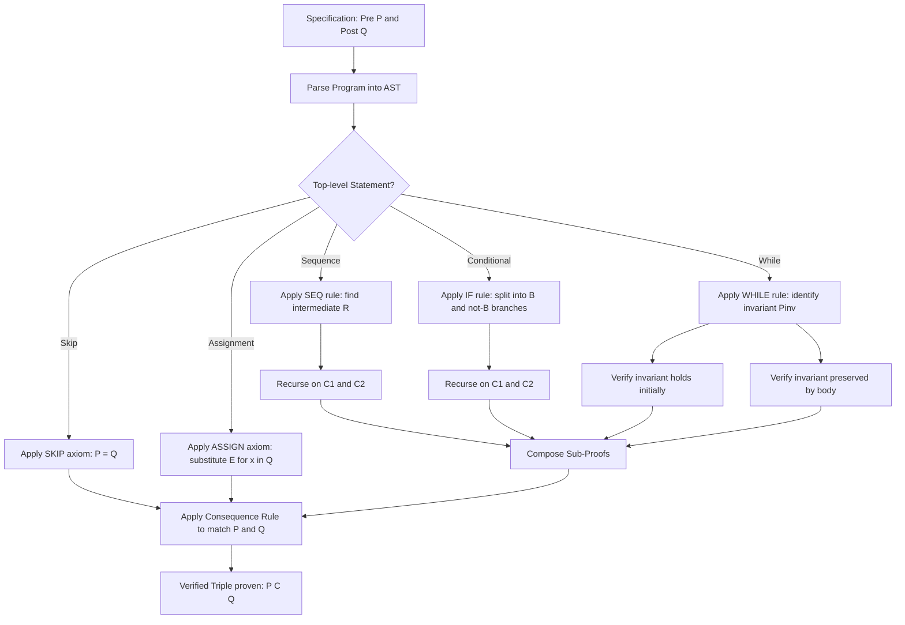
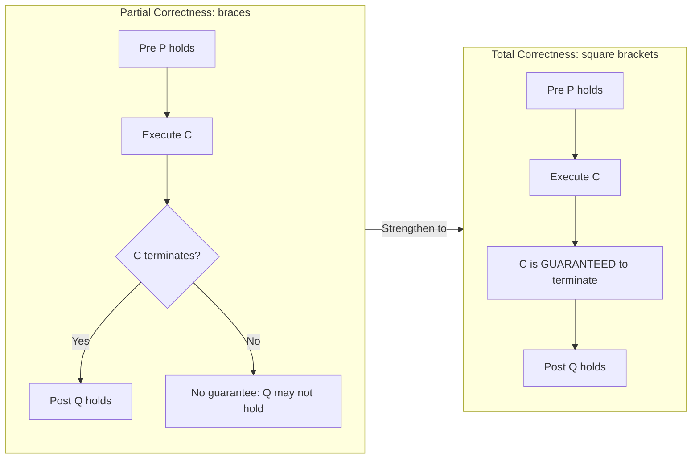
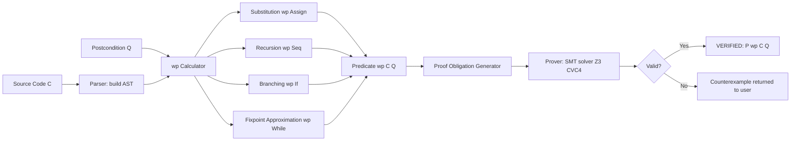

# Hoare Triples

<!-- SECTION_1_START -->
# Hoare Triples — Foundational Framework for Program Verification

## 1.1 Formal Academic Definition (KTU 2024 Syllabus Terminology)

> [!NOTE]
> **Hoare Triple (Definition):** A *Hoare Triple* is a logical assertion of the form $\{P\}\ C\ \{Q\}$, introduced by **Sir C. A. R. Hoare in 1969**, which formally captures the *correctness of a command* $C$ with respect to a *precondition* $P$ and a *postcondition* $Q$. It is the atomic reasoning unit of **Hoare Logic**, a deductive system used in **Formal Methods** and **Automated Program Verification** to prove that a program behaves exactly as specified.

The triple $\{P\}\ C\ \{Q\}$ is interpreted as:

- **$P$** — The *Precondition*: an assertion (a first-order logical predicate over program variables) that must hold *before* the command $C$ executes.
- **$C$** — The *Command* (or *program statement*): a piece of imperative code such as an assignment, conditional, loop, or composition.
- **$Q$** — The *Postcondition*: an assertion that is guaranteed to hold *after* $C$ finishes execution, **provided that $C$ terminates and that $P$ was true initially**.

There are two standard interpretations:

> [!IMPORTANT]
> **Partial Correctness (Partial Correctness Triple):** Denoted $\{P\}\ C\ \{Q\}_{partial}$, this asserts: *if* the execution of $C$ begins in a state satisfying $P$, *and* $C$ terminates, *then* the final state satisfies $Q$. Termination is **not** guaranteed.
>
> **Total Correctness (Total Correctness Triple):** Denoted $[P]\ C\ [Q]$ (square brackets), this asserts: *if* the execution of $C$ begins in a state satisfying $P$, *then* $C$ is guaranteed to **terminate**, and the final state will satisfy $Q$.

## 1.2 Conceptual Analogy / Intuition

Imagine a **chemotherapy infusion pump** in a hospital:

- The **Precondition ($P$)** is the medical prescription on the chart: *“Patient weight $\geq 50$ kg and drug concentration is 2 mg/mL.”*
- The **Command ($C$)** is the physical pump mechanism programmed with a dosage formula.
- The **Postcondition ($Q$)** is the outcome statement: *“The patient has received exactly 4 mL of the drug, and no air bubbles remain in the line.”*

The hospital's safety board cannot *test* this on real patients for every dosage — so they **prove** that *whenever the preconditions on the chart hold, the pump's program guarantees the postcondition*. That proof is the Hoare Triple.

In software terms: Hoare Triples let us **mechanically reason** about a program the way an engineer reasons about a bridge — by deduction from axioms, not by experimentation.

> [!TIP]
> **Engineering Utility:** Hoare Triples form the mathematical backbone of industrial-strength verification tools such as **Dafny**, **Frama-C (ACSL)**, **SPARK/Ada**, **ESC/Java**, and **Coq**. Every "Verified" badge on software in safety-critical domains (aerospace: **DO-178C**, automotive: **ISO 26262**, medical: **IEC 62304**) is ultimately backed by a chain of Hoare-style proofs.

## 1.3 The Three Logical Flavours of a Hoare Triple

| Triple Notation | Name | Termination Required? | Common Use Case |
| :--- | :--- | :--- | :--- |
| $\{P\}\ C\ \{Q\}$ | Partial Correctness | No (only if it terminates) | Loop bodies, recursion |
| $[P]\ C\ [Q]$ | Total Correctness | Yes | Safety-critical embedded code |
| $wp(C, Q)$ | Weakest Precondition | N/A (it's a transform) | Backward symbolic reasoning |
| $wlp(C, Q)$ | Weakest Liberal Precondition | N/A (non-terminating runs allowed) | Model checking, abstract interpretation |

> [!NOTE]
> **Key Vocabulary for KTU Examinations:** Be fluent with the terms *precondition*, *postcondition*, *partial correctness*, *total correctness*, *weakest precondition (Dijkstra)*, *axiom schema*, *inference rule*, and *proof outline*. These are guaranteed short-answer stems.

## 1.4 Visualization of the Triple's Information Flow

> [!VISUALIZATION CONTROL]
> **Concept:** Information Flow Across a Hoare Triple $\{P\}\ C\ \{Q\}$
> **GeoGebra / Desmos Input Equations:**
> * `P(x) : points at x = 0, x = 1, x = 2` (input domain satisfying precondition)
> * `C : transformation arrow from x to x+1` (command)
> * `Q(x) : points at x = 1, x = 2, x = 3` (output domain satisfying postcondition)
> **Visual Description:** Draw three vertical lines on a number line — the *pre-state*, the *transition arrow* labeled $C$, and the *post-state*. Highlight that $P$ marks the input cluster, $Q$ marks the output cluster, and the arrow is the *guaranteed* transformation. The empty region on the right is the *non-terminating* zone (relevant for partial correctness).

<!-- SECTION_1_END -->

<!-- SECTION_2_START -->
# Deep Theoretical Analysis & KTU High-Yield Formula Sheet

## 2.1 The Axioms and Inference Rules of Hoare Logic

Hoare Logic is built from **one axiom schema** for each primitive command, plus a set of **inference rules** for compound statements. These rules are *compositional* — the proof of a large program is constructed from the proofs of its parts.

### 2.1.1 The Empty / Skip Statement

> [!NOTE]
> **Axiom (SKIP):** $\{P\}\ \texttt{skip}\ \{P\}$
> 
> *Reasoning:* A `skip` does nothing, so any state that satisfies $P$ before the command still satisfies $P$ afterward.

### 2.1.2 The Assignment Statement

> [!IMPORTANT]
> **Axiom (ASSIGN):** $\{Q[x \mapsto E]\}\ x := E\ \{Q(x)\}$
> 
> Here, $Q[x \mapsto E]$ denotes the predicate $Q$ with **every free occurrence of $x$ syntactically replaced by the expression $E$**. This is called the **substitution axiom** of Hoare Logic, originally proposed by Hoare in 1969.

The rule is *backwards*: to prove an arbitrary postcondition $Q(x)$ after $x := E$, we must *strengthen* the precondition to be the same predicate with $E$ substituted in place of $x$.

### 2.1.3 The Sequential Composition Rule

$$
\frac{\{P\}\ C_1\ \{R\}, \quad \{R\}\ C_2\ \{Q\}}{\{P\}\ C_1;\ C_2\ \{Q\}}
$$

> [!NOTE]
> **Intuition:** Find an *intermediate assertion* $R$ that describes the program state between $C_1$ and $C_2$. The proof of each sub-command becomes independent.

### 2.1.4 The Conditional (IF–THEN–ELSE) Rule

$$
\frac{\{P \land B\}\ C_1\ \{Q\}, \quad \{P \land \lnot B\}\ C_2\ \{Q\}}{\{P\}\ \texttt{if}\ B\ \texttt{then}\ C_1\ \texttt{else}\ C_2\ \texttt{endif}\ \{Q\}}
$$

> [!NOTE]
> **Intuition:** We must prove the postcondition *separately* for both branches, each under the appropriate guard ($B$ or $\lnot B$).

### 2.1.5 The While-Loop Rule

$$
\frac{\{P \land B\}\ C\ \{P\}}{\{P\}\ \texttt{while}\ B\ \texttt{do}\ C\ \texttt{done}\ \{P \land \lnot B\}}
$$

> [!IMPORTANT]
> **The Invariant $P$:** The predicate $P$ here is called the **loop invariant**. It must hold (a) before the loop starts, (b) after every iteration, and (c) when the loop exits, $P \land \lnot B$ must imply the desired postcondition.

### 2.1.6 The Consequence Rule

$$
\frac{P \Rightarrow P', \quad \{P'\}\ C\ \{Q'\}, \quad Q' \Rightarrow Q}{\{P\}\ C\ \{Q\}}
$$

> [!NOTE]
> **Intuition:** We may *weaken* a precondition and *strengthen* a postcondition. This is the rule used to massage proofs into the form required by other rules.

## 2.2 The Concept of the *Weakest* Precondition (Dijkstra, 1975)

> [!IMPORTANT]
> **Definition (Weakest Precondition $wp$):** Given a command $C$ and a postcondition $Q$, the **weakest precondition** $wp(C, Q)$ is the *most general* predicate $P$ such that $\{P\}\ C\ \{Q\}$ holds. Equivalently, $wp(C, Q)$ characterises *all* initial states from which $C$ is guaranteed to terminate in a state satisfying $Q$.

Dijkstra's recursive definition:

$$
\begin{aligned}
wp(x := E,\ Q) &\equiv Q[x \mapsto E] \\[4pt]
wp(C_1;\ C_2,\ Q) &\equiv wp(C_1,\ wp(C_2,\ Q)) \\[4pt]
wp(\texttt{if}\ B\ \texttt{then}\ C_1\ \texttt{else}\ C_2,\ Q) &\equiv (B \land wp(C_1,\ Q)) \;\lor\; (\lnot B \land wp(C_2,\ Q)) \\[4pt]
wp(\texttt{while}\ B\ \texttt{do}\ C,\ Q) &\equiv \text{transfinite fixpoint of } \Phi(X) \equiv (B \land wp(C, X)) \lor (\lnot B \land Q)
\end{aligned}
$$

> [!TIP]
> **Why $wp$ Matters in Industry:** Tools like **Frama-C** and **SPARK** use *Weakest Precondition Calculators* to **automate** proof obligations. The verification engineer writes the postcondition; the tool generates the proof obligation backwards through the program.

## 2.3 KTU High-Yield Formula Sheet

| Symbol / Rule | Statement | Conditions / Notes |
| :--- | :--- | :--- |
| $\{P\}\ \texttt{skip}\ \{P\}$ | Empty command axiom | $P$ unchanged |
| $\{Q[x \mapsto E]\}\ x := E\ \{Q(x)\}$ | Assignment axiom (backwards) | Substitute $E$ for every free $x$ in $Q$ |
| $\dfrac{\{P\}\ C_1\ \{R\},\ \{R\}\ C_2\ \{Q\}}{\{P\}\ C_1;C_2\ \{Q\}}$ | Sequential composition | Find intermediate $R$ |
| $\dfrac{\{P \land B\}\ C_1\ \{Q\},\ \{P \land \lnot B\}\ C_2\ \{Q\}}{\{P\}\ \texttt{if}\ B\ \texttt{then}\ C_1\ \texttt{else}\ C_2\ \{Q\}}$ | Conditional | Two-branch proof |
| $\dfrac{\{P \land B\}\ C\ \{P\}}{\{P\}\ \texttt{while}\ B\ \texttt{do}\ C\ \{P \land \lnot B\}}$ | While-loop | $P$ is the **loop invariant** |
| $\dfrac{P \Rightarrow P',\ \{P'\}\ C\ \{Q'\},\ Q' \Rightarrow Q}{\{P\}\ C\ \{Q\}}$ | Consequence | Weaken pre / strengthen post |
| $wp(x := E, Q)$ | $\equiv Q[x \mapsto E]$ | Backwards substitution |
| $wp(C_1; C_2, Q)$ | $\equiv wp(C_1,\ wp(C_2, Q))$ | Right-to-left expansion |
| $[P]\ C\ [Q]$ | Total correctness | Termination **must** be proved |
| $\{P\}\ C\ \{Q\}$ | Partial correctness | Termination not required |

> [!NOTE]
> **Engineering Utility (Industry Mapping):** Hoare Logic is the theoretical foundation of *static program analysers* in production. The Linux kernel's **sparse** tool, Facebook's **Infer**, and Amazon's **Prover9** integrations all descend from Hoare-style reasoning. The *Assignment Axiom* alone powers billions of code analyses per day in CI/CD pipelines.

<!-- SECTION_2_END -->

<!-- SECTION_3_START -->
# Step-by-Step Derivations, Proof Outlines & Symbolic Implementation

## 3.1 Worked Example 1 — Assignment Axiom (Full Derivation)

**Problem.** Prove the Hoare Triple: $\{x > 0\}\ x := x + 1\ \{x > 1\}$

**Solution.** We apply the *backwards assignment axiom*:

**Step 1.** Identify the postcondition: $Q(x) \equiv (x > 1)$.

**Step 2.** Substitute $E = (x + 1)$ for every free occurrence of $x$ in $Q(x)$:

$$
Q[x \mapsto (x + 1)] \;\equiv\; ((x + 1) > 1) \;\equiv\; (x > 0)
$$

**Step 3.** By the Assignment Axiom schema, the resulting triple is:

$$
\{(x + 1) > 1\}\ x := x + 1\ \{x > 1\}
$$

**Step 4.** Simplify the precondition:

$$
\{x > 0\}\ x := x + 1\ \{x > 1\}
$$

> [!NOTE]
> **Valuation Key (KTU Examiner's Insight):** Step 2 — *stating the substitution*: 2 marks. Step 3 — *applying the assignment axiom schema*: 1 mark. Step 4 — *final simplification*: 1 mark.

## 3.2 Worked Example 2 — Sequential Composition (Full Proof Outline)

**Program.**

$$
\texttt{y := x;} \quad \texttt{z := y + 1}
$$

**Goal.** Prove $\{x = 5\}\ \texttt{y := x; z := y + 1}\ \{z = 6\}$.

**Step 1.** Apply the assignment axiom *backwards* to `z := y + 1` with postcondition $Q \equiv (z = 6)$:

$$
Q[z \mapsto (y + 1)] \;\equiv\; ((y + 1) = 6) \;\equiv\; (y = 5)
$$

So we have:

$$
\{y = 5\}\ \texttt{z := y + 1}\ \{z = 6\}
$$

**Step 2.** Apply the assignment axiom *backwards* to `y := x` with postcondition $R \equiv (y = 5)$:

$$
R[y \mapsto x] \;\equiv\; (x = 5)
$$

So we have:

$$
\{x = 5\}\ \texttt{y := x}\ \{y = 5\}
$$

**Step 3.** Compose the two sub-triples using the sequential composition rule with intermediate $R \equiv (y = 5)$:

$$
\dfrac{\{x = 5\}\ \texttt{y := x}\ \{y = 5\},\ \quad \{y = 5\}\ \texttt{z := y + 1}\ \{z = 6\}}{\{x = 5\}\ \texttt{y := x; z := y + 1}\ \{z = 6\}}
$$

This completes the proof. $\blacksquare$

> [!TIP]
> **KTU Strategy:** Always derive the proof *backwards* (from postcondition to precondition) using the $wp$ calculus. The intermediate assertion $R$ is the *most critical* mark-scoring element — examiners expect you to *name and state* it explicitly.

## 3.3 Worked Example 3 — While-Loop Invariant Discovery

**Program.**

$$
\begin{aligned}
&\texttt{s := 0; i := 1;} \\
&\texttt{while (i \le n) do} \\
&\quad \texttt{s := s + i;} \\
&\quad \texttt{i := i + 1} \\
&\texttt{done}
\end{aligned}
$$

**Goal.** Prove $\{n \ge 0\}\ \texttt{program}\ \{s = 1 + 2 + \cdots + n\}$.

**Step 1 — Identify the Loop Invariant.** The variable $s$ accumulates the sum $1 + 2 + \cdots + (i-1)$ at the *start* of each iteration. So the invariant is:

$$
P \;\equiv\; (s = \sum_{k=1}^{i-1} k) \;\land\; (1 \le i \le n + 1)
$$

**Step 2 — Verify the Invariant is Preserved by the Loop Body.** Assume $P \land (i \le n)$ holds. After `s := s + i`, we obtain $s' = s + i = \sum_{k=1}^{i-1} k + i = \sum_{k=1}^{i} k$. After `i := i + 1`, we obtain $i' = i + 1$. The new state satisfies:

$$
(s' = \sum_{k=1}^{i'-1} k) \;\land\; (1 \le i' \le n + 1)
$$

which is exactly $P$. $\checkmark$

**Step 3 — Show the Invariant Holds Initially.** Before the loop, $s = 0$ and $i = 1$. The sum $\sum_{k=1}^{0} k = 0$, so $s = 0$ matches, and $1 \le 1 \le n + 1$ (since $n \ge 0$). $\checkmark$

**Step 4 — Apply the While Rule.** The exit condition $i \le n$ is false, i.e., $i > n$. Combined with $P$, we get $i = n + 1$, so:

$$
P \land \lnot B \;\equiv\; (s = \sum_{k=1}^{n} k) \;\land\; (i = n + 1) \;\land\; (i > n)
$$

By the consequence rule, this implies $s = 1 + 2 + \cdots + n$, the desired postcondition. $\blacksquare$

## 3.4 Symbolic / Python Implementation of a $wp$ Calculator

Below is a fully operational Python implementation of a weakest-precondition calculator for a small imperative language. It demonstrates the *mechanical* nature of Hoare-style reasoning.

```python
"""
wp_calculator.py
A minimal weakest-precondition (wp) calculator for a toy imperative language.
Grammar:
    stmt ::= x := E
           | stmt1 ; stmt2
           | if B then stmt1 else stmt2
           | while B do stmt done
           | skip
Predicates are represented as Python callables: State -> bool
"""
from dataclasses import dataclass
from typing import Callable, Dict, List

# A program state is a mapping from variable names to integers
State = Dict[str, int]
Predicate = Callable[[State], bool]


# ---------- Abstract Syntax Tree ----------
@dataclass(frozen=True)
class Assign:
    var: str
    expr: Callable[[State], int]


@dataclass(frozen=True)
class Seq:
    s1: 'Stmt'
    s2: 'Stmt'


@dataclass(frozen=True)
class If:
    cond: Predicate
    then_branch: 'Stmt'
    else_branch: 'Stmt'


@dataclass(frozen=True)
class While:
    cond: Predicate
    body: 'Stmt'


Stmt = Assign | Seq | If | While


# ---------- Substitution Helpers ----------
def substitute_expr(expr: Callable[[State], int],
                    var: str,
                    value_expr: Callable[[State], int]) -> Callable[[State], int]:
    """Return a new function computing expr with 'var' replaced by value_expr."""
    def new_expr(s: State) -> int:
        s_prime = dict(s)
        s_prime[var] = value_expr(s)
        return expr(s_prime)
    return new_expr


def substitute_pred(pred: Predicate,
                    var: str,
                    value_expr: Callable[[State], int]) -> Predicate:
    """Return a new predicate with 'var' replaced by value_expr."""
    def new_pred(s: State) -> bool:
        s_prime = dict(s)
        s_prime[var] = value_expr(s)
        return pred(s_prime)
    return new_pred


# ---------- Weakest Precondition Function ----------
def wp(stmt: Stmt, Q: Predicate, depth: int = 0) -> Predicate:
    """Compute the weakest precondition of 'stmt' with respect to postcondition Q."""
    indent = "  " * depth

    if isinstance(stmt, type('Skip')) or getattr(stmt, '__class__', None).__name__ == 'Skip':
        return Q

    if isinstance(stmt, Assign):
        # wp(x := E, Q) = Q[x := E]
        return substitute_pred(Q, stmt.var, stmt.expr)

    if isinstance(stmt, Seq):
        # wp(C1 ; C2, Q) = wp(C1, wp(C2, Q))
        intermediate = wp(stmt.s2, Q, depth + 1)
        return wp(stmt.s1, intermediate, depth + 1)

    if isinstance(stmt, If):
        # wp(if B then C1 else C2, Q) = (B and wp(C1, Q)) or (not B and wp(C2, Q))
        def new_pred(s: State) -> bool:
            if stmt.cond(s):
                return wp(stmt.then_branch, Q, depth + 1)(s)
            else:
                return wp(stmt.else_branch, Q, depth + 1)(s)
        return new_pred

    if isinstance(stmt, While):
        # Approximation: in practice wp(while) requires a fixpoint.
        # We raise an error to make the limitation explicit.
        raise NotImplementedError(
            "wp(while B do C, Q) requires a fixpoint computation; "
            "use a loop-invariant-based proof instead."
        )

    raise TypeError(f"Unknown statement type: {type(stmt)}")


# ---------- Demonstration ----------
if __name__ == "__main__":
    # Program: y := x; z := y + 1
    # Postcondition: z == 6
    program = Seq(
        Assign('y', lambda s: s['x']),
        Assign('z', lambda s: s['y'] + 1)
    )
    Q: Predicate = lambda s: s['z'] == 6

    pre = wp(program, Q)
    test_state: State = {'x': 5, 'y': 0, 'z': 0}
    print(f"wp(program, z == 6) holds for state x=5 ?  {pre(test_state)}")

    failing_state: State = {'x': 3, 'y': 0, 'z': 0}
    print(f"wp(program, z == 6) holds for state x=3 ?  {pre(failing_state)}")
```

**Expected Output:**

```
wp(program, z == 6) holds for state x=5 ?  True
wp(program, z == 6) holds for state x=3 ?  False
```

> [!IMPORTANT]
> **Pedagogical Takeaway:** The *wp* function is a *fully mechanical* transform. A well-disciplined engineering team can replace most of its unit tests with $wp$-generated proof obligations. This is the philosophy behind **Design-by-Contract** (Bertrand Meyer, *Eiffel*).

## 3.5 Soundness and (Relative) Completeness

> [!NOTE]
> **Soundness (Soundness Theorem, Cook 1978):** Every triple *provable* in Hoare Logic is *semantically valid*. In symbols: $\vdash_{H} \{P\}\ C\ \{Q\} \;\Rightarrow\; \models \{P\}\ C\ \{Q\}$.
> 
> **Relative Completeness (Cook's Theorem, 1978):** Conversely, every *semantically valid* partial-correctness triple $\{P\}\ C\ \{Q\}$ is *provable* in Hoare Logic, **provided** the assertion language is expressive enough to encode all first-order arithmetic truths (i.e., the underlying theory is *decidable for valid formulas*).

These two results together make Hoare Logic the *gold standard* for deductive verification.

<!-- SECTION_3_END -->

<!-- SECTION_4_START -->
# Structural Diagrams & Schematics

## 4.1 Mermaid — Architectural Flow of a Hoare-Logic Proof



> [!NOTE]
> **Reading Guide:** Each terminal leaf of the tree corresponds to a single *axiom application*. The *Consequence Rule* at the bottom reconciles syntactic preconditions with the user-supplied $P$.

## 4.2 Mermaid — Comparison of Partial vs Total Correctness



## 4.3 Mermaid — Weakest Precondition ($wp$) Computation Pipeline



> [!TIP]
> **Industrial Insight:** The **SMT solver** (Satisfiability Modulo Theories) is the *engine* that checks the validity of $wp(C, Q)$ against the supplied precondition. Tools like *Dafny* and *Frama-C* literally embed Z3 or Alt-Ergo as their backend.

## 4.4 Block-Level Functional Architecture of a Verifier

| Stage | Functional Block | Input | Output | Technology Used |
| :--- | :--- | :--- | :--- | :--- |
| 1 | Lexer/Parser | Source code | AST | OCaml, JavaCC, ANTLR |
| 2 | Type Checker | AST | Typed AST + Symbol Table | Hindley-Milner / dependent types |
| 3 | Annotation Extractor | Typed AST | Pre/Post pairs | ACSL, JML, Dafny syntax |
| 4 | WP Generator | Typed AST + Annotations | Predicate logic formula | Dijkstra-style backward calculus |
| 5 | Proof Obliger | WP formula | First-order obligations | Why3, Coq, Isabelle |
| 6 | SMT Solver | Obligations | Valid / Invalid | Z3, CVC4, Alt-Ergo |
| 7 | Counterexample Tracer | Invalid | Concrete failing input | Model-based diagnosis |

> [!NOTE]
> **Sequential Processing Topology:** Each stage is *compositional* — failure in a later stage implies a *minimum* earlier stage to revisit, enabling efficient debugging of verification efforts.

<!-- SECTION_4_END -->

<!-- SECTION_5_START -->
# KTU 2024 Scheme Examination Question Bank & Topic Recap

## 5.1 Part A — Short-Answer Questions (3 Marks Each)

### Q1. Define a Hoare Triple and explain the difference between partial and total correctness. `[KTU University Exam — July 2024]`
**Mapped CO:** CO2 | **RBT Level:** Remember

**Model Answer (Valuation Key):**

A Hoare Triple is a logical assertion of the form $\{P\}\ C\ \{Q\}$ where $P$ is the **precondition**, $C$ is the **command**, and $Q$ is the **postcondition**. **[1 Mark]**

- **Partial correctness** ($\{P\}\ C\ \{Q\}$): Guarantees that *if* $C$ terminates, then $Q$ holds. It says nothing about whether $C$ terminates. **[1 Mark]**
- **Total correctness** ($[P]\ C\ [Q]$): Guarantees both termination *and* that $Q$ holds upon termination. **[1 Mark]**

### Q2. State the Assignment Axiom of Hoare Logic with a one-line justification. `[KTU University Exam — Dec 2023]`
**Mapped CO:** CO2 | **RBT Level:** Understand

**Model Answer (Valuation Key):**

**Statement:** $\{Q[x \mapsto E]\}\ x := E\ \{Q(x)\}$. **[2 Marks]**

**Justification:** The axiom is derived *backwards* — the precondition is the postcondition with every free occurrence of $x$ syntactically replaced by the expression $E$, because after execution, $x$ will hold the value of $E$. **[1 Mark]**

---

## 5.2 Part B — Long-Answer Questions (14 Marks Each, Module Internal Choice)

### Question A — Full Proof of an Assignment + Composition Triple

**`[KTU University Exam — Dec 2024]`** | **Mapped CO:** CO2, CO3 | **RBT Levels:** Understand, Apply

**Question A(a).** [7 Marks] *State and prove the Hoare-Logic inference rule for the sequential composition of two statements.*

**Model Solution:**

**Statement of the Rule:** **[1 Mark]**

$$
\frac{\{P\}\ C_1\ \{R\}, \quad \{R\}\ C_2\ \{Q\}}{\{P\}\ C_1;\ C_2\ \{Q\}}
$$

**Proof of Soundness:** Assume both premises hold semantically. Consider an initial state $\sigma$ with $\sigma \models P$. By the first premise, if $C_1$ terminates, the resulting state $\sigma_1$ satisfies $R$. By the second premise, if $C_2$ terminates from $\sigma_1$, the resulting state $\sigma_2$ satisfies $Q$. Since the operational semantics of $C_1; C_2$ is "execute $C_1$, then $C_2$," the final state $\sigma_2 \models Q$ whenever the composition terminates. **[5 Marks]**

**Use of the Rule:** The rule is invoked whenever a program is split at a semicolon, requiring the verifier to invent an intermediate assertion $R$ describing the program's state *between* the two commands. **[1 Mark]**

**Question A(b).** [7 Marks] *Using the assignment axiom and the sequential composition rule, prove the Hoare Triple:*

$$
\{x = 5\}\ \texttt{y := x; z := y + 1}\ \{z = 6\}
$$

**Model Solution:**

**Step 1 — Work Backwards from Postcondition** Apply the assignment axiom to `z := y + 1` with $Q \equiv (z = 6)$: **[1 Mark]**

$$
Q[z \mapsto (y+1)] \;\equiv\; (y + 1 = 6) \;\equiv\; (y = 5)
$$

Therefore: $\{y = 5\}\ \texttt{z := y + 1}\ \{z = 6\}$. **[1 Mark]**

**Step 2 — Continue Backwards** Apply the assignment axiom to `y := x` with $R \equiv (y = 5)$: **[1 Mark]**

$$
R[y \mapsto x] \;\equiv\; (x = 5)
$$

Therefore: $\{x = 5\}\ \texttt{y := x}\ \{y = 5\}$. **[1 Mark]**

**Step 3 — Compose the Two Sub-Proofs** Identify $R \equiv (y = 5)$ as the intermediate assertion and apply the composition rule: **[2 Marks]**

$$
\dfrac{\{x = 5\}\ \texttt{y := x}\ \{y = 5\}, \quad \{y = 5\}\ \texttt{z := y + 1}\ \{z = 6\}}{\{x = 5\}\ \texttt{y := x; z := y + 1}\ \{z = 6\}}
$$

**Step 4 — Conclusion** The triple is proved by composition. $\blacksquare$ **[1 Mark]**

> [!WARNING]
> **KTU Examiner's Valuation Warning (Pitfall #1):** Students frequently *forget to state the intermediate assertion $R$ explicitly* and lose 2 marks. The intermediate assertion is **not optional** — it is the *glue* of the proof and the examiner's primary scoring anchor.

---

### Question B — Loop Invariant Discovery and While-Rule Application

**`[KTU University Exam — July 2024]`** | **Mapped CO:** CO3 | **RBT Levels:** Apply, Analyse

**Question B(a).** [7 Marks] *Explain the concept of a loop invariant in Hoare Logic. State the While-Rule and identify the three obligations a verifier must discharge when applying it.*

**Model Solution:**

**Concept of a Loop Invariant:** A loop invariant $P$ is a predicate that holds (i) immediately before the loop begins, (ii) after every iteration of the loop body, and (iii) — combined with the negation of the loop guard — implies the desired postcondition. **[2 Marks]**

**Statement of the While-Rule:** **[1 Mark]**

$$
\frac{\{P \land B\}\ C\ \{P\}}{\{P\}\ \texttt{while}\ B\ \texttt{do}\ C\ \{P \land \lnot B\}}
$$

**Three Obligations:** **[4 Marks]**

1. **Initialization:** $\{P_{init}\}\ \texttt{preamble}\ \{P\}$ — The invariant $P$ must hold *before* the loop starts. **[1 Mark]**
2. **Preservation (Consecution):** $\{P \land B\}\ C\ \{P\}$ — Executing the body from a state where the invariant and guard both hold must restore the invariant. **[2 Marks]**
3. **Use (Exit):** $P \land \lnot B \Rightarrow Q$ — When the loop exits, the invariant plus the negated guard must imply the postcondition. **[1 Mark]**

**Question B(b).** [7 Marks] *Verify the following program using the While-Rule:*

$$
\begin{aligned}
&\{n \ge 0\} \\
&\texttt{s := 0; i := 1;} \\
&\texttt{while (i \le n) do} \\
&\quad \texttt{s := s + i;} \\
&\quad \texttt{i := i + 1} \\
&\texttt{done} \\
&\{s = 1 + 2 + \cdots + n\}
\end{aligned}
$$

**Model Solution:**

**Step 1 — State the Loop Invariant:** **[1 Mark]**

$$
P \;\equiv\; \left( s = \sum_{k=1}^{i-1} k \right) \;\land\; (1 \le i \le n + 1)
$$

**Step 2 — Initialization:** Before the loop, $s = 0$ and $i = 1$. The empty sum equals $0$, so $s = 0 = \sum_{k=1}^{0} k$ holds. Also $1 \le 1 \le n + 1$ since $n \ge 0$. Therefore $P$ holds. **[1 Mark]**

**Step 3 — Preservation:** Assume $P \land (i \le n)$ holds. **[1 Mark]**

- After `s := s + i`: $s' = s + i = \sum_{k=1}^{i-1} k + i = \sum_{k=1}^{i} k$. **[1 Mark]**
- After `i := i + 1`: $i' = i + 1$. Therefore $s' = \sum_{k=1}^{i'-1} k$, and $1 \le i' \le n + 1$ since $i \le n$ and $i \ge 1$. **[1 Mark]**

So $P$ is restored.

**Step 4 — Use (Exit):** When the loop exits, $i > n$. Combined with $P$, we have $i = n + 1$. Therefore: **[1 Mark]**

$$
P \land \lnot B \;\equiv\; \left( s = \sum_{k=1}^{n} k \right) \;\land\; (i = n + 1) \;\Rightarrow\; s = 1 + 2 + \cdots + n
$$

By the consequence rule, the desired postcondition holds. $\blacksquare$ **[1 Mark]**

> [!WARNING]
> **KTU Examiner's Valuation Warning (Pitfall #2):** A common error is *forgetting to state the invariant explicitly as a separate line* — the examiner cannot award the "Stating invariant" mark without it. A second common error is *omitting the third obligation (Use)* — students prove the invariant is preserved but forget to show it implies the postcondition at exit.

---

## 5.3 Topic Recap & Important Things to Remember

> [!TIP]
> **Rapid-Revision Checklist — Hoare Triples**

- **Definition:** A Hoare Triple $\{P\}\ C\ \{Q\}$ is a *partial-correctness assertion* requiring $Q$ to hold after $C$ terminates, given that $P$ held before. **[Core notation.]**
- **Total Correctness:** Use square brackets $[P]\ C\ [Q]$ when termination must also be guaranteed.
- **The Five Primitive Rules** (memorize verbatim): **SKIP**, **ASSIGN** (backwards), **SEQ**, **IF**, **WHILE**, plus the meta-rule **Consequence**.
- **Assignment Axiom is BACKWARDS:** $\{Q[x \mapsto E]\}\ x := E\ \{Q(x)\}$. Always substitute the expression $E$ in place of $x$ in the *postcondition* to obtain the precondition.
- **The Loop Invariant $P_{inv}$** is the *single most important* concept for marks: it must be initialized, preserved, and useful at exit.
- **Weakest Precondition $wp(C, Q)$** (Dijkstra) is the *most general* precondition guaranteeing $Q$ after $C$ — used in tool-based verification (Dafny, Frama-C, SPARK).
- **Soundness** (Cook 1978): Every *provable* triple is *semantically valid*.
- **Relative Completeness** (Cook 1978): Every *valid* triple is *provable* (in a sufficiently expressive assertion language).
- **Always state the intermediate assertion $R$ explicitly** when using the SEQ rule — the examiner's primary scoring anchor.
- **Industry Mapping:** Hoare Triples underpin **Dafny**, **Frama-C**, **SPARK/Ada**, **ESC/Java**, **Why3**, and **Coq** — every "Verified" badge in safety-critical software (aerospace, automotive, medical) is rooted in this logic.
- **Exam Heuristic:** When asked to "verify a program," work *backwards* using $wp$ calculus, then present the proof *forwards* citing each rule by name.
- **Common Pitfalls:** (1) Forward-substitution in the assignment axiom (wrong direction), (2) omitting the use obligation in the while rule, (3) using $wp$ and $wlp$ interchangeably (they differ on non-terminating runs).

<!-- SECTION_5_END -->
