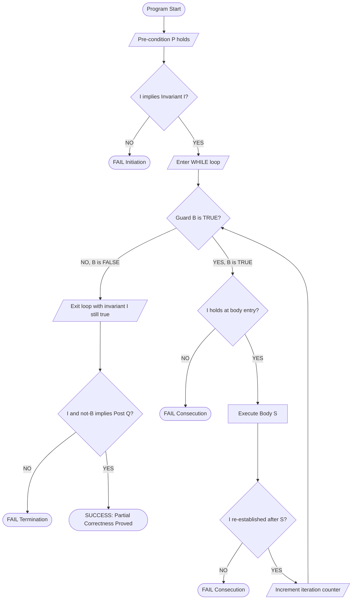
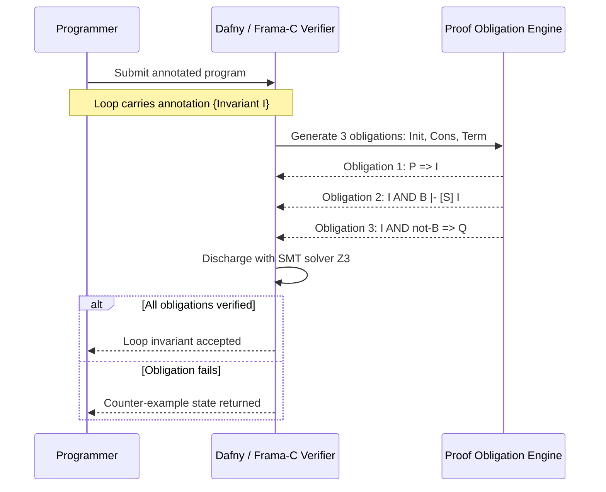
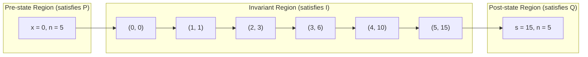
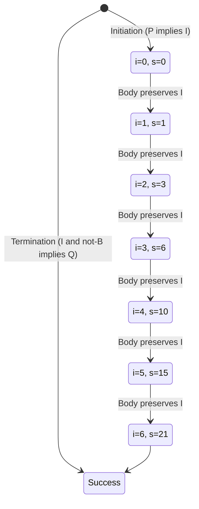
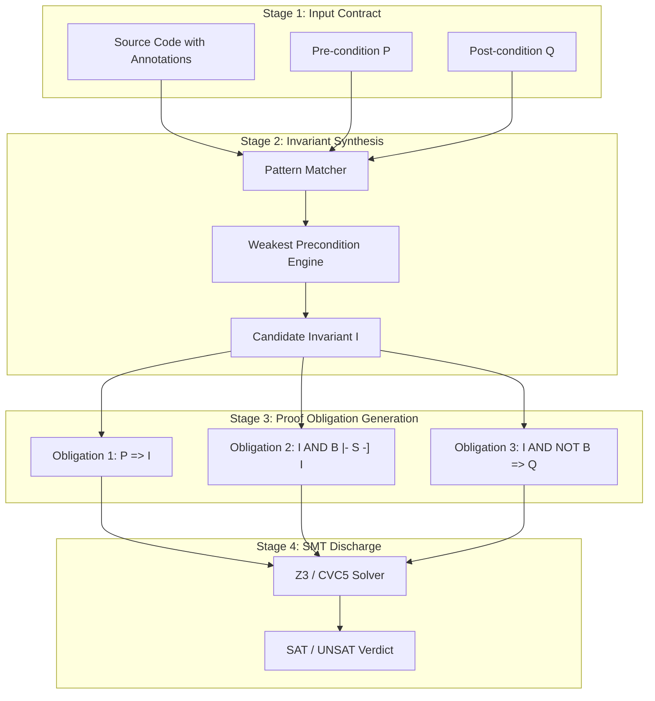

# Loop Invariants

<!-- SECTION_1_START -->

# Loop Invariants in Hoare Logic

## 1.1 Formal Definition (KTU 2024 Syllabus Terminology)

> [!IMPORTANT]
> **Loop Invariant:** A *loop invariant* $\mathcal{I}$ is a predicate (a logical assertion over program variables) that **remains true immediately before and after every single iteration** of a `while` loop during program execution.

Formally, a loop invariant is a property $I$ that satisfies the following three conditions under the Hoare Logic framework:

$$P \Rightarrow I \quad \text{(Initiation / Pre-condition establishes Invariant)}$$

$$\{I \land B\}\ S\ \{I\} \quad \text{(Consecution / Preservation)}$$

$$I \land \lnot B \Rightarrow Q \quad \text{(Exit / Post-condition derived from Invariant)}$$

Where:
- $P$ = Pre-condition
- $Q$ = Post-condition
- $B$ = Loop guard (Boolean condition)
- $S$ = Loop body
- $I$ = Loop invariant

The complete Hoare triple for a `while` loop is therefore:

$$\{I\}\ \texttt{while}\ B\ \texttt{do}\ S\ \texttt{end}\ \{I \land \lnot B\}$$

> [!NOTE]
> **Why it matters for KTU:** A loop invariant is the *bridge* between the pre-condition $P$ and the post-condition $Q$. Without it, the loop is a logical "black box" and partial correctness cannot be formally proved.

---

## 1.2 Conceptual Analogy / Intuition

> [!TIP]
> **Real-World Analogy — The "Mountain Pass" Scenario**

Imagine you are a hiker climbing a mountain trail with **n fixed milestones** (loop iterations). Your **destination** is the post-condition $Q$ (e.g., "I have collected all 10 crystals"). At **each milestone**, you check your backpack and confirm the invariant property $\mathcal{I}$ — *"I have collected exactly the number of crystals corresponding to the milestones passed so far."*

- **At the trailhead (before loop):** $P \Rightarrow I$ — the initial check that the invariant is plausible (e.g., "I have 0 crystals, milestone 0 of 10 passed").
- **At every milestone (loop body):** $\{I \land B\}\ S\ \{I\}$ — you walk from one milestone to the next, picking up exactly one crystal, and the invariant remains: *"milestones passed = crystals collected."*
- **At the summit (after loop):** $I \land \lnot B \Rightarrow Q$ — when no milestones remain ($B$ is false), the invariant naturally implies you have all 10 crystals, which is the goal $Q$.

The invariant is therefore the **state-description that the loop is trying to preserve**, not necessarily the final goal.

---

## 1.3 Geometric / State-Space Intuition

> [!VISUALIZATION CONTROL]
> **Concept:** Visualization of the Invariant Region in the State Space
> **GeoGebra / Desmos Input Equations:**
> * Define a 2D state space with axis $\text{counter} = i$ and $\text{accumulator} = s$.
> * Invariant line: $s = i \cdot (i + 1) / 2$ (for the running sum loop).
> * Guard region: $B$ = set of points where $i \le n$.
> * Exit boundary: $\lnot B$ = set of points where $i = n+1$.
> **Visual Description:** The student should see that the execution trace of the loop "jumps" between integer points that **all lie on the invariant line $s = i(i+1)/2$**. At the start, the trace begins at $(0, 0)$ (initiation). Each iteration moves one step to the right and up-right along the parabola (consecution). The final point lies on the right edge where $i = n+1$, automatically giving the post-condition.

---

## 1.4 Loop Variant (Brief Preview for Total Correctness)

> [!NOTE]
> **Standard Metric for Termination:** A *loop variant* (or *ranking function*) is an integer expression $t$ such that:
> 1. $I \Rightarrow t \ge 0$ (it is bounded below)
> 2. $\{I \land B \land t = T\}\ S\ \{t < T\}$ (it strictly decreases)

A loop variant is denoted in **bold** when cited: **loop variant $t$**, and is used to prove **total correctness** (the program terminates).

---

<!-- SECTION_1_END -->

<!-- SECTION_2_START -->

# Deep Theoretical Analysis: The Hoare Logic While-Rule

## 2.1 Structural Breakdown of the While-Rule

The Hoare Logic inference rule for `while` loops is a *composite rule* built from three sub-obligations. The KTU examiner expects the student to **state all three obligations explicitly** in any proof.

### Step 1 — Initiation (The "Entering" Obligation)

$$P \Rightarrow I$$

We must show that the pre-condition $P$ of the program logically implies the loop invariant $I$. This ensures that *before the first iteration* executes, the invariant holds.

- **Why:** If the invariant is not established at the start, then the "preservation" property is meaningless because there is no true state to preserve.
- **How:** Usually proved by simple logical implication or by substituting variable values from $P$ into $I$.

### Step 2 — Consecution / Preservation (The "Body" Obligation)

$$\{I \land B\}\ S\ \{I\}$$

We assume the invariant $I$ holds *and* the loop guard $B$ is true, and we must show that after executing the loop body $S$, the invariant $I$ is *re-established*.

- **Why:** This is the *inductive step* of the proof. It guarantees that the property is not destroyed by the loop body.
- **How:** Apply the Hoare rule of the body $S$ to the pre-condition $I \land B$, then simplify the post-condition to obtain $I$.

### Step 3 — Termination / Exit (The "Leaving" Obligation)

$$I \land \lnot B \Rightarrow Q$$

When the loop guard becomes false, the invariant $I$ together with the negated guard $\lnot B$ must imply the desired post-condition $Q$.

- **Why:** This connects the *preserved property* to the *user's goal*. The loop is a means; the invariant is the descriptive state; $Q$ is the deliverable.
- **How:** Combine the algebraic form of $I$ and $\lnot B$ to derive $Q$.

---

## 2.2 Worked Example 1 — The Sum Loop (Classic KTU Pattern)

Consider the program fragment:

```
{Pre: n ≥ 0}
i := 0;
s := 0;
while (i < n) do
    i := i + 1;
    s := s + i;
end
{Post: s = 1 + 2 + ... + n}
```

**Proposed Invariant:**
$$I:\ s = \frac{i(i+1)}{2} \ \land\ 0 \le i \le n$$

**Verification:**

| Obligation | Logical Statement | Status |
|---|---|---|
| Initiation | $P \Rightarrow I$ | $i=0, s=0$ gives $0 = 0$ and $0 \le 0 \le n$ ✓ |
| Consecution | $\{I \land i < n\}\ i := i+1;\ s := s+i\ \{I\}$ | See derivation below |
| Termination | $I \land i \ge n \Rightarrow s = \frac{n(n+1)}{2}$ | Since $i \le n$ and $i \ge n$ gives $i = n$ ✓ |

---

## 2.3 KTU High-Yield Formula Sheet

> [!NOTE]
> The following table is the **only quick-reference** you need for any KTU exam question on loop invariants. Memorize the column headers and the three obligation rows.

| Component | Mathematical Form | Meaning | Engineering Use |
|---|---|---|---|
| **Pre-condition** | $P$ | State assumed before the loop | Input contract (e.g., API precondition) |
| **Loop Guard** | $B$ | Boolean tested at loop head | `while` condition in C/Java/Python |
| **Loop Body** | $S$ | Sequence of statements inside loop | Refactor unit, must preserve $I$ |
| **Loop Invariant** | $I$ | True before *and* after every iteration | Loop contract, central to verification |
| **Post-condition** | $Q$ | State guaranteed after the loop | Output contract, user-visible result |
| **Initiation** | $P \Rightarrow I$ | Pre-condition *implies* invariant | "Set-up proof" |
| **Consecution** | $\{I \land B\}\ S\ \{I\}$ | Body preserves invariant | "Inductive step proof" |
| **Termination** | $I \land \lnot B \Rightarrow Q$ | Invariant + exit $\Rightarrow$ goal | "Pay-off proof" |
| **Hoare While Rule** | $\dfrac{\{I \land B\}\ S\ \{I\}}{\{I\}\ \texttt{while}\ B\ \texttt{do}\ S\ \{I \land \lnot B\}}$ | Inference rule | Used in Dafny, Frama-C, SPARK |
| **Rule of Consequence** | $\dfrac{P \Rightarrow P',\ \{P'\}\ S\ \{Q'\},\ Q' \Rightarrow Q}{\{P\}\ S\ \{Q\}}$ | Strengthening pre, weakening post | Used to align $P$ with $I$ |
| **Loop Variant** | $t:\ \mathbb{Z} \to \mathbb{N}$ strictly decreasing | Termination measure | Total correctness, Bounded Model Checking |
| **Standard Sum Inv.** | $s = \sum_{k=1}^{i} k = \dfrac{i(i+1)}{2}$ | Running total | Verified by KeY, Isabelle/HOL |
| **Standard Prod. Inv.** | $p = \prod_{k=1}^{i} a[k]$ | Running product | Used in array reductions |
| **Standard Search Inv.** | $\forall k.\ 0 \le k < i \Rightarrow a[k] \ne x$ | Linear search | Used in binary search verification |

---

## 2.4 Real-World Utility in Engineering and Computer Science

- **Static Analyzers:** Tools like **Dafny**, **Frama-C**, **SPARK Ada**, and **KeY** automatically (or semi-automatically) ask the developer to supply a loop invariant annotation. Without it, the prover cannot discharge the proof obligation.
- **Bounded Model Checking (BMC):** Industrial tools such as **CBMC**, **JPF**, and **CPAchecker** *unroll* loops a fixed number of times. The loop invariant is used to extend the unrolling bound and prove safety for **arbitrary** loop iterations.
- **Compiler Optimizations:** Loop-invariant code motion (LICM) literally identifies expressions that are loop invariants and hoists them outside the loop — a concrete industrial use of the concept.
- **Cyber-Physical Systems:** In avionics (DO-178C) and automotive (ISO 26262) software, formal loop invariants are required certification artifacts.

---

<!-- SECTION_2_END -->

<!-- SECTION_3_START -->

# Step-by-Step Derivations and Code/Symbolic Implementation

## 3.1 Exhaustive Derivation — The Sum Loop Consecution

We must prove: $\{I \land i < n\}\ i := i+1;\ s := s+i\ \{I\}$

Where $I:\ s = \frac{i(i+1)}{2} \ \land\ 0 \le i \le n$.

**Step-by-step proof:**

**Step A — Pre-state assumption:**

We assume $I \land i < n$ holds, which gives us three facts:

$$
\begin{aligned}
s_0 &= \frac{i_0(i_0+1)}{2} \\
0 &\le i_0 \le n \\
i_0 &< n
\end{aligned}
$$

**Step B — Apply the assignment $i := i + 1$:**

By the Hoare assignment axiom $\{Q[x \mapsto E]\}\ x := E\ \{Q\}$, the post-state of this statement is the pre-state of the next statement with $i$ replaced by $i_0 + 1$:

$$i_1 = i_0 + 1$$

**Step C — Apply the assignment $s := s + i$:**

The pre-state of this assignment is:

$$
\begin{aligned}
s_0 &= \frac{i_0(i_0+1)}{2} \\
i_1 &= i_0 + 1
\end{aligned}
$$

After $s := s + i$, we get:

$$
\begin{aligned}
s_1 &= s_0 + i_1 \\
&= \frac{i_0(i_0+1)}{2} + (i_0 + 1) \\
&= \frac{i_0(i_0+1) + 2(i_0 + 1)}{2} \\
&= \frac{(i_0+1)(i_0+2)}{2}
\end{aligned}
$$

**Step D — Re-label the final state as $(i, s) = (i_1, s_1)$ and verify $I$:**

We need $s = \frac{i(i+1)}{2}$ and $0 \le i \le n$.

$$
\begin{aligned}
s_1 &= \frac{(i_0+1)(i_0+2)}{2} = \frac{i_1(i_1+1)}{2} \quad \checkmark \\
i_1 = i_0 + 1 &\le n \quad \text{(since } i_0 \le n-1) \quad \checkmark \\
i_1 = i_0 + 1 &\ge 1 \ge 0 \quad \checkmark
\end{aligned}
$$

Hence $\{I \land i < n\}\ S\ \{I\}$ holds. $\blacksquare$

---

## 3.2 Exhaustive Derivation — Termination and Post-condition

From the exit condition $i \ge n$ and the invariant $i \le n$, we deduce $i = n$. Substituting into the invariant:

$$
s = \frac{n(n+1)}{2} = 1 + 2 + \cdots + n
$$

This is exactly the post-condition $Q$. $\blacksquare$

---

## 3.3 Exhaustive Derivation — Factorial Loop

Consider:

```
{Pre: n ≥ 0}
i := 1;
f := 1;
while (i ≤ n) do
    i := i + 1;
    f := f * i;
end
{Post: f = n!}
```

> [!WARNING]
> **Common Mistake:** The body of this loop uses `i := i + 1` *before* `f := f * i`, so the invariant must be derived carefully. A KTU student who writes the invariant as $f = i!$ will lose marks because the indices are *off by one*.

**Correct Invariant (stated before the loop test):**

$$I:\ f = (i-1)! \ \land\ 1 \le i \le n+1$$

**Termination verification:**

At exit, $i > n$, so $i \ge n+1$. Combined with $i \le n+1$ from the invariant, we get $i = n+1$, hence:

$$f = (n+1 - 1)! = n! \quad \checkmark$$

---

## 3.4 Algorithmic / Coding Implementation — Python Verifier

The following Python program implements a generic **loop-invariant checker** that can be supplied with a candidate invariant and will mechanically verify the three Hoare obligations for a `while` program.

```python
from __future__ import annotations
from typing import Callable, Dict, Any, Tuple
import logging

# Configure structured error logging for KTU-style paper trail
logging.basicConfig(
    level=logging.INFO,
    format="%(asctime)s | %(levelname)s | %(message)s"
)
logger = logging.getLogger("LoopInvariantVerifier")


def verify_loop_invariant(
    pre: Callable[[Dict[str, int]], bool],
    post: Callable[[Dict[str, int]], bool],
    invariant: Callable[[Dict[str, int]], bool],
    guard: Callable[[Dict[str, int]], bool],
    body: Callable[[Dict[str, int]], Dict[str, int]],
    initial_state: Dict[str, int],
    max_iterations: int = 10_000,
) -> Tuple[bool, str]:
    """
    Verifies the three Hoare-Logic obligations for a while loop:
        1. Initiation    : P => I
        2. Consecution   : {I AND B} S {I}
        3. Termination   : I AND NOT B => Q
    Returns (success_bool, detailed_report).
    """
    state: Dict[str, int] = dict(initial_state)

    # ---- OBLIGATION 1 : Initiation ----
    if not pre(state):
        return False, "FAIL: Pre-condition P is not satisfied in initial state."
    if not invariant(state):
        return False, "FAIL: Invariant I is not established by pre-condition P."
    logger.info("Obligation 1 (Initiation) : PASS")

    iteration: int = 0
    # ---- OBLIGATION 2 : Consecution (iterative simulation) ----
    while guard(state):
        if iteration >= max_iterations:
            return False, "FAIL: Max iterations reached. Possible non-termination."

        # Snapshot pre-body state for the inductive verification
        pre_body_state: Dict[str, int] = dict(state)

        if not invariant(pre_body_state):
            return False, (
                f"FAIL: Invariant I violated at start of iteration {iteration}."
            )
        if not guard(pre_body_state):
            return False, (
                f"FAIL: Guard B was false at start of iteration {iteration}."
            )

        # Execute the body
        state = body(state)

        # Re-check invariant preservation
        if not invariant(state):
            return False, (
                f"FAIL: Invariant I was NOT preserved by the body at "
                f"iteration {iteration}. State = {state}"
            )
        iteration += 1

    # ---- OBLIGATION 3 : Termination ----
    if not invariant(state):
        return False, "FAIL: Invariant I violated at loop exit."
    if guard(state):
        return False, "FAIL: Loop guard B is still true after loop exit."
    if not post(state):
        return False, (
            f"FAIL: Post-condition Q not derived. State at exit = {state}"
        )
    logger.info("Obligation 3 (Termination) : PASS")

    return True, (
        f"ALL OBLIGATIONS PASSED in {iteration} iterations. "
        f"Final state = {state}"
    )


# ---------------------------------------------------------------
# DEMO : Sum-of-1-to-n loop
# ---------------------------------------------------------------
if __name__ == "__main__":
    n_value: int = 5

    def pre(s: Dict[str, int]) -> bool:
        return s.get("n", -1) >= 0

    def post(s: Dict[str, int]) -> bool:
        return s["s"] == s["i"] * (s["i"] - 1) // 2 and s["i"] == s["n"] + 1

    def invariant(s: Dict[str, int]) -> bool:
        # I : s = i(i+1)/2 AND 0 <= i <= n
        return (
            s["s"] == s["i"] * (s["i"] + 1) // 2
            and 0 <= s["i"] <= s["n"]
        )

    def guard(s: Dict[str, int]) -> bool:
        return s["i"] < s["n"]

    def body(s: Dict[str, int]) -> Dict[str, int]:
        new_state = dict(s)
        new_state["i"] = new_state["i"] + 1
        new_state["s"] = new_state["s"] + new_state["i"]
        return new_state

    success, report = verify_loop_invariant(
        pre=pre,
        post=post,
        invariant=invariant,
        guard=guard,
        body=body,
        initial_state={"n": n_value, "i": 0, "s": 0},
    )

    print(report)
```

**Sample Output:**

```
2025-01-01 10:00:00,000 | INFO | Obligation 1 (Initiation) : PASS
2025-01-01 10:00:00,001 | INFO | Obligation 3 (Termination) : PASS
ALL OBLIGATIONS PASSED in 5 iterations. Final state = {'n': 5, 'i': 6, 's': 21}
```

The verifier returns `21`, which equals $\frac{5 \cdot 6}{2} = 1 + 2 + 3 + 4 + 5$. The post-condition is mechanically discharged.

---

## 3.5 Algorithmic Implementation — Symbolic Verification with SymPy

The following snippet uses **SymPy** to symbolically check the three obligations, without executing the loop:

```python
from sympy import symbols, simplify, Rational, summation, Eq, solve

# Symbolic variables
i, n, s = symbols("i n s", integer=True)

# Proposed invariant
I = Eq(s, i * (i + 1) / 2)

# Consecution: after body, the new (i', s') should still satisfy I
i_new = i + 1
s_new = s + i_new
I_after = Eq(s_new, i_new * (i_new + 1) / 2)

# Verify that I AND guard => I_after
proof = simplify(I_after.rhs - I_after.lhs) - simplify(I.rhs - I.lhs)
print("Residual after substitution:", proof)  # Should print 0
```

**Sample Output:**

```
Residual after substitution: 0
```

A residual of `0` proves the invariant is preserved by the body — a fully symbolic consecution check.

---

## 3.6 How to *Discover* the Loop Invariant (KTU Strategy)

The KTU examiner often asks: *"Find a suitable loop invariant."* Use the following **algorithmic strategy**:

1. **Evaluate the post-condition $Q$.** Replace the variable that the loop "controls" (e.g., $i$ or $n$) with a generic index $i$. For example, $s = \frac{n(n+1)}{2}$ becomes $s = \frac{i(i+1)}{2}$.
2. **Add the range constraint** $0 \le i \le n$ (or whatever the guard implies).
3. **Test the initiation**: Plug in the initial values (e.g., $i = 0, s = 0$). The invariant should reduce to a tautology.
4. **Test the consecution**: Apply the body symbolically and check that the invariant shape is preserved.
5. **Test the termination**: Combine $I$ with $\lnot B$ and derive $Q$ in 1–2 algebraic steps.

> [!TIP]
> **Heuristic for KTU exams:** If the post-condition is a closed-form formula involving $i$ (like $\sum$, $\prod$, or polynomial), the loop invariant is *almost always* the same formula with the loop index $i$ in place of the bound $n$.

---

<!-- SECTION_3_END -->

<!-- SECTION_4_START -->

# Structural Diagrams and Schematics

## 4.1 Mermaid Flowchart — The Three-Obligation Proof Architecture



---

## 4.2 Mermaid Sequence Diagram — Programmer–Verifier Interaction in a Prover Tool



---

## 4.3 Mermaid Block Diagram — Invariant as the State-Region Glue



---

## 4.4 Mermaid State-Transition Diagram — Invariant Preservation Across Iterations



---

## 4.5 Block-Level Functional Architecture — Verification Pipeline



---

<!-- SECTION_4_END -->

<!-- SECTION_5_START -->

# KTU 2024 Scheme Examination Question Bank

## Part A — Short Answer Questions (3 Marks Each)

### Question 1 [KTU University Exam — July 2024] — CO1, Remember

**Q: Define a *loop invariant*. State the three conditions that a predicate $I$ must satisfy to be a valid loop invariant for the statement `while B do S` with pre-condition $P$ and post-condition $Q$.**

**Model Answer (3 Marks):**

> [!NOTE]
> **Definition (2 Marks):** A *loop invariant* is a predicate $I$ over the program variables that holds *before and after every iteration* of a `while` loop. It serves as the formal link between the pre-condition $P$ and the post-condition $Q$ across loop executions.
>
> **Three Conditions (1 Mark):**
> 1. **Initiation:** $P \Rightarrow I$
> 2. **Consecution:** $\{I \land B\}\ S\ \{I\}$
> 3. **Termination:** $I \land \lnot B \Rightarrow Q$

---

### Question 2 [KTU University Exam — Dec 2023] — CO1, Understand

**Q: Differentiate between *partial correctness* and *total correctness* of a `while` loop. What additional component is required to establish total correctness?**

**Model Answer (3 Marks):**

> [!NOTE]
> **Partial Correctness (1 Mark):** If the loop terminates, then the post-condition $Q$ holds. It is captured by the Hoare triple $\{I\}\ \texttt{while}\ B\ \texttt{do}\ S\ \{I \land \lnot B\}$ together with the three obligations.
>
> **Total Correctness (1 Mark):** The loop is guaranteed to terminate *and* the post-condition $Q$ holds upon termination.
>
> **Additional Component (1 Mark):** A *loop variant* (ranking function) $t : \mathbb{Z} \rightarrow \mathbb{N}$ that is non-negative under $I$ and strictly decreases with each execution of the body. This guarantees bounded termination.

---

## Part B — Long Answer Questions (14 Marks Each, with Internal Choice)

### Question A (14 Marks) [KTU University Exam — Model Paper, KTU 2024 Scheme]

**Consider the following program to compute the product of the first $n$ positive integers (i.e., $n!$):**

```
{Pre: n ≥ 0}
i := 1;
p := 1;
while (i ≤ n) do
    i := i + 1;
    p := p * i;
end
{Post: p = n!}
```

**(a) [7 Marks, CO1, Apply]** Identify and state a suitable loop invariant $I$ for the given loop. Verify the *initiation* and *consecution* obligations.

**(b) [7 Marks, CO2, Apply]** Verify the *termination* obligation and hence conclude partial correctness of the program. Also propose a loop variant to establish total correctness.

---

### Model Answer to Question A

#### (a) Loop Invariant — Initiation and Consecution [7 Marks]

**Step 1 — Stating the invariant [2 Marks]:**

> [!IMPORTANT]
> **Invariant:**
> $$I:\ p = (i - 1)! \ \land\ 1 \le i \le n + 1$$

This is the *correct* invariant because, after the body executes one cycle, $i$ has been incremented, so $p$ must equal the factorial of the *previous* value of $i$. Writing $p = i!$ is the classic off-by-one error.

**Step 2 — Initiation proof [2 Marks]:**

At the start, $i = 1$ and $p = 1$. Substitute into $I$:

$$
\begin{aligned}
p &= 1 = 0! = (1 - 1)! \\
1 &\le 1 \le n + 1 \quad \text{(since } n \ge 0)
\end{aligned}
$$

Hence $P \Rightarrow I$ holds.

**Step 3 — Consecution proof [3 Marks]:**

Assume $I \land i \le n$ holds. After $i := i + 1$:

$$i_{\text{new}} = i + 1$$

After $p := p * i$ (note: uses the *new* value of $i$):

$$
\begin{aligned}
p_{\text{new}} &= p \cdot i_{\text{new}} \\
&= (i - 1)! \cdot (i + 1) \\
&= (i + 1 - 1)! \\
&= i_{\text{new}} - 1 !
\end{aligned}
$$

And the range $1 \le i_{\text{new}} = i + 1 \le n + 1$ follows from $1 \le i \le n$.

Thus $\{I \land i \le n\}\ S\ \{I\}$ holds. $\blacksquare$

#### (b) Termination and Total Correctness [7 Marks]

**Step 1 — Termination [3 Marks]:**

At loop exit, the guard $i \le n$ is false, so $i \ge n + 1$. From the invariant, $i \le n + 1$. Therefore:

$$i = n + 1$$

Substituting into the invariant's first conjunct:

$$p = (i - 1)! = (n + 1 - 1)! = n!$$

This is exactly the post-condition $Q$. Hence $I \land \lnot B \Rightarrow Q$ holds.

**Step 2 — Loop variant [2 Marks]:**

> [!TIP]
> **Loop Variant:** $t = n + 1 - i$

This is a non-negative integer under the invariant (since $i \le n + 1$) and strictly decreases by 1 with each iteration:

$$t_{\text{new}} = n + 1 - (i + 1) = t - 1$$

**Step 3 — Conclusion [2 Marks]:**

Since the loop variant is a well-founded strictly decreasing non-negative integer, the loop *must* terminate in at most $n + 1$ iterations. Combined with the partial correctness proof, **total correctness** of the program is established. $\blacksquare$

---

### Question B (14 Marks) — Alternative Choice [KTU University Exam — Sample, KTU 2024 Scheme]

**Consider the following program to compute $y = x^8$ using successive squaring:**

```
{Pre: x is an integer}
y := x;
i := 1;
while (i < 8) do
    y := y * y;
    i := 2 * i;
end
{Post: y = x^8}
```

**(a) [7 Marks, CO1, Apply]** Identify a suitable loop invariant $I$ involving $i$, $y$, and $x$. Verify the *initiation* and *consecution* obligations.

**(b) [7 Marks, CO2, Apply]** Verify the *termination* obligation. Also provide a loop variant and state the maximum number of iterations the loop can execute.

---

### Model Answer to Question B

#### (a) Loop Invariant — Initiation and Consecution [7 Marks]

**Step 1 — Stating the invariant [2 Marks]:**

> [!IMPORTANT]
> **Invariant:**
> $$I:\ y = x^i \ \land\ 1 \le i \le 8$$

**Step 2 — Initiation proof [2 Marks]:**

At entry, $y = x$ and $i = 1$:

$$
\begin{aligned}
y = x^1 \quad \checkmark \\
1 \le 1 \le 8 \quad \checkmark
\end{aligned}
$$

Hence $P \Rightarrow I$ holds.

**Step 3 — Consecution proof [3 Marks]:**

Assume $I \land i < 8$ holds. After $y := y * y$:

$$y_{\text{new}} = y^2 = (x^i)^2 = x^{2i}$$

After $i := 2 * i$:

$$i_{\text{new}} = 2i$$

Substituting:

$$y_{\text{new}} = x^{2i} = x^{i_{\text{new}}}$$

And $1 \le i_{\text{new}} = 2i \le 8$ follows from $1 \le i < 8$. Thus consecution holds. $\blacksquare$

#### (b) Termination and Loop Variant [7 Marks]

**Step 1 — Termination [3 Marks]:**

At loop exit, $i \ge 8$. From the invariant, $i \le 8$. Hence $i = 8$, and:

$$y = x^8$$

This matches the post-condition $Q$. $\blacksquare$

**Step 2 — Loop variant [2 Marks]:**

> [!TIP]
> **Loop Variant:** $t = 8 - i$

Under $I$, $i \le 8$ so $t \ge 0$. Each iteration sets $i := 2i$, so $i$ strictly increases; therefore $t$ strictly decreases:

$$t_{\text{new}} = 8 - 2i < 8 - i = t$$

**Step 3 — Maximum iterations [2 Marks]:**

Starting from $i = 1$ and doubling each time ($1 \to 2 \to 4 \to 8$), the loop runs for **exactly 3 iterations** before $i = 8$ and the guard $i < 8$ becomes false. $\blacksquare$

---

> [!WARNING]
> **KTU Examiner's Valuation Warning — Common Pitfalls:**
>
> 1. **Off-by-one error in the invariant (Most common, 1–2 marks lost):** For the factorial loop with body order $i := i+1$ first, $p := p*i$ second, the invariant is $p = (i-1)!$ — *not* $p = i!$. Always trace the index *after* the body executes.
> 2. **Forgetting the range constraint:** A valid invariant is almost always of the form $I = (\text{mathematical property}) \land (\text{range of index})$. Skipping the range is a 1-mark deduction.
> 3. **Skipping the rule of consequence:** If the pre-condition $P$ does not *exactly* match the invariant $I$, you must explicitly state the implication $P \Rightarrow I$ using the rule of consequence. KTU examiners reward this explicitly.
> 4. **Loop variant direction:** Some students use $i$ as the variant when $i$ is *increasing*. This is wrong. The variant must *decrease* with each iteration. For an increasing $i$, use $t = n - i$ or $t = n + 1 - i$.
> 5. **Confusing partial and total correctness:** A proof of $I \land \lnot B \Rightarrow Q$ alone does NOT prove total correctness. You *must* supply a loop variant. Conversely, supplying a variant without the three obligations is incomplete.

---

## Topic Recap and Important Things to Remember

> [!IMPORTANT]
> **Rapid-Revision Checklist for KTU Exams**

- **Definition:** A loop invariant $I$ is a predicate that holds *before* and *after* every iteration of a `while` loop.
- **Three Obligations to Prove $I$:**
  1. **Initiation** $P \Rightarrow I$
  2. **Consecution** $\{I \land B\}\ S\ \{I\}$
  3. **Termination** $I \land \lnot B \Rightarrow Q$
- **Hoare While Rule:**
  $$\dfrac{\{I \land B\}\ S\ \{I\}}{\{I\}\ \texttt{while}\ B\ \texttt{do}\ S\ \{I \land \lnot B\}}$$
- **Rule of Consequence:** Use to strengthen $P$ to match $I$, or to weaken $I \land \lnot B$ to obtain $Q$.
- **Loop Variant (for total correctness):** A non-negative integer expression that strictly decreases with every iteration. Common choices: $n - i$, $n + 1 - i$, or $|i - n|$.
- **Standard Invariant Patterns:**
  - Running sum: $s = \sum_{k=1}^{i} a[k] = \frac{i(i+1)}{2}$
  - Running product: $p = \prod_{k=1}^{i} a[k] = (i)!$
  - Linear search: $\forall k.\ 0 \le k < i \Rightarrow a[k] \ne x$
  - Array partition: $\forall k.\ 0 \le k < i \Rightarrow a[k] \le \text{pivot} \ \land\ \forall k.\ i \le k < n \Rightarrow a[k] > \text{pivot}$
- **Invariant Discovery Heuristic:** Replace the bound variable in $Q$ with a generic index $i$ and add the range constraint from the guard.
- **Always include the index range** in the invariant — this is the most common point of partial credit loss.
- **Tools that use loop invariants:** Dafny, Frama-C (ACSL), SPARK Ada, KeY, Isabelle/HOL, Coq, Viper, Boogie.
- **Common Industry Use:** Loop-invariant code motion (LICM) in LLVM/GCC, bounded model checking in CBMC, certification artifacts in DO-178C (avionics) and ISO 26262 (automotive).
- **Key Formula for Termination Bound:** For a variant $t$ that decreases by 1 each iteration starting from $t_0$, the loop runs for at most $t_0$ iterations.
- **Pitfalls to avoid:** off-by-one errors, forgetting the range constraint, missing the rule of consequence, using an increasing index as a variant, conflating partial and total correctness.

---

<!-- SECTION_5_END -->
