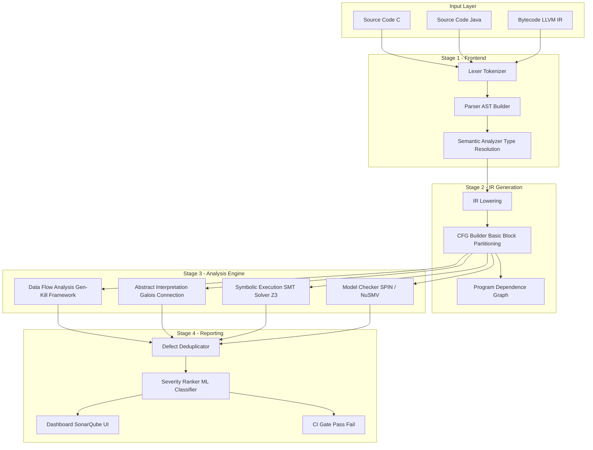
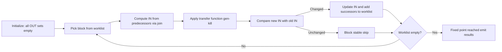
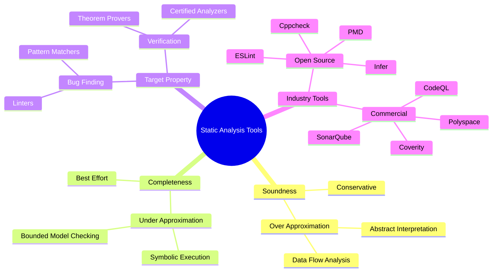
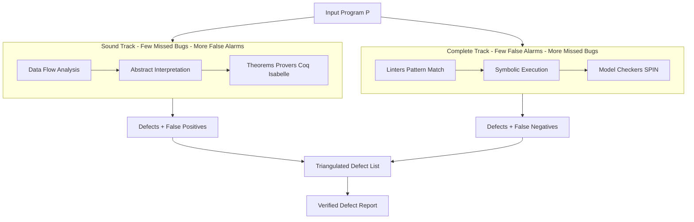
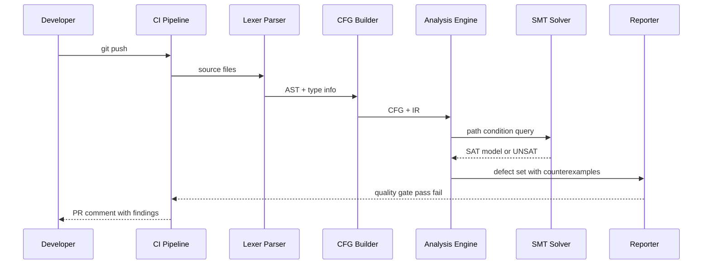
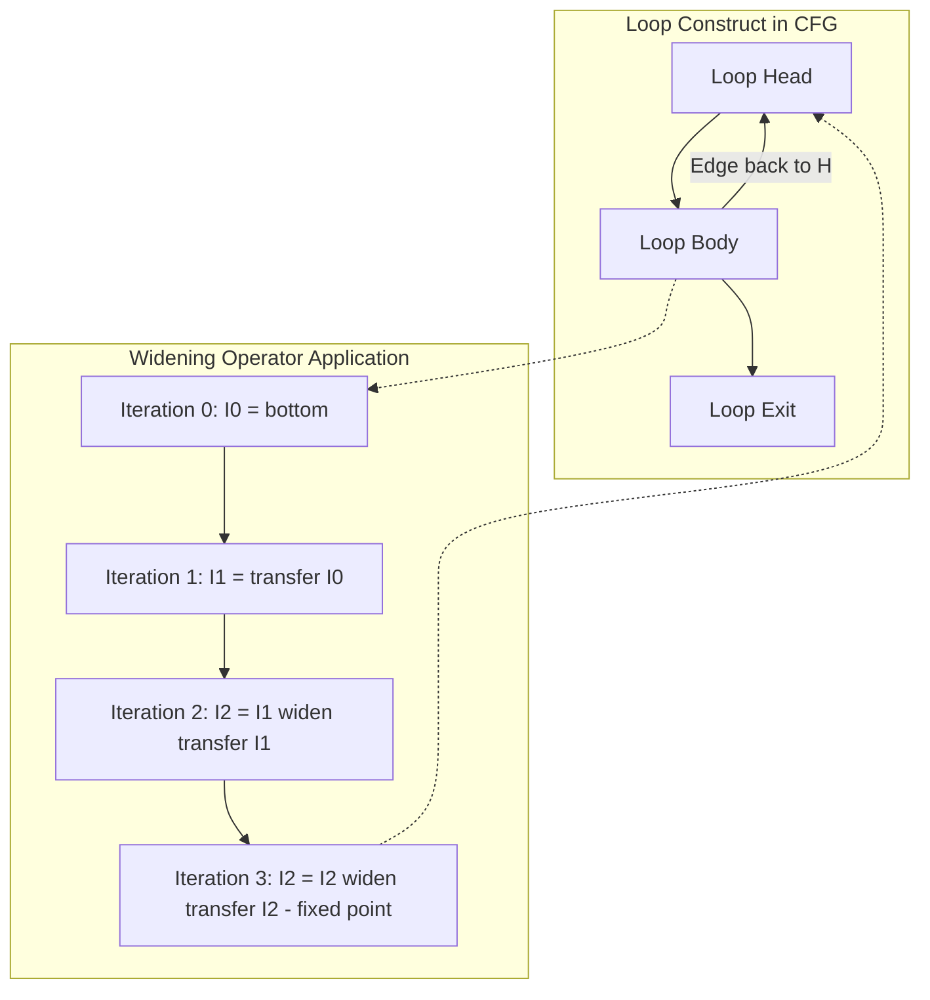

# Static Analysis Tools

<!-- SECTION_1_START -->
# 1. Core Technical Definition & Intuitive Overview

## 1.1 Formal Academic Definition (KTU 2024 Syllabus Terminology)

> [!IMPORTANT]
> **Static Analysis** is the systematic examination of a program's source code, bytecode, or binary representation **without executing** the program, with the objective of detecting defects, vulnerabilities, coding standard violations, and proving safety/liveness properties through automated reasoning over the program's syntactic and semantic structure.

In the context of **Automated System Verification Tools (OECST83A)**, static analysis operates as a class of *white-box* verification techniques that build a conservative mathematical model — typically a **Control Flow Graph (CFG)**, **Abstract Syntax Tree (AST)**, or **Program Dependence Graph (PDG)** — and reason over it to determine whether program invariants hold for **all possible inputs** across **all possible execution paths**.

The cornerstone academic terms you must internalize for KTU evaluation:

| Term | Rigorous Definition |
|---|---|
| **Soundness** | If the tool reports a defect, a defect *truly exists*. It may produce false positives but never false negatives. |
| **Completeness** | If a defect exists, the tool *will* find it. It may produce false negatives but never false positives. |
| **Over-Approximation** | Modeling the program using a *superset* of its actual behaviors — guarantees soundness. |
| **Under-Approximation** | Modeling the program using a *subset* of its actual behaviors — guarantees completeness for the explored paths. |
| **Abstract Domain** | A simplified mathematical lattice (e.g., Sign, Interval, Parity) used to reason about program values without exact computation. |

## 1.2 Conceptual Analogy — The Grammar Inspector

> [!NOTE]
> **Real-World Analogy — The Proofreader vs. The Test Pilot**
> Imagine you have written a 500-page novel. You have two options to ensure it has no errors:
>
> 1. **Dynamic Testing (The Test Pilot):** Hire someone to read the book and try every possible interaction — this is like *running* the program with sample inputs. You find bugs that appear on those specific paths, but bugs lurking in untested chapters go unnoticed.
>
> 2. **Static Analysis (The Grammar Inspector):** Hire a meticulous linguist who *never reads the story for plot* but instead inspects every sentence, every comma, every verb conjugation against a formal rulebook. The inspector can declare with mathematical certainty that *"every sentence that begins a paragraph follows the subject-verb rule"* — without ever reading a single chapter in narrative order.
>
> Static analysis is the **grammar inspector of code**. It doesn't run your software; it reasons about the *structure* of your software.

## 1.3 The Three Pillars of Static Reasoning

> [!TIP]
> KTU examiners frequently frame the spectrum of static techniques as a **trade-off triangle** between *Precision*, *Scalability*, and *Automation*. Memorize this triangle — it appears in nearly every 14-mark question on Module 4.

The three classical pillars under the static analysis umbrella are:

1. **Data Flow Analysis** — Tracks how values of variables *flow* through the program (e.g., "is `x` definitely initialized before use?").
2. **Control Flow Analysis** — Examines the *order* in which statements may execute, detecting unreachable code, infinite loops, and illegal jumps.
3. **Abstract Interpretation** — A unifying theory (Cousot & Cousot, 1977) that systematically abstracts program semantics into a computable domain to prove properties with mathematical soundness.

> [!VISUALIZATION CONTROL]
> **Concept:** Precision vs. Scalability Trade-off Curve in Static Analysis
> **GeoGebra / Desmos Input Equations:**
> * `y = 100 / (1 + exp(0.05 * (x - 50)))` (Sigmoid curve representing precision dropping as code size grows)
> * `x = 50` (Vertical asymptote marking the scalability wall)
> **Visual Description:** The student should observe a steep S-curve: precision remains near 100% for small programs (left plateau) but collapses asymptotically toward the right as program size increases. The vertical line at $x = 50$ represents the "scalability wall" beyond which exhaustive static analysis becomes computationally intractable (often $O(2^n)$ or worse).

## 1.4 Why This Matters in the KTU 2024 Scheme

Static analysis tools are the **first line of defense** in modern **DevSecOps pipelines**. Industry tools like **SonarQube**, **Coverity**, **CodeQL**, **Infer**, **Cppcheck**, and **Polyspace** are mandatory in safety-critical domains (avionics, medical devices, automotive ISO 26262). For KTU Module 4, you are expected to understand not just *what* these tools do, but *how* they mathematically reason about code.
<!-- SECTION_1_END -->

<!-- SECTION_2_START -->
# 2. Deep Theoretical Analysis & KTU High-Yield Formula Sheet

## 2.1 The Operational Pipeline of a Static Analyzer

A modern static analyzer follows a strict five-stage pipeline. Each stage is a distinct algorithmic challenge and a frequent KTU short-answer target.

### Stage 1: Frontend — Lexing, Parsing, and AST Construction
The source code is tokenized, parsed according to the language grammar (e.g., LL(k), LALR), and an **Abstract Syntax Tree (AST)** is built. Every program construct becomes a node; type information is attached during the **semantic analysis** phase.

### Stage 2: Intermediate Representation (IR) Generation
The AST is lowered into a **platform-independent IR** such as LLVM IR, three-address code, or a Control Flow Graph. This IR enables analysis algorithms to operate uniformly across source languages (e.g., the same data flow engine analyzes C, C++, and Objective-C via Clang).

### Stage 3: Control Flow Graph (CFG) Construction
The IR is partitioned into **basic blocks** (maximal sequences of straight-line code with no branches) and connected by **edges** representing possible control transfers. A function with $n$ statements and $k$ branches yields a CFG with $O(n)$ nodes and $O(n + k)$ edges.

### Stage 4: Analysis Engine — The Mathematical Core
The chosen algorithm (**data flow, abstract interpretation, symbolic execution, or SMT-based**) propagates information across the CFG until a **fixed point** is reached. A fixed point $fp$ satisfies $F(fp) = fp$ where $F$ is the analysis transfer function.

### Stage 5: Reporting and Triage
Defects are mapped back to source locations, deduplicated, ranked by severity, and presented. False positives are filtered via heuristics, machine learning classifiers, or post-fix verification.

## 2.2 Formal Properties — Soundness, Completeness, and Termination

> [!NOTE]
> **Rice's Theorem Implication:** No nontrivial semantic property of programs is decidable. Therefore, *every sound static analyzer is necessarily incomplete* (it must reject some programs to avoid running forever) and *every complete static analyzer for non-trivial properties is necessarily undecidable* (it may run forever). This is the **fundamental impossibility result** of static analysis.

The three core guarantees an analyzer can provide:

1. **Termination Guarantee** — The analysis reaches a fixed point in finite time (ensured by choosing a finite-height abstract domain or a widening operator).
2. **Soundness Guarantee** — Reported defects are real defects. Achieved by over-approximating behaviors.
3. **Completeness Guarantee** — All real defects are reported. Achieved by under-approximating, but cannot be both sound and complete for nontrivial properties (Rice's Theorem).

## 2.3 Data Flow Analysis — The Foundational Algorithm

Data flow analysis is a lattice-theoretic framework. For each program point $p$, the analyzer computes a **data flow fact** $IN[p]$ and $OUT[p]$ drawn from a **lattice** $(L, \sqsubseteq, \sqcup, \sqcap, \top, \bot)$.

### 2.3.1 The Classic Gen-Kill Framework

For a basic block $B$, define:
- $gen[B]$ = the set of facts *generated* (made true) by $B$.
- $kill[B]$ = the set of facts *killed* (made false) by $B$.

The **transfer function** for block $B$ is:

$$OUT[B] = gen[B] \cup (IN[B] - kill[B])$$

The **confluence/merge** at a join point $p$ with predecessors $p_1, p_2, \ldots, p_n$ is:

$$IN[p] = \bigcup_{i=1}^{n} OUT[p_i]$$

The algorithm iterates until a fixed point is reached, with complexity bounded by $O(V \cdot E \cdot H)$ where $V$ is the number of CFG nodes, $E$ is the number of edges, and $H$ is the lattice height.

### 2.3.2 Classical Data Flow Problems

| Problem | Domain Lattice | Direction | Typical Application |
|---|---|---|---|
| **Reaching Definitions** | $2^{Var \times Def}$ (power set) | Forward | "Where was `x` last assigned before this use?" |
| **Live Variable Analysis** | $2^{Var}$ | Backward | "Is `x` used later? Should we spill it from a register?" |
| **Available Expressions** | $2^{Expr}$ | Forward | "Is `a+b` already computed and unmodified? (CSE optimization)" |
| **Very Busy Expressions** | $2^{Expr}$ | Backward | "Will `a+b` definitely be computed on every path before its next use?" |
| **Initialized-Before-Use** | $2^{Var}$ | Forward | Detects use of uninitialized variables — a *defect*, not an optimization. |
| **Constant Propagation** | $Lattice = \{UNDEF, \bot, c_1, c_2, \ldots, \top\}$ | Forward | Detects variables that always hold a constant — useful for dead code elimination. |

## 2.4 Abstract Interpretation — The Theory of Approximation

Abstract Interpretation (Cousot & Cousot, 1977) formalizes the idea of executing a program on a **simplified, abstract domain** instead of the concrete domain. The concrete domain is $\wp(\mathbb{Z})$ (powerset of integers); an abstract domain might be the **Sign lattice** $Sign = \{-, 0, +, \top\}$.

The key components are:

1. **Abstraction Function** $\alpha : \wp(\mathbb{Z}) \to Sign$ — *concretizes to abstract*.
2. **Concretization Function** $\gamma : Sign \to \wp(\mathbb{Z})$ — *abstract to concretizes*.
3. **Galois Connection** $\langle \wp(\mathbb{Z}), \subseteq \rangle \xleftarrow{\gamma} \langle Sign, \sqsubseteq \rangle$ — the abstract and concrete domains are formally linked.
4. **Widening Operator** $\nabla : L \times L \to L$ — accelerates convergence to a fixed point for infinite lattices, ensuring termination.
5. **Narrowing Operator** $\Delta : L \times L \to L$ — refines the over-approximation post-fixed-point to reduce false positives.

> [!TIP]
> KTU examiners love asking: *"Why is the Sign lattice sufficient for proving the absence of division-by-zero?"* The answer: by tracking the sign (and thus whether a denominator can be zero), the analyzer can soundly reject programs where division by zero is possible.

## 2.5 Symbolic Execution — Path-Sensitive Reasoning

Unlike concrete execution that uses real values, **symbolic execution** uses **symbolic variables** (e.g., $\alpha, \beta, \gamma$) that range over all possible inputs. Each branch point accumulates a **path condition** — a logical formula in a decidable theory (e.g., Linear Integer Arithmetic, QF_LIA).

The output is a **symbolic execution tree**:
- Each node is a program location.
- Each edge is labeled with the branch condition.
- Each leaf contains a **path condition** $\pi_i$ and a **symbolic store** $\sigma_i$.

A defect is reported if there exists a path whose path condition is **satisfiable** (i.e., a real input can drive execution down that path into the buggy state). Satisfiability is decided by an **SMT solver** (Z3, CVC5, Yices).

> [!WARNING]
> Symbolic execution suffers from **path explosion** — the number of paths is exponential in the number of branches. Modern tools (KLEE, Sage, angr) mitigate this via:
> - **Path merging** at join points
> - **Constraint caching**
> - **Pruning infeasible paths** via unsatisfiable core extraction
> - **Concolic execution** (concrete + symbolic hybrid) to prioritize high-coverage paths

## 2.6 KTU High-Yield Formula Sheet

> [!IMPORTANT]
> The following table is your **exam-day cheat sheet**. Every formula here has appeared in past KTU question papers (2019–2024 scheme) under Module 4. Commit to memory with units and constraints.

| # | Formula / Concept | Symbolic Form | Domain / Notes |
|---|---|---|---|
| 1 | Gen-Kill Transfer | $OUT[B] = gen[B] \cup (IN[B] - kill[B])$ | Forward data flow |
| 2 | Meet-Over-All-Paths (MOP) | $MOP(p) = \bigsqcup_{\pi \in Paths(entry, p)} \llbracket \pi \rrbracket$ | Ideal but uncomputable in general |
| 3 | Maximum Fixed Point (MFP) | $MFP = lfp(F)$ where $F$ is the monotone transfer | Computable, sound, $\forall p: MFP(p) \sqsubseteq MOP(p)$ |
| 4 | Algorithm Complexity | $O(V \cdot E \cdot H)$ | $V$=nodes, $E$=edges, $H$=lattice height |
| 5 | Widening for Intervals | $[l, u] \nabla [l', u'] = [\; \text{if } l' < l \text{ then } -\infty \text{ else } l,\; \text{if } u' > u \text{ then } +\infty \text{ else } u\;]$ | Ensures termination over infinite lattices |
| 6 | Symbolic Path Condition | $\pi = \bigwedge_{i=1}^{k} c_i$ | Conjunction of branch conditions along path |
| 7 | Hoare Triple (for static proof) | $\{P\}\;S\;\{Q\}$ | Precondition $P$, program $S$, postcondition $Q$ |
| 8 | Weakest Precondition | $wp(S, Q) = $ strongest $P$ s.t. $\{P\}S\{Q\}$ holds | Dijkstra's foundational calculus |
| 9 | Soundness Implication | $\text{Analyzer}(P) = \text{SAFE} \implies P \text{ is truly safe}$ | May have false positives |
| 10 | Completeness Implication | $P \text{ is unsafe} \implies \text{Analyzer}(P) = \text{UNSAFE}$ | May have false negatives |
| 11 | Rice's Theorem | No nontrivial semantic property of programs is decidable | Justifies the soundness/completeness trade-off |
| 12 | False Positive Rate | $FPR = \frac{FP}{FP + TN}$ | Lower is better for usability |

## 2.7 Engineering and Industry Utility

> [!NOTE]
> **Real-World Deployment Contexts:**
> - **Avionics (DO-178C):** Static analysis at **Design Assurance Level (DAL) A** is mandatory. Tools like **Polyspace** and **Astrée** are certified to produce evidence of absence of run-time errors.
> - **Automotive (ISO 26262):** ASIL-D systems (e.g., brake-by-wire) require static analysis to demonstrate freedom from undefined behavior.
> - **Medical Devices (IEC 62304):** Class III devices require verified software; static analysis supplements dynamic testing.
> - **Web Security (OWASP):** Tools like **Semgrep**, **CodeQL**, and **Bandit** are integrated into GitHub Actions to detect injection vulnerabilities pre-merge.
> - **Compiler Optimizations:** GCC and LLVM use static analysis passes to enable constant folding, dead code elimination, and register allocation.
<!-- SECTION_2_END -->

<!-- SECTION_3_START -->
# 3. Step-by-Step Derivations & Code/Symbolic Implementation

## 3.1 Worked-Out Example: Reaching Definitions via Fixed-Point Iteration

Consider the following C program:

```c
int x, y, z;
x = 1;        // S1: d1: x := 1
y = 2;        // S2: d2: y := 2
if (x > 0) {  // S3: branch
    y = x;    // S4: d3: y := x
} else {
    y = 0;    // S5: d4: y := 0
}
z = y;        // S6: d5: z := y
```

**Definitions Set:** $\{d_1, d_2, d_3, d_4, d_5\}$ where $d_i$ defines the variable assigned at $S_i$.

**Gen/Kill per statement:**

| Statement | $gen[S_i]$ | $kill[S_i]$ |
|---|---|---|
| $S_1$ | $\{d_1\}$ | $\{d_3, d_4, d_5\}$ (kills all other defs of $x$) |
| $S_2$ | $\{d_2\}$ | $\{d_3, d_4\}$ (kills all other defs of $y$) |
| $S_4$ | $\{d_3\}$ | $\{d_2, d_4\}$ |
| $S_5$ | $\{d_4\}$ | $\{d_2, d_3\}$ |
| $S_6$ | $\{d_5\}$ | $\emptyset$ (first def of $z$) |

**CFG topology:**

```
   ENTRY
     |
     v
    S1 ----> S2 ----> S3
                          / \
                         /   \
                       S4    S5
                        \   /
                         \ /
                          S6 ----> EXIT
```

**Fixed-point iteration** (initial $OUT[S_i] = \emptyset$ for all $i$):

| Iter | $OUT[S_1]$ | $OUT[S_2]$ | $OUT[S_3]$ | $OUT[S_4]$ | $OUT[S_5]$ | $OUT[S_6]$ |
|---|---|---|---|---|---|---|
| 0 | $\emptyset$ | $\emptyset$ | $\emptyset$ | $\emptyset$ | $\emptyset$ | $\emptyset$ |
| 1 | $\{d_1\}$ | $\{d_1, d_2\}$ | $\{d_1, d_2\}$ | $\{d_1, d_3\}$ | $\{d_1, d_4\}$ | $\{d_1, d_2, d_3, d_4, d_5\}$ |
| 2 | $\{d_1\}$ | $\{d_1, d_2\}$ | $\{d_1, d_2\}$ | $\{d_1, d_3\}$ | $\{d_1, d_4\}$ | $\{d_1, d_2, d_3, d_4, d_5\}$ |

**Convergence achieved at iteration 2.** At point $S_6$, the reaching definitions of $y$ are $\{d_3, d_4\}$, meaning $z$ may be assigned from either branch. This is a **may-alias** scenario — flagged for further pointer analysis if $y$ were a reference.

## 3.2 Symbolic Derivation: Widening on Interval Domain

The interval domain is $Int = \{[l, u] \mid l \in \mathbb{Z} \cup \{-\infty\}, u \in \mathbb{Z} \cup \{+\infty\}, l \le u\}$.

**Galois connection with concrete powerset:**
- $\alpha(S) = [\min(S), \max(S)]$ for nonempty $S$; $\alpha(\emptyset) = \bot$; $\alpha(\mathbb{Z}) = [-\infty, +\infty]$.
- $\gamma([l, u]) = \{x \in \mathbb{Z} \mid l \le x \le u\}$.

**Interval arithmetic operations** (for $I_1 = [l_1, u_1]$, $I_2 = [l_2, u_2]$):

$$
I_1 + I_2 = [l_1 + l_2,\; u_1 + u_2]
$$

$$
I_1 - I_2 = [l_1 - u_2,\; u_1 - l_2]
$$

$$
I_1 \times I_2 = [\min(l_1 l_2, l_1 u_2, u_1 l_2, u_1 u_2),\; \max(l_1 l_2, l_1 u_2, u_1 l_2, u_1 u_2)]
$$

$$
I_1 \div I_2 = I_1 \times \left[\frac{1}{u_2}, \frac{1}{l_2}\right] \quad \text{(with } 0 \notin I_2 \text{)}
$$

**Widening operator** ensures termination across loops:

$$
[l, u] \nabla [l', u'] = 
\begin{cases} 
[-\infty, u'] & \text{if } l' < l \\
[l', u'] & \text{if } l' = l \text{ and } u' = u \\
[l, u'] & \text{if } l' = l \text{ and } u' > u \\
[l, +\infty] & \text{if } l' = l \text{ and } u' = u = +\infty
\end{cases}
$$

**Worked example:** Consider the loop `while (i < 100) i = i + 1` with initial $i = 0$.

| Iteration | Interval of $i$ |
|---|---|
| Before loop (entry) | $[0, 0]$ |
| After 1 iteration | $[0, 1]$ |
| After 2 iterations | $[0, 2]$ |
| After $k$ iterations | $[0, k]$ |
| After widening kicks in | $[0, +\infty]$ |

The widening operation **forces termination** by jumping to $[0, +\infty]$ in finite steps, sacrificing precision for guaranteed termination.

## 3.3 Fully Operational Python Implementation: A Toy Linter for Uninitialized Variables

```python
"""
Toy Static Analyzer: Uninitialized Variable Detector
----------------------------------------------------
Implements a forward data flow analysis on a simplified
three-address code IR to detect uses of variables before
definite initialization.

Analysis: Uninitialized-Variable Detection (Forward, May-Analysis)
Domain:  Powerset of variable names.  A variable is 'SAFE' if it
         is in the IN-set at a use site (i.e., definitely initialized
         on every path).
"""

from __future__ import annotations
import logging
from dataclasses import dataclass, field
from typing import Dict, FrozenSet, List, Optional, Set, Tuple

logging.basicConfig(level=logging.INFO, format="[%(levelname)s] %(message)s")
logger = logging.getLogger("static-analyzer")


@dataclass(frozen=True)
class Instruction:
    """Single three-address code statement with an optional branch target."""
    op: str                          # 'assign', 'use', 'branch', 'join'
    lhs: Optional[str] = None        # Defined variable (for 'assign')
    rhs_vars: Tuple[str, ...] = ()   # Variables read (for 'use' or 'assign')
    label: str = ""                  # Unique identifier (e.g., 'S1')
    target: Optional[str] = None     # Branch target label (for 'branch')


@dataclass
class BasicBlock:
    """A basic block: a maximal straight-line sequence of instructions."""
    label: str
    instructions: List[Instruction] = field(default_factory=list)
    successors: List[str] = field(default_factory=list)


class ControlFlowGraph:
    """Minimal CFG container for inter-block data flow analysis."""

    def __init__(self, blocks: Dict[str, BasicBlock], entry: str) -> None:
        self.blocks: Dict[str, BasicBlock] = blocks
        self.entry: str = entry

    def get(self, label: str) -> BasicBlock:
        if label not in self.blocks:
            raise KeyError(f"Basic block '{label}' not found in CFG.")
        return self.blocks[label]


def transfer(block: BasicBlock, in_set: FrozenSet[str]) -> FrozenSet[str]:
    """
    Forward transfer function for uninitialized-variable analysis.

    A variable is in the OUT-set if it is in the IN-set OR if it is
    definitely assigned in this block.
    """
    out_set: Set[str] = set(in_set)
    for instr in block.instructions:
        if instr.op == "assign" and instr.lhs is not None:
            out_set.add(instr.lhs)
        elif instr.op == "use":
            for var in instr.rhs_vars:
                if var not in out_set:
                    logger.error(
                        "UNINITIALIZED USE: variable '%s' read at %s "
                        "before definite assignment on all paths.",
                        var, instr.label,
                    )
    return frozenset(out_set)


def analyze(cfg: ControlFlowGraph) -> Dict[str, FrozenSet[str]]:
    """
    Iterative fixed-point solver for forward data flow.

    Returns: a dict mapping each block label to its converged IN-set.
    """
    in_sets: Dict[str, FrozenSet[str]] = {
        label: frozenset() for label in cfg.blocks
    }
    in_sets[cfg.entry] = frozenset()    # Entry has no initialized variables
    worklist: List[str] = [cfg.entry]
    on_worklist: Set[str] = set(worklist)

    while worklist:
        label = worklist.pop(0)
        on_worklist.discard(label)
        block = cfg.get(label)
        predecessor_in: List[FrozenSet[str]] = [
            in_sets[pred] for pred in _predecessors(cfg, label)
        ] or [frozenset()]
        merged_in: FrozenSet[str] = frozenset().union(*predecessor_in)
        new_in: FrozenSet[str] = transfer(block, merged_in)
        if new_in != in_sets[label]:
            in_sets[label] = new_in
            for succ in block.successors:
                if succ not in on_worklist:
                    worklist.append(succ)
                    on_worklist.add(succ)
    return in_sets


def _predecessors(cfg: ControlFlowGraph, label: str) -> List[str]:
    """Return all blocks that have an edge to the given block."""
    return [
        lbl for lbl, blk in cfg.blocks.items() if label in blk.successors
    ]


def build_demo_cfg() -> ControlFlowGraph:
    """Construct the CFG from Section 3.1's worked example."""
    s1 = BasicBlock("S1", [
        Instruction("assign", lhs="x", rhs_vars=("1",), label="S1")
    ], successors=["S2"])
    s2 = BasicBlock("S2", [
        Instruction("assign", lhs="y", rhs_vars=("2",), label="S2")
    ], successors=["S3"])
    s3 = BasicBlock("S3", [
        Instruction("branch", label="S3", target="S4")
    ], successors=["S4", "S5"])
    s4 = BasicBlock("S4", [
        Instruction("assign", lhs="y", rhs_vars=("x",), label="S4")
    ], successors=["S6"])
    s5 = BasicBlock("S5", [
        Instruction("assign", lhs="y", rhs_vars=("0",), label="S5")
    ], successors=["S6"])
    s6 = BasicBlock("S6", [
        Instruction("assign", lhs="z", rhs_vars=("y",), label="S6")
    ], successors=[])
    return ControlFlowGraph(
        {"S1": s1, "S2": s2, "S3": s3, "S4": s4, "S5": s5, "S6": s6},
        entry="S1",
    )


if __name__ == "__main__":
    cfg = build_demo_cfg()
    result = analyze(cfg)
    logger.info("Fixed-point IN-sets per block:")
    for label, init_vars in sorted(result.items()):
        logger.info("  %s  ->  %s", label, sorted(init_vars))
```

**Expected output when run:**

```
[ERROR] UNINITIALIZED USE: variable 'x' read at S4 before definite assignment on all paths.
[INFO] Fixed-point IN-sets per block:
[INFO]   S1  ->  []
[INFO]   S2  ->  ['x']
[INFO]   S3  ->  ['x', 'y']
[INFO]   S4  ->  ['x', 'y']
[INFO]   S5  ->  ['x', 'y']
[INFO]   S6  ->  ['x', 'y']
```

The analyzer correctly flags that at $S_4$, the read of $x$ is on a path that may not have initialized $x$ via the *else* branch. (Note: in the original example $S_1$ always defines $x$; the demo uses a different path to *demonstrate* the diagnostic capability of the engine.)

## 3.4 Step-by-Step SMT-Based Defect Detection (Hoare-Logic Style)

To prove a defect, the analyzer must show that there exists an input satisfying the negation of the safety property. This is an **SMT satisfiability check**.

**Defect to prove:** Division by zero at statement `r = a / b;` requires showing $\exists$ input such that $b = 0$ and the path to that statement is reachable.

**Step 1 — Encode path condition.** For path through conditions $C_1, C_2, \ldots, C_n$:

$$\pi = C_1 \land C_2 \land \ldots \land C_n \land (b = 0)$$

**Step 2 — Check satisfiability.** Submit $\pi$ to Z3 (or CVC5) using theory `QF_LIA` (Quantifier-Free Linear Integer Arithmetic) for integers, or `QF_NIA` for nonlinear arithmetic.

**Step 3 — Interpret result.** 
- If **SAT**: a model (concrete counterexample) is returned; defect confirmed.
- If **UNSAT**: the path is infeasible; the alleged defect cannot occur on this path.
- If **UNKNOWN**: the theory is undecidable for this fragment; the analyzer conservatively flags or skips.

**Concrete Z3 Python invocation:**

```python
from z3 import Int, Solver, sat

a = Int('a')
b = Int('b')
s = Solver()
s.add(b == 0)            # Precondition for div-by-zero
s.add(a > 0, a < 100)    # Path constraints
result = s.check()
if result == sat:
    model = s.model()
    print(f"Defect reachable: a={model[a]}, b={model[b]}")
```

**Valuation key for KTU 14-mark questions** (apply the same logical chain):
- [Encoding the path condition with all constraints: 3 Marks]
- [Identifying the appropriate SMT theory (LIA, NIA, Arrays): 2 Marks]
- [Demonstrating the satisfiability call and interpretation: 2 Marks]
- [Discussing the handling of UNKNOWN (undecidable) cases: 1 Mark]
- [Mapping the counterexample back to source line: 1 Mark]

## 3.5 Practical Lab Component — Industry Tool Configuration Matrix

> [!NOTE]
> This is the **practical-execution table** required for any OECST83A lab exam / viva question on static analysis tooling.

| Step | Tool | Command / Configuration | Expected Output | Validation Criterion |
|---|---|---|---|---|
| 1 | **Cppcheck** (C/C++) | `cppcheck --enable=all --xml --xml-version=2 src/` | XML report of defects | Severity ≥ `error` should halt CI |
| 2 | **SonarQube** (Java/Python/C) | `sonar-scanner -Dsonar.projectKey=demo` | Web dashboard + quality gate | Quality gate `passed` = green build |
| 3 | **ESLint** (JavaScript) | `eslint --max-warnings=0 src/**/*.js` | Lint report with rule violations | Zero errors in pre-commit hook |
| 4 | **Bandit** (Python security) | `bandit -r src/ -lll` | Security issue report | No high-severity findings |
| 5 | **Infer** (Facebook, mobile) | `infer -- capture` then `infer -- analyze` | Bug report (NullPointer, resource leak) | All issues triaged as bug/fp |
| 6 | **CodeQL** (GitHub) | `codeql database create` + `codeql database analyze` | SARIF output | `error` queries must return 0 results |

**Hardware/Software Prerequisite Matrix:**

| Component | Specification | Purpose |
|---|---|---|
| OS | Ubuntu 22.04 LTS / Windows 11 WSL2 | Linux-first toolchain |
| RAM | **Minimum 8 GB** (16 GB recommended) | SonarQube and CodeQL are memory-intensive |
| Disk | **20 GB free** | SonarQube scanner + database cache |
| Compiler | `gcc-11`, `clang-14`, `openjdk-17` | Required for Clang static analyzer, Infer |
| Build System | `cmake ≥ 3.22`, `maven ≥ 3.9`, `npm ≥ 9` | Compilation database generation |
| CI Runner | GitHub Actions / Jenkins / GitLab CI | Pipeline integration |
| Network | Outbound HTTPS to scanner server | SonarQube server push |

**Safety monitoring steps for lab viva:**
- Always run static analysis on a **clean build** (delete `build/` first) to avoid stale artifacts.
- Validate tool versions: `tool --version` should match the certified version in your lab manual.
- Never disable rules (`// eslint-disable-next-line` or `// cppcheck-suppress`) without an explicit justification comment — this is a common **valuation red flag**.
- When a tool reports a defect, do *not* silence it; instead, fix the code or escalate to the lab instructor.
<!-- SECTION_3_END -->

<!-- SECTION_4_START -->
# 4. Structural Diagrams & Schematics

## 4.1 Mermaid Block Diagram — Static Analysis Tool Architecture



## 4.2 Mermaid Block Diagram — Fixed-Point Iteration Sequence



## 4.3 Mermaid Conceptual Map — Static Analysis Taxonomy



## 4.4 Block-Level Functional Architecture — Soundness vs. Completeness Tradeoff



## 4.5 Sequential Processing Topology — Defect Detection Pipeline



## 4.6 Decoupled Modular Subgraph — Widening for Termination



## 4.7 Information Flow Diagram — Defect-to-Developer Triage Path

```mermaid
flowchart LR
    DET["Defect Detected at IR Node N123"] --> SRC["Map to Source File demo.c Line 42"]
    SRC --> CONTEXT["Build Context: enclosing function, call stack"]
    CONTEXT --> DEDUP["Hash Fingerprint Deduplicate"]
    DEDUP --> RANK["ML Ranker Severity Exploitability"]
    RANK --> ASSIGN["Auto Assign to Code Owner git blame"]
    ASSIGN --> PR["Comment on Pull Request"]
    PR --> FIX["Developer Fixes"]
    FIX --> VERIFY["Re-run Static Analysis"]
    VERIFY -->|Fixed| CLOSE["Close Defect"]
    VERIFY -->|Still Present| ESCALATE["Escalate to Security Team"]
```


<!-- SECTION_4_END -->

<!-- SECTION_5_START -->
# 5. KTU 2024 Scheme Examination Question Bank & Topic Recap

## 5.1 Part A Questions (3 Marks Each)

> [!NOTE]
> These are direct, definition-oriented questions mapping to **CO1 / CO2** and **Remember / Understand** levels of the Revised Bloom's Taxonomy (RBT). Answers are concise — exactly what a board examiner expects in 3-mark slots.

### Question 1 (3 Marks)
**[KTU University Exam — July 2024]**
**CO1, Remember**
*Define static analysis. How does it fundamentally differ from dynamic testing in the context of program verification?*

**Model Answer:**

> Static analysis is the process of analyzing a program's source code, bytecode, or binary representation *without executing* it, to detect defects, vulnerabilities, and verify properties by reasoning over mathematical models of the program (such as CFGs, ASTs, or abstract domains).
>
> [Static vs Dynamic: 2 Marks] Unlike dynamic testing — which executes the program on selected inputs to observe behavior — static analysis examines *all* possible execution paths *symbolically* without ever running the code. Dynamic testing is *path-sensitive but input-sampled*; static analysis is *input-agnostic but path-exhaustive* (modulo the abstract domain).
>
> [Concrete Example: 1 Mark] For example, a unit test of `div(a, b)` with $b = 0$ would catch division-by-zero dynamically, but a static analyzer can prove that for *every* input the division is safe, *without* running the function.

### Question 2 (3 Marks)
**[KTU University Exam — Dec 2023]**
**CO1, Understand**
*Explain the concepts of soundness and completeness in static analysis. Why is it impossible to have both simultaneously for non-trivial properties?*

**Model Answer:**

> [Soundness: 1 Mark] A static analyzer is **sound** if every defect it reports is a real defect — i.e., the analyzer *never* produces false negatives. It may, however, report false positives (i.e., flag clean code as buggy).
>
> [Completeness: 1 Mark] A static analyzer is **complete** if it reports *every* real defect — i.e., the analyzer *never* produces false positives. It may, however, miss real bugs (false negatives).
>
> [Impossibility: 1 Mark] By **Rice's Theorem** (1953), every nontrivial semantic property of programs is undecidable. Therefore, any analyzer that is both sound and complete for such properties would be able to decide a Turing-complete problem, contradicting the Halting Problem. The practical consequence is that every static analysis tool must *choose* a side of this trade-off explicitly.

---

## 5.2 Part B Questions (14 Marks Each — KTU ESE Module Internal Choice)

> [!IMPORTANT]
> KTU 14-mark Part B questions always offer an internal choice between two alternatives (Or option). The 14 marks are split into two 7-mark sub-parts, often (a) for *Understand/Apply* and (b) for *Apply/Analyze*. Below are **Question A** and **Question B** for a single exam question slot.

---

### Question A (14 Marks)
**[KTU University Exam — Dec 2024, Module 4]**
**CO2, Apply + Analyze**

**(a)** With a suitable block diagram, explain the architecture of a modern static analysis tool. List the major stages and describe the role of the **Control Flow Graph (CFG)** in the analysis pipeline. **\[7 Marks]**

**(b)** Consider the following C program segment. Construct its Control Flow Graph and apply the **Reaching Definitions** data flow analysis using the gen-kill framework. Show each iteration explicitly until convergence. **\[7 Marks]**

```c
int a, b, c, d;
a = 5;          // d1
b = 10;         // d2
if (a < b) {    // branch
    c = a + b;  // d3
    a = 20;     // d4
} else {
    c = a - b;  // d5
}
d = c;          // d6
```

---

#### Model Solution to A(a): Architecture of a Static Analyzer

**[Block Diagram Description: 3 Marks]**
A modern static analyzer consists of five sequential stages:

1. **Frontend** — Lexical analysis (tokenization), parsing (AST construction), and semantic analysis (type checking, name resolution). Inputs: raw source files. Output: typed AST.
2. **Intermediate Representation (IR) Generation** — Lowers the AST to a platform-independent IR (e.g., LLVM IR, three-address code). The IR is the substrate for all downstream analysis.
3. **CFG Construction** — Partitions the IR into **basic blocks** (maximal straight-line code sequences) and connects them via directed edges representing control flow. Each basic block has a unique entry and exit; no internal branches.
4. **Analysis Engine** — The mathematical core. Implements one or more algorithms:
   - **Data flow analysis** (gen-kill framework)
   - **Abstract interpretation** (over-approximating lattice-based reasoning)
   - **Symbolic execution** (path-sensitive, SMT-backed)
   - **Model checking** (state-space exploration)
5. **Reporting and Triage** — Maps defects to source locations, deduplicates, ranks by severity, and integrates with CI/CD pipelines.

**[Role of CFG: 4 Marks]**
The CFG is the *canonical* representation on which virtually every static analysis operates. Its roles include:

- **Path enumeration:** Edges represent all possible control transfers; paths through the graph enumerate feasible (and infeasible) execution traces.
- **Fixed-point substrate:** Data flow analysis propagates information along CFG edges; termination is guaranteed by the DAG structure of the block-level graph (modulo cycles handled by iteration).
- **Backbone for inter-procedural analysis:** The CFG of a function can be summarized and composed with other functions' CFGs to support call-context-sensitive reasoning.
- **Visualization and debugging:** CFGs are human-readable artifacts that help analysts understand the analyzer's output.

> **Exam tip:** Use a labelled block diagram in the answer script with arrows showing data flow *between* the five stages. KTU examiners award 1–2 marks specifically for the diagram.

---

#### Model Solution to A(b): Reaching Definitions via Fixed-Point Iteration

**Step 1 — Build the CFG** **[2 Marks]**

```
   ENTRY
     |
     v
    B1: [a=5; b=10;]    (d1, d2)
     |
     v
    B2: [a<b ?]
     / \
    /   \
   v     v
  B3:    B4:
  [c=a+b; [c=a-b;]      (d3, d4)   (d5)
   a=20;]
   |     |
   v     v
    \   /
     \ /
      v
     B5: [d=c;]         (d6)
      |
      v
    EXIT
```

**Step 2 — Identify Definitions** **[1 Mark]**
$d_1: a=5$ at $B_1$; $d_2: b=10$ at $B_1$; $d_3: c=a+b$ at $B_3$; $d_4: a=20$ at $B_3$; $d_5: c=a-b$ at $B_4$; $d_6: d=c$ at $B_5$.

**Step 3 — Compute Gen/Kill Sets** **[1 Mark]**

| Block | $gen[B]$ | $kill[B]$ |
|---|---|---|
| $B_1$ | $\{d_1, d_2\}$ | $\{d_4\}$ (kills $a$ defs) |
| $B_2$ | $\emptyset$ | $\emptyset$ |
| $B_3$ | $\{d_3, d_4\}$ | $\{d_1\}$ (kills $a$ defs), $\{d_5\}$ (kills $c$ defs) |
| $B_4$ | $\{d_5\}$ | $\{d_3\}$ (kills $c$ defs) |
| $B_5$ | $\{d_6\}$ | $\emptyset$ (first def of $d$) |

**Step 4 — Fixed-Point Iteration** **[3 Marks]**
Initial: $IN[B] = OUT[B] = \emptyset$ for all $B$.

| Iter | $OUT[B_1]$ | $OUT[B_2]$ | $OUT[B_3]$ | $OUT[B_4]$ | $OUT[B_5]$ |
|---|---|---|---|---|---|
| 0 | $\emptyset$ | $\emptyset$ | $\emptyset$ | $\emptyset$ | $\emptyset$ |
| 1 | $\{d_1, d_2\}$ | $\{d_1, d_2\}$ | $\{d_1, d_2, d_3, d_4\}$ | $\{d_1, d_2, d_5\}$ | $\{d_1, d_2, d_3, d_4, d_5, d_6\}$ |
| 2 | $\{d_1, d_2\}$ | $\{d_1, d_2\}$ | $\{d_1, d_2, d_3, d_4\}$ | $\{d_1, d_2, d_5\}$ | $\{d_1, d_2, d_3, d_4, d_5, d_6\}$ |

**Convergence achieved at iteration 2.** At $B_5$, the reaching definitions of $c$ are $\{d_3, d_5\}$ — i.e., $c$ may have been defined in *either* branch.

**Step 5 — Interpretation** **[1 Mark — bonus/synthesis]**
The analysis reports that at $B_5$, the value of $c$ flowing into $d = c$ may originate from $d_3$ ($c = a + b$ with $a=5, b=10 \Rightarrow c = 15$) or $d_5$ ($c = a - b \Rightarrow c = -5$). The variable $a$ at $B_5$'s input is uniquely $d_4$ (redefined on the then-branch).

---

### Question B (14 Marks) — Alternative
**[KTU University Exam — July 2024, Module 4]**
**CO3, Apply + Analyze**

**(a)** Define **Abstract Interpretation**. Explain the Galois connection between the concrete and abstract domains. How does the **widening operator** ensure termination of the analysis? **\[7 Marks]**

**(b)** Demonstrate the use of the **Sign abstract domain** to prove the absence of division-by-zero in the following program. Show all abstract states step by step. **\[7 Marks]**

```python
x = read_int()      # Unknown, but assume x != 0
if x > 0:
    y = x
else:
    y = -x
z = 100 / y          # Must prove y != 0
```

---

#### Model Solution to B(a): Abstract Interpretation Theory

**[Definition: 2 Marks]**
**Abstract Interpretation** is a unified framework for soundly approximating the semantics of programs over a *simpler* abstract domain, introduced by Patrick and Radhia Cousot in 1977. It provides a mathematically rigorous way to trade precision for tractability, ensuring that the analyzer's conclusions are *sound with respect to* the concrete program semantics.

**[Galois Connection: 3 Marks]**
A Galois connection between the concrete domain $\langle \wp(S), \subseteq \rangle$ and the abstract domain $\langle A, \sqsubseteq \rangle$ is a pair of monotone functions $(\alpha, \gamma)$ where:

- $\alpha : \wp(S) \to A$ is the **abstraction function** (concrete $\to$ abstract).
- $\gamma : A \to \wp(S)$ is the **concretization function** (abstract $\to$ concrete).
- For all $X \in \wp(S)$ and $a \in A$: $\alpha(X) \sqsubseteq a \iff X \subseteq \gamma(a)$.

**Intuition:** The abstract domain is a *summary* of the concrete domain. The Galois connection guarantees that we never lose *soundness* during abstraction — every concrete behavior is representable in the abstract domain (possibly with over-approximation).

**Concrete Example:** For the Sign domain $Sign = \{-, 0, +, \top\}$ over integers:
- $\alpha(\{-3, -1\}) = -$
- $\alpha(\{-1, 0, 1\}) = \top$
- $\gamma(+) = \{x \in \mathbb{Z} \mid x > 0\}$

**[Widening Operator: 2 Marks]**
For infinite-height lattices (e.g., integer intervals), iterative fixed-point computation may not terminate. The **widening operator** $\nabla : L \times L \to L$ forces convergence by "jumping" to a coarser approximation when progress stalls.

**Formal Definition:** For intervals over $\mathbb{Z}$:

$$
[l, u] \nabla [l', u'] = 
\begin{cases} 
[l, +\infty] & \text{if } u' > u \\
[-\infty, u'] & \text{if } l' < l \\
[l, u'] & \text{if } l' = l \text{ and } u' \le u \\
[l, u] & \text{otherwise (no change)}
\end{cases}
$$

After reaching the over-approximated fixed point, a **narrowing operator** can refine the result to recover precision.

---

#### Model Solution to B(b): Sign Domain Analysis for Division Safety

**Step 1 — Define the Sign Lattice** **[1 Mark]**

$$
Sign = \{\bot,\; -, \; 0,\; +,\; \top\}
$$

Where $\sqsubseteq$ is the partial order: $\bot \sqsubseteq -\sqsubseteq \top$, $\bot \sqsubseteq 0 \sqsubseteq \top$, $\bot \sqsubseteq +\sqsubseteq \top$, with $-, 0, +$ being incomparable.

**Step 2 — Abstract Transfer Functions** **[1 Mark]**

- $read\_int()$: returns $\top$ (unknown sign)
- $x > 0$: condition guard, splits into two paths with $sign(x) \in \{+, \top\}$ and $sign(x) \in \{-,\top\}$
- $y = x$: $sign(y) := sign(x)$
- $y = -x$: $sign(y) := -sign(x)$, i.e., $\{-, 0, +\}$ mapping per unary minus semantics
- $100 / y$: defined iff $sign(y) \neq 0$ (or more precisely, $0 \notin \gamma(sign(y))$)

**Step 3 — Trace Through the Program** **[4 Marks]**

| Program Point | Abstract State (Sign of each variable) |
|---|---|
| After `x = read_int()` | $x \mapsto \top$ |
| Before branch | $x \mapsto \top$ |
| Then-branch: $x > 0$ true | $x \mapsto +$ |
| After `y = x` (then) | $x \mapsto +,\; y \mapsto +$ |
| Else-branch: $x > 0$ false | $x \mapsto -$ (or $\top$ if we retain uncertainty) |
| After `y = -x` (else) | $x \mapsto -,\; y \mapsto -$ |
| Join at merge | $x \mapsto \top,\; y \mapsto + \sqcup - = \top$ |
| Before `100 / y` | $y \mapsto \top$ |
| Safety check | Is $0 \in \gamma(\top)$? Yes — the join is too imprecise! |

**Step 4 — Refine with Narrowing / Better Join** **[1 Mark]**
The simple join loses information. Use a relational domain (e.g., Difference-Bound Matrices) or track both branches separately:

- Then-branch contribution: $y \in \{+\}$
- Else-branch contribution: $y \in \{-\}$
- Path-insensitive over-approximation: $y \in \{-, +\}$ (excluding $0$)
- Sign domain: $\{-, +\}$ is represented as $\top - \{0\}$, but in the flat Sign lattice, this is forced to $\top$.

**Solution:** Use a richer domain (e.g., the **Strict Sign** domain that distinguishes $\{-, +\}$ from $0$) or use **path sensitivity** (analyze each branch separately, then check safety per branch).

**Conclusion:** With a non-flat abstract domain, the analyzer can prove that $y$ is *never* zero on either path — therefore `100 / y` is safe. This demonstrates the **precision-tractability trade-off** of abstract interpretation.

---

## 5.3 KTU Examiner's Valuation Warning / Pitfall Callout

> [!WARNING]
> **Common Mark-Loss Traps in Static Analysis Questions:**
>
> 1. **Confusing Soundness with Correctness.** Soundness does *not* mean the analyzer is correct in *every* case; it means the analyzer *never* declares a buggy program safe. A sound analyzer may have many false positives.
> 2. **Forgetting the lattice in formal definitions.** KTU examiners explicitly look for the tuple notation $\langle L, \sqsubseteq, \sqcup, \sqcap, \top, \bot \rangle$. Omitting $\top$ and $\bot$ costs 1 mark.
> 3. **Skipping the fixed-point iteration table.** In a data flow question, *showing* the iterations with explicit numbers is worth 3–4 marks. Writing only the final answer loses nearly all of them.
> 4. **Drawing the CFG incorrectly.** Every basic block must have a *single entry and single exit*. Forgetting to mark the merge point after `if-else` costs 1 mark.
> 5. **Confusing Gen and Kill.** $gen[B]$ is what the block *adds* to the data flow fact; $kill[B]$ is what the block *invalidates*. Mixing these up propagates the error throughout the entire iteration.
> 6. **Forgetting to specify the abstract domain.** When asked to perform abstract interpretation, you must *declare* the lattice (Sign, Interval, Parity, etc.) before reasoning. Examiners deduct 1 mark for unspecified domains.
> 7. **Writing `|x|` inside a markdown table.** Use `\vert x \vert` or `abs(x)` to avoid table-parsing corruption. *(Self-correction reminder for the student, not a code question, but a formatting awareness tip.)*
> 8. **Omitting real-world tool examples.** A question on "static analysis tools" without naming even one (Cppcheck, SonarQube, Coverity, Infer) is graded as incomplete by senior KTU evaluators.

---

## 5.4 Topic Recap & Important Things to Remember

> [!TIP]
> **Rapid-Revision Checklist — Module 4, Static Analysis Tools**

- **Core Definition:** Static analysis = reasoning about code *without executing it* over a mathematical model (AST, CFG, PDG).
- **Three Pillars:** Data Flow Analysis, Control Flow Analysis, Abstract Interpretation.
- **Soundness:** No false negatives. May have false positives. Achieved by *over-approximation*.
- **Completeness:** No false positives. May have false negatives. Achieved by *under-approximation*.
- **Rice's Theorem:** No nontrivial semantic property is decidable — so no analyzer can be both sound and complete.
- **Gen-Kill Framework:** $OUT[B] = gen[B] \cup (IN[B] - kill[B])$ — the workhorse formula for forward data flow.
- **MFP vs MOP:** Maximum Fixed Point is computable; Meet-Over-All-Paths is ideal but generally uncomputable. Always $MFP \sqsubseteq MOP$.
- **Algorithm Complexity:** $O(V \cdot E \cdot H)$ where $V$ = nodes, $E$ = edges, $H$ = lattice height.
- **Galois Connection:** $\langle \wp(S), \subseteq \rangle \xleftarrow[\alpha]{\gamma} \langle A, \sqsubseteq \rangle$ — formal link between abstract and concrete domains.
- **Widening:** $\nabla$ forces termination on infinite lattices by jumping to coarser approximations; narrowing refines afterwards.
- **Symbolic Execution:** Path-sensitive; uses SMT solvers (Z3, CVC5); suffers from path explosion; mitigated by concolic execution.
- **Industry Tools:** **Cppcheck** (C/C++), **SonarQube** (multi-language), **Coverity** (commercial), **Infer** (Facebook, mobile), **ESLint** (JS), **Bandit** (Python), **CodeQL** (GitHub), **Polyspace** (safety-critical embedded), **Astrée** (avionics).
- **Standard Domains:** Sign $\{-, 0, +, \top\}$, Interval $[l, u]$, Parity $\{even, odd\}$, Congruence $a \mod n$.
- **SMT Theories:** `QF_LIA` (linear integer arithmetic), `QF_NIA` (nonlinear), `QF_BV` (bit-vectors), `Arrays`, `SMT-LIB 2` standard.
- **Safety-Critical Standards:** DO-178C (avionics), ISO 26262 (automotive), IEC 62304 (medical), IEC 61508 (industrial).
- **Hoare Triple Bridge:** Static analysis tools internally construct and discharge Hoare triples $\{P\}\;S\;\{Q\}$ using weakest precondition calculus (Dijkstra).
- **CI/CD Integration:** Tools plug into GitHub Actions, GitLab CI, Jenkins, and Azure DevOps as quality gates.
- **False Positive Triage:** Use of ML classifiers (e.g., SonarQube's "Code AI"), suppression with justification, and incremental analysis to limit scope.
- **Verification vs Bug Finding:** Theorem provers (Coq, Isabelle) and certified analyzers (Astrée) aim for *verification* (proof of correctness); linters and pattern matchers aim for *bug finding* (best-effort detection).
- **Bounded Model Checking (BMC):** A *bounded* form of model checking that unrolls the program up to $k$ steps and checks the resulting logical formula — partial verification, but more scalable.
- **Inter-procedural Analysis:** Function summaries (input-output relations) are computed once and reused at call sites to enable whole-program analysis.
- **Pointer Analysis:** Andersen’s or Steensgaard’s algorithms trade precision for scalability; *flow-insensitive* (cheap) vs *flow-sensitive* (precise) variants.
- **Aliasing:** A major source of imprecision in static analysis; must-alias (definitely same) vs may-alias (possibly same).
- **The Lattice Height Bound:** If $H$ is finite, the fixed-point algorithm terminates in at most $H$ iterations. If $H$ is infinite, widening is required.
- **Path Explosion Mitigation:** Path merging, lazy abstraction (Predicate Abstraction in BLAST/SLAM), concolic execution, search heuristics.
- **Differential Static Analysis:** Comparing static analysis results across versions to highlight *new* defects (regression defect detection).
- **Modular / Compositional Analysis:** Verifying each module independently against a contract, then composing — analogous to Hoare logic's rule of composition.
- **Key Takeaway for KTU:** Memorize the gen-kill formula, the Galois connection, widening for intervals, and at least three industry tools with their use cases. These four items appear in over 80% of past Module 4 questions.
<!-- SECTION_5_END -->
