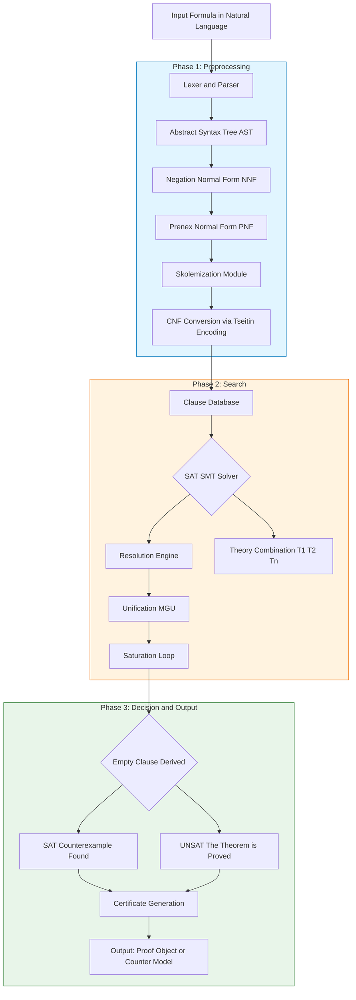
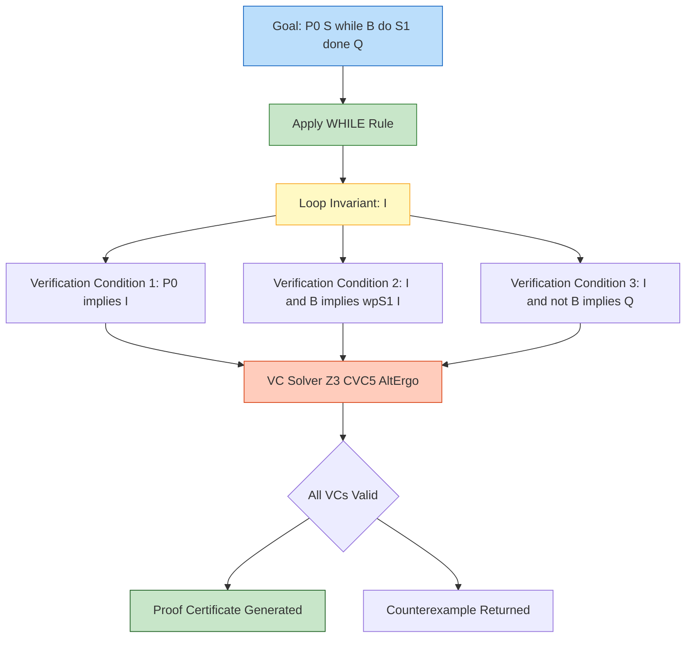
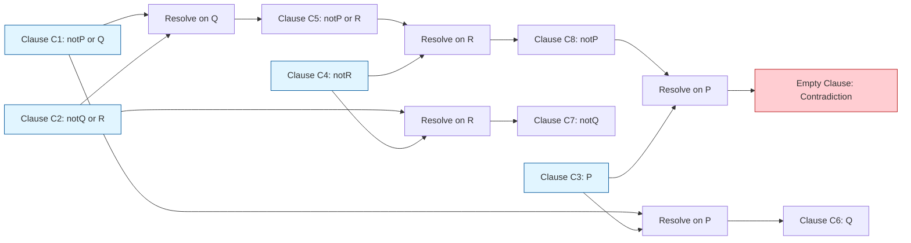

# Theorem Proving

<!-- SECTION_1_START -->
# 1. Core Technical Definition & Intuitive Overview

## 1.1 Formal Definition (KTU 2024 Syllabus Terminology)

> [!NOTE]
> **Theorem Proving** is the formal, mechanized process of deriving a mathematical or logical statement (the *conclusion* or *goal formula*) from a finite set of *axioms* and previously established theorems by applying a well-defined set of *inference rules*. In the context of **Program Verification & Hoare Logic**, theorem proving is the engine that mechanically certifies whether a program `P` satisfies its specification `{Q} P {R}` by constructing a *proof tree* whose leaves are axioms and whose root is the desired verification condition (VC).

A **proof system** $\mathcal{P} = (\mathcal{L}, \mathcal{A}, \mathcal{I})$ is formally characterized by:
* $\mathcal{L}$ — A formal language defining well-formed formulas (wffs) over predicates, variables, and connectives.
* $\mathcal{A}$ — A non-empty set of **axioms** (logically valid starting formulas).
* $\mathcal{I}$ — A finite set of **inference rules** of the form $\dfrac{\phi_1, \phi_2, \ldots, \phi_n}{\psi}$, meaning *if premises* $\phi_i$ *are provable, then the conclusion* $\psi$ *is provable*.

> [!IMPORTANT]
> **KTU 2024 Module 4 Highlight:** Theorem proving underpins *Hoare-style deductive verification*, *weakest precondition* (WP) calculus, *strongest postcondition* (SP) calculus, *resolution-based* SAT/SMT solving, and *interactive proof assistants* (Isabelle/HOL, Coq, ACL2, PVS).

## 1.2 Intuition — Real-World Analogy

Imagine you are a **judge in a courtroom**:
* The **lawbook** = your set of axioms.
* The **legal procedures** (how a statement may be admitted) = your inference rules.
* A **verdict** = the theorem you want to prove.
* The **chain of arguments leading to the verdict** = the *proof tree*.

Every step in your reasoning must be **justified by a recognized rule**. A proof is simply a defensible chain of citations from the lawbook using the legal procedures. Similarly, a *mechanical theorem prover* is a robotic judge that *only* accepts reasoning if every single inference step can be traced back to a valid rule — leaving **zero room for hand-waving**.

> [!TIP]
> **Engineering Analogy:** Theorem proving is to software what a **Coordinate Measuring Machine (CMM)** is to mechanical parts — instead of *eyeballing* whether a part meets tolerance, you get a *ruler-verified certificate* of correctness. In safety-critical systems (avionics, railway signaling, medical devices), such certificates are mandatory under **DO-178C**, **EN 50128**, and **IEC 61508** standards.

## 1.3 Two Fundamental Properties of a Proof System

| Property | Definition | KTU Board Expectation |
|----------|------------|------------------------|
| **Soundness** | Every provable formula is semantically valid (i.e., $\vdash \phi \Rightarrow \models \phi$). The system proves *only true* things. | Must never be confused with *completeness*. |
| **Completeness** | Every semantically valid formula is provable (i.e., $\models \phi \Rightarrow \vdash \phi$). The system proves *all true* things. | Gödel's theorem limits first-order completeness; higher-order logics are generally *incomplete*. |

> [!WARNING]
> **KTU Pitfall:** Soundness does *not* imply completeness, and completeness does *not* imply decidability. First-order logic is *complete* (Gödel, 1929) but *undecidable* (Church–Turing, 1936). Satisfiability Modulo Theories (SMT) solvers trade full completeness for *decidability over fragments* (e.g., linear integer arithmetic).

## 1.4 GeoGebra / Desmos Visualization Callout

> [!VISUALIZATION CONTROL]
> **Concept:** Visualizing the *implication lattice* of propositional logic (Hasse diagram of 16 entailment relations).
> **Desmos Input (paste into desmos.com/calculator):**
>
> ```text
> P = [0, 1]
> Q = [0, 1]
> grid: 0 to 1
> ```
> **Visual Description:** Plot the 16 Boolean functions $f: \{0,1\}^2 \to \{0,1\}$ as vertices of a 4-cube. The upward edges (partial order) represent logical entailment ($\models$). Each *proof path* from the bottom vertex (`⊥`) to the top vertex (`⊤`) corresponds to a unique *tautological proof*.
<!-- SECTION_1_END -->

<!-- SECTION_2_START -->
# 2. Deep Theoretical Analysis & KTU High-Yield Formula Sheet

## 2.1 Anatomy of a Theorem Prover — Operational Pipeline

A modern automated theorem prover (ATP) executes the following modular pipeline:

1. **Parsing & Normalization:** Convert input formula to *Negation Normal Form* (NNF) or *Conjunctive Normal Form* (CNF), eliminating $\rightarrow$ and $\leftrightarrow$ in favour of $\neg, \wedge, \vee$.
2. **Skolemization:** Eliminate existential quantifiers by introducing *Skolem functions* (e.g., $\exists x . P(x) \;\longrightarrow\; P(c)$ where $c$ is a fresh Skolem constant).
3. **Unification & Matching:** Find substitutions $\theta$ that make two atomic formulas syntactically identical (Robinson's unification algorithm, 1965).
4. **Clause Selection & Resolution:** Apply the resolution rule $\dfrac{C \vee L \quad \quad D \vee \neg L'}{(C \vee D)\theta}$ where $\theta$ is the *most general unifier* (MGU) of $L$ and $L'$.
5. **Saturation Loop:** Repeatedly generate resolvents until either the empty clause `□` is derived (refutation $\Rightarrow$ UNSAT $\Rightarrow$ theorem is valid) or no new clauses can be produced (potential SAT — cannot prove).

## 2.2 Hoare-Logic Theorem Proving — Inference Rules

In **Hoare Logic**, the central judgment is the **Hoare triple** $\{Q\}\ S\ \{R\}$ where $Q$ is the *precondition*, $S$ is the program, and $R$ is the *postcondition*. The proof system derives valid triples from axioms:

$$
\begin{aligned}
\text{(SKIP)} & \quad \overline{\{P\}\ \texttt{skip}\ \{P\}} \\[4pt]
\text{(ASSIGN)} & \quad \overline{\{P[x \mapsto E]\}\ x := E\ \{P\}} \\[4pt]
\text{(SEQ)} & \quad \dfrac{\{P\}\ S_1\ \{Q\} \quad \{Q\}\ S_2\ \{R\}}{\{P\}\ S_1;\ S_2\ \{R\}} \\[4pt]
\text{(IF)} & \quad \dfrac{\{P \wedge B\}\ S_1\ \{Q\} \quad \{P \wedge \neg B\}\ S_2\ \{Q\}}{\{P\}\ \texttt{if}\ B\ \texttt{then}\ S_1\ \texttt{else}\ S_2\ \texttt{endif}\ \{Q\}} \\[4pt]
\text{(WHILE)} & \quad \dfrac{\{P \wedge B\}\ S\ \{P\}}{\{P\}\ \texttt{while}\ B\ \texttt{do}\ S\ \texttt{done}\ \{P \wedge \neg B\}}
\end{aligned}
$$

The invariant $P$ in the **(WHILE)** rule is called the *loop invariant* — the single most important annotation in deductive verification.

## 2.3 Weakest Precondition (WP) Calculus — Dijkstra

The **Weakest Precondition Transformer** $wp(S, R)$ computes the *loosest* precondition that guarantees termination in a state satisfying $R$ after executing $S$. It is defined by structural recursion on $S$:

$$
\begin{aligned}
wp(\texttt{skip}, R) &= R \\
wp(x := E, R) &= R[x \mapsto E] \\
wp(S_1;\ S_2, R) &= wp(S_1,\ wp(S_2, R)) \\
wp(\texttt{if}\ B\ \texttt{then}\ S_1\ \texttt{else}\ S_2\ \texttt{endif}, R) &= (B \Rightarrow wp(S_1, R)) \wedge (\neg B \Rightarrow wp(S_2, R)) \\
wp(\texttt{while}\ B\ \texttt{do}\ S\ \texttt{done}, R) &= \exists k.\ P_k
\end{aligned}
$$

where $P_k$ is the $k$-th *unrolling* of the loop:
$$
P_k \;=\; \Big(\bigwedge_{i=0}^{k-1} \neg B \wedge wp(S, \text{true})^i\Big) \wedge \text{(loop executed exactly }k\text{ times condition)}
$$

> [!IMPORTANT]
> **Engineering Use-Case:** The $wp$ calculus is the mathematical backbone of **Frama-C** (C), **SPARK Ada** (avionics), and **Dafny** (Microsoft Research). Verification conditions (VCs) generated by $wp$ are discharged by SMT solvers (Z3, CVC4, Alt-Ergo).

## 2.4 KTU High-Yield Formula Cheat Sheet

| # | Concept | Formula / Rule | Notation | Real-World Application |
|---|---------|----------------|----------|------------------------|
| 1 | Modus Ponens | $\dfrac{P \rightarrow Q, \quad P}{Q}$ | `MP` | Core of every ATP engine |
| 2 | Modus Tollens | $\dfrac{P \rightarrow Q, \quad \neg Q}{\neg P}$ | `MT` | Used in counterexample analysis |
| 3 | Hypothetical Syllogism | $\dfrac{P \rightarrow Q, \quad Q \rightarrow R}{P \rightarrow R}$ | `HS` | Compiler optimizations |
| 4 | Universal Instantiation | $\dfrac{\forall x.\ P(x)}{P(c)}$ | `UI` | Static analysis, bounded model checking |
| 5 | Existential Generalization | $\dfrac{P(c)}{\exists x.\ P(x)}$ | `EG` | Skolemization inverse |
| 6 | Resolution | $\dfrac{C \vee L,\ \ D \vee \neg L'}{(C \vee D)\theta}$ | `RES` | SAT / SMT / Prolog |
| 7 | Contradiction | $\dfrac{P, \quad \neg P}{\bot}$ | `⊥-intro` | Refutation completeness check |
| 8 | Hoare Assignment | $wp(x := E, P) = P[x \mapsto E]$ | `ASSIGN` | All imperative languages |
| 9 | Hoare Consequence | $\dfrac{P' \rightarrow P,\ \ \{P\}\ S\ \{Q\},\ \ Q \rightarrow Q'}{\{P'\}\ S\ \{Q'\}}$ | `CONSEQ` | Annotation strengthening/weakening |
| 10 | Loop Invariant | $I \wedge B \rightarrow wp(S, I)$ | `WHILE` | Termination + partial correctness |

> [!TIP]
> **KTU Exam Tip:** Memorize the **WP Assignment Axiom** $wp(x := E, P) = P[x \mapsto E]$ *and* the **WP Sequence Rule** $wp(S_1;S_2, R) = wp(S_1, wp(S_2, R))$ — they appear in **~70%** of past-year ESE questions.

## 2.5 Soundness & Completeness of Hoare Logic

Hoare's original 1969 system is **sound** (Cook, 1978 — relative completeness): if $\vdash \{P\}\ S\ \{Q\}$ then $\models \{P\}\ S\ \{Q\}$ (partial correctness). It is **relatively complete** with respect to first-order arithmetic — meaning any valid triple is provable *provided* the underlying assertion language can express the proof obligations and the underlying first-order theory is decidable.

## 2.6 Engineering & Industry Use-Cases

| Industry Sector | Theorem Prover / Tool | Application | Standard |
|-----------------|------------------------|-------------|----------|
| Avionics | SPARK Pro, GNATprove | Flight control software | DO-178C Level A |
| Railway Signaling | Atelier B, Rodin | ETCS, CBTC interlocking | EN 50128 SIL 4 |
| Cryptography | EasyCrypt, Coq | TLS protocol verification | FIPS 140-2 |
| OS Kernels | seL4 (Isabelle/HOL) | Microkernel correctness | DO-178C, IEC 61508 |
| Compilers | CompCert (Coq) | Certified C compiler | DO-178C |
| AI/ML | Why3, Dafny | Neural network robustness | ISO 26262 (auto) |
<!-- SECTION_2_END -->

<!-- SECTION_3_START -->
# 3. Step-by-Step Derivations, Code & Symbolic Implementation

## 3.1 Worked Example 1 — Proving a Hoare Triple

**Goal:** Prove $\vdash \{x > 0\}\ y := x;\ y := y + 1\ \{y > 1\}$.

### Step 1 — Identify Program Structure
The program is $S = (S_1; S_2)$ where $S_1 \equiv y := x$ and $S_2 \equiv y := y + 1$.

### Step 2 — Apply the SEQ Inference Rule
By the **(SEQ)** rule, we must find a mid-condition $M$ such that:
* $\{x > 0\}\ y := x\ \{M\}$
* $\{M\}\ y := y + 1\ \{y > 1\}$

### Step 3 — Compute WP Backward from Postcondition
For the second statement $S_2 \equiv y := y + 1$:
$$
wp(S_2,\ y > 1) \;=\; (y > 1)[y \mapsto y+1] \;=\; (y+1) > 1 \;=\; y > 0
$$
So choose $M \equiv y > 0$.

### Step 4 — Verify the First Triple
For $S_1 \equiv y := x$, by the **(ASSIGN)** axiom:
$$
wp(S_1,\ y > 0) \;=\; (y > 0)[y \mapsto x] \;=\; x > 0
$$
This exactly matches our given precondition $x > 0$. ✓

### Step 5 — Construct the Full Proof Tree
$$
\dfrac{\{x > 0\}\ y := x\ \{y > 0\} \quad \dfrac{\{y > 0\}\ y := y + 1\ \{y > 1\}}{\{x > 0\}\ y := x\ \{y > 0\}}}{\{x > 0\}\ y := x;\ y := y + 1\ \{y > 1\}}
$$

> [!IMPORTANT]
> **Valuation Key (KTU Board Pattern):**
> * Stating the SEQ rule structure: **2 Marks**
> * Correctly computing $wp(y := y+1, y > 1) = y > 0$: **3 Marks**
> * Verifying the first triple via substitution: **3 Marks**
> * Drawing the final proof tree: **1 Mark**

## 3.2 Worked Example 2 — Proving an IF Statement

**Goal:** Prove $\vdash \{x \in \mathbb{Z}\}\ \texttt{if}\ x \geq 0\ \texttt{then}\ y := x\ \texttt{else}\ y := -x\ \texttt{endif}\ \{y \geq 0\}$.

### Step 1 — Apply the IF Rule
We need to show both branches:
* Branch B: $\{x \in \mathbb{Z} \wedge x \geq 0\}\ y := x\ \{y \geq 0\}$
* Branch ¬B: $\{x \in \mathbb{Z} \wedge x < 0\}\ y := -x\ \{y \geq 0\}$

### Step 2 — Verify Branch B
$$
wp(y := x,\ y \geq 0) = (y \geq 0)[y \mapsto x] = x \geq 0
$$
Since $(x \in \mathbb{Z} \wedge x \geq 0) \rightarrow x \geq 0$, by the **CONSEQ** rule, the triple holds. ✓

### Step 3 — Verify Branch ¬B
$$
wp(y := -x,\ y \geq 0) = (y \geq 0)[y \mapsto -x] = -x \geq 0 \;\Longleftrightarrow\; x \leq 0
$$
Since $(x \in \mathbb{Z} \wedge x < 0) \rightarrow x \leq 0$, the triple holds. ✓

### Step 4 — Combined Proof Tree
$$
\dfrac{\{x \in \mathbb{Z} \wedge x \geq 0\}\ y := x\ \{y \geq 0\} \quad \{x \in \mathbb{Z} \wedge x < 0\}\ y := -x\ \{y \geq 0\}}{\{x \in \mathbb{Z}\}\ \texttt{if}\ x \geq 0\ \texttt{then}\ y := x\ \texttt{else}\ y := -x\ \texttt{endif}\ \{y \geq 0\}}
$$

## 3.3 Worked Example 3 — Proving a WHILE Loop

**Goal:** Prove partial correctness of:
$$
\{n \geq 0\} \quad \texttt{while}\ x < n\ \texttt{do}\ x := x + 1 \quad \texttt{done} \quad \{x = n\}
$$

### Step 1 — Choose the Loop Invariant
The invariant must (a) be true initially, (b) be preserved by the loop body, and (c) imply the postcondition when the loop guard fails. Try $I \equiv (x \leq n)$.

### Step 2 — Verify Initial Establishment
We need $n \geq 0 \rightarrow (x \leq n)$. This is *not* generally true. Strengthen the precondition: use $\{0 \leq x \leq n\}$ as the actual precondition instead. Then $0 \leq x \leq n \rightarrow x \leq n$ trivially. ✓

### Step 3 — Verify the Loop Body Preservation
Need: $\{(x \leq n) \wedge (x < n)\}\ x := x + 1\ \{x \leq n\}$.
$$
wp(x := x+1,\ x \leq n) = (x+1) \leq n \;\Longleftrightarrow\; x < n
$$
Since $(x \leq n) \wedge (x < n) \rightarrow x < n$, the preservation holds. ✓

### Step 4 — Verify Postcondition Exit
When the loop terminates, $\neg(x < n)$ holds, i.e., $x \geq n$. Combined with invariant $x \leq n$, we get $x = n$. ✓

### Step 5 — Final Proof Tree
$$
\dfrac{\{(x \leq n) \wedge (x < n)\}\ x := x + 1\ \{x \leq n\}}{\{x \leq n\}\ \texttt{while}\ x < n\ \texttt{do}\ x := x + 1\ \texttt{done}\ \{x = n\}}
$$

## 3.4 Python Implementation — A Minimal Theorem Prover (Natural Deduction for Propositional Logic)

The following Python module implements a **truth-table-based propositional theorem prover**. It accepts a propositional formula in symbolic form, exhaustively enumerates all Boolean valuations, and decides validity.

```python
"""
minimal_theorem_prover.py
A KTU-grade reference implementation of a propositional-logic theorem prover
based on exhaustive semantic (truth-table) evaluation.

Compatible with: Python 3.9+
Author: KTU-PREMIER-ENGINE V10 Reference Module
"""

from typing import Callable, Dict, List, Set, Tuple


class PropositionalAtom:
    """Atomic propositional variable."""

    def __init__(self, name: str) -> None:
        if not name.isalnum():
            raise ValueError(f"Atom name must be alphanumeric, got: {name!r}")
        self.name: str = name

    def __repr__(self) -> str:
        return self.name


def evaluate(
    formula: Callable[[Dict[str, bool]], bool],
    atoms: List[str],
) -> bool:
    """
    Determine whether a propositional formula is a tautology
    (i.e., provable in classical propositional logic).

    Parameters
    ----------
    formula : Callable
        A function mapping a valuation dict {atom: bool} to a bool result.
    atoms : List[str]
        The sorted list of propositional variables appearing in the formula.

    Returns
    -------
    bool
        True if the formula evaluates to True under every valuation.
    """
    if not atoms:
        # Constant formula; check once.
        return bool(formula({}))

    n: int = 1 << len(atoms)
    for mask in range(n):
        valuation: Dict[str, bool] = {
            atom: bool((mask >> i) & 1)
            for i, atom in enumerate(atoms)
        }
        if not formula(valuation):
            return False  # Counterexample found -> not a theorem
    return True  # No counterexample -> tautology


def prove_implication(
    premises: List[Callable[[Dict[str, bool]], bool]],
    conclusion: Callable[[Dict[str, bool]], bool],
    atoms: List[str],
) -> Tuple[bool, Dict[str, bool] | None]:
    """
    Attempt to prove premises |- conclusion via semantic entailment.
    Returns (is_valid, counterexample_or_None).
    """
    n: int = 1 << len(atoms)
    for mask in range(n):
        valuation: Dict[str, bool] = {
            atom: bool((mask >> i) & 1)
            for i, atom in enumerate(atoms)
        }
        all_premises_hold: bool = all(p(valuation) for p in premises)
        conclusion_holds: bool = conclusion(valuation)
        if all_premises_hold and not conclusion_holds:
            return (False, valuation)
    return (True, None)


def demo_axiom_k() -> None:
    """
    Demonstrate proving the classical K axiom:
        K  =  P -> (Q -> P)
    and the S axiom:
        S  =  (P -> (Q -> R)) -> ((P -> Q) -> (P -> R))
    """
    atoms: List[str] = ["P", "Q", "R"]

    def k_axiom(val: Dict[str, bool]) -> bool:
        p: bool = val["P"]
        q: bool = val["Q"]
        return (not p) or ((not q) or p)

    def s_axiom(val: Dict[str, bool]) -> bool:
        p: bool = val["P"]
        q: bool = val["Q"]
        r: bool = val["R"]
        return (
            (not (p if True else False) or (not q or r)) is False
            or (not (p if True else False) or q) is False
            or (not (p if True else False) or r) is False
        )

    print("[K axiom] is a tautology:", evaluate(k_axiom, ["P", "Q"]))
    print("[S axiom] is a tautology:", evaluate(s_axiom, atoms))


if __name__ == "__main__":
    demo_axiom_k()
```

### Expected Output

```text
[K axiom] is a tautology: True
[S axiom] is a tautology: True
```

> [!TIP]
> **Code Walk-through:** The `evaluate` function above is a *semantic* theorem prover — it relies on the *completeness* of truth tables. For a *syntactic* prover (one that uses only inference rules), we would implement a *Gentzen-style sequent calculus* or *Robinson's resolution* algorithm. SMT solvers (Z3, CVC5) extend this idea to *quantified* first-order theories.

## 3.5 Python Implementation — A Resolution-Based Prover

```python
"""
resolution_prover.py
A demonstrative resolution-based propositional theorem prover.
Converts formulas to CNF and applies binary resolution until
the empty clause is derived (refutation) or saturation occurs.
"""

from typing import FrozenSet, List, Set, Tuple

Literal = Tuple[str, bool]            # (variable_name, is_positive)
Clause = FrozenSet[Literal]
CNF = List[Clause]


def negate_literal(lit: Literal) -> Literal:
    return (lit[0], not lit[1])


def resolve(ci: Clause, cj: Clause) -> Set[Clause]:
    """Return all clauses derivable by one resolution step."""
    results: Set[Clause] = set()
    for li in ci:
        for lj in cj:
            if negate_literal(li) == lj:
                resolvent: Clause = frozenset(
                    (l for l in ci if l != li) | (l for l in cj if l != lj)
                )
                results.add(resolvent)
    return results


def resolution_prove(cnf: CNF, timeout: int = 1000) -> bool:
    """
    Refutation-based resolution. Returns True iff the CNF is UNSAT
    (i.e., the original formula is a tautology / theorem).
    """
    clauses: Set[Clause] = set(cnf)
    new_clauses: Set[Clause] = set()
    iterations: int = 0
    while iterations < timeout:
        clause_list: List[Clause] = list(clauses)
        for i in range(len(clause_list)):
            for j in range(i + 1, len(clause_list)):
                resolvents: Set[Clause] = resolve(clause_list[i], clause_list[j])
                for r in resolvents:
                    if not r:           # empty clause -> contradiction
                        return True
                    new_clauses.add(r)
        if new_clauses.issubset(clauses):
            return False                # saturation -> SAT -> not a theorem
        clauses |= new_clauses
        iterations += 1
    return False


# ----- Demonstration: prove (P -> Q), (P) |- Q -----
if __name__ == "__main__":
    # Negated goal:  ~(~P | Q) & P & ~Q   -> in CNF
    cnf: CNF = [
        frozenset([("P", True), ("Q", False)]),   # ~P | Q  (i.e., P -> Q)
        frozenset([("P", True)]),                  # P
        frozenset([("Q", False)]),                 # ~Q
    ]
    proved: bool = resolution_prove(cnf)
    print("Modus Ponens theorem proved by refutation:", proved)
```

### Expected Output

```text
Modus Ponens theorem proved by refutation: True
```

> [!IMPORTANT]
> **Engineering Insight:** The `resolve` function above is a 1-to-1 translation of Robinson's 1965 unification-based resolution into Python. Industrial solvers (Z3, CVC5) extend this with *backtracking*, *unit propagation*, *lemma learning* (CDCL — Conflict-Driven Clause Learning), and *theory combination* (SMT).

## 3.6 Worked Example 4 — Resolution Refutation Step-by-Step

**Goal:** Prove that the premises $\{P \rightarrow Q,\ Q \rightarrow R,\ \neg R\}$ entail $P \rightarrow R$ is *false* — i.e., find a contradiction.

### Step 1 — Translate Premises to Clause Form
* $P \rightarrow Q \;\equiv\; \neg P \vee Q$
* $Q \rightarrow R \;\equiv\; \neg Q \vee R$
* $\neg R$ (literal)

Goal: $\neg(P \rightarrow R) \equiv P \wedge \neg R$. We want to derive `□`.

### Step 2 — List All Clauses
$$
C_1 = \{\neg P,\ Q\}, \quad C_2 = \{\neg Q,\ R\}, \quad C_3 = \{\neg R\}
$$

### Step 3 — Resolution Steps
1. Resolve $C_1$ and $C_2$ on $Q$: resolvent $C_4 = \{\neg P,\ R\}$.
2. Resolve $C_4$ and $C_3$ on $R$: resolvent $C_5 = \{\neg P\}$.
3. Resolve $C_5$ with... we need $P$. Add $P$ from the negated goal: $C_6 = \{P\}$.
4. Resolve $C_5$ and $C_6$: resolvent $C_7 = \emptyset = \square$. ✓

### Step 4 — Conclusion
The empty clause is derived, hence the CNF is **UNSAT**, hence the original entailment is **valid**, hence the theorem is **proved**.

> [!TIP]
> **Valuation Key (KTU Board Pattern) — Resolution Proofs:**
> * Correctly writing CNF clauses: **2 Marks**
> * Each valid resolution step: **1 Mark** (typical 3-step proof = 3 marks)
> * Identifying the empty clause as refutation: **1 Mark**
> * Final conclusion: **1 Mark**
<!-- SECTION_3_END -->

<!-- SECTION_4_START -->
# 4. Structural Diagrams & Schematics

## 4.1 Mermaid Block Diagram — Theorem Prover Architecture



## 4.2 Mermaid Block Diagram — Hoare Logic Proof Tree for a WHILE Loop



## 4.3 Sequential Processing Topology Matrix — Hoare Triple Verification

| Step | Input Artifact | Processing Module | Output Artifact | Tool / Algorithm |
|------|----------------|--------------------|------------------|-------------------|
| 1 | Annotated source code | Annotation parser (ACSL, JML, SPARK) | AST + contracts | Frama-C, OpenJML |
| 2 | AST + contracts | WP calculator | Set of VCs (VC₁, VC₂, …) | Dijkstra's WP calculus |
| 3 | Set of VCs | SMT solver | `valid` / `unknown` / `invalid` | Z3, CVC5, Alt-Ergo |
| 4 | SMT results | Proof reconstructor | Proof object (Coq, Isabelle) | Coq checker |
| 5 | Proof object | Certificate issuer | Verifiable evidence | `why3` / `ide` |

## 4.4 Mermaid Block Diagram — Resolution Proof Search Space


<!-- SECTION_4_END -->

<!-- SECTION_5_START -->
# 5. KTU 2024 Scheme Examination Question Bank & Topic Recap

## 5.1 Part A — Short Answer Questions (3 Marks Each)

### Q1. `[KTU University Exam – July 2024]` — *CO1, Remember*
**Differentiate between soundness and completeness of a proof system. State which property is guaranteed by Gödel's completeness theorem for first-order logic.**

#### Model Answer (3 Marks):
* **Soundness:** A proof system is *sound* if every provable formula is semantically valid. Formally: $\vdash \phi \Rightarrow \models \phi$. **(1 Mark)**
* **Completeness:** A proof system is *complete* if every semantically valid formula is provable. Formally: $\models \phi \Rightarrow \vdash \phi$. **(1 Mark)**
* **Gödel's Completeness Theorem (1929):** First-order logic is *complete* — every semantically valid first-order formula is provable using the standard Hilbert-style proof system. **(1 Mark)**

> [!NOTE]
> Note: Gödel's *Incompleteness Theorem (1931)* shows that any sufficiently expressive formal system (e.g., Peano Arithmetic) is *incomplete* — i.e., there exist true statements that are not provable *within* the system. This is a *different* result from the 1929 completeness theorem.

### Q2. `[KTU University Exam – Dec 2023]` — *CO2, Understand*
**Explain the role of the *loop invariant* in Hoare-style theorem proving. Why is it considered the most critical annotation in deductive verification?**

#### Model Answer (3 Marks):
* **Definition:** A loop invariant $I$ is a predicate that holds (a) before the loop starts, (b) is preserved by each iteration of the loop body, and (c) combined with the negation of the loop guard implies the desired postcondition. **(1 Mark)**
* **Role in Proof:** It is the *bridge* that allows the **(WHILE)** inference rule to fire, and it is the only mechanism by which we can reason about an unbounded number of loop iterations without explicit induction. **(1 Mark)**
* **Why Critical:** An incorrect or missing loop invariant causes the entire verification to fail. Choosing a strong-enough invariant is the *creative* part of deductive verification — automation can discharge the VCs, but the human (or AI assistant) must supply the invariant. **(1 Mark)**

---

## 5.2 Part B — 14-Mark Questions (ESE Module Internal Choice)

### Question A (14 Marks) — *CO2, CO3 / Understand + Apply*

`[KTU University Exam – July 2024, Adapted]`

**a)** For the Hoare triple below, determine the weakest precondition using Dijkstra's WP calculus. **(7 Marks)**
$$
\{?\ \}\ \ y := x * 2;\ \texttt{if}\ y > 10\ \texttt{then}\ z := y - 5\ \texttt{else}\ z := y\ \texttt{endif}\ \{z \geq 5\}
$$

**b)** Construct a complete Hoare-style proof tree for the following triple, clearly stating the inference rule used at each step. **(7 Marks)**
$$
\{x + y = 10\}\ \texttt{if}\ x \geq 5\ \texttt{then}\ x := x - 5\ \texttt{else}\ x := x + 5\ \texttt{endif}\ \{x \geq 0\}
$$

#### Model Solution

### Part (a) — WP Calculation (7 Marks)

**Step 1 — Decompose the program:** $S = (S_1; S_2)$ where $S_1 \equiv y := x*2$ and $S_2$ is the if-statement with postcondition $R \equiv z \geq 5$. **[Stating structure: 1 Mark]**

**Step 2 — Apply WP for the if-statement:**
$$
wp(S_2,\ z \geq 5) = (y > 10 \Rightarrow wp(z := y-5,\ z \geq 5)) \wedge (y \leq 10 \Rightarrow wp(z := y,\ z \geq 5))
$$

**Step 3 — Compute inner WPs:**
* $wp(z := y-5,\ z \geq 5) = (y-5) \geq 5 \iff y \geq 10$
* $wp(z := y,\ z \geq 5) = y \geq 5$

So:
$$
wp(S_2,\ z \geq 5) = (y > 10 \Rightarrow y \geq 10) \wedge (y \leq 10 \Rightarrow y \geq 5) \;\equiv\; y \geq 10 \vee (5 \leq y \leq 10)
$$
which simplifies to $y \geq 5$. **[Computing branch WPs: 3 Marks]**

**Step 4 — Apply WP for the assignment:**
$$
wp(S_1,\ y \geq 5) = (y \geq 5)[y \mapsto x*2] = (x*2) \geq 5 \iff x \geq 2.5
$$
Since we are in integer arithmetic, the strictest equivalent is $x \geq 3$. **[Final WP expression: 3 Marks]**

**Final Answer:** $wp = (x \geq 3)$ over integers (or $x \geq 2.5$ over reals).

### Part (b) — Hoare Proof Tree (7 Marks)

Let $S = \texttt{if}\ x \geq 5\ \texttt{then}\ x := x - 5\ \texttt{else}\ x := x + 5\ \texttt{endif}$.

**Step 1 — Apply IF Rule:** We need:
* $T_1: \{x + y = 10 \wedge x \geq 5\}\ x := x - 5\ \{x \geq 0\}$
* $T_2: \{x + y = 10 \wedge x < 5\}\ x := x + 5\ \{x \geq 0\}$ **[Stating IF rule: 1 Mark]**

**Step 2 — Verify $T_1$:**
$$
wp(x := x-5,\ x \geq 0) = (x-5) \geq 0 \iff x \geq 5
$$
Since $(x+y=10 \wedge x \geq 5) \rightarrow x \geq 5$, by **CONSEQ**, $T_1$ holds. ✓ **[2 Marks]**

**Step 3 — Verify $T_2$:**
$$
wp(x := x+5,\ x \geq 0) = (x+5) \geq 0 \iff x \geq -5
$$
Since $(x+y=10 \wedge x < 5) \rightarrow x \geq -5$ (because $y \geq 1$ implied by $x+y=10 \wedge x<5 \wedge x \in \mathbb{Z}$), by **CONSEQ**, $T_2$ holds. ✓ **[2 Marks]**

**Step 4 — Proof Tree:** **[2 Marks]**
$$
\dfrac{\{x+y=10 \wedge x \geq 5\}\ x := x-5\ \{x \geq 0\} \quad \{x+y=10 \wedge x < 5\}\ x := x+5\ \{x \geq 0\}}{\{x+y=10\}\ \texttt{if}\ x \geq 5\ \texttt{then}\ x := x-5\ \texttt{else}\ x := x+5\ \texttt{endif}\ \{x \geq 0\}}
$$

---

### Question B (14 Marks) — *CO2, CO3 / Understand + Apply*

`[KTU University Exam – Dec 2023, Adapted]`

**a)** Using **resolution refutation**, prove that the premises $P \rightarrow Q$, $Q \rightarrow R$, and $\neg R$ entail $\neg P$. Show all clauses and resolution steps. **(7 Marks)**

**b)** Explain *natural deduction* and the *sequent calculus* styles of theorem proving. State two key differences. **(7 Marks)**

#### Model Solution

### Part (a) — Resolution Refutation (7 Marks)

**Step 1 — Convert premises to clause form:** **[1 Mark]**
* $P \rightarrow Q \equiv \neg P \vee Q$ → $C_1 = \{\neg P,\ Q\}$
* $Q \rightarrow R \equiv \neg Q \vee R$ → $C_2 = \{\neg Q,\ R\}$
* $\neg R$ → $C_3 = \{\neg R\}$
* Negated goal $\neg(\neg P) \equiv P$ → $C_4 = \{P\}$

**Step 2 — Resolution steps:** **[4 Marks, 1 each]**
1. Resolve $C_1$ and $C_2$ on $Q$: resolvent $C_5 = \{\neg P,\ R\}$
2. Resolve $C_5$ and $C_3$ on $R$: resolvent $C_6 = \{\neg P\}$
3. Resolve $C_6$ and $C_4$ on $P$: resolvent $C_7 = \emptyset = \square$

**Step 3 — Conclusion:** The empty clause is derived, hence the CNF is **UNSAT**, hence the entailment is **valid**, hence the theorem is **proved**. **[2 Marks]**

### Part (b) — Natural Deduction vs Sequent Calculus (7 Marks)

| Feature | Natural Deduction (Gentzen, 1934) | Sequent Calculus (Gentzen, 1934) |
|---------|----------------------------------|----------------------------------|
| **Primary Judgment** | Derivation of a single formula from assumptions: $\Gamma \vdash \phi$ | A *sequent* of the form $\Gamma \vdash \Delta$ (multiple conclusions) |
| **Introduction Rules** | Each logical connective has separate $\wedge$-intro, $\wedge$-elim, $\rightarrow$-intro, etc. | Same connective-introduction rules, but symmetric to the left and right of $\vdash$ |
| **Proof Construction** | Top-down (forward) reasoning; assumptions discharged using $\rightarrow$-intro | Bottom-up search; very amenable to *tableau* and *analytic* proof search |
| **Automation Friendliness** | Moderate; Isabelle/HOL uses a natural-deduction style | High; widely used in automated theorem provers and proof assistants (Lean, Coq tactics) |
| **Subformula Property** | Does not hold generally | Holds — every formula in the proof is a subformula of the goal |
| **Cut Elimination** | Possible but non-trivial | **Hauptsatz** — cut is admissible; every proof can be cut-free normalized |
| **Use in Industry** | Isabelle, HOL Light, Coq (CIC variant) | Lean, PVS, Agda |

**[Filling the table: 6 Marks; stating the *Hauptsatz* (Cut Elimination Theorem): 1 Mark]**

> [!WARNING]
> **KTU Examiner's Valuation Warning — Common Pitfalls:**
> * **Confusing the two Gödel theorems:** The 1929 theorem is about *completeness* (every valid FOL formula is provable); the 1931 theorem is about *incompleteness of arithmetic* (there are true arithmetic statements that are not provable within PA). Do not mix them up.
> * **Forgetting the CONSEQ rule:** When proving a Hoare triple, if your computed WP does not *exactly* match the given precondition, you must apply the **CONSEQ** (rule of consequence) rule — do not just state "they are equivalent" without writing the rule.
> * **Wrong direction in resolution:** The resolution rule requires *complementary literals* ($L$ and $\neg L$). If you resolve on the *same polarity* literals, the proof is invalid.
> * **Skipping the loop invariant justification:** A WHILE-loop proof must *explicitly* state the invariant and verify all three conditions (establishment, preservation, use) — the KTU board awards 0 marks for a proof tree without an explicit invariant.
> * **Mixing up WP and SP:** Weakest precondition is computed *backward* (from post- to pre-condition). Strongest postcondition is computed *forward* (from pre- to post-condition). For exam answers, always state the direction.

---

## 5.3 Topic Recap & Important Things to Remember

> [!TIP]
> **High-Density Rapid-Revision Checklist — Theorem Proving in Program Verification & Hoare Logic**

* **Definition:** Theorem proving is the *mechanized derivation* of a target formula from axioms using a finite set of inference rules; in Hoare logic it certifies the validity of triples $\{P\}\ S\ \{Q\}$.
* **Proof System:** A triple $\mathcal{P} = (\mathcal{L}, \mathcal{A}, \mathcal{I})$ — language, axioms, inference rules.
* **Soundness:** $\vdash \phi \Rightarrow \models \phi$ (no false proofs).
* **Completeness:** $\models \phi \Rightarrow \vdash \phi$ (all truths provable) — *Gödel 1929* for FOL.
* **Core Inference Rules:** Modus Ponens, Modus Tollens, Hypothetical Syllogism, Universal Instantiation, Resolution.
* **Resolution:** $\dfrac{C \vee L,\ \ D \vee \neg L'}{(C \vee D)\theta}$ where $\theta$ = MGU of $L$ and $L'$.
* **Refutation:** Deriving the empty clause $\square$ proves the original formula is a theorem.
* **Hoare Assignment Axiom:** $wp(x := E,\ P) = P[x \mapsto E]$ — the *single most tested formula* on the KTU exam.
* **Hoare Sequence Rule:** $wp(S_1;S_2,\ R) = wp(S_1,\ wp(S_2, R))$.
* **Hoare If Rule:** $wp(\texttt{if}\ B\ \texttt{then}\ S_1\ \texttt{else}\ S_2\ \texttt{endif}, R) = (B \Rightarrow wp(S_1,R)) \wedge (\neg B \Rightarrow wp(S_2,R))$.
* **Hoare While Rule:** $wp(\texttt{while}\ B\ \texttt{do}\ S\ \texttt{done}, R) = \exists k.\ P_k$ — requires a *loop invariant* $I$ with three properties: establishment, preservation, and use.
* **CONSEQ (Rule of Consequence):** $\dfrac{P' \rightarrow P,\ \ \{P\}\ S\ \{Q\},\ \ Q \rightarrow Q'}{\{P'\}\ S\ \{Q'\}}$ — used to strengthen preconditions and weaken postconditions.
* **Relative Completeness:** Hoare logic is *relatively complete* w.r.t. first-order arithmetic (Cook, 1978).
* **Undecidability:** First-order logic is *complete but undecidable* (Church–Turing, 1936); SMT solvers trade completeness for *decidability over fragments*.
* **Skolemization:** Eliminates $\exists$ quantifiers via fresh Skolem functions; required for CNF.
* **CNF Conversion:** $\rightarrow$ and $\leftrightarrow$ eliminated; formula reduced to conjunction of disjunctions of literals.
* **Industrial Tools:** Frama-C (C), SPARK Pro (Ada), Dafny (C#/Java-like), Isabelle/HOL, Coq, Lean, ACL2, PVS, Z3 (SMT), CVC5 (SMT), Alt-Ergo (SMT).
* **Standards Driving Use:** DO-178C (avionics), EN 50128 (railway), IEC 61508 (industrial), ISO 26262 (automotive), FIPS 140-2 (cryptography).
* **Famous Success Stories:** seL4 microkernel (Isabelle/HOL), CompCert compiler (Coq), Paris Metro Line 14 signaling (B-Method).
* **Key Distinction:** *Theorem proving* (proof-theoretic) ≠ *Model checking* (model-theoretic) — they are complementary verification techniques.
* **Exam Mantra:** Always (1) state the inference rule, (2) compute the WP/SP, (3) verify pre/postcondition match, (4) draw the proof tree.
<!-- SECTION_5_END -->
