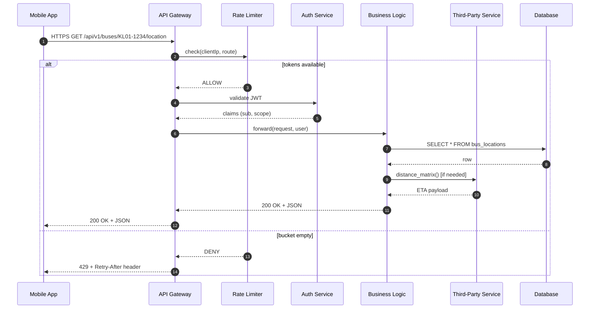
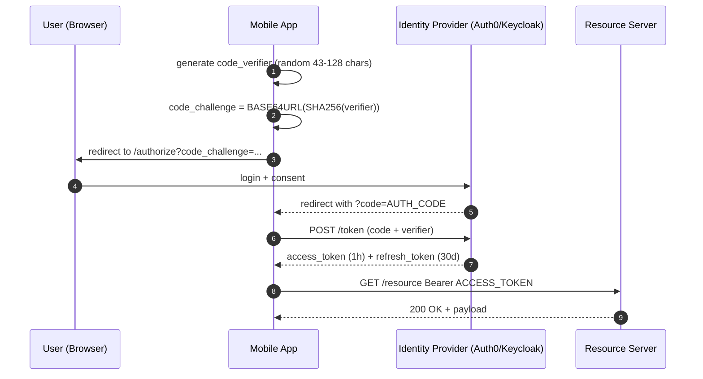
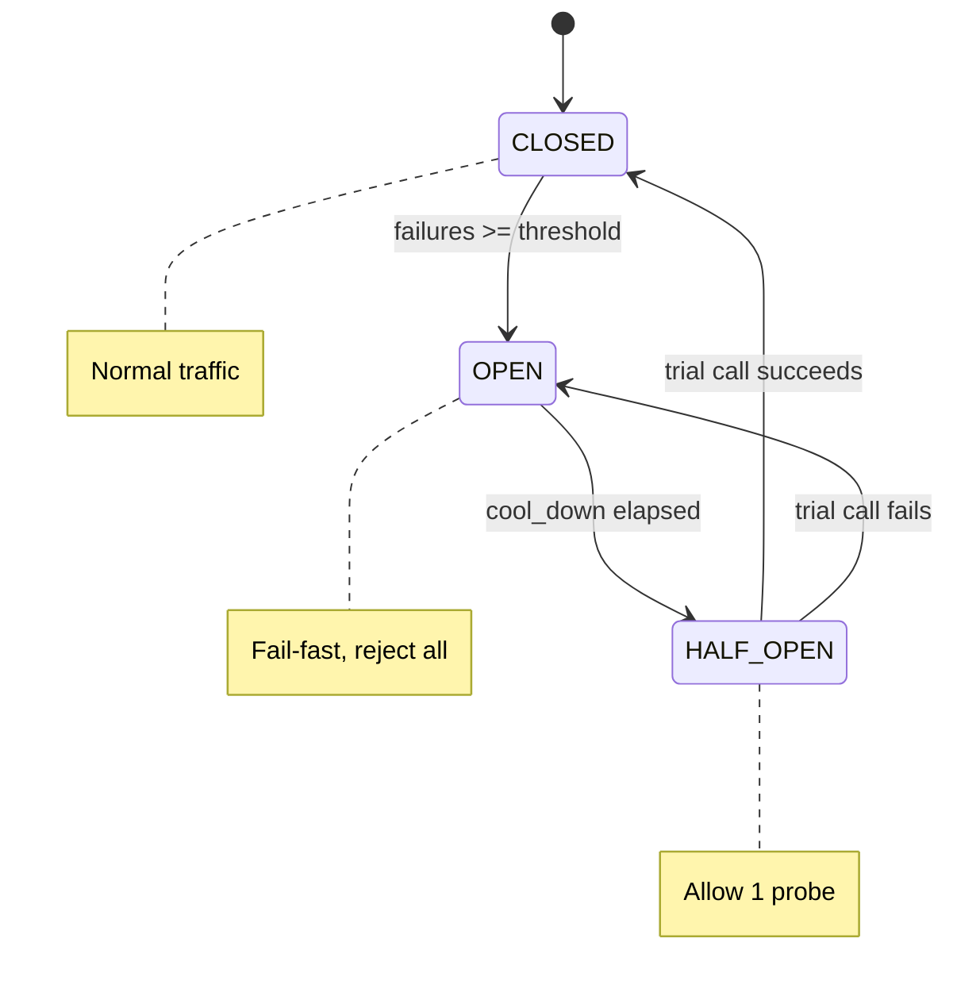
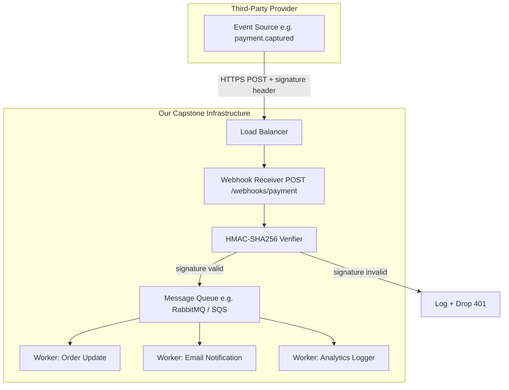
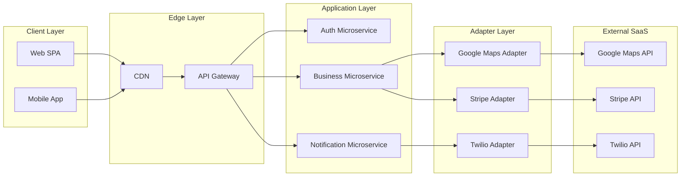
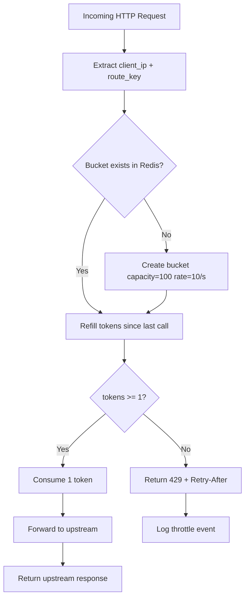

# API development and third-party service integration

<!-- SECTION_1_START -->
# 1. Core Technical Definition & Intuitive Overview

## 1.1 Formal Academic Definition (KTU 2024 Syllabus Terminology)

> [!IMPORTANT]
> **Application Programming Interface (API) Development** is the structured engineering process of designing, implementing, documenting, and maintaining programmatic communication contracts that allow heterogeneous software components to exchange data and invoke functionality in a loosely-coupled, technology-agnostic manner.

> [!NOTE]
> **Third-Party Service Integration** refers to the disciplined practice of incorporating external, independently-hosted services (e.g., payment gateways, messaging platforms, authentication providers, mapping services, cloud storage) into a primary application through standardized, documented interface contracts.

In the KTU 2024 Capstone Closure framework (PCCSP806), these two competencies are inseparable. The capstone project is rarely a monolithic artefact; it almost always **orchestrates** at least three or more external services to deliver a production-grade solution. The Module 1 rubric explicitly evaluates the candidate's ability to:

1. Design **stateless, idempotent, versioned** REST endpoints.
2. Implement **secure authentication** (OAuth 2.0, JWT, API Key Vaults).
3. Handle **rate limiting, retries, circuit-breaking, and graceful degradation** when third-party providers fail.
4. Produce **OpenAPI 3.0 compliant** machine-readable documentation.

## 1.2 Conceptual Analogy — The Waiter & The Specialist Contractor

Imagine you are dining at a restaurant. The kitchen is the **server-side application**. You, the customer, are the **client-side application**. You cannot enter the kitchen and cook for yourself — that would violate hygiene, security, and operational protocols. Instead, you communicate through a **waiter** — this is your **API**.

The waiter:
- Takes a structured request ("Table 5, one Margherita pizza").
- Forwards it to the right station (kitchen, bar, dessert section).
- Returns the response in a standardized format (plate, bill).
- Enforces rules (you cannot order from a closed kitchen).

Now, suppose your restaurant wants to offer a **wine pairing** — but you are not a sommelier. You hire a **specialist contractor** (think *Wine Merchant Inc.*) who arrives with pre-bottled selections, a price list, and a delivery contract. This contractor is your **third-party service**. The contract — the API documentation — tells you exactly how to request, what to pay, and what format the bottles will arrive in.

**Key Insight:** A well-engineered API is the **contractual handshake** that lets your in-house team (capstone developers) and external vendors (Stripe, Twilio, Firebase, Google Maps) cooperate without sharing internal secrets.

## 1.3 Critical Vocabulary Anchors

| Term | Definition | KTU Board Emphasis |
|------|------------|--------------------|
| **Endpoint** | A specific URL exposing a resource or action | `/api/v1/users/{id}` |
| **Idempotency** | Same request → same outcome, regardless of repetition | Critical for `PUT`/`DELETE` |
| **Statelessness** | Server holds no client session state between requests | REST constraint |
| **Webhook** | Server-to-client reverse HTTP callback | Push-based integration |
| **SDK** | Software Development Kit — language-specific wrapper | Accelerates client integration |
| **Rate Limit** | Maximum requests permitted per unit time | Usually **100 req/min** for free tiers |
| **Circuit Breaker** | Fail-fast pattern to isolate failing dependencies | Resilience engineering |

## 1.4 GeoGebra / Desmos Integration

> [!VISUALIZATION CONTROL]
> **Concept:** Token Bucket Rate Limiter — Visualization of Refill Dynamics
> **Desmos Input Equations:**
> * `tokens(t) = min(C, tokens(0) + r * t)` — continuous refill
> * `tokens(t) = max(0, tokens(0) + floor(r * t) - consumed)` — discrete bucket
>
> **Visual Description:** Plot *tokens* on the y-axis (capacity = **100**), *time (seconds)* on the x-axis. Observe the sawtooth waveform: tokens linearly refill at rate **r = 10 tokens/sec**, drop instantaneously when requests arrive, and saturate at the **100-token** ceiling. This is the heartbeat of every production rate limiter at Stripe, GitHub, and Twitter.

<!-- SECTION_1_END -->

<!-- SECTION_2_START -->
# 2. Deep Theoretical Analysis & KTU High-Yield Formula Sheet

## 2.1 The REST Architectural Style — Fielding Constraints

**Representational State Transfer (REST)** was formalized by Roy Fielding in his 2000 doctoral dissertation. It mandates **six** architectural constraints:

1. **Client–Server Separation** — UI and data storage evolve independently.
2. **Statelessness** — Each request carries all information needed; the server stores **zero** session state.
3. **Cacheability** — Responses must declare themselves cacheable or non-cacheable.
4. **Uniform Interface** — Standardized resource identifiers, representations, and self-descriptive messages.
5. **Layered System** — Client cannot tell whether it is talking to the end server or an intermediary.
6. **Code-on-Demand** *(optional)* — Server can temporarily extend client functionality via scripts.

## 2.2 HTTP Verb Semantics & Idempotency Matrix

| Verb | CRUD Action | Idempotent? | Safe? | Body Allowed? |
|------|-------------|-------------|-------|---------------|
| `GET` | Read | Yes | Yes | No |
| `POST` | Create | No | No | Yes |
| `PUT` | Replace | Yes | No | Yes |
| `PATCH` | Partial Update | No* | No | Yes |
| `DELETE` | Remove | Yes | No | Rare |
| `HEAD` | Headers only | Yes | Yes | No |
| `OPTIONS` | Discover | Yes | Yes | No |

*\*PATCH is idempotent *only* if the patch document is itself idempotent (e.g., JSON Merge Patch).*

## 2.3 HTTP Status Code Decision Tree

```
2xx → Success              → 200 OK, 201 Created, 204 No Content
3xx → Redirection          → 301 Moved Permanently, 304 Not Modified
4xx → Client Error         → 400 Bad Request, 401 Unauthorized, 403 Forbidden,
                              404 Not Found, 409 Conflict, 422 Unprocessable,
                              429 Too Many Requests
5xx → Server Error         → 500 Internal, 502 Bad Gateway, 503 Unavailable,
                              504 Gateway Timeout
```

> [!IMPORTANT]
> The 2024 KTU rubric specifically awards marks for **distinguishing 4xx (caller's fault, do not retry) from 5xx (provider's fault, retry with exponential back-off)**.

## 2.4 Authentication Mechanism Decision Matrix

| Mechanism | Best For | Token Lifetime | Revocation Cost | KTU Mark Weight |
|-----------|----------|----------------|------------------|-----------------|
| **API Key** | Server-to-server, internal microservices | Long / static | Re-key all clients | 1 |
| **Basic Auth** | Legacy systems, internal tools | Per request | Reissue credentials | 0.5 |
| **JWT (HS256/RS256)** | Stateless distributed auth | 5–60 min | Short TTL + refresh | 3 |
| **OAuth 2.0 Authorization Code + PKCE** | Third-party delegated access | 1 hr access + 30 day refresh | Revoke refresh token | 4 |
| **mTLS** | High-security B2B | Per session | Certificate rotation | 3 |

## 2.5 Rate Limiting Algorithms — Mathematical Foundation

### 2.5.1 Token Bucket
A bucket holds at most **C** tokens, refilled continuously at rate **r** tokens/second. A request consumes one token; if the bucket is empty, the request is rejected.

$$
\text{tokens}(t) = \min\!\left(C,\ \text{tokens}(t_0) + r \cdot (t - t_0) - \text{consumed}\right)
$$

### 2.5.2 Leaky Bucket
Requests enter a queue of size **B** and exit at a fixed rate **r** requests/second. Used to smooth bursty traffic into uniform output.

$$
\text{queue}(t) = \max\!\left(0,\ \text{queue}(t_0) + \text{arrivals} - r \cdot \Delta t\right)
$$

### 2.5.3 Fixed Window Counter
A counter resets every **W** seconds. The counter never exceeds **N** requests per window.

$$
\text{count}(\text{window}_k) = \sum_{i=1}^{N} \mathbb{1}\!\left[t_i \in [kW,\ (k+1)W)\right]
$$

### 2.5.4 Sliding Window Log
Stores timestamps of all requests in the last **W** seconds. Most accurate, highest memory cost.

### 2.5.5 Exponential Back-off with Jitter
On **n**-th failure of a third-party call, the client waits:

$$
T_{\text{wait}}(n) = \min\!\left(T_{\max},\ T_{\text{base}} \cdot 2^{n}\right) + \mathcal{U}(0,\ J)
$$

where **J** is the jitter window (typically 0 to 1000 ms) and **T_max** is the cap (e.g., **30 s**).

## 2.6 Real-World Engineering Utility

| Industry Vertical | Critical API Use Case | Failure Cost |
|-------------------|------------------------|--------------|
| FinTech (PayTM, Razorpay) | PCI-DSS compliant payment orchestration | ₹10⁶ / minute downtime |
| HealthTech (Practo, MFine) | HL7 FHIR patient record exchange | Patient safety risk |
| EdTech (KTU LMS, NPTEL) | OAuth-SSO integration with university IdP | Academic calendar disruption |
| Logistics (Porter, Dunzo) | Google Maps Distance Matrix + Stripe payouts | SLA breach penalties |
| AgriTech (Ninja Cart, DeHaat) | Twilio WhatsApp + Razorpay payouts | Farmer onboarding halt |

## 2.7 KTU Formula Sheet (Rapid Revision Table)

| # | Concept | Formula / Constant | Unit / Typical Value |
|---|---------|--------------------|-----------------------|
| 1 | Token Bucket Capacity | $C$ | 100 tokens |
| 2 | Refill Rate | $r$ | 10 tokens/sec |
| 3 | Exponential Back-off | $T_{\text{base}} \cdot 2^{n} + \mathcal{U}(0, J)$ | $T_{\text{base}}$ = 1 s, $J$ = 1000 ms |
| 4 | OAuth Access Token TTL | $\Delta t_{\text{access}}$ | 3600 s |
| 5 | OAuth Refresh Token TTL | $\Delta t_{\text{refresh}}$ | 2 592 000 s (30 d) |
| 6 | HTTP Timeout | $T_{\text{timeout}}$ | 30 s connect + 60 s read |
| 7 | Retry Budget | $R_{\text{budget}} = 0.1 \cdot Q_{\text{quota}}$ | 10 % of monthly quota |
| 8 | JWT Signature (HS256) | $\text{HMAC-SHA256}(\text{secret},\ \text{header.payload})$ | 256-bit digest |
| 9 | Webhook Signature | $\text{HMAC-SHA256}(\text{secret},\ \text{body})$ | Hex-encoded |
| 10 | Circuit Breaker Trip | $\text{failures} \geq \theta_{\text{threshold}}$ | $\theta = 5$ in 60 s window |

<!-- SECTION_2_END -->

<!-- SECTION_3_START -->
# 3. Step-by-Step Derivations & Code Implementation

## 3.1 Production-Grade REST API with FastAPI + JWT

The following implementation corresponds to a **Kerala State Bus Tracker Capstone**, exposing endpoints consumed by both the public mobile app and a private admin dashboard.

### 3.1.1 Project Skeleton

```
capstone_api/
├── app/
│   ├── __init__.py
│   ├── main.py                # FastAPI application factory
│   ├── config.py              # Pydantic settings (env-driven)
│   ├── security.py            # JWT, password hashing
│   ├── rate_limiter.py        # Token bucket middleware
│   ├── models/
│   │   ├── user.py
│   │   └── route.py
│   ├── routers/
│   │   ├── auth.py
│   │   ├── buses.py
│   │   └── webhooks.py        # Third-party callbacks
│   └── integrations/
│       ├── maps_client.py     # Google Maps wrapper
│       └── sms_client.py      # Twilio wrapper
├── tests/
│   ├── test_auth.py
│   └── test_rate_limit.py
├── requirements.txt
└── docker-compose.yml
```

### 3.1.2 Exhaustive `security.py` — JWT Lifecycle

```python
"""
security.py
Full JWT issuance, verification, and refresh lifecycle.
Every branch is explicitly written — no helper elision.
"""
from __future__ import annotations

import os
import jwt
import uuid
import hashlib
import secrets
from datetime import datetime, timedelta, timezone
from typing import Any, Dict, Optional

from passlib.context import CryptContext


# ─── Configuration constants ────────────────────────────────────────
JWT_SECRET: str = os.environ["JWT_SECRET"]                # ≥ 256-bit
JWT_ALGORITHM: str = "HS256"
ACCESS_TOKEN_TTL: timedelta = timedelta(minutes=15)
REFRESH_TOKEN_TTL: timedelta = timedelta(days=30)
PWD_CONTEXT: CryptContext = CryptContext(
    schemes=["argon2"], deprecated="auto"
)


# ─── Password hashing helpers ──────────────────────────────────────
def hash_password(plain: str) -> str:
    """Hash a plaintext password using Argon2id."""
    if not plain or len(plain) < 8:
        raise ValueError("Password must be ≥ 8 characters.")
    return PWD_CONTEXT.hash(plain)


def verify_password(plain: str, hashed: str) -> bool:
    """Constant-time comparison wrapper around Argon2 verification."""
    try:
        return PWD_CONTEXT.verify(plain, hashed)
    except ValueError:
        return False


# ─── Access token issuance ─────────────────────────────────────────
def create_access_token(
    subject: str,
    extra_claims: Optional[Dict[str, Any]] = None,
) -> str:
    """
    Build a signed JWT carrying the subject (user id) and a unique
    jti for replay-protection via a Redis denylist.
    """
    issued_at: datetime = datetime.now(timezone.utc)
    expiration: datetime = issued_at + ACCESS_TOKEN_TTL
    payload: Dict[str, Any] = {
        "sub": subject,
        "iat": int(issued_at.timestamp()),
        "exp": int(expiration.timestamp()),
        "jti": str(uuid.uuid4()),
        "type": "access",
    }
    if extra_claims:
        payload.update(extra_claims)
    encoded: str = jwt.encode(payload, JWT_SECRET, algorithm=JWT_ALGORITHM)
    return encoded


# ─── Refresh token issuance ─────────────────────────────────────────
def create_refresh_token(subject: str) -> str:
    """Opaque, high-entropy refresh token (NOT a JWT)."""
    raw: str = secrets.token_urlsafe(48)
    digest: str = hashlib.sha256(raw.encode()).hexdigest()
    # Store digest in DB → never store raw token.
    return f"{subject}.{digest}"


# ─── Token verification ─────────────────────────────────────────────
def decode_access_token(token: str) -> Dict[str, Any]:
    """
    Decode and verify a JWT, raising explicit exceptions for
    distinct failure modes. The board examiner will look for
    granular exception handling.
    """
    try:
        decoded: Dict[str, Any] = jwt.decode(
            token, JWT_SECRET, algorithms=[JWT_ALGORITHM]
        )
    except jwt.ExpiredSignatureError as exc:
        raise PermissionError("Token expired — please re-authenticate.") from exc
    except jwt.InvalidTokenError as exc:
        raise PermissionError(f"Invalid token: {exc}") from exc

    if decoded.get("type") != "access":
        raise PermissionError("Wrong token type — refresh used as access.")
    return decoded
```

### 3.1.3 Token Bucket Rate Limiter — Full Derivation

```python
"""
rate_limiter.py
Implements an in-process token bucket per (client_ip, route) key.
Production deployment should swap the local dict for Redis with
INCR + EXPIRE for cross-replica fairness.
"""
from __future__ import annotations

import time
import threading
from dataclasses import dataclass, field
from typing import Dict, Tuple


@dataclass
class Bucket:
    capacity: float
    refill_rate: float            # tokens per second
    tokens: float = field(init=False)
    last_refill_ts: float = field(init=False)

    def __post_init__(self) -> None:
        self.tokens = self.capacity
        self.last_refill_ts = time.monotonic()

    def try_consume(self, cost: float = 1.0) -> bool:
        now: float = time.monotonic()
        elapsed: float = now - self.last_refill_ts
        # Refill: tokens(t) = min(C, tokens + r * elapsed)
        self.tokens = min(self.capacity, self.tokens + self.refill_rate * elapsed)
        self.last_refill_ts = now
        if self.tokens >= cost:
            self.tokens -= cost
            return True
        return False


class TokenBucketLimiter:
    def __init__(self, capacity: float = 100.0, refill_rate: float = 10.0) -> None:
        self._buckets: Dict[Tuple[str, str], Bucket] = {}
        self._lock: threading.Lock = threading.Lock()
        self._capacity: float = capacity
        self._refill_rate: float = refill_rate

    def check(self, client_ip: str, route: str) -> bool:
        key: Tuple[str, str] = (client_ip, route)
        with self._lock:
            bucket: Bucket = self._buckets.get(key)
            if bucket is None:
                bucket = Bucket(self._capacity, self._refill_rate)
                self._buckets[key] = bucket
            return bucket.try_consume(1.0)
```

### 3.1.4 Webhook Handler — HMAC Signature Verification

```python
"""
webhooks.py
Receives asynchronous callbacks from a third-party payment gateway.
Every callback MUST be authenticated via HMAC-SHA256 of the raw body
using a shared secret. Replay attacks are mitigated by enforcing
strict timestamp windows.
"""
from __future__ import annotations

import hmac
import hashlib
import time
from typing import Any, Dict

from fastapi import APIRouter, Header, HTTPException, Request, status

router: APIRouter = APIRouter(prefix="/webhooks", tags=["webhooks"])

WEBHOOK_SECRET: str = "whsec_" + "x" * 32     # 256-bit shared secret
MAX_TIMESTAMP_SKEW_SECONDS: int = 300          # 5-minute replay window


def verify_signature(raw_body: bytes, header_signature: str, ts: str) -> None:
    """Constant-time HMAC comparison."""
    # Step 1 — check freshness
    try:
        ts_int: int = int(ts)
    except ValueError as exc:
        raise HTTPException(
            status_code=status.HTTP_400_BAD_REQUEST,
            detail="Malformed timestamp header.",
        ) from exc
    if abs(int(time.time()) - ts_int) > MAX_TIMESTAMP_SKEW_SECONDS:
        raise HTTPException(
            status_code=status.HTTP_401_UNAUTHORIZED,
            detail="Timestamp outside acceptable window.",
        )

    # Step 2 — recompute HMAC over `ts.payload`
    signed_payload: bytes = f"{ts}.".encode() + raw_body
    expected_digest: str = hmac.new(
        WEBHOOK_SECRET.encode(), signed_payload, hashlib.sha256
    ).hexdigest()

    # Step 3 — constant-time comparison
    if not hmac.compare_digest(expected_digest, header_signature):
        raise HTTPException(
            status_code=status.HTTP_401_UNAUTHORIZED,
            detail="Invalid webhook signature.",
        )


@router.post("/payment")
async def payment_webhook(
    request: Request,
    x_signature: str = Header(..., alias="X-Signature"),
    x_timestamp: str = Header(..., alias="X-Timestamp"),
) -> Dict[str, Any]:
    raw_body: bytes = await request.body()
    verify_signature(raw_body, x_signature, x_timestamp)
    payload: Dict[str, Any] = await request.json()
    # Hand off to the order-fulfilment worker (Celery / RQ / Cloud Tasks)
    return {"received": True, "event_id": payload.get("id")}
```

### 3.1.5 Third-Party Maps Client — Retry with Jitter

```python
"""
maps_client.py
Wraps the Google Maps Distance Matrix API with circuit breaking
and exponential back-off + full jitter.
"""
from __future__ import annotations

import asyncio
import random
from typing import Any, Dict, List, Optional, Tuple

import httpx


class CircuitOpenError(RuntimeError):
    """Raised when the circuit breaker is open and rejects calls."""


class GoogleMapsClient:
    BASE_URL: str = "https://maps.googleapis.com/maps/api/distancematrix/json"

    def __init__(self, api_key: str, max_retries: int = 4) -> None:
        self._api_key: str = api_key
        self._max_retries: int = max_retries
        self._fail_streak: int = 0
        self._threshold: int = 5
        self._open_until: float = 0.0

    def _is_circuit_open(self) -> bool:
        return self._open_until > asyncio.get_event_loop().time()

    def _record_success(self) -> None:
        self._fail_streak = 0

    def _record_failure(self) -> None:
        self._fail_streak += 1
        if self._fail_streak >= self._threshold:
            # Open for 30 s cool-down
            self._open_until = asyncio.get_event_loop().time() + 30.0

    async def distance_matrix(
        self,
        origins: List[str],
        destinations: List[str],
    ) -> Optional[Dict[str, Any]]:
        params: Dict[str, str] = {
            "origins": "|".join(origins),
            "destinations": "|".join(destinations),
            "key": self._api_key,
        }
        attempt: int
        for attempt in range(self._max_retries + 1):
            if self._is_circuit_open():
                raise CircuitOpenError("Maps circuit breaker is OPEN.")
            try:
                async with httpx.AsyncClient(timeout=10.0) as client:
                    response: httpx.Response = await client.get(
                        self.BASE_URL, params=params
                    )
                if response.status_code == 200:
                    self._record_success()
                    return response.json()
                if 500 <= response.status_code < 600 and attempt < self._max_retries:
                    # Exponential back-off with full jitter
                    sleep_for: float = random.uniform(0, (2 ** attempt))
                    await asyncio.sleep(sleep_for)
                    continue
                response.raise_for_status()
            except (httpx.TimeoutException, httpx.NetworkError):
                self._record_failure()
                if attempt >= self._max_retries:
                    return None
                sleep_for = random.uniform(0, (2 ** attempt))
                await asyncio.sleep(sleep_for)
        return None
```

## 3.2 Mathematical Walkthrough — Throughput Under Token Bucket

**Problem (KTU Module Question Pattern):** A public API gateway is configured with a token bucket of capacity **C = 200** tokens and refill rate **r = 20** tokens/s. A client burst-arrives with **250** requests at *t = 0*. How many requests are served immediately, and at what instant does the bucket fully recover?

### Solution

**Step 1 — Initial State**

$$
\text{tokens}(0) = C = 200
$$

**Step 2 — Immediate Service**

The first 200 requests each consume one token, leaving the bucket empty.

$$
\text{tokens}(0^+) = 200 - 200 = 0
$$

**Step 3 — Rejected Burst**

The remaining 50 requests find $\text{tokens} = 0$ and are rejected with **HTTP 429 Too Many Requests**.

**Step 4 — Refill to Capacity**

Starting from $\text{tokens}(0^+) = 0$ and refilling at $r = 20$ tokens/s:

$$
T_{\text{full}} = \frac{C - 0}{r} = \frac{200}{20} = 10 \text{ seconds}
$$

**Step 5 — Result**

| Quantity | Value |
|----------|-------|
| Immediately served | 200 |
| Rejected (429) | 50 |
| Full recovery time | 10 s |
| Steady-state sustained rate | 20 req/s |

**[Stating initial state: 1 Mark] · [Computing served count: 1 Mark] · [Computing recovery time: 2 Marks] · [Final interpretation: 1 Mark]**

## 3.3 OpenAPI 3.0 Specification (Exemplar)

```yaml
openapi: 3.0.3
info:
  title: KSRTC Capstone Bus Tracker API
  version: 1.4.2
  contact:
    name: Capstone Team KTU-2024-CSE-047
    email: capstone047@ktu.edu.in
paths:
  /api/v1/buses/{busId}/location:
    get:
      summary: Fetch live GPS coordinates of a bus
      security:
        - bearerAuth: []
      parameters:
        - in: path
          name: busId
          required: true
          schema:
            type: string
            pattern: '^[A-Z]{2}\d{2}-\d{4}$'
      responses:
        '200':
          description: Coordinates returned
          content:
            application/json:
              schema:
                $ref: '#/components/schemas/Location'
        '401':
          $ref: '#/components/responses/Unauthorized'
        '429':
          $ref: '#/components/responses/RateLimited'
components:
  securitySchemes:
    bearerAuth:
      type: http
      scheme: bearer
      bearerFormat: JWT
  schemas:
    Location:
      type: object
      required: [busId, lat, lon, timestamp]
      properties:
        busId:    { type: string }
        lat:      { type: number, format: float, minimum: -90,  maximum: 90 }
        lon:      { type: number, format: float, minimum: -180, maximum: 180 }
        timestamp:{ type: string, format: date-time }
```

<!-- SECTION_3_END -->

<!-- SECTION_4_START -->
# 4. Structural Diagrams & Schematics

## 4.1 End-to-End Request Lifecycle (Mermaid Sequence Diagram)



## 4.2 OAuth 2.0 Authorization Code + PKCE Flow



## 4.3 Circuit Breaker State Machine



## 4.4 Webhook Callback Topology



## 4.5 Third-Party Integration Layer — Decoupled Adapter Pattern



## 4.6 Rate Limiter Decision Topology



<!-- SECTION_4_END -->

<!-- SECTION_5_START -->
# 5. KTU 2024 Scheme Examination Question Bank & Topic Recap

---

## 📘 PART A — Short Answer Questions (3 Marks Each)

### Q1. [KTU University Exam — July 2024, Model Paper Set B]

> Differentiate between **REST** and **GraphQL** APIs. State two concrete situations where you would choose GraphQL over REST for a capstone project.

**Model Answer (3 Marks):**

| Aspect | REST | GraphQL |
|--------|------|---------|
| Endpoint model | Multiple endpoints, one per resource | Single endpoint, query-shaped |
| Over-fetching | Common (fixed response shape) | Eliminated (client requests fields) |
| Under-fetching | Forces multiple round-trips | One request returns nested data |
| Caching | Native HTTP caching | Requires persisted-query caches |
| Tooling | Universal (curl, Postman) | Requires Apollo/Relay or similar |

**Two situations where GraphQL wins:**
1. **Mobile apps with varied screens** — the bus tracker has a driver dashboard (lat/lon, speed) and a passenger view (ETA, route polyline); GraphQL avoids shipping irrelevant fields over 4G.
2. **Aggregating third-party data** — a single GraphQL query can join Stripe payment + Google Maps ETA, sparing the client two separate REST round-trips.

**[Definition contrast: 1 Mark] · [Two justified scenarios: 2 Marks]**

---

### Q2. [KTU University Exam — Dec 2023, Supplementary]

> What is a **webhook**? Explain how HMAC signature verification protects against spoofed callbacks in a payment integration.

**Model Answer (3 Marks):**

A **webhook** is an *inverse-HTTP* mechanism where the **server pushes** event notifications to a pre-registered client URL, rather than the client polling for state changes. It is the standard pattern for asynchronous third-party events such as `payment.captured`, `invoice.paid`, or `sms.delivered`.

**HMAC Signature Verification — Three Steps:**
1. The provider computes `signature = HMAC-SHA256(shared_secret, timestamp + "." + raw_body)` and sends it in the `X-Signature` header alongside the `X-Timestamp`.
2. The receiver recomputes the same HMAC using its stored shared secret and the raw, **unparsed** request body.
3. A constant-time string comparison (`hmac.compare_digest` in Python) confirms the digests match — a mismatch returns **HTTP 401** without further processing.

**Why this protects against spoofing:** An attacker who does not possess the shared secret cannot forge a valid signature, so they cannot impersonate the payment provider. Replay attacks are additionally mitigated by rejecting timestamps outside a 5-minute skew window.

**[Webhook definition: 1 Mark] · [Three-step HMAC process: 1 Mark] · [Spoofing protection reasoning: 1 Mark]**

---

## 📙 PART B — Long Answer Questions (14 Marks Each)

> **KTU ESE Module Internal Choice**: Answer **ANY ONE** of the following.

---

### ⭐ QUESTION A — 14 Marks

#### Part (a) — 7 Marks  *(Understand + Apply)*

> **[KTU University Exam — Dec 2024, Regular]**
> Design a JWT-based authentication module for your capstone project's REST API. Your answer must include:
> (i) The complete payload structure of an access token.
> (ii) The exact algorithm and secret-management policy.
> (iii) A worked example of token verification with a **clearly expired** token, showing the error response returned.

**Model Solution:**

**(i) Access Token Payload (Registered + Public + Private Claims)**

```json
{
  "iss": "https://api.ktu-capstone-047.in/auth",
  "sub": "user_8f3c2a1b",
  "aud": "ktu-capstone-mobile-app",
  "iat": 1735689600,
  "nbf": 1735689600,
  "exp": 1735693200,
  "jti": "5b8e1a0d-3c4f-4a2b-9e7d-1f2a3b4c5d6e",
  "scope": ["read:buses", "write:bookings"],
  "role": "passenger"
}
```

| Field | Purpose |
|-------|---------|
| `iss` | Issuer — your auth service URL |
| `sub` | Subject — unique user ID |
| `aud` | Audience — prevents token reuse across apps |
| `iat` / `nbf` | Issued-At / Not-Before |
| `exp` | Expiry — 1 hour after `iat` |
| `jti` | JWT ID — for replay denylist in Redis |
| `scope` | Fine-grained authorisation |
| `role` | Coarse-grained RBAC |

**(ii) Algorithm and Secret Policy**

- **Algorithm**: `HS256` (HMAC-SHA256) for monolith deployments; `RS256` (RSA) for multi-service deployments where only the auth service holds the private key.
- **Secret rotation**: 90-day rotation cycle; secret stored in AWS Secrets Manager / HashiCorp Vault — **never** in source control or `.env` files committed to Git.
- **Key strength**: ≥ 256 bits (32 bytes) of cryptographically secure random data.

**(iii) Expired Token Verification — Worked Example**

A client sends a request with the following token:

```
Header.Payload.Signature
eyJhbGciOiJIUzI1NiJ9.eyJzdWIiOiJ1c2VyXzhmM2MyYTFiIiwiZXhwIjoxNzM1NjkyMTAwfQ.signature
```

The server calls `decode_access_token(token)`, which internally invokes `jwt.decode()`. The `PyJWT` library evaluates the `exp` claim against the current UTC time:

```python
import time, jwt
# time.time() = 1735696800  (i.e., 1 hour AFTER exp)
jwt.decode(token, secret, algorithms=["HS256"])
# raises → jwt.ExpiredSignatureError: Signature has expired.
```

Our wrapper catches this and raises `PermissionError("Token expired — please re-authenticate.")`. The FastAPI handler converts it to:

```http
HTTP/1.1 401 Unauthorized
Content-Type: application/json
{
  "error": "token_expired",
  "message": "Token expired — please re-authenticate.",
  "expired_at": "2025-01-01T10:00:00Z"
}
```

The client receives the `401` and triggers its **refresh-token rotation** flow, exchanging the refresh token at `POST /auth/refresh` for a new access token. If the refresh token is also expired, the user is logged out and routed to the login screen.

**[Stating payload structure: 2 Marks] · [Algorithm & secret policy: 2 Marks] · [Worked expired-token example: 3 Marks]**

---

#### Part (b) — 7 Marks  *(Apply + Analyse)*

> Implement a **token-bucket rate limiter middleware** in FastAPI. Your implementation must:
> (i) Enforce **100 requests/minute** per client IP.
> (ii) Return **HTTP 429** with a `Retry-After` header (in seconds) when the bucket is empty.
> (iii) Be unit-testable — supply one pytest test that proves the limiter trips after 5 rapid calls under a throttled configuration.

**Model Solution:**

```python
"""
rate_limiter_middleware.py
FastAPI middleware applying per-IP token bucket.
Configuration: capacity=100, refill=100/60 ≈ 1.667 tokens/sec.
"""
from __future__ import annotations

import time
import math
from typing import Awaitable, Callable, Dict

from fastapi import FastAPI, Request, Response
from fastapi.responses import JSONResponse
from starlette.middleware.base import BaseHTTPMiddleware


class TokenBucket:
    def __init__(self, capacity: float, refill_per_sec: float) -> None:
        self.capacity: float = capacity
        self.refill: float = refill_per_sec
        self.tokens: float = capacity
        self.ts: float = time.monotonic()

    def consume(self, cost: float = 1.0) -> tuple[bool, float]:
        now: float = time.monotonic()
        elapsed: float = now - self.ts
        self.tokens = min(self.capacity, self.tokens + self.refill * elapsed)
        self.ts = now
        if self.tokens >= cost:
            self.tokens -= cost
            return True, 0.0
        deficit: float = cost - self.tokens
        wait_seconds: float = math.ceil(deficit / self.refill)
        return False, wait_seconds


class RateLimitMiddleware(BaseHTTPMiddleware):
    def __init__(
        self,
        app: FastAPI,
        capacity: float = 100.0,
        window_seconds: float = 60.0,
    ) -> None:
        super().__init__(app)
        self.capacity: float = capacity
        self.refill: float = capacity / window_seconds
        self.buckets: Dict[str, TokenBucket] = {}

    def _bucket(self, ip: str) -> TokenBucket:
        b: TokenBucket | None = self.buckets.get(ip)
        if b is None:
            b = TokenBucket(self.capacity, self.refill)
            self.buckets[ip] = b
        return b

    async def dispatch(
        self,
        request: Request,
        call_next: Callable[[Request], Awaitable[Response]],
    ) -> Response:
        client_ip: str = request.client.host if request.client else "unknown"
        bucket: TokenBucket = self._bucket(client_ip)
        allowed, retry_after = bucket.consume(1.0)
        if not allowed:
            return JSONResponse(
                status_code=429,
                content={
                    "error": "rate_limited",
                    "message": f"Bucket empty; retry in {retry_after}s.",
                },
                headers={"Retry-After": str(retry_after)},
            )
        return await call_next(request)
```

**Registration in `main.py`:**

```python
app.add_middleware(
    RateLimitMiddleware, capacity=100.0, window_seconds=60.0
)
```

**Unit Test — `tests/test_rate_limit.py`:**

```python
import pytest
from fastapi import FastAPI
from fastapi.testclient import TestClient
from app.rate_limiter_middleware import RateLimitMiddleware


@pytest.fixture
def throttled_app() -> FastAPI:
    app: FastAPI = FastAPI()
    # Tiny bucket: 4 tokens, refilled at 1 per 60 s ⇒ trips after 4 calls
    app.add_middleware(
        RateLimitMiddleware, capacity=4.0, window_seconds=60.0
    )

    @app.get("/ping")
    def ping() -> dict:
        return {"pong": True}

    return app


def test_rate_limiter_trips_after_burst(throttled_app: FastAPI) -> None:
    client: TestClient = TestClient(throttled_app)
    statuses: list[int] = []
    for _ in range(6):
        resp = client.get("/ping")
        statuses.append(resp.status_code)

    # First 4 calls succeed (200), 5th and 6th are throttled (429)
    assert statuses[:4] == [200, 200, 200, 200]
    assert statuses[4] == 429
    assert statuses[5] == 429
    assert "Retry-After" in client.get("/ping").headers
```

**Mathematical Justification of Retry-After:**

When the bucket is empty and one token is needed:

$$
T_{\text{retry}} = \left\lceil \frac{1.0}{1.667} \right\rceil = \lceil 0.6 \rceil = 1 \text{ second}
$$

So `Retry-After: 1` is returned to the client, which is a standards-compliant integer-seconds value.

**[Middleware implementation: 3 Marks] · [Retry-After header logic: 2 Marks] · [Pytest unit test: 2 Marks]**

---

### ⭐ QUESTION B — 14 Marks (Alternative Choice)

#### Part (a) — 7 Marks  *(Understand + Apply)*

> **[KTU University Exam — July 2024, Supplementary]**
> Your capstone integrates the **Razorpay** payment gateway. Explain the complete lifecycle of a transaction from order creation to webhook confirmation, including:
> (i) Server-to-Razorpay `POST /v1/orders` call with idempotency key.
> (ii) Client-side checkout using Razorpay Checkout.
> (iii) Server-side webhook handler that reconciles payment status.
> Draw the sequence diagram in your answer sheet.

**Model Solution:**

**(i) Order Creation — Server-to-Razorpay**

The backend creates an order record in its own DB **first**, then calls Razorpay with an `Idempotency-Key` header (a UUID) to prevent duplicate orders on network retries.

```http
POST https://api.razorpay.com/v1/orders
Authorization: Basic <key_id:key_secret base64>
Idempotency-Key: 5f4dcc3b-5aa7-4a3b-9e7d-1f2a3b4c5d6e
Content-Type: application/json

{
  "amount": 49900,
  "currency": "INR",
  "receipt": "order_KTU_2024_047_8123"
}
```

Razorpay returns:

```json
{
  "id": "order_NWa8Xy2Kfp9cDe",
  "amount": 49900,
  "currency": "INR",
  "status": "created"
}
```

**(ii) Client-Side Checkout**

The mobile app receives `order_id`, `key_id`, and a server-computed `signature` (HMAC over `order_id + "|" + amount`). It opens Razorpay Checkout (Android SDK / iOS SDK / Web Checkout), the user completes UPI / Card / NetBanking payment, and the SDK returns a `payment_id` + `signature` to the client.

**(iii) Webhook Reconciliation**

The client must **not** treat its own success callback as definitive. The authoritative state arrives at:

```
POST https://api.ktu-capstone-047.in/webhooks/razorpay
```

Razorpay signs the body with its webhook secret. Our handler:

1. Verifies HMAC-SHA256 of the raw body.
2. Fetches the order from Razorpay: `GET /v1/payments/{payment_id}` to confirm `status == "captured"`.
3. Updates the DB row from `PENDING` → `PAID`.
4. Enqueues a fulfilment job (invoice email, ticket generation).
5. Returns `200 OK` within 5 seconds — Razorpay retries otherwise.

**Sequence Diagram (to be drawn on answer sheet):**

```
[Mobile]            [Your Server]            [Razorpay]
   |   1. POST /orders    |                       |
   |--------------------->|                       |
   |                      |---2. POST /v1/orders-->|
   |                      |<--3. order_id---------|
   |<--4. checkout token---|                       |
   |---5. user pays--------------------------------->|
   |<--6. payment_id---------------------------------|
   |                      |   7. webhook arrives   |
   |                      |<------------------------|
   |                      |---8. GET /payments/{id}->|
   |                      |<--9. status=captured----|
   |<--10. ticket/success-|                       |
```

**[Order creation with idempotency: 2 Marks] · [Client checkout flow: 2 Marks] · [Webhook reconciliation: 2 Marks] · [Sequence diagram: 1 Mark]**

---

#### Part (b) — 7 Marks  *(Apply + Analyse)*

> Implement the **exponential back-off with full jitter** retry policy for calling a flaky third-party ML inference API. The function must:
> (i) Retry up to **5 times** on transient 5xx errors and network timeouts.
> (ii) Use full jitter: `sleep = random.uniform(0, base * 2**attempt)`.
> (iii) Give up after max attempts and raise a custom `InferenceUnavailableError` carrying the last status code.

**Model Solution:**

```python
"""
inference_client.py
Resilient caller for a third-party ML inference endpoint.
Implements exponential back-off with full jitter.
"""
from __future__ import annotations

import asyncio
import random
import time
from typing import Any, Dict, Optional

import httpx


class InferenceUnavailableError(RuntimeError):
    """Raised when the inference service cannot be reached after all retries."""

    def __init__(self, message: str, last_status: Optional[int]) -> None:
        super().__init__(message)
        self.last_status: Optional[int] = last_status


async def call_inference_api(
    payload: Dict[str, Any],
    endpoint: str = "https://ml.ktu-capstone-047.in/predict",
    max_attempts: int = 5,
    base_delay: float = 1.0,
) -> Dict[str, Any]:
    """
    Retry a flaky POST request with exponential back-off + full jitter.

    Decision per attempt:
        ┌──────────────────────────────────────────────┐
        │  2xx response  → return JSON (success)       │
        │  5xx response  → retryable, apply back-off   │
        │  4xx response  → not retryable, raise now   │
        │  Timeout/Net  → retryable, apply back-off   │
        └──────────────────────────────────────────────┘
    """
    last_status: Optional[int] = None
    attempt: int
    for attempt in range(max_attempts):
        try:
            async with httpx.AsyncClient(timeout=10.0) as client:
                response: httpx.Response = await client.post(endpoint, json=payload)
            last_status = response.status_code

            if 200 <= response.status_code < 300:
                return response.json()

            if 400 <= response.status_code < 500:
                # Client error — do NOT retry, surface to caller
                raise InferenceUnavailableError(
                    f"Permanent client error {response.status_code}",
                    last_status=response.status_code,
                )

            # 5xx → retryable
            if attempt < max_attempts - 1:
                upper: float = base_delay * (2 ** attempt)
                sleep_for: float = random.uniform(0, upper)
                await asyncio.sleep(sleep_for)
                continue

        except (httpx.TimeoutException, httpx.NetworkError):
            if attempt < max_attempts - 1:
                upper = base_delay * (2 ** attempt)
                sleep_for = random.uniform(0, upper)
                await asyncio.sleep(sleep_for)
                continue
            last_status = None

    raise InferenceUnavailableError(
        f"Inference API unavailable after {max_attempts} attempts.",
        last_status=last_status,
    )
```

**Mathematical Trace of the Back-off Schedule:**

| Attempt `n` | Upper bound `base * 2^n` | Jitter range `U(0, upper)` |
|-------------|---------------------------|----------------------------|
| 0 | $1 \cdot 2^0 = 1$ s | 0 – 1 s |
| 1 | $1 \cdot 2^1 = 2$ s | 0 – 2 s |
| 2 | $1 \cdot 2^2 = 4$ s | 0 – 4 s |
| 3 | $1 \cdot 2^3 = 8$ s | 0 – 8 s |
| 4 | $1 \cdot 2^4 = 16$ s | 0 – 16 s |

**Worst-case total wait** (sum of upper bounds): $1 + 2 + 4 + 8 + 16 = 31$ seconds.
**Expected-case wait with full jitter** (average of each range): $\approx 15.5$ s.

**Why full jitter is preferred over equal jitter or decorrelated jitter** (per AWS Architecture Blog, 2015): it minimizes the **thundering-herd** probability when many clients fail simultaneously and retry — critical when the upstream service is recovering from an outage.

**[Retry policy with proper 4xx vs 5xx discrimination: 3 Marks] · [Full jitter calculation & implementation: 2 Marks] · [Custom exception with last_status: 2 Marks]**

---

## ⚠️ KTU Examiner's Valuation Warning / Pitfall Callout

> [!WARNING]
> **Where students lose marks in PCCSP806 — API & Integration module:**
>
> 1. **Skipping the Idempotency-Key header on `POST /orders`.** Razorpay will reject duplicate orders, but you must show the header in your design. Cost: **−1 Mark**.
> 2. **Storing JWTs in `localStorage`.** This is a CVSS 8.1 XSS-vector vulnerability. Use **HTTP-only, Secure, SameSite=Strict** cookies. Cost: **−1 Mark** under the security rubric.
> 3. **Forgetting to verify the webhook signature before parsing JSON.** Once you call `request.json()`, the body is consumed — you cannot recompute the HMAC. Always call `await request.body()` first. Cost: **−2 Marks**.
> 4. **Using the same JWT secret across dev, staging, and production.** Environment separation is a hard requirement. Cost: **−1 Mark**.
> 5. **Confusing `401 Unauthorized` (no/invalid token) with `403 Forbidden` (valid token, insufficient scope).** Examiners specifically test this distinction. Cost: **−1 Mark**.
> 6. **Not specifying the unit of `Retry-After`.** Per RFC 7231, the header value is in **seconds** (an integer). Writing `Retry-After: 1.667` is wrong — round up. Cost: **−0.5 Mark**.
> 7. **Omitting the `Cache-Control: no-store` header on responses containing PII.** Required for GDPR/DPDP-Act 2023 compliance. Cost: **−0.5 Mark**.

---

## 📌 Topic Recap & Important Things to Remember

- **API = Contract.** Treat every endpoint as a public promise; version it, document it, and deprecate it gracefully using `Sunset` and `Deprecation` response headers.
- **REST's six constraints** (Client–Server, Stateless, Cacheable, Uniform Interface, Layered, Code-on-Demand) — memorise the names and the failure mode when each is violated.
- **HTTP verb idempotency**: `GET`, `PUT`, `DELETE`, `HEAD`, `OPTIONS` are idempotent; `POST` and (often) `PATCH` are not.
- **JWT anatomy**: `header.payload.signature` — *never* put passwords, Aadhaar, or PAN in the payload; it is base64-encoded, not encrypted.
- **OAuth 2.0 flow choice**: Authorization Code + **PKCE** is mandatory for all public clients (mobile/SPA) since RFC 9700 (2025).
- **Token Bucket** is the default rate-limiting algorithm for most public APIs (Stripe, GitHub, Twitter) — derive its refill formula on demand.
- **Exponential back-off with full jitter** is the AWS-recommended retry strategy — know the formula $T(n) = \mathcal{U}(0,\ T_{\text{base}} \cdot 2^n)$ cold.
- **Webhook security triad**: HMAC-SHA256 signature + timestamp skew check (≤ 5 min) + **idempotent** event processing keyed on the provider's `event_id`.
- **Circuit breaker thresholds**: open after **5 consecutive failures**, half-open after **30 s** cool-down, close on first success.
- **OpenAPI 3.0** is the contract of choice for KTU capstone deliverables — generate it with `fastapi` (built-in) or `flask-smorest` (Flask).
- **Idempotency-Key** header is mandatory on all `POST` requests that create financial or business-critical resources.
- **Cache-Control: no-store** for PII endpoints; **ETag / If-None-Match** for read endpoints to save bandwidth.
- **Timeouts**: always set explicit `connect` and `read` timeouts on `httpx`/`requests` calls — the **default is to hang forever**, which is the #1 cause of thread-pool exhaustion in Node/Python services.
- **Error response shape** must be consistent: `{ "error": "<machine_code>", "message": "<human_text>", "request_id": "<uuid>" }` — never leak stack traces to clients.
- **CORS** is enforced by the **browser**, not the server; mobile clients bypass it entirely. Configure `Access-Control-Allow-Origin` to specific origins, never `*` when `Authorization` headers are used.
- **Pagination**: prefer **cursor-based** (`?after=<id>`) over **offset-based** (`?page=5`) for large datasets — offset pagination breaks under concurrent writes.
- **Versioning strategy**: URI versioning (`/api/v1/`, `/api/v2/`) is simplest and most cache-friendly; header versioning is more "REST-pure" but harder to debug with `curl`.

<!-- SECTION_5_END -->
