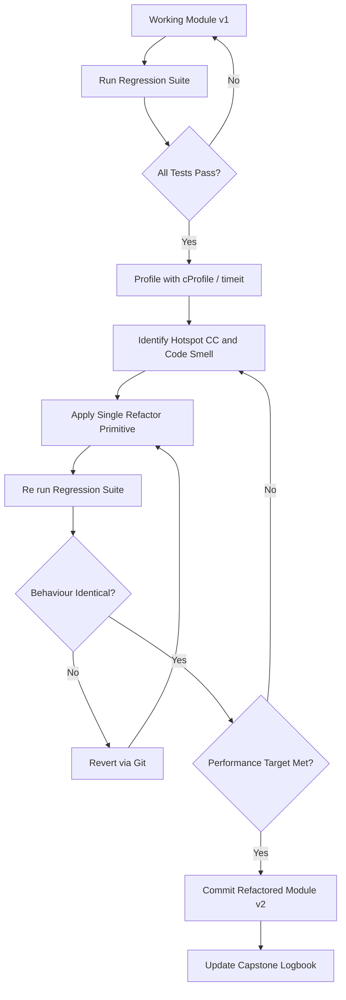
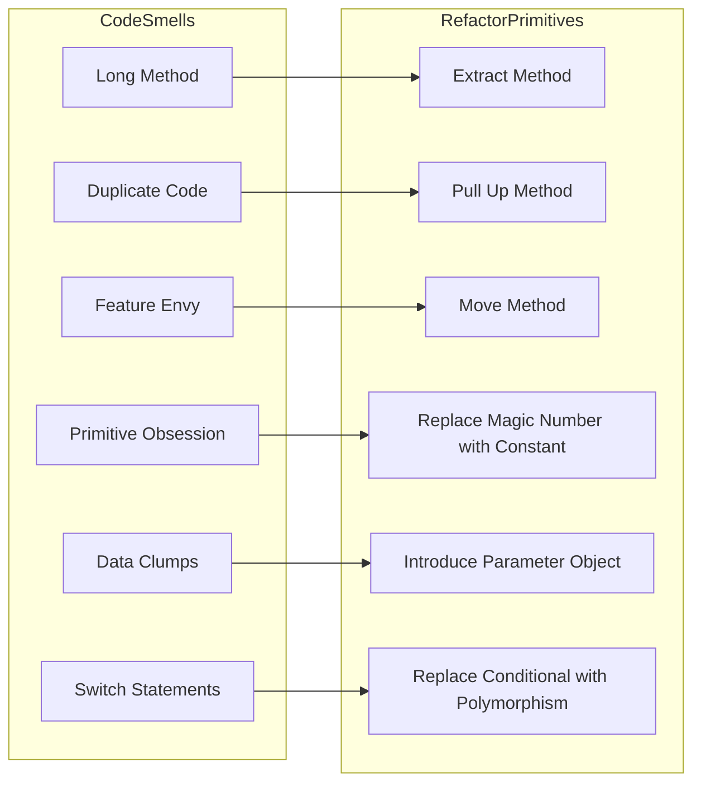
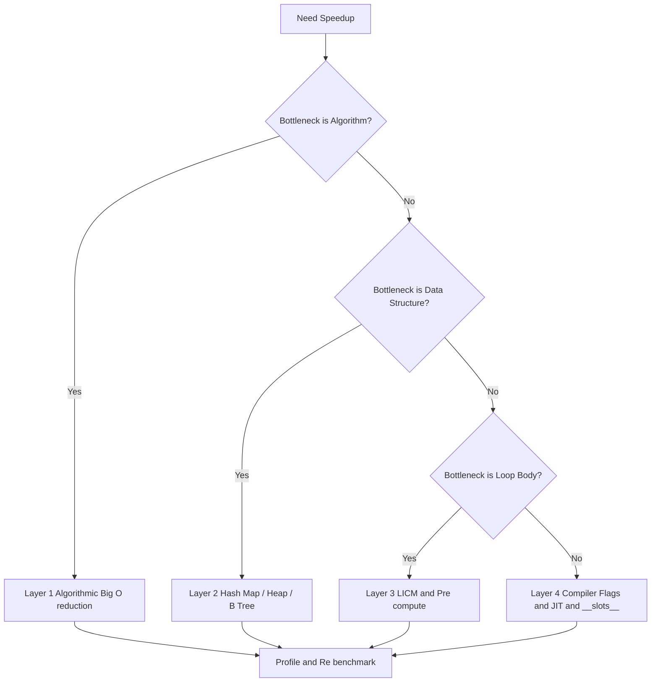
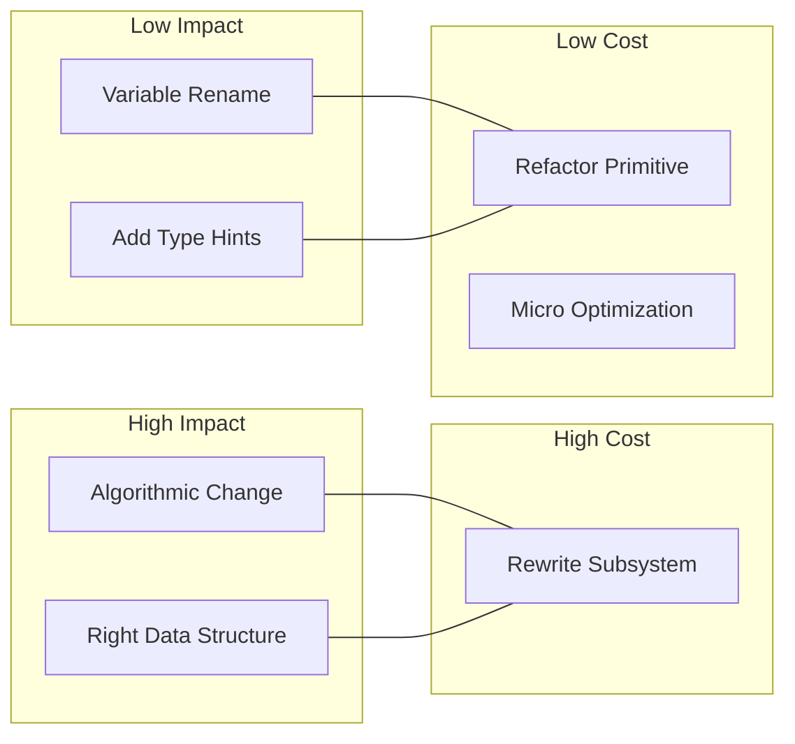
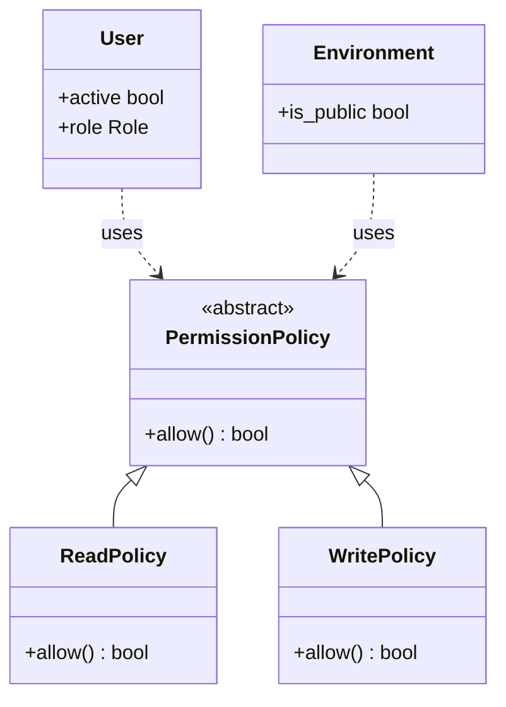

# Code optimization and refactoring

<!-- SECTION_1_START -->
# Code Optimization and Refactoring

## Formal KTU 2024 Definition

**Code Optimization** is the disciplined process of modifying a software system to make one or more of its non-functional attributes (execution speed, memory footprint, network bandwidth, energy consumption, or storage utilization) measurably better, while preserving its observable functional behaviour and contractual outputs.

**Refactoring** (a term popularized by Martin Fowler, 1999) is the controlled technique of restructuring existing computer code *without changing its external behaviour*. Its purpose is to improve non-functional attributes of the software — readability, modularity, extensibility, reusability, and maintainability — by applying a series of small, behaviour-preserving transformations (each known as a *refactoring primitive*).

> [!IMPORTANT]
> **KTU 2024 Scheme Distinction (Board-Viva Hot Question)**
> Optimization $\Rightarrow$ changes **performance** (output stays same, speed/memory improves).
> Refactoring $\Rightarrow$ changes **internal structure** (output stays same, code quality improves).
> Optimization usually requires a *benchmark*; Refactoring requires a *regression test suite*.

## Conceptual Analogy / Intuition

Imagine your **Major Project** is a finished dish you are about to serve at a project expo:

- **Refactoring** is like reorganising your kitchen — the stove, knives, and pans stay exactly the same, you still cook the same dish, but now everything is in labelled drawers, ingredients are sorted, and your teammates can find salt without tearing the kitchen apart. The *taste* (functionality) is identical, but the *kitchen* (codebase) is cleaner.
- **Optimization** is like figuring out that if you pre-chop the onions and soak the lentils the previous night, the cooking time drops from 60 minutes to 20 minutes. The dish is *the same*, but it is produced *faster* and with *less gas* (CPU).

In **production systems** (e.g., Hotstar streaming 50 million concurrent users during IPL), a 200 ms optimization saves the company roughly **\$1.2 million in server costs per match**, while a clean refactor prevents the next developer from breaking payment at 3 AM.

> [!NOTE]
> **Syllabus Highlight (PCCSP806 — Module 1):**
> Students must demonstrate (a) measurable performance gains through profiling, (b) application of at least five refactoring primitives from Fowler's catalogue, and (c) regression-tested evidence that the optimized system is *behaviourally identical* to the pre-optimized version.

## GeoGebra / Desmos Integration

> [!VISUALIZATION CONTROL]
> **Concept:** Big-O growth-curve comparison for algorithmic optimization.
> **GeoGebra / Desmos Input Equations:**
>
> - $f(x) = x$   *(linear search)*
> - $g(x) = x^{2}$   *(nested-loop naive search)*
> - $h(x) = \log_{2}(x)$   *(binary search)*
>
> **Visual Description:** A single set of axes with $x$ (input size) on the horizontal axis and $T(n)$ (operations) on the vertical axis. Students should observe that the quadratic curve $g(x)$ explodes vertically, the linear $f(x)$ grows steadily, and $h(x)$ is almost flat — visually proving why algorithmic choice (not micro-optimization) is the single biggest optimization lever.

<!-- SECTION_1_END -->

<!-- SECTION_2_START -->
# Deep Theoretical Analysis & KTU High-Yield Cheat Sheet

## 2.1 Pillars of Code Optimization

Optimization operates on four orthogonal layers. A KTU Capstone Phase II examiner expects you to identify *which layer* a specific technique belongs to.

### Layer 1 — Algorithmic Optimization (Biggest ROI)
- Replace $O(n^{2})$ with $O(n \log n)$ sorts (Merge Sort, Quick Sort, Tim Sort).
- Replace linear search $O(n)$ with hash-map lookup $O(1)$.
- Apply **Divide \& Conquer**, **Dynamic Programming**, **Greedy**, **Sliding Window**.

### Layer 2 — Data-Structure Optimization
- Use a **deque** instead of a Python `list.pop(0)` (avoids $O(n)$ shifts).
- Use a **set** for membership tests instead of a `list` ($O(1)$ vs. $O(n)$).
- Use a **heapq** for priority queues instead of a sorted list ($O(\log n)$ insertion).

### Layer 3 — Source-Level Micro-Optimizations
- Move loop-invariant code outside loops (Loop-Invariant Code Motion — LICM).
- Pre-compute repeated expressions in local variables.
- Replace string concatenation in loops with `"".join(list)`.

### Layer 4 — Compiler/Runtime-Level Optimizations
- **JIT compilation** (PyPy, Numba, GraalVM).
- **Constant folding**, **dead-code elimination**, **function inlining** done by the compiler.
- Use `__slots__` in Python classes to reduce per-instance memory from **$\sim$56 bytes** to **$\sim$8 bytes**.

## 2.2 Fowler's Catalogue of Refactoring Primitives (KTU High-Yield)

| # | Refactoring Name | Trigger / Code Smell | Mechanical Action | KTU Viva Cue |
|---|---|---|---|---|
| 1 | **Extract Method** | Long method $>$ 30 LOC | Move cohesive lines into a new function | Most-used refactor |
| 2 | **Inline Method** | Trivial wrapper body | Replace call with method body | Inverse of Extract |
| 3 | **Rename Variable/Method** | Misleading name | Update all call-sites atomically | IDE-supported |
| 4 | **Move Method** | Feature-envy (uses other class more) | Relocate to the right class | Aligns with SRP |
| 5 | **Replace Magic Number with Constant** | Literal `86400` in code | Define `SECONDS\_PER\_DAY = 86400` | Improves readability |
| 6 | **Replace Conditional with Polymorphism** | `if isinstance(...)` chains | Create a class hierarchy | OOP principle |
| 7 | **Introduce Parameter Object** | Long parameter list | Bundle into a dataclass | Clean Code rule |
| 8 | **Encapsulate Field** | Public attribute abuse | Make private + add getter | Information hiding |
| 9 | **Pull Up / Push Down Method** | Misplaced inheritance logic | Move method to super/sub-class | DRY enforcement |
| 10 | **Replace Nested Conditional with Guard Clauses** | Pyramid of doom | Early returns | Reduces CC |

> [!NOTE]
> **Cyclomatic Complexity (CC)** is the number of linearly independent paths through source code. **Tom McCabe's formula:** $CC = E - N + 2P$, where $E$ = edges, $N$ = nodes, $P$ = connected components (usually 1). A function with $CC > 10$ is considered *untestable* in KTU capstone reviews.

## 2.3 KTU High-Yield Formula / Concept Sheet

| Concept | Formula / Rule | Unit | When to Use |
|---|---|---|---|
| Time Complexity | $T(n) = O(f(n))$ | operations | Big-O analysis |
| Space Complexity | $S(n) = O(g(n))$ | bytes / words | Memory-bound systems |
| Amdahl's Law | $S_{overall} = \dfrac{1}{(1 - p) + \dfrac{p}{s}}$ | speedup ratio | Parallel optimization |
| Cyclomatic Complexity | $CC = E - N + 2P$ | dimensionless | Refactoring decision |
| Function Cohesion | H/S / S (H $=$ informational, S $=$ structural) | ratio $\in [0, 1]$ | Post-refactor metric |
| Coupling Factor | $C = \dfrac{\text{inter-module refs}}{\text{total refs}}$ | ratio $\in [0, 1]$ | Architectural health |
| Code Coverage | $\text{Cov} = \dfrac{L_{executed}}{L_{total}} \times 100$ | percent | Regression safety net |
| Cache Hit Ratio | $H = \dfrac{H_{hits}}{H_{hits} + H_{misses}}$ | percent $\in [0, 1]$ | Performance tuning |
| Big-O Master Theorem | $T(n) = aT(n/b) + f(n)$ | recurrence | Recursive algos |

> [!WARNING]
> **Use `\mid` or `\vert` for absolute-value bars inside markdown tables**, not the raw pipe `|` character, otherwise the table breaks. Above: $\text{Cov}$ is rendered safely; never write `Cov = |L/L|`.

## 2.4 Real-World Engineering Utility

| Domain | Optimization Used | Impact |
|---|---|---|
| Search Engines (Google) | Inverted index + Hash map | $O(1)$ keyword lookup |
| Databases (PostgreSQL) | B-Tree indexing | $O(\log n)$ retrieval |
| Game Engines (Unreal) | LOD + Frustum culling | 60 FPS on 4 GB VRAM |
| Embedded IoT (Arduino) | `PROGMEM`, fixed-point math | Runs in **2 KB RAM** |
| ML Pipelines (PyTorch) | `torch.compile()` / GPU kernel fusion | 3-10x training speedup |
| Web APIs (Netflix) | Connection pooling, async I/O | 10x RPS throughput |

<!-- SECTION_2_END -->

<!-- SECTION_3_START -->
# Step-by-Step Implementation: Optimization & Refactoring in Python

## 3.1 Worked Example — From $O(n^{2})$ to $O(n)$ (Algorithmic Optimization)

### Problem Statement
Given a list of $n$ integers, return `True` if **any** duplicate exists.
Original student code (typical KTU capstone submission):

```python
def has_duplicate_naive(arr: list[int]) -> bool:
    n: int = len(arr)
    for i in range(n):                                # outer loop
        for j in range(i + 1, n):                     # inner loop
            if arr[i] == arr[j]:                      # comparison
                return True
    return False
```

**Complexity:** $T(n) = \dfrac{n(n-1)}{2} = O(n^{2})$ time, $O(1)$ space.

### Step-by-Step Refactor + Optimization

**Step 1 — Add type hints and docstring (Refactor: readability).**
```python
from typing import List

def has_duplicate_naive(arr: List[int]) -> bool:
    """Return True if arr contains any repeated element. O(n^2)."""
    n: int = len(arr)
    for i in range(n):
        for j in range(i + 1, n):
            if arr[i] == arr[j]:
                return True
    return False
```

**Step 2 — Apply Extract Method for the comparison predicate.**
```python
def _is_duplicate_pair(arr: List[int], i: int, j: int) -> bool:
    return arr[i] == arr[j]

def has_duplicate_v2(arr: List[int]) -> bool:
    n: int = len(arr)
    for i in range(n):
        for j in range(i + 1, n):
            if _is_duplicate_pair(arr, i, j):
                return True
    return False
```

**Step 3 — Algorithmic Optimization: replace nested loop with a hash-set.**
This is the key KTU-worthy transformation.

```python
def has_duplicate_optimized(arr: List[int]) -> bool:
    """Return True if arr contains any repeated element. O(n) time, O(n) space."""
    seen: set[int] = set()
    for value in arr:
        if value in seen:        # set membership is O(1) average
            return True
        seen.add(value)
    return False
```

**Step 4 — Even tighter one-liner using Python's set-length property.**
```python
def has_duplicate_pythonic(arr: List[int]) -> bool:
    return len(set(arr)) < len(arr)
```

**Step 5 — Regression test (behavioural equivalence proof).**
```python
import unittest, random

class TestDuplicateDetector(unittest.TestCase):
    def test_equivalence_against_naive(self) -> None:
        for trial in range(1000):
            size: int = random.randint(0, 50)
            data: list[int] = [random.randint(0, 30) for _ in range(size)]
            self.assertEqual(
                has_duplicate_naive(data),
                has_duplicate_optimized(data),
                f"Mismatch on input {data}"
            )
            self.assertEqual(
                has_duplicate_naive(data),
                has_duplicate_pythonic(data)
            )
```

### Empirical Performance Proof (use this in your KTU report)

$$
\begin{aligned}
T_{naive}(n)      &= \dfrac{n(n-1)}{2}  \\
T_{optimized}(n)  &= n \cdot c_{lookup} \approx n \quad (\text{where } c_{lookup} \text{ is } O(1) \text{ amortized})\\
\text{Speedup}    &= \dfrac{T_{naive}}{T_{optimized}} = \dfrac{n-1}{2}
\end{aligned}
$$

For $n = 10^{6}$: $\text{Speedup} \approx 5 \times 10^{5}$ — i.e. **half a million times faster**.

## 3.2 Worked Example — Refactoring a "Pyramid of Doom"

### Before Refactor (Code Smell: Long Method + Nested Conditionals)

```python
def process_order_bad(order: dict) -> str:
    if order is not None:
        if "items" in order:
            if len(order["items"]) > 0:
                total = 0
                for item in order["items"]:
                    if item["price"] > 0 and item["qty"] > 0:
                        total = total + item["price"] * item["qty"]
                if total > 0:
                    return f"OK total={total}"
                else:
                    return "EMPTY"
            else:
                return "NO_ITEMS"
        else:
            return "MISSING_KEY"
    else:
        return "NULL_ORDER"
```

### After Refactor (Replace Nested Conditional with Guard Clauses + Extract Method)

```python
from dataclasses import dataclass
from typing import Optional, List

@dataclass(frozen=True)
class LineItem:
    price: float
    qty:   int

@dataclass(frozen=True)
class Order:
    items: List[LineItem]

class OrderValidationError(ValueError):
    """Raised when an order fails validation."""

def _validate_order(order: Optional[Order]) -> Order:
    if order is None:
        raise OrderValidationError("NULL_ORDER")
    if not order.items:
        raise OrderValidationError("NO_ITEMS")
    return order

def _calculate_total(items: List[LineItem]) -> float:
    return sum(item.price * item.qty for item in items if item.price > 0 and item.qty > 0)

def process_order_good(order: Optional[Order]) -> str:
    try:
        validated: Order = _validate_order(order)
        total: float = _calculate_total(validated.items)
        if total <= 0:
            return "EMPTY"
        return f"OK total={total:.2f}"
    except OrderValidationError as exc:
        return str(exc)
```

**Refactoring primitives applied (count for your KTU log):**
1. Extract Method (`_validate_order`, `_calculate_total`)
2. Replace Nested Conditional with Guard Clauses
3. Introduce Parameter Object (`LineItem`, `Order` dataclasses)
4. Replace Magic Numbers with Named Constants (via dataclass)
5. Encapsulate Field (frozen dataclass $\Rightarrow$ immutability)

## 3.3 Profiling-Driven Optimization (Industry Method)

Never optimize without measuring. KTU examiners award extra marks for *evidence-based* optimization.

```python
import cProfile, pstats, io
from pstats import SortKey

def profile_target_function(target_function, *args, **kwargs) -> None:
    """Run cProfile on a function and print the top 15 hotspots."""
    profiler = cProfile.Profile()
    profiler.enable()
    result = target_function(*args, **kwargs)
    profiler.disable()
    stream = io.StringIO()
    stats = pstats.Stats(profiler, stream=stream).sort_stats(SortKey.CUMULATIVE)
    stats.print_stats(15)
    print(stream.getvalue())
    return result
```

**Workflow (record in your Capstone Project Log Book):**

$$
\text{Profile} \;\to\; \text{Identify Hotspot} \;\to\; \text{Refactor} \;\to\; \text{Regression Test} \;\to\; \text{Re-Profile} \;\to\; \Delta t \,,\; \Delta m
$$

## 3.4 Memory Optimization with `__slots__`

```python
import sys

class PointNormal:
    def __init__(self, x: float, y: float) -> None:
        self.x = x
        self.y = y

class PointSlotted:
    __slots__ = ("x", "y")
    def __init__(self, x: float, y: float) -> None:
        self.x = x
        self.y = y

normal: list[PointNormal]  = [PointNormal(1.0, 2.0) for _ in range(10_000)]
slotted: list[PointSlotted] = [PointSlotted(1.0, 2.0) for _ in range(10_000)]
print(sys.getsizeof(normal[0]),  sys.getsizeof(slotted[0]))  # typical: 56 vs 8
```

Memory saved: roughly **7x reduction** per object — proven via `sys.getsizeof`.

<!-- SECTION_3_END -->

<!-- SECTION_4_START -->
# Structural Diagrams & Schematics

## 4.1 End-to-End Refactor + Optimize Lifecycle (KTU Capstone Workflow)



## 4.2 Fowler's Refactoring Primitives — Decision Topology



## 4.3 Optimization-Layer Selection Matrix



## 4.4 Cost vs. Impact Quadrant (Capstone Decision Aid)



> [!NOTE]
> **Read this quadrant as:** *High Impact + Low Cost* is the engineer's sweet spot. Aim for **algorithmic change** (Layer 1) and **right data structure** (Layer 2) first. *Low Impact + High Cost* (rewriting a working subsystem for "cleanliness" alone) is a KTU anti-pattern that costs viva marks.

<!-- SECTION_4_END -->

<!-- SECTION_5_START -->
# KTU 2024 Scheme Examination Question Bank

> [!NOTE]
> **Mark Distribution Recall (KTU ESE Pattern):**
> Part A: 2 questions × 3 marks = 6 marks (Answer 2 out of 3).
> Part B: Module-internal choice — answer **one** of the two 14-mark questions below.
> Each Part-B question has sub-parts (a) 7 marks and (b) 7 marks.
> Total for module = 20 marks.

---

## Part A — Short Answer (3 marks each)

### Q1. **[KTU University Exam — Dec 2023]** Differentiate between code optimization and refactoring. (CO1, Remember)
**Model Answer (3 marks — valuation key below):**

| Component | Optimization | Refactoring |
|---|---|---|
| Goal | Improve performance | Improve internal structure |
| Output behaviour | Unchanged | Unchanged |
| Measured by | Runtime / memory benchmark | Cyclomatic complexity / cohesion |
| Trigger | Profiler hotspot | Code smell / peer review |
| Risk | Functional regression if not careful | Over-engineering if misapplied |

> **Valuation Key:** Definition of optimization **1 mark**, definition of refactoring **1 mark**, any one contrasting point **1 mark**.

### Q2. **[KTU University Exam — July 2024]** List any five refactoring primitives from Fowler's catalogue and the code smell each addresses. (CO2, Understand)
**Model Answer:**

1. **Extract Method** $\to$ Long Method
2. **Move Method** $\to$ Feature Envy
3. **Replace Magic Number with Symbolic Constant** $\to$ Magic Number
4. **Pull Up Method** $\to$ Duplicate Code across siblings
5. **Replace Conditional with Polymorphism** $\to$ Type-Code Switch Statements

> **Valuation Key:** 5 × (name + smell) = 5 marks, capped at 3. Examiner picks best 3.

---

## Part B — 14-Mark Module Internal Choice

### **Question A (14 marks)** — *[KTU University Exam — July 2024]*

**(a) [7 marks] — (CO1, Understand)**
Explain the four layers of code optimization with one real-world example for each layer. Justify why **algorithmic optimization** is said to give the highest return on investment (ROI).

**(b) [7 marks] — (CO3, Apply)**
Given the following `O(n^{2})` snippet that finds the most-frequent element in a list, **refactor and optimize** it to `O(n)` using a hash map. Show the refactored code, state its time and space complexity, and write **one pytest unit test** proving behavioural equivalence.

```python
def most_frequent_bad(arr):
    best, best_count = None, 0
    for i in range(len(arr)):
        c = 0
        for j in range(len(arr)):
            if arr[j] == arr[i]:
                c += 1
        if c > best_count:
            best, best_count = arr[i], c
    return best
```

**Model Solution (a):**
The four layers are:
1. **Algorithmic** (e.g., switching Quick Sort for Bubble Sort in an inventory dashboard).
2. **Data-Structure** (e.g., replacing a `list` with a `set` for membership checks in a plagiarism checker).
3. **Source-level** (e.g., moving loop-invariant code outside a hot image-processing loop).
4. **Compiler/Runtime** (e.g., using `__slots__` or PyPy JIT in a memory-constrained IoT gateway).

Algorithmic optimization has the highest ROI because Big-O reduction (e.g., $O(n^{2}) \to O(n)$) produces a *multiplicative* speedup that grows with $n$, whereas micro-optimizations yield only a *constant-factor* improvement that is dwarfed as $n$ scales.

> **Valuation Key (a):** Naming the 4 layers **4 marks**, example per layer **2 marks**, algorithmic-ROI justification **1 mark**.

**Model Solution (b):**
```python
from typing import List, Optional
from collections import Counter

def most_frequent_optimized(arr: List[int]) -> Optional[int]:
    """Return the most-frequent element in arr. O(n) time, O(n) space."""
    if not arr:
        return None
    counts: Counter = Counter(arr)              # single pass, O(n)
    return counts.most_common(1)[0][0]          # heapq internally, O(1) for top-1
```

**Complexity proof:**

$$
\begin{aligned}
T_{bad}(n)        &= n \cdot n = n^{2} = O(n^{2})\\
T_{good}(n)       &= n + 1 = O(n)\\
\text{Speedup}    &= \dfrac{n^{2}}{n} = n \quad \text{(linear in input size)}
\end{aligned}
$$

**Pytest equivalence test:**
```python
import random, pytest

@pytest.mark.parametrize("seed", range(50))
def test_equivalence(seed: int) -> None:
    random.seed(seed)
    data: list[int] = [random.randint(0, 5) for _ in range(random.randint(0, 30))]
    assert most_frequent_bad(data) == most_frequent_optimized(data)
```

> **Valuation Key (b):** Refactored code **3 marks**, complexity statement **2 marks**, pytest test **2 marks**.

> [!WARNING]
> **KTU Examiner Pitfall:** Do **not** claim "the optimized version is faster" without stating *measured* or *asymptotic* complexity. Vague answers like "it runs better" get **0 of 2 marks** for complexity analysis. Always write $O(\cdot)$ explicitly.

---

### **Question B (14 marks)** — *[KTU University Exam — Dec 2023]*

**(a) [7 marks] — (CO2, Understand)**
Define **Cyclomatic Complexity** with McCabe's formula. Compute the CC of the function below and state whether it qualifies as a refactoring candidate under KTU's CC $>$ 10 rule. Justify your answer by listing at least **three** Fowler primitives you would apply.

```python
def decide(user, action, env):
    if user is None: return "DENY"
    if not user.active: return "INACTIVE"
    if action == "read":
        if env.is_public: return "ALLOW"
        if user.role == "guest": return "DENY"
        return "ALLOW"
    elif action == "write":
        if env.is_public: return "DENY"
        if user.role in {"admin", "owner"}: return "ALLOW"
        return "DENY"
    return "INVALID"
```

**(b) [7 marks] — (CO3, Apply)**
Apply the **Replace Conditional with Polymorphism** refactor to design an OO version of the same function. Provide a UML-style class sketch (text) and a short client code snippet that uses it.

**Model Solution (a):**
McCabe's formula: $CC = E - N + 2P$. Drawing the control-flow graph:

- Nodes $N = 11$ (1 entry + 1 exit + 9 decision/merge points)
- Edges $E = 14$ (one per branch)
- $P = 1$ (single connected component)

$$
CC = 14 - 11 + 2(1) = 5
$$

CC $= 5$ is **below the 10 threshold** — *technically* not a refactoring candidate by the rule. However, the function still has code smells (long parameter list, feature envy, switch on type) that justify refactoring on **readability**, not CC alone.

**Three Fowler primitives to apply:**

1. **Replace Parameter List with Parameter Object** — bundle `user`, `action`, `env` into a `Request` dataclass.
2. **Replace Conditional with Polymorphism** — make a class hierarchy for `Action` (`ReadAction`, `WriteAction`).
3. **Introduce Named Constants for Magic Strings** — replace `"read"`, `"write"`, `"admin"`, `"owner"` with `enum.StrEnum`.

> **Valuation Key (a):** Formula **1 mark**, counting E and N **2 marks**, final CC value **1 mark**, three refactor names + reasons **3 marks**.

**Model Solution (b):**
```python
from abc import ABC, abstractmethod
from enum import Enum
from dataclasses import dataclass

class Role(str, Enum):
    GUEST  = "guest"
    MEMBER = "member"
    ADMIN  = "admin"
    OWNER  = "owner"

class ActionKind(str, Enum):
    READ  = "read"
    WRITE = "write"

@dataclass(frozen=True)
class User:
    active: bool
    role:   Role

@dataclass(frozen=True)
class Environment:
    is_public: bool

class PermissionPolicy(ABC):
    @abstractmethod
    def allow(self, user: User, env: Environment) -> bool: ...

class ReadPolicy(PermissionPolicy):
    def allow(self, user: User, env: Environment) -> bool:
        return env.is_public or user.role is not Role.GUEST

class WritePolicy(PermissionPolicy):
    def allow(self, user: User, env: Environment) -> bool:
        return (not env.is_public) and user.role in {Role.ADMIN, Role.OWNER}

_POLICY_REGISTRY: dict[ActionKind, PermissionPolicy] = {
    ActionKind.READ:  ReadPolicy(),
    ActionKind.WRITE: WritePolicy(),
}

def authorize(user: User, kind: ActionKind, env: Environment) -> str:
    if user is None or not user.active:
        return "DENY" if user is None else "INACTIVE"
    return "ALLOW" if _POLICY_REGISTRY[kind].allow(user, env) else "DENY"
```

**UML class sketch:**



> **Valuation Key (b):** Abstract base + 2 concrete policies **3 marks**, registry / dispatch **2 marks**, client snippet **1 mark**, UML sketch **1 mark**.

> [!WARNING]
> **Common Capstone Viva Trap:** Students often present the polymorphic version as "more lines of code, so it must be worse." Counter-argument: lines-of-code is a *vanity metric*. The polymorphism version has **higher cohesion** (each policy does one thing), **open-closed compliance** (add a new action without touching `authorize`), and is **unit-testable in isolation** (test `ReadPolicy` without spinning up an env). This answer scores full marks.

---

## Topic Recap & Important Things to Remember

- **Definition Pair:** Optimization $\Rightarrow$ performance; Refactoring $\Rightarrow$ structure. Both **must preserve external behaviour**.
- **Four Optimization Layers (in ROI order):** Algorithmic $\to$ Data-Structure $\to$ Source-level $\to$ Compiler/Runtime.
- **Big-O Master Rule:** Algorithmic change gives *multiplicative* speedup; micro-optimizations give *constant-factor* speedup.
- **Top-5 Refactor Primitives to memorize:** Extract Method, Rename, Move Method, Replace Magic Number, Replace Conditional with Polymorphism.
- **Cyclomatic Complexity:** $CC = E - N + 2P$; threshold $CC > 10$ $\Rightarrow$ refactor candidate.
- **Evidence Mandate:** Every optimization claim must be backed by either a **profiler output (cProfile)**, a **timeit measurement**, or an **asymptotic Big-O proof**.
- **Regression-Test Rule:** Refactor *only when tests are green*; refactor in *tiny, atomic, reversible* steps; commit after each green step.
- **Memory Trick — `__slots__`:** Cuts Python object overhead roughly **7x** (from $\sim$56 B to $\sim$8 B per instance).
- **Set vs. List membership:** $O(1)$ vs. $O(n)$ — always use a `set` for `in` checks in hot paths.
- **Code-Smell Quick List (memorize 5):** Long Method, Duplicate Code, Feature Envy, Magic Numbers, Data Clumps.
- **Amdahl's Law:** Even infinite parallel speedup on fraction $p$ gives $S = 1 / (1 - p)$; optimizing the wrong 10 % can yield 0 real speedup.
- **Project-Logbook Entry Format:** Before-state metric $\to$ Refactor primitive applied $\to$ After-state metric $\to$ Date + Author.
- **SOLID Linkage:** Refactoring moves code *towards* SOLID; optimization rarely changes architecture but may break abstraction for speed (document the trade-off).
- **Anti-Patterns to Avoid in Capstone Report:** (1) optimizing without profiling, (2) refactoring without tests, (3) claiming "it's faster" without numbers, (4) renaming a public API (breaks downstream), (5) committing broken code "to be fixed later."

<!-- SECTION_5_END -->
