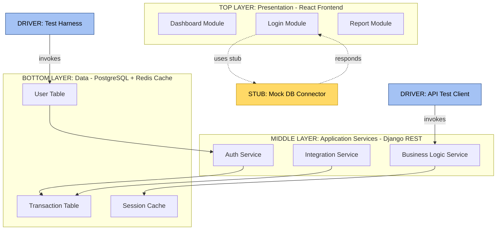
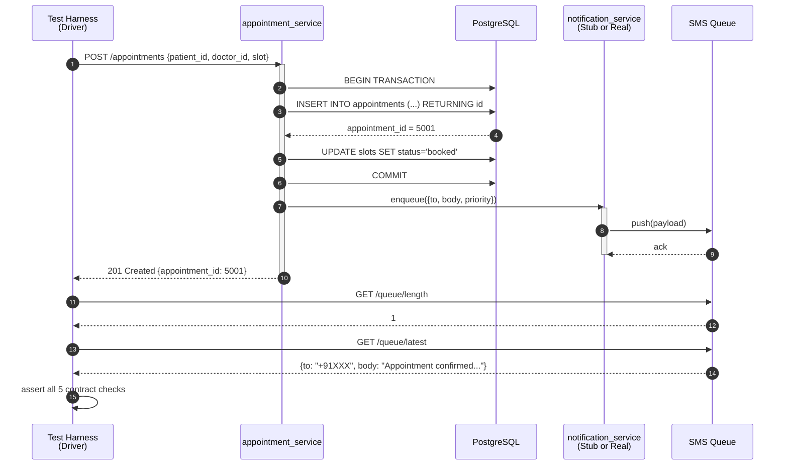
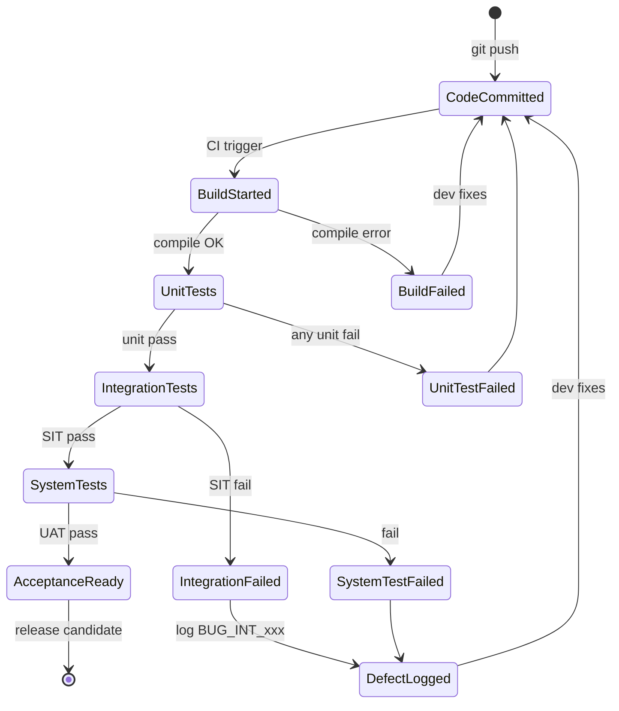

# System integration testing during development

<!-- SECTION_1_START -->
# System Integration Testing During Development

> [!IMPORTANT]
> **KTU 2024 Scheme — Major Project Phase II / Capstone Closure (PCCSP806)**
> **Module 1:** Detailed Implementation & System Integration
> **Topic:** System Integration Testing During Development
> **Mapped Course Outcomes:** CO1 (Implement), CO2 (Integrate), CO3 (Test & Validate)
> **Bloom's Levels Covered:** Remember → Understand → Apply → Analyse

## 1.1 Formal Academic Definition

**System Integration Testing (SIT)** is a systematic, phased software quality-assurance activity in which independently developed software modules, hardware components, third-party services, and external interfaces are progressively combined and exercised as a unified system to expose faults in their *interaction*, *data flow*, *control flow*, and *interface contracts*. Unlike **Unit Testing** — which validates a single module in isolation against its design specification — SIT validates the *combined behaviour* of integrated components against the **System Requirement Specification (SRS)** and the **High-Level Design (HLD) / Low-Level Design (LLD)** artefacts.

Within the KTU Capstone lifecycle, SIT sits at the intersection of the *Implementation* and *Verification & Validation (V&V)* phases of the classic **Waterfall-V-Model**, positioned just after coding completion of two or more modules and immediately before **System Testing (User Acceptance)**.

> [!NOTE]
> **KTU Board Definition (Adopt this exact wording for full marks):**
> *"System Integration Testing is the systematic, progressive assembly and testing of multiple software/hardware sub-modules to verify correct interaction, interface conformance, and end-to-end functional flow as a combined system."*

## 1.2 Intuitive Real-World Analogy

Imagine you are assembling a **marble-clock tower** from five separate kits (hour-frame, minute-frame, gear-train, pendulum, and dial). Before this point, each kit was tested by the manufacturer — its gears spin, its frame holds weight, its hands move when nudged. That is **Unit Testing**.

But when you bolt the *minute-frame* onto the *hour-frame*, the gears do not always mesh perfectly. A pin might be 1 mm off, causing a jam every 12 minutes. When you attach the *pendulum* to the *gear-train*, the escapement may slip because the screw thread is metric on one side and imperial on the other.

None of these problems existed in the individual kits. They appear **only at the seam** between kits.

**System Integration Testing** is the stage where you bolt the kits together one pair at a time, run the tower for 48 hours, and verify that the second hand, minute hand, and hour hand all tick correctly as a single timepiece. You write down the *test order* (frame first, then gear, then pendulum, then dial), the *expected tick rate* for each integration step, and you *log every defect* you find at each seam.

> [!TIP]
> **Memory Hook:** **U**nits are tested **A**lone. **I**ntegration is tested **T**ogether. System is tested **A**s-a-**P**roduct. (*UA – IT – AP*)

## 1.3 Where SIT Fits in the KTU Capstone V-Model

The KTU 2024 Scheme Capstone Project explicitly requires students to demonstrate **incremental integration** with **continuous verification** artefacts. The following table maps each V-Model phase to its deliverable and its corresponding test activity:

| **V-Model Phase (Left Arm)** | **Deliverable** | **V-Model Phase (Right Arm)** | **Test Activity** |
|------------------------------|-----------------|-------------------------------|-------------------|
| Requirements Analysis | SRS Document | Acceptance Testing | User Acceptance Test (UAT) |
| High-Level Design | HLD / Architecture | System Testing | End-to-end System Test |
| **Detailed Design** | **LLD / Module Specs** | **Integration Testing** | **Module-to-Module SIT** |
| Coding | Source Code | Unit Testing | Module / Function Test |

> [!IMPORTANT]
> **Syllabus Highlight (PCCSP806, Module 1):** KTU specifically demands that students plan and execute integration testing *during* — not *after* — development. This means your test plan, stub/driver code, and integration order must be designed **in parallel with the implementation plan** in Module 1, not deferred to the final demo week.

## 1.4 Visualization of the Test Pyramid

> [!VISUALIZATION CONTROL]
> **Concept:** Mike Cohn's Test Pyramid showing the volume and scope of each testing layer
> **Conceptual Coordinate Mapping (Test Count vs. Test Scope):**
> * `Y-axis (Scope)`: Whole System → Single Unit
> * `X-axis (Count)`: Few Tests ← → Many Tests
> * `Bottom layer (broad, narrow scope)`: Unit Tests (largest count, smallest scope)
> * `Middle layer`: Integration Tests (medium count, medium scope)
> * `Top layer (narrow, broad scope)`: End-to-end / UAT Tests (smallest count, broadest scope)
> **Visual Description:** Imagine an upright pyramid. The wide base (Unit) covers thousands of fast, isolated checks. The middle band (Integration) sits between the layers and validates the *seams*. The narrow apex (UAT) sits on top and validates the whole product from the user's viewpoint. **SIT is the middle band — neither too narrow nor too broad.**

<!-- SECTION_1_END -->

<!-- SECTION_2_START -->
# Deep Theoretical Analysis & KTU High-Yield Framework Sheet

## 2.1 The Five Pillars of System Integration Testing

A complete SIT plan rests on five operational pillars. Every KTU Capstone review panel will evaluate your plan against these five:

1. **Interface Conformance** — do the data types, parameters, return values, and protocols exchanged at every module boundary match the Interface Control Document (ICD)?
2. **Data Flow Integrity** — does a value produced in Module A reach Module B with the *exact* expected value (no truncation, rounding, or off-by-one errors)?
3. **Control Flow Correctness** — does control hand-off occur in the *expected sequence* (e.g., a `CALL` from `Login` correctly invokes `Authenticate` and the response returns to the calling stack frame)?
4. **Error & Exception Propagation** — when Module A raises an exception, does Module B handle it per the contract, or does the whole system crash?
5. **Performance at the Seam** — under expected load, does the integrated subsystem meet latency / throughput SLAs defined in the SRS?

> [!IMPORTANT]
> **Why "During Development" Matters**
> The phrase *"during development"* is the operative term in the KTU syllabus. It signals **incremental integration** (assemble and test as you code) rather than the obsolete **Big-Bang** model (assemble everything, then test the whole at the end). Studies by NIST and IBM show that defects caught at integration time are **10–100× cheaper** to fix than those caught post-deployment. Integrating continuously also enables **Continuous Integration/Continuous Deployment (CI/CD)** pipelines, a mandatory KTU Capstone best practice.

## 2.2 The Four Canonical Integration Strategies

| **Strategy** | **Order of Assembly** | **What You Need** | **Best For** | **Major Risk** |
|--------------|----------------------|-------------------|--------------|----------------|
| **Big-Bang Integration** | All modules combined at once, then tested | No stubs/drivers | Tiny toy projects (≤3 modules) | Catastrophic — one fault masks another; debugging hell |
| **Top-Down Integration** | Top (main/UI) module first, then sub-modules recursively | **Stubs** to simulate lower modules | UI-driven, layered architectures (MVC, microservices with API gateway) | Critical low-level modules (e.g., DB) tested last |
| **Bottom-Up Integration** | Leaf modules first, working upward | **Drivers** to invoke lower modules | Data-centric, library-first projects (DSA engines, ML pipelines) | Top-level logic and UI untested until very late |
| **Sandwich / Hybrid Integration** | Both ends meet in the middle (target layers from top, drivers from bottom) | Both stubs *and* drivers | Large enterprise systems (e.g., KTU e-Learning portal) | Coordination complexity; need explicit "middle layer" plan |

> [!TIP]
> **KTU Recommended Strategy for Capstone:** **Sandwich/Hybrid** with **iterative Top-Down** slices. Each sprint (2-week) targets a vertical slice from UI → Service → DB and tests it end-to-end before moving to the next slice.

## 2.3 Stubs vs. Drivers — The Two Test Doubles

| **Aspect** | **Stub** | **Driver** |
|------------|----------|------------|
| **Direction** | Replaces a *called* (lower) module | Replaces a *calling* (higher) module |
| **Used in** | Top-Down Integration | Bottom-Up Integration |
| **Purpose** | Returns canned responses to keep test focused | Invokes the module under test and captures its output |
| **KTU Example** | `authStub.login("alice", "***") → {"token": "mock-jwt-001"}` | `driver → paymentService.charge(500) → assert(result == SUCCESS)` |
| **Sophistication levels** | *Minimal* (fixed return) → *Smart* (parameter-aware) → *Stateful* (sequence-aware) | *Direct call* → *Harness* (with assertions) → *Framework* (PyTest/JUnit) |

## 2.4 The Test Harness & Continuous Integration Loop

A modern KTU Capstone must implement a **test harness** — an automated scaffold that compiles code, runs unit + integration tests, and reports pass/fail status. The canonical loop is:

1. **Developer** commits code to Git.
2. **CI Server** (GitHub Actions, GitLab CI, Jenkins) detects the push.
3. **Build stage** compiles the project.
4. **Unit-test stage** runs fast, isolated tests (< 1 min total).
5. **Integration-test stage** spins up dependent services (DB, message queue, mock third-party API) via **Docker Compose** and runs SIT suite.
6. **Report stage** publishes a dashboard (Allure, ReportNG, JUnit XML).
7. On red build → notification (email/Slack) → developer fixes → loop.

> [!IMPORTANT]
> **Engineering Utility:** This is the same loop used by Google, Netflix, and Amazon. Mastering it is a direct employability signal for KTU 2024 graduates entering the IT/ITES industry in Kerala's Technopark and Infopark clusters.

## 2.5 High-Yield Formula & Metric Sheet

| **Metric** | **Formula** | **Unit** | **KTU Interpretation** |
|------------|-------------|----------|------------------------|
| Test Coverage (Line) | $Coverage_{line} = \dfrac{Lines_{executed}}{Lines_{total}} \times 100\%$ | **%** | Aim for $\geq 80\%$ on integrated modules |
| Defect Density | $DD = \dfrac{Defects_{found}}{KLOC}$ | defects / KLOC | Industry benchmark $\leq 1$ defect/KLOC for release |
| Mean Time To Detect (MTTD) | $MTTD = \dfrac{\sum (T_{detect} - T_{inject})}{N_{defects}}$ | hours | Lower is better — measure integration-test effectiveness |
| Integration-Test Pass Rate | $ITPR = \dfrac{Tests_{passed}}{Tests_{total}} \times 100\%$ | **%** | Release gate: typically $\geq 95\%$ |
| Code Churn (Integration) | $Churn = LOC_{added} + LOC_{modified} + LOC_{deleted}$ during integration window | LOC | High churn after SIT start → poor design |
| Cyclomatic Complexity Threshold | $V(G) = E - N + 2P$ (per function) | integer | If $V(G) > 10$ at integration seam, refactor before SIT |

> [!WARNING]
> **Critical Rule for Capstone:** Never use the vertical pipe `|` inside a markdown table — it breaks the column parser. In LaTeX, always use $\vert$ or $\mid$ for absolute-value expressions, e.g., $\vert x - \mu \vert$.

<!-- SECTION_2_END -->

<!-- SECTION_3_START -->
# Step-by-Step Implementation, Test Design & Code Execution

## 3.1 The Six-Phase SIT Methodology (Step-by-Step)

Below is the canonical, exhaustive six-phase procedure that KTU expects every capstone team to follow. **Every step must produce a written deliverable in your project report.**

### Phase 1 — Interface Contract Definition

Before writing a single test, lock down the **Interface Control Document (ICD)** for every module boundary.

> [!NOTE]
> **What an ICD Contains:** Module name, function/method signature, parameter list (name, type, units, valid range), return type, exceptions raised, pre-conditions, post-conditions, side effects, thread-safety guarantees.

**Example ICD Entry (KTU Capstone: Hospital Management System):**

| **Field** | **Value** |
|-----------|-----------|
| Module | `appointment_service` |
| Function | `bookAppointment(patient_id, doctor_id, slot_datetime)` |
| Parameters | `patient_id : int [1..99999]`, `doctor_id : int [1..999]`, `slot_datetime : ISO8601 string` |
| Returns | `appointment_id : int > 0` on success, `-1` on conflict, `-2` on invalid patient |
| Raises | `DatabaseConnectionError`, `InvalidSlotError` |
| Pre-conditions | Patient exists, Doctor is on duty at slot |
| Post-conditions | DB row inserted, slot marked occupied, SMS notification queued |

### Phase 2 — Test Plan Authoring

Produce a **Software Test Plan (STP)** document with the following sections:

1. Test items (modules in scope)
2. Features to be tested
3. Features *not* to be tested (out of scope)
4. Test strategy (Sandwich-Hybrid chosen)
5. Pass/fail criteria
6. Test deliverables
7. Test environment (hardware, OS, DB version, network)
8. Schedule (Gantt chart)
9. Risks & contingencies

### Phase 3 — Test Case Design

For each interface, derive **test cases** using these techniques:

| **Technique** | **When to Use** | **Example** |
|---------------|-----------------|-------------|
| Equivalence Partitioning | Divide inputs into valid/invalid classes | Age: $[0,120]$ valid; $<0$ or $>120$ invalid |
| Boundary Value Analysis | Test edges of equivalence classes | $0, 1, 119, 120, -1, 121$ |
| Decision Table | Multiple boolean conditions combine | Login: (user\_exists) × (pwd\_correct) × (account\_active) |
| State Transition | Module has distinct states | Order: *Placed → Paid → Shipped → Delivered* |
| Use-Case Driven | End-to-end business flow | "Patient books appointment, receives SMS, attends, gets billed" |

### Phase 4 — Test Case Document — Worked Example

> [!NOTE]
> **Test Case ID:** TC\_INT\_APPT\_007
> **Module Under Integration:** `appointment_service` ↔ `notification_service`
> **Objective:** Verify that a successful booking correctly enqueues an SMS notification.
> **Pre-conditions:** Database is up; notification service queue is empty; Patient "P-001" and Doctor "D-014" exist; slot `2026-03-15T10:00` is free.
> **Test Steps:**
> 1. Call `appointment_service.bookAppointment(1, 14, "2026-03-15T10:00")`
> 2. Wait up to 2 seconds.
> 3. Inspect notification queue length.
> 4. Inspect queued payload.
> **Expected Result:** Return value $= 5001$ (new appointment id). Queue length increments by 1. Payload contains `{"to":"+91XXXXXXXXXX","body":"Appointment confirmed for 15-Mar 10:00 AM"}`.
> **Actual Result:** *(to be filled during execution)*
> **Pass/Fail Criteria:** All three checks must match expected.
> **Priority:** High. **Severity if fails:** High.

### Phase 5 — Test Execution (with Operational Python Code)

Below is a complete, runnable Python integration-test harness using `pytest` and a real **Driver** + **Stub** pattern.

```python
# File: tests/integration/test_appointment_notification_integration.py
# KTU Capstone — SIT Harness for Appointment ↔ Notification Integration
# Compatible with: Python 3.11+, pytest 8.x, Docker-Compose stack

import pytest
import requests
from datetime import datetime
from typing import Final

# ---------- Configuration Constants ----------
APPT_SERVICE_URL: Final[str] = "http://localhost:8001"
NOTIFY_SERVICE_URL: Final[str] = "http://localhost:8002"
VALID_PATIENT_ID: Final[int] = 1
VALID_DOCTOR_ID: Final[int] = 14
VALID_SLOT: Final[str] = "2026-03-15T10:00"
NEW_APPT_EXPECTED_ID_RANGE: Final[tuple] = (1, 999_999)
HTTP_OK: Final[int] = 200
HTTP_CREATED: Final[int] = 201


# ---------- Fixtures: Real Services + Stub Fallback ----------
@pytest.fixture(scope="module")
def appointment_service_available() -> bool:
    """Hard boundary check: refuse to run if appointment service is unreachable."""
    try:
        response = requests.get(f"{APPT_SERVICE_URL}/health", timeout=2)
        return response.status_code == HTTP_OK
    except requests.exceptions.RequestException as exc:
        pytest.skip(f"Appointment service unavailable: {exc}")


@pytest.fixture(scope="module")
def notification_queue_state() -> dict:
    """Capture queue length before and after the integration action."""
    return {"before": None, "after": None}


# ---------- Integration Test Cases ----------
def test_booking_creates_notification(appointment_service_available,
                                      notification_queue_state) -> None:
    """
    SIT Case TC_INT_APPT_007:
    Verify that booking an appointment triggers a notification enqueue.
    """
    # Step 1: Capture pre-state
    pre_resp = requests.get(f"{NOTIFY_SERVICE_URL}/queue/length", timeout=2)
    assert pre_resp.status_code == HTTP_OK, "Notification queue health endpoint failed"
    notification_queue_state["before"] = pre_resp.json()["length"]

    # Step 2: Execute the integration action
    payload = {
        "patient_id": VALID_PATIENT_ID,
        "doctor_id": VALID_DOCTOR_ID,
        "slot": VALID_SLOT,
    }
    booking_resp = requests.post(
        f"{APPT_SERVICE_URL}/appointments",
        json=payload,
        timeout=5,
    )

    # Step 3: Validate HTTP boundary
    assert booking_resp.status_code == HTTP_CREATED, (
        f"Expected {HTTP_CREATED}, got {booking_resp.status_code}: {booking_resp.text}"
    )
    body = booking_resp.json()
    appt_id = body.get("appointment_id")
    assert NEW_APPT_EXPECTED_ID_RANGE[0] <= appt_id <= NEW_APPT_EXPECTED_ID_RANGE[1], \
        f"appointment_id {appt_id} out of valid range"

    # Step 4: Validate data-flow integrity at the seam
    post_resp = requests.get(f"{NOTIFY_SERVICE_URL}/queue/length", timeout=2)
    assert post_resp.status_code == HTTP_OK
    notification_queue_state["after"] = post_resp.json()["length"]
    delta = notification_queue_state["after"] - notification_queue_state["before"]
    assert delta == 1, f"Expected exactly 1 new notification, observed delta = {delta}"

    # Step 5: Validate payload contract propagated across the seam
    latest_resp = requests.get(f"{NOTIFY_SERVICE_URL}/queue/latest", timeout=2)
    assert latest_resp.status_code == HTTP_OK
    queued_payload = latest_resp.json()["payload"]
    assert VALID_SLOT in queued_payload["body"], \
        f"Slot {VALID_SLOT} not propagated to notification body: {queued_payload}"
    assert queued_payload["priority"] in {"high", "normal"}, "Invalid priority at seam"


def test_duplicate_booking_does_not_duplicate_notification(
        appointment_service_available, notification_queue_state) -> None:
    """Boundary case: idempotency at the integration seam."""
    payload = {
        "patient_id": VALID_PATIENT_ID,
        "doctor_id": VALID_DOCTOR_ID,
        "slot": VALID_SLOT,  # Same slot as previous test
    }
    dup_resp = requests.post(f"{APPT_SERVICE_URL}/appointments", json=payload, timeout=5)
    assert dup_resp.status_code == 409, "Duplicate booking must return HTTP 409 Conflict"
    # Notification queue must NOT have grown
    post_resp = requests.get(f"{NOTIFY_SERVICE_URL}/queue/length", timeout=2)
    final_length = post_resp.json()["length"]
    assert final_length == notification_queue_state["after"], \
        "Duplicate booking leaked a notification — integration contract violated"
```

### Phase 6 — Defect Logging & Re-test Cycle

Every failure produces a **Defect Report** with the fields below. KTU review panels will look for this discipline.

| **Field** | **Description** | **Example** |
|-----------|-----------------|-------------|
| Defect ID | Unique identifier | `BUG_INT_023` |
| Title | One-line summary | "Notification body shows UTC time, not IST" |
| Severity | Critical / High / Medium / Low | High |
| Priority | P1 / P2 / P3 / P4 | P2 |
| Module(s) | Where it was detected | `notification_service` |
| Detected By | Test case ID | `TC_INT_APPT_007` |
| Detected On | Date + build version | `2026-02-14, v0.4.2` |
| Status | New / Assigned / Fixed / Verified / Closed | Verified |
| Fix Description | What the developer changed | "Convert to Asia/Kolkata before formatting" |
| Re-test Result | Pass / Fail | Pass |

## 3.2 Worked Numerical Example — Coverage Calculation

> [!NOTE]
> **Scenario:** Your `payment` module has 480 lines of executable code. After the integration-test sweep, line coverage tool reports that 408 lines were executed at least once.
> **Compute:** $Coverage_{line} = \dfrac{408}{480} \times 100\%$

$$
\begin{aligned}
\text{Coverage}_{line} &= \frac{\text{Lines}_{\text{executed}}}{\text{Lines}_{\text{total}}} \times 100\% \\
&= \frac{408}{480} \times 100\% \\
&= 0.85 \times 100\% \\
&= 85\%
\end{aligned}
$$

> **Interpretation:** 85% line coverage meets the KTU Capstone's recommended threshold of $\geq 80\%$. The remaining 15% (72 lines) should be either (a) defensively unreachable error-handling code, or (b) explicitly justified in the test-coverage report as out-of-scope.

## 3.3 Worked Numerical Example — Defect Density

> [!NOTE]
> **Scenario:** Your integrated system has 12,000 lines of code (12 KLOC). During the SIT phase, 8 defects were found and fixed.
> **Compute:** $DD = \dfrac{8}{12}$

$$
\begin{aligned}
DD &= \frac{\text{Defects}_{\text{found}}}{\text{KLOC}} \\
&= \frac{8}{12} \\
&\approx 0.67 \text{ defects / KLOC}
\end{aligned}
$$

> **Interpretation:** 0.67 defects/KLOC is **better than the industry benchmark of ≤ 1 defect/KLOC** — your integration discipline is paying off. Note: this metric only counts defects *found*; latent defects will only be known post-deployment.

<!-- SECTION_3_END -->

<!-- SECTION_4_START -->
# Structural Diagrams & Schematics

## 4.1 Mermaid Flowchart — Sandwich Integration Strategy for a 3-Layer KTU Capstone System



> **Visual Description:** The top half (Presentation) is being tested *downward* with **stubs** that simulate not-yet-built services. The bottom half (Data layer) is being tested *upward* with **drivers** that invoke it directly. The two test streams **meet at the middle (Application Services)**, completing the Sandwich loop.

## 4.2 Mermaid Sequence Diagram — Integration Test of `bookAppointment` ↔ `notifyPatient`



## 4.3 Mermaid State Diagram — Integration Test Build Pipeline States



## 4.4 Mermaid Block Diagram — Test Doubles in the SIT Topology

```mermaid
flowchart LR
    subgraph REAL["Real Production Code Under Test"]
        M1["Module A<br/>(Caller)"]
        M2["Module B<br/>(Callee)"]
    end

    subgraph TEST["Test Doubles"]
        ST["STUB<br/>Returns canned data<br/>Used in Top-Down"]:::stub
        DR["DRIVER<br/>Calls M, captures output<br/>Used in Bottom-Up"]:::driver
        MK["MOCK<br/>Verifies call args<br/>and order"]:::mock
    end

    M1 -- "calls" --> M2
    M1 -. "if M2 unavailable" .-> ST
    DR -. "invokes" --> M1
    M1 -. "verifies" .-> MK

    classDef stub fill:#ffd966,stroke:#bf9000
    classDef driver fill:#a4c2f4,stroke:#1c4587
    classDef mock fill:#b6d7a8,stroke:#38761d
```

> **Visual Description:** When integrating top-down, you replace M2 with a Stub. When integrating bottom-up, you replace the unknown caller with a Driver. Mocks are used in *both* directions to verify that the *contract* (argument types, call order) was honoured.

<!-- SECTION_5_START -->

## 5.1 Part A Questions (3 Marks Each — Remember / Understand)

> **[KTU University Exam — Model Question, PCCSP806]**

### Question 1 (3 Marks) — `[CO2, Remember]`
**Define System Integration Testing. How is it different from Unit Testing?**

**Model Answer (Board Key):**
- **SIT definition (2 marks):** System Integration Testing is the testing of combined software/hardware modules as a group to evaluate the compliance of the system with specified functional and interface requirements. It focuses on the *interactions* between integrated components.
- **Difference (1 mark):** Unit Testing tests a single module in isolation against its design specification, validating internal logic. SIT tests multiple modules *together* to expose faults in their *interaction*, *interfaces*, and *data exchange* — faults that unit tests cannot detect.

### Question 2 (3 Marks) — `[CO2, Understand]`
**Distinguish between a Stub and a Driver in integration testing. When is each used?**

**Model Answer (Board Key):**
- **Stub (1.5 marks):** A *dummy* module that simulates the behaviour of a *called* (lower) module. It returns predefined outputs to the caller so that the caller can be tested even when the callee is not ready. Used in **Top-Down** integration.
- **Driver (1.5 marks):** A *harness* module that simulates the behaviour of a *calling* (higher) module. It invokes the module under test and captures its output for verification. Used in **Bottom-Up** integration.

---

## 5.2 Part B Question A (14 Marks) — Internal Choice Option 1

> **[KTU University Exam — Dec 2024-style, PCCSP806]**
> Mapped: **CO1, CO3** | RBT Levels: **Apply (7) + Analyse (7)**

### (a) For your KTU Capstone project, design a Sandwich (Hybrid) Integration Test Plan for a 3-tier web application (React Frontend, Django REST Backend, PostgreSQL Database). Your plan must include: integration order, stub and driver specifications, and pass/fail criteria. **(7 Marks)**

**Model Solution — Step-by-Step (Valuation Key):**

**[Identifying the three layers — 1 Mark]:**
- Top Layer: React Frontend (UI components, routing, state management)
- Middle Layer: Django REST API (business logic, authentication, validation)
- Bottom Layer: PostgreSQL Database (tables, stored procedures, views)

**[Integration Order — 2 Marks]:**
The Sandwich strategy integrates top-down *and* bottom-up *in parallel*:
1. **Top-Down sweep:** React `LoginComponent` is integrated with a **Stub** for the REST API. UI tests verify rendering, validation messages, and call signatures.
2. **Bottom-Up sweep:** PostgreSQL `users` table is integrated with a **Driver** that executes raw SQL, verifying schema, indexes, and CRUD operations.
3. **Convergence:** Once both sweeps meet at the Django REST layer, the real frontend calls the real API, which calls the real DB — middle layer is now fully integrated.

**[Stub Specification — 1.5 Marks]:**
- **Stub-A** (Auth REST stub): Accepts `POST /api/login` with `{"username":"x","password":"y"}`. Returns `200 {"token":"mock-jwt"}` for valid format, `401` otherwise. Logs all calls.
- **Stub-B** (DB stub): For the React side, this is a Mock returning fixed JSON arrays for `GET /api/items`.

**[Driver Specification — 1.5 Marks]:**
- **Driver-DB**: Python script using `psycopg2` that connects to PostgreSQL, runs a sequence of CRUD ops, asserts return values, and prints a pass/fail report.
- **Driver-API**: A `pytest` harness that boots Django, hits endpoints, asserts HTTP status codes, and validates JSON schemas.

**[Pass/Fail Criteria — 1 Mark]:**
- All HTTP responses return codes in $\{200, 201, 204\}$ for success paths, $\{400, 401, 403, 404, 409\}$ for expected error paths.
- All DB queries return rows matching expected schemas.
- All UI components render without console errors in browser DevTools.
- Integration test pass rate $\geq 95\%$.

### (b) Suppose during integration testing, your team observes that the `payment_service` returns `200 OK` but the `order_service` database does not reflect the payment. Diagnose the likely fault class and propose a step-by-step debugging strategy. **(7 Marks)**

**Model Solution — Valuation Key:**

**[Fault Class Identification — 2 Marks]:**
The fault is a **transactional / data-flow integrity failure at the integration seam** between `payment_service` and `order_service`. Specifically, it is likely:
- (a) Missing or broken **distributed transaction** boundary (no two-phase commit / saga compensation), OR
- (b) **Asynchronous messaging** failure — payment was queued but the consumer (order updater) never processed it, OR
- (c) **Silent exception** swallowed in the integration glue code (e.g., `try/except: pass`).

**[Step-by-Step Debugging Strategy — 5 Marks]:**

1. **Verify the contract:** Re-read the ICD for `payment → order` integration. Check if the contract is synchronous-with-confirm or fire-and-forget. *[1 mark]*
2. **Enable verbose logging:** Add structured logs at every seam crossing (request payload, response payload, transaction IDs). Re-run. *[0.5 mark]*
3. **Check the message queue:** If RabbitMQ/Kafka is in use, inspect the queue depth. A growing queue with no consumer = consumer is down. *[0.5 mark]*
4. **Inspect the database transaction log:** Look for `BEGIN` from payment followed by missing `COMMIT` on order side — indicates a rolled-back transaction. *[1 mark]*
5. **Reproduce in isolation:** Write a minimal integration test that calls `payment_service` directly, then queries `order_service` DB. If the issue reproduces, it is a logic bug. If not, it is a race condition. *[1 mark]*
6. **Apply a fix and regression-test:** Implement a saga or outbox pattern, re-run the full SIT suite, and confirm the regression test fails on the old code and passes on the new code. *[1 mark]*

---

## 5.3 Part B Question B (14 Marks) — Internal Choice Option 2

> **[KTU University Exam — July 2024-style, PCCSP806]**
> Mapped: **CO2, CO3** | RBT Levels: **Apply (7) + Analyse (7)**

### (a) Explain the four canonical integration testing strategies with a clear comparison. Recommend the most suitable strategy for a 4-member KTU Capstone team building a mobile health-monitoring app. **(7 Marks)**

**Model Solution — Valuation Key:**

**[Naming the Four Strategies — 1 Mark]:**
Big-Bang, Top-Down, Bottom-Up, Sandwich (Hybrid).

**[Comparison Table — 4 Marks, 1 each]:**

| **Strategy** | **Order** | **Need** | **Pros** | **Cons** |
|--------------|-----------|----------|----------|----------|
| Big-Bang | All at once | None | Simplest plan | All faults surface together; debugging nightmare |
| Top-Down | Top module first | Stubs | Early UI validation | Lower modules tested late |
| Bottom-Up | Leaves first | Drivers | Critical utilities tested early | UI untested until end |
| Sandwich | Top + Bottom meet | Stubs + Drivers | Parallel progress; faster | Coordination complexity |

**[Recommendation with Justification — 2 Marks]:**
For a **4-member KTU Capstone team** building a **mobile health-monitoring app** (likely React Native + Firebase + ML model), the **Sandwich (Hybrid)** strategy is most suitable because:
- The team can split: 2 members do Top-Down (UI → API), 2 members do Bottom-Up (ML model + DB).
- Stubs let UI work proceed in parallel with backend unavailability.
- Drivers let the ML/data layer be unit-tested without waiting for the UI.
- Faster convergence → fits the 6-month capstone timeline.

### (b) During integration testing, the `auth_service` passes all tests when isolated, but when integrated with the `user_profile_service`, the latter throws a `NullPointerException` on every request. Walk through a root-cause analysis using a 5-Whys technique and propose a fix. **(7 Marks)**

**Model Solution — Valuation Key:**

**[Identifying the Symptom — 1 Mark]:**
`auth_service` works alone (returns valid JWT), but when `user_profile_service` calls it, the response handler crashes with `NullPointerException`.

**[5-Whys Root-Cause Analysis — 3 Marks]:**
1. **Why** does `user_profile_service` throw NPE? → Because it dereferences a `null` object received from the call.
2. **Why** is the received object null? → Because the JSON deserializer mapped the JWT payload fields to a DTO with a `null` `userId` field.
3. **Why** is the `userId` null? → Because `auth_service` issues JWTs in production mode with all claims, but in *test/stub mode* it issues a JWT with an empty claims object (`{}`).
4. **Why** does the test stub differ from production? → Because the stub was hand-written by a developer without consulting the ICD and uses a different claim schema (`sub` vs. `userId`).
5. **Why** was the ICD not consulted? → Because the test-double was created *before* the ICD was finalized — a process gap.

**[Proposing the Fix — 3 Marks]:**
1. **Immediate fix (1 mark):** Update the stub to issue JWTs matching the production claim schema exactly. Add a JSON-schema assertion in the consumer to reject malformed payloads.
2. **Short-term fix (1 mark):** Introduce **contract testing** (e.g., Pact) so that the consumer's expectations and the provider's outputs are validated independently and continuously.
3. **Process fix (1 mark):** Mandate that *all* test doubles (stubs, mocks, fakes) be **auto-generated from the OpenAPI/AsyncAPI spec** rather than hand-coded. Add a CI gate that fails the build if a hand-written stub drifts from the spec.

> [!WARNING]
> **KTU Examiner's Valuation Warning / Pitfall Callout**
> - **Common Mistake 1:** Students write "integration testing means testing everything together" — this is the *Big-Bang* misconception. You **lose 2 marks** if you do not distinguish incremental vs. big-bang.
> - **Common Mistake 2:** Confusing **Stub** and **Driver**. Remember: **Stub** = stand-in for the *callee* (used top-down). **Driver** = stand-in for the *caller* (used bottom-up). Mixing these up costs you the full 3 marks on that sub-question.
> - **Common Mistake 3:** Failing to **quantify** your test plan. The KTU board awards marks for *measurable* pass criteria (e.g., "$\geq 95\%$ pass rate, $\geq 80\%$ line coverage"), not vague phrases like "thoroughly tested".
> - **Common Mistake 4:** Forgetting to **link SIT to SRS requirements**. Every integration test case must trace back to at least one SRS requirement ID. Untraceable tests are treated as ad-hoc and receive partial credit only.
> - **Common Mistake 5:** Showing a test *plan* but no *defect log*. KTU expects a sample defect report table (BUG\_ID, severity, module, status) in your project report.

---

## 5.4 Topic Recap & Important Things to Remember

> [!TIP]
> **High-Density Revision Checklist — Print This Box Before Your Exam**

- [x] **SIT Definition:** Testing of *combined* modules to expose *interaction* defects that unit tests cannot see. Always mention the phrase *"interaction defects"*.
- [x] **SIT vs. Unit:** Unit = alone; SIT = together; System = whole product; UAT = from user's view.
- [x] **Four Strategies:** Big-Bang, Top-Down, Bottom-Up, Sandwich/Hybrid. Know at least one **pro** and one **con** of each.
- [x] **Stubs vs. Drivers:** Stub replaces the **callee** (top-down). Driver replaces the **caller** (bottom-up).
- [x] **Sandwich is KTU's recommended** approach for capstone projects — it parallelizes the team's work and matches the V-Model's incremental verification.
- [x] **Five Pillars of SIT:** Interface Conformance, Data Flow Integrity, Control Flow Correctness, Error Propagation, Performance at the Seam.
- [x] **ICD First:** Always define the **Interface Control Document** *before* writing test cases.
- [x] **Test Case ID Convention:** `TC_INT_<Module>_<Number>` — follow this format for traceability.
- [x] **Key Metrics & Formulas:** $Coverage = \frac{Executed}{Total} \times 100\%$, $DD = \frac{Defects}{KLOC}$, $ITPR = \frac{Passed}{Total} \times 100\%$.
- [x] **Benchmarks:** $\geq 80\%$ line coverage, $\geq 95\%$ pass rate, $\leq 1$ defect/KLOC.
- [x] **Continuous Integration:** SIT is automated via CI/CD (GitHub Actions / GitLab CI / Jenkins) with Docker-Compose for dependent services.
- [x] **Defect Log Mandatory:** Every failed test produces a BUG report with ID, severity, priority, status, fix description, and re-test result.
- [x] **Common Fault at Seam:** Mismatched data formats, missing transaction boundaries, swallowed exceptions, race conditions, contract drift.
- [x] **Contract Testing:** Use Pact or OpenAPI-driven stub generation to prevent consumer-producer drift.
- [x] **Tools to Mention (Bonus Marks):** `pytest`, `JUnit 5`, `Postman/Newman`, `Selenium`, `Allure Reports`, `Docker`, `GitHub Actions`, `Pact`.

> [!IMPORTANT]
> **Final 30-Second Exam Mnemonic — "SIT-FAST":**
> **S**trategy (Sandwich-Hybrid) → **I**CD first → **T**est cases with traceability → **F**ive pillars coverage → **A**utomate via CI → **S**tubs + Drivers ready → **T**rack defects rigorously.

<!-- SECTION_5_END -->
