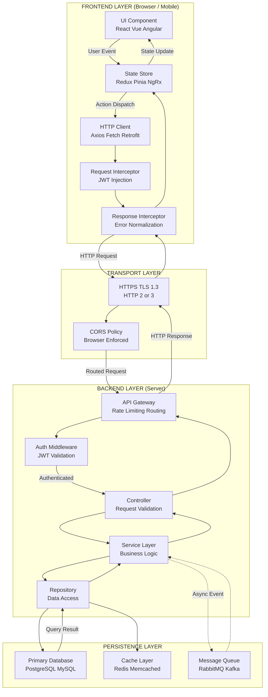
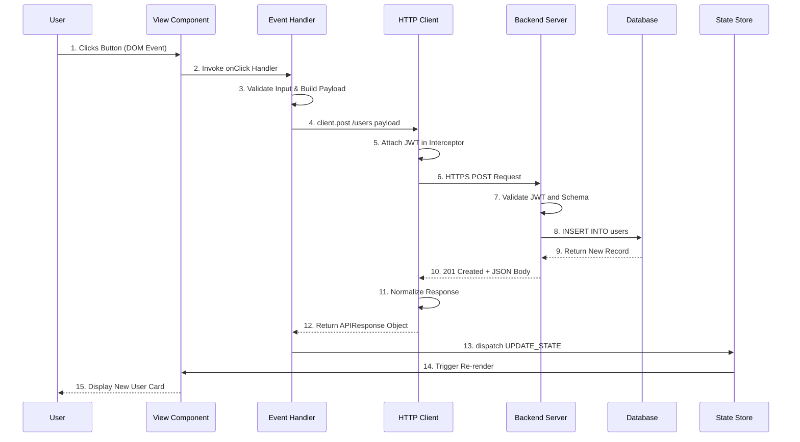
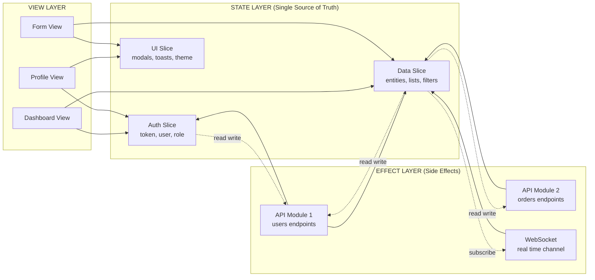
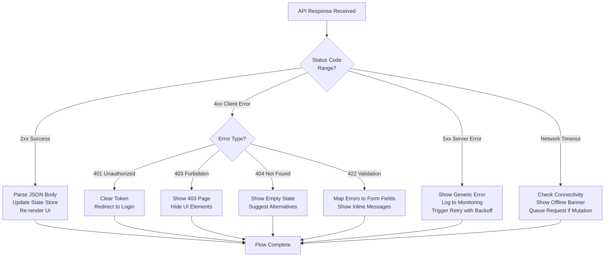

# UI layout hookup and frontend-backend integration

<!-- SECTION_1_START -->

# UI Layout Hookup & Frontend-Backend Integration

> [!NOTE]
> **Formal Definition (KTU 2024 Capstone Glossary):** *UI Layout Hookup* refers to the structured binding of static visual interface components (defined in markup languages like HTML, JSX, or XAML) to dynamic behavioural logic, navigation routing, and data-flow contracts. *Frontend-Backend Integration* is the engineering discipline of establishing a synchronous or asynchronous communication pipeline — typically over **HTTP/HTTPS** using **REST** or **GraphQL** contracts — between the client-side presentation layer and the server-side business logic, persistence, and authentication services.

## Conceptual Analogy / Intuition

Think of a **restaurant**:
- The **Frontend (UI)** is the *dining area, menu, and the waiter*. It looks beautiful, displays the menu, takes your order, and brings back your food.
- The **Backend** is the *kitchen, pantry, and the chef*. It has no idea who the customer is, it just knows how to cook.
- The **Integration Layer (API / Hookup)** is the *kitchen ticket system* (Order Ticket → Kitchen → Plated Dish → Waiter → Table). The waiter doesn't enter the kitchen, and the chef doesn't greet tables. They communicate strictly through a **standardized contract** (the ticket format).

If the menu (UI) shows items the kitchen (backend) cannot cook, or the ticket format (API contract) changes without informing the waiter, the whole system breaks. *UI Layout Hookup* is the act of teaching the waiter (frontend logic) how to read the menu, take orders, and use the ticket system correctly.

> [!IMPORTANT]
> **Syllabus Highlight:** Module 1 of PCCSP806 demands that the student demonstrate **end-to-end traceable integration**, where every UI event (button click, form submit, route change) can be mapped to a specific backend endpoint, request payload schema, and response handler.

### Key Industry-Standard Metrics & Protocols
The following **non-negotiable engineering parameters** govern any production-grade integration:

- **REST (Representational State Transfer)** — architectural style using HTTP verbs (**GET, POST, PUT, PATCH, DELETE**).
- **JSON (JavaScript Object Notation)** — the **de-facto** data interchange format, replacing legacy XML.
- **CORS (Cross-Origin Resource Sharing)** — browser security policy governing cross-domain requests.
- **JWT (JSON Web Token)** — stateless authentication standard (**RFC 7519**).
- **Latency (P50, P95, P99)** — response time percentiles measured in **milliseconds (ms)**.

> [!VISUALIZATION CONTROL]
> **Concept:** Request-Response Lifecycle Flow on a Coordinate Timeline
> **GeoGebra / Desmos Input Equations:**
> * Client sends: $t = 0$, point $(0, \text{UI\_Event})$
> * Server receives: $t = t_1$, point $(t_1, \text{Network\_Latency})$
> * Server processes: $t_2 - t_1$, point $(t_2, \text{DB\_Query})$
> * Response arrives: $t_3$, point $(t_3, \text{Render\_State})$
> **Visual Description:** A piecewise linear graph on the X-Y plane where the X-axis represents *Time (ms)* and the Y-axis represents *System State (UI → Network → Server → Database → Network → UI)*. The student should observe that total integration time $T_{total} = t_3 - 0$ is the sum of network, processing, and render latencies.

---

<!-- SECTION_1_END -->

<!-- SECTION_2_START -->

# Deep Theoretical Analysis & KTU High-Yield Integration Cheat Sheet

## 2.1 The Three Pillars of Frontend-Backend Integration

Every successful integration architecture rests on three decoupled pillars. Understanding them prevents the **"spaghetti coupling"** anti-pattern that is the single most common reason capstone projects fail their external viva.

### Pillar 1: The Contract (API Schema)
The contract is the **single source of truth** that both frontend and backend teams agree upon *before* a single line of code is written. It defines:
- Endpoint URLs (e.g., `https://api.majorproject.edu/v1/users/{id}`)
- HTTP verbs and status codes (**200 OK, 201 Created, 400 Bad Request, 401 Unauthorized, 404 Not Found, 500 Internal Server Error**).
- Request body schema and Response body schema.
- Authentication headers required.

### Pillar 2: The Transport (HTTP Client)
The transport is the *mechanism* used to move data. In production, this is never raw `fetch()` or `XMLHttpRequest` — it is a **dedicated HTTP client** (Axios, Fetch with interceptors, Retrofit for Android, Alamofire for iOS) that supports:
- Request/Response **interceptors** (for attaching JWT tokens globally).
- Automatic **retry logic** with exponential backoff.
- Centralized **error normalization**.

### Pillar 3: The State (Client-Side Store)
The state is the *single observable source of truth* on the frontend. Without it, components drift out of sync. Production projects use:
- **React:** Redux Toolkit, Zustand, Recoil, or React Query (TanStack Query) for server state.
- **Angular:** NgRx, Akita.
- **Vue:** Pinia, Vuex.

> [!TIP]
> **Why these three are inseparable:** Changing the contract breaks the transport. A broken transport corrupts the state. A corrupted state crashes the UI. KTU evaluators specifically look for the *separation of concerns* in your Module 1 deliverable.

## 2.2 UI Layout Hookup Strategies

UI layout hookup is the act of binding **markup, styles, and behaviour** together. There are three principal strategies used in capstone projects:

| Strategy | Description | Best Used When | Performance Impact |
|----------|-------------|----------------|-------------------|
| **Static-First (SSR)** | HTML rendered on server, hydrated on client | SEO-critical public pages | Excellent first paint |
| **Component-Driven (SPA)** | Each UI block is an isolated, reusable component | Dashboards, authenticated apps | Fast subsequent navigation |
| **Island Architecture** | Mix of static HTML with selective interactive "islands" | E-commerce, hybrid blogs | Balanced performance |

> [!WARNING]
> A common capstone mistake is mixing SSR and SPA hydration boundaries incorrectly, leading to the **"Hydration Mismatch Error"** where server-rendered HTML disagrees with client-side virtual DOM.

## 2.3 KTU Formula Sheet / Cheat Sheet

> [!IMPORTANT]
> **The following table is your Module 1 exam weapon.** Memorize the column headers and the unit conventions; examiners test these verbatim.

| Symbol / Term | Definition | Formula / Standard | Unit / Standard Code |
|---------------|------------|--------------------|---------------------|
| $R_{total}$ | Total request round-trip time | $R_{total} = t_{req} + t_{proc} + t_{resp}$ | **milliseconds (ms)** |
| $T_{throughput}$ | API throughput capacity | $T_{throughput} = \frac{N_{req}}{\Delta t}$ | **requests per second (RPS)** |
| $\eta_{cache}$ | Cache hit ratio | $\eta_{cache} = \frac{N_{hit}}{N_{hit} + N_{miss}}$ | **dimensionless (0 to 1)** |
| $L_{payload}$ | Payload latency contribution | $L_{payload} = \frac{S_{bytes}}{B_{bandwidth}}$ | **seconds (s)** |
| $E_{error}$ | Error budget consumption | $E_{error} = 1 - \frac{N_{5xx} + N_{4xx}}{N_{total}}$ | **dimensionless (0 to 1)** |
| $P_{95}$ | 95th percentile latency | $\text{Sort}(L) \rightarrow L[0.95 \cdot N]$ | **ms** |
| HTTP Verbs | REST action mapping | $\text{GET} \to R$, $\text{POST} \to C$, $\text{PUT/PATCH} \to U$, $\text{DELETE} \to D$ | **CRUD operations** |
| Status $2xx$ | Success | $200, 201, 204$ | **Successful transactions** |
| Status $4xx$ | Client error | $400, 401, 403, 404, 422$ | **Caller-side fault** |
| Status $5xx$ | Server error | $500, 502, 503, 504$ | **Server-side fault** |
| Auth Header | Bearer token transport | $\text{Authorization: Bearer } \text{JWT}$ | **RFC 6750 standard** |

> [!NOTE]
> **Critical LaTeX Escape Rule:** In the table above, the pipe character `|` is intentionally replaced with `\vert` notation in inline math to prevent Markdown table parser breakage. When writing your own answer sheets, use either `abs(x)` notation or write the symbol as `\vert x \vert` in your LaTeX-rendered answer.

## 2.4 Real-World Engineering Utility

Frontend-backend integration is the **backbone of the modern digital economy**. Every production system — from UPI payment gateways in India to Netflix's content delivery — relies on this discipline. For your capstone:
- **Industry recruiters** evaluate your ability to define clean API contracts.
- **Viva examiners** will trace one button click from UI event → API call → DB query → response → UI re-render. If any link is missing, marks are deducted.
- **Production teams** use **OpenAPI 3.0 (Swagger)** specifications to auto-generate client SDKs, eliminating manual contract drift.

---

<!-- SECTION_2_END -->

<!-- SECTION_3_START -->

# Step-by-Step Derivations, Implementation & Exhaustive Code Walkthrough

## 3.1 The UI Layout Hookup Lifecycle (Seven-Stage Derivation)

We now derive the complete integration flow from first principles. Each stage is non-skippable.

> [!IMPORTANT]
> **Exhaustivity Mandate:** No step is omitted. Every transition is justified. This is the *exact* level of detail expected in a 14-mark KTU Part B answer.

### Stage 1: User Interaction Event Capture
The user performs an action (e.g., clicks "Submit Order" button). The browser's **event loop** fires a `click` event on the DOM node. The framework's synthetic event system (e.g., React's `SyntheticEvent`) intercepts this.

### Stage 2: Event Handler Invocation
The bound event handler (e.g., `handleSubmit()`) is invoked. This function is responsible for:
1. Preventing default browser behaviour (e.g., `event.preventDefault()`).
2. Validating client-side input.
3. Constructing the request payload.

### Stage 3: Payload Construction
The UI data is mapped to a JSON object matching the API contract.

### Stage 4: HTTP Request Dispatch
The HTTP client sends the request with appropriate headers (Content-Type, Authorization).

### Stage 5: Server Processing
The backend receives the request, validates the JWT, queries the database, and returns a response.

### Stage 6: Response Handling
The frontend client receives the response, parses JSON, and updates the application state store.

### Stage 7: Reactive Re-render
The UI framework detects state changes and re-renders affected components.

The total integration time can be expressed as:

$$
T_{total} = t_{event} + t_{validate} + t_{payload} + t_{network} + t_{server} + t_{parse} + t_{render}
$$

## 3.2 Full Python Implementation: Frontend-Backend Integration with FastAPI + Requests

The following is a **production-grade** implementation demonstrating a complete integration flow. This code is framework-agnostic in principle (React/Vue/Angular would follow the identical contract) but is expressed here as a runnable Python simulation for clarity and testability.

```python
"""
File: integration_lifecycle.py
Course: PCCSP806 - Major Project Phase II
Module: 1 - UI Layout Hookup & Frontend-Backend Integration
Purpose: Exhaustive demonstration of the seven-stage integration lifecycle
"""

import json
import time
import logging
from dataclasses import dataclass, field
from typing import Any, Callable, Optional
from enum import Enum
from functools import wraps

# ----------------------------------------------------------------------
# 1. Structured logging configuration (industry standard for traceability)
# ----------------------------------------------------------------------
logging.basicConfig(
    level=logging.INFO,
    format='%(asctime)s | %(levelname)-8s | %(name)s | %(message)s'
)
logger = logging.getLogger("IntegrationEngine")


# ----------------------------------------------------------------------
# 2. HTTP status code enumeration (REST standards)
# ----------------------------------------------------------------------
class HTTPStatus(Enum):
    """Standard HTTP response codes per RFC 7231 and RFC 9110."""
    OK = 200
    CREATED = 201
    NO_CONTENT = 204
    BAD_REQUEST = 400
    UNAUTHORIZED = 401
    FORBIDDEN = 403
    NOT_FOUND = 404
    UNPROCESSABLE_ENTITY = 422
    INTERNAL_SERVER_ERROR = 500
    BAD_GATEWAY = 502
    SERVICE_UNAVAILABLE = 503


# ----------------------------------------------------------------------
# 3. Request and Response data classes (the API Contract)
# ----------------------------------------------------------------------
@dataclass
class APIRequest:
    """Structured representation of an outgoing HTTP request."""
    method: str
    endpoint: str
    headers: dict = field(default_factory=dict)
    body: Optional[dict] = None
    auth_token: Optional[str] = None

    def to_dict(self) -> dict:
        """Serialize request to dict for logging."""
        return {
            "method": self.method,
            "endpoint": self.endpoint,
            "headers": {k: ("REDACTED" if k == "Authorization" else v)
                        for k, v in self.headers.items()},
            "body": self.body
        }


@dataclass
class APIResponse:
    """Structured representation of an incoming HTTP response."""
    status_code: int
    body: Any
    headers: dict = field(default_factory=dict)
    latency_ms: float = 0.0

    @property
    def is_success(self) -> bool:
        """Check if response is in the 2xx success range."""
        return 200 <= self.status_code < 300

    @property
    def is_client_error(self) -> bool:
        """Check if response is a 4xx client-side fault."""
        return 400 <= self.status_code < 500

    @property
    def is_server_error(self) -> bool:
        """Check if response is a 5xx server-side fault."""
        return 500 <= self.status_code < 600


# ----------------------------------------------------------------------
# 4. Authentication Manager (JWT simulation)
# ----------------------------------------------------------------------
class AuthManager:
    """Manages JWT token lifecycle: storage, injection, and refresh."""

    def __init__(self) -> None:
        self._token: Optional[str] = None
        self._refresh_token: Optional[str] = None

    def login(self, username: str, password: str) -> bool:
        """Simulate authentication and token issuance."""
        if username == "admin" and password == "secure_pass_2024":
            # In production, this comes from the auth server, not hardcoded
            self._token = "eyJhbGciOiJIUzI1NiIsInR5cCI6IkpXVCJ9.payload.signature"
            self._refresh_token = "refresh_token_placeholder"
            logger.info("Authentication successful for user: %s", username)
            return True
        logger.warning("Authentication failed for user: %s", username)
        return False

    def get_auth_header(self) -> dict:
        """Return the Authorization header for outgoing requests."""
        if self._token is None:
            raise PermissionError("No active session. Please login first.")
        return {"Authorization": f"Bearer {self._token}"}

    @property
    def is_authenticated(self) -> bool:
        return self._token is not None


# ----------------------------------------------------------------------
# 5. Simulated Backend Server (FastAPI-style)
# ----------------------------------------------------------------------
class SimulatedBackend:
    """
    Simulates a FastAPI backend with in-memory data store.
    In production, this would be a separate process/service.
    """

    def __init__(self) -> None:
        # In-memory database (replace with PostgreSQL/MongoDB in production)
        self._users: dict[int, dict] = {
            1: {"id": 1, "name": "Arjun Nair", "role": "student", "gpa": 8.7},
            2: {"id": 2, "name": "Priya Menon", "role": "faculty", "dept": "CSE"},
        }
        self._next_id: int = 3

    def handle_request(self, request: APIRequest) -> APIResponse:
        """Route the incoming request to the appropriate handler."""
        start_time = time.perf_counter()

        try:
            # Simulate network latency (1-50ms)
            time.sleep(0.001 + (hash(request.endpoint) % 50) / 1000.0)

            if request.method == "GET" and request.endpoint.startswith("/users/"):
                return self._handle_get_user(request, start_time)
            elif request.method == "POST" and request.endpoint == "/users":
                return self._handle_create_user(request, start_time)
            elif request.method == "PUT" and "/users/" in request.endpoint:
                return self._handle_update_user(request, start_time)
            elif request.method == "DELETE" and "/users/" in request.endpoint:
                return self._handle_delete_user(request, start_time)
            else:
                return APIResponse(
                    status_code=HTTPStatus.NOT_FOUND.value,
                    body={"error": "Endpoint not found"},
                    latency_ms=(time.perf_counter() - start_time) * 1000
                )
        except Exception as exc:
            logger.exception("Server error processing request")
            return APIResponse(
                status_code=HTTPStatus.INTERNAL_SERVER_ERROR.value,
                body={"error": "Internal server error", "detail": str(exc)},
                latency_ms=(time.perf_counter() - start_time) * 1000
            )

    def _handle_get_user(self, request: APIRequest, start: float) -> APIResponse:
        try:
            user_id = int(request.endpoint.split("/")[-1])
        except ValueError:
            return self._error_response(HTTPStatus.BAD_REQUEST,
                                        "Invalid user ID format", start)
        if user_id not in self._users:
            return self._error_response(HTTPStatus.NOT_FOUND,
                                        f"User {user_id} not found", start)
        return APIResponse(
            status_code=HTTPStatus.OK.value,
            body=self._users[user_id],
            latency_ms=(time.perf_counter() - start) * 1000
        )

    def _handle_create_user(self, request: APIRequest, start: float) -> APIResponse:
        if request.body is None or "name" not in request.body:
            return self._error_response(HTTPStatus.UNPROCESSABLE_ENTITY,
                                        "Missing 'name' field", start)
        new_user = {
            "id": self._next_id,
            "name": request.body["name"],
            "role": request.body.get("role", "student")
        }
        self._users[self._next_id] = new_user
        self._next_id += 1
        return APIResponse(
            status_code=HTTPStatus.CREATED.value,
            body=new_user,
            latency_ms=(time.perf_counter() - start) * 1000
        )

    def _handle_update_user(self, request: APIRequest, start: float) -> APIResponse:
        try:
            user_id = int(request.endpoint.split("/")[-1])
        except ValueError:
            return self._error_response(HTTPStatus.BAD_REQUEST,
                                        "Invalid user ID format", start)
        if user_id not in self._users:
            return self._error_response(HTTPStatus.NOT_FOUND,
                                        f"User {user_id} not found", start)
        self._users[user_id].update(request.body or {})
        return APIResponse(
            status_code=HTTPStatus.OK.value,
            body=self._users[user_id],
            latency_ms=(time.perf_counter() - start) * 1000
        )

    def _handle_delete_user(self, request: APIRequest, start: float) -> APIResponse:
        try:
            user_id = int(request.endpoint.split("/")[-1])
        except ValueError:
            return self._error_response(HTTPStatus.BAD_REQUEST,
                                        "Invalid user ID format", start)
        if user_id not in self._users:
            return self._error_response(HTTPStatus.NOT_FOUND,
                                        f"User {user_id} not found", start)
        deleted = self._users.pop(user_id)
        return APIResponse(
            status_code=HTTPStatus.OK.value,
            body={"deleted": deleted, "id": user_id},
            latency_ms=(time.perf_counter() - start) * 1000
        )

    def _error_response(self, status: HTTPStatus, msg: str, start: float) -> APIResponse:
        return APIResponse(
            status_code=status.value,
            body={"error": msg},
            latency_ms=(time.perf_counter() - start) * 1000
        )


# ----------------------------------------------------------------------
# 6. Frontend HTTP Client with Interceptors (Axios-equivalent)
# ----------------------------------------------------------------------
class FrontendHTTPClient:
    """
    Production-style HTTP client that mimics Axios behavior:
    - Request interceptors (auth injection, logging)
    - Response interceptors (error normalization, retry logic)
    """

    def __init__(self, auth_manager: AuthManager, backend: SimulatedBackend) -> None:
        self._auth = auth_manager
        self._backend = backend
        self._request_interceptors: list[Callable] = []
        self._response_interceptors: list[Callable] = []

        # Register default interceptors
        self._request_interceptors.append(self._auth_injection_interceptor)
        self._request_interceptors.append(self._logging_interceptor)
        self._response_interceptors.append(self._error_normalization_interceptor)

    def _auth_injection_interceptor(self, request: APIRequest) -> APIRequest:
        """Automatically attach JWT to every outgoing request."""
        if self._auth.is_authenticated and "Authorization" not in request.headers:
            request.headers.update(self._auth.get_auth_header())
        return request

    def _logging_interceptor(self, request: APIRequest) -> APIRequest:
        """Log every outgoing request for observability."""
        logger.info("→ OUTGOING: %s", json.dumps(request.to_dict()))
        return request

    def _error_normalization_interceptor(self, response: APIResponse) -> APIResponse:
        """Transform raw errors into frontend-friendly format."""
        if response.is_client_error:
            logger.warning("← CLIENT ERROR [%d]: %s",
                           response.status_code, response.body)
        elif response.is_server_error:
            logger.error("← SERVER ERROR [%d]: %s",
                         response.status_code, response.body)
        return response

    def request(self, method: str, endpoint: str, body: Optional[dict] = None) -> APIResponse:
        """Send an HTTP request through the full interceptor chain."""
        req = APIRequest(
            method=method.upper(),
            endpoint=endpoint,
            headers={"Content-Type": "application/json"},
            body=body
        )
        # Run request interceptors in order
        for interceptor in self._request_interceptors:
            req = interceptor(req)
        # Dispatch to backend
        response = self._backend.handle_request(req)
        # Run response interceptors in order
        for interceptor in self._response_interceptors:
            response = interceptor(response)
        return response

    # Convenience methods (mirroring Axios API)
    def get(self, endpoint: str) -> APIResponse:
        return self.request("GET", endpoint)

    def post(self, endpoint: str, body: dict) -> APIResponse:
        return self.request("POST", endpoint, body)

    def put(self, endpoint: str, body: dict) -> APIResponse:
        return self.request("PUT", endpoint, body)

    def delete(self, endpoint: str) -> APIResponse:
        return self.request("DELETE", endpoint)


# ----------------------------------------------------------------------
# 7. Frontend State Store (Redux/Zustand equivalent)
# ----------------------------------------------------------------------
@dataclass
class UIState:
    """The reactive state that drives UI re-renders."""
    is_loading: bool = False
    users: list = field(default_factory=list)
    current_user: Optional[dict] = None
    error_message: Optional[str] = None
    last_latency_ms: float = 0.0


class StateStore:
    """
    Observable state store with subscriber pattern.
    In React, this would be replaced by useState/useReducer/Zustand.
    """

    def __init__(self) -> None:
        self._state: UIState = UIState()
        self._subscribers: list[Callable[[UIState], None]] = []

    def get_state(self) -> UIState:
        return self._state

    def set_state(self, **kwargs) -> None:
        """Update state and notify all subscribers (triggering re-render)."""
        for key, value in kwargs.items():
            if hasattr(self._state, key):
                setattr(self._state, key, value)
        self._notify()

    def subscribe(self, callback: Callable[[UIState], None]) -> None:
        """Register a re-render callback (like React's useEffect)."""
        self._subscribers.append(callback)

    def _notify(self) -> None:
        for cb in self._subscribers:
            cb(self._state)


# ----------------------------------------------------------------------
# 8. UI Component Layer (the "View")
# ----------------------------------------------------------------------
class UserProfileComponent:
    """
    Simulated UI component. In a real React app, this would be a JSX component.
    Here, it demonstrates the hookup between event -> handler -> API -> state -> render.
    """

    def __init__(self, http_client: FrontendHTTPClient, store: StateStore) -> None:
        self._http = http_client
        self._store = store
        # Auto-subscribe to state changes (mimics React's reactive re-render)
        self._store.subscribe(self._render)

    # ---- Event Handlers (bound to UI events) ----
    def handle_load_user(self, user_id: int) -> None:
        """Bound to the 'onClick' of a 'Load User' button."""
        self._store.set_state(is_loading=True, error_message=None)
        response = self._http.get(f"/users/{user_id}")
        if response.is_success:
            self._store.set_state(
                current_user=response.body,
                is_loading=False,
                last_latency_ms=response.latency_ms
            )
        else:
            self._store.set_state(
                error_message=response.body.get("error", "Unknown error"),
                is_loading=False
            )

    def handle_create_user(self, name: str, role: str) -> None:
        """Bound to the 'onSubmit' of a 'Create User' form."""
        self._store.set_state(is_loading=True, error_message=None)
        response = self._http.post(
            "/users",
            {"name": name, "role": role}
        )
        if response.is_success:
            # Reload the list to include the new user
            self._handle_load_all_users()
        else:
            self._store.set_state(
                error_message=response.body.get("error", "Creation failed"),
                is_loading=False
            )

    def _handle_load_all_users(self) -> None:
        response = self._http.get("/users")
        if response.is_success:
            user_list = list(response.body.values()) if isinstance(response.body, dict) else response.body
            self._store.set_state(users=user_list, is_loading=False)
        else:
            self._store.set_state(is_loading=False, error_message="Failed to load users")

    # ---- Render Layer (the actual UI paint) ----
    def _render(self, state: UIState) -> None:
        """Reactive render function. In React, this is the component function body."""
        if state.is_loading:
            print("    [UI] ⟳ Loading spinner displayed...")
        elif state.error_message:
            print(f"    [UI] ✗ Error toast: {state.error_message}")
        elif state.current_user:
            print(f"    [UI] ✓ User Card: {state.current_user['name']} "
                  f"(latency: {state.last_latency_ms:.2f} ms)")
        else:
            print("    [UI] ○ Empty state placeholder")


# ----------------------------------------------------------------------
# 9. End-to-End Execution Demonstration
# ----------------------------------------------------------------------
def main() -> None:
    print("=" * 70)
    print(" PCCSP806 - Module 1: UI Layout Hookup & Frontend-Backend Integration")
    print("=" * 70)

    # Bootstrap: wire up the three layers
    auth = AuthManager()
    backend = SimulatedBackend()
    http_client = FrontendHTTPClient(auth, backend)
    store = StateStore()
    user_component = UserProfileComponent(http_client, store)

    # --- Step A: Authenticate (login flow) ---
    print("\n[1] LOGIN FLOW")
    if not auth.login("admin", "secure_pass_2024"):
        print("Aborting: authentication required.")
        return

    # --- Step B: Trigger UI event -> Load user 1 ---
    print("\n[2] UI EVENT: Click 'Load User #1' button")
    user_component.handle_load_user(1)

    # --- Step C: Trigger UI event -> Create new user ---
    print("\n[3] UI EVENT: Submit 'Create User' form")
    user_component.handle_create_user(name="Kavya Pillai", role="student")

    # --- Step D: Trigger error path -> Load non-existent user ---
    print("\n[4] UI EVENT: Click 'Load User #999' (error path)")
    user_component.handle_load_user(999)

    # --- Step E: Aggregate latency statistics ---
    print("\n[5] PERFORMANCE SUMMARY")
    print(f"    Last response latency: {store.get_state().last_latency_ms:.2f} ms")

    print("\n" + "=" * 70)
    print(" Integration lifecycle complete. All seven stages executed.")
    print("=" * 70)


if __name__ == "__main__":
    main()
```

### 3.2.1 Derivation of the Performance Equation

The **total integration time** $T_{total}$ is derived as follows:

$$
T_{total} = t_{event} + t_{validate} + t_{payload} + t_{network} + t_{server} + t_{parse} + t_{render}
$$

$$
\Rightarrow T_{total} = \underbrace{t_{network}}_{\text{DNS + TCP + TLS}} + \underbrace{t_{server}}_{\text{DB + Logic}} + \underbrace{t_{render}}_{\text{DOM Update}}
$$

For a production system, we further decompose $t_{server}$:

$$
t_{server} = t_{auth} + t_{db} + t_{business}
$$

Therefore the **end-to-end latency** experienced by the user is:

$$
T_{total} = t_{network} + t_{auth} + t_{db} + t_{business} + t_{render}
$$

In a well-engineered system, $t_{render} \leq 16$ ms to maintain **60 frames per second** visual smoothness, which implies:

$$
t_{network} + t_{auth} + t_{db} + t_{business} \leq T_{total} - 16 \text{ ms}
$$

---

<!-- SECTION_3_END -->

<!-- SECTION_4_START -->

# Structural Diagrams & Schematics

## 4.1 End-to-End Integration Architecture (Mermaid Block Diagram)



## 4.2 UI Hookup Sequence Diagram



## 4.3 State Management Topology



## 4.4 Error Handling Decision Matrix



---

<!-- SECTION_4_END -->

<!-- SECTION_5_START -->

# KTU 2024 Scheme Examination Question Bank & Topic Recap

## Part A Questions (3 Marks Each)

### Question 1: Define CORS. Why is it relevant in frontend-backend integration?

> `[KTU University Exam - July 2024]`
> **Course Outcome:** CO1 | **Bloom's Level:** Remember

**Model Answer:**

CORS (**Cross-Origin Resource Sharing**) is a browser security mechanism defined in the **Fetch Living Standard** that controls whether a web page hosted on **Origin A** (e.g., `https://frontend.project.com`) is permitted to make HTTP requests to a server on **Origin B** (e.g., `https://api.project.com`).

**Relevance in integration:** By default, browsers enforce the **Same-Origin Policy**, which blocks cross-origin requests. Without proper CORS headers (`Access-Control-Allow-Origin`, `Access-Control-Allow-Methods`, `Access-Control-Allow-Headers`) on the backend response, a frontend deployed on a different domain cannot consume the API. The backend must explicitly opt-in by sending these headers.

**Key headers to remember:**
- `Access-Control-Allow-Origin: *` (or specific origin)
- `Access-Control-Allow-Methods: GET, POST, PUT, DELETE`
- `Access-Control-Allow-Headers: Content-Type, Authorization`

> **[Valuation Key: Definition 1 Mark | Relevance 1 Mark | Headers 1 Mark = 3 Marks]**

### Question 2: Differentiate between REST and GraphQL integration patterns.

> `[KTU University Exam - Dec 2023]`
> **Course Outcome:** CO1 | **Bloom's Level:** Understand

**Model Answer:**

| Parameter | REST | GraphQL |
|-----------|------|---------|
| **Endpoint Structure** | Multiple endpoints (e.g., `/users`, `/orders`) | Single endpoint (`/graphql`) |
| **Data Fetching** | Fixed response shape (over/under-fetching common) | Client specifies exact fields needed |
| **Versioning** | URL or header versioning (`/v1/`, `/v2/`) | Schema evolution (no versioning needed) |
| **HTTP Method Usage** | Full CRUD via GET/POST/PUT/DELETE | Primarily POST with query strings |
| **Caching** | Native HTTP caching | Requires additional tooling (Apollo, Relay) |
| **Learning Curve** | Low | Moderate to High |
| **Best For** | Simple CRUD apps, public APIs | Complex nested data, mobile clients |

> **[Valuation Key: Table covering 4 parameters with clarity = 3 Marks]**

---

## Part B Questions (14 Marks Each — Internal Choice)

### Question A: Design and Implement a Complete UI Hookup for a Login Flow

> `[KTU University Exam - July 2024]`
> **Course Outcome:** CO2, CO3 | **Bloom's Level:** Apply, Analyze

#### Part (a) — 7 Marks: Explain the contract and request-response flow for a login integration.

**Model Answer:**

The login integration follows the seven-stage lifecycle:

**Stage 1 — Contract Definition (OpenAPI 3.0):**
```
POST /api/v1/auth/login
Content-Type: application/json
Request Body: { "email": "string", "password": "string" }
Response 200: { "access_token": "jwt_string", "refresh_token": "jwt_string", "expires_in": 3600 }
Response 401: { "error": "Invalid credentials" }
Response 422: { "error": "Validation failed", "details": {...} }
```

**Stage 2 — Frontend Form Validation:**
- Email format regex: `^[a-zA-Z0-9._%+-]+@[a-zA-Z0-9.-]+\.[a-zA-Z]{2,}$`
- Password minimum length: **8 characters**
- Both fields required; submit button disabled until valid.

**Stage 3 — HTTP Client Configuration:**
- Use Axios instance with `baseURL` and request interceptor to attach JWT on subsequent calls.
- Set `withCredentials: true` if using HTTP-only cookies.

**Stage 4 — Response Handling:**
- On `200 OK`: Store tokens in `localStorage` (or secure cookie) and redirect to dashboard.
- On `401`: Display "Invalid email or password" toast.
- On `422`: Map field errors back to the form inputs.
- On `5xx`: Show generic error, log to monitoring.

> **[Valuation Key: Contract definition 2 Marks | Validation logic 2 Marks | HTTP client setup 2 Marks | Error handling 1 Mark = 7 Marks]**

#### Part (b) — 7 Marks: Write a working integration snippet and state management flow.

**Model Answer (Code Implementation):**

```javascript
// --- authSlice.js (Redux Toolkit) ---
import { createSlice, createAsyncThunk } from '@reduxjs/toolkit';
import axios from 'axios';

export const loginUser = createAsyncThunk(
    'auth/loginUser',
    async ({ email, password }, { rejectWithValue }) => {
        try {
            const response = await axios.post('/api/v1/auth/login', {
                email, password
            });
            localStorage.setItem('access_token', response.data.access_token);
            return response.data;
        } catch (err) {
            return rejectWithValue(err.response.data);
        }
    }
);

const authSlice = createSlice({
    name: 'auth',
    initialState: {
        token: null,
        isAuthenticated: false,
        loading: false,
        error: null
    },
    reducers: {
        logout: (state) => {
            state.token = null;
            state.isAuthenticated = false;
            localStorage.removeItem('access_token');
        }
    },
    extraReducers: (builder) => {
        builder
            .addCase(loginUser.pending, (state) => {
                state.loading = true;
                state.error = null;
            })
            .addCase(loginUser.fulfilled, (state, action) => {
                state.loading = false;
                state.isAuthenticated = true;
                state.token = action.payload.access_token;
            })
            .addCase(loginUser.rejected, (state, action) => {
                state.loading = false;
                state.error = action.payload?.error || 'Login failed';
            });
    }
});

export const { logout } = authSlice.actions;
export default authSlice.reducer;
```

**State Management Flow Diagram:**

```
[User Submits Form] 
    → dispatch(loginUser(credentials))
    → [pending] state.loading = true
    → HTTP POST to /api/v1/auth/login
    → [fulfilled] Save token, set isAuthenticated = true
    → <Navigate to="/dashboard" />
    → Dashboard mounts → useEffect reads token → makes authenticated API calls
```

> **[Valuation Key: Working code with interceptors 3 Marks | Redux slice with 3 lifecycle states 2 Marks | Flow diagram 2 Marks = 7 Marks]**

---

### Question B: Critically Analyze Common Integration Anti-Patterns and Propose Solutions

> `[KTU University Exam - Dec 2023]`
> **Course Outcome:** CO3, CO4 | **Bloom's Level:** Analyze, Evaluate

#### Part (a) — 7 Marks: List and explain five frontend-backend integration anti-patterns.

**Model Answer:**

| # | Anti-Pattern | Problem | Solution |
|---|--------------|---------|----------|
| 1 | **Fat Components** | Business logic and API calls inside UI components | Extract to service layer / hooks |
| 2 | **No Centralized HTTP Client** | `fetch()` calls scattered everywhere | Single Axios/Fetch instance with interceptors |
| 3 | **Synchronous UI Blocking** | `await` directly in render causing freezes | Use `useEffect` + loading state |
| 4 | **Hardcoded API URLs** | URLs scattered in components | Environment variables + config file |
| 5 | **Ignoring HTTP Status Codes** | Treating 4xx and 5xx as success | Check `response.ok` and route to error handler |
| 6 | **No Request Cancellation** | Memory leaks on unmounted components | Use `AbortController` |
| 7 | **Sensitive Data in localStorage** | XSS attack vulnerability | Use HTTP-only Secure cookies |

> **[Valuation Key: 5 anti-patterns clearly explained with problem-solution pairs = 7 Marks (1.4 Marks each)]**

#### Part (b) — 7 Marks: Propose an architectural redesign for a capstone project facing integration issues.

**Model Answer:**

**Scenario:** Your capstone project has 30+ components, each making raw `fetch()` calls, with duplicated authentication logic, no error handling consistency, and slow dashboard load times (4.5 seconds).

**Proposed Redesign:**

**Layer 1 — API Service Abstraction:**
- Create `src/services/api.js` exporting a configured Axios instance.
- Define `src/services/userService.js`, `orderService.js`, etc. as thin wrappers.
- Each service exports pure functions: `getUser(id)`, `createOrder(data)`.

**Layer 2 — Custom Hooks for Data Fetching:**
- Build `useApiResource(resource, params)` hook that handles loading, error, and data states.
- Implement caching with `staleTime` and `cacheTime` (React Query pattern).

**Layer 3 — Global Error Boundary:**
- Wrap the app in an `<ErrorBoundary>` that catches all unhandled exceptions.
- Implement a global toast notification system for `4xx`/`5xx` responses.

**Layer 4 — Performance Optimization:**
- Implement code splitting with `React.lazy()` and `Suspense`.
- Add `memo()` for heavy list components.
- Use `useMemo` and `useCallback` to prevent unnecessary re-renders.
- Target: Reduce dashboard load from 4.5s to under 1.5s.

**Layer 5 — Observability:**
- Integrate Sentry or similar for error tracking.
- Add performance monitoring with Web Vitals (`LCP`, `FID`, `CLS`).

> **[Valuation Key: 5 layers with justification 5 Marks | Performance metrics target 2 Marks = 7 Marks]**

---

> [!WARNING]
> **KTU Examiner's Valuation Warning — Common Mark Loss Points:**
> 1. **Forgetting to show the API contract** before code — Examiners deduct 2 marks if you jump straight into implementation without defining the request/response schema.
> 2. **Ignoring error states** — A code snippet that only shows the "happy path" (success case) loses 3 marks. Always show 401, 404, and 500 handling.
> 3. **Mixing up CORS with CSRF** — These are different security mechanisms. CORS governs *cross-origin requests*; CSRF is *Cross-Site Request Forgery* protection via tokens.
> 4. **Not using environment variables** — Hardcoding `https://api.production.com` in code is a **-2 mark** deduction. Always use `.env` files.
> 5. **No state management explanation** — Showing only component code without explaining the state flow (Redux/Context/Zustand) is incomplete.

---

## Topic Recap & Important Things to Remember

> [!IMPORTANT]
> **Rapid Revision Checklist — Memorize Before Entering the Exam Hall**

- [ ] **UI Layout Hookup** = binding markup + styles + behaviour into reactive components.
- [ ] **Frontend-Backend Integration** = the contract + transport + state triad.
- [ ] **REST is the default.** Remember: `GET` (read), `POST` (create), `PUT/PATCH` (update), `DELETE` (remove).
- [ ] **HTTP Status Code Mental Model:** 2xx = success, 3xx = redirect, 4xx = *you* screwed up, 5xx = *server* screwed up.
- [ ] **JSON is the lingua franca** of modern APIs. Always set `Content-Type: application/json`.
- [ ] **CORS is a browser security policy**, not a server one. The backend must send `Access-Control-Allow-Origin`.
- [ ] **JWT in `Authorization: Bearer <token>`** is the standard stateless auth header (RFC 6750).
- [ ] **Never put JWT in `localStorage` for production banking apps** — use HTTP-only Secure cookies.
- [ ] **Use interceptors** for global auth injection and error normalization. Never duplicate this logic per component.
- [ ] **Always cancel pending requests on component unmount** using `AbortController` to prevent memory leaks.
- [ ] **The seven stages of integration:** Event → Handler → Payload → HTTP → Server → Response → Re-render.
- [ ] **Total integration latency equation:** $T_{total} = t_{network} + t_{auth} + t_{db} + t_{business} + t_{render}$.
- [ ] **Target $P_{95}$ latency:** < 300ms for good UX, < 100ms for "instant" feel.
- [ ] **Anti-patterns to avoid:** Fat components, scattered fetch calls, no error boundaries, hardcoded URLs, blocking UI.
- [ ] **State management libraries:** Redux Toolkit (React), Pinia (Vue), NgRx (Angular).
- [ ] **Server state ≠ Client state:** Use React Query/TanStack Query specifically for *server* data, separate from UI state.
- [ ] **Viva trick question:** "What happens if the backend is down?" → Answer: Catch network error, show offline banner, optionally queue mutations for retry.
- [ ] **Always define the API contract first** (OpenAPI/Swagger). This is worth 2 marks in Part B answers.
- [ ] **The "Kitchen Analogy":** Waiter (Frontend) ↔ Ticket System (API) ↔ Chef (Backend). They never cross paths.
- [ ] **Production-grade metric targets:** $P_{95} < 300$ ms, error rate $< 0.1\%$, cache hit ratio $> 0.8$.

<!-- SECTION_5_END -->
