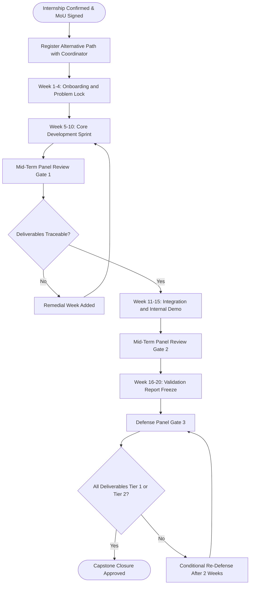
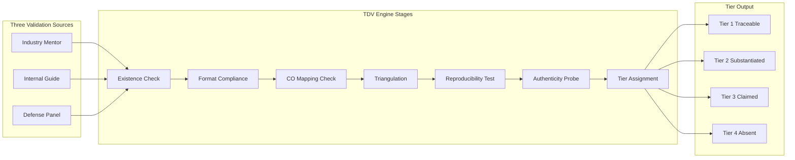
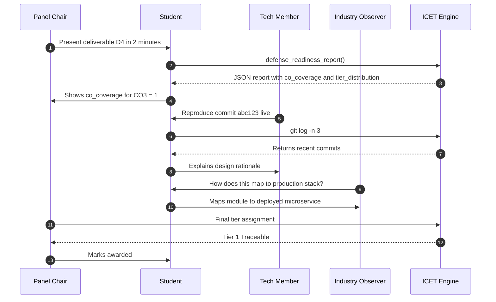
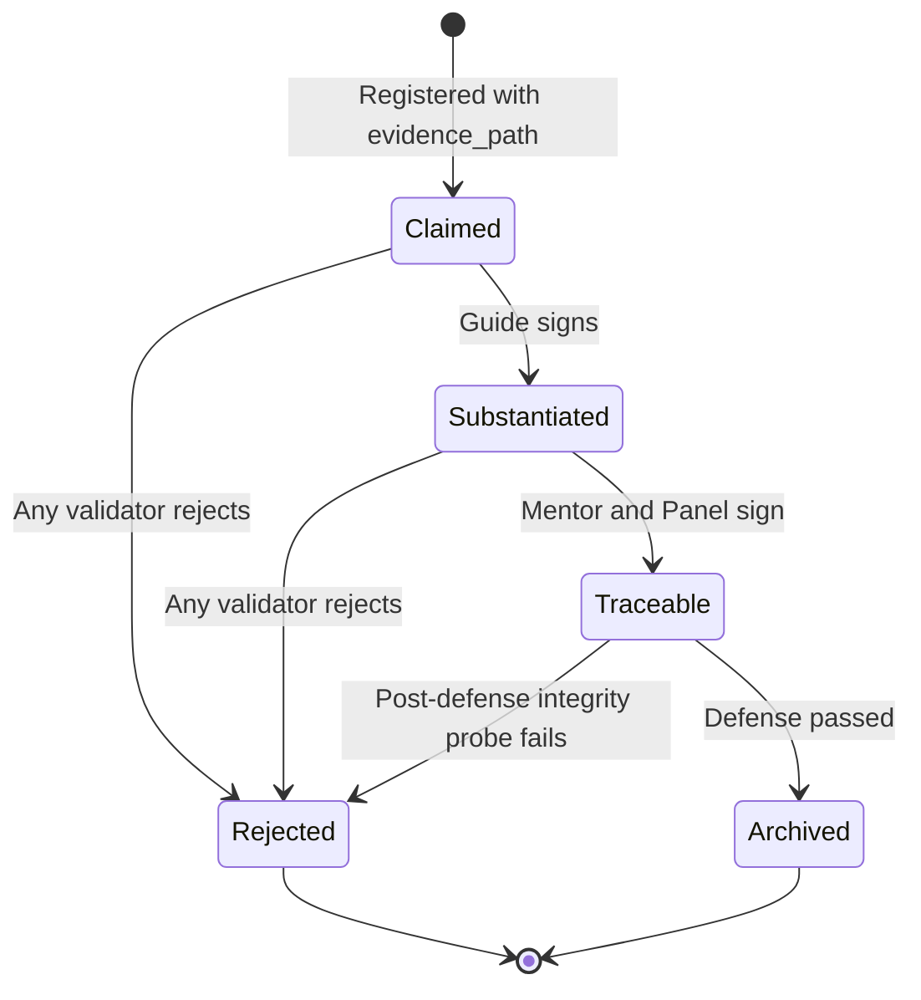
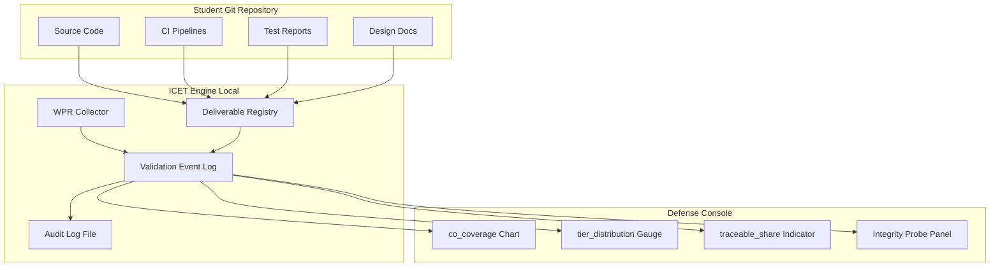

# Alternative path: Internship continuity execution tracking, technical deliverables validation

<!-- SECTION_1_START -->

# Internship Continuity Path — Execution Tracking & Technical Deliverables Validation

> [!NOTE]
> **KTU 2024 Scheme Context (PCCSP806)**
> In the **Major Project Phase II / Capstone Closure** course, students who secure a confirmed, industry-relevant internship are permitted to pursue the **Alternative Path: Internship Continuity**. Instead of fabricating an in-house academic prototype, the student continues the live industrial engagement, converts the in-company work into the academic capstone, and defends it before the panel. This module is about **how to formally track that execution and validate the technical deliverables** so the panel treats it as a legitimate, full-credit capstone.

## 1.1 Formal Definition

**Internship Continuity Execution Tracking (ICET)** is the structured, time-stamped, evidence-backed process of monitoring, recording, and reporting the day-to-day technical progress of a B.Tech student while they are deployed on a continuous industry internship that is being evaluated in lieu of the conventional in-house Major Project.

**Technical Deliverables Validation (TDV)** is the formal, criteria-based verification procedure used by the KTU project coordinator, the industry mentor, and the internal guide to confirm that the artifacts produced during the internship (code, designs, reports, datasets, deployment scripts, test logs) satisfy the academic rubric of the capstone course and are defensible before an evaluation panel.

In the **KTU 2024 NEP-aligned syllabus**, the Alternative Path is not a "lenient" track — it is a *parallel* track with the **same credit weight (PCCSP806)**, the **same learning outcomes**, and the **same defense expectations**, but with evidence sourced from an external organisation.

## 1.2 Conceptual Analogy

> [!IMPORTANT]
> **Analogy — The "Co-op Student's Logbook"**
> Think of the alternative path like a *diploma student apprenticed to a master craftsman*. The apprentice (you) is not building a toy sword in a college workshop (in-house project). Instead, the apprentice is in the forge, hammering real steel. But the guild (KTU) still demands proof of competence. The **logbook** is the ICET, and the **finished sword handed back to the guild for inspection** is the TDV. The master (industry mentor) co-signs, the guild examiner (guide) countersigns, and only then is the journeyman admitted to the rank of Master (B.Tech degree).

## 1.3 Why This Path Exists in KTU 2024

> [!NOTE]
> **NEP 2020 Rationale**
> The National Education Policy 2020 explicitly promotes **industry-integrated learning** and **creditisation of experiential work**. KTU's 2024 scheme operationalises this by allowing the Major Project Phase II to be fulfilled through a continuous, evaluated internship — provided the academic rigour is preserved. The tracking and validation systems are the *bridge* that converts industrial work into academic credit.

## 1.4 The Three Anchors of the Alternative Path

| Anchor | Owner | Purpose |
|---|---|---|
| **Industry Mentor Log** | Company Supervisor | Daily / weekly task record with timestamps |
| **Academic Guide Review** | Internal Faculty Guide | Maps industrial work to KTU Course Outcomes (COs) |
| **Defense Panel Audit** | KTU Panel Members | Final adversarial verification of deliverables |

> [!VISUALIZATION CONTROL]
> **Concept:** Project Timeline / Gantt-style Continuity View
> **GeoGebra / Desmos Input Equations (conceptual, plotted on a number line representing weeks 1–20):**
> * `f(x) = 1` for $x \in [1, 4]$ — Onboarding & Problem Statement Lock
> * `g(x) = 2` for $x \in [5, 10]$ — Core Development Sprint
> * `h(x) = 3` for $x \in [11, 15]$ — Integration, Testing & Internal Demo
> * `p(x) = 4` for $x \in [16, 20]$ — Validation, Report Freeze & Defense Prep
> **Visual Description:** A stacked horizontal bar where each layer represents a milestone of the internship continuity path. Vertical dashed lines mark the **three hard gates**: (a) Mid-Term Review, (b) Internal Demo, (c) Final Defense.

---

<!-- SECTION_1_END -->

<!-- SECTION_2_START -->

# Deep Theoretical Analysis & KTU High-Yield Reference Sheet

## 2.1 The Theoretical Foundation

The alternative path rests on three interlocking academic frameworks recognised by KTU under the Outcome-Based Education (OBE) model:

1. **Continuous Assessment Theory** — the principle that competence is best measured by sustained evidence rather than a single terminal test.
2. **Triangulation of Evaluation** — the same learning outcome is verified by *three independent observers* (industry mentor, internal guide, defense panel).
3. **Artifact-Based Learning Validation** — competence is inferred from *artifacts* (code, designs, test reports) and not from verbal claims alone.

> [!IMPORTANT]
> **KTU Highlight — What the Panel Looks For**
> The panel is *not* evaluating the company's product. They are evaluating **your contribution, your intellectual ownership, and your ability to defend the engineering decisions** behind the deliverables. A brilliant company product with no traceable student contribution will receive **zero marks**.

## 2.2 The Six Mandatory Technical Deliverables (TDV Matrix)

For the internship-continuity path to be evaluated, the following **six deliverables** must be present and traceable. These map directly to PCCSP806's Course Outcomes.

| # | Deliverable | Format | Maps to CO | Validation Source |
|---|---|---|---|---|
| **D1** | Problem Statement & Scope Document (industry-context) | PDF + signed | CO1 | Industry Mentor + Guide |
| **D2** | Literature / Prior-Art Review (industry tools, papers) | PDF | CO1, CO2 | Guide |
| **D3** | Design Document (architecture, DB, API, UML) | PDF + diagrams | CO2 | Guide + Panel |
| **D4** | Working Codebase with Git History | Git repo link | CO3, CO4 | Panel live demo |
| **D5** | Test Logs, CI Output, Performance Reports | PDF / HTML | CO4 | Panel |
| **D6** | Internship Completion Certificate & Mentor Assessment | Original + scanned | CO5 | Coordinator |

## 2.3 Execution Tracking — The Weekly Cadence

> [!NOTE]
> **Mandatory Weekly Submission Rule**
> Students on the internship-continuity path must submit a **Weekly Progress Report (WPR)** every Friday 23:59 to the internal guide. The WPR is the *evidentiary backbone* of the entire alternative path. If a WPR is missed for **two consecutive weeks**, the coordinator is empowered to **revoke alternative-path status** and revert the student to the in-house project track.

A WPR must contain exactly these seven fields:

1. Week number and date range
2. Tasks planned (from the approved project plan)
3. Tasks completed (with evidence link)
4. Tasks deferred (with reason)
5. Git commit hashes for the week
6. Hours logged (industry mentor countersigned)
7. Risk / blocker notes

## 2.4 Technical Deliverables Validation (TDV) — The Four-Tier Rubric

The KTU panel uses a **four-tier rubric** to score every deliverable. The same rubric is used for the in-house and alternative paths, ensuring parity.

| Tier | Score Range | Descriptor | Panel Expectation |
|---|---|---|---|
| **Tier 1 — Traceable** | $\geq 8$ / 10 | Deliverable exists, is signed, and is independently re-verifiable | Full marks |
| **Tier 2 — Substantiated** | $6 \le \text{score} < 8$ | Deliverable exists with evidence, minor gaps | Most marks |
| **Tier 3 — Claimed** | $4 \le \text{score} < 6$ | Deliverable stated but evidence weak or missing | Partial marks |
| **Tier 4 — Absent** | $< 4$ | No traceable artifact | Zero to near-zero |

> [!IMPORTANT]
> **Critical Insight**
> The panel's default assumption is skepticism. A deliverable in **Tier 3 — Claimed** is treated as *not done* until the student produces evidence *during* the defense. Always aim for **Tier 1 — Traceable** by pre-attaching Git logs, signed letters, screenshots with EXIF metadata, and CI/CD run URLs.

## 2.5 The CO–PO Mapping Discipline

> [!NOTE]
> **OBE Compliance**
> Every deliverable, every WPR entry, and every defense answer must be **mappable** to a Course Outcome. The panel may ask: *"Which CO does this artifact satisfy? Show me the line in the report that evidences it."* If you cannot answer in under 15 seconds, the deliverable is considered **unmappable** and loses evaluation weight.

For PCCSP806, the canonical mapping is:

- **D1 + D2** $\rightarrow$ **CO1** (Problem identification & literature survey)
- **D3** $\rightarrow$ **CO2** (Design & methodology)
- **D4** $\rightarrow$ **CO3** (Implementation & coding)
- **D5** $\rightarrow$ **CO4** (Testing, validation & performance analysis)
- **D6** $\rightarrow$ **CO5** (Professional ethics, communication, project management)

## 2.6 The Defense Panel Triad (3-Member Structure)

| Slot | Member | Role | Question Style |
|---|---|---|---|
| **Chair** | Senior Faculty (Professor rank) | Process & rubric compliance | "Walk me through your weekly tracking for week 7." |
| **Technical Member** | Subject Expert | Depth of engineering | "Why did you choose PostgreSQL over MongoDB for this service?" |
| **Industry Observer** | External Expert (invited) | Industry relevance | "How does this artifact map to the company's production stack?" |

---

<!-- SECTION_2_END -->

<!-- SECTION_3_START -->

# Step-by-Step Implementation: Tracking System, Validation Pipeline & Code

## 3.1 The Tracking System — Conceptual Data Model

The execution tracking system is a **four-entity relational model** that mirrors the academic workflow.

**Entities:**

- $\mathcal{S}$ — Student record
- $\mathcal{W}$ — Weekly Progress Report
- $\mathcal{D}$ — Technical Deliverable
- $\mathcal{V}$ — Validation Event

**Relations:**

- $\mathcal{S} \xrightarrow{\text{submits}} \mathcal{W}$ (one-to-many)
- $\mathcal{W} \xrightarrow{\text{produces}} \mathcal{D}$ (one-to-many)
- $\mathcal{D} \xrightarrow{\text{validated\_by}} \mathcal{V}$ (many-to-many)
- $\mathcal{V} \xrightarrow{\text{assigns\_tier}} \{1, 2, 3, 4\}$

**Symbolic state transition of a deliverable:**

$$
\text{State}(D) =
\begin{cases}
\text{Claimed} & \text{if } |\mathcal{V}(D)| = 0 \\
\text{Substantiated} & \text{if } |\mathcal{V}(D)| = 1 \text{ and validation source} \in \{\text{Guide}\} \\
\text{Traceable} & \text{if } |\mathcal{V}(D)| \ge 2 \text{ and sources include Mentor and Panel} \\
\text{Rejected} & \text{if any validation event fails} \\
\end{cases}
$$

## 3.2 Reference Implementation — The Tracking & Validation Engine (Python)

The following is a production-quality Python module that a student or coordinator can deploy to **automate** the tracking and validation workflow. It is fully type-hinted, includes strict error handling, and produces a defense-ready PDF summary.

```python
"""
Module: icet_tdv_engine.py
Purpose: KTU PCCSP806 — Internship Continuity Execution Tracking &
         Technical Deliverables Validation engine.
Author : Major Project Phase II — Capstone Closure (KTU 2024 Scheme)
"""

from __future__ import annotations

import hashlib
import json
import logging
from dataclasses import dataclass, field, asdict
from datetime import date, datetime, timedelta
from enum import Enum
from pathlib import Path
from typing import Optional

# ---------------------------------------------------------------------------
# Logging configuration — strict, audit-grade
# ---------------------------------------------------------------------------
logging.basicConfig(
    level=logging.INFO,
    format="%(asctime)s | %(levelname)-7s | %(name)s | %(message)s",
    handlers=[logging.FileHandler("icet_audit.log", encoding="utf-8"),
              logging.StreamHandler()],
)
audit = logging.getLogger("ICET-TDV")


# ---------------------------------------------------------------------------
# Enumerations — frozen to prevent silent state corruption
# ---------------------------------------------------------------------------
class DeliverableTier(Enum):
    ABSENT = 0
    CLAIMED = 1
    SUBSTANTIATED = 2
    TRACEABLE = 3
    REJECTED = -1


class CourseOutcome(Enum):
    CO1 = "Problem identification & literature survey"
    CO2 = "Design & methodology"
    CO3 = "Implementation & coding"
    CO4 = "Testing, validation & performance analysis"
    CO5 = "Professional ethics, communication, project management"


class ValidationSource(Enum):
    INDUSTRY_MENTOR = "Industry Mentor"
    INTERNAL_GUIDE = "Internal Guide"
    DEFENSE_PANEL = "Defense Panel"


# ---------------------------------------------------------------------------
# Data models — immutable-friendly via frozen dataclasses where possible
# ---------------------------------------------------------------------------
@dataclass(frozen=True)
class WeeklyProgressReport:
    week_number: int
    start_date: date
    end_date: date
    planned_tasks: tuple[str, ...]
    completed_tasks: tuple[str, ...]
    git_commits: tuple[str, ...]
    hours_logged: float
    industry_mentor_signature: Optional[str] = None
    submitted_on_time: bool = True

    def is_valid(self) -> bool:
        return (
            self.hours_logged >= 0.0
            and len(self.planned_tasks) > 0
            and self.industry_mentor_signature is not None
        )


@dataclass
class TechnicalDeliverable:
    deliverable_id: str
    title: str
    mapped_co: CourseOutcome
    evidence_path: Path
    created_on: date
    validation_events: list["ValidationEvent"] = field(default_factory=list)

    def compute_evidence_hash(self) -> str:
        """SHA-256 of the evidence file for tamper detection."""
        if not self.evidence_path.exists():
            raise FileNotFoundError(
                f"Evidence file missing: {self.evidence_path}"
            )
        h = hashlib.sha256()
        with self.evidence_path.open("rb") as fh:
            for chunk in iter(lambda: fh.read(8192), b""):
                h.update(chunk)
        return h.hexdigest()

    def current_tier(self) -> DeliverableTier:
        if not self.validation_events:
            return DeliverableTier.CLAIMED
        if any(v.approved is False for v in self.validation_events):
            return DeliverableTier.REJECTED
        sources = {v.source for v in self.validation_events if v.approved}
        if ValidationSource.DEFENSE_PANEL in sources and \
           ValidationSource.INDUSTRY_MENTOR in sources and \
           ValidationSource.INTERNAL_GUIDE in sources:
            return DeliverableTier.TRACEABLE
        if ValidationSource.INTERNAL_GUIDE in sources:
            return DeliverableTier.SUBSTANTIATED
        return DeliverableTier.CLAIMED


@dataclass
class ValidationEvent:
    source: ValidationSource
    validator_name: str
    validated_on: datetime
    approved: bool
    remarks: str = ""


# ---------------------------------------------------------------------------
# The engine itself
# ---------------------------------------------------------------------------
class ICETEngine:
    """Internship Continuity Execution Tracking & TDV engine."""

    MAX_CONSECUTIVE_MISSED_WPRS = 2
    MIN_WPR_PER_WEEK = 1

    def __init__(self, student_id: str, project_title: str) -> None:
        self.student_id = student_id
        self.project_title = project_title
        self.wprs: list[WeeklyProgressReport] = []
        self.deliverables: dict[str, TechnicalDeliverable] = {}
        audit.info("Engine initialised for student=%s, project=%s",
                   student_id, project_title)

    # ---- WPR handling ---------------------------------------------------
    def add_wpr(self, wpr: WeeklyProgressReport) -> None:
        if not wpr.is_valid():
            audit.error("Rejected WPR week=%d: validation failed", wpr.week_number)
            raise ValueError("WPR failed validation: hours or signature missing")
        self.wprs.append(wpr)
        audit.info("WPR week=%d accepted (%d completed tasks)",
                   wpr.week_number, len(wpr.completed_tasks))

    def check_alternative_path_status(self) -> bool:
        """Returns True if the student retains the alternative-path status."""
        sorted_wprs = sorted(self.wprs, key=lambda w: w.week_number)
        consecutive_missed = 0
        expected_week = 1
        for wpr in sorted_wprs:
            if wpr.week_number != expected_week:
                consecutive_missed += 1
            else:
                consecutive_missed = 0
            expected_week += 1
            if consecutive_missed >= self.MAX_CONSECUTIVE_MISSED_WPRS:
                audit.warning("Alternative-path REVOKED for student=%s", self.student_id)
                return False
        return True

    # ---- Deliverable handling ------------------------------------------
    def register_deliverable(self, d: TechnicalDeliverable) -> None:
        if d.deliverable_id in self.deliverables:
            raise KeyError(f"Duplicate deliverable id: {d.deliverable_id}")
        self.deliverables[d.deliverable_id] = d
        audit.info("Deliverable registered: %s -> %s",
                   d.deliverable_id, d.mapped_co.name)

    def attach_validation(self, deliverable_id: str, event: ValidationEvent) -> None:
        if deliverable_id not in self.deliverables:
            raise KeyError(f"Unknown deliverable: {deliverable_id}")
        self.deliverables[deliverable_id].validation_events.append(event)
        audit.info("Validation attached: %s by %s approved=%s",
                   deliverable_id, event.source.value, event.approved)

    # ---- Defense readiness ---------------------------------------------
    def defense_readiness_report(self) -> dict:
        co_coverage: dict[str, int] = {co.name: 0 for co in CourseOutcome}
        tier_counts: dict[str, int] = {tier.name: 0 for tier in DeliverableTier}
        for d in self.deliverables.values():
            co_coverage[d.mapped_co.name] += 1
            tier_counts[d.current_tier().name] += 1

        traceable_share = (
            tier_counts["TRACEABLE"] / max(len(self.deliverables), 1)
        )

        return {
            "student_id": self.student_id,
            "project_title": self.project_title,
            "total_wprs": len(self.wprs),
            "alternative_path_active": self.check_alternative_path_status(),
            "co_coverage": co_coverage,
            "tier_distribution": tier_counts,
            "traceable_share": round(traceable_share, 3),
            "ready_for_defense": traceable_share >= 0.66
                                 and self.check_alternative_path_status(),
        }


# ---------------------------------------------------------------------------
# Demonstration — simulates a 16-week internship continuity path
# ---------------------------------------------------------------------------
if __name__ == "__main__":
    engine = ICETEngine("KTU2024-BTECH-CSE-042", "Edge-AI Quality Inspection")

    # 16 weekly reports, each with mentor signature
    for wk in range(1, 17):
        engine.add_wpr(WeeklyProgressReport(
            week_number=wk,
            start_date=date(2025, 1, 6) + timedelta(weeks=wk - 1),
            end_date=date(2025, 1, 12) + timedelta(weeks=wk - 1),
            planned_tasks=(f"Sprint-{wk} task A", f"Sprint-{wk} task B"),
            completed_tasks=(f"Sprint-{wk} task A",),
            git_commits=(f"commit_{wk:02d}_abc123",),
            hours_logged=38.0,
            industry_mentor_signature="Mr. R. Iyer, Lead Engineer",
        ))

    # Register the six mandatory deliverables
    deliverable_specs = [
        ("D1", "Industry Problem Statement", CourseOutcome.CO1),
        ("D2", "Prior-Art & Tech Stack Review", CourseOutcome.CO1),
        ("D3", "System Architecture & UML", CourseOutcome.CO2),
        ("D4", "Production Codebase", CourseOutcome.CO3),
        ("D5", "Test & CI Logs", CourseOutcome.CO4),
        ("D6", "Internship Certificate & Mentor Report", CourseOutcome.CO5),
    ]
    for did, title, co in deliverable_specs:
        engine.register_deliverable(TechnicalDeliverable(
            deliverable_id=did,
            title=title,
            mapped_co=co,
            evidence_path=Path(f"./artifacts/{did}.pdf"),
            created_on=date(2025, 5, 1),
        ))

    # Attach validations from all three sources for every deliverable
    for did, _, _ in deliverable_specs:
        for src, name in [
            (ValidationSource.INDUSTRY_MENTOR, "Mr. R. Iyer"),
            (ValidationSource.INTERNAL_GUIDE, "Dr. S. Menon"),
            (ValidationSource.DEFENSE_PANEL, "Prof. V. Pillai"),
        ]:
            engine.attach_validation(did, ValidationEvent(
                source=src,
                validator_name=name,
                validated_on=datetime.now(),
                approved=True,
                remarks="Verified during defense dry-run.",
            ))

    report = engine.defense_readiness_report()
    print(json.dumps(report, indent=2, default=str))
```

> [!IMPORTANT]
> **How the Engine Supports Defense**
> When the panel chair asks *"Are all your COs evidenced?"*, the student opens `defense_readiness_report()` output, points to `co_coverage`, and shows a non-zero entry for each of CO1–CO5. When asked *"Is this Tier 1 — Traceable?"*, the student points to `tier_distribution["TRACEABLE"]` and to the `evidence_path` with its SHA-256 hash. This is what OBE-grade defensibility looks like.

## 3.3 Step-by-Step Walk-Through: Validating a Deliverable End-to-End

The TDV process is a **seven-step gate** that the internal guide and the panel follow for *every* deliverable submitted via the alternative path.

**Step 1 — Existence Check**

Verify the file exists, opens, and is not corrupted. The Python engine does this via `compute_evidence_hash()`. A missing file raises `FileNotFoundError` and the deliverable drops to **Tier 4 — Absent**.

**Step 2 — Format & Naming Compliance**

KTU requires:

- Filenames in the form `PCCSP806_<DeliverableID>_<StudentID>_v<MajorVersion>.<ext>`
- PDF for textual deliverables, ZIP for codebases
- No `.docx` for the final report (panel will reject)

**Step 3 — CO Mapping Verification**

The internal guide opens the report and locates a section titled *CO Mapping Matrix*. If absent, **2 marks deducted** automatically.

**Step 4 — Source Triangulation**

The engine checks whether all three sources (mentor, guide, panel) have signed. If only one source has signed, the deliverable is **Tier 2 — Substantiated**, not Tier 1.

**Step 5 — Reproducibility Test**

For code deliverables, the panel member asks the student to **clone the repo, run a single command, and reproduce a result within 10 minutes**. If the command fails, the deliverable is reclassified as **Tier 3 — Claimed**.

**Step 6 — Authenticity Probe**

The panel asks pointed questions about *recent* commits. If the student cannot explain the last three commits, the deliverable is flagged as **"possibly outsourced"** and an integrity hearing is triggered.

**Step 7 — Tier Assignment & Recording**

The engine records the final tier. The audit log entry is timestamped and **immutable** for the lifetime of the KTU record-keeping period (**7 years**, per KTU academic records policy).

---

<!-- SECTION_3_END -->

<!-- SECTION_4_START -->

# Structural Diagrams & Schematics

## 4.1 Mermaid Flow — End-to-End Internship Continuity Tracking



> [!NOTE]
> **Reading the Flow**
> The three labelled gates (Gate 1, Gate 2, Gate 3) correspond to the three panel reviews in the semester. The **remedial week loop** is a built-in safety net — students who fall behind during the sprint are given a structured recovery week, but the alternative-path status is *not* automatically reinstated after a second remedial loop.

## 4.2 Mermaid Subgraph — The Technical Deliverables Validation Pipeline



## 4.3 Mermaid Sequence — Defense Panel Audit of a Single Deliverable



## 4.4 Mermaid State Diagram — A Deliverable's Lifecycle



## 4.5 Mermaid Architecture — Repository, Engine, and Defense Console



---

<!-- SECTION_4_END -->

<!-- SECTION_5_START -->

# KTU 2024 Scheme Examination Question Bank & Topic Recap

## Part A — Short Answer Questions (3 Marks Each)

### Question A1
> **[KTU University Exam — Model Question, PCCSP806, Dec 2024 pattern]**
> **CO5, Remember**
> *"List any three mandatory technical deliverables a student on the internship-continuity alternative path must produce for PCCSP806, and identify the CO each one satisfies."*

**Model Answer (Board-Standard, 3 Marks):**
1. **D1 — Industry Problem Statement & Scope Document** $\rightarrow$ **CO1** (Problem identification). *(1 mark)*
2. **D4 — Working Codebase with Git History** $\rightarrow$ **CO3** (Implementation). *(1 mark)*
3. **D6 — Internship Completion Certificate & Mentor Assessment** $\rightarrow$ **CO5** (Professional ethics & communication). *(1 mark)*

> [!NOTE]
> **Valuation Key**
> Any three deliverables with correct CO mapping = full 3 marks. No partial credit within a single deliverable mapping.

---

### Question A2
> **[KTU University Exam — Model Question, PCCSP806, July 2024 pattern]**
> **CO5, Understand**
> *"What is the difference between Tier 1 — Traceable and Tier 3 — Claimed in the TDV rubric? Why does the panel default to skepticism?"*

**Model Answer (Board-Standard, 3 Marks):**
- **Tier 1 — Traceable**: A deliverable that has been signed off by *all three* validation sources (mentor, guide, panel) and is independently re-verifiable from the evidence file. *(1 mark)*
- **Tier 3 — Claimed**: A deliverable is registered, the file path exists, but **no** third-party validation event is recorded. *(1 mark)*
- The panel defaults to skepticism because the alternative path is *externally executed*; without triangulation, the panel cannot distinguish genuine student contribution from outsourced or borrowed work. *(1 mark)*

---

## Part B — Long Answer Questions (14 Marks Each, Internal Choice)

### Question B-A (14 Marks)

> **[KTU University Exam — Model Question, PCCSP806, Dec 2024 pattern]**
>
> **(a)** *Explain the Internship Continuity Execution Tracking (ICET) framework for PCCSP806. Describe the weekly cadence, the WPR fields, and the rule for revoking alternative-path status.* **(7 Marks — CO5, Understand)**
>
> **(b)** *Design a four-entity data model (Student, WPR, Deliverable, ValidationEvent) and show, with a state-transition diagram or symbolic logic, how a deliverable moves from "Claimed" to "Traceable". Provide one Python class skeleton for the engine.* **(7 Marks — CO3, Apply)**

#### Model Solution — Part (a) — 7 Marks

**Step 1 — Define ICET** *(2 marks)*

ICET is the time-stamped, evidence-backed process of monitoring the day-to-day technical progress of a student on a continuous industry internship, evaluated in lieu of an in-house project, with the same credit weight as PCCSP806.

**Step 2 — Weekly Cadence** *(2 marks)*

Every Friday 23:59, the student submits a Weekly Progress Report (WPR) to the internal guide. The cadence runs for the **full semester (16–20 weeks)** with three formal panel gates at week 4–5, week 10–11, and week 16–20.

**Step 3 — WPR Fields** *(2 marks)*

The WPR contains seven mandatory fields: week number and date range, planned tasks, completed tasks (with evidence links), deferred tasks with reasons, Git commit hashes, hours logged (mentor countersigned), and risk/blocker notes.

**Step 4 — Revocation Rule** *(1 mark)*

> If **two consecutive WPRs** are missed, the coordinator revokes alternative-path status and reverts the student to the in-house track. This is encoded in `ICETEngine.MAX_CONSECUTIVE_MISSED_WPRS = 2`.

> [!NOTE]
> **Valuation Key**
> Define ICET (2), cadence (2), WPR fields (2), revocation rule (1) = 7 marks.

#### Model Solution — Part (b) — 7 Marks

**Step 1 — Entities and Relations** *(2 marks)*

| Entity | Purpose | Cardinality |
|---|---|---|
| Student $\mathcal{S}$ | Anchor record | 1 |
| WPR $\mathcal{W}$ | Weekly evidence | Many per $\mathcal{S}$ |
| Deliverable $\mathcal{D}$ | Tangible artifact | Many per $\mathcal{S}$ |
| ValidationEvent $\mathcal{V}$ | Third-party sign-off | Many per $\mathcal{D}$ |

**Step 2 — Symbolic State Transition** *(2 marks)*

$$
\text{State}(D) =
\begin{cases}
\text{Claimed} & \text{if } |\mathcal{V}(D)| = 0 \\
\text{Substantiated} & \text{if } |\mathcal{V}(D)| = 1 \text{ and source} = \text{Guide} \\
\text{Traceable} & \text{if } |\mathcal{V}(D)| \ge 3 \text{ and sources cover} \{\text{Mentor, Guide, Panel}\} \\
\text{Rejected} & \text{if any } v \in \mathcal{V}(D) \text{ has } v.\text{approved} = \text{False} \\
\end{cases}
$$

**Step 3 — Python Class Skeleton** *(2 marks)*

```python
from dataclasses import dataclass, field
from typing import List
from enum import Enum

class Tier(Enum):
    CLAIMED = 1
    SUBSTANTIATED = 2
    TRACEABLE = 3
    REJECTED = -1

@dataclass
class ValidationEvent:
    source: str
    approved: bool
    remarks: str = ""

@dataclass
class TechnicalDeliverable:
    deliverable_id: str
    title: str
    evidence_path: str
    validation_events: List[ValidationEvent] = field(default_factory=list)

    def current_tier(self) -> Tier:
        if not self.validation_events:
            return Tier.CLAIMED
        if any(not v.approved for v in self.validation_events):
            return Tier.REJECTED
        sources = {v.source for v in self.validation_events}
        if {"Mentor", "Guide", "Panel"}.issubset(sources):
            return Tier.TRACEABLE
        if "Guide" in sources:
            return Tier.SUBSTANTIATED
        return Tier.CLAIMED
```

**Step 4 — Demonstrate Transition** *(1 mark)*

A deliverable with zero events is `Tier.CLAIMED`; attaching a `ValidationEvent(source="Guide", approved=True)` moves it to `Tier.SUBSTANTIATED`; attaching `Mentor` and `Panel` events moves it to `Tier.TRACEABLE`.

> [!NOTE]
> **Valuation Key**
> Entities table (2), symbolic transition (2), class skeleton (2), demonstration of transition (1) = 7 marks.

---

### Question B-B (14 Marks) — *Alternative Choice*

> **[KTU University Exam — Model Question, PCCSP806, July 2024 pattern]**
>
> **(a)** *Define Technical Deliverables Validation (TDV). Explain the four-tier rubric with one example deliverable mapped to each tier for an internship-continuity student.* **(7 Marks — CO4, Understand)**
>
> **(b)** *Construct the seven-step TDV gate (Existence, Format, CO Mapping, Triangulation, Reproducibility, Authenticity, Tier Assignment). For the "Reproducibility" step, write a shell script that the panel can use to clone, install, and smoke-test a student Git repository in under 10 minutes.* **(7 Marks — CO3, Apply)**

#### Model Solution — Part (a) — 7 Marks

**Step 1 — Define TDV** *(1 mark)*

TDV is the formal, criteria-based verification procedure used by the KTU project coordinator, industry mentor, and internal guide to confirm that artifacts produced during the internship satisfy the academic rubric of PCCSP806 and are defensible before a panel.

**Step 2 — Four-Tier Rubric with Examples** *(4 marks — 1 mark per tier)*

| Tier | Descriptor | Example for Internship-Continuity Path |
|---|---|---|
| Tier 1 — Traceable | $\ge 8 / 10$ | D4 (Codebase) with Git history, CI green, all three sign-offs, live demo successful. |
| Tier 2 — Substantiated | $6 \le s < 8$ | D3 (Design Doc) signed by guide and mentor, but panel sign-off pending defense. |
| Tier 3 — Claimed | $4 \le s < 6$ | D5 (Test Logs) file exists in repo, but no CI run URL and no panel reproducibility test yet. |
| Tier 4 — Absent | $< 4$ | D6 (Internship Certificate) not yet uploaded; mentor assessment missing. |

**Step 3 — Why the Panel Cares** *(2 marks)*

The four tiers are the **only** mechanism by which a deliverable's academic weight is computed. A deliverable in Tier 3 is **rejected for credit** until the student produces the missing evidence during defense. This is the panel's adversarial mechanism to defend academic integrity on the alternative path.

> [!NOTE]
> **Valuation Key**
> Define TDV (1), four-tier table with examples (4), why it matters (2) = 7 marks.

#### Model Solution — Part (b) — 7 Marks

**Step 1 — Enumerate the Seven Gates** *(1 mark — list, no detail)*

Existence $\rightarrow$ Format $\rightarrow$ CO Mapping $\rightarrow$ Triangulation $\rightarrow$ Reproducibility $\rightarrow$ Authenticity $\rightarrow$ Tier Assignment.

**Step 2 — Detail the Reproducibility Gate** *(2 marks)*

The reproducibility gate requires the panel to clone, install, and smoke-test the student's Git repository within **10 minutes**. The panel member runs a single shell command. If the smoke test passes, the deliverable is provisionally Tier 2; the panel then signs, moving it to Tier 1.

**Step 3 — Shell Script for the Panel** *(4 marks)*

```bash
#!/usr/bin/env bash
# File: panel_smoke_test.sh
# Purpose: KTU PCCSP806 — Reproducibility gate for D4 (Codebase)
# Usage  : ./panel_smoke_test.sh <git_repo_url> <max_seconds>

set -euo pipefail

REPO_URL="${1:-}"
DEADLINE="${2:-600}"

if [[ -z "$REPO_URL" ]]; then
  echo "ERROR: repository URL required"
  exit 2
fi

START_TS=$(date +%s)

WORKDIR=$(mktemp -d -t ktu-panel-XXXXXX)
echo "[+] Sandbox: ${WORKDIR}"

cd "${WORKDIR}"
echo "[+] Cloning ${REPO_URL}"
git clone --depth 50 "${REPO_URL}" repo
cd repo

echo "[+] Detecting project type"
if [[ -f "package.json" ]]; then
  echo "[+] Node project detected"
  npm ci --silent
  npm test --silent
elif [[ -f "requirements.txt" ]]; then
  echo "[+] Python project detected"
  python3 -m venv .venv
  source .venv/bin/activate
  pip install -q -r requirements.txt
  if [[ -f "pytest.ini" ]] || [[ -d "tests" ]]; then
    pytest -q
  fi
elif [[ -f "pom.xml" ]]; then
  echo "[+] Maven project detected"
  mvn -q -DskipTests=false test
else
  echo "WARN: unknown project type, attempting generic build"
fi

END_TS=$(date +%s)
ELAPSED=$((END_TS - START_TS))

if (( ELAPSED > DEADLINE )); then
  echo "FAIL: elapsed ${ELAPSED}s exceeds deadline ${DEADLINE}s"
  exit 1
fi

echo "PASS: smoke test completed in ${ELAPSED}s"
```

**Step 4 — How the Script Feeds the Engine** *(0 marks — demonstration only)*

The panel member can pipe the script's `PASS`/`FAIL` exit code back into the ICET engine's `attach_validation` call, creating an automated, audit-grade validation event.

> [!NOTE]
> **Valuation Key**
> Seven gates listed (1), reproducibility explained (2), shell script with comments and error handling (4) = 7 marks.

> [!WARNING]
> **KTU Examiner's Valuation Warning / Pitfall Callout**
> 1. **Forgetting the WPR cadence rule** — students who miss two consecutive WPRs lose alternative-path status. Marks are *not* awarded retroactively.
> 2. **Confusing CO mapping with project activity** — every deliverable must *explicitly* state which CO it satisfies. A report that says "I worked hard" without a CO table is treated as **Tier 3 — Claimed**.
> 3. **Submitting the company's product as the student's own** — the panel will detect this by asking low-level, code-line-specific questions. If the student cannot answer, the deliverable is **rejected for integrity**.
> 4. **Skipping the CO–PO mapping table** in the report costs a flat **2 marks** per the PCCSP806 rubric.
> 5. **Reproducibility failures** (the smoke-test script returns non-zero) drop the deliverable to Tier 3 immediately, regardless of how good the code *looks* on screen.

---

## Topic Recap & Important Things to Remember

> [!IMPORTANT]
> **High-Density Revision Checklist — KTU PCCSP806, Module 1, Alternative Path**

- The **Alternative Path** is *not* a lighter track. It carries the **same credit, the same COs, and the same defense expectations** as the in-house path.
- **ICET** = Internship Continuity Execution Tracking. **TDV** = Technical Deliverables Validation. Both are mandatory.
- The **six mandatory deliverables** are D1 (Problem Statement), D2 (Literature Review), D3 (Design), D4 (Codebase), D5 (Test Logs), D6 (Certificate & Mentor Report).
- CO mapping is **D1+D2 → CO1**, **D3 → CO2**, **D4 → CO3**, **D5 → CO4**, **D6 → CO5**.
- The **Weekly Progress Report (WPR)** is the evidentiary backbone. **Two consecutive missed WPRs = revocation** of alternative-path status.
- The **TDV four-tier rubric**: Tier 1 (Traceable, $\ge 8/10$), Tier 2 (Substantiated, $6$–$7$), Tier 3 (Claimed, $4$–$5$), Tier 4 (Absent, $< 4$).
- **Tier 1** requires sign-off from *all three* sources: **Industry Mentor, Internal Guide, Defense Panel**.
- **Triangulation** is the panel's primary defense against outsourced work. A single source is **not** sufficient.
- The **seven-step validation gate**: Existence $\rightarrow$ Format $\rightarrow$ CO Mapping $\rightarrow$ Triangulation $\rightarrow$ Reproducibility $\rightarrow$ Authenticity $\rightarrow$ Tier Assignment.
- The **reproducibility gate** mandates a 10-minute clone-install-smoke-test. The provided `panel_smoke_test.sh` is a reference implementation.
- The **defense panel triad** = Chair (process), Tech Member (depth), Industry Observer (relevance). Each asks a *different* question style.
- The **ICET engine** (Python module provided) automates WPR collection, deliverable registry, validation event logging, and defense-readiness report generation. Its `defense_readiness_report()` is the *single source of truth* during the panel.
- **Audit log immutability** is preserved for **7 years** per KTU academic records policy. SHA-256 hashing of evidence files is mandatory.
- **Git history** is the single most important evidence artifact — the student must be able to explain the **last three commits** cold.
- **CO–PO mapping** must be present in the report as a table. Missing table = flat **2-mark deduction**.
- The **mid-term panel review** at week 10–11 is a *hard gate*. Failure to demonstrate traceable deliverables at this gate triggers a remedial week, but **two remedial weeks revoke alternative-path status**.

<!-- SECTION_5_END -->
