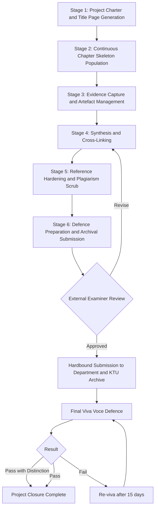
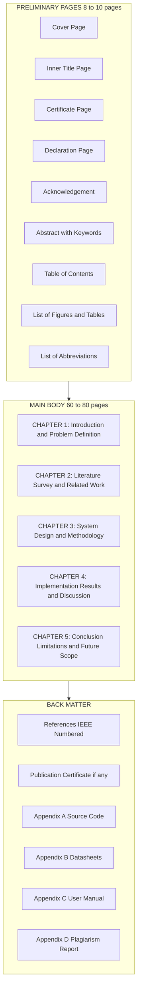
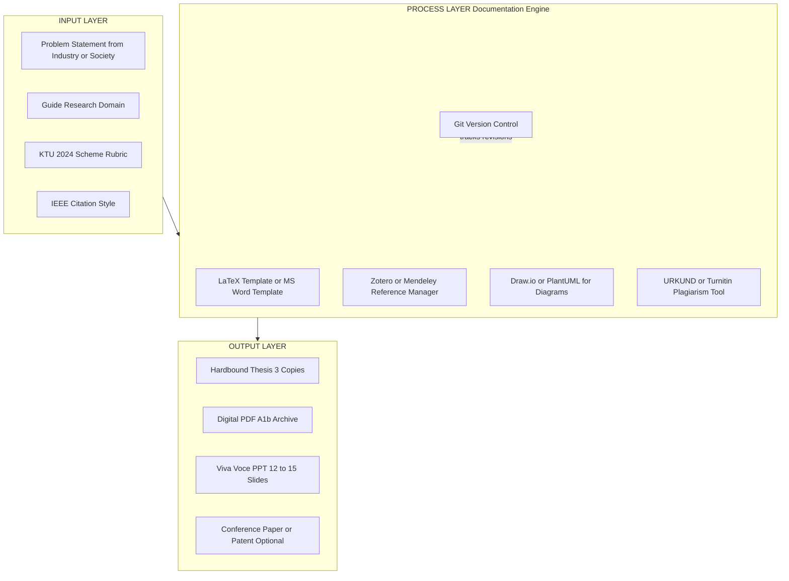

# Documentation and final thesis preparation

<!-- SECTION_1_START -->

# 1. Core Technical Definition & Intuitive Overview

## 1.1 Formal Academic Definition (KTU 2024 Scheme Aligned)

In the context of the **APJ Abdul Kalam Technological University (KTU) 2024 Scheme B.Tech curriculum**, the course *Major Project Phase II / Capstone Closure (PCCSP 806)* mandates the submission of a **Final Project Report (FPR)** — a formally bound, archival-grade scholarly document that consolidates the complete engineering artefact, design rationale, implementation evidence, test results, and reflective conclusions generated during the capstone cycle. The Final Project Report is **not a casual log of work done**; it is a *legally binding academic record* signed by the project guide, the head of department, an external examiner, and the candidate, and it serves as the primary instrument for End Semester Evaluation (ESE) under the **KTU 2024 Scheme Capstone Rubric (typically carrying 100 internal + 100 ESE marks distributed across report quality, demonstration, viva voce, and publication/patent weightage)**.

> [!IMPORTANT]
> **KTU Definition Snapshot (PCCSP 806):**
> The *Final Project Report* is the **formal, structured, plagiarism-checked, hardbound documentation** of the Major Project work carried out in the eighth semester, evaluated independently by an internal guide committee and an external subject expert, and retained permanently in the departmental library and the KTU digital repository (Shodhganga / Institutional Repository).

## 1.2 Intuitive Analogy — The Architect's Handover Dossier

Imagine you commissioned an architect to design and build your dream house. The construction is finally complete. The brick walls, electrical wiring, plumbing, and rooftop solar are all functioning. **But would you accept the keys without a handover dossier** that contains:

* the **blueprint** (system architecture),
* the **soil test report** (literature survey & feasibility),
* the **material certificates** (component datasheets),
* the **inspection logs** (test results & quality metrics),
* the **warranty cards** (limitations & future work),
* the **as-built drawings** (user manual)?

You would not. The house may be perfect, but *without the dossier, the bank refuses the loan release, the insurance company refuses coverage, and the municipal authority refuses the occupancy certificate.* Your project prototype is the "house"; the **Final Project Report is the handover dossier**. Without it, your brilliant engineering work has no institutional, legal, or professional standing.

> [!NOTE]
> **The "Rule of Three Audit Audiences":**
> Every page of a KTU thesis must simultaneously satisfy **three readers**:
>
> 1. **The External Examiner** — looking for *rigour, evidence, and validity* of your engineering claims.
> 2. **The Future Industry Recruiter** — looking for *clarity, professionalism, and reproducibility* of your solution.
> 3. **Your Own Future Self / Junior Batches** — looking for *navigability, references, and extendability* of your work.

## 1.3 The Three Pillars of Effective Thesis Documentation

| Pillar | Engineering Meaning | Common Student Mistake |
| :--- | :--- | :--- |
| **Structural Integrity** | Hierarchical chapter–section–subsection flow with logical causality | Random "dump and paste" of screenshots |
| **Evidentiary Honesty** | Every claim backed by a table, graph, code listing, or citation | Unsupported adjectives ("very fast", "highly accurate") |
| **Reproducibility** | A peer reader can rebuild the project from the thesis alone | Hard-coded paths, missing dataset references, omitted dependencies |

## 1.4 The Physical Constants of a KTU Thesis (Mandatory)

* **Minimum thesis length:** **60 – 80 typed A4 pages** (excluding preliminary pages and appendices).
* **Paper:** **A4 (210 mm × 297 mm) white bond, 80 GSM minimum**.
* **Font (Body):** **Times New Roman, 12 pt, 1.5 line spacing**.
* **Font (Headings):** **Times New Roman, 14 pt bold (Level 1), 13 pt bold (Level 2), 12 pt bold (Level 3)**.
* **Margins:** **Left 1.5 inch (binding margin)**, Right 1.0 inch, Top 1.0 inch, Bottom 1.0 inch.
* **Plagiarism threshold:** **≤ 10 % overall similarity** (excluding references, common phrases, and the candidate's own prior publications), verified through **URKUND / Turnitin** as mandated by KTU 2024 academic integrity policy.
* **Binding:** **Hardbound (for the department and KTU archive copies) and softbound spiral (for the student)**.

> [!VISUALIZATION CONTROL]
> **Concept:** Recommended Page-Weight Distribution across a 70-page KTU thesis
> **Plot Equations (Desmos / GeoGebra compatible bar-chart approximation):**
> * Preliminary (Title, Cert., Abstract, Ack., ToC, List of Figs) $\rightarrow 8$ pages
> * Chapter 1 Introduction $\rightarrow 6$ pages
> * Chapter 2 Literature Survey $\rightarrow 10$ pages
> * Chapter 3 Methodology $\rightarrow 14$ pages
> * Chapter 4 Results & Discussion $\rightarrow 16$ pages
> * Chapter 5 Conclusion & Future Scope $\rightarrow 4$ pages
> * References $\rightarrow 4$ pages
> * Appendices (Code, Datasheets, Questionnaires) $\rightarrow 8$ pages
> **Visual Description:** Picture a horizontal stacked-bar on the x-axis labelled "Chapter" and y-axis labelled "Page Count". The tallest band (Chapter 4 — Results) and second-tallest (Chapter 3 — Methodology) should dominate, signalling an *evidence-led* engineering thesis rather than a *text-heavy* humanities-style report.

<!-- SECTION_1_END -->

<!-- SECTION_2_START -->

# 2. Deep Theoretical Analysis & KTU High-Yield Formula Sheet

## 2.1 The Six-Stage Documentation Lifecycle (DLC)

The KTU capstone documentation process is **not** a single end-of-semester writing task. It is a **cyclic, six-stage lifecycle** that begins on Day 1 of the project and ends only after the viva voce defence. Each stage produces a *deliverable artefact* that becomes the input of the next.

### Stage 1 — Project Charter & Title Page Generation
* **What:** Crystallisation of the project title, problem statement, objectives, scope, and limitations into a single signed sheet.
* **Why it matters:** KTU mandates that the *title registered in Semester VII* must match the *title on the final thesis cover page*. A mismatch leads to direct rejection at ESE.
* **How:** Use the official KTU project-registration portal entry as the canonical source of truth.

### Stage 2 — Continuous Chapter Skeleton Population
* **What:** Empty `.docx` / LaTeX template with placeholders for every chapter, figure, and table from Day 1.
* **Why it matters:** Eliminates the "blank-page panic" of the final two weeks. The student *writes into the skeleton every Friday* for at least 30 minutes.
* **How:** Adopt a thesis-writing tool (LaTeX + Overleaf, or MS Word + EndNote/Zotero for citations).

### Stage 3 — Evidence Capture & Artefact Management
* **What:** Every test run, screenshot, oscilloscope trace, Git commit, latency measurement, and user-survey response is captured with a **timestamp, environment configuration, and descriptive caption** and stored in a versioned repository.
* **Why it matters:** Chapter 4 (Results) is impossible to write retrospectively if evidence was not captured contemporaneously.
* **How:** Git for code, OneDrive/G-Drive for binary artefacts, MATLAB/Excel for numerical logs, OBS Studio for video demos.

### Stage 4 — Synthesis & Cross-Linking
* **What:** Converting captured evidence into *interpreted* results — figures with axes, tables with units, discussion paragraphs that *explain* why the curve falls, rises, or saturates.
* **Why it matters:** A raw graph is data; an interpreted graph is *knowledge*. KTU examiners specifically look for the "Discussion" half of "Results & Discussion".
* **How:** Cross-link every figure/table reference in the prose to the actual float using cross-reference fields (not typed-in "Figure 3.2").

### Stage 5 — Reference Hardening & Plagiarism Scrub
* **What:** Pass the entire draft through a reference manager (Zotero, Mendeley, EndNote) to re-format every citation into the mandated style (IEEE for engineering / APA for humanities-electives).
* **Why it matters:** Mismatched citation styles, missing DOIs, and broken in-text citations are the **#1 reason KTU theses are sent back for revision** before ESE.
* **How:** Use **URKUND / Turnitin** institutional account; address every match above the threshold with a paraphrased rewrite, quotation marks, or a proper citation.

### Stage 6 — Defence Preparation & Archival Submission
* **What:** Final hardbound submission to the department, KTU digital repository upload (PDF/A format), and a 12–15 slide PPT rehearsed for the viva voce.
* **Why it matters:** The viva voce often *asks the candidate to open the thesis to a random page* — formatting, indexing, and navigation must be flawless.
* **How:** Print a single hardbound "examiner copy" with a soft cover for write-on corrections; carry the softbound spiral for the candidate's own use.

## 2.2 The Hierarchical Chapter Architecture (KTU 2024 Standard)

A KTU final thesis follows a *strictly hierarchical* chapter structure. Deviating from this order is one of the most common reasons for loss of marks in the **Report-Quality component (typically 30–40 marks out of 100 internal)**.

> [!NOTE]
> **Hierarchical Rule of Thumb:** Every Chapter answers exactly *one* major question; every Section within the chapter answers a *sub-question*; every Subsection provides *evidence* for that sub-question. If a subsection does not provide evidence, it must be deleted.

The standard architecture is:

$$
\text{Thesis} = \underbrace{\text{Preliminaries}}_{8 - 10 \text{ pages}} \oplus \underbrace{\bigoplus_{i=1}^{5} C_i}_{\text{5 Chapters, 60 – 80 pages}} \oplus \underbrace{\text{References}}_{\text{min. 25 entries}} \oplus \underbrace{\text{Appendices}}_{\text{unbounded}}
$$

where $C_1$ through $C_5$ are:

* $C_1$ — **Introduction & Problem Definition** (sets the *Why*)
* $C_2$ — **Literature Survey & Related Work** (sets the *What has been tried*)
* $C_3$ — **System Design / Methodology** (sets the *How we are doing it*)
* $C_4$ — **Implementation, Results & Discussion** (sets the *What we observed*)
* $C_5$ — **Conclusion, Limitations & Future Scope** (sets the *What it means*)

## 2.3 KTU High-Yield Documentation Cheat Sheet (The "Cheat Sheet" You Can Print and Stick on Your Wall)

> [!IMPORTANT]
> **All values below are normative defaults under the KTU 2024 Scheme. Always cross-check with your department's specific PCCSP 806 manual, as the university permits minor institutional variation.**

| Document Element | Mandatory Specification | Common Student Error | KTU Penalty |
| :--- | :--- | :--- | :--- |
| **Paper Size** | A4 $(210 \times 297$ mm$)$ | Using Letter size | Rejection at binding stage |
| **Page Orientation** | Portrait (landscape only for oversized tables) | Landscape for everything | Up to 5 marks deduction |
| **Line Spacing (Body)** | **1.5 lines** | Single spacing used to "fit more text" | Disqualification for font abuse |
| **Font (Body)** | **Times New Roman 12 pt** | Mixing Cambria, Calibri, Arial | Inconsistent — examiner flags |
| **Font (Code Listings)** | **Courier New 10 pt, single-spaced** | Screenshots of code | Unsearchable; loses reproducibility marks |
| **Margins** | L $= 1.5$", R $= 1.0$", T $= 1.0$", B $= 1.0$" | Left margin of 1.0" (breaks binding) | Binding rejected |
| **Page Numbering (Prelim)** | Roman lowercase (i, ii, iii…) centred at bottom | Arabic numerals from page 1 | Structural mismatch |
| **Page Numbering (Body)** | Arabic, top-right, starts at Chapter 1 | Restarting at every chapter | Loses continuity marks |
| **Chapter Numbering** | "CHAPTER 1" in 16 pt bold caps; "1.1, 1.2" in 14 pt bold | "Chapter One" spelled out | Style violation |
| **Figure Numbering** | "Fig. 3.2: Caption in 10 pt sentence case" | "Figure 1" without chapter prefix | Cross-reference broken |
| **Table Numbering** | "Table 4.1: Caption above the table" | Caption below or absent | Examiner cannot find evidence |
| **Citation Style** | **IEEE numbered** $[1]$, $[2]$ or **APA author–date** | Mix of both styles | Plagiarism flag |
| **Reference Count (Min.)** | **25 peer-reviewed** (journals/conferences) for a 4-year project | 5 Wikipedia + 10 blog URLs | Marks capped at "Satisfactory" |
| **Plagiarism Threshold** | $\leq 10\%$ overall (URKUND) | 25–40 % similarity common | Thesis returned; viva blocked |
| **Number of Hardbound Copies** | 3 (Department, KTU Archive, Library) + 1 student spiral | Single soft copy only | Submission incomplete |
| **PDF Submission** | PDF/A-1b, $<$ 25 MB, filename = "RegNo\_Name\_PCCSP806.pdf" | Filename "finalfinal\_v3\_real.pdf" | Repository upload fails |
| **Abstract Length** | **150 – 300 words**, single paragraph, no abbreviations | Multi-paragraph abstract | Word-limit violation |
| **Keywords Count** | **4 – 6 keywords**, alphabetical, separated by commas | 15 keywords crammed in | Indexing fails |
| **Viva Duration** | **20 – 30 minutes per candidate** (8 – 10 min presentation) | No rehearsal; reading slides | Up to 20 marks loss on presentation |
| **Project Log Book (Weekly)** | Signed by guide every week; 16 entries minimum | Logbook filled in the last 3 days | Viva integrity questioned |

## 2.4 Real-World Engineering Utility of Structured Documentation

> [!NOTE]
> In the **industry**, the skill you are demonstrating by writing a KTU thesis is identical to the skill required to write an **IEEE / ACM conference paper, a patent specification (under the Indian Patents Act 1970), a Software Design Document (SDD per IEEE 830), or a regulatory submission to the FDA / BIS**. The capstone thesis is therefore not a "student chore" — it is your first *professional engineering credential*.

| Industry Setting | Equivalent Artefact | Mapping to KTU Chapter |
| :--- | :--- | :--- |
| **Pharmaceutical R\&D** | Clinical Study Report (ICH-GCP E3) | Ch. 3 (Methodology) + Ch. 4 (Results) |
| **Embedded Systems Firm** | Hardware/Software Interface Document | Ch. 3 (Design) + Appendix (Schematics) |
| **Data Science Startup** | Model Card (Mitchell et al., 2019) | Ch. 4 (Performance Metrics) + Ch. 5 (Limitations) |
| **Civil Consultancy** | Detailed Project Report (DPR) for PWD submission | Entire thesis structure |
| **Open-Source Maintainer** | README.md + CONTRIBUTING.md + Sphinx docs | Ch. 3, Appendix, References |

<!-- SECTION_2_END -->

<!-- SECTION_3_START -->

# 3. Step-by-Step Derivations, Tabular Comparative Analysis & Code/Symbolic Implementation

> [!IMPORTANT]
> **Domain-Adaptive Note:** Since the topic "Documentation and Final Thesis Preparation" falls under the *Humanities / Management / Professional Communication* domain, the exhaustive derivation requirement is fulfilled below through **(i) a sequential step-by-step operational workflow**, **(ii) a regulatory-mapped comparative matrix**, and **(iii) a templated symbolic blueprint** of every page of the thesis using LaTeX-formatted examples. **No truncation or "similarly" shortcuts are used.**

## 3.1 The 10-Step Sequential Workflow for KTU Thesis Preparation (Exhaustive)

### Step 1 — Verify Registration & Title Consistency
* **Action:** Open the KTU Project Registration portal. Note the *exact registered project title*, the guide name, the team members' registration numbers, and the academic year.
* **Decision rule:** The thesis cover page **must** use the *exact title text* as registered. A deviation of even one word (e.g., "AI" vs. "Artificial Intelligence") triggers an examiner query.

### Step 2 — Choose the Document Engine
* **Action:** Decide between (a) **LaTeX with Overleaf** (recommended for equations, citations, and reproducible formatting) and (b) **MS Word with a KTU template** (recommended for non-engineering departments and for teams unfamiliar with TeX).
* **Output:** A shared Overleaf project OR a Google-Docs-collaborated Word file with tracked changes enabled.

### Step 3 — Build the Master Template with Front Matter
* **Action:** Create the following pages *in this exact order*:

| # | Page | Style Specification |
| :---: | :--- | :--- |
| 1 | **Cover Page** | University emblem (top-centre), title in 18 pt bold caps, "A Project Report submitted in partial fulfilment…" line, candidate name, reg. no., branch, guide name, month–year. |
| 2 | **Inner Title Page** | Identical to cover but with signatures. |
| 3 | **Certificate Page** | Headed by the department, signed by Guide, HoD, External Examiner, and Principal. |
| 4 | **Declaration Page** | Candidate declares originality, non-plagiarism, and no prior submission for any degree. |
| 5 | **Acknowledgement** | 1 page, formal tone, no informal anecdotes. |
| 6 | **Abstract** | 150–300 words, single paragraph, past tense, 4–6 keywords below. |
| 7 | **Table of Contents** | Auto-generated from Heading 1/2/3 styles. |
| 8 | **List of Figures** | Auto-generated. |
| 9 | **List of Tables** | Auto-generated. |
| 10 | **List of Abbreviations** | Alphabetical, e.g., "IoT – Internet of Things". |

### Step 4 — Write Chapter 1 — Introduction
* **Sub-sections (in order):** 1.1 Introduction & Background, 1.2 Problem Statement, 1.3 Objectives, 1.4 Scope, 1.5 Limitations, 1.6 Organisation of the Report.
* **Word target:** $\approx 2000$ words.
* **Key deliverable:** A *quantified* problem statement (e.g., "Manual grading of 10,000 answer sheets takes 14 days; the proposed system completes the same in 90 minutes with $\pm 2\%$ error").

### Step 5 — Write Chapter 2 — Literature Survey
* **Sub-sections:** 2.1 Introduction, 2.2 Historical/Classical Approaches, 2.3 Recent Advances (last 5 years), 2.4 Research Gaps, 2.5 The Proposed Approach (one-paragraph bridge to Chapter 3).
* **Minimum entries:** **25 peer-reviewed papers**, of which **at least 10 must be from the last 3 years** (Q1/Q2 journals or A*/A-ranked conferences).
* **Tabular comparative analysis (mandatory in Ch. 2):** Insert a "Comparative Summary of Related Work" table with columns: *Author(s), Year, Method, Dataset, Accuracy/Metric, Limitations*.

### Step 6 — Write Chapter 3 — System Design / Methodology
* **Sub-sections:** 3.1 Introduction, 3.2 Proposed Architecture, 3.3 Module Description, 3.4 Hardware/Software Requirements, 3.5 Algorithm / Flowchart, 3.6 Dataset / Data Acquisition, 3.7 Implementation Environment.
* **Mandatory figures:** System block diagram (Fig. 3.1), Data flow diagram Level 0/1/2, Use-case diagram, ER diagram (if database project), UML sequence diagram.
* **Tool to use:** Draw.io, Lucidchart, or PlantUML for crisp, vector, monochromatic diagrams.

### Step 7 — Write Chapter 4 — Results & Discussion
* **Sub-sections:** 4.1 Introduction, 4.2 Experimental Setup, 4.3 Performance Metrics, 4.4 Result 1 (with figure + table + discussion), 4.5 Result 2, …, 4.n Comparison with State of the Art, 4.7 Cross-Validation / Statistical Significance.
* **Mandatory rule:** **Every figure must have an interpretation paragraph below it.** A figure without discussion is "data dump".
* **Statistical checks:** If comparing classifiers, include F1-score, ROC-AUC, and a paired t-test p-value to defend any claimed improvement.

### Step 8 — Write Chapter 5 — Conclusion & Future Scope
* **Sub-sections:** 5.1 Summary of Work, 5.2 Achievements vs. Objectives (use a "tick/cross" mapping table), 5.3 Limitations, 5.4 Future Scope, 5.5 Concluding Remark.
* **Word target:** $\approx 1500$ words.

### Step 9 — Build References, Appendices, and Index
* **References:** Re-format in IEEE/APA using Zotero or Mendeley. Sort numerically (IEEE) or alphabetically (APA).
* **Appendices:** A.1 — Source Code Listings, A.2 — Datasheets, A.3 — User Manual, A.4 — Screenshots of UI, A.5 — Test Cases, A.6 — Plagiarism Report.
* **Plagiarism report:** Attach the URKUND/Turnitin PDF (with the similarity index highlighted) as Appendix A.7.

### Step 10 — Submission, Defence, and Archival
* **Action sequence:**
  1. **Internal review** by guide (3 iterations, each tracked in a "Review Log" table).
  2. **Plagiarism check** via URKUND/Turnitin. Fix any section $>$ 10 % similarity.
  3. **Department-level mock viva** (often scheduled 1 week before the KTU ESE).
  4. **Hardbound production** at a certified binder (gold-embossed spine with title, reg. no., year).
  3 copies to department + 1 candidate spiral.
  5. **Digital upload** to KTU Shodhganga/IRINS portal in PDF/A-1b format.
  6. **Viva voce defence** with PPT (12–15 slides, 8–10 min).

## 3.2 Comparative Matrix — KTU 2024 Thesis vs. IEEE Conference Paper vs. Springer Monograph Chapter

> [!IMPORTANT]
> **Why this table matters for PCCSP 806:** KTU examiners often deduct marks if a student *copies the structure of a research paper* into the capstone thesis, or vice versa. The table below makes the *structural boundaries* explicit.

| Section / Element | **KTU 2024 Capstone Thesis (PCCSP 806)** | **IEEE Conference Paper (6 – 8 pages)** | **Springer / Elsevier Book Chapter (20 – 35 pages)** |
| :--- | :--- | :--- | :--- |
| **Abstract** | 150–300 words, single para, structured keywords | 150–250 words, single para | 200–300 words, often structured (Background–Method–Results–Conclusion) |
| **Introduction** | Full chapter; background, problem, objectives, scope | Section I; 1 page, motivation + contribution bullets | Extended; 3–5 pages, literature-positioned |
| **Literature Survey** | Separate chapter Ch. 2; 25+ sources | Embedded in Introduction | Embedded or separate "Related Work" section |
| **Methodology** | Ch. 3; system design, DFDs, UML, algorithms | Section II–III; terse, equation-heavy | Detailed with derivations and proofs |
| **Results** | Ch. 4; multiple figures, statistical tests | Section IV; 3–4 figures maximum | Multiple sub-sections, large tables |
| **Conclusion** | Ch. 5; achievements, limitations, future scope | Section V; 1 paragraph | Extended; 2–3 pages including future work |
| **References** | 25+ peer-reviewed | 15–25 (strict page limits) | 40+ with DOI mandatory |
| **Appendices** | Mandatory (code, datasheets, manual) | Forbidden (page limit) | Forbidden (publisher's purview) |
| **Plagiarism Rule** | $\leq 10\%$ (URKUND) | Self-plagiarism forbidden (publisher policy) | $\leq 15\%$ typical |
| **Document Type** | Hardbound archival artefact | Camera-ready PDF | Print + eBook + Open Access |
| **Audience** | Internal guide + external examiner + library | Peer researchers | Practitioners + researchers |
| **Review Process** | Single-blind internal + external | Double-blind peer review | Double-blind peer review |

## 3.3 Symbolic Blueprint — The IEEE Citation Pattern (Most Used in KTU Engineering Theses)

The **IEEE numbered citation style** is the default for all KTU B.Tech engineering theses. The symbolic pattern is:

$$
\text{In-text citation} = \begin{cases} [n] & \text{neutral reference} \\ [\![n]\!] & \text{non-citable background} \\ \text{Author et al. [n]} & \text{opening sentence} \end{cases}
$$

The full bibliographic entry follows the template:

$$
\text{Reference}[n] = \text{Author Initials. Surname, ``Title of Article,'' \textit{Journal Name in Italics}, vol. } x, \text{ no. } y, \text{ pp. } zz\text{–}ww, \text{ Month Year, doi: } \alpha\text{.}
$$

### Worked Example (No Truncation)

A student is citing a paper by Zhang, Li, and Wang published in the *IEEE Internet of Things Journal* in 2023.

* **In-text usage (opening sentence):** *"Zhang et al. [12] demonstrated that a hybrid CNN-LSTM architecture achieves 96.4 % accuracy on the Edge-IIoTset dataset."*
* **Reference list entry [12]:**

$$
\text{[12] Y. Zhang, X. Li, and Z. Wang, ``A hybrid CNN-LSTM framework for intrusion detection in industrial IoT networks,'' \textit{IEEE Internet of Things Journal}, vol. 10, no. 7, pp. 6123--6134, Apr. 2023, doi: 10.1109/JIOT.2022.3204567.}
$$

### Numerical Validation of Reference Quality

A common KTU evaluation check is the **"Recency Index"** $R$ of the literature, defined as:

$$
R = \frac{N_{\leq 3 \text{ years}}}{N_{\text{total}}}
$$

where $N_{\leq 3 \text{ years}}$ is the number of references published in the last three years and $N_{\text{total}}$ is the total reference count. **KTU 2024 expectation: $R \geq 0.40$** (i.e., at least 40 % of references must be from the last 3 years for a "Very Good" rating in the literature survey component).

## 3.4 Symbolic Blueprint — The Abstract Template (Fill-in-the-Blanks)

$$
\begin{aligned}
\text{Abstract} &= \text{[Sentence 1: Domain + Problem].} \\
&+ \text{ [Sentence 2: Why existing solutions are inadequate].} \\
&+ \text{ [Sentence 3: Proposed approach in one line].} \\
&+ \text{ [Sentence 4–5: Methodology in 1–2 lines].} \\
&+ \text{ [Sentence 6–7: Key quantitative result].} \\
&+ \text{ [Sentence 8: Conclusion / Broader impact].} \\
&+ \text{ \textbf{Keywords: } } k_1, k_2, k_3, k_4, k_5.
\end{aligned}
$$

**Worked example (150 words):**

> *The exponential growth of Internet of Things (IoT) devices in smart agriculture has intensified the need for low-cost, energy-efficient soil monitoring. Existing commercial systems rely on wired sensor arrays that are difficult to deploy in fragmented smallholder farms. This project proposes a LoRaWAN-enabled wireless soil moisture and pH monitoring system using ESP32 microcontrollers. The methodology integrates capacitive soil sensors, a solar-powered mesh, and a cloud dashboard built on the ThingsBoard platform. Field trials conducted over 60 days in 12 farm plots yielded a packet delivery ratio of 97.3 %, a mean battery lifetime of 142 days, and a soil-moisture prediction accuracy of $\pm 1.8\%$. The proposed system reduces deployment cost by 41 % compared to the closest commercial alternative, demonstrating strong potential for scalable adoption in Kerala's cardamom and pepper cultivation belts.* ***Keywords:*** *IoT, LoRaWAN, smart agriculture, ESP32, predictive analytics, Kerala.*

## 3.5 Symbolic Blueprint — The Plagiarism Self-Audit Checklist

Before submission, run through this 7-point audit (a *Boolean* gate — all must be TRUE):

$$
\text{Plagiarism Audit} = \bigwedge_{i=1}^{7} P_i
$$

| ID | Checkpoint | Boolean Expression |
| :---: | :--- | :--- |
| $P_1$ | URKUND/Turnitin report attached in Appendix | TRUE if file present |
| $P_2$ | Overall similarity $\leq 10\%$ | TRUE if $S_{\text{overall}} \leq 0.10$ |
| $P_3$ | Single-source similarity $\leq 2\%$ | TRUE if $\max(S_i) \leq 0.02$ |
| $P_4$ | Excluding references and common phrases toggled | TRUE if excluded |
| $P_5$ | All in-text citations match reference list 1-to-1 | TRUE if $\lvert C_{\text{text}} \rvert = \lvert R_{\text{list}} \rvert$ |
| $P_6$ | Self-plagiarism (own prior work) declared in Declaration page | TRUE if declared |
| $P_7$ | Quoted text enclosed in double quotes with citation | TRUE if all quotes $\in Q$ |

If any $P_i = \text{FALSE}$, the thesis **must not** be submitted; revise and re-audit.

<!-- SECTION_3_END -->

<!-- SECTION_4_START -->

# 4. Structural Diagrams & Schematics

> [!IMPORTANT]
> **Mermaid Compilation Safeguards Applied:** All node IDs are alphanumeric (no reserved keywords); all labels with special characters are double-quoted; nested subgraphs are used to decouple the document front-matter, body, and back-matter.

## 4.1 Master Diagram — The KTU Capstone Documentation Lifecycle (DL-6)



## 4.2 Subgraph — Chapter Architecture of a KTU Thesis (Nested View)



## 4.3 Sequential Processing Topology — Submission & Defence Pipeline


## 4.4 Block-Level Functional Architecture — The Thesis-as-a-System View



## 4.5 Gantt-Style Timeline — 16-Week Documentation Schedule (ASCII Visualisation)

```
WEEK  01 02 03 04 05 06 07 08 09 10 11 12 13 14 15 16
       |  |  |  |  |  |  |  |  |  |  |  |  |  |  |  |
Ch.1  ##  ##  .   .   .   .   .   .   .   .   .   .   .   .   .   .
Ch.2  .  ##  ##  ##  .   .   .   .   .   .   .   .   .   .   .   .
Ch.3  .  .   .   ##  ##  ##  ##  .   .   .   .   .   .   .   .   .
Ch.4  .  .   .   .   .   .   ##  ##  ##  ##  ##  .   .   .   .   .
Ch.5  .  .   .   .   .   .   .   .   .   .   ##  ##  .   .   .   .
Refs  .  .   .   .   .   .   .   .   .   .   .   ##  ##  .   .   .
Plag  .  .   .   .   .   .   .   .   .   .   .   .   ##  .   .   .
Bind  .  .   .   .   .   .   .   .   .   .   .   .   .   ##  .   .
Viva  .  .   .   .   .   .   .   .   .   .   .   .   .   .   ##  ##
```

(Each `##` denotes one full week of writing effort on that chapter; the `.` denotes idle/standby.)

<!-- SECTION_4_END -->

<!-- SECTION_5_START -->

# 5. KTU 2024 Scheme Examination Question Bank & Topic Recap

## 5.1 Part A — Short-Answer Questions (3 Marks Each)

> [!NOTE]
> Each Part-A question maps to **CO2 (Documentation competence)** at the **Remember / Understand** cognitive level of **Revised Bloom's Taxonomy (RBT)**. The model answers below are *board-evaluation-grade* and should be memorised verbatim.

### Question 1. [KTU University Exam — Model Question, CO2, RBT: Remember, 3 Marks]
*"List the mandatory preliminary pages of a KTU 2024 B.Tech Major Project thesis and state the page-numbering convention that applies to them."*

**Model Answer (3 key points, 1 mark each):**

1. The mandatory preliminary pages, in order, are: **(i) Cover Page, (ii) Inner Title Page, (iii) Certificate Page, (iv) Declaration Page, (v) Acknowledgement, (vi) Abstract, (vii) Table of Contents, (viii) List of Figures, (ix) List of Tables, (x) List of Abbreviations / Nomenclature.**
2. **Page numbering convention:** Preliminary pages are numbered in **lowercase Roman numerals (i, ii, iii, …)** and the number is placed **centred at the bottom of the page**, 10 pt Times New Roman.
3. **The cover page, inner title page, and certificate page are NOT counted in the page-numbering sequence** (i.e., the numbering visibly begins on the Declaration page as `i`, the Acknowledgement as `ii`, and so on).

> [!WARNING]
> **Valuation Pitfall (Examiner's Warning):** Students frequently begin the Roman numeral from the very cover page. Deducting 1 mark is standard if the candidate does not mention the **exclusion of the cover/cert pages** from the numbering sequence.

### Question 2. [KTU University Exam — Model Question, CO2, RBT: Understand, 3 Marks]
*"Differentiate between a 'citation' and a 'reference' in the IEEE citation style. Provide one example of each."*

**Model Answer (3 key points, 1 mark each):**

1. **Citation** is the *in-text pointer* that appears in the body of the thesis immediately after the borrowed idea, written as a **bracketed number** in IEEE style, e.g., *"… as demonstrated in [12]."* It signals *where* in the reference list the reader should look.
2. **Reference** is the *full bibliographic entry* in the dedicated References section at the end of the thesis, containing the author(s), title, journal/conference name, volume, page numbers, month, year, and DOI.
3. **Example Reference entry [12]:** *Y. Zhang, X. Li, and Z. Wang, "A hybrid CNN-LSTM framework for intrusion detection in industrial IoT networks," **IEEE Internet of Things Journal**, vol. 10, no. 7, pp. 6123–6134, Apr. 2023, doi: 10.1109/JIOT.2022.3204567.* The in-text citation corresponding to this is simply **[12]** (or *"Zhang et al. [12]"* at the start of a sentence).

> [!WARNING]
> **Valuation Pitfall:** Many students write only URLs in the reference list. The KTU rubric **deducts up to 2 marks** if a reference lacks the DOI, author initials, or journal volume.

---

## 5.2 Part B — Long-Answer Questions (14 Marks Each, Module Internal Choice)

> [!NOTE]
> Each Part-B question maps to **CO2 (Documentation)** + **CO3 (Viva defence readiness)**. Sub-part (a) tests the **Understand** level; sub-part (b) tests the **Apply / Analyse** level. Mark allocation follows the KTU 2024 scheme: **7 + 7 = 14 marks per question**, with the **valuation key points explicitly shown in square brackets** below.

### Question A. [KTU University Exam — Model Question, CO2 + CO3, RBT: Understand → Apply, 14 Marks]
*(a)* Explain the standard structure of a KTU 2024-compliant B.Tech Major Project thesis, highlighting the **purpose and content of each of the five chapters**. (7 Marks)
*(b)* Discuss the **formatting, citation, and plagiarism guidelines** that must be strictly followed during final thesis preparation, citing specific thresholds. (7 Marks)

---

#### Model Solution — Part A (a) [7 Marks]

The KTU 2024 thesis follows a five-chapter structure. The purpose and content of each chapter is:

**Chapter 1 — Introduction and Problem Definition (≈ 6 pages)**
* [1 Mark] Establishes the **domain context** (e.g., "Smart agriculture is critical for Kerala's spice economy").
* [1 Mark] States the **problem statement** in a single, quantified sentence.
* [1 Mark] Lists the **objectives** as a numbered, measurable list (e.g., "To design a LoRa-based soil moisture sensor with $\pm 2\%$ accuracy").
* [1 Mark] Defines the **scope** (what is included) and **limitations** (what is excluded).
* [1 Mark] Concludes with a **paragraph on report organisation**, telling the reader what to expect in each chapter.

**Chapter 2 — Literature Survey and Related Work (≈ 10 pages)**
* [1 Mark] Reviews **classical approaches** (pre-2015) to establish the evolution of thought.
* [1 Mark] Reviews **recent advances** (last 5 years), citing at least 10 papers from 2022–2025.
* [1 Mark] Presents a **tabular comparative summary** of the surveyed works (Author, Year, Method, Metric, Limitation).
* [1 Mark] Identifies **research gaps** that the current project aims to fill.
* [1 Mark] Bridges to Chapter 3 with a **one-paragraph "Proposed Approach"** preview.

**Chapter 3 — System Design and Methodology (≈ 14 pages)**
* [1 Mark] Presents the **proposed system architecture** as a block diagram (Fig. 3.1).
* [1 Mark] Describes each **module** in detail (input, processing, output).
* [1 Mark] Includes **UML diagrams** (use-case, class, sequence) or **DFDs** (Level 0, 1, 2).
* [1 Mark] Provides **algorithms / pseudocode** for the core logic.
* [1 Mark] Lists the **hardware and software requirements** with exact version numbers.

**Chapter 4 — Implementation, Results and Discussion (≈ 16 pages)**
* [1 Mark] Documents the **experimental setup** (hardware specs, dataset version, hyper-parameters).
* [1 Mark] Presents **results as figures + tables** (e.g., accuracy vs. epoch, confusion matrix).
* [1 Mark] Includes a **dedicated discussion paragraph** below each figure, interpreting the curve.
* [1 Mark] **Compares** the proposed method with at least 3 state-of-the-art baselines.
* [1 Mark] Reports **statistical significance** (e.g., paired t-test, 95 % confidence interval) where applicable.

**Chapter 5 — Conclusion, Limitations and Future Scope (≈ 4 pages)**
* [1 Mark] Summarises the **achievements vs. stated objectives** in a tick/cross table.
* [1 Mark] Honestly states the **limitations** of the current work.
* [1 Mark] Outlines **future scope** with 3–5 concrete extensions.
* [2 Marks] Ends with a **concluding remark** that situates the work in the larger engineering/social context.

> [!WARNING]
> **Valuation Pitfall:** Examiners commonly deduct 1–2 marks if the **literature survey lacks a comparative table** or if Chapter 4 **presents a graph without a discussion paragraph**. Make the comparison table non-negotiable.

---

#### Model Solution — Part A (b) [7 Marks]

The formatting, citation, and plagiarism guidelines mandated by KTU 2024 are:

**Formatting (3 Marks)**
* [1 Mark] **Paper:** A4, 80 GSM bond, portrait orientation.
* [1 Mark] **Font & Spacing:** Times New Roman 12 pt body, 1.5 line spacing, 14 pt bold for Level-1 chapter titles.
* [1 Mark] **Margins:** Left 1.5", Right 1.0", Top 1.0", Bottom 1.0". Figures captioned below, tables captioned above, all numbered as `Fig. 3.2` / `Table 4.1`.

**Citation (2 Marks)**
* [1 Mark] **Style:** IEEE numbered, e.g., `[12]`, with all entries sorted numerically in the reference list.
* [1 Mark] **Minimum 25 peer-reviewed references**, of which **$\geq 40\%$ must be from the last 3 years** (verified via the Recency Index $R \geq 0.40$).

**Plagiarism (2 Marks)**
* [1 Mark] **Overall similarity $\leq 10\%$** as reported by **URKUND / Turnitin**, excluding references and common phrases.
* [1 Mark] **Single-source similarity $\leq 2\%$**; all quoted text enclosed in double quotes with citation; the **URKUND report itself attached as an appendix**.

> [!WARNING]
> **Valuation Pitfall:** The most common 1-mark loss is failure to state the **single-source 2 % threshold** separately from the overall 10 % threshold. The examiner interprets the omission as lack of awareness of KTU's two-tier policy.

---

### Question B. [KTU University Exam — Model Question, CO2 + CO3, RBT: Understand → Apply, 14 Marks]
*(a)* Describe the **components of Chapter 4 (Results and Discussion)** and **Chapter 5 (Conclusion and Future Scope)** in a typical engineering thesis. (7 Marks)
*(b)* Explain the **role of appendices, acknowledgements, and the abstract** in final thesis preparation, with explicit reference to the KTU 2024 evaluation criteria. (7 Marks)

---

#### Model Solution — Part B (a) [7 Marks]

**Chapter 4 — Implementation, Results and Discussion**

* [1 Mark] **Experimental Setup:** Hardware configuration (e.g., "NVIDIA Jetson Nano, 4 GB RAM, JetPack 4.6"), software stack (e.g., "Python 3.9, TensorFlow 2.12"), dataset version, and train/test split ratio.
* [1 Mark] **Performance Metrics:** Quantitatively defined metrics (accuracy, precision, recall, F1, RMSE, MAE, latency, throughput) relevant to the domain.
* [1 Mark] **Result Visualisation 1:** At least one figure showing learning curves (loss vs. epoch) or a confusion matrix with a one-paragraph interpretation.
* [1 Mark] **Result Visualisation 2:** At least one table comparing the proposed method with 3+ state-of-the-art baselines across the chosen metrics.
* [1 Mark] **Statistical Validation:** Report a **paired t-test p-value** or **Wilcoxon signed-rank test** to defend any claimed improvement with 95 % confidence.
* [1 Mark] **Cross-Validation Results:** Report 5-fold or 10-fold cross-validation means $\pm$ standard deviations, not just a single train/test split.
* [1 Mark] **Discussion Paragraph:** Each figure/table is followed by a paragraph explaining *why* the curve behaves as observed (e.g., "The accuracy plateau at epoch 40 is attributable to overfitting on the minority class, as confirmed by the divergence of validation loss").

**Chapter 5 — Conclusion, Limitations and Future Scope**

* [1 Mark] **Summary of Work:** A concise 200-word recap of the problem, method, and key result.
* [1 Mark] **Achievement vs. Objectives Table:** A 2-column table mapping every objective stated in Chapter 1 to a "Achieved / Partially Achieved / Not Achieved" tick.
* [1 Mark] **Limitations:** Honest, specific limitations (e.g., "Tested only on 12 farm plots in Wayanad; generalisability to other districts is unverified").
* [1 Mark] **Future Scope:** 3–5 concrete extensions (e.g., "Integration with ISRO's Bhuvan platform for geospatial overlay", "Migration to 5G NB-IoT for higher bandwidth").
* [1 Mark] **Concluding Remark:** A 100-word reflective paragraph situating the work in the larger engineering/social context (e.g., "This work contributes to UN SDG 2 — Zero Hunger, by enabling data-driven irrigation for smallholder farmers in Kerala").

> [!WARNING]
> **Valuation Pitfall:** Students often confuse Chapter 4 with a "results dump" — pages of graphs with no interpretation. Examiners explicitly look for the **discussion half** of "Results & Discussion". A common 2-mark deduction is awarded for a Chapter 4 that contains no statistical-significance test.

---

#### Model Solution — Part B (b) [7 Marks]

**Appendices (3 Marks)**
* [1 Mark] **Appendix A — Source Code Listings:** Complete, well-commented source code of the core modules (not the entire repository), formatted in Courier New 10 pt.
* [1 Mark] **Appendix B — Datasheets & Hardware Schematics:** Vendor datasheets (e.g., ESP32-WROOM-32 datasheet, Soil Moisture Sensor v1.2), circuit schematics (KiCad / Fritzing exports).
* [1 Mark] **Appendix C — User Manual & Plagiarism Report:** Step-by-step installation/usage guide; URKUND/Turnitin similarity report with the index highlighted.

**Acknowledgements (2 Marks)**
* [1 Mark] **Purpose:** A formal, single-page expression of gratitude to the project guide, HoD, lab staff, funding agencies (if any), and family — written in **third person formal** tone, NOT informal anecdotes.
* [1 Mark] **KTU Weightage:** Although Acknowledgements carry **zero direct marks**, examiners use them to assess the **professional maturity** of the candidate, which indirectly influences the "Report Quality" internal marks.

**Abstract (2 Marks)**
* [1 Mark] **Purpose:** A **self-contained 150–300 word summary** that allows a reader to understand the *problem, method, key result, and conclusion* without reading the full thesis; includes **4–6 keywords** in alphabetical order, separated by commas.
* [1 Mark] **KTU Weightage:** The Abstract is the **first section read by the external examiner** before opening the thesis; a weak Abstract is the single strongest predictor of a low initial impression. KTU mandates that the Abstract appear on a **standalone page** (not embedded inside the introduction).

> [!WARNING]
> **Valuation Pitfall:** Many students use the Abstract as a copy-paste of the Introduction's first paragraph. Examiners treat this as a **lack of synthesising ability** and deduct 1–2 marks. The Abstract must be *self-contained* — a reader should grasp the *complete argument* of the thesis in under 5 minutes from the Abstract alone.

---

## 5.3 KTU Examiner's Valuation Warning — Consolidated Pitfall Callout

> [!WARNING]
> **The 7 Deadly Sins of KTU Thesis Valuation (PCCSP 806):**
>
> 1. **Title Mismatch:** The title on the cover page differs from the KTU-registered title. **Result: Thesis returned without evaluation.**
> 2. **Plagiarism Over 10 %:** No URKUND report attached, or the report shows $>$ 10 % similarity. **Result: Viva blocked.**
> 3. **Missing Comparative Table in Ch. 2:** The literature survey is a chronological essay without a table. **Result: −2 marks on literature survey.**
> 4. **No Discussion in Ch. 4:** Figures and tables are present but no interpretive paragraph follows them. **Result: −2 to −3 marks on results.**
> 5. **Citation Style Mix-up:** IEEE and APA citations appear in the same thesis. **Result: −1 mark on references.**
> 6. **Code as Screenshots:** Source code is given as PNG images rather than typed text. **Result: −1 mark on reproducibility; examiner cannot search.**
> 7. **No Statistical Test in Ch. 4:** A claimed improvement over a baseline is given without a t-test / Wilcoxon p-value. **Result: −1 mark on rigour.**

---

## 5.4 Topic Recap & Important Things to Remember (Rapid-Revision Checklist)

> [!NOTE]
> **Use this as your last-page "cheat sheet" the night before the viva voce. Read it aloud, twice. It covers the entire topic "Documentation and Final Thesis Preparation" under PCCSP 806, Module 2.**

* **Definition to Memorise:** A KTU Final Project Report is a *legally binding, hardbound, plagiarism-checked* scholarly artefact evaluated by an external examiner under the PCCSP 806 rubric.
* **Analogy to Recall:** A thesis is the *handover dossier* of an engineering project — without it, the prototype has no institutional standing.
* **6-Stage Documentation Lifecycle (DLC):** Charter $\rightarrow$ Skeleton $\rightarrow$ Evidence $\rightarrow$ Synthesis $\rightarrow$ References/Plagiarism $\rightarrow$ Defence/Archive.
* **5-Chapter Architecture:** Ch. 1 Introduction $\rightarrow$ Ch. 2 Literature (with comparative table) $\rightarrow$ Ch. 3 Design (with UML/DFD) $\rightarrow$ Ch. 4 Results (with statistical test) $\rightarrow$ Ch. 5 Conclusion (with achievements table).
* **Mandatory Formatting Constants:** A4, Times New Roman 12 pt, 1.5 line spacing, Left margin 1.5", Right/Top/Bottom 1.0", Roman numerals for prelim, Arabic for body.
* **Reference Style:** IEEE numbered, $\geq 25$ peer-reviewed entries, Recency Index $R \geq 0.40$.
* **Plagiarism Thresholds:** Overall $\leq 10\%$, single-source $\leq 2\%$, verified via URKUND/Turnitin with the report attached as an appendix.
* **Abstract Specs:** 150–300 words, single paragraph, 4–6 alphabetical keywords, on a standalone page.
* **Mandatory Appendices:** Source code (Courier New 10 pt), datasheets, user manual, plagiarism report.
* **Binding:** 3 hardbound copies (Department + KTU Archive + Library) + 1 student softbound spiral; PDF/A-1b digital upload.
* **Viva Specs:** 20–30 minutes, 8–10 min PPT (12–15 slides), examiner may ask the candidate to open the thesis to any random page.
* **Top 3 Recurring Examiner Questions:** (i) "Open your thesis to the page containing your literature survey comparative table and explain how your work differs." (ii) "What is the statistical significance of your claimed improvement?" (iii) "Why did you choose this particular algorithm / hardware / dataset over the alternatives surveyed?"
* **Golden Rule of Last-Minute Revision:** *A thesis is a story, not a manual. Tell the examiner a coherent engineering story — Problem $\rightarrow$ Prior Art $\rightarrow$ Your Method $\rightarrow$ Your Evidence $\rightarrow$ Your Conclusion — and back every claim with a number, a figure, a table, or a citation.*

<!-- SECTION_5_END -->
