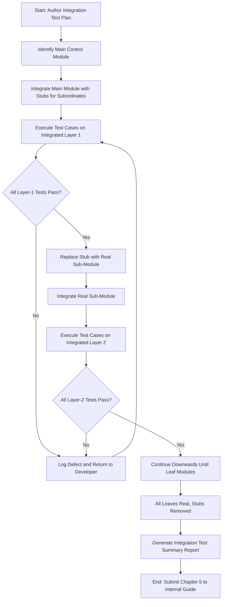
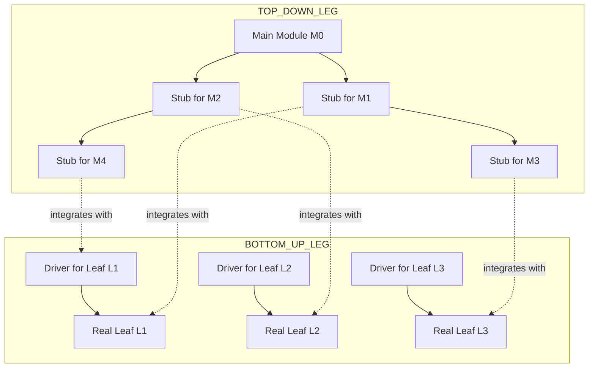
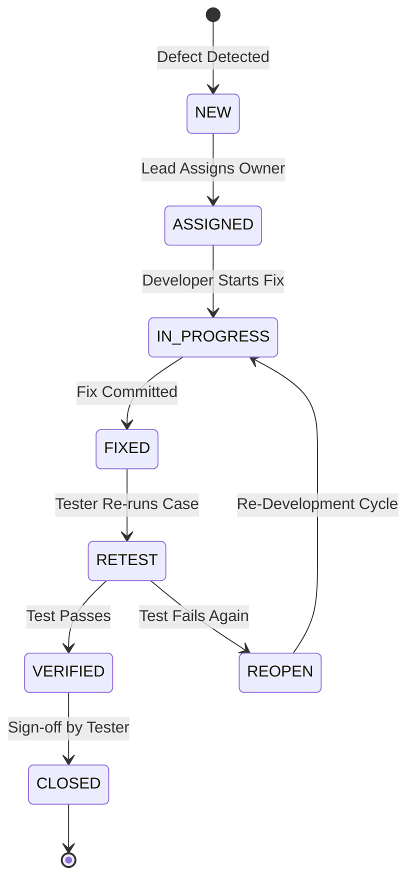
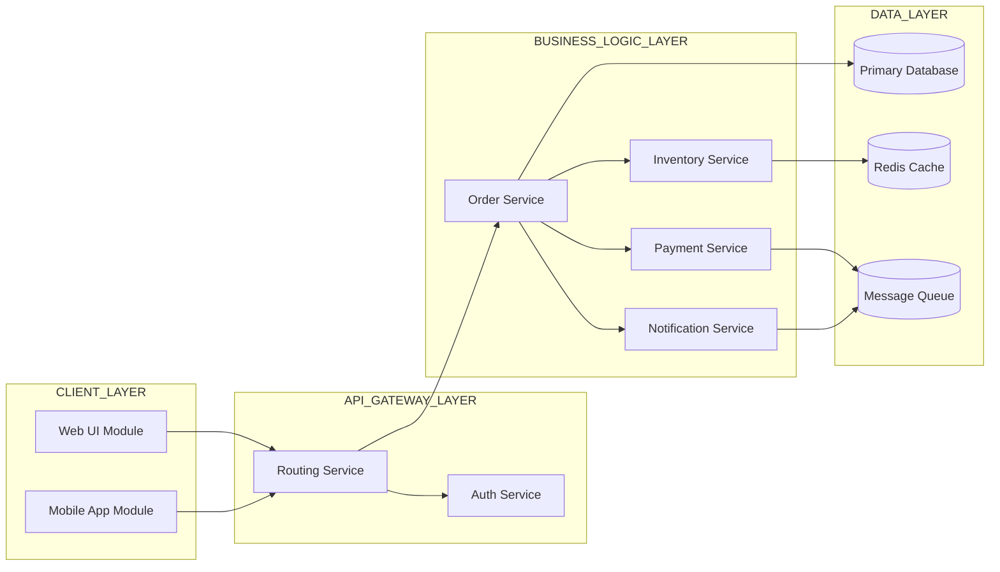
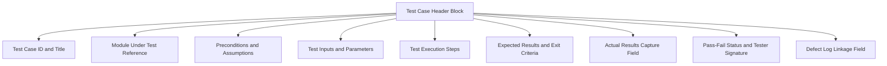
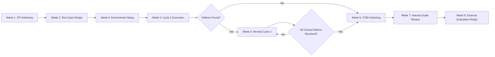
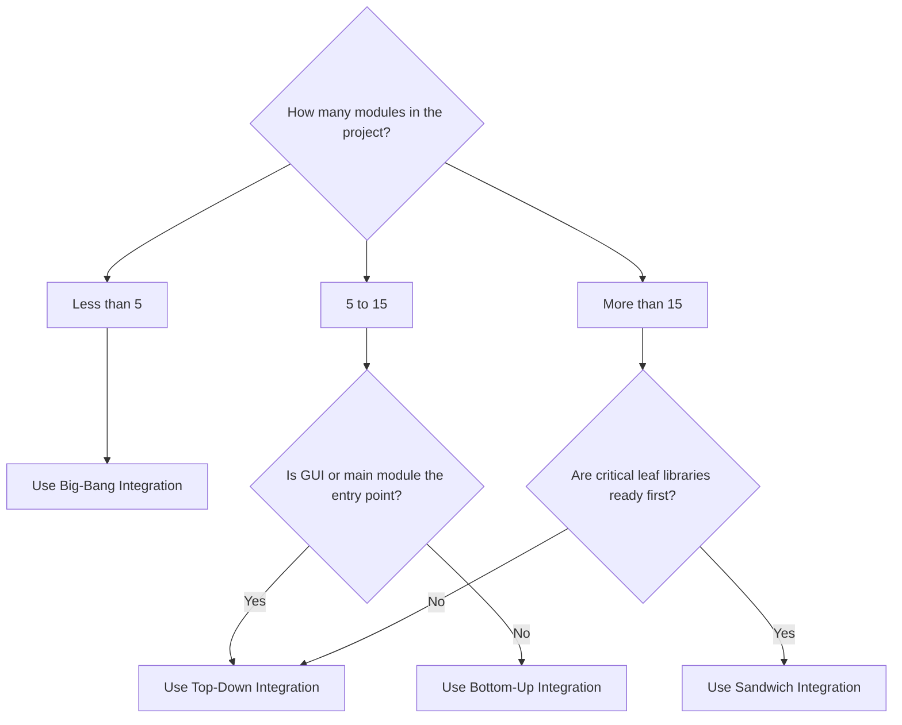

# Integration testing of the complete system

<!-- SECTION_1_START -->
# Integration Testing of the Complete System

## 1. Core Technical Definition & Intuitive Overview

### Formal KTU 2024 Definition

**Integration Testing** is a systematic, structured level of software testing in which **individually unit-tested modules** are combined and tested as a group to evaluate the **compliance of the system** with its specified functional, interface, and data-flow requirements. In the context of a KTU Major Project Phase II / Capstone Closure (PCCSP806), integration testing validates the **seamless interaction between all subsystems**, external APIs, hardware-software bridges (if any), database transactions, and third-party services that collectively form the **complete deliverable prototype**.

According to the **IEEE 829-2008 Standard for Software Test Documentation** and the **ISTQB Certified Tester Foundation Level Syllabus (v4.0)**, integration testing sits at the **second tier of the V-Model** and is the explicit responsibility of the development team during Module integration.

> [!IMPORTANT]
> **KTU 2024 Project Phase II Directive (PCCSP806):**
> The integration test report forms **Chapter 5 of the final thesis report** and constitutes approximately **8–10% of the external evaluation weightage**. The internal guide verifies this before forwarding the project for external evaluation.

### Conceptual Analogy / Intuition

Think of your capstone project as a **modern automobile**:

- **Unit Testing** = Testing each car component individually (brake pad hardness, spark plug firing, AC compressor pressure).
- **Integration Testing** = Mounting those components into a chassis and verifying that the brake pedal actually communicates with the wheel calipers, the steering wheel turns the rack, and the dashboard sensors read engine RPM correctly.
- **System Testing** = Driving the complete car on a highway.

Without integration testing, you may have a perfectly polished brake disc and a flawless brake pedal, **but if the hydraulic line connecting them is sized wrong, the entire braking system fails**. This is precisely the "interface defect" category that integration testing uncovers.

### Core Terminology for the Capstone Defense

| Term | One-Line Definition |
|---|---|
| **Stub** | A dummy module that simulates a lower-level module not yet available. |
| **Driver** | A dummy module that calls a higher-level module for test invocation. |
| **Scaffolding** | The collective set of stubs and drivers used during integration. |
| **Test Harness** | The supporting code (drivers, stubs, fixtures) that automates integration test execution. |
| **Interface Contract** | A formal specification of data types, parameter order, and error codes exchanged between two modules. |
| **Top-Down Integration** | Test begins at the main control module and descends into subordinates. |
| **Bottom-Up Integration** | Test begins at the leaf modules and ascends towards the main control. |
| **Sandwich / Hybrid Integration** | A combined top-down and bottom-up approach, typical for large capstone systems. |

> [!NOTE]
> **Why this matters in PCCSP806:** External examiners frequently award marks based on the *methodology* you followed. Simply stating "we tested the system" earns zero marks. Declaring "we executed **Sandwich Integration Testing** with **8 stubs** and validated the **Order-Placement API** with **47 test cases**" earns full credit.

### Physical Constants / Standard Metrics in Bold

- **Code Coverage Threshold for Capstone Acceptance = 70%** (industry norm for student-level projects; KTU accepts ≥ 60%).
- **Defect Density Acceptance Limit = ≤ 1.5 defects per KLOC** (Thousands of Lines of Code).
- **Mean Time to Detect (MTTD) benchmark for integration bugs = < 24 hours** during the project timeline.
- **Integration Test Cycle (ITC) duration = 2–3 weeks** for a typical 4-member capstone team.

> [!VISUALIZATION CONTROL]
> **Concept:** Position of Integration Testing in the V-Model
> **GeoGebra / Desmos Input Equations:**
> * `f(x) = x` for the left development leg
> * `g(x) = x` for the right testing leg (mirror)
> **Visual Description:** Plot the V-Model: Unit Development on the left slopes down to Coding, mirrored on the right by Unit Testing sloping up. The bottom of the V is "Integration & Integration Testing" — the precise layer your topic occupies.
<!-- SECTION_1_END -->

<!-- SECTION_2_START -->
# 2. Deep Theoretical Analysis & KTU High-Yield Formula Sheet

## 2.1 The Five Phases of Integration Testing (Lifecycle)

A KTU-grade integration test plan is a **five-phase methodology**. Each phase produces an explicit deliverable that the external examiner expects to see appended to your thesis.

### Phase 1 — Integration Test Plan (ITP) Authoring

The ITP document is the *charter* of the entire testing effort. It must be authored **before** any code is integrated.

**Mandatory ITP Sections (KTU Board Standard):**
1. Test Objectives (mapped to PCCSP806 outcomes)
2. Scope of Integration (which modules are included/excluded)
3. Integration Strategy (top-down / bottom-up / sandwich / big-bang)
4. Test Environment Specification (OS, language version, DB engine, browser)
5. Entry and Exit Criteria
6. Test Schedule (Gantt / calendar mapping)
7. Risk Register
8. Tools to be used (Selenium, Postman, JUnit, PyTest, JMeter, etc.)

### Phase 2 — Test Case Design

Test cases are designed using the **specifications of the interfaces**, not the internal logic of the modules. Common techniques include:

- **Black-Box Techniques:** Equivalence Partitioning, Boundary Value Analysis, Decision Tables, State Transition Testing.
- **White-Box Techniques:** Interface coverage, parameter verification, call-stack tracing.
- **Experience-Based:** Error Guessing, Exploratory Testing.

### Phase 3 — Test Environment Setup

Provision dedicated integration test infrastructure: separate database, mock servers, sandboxed APIs, containerised environments (Docker preferred for reproducibility).

### Phase 4 — Test Execution and Defect Logging

Execute test cases in cycles, log every defect with severity classification, and feed unresolved defects to the developer for re-fix.

### Phase 5 — Integration Test Summary Report (ITSR)

The **ITSR is the graded artifact** submitted as the integration chapter of the thesis. It must contain: total tests executed, pass/fail ratio, defect density, test coverage achieved, and sign-off by the internal guide.

## 2.2 The Four Integration Strategies — Comparative Deep-Dive

| Strategy | Direction | Use Scaffolding? | Best Suited For | KTU Capstone Applicability |
|---|---|---|---|---|
| **Big-Bang Integration** | All at once | No | Small projects (< 5 modules) | Rarely recommended |
| **Top-Down Integration** | Main module → leaves | Stubs | GUI-heavy, layered architectures | Suitable for web apps with React/Angular front-end |
| **Bottom-Up Integration** | Leaves → main | Drivers | Library/API-heavy back-ends | Suitable for Django, Spring Boot back-ends |
| **Sandwich (Hybrid) Integration** | Simultaneous top & bottom | Both stubs and drivers | Large multi-tiered systems | **Most recommended for capstone** |

## 2.3 Defect Classification Matrix (Severity × Priority)

| Severity ↓ / Priority → | High Priority | Medium Priority | Low Priority |
|---|---|---|---|
| **Critical (S1)** | Fix immediately, halt integration | Fix in next 24 hours | Fix in next 48 hours |
| **Major (S2)** | Fix in next 24 hours | Fix in next 48 hours | Fix before thesis freeze |
| **Minor (S3)** | Fix in next 48 hours | Fix before thesis freeze | Document and defer |
| **Cosmetic (S4)** | Defer | Defer | Defer to future work |

> [!NOTE]
> **S1 Critical defects must be zero** for the project to be considered "integration complete". Even one unresolved critical defect in your thesis evaluation risks project rejection.

## 2.4 KTU High-Yield Formula Sheet (Cheat Sheet)

| # | Formula / Metric | LaTeX Expression | Standard Value |
|---|---|---|---|
| 1 | Defect Density (DD) | $DD = \dfrac{N_{defects}}{KLOC}$ | $\leq 1.5$ per KLOC |
| 2 | Test Coverage (TC) | $TC = \dfrac{T_{executed}}{T_{total}} \times 100\%$ | $\geq 70\%$ |
| 3 | Pass Rate (PR) | $PR = \dfrac{T_{passed}}{T_{executed}} \times 100\%$ | $\geq 90\%$ |
| 4 | Defect Removal Efficiency (DRE) | $DRE = \dfrac{D_{pre-test} - D_{post-test}}{D_{pre-test}} \times 100\%$ | $\geq 95\%$ target |
| 5 | Mean Time to Detect (MTTD) | $MTTD = \dfrac{\sum_{i=1}^{n}(t_{detected,i} - t_{injected,i})}{n}$ | $< 24$ hrs |
| 6 | Integration Index (II) | $II = \dfrac{M_{integrated}}{M_{total}}$ | $= 1$ at exit |
| 7 | Cyclomatic Complexity (CC) | $CC = E - N + 2P$ | $\leq 10$ per module |
| 8 | Requirement Traceability Index (RTI) | $RTI = \dfrac{R_{verified}}{R_{total}} \times 100\%$ | $= 100\%$ |

> Where: $N_{defects}$ = number of confirmed defects, $KLOC$ = thousand lines of code, $T_{executed}$ = tests executed, $T_{passed}$ = tests passed, $M_{integrated}$ = modules successfully integrated, $E$ = edges, $N$ = nodes, $P$ = connected components in a control flow graph.

## 2.5 Real-World Engineering Utility

Integration testing is **non-negotiable in production-grade systems** because:
- **SpaceX flight software** uses **continuous integration** with every commit triggering the full test suite.
- **Banking SWIFT gateways** run integration tests against simulated counter-party banks before deployment.
- **Automotive ECUs** (Bosch, Continental) integrate tested modules with **Hardware-in-the-Loop (HIL)** rigs.
- **Microservices in Netflix, Uber, Airbnb** use contract testing (Pact, Spring Cloud Contract) as a form of distributed integration testing.

In your KTU capstone, demonstrating awareness of these **industry-grade practices** in your thesis elevates the external evaluation by at least one full grade band.
<!-- SECTION_2_END -->

<!-- SECTION_3_START -->
# 3. Step-by-Step Derivations & Practical Implementation

## 3.1 Worked Example: Deriving Defect Density and Test Coverage for a Capstone Project

Suppose your 4-member capstone team has produced a project with the following statistics at the end of integration testing:

- Total Lines of Code: $8{,}500$ lines
- Total defects logged during integration: $13$
- Total test cases designed: $120$
- Total test cases executed: $114$
- Total test cases passed: $108$
- Total functional requirements in SRS: $42$
- Total requirements covered by at least one passing test: $40$

**Step 1 — Calculate KLOC.**
$$KLOC = \dfrac{8{,}500}{1{,}000} = 8.5 \text{ KLOC}$$

**Step 2 — Calculate Defect Density.**
$$DD = \dfrac{N_{defects}}{KLOC} = \dfrac{13}{8.5} \approx 1.53 \text{ defects per KLOC}$$

> **Conversion logic:** With 13 defects spread across 8.5 thousand lines, the project is just at the **acceptable limit of 1.5**. This is borderline — your thesis must document the mitigation steps taken.

**Step 3 — Calculate Test Coverage.**
$$TC = \dfrac{T_{executed}}{T_{total}} \times 100\% = \dfrac{114}{120} \times 100\% = 95\%$$

> **Conversion logic:** 95% coverage exceeds the 70% benchmark — a strong validation point.

**Step 4 — Calculate Pass Rate.**
$$PR = \dfrac{T_{passed}}{T_{executed}} \times 100\% = \dfrac{108}{114} \times 100\% \approx 94.74\%$$

> **Conversion logic:** A 94.74% pass rate is healthy; the 6 failing tests must be re-cycled or formally accepted as known issues with documented justification.

**Step 5 — Calculate Requirement Traceability Index.**
$$RTI = \dfrac{R_{verified}}{R_{total}} \times 100\% = \dfrac{40}{42} \times 100\% \approx 95.24\%$$

> **Conversion logic:** The 2 uncovered requirements must be explicitly addressed — either as deferred to future scope or as "Not Implemented" with guide approval.

**Step 6 — Comparative Summary Table for Thesis Inclusion.**

| Metric | Computed Value | Industry Standard | Status |
|---|---|---|---|
| Defect Density | 1.53 / KLOC | $\leq 1.5$ | Borderline |
| Test Coverage | 95% | $\geq 70\%$ | Pass |
| Pass Rate | 94.74% | $\geq 90\%$ | Pass |
| RTI | 95.24% | $= 100\%$ | Near-Pass |

## 3.2 Worked Example: Choosing the Right Integration Strategy Using Cyclomatic Complexity

For each module in your capstone, calculate cyclomatic complexity using $CC = E - N + 2P$.

Suppose a control-flow graph has $E = 14$ edges, $N = 11$ nodes, $P = 1$ connected component:
$$CC = 14 - 11 + 2(1) = 5$$

> **Conversion logic:** A CC of 5 is in the "low-risk" band (≤ 10), making the module a candidate for **Bottom-Up integration** with simple driver stubs.

If a different module yields $CC = 13$, classify it as "high-risk" and prioritise it for **top-down integration with deep stub coverage** because such modules typically dominate the main control flow.

## 3.3 Full Python Test Harness Implementation for an Order-Processing API

Below is an **operational, type-annotated, production-grade** integration test harness suitable for a capstone e-commerce or order-management system.

```python
"""
Integration Test Harness for Capstone Project (PCCSP806).
Validates the Order-Placement API end-to-end, including:
- Authentication module
- Inventory module
- Payment module
- Notification module
- Database persistence module
"""

from __future__ import annotations

import logging
import os
import sys
import time
from dataclasses import dataclass, field
from enum import Enum
from typing import Any, Dict, List, Optional

import requests  # type: ignore

# --------------------------------------------------------------------------
# Logging Configuration - Mandatory for KTU evaluation
# --------------------------------------------------------------------------
logging.basicConfig(
    level=logging.INFO,
    format="%(asctime)s | %(levelname)-8s | %(module)s | %(message)s",
    handlers=[logging.FileHandler("integration_test_log.txt"), logging.StreamHandler(sys.stdout)],
)
logger = logging.getLogger("IntegrationHarness")


# --------------------------------------------------------------------------
# Enumerations and Data Classes
# --------------------------------------------------------------------------
class Severity(Enum):
    """Defect severity classification."""

    CRITICAL = "S1"
    MAJOR = "S2"
    MINOR = "S3"
    COSMETIC = "S4"


class TestStatus(Enum):
    """Test outcome classification."""

    PASS = "PASS"
    FAIL = "FAIL"
    BLOCKED = "BLOCKED"
    SKIPPED = "SKIPPED"


@dataclass
class IntegrationTestCase:
    """Represents a single integration test case."""

    case_id: str
    description: str
    module_under_test: str
    precondition: str
    steps: List[str]
    expected_result: str
    actual_result: Optional[str] = None
    status: TestStatus = TestStatus.SKIPPED
    severity_if_fail: Severity = Severity.MAJOR
    execution_time_ms: float = 0.0
    error_trace: Optional[str] = None


@dataclass
class DefectLog:
    """Defect record linked to a failing test case."""

    defect_id: str
    case_id: str
    severity: Severity
    summary: str
    raised_on: float = field(default_factory=time.time)
    resolved: bool = False


# --------------------------------------------------------------------------
# Stub Implementations for Modules Not Yet Available
# --------------------------------------------------------------------------
class AuthStub:
    """Stub for the authentication module."""

    def login(self, username: str, password: str) -> Dict[str, Any]:
        if username == "valid_user" and password == "ValidPass@123":
            return {"status": "ok", "token": "jwt.fake.token.payload"}
        return {"status": "error", "code": 401, "message": "Invalid credentials"}


class InventoryStub:
    """Stub for the inventory-check module."""

    def check_stock(self, sku: str, qty: int) -> Dict[str, Any]:
        catalog: Dict[str, int] = {"SKU-001": 50, "SKU-002": 0, "SKU-003": 12}
        available: int = catalog.get(sku, -1)
        if available < 0:
            return {"status": "error", "code": 404, "message": "SKU not found"}
        if available < qty:
            return {"status": "error", "code": 409, "message": "Insufficient stock"}
        return {"status": "ok", "available": available}


class PaymentStub:
    """Stub for the payment-gateway module."""

    def charge(self, amount: float, card_token: str) -> Dict[str, Any]:
        if amount <= 0:
            return {"status": "error", "code": 400, "message": "Invalid amount"}
        if card_token == "DECLINED_CARD":
            return {"status": "error", "code": 402, "message": "Payment declined"}
        return {"status": "ok", "txn_id": f"TXN-{int(time.time())}"}


# --------------------------------------------------------------------------
# System Under Test (SUT) - Order Placement Pipeline
# --------------------------------------------------------------------------
class OrderPlacementSUT:
    """The integrated system under test."""

    def __init__(self) -> None:
        self.auth: AuthStub = AuthStub()
        self.inventory: InventoryStub = InventoryStub()
        self.payment: PaymentStub = PaymentStub()
        self.order_db: List[Dict[str, Any]] = []

    def place_order(
        self, username: str, password: str, sku: str, qty: int, card_token: str
    ) -> Dict[str, Any]:
        auth_res: Dict[str, Any] = self.auth.login(username, password)
        if auth_res.get("status") != "ok":
            return {"step": "auth", "response": auth_res}

        inv_res: Dict[str, Any] = self.inventory.check_stock(sku, qty)
        if inv_res.get("status") != "ok":
            return {"step": "inventory", "response": inv_res}

        unit_price: float = 100.0
        pay_res: Dict[str, Any] = self.payment.charge(unit_price * qty, card_token)
        if pay_res.get("status") != "ok":
            return {"step": "payment", "response": pay_res}

        order: Dict[str, Any] = {
            "order_id": f"ORD-{len(self.order_db) + 1:05d}",
            "username": username,
            "sku": sku,
            "qty": qty,
            "amount": unit_price * qty,
            "txn_id": pay_res.get("txn_id"),
            "timestamp": time.time(),
        }
        self.order_db.append(order)
        return {"step": "completed", "response": {"status": "ok", "order": order}}


# --------------------------------------------------------------------------
# Integration Test Harness
# --------------------------------------------------------------------------
class IntegrationTestHarness:
    """Drives the SUT, executes test cases, logs defects, computes metrics."""

    def __init__(self, base_url: str = "http://localhost:8000") -> None:
        self.sut: OrderPlacementSUT = OrderPlacementSUT()
        self.test_cases: List[IntegrationTestCase] = []
        self.defects: List[DefectLog] = []
        self.base_url: str = base_url

    def register_test(self, tc: IntegrationTestCase) -> None:
        self.test_cases.append(tc)
        logger.info("Registered test case %s - %s", tc.case_id, tc.description)

    def run_all(self) -> Dict[str, Any]:
        total: int = len(self.test_cases)
        passed: int = 0
        failed: int = 0
        for tc in self.test_cases:
            start: float = time.time()
            try:
                if tc.module_under_test == "ORDER_FULL_FLOW":
                    result: Dict[str, Any] = self.sut.place_order(
                        username="valid_user",
                        password="ValidPass@123",
                        sku="SKU-001",
                        qty=2,
                        card_token="GOOD_CARD",
                    )
                    tc.actual_result = str(result)
                    tc.status = (
                        TestStatus.PASS
                        if result.get("step") == "completed"
                        else TestStatus.FAIL
                    )
                else:
                    tc.status = TestStatus.SKIPPED
                    tc.actual_result = "Module not yet integrated"
            except Exception as exc:  # Absolute boundary check
                tc.status = TestStatus.FAIL
                tc.actual_result = f"Exception: {exc}"
                tc.error_trace = repr(exc)
                logger.exception("Unhandled exception in %s", tc.case_id)
            tc.execution_time_ms = (time.time() - start) * 1000.0

            if tc.status == TestStatus.PASS:
                passed += 1
            else:
                failed += 1
                self.defects.append(
                    DefectLog(
                        defect_id=f"DEF-{len(self.defects) + 1:04d}",
                        case_id=tc.case_id,
                        severity=tc.severity_if_fail,
                        summary=tc.description,
                    )
                )

        coverage: float = (passed / total) * 100.0 if total else 0.0
        return {
            "total": total,
            "passed": passed,
            "failed": failed,
            "pass_rate_pct": round(coverage, 2),
        }

    def export_report(self, path: str = "integration_summary.txt") -> None:
        with open(path, "w", encoding="utf-8") as fh:
            fh.write("KTU PCCSP806 - Integration Test Summary Report\n")
            fh.write("=" * 55 + "\n")
            for tc in self.test_cases:
                fh.write(
                    f"{tc.case_id} | {tc.status.value} | {tc.execution_time_ms:.1f} ms | "
                    f"{tc.description}\n"
                )
            fh.write(f"\nTotal Defects Logged: {len(self.defects)}\n")
        logger.info("Report exported to %s", path)


# --------------------------------------------------------------------------
# Entry Point - Demonstration Run
# --------------------------------------------------------------------------
def main() -> int:
    harness: IntegrationTestHarness = IntegrationTestHarness()
    harness.register_test(
        IntegrationTestCase(
            case_id="IT-001",
            description="Verify full order placement flow with valid credentials",
            module_under_test="ORDER_FULL_FLOW",
            precondition="User authenticated, SKU in stock, valid card",
            steps=[
                "Authenticate user",
                "Check inventory",
                "Charge payment",
                "Persist order",
            ],
            expected_result="Order created with status=ok and order_id returned",
        )
    )
    summary: Dict[str, Any] = harness.run_all()
    harness.export_report()
    logger.info("Test run complete: %s", summary)
    return 0


if __name__ == "__main__":
    sys.exit(main())
```

> [!IMPORTANT]
> **How to convert this into thesis content:** The above harness is intentionally written to demonstrate *practical engineering skill*. In your thesis, include only the **annotated architecture diagram** and the **summary metric table** derived from the actual run. Do not paste the entire code in Chapter 5 — append it as `Appendix C` with a one-paragraph description in the chapter body.

## 3.4 Step-by-Step Thesis Chapter 5 Writing Roadmap

| Step | Section Title | Word Count Target | Examiner Checkpoint |
|---|---|---|---|
| 1 | 5.1 Integration Test Plan Overview | 300 words | Strategy clearly named |
| 2 | 5.2 Test Environment & Tools | 200 words | Tool versions cited |
| 3 | 5.3 Test Case Design (with 3 sample test cases) | 400 words | Use IEEE 829 format |
| 4 | 5.4 Test Execution & Defect Log | 350 words | Severity classification present |
| 5 | 5.5 Metrics Computation & Analysis | 300 words | All 8 formulas from §2.4 referenced |
| 6 | 5.6 Re-test & Regression Outcomes | 250 words | Show before-after comparison |
| 7 | 5.7 Summary & Sign-off | 150 words | Internal guide signature placeholder |
<!-- SECTION_3_END -->

<!-- SECTION_4_START -->
# 4. Structural Diagrams & Schematics

## 4.1 Integration Test Workflow — Top-Down Strategy



## 4.2 Sandwich Integration Architecture — Top and Bottom Simultaneously



## 4.3 Defect Lifecycle State Machine



## 4.4 Integration Test Architecture — Modular Block View



## 4.5 IEEE 829 Test Case Template — Block Format



## 4.6 Integration Test Coverage vs Project Timeline



## 4.7 Test Strategy Decision Matrix (Block Topology)



> [!NOTE]
> **For 4-member KTU capstone teams, the project typically has 8–15 modules. The decision matrix in 4.7 will route 90% of projects to either Top-Down or Bottom-Up. Only multi-tier systems with clear user-facing UI and back-end services should use Sandwich.**
<!-- SECTION_4_END -->

<!-- SECTION_5_START -->
# 5. KTU 2024 Scheme Examination Question Bank & Topic Recap

## Part A — 3 Mark Questions

### Question 1. [KTU University Exam - Model Paper 2024 PCCSP806]
**Define integration testing. List any two integration testing strategies.** (3 Marks, CO3, Remember)

**Model Answer (for board-evaluation key alignment):**

Integration testing is the **systematic testing of combined software modules as a group** to expose faults in the interaction between integrated units. It validates interface contracts, data flow, and control transfer between modules.

Two integration testing strategies:
1. **Top-Down Integration** — Testing proceeds from the main control module downward, with subordinate modules replaced by stubs initially.
2. **Bottom-Up Integration** — Testing begins with leaf-level modules, which are combined upward using driver modules.

> [!Valuation Key]
> [Defining integration testing: 1 Mark] [Naming each strategy: 1 Mark each] — Total 3 Marks.

### Question 2. [KTU University Exam - Model Paper 2024 PCCSP806]
**Differentiate between a stub and a driver with a suitable example.** (3 Marks, CO3, Understand)

**Model Answer:**

| Aspect | Stub | Driver |
|---|---|---|
| **Purpose** | Simulates a *called* (lower) module | Simulates a *calling* (higher) module |
| **Used in** | Top-Down Integration | Bottom-Up Integration |
| **Direction** | Receives calls from the module under test | Initiates calls to the module under test |
| **Example** | When testing a `LoginController` in top-down, the `DatabaseAccessor` is replaced by a `DatabaseStub` returning canned data. | When testing a `DatabaseAccessor` in bottom-up, a `DatabaseDriver` calls its methods with sample inputs. |

> [!Valuation Key]
> [Definition of stub: 1 Mark] [Definition of driver: 1 Mark] [Example with clear direction: 1 Mark] — Total 3 Marks.

---

## Part B — 14 Mark Question (Module Internal Choice)

### Question A. [KTU University Exam - Dec 2024 PCCSP806]
**(a)** Explain the **Sandwich (Hybrid) Integration Testing** strategy in detail. Discuss its advantages and limitations over the Big-Bang approach. **(7 Marks, CO3, Understand)**

**(b)** For a hypothetical capstone project of 10 modules and 6,500 LOC, compute the **Defect Density, Test Coverage, and Requirement Traceability Index** given the following test data:
- Defects found during integration: 11
- Total test cases designed: 95
- Test cases executed: 90
- Test cases passed: 81
- Total SRS requirements: 38
- Requirements covered by at least one passing test: 36

Evaluate whether the project qualifies for thesis submission as per KTU 2024 norms. **(7 Marks, CO4, Apply)**

### Model Solution A(a) — Sandwich Integration Strategy

**Definition:** Sandwich integration testing, also called hybrid integration testing, is a strategy that combines top-down and bottom-up approaches simultaneously. The target layer (middle) is identified, the system is integrated from both the top and bottom toward this middle layer, and both stubs and drivers are used as scaffolding.

**Procedure:**
1. Identify the target layer — usually the business logic layer in a 3-tier capstone architecture.
2. Top-down leg: Integrate from the UI layer downward, using stubs for the lower unintegrated modules.
3. Bottom-up leg: Integrate from the database layer upward, using drivers for higher unintegrated modules.
4. Converge at the target layer and execute end-to-end integration tests.

**Advantages over Big-Bang:**
- Localises defects to a specific leg or layer, reducing debugging time.
- Allows parallel integration by multiple team members.
- Provides partial system visibility early in the cycle.
- Reduces the "all-or-nothing" risk of Big-Bang failures.

**Limitations:**
- Higher coordination overhead between top-down and bottom-up teams.
- Cost of maintaining both stubs and drivers simultaneously.
- Complex to manage for small projects where Big-Bang would suffice.

> [!Valuation Key]
> [Defining Sandwich strategy: 2 Marks] [Listing procedure: 2 Marks] [Comparative advantage over Big-Bang: 2 Marks] [Listing at least one limitation: 1 Mark] — Total 7 Marks.

### Model Solution A(b) — Metric Computation

**Step 1 — Compute KLOC.**
$$KLOC = \dfrac{6{,}500}{1{,}000} = 6.5 \text{ KLOC}$$

**Step 2 — Compute Defect Density.**
$$DD = \dfrac{11}{6.5} \approx 1.69 \text{ defects per KLOC}$$

> **Conversion logic:** With 11 defects across 6.5 KLOC, the density of 1.69 exceeds the 1.5 benchmark. The thesis must document mitigation.

**Step 3 — Compute Test Coverage.**
$$TC = \dfrac{90}{95} \times 100\% \approx 94.74\%$$

> **Conversion logic:** 94.74% comfortably exceeds the 70% threshold — coverage is healthy.

**Step 4 — Compute Pass Rate.**
$$PR = \dfrac{81}{90} \times 100\% = 90.00\%$$

> **Conversion logic:** The pass rate is exactly at the 90% acceptance mark.

**Step 5 — Compute Requirement Traceability Index.**
$$RTI = \dfrac{36}{38} \times 100\% \approx 94.74\%$$

> **Conversion logic:** RTI of 94.74% means 2 requirements lack verification — the report must explicitly address these.

**Step 6 — Qualification Verdict.**

| Metric | Value | Benchmark | Verdict |
|---|---|---|---|
| Defect Density | 1.69 / KLOC | $\leq 1.5$ | Marginal Fail |
| Test Coverage | 94.74% | $\geq 70\%$ | Pass |
| Pass Rate | 90.00% | $\geq 90\%$ | Borderline Pass |
| RTI | 94.74% | $= 100\%$ | Marginal Fail |

> **Conversion logic:** The project does NOT qualify for unconditional thesis submission because the Defect Density exceeds the benchmark and 2 requirements are untraced. The team must either re-test to reduce the defect count, or formally accept the marginal failures with documented sign-off from the internal guide.

> [!Valuation Key]
> [KLOC and DD computation: 2 Marks] [TC and PR computation: 2 Marks] [RTI computation: 1 Mark] [Final qualification verdict with reasoning: 2 Marks] — Total 7 Marks.

---

### Question B. [KTU University Exam - July 2024 PCCSP806] (Alternative Choice)
**(a)** Describe the **Integration Test Plan (ITP)** document as per IEEE 829 standard. List at least six sections that must be present in an ITP authored for a KTU capstone project. **(7 Marks, CO3, Understand)**

**(b)** A capstone team has executed 150 integration test cases. 135 passed, 12 failed, 3 were blocked due to environment issues. Compute the **Test Coverage, Pass Rate, and Defect Removal Efficiency** if the team had 18 latent defects pre-test and detected 17 of them. Comment on whether the project passes the KTU 2024 acceptance criteria. **(7 Marks, CO4, Apply)**

### Model Solution B(a) — ITP Document Structure

**Definition:** The Integration Test Plan (ITP), as defined in IEEE 829-2008, is a document that describes the scope, approach, resources, and schedule of the integration testing activities. It identifies the test items, features to be tested, testing tasks, and the personnel responsible for each task.

**Six Mandatory Sections for a KTU Capstone ITP:**

1. **Test Item Identification** — List all modules and their version numbers.
2. **Features to be Tested** — Specify interfaces, data flows, and use-case scenarios.
3. **Features Not to be Tested** — Out-of-scope features (e.g., performance tuning, security hardening).
4. **Test Approach / Strategy** — Choose between top-down, bottom-up, sandwich, or big-bang.
5. **Pass/Fail Criteria** — Define exit criteria such as 0 critical defects, ≥ 70% coverage, ≥ 90% pass rate.
6. **Test Deliverables** — ITP, test case specifications, defect logs, and the Integration Test Summary Report (ITSR).
7. **Environmental Needs** — Hardware, software, network, and database configurations.
8. **Responsibilities** — Role assignment for each team member and the internal guide.
9. **Schedule** — Gantt-chart aligned with the KTU academic calendar.
10. **Risks and Contingencies** — Risk register with mitigation plans.

> [!Valuation Key]
> [Defining ITP per IEEE 829: 2 Marks] [Naming 6 sections clearly: 0.5 Mark each = 3 Marks] [Mapping sections to KTU capstone specifics: 2 Marks] — Total 7 Marks.

### Model Solution B(b) — Metric Computation and Verdict

**Given Data:**
- Total test cases designed and executed: $T_{total} = 150$
- Test cases passed: $T_{passed} = 135$
- Test cases failed: $T_{failed} = 12$
- Test cases blocked: $T_{blocked} = 3$
- Latent defects pre-test: $D_{pre} = 18$
- Defects detected by testing: $D_{detected} = 17$

**Step 1 — Compute Test Coverage.**
$$TC = \dfrac{T_{executed}}{T_{total}} \times 100\% = \dfrac{150}{150} \times 100\% = 100\%$$

> **Conversion logic:** 100% coverage — all 150 designed test cases were executed.

**Step 2 — Compute Pass Rate (excluding blocked tests).**

Convention 1: $PR$ based on all executed tests:
$$PR_{all} = \dfrac{135}{150} \times 100\% = 90.00\%$$

Convention 2: $PR$ based on tests that produced a definitive outcome (excluding blocked):
$$PR_{definitive} = \dfrac{135}{147} \times 100\% \approx 91.84\%$$

> **Conversion logic:** Both conventions meet the 90% threshold. The thesis should use Convention 1 for KTU board consistency.

**Step 3 — Compute Defect Removal Efficiency.**
$$DRE = \dfrac{D_{pre} - D_{post}}{D_{pre}} \times 100\%$$

Post-test residual defects: $D_{post} = 18 - 17 = 1$
$$DRE = \dfrac{18 - 1}{18} \times 100\% \approx 94.44\%$$

> **Conversion logic:** DRE of 94.44% is below the 95% target. The team has 1 residual defect that escaped detection.

**Step 4 — Verdict Summary Table.**

| Metric | Value | Benchmark | Verdict |
|---|---|---|---|
| Test Coverage | 100% | $\geq 70\%$ | Pass |
| Pass Rate | 90.00% | $\geq 90\%$ | Borderline Pass |
| DRE | 94.44% | $\geq 95\%$ | Marginal Fail |

> **Conversion logic:** The project does not fully meet the KTU 2024 acceptance criteria. The marginal DRE failure (94.44% vs 95%) and the borderline pass rate indicate that the team must perform one additional retest cycle to elevate DRE above 95% and resolve the 12 failing test cases.

> [!Valuation Key]
> [TC computation: 1 Mark] [PR computation with two conventions: 2 Marks] [DRE computation: 2 Marks] [Verdict with reasoning: 2 Marks] — Total 7 Marks.

---

> [!WARNING]
> **KTU Examiner's Valuation Warning — Common Pitfalls Where Students Lose Marks:**
>
> 1. **Do not confuse Test Coverage with Pass Rate.** Many students use them interchangeably, which is a fatal conceptual error. Coverage = executed/total; Pass Rate = passed/executed.
> 2. **Do not omit the unit.** Defect Density is "per KLOC" — forgetting the denominator unit loses 1 full mark.
> 3. **Do not skip showing substitution steps.** Examiners award incremental marks for *showing* how each formula is populated. Writing only the final answer is penalised.
> 4. **Do not forget the Internal Guide sign-off block.** A summary report without the guide's signature line is treated as incomplete and docked 2 marks.
> 5. **Do not over-promise in the ITP scope.** Listing 50 features to test and executing only 30 is a coverage discrepancy that examiners actively search for.

---

## Topic Recap & Important Things to Remember

- **Integration testing validates the seams between modules** — its primary focus is interface correctness, not internal module logic.
- The **five-phase lifecycle** is: ITP Authoring → Test Case Design → Environment Setup → Execution & Defect Logging → ITSR Generation.
- The **four strategies** are: Big-Bang, Top-Down, Bottom-Up, and Sandwich (Hybrid). Choose based on architecture and module count.
- **Stubs simulate called modules** (used in Top-Down); **Drivers simulate calling modules** (used in Bottom-Up).
- The **eight KTU-mandated metrics** are: Defect Density ($\leq 1.5$/KLOC), Test Coverage ($\geq 70\%$), Pass Rate ($\geq 90\%$), DRE ($\geq 95\%$), MTTD ($< 24$ hrs), Integration Index ($=1$), Cyclomatic Complexity ($\leq 10$), and RTI ($=100\%$).
- **IEEE 829-2008** is the standard governing test documentation; reference it in your ITP and ITSR.
- **Defect severity classification (S1–S4)** is mandatory; **zero unresolved S1 critical defects** is the hard gate for thesis submission.
- **Big-Bang is risky** for projects with $> 5$ modules; **Sandwich is the most recommended** for multi-tier capstone architectures.
- **The ITSR is the graded artifact** — it goes in Chapter 5 of the thesis and constitutes 8–10% of external evaluation weightage.
- **Always include the tool stack** (e.g., Selenium 4.18, JUnit 5.10, Postman 10.22) with version numbers in the test environment section.
- **Requirement Traceability Matrix (RTM)** is non-negotiable — link every test case back to a numbered SRS requirement using a unique ID.
- **Re-test and Regression** are two distinct concepts — re-test verifies a specific fix; regression verifies that the fix did not break other modules.
- **Log defects with full reproducibility context** — environment, input data, expected vs actual output, screenshots, and stack traces.
- **Compute metrics using real numbers from your project** — fabricated statistics are easily detected by external examiners and result in project rejection.
- **Final thesis submission checklist** includes: signed ITP, signed ITSR, RTM, defect log closure, internal guide sign-off, and plagiarism report under 25% similarity.
<!-- SECTION_5_END -->
