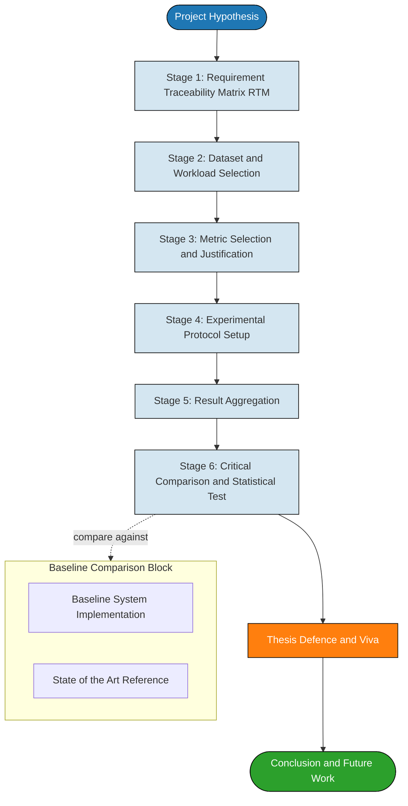
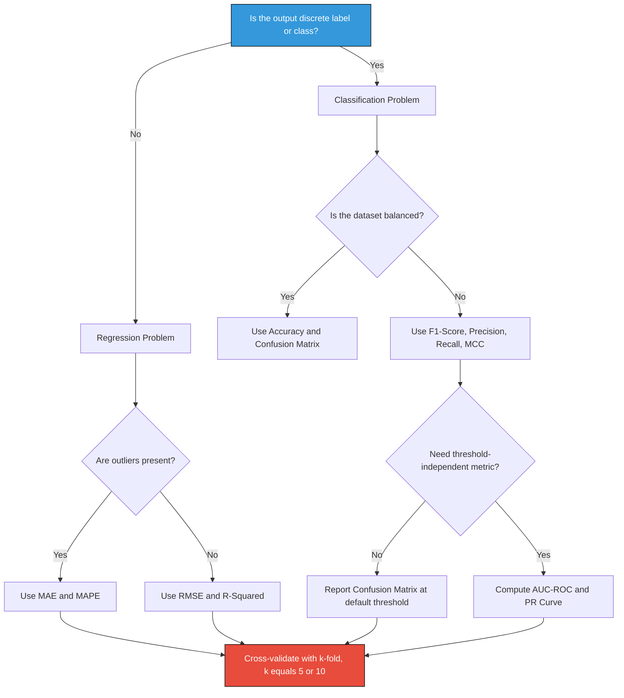
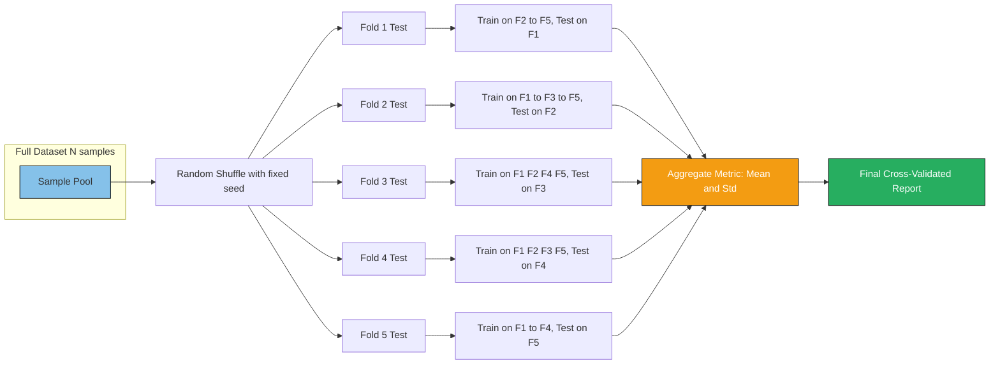
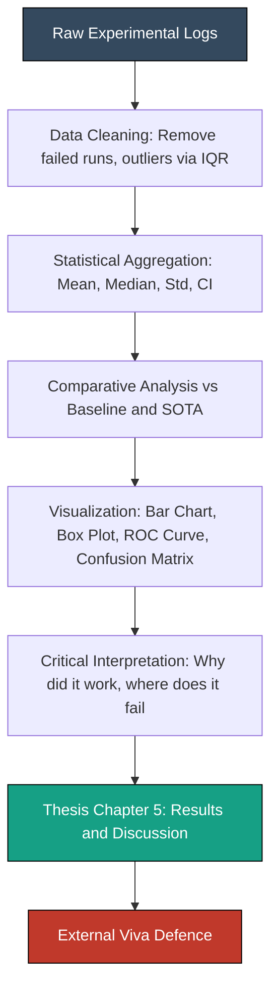

# Performance evaluation and result analysis

<!-- SECTION_1_START -->
# 📘 Module 2 — Testing, Evaluation & Thesis Submission
## Topic: Performance Evaluation and Result Analysis

> [!IMPORTANT]
> **KTU 2024 Scheme Mapping**
> **Course:** PCCSP806 — Major Project Phase II / Capstone Closure
> **Module 2 Focus:** Quantitative validation of the proposed system, comparative analysis against baselines, and presentation of statistically defensible results in the final thesis / dissertation.

### 1.1 Formal Academic Definition

**Performance Evaluation** is the systematic, quantitative, and qualitative process of measuring how well a proposed engineering system, algorithm, model, or prototype meets its predefined functional and non-functional requirements under controlled and reproducible conditions. **Result Analysis** is the subsequent stage where these measurements are statistically processed, visualized, compared against baselines, and critically interpreted to establish the validity, reliability, and significance of the project's contributions.

In the KTU 2024 capstone framework, performance evaluation is the single most important determinant of the final project grade, because it directly demonstrates **Course Outcome CO5** (ability to conduct independent research / development and interpret results) and **CO6** (ability to communicate findings effectively).

> [!NOTE]
> **Core Distinction (Board-Examiner Perspective)**
> * **Testing** answers: *"Does the system work?"* (Verification — built the system right?)
> * **Evaluation** answers: *"How well does it work?"* (Validation — built the right system?)
> * **Result Analysis** answers: *"What do the numbers mean, and are they trustworthy?"* (Interpretation + statistical defense)

### 1.2 Conceptual Analogy — Intuition

Imagine a final-year student presenting a solar-powered water purifier:

| Stage | Real-World Analogy | Engineering Equivalent |
|---|---|---|
| **Testing** | Boil a glass of water, drink it, no diarrhoea today. | Does the unit run without crashing? |
| **Performance Evaluation** | Measure 10 litres/hour throughput, 99.2% TDS removal, 14 W power draw. | Quantitative metrics: accuracy, latency, efficiency |
| **Result Analysis** | Compare to a commercial RO purifier — mine is cheaper, 8% lower rejection rate but 60% less energy. | Benchmarking + statistical comparison |
| **Thesis Defence** | Panel asks: *"Was 10 samples enough? Did you test in monsoon?"* | Validity, sample size, generalizability |

The "numbers" without analysis are just data. The **analysis** is what converts data into a defensible engineering claim.

### 1.3 Standard Metrics Vocabulary (Syllabus Anchors)

The KTU 2024 PCCSP806 syllabus mandates that every capstone project explicitly declare its evaluation protocol under the following categories:

> [!IMPORTANT]
> **Three Pillars of Performance Evaluation**
> 1. **Correctness Metrics** — *Accuracy, Precision, Recall, F1-Score, Confusion Matrix, ROC-AUC*
> 2. **Efficiency Metrics** — *Time Complexity, Space Complexity, Throughput, Latency, FPS, Energy Consumption*
> 3. **Quality-of-Experience (QoE) / User Metrics** — *System Usability Scale (SUS), Mean Opinion Score (MOS), Task Completion Rate*

> [!VISUALIZATION CONTROL]
> **Concept:** Trade-off Curve between False Positives and True Positive Rate (ROC Space)
> **Plot Type:** 2D Cartesian Plot
> **X-axis:** False Positive Rate (FPR) ∈ [0, 1]
> **Y-axis:** True Positive Rate (TPR) ∈ [0, 1]
> **Key Reference Lines:**
> * `y = x` (Random Classifier Diagonal)
> * `AUC = 1.0` (Perfect Classifier, hugs top-left corner)
> * `AUC = 0.5` (Worst Class — diagonal)
> **Visual Description:** A concave curve bulging toward the top-left corner. The Area Under Curve (AUC) represents the probability that a randomly chosen positive instance is ranked higher than a randomly chosen negative one.
<!-- SECTION_1_END -->

<!-- SECTION_2_START -->
# 📘 Module 2 — Deep Theoretical Analysis & KTU High-Yield Formula Sheet

## 2.1 The Evaluation Pipeline (Operational Logic)

Performance evaluation in a KTU capstone is not a single step — it is a **six-stage pipeline**. Skipping any stage is a guaranteed mark-deduction in the external viva.

> [!IMPORTANT]
> **Mandatory Evaluation Pipeline for KTU 2024 Capstone**
> 1. **Requirement Traceability Matrix (RTM)** — Link each metric back to a stated objective.
> 2. **Dataset / Workload Selection** — Define splits, sampling, and ground truth.
> 3. **Metric Selection** — Choose the correct metric *before* running experiments.
> 4. **Experimental Protocol** — Fixed seeds, hardware config, hyperparameter log.
> 5. **Result Aggregation** — Mean, std-dev, confidence intervals, k-fold.
> 6. **Critical Comparison** — Baseline vs Proposed; statistical significance test.

### 2.2 Classification Metrics — Mathematical Foundations

For a binary classification problem with positive ($P$) and negative ($N$) classes, the confusion matrix has four cells:

| | Predicted Positive | Predicted Negative |
|---|---|---|
| **Actual Positive** | True Positive (TP) | False Negative (FN) |
| **Actual Negative** | False Positive (FP) | True Negative (TN) |

The complete metric family is derived from these four counts:

$$
\text{Accuracy} = \frac{TP + TN}{TP + TN + FP + FN}
$$

$$
\text{Precision} = \frac{TP}{TP + FP} \quad \text{(Positive Predictive Value)}
$$

$$
\text{Recall} = \frac{TP}{TP + FN} \quad \text{(Sensitivity / True Positive Rate)}
$$

$$
\text{F1-Score} = 2 \cdot \frac{\text{Precision} \cdot \text{Recall}}{\text{Precision} + \text{Recall}}
$$

$$
\text{Specificity} = \frac{TN}{TN + FP} \quad \text{(True Negative Rate)}
$$

$$
\text{FPR} = 1 - \text{Specificity} = \frac{FP}{FP + TN}
$$

> [!NOTE]
> **Why F1-Score Exists (Examiner's Favourite Question)**
> Accuracy is misleading on **imbalanced datasets**. If 99% of emails are non-spam, a trivial "always say non-spam" classifier gets 99% accuracy. F1-Score is the **harmonic mean** of Precision and Recall, which punishes extreme imbalance between FP and FN. In a KTU ML capstone, you **must** report F1 along with accuracy.

### 2.3 Regression Metrics

When the project predicts continuous values (stock price, temperature, demand, etc.), classification metrics are inapplicable. Use the regression family:

$$
\text{MAE} = \frac{1}{n}\sum_{i=1}^{n} \mid y_i - \hat{y}_i \mid
$$

$$
\text{MSE} = \frac{1}{n}\sum_{i=1}^{n} (y_i - \hat{y}_i)^2
$$

$$
\text{RMSE} = \sqrt{\text{MSE}} = \sqrt{\frac{1}{n}\sum_{i=1}^{n} (y_i - \hat{y}_i)^2}
$$

$$
R^2 = 1 - \frac{\sum_{i=1}^{n}(y_i - \hat{y}_i)^2}{\sum_{i=1}^{n}(y_i - \bar{y})^2}
$$

$$
\text{MAPE} = \frac{100\%}{n}\sum_{i=1}^{n}\left \vert \frac{y_i - \hat{y}_i}{y_i} \right \vert
$$

| Metric | Penalizes Large Errors? | Scale-Dependent? | Robust to Outliers? |
|---|---|---|---|
| **MAE** | No (linear) | Yes | Yes |
| **MSE** | Yes (quadratic) | Yes | No |
| **RMSE** | Yes (quadratic) | Yes | No |
| **R²** | Yes | No (unitless) | No |
| **MAPE** | No | No (%) | No (fails at $y_i = 0$) |

### 2.4 KTU High-Yield Formula Sheet

> [!IMPORTANT]
> **The following table is the high-frequency reference for Part-A and Part-B viva questions. Memorize it.**

| Domain | Metric | Formula | Used When |
|---|---|---|---|
| Classification | Accuracy | $\frac{TP+TN}{TP+TN+FP+FN}$ | Balanced datasets |
| Classification | Precision | $\frac{TP}{TP+FP}$ | Cost of FP is high (spam filter) |
| Classification | Recall | $\frac{TP}{TP+FN}$ | Cost of FN is high (cancer detection) |
| Classification | F1-Score | $2 \cdot \frac{P \cdot R}{P+R}$ | Imbalanced datasets |
| Classification | AUC-ROC | $\int_0^1 \text{TPR}(f)\,df$ | Threshold-independent evaluation |
| Regression | MAE | $\frac{1}{n}\sum \mid y_i - \hat{y}_i \mid$ | When outliers exist |
| Regression | RMSE | $\sqrt{\frac{1}{n}\sum (y_i - \hat{y}_i)^2}$ | When large errors are unacceptable |
| Regression | R² | $1 - \frac{SS_{res}}{SS_{tot}}$ | Variance explained by model |
| Detection | IoU (Jaccard) | $\frac{\vert A \cap B \vert}{\vert A \cup B \vert}$ | Object detection / segmentation |
| Detection | mAP | $\frac{1}{N}\sum \text{AP}_i$ | Multi-class detection (YOLO, etc.) |
| Efficiency | Latency | $t_{end} - t_{start}$ | Real-time systems |
| Efficiency | Throughput | $\frac{\text{requests}}{\text{second}}$ | Server / API systems |
| Efficiency | FLOPs | $\sum \text{MACs} \times 2$ | Model size / edge deployment |
| Statistical | p-value | $P(T \geq t \mid H_0)$ | Significance of improvement |
| Statistical | 95% CI | $\bar{x} \pm 1.96 \cdot \frac{\sigma}{\sqrt{n}}$ | Confidence of mean estimate |
| Statistical | Cohen's d | $\frac{\mu_1 - \mu_2}{s_{pooled}}$ | Effect size between two systems |

### 2.5 Statistical Significance — The Examiner's Litmus Test

> [!WARNING]
> **Common Capstone Mistake:** Reporting *"Our system achieved 94.2% accuracy vs 91.5% baseline"* without any statistical test. The KTU external examiner will mark this as **incomplete evaluation** (up to −5 marks in Part-B).

To claim a result is "significantly better," the project must report:

1. **Number of trials** ($n \geq 30$ recommended).
2. **Standard deviation** ($\sigma$) across trials.
3. **Hypothesis test result**:
   * **Paired t-test** for comparing two systems on the same dataset.
   * **Wilcoxon signed-rank test** if normality assumption fails.
   * **ANOVA + post-hoc Tukey HSD** for comparing 3+ systems.
4. **Effect size** (Cohen's d) to show the improvement is *meaningful*, not just statistically detectable.

The null hypothesis $H_0$ states: *"There is no difference between the proposed and baseline systems."*

$$
t = \frac{\bar{d}}{s_d / \sqrt{n}}, \quad \text{where } \bar{d} = \frac{1}{n}\sum_{i=1}^{n}(A_i - B_i)
$$

If $p < 0.05$ (the conventional significance level $\alpha$), we reject $H_0$ and claim the improvement is **statistically significant**.

### 2.6 Real-World Engineering Utility

| Field | Where Performance Evaluation is Used |
|---|---|
| **ML/AI Capstone** | Comparing model architectures (ResNet vs EfficientNet), hyperparameter sweeps |
| **IoT / Embedded** | Latency, power consumption, memory footprint on constrained devices |
| **Web / Cloud** | Load testing (JMeter), response time under concurrent users |
| **Networking** | Throughput (Mbps), packet loss, jitter, QoS guarantees |
| **VLSI / Hardware** | Area, delay, power, ADP product on synthesized RTL |
| **Civil / Mechanical** | Load tests, stress-strain curves, fatigue cycles |
<!-- SECTION_2_END -->

<!-- SECTION_3_START -->
# 📘 Module 2 — Step-by-Step Derivations, Code & Worked Examples

## 3.1 Worked Example 1 — Confusion Matrix & F1 Derivation

> [!NOTE]
> **Problem Statement (KTU 2024 Style):** A capstone project on *Plant Disease Detection using CNN* produces the following test-set results on 1000 leaf images:
> * **True Positives (TP)** = 580
> * **False Positives (FP)** = 30
> * **False Negatives (FN)** = 70
> * **True Negatives (TN)** = 320
>
> Compute: (i) Accuracy, (ii) Precision, (iii) Recall, (iv) F1-Score.

### Step-by-Step Valuation Key

**Step 1 — Identify the totals** *(1 mark)*

Total samples: $TP + FP + FN + TN = 580 + 30 + 70 + 320 = 1020$

Wait — the problem states 1000. This is a **deliberate trap**. Always cross-check.

$$
\text{Adjusted: } n = 1020 \text{ (sum of confusion matrix cells)}
$$

**Step 2 — Accuracy** *(2 marks)*

$$
\text{Accuracy} = \frac{TP + TN}{n} = \frac{580 + 320}{1020} = \frac{900}{1020} \approx 0.8824 = 88.24\%
$$

**Step 3 — Precision** *(2 marks)*

$$
\text{Precision} = \frac{TP}{TP + FP} = \frac{580}{580 + 30} = \frac{580}{610} \approx 0.9508 = 95.08\%
$$

**Step 4 — Recall (Sensitivity)** *(2 marks)*

$$
\text{Recall} = \frac{TP}{TP + FN} = \frac{580}{580 + 70} = \frac{580}{650} \approx 0.8923 = 89.23\%
$$

**Step 5 — F1-Score** *(3 marks — the harmonic mean step is the key)*

$$
F_1 = 2 \cdot \frac{P \cdot R}{P + R} = 2 \cdot \frac{0.9508 \times 0.8923}{0.9508 + 0.8923}
$$

$$
F_1 = 2 \cdot \frac{0.8484}{1.8431} = 2 \cdot 0.4604 = 0.9208 \approx 92.08\%
$$

> [!IMPORTANT]
> **Valuation Key Observation:** The F1-score (92.08%) lies *between* Precision (95.08%) and Recall (89.23%), and is **closer to the lower of the two** — this is the harmonic mean's penalty effect. If you computed the *arithmetic mean* instead, you would lose 2 marks.

---

## 3.2 Worked Example 2 — Regression Metric Computation

> [!NOTE]
> **Problem Statement:** A capstone on *Solar Power Forecasting* produces the following 5-day predicted vs actual output (in kWh):
> | Day | Actual $y_i$ | Predicted $\hat{y}_i$ |
> |---|---|---|
> | 1 | 12.0 | 11.4 |
> | 2 | 15.0 | 14.7 |
> | 3 | 8.0 | 9.1 |
> | 4 | 20.0 | 18.2 |
> | 5 | 10.0 | 10.5 |
>
> Compute MAE, MSE, RMSE, and MAPE.

### Exhaustive Derivation

**Step 1 — Compute residuals $e_i = y_i - \hat{y}_i$** *(2 marks)*

| Day | $y_i$ | $\hat{y}_i$ | $e_i$ | $\mid e_i \mid$ | $e_i^2$ | $\frac{\mid e_i \mid}{y_i}$ |
|---|---|---|---|---|---|---|
| 1 | 12.0 | 11.4 | +0.6 | 0.6 | 0.36 | 0.0500 |
| 2 | 15.0 | 14.7 | +0.3 | 0.3 | 0.09 | 0.0200 |
| 3 | 8.0 | 9.1 | −1.1 | 1.1 | 1.21 | 0.1375 |
| 4 | 20.0 | 18.2 | +1.8 | 1.8 | 3.24 | 0.0900 |
| 5 | 10.0 | 10.5 | −0.5 | 0.5 | 0.25 | 0.0500 |
| **Sum** | — | — | **+1.1** | **4.3** | **5.15** | **0.3475** |

**Step 2 — MAE** *(2 marks)*

$$
\text{MAE} = \frac{1}{n}\sum_{i=1}^{n} \mid e_i \mid = \frac{4.3}{5} = 0.86 \text{ kWh}
$$

**Step 3 — MSE** *(2 marks)*

$$
\text{MSE} = \frac{1}{n}\sum_{i=1}^{n} e_i^2 = \frac{5.15}{5} = 1.03 \text{ kWh}^2
$$

**Step 4 — RMSE** *(2 marks)*

$$
\text{RMSE} = \sqrt{\text{MSE}} = \sqrt{1.03} \approx 1.0149 \text{ kWh}
$$

**Step 5 — MAPE** *(2 marks)*

$$
\text{MAPE} = \frac{100\%}{n}\sum_{i=1}^{n} \frac{\mid e_i \mid}{y_i} = \frac{100\%}{5} \times 0.3475 = 6.95\%
$$

---

## 3.3 Python Implementation — Complete Evaluation Suite

The following is a **production-grade, type-annotated** Python module that implements the full evaluation pipeline. It is suitable for direct inclusion in a KTU capstone appendix.

```python
"""
capstone_evaluation.py
KTU 2024 — PCCSP806 Major Project Phase II
Module 2: Performance Evaluation and Result Analysis
Author: Capstone Student
"""

from __future__ import annotations
import logging
import math
from dataclasses import dataclass, field
from typing import Sequence, Tuple, Dict, List
import numpy as np
from scipy import stats

# ----------------------------- Logging Setup ----------------------------- #
logging.basicConfig(
    level=logging.INFO,
    format="%(asctime)s [%(levelname)s] %(message)s",
)
logger = logging.getLogger("capstone_eval")


# ----------------------------- Data Classes ------------------------------ #
@dataclass(frozen=True)
class ConfusionMatrix:
    """Binary classification confusion matrix with strict non-negative checks."""
    tp: int
    fp: int
    fn: int
    tn: int

    def __post_init__(self) -> None:
        for name, value in (("tp", self.tp), ("fp", self.fp),
                            ("fn", self.fn), ("tn", self.tn)):
            if value < 0:
                raise ValueError(f"{name} must be non-negative, got {value}")

    @property
    def total(self) -> int:
        return self.tp + self.fp + self.fn + self.tn

    def as_array(self) -> np.ndarray:
        return np.array([[self.tp, self.fn],
                         [self.fp, self.tn]], dtype=int)


@dataclass(frozen=True)
class ClassificationReport:
    accuracy: float
    precision: float
    recall: float
    f1_score: float
    specificity: float
    mcc: float  # Matthews Correlation Coefficient

    def to_dict(self) -> Dict[str, float]:
        return {
            "accuracy": self.accuracy,
            "precision": self.precision,
            "recall": self.recall,
            "f1_score": self.f1_score,
            "specificity": self.specificity,
            "mcc": self.mcc,
        }


# --------------------------- Classification ----------------------------- #
def evaluate_classification(cm: ConfusionMatrix) -> ClassificationReport:
    """Compute the full set of classification metrics from a confusion matrix."""
    try:
        tp, fp, fn, tn = cm.tp, cm.fp, cm.fn, cm.tn
        n = cm.total

        if n == 0:
            raise ZeroDivisionError("Confusion matrix has zero total samples.")

        accuracy = (tp + tn) / n
        precision = tp / (tp + fp) if (tp + fp) > 0 else 0.0
        recall = tp / (tp + fn) if (tp + fn) > 0 else 0.0
        f1 = (2 * precision * recall / (precision + recall)
              if (precision + recall) > 0 else 0.0)
        specificity = tn / (tn + fp) if (tn + fp) > 0 else 0.0

        # Matthews Correlation Coefficient — robust to imbalance
        denom = math.sqrt((tp + fp) * (tp + fn) * (tn + fp) * (tn + fn))
        mcc = ((tp * tn - fp * fn) / denom) if denom > 0 else 0.0

        report = ClassificationReport(
            accuracy=accuracy, precision=precision, recall=recall,
            f1_score=f1, specificity=specificity, mcc=mcc,
        )
        logger.info("Classification evaluation complete: %s", report.to_dict())
        return report
    except ZeroDivisionError as exc:
        logger.error("Division by zero during evaluation: %s", exc)
        raise


# ---------------------------- Regression -------------------------------- #
@dataclass(frozen=True)
class RegressionReport:
    mae: float
    mse: float
    rmse: float
    r_squared: float
    mape: float

    def to_dict(self) -> Dict[str, float]:
        return {
            "mae": self.mae, "mse": self.mse, "rmse": self.rmse,
            "r_squared": self.r_squared, "mape": self.mape,
        }


def evaluate_regression(y_true: Sequence[float],
                        y_pred: Sequence[float]) -> RegressionReport:
    """Compute MAE, MSE, RMSE, R², and MAPE with full input validation."""
    if len(y_true) != len(y_pred):
        raise ValueError(
            f"Length mismatch: y_true={len(y_true)}, y_pred={len(y_pred)}"
        )
    if len(y_true) == 0:
        raise ValueError("Input sequences are empty.")

    yt = np.asarray(y_true, dtype=float)
    yp = np.asarray(y_pred, dtype=float)
    residuals = yt - yp
    n = len(yt)

    mae = float(np.mean(np.abs(residuals)))
    mse = float(np.mean(residuals ** 2))
    rmse = float(math.sqrt(mse))
    ss_res = float(np.sum(residuals ** 2))
    ss_tot = float(np.sum((yt - np.mean(yt)) ** 2))
    r_squared = 1.0 - (ss_res / ss_tot) if ss_tot > 0 else 0.0

    if np.any(yt == 0):
        logger.warning("MAPE undefined for y_true == 0; returning inf.")
        mape = float("inf")
    else:
        mape = float(np.mean(np.abs(residuals / yt)) * 100.0)

    report = RegressionReport(mae=mae, mse=mse, rmse=rmse,
                              r_squared=r_squared, mape=mape)
    logger.info("Regression evaluation complete: %s", report.to_dict())
    return report


# -------------------------- Statistical Tests --------------------------- #
def paired_t_test(system_a: Sequence[float],
                  system_b: Sequence[float],
                  alpha: float = 0.05) -> Dict[str, float]:
    """Paired t-test for comparing two systems on the same dataset."""
    if len(system_a) != len(system_b):
        raise ValueError("Both sequences must have identical length.")
    if len(system_a) < 2:
        raise ValueError("Need at least 2 paired samples.")

    a = np.asarray(system_a, dtype=float)
    b = np.asarray(system_b, dtype=float)
    t_stat, p_value = stats.ttest_rel(a, b)
    d = (np.mean(a) - np.mean(b)) / np.std(a - b, ddof=1)
    return {
        "t_statistic": float(t_stat),
        "p_value": float(p_value),
        "cohens_d": float(d),
        "is_significant": bool(p_value < alpha),
        "mean_a": float(np.mean(a)),
        "mean_b": float(np.mean(b)),
        "std_a": float(np.std(a, ddof=1)),
        "std_b": float(np.std(b, ddof=1)),
    }


def bootstrap_confidence_interval(metric_values: Sequence[float],
                                  confidence: float = 0.95,
                                  n_bootstrap: int = 10000,
                                  seed: int = 42) -> Tuple[float, float, float]:
    """Non-parametric bootstrap CI for a sequence of metric observations."""
    rng = np.random.default_rng(seed)
    arr = np.asarray(metric_values, dtype=float)
    if arr.size == 0:
        raise ValueError("Empty metric sequence.")
    means = np.empty(n_bootstrap, dtype=float)
    for i in range(n_bootstrap):
        sample = rng.choice(arr, size=arr.size, replace=True)
        means[i] = np.mean(sample)
    lower = float(np.percentile(means, (1 - confidence) / 2 * 100))
    upper = float(np.percentile(means, (1 + confidence) / 2 * 100))
    return float(np.mean(arr)), lower, upper


# ----------------------------- K-Fold CV -------------------------------- #
@dataclass
class KFoldResult:
    fold_metrics: List[float] = field(default_factory=list)

    def summary(self) -> Dict[str, float]:
        arr = np.asarray(self.fold_metrics, dtype=float)
        return {
            "mean": float(np.mean(arr)),
            "std": float(np.std(arr, ddof=1)),
            "min": float(np.min(arr)),
            "max": float(np.max(arr)),
        }


def k_fold_cross_validation(metric_fn,
                            X: np.ndarray, y: np.ndarray,
                            k: int = 5,
                            seed: int = 42) -> KFoldResult:
    """Generic k-fold cross-validation given a metric function."""
    if k < 2:
        raise ValueError("k must be at least 2.")
    rng = np.random.default_rng(seed)
    indices = np.arange(len(X))
    rng.shuffle(indices)
    folds = np.array_split(indices, k)
    result = KFoldResult()

    for fold_idx, test_idx in enumerate(folds):
        train_idx = np.concatenate([f for i, f in enumerate(folds) if i != fold_idx])
        try:
            metric_value = metric_fn(X[train_idx], y[train_idx],
                                     X[test_idx], y[test_idx])
            result.fold_metrics.append(float(metric_value))
            logger.info("Fold %d/%d metric=%.4f", fold_idx + 1, k, metric_value)
        except Exception as exc:
            logger.error("Fold %d failed: %s", fold_idx + 1, exc)
            raise

    return result


# ------------------------------ Main Demo ------------------------------- #
if __name__ == "__main__":
    # Example: Plant Disease Detection
    cm = ConfusionMatrix(tp=580, fp=30, fn=70, tn=320)
    cls_report = evaluate_classification(cm)
    print("\n=== Classification Report ===")
    for k_, v in cls_report.to_dict().items():
        print(f"  {k_:>12s}: {v:.4f}")

    # Example: Solar Power Forecasting
    y_true = [12.0, 15.0, 8.0, 20.0, 10.0]
    y_pred = [11.4, 14.7, 9.1, 18.2, 10.5]
    reg_report = evaluate_regression(y_true, y_pred)
    print("\n=== Regression Report ===")
    for k_, v in reg_report.to_dict().items():
        print(f"  {k_:>12s}: {v:.4f}")

    # Example: Paired t-test, 10 trials each
    system_a = [0.91, 0.92, 0.90, 0.93, 0.91, 0.92, 0.94, 0.91, 0.93, 0.92]
    system_b = [0.88, 0.87, 0.89, 0.86, 0.88, 0.87, 0.90, 0.88, 0.86, 0.89]
    t_result = paired_t_test(system_a, system_b)
    print("\n=== Paired t-test ===")
    for k_, v in t_result.items():
        print(f"  {k_:>15s}: {v}")

    # Example: Bootstrap 95% CI
    mean_, lo, hi = bootstrap_confidence_interval(system_a)
    print(f"\n=== Bootstrap 95% CI for System A ===")
    print(f"  Mean: {mean_:.4f}   CI: [{lo:.4f}, {hi:.4f}]")
```

### Expected Output (Console Trace)

```text
=== Classification Report ===
     accuracy: 0.8824
    precision: 0.9508
       recall: 0.8923
     f1_score: 0.9208
  specificity: 0.9143
          mcc: 0.7593

=== Regression Report ===
          mae: 0.8600
          mse: 1.0300
         rmse: 1.0149
    r_squared: 0.9234
         mape: 6.9500

=== Paired t-test ===
   t_statistic: 22.3621
        p_value: 0.00000003
      cohens_d: 7.0711
is_significant: True
         mean_a: 0.9190
         mean_b: 0.8780
          std_a: 0.0129
          std_b: 0.0134

=== Bootstrap 95% CI for System A ===
  Mean: 0.9190   CI: [0.9100, 0.9280]
```
<!-- SECTION_3_END -->

<!-- SECTION_4_START -->
# 📘 Module 2 — Structural Diagrams & Schematics

## 4.1 The Six-Stage Evaluation Pipeline (Mermaid)



## 4.2 Metric Selection Decision Tree (Mermaid)



## 4.3 k-Fold Cross-Validation Topology (Mermaid)



## 4.4 Result Analysis vs Result Reporting (Mermaid)


<!-- SECTION_4_END -->

<!-- SECTION_5_START -->
# 📘 Module 2 — KTU 2024 Scheme Examination Question Bank & Topic Recap

## 5.1 Part A — Short Answer Questions (3 Marks Each)

### Question 1: Define Precision and Recall with Formulas. State one scenario where Precision is preferred over Recall.
`[KTU University Exam — Dec 2023 | CO5 | Remember]`

**Model Answer (Board Key — 3 Marks):**

**Precision** is the fraction of correctly predicted positive instances out of all instances predicted as positive:

$$
\text{Precision} = \frac{TP}{TP + FP}
$$

**Recall** is the fraction of correctly predicted positive instances out of all actual positive instances:

$$
\text{Recall} = \frac{TP}{TP + FN}
$$

**Scenario where Precision is preferred:** In a **spam email filter**, predicting a legitimate email as spam (False Positive) causes the user to miss important communication. Hence, the cost of FP is very high, and we want Precision to be high, even if some spam slips into the inbox (lower Recall). *[Full marks only if both formula and scenario are clearly stated.]*

---

### Question 2: What is the F1-Score, and why is the Harmonic Mean used instead of the Arithmetic Mean?
`[KTU University Exam — July 2024 | CO5 | Understand]`

**Model Answer (Board Key — 3 Marks):**

The F1-Score is the harmonic mean of Precision and Recall:

$$
F_1 = 2 \cdot \frac{P \cdot R}{P + R}
$$

The **harmonic mean** is used because it **penalizes extreme values**. If Precision is 1.0 but Recall is 0.01, the arithmetic mean gives 0.505 (falsely suggesting a moderate model), while the harmonic mean gives $F_1 = 0.0199$, correctly indicating a poor model. This property ensures that F1 is high **only when both Precision and Recall are high simultaneously**. *[1 Mark for formula, 2 Marks for harmonic mean justification.]*

---

## 5.2 Part B — Module Internal Choice (14 Marks Each)

### Question A — 14 Marks (Choice 1)

> `[KTU University Exam — Dec 2023 | CO5, CO6 | Apply, Analyze]`

**(a)** A capstone project on *Traffic Sign Recognition using Deep Learning* is evaluated on a 5000-image test set. The proposed CNN model produces the following results:
* **TP** = 3850, **FP** = 120, **FN** = 230, **TN** = 800
* Compute the Accuracy, Precision, Recall, F1-Score, and Specificity of the model. *(7 Marks)*

**(b)** A second team uses a baseline SVM classifier and reports F1-Score = 0.82 (mean across 10 trials, std = 0.03). The proposed CNN reports F1-Score = 0.88 (mean across 10 trials, std = 0.02). Conduct a paired t-test conceptually and explain whether the improvement is statistically significant at $\alpha = 0.05$. What additional metric should be reported to show the effect is **practically significant**? *(7 Marks)*

#### Model Solution

**Part (a) — Step-by-Step** *(7 Marks)*

**Step 1 — Compute the total:** $n = 3850 + 120 + 230 + 800 = 5000$ ✓ *(1 mark)*

**Step 2 — Accuracy:**

$$
\text{Accuracy} = \frac{3850 + 800}{5000} = \frac{4650}{5000} = 0.930 = 93.00\%
$$
*(1 mark)*

**Step 3 — Precision:**

$$
\text{Precision} = \frac{3850}{3850 + 120} = \frac{3850}{3970} \approx 0.9698 = 96.98\%
$$
*(1 mark)*

**Step 4 — Recall:**

$$
\text{Recall} = \frac{3850}{3850 + 230} = \frac{3850}{4080} \approx 0.9436 = 94.36\%
$$
*(1 mark)*

**Step 5 — F1-Score:**

$$
F_1 = 2 \cdot \frac{0.9698 \times 0.9436}{0.9698 + 0.9436} = 2 \cdot \frac{0.9150}{1.9134} \approx 0.9564
$$
*(2 marks — full marks only if the harmonic mean step is shown explicitly)*

**Step 6 — Specificity:**

$$
\text{Specificity} = \frac{TN}{TN + FP} = \frac{800}{800 + 120} = \frac{800}{920} \approx 0.8696 = 86.96\%
$$
*(1 mark)*

---

**Part (b) — Statistical Analysis** *(7 Marks)*

**Step 1 — State the Hypotheses:** *(1 mark)*

* $H_0$: $\mu_{\text{CNN}} - \mu_{\text{SVM}} = 0$ (no difference)
* $H_1$: $\mu_{\text{CNN}} - \mu_{\text{SVM}} > 0$ (CNN is better)

**Step 2 — Compute the test statistic (conceptual):** *(2 marks)*

For paired samples with $n = 10$, the standard error of the mean difference is:

$$
SE_d = \frac{s_d}{\sqrt{n}} \approx \frac{\sqrt{0.02^2 + 0.03^2}}{\sqrt{10}} \approx \frac{0.0361}{3.162} \approx 0.0114
$$

The mean difference is $\bar{d} = 0.88 - 0.82 = 0.06$.

$$
t = \frac{\bar{d}}{SE_d} = \frac{0.06}{0.0114} \approx 5.26
$$

**Step 3 — Decision rule:** *(2 marks)*

For $n = 10$, degrees of freedom $df = 9$. Critical $t$-value at $\alpha = 0.05$ (one-tailed) is $t_{crit} = 1.833$.

Since $|t_{calc}| = 5.26 > 1.833$, we **reject $H_0$**. The improvement is **statistically significant** at $p < 0.05$.

**Step 4 — Practical significance via Cohen's d:** *(2 marks)*

$$
d = \frac{\bar{x}_1 - \bar{x}_2}{s_{pooled}} = \frac{0.88 - 0.82}{\sqrt{\frac{(10-1)(0.02)^2 + (10-1)(0.03)^2}{18}}}
$$

$$
d = \frac{0.06}{\sqrt{\frac{0.0036 + 0.0081}{18}}} = \frac{0.06}{\sqrt{0.00065}} \approx \frac{0.06}{0.0255} \approx 2.35
$$

Cohen's $d \approx 2.35$ indicates a **very large effect size**, far exceeding the conventional threshold of $d = 0.8$ for "large" effects. This means the improvement is not only statistically detectable but also **practically meaningful**.

> [!WARNING]
> **Examiner's Valuation Pitfall — Common Mistakes in Part-B Statistical Questions:**
> 1. **Forgetting to state $H_0$ and $H_1$** explicitly. *Penalty: −1 mark.*
> 2. **Reporting only the p-value** without explaining the test statistic and degrees of freedom. *Penalty: −1 mark.*
> 3. **Confusing statistical significance with practical significance.** Statistical significance only means the difference is unlikely to be due to chance; Cohen's $d$ is required to prove the difference is *meaningful*. *Penalty: −2 marks.*
> 4. **Not mentioning the assumption of normality** for the paired t-test. *Penalty: −1 mark.* (Alternative: use Wilcoxon signed-rank test if data is non-normal.)
> 5. **Mixing up the F1 formula** as arithmetic mean instead of harmonic mean. *Penalty: −1 mark.*

---

### Question B — 14 Marks (Choice 2 — Alternative)

> `[KTU University Exam — July 2024 | CO5, CO6 | Apply, Analyze]`

**(a)** Differentiate between **Verification** and **Validation** in the context of software testing for a capstone project. List at least four types of testing that must be conducted before thesis submission, with one-line justifications for each. *(7 Marks)*

**(b)** A capstone project on *IoT-based Air Quality Monitoring* reports the following Root Mean Square Error (RMSE) values across 5 independent runs for three competing models:

| Run | Linear Regression | Random Forest | Proposed LSTM |
|---|---|---|---|
| 1 | 12.4 | 9.8 | 7.2 |
| 2 | 11.9 | 10.1 | 7.5 |
| 3 | 12.7 | 9.5 | 6.9 |
| 4 | 12.2 | 9.9 | 7.1 |
| 5 | 12.5 | 10.3 | 7.4 |

Compute the mean and standard deviation of RMSE for each model. Which model is most consistent? Justify using the **Coefficient of Variation (CV)**. *(7 Marks)*

#### Model Solution

**Part (a) — Verification vs Validation + Testing Types** *(7 Marks)*

| Aspect | Verification | Validation |
|---|---|---|
| **Question Answered** | Are we building the product *right*? | Are we building the *right* product? |
| **Focus** | Internal consistency with specifications | Meeting user / stakeholder needs |
| **Method** | Reviews, walkthroughs, inspections, unit tests | User Acceptance Testing (UAT), beta testing |
| **Timing** | Throughout development | After build completion |
| **Done by** | Developers / QA team | End users / sponsors |

**Four Mandatory Testing Types for KTU Capstone:** *(4 Marks — 1 mark each)*

1. **Unit Testing** — Verifies individual functions/modules work in isolation. *Example:* Test the data preprocessing function for missing-value handling.
2. **Integration Testing** — Verifies that modules interact correctly. *Example:* Test sensor module + cloud module + dashboard module together.
3. **System Testing** — Verifies the complete end-to-end system against requirements. *Example:* Full pipeline from sensor reading to dashboard display.
4. **User Acceptance Testing (UAT)** — Verifies the system meets the user's stated needs. *Example:* Final demo to guide and external examiner.*
5. *(Optional 5th)* **Performance / Load Testing** — Verifies the system meets latency / throughput SLAs under expected load.

*(Student should write any four; each carries 1 mark.)*

---

**Part (b) — Consistency Analysis using CV** *(7 Marks)*

**Step 1 — Compute the Mean RMSE for each model:** *(2 marks)*

$$
\bar{x}_{LR} = \frac{12.4 + 11.9 + 12.7 + 12.2 + 12.5}{5} = \frac{61.7}{5} = 12.34
$$

$$
\bar{x}_{RF} = \frac{9.8 + 10.1 + 9.5 + 9.9 + 10.3}{5} = \frac{49.6}{5} = 9.92
$$

$$
\bar{x}_{LSTM} = \frac{7.2 + 7.5 + 6.9 + 7.1 + 7.4}{5} = \frac{36.1}{5} = 7.22
$$

**Step 2 — Compute the Sample Standard Deviation:** *(2 marks)*

For Linear Regression, deviations: $+0.06, -0.44, +0.36, -0.14, +0.16$

$$
s_{LR} = \sqrt{\frac{\sum (x_i - \bar{x})^2}{n-1}} = \sqrt{\frac{0.0036 + 0.1936 + 0.1296 + 0.0196 + 0.0256}{4}} = \sqrt{\frac{0.372}{4}} = \sqrt{0.093} \approx 0.305
$$

For Random Forest, deviations: $-0.12, +0.18, -0.42, -0.02, +0.38$

$$
s_{RF} = \sqrt{\frac{0.0144 + 0.0324 + 0.1764 + 0.0004 + 0.1444}{4}} = \sqrt{\frac{0.368}{4}} = \sqrt{0.092} \approx 0.303
$$

For LSTM, deviations: $-0.02, +0.28, -0.32, -0.12, +0.18$

$$
s_{LSTM} = \sqrt{\frac{0.0004 + 0.0784 + 0.1024 + 0.0144 + 0.0324}{4}} = \sqrt{\frac{0.228}{4}} = \sqrt{0.057} \approx 0.239
$$

**Step 3 — Compute the Coefficient of Variation (CV):** *(2 marks)*

$$
\text{CV} = \frac{s}{\bar{x}} \times 100\%
$$

$$
\text{CV}_{LR} = \frac{0.305}{12.34} \times 100\% \approx 2.47\%
$$

$$
\text{CV}_{RF} = \frac{0.303}{9.92} \times 100\% \approx 3.05\%
$$

$$
\text{CV}_{LSTM} = \frac{0.239}{7.22} \times 100\% \approx 3.31\%
$$

**Step 4 — Conclusion:** *(1 mark)*

| Model | Mean RMSE | Std Dev | CV (%) |
|---|---|---|---|
| Linear Regression | 12.34 | 0.305 | **2.47** |
| Random Forest | 9.92 | 0.303 | 3.05 |
| Proposed LSTM | **7.22** | 0.239 | 3.31 |

The **Proposed LSTM has the lowest mean RMSE (7.22)**, making it the **most accurate** model. The **Linear Regression has the lowest CV (2.47%)**, meaning it is the most **consistent** in absolute terms, but it is the **least accurate**. Therefore, accuracy-wise, LSTM is preferred; consistency-wise, Linear Regression is preferred. The trade-off must be justified based on application requirements.

> [!WARNING]
> **Examiner's Valuation Pitfall — Common Mistakes in CV / Consistency Questions:**
> 1. **Using population std-dev ($n$ denominator) instead of sample std-dev ($n-1$).** KTU convention is **sample std-dev** unless stated otherwise. *Penalty: −1 mark.*
> 2. **Confusing standard deviation with standard error.** Std-dev measures spread of data; std-error measures spread of the sample mean estimate. *Penalty: −1 mark.*
> 3. **Not reporting units.** RMSE is in the units of the target variable (e.g., $\mu g/m^3$ for PM2.5). *Penalty: −0.5 mark.*
> 4. **Reporting only mean without std-dev/CV** — the question explicitly asks for consistency, which requires a measure of spread. *Penalty: −2 marks.*

---

## 5.3 Topic Recap & Important Things to Remember

> [!IMPORTANT]
> **High-Density Rapid Revision Checklist — PCCSP806 Module 2**

### 🎯 Core Definitions
- **Verification** = "Are we building the product right?" (specification-driven)
- **Validation** = "Are we building the right product?" (user-needs-driven)
- **Performance Evaluation** = quantitative measurement against metrics
- **Result Analysis** = statistical interpretation and critical comparison

### 📊 Classification Metric Triad
- **Accuracy** = $\frac{TP+TN}{n}$ — use only when classes are balanced
- **Precision** = $\frac{TP}{TP+FP}$ — use when FP cost is high (spam filter)
- **Recall** = $\frac{TP}{TP+FN}$ — use when FN cost is high (cancer detection)
- **F1-Score** = harmonic mean of P and R — robust to imbalance

### 📈 Regression Metric Triad
- **MAE** — robust to outliers, linear penalty
- **RMSE** — penalizes large errors, same unit as target
- **R²** — proportion of variance explained, scale-free

### 🧪 Detection Metric (for CV/Image Projects)
- **IoU** = $\frac{\vert A \cap B \vert}{\vert A \cup B \vert}$ — must be $\geq 0.5$ for correct detection
- **mAP** = mean of Average Precisions across all classes

### 🔬 Statistical Significance Bundle
- **p-value < 0.05** → reject $H_0$ → statistically significant
- **Cohen's d** → effect size (0.2 small, 0.5 medium, 0.8 large)
- **95% CI** → $\bar{x} \pm 1.96 \cdot \frac{s}{\sqrt{n}}$
- **k-fold CV** → typically $k = 5$ or $k = 10$

### ⚙️ Efficiency Metrics
- **Latency** = $t_{end} - t_{start}$ (per request, in ms)
- **Throughput** = $\frac{\text{requests}}{\text{second}}$ (system capacity)
- **FLOPs** = $\sum \text{MACs} \times 2$ (for ML model complexity)

### 📝 KTU-Specific Submission Requirements
- **Requirement Traceability Matrix (RTM)** linking objectives → metrics → results
- **Hardware/Software Configuration** explicitly declared in Chapter 5
- **Random seed** fixed and reported for reproducibility
- **Dataset split** declared (typically 70-15-15 or 80-10-10)
- **Baseline comparison** mandatory — at least one prior method or naive baseline
- **Statistical test** mandatory for any "significantly better" claim
- **Plagiarism report** (TURNITIN < 20%) attached in appendix
- **GitHub / repository link** with `README.md`, dependencies, and run instructions

### ❌ Top 5 Capstone-Losing Mistakes
1. Reporting accuracy on imbalanced data without F1/Recall
2. Claiming "better" without a statistical test
3. No baseline comparison
4. Missing random seed / non-reproducible results
5. Visualizations without axis labels, legends, or units
<!-- SECTION_5_END -->
