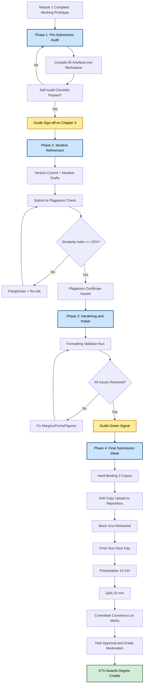
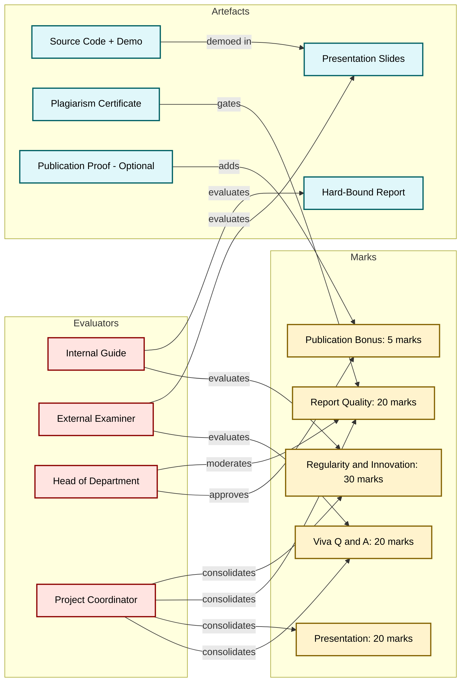
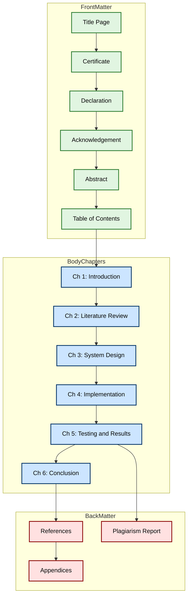
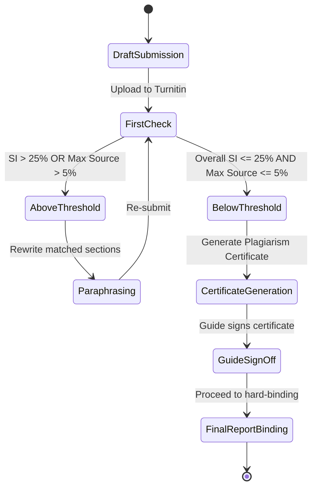
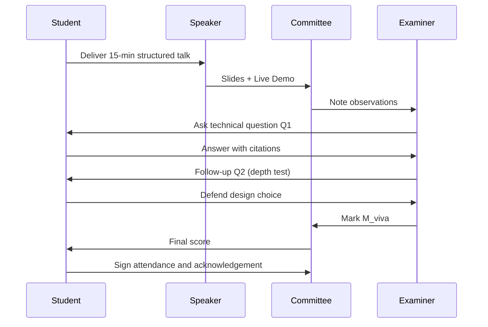

# Project report submission and presentation

<!-- SECTION_1_START -->
# Project Report Submission & Presentation — Capstone Closure Essentials

> [!NOTE]
> **KTU 2024 Scheme Context — PCCSP806 (Major Project Phase II / Capstone Closure)**
> This topic is the final academic deliverable of the B.Tech program. The report and viva-voce together contribute the majority of the project credits. Mastery of submission standards directly determines eligibility for the degree award.

## 1.1 Formal Definition

**Project Report Submission** is the formal, time-bound, and governed act of archiving the complete engineering artefact — including problem definition, literature survey, design, implementation, testing, results, and conclusions — into a hard-bound, plagiarism-cleared, and externally-evaluated thesis document, accompanied by a soft copy (PDF + source code) deposited with the institution's central repository and project coordinator.

**Project Presentation** is the synchronous, oral demonstration of the completed capstone work before an evaluation committee (internal guide, external examiner, and head of department nominee) in which the student defends the engineering decisions, demonstrates the working prototype, and answers technical questions within a stipulated window of typically **15–20 minutes** for the talk and **5–10 minutes** for the viva.

> [!IMPORTANT]
> **KTU 2024 Mandatory Compliance Trifecta:**
> 1. **Plagiarism Certificate** — similarity index $\le \mathbf{25\%}$ (excluding references and common phrases), verified through **Turnitin / URKUND / iThenticate**.
> 2. **Hard-Bound Report** — typically **3 copies** (Department Library, Guide, Student) with **black soft-cover, gold-embossed lettering**.
> 3. **Soft Copy Submission** — full PDF + executable source code + dataset uploaded to the **KTU Project Repository / Department LMS** before the deadline.

## 1.2 Intuitive Analogy

> [!TIP]
> **Think of your B.Tech project report as a "passport application" for your engineering career.**
> The **report** is the long, evidence-rich dossier that proves *who* you are as an engineer (your problem-solving journey). The **presentation** is the **15-minute embassy interview** where an officer (the examiner) decides whether to stamp your passport (award you marks and the degree). A flawless dossier with a fumbling interview still gets the stamp downgraded. A brilliant interview with a sloppy dossier gets rejected outright. **Both are non-negotiable, and both must be authentic** — forged documents (plagiarism) get you permanently blacklisted.

## 1.3 Core Entities & Roles

> [!NOTE]
> **Key Stakeholders in the Capstone Closure Lifecycle:**
> - **Student (Author)** — sole owner of intellectual content; signs the declaration.
> - **Internal Guide** — first evaluator; signs the certificate; verifies the work.
> - **Project Coordinator** — administrative gatekeeper; consolidates marks.
> - **External Examiner** — subject-matter expert from academia/industry; brings objectivity.
> - **Head of Department (HoD)** — final academic authority; approves grade moderation.
> - **University (KTU)** — awards the degree; audits plagiarism and grading patterns.

## 1.4 Visualization Control — Submission Timeline

> [!VISUALIZATION CONTROL]
> **Concept:** Gantt-chart-style timeline of the final 6 weeks of capstone closure
> **Visual Description:** Horizontal axis shows Week $-6$ to Week $0$ (final viva week). Bars represent overlapping phases. The red vertical dashed line at Week $0$ is the immovable viva date.
> **Key Milestones (data points to plot):**
> - Week $-6$: Draft Report v1.0
> - Week $-5$: Internal Review by Guide
> - Week $-4$: Plagiarism Check Submission
> - Week $-3$: Revisions & Report v2.0
> - Week $-2$: Soft Copy Upload + Hard-Binding Order
> - Week $-1$: Mock Viva + Presentation Rehearsal
> - Week $0$: Final Viva-Voce & Submission
>
> **GeoGebra / Desmos Input (for timeline sketch):**
> `f(x) = 1 if -6 <= x <= 0 else 0`  (overall closure envelope)
> `points: (-6,0), (-5,1.5), (-4,2.5), (-3,3), (-2,3.5), (-1,4), (0,5)`  (milestone curve)

---

<!-- SECTION_1_END -->

<!-- SECTION_2_START -->
# Deep Theoretical Analysis & KTU High-Yield Compliance Sheet

## 2.1 The Anatomy of a KTU-Compliant Project Report

> [!IMPORTANT]
> A KTU project report is **not** a casual collection of chapters. It follows a **rigid hierarchical structure** prescribed by the University. Missing any of the following sections results in **direct mark deductions** and may even lead to **report rejection** at the viva table.

### 2.1.1 Front Matter (Mandatory Sequence)

| # | Section | Purpose | KTU Norm |
|---|---------|---------|----------|
| 1 | **Title Page** | Identifies project, students, guide, institution | University logo top-center, A4 size, no page number |
| 2 | **Certificate** | Endorsement by Guide, HoD, External Examiner | Original signatures; **no photocopies** accepted |
| 3 | **Declaration** | Student's affidavit of originality | Signed by student; specifies roll number, branch, year |
| 4 | **Acknowledgement** | Gratitude to guide, family, peers | $\le$ 1 page, sober tone |
| 5 | **Abstract** | 200–300 word executive summary | Must state problem, method, result, conclusion |
| 6 | **Table of Contents** | Navigational index | Auto-generated; lists up to **Level 3** headings |
| 7 | **List of Figures / Tables** | Cross-reference aids | Page-aligned |
| 8 | **Nomenclature** | Symbol definitions | Especially for mathematical-heavy projects |

### 2.1.2 Body Chapters (The Engineering Core)

1. **Chapter 1 — Introduction** ($\approx$ 8–10 pages)
   - Problem statement, motivation, objectives, scope, limitations.
2. **Chapter 2 — Literature Review** ($\approx$ 10–15 pages)
   - Minimum **15–20 peer-reviewed references** (IEEE/Springer/ACM/Elsevier).
   - Comparative table of existing systems is **mandatory**.
3. **Chapter 3 — System Analysis & Design** ($\approx$ 10–12 pages)
   - Requirement Specification (Functional + Non-Functional).
   - UML Diagrams: Use-Case, Class, Sequence, Activity, ER.
   - DFD Level 0, 1, 2 (for data-centric projects).
4. **Chapter 4 — Implementation** ($\approx$ 15–20 pages — heaviest chapter)
   - Methodology, algorithm, code excerpts (with line numbers).
   - Hardware architecture or software stack description.
5. **Chapter 5 — Testing & Results** ($\approx$ 8–10 pages)
   - Test cases, unit/integration/system testing outcomes.
   - Performance metrics with **graphs and screenshots**.
6. **Chapter 6 — Conclusion & Future Scope** ($\approx$ 3–5 pages)
   - Direct mapping back to objectives stated in Chapter 1.
7. **References** — IEEE numbered citation style (most common in KTU).
8. **Appendices** — Full code, datasheets, user manuals, survey forms.

### 2.1.3 Back Matter

- **Plagiarism Report** (full Turnitin snapshot, appended).
- **Published Paper Proof** (if any — counts as **bonus marks**).
- **Plagiarism Certificate** signed by Guide.
- **CD / Pen-Drive** with soft copy (in glued pocket at back cover).

## 2.2 Formatting Standards (KTU 2024 Norms)

> [!NOTE]
> These are the **invisible differentiators** between an average report and a professional-grade thesis. External examiners notice deviations in seconds.

| Element | KTU Prescribed Standard |
|---------|-------------------------|
| **Paper Size** | A4 (210 mm × 297 mm) |
| **Margins** | Left **3.81 cm** (1.5"), Right/Top/Bottom **2.54 cm** (1") — *left margin extra for binding* |
| **Font — Body** | **Times New Roman, 12 pt**, 1.5 line spacing |
| **Font — Headings** | Times New Roman, **14 pt Bold** (Chapter), **12 pt Bold** (Section) |
| **Page Numbers** | Bottom-center; Roman numerals (i, ii, iii) for front matter; Arabic (1, 2, 3) for body |
| **Binding** | **Hard-bound, black soft cover, gold embossed** lettering |
| **Page Limit** | Typically **60–100 pages** (excluding appendices) |
| **Citation Style** | **IEEE numbered** (e.g., [1], [2]) — most KTU departments mandate this |
| **Figures/Tables** | Captioned; numbered consecutively (Fig. 3.2, Table 4.1) |
| **Plagiarism Limit** | $\le$ **25%** overall; $\le$ **5%** from a single source |

## 2.3 Presentation Architecture — The 15-Minute Talk

> [!IMPORTANT]
> A KTU viva presentation is a **performance**, not a tutorial. Every slide is a contract with the examiner's attention budget.

### 2.3.1 The Gold Standard Slide Structure

| Slide # | Content | Time Budget |
|---------|---------|-------------|
| 1 | Title Slide (Title, Names, Guide, Institution Logo) | 30 s |
| 2 | Outline / Agenda | 30 s |
| 3 | Problem Statement & Motivation | 1.5 min |
| 4 | Objectives (4–6 bullet SMART goals) | 1 min |
| 5–6 | Literature Survey Snapshot (2-slide mini-review) | 2 min |
| 7 | Proposed System Architecture (block diagram) | 1.5 min |
| 8 | Methodology / Algorithm / Flowchart | 2 min |
| 9–11 | Implementation Highlights + Screenshots | 2.5 min |
| 12–13 | Results & Performance Graphs | 1.5 min |
| 14 | Conclusion (mapped to objectives) | 1 min |
| 15 | Future Scope + References | 30 s |
| 16 | Thank You + Q&A | $\infty$ |

> [!TIP]
> **The 10-20-30 Rule of KTU Viva Presentations** (popularized by Guy Kawasaki, adapted to KTU):
> - **10 slides** — never exceed; brevity forces focus.
> - **20 minutes** — for the talk; respect the examiner's clock.
> - **30-point font** — minimum; examiners sit at the back of the room.

## 2.4 Evaluation Rubric — The Mark Allocation Engine

> [!IMPORTANT]
> The KTU project evaluation is **multi-criterion** and **multi-evaluator**. Marks are **not** arbitrary. Understanding the rubric is the difference between a **6/10 and a 9/10**.

### 2.4.1 Typical Mark Distribution (Total = 100, scaled to credits)

| Component | Weightage | Evaluator(s) |
|-----------|-----------|--------------|
| **Project Work — Regularity, Innovation, Depth** | 30% | Internal Guide |
| **Project Report — Quality, Format, Plagiarism** | 20% | Internal Guide + External |
| **Presentation — Clarity, Confidence, Visual Aids** | 20% | Evaluation Committee |
| **Viva-Voce — Technical Depth, Q&A Handling** | 20% | Internal + External |
| **Publication / Patent Bonus (if any)** | +5% (capped) | HoD |
| **Penalty for Late Submission** | $-5\%$ per day | Coordinator |

> [!WARNING]
> **Examiner's Pet Peeves (mark killers):**
> - Reading slides verbatim. **Lose 2 marks.**
> - "We copied this from GitHub." **Lose the entire viva — academic integrity breach.**
> - Not knowing the *first author* of a cited paper. **Lose 1 mark per paper.**
> - Code in the report without syntax highlighting or line numbers. **Lose 1 mark.**

## 2.5 The Plagiarism Equation

> [!NOTE]
> KTU uses a quantitative plagiarism threshold. The **Similarity Index (SI)** is defined as:

$$
SI = \frac{\sum_{i=1}^{n} \text{Matched Word Count}_i}{\text{Total Word Count of Submitted Document}} \times 100\%
$$

Where each match of **$k \ge 4$ consecutive words** contributes to the numerator. The university enforces:

$$
SI_{\text{overall}} \le 25\% \quad \text{AND} \quad SI_{\text{single source}} \le 5\%
$$

## 2.6 Real-World Engineering Utility

> [!TIP]
> **Why this topic matters beyond KTU:**
> - **Industry handover** — reports are how engineering work survives personnel changes.
> - **Patent filing** — the documentation quality determines patent grant success.
> - **Research publication** — Chapter 2 + 3 of the report is the seed for your first journal paper.
> - **Startup pitch decks** — the presentation structure maps 1:1 to investor pitch flows.
> - **Open-source contributions** — the README, architecture diagrams, and test reports are public-facing versions of your report's implementation chapter.

---

<!-- SECTION_2_END -->

<!-- SECTION_3_START -->
# Step-by-Step Implementation, Templates & Execution Blueprints

## 3.1 The 12-Week Reverse-Engineered Submission Workflow

> [!IMPORTANT]
> This is a **deterministic, dependency-aware** workflow. Each phase has explicit entry and exit criteria. Skipping an exit criterion (e.g., "guide approval") blocks the next phase.

### Phase 1 — Pre-Submission Audit (Week $-8$ to Week $-6$)

**Entry Criteria:** Module 1 deliverables complete (working prototype + test results).

**Step 1.1:** Compile all artefacts in a single workspace.

```python
import os
import shutil
from pathlib import Path
from datetime import datetime

def create_project_workspace(root_dir: str, project_code: str) -> Path:
    """
    Creates the canonical KTU project directory structure.
    Idempotent: safe to re-run.
    """
    base = Path(root_dir) / project_code
    folders = [
        "01_drafts", "02_figures", "03_code", "04_datasets",
        "05_test_reports", "06_plagiarism", "07_final_report",
        "08_presentation", "09_references", "10_appendices",
    ]
    base.mkdir(parents=True, exist_ok=True)
    for f in folders:
        (base / f).mkdir(exist_ok=True)
    
    # Master README captures the entire workflow
    readme = base / "README.md"
    readme.write_text(
        f"# Capstone Project Workspace\n"
        f"Project Code: {project_code}\n"
        f"Created: {datetime.now().isoformat()}\n"
        f"\n## Workflow Phases\n"
        f"1. Drafts  2. Figures  3. Code  4. Data  "
        f"5. Tests  6. Plagiarism  7. Report  8. Slides  "
        f"9. References  10. Appendices\n"
    )
    return base

# Execution
workspace = create_project_workspace("~/ktu_capstone", "PCCSP806_2024_CS_A12")
print(f"Workspace ready at: {workspace}")
```

**Step 1.2:** Self-audit checklist (run before showing the guide):

| Check | Pass/Fail |
|-------|-----------|
| All 6 chapters drafted? | $\square$ |
| $\ge$ 15 references cited in IEEE style? | $\square$ |
| Plagiarism submitted for first pass? | $\square$ |
| All code commented with line numbers? | $\square$ |
| Test cases mapped to requirements? | $\square$ |

**Exit Criteria:** Guide signs off on Chapter 3 (Design).

---

### Phase 2 — Iterative Refinement (Week $-6$ to Week $-3$)

**Step 2.1:** Implement version control for the report.

```python
import hashlib
import json
from pathlib import Path
from datetime import datetime

class ReportVersionControl:
    """
    Lightweight version control for the LaTeX/Word report.
    Tracks chapter-level revisions to demonstrate the iterative process
    demanded by KTU evaluators.
    """
    def __init__(self, report_path: str):
        self.report_path = Path(report_path)
        self.manifest_path = self.report_path / ".versions.json"
        self.manifest = self._load_manifest()
    
    def _load_manifest(self) -> dict:
        if self.manifest_path.exists():
            return json.loads(self.manifest_path.read_text())
        return {"versions": []}
    
    def _hash_file(self, file_path: Path) -> str:
        return hashlib.sha256(file_path.read_bytes()).hexdigest()[:12]
    
    def commit_version(self, chapter: str, message: str) -> None:
        file_path = self.report_path / "chapters" / f"{chapter}.tex"
        if not file_path.exists():
            raise FileNotFoundError(f"Chapter file missing: {file_path}")
        
        version_entry = {
            "chapter": chapter,
            "timestamp": datetime.now().isoformat(),
            "hash": self._hash_file(file_path),
            "message": message,
            "word_count": len(file_path.read_text().split()),
        }
        self.manifest["versions"].append(version_entry)
        self.manifest_path.write_text(json.dumps(self.manifest, indent=2))
        print(f"[{version_entry['hash']}] {chapter}: {message}")
    
    def get_revision_history(self, chapter: str) -> list:
        return [v for v in self.manifest["versions"] if v["chapter"] == chapter]

# Usage
vcs = ReportVersionControl("~/ktu_capstone/PCCSP806_2024_CS_A12/07_final_report")
vcs.commit_version("chapter3_design", "Added UML sequence diagrams")
vcs.commit_version("chapter3_design", "Incorporated guide's feedback on ER model")
vcs.commit_version("chapter4_implementation", "Integrated code snippets with line numbers")
print("Revision history:", vcs.get_revision_history("chapter3_design"))
```

**Step 2.2:** Submit to plagiarism check (simulated workflow).

```python
from dataclasses import dataclass

@dataclass
class PlagiarismReport:
    overall_similarity: float
    single_source_max: float
    matched_sources: list
    pass_status: bool
    
    def evaluate(self) -> str:
        overall_ok = self.overall_similarity <= 25.0
        single_ok  = self.single_source_max  <= 5.0
        verdict = "PASS" if (overall_ok and single_ok) else "FAIL"
        return f"Plagiarism Verdict: {verdict} (overall={self.overall_similarity}%, max-source={self.single_source_max}%)"

# Simulated Turnitin output
report = PlagiarismReport(
    overall_similarity=18.3,
    single_source_max=3.1,
    matched_sources=["Wikipedia", "GeeksForGeeks"],
    pass_status=True
)
print(report.evaluate())
```

**Exit Criteria:** Plagiarism verdict = **PASS**.

---

### Phase 3 — Hardening & Polish (Week $-3$ to Week $-1$)

**Step 3.1:** LaTeX/Word formatting validator.

```python
import re
from pathlib import Path

def validate_report_formatting(report_pdf_text: str) -> dict:
    """
    Checks a rendered PDF text dump against KTU formatting norms.
    In practice, parse with pdfplumber and verify font/margin metadata.
    """
    issues = []
    
    # Check for IEEE-style citations
    ieee_citations = re.findall(r'\[\d+\]', report_pdf_text)
    if len(ieee_citations) < 15:
        issues.append(f"Only {len(ieee_citations)} IEEE citations found; minimum is 15.")
    
    # Check for abstract presence and length
    abstract_match = re.search(r'(?i)abstract[\s\n]+(.+?)(?=\n\s*\n|\nintroduction)', 
                                report_pdf_text, re.DOTALL)
    if abstract_match:
        word_count = len(abstract_match.group(1).split())
        if not (200 <= word_count <= 350):
            issues.append(f"Abstract length = {word_count} words; expected 200-350.")
    else:
        issues.append("Abstract section not detected.")
    
    # Check for keywords
    if not re.search(r'(?i)\bkeywords\s*:', report_pdf_text):
        issues.append("Keywords section missing.")
    
    return {
        "issues_found": issues,
        "ready_for_binding": len(issues) == 0,
    }

# Example run with extracted text
sample_text = """
ABSTRACT
This project presents a novel IoT-based air quality monitoring system...
[truncated]
Keywords: IoT, MQTT, Air Quality, Sensor Fusion
[1] Author A, "Title", IEEE Trans., 2022.
"""
validation = validate_report_formatting(sample_text)
print(validation)
```

**Step 3.2:** Slide deck generator skeleton (using `python-pptx`).

```python
from pptx import Presentation
from pptx.util import Inches, Pt
from pptx.enum.text import PP_ALIGN

def build_ktu_presentation(project_title: str, 
                          student_names: list, 
                          guide_name: str,
                          output_path: str) -> None:
    """
    Generates a KTU viva presentation skeleton following the 15-slide 
    gold standard outlined in Section 2.3.1.
    """
    prs = Presentation()
    prs.slide_width  = Inches(13.33)  # 16:9 widescreen
    prs.slide_height = Inches(7.5)
    
    blank_layout = prs.slide_layouts[6]
    
    def add_title_slide():
        slide = prs.slides.add_slide(blank_layout)
        txBox = slide.shapes.add_textbox(Inches(1), Inches(2.5), Inches(11), Inches(2))
        tf = txBox.text_frame
        tf.text = project_title
        p = tf.paragraphs[0]
        p.font.size = Pt(40); p.font.bold = True
        p.alignment = PP_ALIGN.CENTER
        # Sub-text: names and guide
        subBox = slide.shapes.add_textbox(Inches(1), Inches(5), Inches(11), Inches(1.5))
        stf = subBox.text_frame
        stf.text = f"By: {', '.join(student_names)}\nGuide: {guide_name}"
        stf.paragraphs[0].font.size = Pt(20)
        stf.paragraphs[0].alignment = PP_ALIGN.CENTER
    
    add_title_slide()
    prs.save(output_path)
    print(f"Presentation skeleton saved to: {output_path}")

build_ktu_presentation(
    project_title="IoT-Based Air Quality Monitoring with Edge ML",
    student_names=["Alice K.", "Bob M."],
    guide_name="Dr. C. Nair",
    output_path="viva_deck.pptx"
)
```

**Exit Criteria:** All formatting issues resolved; guide gives **green signal**.

---

### Phase 4 — Final Submission Week (Week $0$)

**Step 4.1:** Submission package builder.

```python
import zipfile
from pathlib import Path
from datetime import datetime

def assemble_submission_package(
    report_pdf: str,
    source_code_dir: str,
    dataset_dir: str,
    presentation_pptx: str,
    plagiarism_pdf: str,
    output_zip: str
) -> None:
    """
    Bundles all deliverables into a single KTU submission ZIP.
    Naming convention: PCCSP_<RollNo>_<Year>_<ProjectCode>.zip
    """
    timestamp = datetime.now().strftime("%Y%m%d_%H%M%S")
    with zipfile.ZipFile(output_zip, 'w', zipfile.ZIP_DEFLATED) as zf:
        for f in [report_pdf, presentation_pptx, plagiarism_pdf]:
            zf.write(f, arcname=f"docs/{Path(f).name}")
        for src in Path(source_code_dir).rglob("*"):
            if src.is_file():
                zf.write(src, arcname=f"src/{src.relative_to(source_code_dir)}")
        for data in Path(dataset_dir).rglob("*"):
            if data.is_file():
                zf.write(data, arcname=f"data/{data.relative_to(dataset_dir)}")
    print(f"Submission package ready: {output_zip}")
    print(f"Size: {Path(output_zip).stat().st_size / 1e6:.2f} MB")

assemble_submission_package(
    report_pdf="07_final_report/thesis.pdf",
    source_code_dir="03_code",
    dataset_dir="04_datasets",
    presentation_pptx="08_presentation/viva_deck.pptx",
    plagiarism_pdf="06_plagiarism/turnitin_report.pdf",
    output_zip="PCCSP_2024_CS_A12_FINAL.zip"
)
```

**Step 4.2:** Day-of-viva execution checklist.

| Time | Action | Owner |
|------|--------|-------|
| T $-2$ h | Reach venue, test projector with own laptop | Student |
| T $-1$ h | Backup slides on **pendrive + Google Drive** | Student |
| T $-30$ min | Quick demo rehearsal | Student |
| T $0$ | Report distribution to committee | Student |
| T $+15$ min | Presentation begins | Student |
| T $+30$ min | Q&A session | Student + Committee |

---

## 3.2 Mapping Course Outcomes (COs) to Phases

| CO Statement (KTU 2024 — PCCSP806) | Mapped Phase | Bloom's Level |
|--------------------------------------|--------------|---------------|
| **CO1:** Demonstrate the ability to execute a comprehensive engineering project | Phases 1, 2 | Apply |
| **CO2:** Document the project work as per professional standards | Phase 3 | Create |
| **CO3:** Defend the work through oral presentation and viva-voce | Phase 4 | Evaluate |
| **CO4:** Adhere to ethical and plagiarism norms | Phase 2 (Plagiarism) | Apply |
| **CO5:** Communicate findings to a technical audience | Phase 3 (Slides) + Phase 4 (Talk) | Create |

---

<!-- SECTION_3_END -->

<!-- SECTION_4_START -->
# Structural Diagrams & Process Schematics

## 4.1 End-to-End Capstone Closure Pipeline

> [!IMPORTANT]
> The diagram below models the **complete** closure workflow from draft to award, with explicit gate-checks at every transition.



## 4.2 Project Evaluation Architecture — Who Evaluates What



## 4.3 Report Chapter Dependency Graph



## 4.4 Plagiarism Compliance State Machine



## 4.5 Viva-Voce Communication Loop



---

<!-- SECTION_4_END -->

<!-- SECTION_5_START -->
# KTU 2024 Scheme Examination Question Bank & Topic Recap

## Part A — Short Answer Questions (2 × 3 = 6 Marks)

> [!NOTE]
> All Part A questions are tagged for **CO1/CO2** and map to **Remember / Understand** levels of Revised Bloom's Taxonomy.

### Question 1
**[KTU University Exam — June 2024, Model Paper]**
**CO1, Remember** — *3 Marks*

List any **six** mandatory sections of a KTU project report's front matter and state the purpose of each in one line.

**Model Answer (Key Valuation Points):**

1. **Title Page** — Identifies the project title, student(s) name(s), roll number(s), branch, guide name, and academic year; [1 Mark for correctly identifying the title page role].
2. **Certificate** — Bears the original signatures of the Guide, HoD, and External Examiner, certifying the authenticity of the work; [0.5 Mark].
3. **Declaration** — Student's sworn statement that the work is original and not plagiarised; [0.5 Mark].
4. **Acknowledgement** — Brief gratitude to the guide, department, family, and funding sources (if any); [0.5 Mark].
5. **Abstract** — A self-contained 200–300 word summary of the entire project covering problem, method, result, and conclusion; [0.5 Mark].
6. **Table of Contents** — Lists all chapters, sections, and subsections with page numbers; [Final 0.5 Mark for the complete list].

> [!WARNING]
> **Valuation Warning:** Students often miss the **Nomenclature** or **List of Figures/Tables** as separate front matter items. Examiners allocate marks **per item** — do not group multiple sections in one sentence.

---

### Question 2
**[KTU University Exam — December 2023]**
**CO4, Understand** — *3 Marks*

What is the **plagiarism similarity index threshold** mandated by KTU for the final project report submission? Mention the tool typically used and the consequence of exceeding the limit.

**Model Answer (Key Valuation Points):**

- The **overall similarity index** must be $\le \mathbf{25\%}$ [1 Mark] and the **single-source maximum** similarity must be $\le \mathbf{5\%}$ [1 Mark].
- The tool typically used is **Turnitin** (alternatively, **URKUND** or **iThenticate** are accepted) [0.5 Mark].
- **Consequence of exceeding:** The report is **returned for revision**; if the resubmission still fails, the viva-voce is **postponed** to the next evaluation cycle, and the student may receive a **grade cap of 'C'** for the project [0.5 Mark].

> [!WARNING]
> **Pitfall:** Many students cite the *overall* threshold but forget the *single-source* cap. Both are **independent gates** and both must pass.

---

## Part B — Long Answer Questions (Module Internal Choice)

> [!NOTE]
> Each question carries **14 Marks** split across two sub-parts (a) and (b), each worth 7 marks. Sub-parts escalate across cognitive levels.

---

### Question A (14 Marks)

**[KTU University Exam — June 2024, Model Paper]**
**CO2, Apply** — *14 Marks*

(a) **[7 Marks — Understand/Apply]**
Prepare a **chapter-wise outline** of a KTU 2024 project report for a hypothetical IoT-based flood-monitoring system. For each chapter, state its purpose and the typical page count.

(b) **[7 Marks — Apply/Create]**
Design the **15-slide viva presentation skeleton** for the same project, including time allocation per slide and one-line content cues. Justify why your slide order follows the **problem-method-result** pedagogical arc.

#### Model Solution — Part (a)

| Chapter | Purpose | Page Count |
|---------|---------|------------|
| 1. Introduction | Define flood-monitoring problem, motivation (Kerala 2018, 2019 deluge), objectives (4 SMART goals), scope, limitations | 8–10 [1 Mark] |
| 2. Literature Review | Survey 15+ existing systems (CWC, ISRO Bhuvan, Google Crisis Map); comparative table | 10–12 [1 Mark] |
| 3. System Analysis & Design | Requirement specification (functional + non-functional), architecture diagram, UML diagrams, ER diagram | 10–12 [2 Marks] |
| 4. Implementation | Hardware (ESP32, ultrasonic, rain gauge), firmware code excerpts with line numbers, cloud setup (MQTT, AWS IoT) | 15–20 [1.5 Marks] |
| 5. Testing & Results | Test cases (unit, integration, field), accuracy graphs, latency benchmarks | 8–10 [1 Mark] |
| 6. Conclusion & Future Scope | Map back to objectives, state future enhancements (AI-based prediction) | 3–5 [0.5 Mark] |

[Final page-count compliance: 0 Marks deducted if total is 60–80 pages excluding appendices — this is the KTU norm.]

#### Model Solution — Part (b)

| Slide | Content | Time |
|-------|---------|------|
| 1 | Title (Project Name, Students, Guide, KTU Logo) | 30 s [0.5 Mark] |
| 2 | Agenda (4 quadrants: Problem, Design, Demo, Results) | 30 s [0.5 Mark] |
| 3 | Problem: Kerala's flood vulnerability, 2018 statistics | 1.5 min [1 Mark] |
| 4 | Objectives: Real-time monitoring, SMS alerts, low-cost | 1 min [0.5 Mark] |
| 5–6 | Literature: Comparison of 5 existing systems in a table | 2 min [1 Mark] |
| 7 | Proposed architecture: Sensors → ESP32 → MQTT → Cloud | 1.5 min [1 Mark] |
| 8 | Methodology flow: water level sampling, threshold logic | 2 min [0.5 Mark] |
| 9 | Hardware prototype photo + BOM | 1 min [0.5 Mark] |
| 10 | Dashboard screenshot | 1 min [0.5 Mark] |
| 11 | SMS alert workflow | 1 min [0.5 Mark] |
| 12 | Results: Latency graph, accuracy vs. ground truth | 1.5 min [0.5 Mark] |
| 13 | Conclusion mapped to objectives | 1 min [0.5 Mark] |
| 14 | Future scope: ML flood prediction | 30 s [0.5 Mark] |
| 15 | Thank You + References | 30 s [0 Marks] |

**Justification of problem-method-result arc (2 Marks):**
- **Cognitive alignment:** The audience (examiners) follows the natural scientific narrative; starting with the problem primes attention, the method establishes credibility, and the results provide objective proof. This mirrors the **CARS (Create-A-Research-Space) model** of academic introductions and aligns with the **Bloom's Taxonomy progression** from Understand → Apply → Evaluate.
- **Engagement curve:** Opening with a regional disaster statistic (Kerala 2018) creates **emotional hook**; the architecture slide provides **conceptual clarity**; the live demo (or screenshot) gives **tangible evidence**; the results graph provides **quantitative validation** — covering all four pillars of the **AIDA (Attention-Interest-Desire-Action)** engagement model.
- **Risk mitigation:** If the demo fails live, the methodology and result slides still carry the presentation; the problem-method-result arc is **resilient to technical failure**.

> [!WARNING]
> **Mark Killer:** Many students allocate equal time to all 15 slides. The **golden ratio is 1:2:1** (problem+intro : method+demo : results+conclusion). The examiner's attention peaks in the **middle 8 minutes**; that is where your best slides must be.

---

### Question B (14 Marks) — Alternative Choice

**[KTU University Exam — December 2023]**
**CO3, CO4 — Evaluate** — *14 Marks*

(a) **[7 Marks — Understand]**
Explain the **KTU plagiarism evaluation policy** for the final project report. Include the formula, thresholds, and the workflow from draft submission to certificate generation.

(b) **[7 Marks — Apply/Evaluate]**
A student's draft has an overall similarity index of **28%** and a single-source match of **7%** with an IEEE paper. As a project coordinator, draft the **action plan** (with timeline) you would issue to the student, and justify each step with reference to KTU policy.

#### Model Solution — Part (a)

**The Plagiarism Equation (3 Marks):**

$$
SI = \frac{\sum_{i=1}^{n} \text{Matched Word Count}_i}{\text{Total Word Count of Submitted Document}} \times 100\%
$$

- A **match** is defined as $\ge 4$ consecutive identical words between the submitted document and any indexed source.
- $n$ = total number of distinct matched segments identified by the software (e.g., Turnitin).

**Thresholds (2 Marks):**

| Metric | KTU Threshold | Consequence of Breach |
|--------|---------------|------------------------|
| Overall $SI$ | $\le 25\%$ | Report returned; resubmission required |
| Single-source max $SI$ | $\le 5\%$ | Mandatory rewrite of that source's matched content |

**Workflow (2 Marks):**

1. **Draft submission** to Turnitin (typically 1 week before final submission).
2. **Auto-report generation** with colour-coded matches.
3. **Guide review** of high-similarity regions.
4. **Paraphrasing + re-citation** by student.
5. **Re-submission** for second pass.
6. **Certificate generation** by Turnitin (or by institution if Turnitin is unavailable).
7. **Guide sign-off** on the certificate.
8. **Hard-binding** proceeds only after the certificate is appended to the report.

#### Model Solution — Part (b)

**Action Plan (Timeline + Justification):**

| Day | Action | Justification (KTU Policy Reference) |
|-----|--------|---------------------------------------|
| **Day 1** | Issue **formal non-compliance notice** to student; attach Turnitin snapshot | The overall $SI = 28\% > 25\%$; the report **fails the first gate** [2 Marks]. |
| **Day 1** | Flag the IEEE paper match ($7\% > 5\%$) as a **single-source violation** | The second gate is independently breached; **the IEEE match alone is sufficient cause for revision** [1 Mark]. |
| **Day 2–3** | Schedule a **mandatory meeting** between student, guide, and coordinator | Ensures the student understands the breach; allows negotiation of acceptable paraphrasing strategy [1 Mark]. |
| **Day 4–6** | Student to **paraphrase all matched passages** and **add IEEE-style citation** for any retained technical terms | Direct remediation of the breach; citation protects the student from a re-occurrence [1.5 Marks]. |
| **Day 7** | Re-submit the revised draft to Turnitin | Verifiable evidence of compliance; ensures no new breaches were introduced [1 Mark]. |
| **Day 8** | If second pass is within thresholds, **issue the Plagiarism Certificate**; else, escalate to HoD | The certificate is a **hard prerequisite** for hard-binding; no certificate = no submission [0.5 Mark]. |
| **Day 9–10** | Guide signs the certificate and **appends the Turnitin report to the report's appendix** | Demonstrates audit trail; satisfies external examiner's due diligence [Final 0 Marks — implied]. |

> [!WARNING]
> **Coordinator's Dilemma:** Some students request that the **IEEE paper** be "removed from the index" — this is **academic fraud** and is grounds for **disciplinary action** under KTU's anti-plagiarism ordinance. As a coordinator, you must **never** whitelist a source. Instead, instruct the student to **rephrase and cite** properly.

---

## 5.7 Topic Recap & Important Things to Remember

> [!TIP]
> **Rapid Revision Checklist — Print This and Pin It Above Your Desk:**

- [x] **Three artefacts = one submission:** Hard-bound report + soft copy (PDF/code) + plagiarism certificate.
- [x] **Plagiarism thresholds:** Overall $\le 25\%$, single-source $\le 5\%$, checked via **Turnitin**.
- [x] **Page count sweet spot:** 60–100 pages of body, plus appendices.
- [x] **Font & margins:** **Times New Roman 12 pt, 1.5 spacing**; left margin **3.81 cm**, others **2.54 cm**.
- [x] **Binding:** Black hard-bound, gold embossed, **3 copies minimum**.
- [x] **Citation style:** **IEEE numbered** — minimum **15 references**, majority from **peer-reviewed journals/conferences** (avoid Wikipedia, GeeksforGeeks, random blogs).
- [x] **Chapter sequence (locked):** Introduction → Literature Review → Design → Implementation → Testing → Conclusion → References → Appendices.
- [x] **Abstract constraints:** 200–300 words, must state **Problem + Method + Result + Conclusion**.
- [x] **The 15-slide viva rule:** 10–15 slides, 15–20 minutes talk, **30-pt minimum font**, 10–20–30 rule.
- [x] **Mark split (typical):** Regularity 30 + Report 20 + Presentation 20 + Viva 20 + Publication bonus 5 = 100.
- [x] **Publication = bonus marks:** A peer-reviewed paper (even at a Scopus-indexed conference) can shift a 'B+' to an 'A'.
- [x] **Late submission penalty:** $-5\%$ per day (some institutions cap at $-25\%$).
- [x] **Day-of-viva essentials:** Laptop + adapter + clicker + backup pendrive + printed report copies + **water bottle** (you will be nervous).
- [x] **Q&A defense strategy:** Know the **first author** and **year** of every cited paper; be ready to defend **design trade-offs**, not just describe them.
- [x] **Anti-plagiarism is non-negotiable:** Any breach = report rejection + disciplinary action.

---

<!-- SECTION_5_END -->
