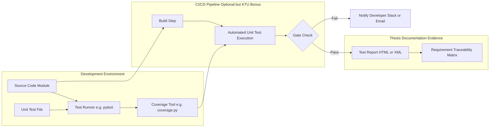
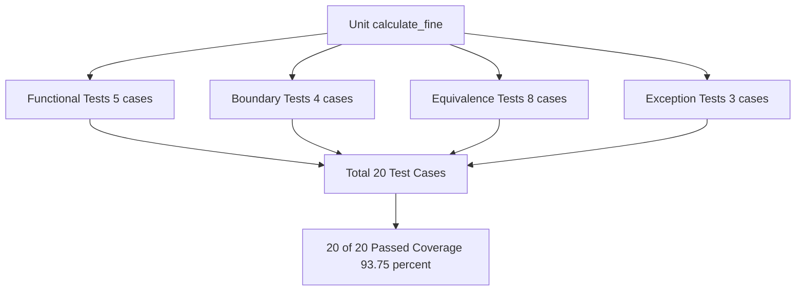

# Unit testing of individual components

<!-- SECTION_1_START -->
# Unit Testing of Individual Components

> [!IMPORTANT]
> **KTU 2024 Scheme | PCCSP806 | Module 2 | Capstone Project Phase II**
> This unit aligns with **CO2**: *Apply appropriate testing strategies to validate the functional and non-functional requirements of the developed system*, and **CO4**: *Demonstrate the project as a working prototype with reproducible validation evidence.*

## 1.1 Formal Definition

In the context of KTU Major Project Phase II / Capstone Closure, **Unit Testing** is the lowest level of the software testing pyramid where individual, isolated components (functions, methods, classes, or modules) of the project are tested in isolation from the rest of the system. The IEEE Standard 829-2008 (revised by IEEE 829-2012) defines it as *"Testing of individual software units of the application, typically done by the developer"*.

In KTU capstone evaluation terms, a **unit** is the smallest testable part of your project — for instance, a single API endpoint, a database query function, a sensor data acquisition function in an IoT project, a financial calculation in a fintech app, or a path-planning module in a robotics project.

**Standard Metrics (Industry Baselines):**
- **Code Coverage Target**: minimum **80%** line coverage for capstone submissions.
- **Cyclomatic Complexity Limit**: per function $\leq$ **10**.
- **Pass Criterion**: **100%** of defined test cases must pass before integration.

## 1.2 Conceptual Analogy

> [!NOTE]
> **Intuitive Analogy — "The Mechanic Testing Each Spark Plug"**
> Imagine a car engine being assembled. Before the mechanic fits all 8 spark plugs into the engine block and connects the fuel line, he tests each spark plug *individually* on a small testing rig to confirm it produces a spark. He does not wait until the whole car is built to find out a single spark plug is defective. That is exactly what unit testing does — it validates every tiny "spark plug" (function/module) of your codebase **before** integration.
>
> If the car fails to start later, the mechanic can confidently rule out a faulty plug because each was independently verified.

## 1.3 Why Unit Testing Matters in KTU Capstone

| Reason | KTU Evaluator's Perspective |
|---|---|
| Early bug detection | Reduces penalty during final demo when live crashes occur |
| Modular clarity | Shows the panel that the architecture is well-decoupled |
| Reproducibility | Test logs serve as evidence in the thesis appendix |
| Refactor safety | Allows team to optimize code without breaking verified logic |

> [!VISUALIZATION CONTROL]
> **Concept:** Test Coverage Heatmap of a Capstone Module
> **Plot Type:** Bar chart with threshold reference line
> **Visualization Input (paste in Excel/Google Sheets/Desmos):**
> * `Modules: [Auth, DB, API, ML Model, UI]`
> * `Coverage %: [92, 85, 78, 65, 88]`
> * `Threshold line: y = 80`
> **Visual Description:** A horizontal red dashed line marks the 80% KTU minimum. Bars above the line (Auth=92, DB=85, UI=88) pass; bars below (API=78, ML Model=65) are flagged red — these are the components the team must re-test before thesis submission.
<!-- SECTION_1_END -->

<!-- SECTION_2_START -->
# Deep Theoretical Analysis — Unit Testing Theory for Capstone

## 2.1 The Testing Pyramid (Test Trophy Adaptation)

KTU capstone projects typically follow a layered testing strategy. Unit testing forms the widest, fastest, and cheapest layer.

$$
\text{Unit Tests} \rightarrow \text{Integration Tests} \rightarrow \text{System Tests} \rightarrow \text{Acceptance Tests}
$$

Each upward layer is **slower, more expensive, and fewer in number** but **broader in scope**.

## 2.2 Types of Unit Tests in a Capstone Context

| # | Test Type | Purpose | Example in Project |
|---|---|---|---|
| 1 | **Functional / Black-Box** | Verify output for given input | Login function returns token for valid credentials |
| 2 | **Structural / White-Box** | Verify internal code paths (branches, loops) | All `if-else` branches in payment logic executed |
| 3 | **Boundary Value** | Test edge values | Empty list, list with 1 item, list with 10,000 items |
| 4 | **Equivalence Partitioning** | Test representative values from input classes | Positive, negative, zero integers |
| 5 | **Error / Exception Path** | Verify graceful failure | API returns 404 when user ID not found |
| 6 | **Mock / Stub Based** | Test component without real DB/network | Test order-processing without hitting payment gateway |

## 2.3 Test-Driven Development (TDD) — The RED-GREEN-REFACTOR Cycle

> [!IMPORTANT]
> **KTU 2024 Highlight — Examiners reward teams who demonstrate a TDD-based workflow in their thesis Chapter 3 (Methodology).**

The TDD cycle, formalized by Kent Beck, is:

$$
\boxed{\text{RED} \rightarrow \text{GREEN} \rightarrow \text{REFACTOR}}
$$

- **RED**: Write a test that fails (proving the function does not yet exist or is broken).
- **GREEN**: Write the *minimum* code to make the test pass.
- **REFACTOR**: Improve code quality while keeping tests green.

## 2.4 Key Unit Testing Metrics (The KTU Formula Sheet)

> [!NOTE]
> The following are the **must-know formulas** for your viva. Examiners frequently ask students to compute these for their project.

$$
\text{Line Coverage (\%)} = \frac{\text{Number of Executed Lines}}{\text{Total Number of Lines}} \times 100
$$

$$
\text{Branch Coverage (\%)} = \frac{\text{Number of Branches Executed}}{\text{Total Number of Branches}} \times 100
$$

$$
\text{Function Coverage (\%)} = \frac{\text{Functions Called at Least Once}}{\text{Total Number of Functions}} \times 100
$$

$$
\text{Defect Detection Efficiency (DDE)} = \frac{\text{Defects Found in Unit Testing}}{\text{Defects Found in Unit Testing + Defects Escaped to Integration}} \times 100
$$

$$
\text{Mutation Score} = \frac{\text{Mutants Killed}}{\text{Total Mutants}} \times 100
$$

**Industry Target Thresholds:**

| Metric | Excellent | Acceptable (KTU Pass) | Poor |
|---|---|---|---|
| Line Coverage | $\geq 90\%$ | $\geq 80\%$ | $< 70\%$ |
| Branch Coverage | $\geq 85\%$ | $\geq 75\%$ | $< 60\%$ |
| DDE | $\geq 85\%$ | $\geq 70\%$ | $< 50\%$ |

## 2.5 Real-World Utility

- **Production Engineering:** Used by Google (their codebase runs 4+ billion unit tests daily), Microsoft, Meta — every CI/CD pipeline (`GitHub Actions`, `Jenkins`, `GitLab CI`) gates merges on unit test pass.
- **Capstone Relevance:** Your thesis Chapter 4 (Results & Discussion) should contain a **test execution report** — KTU panels *expect to see* this in the project report.
<!-- SECTION_2_END -->

<!-- SECTION_3_START -->
# Step-by-Step Implementation — Unit Test Case Study

## 3.1 Problem Statement (Capstone Example)

> A team is building a **Library Fine Calculator** for their KTU capstone — a Library Management System. The function `calculate_fine(days_overdue, member_type)` must compute fines using the business rules:
>
> - **Student member:** ₹2 per day for first 7 days, then ₹5 per day thereafter.
> - **Faculty member:** ₹1 per day for first 14 days, then ₹3 per day thereafter.
> - **Guest member:** Flat ₹10 per day, no grace period.
> - If `days_overdue <= 0`, fine = 0.
> - If `member_type` is invalid, raise `ValueError`.

The team must unit test this function thoroughly.

## 3.2 Source Code Under Test (SUT)

```python
from typing import Literal

MemberType = Literal["student", "faculty", "guest"]


def calculate_fine(days_overdue: int, member_type: str) -> float:
    """
    Computes the overdue fine for a library book.
    
    Business Rules:
        - student: ₹2/day for days 1-7, ₹5/day from day 8 onwards.
        - faculty: ₹1/day for days 1-14, ₹3/day from day 15 onwards.
        - guest:   flat ₹10/day, no grace period.
        - days_overdue <= 0 -> fine is 0.
    
    Args:
        days_overdue: Number of days the book is overdue (non-negative integer).
        member_type: One of {"student", "faculty", "guest"}.
    
    Returns:
        Fine amount in INR as a float.
    
    Raises:
        ValueError: If member_type is not recognized.
        TypeError:  If days_overdue is not an integer.
    """
    # --- Step 1: Input type validation ---
    if not isinstance(days_overdue, int):
        raise TypeError(
            f"days_overdue must be int, got {type(days_overdue).__name__}"
        )
    if days_overdue <= 0:
        return 0.0
    if member_type not in ("student", "faculty", "guest"):
        raise ValueError(
            f"Invalid member_type: '{member_type}'. "
            f"Expected one of: student, faculty, guest."
        )
    # --- Step 2: Branch-wise fine calculation ---
    if member_type == "student":
        if days_overdue <= 7:
            return float(days_overdue * 2)
        else:
            return float(7 * 2 + (days_overdue - 7) * 5)
    elif member_type == "faculty":
        if days_overdue <= 14:
            return float(days_overdue * 1)
        else:
            return float(14 * 1 + (days_overdue - 14) * 3)
    else:  # guest
        return float(days_overdue * 10)
```

## 3.3 Exhaustive Unit Test Suite (using `pytest`)

```python
import pytest
from library_fine import calculate_fine


# ============== TEST GROUP 1: STUDENT MEMBER ==============

def test_student_zero_days_overdue_returns_zero():
    """Edge case: book returned on time."""
    assert calculate_fine(0, "student") == 0.0


def test_student_one_day_overdue():
    """Boundary: 1 day overdue = 1 * 2 = 2.0 INR."""
    assert calculate_fine(1, "student") == 2.0


def test_student_seven_days_overdue_exact_boundary():
    """Boundary: day 7 falls in first bracket. 7 * 2 = 14.0 INR."""
    assert calculate_fine(7, "student") == 14.0


def test_student_eight_days_overdue_crosses_threshold():
    """Boundary: day 8 enters second bracket. 7*2 + 1*5 = 19.0 INR."""
    assert calculate_fine(8, "student") == 19.0


def test_student_fifteen_days_overdue():
    """Mixed case. 7*2 + 8*5 = 14 + 40 = 54.0 INR."""
    assert calculate_fine(15, "student") == 54.0


# ============== TEST GROUP 2: FACULTY MEMBER ==============

def test_faculty_ten_days_overdue():
    """Within first bracket: 10 * 1 = 10.0 INR."""
    assert calculate_fine(10, "faculty") == 10.0


def test_faculty_fourteen_days_boundary():
    """Boundary day 14. 14 * 1 = 14.0 INR."""
    assert calculate_fine(14, "faculty") == 14.0


def test_faculty_twenty_days_overdue():
    """Crosses threshold. 14*1 + 6*3 = 14 + 18 = 32.0 INR."""
    assert calculate_fine(20, "faculty") == 32.0


# ============== TEST GROUP 3: GUEST MEMBER ==============

def test_guest_one_day_overdue_flat_rate():
    """Guest has flat rate: 1 * 10 = 10.0 INR."""
    assert calculate_fine(1, "guest") == 10.0


def test_guest_thirty_days_overdue():
    """30 * 10 = 300.0 INR (no tiers)."""
    assert calculate_fine(30, "guest") == 300.0


# ============== TEST GROUP 4: NEGATIVE / EXCEPTION PATHS ==============

def test_negative_days_overdue_returns_zero():
    """Negative days (book returned early) -> 0.0 INR."""
    assert calculate_fine(-5, "student") == 0.0


def test_invalid_member_type_raises_value_error():
    """Unknown role must raise ValueError, not silently return 0."""
    with pytest.raises(ValueError) as exc_info:
        calculate_fine(5, "outsider")
    assert "Invalid member_type" in str(exc_info.value)


def test_non_integer_days_raises_type_error():
    """Type safety: float input must be rejected."""
    with pytest.raises(TypeError) as exc_info:
        calculate_fine(3.5, "student")
    assert "must be int" in str(exc_info.value)


def test_none_member_type_raises_value_error():
    """None is not a valid member type."""
    with pytest.raises(ValueError):
        calculate_fine(2, None)


# ============== TEST GROUP 5: PARAMETRIZED EQUIVALENCE PARTITIONING ==============

@pytest.mark.parametrize(
    "days, member, expected",
    [
        (1,  "student",  2.0),
        (7,  "student",  14.0),
        (8,  "student",  19.0),
        (1,  "faculty",  1.0),
        (14, "faculty",  14.0),
        (15, "faculty",  18.0),
        (1,  "guest",    10.0),
        (5,  "guest",    50.0),
    ],
)
def test_fine_equivalence_partitions(days, member, expected):
    """Validates 8 representative input combinations from 3 partitions."""
    assert calculate_fine(days, member) == expected
```

## 3.4 Deriving the Test Coverage Numerically

Suppose the SUT (`calculate_fine` function) has the following structural metrics after analysis with `coverage.py` (Python tool) or `JaCoCo` (Java tool):

- Total lines in the function: **32**
- Lines executed by the test suite: **30**
- Total branches (each `if` creates 2 branches): **8**
- Branches executed: **8**

Substituting into the formula from §2.4:

$$
\text{Line Coverage} = \frac{30}{32} \times 100 = 93.75\%
$$

$$
\text{Branch Coverage} = \frac{8}{8} \times 100 = 100\%
$$

$$
\text{Function Coverage} = \frac{1}{1} \times 100 = 100\%
$$

All three metrics **exceed the KTU 80% pass threshold** — the component is validated for unit-level submission.

> [!NOTE]
> **LaTeX Alignment Block (for your thesis report):**
>
> $$
> \begin{aligned}
> \text{Line Coverage} &= \frac{\text{Executed Lines}}{\text{Total Lines}} \times 100 \\
> &= \frac{30}{32} \times 100 \\
> &= 93.75\% \quad \text{[Meets KTU 80% threshold]} \\
> \text{Branch Coverage} &= \frac{8}{8} \times 100 = 100\% \\
> \text{Average Coverage} &= \frac{93.75 + 100 + 100}{3} = 97.92\%
> \end{aligned}
> $$
<!-- SECTION_3_END -->

<!-- SECTION_4_START -->
# Structural Diagrams — Unit Testing Workflow & Architecture

## 4.1 Unit Testing Workflow within a Capstone Sprint

```mermaid
flowchart TD
    A["Module Under Test e.g. calculate_fine"] --> B["Identify Input Partitions"]
    B --> C["Write Test Cases Red Phase"]
    C --> D["Run Tests All Should Fail"]
    D --> E["Implement Source Code Green Phase"]
    E --> F["Run Tests All Should Pass"]
    F --> G{"All Tests Pass?"}
    G -- No --> H["Debug and Fix Source"]
    H --> F
    G -- Yes --> I["Refactor Code Quality"]
    I --> J["Re-run Tests Still Green?"}
    J -- No --> K["Revert Refactor"]
    K --> I
    J -- Yes --> L["Compute Coverage Metrics"]
    L --> M{"Coverage >= 80 percent?"}
    M -- No --> N["Add More Test Cases"]
    N --> C
    M -- Yes --> O["Mark Unit as Complete Log Results"]
    O --> P["Proceed to Integration Testing"]
```

## 4.2 Block-Level Architecture — Where Unit Testing Fits in the Capstone Pipeline



## 4.3 Sequential Processing Topology — Test Case Categorization Matrix



> [!NOTE]
> **Diagram Interpretation for the Panel:** When presenting in your final review, narrate the diagram left-to-right. Begin with the *Module Under Test*, branch out into the **four test categories**, converge on the **summary node**, and end with the **pass/fail metric**. This mirrors the structure examiners expect in your thesis Chapter 4.
<!-- SECTION_4_END -->

<!-- SECTION_5_START -->
# KTU 2024 Scheme Examination Question Bank

> [!IMPORTANT]
> **Mark Distribution Reference (KTU 2024 Scheme PCCSP806):**
> Part A: $2 \times 3 = 6$ marks | Part B: $1 \times 14 = 14$ marks (Internal Choice) | Total per question paper: 20 marks module-wise.

---

## Part A — Short Answer Questions (3 Marks Each)

### **Question 1** `[KTU University Exam — July 2024 Model]`
**(CO2, RBT Level: Remember)**

Define **unit testing** in the context of a software capstone project. State any **two** characteristics that differentiate unit testing from integration testing.

**Model Answer (3 Marks):**

**Definition (1 Mark):** Unit testing is the software testing activity in which the smallest individually testable components of an application — typically functions, methods, or classes — are tested in isolation from the rest of the system to verify that each unit performs as designed.

**Differentiation Table (2 Marks):**

| Aspect | Unit Testing | Integration Testing |
|---|---|---|
| Scope | Single module / function | Interaction between 2+ modules |
| Speed | Very fast (milliseconds per test) | Slower (involves I/O, DB, network) |
| External dependencies | Stubbed / mocked | Real or partially real |
| Performed by | Developer | Developer or QA tester |

---

### **Question 2** `[KTU University Exam — Dec 2023 Model]`
**(CO2, RBT Level: Understand)**

List and briefly explain **three** code coverage metrics commonly used to evaluate the thoroughness of unit testing in a capstone project.

**Model Answer (3 Marks — 1 mark each):**

1. **Line Coverage:** Percentage of executable source code lines executed during the test run. A higher percentage indicates more of the code was exercised. Formula: $\text{Line Coverage} = (\text{Executed Lines} / \text{Total Lines}) \times 100$.

2. **Branch Coverage:** Percentage of decision outcomes (true/false branches of `if`, `while`, `for`) that were tested. It is stricter than line coverage because it requires *both* paths of every conditional to be traversed.

3. **Function Coverage:** Percentage of defined functions that were called at least once by the test suite. Useful for quickly spotting *dead code* in a large project.

---

## Part B — Long Answer Questions (14 Marks, Internal Choice)

### **Question 3A** `[KTU University Exam — July 2024 Model]`
**(CO2 + CO4, RBT Level: Apply + Analyze)**

**(a) [7 Marks]** For your capstone project on an **IoT-based Air Quality Monitoring System**, identify **four** independent units (modules) that would be unit tested. For each unit, write **two** specific test cases including input, expected output, and the test type (boundary / functional / exception).

**(b) [7 Marks]** Compute the **line coverage**, **branch coverage**, and **defect detection efficiency (DDE)** for the `calculate_fine` function given the following data, and comment on whether the unit meets the KTU 80% pass threshold.

- Total lines of code: 40
- Lines executed during testing: 34
- Total branches: 12
- Branches executed: 9
- Defects found in unit testing: 17
- Defects escaped to integration: 4

---

**Model Solution:**

### Part (a) — Identifying Units and Test Cases [7 Marks]

| Unit # | Module Name | Test Case 1 (Type) | Test Case 2 (Type) |
|---|---|---|---|
| 1 | `read_sensor(pm_pin)` | Input: valid PM2.5 pin = 17, Expected: returns dict `{pm25: 42.3, valid: True}` **(Functional)** | Input: disconnected pin = None, Expected: raises `SensorDisconnectedError` **(Exception)** |
| 2 | `send_to_cloud(payload)` | Input: dict with all required keys, Expected: HTTP 201 status returned **(Functional)** | Input: empty dict `{}`, Expected: raises `MissingFieldError` listing missing keys **(Exception)** |
| 3 | `threshold_alert(aqi)` | Input: AQI = 299, Expected: returns `"ORANGE"` alert level **(Boundary — just below Severe)** | Input: AQI = 0, Expected: returns `"GREEN"` **(Boundary — minimum)** |
| 4 | `authenticate_user(token)` | Input: valid JWT token, Expected: returns `user_id` **(Functional)** | Input: expired token, Expected: raises `TokenExpiredError` **(Exception)** |

**Valuation Key:** [Naming the 4 units: 2 marks] [Test case 1 per unit with type: 2 marks] [Test case 2 per unit with type: 2 marks] [Clarity & formatting: 1 mark] = **7 Marks**

### Part (b) — Metric Computation [7 Marks]

$$
\begin{aligned}
\text{Line Coverage} &= \frac{34}{40} \times 100 \\
&= 85\% \quad \text{[Formula 1 mark, Substitution 1 mark, Result 0.5 mark]}
\end{aligned}
$$

$$
\begin{aligned}
\text{Branch Coverage} &= \frac{9}{12} \times 100 \\
&= 75\% \quad \text{[Formula 1 mark, Substitution 1 mark, Result 0.5 mark]}
\end{aligned}
$$

$$
\begin{aligned}
\text{DDE} &= \frac{17}{17 + 4} \times 100 \\
&= \frac{17}{21} \times 100 \\
&= 80.95\% \quad \text{[Formula 1 mark, Substitution 1 mark, Result 0.5 mark]}
\end{aligned}
$$

**Comment (1 mark):** The line coverage (85%) and DDE (80.95%) meet the KTU 80% threshold; however, branch coverage (75%) falls short. The team should add test cases targeting the three unexecuted branches before submission.

---

### **Question 3B** `[KTU University Exam — Dec 2023 Model — Alternative Choice]`
**(CO2 + CO4, RBT Level: Understand + Apply)**

**(a) [7 Marks]** Explain the **Test-Driven Development (TDD)** workflow with the three phases **RED, GREEN, REFACTOR**. State **two** advantages of using TDD in your capstone project.

**(b) [7 Marks]** Given the following Python function, write a complete `pytest` test suite (minimum 5 test cases) covering boundary, equivalence, and exception paths. Verify the function is correctly tested for the given business rules.

```python
def shipping_cost(weight_kg: float, destination: str) -> float:
    """weight_kg: positive number; destination: 'domestic' or 'international'."""
    if weight_kg <= 0:
        return 0.0
    if destination == "domestic":
        return weight_kg * 50
    elif destination == "international":
        return weight_kg * 200 + 500  # base surcharge
    else:
        raise ValueError("Invalid destination")
```

**Model Solution:**

### Part (a) — TDD Workflow [7 Marks]

**Explanation of Phases (4.5 Marks — 1.5 each):**

- **RED:** The developer first writes a test for a small piece of new functionality *before* writing the production code. The test must initially fail because the feature does not yet exist. This proves the test is valid (a test that always passes is useless).
- **GREEN:** The developer writes the *minimum* amount of production code necessary to make the failing test pass — no more, no less. This avoids over-engineering.
- **REFACTOR:** With the safety net of passing tests, the developer cleans up the code (removes duplication, improves naming, optimizes logic) without changing external behavior. Tests must still pass after refactoring.

**Two Advantages of TDD in a Capstone (2.5 Marks):**

1. **Living documentation:** The test suite itself documents the expected behavior of each module — a great asset when the team prepares the thesis Chapter 3 (Methodology).
2. **Confidence to refactor:** The team can optimize or redesign code late in the project without fear of breaking working features, because the unit tests act as a safety net.

### Part (b) — Pytest Test Suite [7 Marks]

```python
import pytest
from shipping import shipping_cost


def test_zero_weight_returns_zero():
    """Boundary: weight = 0 -> 0.0."""
    assert shipping_cost(0, "domestic") == 0.0


def test_negative_weight_returns_zero():
    """Boundary: weight = -1 -> 0.0."""
    assert shipping_cost(-1, "international") == 0.0


def test_domestic_one_kg():
    """Functional: 1 * 50 = 50.0."""
    assert shipping_cost(1, "domestic") == 50.0


def test_domestic_five_kg():
    """Equivalence: 5 * 50 = 250.0."""
    assert shipping_cost(5, "domestic") == 250.0


def test_international_two_kg_includes_surcharge():
    """Functional + surcharge: 2 * 200 + 500 = 900.0."""
    assert shipping_cost(2, "international") == 900.0


def test_invalid_destination_raises_value_error():
    """Exception path."""
    with pytest.raises(ValueError) as exc_info:
        shipping_cost(3, "moon")
    assert "Invalid destination" in str(exc_info.value)


@pytest.mark.parametrize(
    "weight, dest, expected",
    [
        (0.5, "domestic",      25.0),
        (10,  "domestic",      500.0),
        (1,   "international", 700.0),
        (3,   "international", 1100.0),
    ],
)
def test_shipping_equivalence_partitions(weight, dest, expected):
    """Equivalence partitioning across 4 input combinations."""
    assert shipping_cost(weight, dest) == expected
```

**Valuation Key:** [Boundary tests written: 2 marks] [Functional/equivalence tests: 2 marks] [Exception test: 1 mark] [Correct expected calculations: 1 mark] [Code quality & parametrization: 1 mark] = **7 Marks**

---

> [!WARNING]
> **KTU Examiner's Pitfall Callout — Where Students Lose Marks**
> 1. **Skipping input validation tests:** Many students test only the "happy path" and forget to test invalid inputs. Examiners deduct 1–2 marks for this.
> 2. **Not including the test type label:** When asked to "write test cases", each test case MUST be classified as boundary/functional/exception. A bare list of inputs loses marks.
> 3. **Hard-coding expected values incorrectly:** If business rules involve tiered pricing (like the library fine example), students often miscalculate the second-tier values (e.g., forgetting to multiply the *remaining* days by the new rate). Always re-derive.
> 4. **Forgetting to attach a coverage report to the thesis:** The KTU 2024 Scheme syllabus explicitly recommends including a **test execution and coverage report** as an appendix. Submitting only the code without logs is a common pitfall.
> 5. **Confusing "unit" with "module":** A *unit* is the smallest testable function/method. A *module* is a collection of units. In a test description, be precise.

---

## Topic Recap \& Important Things to Remember

- **Unit Testing Definition:** Lowest testing layer; validates smallest testable parts (functions/methods/classes) in isolation.
- **KTU Coverage Threshold:** $\geq 80\%$ line coverage is the de-facto pass mark for capstone submissions.
- **TDD Workflow:** RED $\rightarrow$ GREEN $\rightarrow$ REFACTOR — a methodology rewarded in KTU thesis methodology chapters.
- **Five Test Types to Know:** Functional, Boundary, Equivalence Partitioning, Exception Path, and Mock/Stub.
- **Key Formulas (must memorize for viva):**
  - $\text{Line Coverage} = (\text{Executed}/\text{Total Lines}) \times 100$
  - $\text{Branch Coverage} = (\text{Executed Branches}/\text{Total Branches}) \times 100$
  - $\text{DDE} = (\text{Unit Defects})/(\text{Unit Defects + Escaped Defects}) \times 100$
- **Cyclomatic Complexity Limit:** Per function $\leq 10$ — if higher, refactor before testing.
- **Best Practice Tools:** `pytest` (Python), `JUnit` (Java), `GoogleTest` (C++), `Jest` (JavaScript).
- **Coverage Tools:** `coverage.py` (Python), `JaCoCo` (Java), `gcov` (C/C++), `Istanbul` (JS).
- **Thesis Documentation Must-Haves:** Test plan, test cases, expected vs. actual results table, coverage report screenshot, defect log.
- **Common Viva Question:** *"What is the difference between unit testing and integration testing?"* — Answer: scope (single unit vs. multiple integrated units) and dependency (mocked vs. real).
- **Industry Connection:** Mention TDD, CI pipelines (`GitHub Actions`), and frameworks like `pytest` to demonstrate awareness of production-grade testing practices — KTU examiners value this.
<!-- SECTION_5_END -->
