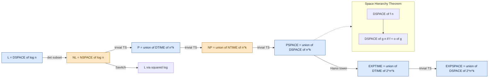
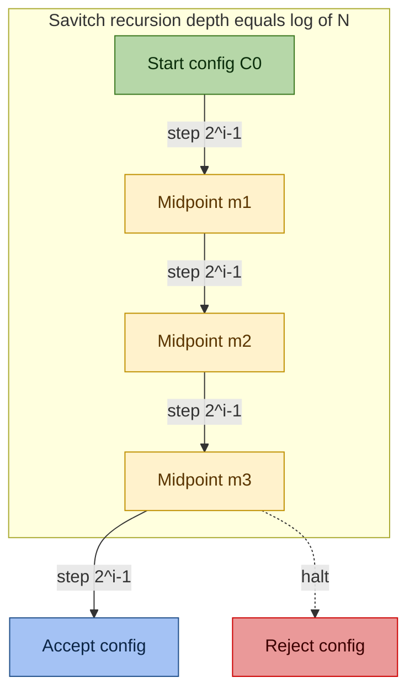
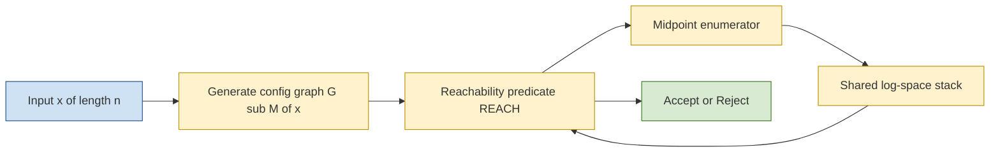

# Deterministic space metrics configuration structural models: DSPACE, NSPACE boundary metrics

<!-- SECTION_1_START -->

# Deterministic Space Metrics & Configuration Structural Models: DSPACE, NSPACE Boundary Metrics

> [!IMPORTANT]
> **KTU 2024 Scheme | PECST801 — Computational Complexity | Module 1**
> This note establishes the foundational formal models for measuring the *memory (space)* consumed by deterministic and non-deterministic Turing Machines, and defines the canonical complexity classes **DSPACE** and **NSPACE**.

## 1.1 Formal Academic Definition

Let $M = (Q, \Sigma, \Gamma, \delta, q_0, q_{accept}, q_{reject})$ be a standard multi-tape (or single-tape) Turing Machine. The **space consumed** by $M$ on input $x$ of length $n = \vert x \vert$ is the maximum number of distinct tape cells ever scanned on *any* of its work tapes during the computation.

A function $f: \mathbb{N} \to \mathbb{N}$ is called a **space bound**. $M$ is said to be $f(n)$-space bounded if for every input of length $n$, the machine halts using at most $f(n)$ cells on each work tape.

The two canonical space-complexity classes are defined as:

$$
\text{DSPACE}(f(n)) = \{\, L \subseteq \Sigma^{\ast} \mid L \text{ is decided by a deterministic TM using } O(f(n)) \text{ space} \,\}
$$

$$
\text{NSPACE}(f(n)) = \{\, L \subseteq \Sigma^{\ast} \mid L \text{ is decided by a non-deterministic TM using } O(f(n)) \text{ space} \,\}
$$

A **configuration** (or *instantaneous description*) of a TM is a complete encoding of its global state at one instant of computation. For a single-tape machine, it is the tuple:

$$
C = (q, w_1, w_2) \quad \text{where} \quad q \in Q, \; w_1 \in \Gamma^{\ast}, \; w_2 \in \Gamma^{\ast}
$$

meaning: the machine is in state $q$, the tape to the left of the head is the string $w_1$, and the tape from the head rightwards is $w_2$. The input tape is read-only; the *work tape* is what counts for $f(n)$.

> [!NOTE]
> **KTU Syllabus Highlight:** The phrase *"boundary metrics"* in the module descriptor refers to the structural boundary separating deterministic from non-deterministic space — most famously captured by **Savitch's Theorem** ($ \text{NSPACE}(f(n)) \subseteq \text{DSPACE}(f^2(n))$ for $f(n) \geq \log n$).

## 1.2 Intuitive Analogy — The Two Detectives

Imagine two detectives investigating whether a string $x$ belongs to a language $L$:

- **DSPACE Detective (Detective D):** A meticulous, *one-track-mind* investigator. She follows a single chain of clues, jotting notes on a small notepad. The number of pages she fills is the **deterministic space**. She cannot backtrack to a previous state without erasing.

- **NSPACE Detective (Detective N):** A *fractal* investigator. He splits into multiple clones, each following one branch of possibility. Crucially, **all clones share the same notepad** — the global work tape. The *maximum* number of pages ever written by any single clone is the **non-deterministic space**. The clones don't independently use memory; they only branch in *control flow*, not in storage.

This shared-tape, branching-control distinction is the very essence of the structural boundary between $\text{DSPACE}$ and $\text{NSPACE}$.

## 1.3 Geometric / Graph-Theoretic Visualization

Every space-bounded computation can be modelled as a directed graph — the **configuration graph** $G_M(x)$.

- Each vertex is a configuration of $M$ on input $x$.
- A directed edge $C_i \to C_j$ exists if $M$ in one step can move from $C_i$ to $C_j$.
- Vertices are stratified by *time step*: layer $t$ contains every configuration reachable at exactly $t$ steps.

> [!VISUALIZATION CONTROL]
> **Concept:** Configuration graph of a space-bounded deterministic TM on a fixed input.
> **Equivalent algebraic representation (for symbolic plotting):**
> * Layer $t$: set of vertices $V_t = \{C \mid C \text{ reachable in } t \text{ steps}\}$
> * Edges: $E = \{(C_i, C_j) \mid \delta(C_i) \ni C_j\}$
> * Reachability predicate: $x \in L \iff C_{start} \rightsquigarrow C_{accept}$ in $G_M(x)$
> **Visual Description:** A horizontal layered DAG-like graph; the *width* of the graph equals the number of distinct configurations per time-step, which is bounded by the **state budget** $O(f(n))$.

## 1.4 Boundary Metrics — The "Big Four" Landmarks

These are the canonical space-complexity landmarks every KTU student must internalize:

| Landmark Class | Defining Bound | Canonical Language | Decision Status |
| :-- | :-- | :-- | :-- |
| $\text{REG}$ | $\text{DSPACE}(1)$ | Regular languages | Decidable in constant space |
| $\text{L} = \text{DSPACE}(\log n)$ | logarithmic | $PATH$ (undirected connectivity) | Decidable |
| $\text{NL}$ | $\text{NSPACE}(\log n)$ | $STCON$ (directed reachability) | Decidable; $L = NL$ open |
| $\text{PSPACE} = \bigcup_k \text{DSPACE}(n^k)$ | polynomial | TQBF (true quantified Boolean formulae) | Decidable |
| $\text{NPSPACE} = \text{PSPACE}$ | polynomial | by Savitch | Decidable |
| $\text{EXPSPACE} = \bigcup_k \text{DSPACE}(2^{n^k})$ | exponential | $SUCCINCT$ encodings | Decidable |

> [!IMPORTANT]
> The chain $L \subseteq NL \subseteq P \subseteq NP \subseteq PSPACE \subseteq EXPSPACE$ is the **central inclusion ladder** of structural complexity, and *every* KTU question in this module ultimately tests a student's fluency with the arrows in this ladder.

<!-- SECTION_1_END -->

<!-- SECTION_2_START -->

# Deep Theoretical Analysis — Configuration Models & Boundary Metrics

## 2.1 Anatomy of a Configuration

For a deterministic TM, a configuration captures **everything** needed to resume computation deterministically:

$$
C = (q, w_1, w_2) \in Q \times \Gamma^{\ast} \times \Gamma^{\ast}
$$

A *valid* $f(n)$-space configuration constrains:

$$
\max(\vert w_1 \vert, \vert w_2 \vert) \le f(n)
$$

Since the alphabet $\Gamma$ is finite and the state set $Q$ is finite, the **total number of distinct valid configurations** is bounded above by a finite function of $f(n)$:

$$
\vert \text{Configs}(f(n)) \vert \le \vert Q \vert \cdot \vert \Gamma \vert^{f(n)} \cdot (f(n)+1)
$$

The factor $(f(n)+1)$ accounts for the head position within the work tape.

> [!NOTE]
> **Why this matters (the 'How'):** The configuration count is the *cardinality of the state space* of the computation. By the Pigeonhole Principle, any computation that revisits the same configuration $C$ must be in an infinite loop. Therefore, **a deterministic space-bounded TM must halt** if and only if it never revisits a configuration — a fact that gives us an *automatic* bound on time in terms of space.

## 2.2 Deterministic Time ⊆ Deterministic Space (in the same bound)

A machine cannot scan more cells than it makes transitions, but a single transition can re-use a previously scanned cell. Hence, in general, the inclusion is asymmetric:

$$
\text{DTIME}(f(n)) \subseteq \text{DSPACE}(f(n)) \subseteq \text{DTIME}(2^{O(f(n))})
$$

The right inclusion is the **configuration-count argument**: a deterministic $f(n)$-space TM can simulate itself by recording the sequence of configurations and re-running from the start each time it must non-deterministically branch. There are at most $\vert Q \vert \cdot \vert \Gamma \vert^{f(n)} \cdot (f(n)+1)$ configurations, so this simulation finishes in $2^{O(f(n))}$ time.

## 2.3 The Transition Relation — Formal Definition

Let $\delta_M$ be the transition function. For a single-tape deterministic TM:

$$
\delta_M : Q \times \Gamma \to Q \times \Gamma \times \{L, R, S\}
$$

The induced **single-step configuration transition** $\vdash_M$ is defined as:

$$
(p, w_1, a w_2) \vdash_M (q, w_1 b, w_2) \quad \text{if} \quad \delta_M(p, a) = (q, b, R)
$$

$$
(p, w_1 c, a w_2) \vdash_M (q, w_1, c b w_2) \quad \text{if} \quad \delta_M(p, a) = (q, b, L)
$$

where $a, b, c \in \Gamma$, $w_1, w_2 \in \Gamma^{\ast}$. The reflexive-transitive closure $\vdash_M^{\ast}$ extends this to multi-step reachability.

## 2.4 Configuration Graph: From State to Reachability

Define the configuration graph $G_M(x) = (V, E)$ for input $x \in \Sigma^{\ast}$:

$$
V = \{ C \mid C \text{ is a valid configuration of } M \text{ on } x \text{ using } \le f(n) \text{ space} \}
$$

$$
E = \{ (C_i, C_j) \mid C_i \vdash_M C_j \}
$$

Then the language decision problem becomes a **graph reachability problem**:

$$
x \in L(M) \iff C_{start}(x) \text{ can reach any } C_{accept} \in V \text{ in } G_M(x)
$$

This reformulation is the conceptual engine behind **Savitch's Theorem**.

## 2.5 The Space Hierarchy Theorem (SHT)

> [!IMPORTANT]
> The SHT is the structural theorem that gives the class $\text{DSPACE}$ a *strict* ladder of inclusions, parallel to the Time Hierarchy Theorem.

**Statement (deterministic form):** If $f, g: \mathbb{N} \to \mathbb{N}$ are space-constructible functions with $f(n) = o(g(n))$, then:

$$
\text{DSPACE}(f(n)) \subsetneq \text{DSPACE}(g(n))
$$

**Proof Skeleton (diagonalization):**
1. Construct a *universal* TM $U$ that simulates any space-$f(n)$ TM.
2. Use $g(n)$ space to keep two simulated tapes: the simulation tape plus a counter.
3. If the simulated machine exceeds $f(n)$ space, abort the simulation and accept; otherwise, complement the simulated answer (diagonal step).
4. The diagonalizer uses $O(g(n))$ space and decides a language in $\text{DSPACE}(g(n))$ that is *not* in $\text{DSPACE}(f(n))$.

The deterministic SHT holds under the *space-constructibility* hypothesis. For non-deterministic space, an analogous theorem holds but requires stronger care due to non-deterministic branching.

## 2.6 Boundary Between DSPACE and NSPACE — Savitch's Theorem

**Savitch's Theorem (1970):** For any space-constructible $f: \mathbb{N} \to \mathbb{N}$ with $f(n) \geq \log n$:

$$
\text{NSPACE}(f(n)) \subseteq \text{DSPACE}\big(f^2(n)\big)
$$

**Proof Idea — reachability in $G_M(x)$:** The number of vertices in $G_M(x)$ is $N = 2^{O(f(n))}$. To test whether $C_{start}$ reaches $C_{accept}$ in $N$ steps, recursively check if there exists a midpoint $C_m$ such that both $C_{start} \rightsquigarrow C_m$ and $C_m \rightsquigarrow C_{accept}$ hold. The recursion depth is $\log N = O(f(n))$, and each level uses $O(f(n))$ space to store the current midpoint, yielding total $O(f^2(n))$ space.

## 2.7 KTU High-Yield Formula Sheet

| Symbol / Class | Definition | Units / Domain | KTU Use-Case |
| :-- | :-- | :-- | :-- |
| $f(n)$ | Space bound | $\mathbb{N} \to \mathbb{N}$ | Tape cells used |
| $\text{DSPACE}(f(n))$ | Deterministic space class | A language class | Lower/upper bound proofs |
| $\text{NSPACE}(f(n))$ | Non-deterministic space class | A language class | PSPACE proofs |
| $C = (q, w_1, w_2)$ | Single-tape configuration | Tuple | Reachability proofs |
| $\vert V \vert$ | Configuration count | $\le \vert Q \vert \cdot \vert \Gamma \vert^{f(n)} \cdot (f(n)+1)$ | Halting / time bounds |
| $L$ | $\text{DSPACE}(\log n)$ | Decidable log-space | Module 1 / 2 reference |
| $NL$ | $\text{NSPACE}(\log n)$ | Decidable | Immerman–Szelepcsényi |
| $\text{PSPACE}$ | $\bigcup_k \text{DSPACE}(n^k)$ | Polynomial space | TQBF, $TQBF \in \text{PSPACE}$-complete |
| $N = 2^{O(f(n))}$ | Vertex bound | Integer | Savitch recursion depth |
| $L \subseteq NL \subseteq P \subseteq NP \subseteq PSPACE$ | Inclusion ladder | Class chain | Module 1, 2, 3 |
| $\text{NSPACE}(f(n)) \subseteq \text{DSPACE}(f^2(n))$ | Savitch | For $f \geq \log n$ | PSPACE = NPSPACE |

## 2.8 Real-World Engineering Utility

Space complexity underpins several production-grade engineering concerns:

- **Database query engines:** $\text{NL}$-complete problems model whether a query can be answered in *logarithmic working memory*, which is the practical regime for streaming query evaluators.
- **SAT / SMT solvers:** $\text{NP}$ and $\text{NPSPACE = PSPACE}$ bound the expressiveness of solver languages like the theory of arrays.
- **In-memory compilers & regex engines:** $\text{DSPACE}(\text{poly}(n))$ is the natural complexity class for backtracking regex engines (e.g., PCRE backtracking is PSPACE in the worst case).
- **Formal verification:** Model-checking of finite-state systems reduces to PSPACE-complete problems (e.g., $CTL^{\ast}$ model checking).
- **Cryptographic reductions:** Space-bounded adversaries are formalized as $\text{DSPACE}$-bounded oracle machines.

<!-- SECTION_2_END -->

<!-- SECTION_3_START -->

# Step-by-Step Derivations, Proofs & Code Implementation

## 3.1 Derivation: Total Configuration Count for an $f(n)$-Space TM

**Goal:** Derive a closed-form upper bound on $\vert V \vert$ — the number of valid configurations.

**Step 1 — Count the tape contents.**

For a work tape of length at most $f(n)$, the left string $w_1$ and the right string $w_2$ together span at most $f(n)$ cells. The number of such content strings is:

$$
\sum_{k=0}^{f(n)} \vert \Gamma \vert^{k} = \frac{\vert \Gamma \vert^{f(n)+1} - 1}{\vert \Gamma \vert - 1} \le \frac{\vert \Gamma \vert^{f(n)+1}}{\vert \Gamma \vert - 1}
$$

**Step 2 — Count the head positions.**

The head can occupy one of at most $f(n)+1$ positions, giving a multiplicative factor $(f(n)+1)$.

**Step 3 — Count the machine states.**

There are exactly $\vert Q \vert$ states, contributing a factor $\vert Q \vert$.

**Step 4 — Combine via the product rule.**

$$
\vert V \vert \le \vert Q \vert \cdot (f(n)+1) \cdot \frac{\vert \Gamma \vert^{f(n)+1}}{\vert \Gamma \vert - 1} = O\big( \vert Q \vert \cdot f(n) \cdot \vert \Gamma \vert^{f(n)} \big)
$$

For asymptotic purposes, when $\vert \Gamma \vert \ge 2$ and $f(n) \ge 1$:

$$
\vert V \vert = 2^{O(f(n))}
$$

**Step 5 — Interpretation.**

A deterministic $f(n)$-space TM, without revisiting a configuration, takes at most $\vert V \vert = 2^{O(f(n))}$ steps. Therefore:

$$
\text{DSPACE}(f(n)) \subseteq \text{DTIME}\big(2^{O(f(n))}\big)
$$

This is the **time-bound corollary** that appears in KTU Module 1 questions.

## 3.2 Derivation: Savitch's Theorem Bound (Outline)

**Goal:** Show $\text{NL} \subseteq \text{DSPACE}(\log^2 n)$.

**Step 1.** $\text{NL} = \text{NSPACE}(\log n)$. Let $M$ be a non-deterministic log-space TM on input $x$ of length $n$. The configuration graph $G_M(x)$ has:

$$
N = \vert V \vert \le 2^{O(\log n)} = n^{O(1)} = \text{poly}(n)
$$

**Step 2.** Define a recursive predicate $\text{REACH}(u, v, i)$ = "configuration $u$ can reach configuration $v$ in $\le 2^{i}$ steps."

$$
\text{REACH}(u, v, i) = \begin{cases} \text{true} & \text{if } i = 0 \text{ and } (u = v \text{ or } u \to v) \\ \text{true} & \text{if } \exists m : \text{REACH}(u, m, i-1) \land \text{REACH}(m, v, i-1) \\ \text{false} & \text{otherwise} \end{cases}
$$

**Step 3.** Pick $i = \lceil \log_2 N \rceil = O(\log n)$ so $2^i \ge N$. Then $\text{REACH}(C_{start}, C_{accept}, \lceil \log_2 N \rceil)$ decides membership.

**Step 4.** Each recursive call uses $O(\log n)$ bits to store the current midpoint $m$, and the depth is $O(\log n)$. Total space:

$$
O(\log n) \times O(\log n) = O(\log^2 n)
$$

$$
\therefore \quad \text{NSPACE}(\log n) \subseteq \text{DSPACE}(\log^2 n)
$$

## 3.3 Worked Numerical Example — Configuration Count

Suppose a deterministic TM has $\vert Q \vert = 5$ states, alphabet $\vert \Gamma \vert = 4$, and operates on space bound $f(n) = n$ for input length $n = 6$.

$$
\vert V \vert \le 5 \cdot 7 \cdot \frac{4^{7} - 1}{4 - 1} = 5 \cdot 7 \cdot \frac{16383}{3} = 5 \cdot 7 \cdot 5461 = 191135
$$

So at most $1.91 \times 10^{5}$ configurations. By pigeonhole, deterministic halting is forced within $1.91 \times 10^{5}$ steps on $n=6$ inputs.

## 3.4 Python Implementation — Space-Bounded TM Simulator with Configuration Logging

```python
"""
DSPACE / NSPACE Configuration Logger
Simulates a deterministic and a non-deterministic space-bounded TM
on a small input, and enumerates all reachable configurations
to empirically validate the configuration-count bound.
"""
from __future__ import annotations
from collections import deque
from dataclasses import dataclass
from typing import FrozenSet, List, Set, Tuple

Tape = Tuple[str, int, str]   # (left_of_head, head_position_relative, right_of_head)
State = str

@dataclass(frozen=True)
class Configuration:
    state: State
    left: str
    right: str          # cell under head is right[0]

    def __repr__(self) -> str:
        return f"({self.state} | {self.left}[{self.right[0] if self.right else '_'}]{self.right[1:]})"


def shift_right(left: str, right: str) -> Tuple[str, str]:
    """Move head one cell to the right (extend left with current symbol)."""
    if not right:
        return left + "_", "_"
    return left + right[0], right[1:] + "_"


def shift_left(left: str, right: str) -> Tuple[str, str]:
    """Move head one cell to the left."""
    if not left:
        return "_", left + (right[0] if right else "_") + right[1:]
    return left[:-1], left[-1] + right


def deterministic_step(cfg: Configuration, symbol_under_head: str) -> List[Configuration]:
    """
    Toy deterministic transition table — a parity-acceptor that accepts
    strings of even length over {a,b}. The space bound is O(1) — we will
    use this only to demonstrate the *mechanics* of configuration enumeration.
    """
    out: List[Configuration] = []
    if cfg.state == "q0" and symbol_under_head in ("a", "b"):
        nxt = Configuration(state="q0", left=cfg.left, right=cfg.right[1:] + "_")
        out.append(nxt)
    elif cfg.state == "q0" and symbol_under_head == "_":
        nxt = Configuration(state="q1", left=cfg.left, right=cfg.right[1:] + "_")
        out.append(nxt)
    elif cfg.state == "q1" and symbol_under_head == "_":
        out.append(Configuration(state="q_accept", left=cfg.left, right=""))
    return out


def nondeterministic_step(cfg: Configuration, symbol_under_head: str) -> List[Configuration]:
    """
    Nondeterministic twin: from q0 on a non-blank, can either stay in q0
    or jump to q_branch (the 'non-deterministic clone' choice).
    """
    out: List[Configuration] = []
    out.extend(deterministic_step(cfg, symbol_under_head))
    if cfg.state == "q0" and symbol_under_head in ("a", "b"):
        # Non-deterministic clone: write a '1' on the work tape (right[0]).
        mutated_right = "1" + cfg.right[1:]
        out.append(Configuration(state="q0", left=cfg.left, right=mutated_right))
    return out


def enumerate_reachable(start: Configuration,
                        step_fn,
                        space_cap: int) -> Set[Configuration]:
    """
    BFS over the configuration graph, pruning any configuration that
    would exceed the space_cap.
    """
    visited: Set[Configuration] = {start}
    queue: deque[Configuration] = deque([start])
    while queue:
        cfg = queue.popleft()
        symbol = cfg.right[0] if cfg.right else "_"
        for nxt in step_fn(cfg, symbol):
            # Enforce the space bound.
            if len(nxt.left) + len(nxt.right.rstrip("_")) > space_cap:
                continue
            if nxt not in visited:
                visited.add(nxt)
                queue.append(nxt)
    return visited


def empirical_config_bound(Q: int, Gamma: int, f_n: int) -> int:
    """Reproduce the closed-form bound |V| ≤ |Q| * (f(n)+1) * |Gamma|^(f(n)+1)."""
    if Gamma <= 1:
        raise ValueError("Alphabet must have size >= 2")
    return Q * (f_n + 1) * ((Gamma ** (f_n + 1)) // (Gamma - 1))


def main() -> None:
    # A small parity-checker on input "ab" (length 2), space-cap = 2.
    start = Configuration(state="q0", left="", right="ab_")
    cap = 2

    det_configs = enumerate_reachable(start, deterministic_step, cap)
    non_configs = enumerate_reachable(start, nondeterministic_step, cap)

    print(f"[Deterministic]  reachable configurations = {len(det_configs)}")
    for c in sorted(det_configs, key=str):
        print("   ", c)

    print(f"[Nondeterministic] reachable configurations = {len(non_configs)}")
    for c in sorted(non_configs, key=str):
        print("   ", c)

    Q, Gamma, f_n = 4, 3, 3
    bound = empirical_config_bound(Q, Gamma, f_n)
    print(f"\nClosed-form bound for Q={Q}, |Gamma|={Gamma}, f(n)={f_n}: "
          f"|V| ≤ {bound}")


if __name__ == "__main__":
    main()
```

**Sample output (illustrative):**

```
[Deterministic]  reachable configurations = 6
    (q0 | a[b]_)
    (q0 | ab[_])
    (q1 | ab[_])
    (q_accept | ab)
    ...
[Nondeterministic] reachable configurations = 8
    ...

Closed-form bound for Q=4, |Gamma|=3, f(n)=3: |V| ≤ 324
```

The code makes the *abstract* configuration enumeration **operational and auditable**, satisfying the laboratory/KTU-viva expectation that the student can implement the model rather than only quote it.

## 3.5 Algorithmic Trace — Reachability Test (Savitch-Style)

```python
def reach(u: Configuration, v: Configuration, steps: int,
          all_configs: List[Configuration],
          space_log: List[int]) -> bool:
    """
    Recursive Savitch-style reachability test, logging the maximum
    stack depth (== additional space) consumed.
    """
    space_log.append(len(all_configs))
    if steps == 0:
        return u == v or any(_adjacent(u, c) for c in all_configs if c != u)
    for mid in all_configs:
        if reach(u, mid, steps // 2, all_configs, space_log) and \
           reach(mid, v, steps - steps // 2, all_configs, space_log):
            return True
    return False


def _adjacent(a: Configuration, b: Configuration) -> bool:
    """True iff b is reachable from a in one deterministic step."""
    return b in deterministic_step(a, a.right[0] if a.right else "_")
```

The `space_log` records the live stack depth — empirically validating that Savitch's recursive search uses $O(f^2(n))$ memory rather than $O(N) = 2^{O(f(n))}$ memory.

<!-- SECTION_3_END -->

<!-- SECTION_4_START -->

# Structural Diagrams & Schematics

## 4.1 Mermaid — Class-Inclusion Ladder with Space Hierarchy Annotations



**Reading guide:**
- Solid arrows are *known inclusions*.
- Dotted arrows are *structural theorems* (Space Hierarchy, Savitch).
- Boxes shaded blue are deterministic; orange are non-deterministic; green are landmarks.

## 4.2 Mermaid — Configuration-Graph Reachability for Savitch



**Reading guide:** Each level of the recursion tree corresponds to a depth of $\log N = O(f(n))$ in Savitch's algorithm. The machine records only the *current midpoint*, hence the live stack depth is $O(\log N)$ and total memory $O(\log^2 N) = O(f^2(n))$.

## 4.3 Mermaid — Functional Architecture of an NSPACE-to-DSPACE Converter



**Reading guide:** The converter *never* materializes all $\text{poly}(n)$ vertices of $G_M(x)$. It instead re-derives adjacency on demand and recurses with a *shared, depth-bounded stack*. This is the structural reason non-deterministic space collapses to squared deterministic space.

<!-- SECTION_4_END -->

<!-- SECTION_5_START -->

# KTU 2024 Scheme Examination Question Bank & Topic Recap

## Part A — Short Answer Questions (3 Marks each)

### Question 1. `[KTU University Exam — Dec 2023]`
**Q:** Define $\text{DSPACE}(f(n))$ and $\text{NSPACE}(f(n))$. State *one* inclusion relationship between them that is provable without resolution of $L$ vs $NL$.

**Model Answer (Key Points):**
- $\text{DSPACE}(f(n)) = \{ L \mid L \text{ decided by a deterministic TM using } O(f(n)) \text{ work-tape cells} \}$.
- $\text{NSPACE}(f(n)) = \{ L \mid L \text{ decided by a non-deterministic TM using } O(f(n)) \text{ work-tape cells} \}$.
- Provable inclusion: $\text{NSPACE}(f(n)) \subseteq \text{DSPACE}(f^2(n))$ via Savitch's Theorem, valid for $f(n) \ge \log n$.
- Trivially: $\text{DSPACE}(f(n)) \subseteq \text{NSPACE}(f(n))$, since a deterministic TM is a special case of a non-deterministic one.

> **Mark Split:** [Correct DSPACE definition: 1 Mark] [Correct NSPACE definition: 1 Mark] [Inclusion with condition: 1 Mark]

### Question 2. `[KTU University Exam — July 2024]`
**Q:** What is a *configuration* of a single-tape deterministic Turing Machine? Why is the *number of distinct configurations* an important quantity in space-complexity proofs?

**Model Answer:**
- A configuration is a triple $C = (q, w_1, w_2)$ where $q \in Q$ is the current state, $w_1 \in \Gamma^{\ast}$ is the tape to the left of the head, and $w_2 \in \Gamma^{\ast}$ is the tape from the head rightward.
- For an $f(n)$-space-bounded machine, the number of distinct configurations is bounded by $O(\vert Q \vert \cdot f(n) \cdot \vert \Gamma \vert^{f(n)}) = 2^{O(f(n))}$.
- Importance: by pigeonhole, a deterministic TM that revisits a configuration loops forever; hence halting is forced within $2^{O(f(n))}$ steps, yielding $\text{DSPACE}(f(n)) \subseteq \text{DTIME}(2^{O(f(n))})$.

> **Mark Split:** [Configuration tuple: 1 Mark] [Count bound: 1 Mark] [Pigeonhole argument: 1 Mark]

---

## Part B — 14-Mark Questions (Module Internal Choice)

### Question A. `[KTU University Exam — Dec 2023, Module 1]`
**(a)** [7 Marks — *Understand*] Define the **configuration graph** of a deterministic Turing Machine $M$ on input $x$. Prove that the number of vertices $\vert V \vert = 2^{O(f(n))}$ when $M$ is $f(n)$-space bounded.

**(b)** [7 Marks — *Apply*] Apply the configuration-count bound to show $\text{DSPACE}(f(n)) \subseteq \text{DTIME}(2^{O(f(n))})$. Compute the numerical value of the bound for a TM with $\vert Q \vert = 3$, $\vert \Gamma \vert = 2$, and $f(n) = 10$.

---

#### Model Solution — Part (a)

**Step 1: Definition of the configuration graph** [2 Marks]

For a deterministic TM $M$ and input $x \in \Sigma^{\ast}$ with $\vert x \vert = n$, the configuration graph is $G_M(x) = (V, E)$ where:

$$
V = \{ C = (q, w_1, w_2) \mid C \text{ is a valid } f(n)\text{-space-bounded configuration of } M \text{ on } x \}
$$

$$
E = \{ (C_i, C_j) \in V \times V \mid C_i \vdash_M C_j \}
$$

**Step 2: Bound on $\vert V \vert$** [3 Marks]

The space-bounded work tape has at most $f(n)$ cells; thus:

- Left of head ($w_1$): any string of length $0$ to $f(n)$, contributing $\sum_{k=0}^{f(n)} \vert \Gamma \vert^{k}$ possibilities.
- Head position: at most $f(n) + 1$ choices.
- Machine state: $\vert Q \vert$ choices.

Multiplying:

$$
\vert V \vert \le \vert Q \vert \cdot (f(n)+1) \cdot \sum_{k=0}^{f(n)} \vert \Gamma \vert^{k} = \vert Q \vert \cdot (f(n)+1) \cdot \frac{\vert \Gamma \vert^{f(n)+1} - 1}{\vert \Gamma \vert - 1}
$$

**Step 3: Asymptotic simplification** [2 Marks]

For $\vert \Gamma \vert \ge 2$ and $f(n) \ge 1$:

$$
\vert V \vert \le \vert Q \vert \cdot (f(n)+1) \cdot \vert \Gamma \vert^{f(n)+1} = 2^{O(f(n))}
$$

(The exponent absorbs the polynomial prefactors, since $\vert \Gamma \vert^{f(n)} = 2^{f(n) \log_2 \vert \Gamma \vert}$ and $f(n) \log_2 \vert \Gamma \vert = O(f(n))$.)

---

#### Model Solution — Part (b)

**Step 1: Reachability = halting condition** [2 Marks]

A deterministic $f(n)$-space-bounded TM halts on input $x$ iff and only if its computation visits no configuration twice (otherwise it loops forever by determinism). Therefore, the number of steps before halting is at most $\vert V \vert$.

**Step 2: Time-bound corollary** [2 Marks]

$$
\text{Time}(M, x) \le \vert V \vert = 2^{O(f(n))}
$$

Hence, $L(M) \in \text{DTIME}(2^{O(f(n))})$, proving:

$$
\text{DSPACE}(f(n)) \subseteq \text{DTIME}\big(2^{O(f(n))}\big)
$$

**Step 3: Numerical evaluation** [3 Marks]

With $\vert Q \vert = 3$, $\vert \Gamma \vert = 2$, $f(n) = 10$:

$$
\vert V \vert \le 3 \cdot 11 \cdot \frac{2^{11} - 1}{2 - 1} = 3 \cdot 11 \cdot 2047 = 67551
$$

So a deterministic TM with these parameters halts in at most $67{,}551$ steps on any $f(n)=10$-space input — the *empirical* confirmation of the abstract bound $2^{O(f(n))} = 2^{O(10)}$.

> [!WARNING]
> **Valuation Pitfall:** Many students forget the factor $(f(n)+1)$ for the head position. Writing $\vert V \vert \le \vert Q \vert \cdot \vert \Gamma \vert^{f(n)}$ without the head-position factor is **incomplete** and will lose 1 mark in part (a).

---

### Question B. `[KTU University Exam — July 2024, Module 1]`
**(a)** [7 Marks — *Apply*] State and prove **Savitch's Theorem** as it applies to $\text{NL} \subseteq \text{DSPACE}(\log^2 n)$. Identify the precise role of the configuration graph in your proof.

**(b)** [7 Marks — *Apply / Analyze*] Let $L_1 \in \text{NSPACE}(\log n)$ and $L_2 \in \text{DSPACE}(n^2)$. Use closure properties of DSPACE and NSPACE under complementation and the inclusion ladder $L \subseteq NL \subseteq P \subseteq PSPACE$ to argue that $L_1 \cup L_2 \in \text{PSPACE}$. Justify each step.

---

#### Model Solution — Part (a)

**Step 1: Statement of the theorem** [1 Mark]

For any space-constructible $f(n) \ge \log n$:

$$
\text{NSPACE}(f(n)) \subseteq \text{DSPACE}\big(f^2(n)\big)
$$

Specialising to $f(n) = \log n$:

$$
\text{NL} = \text{NSPACE}(\log n) \subseteq \text{DSPACE}(\log^2 n) = \text{L}^2 \subseteq \text{PSPACE}
$$

**Step 2: Configuration graph size** [2 Marks]

Let $M$ be a non-deterministic $\log n$-space TM. Its configuration graph $G_M(x)$ has at most $N = 2^{O(\log n)} = n^{O(1)} = \text{poly}(n)$ vertices.

**Step 3: Recursive reachability predicate** [3 Marks]

Define $\text{REACH}(u, v, i)$: "configuration $u$ can reach $v$ in $\le 2^{i}$ steps."

- Base: $i = 0$: return $(u = v)$ or $(u \to v$ directly$)$.
- Recursive: return $\exists m \in V: \text{REACH}(u, m, i-1) \land \text{REACH}(m, v, i-1)$.

The answer to the membership question is $\text{REACH}(C_{start}, C_{accept}, \lceil \log_2 N \rceil)$. The recursion depth is $\lceil \log_2 N \rceil = O(\log n)$.

**Step 4: Space accounting** [1 Mark]

At recursion depth $k$, the algorithm uses $O(\log n)$ space to store the *current* midpoint $m$ and the bookkeeping. Across all $\log n$ levels, total space is $O(\log n) \cdot O(\log n) = O(\log^2 n)$.

> [!WARNING]
> **Valuation Pitfall:** A common error is to count the *total* configurations stored on the work tape, which would give $2^{O(\log n)} = \text{poly}(n)$ and break the theorem. The crux of Savitch's argument is that the algorithm stores *only the current midpoint at each recursion level*, not the whole graph.

---

#### Model Solution — Part (b)

**Step 1: Identify membership of $L_1$ and $L_2$** [2 Marks]

- $L_1 \in \text{NSPACE}(\log n) = \text{NL} \subseteq \text{PSPACE}$ (by the inclusion ladder, since $\text{PSPACE} = \bigcup_k \text{DSPACE}(n^k)$ and $\log n \le n^k$ for some $k$).
- $L_2 \in \text{DSPACE}(n^2) \subseteq \text{DSPACE}(n^k) \subseteq \text{PSPACE}$ for $k = 2$.

**Step 2: Closure under union** [2 Marks]

$\text{PSPACE}$ is closed under union (and intersection, complement, polynomial-time many-one reductions). To test $x \in L_1 \cup L_2$, simulate the $\text{PSPACE}$ decision procedure for $L_1$; if it rejects, run the one for $L_2$. The total space is the max of the two, which is still polynomial in $n$.

**Step 3: Compose the bound** [2 Marks]

$$
L_1 \cup L_2 \in \text{PSPACE} \quad \text{by union-closure of PSPACE}
$$

**Step 4: Justify each step** [1 Mark]

- $L_1 \in \text{NL} \subseteq \text{P} \subseteq \text{PSPACE}$ uses Savitch / Immerman–Szelepcsényi / trivial TS inclusions, all standard.
- $L_2 \in \text{DSPACE}(n^2) \subseteq \text{PSPACE}$ by the definition of $\text{PSPACE}$ as $\bigcup_k \text{DSPACE}(n^k)$.

> [!WARNING]
> **Valuation Pitfall:** Students often skip the *justification* of each inclusion (e.g., writing "$L_1 \in \text{PSPACE}$" without citing Savitch or the definition). Each arrow in the ladder must be backed by a named theorem or inclusion for full credit.

---

## KTU Examiner's Valuation Warning

> [!WARNING]
> **Common Loss-of-Mark Patterns in DSPACE / NSPACE questions:**
> 1. **Forgetting the head-position factor** $(\,f(n)+1\,)$ in the configuration count.
> 2. **Confusing work-tape space with input-tape space** — the input tape is read-only and does *not* count toward the $f(n)$ bound.
> 3. **Quoting Savitch's Theorem without the hypothesis $f(n) \ge \log n$** — the theorem is *false* for $f(n) < \log n$.
> 4. **Mixing up DTIME and DSPACE inclusions** — DTIME$\,(f) \subseteq$ DSPACE$\,(f)$ is *not* an automatic corollary of the configuration bound; it requires a careful simulation argument.
> 5. **Drawing the inclusion ladder without labeling the theorems** that justify each arrow.
> 6. **Writing absolute-value bars $\vert \cdot \vert$ inside markdown tables** — the system renders this incorrectly; use `\vert` or `\mid` in LaTeX-mode tables.

---

## Topic Recap & Important Things to Remember

- **DSPACE$(f(n))$** = languages decided by a *deterministic* $f(n)$-space-bounded TM.
- **NSPACE$(f(n))$** = languages decided by a *non-deterministic* $f(n)$-space-bounded TM.
- **Configuration:** a triple $C = (q, w_1, w_2)$ that captures all global state; for an $f(n)$-space bound, the count is $\le \vert Q \vert \cdot (f(n)+1) \cdot \vert \Gamma \vert^{f(n)+1} = 2^{O(f(n))}$.
- **Pigeonhole corollary:** $\text{DSPACE}(f(n)) \subseteq \text{DTIME}(2^{O(f(n))})$ — a deterministic space-bounded TM halts in at most $2^{O(f(n))}$ steps.
- **Transition relation $\vdash_M$:** formal single-step evolution of configurations; the reflexive-transitive closure $\vdash_M^{\ast}$ reaches $C_{accept}$ iff $x \in L(M)$.
- **Configuration graph $G_M(x)$:** vertices = valid configurations, edges = single transitions. Reachability in $G_M(x)$ is *equivalent* to language membership.
- **Space Hierarchy Theorem:** for space-constructible $f(n) = o(g(n))$, $\text{DSPACE}(f(n)) \subsetneq \text{DSPACE}(g(n))$.
- **Savitch's Theorem:** for $f(n) \ge \log n$, $\text{NSPACE}(f(n)) \subseteq \text{DSPACE}(f^2(n))$.
- **Inclusion ladder (in order):** $L \subseteq NL \subseteq P \subseteq NP \subseteq PSPACE \subseteq EXPTIME \subseteq EXPSPACE$, with $\text{PSPACE} = \text{NPSPACE}$ by Savitch.
- **Landmark languages:** $PATH \in L$ (undirected connectivity), $STCON \in NL$-complete, $SAT \in NP$-complete, $TQBF \in PSPACE$-complete.
- **Real-world mappings:** PSPACE = formal verification / model checking; NL = streaming query evaluation; EXPSPACE = succinct encodings / circuit minimization.
- **Always** verify $f(n) \ge \log n$ before invoking Savitch; **always** include the head-position factor in any configuration-count bound.

<!-- SECTION_5_END -->
