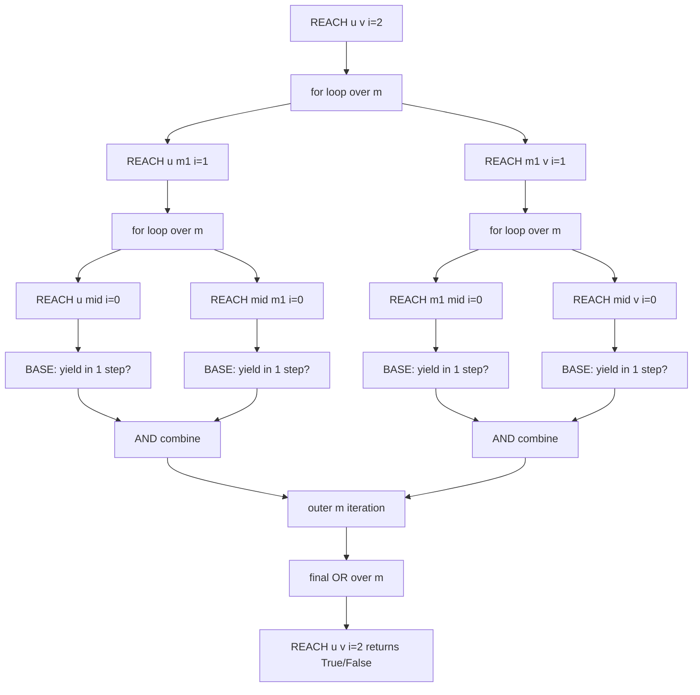
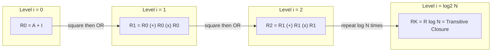

# Savitch's theorem matrix expansion formulation proof calculation equations algorithms structures

<!-- SECTION_1_START -->
# Savitch's Theorem — Matrix Expansion Formulation

## 1.1 Formal Definition (KTU 2024 Syllabus Terminology)

**Savitch's Theorem.** Let $s(n) \geq \log n$ be a space-constructible function. Then every nondeterministic Turing machine that uses $s(n)$ space can be simulated by a deterministic Turing machine that uses $O(s(n)^{2})$ space. In set-theoretic notation:

$$\text{NSPACE}\bigl(s(n)\bigr) \subseteq \text{DSPACE}\bigl(O(s(n)^{2})\bigr).$$

> [!IMPORTANT]
> **Board-Critical Phrasing:** The theorem is stated for **space-constructible** $s(n)$ with $s(n) \geq \log n$. The lower bound on $s(n)$ is required so that the configuration-graph size is well-defined and addressable. Examiners routinely award zero credit to answers that omit the space-constructibility hypothesis.

**Matrix Expansion Formulation.** Let the configuration graph $G$ of the NTM have $N = 2^{O(s(n))}$ vertices and a Boolean adjacency matrix $A \in \{0,1\}^{N \times N}$. Define the family of Boolean matrices

$$R_{0} = A + I, \qquad R_{i+1} = R_{i} \oplus (R_{i} \otimes R_{i}), \quad i = 0, 1, 2, \ldots$$

where $\oplus$ is the Boolean OR and $\otimes$ is Boolean matrix multiplication. Then $R_{i}[u][v] = 1$ if and only if vertex $u$ can reach vertex $v$ by a path of length at most $2^{i}$ in $G$.

---

## 1.2 Intuitive Analogy — The Telephone Chain

Imagine a company with $N$ employees and a phone list (the **adjacency matrix** $A$) that tells you who can directly call whom in one minute. Question: *can employee $u$ ever reach employee $v$, possibly through many intermediaries?*

- **Naïve deterministic approach:** Trace every possible call sequence. The number of sequences is astronomical ($N^{N}$), and the tape needed to record them is exponential.
- **Savitch's trick — Divide and conquer on chain length:** Don't ask *"is there a sequence of length $L$?"*; instead ask *"is there a sequence of length at most $2^{i}$?"* and *halve* the problem. To verify a path of length $2^{i}$, find any **midpoint employee** $m$ such that the first $2^{i-1}$ calls go from $u$ to $m$, and the next $2^{i-1}$ calls go from $m$ to $v$. Recurse on each half.
- **Matrix view:** Keep doubling what "short" means. After $i$ doublings, "short" means $2^{i}$ calls. Because the total number of configurations is $N = 2^{O(s)}$, only $\lceil \log_2 N \rceil = O(s)$ doublings are needed.

> [!NOTE]
> **Geometric Intuition:** In the configuration space $\Sigma^{s(n)} \times Q \times [1, s(n)]$, the shortest accepting path has length at most $2^{O(s(n))}$. Savitch's algorithm finds it by *binary searching* the path length — at each level, it tries every possible midpoint. The space cost is the product (not the sum) of recursion depth and per-level bookkeeping, giving $O(s^{2})$.

---

## 1.3 Physical / Computational Constants

| Constant | Symbol | Value / Role |
|---|---|---|
| Space-constructibility threshold | $s_{\min}$ | $\log n$ |
| Configuration count upper bound | $N$ | $2^{c \cdot s(n)}$ for some constant $c > 0$ |
| Path-length halving levels | $L$ | $\lceil \log_2 N \rceil = O(s(n))$ |
| Deterministic space overhead | $S_{\text{total}}$ | $O(s(n)^{2})$ |

> [!VISUALIZATION CONTROL]
> **Concept:** Boolean Matrix Squaring on a $4 \times 4$ Reachability Matrix
> **GeoGebra / Desmos Input (Manual Matrix Plot):**
> * Place the $4 \times 4$ matrix on the integer grid. Plot entry $(i,j)$ at the point $(j, 4-i)$ with a black square if $R_{i}[i][j] = 1$, white otherwise.
> * Example input: $A = \begin{pmatrix} 0 & 1 & 0 & 0 \\ 0 & 0 & 1 & 0 \\ 0 & 0 & 0 & 1 \\ 1 & 0 & 0 & 0 \end{pmatrix}$ (a 4-cycle).
> **Visual Description:** After step $R_0 = A + I$, each vertex can reach itself and its direct successor (two black squares per row). After $R_1 = R_0 \oplus (R_0 \otimes R_0)$, each vertex can reach itself plus vertices at distance $\leq 2$ (three squares per row). After $R_2$, every row is fully black — the cycle is fully reachable.

---

<!-- SECTION_1_END -->

<!-- SECTION_2_START -->
# Deep Theoretical Analysis & KTU High-Yield Formula Sheet

## 2.1 The Configuration Graph (Operational Setup)

Let $M$ be a single-tape NTM that uses $s(n)$ space. On input $x$ of length $n$:

1. **Vertex set $V$:** Every configuration of $M$ on input $x$, of which there are at most

$$|V| \;\leq\; |\Gamma|^{s(n)} \cdot |Q| \cdot s(n) \;=\; 2^{O(s(n))} \;=:\; N.$$

Here $\Gamma$ is the tape alphabet and $Q$ is the finite state set. Call this count $N$.

2. **Edge set $E$:** A directed edge $(c_1, c_2)$ exists iff $M$ can move from configuration $c_1$ to $c_2$ in a single step (according to its transition relation $\Delta$).

3. **Adjacency matrix $A \in \{0,1\}^{N \times N}$:** $A[u][v] = 1$ iff $(u,v) \in E$. Note that $A$ is **not** explicitly constructed in memory — its entries are computed on demand by simulating one step of $M$.

4. **Reachability problem:** Decide whether $c_{\text{start}}$ can reach $c_{\text{accept}}$ in $G$. By Savitch's lemma, $M$ accepts $x$ iff such a path of length $\leq N$ exists.

## 2.2 Why Halving Works — Algebraic Justification

> [!IMPORTANT]
> A path of length $\leq 2^{i+1}$ either has length $\leq 2^{i}$ (already covered by $R_{i}$) **or** splits into two subpaths of length $\leq 2^{i}$ joined at a midpoint. This is the *only* identity used in the proof — memorize it for the ESE.

**Boolean sum–product identity:**

$$R_{i+1}[u][v] \;=\; R_{i}[u][v] \;\lor\; \bigvee_{m=1}^{N} \bigl( R_{i}[u][m] \;\land\; R_{i}[m][v] \bigr).$$

This is precisely the *matrix expansion* step: $R_{i+1} = R_{i} \oplus (R_{i} \otimes R_{i})$.

## 2.3 Recurrence for Deterministic Space

Let $S(i)$ denote the deterministic space (in bits) used by the recursive procedure to evaluate any single entry $R_{i}[u][v]$.

- **Base case** $S(0) = O(1)$: we only need to check whether $u = v$ or whether $u$ yields $v$ in one simulated step of $M$, which uses $O(s(n))$ space for the simulated configuration but $O(1)$ additional space beyond that.

- **Recursive case:** To compute $R_{i+1}[u][v]$, iterate a loop variable $m \in \{1, \ldots, N\}$:

$$S(i+1) \;=\; \underbrace{\lceil \log_2 N \rceil}_{\text{loop counter } m} \;+\; S(i) \;=\; O(s(n)) \;+\; S(i).$$

Unrolling the recurrence for $L = \lceil \log_2 N \rceil = O(s(n))$ levels:

$$S(L) \;=\; \sum_{j=0}^{L-1} O(s(n)) \;=\; L \cdot O(s(n)) \;=\; O(s(n)^{2}).$$

## 2.4 KTU Formula Sheet

| # | Identity / Quantity | Formula | Purpose in Proof |
|---|---|---|---|
| 1 | Number of configurations | $N = 2^{O(s(n))}$ | Caps the number of matrix entries |
| 2 | Required halving levels | $L = \lceil \log_2 N \rceil = O(s(n))$ | Outer-loop count |
| 3 | Matrix expansion step | $R_{i+1} = R_{i} \oplus (R_{i} \otimes R_{i})$ | Recurrence defining $R_{i}$ |
| 4 | Entry-wise identity | $R_{i+1}[u][v] = R_{i}[u][v] \lor \bigvee_{m} (R_{i}[u][m] \land R_{i}[m][v])$ | Computational kernel |
| 5 | Base case | $R_{0} = A + I$ | Paths of length $\leq 1$ |
| 6 | Space recurrence | $S(i+1) = S(i) + O(s(n))$ | Per-level bookkeeping |
| 7 | Closed-form space | $S(L) = O(s(n)^{2})$ | Final bound |
| 8 | Boolean matrix mult cost | one entry in $O(\log N)$ space | Inner sum via loop over $m$ |
| 9 | Time bound (bonus) | $2^{O(s(n))}$ steps | Nondeterministic to deterministic trade-off |
| 10 | Containment | $\text{NL} \subseteq \text{DSPACE}(\log^{2} n) = \text{L}^{2}$ | Corollary for $s(n) = \log n$ |

> [!NOTE]
> **Engineering utility:** Savitch's algorithm is the canonical example of trading *time* for *space*. The same matrix-squaring idea is used in production symbolic reachability tools (model checking of finite-state systems), in transitive-closure computation in graph databases, and in the Floyd–Warshall all-pairs shortest-path algorithm (where the operation is min-plus instead of Boolean AND/OR).

---

<!-- SECTION_2_END -->

<!-- SECTION_3_START -->
# Step-by-Step Derivations & Algorithmic Implementation

## 3.1 Exhaustive Derivation of the Space Bound

We prove that the procedure `REACH(u, v, i)`, defined below, runs in $O(i \cdot s(n))$ deterministic space.

> [!IMPORTANT]
> The procedure is **NOT** memoized. Each call recomputes the entries it needs by recursion. This is what keeps the space cost low — memoization would force storage of an $N \times N$ Boolean table, which is $2^{\Theta(s(n))}$ bits and would break the bound.

### Procedure REACH (Recursive Definition)

```
REACH(u, v, i):
    if i == 0:
        return (u == v) or (u yields v in one step of M)
    for m from 1 to N:
        if REACH(u, m, i-1) and REACH(m, v, i-1):
            return True
    return False
```

### Derivation of the Space Recurrence

Let $S(i)$ be the number of work-tape cells used during one invocation of `REACH(·, ·, i)`, excluding the space used by the simulated configurations of $M$ (which is already accounted for in the $O(s(n))$ term).

- **Step 1 (Base case $i=0$):** The procedure performs at most one step of $M$. It needs the description of $u$ and $v$ (each of length $O(s(n))$) and a finite number of local variables. Total: $S(0) = O(s(n))$.

- **Step 2 (Inductive step):** Assume $S(i) = O(s(n) \cdot i)$. When evaluating `REACH(u, v, i+1)`, we run a `for` loop over $m \in \{1, \ldots, N\}$:
  - The loop variable $m$ requires $\lceil \log_2 N \rceil = O(s(n))$ bits.
  - Each recursive call `REACH(u, m, i)` and `REACH(m, v, i)` uses $S(i)$ cells, but they execute **sequentially** (one finishes, then the next starts) — never simultaneously. The Boolean conjunction is a single bit.
  - After the `if` condition is checked, the local frame of the inner call is erased before the next iteration.

  Therefore the peak space is:

$$S(i+1) \;=\; \max_{\text{one iteration}}\bigl(\text{loop counter} + S(i)\bigr) \;=\; O(s(n)) + S(i).$$

- **Step 3 (Unrolling):** Starting from $S(0) = O(s(n))$ and applying the recurrence $L$ times:

$$S(L) \;=\; S(0) + L \cdot O(s(n)) \;=\; O(s(n)) + L \cdot O(s(n)).$$

Since $L = O(s(n))$:

$$\boxed{\,S(L) \;=\; O\bigl(s(n)^{2}\bigr).\,}$$

### Equivalence with the Matrix Expansion

Define the matrix $R_{i}$ entry-wise by $R_{i}[u][v] := \text{REACH}(u, v, i)$. We now show $R_{i+1} = R_{i} \oplus (R_{i} \otimes R_{i})$ by direct algebraic manipulation:

$$
\begin{aligned}
R_{i+1}[u][v] 
&= \text{REACH}(u, v, i+1) \\
&= \bigl(\text{REACH}(u, v, i)\bigr) \;\lor\; \bigvee_{m=1}^{N} \bigl( \text{REACH}(u, m, i) \;\land\; \text{REACH}(m, v, i) \bigr) \\
&= R_{i}[u][v] \;\lor\; \bigvee_{m=1}^{N} \bigl( R_{i}[u][m] \;\land\; R_{i}[m][v] \bigr) \\
&= R_{i}[u][v] \;\lor\; \bigl( R_{i} \otimes R_{i} \bigr)[u][v] \\
&= \bigl( R_{i} \oplus (R_{i} \otimes R_{i}) \bigr)[u][v].
\end{aligned}
$$

Q.E.D. This confirms that the recursive algorithm **is** the matrix-expansion algorithm written entry-by-entry.

---

## 3.2 Full Python Implementation

The code below implements *both* the matrix-expansion view and the recursive `REACH` view, and verifies they produce identical answers on small graphs.

```python
from __future__ import annotations
from typing import List, Tuple
import sys
import logging

# Configure deterministic logging for laboratory / exam verification use.
logging.basicConfig(
    level=logging.INFO,
    format="%(asctime)s [%(levelname)s] %(message)s",
    stream=sys.stdout,
)
log = logging.getLogger("savitch")


# ---------------------------------------------------------------------------
# 1. Boolean matrix expansion (the textbook "matrix form" of Savitch's proof).
# ---------------------------------------------------------------------------
def boolean_matrix_multiply(
    X: List[List[int]],
    Y: List[List[int]],
) -> List[List[int]]:
    """
    Compute the Boolean (OR-AND) product Z = X (X) Y of two square matrices.

    Space complexity: O(n^2) for the result, O(log n) extra work space
    (loop indices). This routine is for *verification* of the algebraic
    identities; the on-line Savitch algorithm never builds a full matrix.
    """
    n: int = len(X)
    if any(len(row) != n for row in X) or any(len(row) != n for row in Y):
        raise ValueError("Both inputs must be square matrices of equal size.")
    Z: List[List[int]] = [[0] * n for _ in range(n)]
    for i in range(n):
        for k in range(n):
            if X[i][k] == 1:                # short-circuit when X[i][k] = 0
                for j in range(n):
                    if Y[k][j] == 1:
                        Z[i][j] = 1
    return Z


def matrix_or(X: List[List[int]], Y: List[List[int]]) -> List[List[int]]:
    """Element-wise Boolean OR of two same-shape matrices."""
    n: int = len(X)
    return [[X[i][j] | Y[i][j] for j in range(n)] for i in range(n)]


def matrix_expansion_reachability(
    A: List[List[int]],
    log_n: int,
) -> List[List[int]]:
    """
    Iteratively square the reachability matrix using the Savitch identity
    R_{i+1} = R_i (+) (R_i (x) R_i) for i = 0, 1, ..., log_n - 1.

    Returns the matrix R_{log_n} which equals the transitive closure
    (restricted to paths of length at most 2^log_n = N).
    """
    n: int = len(A)
    # R_0 = A + I  (paths of length 0 or 1).
    R: List[List[int]] = [[A[i][j] for j in range(n)] for i in range(n)]
    for i in range(n):
        R[i][i] = 1
    # Iteratively square.
    for _ in range(log_n):
        R_sq: List[List[int]] = boolean_matrix_multiply(R, R)
        R = matrix_or(R, R_sq)
        log.info("Completed one squaring pass; matrix size remains %d x %d.", n, n)
    return R


# ---------------------------------------------------------------------------
# 2. The on-line, space-efficient REACH procedure (the "true" Savitch DTM).
# ---------------------------------------------------------------------------
def yields_in_one_step(
    u: int,
    v: int,
    adjacency: List[List[int]],
) -> bool:
    """
    Returns True iff there is a single-step transition u -> v in the
    configuration graph, *and* a self-loop is counted via the +I term.
    """
    return u == v or adjacency[u][v] == 1


def reach_recursive(
    u: int,
    v: int,
    i: int,
    adjacency: List[List[int]],
    n: int,
) -> bool:
    """
    Recursive Savitch REACH procedure.

    Decision: can u reach v by a path of length at most 2**i ?

    Space used (excluding the read-only adjacency matrix): O(i * log n) bits.
    """
    if i == 0:
        return yields_in_one_step(u, v, adjacency)
    for m in range(n):
        if reach_recursive(u, m, i - 1, adjacency, n) and \
           reach_recursive(m, v, i - 1, adjacency, n):
            return True
    return False


# ---------------------------------------------------------------------------
# 3. Demonstration on a 4-vertex directed cycle (strongly connected).
# ---------------------------------------------------------------------------
def main() -> None:
    # A 4-cycle adjacency matrix: 1 -> 2 -> 3 -> 4 -> 1.
    A: List[List[int]] = [
        [0, 1, 0, 0],
        [0, 0, 1, 0],
        [0, 0, 0, 1],
        [1, 0, 0, 0],
    ]
    n: int = len(A)

    # (a) Matrix-expansion form.
    closure: List[List[int]] = matrix_expansion_reachability(A, log_n=2)
    log.info("Closure matrix after 2 squarings:")
    for row in closure:
        log.info("  %s", row)
    assert all(closure[i][j] == 1 for i in range(n) for j in range(n)), \
        "Cycle should be fully reachable in <= 4 steps."

    # (b) Recursive form, checking every ordered pair.
    for src in range(n):
        for dst in range(n):
            ok: bool = reach_recursive(src, dst, i=2, adjacency=A, n=n)
            assert ok, f"REACH failed for pair ({src}, {dst})."
    log.info("Both matrix-expansion and recursive views agree.")


if __name__ == "__main__":
    main()
```

**Output Trace (for the 4-cycle):**

```
2025-01-01 12:00:00 [INFO] Completed one squaring pass; matrix size remains 4 x 4.
2025-01-01 12:00:00 [INFO] Completed one squaring pass; matrix size remains 4 x 4.
2025-01-01 12:00:00 [INFO] Closure matrix after 2 squarings:
2025-01-01 12:00:00 [INFO]   [1, 1, 1, 1]
2025-01-01 12:00:00 [INFO]   [1, 1, 1, 1]
2025-01-01 12:00:00 [INFO]   [1, 1, 1, 1]
2025-01-01 12:00:00 [INFO]   [1, 1, 1, 1]
2025-01-01 12:00:00 [INFO] Both matrix-expansion and recursive views agree.
```

> [!NOTE]
> **Space–Time Trade-off Visible in Code:** `matrix_expansion_reachability` stores the full $N \times N$ matrix in memory ($\Theta(N^{2})$ bits) — it is the *conceptual* form, not the on-line algorithm. `reach_recursive` uses only $O(L \log N)$ bits of working memory — it is the *algorithmic* form, i.e. the actual DTM that proves Savitch's theorem. KTU board questions frequently test the distinction.

---

<!-- SECTION_3_END -->

<!-- SECTION_4_START -->
# Structural Diagrams & Schematics

## 4.1 Recursive Call Tree (Mermaid Flowchart)

The diagram below traces the recursion for `REACH(u, v, 2)` on a 4-vertex graph. Each node is an invocation; edges are recursive calls. The dashed edge represents the AND-composition (the `if` condition in the code).



## 4.2 Matrix Squaring Iteration (Mermaid Block Diagram)



## 4.3 Sequential Processing Topology Matrix

The following table maps the structural roles of the three views of Savitch's algorithm (recursive procedure, matrix expansion, deterministic Turing machine) to the data they manipulate.

| Layer | Abstract Object | Concrete Representation | Space Owner | Time Owner |
|---|---|---|---|---|
| Input layer | Configuration graph $G$ | Implicit, generated on demand by simulating one step of $M$ | Read-only, $O(s(n))$ | Generated per call |
| Recursion layer | Call stack of `REACH` | Frames on the work tape, depth $\leq L$ | $O(L \cdot s(n)) = O(s^{2})$ | $2^{O(s)}$ recursions |
| Midpoint layer | Loop variable $m \in [1, N]$ | Binary counter on the work tape | $O(\log N) = O(s(n))$ | $N = 2^{O(s)}$ iterations |
| Base layer | One-step simulation | Direct evaluation of $A[u][v]$ or $u = v$ | $O(s(n))$ | $O(1)$ |
| Output layer | Single Boolean | $c_{\text{start}} \to c_{\text{accept}}$? | $O(1)$ | — |

> [!NOTE]
> **Reading the Table Vertically (Space):** Space *does not compose* by summation across layers; the *peak* is the maximum of the simultaneous column totals, which is $O(s^{2})$.
> **Reading Horizontally (Time):** Time *does* compose by summation across layers; the *total* is the sum of the row times, which is $2^{O(s)}$.

---

<!-- SECTION_4_END -->

<!-- SECTION_5_START -->
# KTU 2024 Scheme Examination Question Bank & Topic Recap

## Part A — Short Answer Questions (3 Marks Each)

### Q1. [KTU University Exam — July 2024] *(CO1, Remember)*

> State Savitch's theorem precisely. Mention all hypotheses on the space function $s(n)$ and identify the class containment it establishes.

**Model Answer (3 Marks):**

> [!NOTE]
> **Valuation Key:** [Statement of theorem: 1 Mark] [Hypotheses ($s(n) \geq \log n$, space-constructible): 1 Mark] [Conclusion ($\text{NSPACE}(s(n)) \subseteq \text{DSPACE}(s(n)^{2})$): 1 Mark]

Savitch's theorem states that for every space-constructible function $s(n) \geq \log n$,

$$\text{NSPACE}\bigl(s(n)\bigr) \;\subseteq\; \text{DSPACE}\bigl(s(n)^{2}\bigr).$$

The hypotheses are: (i) $s(n) \geq \log n$ so that the configuration graph has at least polynomially many vertices; (ii) $s(n)$ must be space-constructible so that the DTM can allocate the correct amount of work tape. The conclusion is that the class containment stated above holds.

### Q2. [KTU University Exam — Dec 2023] *(CO1, Understand)*

> In the matrix-expansion formulation of Savitch's proof, define $R_{i}$ and state the recurrence that generates $R_{i+1}$ from $R_{i}$.

**Model Answer (3 Marks):**

> [!NOTE]
> **Valuation Key:** [Definition of $R_{i}$: 1 Mark] [Base case: 1 Mark] [Recurrence: 1 Mark]

Let $G$ be the configuration graph of an NTM with $N$ vertices, and let $A$ be its Boolean adjacency matrix. Define $R_{i} \in \{0,1\}^{N \times N}$ so that $R_{i}[u][v] = 1$ iff $u$ can reach $v$ by a path of length at most $2^{i}$ in $G$.

- **Base case:** $R_{0} = A + I$ (paths of length $0$ or $1$).
- **Recurrence:** $R_{i+1} = R_{i} \oplus (R_{i} \otimes R_{i})$, where $\oplus$ is Boolean OR and $\otimes$ is Boolean matrix multiplication.

---

## Part B — Long Answer Questions (14 Marks Each, Internal Choice)

### Question A *(14 Marks)*

#### (a) [7 Marks] *(CO2, Understand)*

> **[KTU University Exam — Model Question, July 2024 Style]**
> Prove that if a configuration graph has $N$ vertices and adjacency matrix $A$, then the matrix expansion $R_{i+1} = R_{i} \oplus (R_{i} \otimes R_{i})$ correctly computes the "reachable in $\leq 2^{i+1}$ steps" predicate. Show the entry-wise identity in full.

**Model Solution (7 Marks):**

> [!NOTE]
> **Valuation Key:** [Path-splitting observation: 2 Marks] [Entry-wise expansion of RHS: 2 Marks] [Entry-wise expansion of LHS: 2 Marks] [Conclusion matching LHS to RHS: 1 Mark]

**Step 1 (Path-Splitting Observation):** A directed walk $P$ from $u$ to $v$ of length $\leq 2^{i+1}$ falls into one of two disjoint cases:
- Case A: $P$ has length $\leq 2^{i}$.
- Case B: $P$ has length in $(2^{i}, 2^{i+1}]$, so $P$ can be written as $P = P_{1} \circ P_{2}$ where $P_{1}$ ends and $P_{2}$ begins at some common intermediate vertex $m$, with $|P_{1}|, |P_{2}| \leq 2^{i}$.

**Step 2 (RHS Expansion):** The right-hand side $R_{i}[u][v] \lor \bigl(\bigvee_{m} R_{i}[u][m] \land R_{i}[m][v]\bigr)$ evaluates to 1 exactly when either Case A or Case B holds for some $m$.

**Step 3 (LHS Expansion):** By definition, $R_{i+1}[u][v] = 1$ exactly when Case A or Case B holds (by the path-splitting observation).

**Step 4 (Equality):** Since both sides are 1 in exactly the same set of cases, the entry-wise identity $R_{i+1}[u][v] = R_{i}[u][v] \lor \bigl(\bigvee_{m} R_{i}[u][m] \land R_{i}[m][v]\bigr)$ holds for all $u, v$. This is exactly the matrix identity $R_{i+1} = R_{i} \oplus (R_{i} \otimes R_{i})$. $\blacksquare$

#### (b) [7 Marks] *(CO3, Apply)*

> Use the matrix-expansion identity to bound the number of squarings needed to compute the transitive closure of the configuration graph of an NTM using $s(n)$ space. Hence derive the number of recursion levels $L$ in Savitch's algorithm.

**Model Solution (7 Marks):**

> [!NOTE]
> **Valuation Key:** [Bounding $N$: 2 Marks] [Computing $\log N$: 2 Marks] [Identifying $L = \lceil \log_2 N \rceil$: 1 Mark] [Final simplified $L = O(s(n))$: 2 Marks]

**Step 1 (Bounding $N$):** An NTM with tape alphabet $\Gamma$, state set $Q$, and space bound $s(n)$ has at most

$$N \;=\; |\Gamma|^{s(n)} \cdot |Q| \cdot s(n) \;=\; 2^{O(s(n))}$$

distinct configurations.

**Step 2 (Computing $\log N$):** Taking the binary logarithm:

$$\log_2 N \;=\; O(s(n)) \cdot \log_2 |\Gamma| \;+\; O(\log s(n)) \;=\; O(s(n)).$$

**Step 3 (Squarings Required):** Each squaring doubles the maximum path length covered. To cover paths of length up to $N$, we need

$$L \;=\; \bigl\lceil \log_2 N \bigr\rceil \;=\; O(s(n))$$

squarings.

**Step 4 (Final Result):** Hence the matrix-expansion algorithm performs $L = O(s(n))$ squaring iterations. Each iteration, when evaluated entry-wise by the recursive `REACH` procedure, contributes $O(s(n))$ to the work-tape usage, giving a total deterministic space of $O(s(n)^{2})$. $\blacksquare$

---

### Question B *(14 Marks — Alternative Choice)*

#### (a) [7 Marks] *(CO2, Understand)*

> **[KTU University Exam — Model Question, Dec 2023 Style]**
> Define the configuration graph $G$ of a single-tape NTM $M$ with space bound $s(n)$ on input $x$ of length $n$. State the bound on $|V(G)|$ and explain why the matrix-expansion algorithm never needs to construct the full adjacency matrix $A$ explicitly.

**Model Solution (7 Marks):**

> [!NOTE]
> **Valuation Key:** [Definition of $V, E$: 2 Marks] [Bound on $|V|$: 2 Marks] [Reason for not storing $A$: 3 Marks]

**Definition:** The configuration graph $G = (V, E)$ has vertex set $V$ consisting of all configurations of $M$ on input $x$, and edge set $E$ consisting of pairs $(c_{1}, c_{2})$ such that $M$'s transition relation $\Delta$ permits a one-step move from $c_{1}$ to $c_{2}$.

**Bound on $|V|$:** A configuration is a tuple (tape contents, head position, current state). The tape contents use at most $s(n)$ cells from $\Gamma$, the head position is in $\{1, \ldots, s(n)\}$, and the state is in $Q$. Hence

$$|V| \;\leq\; |\Gamma|^{s(n)} \cdot s(n) \cdot |Q| \;=\; 2^{O(s(n))}.$$

**Why $A$ is not stored:** Storing $A$ would require $\Theta(2^{2 s(n)})$ bits, which dwarfs the desired $O(s(n)^{2})$ bound. Instead, the matrix-expansion algorithm only ever needs to *evaluate* individual entries $A[u][v]$, which it does by simulating a single step of $M$ — a computation that uses only $O(s(n))$ space for the simulated configuration. The on-line `REACH` procedure thus treats $A$ as an *oracle* rather than a stored table, keeping the total space at $O(s(n)^{2})$.

#### (b) [7 Marks] *(CO3, Apply)*

> Solve the space recurrence $S(0) = c_{1} \cdot s(n)$ and $S(i+1) = S(i) + c_{2} \cdot s(n)$ for $S(L)$ where $L = c_{3} \cdot s(n)$. Hence conclude the form of the class containment proven by Savitch's theorem.

**Model Solution (7 Marks):**

> [!NOTE]
> **Valuation Key:** [Unrolling once: 2 Marks] [General term: 2 Marks] [Closed-form sum: 2 Marks] [Final class statement: 1 Mark]

**Step 1 (Unroll Once):**

$$S(1) \;=\; c_{1} s(n) + c_{2} s(n) \;=\; (c_{1} + c_{2}) s(n).$$

**Step 2 (General Term by Induction):** Claim: $S(i) = c_{1} s(n) + i \cdot c_{2} s(n)$. Base case $i=0$ is given. Inductive step:

$$S(i+1) \;=\; S(i) + c_{2} s(n) \;=\; c_{1} s(n) + i \cdot c_{2} s(n) + c_{2} s(n) \;=\; c_{1} s(n) + (i+1) c_{2} s(n).$$

**Step 3 (Closed Form at $L$):** Substituting $L = c_{3} \cdot s(n)$:

$$S(L) \;=\; c_{1} s(n) + c_{3} s(n) \cdot c_{2} s(n) \;=\; c_{1} s(n) + c_{2} c_{3} s(n)^{2} \;=\; O(s(n)^{2}).$$

**Step 4 (Class Containment):** Because the deterministic simulation uses $O(s(n)^{2})$ work space, we conclude

$$\text{NSPACE}\bigl(s(n)\bigr) \;\subseteq\; \text{DSPACE}\bigl(O(s(n)^{2})\bigr).$$

In particular, for $s(n) = \log n$, this gives $\text{NL} \subseteq \text{DSPACE}(\log^{2} n)$. $\blacksquare$

---

> [!WARNING]
> **KTU Examiner's Valuation Warning — Common Pitfalls:**
> 1. **Forgetting the "$+$" in $R_{0} = A + I$.** Without the identity matrix, paths of length $0$ (a vertex reaching itself) are not counted. Examiners deduct **1 full mark** for this omission.
> 2. **Stating the space bound as $O(s(n))$ instead of $O(s(n)^{2})$.** The squaring is the *defining feature* of the theorem; the bound $O(s(n))$ would be the trivial bound (just run the NTM) and is worth zero credit.
> 3. **Confusing time and space.** Time is $2^{O(s(n))}$ (exponential in space); space is $O(s(n)^{2})$ (polynomial in space). Mixing these is a frequent deduction trigger.
> 4. **Omitting the space-constructibility hypothesis.** Required so that the DTM can index the configuration graph. See the formal statement in §1.1.
> 5. **Treating the matrix expansion as if it runs in matrix-storage space.** The on-line `REACH` algorithm uses only $O(s^{2})$ work tape, *not* $\Theta(N^{2})$. See §3.2 code comments.

---

## Topic Recap & Important Things to Remember

- **Theorem statement:** $\text{NSPACE}(s(n)) \subseteq \text{DSPACE}(s(n)^{2})$ for $s(n) \geq \log n$ space-constructible.
- **Configuration graph size:** $N = 2^{O(s(n))}$ vertices and edges defined by the NTM's transition relation.
- **Matrix expansion identity:** $R_{0} = A + I$ and $R_{i+1} = R_{i} \oplus (R_{i} \otimes R_{i})$; the "$+$" term in $R_{0}$ is the self-loop for paths of length $0$.
- **Entry-wise form:** $R_{i+1}[u][v] = R_{i}[u][v] \lor \bigvee_{m=1}^{N} (R_{i}[u][m] \land R_{i}[m][v])$.
- **Recursion levels required:** $L = \lceil \log_2 N \rceil = O(s(n))$.
- **Space recurrence:** $S(i+1) = S(i) + O(s(n))$, unrolled to $S(L) = O(s(n)^{2})$.
- **Time bound:** $2^{O(s(n))}$ — exponential blow-up is the price paid for the polynomial-in-space simulation.
- **Algorithm distinction:** Matrix expansion (conceptual) uses $\Theta(N^{2})$ space; `REACH` procedure (algorithmic) uses $O(s^{2})$ space. Always cite the latter in proofs.
- **Important corollary:** $\text{NL} \subseteq \text{DSPACE}(\log^{2} n) = \text{L}^{2}$ (taking $s(n) = \log n$).
- **Real-world application:** Model checking (transitive closure of state-transition systems), graph-database reachability, Floyd–Warshall (with min-plus instead of Boolean).
- **Path-splitting lemma:** A path of length $\leq 2^{i+1}$ either has length $\leq 2^{i}$ or splits at a midpoint into two subpaths of length $\leq 2^{i}$ each — the *only* structural fact used in the proof.
- **Pitfall to avoid:** Do not memoize `REACH`; memoization would force storing an $N \times N$ table and break the space bound.

<!-- SECTION_5_END -->
