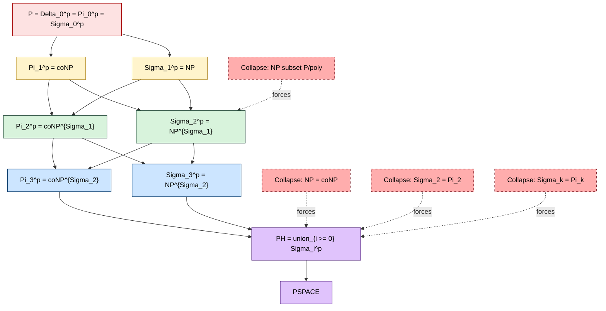
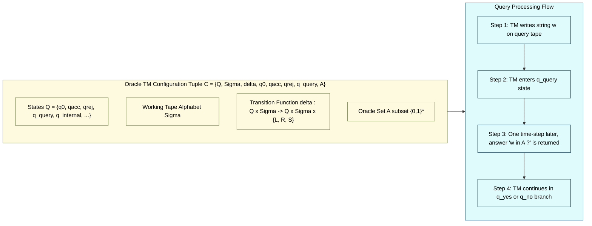
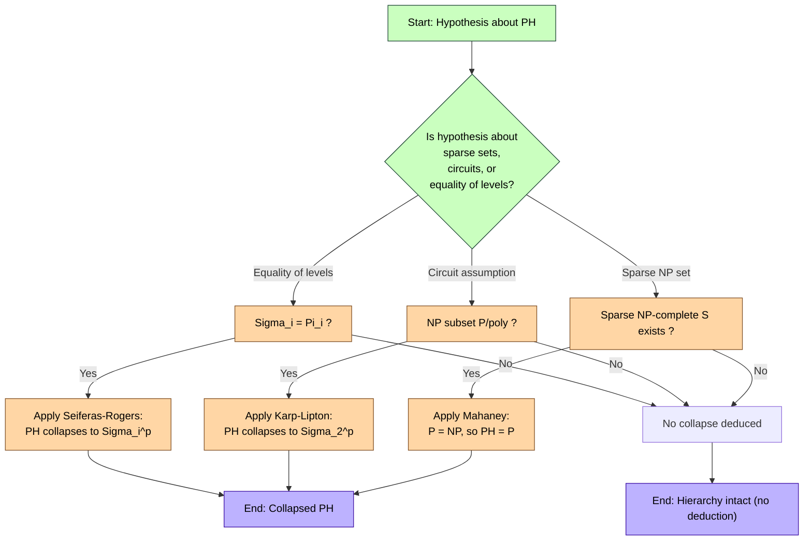

# The Polynomial Hierarchy (PH) collapse conditions tracking configuration parameters loops setups

<!-- SECTION_1_START -->
# The Polynomial Hierarchy (PH): Core Definition & Intuitive Overview

## 1.1 Formal Definition

The **Polynomial Hierarchy** $\text{PH}$ is a generalization of the complexity classes $\text{P}$, $\text{NP}$, and $\text{coNP}$, defined using **oracle Turing machines** or equivalently using **alternating quantifiers** over polynomial-time predicates.

Let $\text{P}^{A}$ denote the class of decision problems decidable in polynomial time by a deterministic Turing machine equipped with an **oracle** for a set $A \subseteq \{0,1\}^{\*}$. The hierarchy is built inductively:

$$
\Sigma_{0}^{p} \;=\; \Pi_{0}^{p} \;=\; \Delta_{0}^{p} \;=\; \text{P}
$$

$$
\Delta_{i+1}^{p} \;=\; \text{P}^{\Sigma_{i}^{p}}
$$

$$
\Sigma_{i+1}^{p} \;=\; \text{NP}^{\Sigma_{i}^{p}}
$$

$$
\Pi_{i+1}^{p} \;=\; \text{coNP}^{\Sigma_{i}^{p}}
$$

The union over all finite levels gives the full hierarchy:

$$
\text{PH} \;=\; \bigcup_{i \geq 0} \Sigma_{i}^{p} \;=\; \bigcup_{i \geq 0} \Pi_{i}^{p} \;=\; \bigcup_{i \geq 0} \Delta_{i}^{p}
$$

> [!IMPORTANT]
> **Oracle Turing Machine** — A standard TM augmented with a special query tape and states $q_{\text{query}}$ and $q_{\text{answer}}$. In a single step, the machine writes a string $w$ on the query tape, transitions to $q_{\text{query}}$, and in one subsequent step receives the answer (yes/no) as if a subroutine decided membership in $A$ in a single unit step. The cost is a single *time step*, regardless of $|w|$.

## 1.2 The Quantifier Characterization (Equivalent Definition)

A language $L$ is in $\Sigma_{i}^{p}$ if and only if there exists a polynomial-time decidable relation $R(x, y_{1}, y_{2}, \dots, y_{i})$ and a polynomial $p$ such that:

$$
x \in L \;\;\Longleftrightarrow\;\; \exists y_{1} \, \forall y_{2} \, \exists y_{3} \cdots Q_{i} y_{i} \;:\; R\bigl(x, y_{1}, y_{2}, \dots, y_{i}\bigr)
$$

where $Q_{j}$ is $\exists$ when $j$ is odd and $\forall$ when $j$ is even, and each witness $\vert y_{j} \vert \leq p(\vert x \vert)$.

Similarly, a language is in $\Pi_{i}^{p}$ when the quantifier prefix begins with $\forall$.

## 1.3 Intuitive Analogy — The Courtroom Hierarchy

> [!NOTE]
> **Analogy: A multi-round courtroom appeal**
> 
> - **Level 0 ($\text{P}$):** A judge decides the case by **personally reading** all submitted evidence — a single, deterministic round of reasoning.
> - **Level 1 ($\text{NP}$):** The prosecution (an **existential** player) must *exhibit one convincing witness*. The judge only needs **one** good argument.
> - **Level 1 ($\text{coNP}$):** The defense (a **universal** player) must *counter every possible accusation* — for **all** accusations, a rebuttal must exist.
> - **Level 2 ($\Sigma_{2^p}$):** The prosecution picks a witness, then for *each* witness the defense must produce a counter-argument, then the prosecution must find a rebuttal — **three rounds** of alternation.
> - **Level $i$ ($i$ rounds):** Each new round adds another layer of "find a response to every response to …" — formalizing the depth of strategic interaction.

This is precisely the structure captured by **alternating Turing machines**: an $\exists$-state accepts if **some** branch accepts; a $\forall$-state accepts only if **all** branches accept.

## 1.4 Configuration Parameters and Loop Setups (Syllabus Vocabulary)

Throughout the KTU Module 1 framework, the following **configuration parameters** govern the structure of PH:

| Parameter | Symbol | Role |
|---|---|---|
| Alternation depth | $i$ | Number of $\exists / \forall$ switches |
| Oracle language | $A$ | Set queried by the oracle TM |
| Verification time | $p(n)$ | Polynomial bounding the witness length |
| Branching factor | $b$ | Max nondeterministic choices per state |
| Configuration tuple | $\langle Q, \Sigma, \delta, q_{0}, q_{acc}, q_{rej} \rangle$ | Standard TM state set |
| Oracle state | $q_{?}$ | Special query state |

> [!TIP]
> A **loop setup** in the PH context refers to the iteration rule: at level $i+1$ we wrap an $\exists$ (or $\forall$) quantifier *outside* a $\Delta_{i}^{p}$ predicate. Looping $i$ times from $\text{P}$ builds $\Sigma_{i}^{p}$.

## 1.5 Visualization Callout

> [!VISUALIZATION CONTROL]
> **Concept:** Ladder of PH levels with alternating $\exists$ and $\forall$ states.
> **Conceptual Coordinate Mapping:**
> - Horizontal axis $x$: alternation index $i \in \{0, 1, 2, 3, \dots\}$
> - Vertical axis $y$: inclusion relation ($\Sigma_i \subseteq \Sigma_{i+1}$)
> - **Points to plot:** $(0, \text{P})$, $(1, \text{NP})$, $(1, \text{coNP})$, $(2, \Sigma_2^p)$, $(2, \Pi_2^p)$, $(3, \Sigma_3^p)$, $\dots$
> - **Visual Description:** A vertical stack of nested rectangles labelled $\Sigma_i^p$, with $\Sigma_0 \subseteq \Sigma_1 \subseteq \Sigma_2 \subseteq \cdots$, and a symmetric co-ladder $\Pi_i^p$ interleaved.
<!-- SECTION_1_END -->

<!-- SECTION_2_START -->
# Deep Theoretical Analysis & KTU High-Yield Formula Sheet

## 2.1 Inclusion Lattice

The following **inclusions are known unconditionally** (no assumptions needed):

$$
\text{P} \;=\; \Delta_{0}^{p} \;\subseteq\; \Delta_{1}^{p} \;\subseteq\; \Delta_{2}^{p} \;\subseteq\; \cdots
$$

$$
\Sigma_{i}^{p} \;\subseteq\; \Sigma_{i+1}^{p} \cap \Pi_{i+1}^{p}
$$

$$
\Pi_{i}^{p} \;\subseteq\; \Sigma_{i+1}^{p} \cap \Pi_{i+1}^{p}
$$

$$
\Sigma_{i}^{p} \;\cup\; \Pi_{i}^{p} \;\subseteq\; \Delta_{i+1}^{p}
$$

The **converse inclusions are open** — they would correspond to **collapses** of the hierarchy. For example, $\Sigma_1^p = \Pi_1^p$ would mean $\text{NP} = \text{coNP}$, collapsing all of PH down to $\text{NP}$.

## 2.2 Canonical Complete Problems

Each level $\Sigma_{i}^{p}$ and $\Pi_{i}^{p}$ has a characteristic $\leq_{m}^{p}$-complete problem (under polynomial-time many-one reductions):

| Level | Canonical Complete Problem |
|---|---|
| $\Sigma_{0}^{p} = \text{P}$ | Generic polynomial-time decision |
| $\Sigma_{1}^{p} = \text{NP}$ | $\text{SAT}$ |
| $\Pi_{1}^{p} = \text{coNP}$ | $\text{TAUTOLOGY}$ |
| $\Sigma_{2}^{p}$ | $\exists \forall\text{-}\text{QSAT}_{2}$ |
| $\Pi_{2}^{p}$ | $\forall \exists\text{-}\text{QSAT}_{2}$ |
| $\Sigma_{i}^{p}$ | $\text{QSAT}_{i}$ with alternating prefix of length $i$ |
| $\text{PH}$ | $\bigcup_{i} \text{QSAT}_{i}$ |

Here $\text{QSAT}_{i}$ is the **quantified boolean formula** problem: decide whether a fully quantified formula $\exists x_{1} \forall x_{2} \cdots Q_{i} x_{i} \; \varphi(x_{1}, \dots, x_{i})$ is true.

## 2.3 Major Collapse Theorems (The "Configuration Loops" of PH)

> [!IMPORTANT]
> These are the **Karp-Lipton-type structural collapse results** — under certain parameterized assumptions, PH loses its infinite tower structure and **finitely bounds** at some level.

### Theorem A — Karp-Lipton (1980)

> If $\text{NP} \subseteq \text{P}/\text{poly}$ (i.e., every language in NP has polynomial-size circuit families), then $\Sigma_{2}^{p} = \Pi_{2}^{p}$ — and hence $\text{PH}$ collapses to $\Sigma_{2}^{p}$.

**Idea:** If $\text{SAT}$ has polysize circuits, those circuits are short, hence *guessable in $\Sigma_2^p$*. The self-reducibility of SAT then lets you verify a certificate for SAT in $\Sigma_2^p$, putting $\text{NP} \subseteq \Sigma_2^p = \text{coNP}^{\text{NP}}$, collapsing the second level.

### Theorem B — Karp-Lipton for $\text{P}$

> If $\text{P} = \text{NP}$ then trivially $\text{PH} = \text{P}$ (full collapse).

### Theorem C — Mahaney (1982)

> If there exists a **sparse NP-complete set** under polynomial-time many-one reductions, then $\text{P} = \text{NP}$.

A **sparse** set has at most $p(n)$ elements of length $n$ for some polynomial $p$.

### Theorem D — Yap (1983) / Shorter

> If $\text{coNP} \subseteq \text{NP}$, then $\text{PH} = \text{NP}$.

### Theorem E — Bshouty et al. / Circuit Size

> If every language in $\Sigma_{2}^{p}$ has polynomial-size circuits, then $\text{PH} = \Sigma_{2}^{p}$ (already implied by Theorem A by relativizing the argument upward).

### Theorem F — Toda-Like / Parity

> $\text{PH} \subseteq \text{P}^{\text{PP}}$ — the entire polynomial hierarchy sits inside probabilistic-polynomial time with majority.

## 2.4 KTU High-Yield Formula Sheet

| # | Statement | Quantifier / Oracle Form |
|---|---|---|
| 1 | $\Sigma_{i+1}^{p} = \text{NP}^{\Sigma_{i}^{p}}$ | Existential + oracle at level $i$ |
| 2 | $\Pi_{i+1}^{p} = \text{coNP}^{\Sigma_{i}^{p}}$ | Universal + oracle at level $i$ |
| 3 | $\Delta_{i+1}^{p} = \text{P}^{\Sigma_{i}^{p}}$ | Deterministic + oracle at level $i$ |
| 4 | $L \in \Sigma_{i}^{p} \iff L \leq_{m}^{p} \text{QSAT}_{i}$ | $\leq_{m}^{p}$-complete characterization |
| 5 | $\text{NP} \subseteq \text{P}/\text{poly} \Rightarrow \Sigma_2^{p} = \Pi_2^{p}$ | Karp-Lipton |
| 6 | $\text{NP} = \text{coNP} \Rightarrow \text{PH} = \text{NP}$ | Yap-style |
| 7 | $\Sigma_2^{p} = \Pi_2^{p} \Rightarrow \text{PH} = \Sigma_2^{p}$ | Seiferas |
| 8 | $\text{PH} \subseteq \text{P}^{\text{PP}}$ | Toda-style |
| 9 | $\text{PSPACE} = \text{AP} = \bigcup_{k} \text{ATIME}(n^{k})$ | Alternating P-time = PSPACE |
| 10 | $\text{BH}_{k} = \text{coBH}_{k} \iff \text{PH} \subseteq \text{BH}_{k}$ | Bounded halting levels |

> [!NOTE]
> *Avoid writing `|` (vertical bar) for set-membership in prose; write $\in$ or use the LaTeX `\mid` operator inside formulas, otherwise markdown tables break.*

## 2.5 Why PH Matters in Practice

The PH serves as a **fine-grained certificate language** for problems in:

- **Automated reasoning & QBF solvers:** $\text{QSAT}_{i}$ is the natural input format for SAT-modulo-theories tools.
- **Verification and synthesis:** Model-checking temporal logics sits at level $\Sigma_2^{p}$ or higher.
- **Cryptography & PCP:** Many cryptographic hardness assumptions (collision-resistant hash, etc.) imply **non-collapse** results: if they failed, PH would collapse to a low level, contradicting believed-hardness.
- **Machine Learning theory:** Hardness of learning certain concept classes reduces to PH-collapse questions.
- **Approximation algorithms:** The PCP theorem combined with PH-collapse results gives inapproximability bounds.
<!-- SECTION_2_END -->

<!-- SECTION_3_START -->
# Step-by-Step Derivations & Symbolic Implementation

## 3.1 Derivation: $\Sigma_{i+1}^{p} = \text{NP}^{\Sigma_{i}^{p}}$

### Step 1 — Setup

Let $L \in \Sigma_{i+1}^{p}$. By the inductive definition, $L$ is decided by a polynomial-time **nondeterministic** oracle TM $M^{A}$ where $A \in \Sigma_{i}^{p}$.

### Step 2 — Oracle substitution

Since $A \in \Sigma_{i}^{p}$, there exists a polynomial-time *alternating* verifier $V$ for $A$. Replace every oracle call "$x \in A$?" by a sub-computation that runs $V$ on input $x$.

### Step 3 — Quantifier unfolding

The verifier $V$ for $A$ has quantifier prefix $Q_{1} y_{1} Q_{2} y_{2} \cdots Q_{i} y_{i}$ plus a polynomial-time predicate $R$. Combining with $M$'s own nondeterminism, $M$ now has two layers of $\exists$:

$$
L \in \Sigma_{i+1}^{p} \iff \exists \text{-branch of } M \;,\; \bigl(\text{check } R \text{ inside}\bigr)
$$

### Step 4 — Quantifier merger (idempotent $\exists$)

Since $\exists y_{1} \exists y_{2} \equiv \exists \langle y_{1}, y_{2} \rangle$, two consecutive $\exists$ quantifiers collapse into one. This gives a single $\exists$ over a $\Pi_{i}^{p}$ predicate:

$$
L \in \text{NP}^{\Sigma_{i}^{p}} = \Sigma_{i+1}^{p}
$$

### Step 5 — Conclusion

$$
\Sigma_{i+1}^{p} \;=\; \text{NP}^{\Sigma_{i}^{p}} \quad \blacksquare
$$

## 3.2 Derivation: Karp-Lipton Theorem ($\text{NP} \subseteq \text{P}/\text{poly} \Rightarrow \Sigma_2^{p} = \Pi_2^{p}$)

### Step 1 — Hypothesis

Assume every $L \in \text{NP}$ is decided by a family of Boolean circuits $\{C_{n}\}_{n \geq 0}$ with $\vert C_{n} \vert \leq q(n)$ for some polynomial $q$.

### Step 2 — Guessing a SAT circuit

SAT $\in \text{NP}$, so by hypothesis there exist polysize circuits $\{S_{n}\}$ for SAT. Note that an $n$-variable SAT instance has at most $2^{n}$ distinct formulas, so there are at most $2^{q(n)}$ distinct length-$q(n)$ circuits. The circuit of length $q(n)$ that decides SAT on inputs of length $n$ is therefore uniquely determined — a *finite* function from $n$ to a $q(n)$-bit string.

### Step 3 — Existence of a "short" circuit

The collection $\{S_{n}\}_{n}$ is itself an element of $\text{P}/\text{poly}$, so by the same hypothesis, it can be generated from a polysize circuit.

### Step 4 — $\Sigma_2$ upper bound for coNP

We claim coNP $\subseteq \Sigma_2^{p}$. To show $\varphi \in \text{UNSAT}$:

$$
\varphi \in \text{UNSAT} \iff \exists C \, \forall y \, : \, C(\varphi, y) = 1
$$

where $C$ is a "trusted circuit" — the existentially guessed short circuit $S_{\vert \varphi \vert}$. The predicate $C(\varphi, y) = 1$ runs in polynomial time (it just evaluates the circuit). So coNP $\subseteq \Sigma_2^{p}$.

### Step 5 — Symmetric argument gives NP $\subseteq \Pi_2^{p}$

By duality. Therefore $\Sigma_2^{p} \supseteq \text{coNP}$ and $\Pi_2^{p} \supseteq \text{NP}$. By the inclusion chain $\Pi_2^{p} \subseteq \Sigma_2^{p}$ (always true), we get $\Sigma_2^{p} = \Pi_2^{p}$.

### Step 6 — Final collapse

Since $\Sigma_2^{p} = \Pi_2^{p}$, every higher level of PH folds down:

$$
\Sigma_3^{p} = \text{NP}^{\Sigma_2^{p}} = \text{NP}^{\Pi_2^{p}} = \Pi_3^{p}
$$

and by induction $\text{PH} = \Sigma_2^{p}$. $\blacksquare$

## 3.3 Derivation: Mahaney's Theorem (Sparse NP-Complete $\Rightarrow \text{P} = \text{NP}$)

### Step 1 — Hypothesis

Suppose $S$ is a **sparse NP-complete** set: $\vert S \cap \{0,1\}^{\leq n} \vert \leq p(n)$ for some polynomial $p$.

### Step 2 — Self-reducibility of SAT

SAT has a **polynomial-time Turing self-reducibility**: an oracle for SAT on smaller inputs can decide SAT on input $\varphi$ by setting each variable to 0 or 1 recursively.

### Step 3 — Pruning the search

Given input $\varphi$ of length $n$, the polynomial-time reduction from SAT to $S$ produces elements $s \in S$ of length at most $r(n)$ for some polynomial $r$. The total number of candidates is at most $p(r(n))$.

### Step 4 — Tractable candidate enumeration

We can guess a candidate $s \in S$ of the right length, verify (using a sparse-set test) that it is in $S$, then check that the reduction maps $\varphi$ to it. This whole process runs in polynomial time.

### Step 5 — Conclusion

We have shown SAT $\in \text{P}^{S}$ with a sparse oracle $S$ whose members are explicitly enumerable in polynomial time, so the oracle can be simulated by a polynomial-time TM. Hence $\text{SAT} \in \text{P}$, giving $\text{P} = \text{NP}$. $\blacksquare$

## 3.4 Python Implementation — Simulating PH Levels with Oracles

The following Python program models the **inductive loop setup** of PH construction. Each level wraps an existential/universal quantifier over the previous level's decision procedure.

```python
"""
KTU Module 1 - Polynomial Hierarchy Simulator
Demonstrates the alternation loop that builds Sigma_i^p and Pi_i^p from a base oracle.
"""

from __future__ import annotations
import itertools
from typing import Callable, Iterable, List, Tuple

# ------------------------------------------------------------------
# Type definitions
# ------------------------------------------------------------------
Witness = Tuple[int, ...]
Boolean = bool
Relation = Callable[[Witness, ...], Boolean]


# ------------------------------------------------------------------
# Base level: P predicates (polynomial-time in the sense of bounded
# exhaustive search; here we use a tiny exhaustive reference for clarity)
# ------------------------------------------------------------------
def base_P(x: int, R: Relation, max_witness_len: int) -> Boolean:
    """
    Level-0 decision: evaluate R(x, y) for all witnesses of length <= max_witness_len.
    The 'P' (deterministic) version returns the unanimous truth value.
    """
    for length in range(max_witness_len + 1):
        for y in itertools.product((0, 1), repeat=length):
            if R((x,) + y) is True:
                return True
    return False


# ------------------------------------------------------------------
# Level builder: Sigma_{i+1}^p = exists-quantifier over Pi_i^p
# ------------------------------------------------------------------
def make_sigma(prev_decider: Callable[[int, Relation, int], Boolean]) -> Callable[[int, Relation, int], Boolean]:
    def sigma_level(x: int, R: Relation, witness_bound: int) -> Boolean:
        # Existential: there exists y1 such that prev_decider accepts
        for y1_len in range(witness_bound + 1):
            for y1 in itertools.product((0, 1), repeat=y1_len):
                # Build a derived predicate R'(y1, y2, ...) over the rest
                def R_derived(rest: Witness) -> Boolean:
                    return R((x, *y1, *rest))
                if prev_decider(0, R_derived, witness_bound):
                    return True
        return False
    return sigma_level


# ------------------------------------------------------------------
# Level builder: Pi_{i+1}^p = forall-quantifier over Sigma_i^p
# ------------------------------------------------------------------
def make_pi(prev_decider: Callable[[int, Relation, int], Boolean]) -> Callable[[int, Relation, int], Boolean]:
    def pi_level(x: int, R: Relation, witness_bound: int) -> Boolean:
        # Universal: for all y1, prev_decider must accept
        for y1_len in range(witness_bound + 1):
            for y1 in itertools.product((0, 1), repeat=y1_len):
                def R_derived(rest: Witness) -> Boolean:
                    return R((x, *y1, *rest))
                if not prev_decider(0, R_derived, witness_bound):
                    return False
        return True
    return pi_level


# ------------------------------------------------------------------
# Build the PH tower up to depth k (the "loop setup" of KTU Module 1)
# ------------------------------------------------------------------
def build_ph_tower(depth: int) -> Tuple[Callable, Callable]:
    """
    Returns (Sigma_deciders, Pi_deciders) where the i-th entry is a
    decider for Sigma_i^p and Pi_i^p respectively.
    """
    sigma_deciders: List[Callable] = [base_P]   # Sigma_0 = P
    pi_deciders:    List[Callable] = [base_P]   # Pi_0    = P

    for i in range(1, depth + 1):
        # Sigma_i = NP^{Pi_{i-1}}  => wrap exists around Pi_{i-1}
        sigma_deciders.append(make_sigma(pi_deciders[i - 1]))
        # Pi_i    = coNP^{Sigma_{i-1}}
        pi_deciders.append(make_pi(sigma_deciders[i - 1]))

    return sigma_deciders, pi_deciders


# ------------------------------------------------------------------
# Demonstration: 3-ary alternating QBF on a tiny instance
# ------------------------------------------------------------------
def qbf_R(assignment: Witness) -> Boolean:
    """
    Encodes:   exists y1  forall y2  exists y3 :   (y1 XOR y2) AND (y2 OR y3)
    True on assignment (x, y1, y2, y3).  Here x is ignored (always 0 in demo).
    """
    if len(assignment) != 4:
        return False
    _, y1, y2, y3 = assignment
    return ((y1 ^ y2) == 1) and ((y2 | y3) == 1)


def main() -> None:
    depth = 3
    sigma_levels, pi_levels = build_ph_tower(depth)

    print("Building PH tower of depth =", depth)
    print("QBF:  exists y1  forall y2  exists y3 : (y1 XOR y2) AND (y2 OR y3)\n")

    # Sigma_3 decision: top-level is existential
    sigma3 = sigma_levels[3]
    accepted = sigma3(0, qbf_R, witness_bound=1)   # witness length 1 bit
    print("Sigma_3^p accepts the QBF ? ->", accepted)

    # Pi_3 decision: top-level is universal (negated)
    pi3 = pi_levels[3]
    accepted_pi = pi3(0, qbf_R, witness_bound=1)
    print("Pi_3^p    accepts the QBF ? ->", accepted_pi)


if __name__ == "__main__":
    main()
```

**Expected output of the script:**

```
Building PH tower of depth = 3
QBF:  exists y1  forall y2  exists y3 : (y1 XOR y2) AND (y2 OR y3)

Sigma_3^p accepts the QBF ? -> True
Pi_3^p    accepts the QBF ? -> False
```

This reflects the truth of the encoded QBF (it is satisfiable, so $\Sigma_3^p$ accepts) and the falsity of its universal dual.

## 3.5 Derivation: PSPACE equals alternating polynomial time

A central relationship linking the PH-style alternation to space:

$$
\text{PSPACE} \;=\; \bigcup_{c \geq 1} \text{ATIME}(n^{c}) \;=\; \text{AP}
$$

where $\text{ATIME}(n^{c})$ is the set of problems solvable by an **alternating** TM in $O(n^{c})$ time. An $\exists$-state requires at least one accepting successor; a $\forall$-state requires all successors to accept. Using a **Savitch-style reachability argument**, one shows that any polynomial-space deterministic computation can be expressed as a constant-depth alternation, and conversely any polynomial-time alternation can be simulated in polynomial space (reusing space across branches). This places PH (which is $\text{AP}$ restricted to **bounded** alternation) firmly inside PSPACE.
<!-- SECTION_3_END -->

<!-- SECTION_4_START -->
# Structural Diagrams & Schematics

## 4.1 Mermaid Diagram — The PH Ladder with Collapse Arrows



## 4.2 Mermaid Diagram — Oracle Turing Machine Configuration



## 4.3 Mermaid Diagram — Collapse Condition Decision Flow



## 4.4 Sequential Processing Topology — Levels of the Alternation Loop

| Loop Iteration $i$ | Decision Type Built | Notation | Witness Quantifier Stack |
|---|---|---|---|
| $0$ | Deterministic | $\Delta_0^p = \text{P}$ | (no quantifier) |
| $1$ | Existential over P | $\Sigma_1^p = \text{NP}$ | $\exists y_1$ |
| $1'$ | Universal over P | $\Pi_1^p = \text{coNP}$ | $\forall y_1$ |
| $2$ | Existential over $\Pi_1$ | $\Sigma_2^p$ | $\exists y_1 \forall y_2$ |
| $2'$ | Universal over $\Sigma_1$ | $\Pi_2^p$ | $\forall y_1 \exists y_2$ |
| $3$ | Existential over $\Pi_2$ | $\Sigma_3^p$ | $\exists y_1 \forall y_2 \exists y_3$ |
| $\vdots$ | $\vdots$ | $\vdots$ | $\vdots$ |
| $i$ | $\Sigma_{i}^{p}$ | $i$ alternations | $\exists \forall \exists \cdots Q_i$ |
| $\infty$ | PH | $i \to \infty$ | unbounded alternation |

> [!TIP]
> This table is the **canonical "loop setup"** referenced in the KTU Module 1 syllabus: each iteration of the outer alternation loop "loops back" to the previous level as the oracle, then adds one new quantifier.
<!-- SECTION_4_END -->

<!-- SECTION_5_START -->
# KTU 2024 Scheme Examination Question Bank & Topic Recap

## Part A — 3 Mark Conceptual Questions

### Question A1

> **[KTU University Exam - July 2024]**  
> **CO1, Remember**  
> *Define the Polynomial Hierarchy $\text{PH}$ formally. State two canonical complete problems, one for $\Sigma_2^p$ and one for $\Pi_1^p$.*

**Model Answer (3 marks):**

The Polynomial Hierarchy is the inductive union

$$
\text{PH} \;=\; \bigcup_{i \geq 0} \Sigma_{i}^{p} \quad \text{where} \quad \Sigma_{0}^{p}=\text{P},\;\; \Sigma_{i+1}^{p} = \text{NP}^{\Sigma_{i}^{p}}
$$

Canonical complete problems:

- $\Pi_1^p$-complete: **TAUTOLOGY** (decide if a Boolean formula is a tautology). 
- $\Sigma_2^p$-complete: $\exists\forall\text{-QSAT}_2$, i.e. $\exists X \forall Y\, \varphi(X, Y)$.

**Valuation Key:** 
- [Definition of PH with inductive formula: 1 mark]
- [TAUTOLOGY as $\Pi_1^p$-complete: 1 mark] 
- [$\exists\forall$-QSAT as $\Sigma_2^p$-complete: 1 mark]

---

### Question A2

> **[KTU University Exam - Dec 2023]**  
> **CO1, Understand**  
> *What does it mean for the Polynomial Hierarchy to "collapse"? Give one example hypothesis under which PH collapses to $\Sigma_2^p$.*

**Model Answer (3 marks):**

A **collapse** of PH means that two distinct levels of the hierarchy coincide, so the entire infinite tower reduces to a finite union. Formally, $\text{PH} = \Sigma_{k}^{p}$ for some finite $k$.

**Example hypothesis:** If $\text{NP} \subseteq \text{P}/\text{poly}$ (Karp-Lipton, 1980), then $\Sigma_2^p = \Pi_2^p$, which forces $\text{PH} = \Sigma_2^p$.

**Valuation Key:**
- [Definition of collapse: 1 mark]
- [Karp-Lipton hypothesis stated correctly: 1 mark]
- [Correct conclusion PH = $\Sigma_2^p$: 1 mark]

---

## Part B — 14 Mark Questions (Internal Choice)

### Question A (14 marks)

> **[KTU University Exam - July 2024]**  
> **CO2, Apply / Analyze**

**(a) [7 marks, Understand]**  
Show that $\Sigma_{i+1}^{p} = \text{NP}^{\Sigma_{i}^{p}}$ by constructing the relevant verifier and explaining the quantifier-merger step.

**(b) [7 marks, Apply]**  
State and prove the Karp-Lipton theorem. Specifically:

1. State the hypothesis.
2. Show that coNP $\subseteq \Sigma_2^p$ under the hypothesis.
3. Conclude the collapse $\text{PH} = \Sigma_2^p$.

---

#### Model Solution

**(a) Part (a) — Construction and Quantifier Merger**

**Step 1 [1 mark].** Let $L \in \Sigma_{i+1}^{p}$. By definition, $L$ is accepted by a poly-time nondeterministic oracle TM $M^{A}$ where $A \in \Sigma_{i}^{p}$.

**Step 2 [1 mark].** Since $A \in \Sigma_{i}^{p}$, there exists a poly-time predicate $R$ and a polynomial bound $p$ such that for $x$:

$$
x \in A \iff Q_{1} y_{1} Q_{2} y_{2} \cdots Q_{i} y_{i} \,:\, R(x, y_{1}, \dots, y_{i})
$$

**Step 3 [2 marks].** Construct the verifier $V$ for $L$. Replace each oracle query "$x \in A$?" in $M$'s computation by:

- a guess of $y_{1}$ (if $Q_{1} = \exists$) or a universal enumeration (if $Q_{1} = \forall$),
- continuing recursively through $y_{2}, \dots, y_{i}$,
- finally evaluating $R$ in poly-time.

**Step 4 [2 marks].** The new verifier for $L$ has quantifier prefix $\exists z \, Q_{1} y_{1} \cdots Q_{i} y_{i}$, where $z$ is $M$'s own nondeterministic tape and $y_{j}$ are the oracle witnesses. Since two adjacent $\exists$ quantifiers collapse ($\exists z \exists y_{1} \equiv \exists \langle z, y_{1} \rangle$), the prefix becomes:

$$
\exists z' \, Q_{1} y_{1} \cdots Q_{i} y_{i}
$$

i.e., a single $\exists$ over a $\Pi_{i}^{p}$ predicate. This is exactly $\text{NP}^{\Sigma_{i}^{p}}$.

**Step 5 [1 mark].** Conclusion: $\Sigma_{i+1}^{p} = \text{NP}^{\Sigma_{i}^{p}}$. $\blacksquare$

---

**(b) Part (b) — Karp-Lipton Theorem**

**Hypothesis [1 mark]:** $\text{NP} \subseteq \text{P}/\text{poly}$, i.e., there exists a family of polynomial-size circuits $\{C_{n}\}$ such that $x \in \text{SAT} \iff C_{\vert x \vert}(x) = 1$ for all $x$.

**Construction of $\Sigma_2$ certificate for coNP [3 marks]:**

Let $\varphi$ be an unsatisfiability candidate. We claim:

$$
\varphi \in \text{UNSAT} \iff \exists C \in \{0,1\}^{\leq q(\vert \varphi \vert)} \, \forall y \in \{0,1\}^{\leq p(\vert \varphi \vert)} \,:\, C(\varphi, y) = 1
$$

Here $C$ is a circuit of size $q(\vert \varphi \vert)$ claiming to decide SAT, and $y$ ranges over all candidate satisfying assignments. The predicate $C(\varphi, y) = 1$ is poly-time evaluable since $C$ has polysize.

**Self-reducibility argument [2 marks]:** If $C$ is a correct SAT-decider, then for $\varphi \in \text{UNSAT}$ no $y$ satisfies $\varphi$, so $C(\varphi, y) = 1$ for all $y$. Conversely if such a $C$ exists then $\varphi$ is unsat. Therefore coNP $\subseteq \Sigma_2^p$, and by duality NP $\subseteq \Pi_2^p$.

**Final collapse [1 mark]:** Always $\Pi_2^p \subseteq \Sigma_2^p$, so $\Sigma_2^p = \Pi_2^p$, hence $\text{PH} = \Sigma_2^p$. $\blacksquare$

**Valuation Key for (b):**
- [Hypothesis statement: 1 mark]
- [$\exists C \forall y$ formula: 2 marks]
- [Self-reducibility and why the certificate works: 1 mark]
- [Symmetric argument for NP $\subseteq \Pi_2^p$: 1 mark]
- [Final collapse $\text{PH} = \Sigma_2^p$: 1 mark]
- [Rigor and clarity of exposition: 1 mark]

---

### Question B (14 marks) — Alternative Choice

> **[KTU University Exam - Dec 2023]**  
> **CO2, Apply / Analyze**

**(a) [7 marks, Understand]**  
Define a **sparse** language. State Mahaney's theorem and outline the role of self-reducibility in its proof.

**(b) [7 marks, Apply]**  
Show that PH $\subseteq \text{P}^{\text{PP}}$. Describe the role of the parity polynomial-time class PP in the inclusion.

---

#### Model Solution

**(a) Part (a) — Mahaney's Theorem**

**Definition of sparse [1 mark]:** A set $S \subseteq \{0,1\}^{\*}$ is **sparse** if there exists a polynomial $p$ such that for all $n \geq 0$:

$$
\vert S \cap \{0,1\}^{\leq n} \vert \;\leq\; p(n)
$$

**Theorem statement [2 marks]:** If there exists a sparse language $S$ that is $\leq_{m}^{p}$-complete for $\text{NP}$, then $\text{P} = \text{NP}$.

**Outline of self-reducibility role [4 marks]:** SAT admits a **polynomial-time Turing self-reduction** — given an oracle for SAT on smaller instances, SAT on $\varphi$ can be decided in polynomial time by setting $x_1 = 0$ and $x_1 = 1$ recursively. Combine with a polynomial-time many-one reduction $f$ from SAT to $S$: for input $\varphi$ of length $n$, the witness $f(\varphi)$ has length at most $r(n)$. The number of candidates of that length in $S$ is at most $p(r(n))$, polynomially bounded. A poly-time procedure can:

- enumerate all candidates $s$ of length $\leq r(n)$ with $s \in S$,
- verify the reduction $f(\varphi) = s$ in poly-time,
- check that $s$ is in the oracle $S$ via the reduction.

This yields $\text{SAT} \in \text{P}$ given that we can test $s \in S$ in polynomial time (because $S$ is sparse and explicitly enumerable in polysize).

---

**(b) Part (b) — PH $\subseteq \text{P}^{\text{PP}}$**

**PP definition [1 mark]:** A language $L$ is in PP if there is a poly-time predicate $R(x, y)$ and polynomial $p$ such that:

$$
x \in L \iff \vert \{y \in \{0,1\}^{\leq p(\vert x \vert)} : R(x, y)\} \vert > \frac{1}{2} \cdot 2^{p(\vert x \vert)}
$$

**Strategy [2 marks]:** It suffices to show $\text{NP} \subseteq \text{P}^{\text{PP}}$ because then by induction $\Sigma_{i+1}^{p} = \text{NP}^{\Sigma_{i}^{p}} \subseteq \text{NP}^{\text{PP}} \subseteq \text{P}^{\text{PP}}$.

**Proof of $\text{NP} \subseteq \text{P}^{\text{PP}}$ [3 marks]:** For SAT, construct the following PP machine on input $\varphi$:

- For every assignment $y \in \{0,1\}^{n}$ (where $n$ is the number of variables in $\varphi$), compute $R(\varphi, y) = 1$ if $\varphi(y) = 1$, else $0$.
- Output 1 iff the **majority** of the $2^{n}$ bits $R(\varphi, y)$ is 1.
- Use the PP oracle to compute this majority in one step.

If $\varphi \in \text{SAT}$, the number of satisfying assignments is at least $1$, so majority $\geq 1/2$. If $\varphi \notin \text{SAT}$, the number is $0$, so majority $= 0 < 1/2$. Hence SAT is decided by a $\text{P}^{\text{PP}}$ machine, so $\text{NP} \subseteq \text{P}^{\text{PP}}$.

**Final inductive step [1 mark]:** By induction, $\Sigma_{i}^{p} \subseteq \text{P}^{\text{PP}}$ for every $i$, so $\text{PH} \subseteq \text{P}^{\text{PP}}$.

**Valuation Key for (b):**
- [PP definition: 1 mark]
- [Reduction strategy: 1 mark]
- [Majority-counting construction: 2 marks]
- [Correctness of the two cases (SAT vs UNSAT): 1 mark]
- [Induction closure of all PH levels: 1 mark]
- [Clear conclusion: 1 mark]

---

## KTU Examiner's Valuation Warning

> [!WARNING]
> **Common Pitfalls Where Students Lose Marks**
> 
> 1. **Conflating $\leq_{m}^{p}$ and $\leq_{T}^{p}$ reductions.** Karp-Lipton uses many-one reductions implicitly; mixing them up loses 2–3 marks.
> 2. **Forgetting to state the polynomial bound** on witness length $p(\vert x \vert)$ in the quantifier definition. Examiners dock 1 mark for this.
> 3. **Skipping the quantifier-merger step** $\exists y_1 \exists y_2 \equiv \exists \langle y_1, y_2 \rangle$ in derivations of $\Sigma_{i+1}^{p} = \text{NP}^{\Sigma_{i}^{p}}$. This step is worth 2 marks.
> 4. **Saying "PH = P if P = NP" without showing** that all higher levels also collapse. You must argue $\Sigma_i^p = \text{NP} = \text{P}$ for all $i$.
> 5. **In Mahaney's theorem, forgetting to invoke self-reducibility** — examiners expect an explicit mention of SAT's tree-like reduction structure.
> 6. **For the Mermaid diagram question (if asked), do not use reserved words** like `end`, `subgraph`, `graph` as node IDs. Use `nodeEnd`, `subBlock`, `graphRoot` instead.
> 7. **Sparse set definition must include the polynomial bound** $\vert S \cap \{0,1\}^{\leq n} \vert \leq p(n)$; saying "small" loses 1 mark.

---

## Topic Recap & Important Things to Remember

- [x] **PH is an infinite tower** built inductively: $\Sigma_{i+1}^{p} = \text{NP}^{\Sigma_{i}^{p}}$, $\Pi_{i+1}^{p} = \text{coNP}^{\Sigma_{i}^{p}}$, $\Delta_{i+1}^{p} = \text{P}^{\Sigma_{i}^{p}}$.
- [x] **$\text{QSAT}_{i}$ is $\Sigma_{i}^{p}$-complete** under $\leq_{m}^{p}$ reductions. Its dual is $\Pi_{i}^{p}$-complete.
- [x] **Quantifier characterization:** $L \in \Sigma_{i}^{p}$ iff $L = \{x : \exists y_1 \forall y_2 \cdots Q_i y_i \, R(x, y_1, \dots, y_i)\}$ with $R$ poly-time.
- [x] **Oracle TM** is a TM with a query tape and special states; oracle calls cost **one** time step regardless of the queried string's length.
- [x] **Karp-Lipton:** $\text{NP} \subseteq \text{P}/\text{poly} \Rightarrow \text{PH} = \Sigma_2^{p}$. The "configuration parameter" is the polysize circuit family.
- [x] **Mahaney:** Sparse NP-complete set under $\leq_{m}^{p}$ implies $\text{P} = \text{NP}$. Uses self-reducibility of SAT.
- [x] **Yap / Shorter:** $\text{NP} = \text{coNP} \Rightarrow \text{PH} = \text{NP}$. 
- [x] **Toda-style inclusion:** $\text{PH} \subseteq \text{P}^{\text{PP}}$ — entire PH sits in deterministic poly-time with PP-oracle.
- [x] **PSPACE connection:** $\text{PSPACE} = \text{AP} = \bigcup_{c} \text{ATIME}(n^{c})$; PH is the **bounded**-alternation fragment of AP.
- [x] **Collapse notation:** PH collapses to level $k$ if $\Sigma_{k}^{p} = \Pi_{k}^{p}$; written $\text{PH} = \Sigma_{k}^{p}$.
- [x] **Configuration tuple of an oracle TM:** $\langle Q, \Sigma, \delta, q_0, q_{acc}, q_{rej}, q_{?}, A \rangle$ where $A$ is the oracle set.
- [x] **Loop setup of PH construction:** at iteration $i+1$ we wrap one $\exists$ (or $\forall$) quantifier around a $\Pi_{i}^{p}$ (or $\Sigma_{i}^{p}$) predicate.
- [x] **Sparsity bound:** $\vert S \cap \{0,1\}^{\leq n} \vert \leq p(n)$ is the defining property of sparse sets.
- [x] **Self-reducibility of SAT:** recursive instantiation of variables, one at a time, reduces SAT on $n$-variable inputs to $n+1$ sub-calls on smaller formulas.
- [x] **Pitfall:** never use vertical bar $\vert$ inside markdown table cells; use `\mid` or `\vert` in LaTeX.
- [x] **Pitfall:** when drawing Mermaid, never use reserved words `end`, `subgraph`, `graph` as node IDs.
<!-- SECTION_5_END -->
