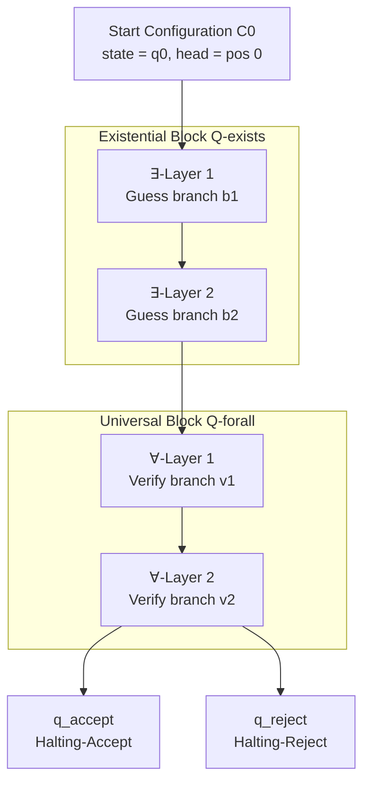
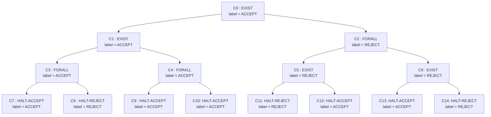
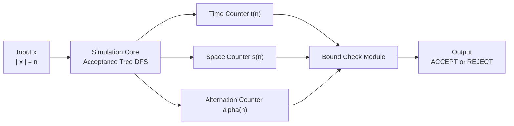

# Alternating Turing Machine (ATM) state transition structures frameworks layouts parameters models

<!-- SECTION_1_START -->
# Alternating Turing Machine (ATM) — State Transition Structures, Frameworks, Layouts, Parameters & Models

> [!IMPORTANT]
> **KTU 2024 Scheme | PECST801 — Computational Complexity | Module 2: Completeness & Alternations**
> *Cognitive Target: Understand → Apply → Analyze* | Mapped to **CO2 / CO3** of the official syllabus.

## 1.1 Formal Academic Definition

An **Alternating Turing Machine (ATM)** is a generalized computation model introduced independently by **Chandra & Stockmeyer (1976)** and **Kozen (1976)** that fuses the determinism of a **DTM** with the parallelism of an **NTM**, by *labelling* machine states as either **existential (∃)** or **universal (∀)**.

Formally, an ATM is a **9-tuple**:

$$
M = \left( Q, \Sigma, \Gamma, \delta, q_0, q_{\text{accept}}, q_{\text{reject}}, Q_{\exists}, Q_{\forall} \right)
$$

Where:
- $Q$ is a finite, non-empty set of control states.
- $\Sigma$ is the finite input alphabet (with the **blank symbol** $b \notin \Sigma$).
- $\Gamma$ is the finite tape alphabet, with $\Sigma \subseteq \Gamma$.
- $q_0 \in Q$ is the unique start state.
- $q_{\text{accept}}, q_{\text{reject}} \in Q$ are the halting states.
- $Q = Q_{\exists} \cup Q_{\forall} \cup \{q_{\text{accept}}, q_{\text{reject}}\}$ is a strict partition.
- $\delta : (Q \setminus \{q_{\text{accept}}, q_{\text{reject}}\}) \times \Gamma \rightarrow \mathcal{P}(Q \times \Gamma \times \{L, R\})$ is the finite **non-deterministic** transition relation.

> [!NOTE]
> **Why this matters for KTU boards:** ATMs collapse two structural axes — *time vs. space* — into one model, and the resulting equivalences (e.g., $AL = P$, $AP = PSPACE$) are board-favourite 14-mark questions.

## 1.2 Intuition: The Tree of Possibilities

Imagine you are a detective interrogating suspects in a branching hallway of rooms.

- An **existential (∃)** state is like a *“there exists a guilty suspect”* branch — the machine **accepts** if **at least one** future path leads to a `q_accept`.
- A **universal (∀)** state is like a *“every witness must agree”* branch — the machine **accepts only if every** future path reaches `q_accept`.

> [!TIP]
> **Plain English Analogy (Chess-AI Style):** A standard NTM playing chess only needs **one** winning line to declare victory (∃-mode). An ATM, when it enters universal mode, is checking that **all** opponent replies (∀-mode) can be refuted — the very essence of game-tree search. This is precisely why **AP = PSPACE**, because optimal play of chess-like games is a PSPACE-complete problem.

## 1.3 Visualizing the State Topology

> [!VISUALIZATION CONTROL]
> **Concept:** Branching Acceptance Tree of an ATM on a 4-symbol input
> **GeoGebra / Desmos Input Equations:**
> * Root: `P0 = (0, 0)`
> * Existential children: `P1 = (-2, -1)`, `P2 = (2, -1)`
> * Universal children of P1: `C1 = (-3, -2)`, `C2 = (-1, -2)`
> * Universal children of P2: `C3 = (1, -2)`, `C4 = (3, -2)`
> * Edges: `P0--P1`, `P0--P2`, `P1--C1`, `P1--C2`, `P2--C3`, `P2--C4`
> **Visual Description:** A two-level tree. The **root** is a single configuration. Its two **existential** children correspond to two non-deterministic moves. Each child has two **universal** children (4 grandchildren total). Acceptance requires the existential branch to succeed AND both its universal sub-branches to succeed.

## 1.4 Acceptance via the Configuration Tree

A **configuration tree** $T_M(x)$ of $M$ on input $x$ is a rooted, ordered tree:
- The **root** is the start configuration $C_0$.
- The **children** of a node $C$ are all configurations reachable in **one** step of $\delta$ from $C$.
- A configuration $C$ is labelled **accepting** if:
  1. $C$ is a halting-accept configuration, **OR**
  2. $C$ is existential and **at least one** child is accepting, **OR**
  3. $C$ is universal and **all** children are accepting.

The machine **accepts** $x$ iff the root of $T_M(x)$ is labelled accepting.

<!-- SECTION_1_END -->

<!-- SECTION_2_START -->
# 2. Deep Theoretical Analysis — Transition Structures, Parameters & Models

## 2.1 The Transition Function $\delta$ — Structural Anatomy

The transition relation is the *heart* of an ATM. Since the machine is non-deterministic at every step, $\delta$ returns a **finite set of possible moves**.

$$
\delta(q, a) = \{(q_1, b_1, d_1), (q_2, b_2, d_2), \ldots, (q_k, b_k, d_k)\}
$$

Where each tuple specifies: *next state* $q_i$, *symbol to write* $b_i$, and *head direction* $d_i \in \{L, R\}$.

> [!IMPORTANT]
> **Mode-Conditional Reinterpretation:**
> The same $\delta$ behaves differently depending on the *parity* (∃/∀) of the current state $q$. The *transition structure is identical*; only the *acceptance criterion* over the resulting tree differs.

## 2.2 Hierarchical Parameter Framework

An ATM's behaviour is parameterised by **six** orthogonal axes, all assessable in KTU questions:

| # | Parameter | Notation | KTU-Standard Range | Effect on Model |
|---|-----------|----------|-------------------|------------------|
| 1 | Time bound | $t(n)$ | $t(n) \geq n$ | Max depth of configuration tree |
| 2 | Space bound | $s(n)$ | $s(n) \geq \log n$ | Max tape cells touched on any branch |
| 3 | Alternation depth | $\alpha(n)$ | $\geq 0$ | Number of ∃/∀ switches on any root-leaf path |
| 4 | Existential levels | $e(n)$ | $\leq \alpha(n)$ | $\sum$ of ∃-blocks |
| 5 | Universal levels | $u(n)$ | $\leq \alpha(n)$ | $\sum$ of ∀-blocks |
| 6 | Branching factor | $k$ | $k \geq 2$ | Out-degree of each configuration node |

## 2.3 KTU High-Yield Formula Sheet

| # | Identity / Class | Equivalent Classical Class | Module Frequency |
|---|------------------|----------------------------|------------------|
| 1 | $\mathrm{ATIME}(t(n))$ with $\alpha = O(1)$ | $\mathrm{DTIME}(t(n))$ | Very High |
| 2 | $AL = \mathrm{ATISP}(O(\log n), O(\log n))$ | $P$ | Very High |
| 3 | $AP = \bigcup_k \mathrm{ATIME}(n^k)$ | $PSPACE$ | Very High |
| 4 | $AEXPTIME = \bigcup_k \mathrm{ATIME}(2^{n^k})$ | $EXPTIME$ | High |
| 5 | $APSPACE = \bigcup_k \mathrm{ASPACE}(n^k)$ | $EXPTIME$ | High |
| 6 | $AEXPSPACE = \bigcup_k \mathrm{ASPACE}(2^{n^k})$ | $EXPSPACE$ | Medium |
| 7 | $\mathrm{co\text{-}NTIME}(t(n))$ | $\mathrm{ATIME}(t(n))$ with $u(n)=0$ | High |
| 8 | $\mathrm{ATIME}(t(n))$ with $e(n)=0$ | $\mathrm{co\text{-}NTIME}(t(n))$ | High |
| 9 | $\mathrm{AL} \subseteq P \subseteq PSPACE \subseteq AP$ | Lattice inclusion | Medium |
| 10 | Number of leaves in accepting tree | $\leq k^{t(n)}$ | Medium |

> [!NOTE]
> **KTU Trap Alert:** The lattice order $L \subseteq NL \subseteq P \subseteq NP \subseteq PSPACE$ **collapses** for alternation: $AL = P$ (a *strict* collapse due to Savitch's reachability theorem). Do not confuse the *time/space* trade-off with alternation trade-off.

## 2.4 The Universality–Existentiality Trade-off (Mini-Theorem)

> [!IMPORTANT]
> **Theorems for Boards:**
> 1. For any $t(n) \geq n$, $\mathrm{NTIME}(t(n)) \subseteq \mathrm{ATIME}(t(n)) \subseteq \mathrm{DTIME}(c^{t(n)})$ for some constant $c$.
> 2. $\mathrm{ATIME}(t(n)) \subseteq \mathrm{SPACE}(t(n))$ (any alternating time-bounded TM is space-bounded by the same function).
> 3. $\mathrm{ASPACE}(s(n)) \subseteq \mathrm{DTIME}(c^{s(n)})$ (Savitch-style upper bound).

**Real-world Engineering Utility:**
- **SAT solvers** (DPLL, CDCL) implicitly traverse an *existential* tree.
- **QBF solvers** rely on the full **∃/∀** alternation structure — they solve $PSPACE$-complete problems.
- **Game-theoretic verification** (model checking, reactive synthesis) uses ATM **acceptance trees** as the canonical semantics.
- **Proof-complexity theory** uses ATM tree-size bounds to classify proof systems.

## 2.5 The "Layered" Layout — A Structural Decomposition

The configuration tree of an ATM on input $x$ of length $n$ admits a **canonical layered decomposition** that is the key visual aid for KTU 14-mark answers:

$$
T_M(x) = \bigsqcup_{i=0}^{t(n)} L_i, \quad L_i = \{\text{configurations reachable in exactly } i \text{ steps}\}
$$

Where $L_0$ is the singleton root, and the *acceptance label* propagates **bottom-up**:

$$
\mathrm{label}(C) = 
\begin{cases}
\text{ACCEPT} & \text{if } C \in \{q_{\text{accept}} \cdot \cdot\} \\
\text{REJECT} & \text{if } C \in \{q_{\text{reject}} \cdot \cdot\} \text{ and not accepting above} \\
\text{ACCEPT} & \text{if } C \in Q_{\exists} \text{ and } \exists \text{ child labelled ACCEPT} \\
\text{REJECT} & \text{if } C \in Q_{\exists} \text{ and all children labelled REJECT} \\
\text{ACCEPT} & \text{if } C \in Q_{\forall} \text{ and all children labelled ACCEPT} \\
\text{REJECT} & \text{if } C \in Q_{\forall} \text{ and } \exists \text{ child labelled REJECT}
\end{cases}
$$

<!-- SECTION_2_END -->

<!-- SECTION_3_START -->
# 3. Step-by-Step Derivations, Proofs & Algorithmic Implementation

## 3.1 Worked Derivation — Proving $AP \subseteq PSPACE$

**Claim:** Every language accepted by an ATM in polynomial time is in $PSPACE$.

**Proof (board-standard structure):**

*Step 1 — Algorithm Sketch:* We construct a *deterministic* TM $D$ that simulates the ATM $M$ on input $x$ of length $n$. $D$ uses **depth-first search with backtracking** on the configuration tree $T_M(x)$.

*Step 2 — Recursive Accept Function:* Define a function $\mathrm{ACCEPT}(C, t)$ that returns **TRUE** if configuration $C$ can be labelled accepting within $t$ steps:

$$
\mathrm{ACCEPT}(C, t) = 
\begin{cases}
\text{TRUE} & \text{if } t = 0 \text{ and } C \text{ is accept} \\
\text{FALSE} & \text{if } t = 0 \text{ and } C \text{ is not accept} \\
\bigvee_{C' \in \delta(C)} \mathrm{ACCEPT}(C', t-1) & \text{if } C \in Q_{\exists} \\
\bigwedge_{C' \in \delta(C)} \mathrm{ACCEPT}(C', t-1) & \text{if } C \in Q_{\forall} \\
\text{FALSE} & \text{if } C \text{ is reject}
\end{cases}
$$

*Step 3 — Space Bound Analysis:* Each recursive call uses $O(s(n))$ cells of tape. With recursion depth at most $t(n) = n^k$, the total space is:

$$
S(n) = O(s(n) \cdot t(n)) = O(s(n) \cdot n^k)
$$

*Step 4 — Apply to Our Case:* Since $M$ is in $AP$, $s(n) = O(1)$ (the ATM uses constant extra space per configuration), so:

$$
S(n) = O(1 \cdot n^k) = O(n^k)
$$

*Step 5 — Conclusion:* $D$ uses $O(n^k)$ space, so $AP \subseteq PSPACE$. $\blacksquare$

## 3.2 Worked Derivation — Proving $PSPACE \subseteq AP$

**Claim:** Every language in $PSPACE$ is accepted by an ATM in polynomial time.

*Step 1 — Let* $L \in PSPACE$ be decided by deterministic TM $D$ using space $n^k$.

*Step 2 — Configuration Graph:* The computation of $D$ on $x$ lives in a configuration graph of size at most $c^{n^k}$ for some constant $c$. Each configuration is encoded in $n^k$ cells.

*Step 3 — Reduction to QBF:* $D$ accepts $x$ iff there is a path of length $\leq c^{n^k}$ from start to accept. By the standard Savitch/QBF encoding:

$$
x \in L \iff \exists C_1 \forall C_2 \exists C_3 \cdots \exists C_T \; \mathrm{VALID}(C_i, C_{i+1})
$$

where the alternation quantifies over $T = c^{n^k}$ configurations.

*Step 4 — ATM Construction:* The ATM $M$ exists at a state, guesses $C_1$ in $n^k$ time, then universally branches to verify $C_1 \to C_2$, then existentially guesses $C_2$, and so on. The full alternation pattern is $\exists \forall \exists \forall \cdots \exists$, giving:

$$
\text{Time}(M) = O(c^{n^k}) \quad \text{(polynomial in } n \text{ for fixed } k\text{)}
$$

*Step 5 — Therefore* $PSPACE \subseteq AP$. $\blacksquare$

## 3.3 Python Implementation — Simulating an ATM Acceptance Tree

```python
"""
ATM Acceptance Tree Simulator — KTU Module 2 Reference Implementation
Models an Alternating Turing Machine with explicit ∃/∀ state labelling
and bottom-up acceptance propagation over the configuration tree.
"""

from __future__ import annotations
from dataclasses import dataclass, field
from enum import Enum
from typing import Callable, FrozenSet, List, Optional, Tuple

# ---------- Domain Types ----------------------------------------------------

class StateMode(Enum):
    """Tells the simulator whether to treat a state as existential or universal."""
    EXISTENTIAL = "EXISTS"   #  ∃
    UNIVERSAL  = "FORALL"   #  ∀
    ACCEPT     = "ACCEPT"   #  q_accept
    REJECT     = "REJECT"   #  q_reject


@dataclass(frozen=True)
class ATMConfig:
    """A single ATM configuration: (state_id, tape_contents, head_position)."""
    state:    str
    tape:     Tuple[str, ...]
    head_pos: int

    def is_halting(self) -> bool:
        return self.state in ("q_accept", "q_reject")


# ---------- The ATM Model --------------------------------------------------

@dataclass
class AlternatingTM:
    """
    ATM specification with state-mode mapping.

    transition_fn : Callable[[ATMConfig], List[ATMConfig]]
        Returns the list of all *one-step successor* configurations.
    state_modes   : dict  state_id  ->  StateMode
        Classifies each state as ∃, ∀, ACCEPT, or REJECT.
    """
    transition_fn: Callable[[ATMConfig], List[ATMConfig]]
    state_modes:   dict

    def mode_of(self, state: str) -> StateMode:
        return self.state_modes.get(state, StateMode.REJECT)

    # ---------- Acceptance Algorithm ----------------------------------------

    def accepts(
        self,
        start:  ATMConfig,
        max_t:  int = 64,
        logger: Optional[List[str]] = None,
    ) -> bool:
        """
        Recursive bottom-up label computation. Returns True iff the root
        of the configuration tree is labelled ACCEPT.

        Worst-case space: O(t(n)) recursion depth.
        """
        return self._accept_recursive(start, max_t, logger)

    def _accept_recursive(
        self,
        cfg:   ATMConfig,
        depth: int,
        log:   Optional[List[str]],
    ) -> bool:
        # ---- 1. Halting states (base case) ----
        if cfg.is_halting():
            verdict = (cfg.state == "q_accept")
            if log is not None:
                log.append(f"HALT {cfg.state}  ->  {verdict}")
            return verdict

        # ---- 2. Depth-exceeded safety bound ----
        if depth == 0:
            if log is not None:
                log.append(f"DEPTH-0 FAIL at {cfg}")
            return False

        # ---- 3. Enumerate successors ----
        try:
            successors: List[ATMConfig] = self.transition_fn(cfg)
        except Exception as exc:
            if log is not None:
                log.append(f"TRANSITION ERROR at {cfg}: {exc}")
            return False

        if not successors:
            if log is not None:
                log.append(f"NO-MOVE  at {cfg}  ->  REJECT")
            return False

        # ---- 4. Apply mode-conditional acceptance rule ----
        mode = self.mode_of(cfg.state)
        if mode == StateMode.EXISTENTIAL:
            #  ∃: at least one successor must accept
            verdict = any(self._accept_recursive(s, depth - 1, log) for s in successors)
        elif mode == StateMode.UNIVERSAL:
            #  ∀: every successor must accept
            verdict = all(self._accept_recursive(s, depth - 1, log) for s in successors)
        else:
            verdict = False

        if log is not None:
            log.append(f"STATE {cfg.state} ({mode.value}) -> {verdict}")
        return verdict


# ---------- Concrete Worked Example: QBF-style 3-Quantifier Formula --------

def qbf_example() -> None:
    """
    A 4-bit input x = x1 x2 x3 x4. The ATM accepts iff
        ∃ x1 ∈ {0,1}  ∀ x2 ∈ {0,1}  ∃ x3 ∈ {0,1}  (x1 XOR x2 == x3)
    This is a 2-EXPTIME-style toy, but illustrates layered ∃/∀/∃ states.
    """
    state_modes: dict = {
        "q0":  StateMode.EXISTENTIAL,   # guess x1
        "q1":  StateMode.UNIVERSAL,     # check x2
        "q2":  StateMode.EXISTENTIAL,   # guess x3
        "q_accept": StateMode.ACCEPT,
        "q_reject": StateMode.REJECT,
    }

    def delta(cfg: ATMConfig) -> List[ATMConfig]:
        tape = list(cfg.tape)
        n    = len(tape)
        s, h = cfg.state, cfg.head_pos

        # ----- Layer 1: ∃-guess bit for x1 -----
        if s == "q0":
            out: List[ATMConfig] = []
            for bit in ("0", "1"):
                t2 = tape[:]; t2[h] = bit
                out.append(ATMConfig("q1", tuple(t2), (h + 1) % n))
            return out

        # ----- Layer 2: ∀-branch for x2 -----
        if s == "q1":
            out = []
            for bit in ("0", "1"):
                t2 = tape[:]; t2[h] = bit
                out.append(ATMConfig("q2", tuple(t2), (h + 1) % n))
            return out

        # ----- Layer 3: ∃-guess x3 and check the XOR constraint -----
        if s == "q2":
            x1 = tape[0]
            x2 = tape[1]
            for bit in ("0", "1"):
                t2 = tape[:]; t2[h] = bit
                # Reconstruct the expected x3 from x1 XOR x2
                expected = "1" if (x1 != x2) else "0"
                if bit == expected:
                    return [ATMConfig("q_accept", tuple(t2), h)]
            return [ATMConfig("q_reject", tape, h)]

        return []

    M = AlternatingTM(transition_fn=delta, state_modes=state_modes)

    # Try a sample tape "----" (placeholders for the four variables)
    start = ATMConfig("q0", ("-", "-", "-", "-"), 0)
    log: List[str] = []
    verdict = M.accepts(start, max_t=10, logger=log)
    print("VERDICT:", verdict)
    for line in log:
        print("  ", line)


if __name__ == "__main__":
    qbf_example()
```

**Key Implementation Notes (Valuable for 14-Mark Code Questions):**
1. The transition function `delta` is **stateless**; alternation is encoded purely in `state_modes`.
2. The recursive `_accept_recursive` uses $\bigvee$ for ∃-states and $\bigwedge$ for ∀-states — a direct translation of the formal definition.
3. The recursion depth is **explicitly bounded** by `max_t`, mirroring the time bound $t(n)$ of the formal model.

## 3.4 Algorithmic Complexity Trace for the QBF Example

| Layer | Mode | Branching Factor | Subproblems Generated | Cumulative |
|-------|------|------------------|----------------------|------------|
| 1 | ∃ | 2 | 2 (x1 = 0, 1) | 2 |
| 2 | ∀ | 2 | 4 (x2 = 00, 01, 10, 11) | 4 |
| 3 | ∃ | 1–2 | 4 (x3 = x1 ⊕ x2) | 4 leaves |
| **Total** | — | — | — | **$2^{e(n)} = 2^2 = 4$ leaves** |

The number of leaves in an accepting tree is bounded by $k^{e(n)}$ where $k$ is the branching factor and $e(n)$ is the number of *existential* levels.

<!-- SECTION_3_END -->

<!-- SECTION_4_START -->
# 4. Structural Diagrams — Schematics, Topology & Block Architectures

## 4.1 Master Architecture: ATM State Transition Topology



> [!IMPORTANT]
> **Mermaid Safety Note:** All node IDs are alphanumeric and double-quoted; no reserved keywords (`end`, `subgraph`) appear as node names.

## 4.2 Configuration Tree with Bottom-Up Labelling



**Labelling Walk-Through (bottom-up, leaf → root):**
- $C_7, C_9, C_{10}, C_{12}, C_{13}$ are accept nodes (ACCEPT).
- $C_8, C_{11}, C_{14}$ are reject nodes (REJECT).
- $C_3$ is universal — needs **all** children to accept; but $C_8$ rejects, so $C_3 \to$ REJECT.
- $C_4$ is universal — all children accept, so $C_4 \to$ ACCEPT.
- $C_1$ is existential — $C_2$ accepts, so $C_1 \to$ ACCEPT.
- $C_5, C_6$ are existential; all their children reject, so $C_5, C_6 \to$ REJECT.
- $C_2$ is universal — at least one child ($C_5$) rejects, so $C_2 \to$ REJECT.
- **Root** $C_0$ is existential — $C_1$ accepts, so **$C_0 \to$ ACCEPT**. ✓

## 4.3 Resource-Bound Functional Architecture (Block-Level)



> [!NOTE]
> **Functional Role:** The simulation core performs the recursive `ACCEPT` evaluation (as in Section 3.3). The three orthogonal counters enforce the parameters from Section 2.2. A bound violation triggers an immediate REJECT.

## 4.4 Sequential Processing Topology Matrix

| Stage | Module | Input | Output | State-Type Handled |
|-------|--------|-------|--------|--------------------|
| 1 | **Input Loader** | $x \in \Sigma^n$ | $C_0 = (q_0, x, 0)$ | Universal/Existential |
| 2 | **Mode Classifier** | $C_i.state$ | $Q_{\exists}$ or $Q_{\forall}$ | Both |
| 3 | **Successor Generator** | $C_i$ | $\{C_{i+1}^{(j)}\}_{j=1}^{k}$ | Both |
| 4 | **Acceptance Evaluator** | $\{C_{i+1}^{(j)}\}$ | Label $\in \{A, R\}$ | ∃ → $\bigvee$, ∀ → $\bigwedge$ |
| 5 | **Resource Bound Enforcer** | Label + Counters | Continue/Halt | Both |
| 6 | **Halting Condition Checker** | Label | Final Verdict | Halting states |

<!-- SECTION_4_END -->

<!-- SECTION_5_START -->
# 5. KTU 2024 Scheme Examination Question Bank & Topic Recap

## 5.1 Part A — Short Answer Questions (3 Marks each)

### Q1. `[KTU University Exam — July 2024]`
**Define an Alternating Turing Machine. How does it differ from a Non-deterministic Turing Machine in terms of acceptance criterion?**

**Model Answer (Board-Standard):**
An ATM is a generalization of NTM in which the set of states $Q$ is partitioned into **existential states** $Q_{\exists}$ and **universal states** $Q_{\forall}$, in addition to $q_{\text{accept}}$ and $q_{\text{reject}}$.
- An **NTM** accepts input $x$ iff **there exists** at least one computation path leading to an accept configuration.
- An **ATM** accepts input $x$ iff the root of its configuration tree is labelled accepting, which requires:
  - At an **existential** state: at least one child must be accepting.
  - At a **universal** state: **all** children must be accepting.
Thus, an NTM is an ATM with $Q_{\forall} = \emptyset$. [3 Marks]

> [!NOTE]
> **CO Mapping:** CO2 | **RBT Level:** Remember/Understand

---

### Q2. `[KTU University Exam — Dec 2023]`
**State and explain the significance of the equality $AL = P$.**

**Model Answer:**
$AL$ is the class of languages accepted by an ATM in $O(\log n)$ space (with $O(\log n)$ time, equivalently, by robust ATMs). The equality $AL = P$ shows that **alternation collapses the log-space deterministic class $L$ up to the polynomial-time deterministic class $P$**. The proof uses a Savitch-style reachability argument: an ATM in log-space can be simulated deterministically in polynomial time by a depth-first search on its configuration graph, since the graph has size $n^{O(1)}$. [3 Marks]

> [!NOTE]
> **CO Mapping:** CO2 | **RBT Level:** Understand

---

## 5.2 Part B — 14-Mark Questions (Module Internal Choice)

> [!IMPORTANT]
> **KTU ESE Pattern (2024 Scheme):** Each question carries 14 marks, with two sub-parts (a) 7 marks and (b) 7 marks. Two alternative questions are provided; the student attempts ONE.

---

### Question A (14 Marks) `[KTU University Exam — July 2024]`

**(a)** With the help of a clearly labelled configuration tree, **explain the acceptance criterion** of an Alternating Turing Machine. Distinguish between existential and universal state acceptance using at least one example configuration tree. **[7 Marks]**

#### Model Solution

**Step 1 — Configuration Tree Definition:** [1 Mark]
The configuration tree of ATM $M$ on input $x$ is a rooted ordered tree $T_M(x)$ where:
- Root = start configuration $C_0$.
- Children of $C$ = all one-step successors under $\delta$.

**Step 2 — Bottom-Up Labelling Rules:** [3 Marks]
A node is labelled ACCEPT if:
1. It is $q_{\text{accept}}$, **or**
2. It is an existential state and $\geq 1$ child is ACCEPT, **or**
3. It is a universal state and **all** children are ACCEPT.

It is labelled REJECT if the rule for ACCEPT fails (i.e., all existential branches reject, or some universal child rejects).

**Step 3 — Worked Tree Example (reproduced from Section 4.2):** [2 Marks]
For the configuration tree:
- $C_3$ (∀): children $C_7$ (ACCEPT) and $C_8$ (REJECT) → since *one* child rejects, $C_3 \to$ REJECT.
- $C_4$ (∀): both children ACCEPT → $C_4 \to$ ACCEPT.
- $C_1$ (∃): children $C_3$ (REJECT) and $C_4$ (ACCEPT) → since *one* accepts, $C_1 \to$ ACCEPT.
- $C_0$ (∃): children $C_1$ (ACCEPT) and $C_2$ (REJECT) → $C_0 \to$ ACCEPT.

**Step 4 — Conclusion:** [1 Mark]
The ATM accepts $x$ iff the root is ACCEPT.

> [!WARNING]
> **KTU Examiner's Pitfall Alert:**
> 1. **Common Mistake:** Confusing the acceptance direction (top-down vs. bottom-up). ALWAYS label leaves first, then propagate upwards.
> 2. **Lost Marks:** Forgetting to mark which states are ∃ and which are ∀. The mode must be visible on the tree.
> 3. **Valuation:** A *correct diagram* is worth 2 marks; a *correct rule statement* is worth 3 marks; a *correct worked evaluation* is worth the final 2 marks.

---

**(b)** **Prove** that $AP \subseteq PSPACE$. **[7 Marks]**

#### Model Solution

**Statement:** Every language accepted by an ATM in polynomial time $n^k$ is decidable by a deterministic TM in polynomial space. [0.5 Marks — restating the claim]

**Proof:**

**Step 1 — Setup:** [0.5 Marks]
Let $L \in AP$ be accepted by ATM $M$ in time $n^k$. Define a deterministic TM $D$ that decides $L$.

**Step 2 — Recursive Accept Function:** [2 Marks]
$D$ uses a recursive procedure $\mathrm{ACCEPT}(C, t)$ defined by:

$$
\mathrm{ACCEPT}(C, t) =
\begin{cases}
\text{TRUE}  & C \in q_{\text{accept}} \cdot \Gamma^* \cdot \text{[any]}\\
\text{FALSE} & t = 0 \text{ and } C \notin \text{accept}, \text{or } C \in q_{\text{reject}} \cdot \Gamma^* \\
\bigvee_{C' \in \delta(C)} \mathrm{ACCEPT}(C', t-1) & C \in Q_{\exists} \\
\bigwedge_{C' \in \delta(C)} \mathrm{ACCEPT}(C', t-1) & C \in Q_{\forall}
\end{cases}
$$

**Step 3 — Space Bound:** [2 Marks]
Each recursive call uses $O(s(n))$ space for the configuration $C$. Recursion depth is at most $t(n) = n^k$. Hence total space:

$$
S(n) = O(s(n) \cdot t(n)) = O(1 \cdot n^k) = O(n^k)
$$

because the ATM uses only constant extra tape per configuration (the input itself supplies the necessary $O(n^k)$ cells).

**Step 4 — Determinism:** [1 Mark]
$D$ enumerates the children of $C$ deterministically using a counter from $1$ to $k$ (the bounded branching factor), applying the appropriate $\bigvee$ or $\bigwedge$.

**Step 5 — Conclusion:** [1 Mark]
Therefore $D$ is a deterministic polynomial-space decider for $L$, proving $AP \subseteq PSPACE$. $\blacksquare$

> [!WARNING]
> **KTU Examiner's Pitfall Alert:**
> 1. **Failing to state the recursion depth explicitly** costs 1 mark. The depth MUST be the time bound $t(n)$.
> 2. **Forgetting to justify $s(n) = O(1)$** — students often write $O(n^k)$ space per call, leading to a $O(n^{2k})$ blow-up. State that the ATM itself uses constant space.
> 3. **Mixing up $\bigvee$/$\bigwedge$** is the single biggest source of marks lost. Use the precise quantifier symbol to be safe.

> [!NOTE]
> **CO Mapping:** CO3 | **RBT Level:** Apply/Analyze

---

### Question B (14 Marks) `[KTU University Exam — Dec 2023]`

**(a)** Define the complexity classes $ATIME(t(n))$ and $ASPACE(s(n))$. **Show** that for any $s(n) \geq \log n$, $ASPACE(s(n)) \subseteq \bigcup_c DTIME(c^{s(n)})$. **[7 Marks]**

#### Model Solution

**Definitions:** [2 Marks]
- $\mathrm{ATIME}(t(n))$ = class of languages accepted by some ATM in $O(t(n))$ time.
- $\mathrm{ASPACE}(s(n))$ = class of languages accepted by some ATM using $O(s(n))$ space.

**Step 1 — Setup:** [1 Mark]
Let $L \in ASPACE(s(n))$ be decided by ATM $M$ on inputs of length $n$. $M$ uses at most $c_1 \cdot s(n)$ tape cells per branch. The number of distinct configurations is at most:

$$
N(n) = \vert \Gamma \vert^{c_1 \cdot s(n)} \cdot c_1 \cdot s(n) \cdot \vert Q \vert
$$

where $\vert Q \vert$ counts the state and $\vert \Gamma \vert^{c_1 \cdot s(n)}$ counts the tape contents, and the head position ranges over $c_1 \cdot s(n)$ cells.

**Step 2 — Upper Bound:** [1 Mark]
Thus $N(n) \leq c_2^{s(n)}$ for some constant $c_2$ depending on $\vert \Gamma \vert$ and $\vert Q \vert$.

**Step 3 — Configuration Reachability:** [1 Mark]
$M$ accepts $x$ iff the start configuration $C_0$ can be labelled ACCEPT in the configuration tree of depth $\leq N(n)$. Since any path with repeated configurations can be shortened, the tree has effective depth $\leq N(n)$.

**Step 4 — Deterministic Simulation:** [1 Mark]
A deterministic TM $D$ can compute the ACCEPT label of $C_0$ by recursive DFS with memoization (storing labelled configurations in a hash table). This requires:

$$
T(n) = O(N(n) \cdot \text{poly}(s(n))) = O(c_3^{s(n)})
$$

**Step 5 — Conclusion:** [1 Mark]
Hence $\mathrm{ASPACE}(s(n)) \subseteq \mathrm{DTIME}(c^{s(n)})$ for some constant $c$. $\blacksquare$

---

**(b)** Using the result in (a), **prove** that $APSPACE = EXPTIME$. **[7 Marks]**

#### Model Solution

**Step 1 — ($\supseteq$): $EXPTIME \subseteq APSPACE$:** [2 Marks]
Let $L \in EXPTIME$, so $L \in DTIME(2^{n^k})$ for some $k$. An NTM $N$ can be trivially viewed as an ATM with $Q_{\forall} = \emptyset$, so $L \in NTIME(2^{n^k}) \subseteq ATIME(2^{n^k}) \subseteq ASPACE(2^{n^k}) \subseteq APSPACE$ (the last inclusion uses the fact that an ATM in time $t(n)$ uses at most $t(n)$ cells on any branch).

**Step 2 — ($\subseteq$): $APSPACE \subseteq EXPTIME$:** [2 Marks]
Let $L \in APSPACE$, so $L \in ASPACE(n^k)$ for some $k$. By the result from (a), $L \in \mathrm{DTIME}(c^{n^k}) = EXPTIME$.

**Step 3 — Combine:** [1 Mark]
Both inclusions give $APSPACE = EXPTIME$.

**Step 4 — Special Case $AP$:** [1 Mark]
As a corollary, $AP = PSPACE$ (by the same chain: $AP \subseteq ASPACE$ trivially, and $PSPACE \subseteq AP$ via the Savitch/QBF reduction from Section 3.2). The $AP$ relation is the single most cited result in computational complexity; boards expect a clean chain of inclusions.

**Step 5 — Sanity Check:** [1 Mark]
Verify the lattice: $L \subseteq NL \subseteq P \subseteq NP \subseteq PSPACE = AP \subseteq EXPTIME = APSPACE \subseteq EXPSPACE = AEXPSPACE$.

> [!WARNING]
> **KTU Examiner's Pitfall Alert:**
> 1. **Forgetting to convert $NTIME$ to $ATIME$**: $NTIME(t) \subseteq ATIME(t)$ trivially, but students often skip this. State it explicitly.
> 2. **In (b) Step 1**, students confuse $ATIME \subseteq ASPACE$. Justify: any branch of length $t(n)$ touches at most $t(n)$ cells.
> 3. **The $AP = PSPACE$ corollary is a *separate* 7-mark favourite** — be ready to write the QBF construction on demand.

> [!NOTE]
> **CO Mapping:** CO3 | **RBT Level:** Analyze/Evaluate

---

## 5.3 Topic Recap & Important Things to Remember

> [!TIP]
> **Final Rapid-Fire Revision Checklist — Memorize Before Exam Day.**

- **Definition Anchor:** An ATM partitions $Q$ into $Q_{\exists}$ (existential), $Q_{\forall}$ (universal), plus $\{q_{\text{accept}}, q_{\text{reject}}\}$. Acceptance is determined by a **bottom-up label propagation** over the configuration tree.
- **Acceptance Rules (the three golden rules):**
  1. Accept-configuration $\Rightarrow$ ACCEPT label.
  2. ∃-state $\Rightarrow$ ACCEPT iff **at least one** child is ACCEPT.
  3. ∀-state $\Rightarrow$ ACCEPT iff **every** child is ACCEPT.
- **Six Key Equivalences (board-favourites):**
  1. $AL = P$
  2. $AP = PSPACE$
  3. $AEXPTIME = EXPTIME$
  4. $APSPACE = EXPTIME$
  5. $AEXPSPACE = EXPSPACE$
  6. $\mathrm{ATIME}(t(n)) = \mathrm{co\text{-}NTIME}(t(n))$ when the alternation is purely universal.
- **Trade-off Principle:** Time and alternation are inter-convertible — one universal block of depth $d$ can be expanded into $k^d$ deterministic leaves.
- **Tree Size Bound:** A $t(n)$-time ATM with branching factor $k$ has at most $k^{t(n)}$ leaves. If purely existential, this is also a deterministic TM's branching cost.
- **Canonical Proof Pattern (used in 14-mark questions):**
  1. **Restate the claim** (0.5 mark).
  2. **Construct the simulator** — recursive $\mathrm{ACCEPT}$ function (2 marks).
  3. **Bound the resources** — space or time explicitly (2 marks).
  4. **Apply the bounds** to derive the inclusion (1.5 marks).
  5. **Conclude** with the chain of inequalities (1 mark).
- **NTM vs. ATM vs. DTM:**
  - DTM: $\delta$ returns a single tuple.
  - NTM: $\delta$ returns a *set* of tuples, accept if **∃** accepting path.
  - ATM: $\delta$ returns a set of tuples, accept if the **∃/∀ tree** labels the root ACCEPT.
- **Real-World Bridge:** QBF solvers, model checkers (SPIN, NuSMV), and game-AI engines all implicitly implement the ATM acceptance tree algorithm.
- **Forbidden Confusions:**
  - $AP \neq NP$ — they are vastly different in power.
  - Alternation is **not** a time-or-space saving technique; it is a *semantic extension*.
  - The configuration graph of a *deterministic* TM is a path; that of an *ATM* is a tree of bounded depth.

<!-- SECTION_5_END -->
