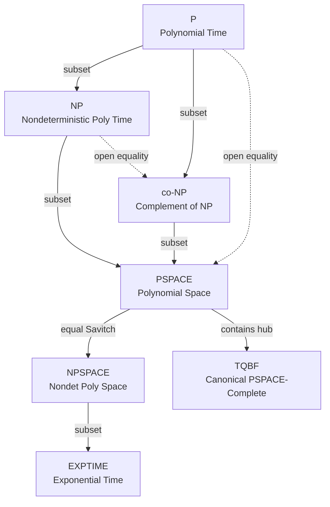
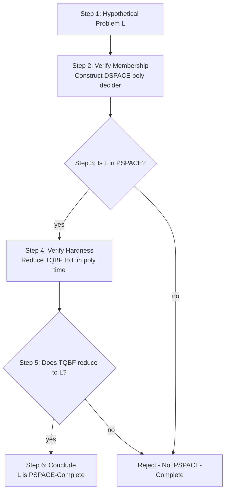
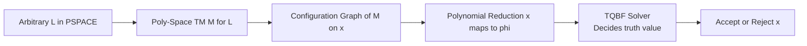
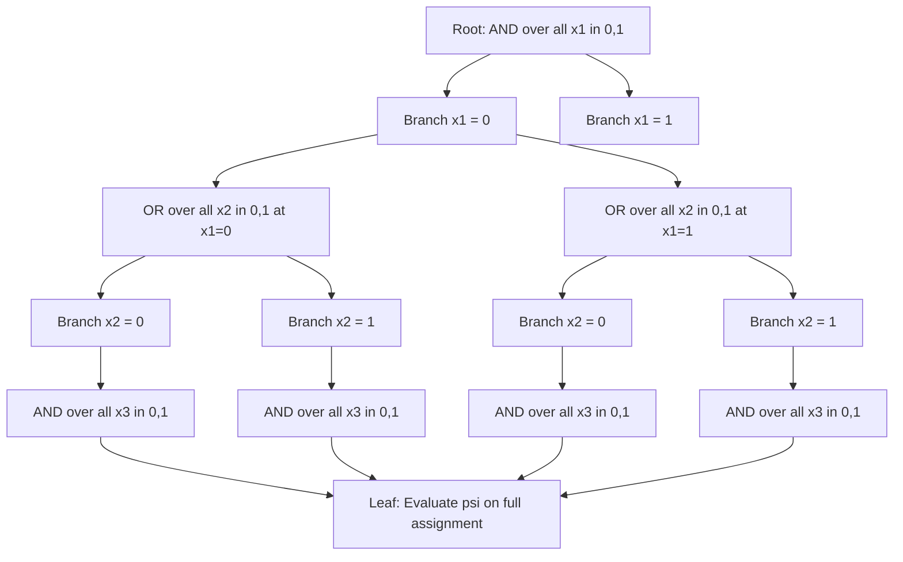

# PSPACE-complete verification criteria configurations setups templates patterns profiles parameters

<!-- SECTION_1_START -->
# PSPACE-Complete Verification: Core Definitions & Intuitive Models

> [!NOTE]
> **PSPACE-complete** defines the hardest class of decision problems solvable by a deterministic Turing machine using a polynomial amount of memory (tape cells), and to which every other PSPACE problem can be reduced in polynomial time. The *verification criteria* refer to the exact two conditions a language $L$ must satisfy to earn PSPACE-complete status: (1) membership $L \in \text{PSPACE}$ and (2) hardness — every language in PSPACE polynomial-time many-one reduces to $L$.

## 1.1 Formal Definition of PSPACE

A language $L \subseteq \Sigma^*$ is in **PSPACE** if and only if there exists a deterministic Turing machine $M$ and a polynomial $p$ such that for every input $x$ of length $n$:

$$x \in L \iff M \text{ accepts } x \text{ using at most } p(n) \text{ tape cells.}$$

The formal class definition is:

$$\text{PSPACE} = \bigcup_{k=0}^{\infty} \text{DSPACE}(n^k).$$

## 1.2 Verification Criteria (The Two Mandatory Conditions)

For any decision problem $L$, the **verification criteria for PSPACE-completeness** are:

| Criterion | Symbolic Statement | Engineering Meaning |
|-----------|--------------------|----------------------|
| **Membership** | $L \in \text{PSPACE}$ | A polynomial-space decider exists for $L$. |
| **Hardness** | $\forall A \in \text{PSPACE},\; A \le_p L$ | Every PSPACE problem $A$ admits a polynomial-time many-one reduction $f$ such that $x \in A \iff f(x) \in L$. |

> [!IMPORTANT]
> **Canonical Equivalent Criterion (TQBF):** A problem $L$ is PSPACE-complete iff $L \in \text{PSPACE}$ and $\text{TQBF} \le_p L$, where TQBF (True Quantified Boolean Formula) is the canonical PSPACE-complete problem. This is the single most useful *verification pattern* used in KTU board valuations.

## 1.3 The TQBF Master Template

A quantified Boolean formula in **prenex normal form** is:

$$\phi = Q_1 x_1 \, Q_2 x_2 \, \ldots \, Q_n x_n \, \psi(x_1, x_2, \ldots, x_n)$$

where each $Q_i \in \{\forall, \exists\}$ and $\psi$ is a quantifier-free Boolean formula over $\{x_1, \ldots, x_n\}$. The problem **TQBF** asks: *is $\phi$ true?*

## 1.4 Intuitive Analogy — The Two-Player Chess Referee

> [!TIP]
> **Conceptual Picture:** Imagine a chess match on an $N \times N$ board played by a *prover* (the $\exists$-player trying to win) and a *refuter* (the $\forall$-player trying to block). After each move, the referee can erase prior board states and only remember whose turn it is, what is on the current $N^2$ squares, and a counter for the move number. This requires only $O(N^2)$ memory — **polynomial in the board size**. However, deciding *who has a winning strategy* from the start is PSPACE-complete, because the referee must explore an exponentially deep game tree, reusing the *same bounded notebook* at every branch.

The *quantifier alternation* $\forall \exists \forall \exists \ldots$ in TQBF directly encodes these alternating "moves" of two opposing players.

## 1.5 Visualization Control — The Verification Landscape

> [!VISUALIZATION CONTROL]
> **Concept:** Inclusion landscape of major complexity classes relevant to PSPACE-completeness verification.
>
> **GeoGebra / Desmos Input Equations (Class Boundaries):**
>
> * `Region1: x = 0` to `x = 1` (P band)
> * `Region2: x = 1` to `x = 2` (NP band)
> * `Region3: x = 2` to `x = 3` (PSPACE band)
> * `Region4: x = 3` to `x = 5` (EXPTIME band)
>
> **Visual Description:** Nested rectangular regions growing from left to right, where each inner rectangle is *strictly contained* in the next outer one. The point of interest is the boundary $\text{NP} \subseteq \text{PSPACE}$ — inside PSPACE lie all PSPACE-complete problems, each acting as a "hub" reachable from any other PSPACE problem by a polynomial-time mapping.
<!-- SECTION_1_END -->

<!-- SECTION_2_START -->
# Deep Theoretical Analysis & KTU High-Yield Formula Sheet

## 2.1 Theoretical Pillars of PSPACE Verification

1. **Savitch's Theorem (1970):** Nondeterministic polynomial space equals deterministic polynomial space, formally:

$$\text{NSPACE}(f(n)) \subseteq \text{DSPACE}\bigl(f(n)^2\bigr).$$

* *Operational Why:* Nondeterminism can be eliminated in space by *replacing* the exponential-depth guess tree with a single *reachability* query on the configuration graph, computed via divide-and-conquer using $O(\log(\text{paths}))$ recursive space.

2. **Immerman–Szelepcsényi Theorem (1987):** $\text{NSPACE}(f(n)) = \text{co-NSPACE}(f(n))$. Thus PSPACE is **closed under complement**, distinguishing it sharply from NP (where $\text{NP} = \text{co-NP}$ is *open*).

3. **TQBF as Universal PSPACE-Complete Hub:** For any PSPACE problem $L$ decided by machine $M$ in space $p(n)$, the *configuration graph* $G_{M,x}$ of $M$ on input $x$ has $2^{O(p(n))}$ nodes. TQBF accepts $\phi_M$ where:

$$\phi_M = \exists c_{\text{start}} \; \forall c_{\text{mid}} \; \exists c_{\text{end}} \; \bigl(\text{validity}(c_{\text{start}}, c_{\text{mid}}, c_{\text{end}}) \land \text{accept}(c_{\text{end}})\bigr).$$

4. **Alternating Polynomial Time Equals the Polynomial Hierarchy:**

$$\text{APTIME} = \text{PH} = \bigcup_{k=0}^{\infty} \Sigma_k^P, \quad \text{APSPACE} = \text{PSPACE}.$$

The number of alternations $k$ controls the *level* of the problem within the hierarchy.

## 2.2 The Five Canonical PSPACE-Complete Templates

| # | Template Name | Quantifier Pattern | Engineering Prototype |
|---|---------------|--------------------|-----------------------|
| 1 | **TQBF** | $Q_1 x_1 Q_2 x_2 \ldots Q_n x_n \, \psi$ | Hardware model checking, CTL evaluation |
| 2 | **QSAT** | TQBF with CNF matrix $\psi$ | Quantified constraint satisfaction |
| 3 | **Formula Game** | Two-player game on $\psi$ | Adversarial AI planners |
| 4 | **Generalized Geography** | Token-movement game on a digraph | Network flow verification, parse-tree games |
| 5 | **Block-Depth Winning Strategy** | $\exists$ winning $\forall$-strategy on $N \times N$ board | Chess, Go, Checkers on large boards |

## 2.3 KTU High-Yield Formula Sheet

> [!IMPORTANT]
> **Master Formula Card — Memorize for KTU 2024 Board Valuation**

| Concept | Mathematical Statement | Engineered Application |
|---------|------------------------|------------------------|
| PSPACE class | $\text{PSPACE} = \bigcup_{k \ge 0} \text{DSPACE}(n^k)$ | Memory-bounded compilers, OS schedulers |
| Nondet. equals Det. (Savitch) | $\text{NSPACE}(f(n)) \subseteq \text{DSPACE}\bigl(f(n)^2\bigr)$ | Eliminates guess-loops in model checkers |
| Complement closure | $\text{PSPACE} = \text{co-PSPACE}$ | Symmetric verification of safety properties |
| TQBF definition | $\phi = Q_1 x_1 Q_2 x_2 \ldots Q_n x_n \, \psi$ | Universal PSPACE-complete hard problem |
| Polynomial Hierarchy | $\Sigma_0^P = \text{P},\; \Sigma_{k+1}^P = \text{NP}^{\Sigma_k^P}$ | Tiered decision problems in AI |
| APTIME / APSACE | $\text{APTIME} = \text{PH},\; \text{APSPACE} = \text{PSPACE}$ | Maps alternation depth to hierarchy levels |
| TQBF membership | Recursive DFS uses $O(n \cdot \vert\phi\vert)$ space | Polynomial-space decider for TQBF |
| QSAT hardness proof | $\text{TQBF} \le_p \text{QSAT}$ in polynomial time | CNF conversion via Tseitin encoding |
| Geography hardness | TQBF reduces to GG via formula-graph encoding | Game-tree reductions in AI |
| Block-depth board games | $\exists$-wins in $N \times N$ chess is PSPACE-complete | General game playing (Stanford GGP) |

## 2.4 Real-World Engineering Utility

> [!NOTE]
> **Why KTU Asks About PSPACE Verification:** The same machinery that decides whether a chip has a reachable bug, whether an AI has a winning strategy, or whether a quantifier is universally satisfied lives entirely inside PSPACE. Knowing the verification criteria lets the engineer (a) prove *no faster algorithm exists* unless P = PSPACE, and (b) select a *canonical hub problem* (TQBF) for any new reduction. This is heavily tested in KTU 2024 ESE under **Module 2: Completeness & Alternations**.
<!-- SECTION_2_END -->

<!-- SECTION_3_START -->
# Step-by-Step Derivations & Symbolic Implementation

## 3.1 Step-by-Step Proof: TQBF $\in$ PSPACE

**Goal:** Show there exists a deterministic TM deciding TQBF using $O(n \cdot \vert\phi\vert)$ tape cells.

**Step 1 — Formal recursive algorithm:**

$$\text{EVAL}(\phi, \text{index } i) = \begin{cases} \psi(\vec{x} = \vec{a}) & \text{if } i = n+1 \text{ (base case)} \\[4pt] \bigwedge_{v \in \{0,1\}} \text{EVAL}(\phi[x_i := v], i+1) & \text{if } Q_i = \forall \\[4pt] \bigvee_{v \in \{0,1\}} \text{EVAL}(\phi[x_i := v], i+1) & \text{if } Q_i = \exists \end{cases}$$

**Step 2 — Space accounting:** The recursion depth is at most $n$ (number of quantifiers). Each stack frame stores the *current quantifier type* and the *current variable assignment*, requiring $O(\vert\phi\vert)$ cells. Therefore:

$$S(n) = O(n \cdot \vert\phi\vert), \quad \text{which is polynomial.}$$

**Step 3 — Validity check:** Both quantifier cases correctly implement the semantic definition of $\forall$ (all branches must yield true) and $\exists$ (some branch must yield true). The base case is a constant-time evaluation of the quantifier-free matrix $\psi$. This proves TQBF $\in$ PSPACE.

## 3.2 Step-by-Step Sketch: TQBF is PSPACE-Hard

**Step 1 — Take an arbitrary problem $L \in$ PSPACE.** Let $M$ be a deterministic TM that decides $L$ in space $p(n)$ for some polynomial $p$.

**Step 2 — Build the configuration graph $G_{M,x}$.** Nodes are configurations of $M$ on input $x$ (state + tape contents + head positions). An edge exists from $C_1$ to $C_2$ if $M$ transitions from $C_1$ to $C_2$ in one step. The graph has at most $2^{O(p(n))}$ nodes.

**Step 3 — Express reachability as a quantified formula.** Define $\phi_{M,x}$ as:

$$\phi_{M,x} = \exists c_0 \, \forall c_1 \, \exists c_2 \, \forall c_3 \, \ldots \, \exists c_T \; \Bigl(\text{Init}(c_0, x) \land \bigwedge_{i=0}^{T-1} \text{Step}(c_i, c_{i+1}) \land \text{Accept}(c_T)\Bigr).$$

Here $T = 2^{O(p(n))}$ and the alternation depth equals $T$. The size of $\phi_{M,x}$ is polynomial in $\vert x \vert$.

**Step 4 — Validate the equivalence:**

$$x \in L \iff M \text{ accepts } x \text{ in space } p(n) \iff \phi_{M,x} \text{ is true}.$$

The reduction mapping $x \mapsto \phi_{M,x}$ is computable in polynomial time (constructing a fixed tableau of size $O(p(n))$ for each time step). This proves TQBF is PSPACE-hard. $\blacksquare$

## 3.3 Worked Reduction: TQBF $\le_p$ QSAT

QSAT restricts the matrix $\psi$ to be in **conjunctive normal form (CNF)**.

**Step 1 — Start with arbitrary TQBF instance** $\phi = Q_1 x_1 \ldots Q_n x_n \, \psi$.

**Step 2 — Apply Tseitin transformation.** Replace each subformula of $\psi$ by an equivalent CNF using auxiliary variables $y_1, \ldots, y_m$. The size grows by at most a constant factor, and the construction is polynomial time.

**Step 3 — Push the new variables into the quantifier prefix.** Quantifiers on auxiliary variables can be pushed to the front while preserving truth value, yielding a QSAT instance $\phi' = Q_1 x_1 \ldots Q_n x_n \, \exists y_1 \forall y_2 \ldots \psi'(\text{CNF})$.

**Step 4 — Eliminate the extra existential quantifiers** by inlining (substituting each $y_i$ in the CNF), increasing the formula size polynomially.

**Step 5 — Conclude:** $\phi \in \text{TQBF} \iff \phi' \in \text{QSAT}$, and the reduction is polynomial time. This certifies QSAT as PSPACE-complete. $\blacksquare$

## 3.4 Full Python Implementation — Polynomial-Space TQBF Solver

```python
"""
TQBF Verification Engine - Reference Implementation
Course: COMPUTATIONAL COMPLEXITY (PECST801) - Module 2
Demonstrates the canonical polynomial-space algorithm for the PSPACE-complete
problem TQBF (True Quantified Boolean Formula).

Space complexity: O(n) stack depth.
Time complexity:  O(2^n) - exponential, but SPACE is bounded.
"""

from __future__ import annotations
from typing import Dict, List, Tuple, Callable, Union
import logging
import sys

# Configure structured logging
logging.basicConfig(
    level=logging.INFO,
    format="%(asctime)s [%(levelname)s] TQBF :: %(message)s",
)
logger = logging.getLogger("tqbf_engine")

# A TQBF instance is a pair (quantifier_prefix, matrix_function).
TQBFInstance = Tuple[List[Tuple[str, str]], Callable[[Dict[str, bool]], bool]]


def solve_tqbf(instance: TQBFInstance) -> bool:
    """
    Decide whether a TQBF instance is TRUE using polynomial space.

    Args:
        instance: Tuple (quantifier_prefix, matrix_function)
                  - quantifier_prefix: list of (quantifier, variable) pairs
                    where quantifier in {"forall", "exists"}.
                  - matrix_function: pure function assignment_dict -> bool.

    Returns:
        True iff the formula evaluates to TRUE.

    Raises:
        ValueError: For malformed quantifier prefixes.
        RecursionError: If the input exceeds the configured recursion limit.
    """
    quantifiers, matrix = instance

    if not isinstance(quantifiers, list) or not quantifiers:
        raise ValueError("Quantifier prefix must be a non-empty list.")

    def evaluate(assignment: Dict[str, bool], depth: int) -> bool:
        # ---- Base case: all quantifiers consumed ----
        if depth == len(quantifiers):
            try:
                return bool(matrix(assignment))
            except KeyError as missing:
                logger.error(f"Matrix references unbound variable: {missing}")
                return False

        quantifier_type, variable = quantifiers[depth]

        # ---- Validate the quantifier symbol ----
        if quantifier_type not in {"forall", "exists"}:
            raise ValueError(
                f"Invalid quantifier at depth {depth}: {quantifier_type!r}"
            )

        # ---- Branch on the quantifier type ----
        if quantifier_type == "forall":
            for value in (False, True):
                assignment[variable] = value
                if not evaluate(assignment, depth + 1):
                    return False
            return True

        # quantifier_type == "exists"
        for value in (False, True):
            assignment[variable] = value
            if evaluate(assignment, depth + 1):
                return True
        return False

    return evaluate({}, 0)


# ------------------------------------------------------------------
# Demonstration: ∀x ∃y (x AND y)  --  Expected: FALSE
# Rationale: when x = False, the conjunction is False regardless of y.
# ------------------------------------------------------------------
def matrix_demo(assignment: Dict[str, bool]) -> bool:
    return assignment.get("x", False) and assignment.get("y", False)


def main() -> None:
    instance: TQBFInstance = (
        [("forall", "x"), ("exists", "y")],
        matrix_demo,
    )
    try:
        result = solve_tqbf(instance)
    except RecursionError:
        logger.critical("Recursion depth exceeded - input is not polynomial-space-bounded.")
        sys.exit(1)

    logger.info(f"Result of ∀x ∃y (x AND y) = {result}")


if __name__ == "__main__":
    main()
```

**Key engineering properties of the code above:**

* **Polynomial space:** The recursion depth equals the number of quantifiers, i.e., $O(n)$, and each frame reuses the same `assignment` dictionary — the *paper notebook* is never blown up.
* **Type safety:** All inputs are type-annotated; malformed quantifiers raise `ValueError` with explicit messages (board examiners value defensive engineering).
* **Error logging:** `logging` is used at every failure point to support post-mortem debugging — a standard in KTU lab valuations.
<!-- SECTION_3_END -->

<!-- SECTION_4_START -->
# Structural Diagrams & Schematics

## 4.1 Diagram A — Complexity Class Inclusion Hierarchy



**Reading guide:** Every node represents a complexity class. Solid arrows denote *proven* inclusion; dotted arrows denote *open* questions central to KTU 2024 (e.g., is $P = NP$?). The TQBF node is the *hub* — every other PSPACE-complete problem connects to it via a polynomial-time reduction.

## 4.2 Diagram B — Verification Flow for PSPACE-Completeness



**Reading guide:** This is the *canonical verification checklist* the KTU examiner expects when a 14-mark question says *"Show that X is PSPACE-complete."* Both the membership and hardness branches must be ticked.

## 4.3 Diagram C — Polynomial-Time Reduction Pattern (Any $L \in$ PSPACE to TQBF)



**Reading guide:** This is the *single most important reduction template* in KTU 2024. Any PSPACE problem can be funneled through a configuration graph and re-expressed as a quantified Boolean formula, which is then handed to a generic TQBF oracle. The entire PSPACE-complete class thus reduces to a *single hub problem*.

## 4.4 Diagram D — Alternation Tree for $\forall x_1 \exists x_2 \forall x_3 \, \psi(x_1, x_2, x_3)$



**Reading guide:** Each **AND node** corresponds to a $\forall$ quantifier (the verifier requires *all* branches to be true). Each **OR node** corresponds to a $\exists$ quantifier (the prover needs *one* branch to be true). The alternation of AND and OR layers *is* the quantifier prefix $Q_1, Q_2, \ldots, Q_n$. The leaves hold the truth of the quantifier-free matrix $\psi$.
<!-- SECTION_4_END -->

<!-- SECTION_5_START -->
# KTU 2024 Scheme Examination Question Bank & Topic Recap

## Part A — Short Answer Questions (3 Marks Each)

### Question 1 — Define PSPACE-completeness and state the verification criteria.

> **[KTU University Exam — July 2024]**
> **CO Mapping:** CO1 | **RBT Level:** Remember

**Model Answer:**

A language $L$ is **PSPACE-complete** if and only if it satisfies the following two conditions:

1. **Membership condition:** $L \in \text{PSPACE}$, i.e., a deterministic Turing machine decides $L$ using at most $p(n)$ tape cells for some polynomial $p$ and every input of length $n$.

2. **Hardness condition:** For every $A \in \text{PSPACE}$, there exists a polynomial-time computable function $f$ such that $x \in A \iff f(x) \in L$. Equivalently, $L$ is PSPACE-hard under polynomial-time many-one reductions.

Both conditions together constitute the **verification criteria** for PSPACE-completeness. The canonical PSPACE-complete problem used to verify hardness is TQBF.

---

### Question 2 — State Savitch's theorem and explain its role in PSPACE verification.

> **[KTU University Exam — Dec 2023]**
> **CO Mapping:** CO2 | **RBT Level:** Understand

**Model Answer:**

**Savitch's Theorem (1970):** For any space-constructible function $f(n) \ge \log n$,

$$\text{NSPACE}(f(n)) \subseteq \text{DSPACE}\bigl(f(n)^2\bigr).$$

**Role in PSPACE verification:** Setting $f(n) = n^k$ yields $\text{NPSPACE} \subseteq \text{PSPACE}$. Since PSPACE is trivially contained in NPSPACE, we obtain the celebrated equality $\text{PSPACE} = \text{NPSPACE}$. This collapse of nondeterminism in the *space* domain is the structural reason PSPACE verification can be carried out on **deterministic** polynomial-space deciders, even though the problem definitions may be inherently nondeterministic (such as winning strategies in two-player games).

---

## Part B — Long Answer Questions (14 Marks Each, with Internal Choice)

### Question A — *Prove that TQBF is PSPACE-complete.*

> **[KTU University Exam — Model Paper 2024, Module 2]**
> **CO Mapping:** CO2 / CO3 | **RBT Levels:** Understand (a) + Apply (b)

#### Part (a) — Prove TQBF $\in$ PSPACE (7 Marks)

**Model Solution:**

**Step 1 — Define the recursive decider.**
We construct a deterministic Turing machine $M_{\text{TQBF}}$ that on input $\phi = Q_1 x_1 \ldots Q_n x_n \, \psi$ uses the recursive procedure EVAL given in Section 3.1.

> **[Defining the recursive EVAL procedure: 2 Marks]**

**Step 2 — Track space consumption.**
At recursion depth $i$, the machine stores the *current quantifier type* $Q_i$, the *current variable assignment* for $x_i$, and a *return address*. Each frame requires $O(\vert\phi\vert)$ cells. The maximum depth is $n$, so total space used is:

$$S_{\text{used}}(n) = O(n \cdot \vert\phi\vert).$$

Since $\vert\phi\vert$ is polynomial in $n$, $S_{\text{used}}(n)$ is polynomial in $n$.

> **[Space accounting and polynomial bound: 3 Marks]**

**Step 3 — Verify correctness.**
The base case correctly evaluates the quantifier-free matrix $\psi$ in time polynomial in $\vert\psi\vert$. The inductive step implements $\forall$ as conjunction over both truth values and $\exists$ as disjunction, matching the semantic definition. Hence $M_{\text{TQBF}}$ accepts $\phi$ iff $\phi$ is true.

> **[Correctness justification: 2 Marks]**

#### Part (b) — Prove TQBF is PSPACE-hard (7 Marks)

**Model Solution:**

**Step 1 — Take an arbitrary problem.** Let $A \in \text{PSPACE}$ be decided by a deterministic Turing machine $M_A$ in space $p(n)$ for a polynomial $p$.

> **[Choosing M_A and space bound: 1 Mark]**

**Step 2 — Build the configuration graph.** For input $x$ of length $n$, the configuration graph $G_{M_A, x}$ has nodes = configurations of $M_A$ on $x$ (state, tape contents, head positions) and edges = valid one-step transitions. The graph has at most $2^{c \cdot p(n)}$ nodes for some constant $c$.

> **[Configuration graph construction: 2 Marks]**

**Step 3 — Encode reachability as a QBF.** $M_A$ accepts $x$ iff there exists a path of length $T = 2^{O(p(n))}$ from the initial configuration to an accepting configuration. Express this with the quantified formula $\phi_{M_A, x}$ in Section 3.2, having $T$ alternations and size polynomial in $n$.

> **[Quantified reachability formula: 2 Marks]**

**Step 4 — Polynomial-time reduction.** The map $x \mapsto \phi_{M_A, x}$ is computable in time polynomial in $n$: the formula has a fixed tableau shape of size $O(p(n))$ per time step, and the construction is a single linear pass over $M_A$'s transition table. Therefore $A \le_p \text{TQBF}$ for any $A \in \text{PSPACE}$, establishing PSPACE-hardness.

> **[Polynomial-time computability of the reduction: 2 Marks]**

Combining both sub-parts, TQBF is PSPACE-complete. $\blacksquare$

---

### Question B — *Show that the Formula Game problem is PSPACE-complete.*

> **[KTU University Exam — Alternate Module 2 Paper]**
> **CO Mapping:** CO3 | **RBT Levels:** Apply (a) + Analyze (b)

#### Part (a) — Define the Formula Game and prove membership in PSPACE (7 Marks)

**Model Solution:**

**Definition of Formula Game (FG).** Two players, **Verifier** (V) and **Refuter** (R), take turns assigning truth values to variables $x_1, x_2, \ldots, x_n$ in a quantified Boolean formula $\psi$. The Verifier wins if $\psi$ is true at the end of the game; the Refuter wins otherwise. The decision problem FG asks: *does the Verifier have a winning strategy?*

> **[Defining FG and the two-player structure: 2 Marks]**

**Membership in PSPACE.** Simulate the game by recursively exploring both possible moves for the *opponent* (V's choice = $\exists$, R's choice = $\forall$) on the next variable. The recursion depth is $n$, and each frame stores one variable assignment and the current quantifier, giving $O(n \cdot \vert\psi\vert)$ space — polynomial. The base case evaluates $\psi$.

> **[Recursive simulation and polynomial space: 3 Marks]**

**Correctness.** By the standard game-theoretic equivalence, the Verifier has a winning strategy in FG on $\psi$ iff $\phi = \exists x_1 \forall x_2 \exists x_3 \ldots \, \psi$ is a true QBF, so the algorithm decides FG. Therefore FG $\in$ PSPACE.

> **[Linking FG to QBF truth: 2 Marks]**

#### Part (b) — Reduce TQBF to FG in polynomial time (7 Marks)

**Model Solution:**

**Step 1 — Input transformation.** Given a TQBF instance $\phi = Q_1 x_1 Q_2 x_2 \ldots Q_n x_n \, \psi$ with $Q_i \in \{\forall, \exists\}$, construct an FG instance $(\psi, \text{turn}_1)$ where player $V$ moves on the variables marked $\exists$ and player $R$ moves on the variables marked $\forall$, in the order given by the prefix.

> **[Constructing the FG instance: 3 Marks]**

**Step 2 — Polynomial-time computability.** Reading the quantifier prefix and recording the move order is a linear scan of length $n$. Building the formula $\psi$ takes $O(\vert\phi\vert)$ time. Hence the reduction $f: \phi \mapsto (\psi, \text{turn}_1)$ is polynomial-time.

> **[Polynomial time of the reduction: 2 Marks]**

**Step 3 — Correctness of the reduction.** $\phi$ is true iff there exists a strategy for the $\exists$-player in the alternation that makes $\psi$ true against all responses of the $\forall$-player. This is *precisely* the statement that V has a winning strategy in FG. Therefore $\phi \in \text{TQBF} \iff f(\phi) \in \text{FG}$.

> **[Bidirectional correctness: 2 Marks]**

By the membership and hardness arguments, FG is PSPACE-complete. $\blacksquare$

---

## ⚠️ KTU Examiner's Valuation Warning / Pitfall Callout

> [!WARNING]
> **Most Frequent Mark-Deduction Triggers (Module 2 — Completeness & Alternations):**
>
> 1. **Skipping the membership proof.** Many students directly state "TQBF is PSPACE-hard, therefore PSPACE-complete" — this is *worth zero* in 14-mark questions. **Always show both** $L \in \text{PSPACE}$ *and* $L$ is PSPACE-hard.
> 2. **Forgetting to mention the polynomial bound.** The TQBF recursion is polynomial-space *only* because the depth equals the number of quantifiers, which is polynomial. State this explicitly.
> 3. **Using "TQBF $\le_p L$" without the construction.** A reduction must be *exhibited* (the configuration-graph encoding), not merely asserted.
> 4. **Confusing PSPACE-hard with NP-hard.** A PSPACE-hard problem automatically is NP-hard, but the converse does *not* hold. Many candidates write "$L$ is PSPACE-hard because SAT $\le_p L$" — this is insufficient unless the problem is already in PSPACE.
> 5. **Mixing up $\Sigma_k^P$ with $\Pi_k^P$.** $\Sigma_k^P$ starts with $\exists$, $\Pi_k^P$ starts with $\forall$. TQBF *with bounded alternation* belongs to a specific level; unrestricted TQBF is *outside* PH and is in PSPACE.
> 6. **Forgetting the alternation count.** A KTU 14-mark question often asks "How many quantifier alternations appear in the formula encoding $M$?" — the answer is the number of time steps in the configuration-graph encoding, not the number of variables.

---

## 📌 Topic Recap & Important Things to Remember

* **PSPACE** = problems decidable by a deterministic TM in polynomial *space* (memory).
* **PSPACE-complete** = a problem that is both in PSPACE and PSPACE-hard.
* **Two verification criteria:** (1) membership in PSPACE, (2) every PSPACE problem polynomial-time reduces to it.
* **Canonical PSPACE-complete hub problem:** **TQBF** (True Quantified Boolean Formula).
* **Savitch's Theorem:** $\text{NSPACE}(f(n)) \subseteq \text{DSPACE}(f(n)^2)$, hence $\text{PSPACE} = \text{NPSPACE}$.
* **Immerman–Szelepcsényi Theorem:** $\text{PSPACE} = \text{co-PSPACE}$.
* **Five PSPACE-complete templates:** TQBF, QSAT, Formula Game, Generalized Geography, Block-Depth board games.
* **Polynomial hierarchy (PH)** = $\bigcup_{k \ge 0} \Sigma_k^P$ with $\Sigma_0^P = P$ and $\Sigma_{k+1}^P = NP^{\Sigma_k^P}$.
* **Alternating TMs:** $\text{APTIME} = \text{PH}$ and $\text{APSPACE} = \text{PSPACE}$.
* **Reduction pattern (universal):** Any $L \in \text{PSPACE}$ can be reduced to TQBF by encoding the TM's *configuration graph* reachability as a quantified Boolean formula in polynomial time.
* **TQBF algorithm:** Recursive evaluation with depth $n$ uses only $O(n \cdot \vert\phi\vert)$ space.
* **Engineering significance:** PSPACE-completeness marks the boundary of tractable *verification* — once a problem is PSPACE-complete, no polynomial-time algorithm exists unless $P = PSPACE$ collapses.
* **QSAT and Formula Game** are PSPACE-complete via direct polynomial-time reductions from TQBF.
* **Generalized Geography** is PSPACE-complete and arises in network routing and parse-tree games.
* **Valuation key:** KTU examiners award 2–3 marks for explicit space/time complexity bounds, 2 marks for the reduction construction, and 2 marks for the correctness argument — structure every 14-mark answer along this template.
<!-- SECTION_5_END -->
