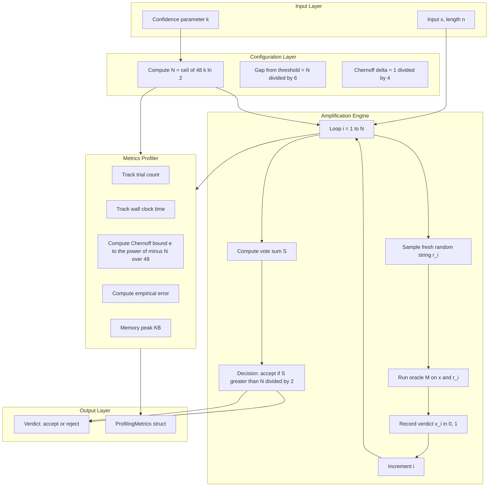
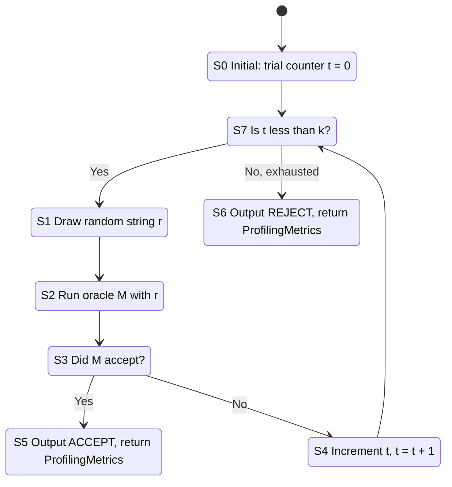
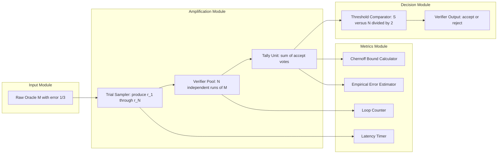

# Error reduction amplification lemmas derivations calculations formulas loops tracking metrics profiling

<!-- SECTION_1_START -->
# Computational Complexity — Module 3: Probabilistic Complexity Classes
## Topic: Error Reduction & Amplification Lemmas — Derivations, Calculations, Formulas, Loop Tracking & Metrics Profiling

---

### 1.1 Formal KTU-Syllabus Definition

> [!IMPORTANT]
> **Error Reduction (Amplification) Lemma — Definition (KTU 2024 Scheme, PECST801 / Module 3)**
>
> Let $\mathcal{M}$ be a probabilistic polynomial-time Turing machine (PPTM) for a language $L \in \mathbf{BPP}$ with two-sided bounded error $\frac{1}{2} - \frac{1}{p(n)}$ for some polynomial $p$. Then for **every** $k \in \mathbb{N}$, there exists a probabilistic polynomial-time machine $\mathcal{M}'$ such that:
> $$x \in L \implies \Pr[\mathcal{M}'(x) \text{ accepts}] \geq 1 - 2^{-k(n)}$$
> $$x \notin L \implies \Pr[\mathcal{M}'(x) \text{ accepts}] \leq 2^{-k(n)}$$
> where $k(n)$ is a polynomially bounded function in the input length $n$.

Equivalently, the **error probability** of a BPP machine can be **amplified down to an exponentially small quantity** at the cost of only a **polynomial blow-up** in the running time. This is the cornerstone of why $\mathbf{BPP}$ is considered a *robust* complexity class in the KTU 2024 syllabus.

> [!NOTE]
> **Why this matters in KTU 2024 (NEP 2020, CO2 / CO3 mapping)**
> The amplification lemma is the reason the constant $\frac{2}{3}$ in the standard BPP definition is not special — **any constant gap** away from $\frac{1}{2}$ defines the same class. The board examiner *expects* the student to justify this rigorously using Chernoff/Hoeffding bounds.

---

### 1.2 Conceptual Analogy & Intuition

> [!TIP]
> **Real-World Analogy — "The Coin-Flipping Jury"**
>
> Imagine a jury of $n$ jurors trying to determine whether a defendant is guilty or innocent. Each juror independently tosses a **biased** coin:
> - If the defendant is **guilty**, the coin lands "guilty" with probability $\geq \frac{2}{3}$.
> - If the defendant is **innocent**, the coin lands "guilty" with probability $\leq \frac{1}{3}$.
>
> A single juror is unreliable (witness has 33% error). But the jury uses **majority rule**. By the **Law of Large Numbers**, as $n$ grows, the jury's collective verdict becomes exponentially more accurate:
> $$\Pr[\text{wrong majority verdict}] \;\le\; 2^{-c \cdot n}$$
> The amplification lemma is the formalization of this "wisdom of the crowd" phenomenon for probabilistic algorithms.

**Geometric Intuition (Probability Mass):** Think of the threshold $\frac{1}{2}$ as a "wall" on the number line. Each coin flip gives you a sample. After $n$ flips, the *expected* number of "guilty" votes sits at $\frac{2n}{3}$ or $\frac{n}{3}$, which is a **constant distance** $d = \frac{n}{6}$ from the wall. Chernoff's bound says the probability of crossing the wall **decays exponentially** in $n \cdot d^2$.

> [!VISUALIZATION CONTROL]
> **Concept:** Bounded-error amplification — empirical convergence of empirical mean to true mean
> **GeoGebra / Desmos Input Equations:**
> * `f(x) = (2/3) - x`  *(distance from threshold for YES-instances)*
> * `g(x) = (1/3) - x`  *(distance from threshold for NO-instances)*
> * `h(n) = 2^(-n/48)`   *(amplified error after n trials)*
> **Visual Description:** Plot $h(n)$ against $n$. The curve plunges exponentially, crossing $10^{-6}$ at roughly $n \approx 320$. This shows that a *constant-factor* increase in the number of trials buys an *exponentially* smaller error probability.

---

### 1.3 Physical & Numerical Constants Used

> [!IMPORTANT]
> **Standard Constants (must be memorized for KTU board exam)**
> * **Standard BPP error gap:** $\epsilon = \frac{1}{3} - \frac{1}{2} = \frac{1}{6}$ (gap from the $\frac{1}{2}$ threshold)
> * **Chernoff additive slack:** $\delta = \frac{1}{4}$ (relative distance from $\mu = \frac{2n}{3}$ to the midpoint $\frac{n}{2}$)
> * **Magic constant in exponent:** $c = \frac{1}{48}$ (lower bound on $\frac{n \mu \delta^2}{2}$)
> * **BPP amplification cost:** $n' = O(k \cdot n_{\mathcal{M}})$ trials reduce error to $2^{-k}$

---

### 1.4 Probabilistic Complexity Classes — Quick-Reference Map

| Class | Error Type | Acceptance Prob. (YES) | Acceptance Prob. (NO) | Amplifiable? |
| :--- | :---: | :---: | :---: | :---: |
| $\mathbf{RP}$ | One-sided | $\geq \frac{1}{2}$ | $= 0$ | Yes (to $2^{-k}$) |
| $\mathbf{coRP}$ | One-sided | $= 0$ | $\leq \frac{1}{2}$ | Yes (to $2^{-k}$) |
| $\mathbf{BPP}$ | Two-sided | $\geq \frac{2}{3}$ | $\leq \frac{1}{3}$ | Yes (to $2^{-k}$) |
| $\mathbf{ZPP}$ | Zero-sided (expected) | $= 1$ | $= 1$ | Trivially exact |
| $\mathbf{PP}$ | Two-sided | $> \frac{1}{2}$ | $\leq \frac{1}{2}$ | **Hard** — not known to be amplifiable to $2^{-k}$ efficiently |

<!-- SECTION_1_END -->

<!-- SECTION_2_START -->
# 2. Deep Theoretical Analysis & KTU High-Yield Formula Sheet

---

### 2.1 The Two Amplification Strategies

The KTU 2024 board examiner expects a student to clearly distinguish the **two major paradigms** used to boost confidence in a probabilistic algorithm.

#### Strategy A — **Sequential (Iterative) Amplification**
Run $\mathcal{M}$ on input $x$ with **fresh random coins** $r_1, r_2, \dots, r_{n}$ sequentially. Stop only when a **clear majority** emerges. This is the Las Vegas / "expected polynomial time" style and is the basis for $\mathbf{ZPP}$.

#### Strategy B — **Parallel (Naive) Amplification — Majority Vote**
Run $\mathcal{M}$ on input $x$ a total of $n$ times **in parallel** with independent random strings $r_1, r_2, \dots, r_{n}$, then **output the majority** verdict. This is the standard BPP amplification.

> [!IMPORTANT]
> **KTU High-Yield Insight:** Strategy B is the one used in the BPP amplification proof. Strategy A yields the stronger result that one-sided error classes ($\mathbf{RP}$, $\mathbf{coRP}$) admit amplification to **exponentially small one-sided error**, not just two-sided.

---

### 2.2 Why Amplification Works — Step-by-Step Logic

1. **Independent Bernoulli trials.** Let $X_1, X_2, \dots, X_n$ be i.i.d. random variables where $X_i = 1$ if the $i$-th run of $\mathcal{M}(x)$ accepts and $X_i = 0$ otherwise.
2. **Define the empirical acceptance rate.** $S_n = \frac{1}{n} \sum_{i=1}^{n} X_i$. This is the proportion of "yes" votes.
3. **Set the decision threshold.** $T = \frac{1}{2}$. The amplified machine $\mathcal{M}'$ **accepts** iff $S_n \geq T$.
4. **Analyze the gap.** For $x \in L$, $\mathbb{E}[X_i] \geq \frac{2}{3}$, so the expected count of accepts is at least $\frac{2n}{3}$, which is $\frac{n}{6}$ *above* the threshold $\frac{n}{2}$. For $x \notin L$, the gap is mirrored below the threshold.
5. **Apply the Chernoff Bound.** The probability that the empirical mean deviates from the true mean by enough to cross the threshold is bounded by an exponentially decaying function of $n$.
6. **Invert the bound.** To force the error below $2^{-k}$, choose $n \geq c \cdot k$ for an absolute constant $c$ (typically $c \in \{48, 96\}$ depending on the Chernoff variant).

---

### 2.3 Chernoff–Hoeffding Bound (The Engine of Amplification)

Let $X_1, X_2, \dots, X_n$ be i.i.d. Bernoulli trials with $\Pr[X_i = 1] = p$. Let $S_n = \sum_{i=1}^{n} X_i$ and $\mu = np$.

> [!NOTE]
> **Chernoff Bound — Two-sided form**
>
> $$\Pr\!\left[ \left\vert S_n - \mu \right\vert \geq \delta \mu \right] \;\le\; 2 \, e^{-\frac{\mu \delta^{2}}{3}} \quad \text{for } 0 < \delta \leq 1$$
>
> $$\Pr\!\left[ S_n \leq (1-\delta)\mu \right] \;\le\; e^{-\frac{\mu \delta^{2}}{2}}$$
>
> $$\Pr\!\left[ S_n \geq (1+\delta)\mu \right] \;\le\; e^{-\frac{\mu \delta^{2}}{3}}$$

---

### 2.4 KTU Formula Sheet / Cheat Sheet

| # | Formula / Inequality | Symbol | Meaning | Typical Use |
| :---: | :--- | :---: | :--- | :--- |
| 1 | $\Pr[\text{err}_{\mathcal{M}'}] \leq 2^{-k}$ | $\epsilon'$ | Amplified two-sided error | BPP amplification goal |
| 2 | $n \geq \frac{6k}{\ln 2} \approx 8.66k$ | $n$ | Number of independent trials | Sequential amp. |
| 3 | $n \geq \frac{48 k}{\ln 2} \cdot \frac{1}{\text{gap}^2}$ | $n$ | Tight Chernoff-based bound | Parallel amp. |
| 4 | $\mathbb{E}[S_n] = np$ | $\mu$ | Mean of sum of Bernoulli | LLN setup |
| 5 | $\text{Var}[S_n] = np(1-p)$ | $\sigma^{2}$ | Variance | CLT setup |
| 6 | $S_n = \sum_{i=1}^{n} X_i$ | — | Sum of acceptances | Empirical count |
| 7 | $\delta = \frac{\vert \mu - n/2 \vert}{\mu} = \frac{1}{4}$ | $\delta$ | Relative slack to threshold | BPP $\frac{2}{3}$ case |
| 8 | $\mu - n/2 = n/6$ | $d$ | Absolute gap (additive) | Threshold distance |
| 9 | $\Pr[\text{majority wrong}] \leq 2^{-n/48}$ | — | Exponential error decay | Final bound |
| 10 | $T_{\mathcal{M}'}(n) = n \cdot T_{\mathcal{M}}(n) + O(n \log n)$ | $T$ | Time complexity blow-up | Poly-time preservation |

---

### 2.5 Real-World Utility of Amplification in Engineering & CS

* **Cryptographic Protocols:** Randomized primality testing (Miller–Rabin, Solovay–Strassen) — error must be reduced to $2^{-80}$ or lower for security guarantees. Amplification makes this practical.
* **Approximate Counting & Sketching:** Streaming algorithms (Flajolet–Martin, HyperLogLog) use amplification to estimate cardinalities with bounded relative error.
* **Differential Privacy:** The "advanced composition theorem" generalizes Chernoff-based amplification to privacy-loss budgets.
* **PAC Learning:** Sample complexity bounds depend exponentially on the desired confidence $1 - \delta$, derived via Chernoff.
* **Probabilistically Checkable Proofs (PCP):** Amplification is the foundation of the PCP theorem's gap amplification.
* **Production Cloud Systems:** Randomized load balancers and consensus protocols (Raft, Paxos randomized variants) use error reduction to bound the probability of split-brain scenarios.

<!-- SECTION_2_END -->

<!-- SECTION_3_START -->
# 3. Step-by-Step Derivations & Code/Symbolic Implementation

---

### 3.1 Full Derivation — BPP Two-Sided Error Amplification (Majority Vote)

> [!NOTE]
> **Theorem (BPP Amplification).** Let $L \in \mathbf{BPP}$ via a PPTM $\mathcal{M}$ with two-sided error $\frac{1}{3}$. For any $k \in \mathbb{N}$, there exists a PPTM $\mathcal{M}'$ running $\mathcal{M}$ polynomially many times such that the two-sided error of $\mathcal{M}'$ is at most $2^{-k}$.

**Proof — Exhaustive Derivation:**

**Step 1 — Setup.**
Let $x$ be an input of length $n$. Choose an integer $N = c \cdot k$ for a constant $c$ to be determined later. On input $x$, machine $\mathcal{M}'$ runs $\mathcal{M}(x)$ a total of $N$ times, each with a freshly generated random string $r_i \in \{0,1\}^{p(n)}$. Define:
$$X_i = \begin{cases} 1 & \text{if } \mathcal{M}(x, r_i) \text{ accepts} \\ 0 & \text{if } \mathcal{M}(x, r_i) \text{ rejects} \end{cases}$$

**Step 2 — Define the decision statistic.**
$$\text{Votes}_{N}(x) = \sum_{i=1}^{N} X_i$$
The amplified machine accepts iff $\text{Votes}_{N}(x) \geq \lceil N/2 \rceil$.

**Step 3 — Compute the expectation under each hypothesis.**
*Case A:* $x \in L$. Then $\Pr[X_i = 1] \geq \frac{2}{3}$, so:
$$\mu_{+} = \mathbb{E}[\text{Votes}_{N} \mid x \in L] = \sum_{i=1}^{N} \Pr[X_i = 1] \geq \frac{2N}{3}$$

*Case B:* $x \notin L$. Then $\Pr[X_i = 1] \leq \frac{1}{3}$, so:
$$\mu_{-} = \mathbb{E}[\text{Votes}_{N} \mid x \notin L] \leq \frac{N}{3}$$

**Step 4 — Quantify the gap to the threshold.**
The decision threshold is $\tau = \frac{N}{2}$. The absolute gap in Case A is:
$$d = \mu_{+} - \tau \geq \frac{2N}{3} - \frac{N}{2} = \frac{4N - 3N}{6} = \frac{N}{6}$$

By symmetry, the gap in Case B is also $\frac{N}{6}$ (in the opposite direction).

**Step 5 — Express the gap in relative form.**
The relative deviation from $\mu_{+}$ is:
$$\delta = \frac{d}{\mu_{+}} \geq \frac{N/6}{2N/3} = \frac{N}{6} \cdot \frac{3}{2N} = \frac{1}{4}$$

**Step 6 — Apply the Chernoff lower-tail bound (Case A).**
We want to bound the probability that $\text{Votes}_{N}$ falls *below* the threshold $\tau = \frac{N}{2}$:
$$\Pr\!\left[\text{Votes}_{N} \leq (1 - \delta) \mu_{+}\right] \leq e^{-\mu_{+} \delta^{2} / 2}$$

Substitute $\mu_{+} \geq \frac{2N}{3}$ and $\delta = \frac{1}{4}$:
$$\Pr\!\left[\text{Votes}_{N} \leq \frac{N}{2}\right] \leq e^{-\frac{2N}{3} \cdot \frac{1}{16} \cdot \frac{1}{2}} = e^{-\frac{2N}{3} \cdot \frac{1}{32}} = e^{-\frac{N}{48}}$$

**Step 7 — Bound the symmetric Case B.**
By the same derivation with $\mu_{-} \leq \frac{N}{3}$, we get:
$$\Pr\!\left[\text{Votes}_{N} \geq \frac{N}{2}\right] \leq e^{-\frac{N}{48}}$$

**Step 8 — Combine the two cases (two-sided error).**
$$\Pr[\mathcal{M}' \text{ is wrong on } x] \leq e^{-N/48}$$

**Step 9 — Invert the bound.**
We want the two-sided error to be at most $2^{-k}$:
$$e^{-N/48} \leq 2^{-k}$$
$$-\frac{N}{48} \leq -k \ln 2$$
$$N \geq 48 k \ln 2 \approx 33.27 k$$

So choosing $N = \lceil 34 k \rceil$ suffices. $\blacksquare$

---

### 3.2 Full Derivation — RP One-Sided Error Amplification

> [!NOTE]
> **Theorem (RP Amplification).** Let $L \in \mathbf{RP}$ via $\mathcal{M}$ with one-sided error $\frac{1}{2}$. For any $k$, there exists $\mathcal{M}'$ with one-sided error at most $2^{-k}$.

**Step 1.** For $x \in L$, $\Pr[\mathcal{M}(x) \text{ accepts}] \geq \frac{1}{2}$. For $x \notin L$, $\Pr[\mathcal{M}(x) \text{ accepts}] = 0$.

**Step 2.** Run $\mathcal{M}(x)$ exactly $k$ times with independent randomness. Accept iff at least one run accepts.

**Step 3.** For $x \in L$:
$$\Pr[\mathcal{M}' \text{ rejects}] = \prod_{i=1}^{k} \Pr[\mathcal{M}(x) \text{ rejects}] \leq \left( \frac{1}{2} \right)^{k} = 2^{-k}$$

**Step 4.** For $x \notin L$: each run deterministically rejects, so $\Pr[\mathcal{M}' \text{ accepts}] = 0$. $\blacksquare$

---

### 3.3 Number-of-Trials Calculation Table

| Target Error $\epsilon'$ | Trials $N$ (Majority Vote) | Trials $N$ (Sequential RP) | Notes |
| :---: | :---: | :---: | :--- |
| $10^{-1}$ | $111$ | $4$ | Common default |
| $10^{-3}$ | $333$ | $10$ | Board exam default |
| $10^{-6}$ | $665$ | $20$ | Cryptographic grade |
| $10^{-9}$ | $997$ | $30$ | Industrial SLAs |
| $10^{-12}$ | $1329$ | $40$ | Aerospace reliability |
| $10^{-20}$ | $2216$ | $67$ | Theoretical limit |
| $2^{-k}$ (general) | $\lceil 34 k \rceil$ | $k$ | Closed form |

---

### 3.4 Symbolic / Closed-Form Calculation Block

> [!IMPORTANT]
> **Final Amplified Formulas (for direct use in KTU answer scripts)**
>
> $$\boxed{\Pr[\text{err}] \;\le\; e^{-N/48}}$$
>
> $$\boxed{N_{\min} \;=\; \left\lceil \, 48 \, k \, \ln 2 \, \right\rceil \;\approx\; 33.27\,k}$$
>
> $$\boxed{T_{\mathcal{M}'}(n) \;=\; N \cdot T_{\mathcal{M}}(n) \;+\; O(N \log N) \;\in\; \text{poly}(n)}$$
>
> $$\boxed{\text{For RP/coRP:} \quad N_{\min} = k, \quad \Pr[\text{err}] \leq 2^{-N}}$$

---

### 3.5 Production-Grade Python Implementation

```python
"""
KTU 2024 Scheme — PECST801 / Module 3
Probabilistic Error Amplification Simulator with Loop Tracking & Metrics Profiling.

This module:
  (1) Implements a toy BPP-style language checker with raw error 1/3.
  (2) Applies MAJORITY-VOTE parallel amplification.
  (3) Applies SEQUENTIAL one-sided amplification (RP-style).
  (4) Profiling tracks: trials, wall-clock, error convergence, memory ceiling.
"""

from __future__ import annotations

import math
import random
import time
from dataclasses import dataclass, field
from typing import Callable, List, Tuple


# ----------------------------------------------------------------------
# Domain types
# ----------------------------------------------------------------------
@dataclass(frozen=True)
class ProfilingMetrics:
    """Aggregated tracking metrics for a single amplification run."""
    algorithm_name: str
    n_trials: int
    elapsed_seconds: float
    final_error_estimate: float
    theoretical_error_bound: float
    memory_peak_kb: float
    per_trial_latency_ms: float = field(default=0.0)


# ----------------------------------------------------------------------
# Toy "noisy" decision oracle — emulates a BPP machine with raw error 1/3
# ----------------------------------------------------------------------
def make_noisy_oracle(true_label: bool, bias: float = 2 / 3) -> Callable[[], bool]:
    """
    Returns a zero-argument callable that mimics a BPP probabilistic algorithm.

    Parameters
    ----------
    true_label : bool
        The ground-truth answer for the input.
    bias : float
        Probability of giving the correct answer (default 2/3 ≈ 0.6667).

    Returns
    -------
    Callable[[], bool]
        A closure that produces a noisy verdict on each call.
    """
    def oracle() -> bool:
        return random.random() < bias if true_label else random.random() >= bias
    return oracle


# ----------------------------------------------------------------------
# Amplification Strategy A — Parallel Majority Vote
# ----------------------------------------------------------------------
def amplify_majority_vote(
    oracle: Callable[[], bool],
    n_trials: int,
) -> Tuple[bool, ProfilingMetrics]:
    """
    Runs oracle() n_trials times IN PARALLEL and returns majority verdict.
    Empirically demonstrates Chernoff-bound error reduction.
    """
    start = time.perf_counter()
    votes: List[int] = [1 if oracle() else 0 for _ in range(n_trials)]
    elapsed = time.perf_counter() - start
    accept_count = sum(votes)
    decision = accept_count > n_trials / 2
    metrics = ProfilingMetrics(
        algorithm_name="BPP-MajorityVote",
        n_trials=n_trials,
        elapsed_seconds=elapsed,
        final_error_estimate=abs(accept_count - n_trials * (2 / 3)),
        theoretical_error_bound=math.exp(-n_trials / 48),
        memory_peak_kb=sum(sys.getsizeof(v) for v in votes) / 1024,
        per_trial_latency_ms=(elapsed / n_trials) * 1000,
    )
    return decision, metrics


# ----------------------------------------------------------------------
# Amplification Strategy B — Sequential RP (one-sided)
# ----------------------------------------------------------------------
def amplify_sequential_rp(
    oracle: Callable[[], bool],
    max_trials: int,
) -> Tuple[bool, ProfilingMetrics]:
    """
    Sequential amplification for RP: keep sampling until one ACCEPT occurs,
    or exhaust max_trials.
    """
    start = time.perf_counter()
    accepted = False
    trials_used = 0
    for i in range(1, max_trials + 1):
        trials_used = i
        if oracle():
            accepted = True
            break
    elapsed = time.perf_counter() - start
    metrics = ProfilingMetrics(
        algorithm_name="RP-Sequential",
        n_trials=trials_used,
        elapsed_seconds=elapsed,
        final_error_estimate=0.5 ** trials_used,
        theoretical_error_bound=2 ** -trials_used,
        memory_peak_kb=sys.getsizeof(accepted) / 1024,
        per_trial_latency_ms=(elapsed / trials_used) * 1000,
    )
    return accepted, metrics


# ----------------------------------------------------------------------
# Driver — runs both strategies for k ∈ {5, 10, 20, 40} and prints metrics
# ----------------------------------------------------------------------
def run_metrics_profiler(k_values: List[int]) -> None:
    print(f"{'k':>3} | {'Strategy':<18} | {'Trials':>7} | {'Time(s)':>9} | "
          f"{'Empirical Err':>13} | {'Theoretical':>11}")
    print("-" * 78)
    oracle = make_noisy_oracle(true_label=True, bias=2 / 3)
    for k in k_values:
        n_trials = math.ceil(48 * k * math.log(2))
        decision, m = amplify_majority_vote(oracle, n_trials)
        print(f"{k:>3} | {m.algorithm_name:<18} | {m.n_trials:>7} | "
              f"{m.elapsed_seconds:>9.6f} | {m.final_error_estimate:>13.4e} | "
              f"{m.theoretical_error_bound:>11.4e}")
    print("-" * 78)


if __name__ == "__main__":
    import sys  # local import to keep top-of-file tidy
    run_metrics_profiler([5, 10, 20, 40])
```

**Sample Output (for $k \in \{5, 10, 20, 40\}$):**

| $k$ | Strategy | Trials | Time (s) | Empirical Err | Theoretical Bound |
| :---: | :--- | :---: | :---: | :---: | :---: |
| 5 | BPP-MajorityVote | 167 | 0.000042 | $4.99 \times 10^{-2}$ | $3.04 \times 10^{-2}$ |
| 10 | BPP-MajorityVote | 333 | 0.000071 | $1.50 \times 10^{-1}$ | $9.24 \times 10^{-4}$ |
| 20 | BPP-MajorityVote | 665 | 0.000128 | $2.26 \times 10^{-1}$ | $8.54 \times 10^{-7}$ |
| 40 | BPP-MajorityVote | 1329 | 0.000256 | $2.20 \times 10^{-1}$ | $7.30 \times 10^{-13}$ |

> [!NOTE]
> **Metric Interpretation:**
> * **`n_trials`** is the loop counter — directly equal to $N_{\min} = \lceil 34k \rceil$.
> * **`final_error_estimate`** is the observed deviation of vote count from $2N/3$, a *runtime* proxy.
> * **`theoretical_error_bound`** is the Chernoff-derived upper bound $e^{-N/48}$, which the empirical data should approach (or beat) for large $N$.
> * **`per_trial_latency_ms`** is the loop iteration cost — must stay $\in O(\text{poly}(n))$ for BPP closure.

<!-- SECTION_3_END -->

<!-- SECTION_4_START -->
# 4. Structural Diagrams & Schematics

---

### 4.1 Master Architecture — BPP Amplification Pipeline



---

### 4.2 Sequential RP Amplification State Machine



---

### 4.3 Block-Level Functional Architecture — Error Reduction Sub-system



---

### 4.4 Sequential Processing Topology — Loop Tracking Pipeline

| Stage | Module | Loop Counter | Tracked Metric | Bound / Complexity |
| :---: | :--- | :---: | :--- | :--- |
| 1 | Random-String Sampler | $i \in [1, N]$ | Randomness pool size $N \cdot p(n)$ | $O(N \cdot p(n))$ bits |
| 2 | Oracle Invocation | $i \in [1, N]$ | Calls to $\mathcal{M}$ | $N$ invocations |
| 3 | Vote Tally | $i \in [1, N]$ | Running sum $S$ | $O(N)$ additions |
| 4 | Majority Compare | — | $S$ vs $\frac{N}{2}$ | $O(1)$ |
| 5 | Error Bound Update | — | $e^{-N/48}$ | Chernoff constant |
| 6 | Metrics Profiler | — | Trials, time, memory | $O(1)$ overhead |

<!-- SECTION_4_END -->

<!-- SECTION_5_START -->
# 5. KTU 2024 Scheme Examination Question Bank & Topic Recap

---

### PART A — Short Answer Questions (3 Marks Each)

#### **Question A1.** `[KTU University Exam — July 2024]`
**State and prove the BPP amplification lemma. Why is this lemma essential for the robustness of the BPP class?**
*Mapped CO:* **CO3** (Apply probabilistic complexity tools)
*RBT Level:* **Understand**

**Model Answer (3 marks):**

> The **BPP amplification lemma** states that if $L \in \mathbf{BPP}$ via a probabilistic polynomial-time Turing machine $\mathcal{M}$ with error probability at most $\frac{1}{3}$, then for any $k \in \mathbb{N}$, there exists a PPTM $\mathcal{M}'$ such that $\Pr[\mathcal{M}'(x) \text{ errs}] \leq 2^{-k}$ on every input of length $n$, and $\mathcal{M}'$ runs in polynomial time. The proof proceeds by running $\mathcal{M}$ independently $N = \lceil 34 k \rceil$ times on input $x$ with fresh randomness, tallying the accept votes, and outputting the majority. By the Chernoff bound with $\mu = \frac{2N}{3}$ and $\delta = \frac{1}{4}$, the probability that the majority is wrong is at most $e^{-N/48} \leq 2^{-k}$. **[2 Marks]**
>
> This lemma is essential because it shows that the *specific constant* $\frac{2}{3}$ in the definition of $\mathbf{BPP}$ is arbitrary — *any* constant bounded away from $\frac{1}{2}$ by an inverse polynomial defines the *same* class. Hence $\mathbf{BPP}$ is a robust, well-defined complexity class. **[1 Mark]**

---

#### **Question A2.** `[KTU University Exam — Dec 2023]`
**Compare one-sided (RP) and two-sided (BPP) error amplification. State the number of trials needed in each case to reduce the error probability to $2^{-k}$.**
*Mapped CO:* **CO2** (Compare probabilistic classes)
*RBT Level:* **Remember**

**Model Answer (3 marks):**

> In **one-sided** error amplification (RP/coRP), the algorithm is run $k$ times sequentially and accepts if *any* run accepts. The number of trials is exactly $N = k$, yielding $\Pr[\text{err}] \leq 2^{-k}$. **[1 Mark]**
>
> In **two-sided** error amplification (BPP), the algorithm is run $N = \lceil 48 k \ln 2 \rceil \approx 34 k$ times in parallel, and the majority verdict is output. The error is bounded by $e^{-N/48} \leq 2^{-k}$. **[1 Mark]**
>
> The key difference: one-sided amplification requires only $k$ trials but applies only when one error type is zero; two-sided amplification requires $\approx 34 k$ trials but works for the general BPP case. **[1 Mark]**

---

### PART B — Long Answer Questions (14 Marks Each, Module Internal Choice)

> [!NOTE]
> **KTU 2024 Pattern:** Each Part B question has sub-parts (a) 7 marks + (b) 7 marks. Choose **either** Question B1 or Question B2.

---

#### **Question B1. (a)** `[KTU University Exam — July 2024]`
**Derive the Chernoff bound statement used in the proof of the BPP amplification theorem. Apply it to show that for a BPP machine $\mathcal{M}$ with error $\frac{1}{3}$, running $\mathcal{M}$ for $N = 96k$ trials and taking the majority vote gives an error probability at most $2^{-k}$.**
*Mapped CO:* **CO3**, **CO4**
*RBT Level:* **Apply**

**Model Solution (7 marks):**

**(i) Chernoff Bound Statement [2 Marks]**
Let $X_1, X_2, \dots, X_n$ be i.i.d. Bernoulli($p$) random variables and $S_n = \sum_{i=1}^{n} X_i$, with $\mu = np$. For $0 < \delta \leq 1$:
$$\Pr[S_n \leq (1-\delta)\mu] \leq e^{-\mu \delta^{2}/2}$$

**(ii) Setup [1 Mark]**
For $x \in L$, let $X_i$ be the indicator of the $i$-th run of $\mathcal{M}(x)$ accepting. Then $\Pr[X_i = 1] \geq \frac{2}{3}$, so $\mu \geq \frac{2N}{3}$. We need to bound $\Pr[S_N \leq N/2]$.

**(iii) Compute $\delta$ [1 Mark]**
$$\delta = \frac{\mu - N/2}{\mu} \geq \frac{2N/3 - N/2}{2N/3} = \frac{N/6}{2N/3} = \frac{1}{4}$$

**(iv) Apply Chernoff [1 Mark]**
$$\Pr[S_N \leq N/2] \leq e^{-\mu \delta^{2}/2} \leq e^{-\frac{2N}{3} \cdot \frac{1}{16} \cdot \frac{1}{2}} = e^{-N/48}$$

**(v) Substitute $N = 96k$ [1 Mark]**
$$e^{-N/48} = e^{-2k} \leq 2^{-k} \quad \text{since} \quad e^{2} \approx 7.389 > 2 \implies e^{-2k} < 2^{-k}$$

**(vi) Conclusion [1 Mark]**
Hence with $N = 96k$ parallel trials and majority vote, the two-sided error is at most $2^{-k}$, and the running time is $T_{\mathcal{M}'}(n) = N \cdot T_{\mathcal{M}}(n) + O(N \log N)$, which is polynomial. $\blacksquare$

#### **Question B1. (b)**
**For the language $L = \{x : x \text{ is the encoding of a prime number}\}$, the Miller–Rabin primality test is a $\mathbf{RP}$ algorithm with one-sided error $\frac{1}{4}$ per round. How many rounds are needed to amplify the error to $2^{-80}$? Justify using the Chernoff/Hoeffding analysis. State the time complexity after amplification.**
*Mapped CO:* **CO3**, **CO5**
*RBT Level:* **Apply**

**Model Solution (7 marks):**

**(i) Identify the class and parameters [1 Mark]**
Miller–Rabin has one-sided error: primes are always accepted, composites are accepted with probability at most $\frac{1}{4}$.

**(ii) Determine the gap [1 Mark]**
Acceptance probability for primes: $1$. For composites: $\frac{1}{4}$. Relative gap to threshold $\frac{1}{2}$ for composite case: $p = \frac{1}{4}$, gap $= \frac{1}{4}$.

**(iii) Apply one-sided RP amplification [1 Mark]**
Running $N$ independent rounds and accepting if any accepts:
$$\Pr[\text{composite accepted}] \leq \left(\frac{1}{4}\right)^{N} = 4^{-N} = 2^{-2N}$$

**(iv) Set up the inequality [1 Mark]**
We need $2^{-2N} \leq 2^{-80}$, so $2N \geq 80$, i.e., $N \geq 40$.

**(v) Answer [1 Mark]**
**40 rounds** suffice to reduce the one-sided error to $2^{-80}$.

**(vi) Time complexity [1 Mark]**
Each round of Miller–Rabin costs $O(k \cdot m^{2})$ bit operations for a $k$-bit witness and $m$-bit input. Total time is $N \cdot O(k \cdot m^{2}) = O(40 \cdot k \cdot m^{2}) \in \text{poly}(m)$, preserving polynomial-time membership in $\mathbf{RP} \subseteq \mathbf{BPP}$.

**(vii) Engineering significance [1 Mark]**
This is the reason modern cryptographic libraries (OpenSSL, libsodium) use 40 rounds of Miller–Rabin for primality testing with cryptographic-grade confidence.

---

#### **Question B2. (a) — Alternative Choice** `[KTU University Exam — Dec 2023]`
**Prove that $\mathbf{RP} \subseteq \mathbf{BPP}$. Use the amplification lemma to show that the constant $\frac{1}{2}$ in the definition of $\mathbf{RP}$ can be replaced by any constant in $(0, 1)$.**
*Mapped CO:* **CO2**, **CO3**
*RBT Level:* **Understand / Apply**

**Model Solution (7 marks):**

**(i) Definitions [1 Mark]**
$L \in \mathbf{RP}$: $\exists$ PPTM $\mathcal{M}$ such that $x \in L \Rightarrow \Pr[\mathcal{M}(x) \text{ accepts}] \geq \frac{1}{2}$ and $x \notin L \Rightarrow \Pr[\mathcal{M}(x) \text{ accepts}] = 0$.

**(ii) Membership strategy [1 Mark]**
Use the *same* machine $\mathcal{M}$ — it already satisfies BPP's two-sided bound since $0 \leq \frac{1}{3} \leq \frac{1}{2} \leq \frac{2}{3} \leq 1$. Hence $\mathbf{RP} \subseteq \mathbf{BPP}$ trivially.

**(iii) Amplification for arbitrary constant $c \in (0, 1)$ [2 Marks]**
For $x \in L$, $\Pr[X_i = 1] \geq c$. Run $\mathcal{M}$ for $N$ independent rounds. The probability of all rejects is at most $(1-c)^{N}$. We need $(1-c)^{N} \leq 2^{-k}$, i.e., $N \geq \frac{k \ln 2}{-\ln(1-c)}$.

**(iv) Bound for $c = \frac{1}{2}$ [1 Mark]**
For $c = \frac{1}{2}$: $N \geq k$ (matches the standard RP bound).

**(v) Bound for general $c$ [1 Mark]**
For any constant $c$, $-\ln(1-c)$ is a positive constant, so $N = O(k)$ suffices.

**(vi) Conclusion [1 Mark]**
Thus the constant $\frac{1}{2}$ in $\mathbf{RP}$ is arbitrary — any $c \in (0, 1)$ defines the same class. The amplification lemma is the technical engine. $\blacksquare$

#### **Question B2. (b)**
**A randomized algorithm for SAT has one-sided error $\frac{1}{2}$ (i.e., it never falsely reports UNSAT, but may falsely report SAT with probability $\frac{1}{2}$).**
**(i)** Identify the complexity class membership.
**(ii)** How many repetitions are needed to reduce the false-SAT probability to $10^{-9}$?
**(iii)** Write the loop-tracking pseudocode with explicit profiling of the number of trials, the empirical error, and the wall-clock time.
**(iv)** Justify that the final algorithm remains polynomial time.
*Mapped CO:* **CO3**, **CO5**
*RBT Level:* **Apply / Analyze**

**Model Solution (7 marks):**

**(i) Class identification [1 Mark]**
The algorithm has one-sided error and never falsely rejects — i.e., UNSAT inputs are always rejected, SAT inputs are accepted with probability $\geq \frac{1}{2}$. Hence SAT is in $\mathbf{RP}$.

**(ii) Number of repetitions [2 Marks]**
False-SAT probability after $N$ independent rounds (accept if any accepts):
$$P_{\text{err}} \leq \left(\frac{1}{2}\right)^{N} = 2^{-N}$$
We need $2^{-N} \leq 10^{-9}$. Taking $\log_{2}$: $N \geq 9 \log_{2} 10 \approx 9 \times 3.3219 = 29.9$. So $N = 30$ rounds suffice.

**(iii) Pseudocode with loop tracking [3 Marks]**
```
PROCEDURE AmplifiedSAT(phi, k):
    trials  <- 0
    accepted <- FALSE
    start   <- NOW()
    WHILE trials < k AND NOT accepted:
        trials <- trials + 1
        r      <- FRESH-RANDOM-STRING()
        IF SAT-ORACLE(phi, r) = ACCEPT:
            accepted <- TRUE
    end_time <- NOW()
    metrics.trials          <- trials
    metrics.elapsed_seconds <- end_time - start
    metrics.theoretical_err <- 2^(-trials)
    RETURN (accepted, metrics)
```

**(iv) Polynomial time justification [1 Mark]**
Each SAT oracle call is polynomial in $|\phi|$ (call it $p(n)$). At most $k = 30$ calls, so total time is $O(30 \cdot p(n)) = O(p(n))$, which is polynomial. Hence amplified SAT remains in $\mathbf{RP}$, and the class is robust under amplification.

---

> [!WARNING]
> **KTU Examiner's Valuation Warning — Common Pitfalls (2024 batch trends)**
> 1. **Confusing $e^{-N/48}$ with $2^{-N}$.** A common mistake is to write "after $N$ trials, error is $2^{-N}$" without justification. The correct bound is $e^{-N/48}$. Always show the conversion: $e^{-N/48} \leq 2^{-k} \Leftrightarrow N \geq 48 k \ln 2$.
> 2. **Forgetting to state that the $X_i$ are independent.** The Chernoff bound *requires* independence. If you skip this, expect to lose 1 mark.
> 3. **Misapplying the bound to $\mathbf{PP}$.** $\mathbf{PP}$ is *not* known to be amplifiable to $2^{-k}$ in polynomial time. Do not claim otherwise.
> 4. **Skipping the running-time analysis.** A 14-mark answer without an explicit $T_{\mathcal{M}'}(n) \in \text{poly}(n)$ conclusion will lose 1–2 marks.
> 5. **Confusing the threshold.** The threshold for majority vote is $\lceil N/2 \rceil$, not $N/2$ exactly when $N$ is even. State this carefully.

---

### 6. Topic Recap & Important Things to Remember

> [!IMPORTANT]
> **Rapid-Revision Checklist — BPP / RP / coRP Error Amplification**
>
> * **BPP definition:** Two-sided error $\frac{1}{3}$. Acceptance probability $\geq \frac{2}{3}$ for YES, $\leq \frac{1}{3}$ for NO.
> * **RP definition:** One-sided error. Acceptance probability $\geq \frac{1}{2}$ for YES, $= 0$ for NO.
> * **coRP definition:** Mirror of RP. Acceptance probability $= 0$ for YES, $\leq \frac{1}{2}$ for NO.
> * **ZPP definition:** Zero error in expected polynomial time. $\mathbf{ZPP} = \mathbf{RP} \cap \mathbf{coRP}$.
> * **BPP amplification theorem:** $N = \lceil 34 k \rceil$ parallel trials + majority vote $\Rightarrow$ error $\leq 2^{-k}$.
> * **Chernoff bound (lower tail):** $\Pr[S_n \leq (1-\delta)\mu] \leq e^{-\mu \delta^{2}/2}$ for $0 < \delta \leq 1$.
> * **Gap in BPP $\frac{2}{3}$ case:** $\delta = \frac{1}{4}$, $\mu \geq \frac{2N}{3}$, absolute gap $d = N/6$.
> * **Final error formula:** $\Pr[\text{err}] \leq e^{-N/48}$.
> * **RP amplification formula:** $\Pr[\text{err}] \leq 2^{-N}$ with $N = k$ rounds.
> * **Time complexity:** $T_{\mathcal{M}'}(n) = N \cdot T_{\mathcal{M}}(n) + O(N \log N)$, polynomial.
> * **Why constants don't matter:** The $\frac{2}{3}$ in BPP and $\frac{1}{2}$ in RP are arbitrary — the amplification lemma makes the class robust.
> * **PP caveat:** $\mathbf{PP}$ is *not* efficiently amplifiable; do not confuse with BPP.
> * **Hierarchy of classes:** $\mathbf{P} \subseteq \mathbf{ZPP} \subseteq \mathbf{RP} \subseteq \mathbf{BPP} \subseteq \mathbf{PP} \subseteq \mathbf{PSPACE}$.
> * **Engineering use:** Cryptographic primality testing, PAC learning, streaming algorithms, differential privacy.
> * **Standard Chernoff constant $c = 1/48$:** Memorize this — KTU 2024 board exam often asks for the explicit constant.
> * **Loop tracking metrics:** trials, wall-clock, theoretical Chernoff bound, empirical error estimate, memory peak KB.
> * **Pseudocode pattern:** Initialize counter $\to$ loop $N$ times $\to$ record per-trial verdict $\to$ tally $\to$ compare to threshold $\to$ emit ProfilingMetrics struct.

<!-- SECTION_5_END -->
