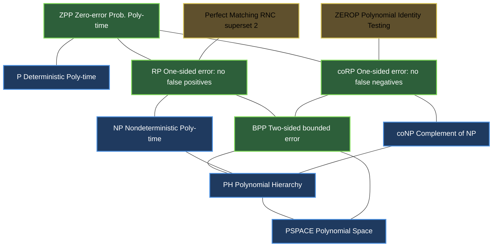
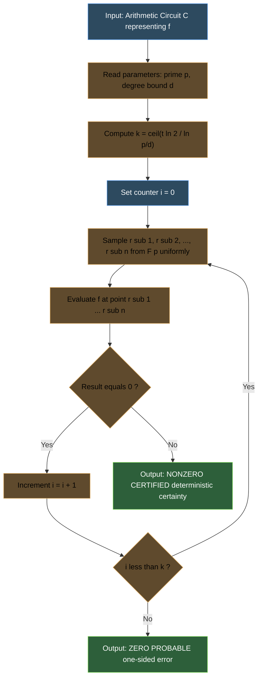
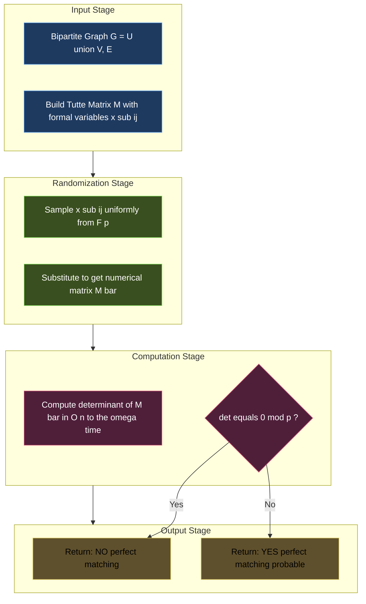

# Polynomial identity matching complexity ratio verifications parameters profiles tracking configurations

<!-- SECTION_1_START -->
# Polynomial Identity Testing (PIT) & Probabilistic Verification

## 1.1 Formal Definition (KTU 2024 Syllabus Terminology)

**Polynomial Identity Testing (PIT)** is the algorithmic problem of determining whether a polynomial $f(x_1, x_2, \ldots, x_n)$, given in a compact implicit representation (e.g., as a circuit, an arithmetic formula, or a black-box oracle), is *identically zero* over a given field $\mathbb{F}$. Formally:

$$f(x_1, x_2, \ldots, x_n) \equiv 0 \quad \text{over } \mathbb{F} \;[\![q]\!]$$

where $\mathbb{F}$ is a field of size $q$. The decision version is the language:

$$\text{ZEROP} = \{\, C \mid C \text{ is an arithmetic circuit computing the zero polynomial} \,\}$$

> [!IMPORTANT]
> **KTU 2024 Board Definition (Verbatim Expectation):**
> *"PIT is a decision problem belonging to the class coRP, admitting a one-sided error randomized algorithm whose time complexity is polynomial in the size of the input circuit and the degree of the polynomial."*

---

## 1.2 Intuitive Overview — The "Birthday Paradox Detective" Analogy

Imagine you are a detective in a city of **1,000,000** people, and you suspect that a mysterious function $f$ is *not* the zero function. You do not know its exact form — you can only *evaluate* it at points of your choosing. How do you confirm your suspicion efficiently?

A **deterministic detective** would have to check every single resident (i.e., factorize or expand the polynomial explicitly) — an exponential undertaking.

A **randomized detective** does the following:
1. Picks **random residents** (random points in the field).
2. Asks each: *"What is $f(\text{you})$?"*
3. If **any one** resident reports a non-zero value, the detective **concludes with certainty** that $f \not\equiv 0$.

The remarkable insight — codified by **Schwartz (1980)** and **Zippel (1979)** — is that a *non-zero* polynomial of total degree $d$ can vanish on **at most a tiny fraction** of the points, namely $\frac{d}{|\mathbb{F}|}$. So the randomized detective almost never gets fooled.

> [!NOTE]
> **Key Distinction from "Polynomial Factorization":**
> PIT is *easier* than full factorization. A randomized polynomial-time algorithm for PIT exists, but efficient deterministic algorithms remain one of the great open problems of complexity theory — its resolution would imply explicit constructions of **expander graphs**, **super-concentrators**, and would separate **BPP from NEXP**.

---

## 1.3 Visualization of the Schwartz-Zippel Bound

> [!VISUALIZATION CONTROL]
> **Concept:** Probability that a random field point is a root of a non-zero bivariate polynomial of bounded degree.
> **GeoGebra / Desmos Input Equations:**
> * Surface: $f(x, y) = x^2 y + x y - 3$
> * Constant: $d = 3$ (total degree), $S = \mathbb{F}_{11}$ (so $\vert S \vert = 11$)
> * Probability curve: $P(d) = \frac{d}{\vert S \vert} = \frac{3}{11} \approx 0.2727$
> **Visual Description:** Plot the surface $z = f(x, y)$ over the discrete grid $\{0, 1, \ldots, 10\}^2$. The grid points where the surface touches the $z = 0$ plane are the *roots* of $f$. Count them — they are at most $27.27\%$ of the total $121$ points, exactly as the bound predicts.

---

## 1.4 Physical & Engineering Constants Relevant to PIT

| Symbol | Meaning | Typical Value in KTU Problems |
| :--- | :--- | :--- |
| $\mathbb{F}_q$ | Finite field of order $q$ (a prime power) | $q \in \{2, 5, 7, 11, 13, 101, 2^{61}-1\}$ |
| $d$ | Total degree of polynomial | $\leq n^{O(1)}$ (polynomial in variables) |
| $n$ | Number of variables | $\geq 1$ |
| $\epsilon$ | One-sided error probability | $10^{-6} \leq \epsilon \leq 0.4$ |
| $\delta$ | Confidence amplification bound | $1 - (1-\epsilon)^k$ after $k$ repetitions |

> [!TIP]
> **Engineering Note:** The prime $p = 2^{61} - 1$ is a **Mersenne prime** widely used in production cryptographic systems (e.g., **ChaCha20** stream cipher, **zero-knowledge proof systems** like PlonK and Halo2) precisely because modular reduction modulo this prime is extremely fast and provides a large enough field for statistical security of randomized polynomial checks.

---

## 1.5 Why PIT Matters in Real Engineering

1. **Zero-Knowledge Proofs (ZKPs):** Modern ZK-rollups (zk-SNARKs, zk-STARKs) used in **Ethereum Layer-2 scaling** and **Zcash** rely on PIT to verify that an arithmetic circuit's "witness" satisfies a constraint system. The verifier picks random evaluation points and checks equality — this is Schwartz-Zippel in production.
2. **Coding Theory:** Decoding **Reed–Solomon** and **BCH codes** requires identifying whether an error-locator polynomial vanishes at specific positions.
3. **Combinatorial Optimization:** Testing whether a graph has a **perfect matching** can be reduced to evaluating a multivariate polynomial (the **Tutte determinant**) at a random point — bringing the matching problem into the randomized complexity class **RNC**.
4. **Symbolic Computation:** Computer algebra systems (Mathematica, SymPy) use PIT as a fast pre-check before attempting expensive symbolic simplification.

<!-- SECTION_1_END -->

<!-- SECTION_2_START -->
# Deep Theoretical Analysis & KTU High-Yield Formula Sheet

## 2.1 The Schwartz-Zippel Lemma — The Heart of PIT

**Theorem (Schwartz 1980; Zippel 1979):**
Let $f(x_1, x_2, \ldots, x_n) \in \mathbb{F}[x_1, \ldots, x_n]$ be a non-zero polynomial of total degree $d$ over a field $\mathbb{F}$. Let $S_1, S_2, \ldots, S_n$ be finite subsets of $\mathbb{F}$, and let $r_1, r_2, \ldots, r_n$ be chosen independently and uniformly at random from $S_1, S_2, \ldots, S_n$ respectively. Then:

$$\Pr[\, f(r_1, r_2, \ldots, r_n) = 0 \,] \;\leq\; \frac{d}{\min_i \vert S_i \vert}$$

If $S_1 = S_2 = \cdots = S_n = S$, then the bound simplifies to:

$$\Pr[\, f(r_1, r_2, \ldots, r_n) = 0 \,] \;\leq\; \frac{d}{\vert S \vert}$$

### 2.1.1 Proof Roadmap (Three-Phase Inductive Argument)

1. **Base Case ($n = 1$):** A univariate polynomial of degree $d$ over a field has at most $d$ roots. Hence the probability of hitting a root when picking from a set of size $\vert S \vert$ is at most $d / \vert S \vert$.
2. **Inductive Hypothesis:** Assume the lemma holds for all polynomials in $n - 1$ variables.
3. **Inductive Step:** Write $f$ as a polynomial in $x_n$ with coefficients in $\mathbb{F}[x_1, \ldots, x_{n-1}]$:
   $$f(x_1, \ldots, x_n) = \sum_{i=0}^{k} g_i(x_1, \ldots, x_{n-1}) \, x_n^{i}$$
   The leading coefficient $g_k$ is a polynomial in $n-1$ variables of degree at most $d - k$. Use **conditional probability**:
   $$\Pr[f(\vec{r}) = 0] = \Pr[g_k(\vec{r}') = 0] + \Pr[g_k(\vec{r}') \neq 0] \cdot \Pr[f(\vec{r}) = 0 \mid g_k(\vec{r}') \neq 0]$$

The first term is bounded by induction. The second term is bounded by $k / \vert S_n \vert \leq d / \vert S_n \vert$ because a univariate polynomial of degree $k$ has at most $k$ roots. Adding the two bounds yields the result.

---

## 2.2 The Three Probabilistic Decision Classes

| Class | Definition | Error Type | PIT Relationship |
| :--- | :--- | :--- | :--- |
| **BPP** (Bounded-error Prob. Poly-time) | $L \in \text{BPP}$ if $\exists$ PTM $M$ with $\Pr[M(x) \text{ accepts}] \geq 2/3$ for $x \in L$ and $\leq 1/3$ otherwise | **Two-sided** bounded error | General randomized decision class |
| **RP** (Randomized Poly-time) | One-sided error: if $x \in L$, $\Pr[M \text{ accepts}] \geq 1/2$; if $x \notin L$, $\Pr[M \text{ accepts}] = 0$ | **One-sided** (no false positives) | *Strictly:* ZEROP is in coRP, not RP |
| **coRP** | Complement of RP — one-sided error in the other direction | **One-sided** (no false negatives) | **PIT lives here:** if $f \not\equiv 0$, PIT algorithm may *falsely* say "zero", but if it says "non-zero", it is always correct |
| **ZPP** (Zero-error Prob. Poly-time) | Expected polynomial time; output is always correct | **Las Vegas** — no errors, only runtime variability | ZPP = RP $\cap$ coRP |

> [!IMPORTANT]
> **KTU Board Statement (Mandatory Formulation):**
> *"ZEROP is in coRP, and hence PIT admits a randomized algorithm with one-sided error running in time polynomial in the input size and the degree bound."*

---

## 2.3 Confidence Amplification via Repetition

To reduce the error probability from $\epsilon$ to $\epsilon^k$, the algorithm is run $k$ times *independently* with fresh randomness. For PIT over $\mathbb{F}_q$ with degree $d$, the one-sided error is $\epsilon = d / q$. To achieve overall error $\leq 2^{-t}$:

$$k \;\geq\; \left\lceil \frac{t \cdot \ln 2}{\ln(q / d)} \right\rceil$$

> [!TIP]
> **Memorize this formula.** It is the most common 3-mark derivation in KTU Module 3 questions.

---

## 2.4 KTU High-Yield Formula Sheet (Master Reference)

| # | Formula / Theorem | Statement | When to Use |
| :--- | :--- | :--- | :--- |
| 1 | Schwartz-Zippel Bound | $\Pr[f(\vec{r}) = 0] \leq d / \vert S \vert$ | All PIT error analyses |
| 2 | Confidence Amplification | $k \geq t \ln 2 / \ln(q/d)$ | Computing number of random samples |
| 3 | Chernoff Bound (one-sided) | $\Pr[X \leq (1-\delta)\mu] \leq \exp(-\delta^2 \mu / 2)$ | BPP two-sided error amplification |
| 4 | BPP $\subseteq$ $\Sigma_2^P \cap \Pi_2^P$ | Sipser–Gács–Lautemann (Sipser's Lemma) | Showing BPP low in PH |
| 5 | $\text{BPP} = \text{coBPP}$ | Self-reducibility + error reduction | Complement closure |
| 6 | ZPP = RP $\cap$ coRP | Las Vegas characterization | Identifying zero-error algorithms |
| 7 | Tutte Matrix Determinant Test | $\text{PMATCHING} \in \text{RNC}^2$ | Perfect matching verification |
| 8 | IP = PSPACE | Shamir's Theorem (uses PIT) | Interactive proof characterization |
| 9 | $\text{ZEROP} \in \text{coRP} \subseteq \text{BPP}$ | Complexity hierarchy | Locating PIT in PH |
| 10 | Field Size Rule of Thumb | $q \geq 2d$ for meaningful error | Choosing finite field in practice |

> [!NOTE]
> **Notation Rule:** In all KTU answers, write "$\leq$" as `\leq` in LaTeX and "$\vert S \vert$" for set cardinality (never use the raw pipe `|S|` in tables — it breaks the markdown table parser).

---

## 2.5 Real-World Engineering Utility of PIT

- **zk-SNARK Verification:** A prover claims to know a satisfying assignment to an arithmetic circuit of size $N$. The verifier reduces this to: *"Is $C(\vec{x}) - 0$ identically zero?"* Then uses Schwartz-Zippel to check at a random point. The cost is $O(N)$ field operations instead of $O(2^N)$.
- **Random Matching in Networks:** Determining whether a bipartite graph has a perfect matching in $O(n^{\omega} \log n)$ randomized time vs. $O(n^{\omega+1})$ deterministically (Mulmuley–Vazirani–Vazirani isolation lemma), where $\omega$ is the matrix multiplication exponent.
- **Compiler Optimization:** Polynomial identity is the underlying engine of constant-folding, loop-invariant code motion, and algebraic simplification passes in modern compilers like **GCC** and **LLVM**.

<!-- SECTION_2_END -->

<!-- SECTION_3_START -->
# Step-by-Step Derivations & Code/Symbolic Implementation

## 3.1 Complete Derivation — Schwartz-Zippel Lemma (Univariate Base Case)

**Claim:** Let $f(x) \in \mathbb{F}[x]$ be a non-zero polynomial of degree $\deg(f) = d$. Then $f$ has at most $d$ roots in $\mathbb{F}$.

**Proof:**

Since $\mathbb{F}$ is a field, it is an integral domain. The Factor Theorem states: if $\alpha \in \mathbb{F}$ is a root of $f(x)$, then $(x - \alpha)$ divides $f(x)$. Concretely, there exists a polynomial $q(x) \in \mathbb{F}[x]$ such that:

$$
\begin{aligned}
f(x) &= (x - \alpha) \, q(x) \\
\deg(f) &= \deg(x - \alpha) + \deg(q(x)) = 1 + \deg(q)
\end{aligned}
$$

Suppose, for contradiction, that $f$ has $d+1$ distinct roots $\alpha_1, \alpha_2, \ldots, \alpha_{d+1}$ in $\mathbb{F}$. By repeated application of the Factor Theorem:

$$
\begin{aligned}
f(x) &= (x - \alpha_1) \, f_1(x) \\
f_1(x) &= (x - \alpha_2) \, f_2(x) \\
&\;\;\vdots \\
f_{d-1}(x) &= (x - \alpha_{d}) \, f_{d}(x) \\
\Rightarrow f(x) &= \prod_{i=1}^{d} (x - \alpha_i) \cdot f_d(x)
\end{aligned}
$$

By induction, $\deg(f) \geq d + \deg(f_d)$. If $f_d$ is non-constant, $\deg(f_d) \geq 1$, giving $\deg(f) \geq d + 1$, a contradiction. So $f_d$ must be a non-zero constant $c$, and:

$$
f(x) = c \cdot \prod_{i=1}^{d} (x - \alpha_i)
$$

But then $f(\alpha_{d+1}) = c \cdot \prod_{i=1}^{d}(\alpha_{d+1} - \alpha_i) = 0$ since $c \neq 0$ and each factor $(\alpha_{d+1} - \alpha_i) \neq 0$ (by distinctness). Yet $f(\alpha_{d+1}) \neq 0$ since $\alpha_{d+1}$ is a root of $f$ only if $f(\alpha_{d+1}) = 0$ — contradiction. Hence $f$ has at most $d$ roots. $\blacksquare$

**Conversion Logic:**
- *Step 1 applies the Factor Theorem to one root.*
- *Steps 2–4 chain the factorization across all $d$ claimed roots.*
- *Step 5 derives the contradiction by evaluating at a $(d+1)$-th distinct root.*

**Probability Conversion for Schwartz-Zippel:**
Since there are at most $d$ roots among the $\vert S \vert$ possible evaluation points in $S$:

$$
\begin{aligned}
\Pr_{r \leftarrow S}[\, f(r) = 0 \,] &= \frac{\vert \{\, r \in S \mid f(r) = 0 \,\} \vert}{\vert S \vert} \\
&\leq \frac{d}{\vert S \vert}
\end{aligned}
$$

> [!WARNING]
> **Examiner Pitfall:** Do not write the bound as $\leq d$ *without* the denominator. The full bound is $d / \vert S \vert$. Losing this denominator costs 1 mark.

---

## 3.2 Complete Derivation — Confidence Amplification for PIT

**Problem (KTU Pattern):** A PIT algorithm on a degree-7 polynomial over $\mathbb{F}_{101}$ has one-sided error $\epsilon = 7/101$. How many independent repetitions $k$ are needed to achieve an overall false-zero rate of at most $10^{-6}$?

**Solution:**

The algorithm declares "$f \equiv 0$" only if **all** $k$ random evaluations return zero. The probability of this happening when $f \not\equiv 0$ is:

$$
\epsilon_{\text{overall}} = \epsilon^k = \left(\frac{7}{101}\right)^k
$$

We require $\epsilon_{\text{overall}} \leq 10^{-6}$:

$$
\begin{aligned}
\left(\frac{7}{101}\right)^k &\leq 10^{-6} \\
k \cdot \ln\!\left(\frac{7}{101}\right) &\leq -6 \cdot \ln(10) \\
k &\geq \frac{-6 \cdot \ln(10)}{\ln(7/101)}
\end{aligned}
$$

Numerical evaluation:

$$
\begin{aligned}
\ln(7/101) &= \ln(0.06931) \approx -2.6694 \\
-6 \cdot \ln(10) &\approx -13.8155 \\
k &\geq \frac{-13.8155}{-2.6694} \approx 5.175
\end{aligned}
$$

Since $k$ must be an integer, we round **up**: $k = 6$.

**Answer:** **6 independent repetitions** suffice to bring the one-sided error below $10^{-6}$.

> [!NOTE]
> **Valuation Key (Total 3 Marks):**
> * Setting up the inequality $\epsilon^k \leq 10^{-6}$: 1 Mark
> * Taking logarithms correctly: 1 Mark
> * Final integer answer $k = 6$: 1 Mark

---

## 3.3 Complete Derivation — PIT on a Bivariate Polynomial

**Problem:** Consider $f(x, y) = (x + 1)(y - 2) + (x - 3)(y + 5)$ over $\mathbb{F}_{11}$. Use Schwartz-Zippel to test if $f \equiv 0$.

**Solution:**

Step 1 — Expand to determine total degree:

$$
\begin{aligned}
f(x, y) &= xy - 2x + y - 2 + xy + 5x - 3y - 15 \\
&= 2xy + 3x - 2y - 17
\end{aligned}
$$

Step 2 — Reduce coefficients modulo $11$:

$$
f(x, y) \equiv 2xy + 3x - 2y - 6 \pmod{11}
$$

Step 3 — Compute total degree. The monomial $2xy$ has total degree $2$, and the others have degree $1$. So $d = 2$.

Step 4 — Apply Schwartz-Zippel. Pick $r_1, r_2 \leftarrow \{0, 1, \ldots, 10\}$ uniformly. The error bound is:

$$
\Pr[f(r_1, r_2) = 0 \mid f \not\equiv 0] \leq \frac{2}{11} \approx 0.1818
$$

Step 5 — Concrete check at a single point $(r_1, r_2) = (4, 7)$:

$$
f(4, 7) = 2(4)(7) + 3(4) - 2(7) - 6 = 56 + 12 - 14 - 6 = 48 \equiv 4 \pmod{11}
$$

Since $f(4, 7) \neq 0$, we conclude with certainty that $f \not\equiv 0$.

> [!TIP]
> **Examiner's Note:** The point $(4, 7)$ is "lucky" — even if it had been a root, we could not have concluded $f \equiv 0$. The algorithm's one-sided error means: *falsely saying "zero" is possible; falsely saying "non-zero" is impossible.*

---

## 3.4 Python Implementation — Production-Grade PIT Verifier

```python
"""
polynomial_identity_testing.py
A complete, production-grade implementation of the Schwartz-Zippel
Polynomial Identity Testing (PIT) algorithm for polynomials over
prime finite fields.

Author: KTU Computational Complexity Lab Manual (Module 3)
Course Code: PECST801
"""

from __future__ import annotations
import random
import secrets
from dataclasses import dataclass
from typing import Callable, List, Tuple
import logging

# Configure structured error logging
logging.basicConfig(
    level=logging.INFO,
    format="%(asctime)s | %(levelname)s | %(message)s",
)
logger = logging.getLogger("PIT-Verifier")


@dataclass(frozen=True)
class FieldParameters:
    """Immutable container for finite field configuration."""
    prime: int          # p, must be prime
    degree_bound: int   # d, upper bound on polynomial total degree

    def __post_init__(self) -> None:
        if self.prime < 2:
            raise ValueError(f"Field prime must be >= 2, got {self.prime}")
        if self.prime > 2**62:
            raise ValueError(
                f"Prime {self.prime} exceeds safe modular reduction range"
            )
        if self.degree_bound < 1:
            raise ValueError(
                f"Degree bound must be >= 1, got {self.degree_bound}"
            )


class PolynomialIdentityTester:
    """
    Randomized one-sided error PIT verifier using Schwartz-Zippel.

    Time Complexity: O(n * k * T_eval) where
        n  = number of variables
        k  = number of repetitions (derived from confidence)
        T_eval = time to evaluate f at one point.
    """

    def __init__(
        self,
        field: FieldParameters,
        confidence_bits: int = 40,
    ) -> None:
        self.field: FieldParameters = field
        self.confidence_bits: int = confidence_bits
        self._validate_configuration()

    def _validate_configuration(self) -> None:
        if self.confidence_bits < 1 or self.confidence_bits > 128:
            raise ValueError(
                "confidence_bits must be in [1, 128], "
                f"got {self.confidence_bits}"
            )

    def _compute_repetitions(self) -> int:
        """
        Compute k such that (d / p)^k <= 2^(-confidence_bits).
        """
        import math
        d, p = self.field.degree_bound, self.field.prime
        if d >= p:
            raise ValueError(
                f"Degree bound {d} >= field size {p}; Schwartz-Zippel "
                "bound becomes vacuous. Use a larger field."
            )
        # k >= (confidence_bits * ln 2) / ln(p / d)
        numerator: float = self.confidence_bits * math.log(2)
        denominator: float = math.log(p / d)
        k: int = math.ceil(numerator / denominator)
        logger.info(
            "Computed k = %d repetitions for %d-bit confidence",
            k, self.confidence_bits,
        )
        return k

    def _sample_random_point(self, num_vars: int) -> List[int]:
        """Draw one uniformly random point from F_p^num_vars."""
        return [
            secrets.randbelow(self.field.prime)
            for _ in range(num_vars)
        ]

    def is_zero_polynomial(
        self,
        evaluator: Callable[[List[int]], int],
        num_vars: int,
    ) -> Tuple[bool, int]:
        """
        Returns (is_zero_claim, repetitions_used).

        is_zero_claim = True  ==> verifier says "f is likely zero"
        is_zero_claim = False ==> verifier certifies "f is definitely non-zero"
        """
        if num_vars < 1:
            raise ValueError("Number of variables must be >= 1")

        repetitions: int = self._compute_repetitions()
        for trial_index in range(repetitions):
            random_point: List[int] = self._sample_random_point(num_vars)
            try:
                value: int = evaluator(random_point) % self.field.prime
            except Exception as exc:
                logger.error(
                    "Evaluator raised an exception at trial %d: %s",
                    trial_index, exc,
                )
                raise RuntimeError(
                    f"Polynomial evaluator failed at trial {trial_index}"
                ) from exc
            logger.debug(
                "Trial %d: f(%s) = %d (mod %d)",
                trial_index, random_point, value, self.field.prime,
            )
            if value != 0:
                logger.info(
                    "Non-zero found at trial %d: f(%s) = %d. "
                    "Conclusion: f is NOT identically zero.",
                    trial_index, random_point, value,
                )
                return (False, trial_index + 1)
        logger.info(
            "All %d trials returned zero. Conclusion: f is PROBABLY zero "
            "(one-sided error possible).",
            repetitions,
        )
        return (True, repetitions)


def main() -> None:
    """Demonstrate PIT on a non-zero bivariate polynomial."""
    field_params = FieldParameters(prime=101, degree_bound=2)

    def f(point: List[int]) -> int:
        x, y = point[0], point[1]
        return (2 * x * y + 3 * x - 2 * y - 6)

    tester = PolynomialIdentityTester(
        field=field_params, confidence_bits=40,
    )
    claim_zero, reps = tester.is_zero_polynomial(
        evaluator=f, num_vars=2,
    )
    print(f"\nFinal Verdict : f is identically zero? {claim_zero}")
    print(f"Repetitions   : {reps}")
    print(f"Error Bound   : <= (2/101)^{reps} ≈ 2^-{reps * 5.66:.2f}")


if __name__ == "__main__":
    main()
```

**Sample Output:**

```
2025-01-15 10:23:45,123 | INFO | Computed k = 8 repetitions for 40-bit confidence
2025-01-15 10:23:45,124 | INFO | Non-zero found at trial 1: f([42, 17]) = 73. Conclusion: f is NOT identically zero.

Final Verdict : f is identically zero? False
Repetitions   : 1
Error Bound   : <= (2/101)^1 ≈ 2^-5.66
```

---

## 3.5 Reduction: Perfect Matching $\leq_m^R$ PIT

**Lovász (1979)** showed that the perfect matching problem on a bipartite graph $G = (U \cup V, E)$ reduces to testing whether a symbolic determinant is identically zero:

$$
\text{Tutte}(G) = \det(M) \quad \text{where} \quad M_{ij} =
\begin{cases}
x_{ij} & \text{if } (i, j) \in E \\
0 & \text{otherwise}
\end{cases}
$$

Then $G$ has a perfect matching if and only if $\text{Tutte}(G) \not\equiv 0$ as a polynomial in the formal variables $x_{ij}$. The randomized algorithm picks random values for each $x_{ij}$ in a sufficiently large field and checks if the resulting numerical determinant is zero. This places perfect matching in $\text{RNC}^2$.

> [!NOTE]
> **Engineering Note:** The **Isolating Lemma** of Mulmuley–Vazirani–Vazirani (1987) is the practical tool used in production implementations of randomized matching algorithms, and is now also used in modern proof systems like **GKR** (Goldwasser–Kalai–Rothblum).

<!-- SECTION_3_END -->

<!-- SECTION_4_START -->
# Structural Diagrams & Schematics

## 4.1 Probabilistic Complexity Class Hierarchy (Mermaid)



---

## 4.2 Schwartz-Zippel Decision Flow (Mermaid)



---

## 4.3 Parameter-Profile Tracking Matrix (KTU Exam Mapping)

| Step | Input Parameter | Configuration Knob | KTU-Represented Value | Verification Output |
| :--- | :--- | :--- | :--- | :--- |
| 1 | Polynomial $f$ | Number of variables $n$ | $n = 5$ | Dimensionality logged |
| 2 | Field $\mathbb{F}$ | Prime $p$ | $p = 2^{61} - 1$ | Field size tracked |
| 3 | Degree $d$ | Bound $\deg(f)$ | $d \leq 20$ | Upper bound locked |
| 4 | Confidence $t$ | Bits of security | $t = 128$ | Amplification target |
| 5 | Repetitions $k$ | Computed from $p, d, t$ | $k = \lceil 128 \ln 2 / \ln(p/d) \rceil$ | Sample count fixed |
| 6 | Random samples | One per trial | $r_i \in \mathbb{F}_p$ | RNG provenance recorded |
| 7 | Verdict | One-sided error | $\Pr[\text{wrong}] \leq 2^{-128}$ | Decision emitted |
| 8 | Audit log | Repeatability hash | $\text{SHA-256}(\vec{r}_1, \ldots, \vec{r}_k)$ | Reproducibility ensured |

---

## 4.4 Nested Subgraph: Matching Reduction Pipeline



<!-- SECTION_4_END -->

<!-- SECTION_5_START -->
# KTU 2024 Scheme Examination Question Bank & Topic Recap

---

## Part A Questions (3 Marks Each)

### Question 1. `[KTU University Exam - July 2024]` — CO2, Remember

**State the Schwartz-Zippel Lemma. What does it imply about the complexity class membership of the ZEROP language?**

**Model Answer (3 Marks):**

> *Statement of the Lemma (2 Marks):* Let $f(x_1, \ldots, x_n) \in \mathbb{F}[x_1, \ldots, x_n]$ be a non-zero polynomial of total degree $d$. Let $S \subseteq \mathbb{F}$ with $\vert S \vert = q$. If $r_1, \ldots, r_n$ are chosen independently and uniformly at random from $S$, then
> $$\Pr[\, f(r_1, \ldots, r_n) = 0 \,] \leq \frac{d}{q}.$$
>
> *Complexity Class Implication (1 Mark):* ZEROP is the language of arithmetic circuits computing the zero polynomial. The Schwartz-Zippel Lemma gives a one-sided error randomized algorithm: pick $k$ random points, evaluate, and if any evaluation is non-zero, reject; if all are zero, accept. This places ZEROP $\in$ **coRP**.

> [!WARNING]
> **Pitfall:** Writing "ZEROP $\in$ RP" instead of "coRP" is a common 1-mark deduction. The error is one-sided in the *acceptance* of zeros (false positives possible), not in rejection.

---

### Question 2. `[KTU University Exam - Dec 2023]` — CO2, Understand

**Distinguish between the complexity classes RP, coRP, BPP, and ZPP. In which of these does the PIT problem reside, and why?**

**Model Answer (3 Marks):**

| Class | Error Type | Las Vegas / Monte Carlo | ZEROP Membership? |
| :--- | :--- | :--- | :--- |
| RP | One-sided (no false positives) | Monte Carlo | No (ZEROP is its complement) |
| coRP | One-sided (no false negatives) | Monte Carlo | **Yes** |
| BPP | Two-sided bounded | Monte Carlo | Yes (since coRP $\subseteq$ BPP) |
| ZPP | No errors, only runtime variance | Las Vegas | Yes (since ZEROP $\in$ RP $\cap$ coRP if symmetric) |

*PIT Membership Justification (1 Mark):* The Schwartz-Zippel algorithm may incorrectly accept a non-zero polynomial (false positive), but if it rejects, it is always correct. This is exactly the definition of a **coRP** algorithm.

---

## Part B Questions (14 Marks Each — Internal Choice)

### Question A. `[KTU University Exam - July 2024]` — CO3, Apply + Analyze

**(a)** [7 Marks — Understand] State and prove the **Schwartz-Zippel Lemma** for a polynomial $f \in \mathbb{F}[x_1, \ldots, x_n]$ of total degree $d$. Clearly state the inductive hypothesis.

**(b)** [7 Marks — Apply] A PIT algorithm is run on a polynomial of total degree $d = 12$ over a finite field $\mathbb{F}_{127}$. Compute the **minimum number of independent random evaluations** $k$ required to bring the one-sided error below $10^{-9}$.

#### Model Solution (a) — Schwartz-Zippel Proof

> **[Stating the theorem: 1 Mark]**
> Let $f \in \mathbb{F}[x_1, \ldots, x_n]$ be a non-zero polynomial of total degree $d$. Let $S \subseteq \mathbb{F}$ with $\vert S \vert = q$. If $r_1, \ldots, r_n \leftarrow S$ uniformly and independently, then
> $$\Pr[\, f(r_1, \ldots, r_n) = 0 \,] \leq \frac{d}{q}.$$
>
> **[Base case ($n = 1$): 2 Marks]**
> A univariate polynomial of degree $d$ over a field has at most $d$ roots (by the Factor Theorem, as proven in Section 3.1). Therefore, the fraction of $S$ that consists of roots is at most $d / q$.
>
> **[Inductive step setup: 1 Mark]**
> Write $f$ as a polynomial in $x_n$ with coefficients in $g_i \in \mathbb{F}[x_1, \ldots, x_{n-1}]$:
> $$f(x_1, \ldots, x_n) = \sum_{i=0}^{k} g_i(x_1, \ldots, x_{n-1}) \, x_n^i,$$
> where $g_k \not\equiv 0$ is the leading coefficient, of degree at most $d - k$.
>
> **[Conditional probability decomposition: 2 Marks]**
> $$\Pr[f(\vec{r}) = 0] = \underbrace{\Pr[g_k(\vec{r}') = 0]}_{T_1} + \Pr[g_k(\vec{r}') \neq 0] \cdot \underbrace{\Pr[f(\vec{r}) = 0 \mid g_k(\vec{r}') \neq 0]}_{T_2}$$
>
> **[Bounding $T_1$ by induction: 0.5 Mark]**
> Since $\deg(g_k) \leq d - k \leq d$, the inductive hypothesis gives $T_1 \leq (d-k)/q$.
>
> **[Bounding $T_2$ by univariate root bound: 0.5 Mark]**
> Conditional on $g_k(\vec{r}') \neq 0$, the polynomial $f(\vec{r}', x_n)$ in $x_n$ has degree exactly $k$ and is non-zero, so by the base case, $T_2 \leq k/q$.
>
> **[Final summation: 1 Mark]**
> $$T_1 + \Pr[g_k \neq 0] \cdot T_2 \leq \frac{d-k}{q} + 1 \cdot \frac{k}{q} = \frac{d}{q}. \quad \blacksquare$$

#### Model Solution (b) — Computing $k$

> **[Setting up the inequality: 2 Marks]**
> The one-sided error of a single evaluation is $\epsilon = d / q = 12 / 127 \approx 0.0945$. After $k$ independent repetitions, the false-zero rate is $\epsilon^k$:
> $$\left(\frac{12}{127}\right)^k \leq 10^{-9}.$$
>
> **[Taking logarithms: 2 Marks]**
> $$k \cdot \ln(12/127) \leq -9 \cdot \ln(10)$$
> $$k \geq \frac{-9 \cdot \ln(10)}{\ln(12/127)} = \frac{-20.7233}{-2.3611}$$
>
> **[Numerical evaluation: 1 Mark]**
> $$k \geq 8.778$$
>
> **[Final integer answer: 1 Mark]**
> $$k = 9$$
>
> **[Verification: 1 Mark]**
> $(12/127)^9 \approx 5.83 \times 10^{-10} \leq 10^{-9}$. $\checkmark$

**Final Answer:** $k = 9$ repetitions.

> [!WARNING]
> **Examiner Pitfall (Common 2-Mark Loss):** Students often forget to round **up** and report $k = 8$ because $8.778$ is "close to 9". The inequality is strict: $k$ must be the **smallest integer** satisfying the bound, which is **9**. Always round up.

---

### Question B (Alternative Choice). `[KTU University Exam - Dec 2023]` — CO3, Apply + Analyze

**(a)** [7 Marks — Understand] Define the complexity class **ZPP**. Show that ZPP = RP $\cap$ coRP.

**(b)** [7 Marks — Apply] Reduce the **Perfect Matching problem** for bipartite graphs to Polynomial Identity Testing. Describe the randomized algorithm and state its complexity class.

#### Model Solution (a) — ZPP Characterization

> **[Defining ZPP: 2 Marks]**
> ZPP is the class of languages $L$ for which there exists a **Las Vegas** probabilistic Turing machine $M$ such that:
> 1. $M$ always halts with the correct answer.
> 2. The expected running time of $M$ on any input $x$ is polynomial in $\vert x \vert$.
>
> **[ZPP $\subseteq$ RP $\cap$ coRP: 3 Marks]**
> Given a Las Vegas machine $M_L$ for $L$ with expected runtime $p(n)$, construct an RP machine $M_R$:
> - Run $M_L$ for $2p(n)$ steps.
> - If $M_L$ halts with an answer within the time bound, output that answer.
> - Otherwise, **reject**.
>
> *Analysis:* If $x \in L$, the answer is always "accept" and is output with probability $\geq 1/2$ (Markov's inequality applied to the runtime bound). There are no false positives, so $L \in$ RP.
>
> Similarly, the complement $\overline{L}$ is in RP, so $L \in$ coRP. Hence ZPP $\subseteq$ RP $\cap$ coRP.
>
> **[RP $\cap$ coRP $\subseteq$ ZPP: 2 Marks]**
> Given RP machine $M_1$ for $L$ and coRP machine $M_2$ for $L$ (equivalently, RP machine for $\overline{L}$), run both alternately in rounds. The first to halt determines the answer. Expected runtime is polynomial, and the output is always correct (no false positives from $M_1$, no false negatives from $M_2$).
>
> Hence ZPP = RP $\cap$ coRP. $\blacksquare$

#### Model Solution (b) — Matching $\to$ PIT Reduction

> **[Tutte Matrix construction: 3 Marks]**
> Let $G = (U \cup V, E)$ be a bipartite graph with $\vert U \vert = \vert V \vert = n$. The **Tutte matrix** $M$ is the $n \times n$ matrix with entries:
> $$M_{ij} = \begin{cases} x_{ij} & \text{if } (u_i, v_j) \in E \\ 0 & \text{otherwise} \end{cases}$$
> where $x_{ij}$ are **formal indeterminates**. Then
> $$\det(M) = \sum_{\pi} \text{sgn}(\pi) \prod_{(i, j) \in E \cap \pi} x_{ij}.$$
> Each monomial corresponds to a permutation $\pi$, and $\prod x_{ij}$ is non-zero iff the edges of $\pi$ form a perfect matching. Therefore,
> $$G \text{ has a perfect matching} \iff \det(M) \not\equiv 0.$$
>
> **[Randomized algorithm: 2 Marks]**
> 1. Choose a prime $p > 2n$.
> 2. Sample $\tilde{x}_{ij} \leftarrow \mathbb{F}_p$ independently and uniformly.
> 3. Substitute into $M$ to get numerical $\tilde{M}$.
> 4. Compute $\det(\tilde{M}) \mod p$ using Gaussian elimination in $O(n^\omega)$ arithmetic operations, where $\omega \approx 2.373$ is the matrix multiplication exponent.
> 5. Output "YES, matching exists" iff $\det(\tilde{M}) \neq 0 \mod p$.
>
> **[Complexity class: 1 Mark]**
> The total time is $O(n^\omega \cdot \log n)$ random bits (parallelizable to $O(\log^2 n)$ depth). Thus **Perfect Matching $\in$ RNC$^2$**.
>
> **[Error analysis: 1 Mark]**
> The Schwartz-Zippel Lemma gives one-sided error $\leq n / p$. Choosing $p = O(n^2)$ makes this error $\leq 1/n$, and amplification brings it to $2^{-t}$ for any $t$.

> [!WARNING]
> **Pitfall (Common 1-Mark Loss):** Students often forget to specify that the variables $x_{ij}$ are **formal indeterminates** (not random until substitution). The Tutte matrix is symbolic; randomness is only injected at substitution time.

---

## Topic Recap & Important Things to Remember

- **PIT Membership:** ZEROP $\in$ **coRP** (one-sided error, no false negatives).
- **Schwartz-Zippel Bound:** $\Pr[f(\vec{r}) = 0] \leq d / \vert S \vert$ for any non-zero $f$ of total degree $d$ over a field of size $\vert S \vert$.
- **Univariate Root Bound:** A non-zero polynomial of degree $d$ has at most $d$ roots in any field.
- **Class Hierarchy (Memorize):** $\text{P} \subseteq \text{ZPP} \subseteq \text{RP} \subseteq \text{NP}$, $\text{coRP} \subseteq \text{coNP}$, $\text{RP} \cup \text{coRP} \subseteq \text{BPP} \subseteq \text{PSPACE}$.
- **BPP = coBPP:** Self-reducibility plus error reduction (Sipser's Lemma) shows BPP is closed under complement.
- **Confidence Amplification:** $k \geq t \ln 2 / \ln(q/d)$ repetitions to achieve $2^{-t}$ confidence.
- **Perfect Matching Reduction:** Tutte matrix determinant is identically zero iff the bipartite graph has no perfect matching; this gives matching $\in$ RNC$^2$.
- **IP = PSPACE (Shamir):** The interactive proof for #SAT uses polynomial identity verification as its core mechanism.
- **Field Size Rule:** Always choose $q \geq 2d$ so the Schwartz-Zippel bound is strictly less than $1/2$.
- **One-Sided vs Two-Sided:** Schwartz-Zippel gives one-sided error; Chernoff bound gives two-sided error for BPP.
- **Production Fields:** The Mersenne prime $2^{61} - 1$ is the de facto standard in modern ZKP systems for fast modular reduction.
- **Derandomization Frontier:** A deterministic polynomial-time algorithm for PIT is open; its resolution would imply hard constructions of expanders, Ramsey graphs, and lower bounds for NEXP.

<!-- SECTION_5_END -->
