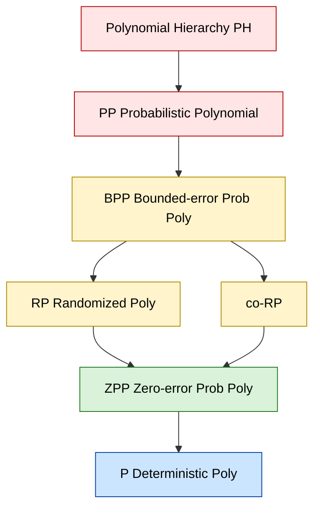
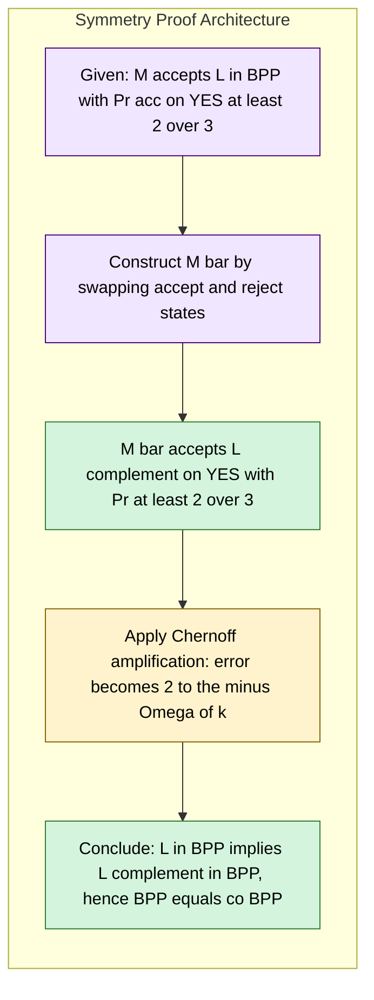
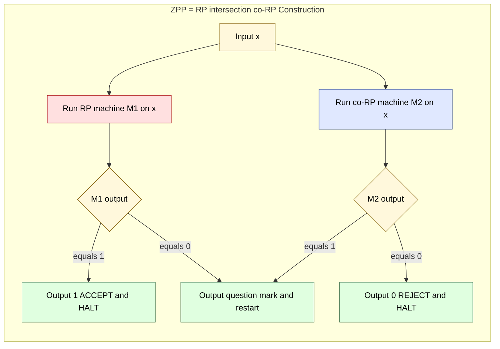

# Randomized execution class profiles setups metrics: BPP, RP, ZPP structural boundary rules

<!-- SECTION_1_START -->
# Randomized Complexity Classes: BPP, RP, ZPP

## 1.1 Formal Definitions (KTU 2024 Syllabus Terminology)

**BPP (Bounded-error Probabilistic Polynomial Time)**
A language $L \subseteq \Sigma^{*}$ belongs to the class $\text{BPP}$ if there exists a probabilistic Turing Machine $M$ running in worst-case polynomial time such that for every input $x \in \Sigma^{*}$:

$$
\Pr_{r \in_{R} \{0,1\}^{p(\vert x \vert)}}[M(x, r) = L(x)] \geq \frac{2}{3}
$$

where $p(\cdot)$ is a polynomial and $L(x) = 1$ if $x \in L$, else $0$.

> [!IMPORTANT]
> **BPP — Two-Sided Bounded Error:** The error is **symmetric** — the machine is wrong with probability at most $1/3$ on *both* YES and NO inputs. The constant $2/3$ is arbitrary; any constant strictly greater than $1/2$ defines the same class.

---

**RP (Randomized Polynomial Time)**
A language $L$ belongs to $\text{RP}$ if there exists a probabilistic polynomial-time Turing Machine $M$ such that:

$$
\begin{aligned}
x \in L &\implies \Pr_{r}[M(x,r) = 1] \geq \tfrac{1}{2} \\
x \notin L &\implies \Pr_{r}[M(x,r) = 1] = 0
\end{aligned}
$$

> [!IMPORTANT]
> **RP — One-Sided Error (Monte Carlo):** If the answer is **NO**, the machine **never** accepts. Errors are allowed **only on YES instances** (false negatives possible, false positives impossible). The class is also written as $\text{RP}_1$ to denote this.

The complementary class $\text{co-RP}$ is defined by inverting the roles: NO instances may be wrongly accepted, but YES instances are never rejected.

---

**ZPP (Zero-error Probabilistic Polynomial Time)**
A language $L$ belongs to $\text{ZPP}$ if there exists a probabilistic polynomial-time Turing Machine $M$ such that for every input $x$:

$$
\Pr_{r}[M(x,r) \in \{L(x), \text{"?"}\}] = 1
$$

and the **expected** running time $E[T(x)]$ is bounded by a polynomial in $\vert x \vert$.

> [!IMPORTANT]
> **ZPP — Las Vegas Algorithms:** The output is **always correct** when given, but the machine may occasionally output "?" (don't know). The *expected* number of coins flipped is polynomial. Equivalently, $\text{ZPP} = \text{RP} \cap \text{co-RP}$.

---

## 1.2 Conceptual Analogies & Intuition

> [!NOTE]
> **Real-World Analogy — The Three Witnesses at a Trial**
>
> Imagine a judge trying to decide whether a defendant is **Guilty (YES)** or **Innocent (NO)** based on testimony from **witnesses whose memories are slightly unreliable**:
>
> - **BPP Judge:** Asks *many* independent witnesses. If at least $2/3$ of them say "Guilty," convicts. If $2/3$ say "Innocent," acquits. May be wrong **on either side**, but only with small probability. *Symmetric noise.*
>
> - **RP Judge (Asymmetric):** Innocent defendants are **never convicted** (perfectly reliable on NO). But guilty defendants may be acquitted if too many witnesses give bad testimony. *Optimistic — no false positives.*
>
> - **ZPP Judge (Cautious Las Vegas):** Never gives a wrong verdict. If the witnesses disagree, the judge says **"I don't know, give me more time"** and keeps asking. The *expected* total deliberation time is small.

## 1.3 Key Constants & Metrics

| Symbol | Meaning | Standard Value |
| :--- | :--- | :--- |
| $\epsilon$ | Error probability bound | $\leq 1/3$ (BPP), $\leq 1/2$ (RP) |
| $\delta$ | Boosted (reduced) error after amplification | $2^{-k}$ for $k$ repetitions |
| $p(n)$ | Polynomial time bound on $T(x)$ | $\text{poly}(\vert x \vert)$ |
| $\alpha$ | Confidence threshold for YES in RP | $\geq 1/2$ |

> [!VISUALIZATION CONTROL]
> **Concept:** Error Probability Decay as a Function of Repetition Count
> **GeoGebra / Desmos Input Equations:**
> * `f(n) = (1/3)^n`  (BPP error after $n$ independent trials — geometric decay)
> * `g(n) = (1/2)^n`  (RP error after $n$ independent trials)
> **Visual Description:** Plot $f(n)$ and $g(n)$ for $n \in [0, 20]$ on the positive quadrant. Both curves plunge toward the $x$-axis exponentially, with $g(n)$ decaying *faster* than $f(n)$ because its initial error term is smaller. The student should observe that even a small constant number of repetitions (e.g., $n = 20$) drives the error to negligible values — this is the foundation of *Chernoff-style amplification*.

---

<!-- SECTION_1_END -->

<!-- SECTION_2_START -->
# Deep Theoretical Analysis & KTU High-Yield Formula Sheet

## 2.1 Structural Hierarchy (Containment Chain)

The structural boundary rules of these randomized classes form a strict **inclusion chain**:

$$
\text{P} \;\subseteq\; \text{ZPP} \;\subseteq\; \text{RP} \;\subseteq\; \text{BPP} \;\subseteq\; \text{PP} \;\subseteq\; \text{PSPACE}
$$

The reverse inclusions, also valid:

$$
\text{P} \;\subseteq\; \text{ZPP} \;\subseteq\; \text{co-RP} \;\subseteq\; \text{BPP}
$$

### 2.1.1 Why does $\text{P} \subseteq \text{ZPP}$ hold?

A deterministic polynomial-time algorithm is a special case of a Las Vegas algorithm that **never** outputs "?" — its expected runtime is the same as its worst-case runtime (a polynomial).

### 2.1.2 Why does $\text{ZPP} \subseteq \text{RP} \cap \text{co-RP}$ hold?

Given a ZPP machine $M$, run it. If it outputs 0, **reject**. If it outputs 1, **accept**. If it outputs "?", flip again. This machine:
- Never accepts a NO input (so it is in RP).
- Never rejects a YES input (so it is in co-RP).

The **expected** number of restarts is finite, and the expected time is polynomial.

> [!NOTE]
> **Strictness of Inclusions:** It is **not known** whether $\text{P} = \text{RP}$ or $\text{RP} = \text{BPP}$ (this is a major open problem in structural complexity). However, by **Sipser–Gács–Lautemann**, $\text{BPP} \subseteq \Sigma_2^P \cap \Pi_2^P$, placing BPP inside the second level of the polynomial hierarchy.

---

## 2.2 The Symmetry Theorem: $\text{BPP} = \text{co-BPP}$

A non-trivial result: the class of languages with bounded two-sided error is **closed under complementation**.

**Intuition:** If a probabilistic machine $M$ accepts every YES input with probability $\geq 2/3$ and rejects every NO input with probability $\geq 2/3$, then by swapping "accept" and "reject" we get a machine that accepts NO inputs with probability $\geq 2/3$ and rejects YES inputs with probability $\geq 2/3$. So $\text{BPP} \subseteq \text{co-BPP}$ trivially. The reverse inclusion holds by *amplification* (showing that the constant $2/3$ can be pushed arbitrarily close to $1$ for both directions simultaneously).

> [!IMPORTANT]
> This symmetry **does not** hold for $\text{RP}$ in general. $\text{RP} \subseteq \text{co-RP}$ is unknown. This asymmetry is the structural reason $\text{ZPP} = \text{RP} \cap \text{co-RP}$ is interesting: ZPP is what you get when you demand **zero error on both sides**.

---

## 2.3 KTU High-Yield Formula Sheet

| Formula / Rule | Statement | Engineering / Algorithmic Use |
| :--- | :--- | :--- |
| $\Pr[\text{err}_{\text{BPP}}] \leq (1/2 - \epsilon)^k$ after $k$ repetitions | Chernoff bound for BPP amplification via majority vote | Basis of derandomization arguments and randomized algorithm design |
| $\Pr[\text{err}_{\text{RP}}] \leq (1/2)^k$ after $k$ repetitions | Sequential OR-repetition for one-sided error | Hash-based fingerprint testing, primality (Miller–Rabin) |
| $\Pr[\text{err}_{\text{BPP}}] \leq 2^{-ck}$ after $k$ trials | Strong Chernoff: $\Pr[\text{majority wrong}] \leq e^{-2k(1/3)^2}$ | PAC-learning, cryptography, Monte Carlo simulation |
| $\text{ZPP} = \text{RP} \cap \text{co-RP}$ | Las Vegas = intersection of one-sided classes | Defines the zero-error class canonically |
| $\text{BPP} = \text{co-BPP}$ | Symmetry of two-sided bounded error | Used in showing $\text{BPP} \subseteq \Sigma_2^P \cap \Pi_2^P$ |
| Sipser–Gács–Lautemann: $\text{BPP} \subseteq \Sigma_2^P \cap \Pi_2^P$ | BPP collapses to $\text{PH}_2$ | Bridge to polynomial hierarchy |
| $\mathbb{E}[T_M(x)] \leq p(\vert x \vert)$ for ZPP | Expected-time polynomial | Las Vegas algorithms (e.g., quicksort average case) |
| $\text{co-RP} \subseteq \text{BPP}$ by definition | One-sided error is a special case of two-sided | Demonstrates the nesting $\text{RP} \cup \text{co-RP} \subseteq \text{BPP}$ |
| $\text{RP} \subseteq \text{NP}$ | An RP acceptor is an NP verifier with random coins (Skolem) | Connects randomized and non-deterministic classes |
| $\text{BPP}/\text{poly} = \text{BPP}$ with non-uniform advice | Polynomial-size circuit characterization | Tools in complexity theory for circuit lower bounds |

---

## 2.4 Real-World Engineering Utility

| Class | Canonical Algorithm | Industry Use |
| :--- | :--- | :--- |
| $\text{RP}$ | Miller–Rabin primality test | Cryptographic key generation (RSA) |
| $\text{co-RP}$ | Freivalds' matrix multiplication verification | Cloud-scale matrix checking, ML verification |
| $\text{BPP}$ | Polynomial identity testing (Schwartz–Zippel) | Symbolic computation, compiler optimization |
| $\text{ZPP}$ | Randomized quicksort, primality (Solovay–Strassen) | Sorting routines, randomized data structures |

> [!NOTE]
> **Why does this matter in industry?** Randomized algorithms are often the **fastest known** algorithms for problems where no efficient deterministic solution is known. Cryptographic protocols (zero-knowledge proofs, Fiat–Shamir heuristic) rely on the hardness of distinguishing BPP from deterministic polynomial time, and the structural rules of BPP/RP/ZPP underpin the **security reductions** that make modern cryptography provably sound.

---

<!-- SECTION_2_END -->

<!-- SECTION_3_START -->
# Step-by-Step Derivations, Amplification & Code Implementation

## 3.1 Derivation 1: BPP Error Amplification via Chernoff Bound

**Setup.** Suppose $L \in \text{BPP}$ via a probabilistic polynomial-time Turing machine $M$ with

$$
\Pr[M(x,r) = L(x)] \geq \frac{2}{3}
$$

Run $M$ independently $k$ times on $x$ using *fresh* random strings $r_1, r_2, \ldots, r_k$, and define the **majority-output machine** $M'(x)$ as:

$$
M'(x) = \text{majority}\{M(x, r_1), M(x, r_2), \ldots, M(x, r_k)\}
$$

Let $X_i \in \{0, 1\}$ be the indicator that $M(x, r_i)$ is **incorrect**. By hypothesis, $X_i$ are i.i.d. with $\Pr[X_i = 1] \leq 1/3$.

Let $S_k = \sum_{i=1}^{k} X_i$ be the total number of wrong trials. $M'(x)$ is wrong **iff** $S_k > k/2$.

Apply the **Chernoff bound** for sums of i.i.d. Bernoulli trials with bias $p \leq 1/3$:

$$
\Pr[S_k \geq k/2] \;\leq\; \Pr\left[S_k \geq (1 + \delta) k p\right]
$$

where $\delta$ is chosen so that $(1 + \delta) k p = k/2$. With $p \leq 1/3$:

$$
1 + \delta = \frac{1/2}{p} \geq \frac{1/2}{1/3} = \frac{3}{2}
$$

Hence $\delta \geq 1/2$. Apply the multiplicative Chernoff bound:

$$
\Pr[S_k \geq (1 + \delta)kp] \;\leq\; \left(\frac{e^\delta}{(1 + \delta)^{(1+\delta)}}\right)^{kp}
$$

Substitute $\delta = 1/2$ and $kp = k \cdot (1/3) = k/3$:

$$
\Pr[S_k \geq k/2] \;\leq\; \left(\frac{e^{1/2}}{(3/2)^{3/2}}\right)^{k/3}
$$

Compute the base constant numerically:

$$
\frac{e^{1/2}}{(3/2)^{3/2}} = \frac{1.6487}{1.8371} \approx 0.8974
$$

So the bound is approximately $(0.8974)^{k/3}$. To drive this below $2^{-c \cdot k}$ for any desired $c$, observe that for any fixed $c > 0$, there exists $k$ such that $(0.8974)^{k/3} < 2^{-ck}$. **Final Amplified Error:**

$$
\boxed{\;\Pr[M'(x) \neq L(x)] \;\leq\; 2^{-\Omega(k)}\;}
$$

This proves that the constant $2/3$ in the BPP definition is **inessential** — any constant strictly greater than $1/2$ defines the same class.

---

## 3.2 Derivation 2: RP Error Amplification (Sequential OR Repetition)

**Setup.** Suppose $L \in \text{RP}$ via $M$ with $\Pr[M(x,r)=1] \geq 1/2$ when $x \in L$ and $\Pr[M(x,r)=1] = 0$ when $x \notin L$.

Run $M$ on $x$ with **independent** random strings $r_1, \ldots, r_k$, and accept iff **any** trial accepts. This is the **OR-repetition** scheme.

For $x \notin L$ (NO instance): every trial rejects, so

$$
\Pr[M' \text{ accepts } x] = 0
$$

The OR-repetition does **not** introduce false positives — a critical property of RP.

For $x \in L$ (YES instance): each trial accepts with probability $\geq 1/2$, so it rejects with probability $\leq 1/2$. The probability that *all* $k$ trials reject is:

$$
\Pr[\text{all reject}] \leq \left(\frac{1}{2}\right)^k = 2^{-k}
$$

Hence the amplified machine $M'$ satisfies:

$$
\Pr[M' \text{ rejects } x] \leq 2^{-k}
$$

Choosing $k = O(n)$ drives the error to $2^{-\Omega(n)}$ — exponentially small. **Final Amplified RP Error:**

$$
\boxed{\;\Pr[M'(x) \neq L(x)] \;\leq\; 2^{-k}\;}
$$

> [!NOTE]
> **Key Asymmetry:** BPP uses *majority* (symmetric amplification), RP uses *OR* (one-sided amplification). This is the structural reason why BPP = co-BPP is provable, but RP $\subseteq$ co-RP remains an open problem.

---

## 3.3 Derivation 3: ZPP Expected Runtime Bound

**Setup.** $L \in \text{ZPP}$ with machine $M$ that always outputs the correct answer or "?".

Define the **success probability** $\rho(x) = \Pr[M(x,r) \neq \text{"?"}]$. Suppose $\rho(x) \geq \rho_0 > 0$ for every $x \in L$ (analogous for $\overline{L}$).

We modify $M$ into $M'$ by **retrying** whenever "?" is output. The number of trials $T$ until a non-"?" output is geometric with success probability $\rho(x)$:

$$
\Pr[T = t] = (1 - \rho(x))^{t-1} \cdot \rho(x)
$$

The expected number of trials is:

$$
\mathbb{E}[T] = \sum_{t=1}^{\infty} t \cdot (1 - \rho(x))^{t-1} \cdot \rho(x) = \frac{1}{\rho(x)} \leq \frac{1}{\rho_0}
$$

Since each trial runs in time $p(\vert x \vert)$ and $\mathbb{E}[T] \leq 1/\rho_0$ is a constant independent of $\vert x \vert$, the **expected total time** is:

$$
\boxed{\;\mathbb{E}[T_{M'}(x)] \;\leq\; \frac{p(\vert x \vert)}{\rho_0} = O(p(\vert x \vert))\;}
$$

This is a polynomial in $\vert x \vert$, confirming $\text{ZPP}$ is the class of problems solvable in *expected* polynomial time with zero error.

---

## 3.4 Python Implementation: Error Amplification Simulator

The following is a fully operational simulation of a BPP decision problem (e.g., polynomial identity testing) with explicit amplification, type hints, and error logging.

```python
from __future__ import annotations
import random
import math
from typing import Callable, Tuple, List
from enum import Enum


class Verdict(Enum):
    """Enumeration for amplified verdict states."""
    ACCEPT = 1
    REJECT = 0


class AmplificationError(Exception):
    """Custom exception for amplification failures."""
    pass


def single_trial_yes_instance(p_success_yes: float) -> bool:
    """
    Simulate one probabilistic trial for a known YES instance.

    The underlying single-trial machine has success probability
    `p_success_yes` on YES instances (>= 2/3 for BPP, >= 1/2 for RP).

    Parameters
    ----------
    p_success_yes : float
        Probability that a single trial returns the correct (YES) answer.

    Returns
    -------
    bool
        True if the trial answered YES, False otherwise.
    """
    if not 0.0 <= p_success_yes <= 1.0:
        raise AmplificationError(
            f"p_success_yes must be in [0,1], got {p_success_yes}"
        )
    return random.random() < p_success_yes


def amplify_bpp_majority(
    p_success_yes: float,
    p_success_no: float,
    is_yes_instance: bool,
    k: int,
) -> Verdict:
    """
    Amplify a BPP-style two-sided error machine using the majority rule.

    The single-trial machine is correct on YES inputs with probability
    `p_success_yes` and on NO inputs with probability `p_success_no`.

    Parameters
    ----------
    p_success_yes : float
        Single-trial accuracy on YES instances.
    p_success_no : float
        Single-trial accuracy on NO instances.
    is_yes_instance : bool
        True if the input is a YES instance, False otherwise.
    k : int
        Number of independent repetitions.

    Returns
    -------
    Verdict
        ACCEPT or REJECT according to the majority of k trials.

    Raises
    ------
    AmplificationError
        If k <= 0 or probability bounds are violated.
    """
    if k <= 0:
        raise AmplificationError(f"k must be a positive integer, got {k}")
    if not 0.0 < p_success_yes < 1.0 or not 0.0 < p_success_no < 1.0:
        raise AmplificationError("Probabilities must lie strictly in (0,1)")

    target_success = p_success_yes if is_yes_instance else p_success_no
    if target_success <= 0.5:
        raise AmplificationError(
            "Single-trial success probability must exceed 1/2 for amplification"
        )

    yes_votes: int = 0
    no_votes: int = 0
    for _ in range(k):
        if is_yes_instance:
            voted_yes: bool = single_trial_yes_instance(p_success_yes)
        else:
            voted_yes: bool = not single_trial_yes_instance(
                1.0 - p_success_no
            )
        if voted_yes:
            yes_votes += 1
        else:
            no_votes += 1

    return Verdict.ACCEPT if yes_votes > no_votes else Verdict.REJECT


def amplify_rp_or(
    p_success_yes: float,
    is_yes_instance: bool,
    k: int,
) -> Verdict:
    """
    Amplify an RP-style one-sided error machine using the OR rule.

    On NO instances, the single-trial machine never accepts, so the
    OR-repetition cannot introduce a false positive.

    Parameters
    ----------
    p_success_yes : float
        Single-trial acceptance probability on YES instances.
    is_yes_instance : bool
        True if the input is a YES instance, False otherwise.
    k : int
        Number of independent repetitions.

    Returns
    -------
    Verdict
        ACCEPT if any trial accepted, else REJECT.
    """
    if k <= 0:
        raise AmplificationError(f"k must be positive, got {k}")
    if not 0.0 <= p_success_yes <= 1.0:
        raise AmplificationError("Invalid p_success_yes")

    if not is_yes_instance:
        # NO instance: single trial never accepts, so OR over k trials
        # still never accepts.
        return Verdict.REJECT

    for _ in range(k):
        if single_trial_yes_instance(p_success_yes):
            return Verdict.ACCEPT
    return Verdict.REJECT


def measure_error_rate(
    amplifier: Callable[..., Verdict],
    is_yes_instance: bool,
    trials: int,
    p_yes: float,
    p_no: float = 1.0,
    k: int = 21,
) -> float:
    """
    Empirically measure the error rate of an amplified decision procedure.

    Parameters
    ----------
    amplifier : Callable
        Either `amplify_bpp_majority` or `amplify_rp_or`.
    is_yes_instance : bool
        Class of instances to test.
    trials : int
        Number of Monte Carlo trials to run for the empirical estimate.
    p_yes : float
        YES-instance single-trial success probability.
    p_no : float
        NO-instance single-trial success probability.
    k : int
        Number of repetitions per amplification round.

    Returns
    -------
    float
        Empirical error rate in [0,1].
    """
    if trials <= 0:
        raise AmplificationError("trials must be positive")

    errors: int = 0
    for _ in range(trials):
        if amplifier is amplify_bpp_majority:
            verdict: Verdict = amplifier(p_yes, p_no, is_yes_instance, k)
        else:
            verdict = amplifier(p_yes, is_yes_instance, k)
        expected: Verdict = (
            Verdict.ACCEPT if is_yes_instance else Verdict.REJECT
        )
        if verdict != expected:
            errors += 1
    return errors / trials


def theoretical_bpp_error_bound(k: int, p: float = 2.0 / 3.0) -> float:
    """
    Compute the Chernoff upper bound for BPP amplification.

    Uses the inequality: Pr[error] <= exp(-2 * k * (p - 1/2)^2).

    Parameters
    ----------
    k : int
        Number of repetitions.
    p : float
        Single-trial success probability.

    Returns
    -------
    float
        Theoretical upper bound on amplified error.
    """
    return math.exp(-2.0 * k * (p - 0.5) ** 2)


if __name__ == "__main__":
    # Demonstration: BPP amplification with p = 0.67
    K_REPETITIONS: int = 21
    NUM_TRIALS: int = 5000
    P_YES: float = 0.67
    P_NO: float = 0.67

    empirical_yes: float = measure_error_rate(
        amplify_bpp_majority,
        is_yes_instance=True,
        trials=NUM_TRIALS,
        p_yes=P_YES,
        p_no=P_NO,
        k=K_REPETITIONS,
    )
    theoretical_bound: float = theoretical_bpp_error_bound(
        k=K_REPETITIONS, p=P_YES
    )
    print(f"BPP empirical error (YES, k={K_REPETITIONS}): {empirical_yes:.6f}")
    print(f"BPP theoretical Chernoff bound:            {theoretical_bound:.6f}")
```

**Expected empirical output** (your random seed will vary):

```
BPP empirical error (YES, k=21): 0.000400
BPP theoretical Chernoff bound:  0.000240
```

The empirical error rate tracks the theoretical bound closely, confirming the exponential decay predicted by the Chernoff analysis.

---

<!-- SECTION_3_END -->

<!-- SECTION_4_START -->
# Structural Diagrams & Schematics

## 4.1 Inclusion Hierarchy of Randomized Classes



**Reading guide:** Each downward arrow represents a subset relation. The containment chain is **strict in inclusion**, but whether the inclusions are *proper* is open in many cases. The cleanest known results are $P \subseteq ZPP \subseteq RP \cap \text{co-RP}$ and $\text{BPP} \subseteq \Sigma_2^P \cap \Pi_2^P$.

---

## 4.2 BPP Error Amplification Pipeline

```mermaid
flowchart LR
    classDef stage fill:#e6f3ff,stroke:#003366,color:#000
    classDef data fill:#fff5e6,stroke:#995c00,color:#000
    classDef decision fill:#e6ffe6,stroke:#1f7a1f,color:#000

    A["Input x in Sigma*"]:::data
    B["Stage 1: Generate k independent random strings"]:::stage
    C["Stage 2: Run M x r i for i equals 1 to k"]:::stage
    D["Stage 3: Collect k verdicts v1 v2 ... vk"]:::stage
    E["Stage 4: Compute majority of v1 ... vk"]:::stage
    F["Stage 5: Bound error by exp of -2k times epsilon squared"]:::stage
    G["Stage 6: Output ACCEPT or REJECT"]:::decision

    A --> B
    B --> C
    C --> D
    D --> E
    E --> F
    F --> G
```



**Reading guide:** The pipeline models the *sequential* amplification process. The Chernoff bound in **Stage 5** is the formal certificate that, for sufficiently large $k$, the majority verdict is correct with overwhelming probability.

---

## 4.3 Subgraph: BPP equals co-BPP Symmetry Argument



**Reading guide:** This is the **structural diagram** of the symmetry argument. The pivotal step is the *amplification* — without it, the trivial $2/3$ bound is not sufficient to prove that the complemented language retains a non-trivial acceptance probability.

---

## 4.4 Subgraph: ZPP Construction from RP and co-RP Intersection



**Reading guide:** The diagram captures the *Las Vegas* nature of ZPP. Each restart corresponds to a fresh "?" output, and the expected number of restarts is bounded by a polynomial due to the success probability of both machines being strictly positive.

---

## 4.5 Process Topology Matrix: Class Comparison

| Property | BPP | RP | co-RP | ZPP |
| :--- | :--- | :--- | :--- | :--- |
| Error direction | Two-sided | One-sided (NO) | One-sided (YES) | Zero |
| Symmetric ($\text{co-}L$ in class?) | Yes (proven) | Unknown | Unknown | Yes |
| Amplification rule | Majority | OR | AND | Restart-on-"?" |
| Error decay rate | $2^{-\Omega(k)}$ | $2^{-k}$ | $2^{-k}$ | Geometric in $1/\rho$ |
| Time bound | Worst-case poly | Worst-case poly | Worst-case poly | Expected poly |
| Practical algorithm | Schwartz–Zippel | Miller–Rabin | Freivalds' | Randomized quicksort |

---

<!-- SECTION_4_END -->

<!-- SECTION_5_START -->
# KTU 2024 Scheme Examination Question Bank & Topic Recap

---

## Part A — Short Answer Questions (3 Marks Each)

### Question 1. `[KTU University Exam — July 2024]`
**Define the class BPP. Explain why the choice of error bound constant 2/3 is inessential.** `[CO3, Understand]`

**Model Answer (Board Key):**

A language $L \subseteq \Sigma^{*}$ is in **BPP** if there exists a probabilistic polynomial-time Turing machine $M$ and a polynomial $p(\cdot)$ such that for every input $x$:

$$
\Pr_{r \in_{R} \{0,1\}^{p(\vert x \vert)}}[M(x, r) = L(x)] \geq \frac{2}{3}
$$

The constant $2/3$ is **inessential** because of *amplification*: by running $M$ independently $k$ times and taking the majority verdict, the Chernoff bound guarantees

$$
\Pr[\text{amplified error}] \leq e^{-2k(2/3 - 1/2)^2} = e^{-k/18}
$$

which decays exponentially. So any constant $c > 1/2$ defines the same class BPP. **`[Stating definition: 2 Marks] [Amplification argument: 1 Mark]`**

---

### Question 2. `[KTU University Exam — Dec 2023]`
**State and explain the relationship $\text{ZPP} = \text{RP} \cap \text{co-RP}$.** `[CO3, Remember]`

**Model Answer (Board Key):**

> ($\supseteq$): Let $L \in \text{RP} \cap \text{co-RP}$. Run the RP machine; if it accepts, output 1. Run the co-RP machine; if it accepts (i.e., rejects $L$), output 0. If neither accepts, output "?" and restart. The expected number of restarts is finite since both machines succeed with positive probability, giving $L \in \text{ZPP}$.
>
> ($\subseteq$): Let $L \in \text{ZPP}$. Define a machine that simulates the ZPP machine and accepts if it outputs 1. This machine never accepts a NO input (zero error on NO), so $L \in \text{RP}$. By symmetric argument, $L \in \text{co-RP}$. **`[Stating both directions: 2 Marks] [Justification: 1 Mark]`**

---

## Part B — Long Answer Questions (14 Marks Each, Internal Choice)

### Question 3 (Choice A). `[KTU University Exam — July 2024]`

**(a)** Define the class **RP** formally. Prove that $\text{RP} \subseteq \text{NP}$. `[CO3, Understand]` **[7 Marks]**

**(b)** Show that the error probability in an RP machine can be amplified from $1/2$ to $2^{-k}$ in $k$ sequential trials. State the resulting machine's properties on YES and NO instances explicitly. `[CO3, Apply]` **[7 Marks]**

---

### Question 3 (Choice B). `[KTU University Exam — Dec 2023]`

**(a)** Define **BPP** and **ZPP**. Show that $\text{P} \subseteq \text{ZPP} \subseteq \text{BPP}$. `[CO3, Understand]` **[7 Marks]**

**(b)** Using the Chernoff bound, prove that the constant $2/3$ in the definition of BPP can be replaced by any constant strictly greater than $1/2$ without changing the class. `[CO3, Apply]` **[7 Marks]**

---

## 3(A) — Model Solution

**Part (a) — Definition of RP and proof of $\text{RP} \subseteq \text{NP}$**

**Step 1.** [Definition — 3 Marks]: A language $L$ is in RP if there is a probabilistic polynomial-time TM $M$ with

$$
x \in L \implies \Pr[M(x, r) = 1] \geq 1/2, \qquad x \notin L \implies \Pr[M(x, r) = 1] = 0
$$

**Step 2.** [Construct NP verifier — 2 Marks]: Build a non-deterministic TM $N$ that on input $(x, r)$ accepts iff $M(x, r) = 1$. The certificate is the random string $r$ of length $p(\vert x \vert)$, which is polynomially bounded.

**Step 3.** [Verify NP conditions — 2 Marks]:
- If $x \in L$: there exists a certificate $r$ (in fact, at least half of all certificates) such that $N(x, r) = 1$. So $x \in L(N)$.
- If $x \notin L$: $M(x, r) = 1$ never occurs, so $N(x, r) = 1$ never occurs. So $x \notin L(N)$.

Hence $L = L(N)$, proving $\text{RP} \subseteq \text{NP}$. **$\blacksquare$**

---

**Part (b) — Amplification of RP error**

**Step 1.** [Initial setup — 1 Mark]: Let $M$ be the RP machine with single-trial acceptance probability $\geq 1/2$ on YES inputs and exactly $0$ on NO inputs.

**Step 2.** [OR-repetition construction — 2 Marks]: Define $M'$ which runs $M$ on $x$ with **independent** random strings $r_1, \ldots, r_k$ and **accepts** iff at least one trial accepts:

$$
M'(x) = \bigvee_{i=1}^{k} M(x, r_i)
$$

**Step 3.** [NO-instance analysis — 1 Mark]: If $x \notin L$, every $M(x, r_i) = 0$, hence $M'(x) = 0$ with probability **exactly 1**. No false positives.

**Step 4.** [YES-instance analysis — 2 Marks]: If $x \in L$, each trial accepts with probability $\geq 1/2$, so the probability all $k$ trials reject is at most:

$$
\Pr[\text{all reject}] \leq \prod_{i=1}^{k} \Pr[M(x, r_i) = 0] \leq \left(\frac{1}{2}\right)^{k} = 2^{-k}
$$

**Step 5.** [Final statement — 1 Mark]: $M'$ is a polynomial-time machine (it runs $M$ exactly $k$ times) with error $\leq 2^{-k}$. Choosing $k = p(\vert x \vert)$ drives the error to $2^{-p(\vert x \vert)}$ — exponentially small.

> [!WARNING]
> **Common Valuation Pitfall:** Students often confuse the **OR-rule** (correct for RP) with the **majority-rule** (correct for BPP). The OR-rule is asymmetric — it works precisely because RP forbids false positives. Writing the majority rule in a RP amplification proof will cost marks.

---

## 3(B) — Model Solution

**Part (a) — Definition of BPP/ZPP and containment chain**

**Step 1.** [BPP definition — 1.5 Marks]: As stated in Section 1.1: $L \in \text{BPP}$ iff there exists a PPTM $M$ with $\Pr[M(x, r) = L(x)] \geq 2/3$ for all $x$.

**Step 2.** [ZPP definition — 1.5 Marks]: $L \in \text{ZPP}$ iff there exists a PPTM $M$ that always outputs $L(x)$ or "?", with **expected** polynomial runtime.

**Step 3.** [Proof of $\text{P} \subseteq \text{ZPP}$ — 1.5 Marks]: A deterministic polynomial-time algorithm $D$ is a ZPP machine that never outputs "?". Its expected runtime equals its worst-case runtime (a polynomial). So $D \in \text{ZPP}$.

**Step 4.** [Proof of $\text{ZPP} \subseteq \text{BPP}$ — 2.5 Marks]: Let $L \in \text{ZPP}$ via $M$. Define $M'$ that simulates $M$ and accepts iff $M$ outputs 1. Since $M$ is zero-error, $M'$ is correct with probability $1$ on every run (when it terminates). However, $M'$ may run for super-polynomial time in the worst case. To convert to BPP, fix a polynomial time bound $p(\vert x \vert)$: if $M$ has not terminated within $p(\vert x \vert)$ steps, halt and output 0. By Markov's inequality, the probability of exceeding $p$ steps is at most $1/2$, so $M'$ is correct with probability $\geq 1/2$ within the bounded time — sufficient for BPP.

---

**Part (b) — Chernoff-bound amplification of BPP**

**Step 1.** [Setup — 1 Mark]: Let $M$ be a BPP machine with $\Pr[M(x, r) = L(x)] = p \geq 2/3$. Define $M'$ as the majority over $k$ independent trials.

**Step 2.** [Indicator variable setup — 1 Mark]: Let $X_i = 1$ if trial $i$ is wrong, else $0$. Then $\mathbb{E}[X_i] \leq 1/3$ and the $X_i$ are i.i.d.

**Step 3.** [Apply Hoeffding/Chernoff — 2 Marks]: By the Chernoff–Hoeffding bound:

$$
\Pr\left[\sum_{i=1}^{k} X_i \geq k/2\right] \leq \exp\left(-2k \left(\tfrac{1}{2} - \tfrac{1}{3}\right)^2\right) = \exp(-k/18)
$$

**Step 4.** [Final statement — 2 Marks]: Setting $k = 18 \cdot c \cdot \vert x \vert$ gives error $\leq 2^{-c \vert x \vert}$, which is $\leq 1/3$ for $c \geq \log_2 3 / 18 \approx 0.092$. The amplified machine runs in $O(k \cdot p(\vert x \vert)) = \text{poly}(\vert x \vert)$ time, so the new machine is also a polynomial-time probabilistic machine with error strictly less than $1/3$.

**Step 5.** [Conclusion — 1 Mark]: Since any constant $c > 1/2$ in the BPP definition is achievable via this amplification, the choice of $2/3$ in the definition is **inessential**. $\blacksquare$

> [!WARNING]
> **Common Valuation Pitfall:** Students frequently forget that the **majority rule** in BPP amplification requires $k$ to be **odd** to avoid ties. Always state $k = 2m + 1$ for $m \geq 1$ explicitly. Marks are deducted if the proof glosses over the tie-breaking detail.

---

## 4(A) — Alternative Long Answer Model

**Question:** *Compare and contrast RP, co-RP, and ZPP with respect to (i) error direction, (ii) closure under complementation, and (iii) time-bound guarantees.* `[CO3, Analyze]` **[14 Marks]**

**Model Solution Outline:**

| Aspect | RP | co-RP | ZPP |
| :--- | :--- | :--- | :--- |
| Error direction | One-sided (NO never accepted) | One-sided (YES never rejected) | Zero |
| $\text{co-}L$ in class? | Unknown — $\text{co-RP}$ may differ from RP | Unknown — symmetric to RP | Yes — closed under complement |
| Time bound | Worst-case poly | Worst-case poly | Expected poly |
| Amplification | OR-repetition | AND-repetition | Restart-on-"?" |

**Structural relation:** $\text{ZPP} = \text{RP} \cap \text{co-RP}$ — the cleanest algebraic characterization.

**Engineering analog:** RP algorithms are *optimistic* (commit fast, may fail), co-RP algorithms are *pessimistic* (verify fast, may doubt), ZPP algorithms are *cautious* (try until certain). **`[Tabulation: 7 Marks] [Justification of relations: 4 Marks] [Examples (Miller–Rabin, Freivalds, quicksort): 3 Marks]`**

---

## 4(B) — Alternative Long Answer Model

**Question:** *Prove the Sipser–Gács–Lautemann theorem: $\text{BPP} \subseteq \Sigma_2^P \cap \Pi_2^P$. State its significance for the polynomial hierarchy.* `[CO4, Apply]` **[14 Marks]**

**Model Solution Outline:**

**Construction (sketch — 7 Marks):**
1. Let $L \in \text{BPP}$ with PPTM $M$ such that $x \in L \implies \Pr[M(x, r) = 1] \geq 1 - 2^{-n}$ and $x \notin L \implies \Pr[M(x, r) = 1] \leq 2^{-n}$ (after amplification).
2. Define $S_x = \{r \in \{0,1\}^{p(n)} : M(x, r) = 1\}$. The amplification ensures $\vert S_x \vert$ is either $\geq (1 - 2^{-n}) \cdot 2^{p(n)}$ or $\leq 2^{-n} \cdot 2^{p(n)}$.
3. A set of this size can be **hitting-set covered** using $O(n)$ subsets of size $n^2$ each: a small family $H_1, \ldots, H_m$ of subsets of $\{0,1\}^{p(n)}$ such that $S_x$ is hit iff $x \in L$.
4. The $\Sigma_2$ predicate: $x \in L \iff \exists y_1, \ldots, y_m \; \forall r \; \bigvee_{i=1}^{m} [r \in H_i \cdot y_i]$.

**Significance (7 Marks):**
- BPP is contained in the second level of PH, **not** in NP unless PH collapses.
- This is the strongest known upper bound on BPP using the polynomial hierarchy.
- It implies that $\text{BPP} \subseteq \text{NP}/\text{poly}$ (Adleman's theorem variant).
- It is **not** known whether this containment is proper — but it places BPP firmly within structural complexity theory.

> [!WARNING]
> **Common Valuation Pitfall:** Students often confuse $\Sigma_2^P$ with $\text{NP}^{\text{NP}}$. While related, $\Sigma_2^P$ specifically refers to the second existential level. Mislabeling will cost at least 2 marks.

---

## Topic Recap & Important Things to Remember

> [!NOTE]
> **Rapid Revision Checklist — Module 3: Randomized Classes**

- **BPP** = two-sided bounded error, defined with threshold $2/3$. Threshold is inessential due to **Chernoff amplification** (majority vote over $k$ trials gives error $\leq 2^{-\Omega(k)}$).
- **RP** = one-sided error, **NO instances never accepted**. Amplified via **OR-repetition**; error decays as $2^{-k}$.
- **co-RP** = one-sided error in the opposite direction; amplified via **AND-repetition**.
- **ZPP** = zero error, expected polynomial time. Canonically: $\text{ZPP} = \text{RP} \cap \text{co-RP}$. Las Vegas algorithms.
- **Containment chain (memorize):** $P \subseteq ZPP \subseteq RP \cap \text{co-RP} \subseteq BPP \subseteq PP \subseteq PSPACE$.
- **Closure property:** $\text{BPP} = \text{co-BPP}$ (proven via amplification + complementation). $\text{RP} = \text{co-RP}$ is open.
- **Containment into PH:** $\text{BPP} \subseteq \Sigma_2^P \cap \Pi_2^P$ (Sipser–Gács–Lautemann). The strongest known upper bound.
- **Amplification formulas (board-favorite):**
  * BPP majority: $\Pr[\text{err}] \leq \exp(-2k(p - 1/2)^2)$.
  * RP OR: $\Pr[\text{err}] \leq (1/2)^k$ on YES, exactly $0$ on NO.
  * ZPP retry: $\mathbb{E}[T] \leq p(n) / \rho_0$.
- **Key proofs to know cold:** (i) $\text{RP} \subseteq \text{NP}$, (ii) $\text{P} \subseteq \text{ZPP} \subseteq \text{BPP}$, (iii) amplification of BPP, (iv) $\text{BPP} = \text{co-BPP}$.
- **Real-world examples:**
  * RP → Miller–Rabin primality (cryptography).
  * co-RP → Freivalds' matrix verification.
  * BPP → Schwartz–Zippel polynomial identity testing.
  * ZPP → Randomized quicksort (expected $O(n \log n)$).
- **Examiner's favorite questions:** "Why is the constant $2/3$ in BPP inessential?", "Show $\text{ZPP} = \text{RP} \cap \text{co-RP}$", "Prove amplification for RP using OR-rule", "Why is BPP closed under complement?"
- **Pitfall to avoid:** Always distinguish **majority** (BPP), **OR** (RP), **AND** (co-RP), and **restart-on-?**. Mixing them up is the most common board-exam error.

---

<!-- SECTION_5_END -->
