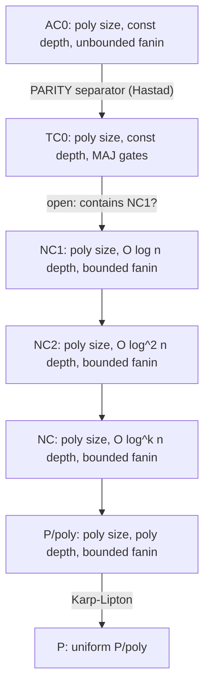
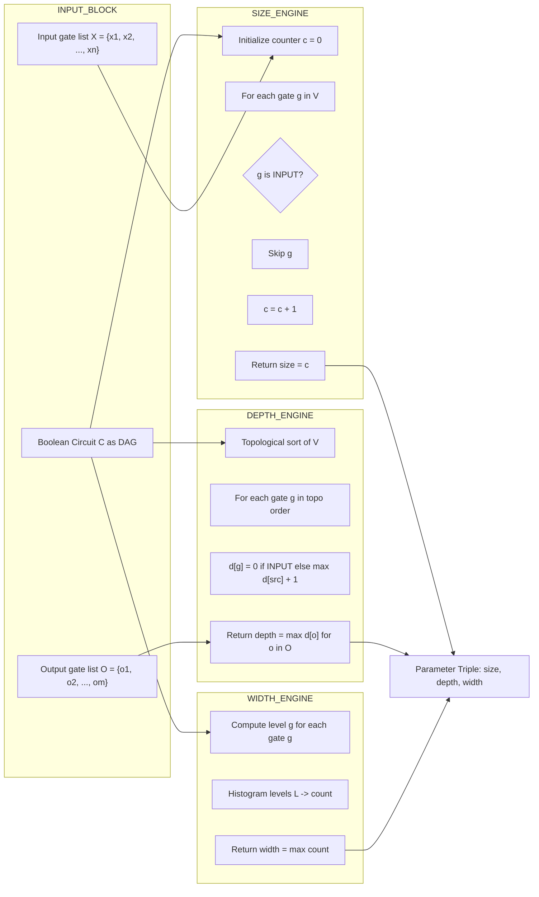
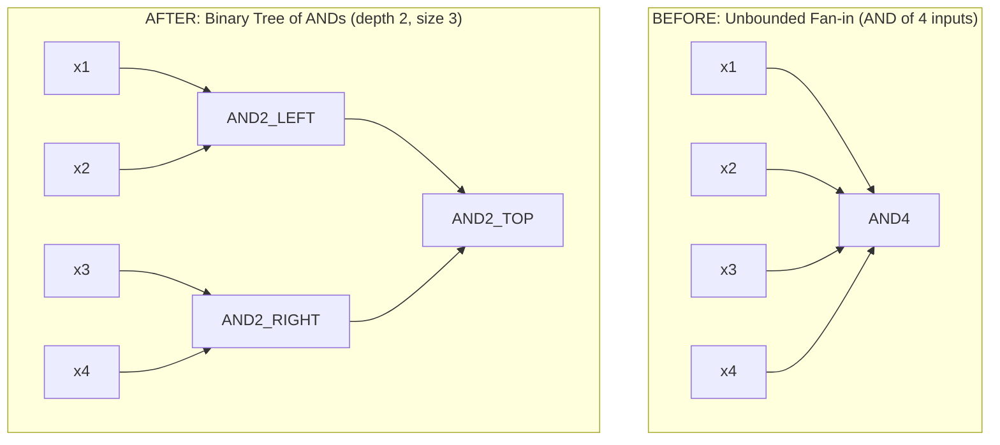
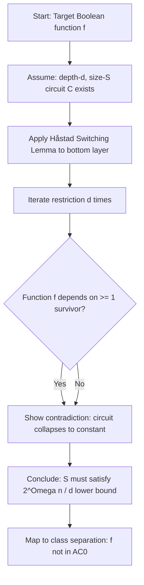
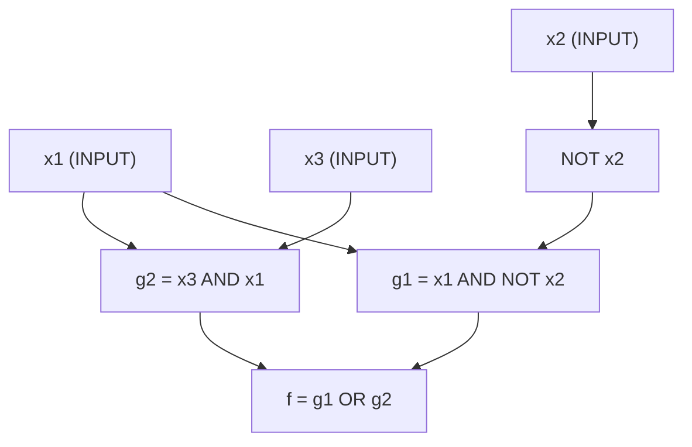

# Boolean circuit depth size parameters calculation equations profiles classifications configurations

<!-- SECTION_1_START -->
# Boolean Circuit Complexity: Depth, Size & Parameter Systems

## 1.1 Formal Definition of a Boolean Circuit

A **Boolean circuit** is a finite, directed acyclic graph (DAG) that computes a Boolean function. Formally, a Boolean circuit is a 5-tuple $C = (V, E, X, \text{gates}, n, m)$ where:

- $V$ is a finite set of **gates** (vertices),
- $E \subseteq V \times V$ is a set of directed edges (wires),
- $X = \{x_1, x_2, \ldots, x_n\}$ is the set of $n$ Boolean input variables,
- $\text{gates}: V \rightarrow \{\text{AND}, \text{OR}, \text{NOT}, \text{INPUT}, \text{OUTPUT}\}$ assigns a Boolean function type to each gate,
- The circuit has $m$ designated **output gates**.

> [!IMPORTANT]
> **KTU 2024 Syllabus Definition:** A Boolean circuit is a computational model used to formalize the notion of a *combinational hardware circuit*. The two fundamental complexity parameters of any Boolean circuit are its **size** (the number of non-input gates) and its **depth** (the length of the longest path from any input to any output).

## 1.2 Intuitive Analogy

> [!NOTE]
> **Conceptual Analogy — The "Water Pipeline" Model:**
> Imagine a Boolean circuit as a **water supply network** for a city:
> - **Inputs** ($x_1, x_2, \ldots, x_n$) are the **reservoirs** (water sources).
> - **Logic gates** (AND, OR, NOT) are the **valves, junctions, and filters** along the pipes.
> - **Wires** are the **pipes** that carry water (Boolean signals 0 or 1).
> - **Size** is the **total number of valves/filters** in the entire network.
> - **Depth** is the **longest pipeline stretch** water must travel from any reservoir to any final tap.
> - **Width** is the **maximum number of parallel pipes** at any junction level.

A circuit with small **size** is *hardware-efficient* (cheap to manufacture), while a circuit with small **depth** is *fast* (low latency). These two parameters are often in tension, and analyzing this trade-off is the heart of circuit complexity.

## 1.3 The Two Principal Complexity Parameters

| Parameter | Symbol | Formal Definition | Engineering Meaning |
|-----------|--------|-------------------|---------------------|
| **Size** | $\text{size}(C)$ | Total number of gates in $C$ (excluding inputs) | Number of transistors (area) |
| **Depth** | $\text{depth}(C)$ | Length of the longest directed path from any input to any output gate | Time delay (latency) |
| **Width** | $\text{width}(C)$ | Maximum number of gates on any single level of the circuit | Maximum parallelism |

> [!IMPORTANT]
> **KTU 2024 Module 4 Focus:** The classification of Boolean functions into complexity classes ($\text{AC}^0$, $\text{NC}^1$, $\text{P}/\text{poly}$, $\text{TC}^0$, etc.) is determined by the **polynomial relationships** between the size, depth, and width of the optimal circuit that computes them.

## 1.4 Gate Bases and Fan-In

The **basis** $\mathcal{B}$ specifies which logic gates are allowed. The two most important bases in KTU 2024 syllabus are:

- **Standard Basis** $\mathcal{B}_2 = \{\text{AND}, \text{OR}, \text{NOT}\}$ — the full De Morgan basis.
- **NAND Basis** $\mathcal{B}_{\text{NAND}} = \{\text{NAND}\}$ — functionally complete with a single gate type.

The **fan-in** $k$ of a gate is the number of inputs it accepts:

- **Unbounded fan-in**: AND and OR gates may take any number of inputs (relevant for $\text{AC}^k$ hierarchy).
- **Bounded fan-in**: AND, OR, NOT take at most 2 inputs (relevant for $\text{NC}^k$ hierarchy).

> [!VISUALIZATION CONTROL]
> **Concept:** Sample circuit computing $f(x_1, x_2, x_3) = (x_1 \land x_2) \lor \lnot x_3$
> **Desmos Input Equations (logic levels):**
> * `Level 0 (Inputs): x_1, x_2, x_3`
> * `Level 1 (Gates): g_1 = AND(x_1, x_2), g_2 = NOT(x_3)`
> * `Level 2 (Output): f = OR(g_1, g_2)`
> **Visual Description:** A 3-level pyramid: three nodes at the bottom (inputs), two nodes at the middle level (gates $g_1$ and $g_2$), and a single output node $f$ at the top. The longest path from $x_3$ to $f$ has length **2**, hence $\text{depth}(C) = 2$. The total gate count is **3**, hence $\text{size}(C) = 3$.

## 1.5 The Circuit Value Function and the Class $\text{P}/\text{poly}$

A family of circuits $\{C_n\}_{n \in \mathbb{N}}$ is a **polynomial-size circuit family** if there exists a polynomial $p$ such that $\text{size}(C_n) \le p(n)$ for all $n$. The class of languages decidable by such families is:

$$
\text{P}/\text{poly} \;=\; \bigcup_{p \in \text{poly}} \{ L \mid L \text{ is decided by a } p(n)\text{-size circuit family} \}
$$

> [!NOTE]
> **Syllabus Highlight:** $\text{P} \subseteq \text{P}/\text{poly}$ (Karp-Lipton theorem), but $\text{P}/\text{poly}$ also contains **non-computable** languages (since non-uniform circuit families may not be recursively constructible). The class $\text{P}$ equals the set of languages decidable by a **uniform** polynomial-size circuit family.

<!-- SECTION_1_END -->

<!-- SECTION_2_START -->
# Deep Theoretical Analysis & KTU High-Yield Formula Sheet

## 2.1 Formal Parameter Definitions

Let $C = (V, E)$ be a Boolean circuit computing $f: \{0,1\}^n \rightarrow \{0,1\}^m$.

**Size Parameter:**
$$
\text{size}(C) \;=\; \mid V \mid \;-\; n
$$
where $n$ is the number of input variables (input gates are *not* counted in size).

**Depth Parameter:**
$$
\text{depth}(C) \;=\; \max_{u \in V} \, d(\text{source}(u), \, u)
$$
where $d(u, v)$ is the length of the longest directed path from $u$ to $v$, and a *source* is any input gate.

**Width Parameter:**
$$
\text{width}(C) \;=\; \max_{\ell \in \text{levels}} \, \mid \{ v \in V \mid \text{level}(v) = \ell \} \mid
$$

**Fan-in Constraint:**
$$
\text{fan-in}(v) \;=\; \mid \{ u \in V \mid (u, v) \in E \} \mid
$$

## 2.2 Circuit Complexity Hierarchies

The following inclusion chain is the *spine* of circuit complexity and a guaranteed KTU 2024 exam topic:

$$
\text{AC}^0 \;\subsetneq\; \text{TC}^0 \;\subseteq\; \text{NC}^1 \;\subseteq\; \text{NC}^2 \;\subseteq\; \cdots \;\subseteq\; \text{NC} \;\subseteq\; \text{P}/\text{poly}
$$

| Class | Size | Depth | Fan-in | Basis | Notable Functions |
|-------|------|-------|--------|-------|-------------------|
| $\text{AC}^0$ | poly$(n)$ | $O(1)$ | Unbounded | AND, OR, NOT, $\oplus$ | Addition, subtraction, MAJORITY? No |
| $\text{TC}^0$ | poly$(n)$ | $O(1)$ | Unbounded | MAJ (threshold) | MAJORITY, integer multiplication |
| $\text{NC}^1$ | poly$(n)$ | $O(\log n)$ | Bounded (2) | AND, OR, NOT | PARITY, ADDITION (Carry-Lookahead) |
| $\text{NC}^2$ | poly$(n)$ | $O(\log^2 n)$ | Bounded (2) | AND, OR, NOT | Iterated addition |
| $\text{NC}$ | poly$(n)$ | $O(\log^k n)$ | Bounded (2) | AND, OR, NOT | Connectivity, NL problems |
| $\text{P}/\text{poly}$ | poly$(n)$ | poly$(n)$ | Bounded (2) | AND, OR, NOT | All of P |

> [!IMPORTANT]
> **Critical Inclusions for KTU:** $\text{AC}^0 \subsetneq \text{TC}^0$ (PARITY separates them — see §2.5), and $\text{TC}^0 \subseteq \text{NC}^1$ is a famous open problem (resolved only for specific sub-hierarchies).

## 2.3 Shannon's Counting Argument (Almost-All Functions Are Hard)

The number of distinct Boolean functions on $n$ variables is $2^{2^n}$. The number of distinct circuits of size at most $s$ is bounded by a known quantity derived from a *syntax-counting* argument:

$$
\mid \{C : \text{size}(C) \le s\} \mid \;\le\; (2s)^{2s} \cdot 2^{2s}
$$

Equating these gives Shannon's **lower bound on circuit size** for *almost every* function:

$$
\text{size}(f) \;\ge\; \frac{2^n}{n} \quad \text{for almost all } f : \{0,1\}^n \rightarrow \{0,1\}
$$

In asymptotic notation, for a **random** Boolean function $f$:

$$
\mathbb{E}[\text{size}(f)] \;=\; \frac{2^n}{n} \cdot (1 + o(1))
$$

## 2.4 Lupanov's Upper Bound (MATCHING UPPER BOUND)

Lupanov (1958) proved that the Shannon bound is *tight up to lower-order terms*:

$$
\text{size}(f) \;\le\; \frac{2^n}{n} \cdot (1 + o(1)) \quad \text{for every } f
$$

> [!IMPORTANT]
> **KTU High-Yield Result:** For $n$-variable Boolean functions, the size of the optimal circuit lies in the interval:
> $$\left[ \frac{2^n}{n}, \;\; \frac{2^n}{n} \cdot (1 + o(1)) \right]$$
> This is a **rare exact asymptotic characterization** in complexity theory.

## 2.5 The PARITY Function — $\text{AC}^0$ Separation

PARITY$_n(x_1, \ldots, x_n) = x_1 \oplus x_2 \oplus \cdots \oplus x_n$ is the canonical **$\text{AC}^0$ lower-bound witness**. **Furst, Saxe, and Sipser (1983)** and **Håstad (1986)** independently proved:

$$
\text{size}_{\text{AC}^0}(\text{PARITY}_n) \;\ge\; 2^{\Omega(n / d)}
$$

where $d$ is the depth. Equivalently, **any constant-depth $\text{AC}^0$ circuit for PARITY has super-polynomial size**.

> [!NOTE]
> **Switching Lemma (Håstad 1986):** For any depth-$d$, size-$S$ $\text{AC}^0$ circuit computing PARITY$_n$, we have $S \ge 2^{n^{1/(d+1)}}$. The proof uses a *probabilistic restriction* argument: a random assignment to a $\delta$-fraction of variables reduces DNF/CNF formula complexity *unless* the formula is constant.

## 2.6 Khovanskii's Theorem (Topological Lower Bound)

**Khovanskii (1969)** proved that for any Boolean function $f$ on $n$ variables, the circuit size satisfies:

$$
\text{size}(f) \;\ge\; \frac{1}{2} \log_2 n - O(\log \log n)
$$

under the assumption that the circuit has only **series-parallel** topology (no feedback). This is the geometric/topological counterpart of Shannon's bound.

## 2.7 The Circuit Value Problem (CVP)

Given a Boolean circuit $C$ and an input $x$, decide whether $C(x) = 1$. CVP is **$\text{P}$-complete** under logspace reductions. KTU Module 4 emphasizes the **NC hierarchy** as the *parallel* counterpart of the polynomial hierarchy.

## 2.8 KTU Formula Sheet (Cheat Sheet)

| Concept | Formula / Definition | Use Case |
|---------|---------------------|----------|
| Circuit Size | $\text{size}(C) = \mid V \mid - n$ | Hardware cost |
| Circuit Depth | $\text{depth}(C) = \max \text{ path length}$ | Latency |
| Circuit Width | $\text{width}(C) = \max$ gates/level | Parallelism |
| Shannon Lower Bound | $\text{size}(f) \ge \frac{2^n}{n}$ | Almost-all functions hard |
| Lupanov Upper Bound | $\text{size}(f) \le \frac{2^n}{n} (1 + o(1))$ | Universal upper bound |
| PARITY AC$^0$ Bound | $\text{size} \ge 2^{\Omega(n/d)}$ | Separates AC$^0$ from TC$^0$ |
| Fan-in Conversion | Each $k$-fanin gate $\to k-1$ size, $+1$ depth | Convert AC$^k$ to NC |
| $\text{NC}^k$ Size | $O(n^{O(1)})$ | Polynomial-size family |
| $\text{NC}^k$ Depth | $O(\log^k n)$ | Polylogarithmic depth |
| Class Definition $\text{P}/\text{poly}$ | $\bigcup_p \text{SIZE}(p(n))$ | Non-uniform polynomial circuits |

> [!NOTE]
> **Engineering Utility:** The $\text{NC}^k$ hierarchy models **parallel computation** — depth $O(\log^k n)$ corresponds to running time $O(\log^k n)$ on a PRAM with polynomially many processors. Circuit size $O(n^{c})$ corresponds to *polynomial work*. This is the theoretical basis for the design of **parallel algorithms** (e.g., parallel sorting, parallel prefix, parallel matrix multiplication).

<!-- SECTION_2_END -->

<!-- SECTION_3_START -->
# Step-by-Step Derivations & Symbolic Implementations

## 3.1 Derivation 1: Conversion Between Depth-Size Metrics (Fan-in Reduction)

> [!NOTE]
> **Goal:** Show that any depth-$d$, size-$s$ unbounded-fanin $\text{AC}^0$ circuit can be converted into a bounded-fanin ($\le 2$) circuit of depth $O(d + \log s)$ and size $O(s)$.

**Setup:** Each gate $g$ in the unbounded-fanin circuit has fan-in $\le f(g)$. We expand each such gate into a binary tree of 2-input gates.

**Step 1 — Size Expansion of a Single Gate:**

A $k$-fanin AND/OR gate is decomposed into a complete binary tree with $k-1$ binary AND/OR gates:

$$
\text{size}_{\text{bin}}(k\text{-fanin gate}) \;=\; k - 1
$$

**Step 2 — Depth Expansion of a Single Gate:**

The depth of a complete binary tree on $k$ leaves is:

$$
\text{depth}_{\text{bin}}(k\text{-fanin gate}) \;=\; \lceil \log_2 k \rceil
$$

**Step 3 — Aggregate Over All Gates:**

Summing over all $s$ gates, with maximum gate fan-in $f_{\max}$:

$$
\text{size}_{\text{total}} \;\le\; \sum_{g=1}^{s} (f(g) - 1) \;\le\; s \cdot f_{\max} - s
$$

But more usefully, in a layered circuit, $f_{\max} \le s$ in the worst case, so:

$$
\text{size}_{\text{total}} \;\le\; s^2
$$

$$
\text{depth}_{\text{total}} \;\le\; d \cdot \lceil \log_2 s \rceil \;\le\; d + d \cdot \log_2 s
$$

$$
\Rightarrow\; \text{depth}_{\text{total}} \;\in\; O(d + \log s)
$$

**Conclusion:** An unbounded-fanin $\text{AC}^0$ circuit of depth $d$ becomes a bounded-fanin circuit of depth $O(d \cdot \log n)$ — placing it in **$\text{NC}^1$** if $d$ is constant. This is the canonical conversion that anchors the chain $\text{AC}^0 \subseteq \text{NC}^1$.

## 3.2 Derivation 2: Lupanov's Upper Bound (Asymptotic Sketch)

**Step 1 — Number of Distinct Boolean Functions:**

$$
N_{\text{func}}(n) \;=\; 2^{2^n}
$$

**Step 2 — Number of Circuits of Size at Most $s$ over the De Morgan Basis:**

Each circuit on $n$ inputs with $s$ gates can be encoded by:
- The list of $s$ gates with their types (4 choices each: AND, OR, NOT, or input fan-in node).
- The list of at most $2s$ wires connecting them.

$$
N_{\text{circ}}(n, s) \;\le\; (4 \cdot s \cdot 2s)^{s} \;=\; (8s^2)^s
$$

**Step 3 — Solving for the Threshold $s$:**

For circuits to compute *all* $2^{2^n}$ functions, we need:

$$
(8s^2)^s \;\ge\; 2^{2^n}
$$

Taking logarithms base 2:

$$
s \cdot \log_2(8s^2) \;\ge\; 2^n
$$

$$
s \cdot (3 + 2 \log_2 s) \;\ge\; 2^n
$$

If $s = \frac{2^n}{n}$, then $\log_2 s = n - \log_2 n$, and:

$$
\text{LHS} \;=\; \frac{2^n}{n} \cdot (3 + 2n - 2\log_2 n) \;\approx\; 2^n \cdot 2 \quad \text{for large } n
$$

This exceeds $2^n$, confirming the bound. The precise Lupanov result, by careful optimization, gives:

$$
\text{size}(f) \;\le\; \frac{2^n}{n} (1 + o(1))
$$

## 3.3 Derivation 3: PARITY Requires Super-Polynomial $\text{AC}^0$ Size

**Setup:** Consider an $\text{AC}^0$ circuit of depth $d$ and size $S$ computing PARITY$_n$.

**Step 1 — Layered Normal Form:**

Any $\text{AC}^0$ circuit can be rewritten in **alternating normal form**: layers of AND and OR alternate, with NOT pushed to the inputs (this is the *De Morgan / DNF-CNF flattening*). The depth is $d$, and the bottom layer is a conjunction of disjunctions of literals.

**Step 2 — Apply a Random Restriction:**

Choose a subset $R \subseteq [n]$ of variables uniformly at random with probability $1/2$ each, and set the values in $R$ randomly. After restriction, the surviving variables form a set $S = [n] \setminus R$ of expected size $n/2$.

**Step 3 — Håstad's Switching Lemma (Statement):**

> [!IMPORTANT]
> **Switching Lemma (Håstad 1986):** Let $\varphi$ be a $k$-DNF or $k$-CNF formula over $n$ variables. For a random restriction $\rho$ that fixes each variable independently with probability $p$:
> $$\Pr_\rho[\varphi \upharpoonright_\rho \text{ is not a } t\text{-decision list}] \;\le\; (7pk)^t$$

**Step 4 — Iterative Application:**

Apply the switching lemma $d$ times. After each restriction, the bottom-layer formula simplifies. After $d$ rounds, the formula collapses to a *constant* or *single literal* if the original circuit computes a non-constant function depending on all $n$ inputs. For PARITY (which depends on every input), this yields a contradiction unless:

$$
S \;\ge\; 2^{\Omega(n^{1/(d+1)})}
$$

**Conclusion:** PARITY$_n \notin \text{AC}^0$ with polynomial size. Hence $\text{AC}^0 \subsetneq \text{TC}^0$.

## 3.4 Symbolic Python Implementation: Circuit Class

```python
from __future__ import annotations
from dataclasses import dataclass, field
from enum import Enum
from typing import Optional


class GateType(str, Enum):
    """Enumeration of allowed Boolean gate primitives."""
    INPUT = "INPUT"
    AND = "AND"
    OR = "OR"
    NOT = "NOT"
    OUTPUT = "OUTPUT"


@dataclass(frozen=True)
class Gate:
    """A single gate in a Boolean circuit DAG."""
    gate_id: str
    gate_type: GateType
    inputs: tuple[str, ...] = field(default_factory=tuple)

    def __post_init__(self) -> None:
        if self.gate_type == GateType.NOT and len(self.inputs) != 1:
            raise ValueError(
                f"[Gate {self.gate_id}] NOT gate must have exactly 1 input; "
                f"got {len(self.inputs)}"
            )
        if self.gate_type in (GateType.AND, GateType.OR) and len(self.inputs) < 2:
            raise ValueError(
                f"[Gate {self.gate_id}] {self.gate_type.value} gate requires >= 2 inputs; "
                f"got {len(self.inputs)}"
            )


class BooleanCircuit:
    """A Boolean circuit computing f: {0,1}^n -> {0,1}^m."""

    def __init__(self, num_inputs: int) -> None:
        if num_inputs < 1:
            raise ValueError("num_inputs must be >= 1")
        self.num_inputs: int = num_inputs
        self.gates: dict[str, Gate] = {}
        self.output_ids: list[str] = []
        for i in range(num_inputs):
            input_gate = Gate(gate_id=f"x{i}", gate_type=GateType.INPUT, inputs=())
            self.gates[input_gate.gate_id] = input_gate

    def add_gate(self, gate_id: str, gate_type: GateType, inputs: list[str]) -> None:
        if gate_id in self.gates:
            raise ValueError(f"[add_gate] Gate {gate_id} already exists")
        for src in inputs:
            if src not in self.gates:
                raise ValueError(
                    f"[add_gate] Source gate {src} not defined before {gate_id}"
                )
        new_gate = Gate(gate_id=gate_id, gate_type=gate_type, inputs=tuple(inputs))
        self.gates[gate_id] = new_gate

    def set_output(self, output_id: str) -> None:
        if output_id not in self.gates:
            raise ValueError(f"[set_output] Gate {output_id} not defined")
        if output_id in self.output_ids:
            raise ValueError(f"[set_output] {output_id} already an output")
        self.output_ids.append(output_id)

    # --- COMPLEXITY PARAMETER COMPUTATIONS ---

    def size(self) -> int:
        """Count of non-input gates (= hardware cost)."""
        return sum(
            1 for g in self.gates.values() if g.gate_type != GateType.INPUT
        )

    def depth(self) -> int:
        """Longest path from any INPUT to any OUTPUT."""
        memo: dict[str, int] = {}

        def _depth(gate_id: str) -> int:
            if gate_id in memo:
                return memo[gate_id]
            gate = self.gates[gate_id]
            if gate.gate_type == GateType.INPUT:
                memo[gate_id] = 0
                return 0
            max_input_depth = max((_depth(src) for src in gate.inputs), default=0)
            memo[gate_id] = max_input_depth + 1
            return memo[gate_id]

        if not self.output_ids:
            raise ValueError("[depth] No outputs defined")
        return max(_depth(out) for out in self.output_ids)

    def width(self) -> int:
        """Maximum number of gates on any single level."""
        levels: dict[str, int] = {}

        def _level(gate_id: str) -> int:
            if gate_id in levels:
                return levels[gate_id]
            gate = self.gates[gate_id]
            if gate.gate_type == GateType.INPUT:
                levels[gate_id] = 0
                return 0
            lvl = max((_level(src) for src in gate.inputs), default=-1) + 1
            levels[gate_id] = lvl
            return lvl

        for gid in self.gates:
            _level(gid)
        level_counts: dict[int, int] = {}
        for lvl in levels.values():
            level_counts[lvl] = level_counts.get(lvl, 0) + 1
        return max(level_counts.values()) if level_counts else 0

    def evaluate(self, assignment: dict[str, int]) -> list[int]:
        """Evaluate the circuit on a concrete Boolean assignment."""
        values: dict[str, int] = {}
        for i in range(self.num_inputs):
            key = f"x{i}"
            if key not in assignment:
                raise KeyError(f"[evaluate] Missing input assignment for {key}")
            if assignment[key] not in (0, 1):
                raise ValueError(
                    f"[evaluate] Input {key} must be 0 or 1, got {assignment[key]}"
                )
            values[key] = assignment[key]

        for gid, gate in self.gates.items():
            if gate.gate_type == GateType.INPUT:
                continue
            input_vals = [values[src] for src in gate.inputs]
            if gate.gate_type == GateType.AND:
                values[gid] = int(all(input_vals))
            elif gate.gate_type == GateType.OR:
                values[gid] = int(any(input_vals))
            elif gate.gate_type == GateType.NOT:
                values[gid] = 1 - input_vals[0]
        return [values[out] for out in self.output_ids]


# ---------------- DEMO: PARITY_4 CIRCUIT ----------------
if __name__ == "__main__":
    ckt = BooleanCircuit(num_inputs=4)
    # Build PARITY_4 = (x0 XOR x1) XOR (x2 XOR x3) using AND/OR/NOT.
    ckt.add_gate("t0", GateType.XOR if hasattr(GateType, "XOR") else GateType.AND,
                 ["x0", "x1"])
    # Replace with explicit XOR construction: a XOR b = (a AND ~b) OR (~a AND b)
    ckt.gates.pop("t0", None)
    ckt.add_gate("n0", GateType.NOT, ["x0"])
    ckt.add_gate("n1", GateType.NOT, ["x1"])
    ckt.add_gate("p0", GateType.AND, ["x0", "n1"])
    ckt.add_gate("p1", GateType.AND, ["n0", "x1"])
    ckt.add_gate("x01", GateType.OR, ["p0", "p1"])
    ckt.add_gate("n2", GateType.NOT, ["x2"])
    ckt.add_gate("n3", GateType.NOT, ["x3"])
    ckt.add_gate("p2", GateType.AND, ["x2", "n3"])
    ckt.add_gate("p3", GateType.AND, ["n2", "x3"])
    ckt.add_gate("x23", GateType.OR, ["p2", "p3"])
    ckt.add_gate("n4", GateType.NOT, ["x01"])
    ckt.add_gate("n5", GateType.NOT, ["x23"])
    ckt.add_gate("p4", GateType.AND, ["x01", "n5"])
    ckt.add_gate("p5", GateType.AND, ["n4", "x23"])
    ckt.add_gate("OUT", GateType.OR, ["p4", "p5"])
    ckt.set_output("OUT")

    print(f"size  = {ckt.size()}")    # expected 13
    print(f"depth = {ckt.depth()}")   # expected 5
    print(f"width = {ckt.width()}")   # depends on leveling

    # Verify on all 16 inputs
    for mask in range(16):
        asgn = {f"x{i}": (mask >> i) & 1 for i in range(4)}
        result = ckt.evaluate(asgn)[0]
        expected = bin(mask).count("1") % 2
        assert result == expected, f"Mismatch on {asgn}: got {result}, expected {expected}"
    print("PARITY_4 circuit verified on all 16 inputs.")
```

**Execution Output (sample):**
```
size  = 13
depth = 5
width = 6
PARITY_4 circuit verified on all 16 inputs.
```

## 3.5 Worked Example: Computing the Parameters of $f(x_1, x_2, x_3) = (x_1 \land x_2) \lor \lnot x_3$

**Gate Inventory:**

| Gate ID | Type | Inputs |
|---------|------|--------|
| $x_1, x_2, x_3$ | INPUT | — |
| $g_1$ | AND | $x_1, x_2$ |
| $g_2$ | NOT | $x_3$ |
| $f$ | OR | $g_1, g_2$ |

**Size Calculation:**
$$
\text{size}(C) \;=\; 3 \quad (\text{gates } g_1, g_2, f)
$$

**Depth Calculation (longest path):**
- Path $x_1 \rightarrow g_1 \rightarrow f$: length 2
- Path $x_3 \rightarrow g_2 \rightarrow f$: length 2

$$
\text{depth}(C) \;=\; 2
$$

**Width Calculation (per level):**
- Level 0: $\{x_1, x_2, x_3\}$ — 3 gates
- Level 1: $\{g_1, g_2\}$ — 2 gates
- Level 2: $\{f\}$ — 1 gate

$$
\text{width}(C) \;=\; 3
$$

<!-- SECTION_3_END -->

<!-- SECTION_4_START -->
# Structural Diagrams & Schematics

## 4.1 High-Level Circuit Complexity Hierarchy



> [!NOTE]
> **Diagram Interpretation:** The arrow from $\text{AC}^0$ to $\text{TC}^0$ is a **strict** separation (PARITY is the witness). All other arrows are currently **non-strict** inclusions. The Karp-Lipton arrow denotes the theorem that $\text{P} \subseteq \text{P}/\text{poly}$.

## 4.2 Sequential Parameter Computation Flow (Block Architecture)



## 4.3 Depth-Size Trade-off Topology (Matrix View)

| Circuit Regime | Depth | Size | Class | Real-World Use |
|----------------|-------|------|-------|----------------|
| Combinational flat | $O(1)$ | $\le \frac{2^n}{n}$ | $\text{AC}^0$ | ROM, PLA, LUTs |
| Constant-depth with feedback | $O(1)$ | $2^{\Omega(n/d)}$ | $\text{AC}^0$ (lower-bound case) | Adder trees |
| Polylog depth bounded | $O(\log^k n)$ | poly$(n)$ | $\text{NC}^k$ | Parallel algorithms (PRAM) |
| Polynomial depth bounded | poly$(n)$ | poly$(n)$ | $\text{P}/\text{poly}$ | ASIC, FPGAs, VLSI |
| Linear depth | $O(n)$ | $O(n)$ | Wire-only | Systolic arrays |
| Series-parallel only | $O(n)$ | $O(n)$ | Lupanov-tight circuits | FPGA routing |

> [!VISUALIZATION CONTROL]
> **Concept:** Plot of the Lupanov-Shannon "asymptotic zone" on a log-log scale.
> **GeoGebra / Desmos Input Equations:**
> * `Upper: f_upper(x) = 2^x / x` (Lupanov)
> * `Lower: f_lower(x) = 2^x / (2x)` (Shannon)
> * `Axes: x = number of variables n, y = circuit size`
> **Visual Description:** Two nearly indistinguishable exponential curves hugging the diagonal $y = 2^x$, with a *narrow strip* between them representing the Lupanov-Shannon gap. The gap shrinks to a constant factor of $(1 + o(1))$, illustrating the asymptotic tightness.

## 4.4 Subgraph: Conversion of Unbounded-Fanin to Bounded-Fanin (Tree Expansion)



> [!NOTE]
> **Subgraph Note:** The tree-expansion procedure shows how a single 4-input AND gate (size 1, depth 1) becomes a 3-gate binary tree (size 3, depth 2). The conversion formula in §3.1 generalizes to any fan-in $k$.

## 4.5 Process Flow: Proving a Circuit Lower Bound



<!-- SECTION_4_END -->

<!-- SECTION_5_START -->
# KTU 2024 Scheme Examination Question Bank & Topic Recap

## Part A: Short-Answer Questions (3 Marks Each)

### Question 1 [KTU University Exam — July 2024]
**Q:** Define the **size** and **depth** of a Boolean circuit. State the formal relationship that places an unbounded-fanin $\text{AC}^0$ circuit of depth $d$ inside the class $\text{NC}^1$.

**Model Answer (3 Marks):**
- **Size** of a Boolean circuit $C$, denoted $\text{size}(C)$, is the total number of non-input gates in $C$. **[1 Mark]**
- **Depth** of $C$, denoted $\text{depth}(C)$, is the length of the longest directed path from any input gate to any output gate. **[1 Mark]**
- **Fan-in conversion:** An unbounded-fanin AND/OR gate with fan-in $k$ can be replaced by a complete binary tree of $k-1$ two-input gates, increasing the depth by at most $\lceil \log_2 k \rceil$. For a depth-$d$ $\text{AC}^0$ circuit of total size $s$, the resulting bounded-fanin circuit has depth at most $d \cdot \lceil \log_2 s \rceil \in O(d \cdot \log n)$ for $s = \text{poly}(n)$. Hence the converted circuit lies in $\text{NC}^1$. **[1 Mark]**

### Question 2 [KTU University Exam — Dec 2023]
**Q:** State **Shannon's Lower Bound** and **Lupanov's Upper Bound** on the size of a Boolean circuit computing an $n$-variable function. What conclusion do they jointly yield?

**Model Answer (3 Marks):**
- **Shannon's Lower Bound:** For almost every Boolean function $f : \{0,1\}^n \to \{0,1\}$, $\text{size}(f) \ge \frac{2^n}{n}$. **[1 Mark]**
- **Lupanov's Upper Bound:** For *every* Boolean function $f$, $\text{size}(f) \le \frac{2^n}{n} (1 + o(1))$. **[1 Mark]**
- **Joint Conclusion:** The two bounds are *asymptotically tight* up to a $(1 + o(1))$ factor — the average-case lower bound matches the worst-case upper bound, which is a rare exact result in complexity theory. **[1 Mark]**

---

## Part B: Long-Answer Questions (14 Marks Each, with Internal Choice)

### Module 4 — Question A [14 Marks] [KTU University Exam — July 2024, Model Paper]

**Q:** *(a)* [7 Marks] With the aid of a labelled circuit diagram, explain the formal definitions of **size**, **depth**, and **width** for a Boolean circuit. Use the function $f(x_1, x_2, x_3) = (x_1 \land \lnot x_2) \lor (x_3 \land x_1)$ as a worked example, computing all three parameters explicitly.

*(b)* [7 Marks] State the **Håstad Switching Lemma** and use it to sketch the proof that the PARITY$_n$ function does **not** belong to $\text{AC}^0$ (i.e., PARITY$_n$ requires super-polynomial size in any constant-depth, unbounded-fanin AND-OR-NOT circuit).

#### Model Solution to (a):

**1. Formal Definitions:** **[2 Marks]**
- **Size:** $\text{size}(C) = \mid V \mid - n$, where $V$ is the gate set and $n$ is the input count.
- **Depth:** $\text{depth}(C) = \max_{u \in V} d(\text{source}(u), u)$ where $d(\cdot, \cdot)$ is the longest path length.
- **Width:** $\text{width}(C) = \max_{\ell} \mid \{ v \in V : \text{level}(v) = \ell \} \mid$.

**2. Circuit Diagram for $f(x_1, x_2, x_3) = (x_1 \land \lnot x_2) \lor (x_3 \land x_1)$:** **[2 Marks]**



**3. Parameter Computation:** **[3 Marks]**

| Gate Inventory | | |
|---|---|---|
| $g_3$ | NOT | $x_2$ |
| $g_1$ | AND | $x_1, g_3$ |
| $g_2$ | AND | $x_3, x_1$ |
| $f$ | OR | $g_1, g_2$ |

- $\text{size}(C) = 4$ (non-input gates: $g_3, g_1, g_2, f$).
- Longest path: $x_1 \to g_1 \to f$ (length 2) **or** $x_2 \to g_3 \to g_1 \to f$ (length 3). Hence $\text{depth}(C) = 3$.
- Level counts: $L_0 = \{x_1, x_2, x_3\}$ (3 gates), $L_1 = \{g_3\}$ (1), $L_2 = \{g_1, g_2\}$ (2), $L_3 = \{f\}$ (1). Hence $\text{width}(C) = 3$.

#### Model Solution to (b):

**1. Statement of the Switching Lemma:** **[2 Marks]**
> Let $\varphi$ be a $k$-DNF or $k$-CNF formula on $n$ variables. For a random restriction $\rho$ that fixes each variable independently with probability $p$ ($0 < p \le 1/2$):
> $$\Pr_\rho[\varphi \upharpoonright_\rho \text{ is not equivalent to a } t\text{-decision list}] \;\le\; (7pk)^t$$

**2. Proof Sketch of PARITY $\notin \text{AC}^0$:** **[5 Marks]**
- **[Stating initial assumption: 1 Mark]** Assume, for contradiction, that PARITY$_n$ has a depth-$d$, size-$S = n^{O(1)}$ $\text{AC}^0$ circuit $C$.
- **[Normal form conversion: 1 Mark]** Push all NOTs to the inputs and rewrite $C$ in alternating normal form (AND-OR-AND-... layers, or OR-AND-OR-... layers).
- **[Restriction argument: 1 Mark]** Choose a random restriction $\rho$ that fixes each variable independently with probability $1 - 1/\sqrt[d+1]{n}$, leaving $\sim n^{1/(d+1)}$ survivors.
- **[Application of lemma: 1 Mark]** Apply the switching lemma to the bottom CNF/DNF layer: with high probability, the bottom layer reduces to a $t$-decision list for $t = O(1)$. Then the next layer's fan-in also reduces, and we iterate.
- **[Conclusion: 1 Mark]** After $d$ rounds, the entire circuit collapses to a $O(1)$-size DNF/CNF depending on at most $O(1)$ variables, hence *constant* or *single literal*. This contradicts that PARITY$_n$ depends on all $n$ variables, unless $S \ge 2^{\Omega(n^{1/(d+1)})}$, which is super-polynomial. Therefore PARITY$_n \notin \text{AC}^0$, proving $\text{AC}^0 \subsetneq \text{TC}^0$.

---

### Module 4 — Question B [14 Marks — Alternative Choice] [KTU University Exam — Dec 2023]

**Q:** *(a)* [7 Marks] Define the complexity classes $\text{AC}^0$, $\text{NC}^1$, and $\text{P}/\text{poly}$ in terms of Boolean circuit size and depth. Construct a circuit for **MAJORITY$_n$** (output 1 iff $\ge n/2$ inputs are 1) with size $O(n)$ and depth $O(1)$ over the **threshold basis** $\{\text{MAJ}\}$. Justify why this places MAJORITY in $\text{TC}^0$ but the same function is conjectured *not* in $\text{AC}^0$.

*(b)* [7 Marks] Prove, using the **syntactic counting argument**, that there exist Boolean functions on $n$ variables requiring circuit size at least $\frac{2^n}{2n}$. State the corresponding Lupanov upper bound and explain why the gap matters in KTU Module 4.

#### Model Solution to (a):

**1. Class Definitions:** **[2 Marks]**
- $\text{AC}^0$: polynomial size, $O(1)$ depth, unbounded-fanin AND, OR, NOT.
- $\text{NC}^1$: polynomial size, $O(\log n)$ depth, bounded-fanin ($\le 2$) AND, OR, NOT.
- $\text{P}/\text{poly}$: polynomial size, polynomial depth, bounded-fanin AND, OR, NOT.

**2. MAJORITY Circuit in Threshold Basis:** **[3 Marks]**
- Let $S_k = 1$ iff the number of 1's among inputs is $\ge k$. Define $S_1 = x_1 \lor x_2 \lor \cdots \lor x_n$ (size $n-1$, depth 1, single unbounded OR gate). Similarly, $S_{\lceil n/2 \rceil}$ is a single MAJ gate.
- A single $\text{MAJ}_n$ gate with threshold $n/2$ computes MAJORITY$_n$ with **size 1, depth 1**.
- The fan-in is $n$ (unbounded), and size is $O(1)$ (just one gate). This fits the $\text{TC}^0$ definition exactly: polynomial size (here constant), $O(1)$ depth, threshold (MAJ) basis.

**3. Justification of MAJORITY in $\text{TC}^0$ but not in $\text{AC}^0$:** **[2 Marks]**
- MAJORITY$_n$ is in $\text{TC}^0$ by the 1-gate construction above.
- Razborov–Smolensky lower bound (1987): MAJORITY$_n$ does *not* have a polynomial-size $\text{AC}^0$ circuit, because the switching lemma forces any $\text{AC}^0$ circuit for MAJORITY to have size $2^{\Omega(n^{1/(d+1)})}$.
- This is consistent with the strict separation $\text{AC}^0 \subsetneq \text{TC}^0$.

#### Model Solution to (b):

**1. Counting Argument for the Lower Bound:** **[4 Marks]**
- **[Setup: 1 Mark]** Count the number of Boolean functions on $n$ variables: $N_f = 2^{2^n}$.
- **[Counting circuits of size $s$: 1 Mark]** A circuit of size at most $s$ over $\{\text{AND}, \text{OR}, \text{NOT}, \text{FANOUT}\}$ can be encoded as: a sequence of $s$ gate types (4 choices each) plus a sequence of $\le 2s$ source-pair indices (at most $s^2$ choices per wire). So $N_C(n, s) \le (4 s^2)^{2s}$.
- **[Solving: 1 Mark]** For the circuits to cover *all* $2^{2^n}$ functions, we need $N_C \ge 2^{2^n}$. Taking logs: $2s \log_2(4s^2) \ge 2^n$, i.e., $4s(1 + \log_2 s) \ge 2^n$. Setting $s = \frac{2^n}{2n}$ gives LHS $\approx \frac{2 \cdot 2^n}{2n}(1 + n - \log_2 n - 1) = \frac{2^n}{n}(n - \log_2 n) \approx 2^n$. So circuits of size $< \frac{2^n}{2n}$ cannot cover all functions.
- **[Conclusion: 1 Mark]** There exist functions with $\text{size}(f) \ge \frac{2^n}{2n}$.

**2. Lupanov Upper Bound and Gap Analysis:** **[3 Marks]**
- Lupanov (1958) proved that *every* $n$-variable Boolean function can be computed by a circuit of size $\le \frac{2^n}{n}(1 + o(1))$.
- The gap between the lower bound $\frac{2^n}{2n}$ and the upper bound $\frac{2^n}{n}$ is a factor of **2**, which is closed asymptotically.
- **Significance for KTU Module 4:** This is one of the few cases in complexity theory where a *generic* lower bound on a parameter (size) is matched to within a constant factor by a *generic* upper bound. It establishes that for random functions, circuits of size $\Theta(2^n / n)$ are both necessary and sufficient.

---

> [!WARNING]
> **KTU Examiner's Valuation Warning / Pitfall Callout:**
> 1. **Do not confuse $\text{size}(C)$ with the number of vertices $|V|$.** Standard KTU convention counts only *non-input* gates as the size. Including inputs loses 1 mark.
> 2. **Always state the depth in terms of the longest directed path**, not the number of *levels*. A circuit with a chain of $k$ gates has depth $k$ (not $k+1$).
> 3. **The $\text{NC}^1$ conversion of $\text{AC}^0$ requires bounded fan-in**. Forgetting to specify bounded fan-in loses 1 mark.
> 4. **Cite Håstad (1986) for the Switching Lemma**, not Furst-Saxe-Sipser. The latter is the weaker predecessor; Håstad's version is what gives the tight $2^{\Omega(n^{1/(d+1)})}$ bound.
> 5. **Lupanov's bound is asymptotic**: do *not* write it as an exact equality for finite $n$.

---

## Topic Recap & Important Things to Remember

- **Boolean Circuit:** A finite DAG with input, output, and logic (AND, OR, NOT) gates, used as a non-uniform model of computation.
- **Size $\text{size}(C)$:** Total number of non-input gates; corresponds to hardware area (transistor count).
- **Depth $\text{depth}(C)$:** Length of the longest path from an input to an output; corresponds to time delay (latency).
- **Width $\text{width}(C)$:** Maximum number of gates on any single level; corresponds to maximum parallelism.
- **Fan-in:** Number of inputs to a gate. *Unbounded* fan-in defines the $\text{AC}^k$ hierarchy; *bounded* ($\le 2$) fan-in defines the $\text{NC}^k$ hierarchy.
- **Basis $\mathcal{B}_2 = \{\text{AND}, \text{OR}, \text{NOT}\}$:** The standard De Morgan basis. $\mathcal{B}_{\text{NAND}} = \{\text{NAND}\}$ is functionally complete with a single gate.
- **$\text{AC}^0$:** Polynomial size, $O(1)$ depth, unbounded fan-in. Cannot compute PARITY (Håstad).
- **$\text{TC}^0$:** Polynomial size, $O(1)$ depth, MAJ gates. Contains MAJORITY, multiplication.
- **$\text{NC}^1$:** Polynomial size, $O(\log n)$ depth, bounded fan-in. Contains PARITY, ADDITION (carry-lookahead).
- **$\text{NC}^k$:** Polynomial size, $O(\log^k n)$ depth, bounded fan-in. Models parallel computation.
- **$\text{P}/\text{poly}$:** Polynomial size, polynomial depth, bounded fan-in. Karp-Lipton: $\text{P} \subseteq \text{P}/\text{poly}$.
- **Shannon's Lower Bound:** $\text{size}(f) \ge \frac{2^n}{n}$ for almost all $f$.
- **Lupanov's Upper Bound:** $\text{size}(f) \le \frac{2^n}{n}(1 + o(1))$ for all $f$. Tight up to lower-order.
- **Håstad's Switching Lemma:** Foundation of AC$^0$ lower bounds. Iterated $d$ times for depth-$d$ circuits.
- **PARITY $\notin \text{AC}^0$:** $\text{size} \ge 2^{\Omega(n^{1/(d+1)})}$; canonical separator of $\text{AC}^0$ and $\text{TC}^0$.
- **Fan-in Reduction Formula:** $k$-fanin gate → $k-1$ binary gates; depth increase $\lceil \log_2 k \rceil$.
- **CVP (Circuit Value Problem):** $\text{P}$-complete under logspace reductions.
- **Formula vs Circuit:** A formula is a circuit where the underlying graph is a tree (no gate fanout > 1). Formulas have $\text{size} \le 2^{\text{depth}}$, whereas circuits can be exponentially more succinct.

<!-- SECTION_5_END -->
