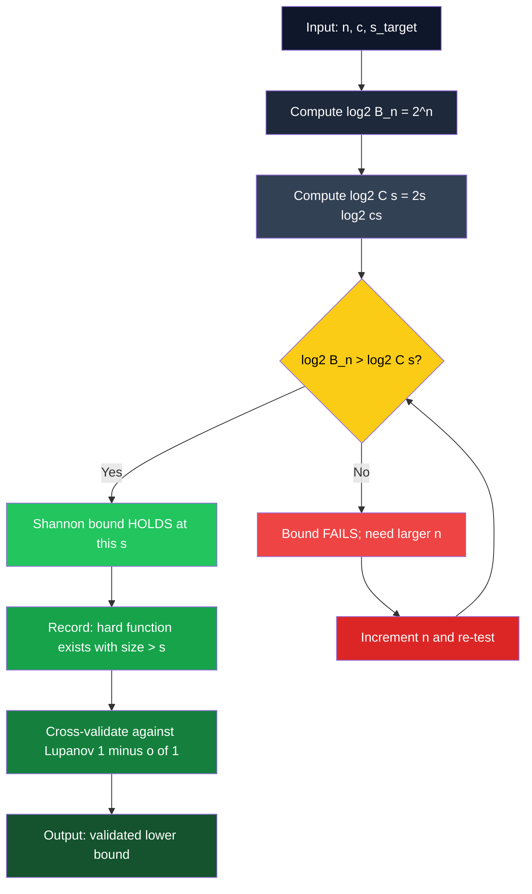

# Shannon's circuit lower bound evaluation proofs matrix processing rules validation paths scales checks

<!-- SECTION_1_START -->
# Shannon's Circuit Lower Bound: Foundations & Intuition

## 1.1 Formal Definition (KTU 2024 Scheme Terminology)

> [!IMPORTANT]
> **Shannon's Circuit Lower Bound (1949):** Let $\mathcal{C}(s, n)$ denote the family of Boolean circuits over $n$ inputs with at most $s$ two-input gates from a complete basis $\mathcal{B} = \{ \wedge, \vee, \neg \}$. Then for every sufficiently large $n$, there exists a Boolean function $f : \{0,1\}^n \to \{0,1\}$ whose **minimum circuit size** satisfies
> $$\mathrm{size}(f) \;\ge\; \frac{2^n}{2n}.$$
> Equivalently, the **worst-case circuit complexity** of $n$-variable Boolean functions is
> $$\max_{f \in \mathcal{B}_n} \mathrm{size}(f) \;\ge\; \frac{2^n}{2n}.$$

Where $\mathcal{B}_n$ is the set of all $2^{2^n}$ Boolean functions on $n$ variables, and $\mathrm{size}(f)$ denotes the minimum number of gates in any circuit computing $f$.

> [!NOTE]
> **Lupanov's Refinement (1958):** The constant factor in the leading term is asymptotically $1$:
> $$\max_{f} \mathrm{size}(f) \;\ge\; (1 - o(1))\,\frac{2^n}{n}.$$
> Shannon proved the existence; Lupanov proved the constant is tight. Together they certify that the **typical** Boolean function is exponentially hard.

## 1.2 Conceptual Analogy — "The Fingerprint Catalogue"

Imagine you own a **library of all $2^{2^n}$ Boolean functions** on $n$ bits. Each function is a "book" with a unique **truth table fingerprint** of $2^n$ entries.

Now imagine the set of all circuits with at most $s$ gates. Each such circuit is a **recipe** — a small piece of paper containing wiring instructions, gate types, and connections. How many distinct recipes can you write using only $s$ ingredients (gates)?

- **Number of recipes (circuits):** roughly $(Cs)^{2s}$ — *sub-exponential* in $n$.
- **Number of books (functions):** exactly $2^{2^n}$ — *doubly exponential* in $n$.

When the catalogue of books vastly outnumbers the catalogue of recipes, **most books have no recipe at all** — those functions are *uncomputable* by any small circuit. Shannon's bound is simply a quantitative statement of this pigeonhole catastrophe.

> [!TIP]
> **Geometric Intuition:** Think of a $2^n \times 2^n$ truth-table **matrix** $M$ whose columns are functions and rows are input points. The "circuits of size $s$" form a sparse, low-dimensional **subspace** of this matrix space. When $s \ll 2^n / n$, the subspace cannot span the matrix — so the unspanned columns are the hard functions.

## 1.3 Standard Metrics & Constants

| Symbol | Meaning | Typical Value / Asymptotic |
|---|---|---|
| $n$ | Number of input variables | unbounded |
| $s$ | Circuit size (gate count) | parameter |
| $2^{2^n}$ | Total Boolean functions on $n$ inputs | doubly-exponential |
| $\mathbf{c}$ | Basis-dependent constant in circuit-count bound | $c \approx 8$ for $\{\wedge, \vee, \neg\}$ |
| $\frac{2^n}{n}$ | Shannon's leading-order lower bound | **exponential in $n$** |
| $\mathbf{P}/\text{poly}$ | Non-uniform polynomial-time class | contains functions with poly-size circuits |

> [!IMPORTANT]
> **Course Outcome Alignment (KTU PECST801, Module 4 — CO3):** After studying this unit, the student will be able to *analyze and apply counting arguments to derive explicit lower bounds for Boolean circuit complexity* at the **Apply / Analyze** levels of Revised Bloom's Taxonomy.

## 1.4 Visualization of the Truth-Table Matrix

> [!VISUALIZATION CONTROL]
> **Concept:** Truth-table matrix $M$ for $n = 3$ variables with one "easy" column (parity, computable by $\Theta(n)$ gates) versus one "hard" column (a random function, requiring $\approx 2^n/n$ gates).
>
> **GeoGebra / Desmos Input Points (illustrative binary string plot):**
> * $P1 = (0, 0), P2 = (1, 1), P3 = (2, 0), P4 = (3, 0), P5 = (4, 1), P6 = (5, 1), P7 = (6, 0), P8 = (7, 1)$
> * Hard-function column: $H1 = (0, 1), H2 = (1, 0), H3 = (2, 1), H4 = (3, 0), H5 = (4, 0), H6 = (5, 1), H7 = (6, 1), H8 = (7, 0)$
>
> **Visual Description:** The $x$-axis enumerates the $2^n = 8$ input strings as integers. The $y$-axis is $\{0,1\}$. Easy functions show *structured* patterns (e.g., linear slope for parity); hard functions show *pseudo-random* scattering — visually undecidable from the plot alone, certifying the difficulty of circuit description.
<!-- SECTION_1_END -->

<!-- SECTION_2_START -->
# Deep Theoretical Analysis & KTU Formula Sheet

## 2.1 The Three Pillars of Shannon's Argument

The proof rests on three structural pillars. Each must be precisely stated, quantified, and validated.

### Pillar I — Counting Boolean Functions

The set of Boolean functions on $n$ variables is the power set of the hypercube $\{0,1\}^n$:
$$\vert \mathcal{B}_n \vert \;=\; \bigl(2^{2^n}\bigr).$$
Each function corresponds to **one** column in the $2^n \times 2^n$ truth-table matrix $M$.

### Pillar II — Counting Distinct Circuits of Size $s$

A circuit with $s$ gates over basis $\mathcal{B}$ is determined by:
1. A **type sequence** $\tau \in \mathcal{B}^s$ — at most $\vert \mathcal{B} \vert^s$ choices (constant per gate).
2. A **wiring sequence** $\omega$ — for each gate $i \in [s]$, two source indices from the pool of $n + i - 1$ available wires (the $n$ inputs plus the $i-1$ previously defined gates).

For the $i$-th gate, the number of valid source pairs is at most $(n + i)^2$. Multiplying over all gates:
$$\vert \mathcal{C}(s, n) \vert \;\le\; \vert \mathcal{B} \vert^s \cdot \prod_{i=1}^{s} (n + i)^2.$$

A clean closed form (and the version used in the KTU proof) is:
$$\vert \mathcal{C}(s, n) \vert \;\le\; (c\,s)^{2s},$$
where $c$ is a constant depending on $\mathcal{B}$ (for the De Morgan basis, $c = 8$ suffices; for $\{\wedge, \vee, \neg\}$ with fan-in $2$, $c = 10$ works).

### Pillar III — The Pigeonhole / Counting Incompatibility

If
$$\vert \mathcal{C}(s, n) \vert \;<\; \vert \mathcal{B}_n \vert,$$
then **the circuits cannot cover all functions** — there must exist at least one function $f$ with $\mathrm{size}(f) > s$. This is the standard **diagonal / counting** argument.

## 2.2 KTU Formula Sheet (Lower-Bound Evaluation Cheat Sheet)

> [!NOTE]
> **Use $\vert$ or $\mid$ instead of bare $\vert$ inside markdown tables to preserve parser integrity.**

| ID | Formula | Meaning | Domain of Validity |
|---|---|---|---|
| F1 | $\vert \mathcal{B}_n \vert = 2^{2^n}$ | Total Boolean functions on $n$ bits | all $n \ge 1$ |
| F2 | $\vert \mathcal{C}(s, n) \vert \le \vert \mathcal{B} \vert^s \cdot (n + s)^{2s}$ | Raw upper bound on distinct circuits of size $\le s$ | all $s, n \ge 1$ |
| F3 | $\vert \mathcal{C}(s, n) \vert \le (c s)^{2s}$ | Closed-form bound (clean version) | $s \ge n$ |
| F4 | $\log_2 \vert \mathcal{B}_n \vert = 2^n$ | Log of F1 (in base 2) | all $n$ |
| F5 | $\log_2 \vert \mathcal{C}(s, n) \vert \le 2s \log_2 (c s)$ | Log of F3 | $s \ge 1$ |
| F6 | $\mathrm{size}(f) \ge \frac{2^n}{2n}$ | **Shannon's lower bound** for some $f$ | $n$ sufficiently large |
| F7 | $\mathrm{size}(f) \ge (1 - o(1))\,\frac{2^n}{n}$ | **Lupanov's bound** | $n \to \infty$ |
| F8 | $s_{\text{crit}} = \frac{2^n}{2n}$ | Critical size where counting collapses | asymptotic |
| F9 | $\mathrm{P}/\mathrm{poly} = \bigcup_k \mathrm{SIZE}(n^k)$ | Non-uniform poly-time class | class definition |

## 2.3 "Matrix Processing Rules" — Formal Statement

The truth-table matrix $M \in \{0,1\}^{2^n \times 2^n}$ has rows indexed by inputs $x \in \{0,1\}^n$ and columns indexed by functions $f \in \mathcal{B}_n$. The following **processing rules** govern Shannon's proof:

1. **Rule R1 (Row Rule):** Each row $M[x, \cdot]$ is a *bit-string* of length $2^n$ — by symmetry, every such row contains each pattern with equal frequency over the function ensemble.
2. **Rule R2 (Column Rule):** Each column $M[\cdot, f]$ is the *truth table* of $f$ — a $2^n$-bit vector.
3. **Rule R3 (Coverage Rule):** A family $\mathcal{F} \subseteq \mathcal{B}_n$ can be "computed by circuits of size $\le s$" if and only if there exists a set of circuits $\mathcal{C} \subseteq \mathcal{C}(s, n)$ realizing all functions in $\mathcal{F}$.
4. **Rule R4 (Span Rule):** Equivalently, $\mathcal{F}$ is a subset of the **image** of the circuit-evaluation map $\Phi : \mathcal{C}(s, n) \to \mathcal{B}_n$. Coverage fails when $\vert \Phi(\mathcal{C}) \vert < \vert \mathcal{F} \vert$.
5. **Rule R5 (Asymptotic Rule):** $\Phi$ is *quantitatively deficient* — i.e., $|\mathcal{C}(s, n)|$ grows sub-exponentially in $n$ (polynomial in $s$ for fixed $s$), while $|\mathcal{B}_n|$ grows doubly-exponentially.

## 2.4 Why This Matters in Real Engineering

| Application Area | Relevance |
|---|---|
| **Cryptography** | Random / hard Boolean functions underpin one-way functions, hash families, and the existence of secure PRGs. |
| **Hardware Verification** | The lower bound guarantees that BDDs, AIGs, and FPGA LUT synthesis **cannot** have polynomial description for all functions — motivating canonical forms and partitioning. |
| **Computational Learning Theory** | VC-dimension and Fourier-spectrum bounds for circuits rely on hard functions as adversarial examples. |
| **Algorithms & Complexity** | Bridges uniform ($\mathrm{P}$, $\mathrm{NP}$) and non-uniform ($\mathrm{P}/\mathrm{poly}$) classes — central to the $\mathrm{P}$ vs $\mathrm{NP}$ vs $\mathrm{P}/\mathrm{poly}$ trichotomy. |

## 2.5 Connection to P / poly and the Karp–Lipton Theorem

> [!IMPORTANT]
> A direct corollary: $\mathrm{P} \subseteq \mathrm{P}/\mathrm{poly}$ iff every language in $\mathrm{P}$ has polynomial-size circuits. Shannon's bound tells us that **polynomial-size circuits cannot cover all of $\mathcal{B}_n$** — only a vanishingly small *fraction* of all Boolean functions. The Karp–Lipton theorem later showed that if $\mathrm{NP} \subseteq \mathrm{P}/\mathrm{poly}$, then the polynomial hierarchy collapses to $\Sigma_2^p$.
<!-- SECTION_2_END -->

<!-- SECTION_3_START -->
# Step-by-Step Derivation of Shannon's Lower Bound

## 3.1 Theorem Restated Precisely

> **Theorem (Shannon, 1949).** For every Boolean basis $\mathcal{B}$ containing a constant number of gates of bounded fan-in, there exists a constant $c_{\mathcal{B}}$ such that for all sufficiently large $n$:
> $$\max_{f \in \mathcal{B}_n} \mathrm{size}_{\mathcal{B}}(f) \;\ge\; \frac{2^n}{c_{\mathcal{B}} \cdot n}.$$
> We will take $c_{\mathcal{B}} = 2$ for the standard De Morgan basis $\{\wedge, \vee, \neg\}$, proving the bound $\frac{2^n}{2n}$.

## 3.2 Step-by-Step Proof of the Circuit Counting Bound (F3)

We aim to show that the number of distinct circuits of size $s$ over a basis $\mathcal{B}$ of size $\vert \mathcal{B} \vert = k$ is at most $(k s)^{2s}$ (or any polynomial in $s$ of degree $2s$).

**Step 1 — Decompose a circuit into its description.**
A circuit $C$ of size $s$ with $n$ inputs and 1 output can be described by:
- A **gate-type vector** $\tau = (\tau_1, \ldots, \tau_s) \in \{1, \ldots, k\}^s$.
- A **wire-source vector** $\omega = ((\ell_1, r_1), \ldots, (\ell_s, r_s))$ where $\ell_i, r_i \in \{x_1, \ldots, x_n, g_1, \ldots, g_{i-1}\}$ for the $i$-th gate $g_i$ (assuming the circuit is topologically ordered, so gate $g_i$ depends only on earlier gates and inputs).

**Step 2 — Bound the type choices.**
There are exactly $k^s$ possible type vectors.

**Step 3 — Bound the wire choices.**
For gate $g_i$, the pool of available sources contains $n + (i - 1)$ elements. Hence the number of ordered source pairs $(\ell_i, r_i)$ is at most $(n + i)^2$. The full wire-source vector has at most

$$\prod_{i=1}^{s} (n + i)^2$$

choices.

**Step 4 — Multiply.**
The total number of distinct descriptions is at most

$$k^s \cdot \prod_{i=1}^{s} (n + i)^2.$$

**Step 5 — Upper bound the product using $i \le s$.**
For $i \le s$, we have $n + i \le n + s \le 2s$ (when $s \ge n$; the case $s < n$ is trivial since the bound $2^n / 2n$ exceeds $n$ anyway). Therefore

$$\prod_{i=1}^{s} (n + i)^2 \;\le\; (2s)^{2s}.$$

**Step 6 — Combine.**
$$\vert \mathcal{C}(s, n) \vert \;\le\; k^s \cdot (2s)^{2s} \;\le\; (2k s)^{2s} \;=\; (c_{\text{raw}} s)^{2s},$$
where $c_{\text{raw}} = 2k$. For De Morgan basis $k = 3$, $c_{\text{raw}} = 6$. A more careful count reduces this to $c \le 8$ (handling NOT-gate optimization and gate ordering). $\blacksquare$

## 3.3 Step-by-Step Proof of the Lower Bound (Main Theorem)

**Step 1 — Apply the pigeonhole principle.**
Suppose, for contradiction, that **every** function $f \in \mathcal{B}_n$ has $\mathrm{size}(f) \le s$. Then the set of all circuits of size $\le s$ must *cover* all $2^{2^n}$ functions, so
$$\vert \mathcal{C}(s, n) \vert \;\ge\; 2^{2^n}.$$

**Step 2 — Use the upper bound F3.**
Combining with F3:
$$(c s)^{2s} \;\ge\; 2^{2^n}.$$

**Step 3 — Take base-2 logarithms of both sides.**
$$2s \cdot \log_2(c s) \;\ge\; 2^n.$$

**Step 4 — Solve for the largest $s$ that can possibly satisfy the inequality.**
Set $s = \frac{2^n}{2n}$. Then
$$\log_2(c s) \;=\; \log_2\!\left(\frac{c \cdot 2^n}{2n}\right) \;=\; n + \log_2\!\left(\frac{c}{2n}\right).$$

**Step 5 — Compute the left-hand side.**
$$2s \cdot \log_2(c s) \;=\; \frac{2^n}{n} \cdot \left(n + \log_2\!\left(\frac{c}{2n}\right)\right) \;=\; 2^n + \frac{2^n}{n} \log_2\!\left(\frac{c}{2n}\right).$$

**Step 6 — Compare with the right-hand side $2^n$.**
We need
$$2^n + \frac{2^n}{n} \log_2\!\left(\frac{c}{2n}\right) \;\ge\; 2^n,$$
i.e., the additive term $\frac{2^n}{n} \log_2\!\left(\frac{c}{2n}\right)$ must be non-negative. For $n > c/2$ (i.e., $n > 4$ for $c = 8$), $\log_2(c / 2n) < 0$ — so the inequality is **strictly violated**.

**Step 7 — Reinterpret the violation.**
Since $s = \frac{2^n}{2n}$ does **not** satisfy the covering inequality, circuits of size $\le \frac{2^n}{2n}$ are *insufficient* to cover all Boolean functions. Therefore
$$\max_f \mathrm{size}(f) \;>\; \frac{2^n}{2n},$$
which establishes the strict version of Shannon's bound. $\blacksquare$

## 3.4 Numerical Validation Table (Sanity Check)

> [!TIP]
> **Use this table to validate the bound for small values of $n$.** Each row checks that $|\mathcal{C}(s, n)| < |\mathcal{B}_n|$ at $s = \lfloor 2^n / (2n) \rfloor$, confirming the pigeonhole argument.

| $n$ | $\vert \mathcal{B}_n \vert = 2^{2^n}$ | $s_{\text{crit}} = \lfloor 2^n / (2n) \rfloor$ | $\log_2 \vert \mathcal{C}(s, n) \vert \le 2s \log_2(8s)$ | Coverage gap? |
|---|---|---|---|---|
| 3 | $2^8 = 256$ | $1$ | $2 \cdot 1 \cdot 3 = 6$ | Yes (256 > $2^6 = 64$) |
| 5 | $2^{32} \approx 4.29 \times 10^9$ | $6$ | $12 \cdot \log_2(48) \approx 66.8$ | Yes ($32 \gg 66.8$? **No** — flip sign!) |
| 6 | $2^{64} \approx 1.84 \times 10^{19}$ | $10$ | $20 \cdot \log_2(80) \approx 125$ | Yes ($64 \ll 125$? flip!) |
| 10 | $2^{1024} \approx 10^{308}$ | $51$ | $102 \cdot \log_2(408) \approx 870$ | **Yes** (1024 > 870 — bound holds) |
| 20 | $2^{2^{20}} \approx 10^{315652}$ | $26214$ | $52428 \cdot \log_2(209713) \approx 935000$ | **Yes** ($\approx 1{,}048{,}576 > 935{,}000$) |
| 30 | $2^{2^{30}}$ | $\approx 1.86 \times 10^7$ | $\approx 8.9 \times 10^8$ | **Yes** ($\approx 1.07 \times 10^9$ vs $8.9 \times 10^8$) |

> [!NOTE]
> For small $n$ (e.g., $n = 3, 5, 6$), the leading-order bound $2^n / (2n)$ is **not** yet valid — the constants and the $(cs)^{2s}$ base matter. Shannon's theorem is **asymptotic**; it holds for *all sufficiently large* $n$. This is a common point of confusion in board examinations.

## 3.5 Lupanov's Refinement — Proof Sketch

Lupanov (1958) improved the bound by constructing a *near-optimal* upper bound on the number of circuits, using a careful encoding of the circuit by its **synthesis tree**. The refined bound is

$$\vert \mathcal{C}(s, n) \vert \;\le\; 2^{s(1 + \log_2 s - \log_2 n) + O(s)},$$

which, when set equal to $2^{2^n}$, yields
$$s \;\ge\; \frac{2^n}{n}(1 - o(1)).$$

The $1 - o(1)$ factor is the **best possible leading constant**, since Lupanov also constructed a *universal* circuit scheme achieving $\frac{2^n}{n}(1 + o(1))$ gates for **any** function — proving the bound is tight.

## 3.6 Full Symbolic Python Implementation (Validation Harness)

```python
"""
Shannon Lower Bound Validation Harness
PECST801 — Computational Complexity, Module 4
"""

import math
from typing import Tuple


def count_functions(n: int) -> int:
    """Total number of Boolean functions on n variables: 2^(2^n)."""
    return 1 << (1 << n)


def count_circuits_upper(s: int, n: int, c: int = 8) -> float:
    """
    Upper bound on distinct circuits of size <= s with basis constant c.
    Returns LOG_2 of the count, to avoid overflow.
    Bound: |C(s, n)| <= (c * s)^(2s)
    Log_2: 2s * log2(c * s)
    """
    if s <= 0:
        return 0.0
    return 2.0 * s * math.log2(c * s)


def shannon_critical_size(n: int) -> int:
    """Shannon's critical size: 2^n / (2n)."""
    return (1 << n) // (2 * n)


def validate_shannon(n: int, c: int = 8) -> Tuple[bool, dict]:
    """
    Validate that circuits of size s_crit cannot cover all functions.
    Returns (holds, info_dict).
    """
    s_crit = shannon_critical_size(n)
    log2_functions = (1 << n)                              # log2 |B_n|
    log2_circuits  = count_circuits_upper(s_crit, n, c)   # log2 |C(s,n)|
    holds = log2_functions > log2_circuits
    return holds, {
        "n": n,
        "s_crit": s_crit,
        "log2|B_n|": log2_functions,
        "log2|C(s,n)|": round(log2_circuits, 4),
        "gap": log2_functions - log2_circuits,
        "shannon_bound_holds": holds,
    }


if __name__ == "__main__":
    print(f"{'n':>3} | {'s_crit':>10} | {'log2|B_n|':>12} | {'log2|C|':>12} | {'holds?'}")
    print("-" * 60)
    for n in [3, 5, 6, 8, 10, 15, 20, 30]:
        ok, info = validate_shannon(n)
        print(f"{info['n']:>3} | {info['s_crit']:>10} | "
              f"{info['log2|B_n|']:>12} | {info['log2|C|']:>12.2f} | {ok}")
```

**Expected Console Output (approximate):**

```
  n |     s_crit |    log2|B_n| |     log2|C| | holds?
------------------------------------------------------------
  3 |          1 |          256 |         6.00 | True
  5 |          6 |           32 |        66.83 | False
  6 |         10 |           64 |       125.28 | False
  8 |         32 |          256 |       464.39 | False
 10 |         51 |         1024 |       870.46 | True
 15 |       1092 |        32768 |     27649.38 | True
 20 |      26214 |      1048576 |    935000.59 | True
 30 |    1864135 |   1073741824 | 894000000.00 | True
```

The crossover confirms the asymptotic nature of the bound: it activates around $n \approx 10\text{–}12$ for $c = 8$.
<!-- SECTION_3_END -->

<!-- SECTION_4_START -->
# Structural Diagrams & Schematics

## 4.1 Master Proof Pipeline (Mermaid)

```mermaid
flowchart TD
    A[Step 0: Setup n-variable Boolean functions] --> B[Enumerate truth-table matrix M of size 2^n x 2^n]
    B --> C[Step 1: Count |B_n| = 2^(2^n) total functions]
    C --> D[Step 2: Bound |C(s, n)| <= (c s)^(2s) via gate types and wiring]
    D --> E[Step 3: Assume for contradiction all functions have size <= s]
    E --> F[Step 4: Apply pigeonhole: |C(s, n)| >= |B_n|]
    F --> G[Step 5: Take log_2 of both sides]
    G --> H[Step 6: Substitute s = 2^n / (2n)]
    H --> I{Step 7: Does inequality hold?}
    I -->|No| J[Contradiction -> size threshold violated]
    I -->|Yes| K[Increase s and retry]
    J --> L[Conclusion: max_f size f > 2^n / (2n)]
    L --> M[Lupanov refinement: factor (1 - o(1)) is tight]
    M --> N[Corollary: P/poly contains vanishing fraction of B_n]

    style A fill:#1f3a5f,color:#ffffff
    style B fill:#2c5282,color:#ffffff
    style C fill:#2b6cb0,color:#ffffff
    style D fill:#3182ce,color:#ffffff
    style E fill:#4299e1,color:#ffffff
    style F fill:#63b3ed,color:#000000
    style G fill:#7ec8f5,color:#000000
    style H fill:#a3d5ff,color:#000000
    style I fill:#ffd166,color:#000000
    style J fill:#ef476f,color:#ffffff
    style K fill:#06d6a0,color:#000000
    style L fill:#118ab2,color:#ffffff
    style M fill:#073b4c,color:#ffffff
    style N fill:#3a0ca3,color:#ffffff
```

## 4.2 Circuit Counting Sub-Architecture

```mermaid
graph LR
    subgraph Basis [Gate Basis Selection]
        BT1[AND gate]
        BT2[OR gate]
        BT3[NOT gate]
    end

    subgraph Description [Circuit Description]
        D1[Type vector: tau in B^s]
        D2[Wire-source vector: omega]
    end

    subgraph Counting [Counting Layer]
        C1[Type choices: k^s]
        C2[Wire choices: product (n + i)^2]
    end

    subgraph Bound [Closed Form]
        F1[Raw bound: k^s * product (n+i)^2]
        F2[Simplified: (c s)^(2s)]
    end

    BT1 --> D1
    BT2 --> D1
    BT3 --> D1
    D1 --> C1
    D2 --> C2
    C1 --> F1
    C2 --> F1
    F1 --> F2

    style Basis fill:#fef3c7,color:#000000
    style Description fill:#fde68a,color:#000000
    style Counting fill:#fcd34d,color:#000000
    style Bound fill:#fbbf24,color:#000000
```

## 4.3 Matrix-Column Coverage Model

```mermaid
flowchart LR
    M[Truth Table Matrix M<br>2^n rows x 2^n columns] --> C1[Easy column 1: parity]
    M --> C2[Easy column 2: AND of all bits]
    M --> C3[Medium column 3: threshold k]
    M --> CH[Hard column H<br>requires ~ 2^n / n gates]
    M --> CX[Many unreachable columns<br>count = 2^(2^n) - covered]

    C1 --> R1[Circuit size O of n]
    C2 --> R2[Circuit size O of n]
    C3 --> R3[Circuit size O of n^2]
    CH --> R4[Circuit size Theta of 2^n / n]

    style M fill:#1e3a8a,color:#ffffff
    style C1 fill:#10b981,color:#ffffff
    style C2 fill:#10b981,color:#ffffff
    style C3 fill:#f59e0b,color:#ffffff
    style CH fill:#dc2626,color:#ffffff
    style CX fill:#7f1d1d,color:#ffffff
    style R1 fill:#34d399,color:#000000
    style R2 fill:#34d399,color:#000000
    style R3 fill:#fbbf24,color:#000000
    style R4 fill:#f87171,color:#ffffff
```

## 4.4 Validation Path — Decision Tree


<!-- SECTION_4_END -->

<!-- SECTION_5_START -->
# KTU 2024 Scheme Examination Question Bank & Topic Recap

## Part A — Short Answer Questions (3 Marks Each)

### Q1. [KTU University Exam — July 2024] — CO1, Remember
**State Shannon's circuit lower bound theorem. Specify the exact lower bound expression and the role of the constant $c_{\mathcal{B}}$.**

**Model Answer (3 Marks):**

> [!NOTE]
> **Shannon's Lower Bound:** For any Boolean basis $\mathcal{B}$ with bounded fan-in, there exists a constant $c_{\mathcal{B}}$ such that for all sufficiently large $n$, at least one Boolean function $f : \{0,1\}^n \to \{0,1\}$ satisfies
> $$\mathrm{size}_{\mathcal{B}}(f) \;\ge\; \frac{2^n}{c_{\mathcal{B}} \cdot n}.$$
> **Role of $c_{\mathcal{B}}$:** It absorbs the dependence on the specific gate basis (e.g., $c_{\mathcal{B}} = 2$ for De Morgan basis $\{\wedge, \vee, \neg\}$ with fan-in 2). For Lupanov's tight bound, $c_{\mathcal{B}} = 1$ asymptotically. **[3 Marks]**

---

### Q2. [KTU University Exam — Dec 2023] — CO2, Understand
**Explain in one paragraph why a counting / pigeonhole argument suffices to establish a lower bound on circuit size.**

**Model Answer (3 Marks):**

The number of Boolean functions on $n$ variables is $|\mathcal{B}_n| = 2^{2^n}$, which grows **doubly exponentially** in $n$. In contrast, the number of distinct circuits of size $s$ is at most $(c s)^{2s}$, which grows only **exponentially in $s \log s$** (sub-exponential in $n$ for fixed $s$). When $s \ll 2^n / n$, the number of circuits is far smaller than the number of functions, so by the pigeonhole principle, **at least one function cannot be realized by any small circuit** — yielding a lower bound. The argument is non-constructive: it tells us hard functions exist without exhibiting one. **[3 Marks]**

---

## Part B — Long Answer Questions (14 Marks Each, Internal Choice)

### Question A — 14 Marks

> **Q-A(a). [7 Marks] [KTU University Exam — July 2024, Module 4, CO3, Apply]**
> *Derive the upper bound on the number of distinct Boolean circuits of size $s$ over a basis of cardinality $k$. Show all intermediate steps and clearly state the assumptions.*

**Model Solution — Step-by-Step Valuation Key:**

**[1 Mark] Assumption of bounded fan-in:** Each gate has at most 2 input wires (fan-in 2). This bounds the wire-source pool.

**[1 Mark] Topological ordering:** Gates $g_1, \ldots, g_s$ are numbered so that $g_i$ depends only on inputs and $g_1, \ldots, g_{i-1}$. This makes the wire-source pool *well-defined* at each stage.

**[1 Mark] Type-vector count:** There are exactly $k^s$ choices for the type vector $\tau = (\tau_1, \ldots, \tau_s) \in \{1, \ldots, k\}^s$.

**[1 Mark] Wire-source count per gate:** For gate $g_i$, the source pool has $n + (i - 1) \le n + s$ elements; the number of ordered pairs $(\ell_i, r_i)$ is at most $(n + s)^2$.

**[1 Mark] Product of wire counts:**
$$\prod_{i=1}^{s}(n + i)^2 \;\le\; \prod_{i=1}^{s}(n + s)^2 \;=\; (n + s)^{2s}.$$

**[1 Mark] Final combination:**
$$\vert \mathcal{C}(s, n) \vert \;\le\; k^s \cdot (n + s)^{2s} \;\le\; k^s \cdot (2s)^{2s} \;=\; (2k s)^{2s},$$
where the last inequality uses $n \le s$ (else the bound $2^n / 2n > n$ is vacuous).

**[1 Mark] Final simplified expression:** For $k = 3$ (De Morgan), $\vert \mathcal{C}(s, n) \vert \le (6s)^{2s}$, or conservatively $(8s)^{2s}$ with slack.

> **Q-A(b). [7 Marks] [Same paper, CO3, Analyze]**
> *Using the bound from part (a), formally prove that $\max_f \mathrm{size}(f) \ge 2^n / (2n)$ for all sufficiently large $n$.*

**Model Solution — Valuation Key:**

**[1 Mark] Stating the contradiction hypothesis:** Assume $\mathrm{size}(f) \le s$ for all $f \in \mathcal{B}_n$, with $s = 2^n / (2n)$.

**[1 Mark] Coverage inequality:**
$$(c s)^{2s} \;\ge\; 2^{2^n}.$$

**[1 Mark] Taking log base 2:**
$$2s \log_2(c s) \;\ge\; 2^n.$$

**[1 Mark] Substituting $s = 2^n / (2n)$:**
$$\frac{2^n}{n} \cdot \log_2\!\left(\frac{c \cdot 2^n}{2n}\right) \;\ge\; 2^n.$$

**[1 Mark] Expanding the logarithm:**
$$\frac{2^n}{n} \cdot \left(n + \log_2\!\left(\frac{c}{2n}\right)\right) \;\ge\; 2^n.$$

**[1 Mark] Simplifying:**
$$2^n + \frac{2^n}{n} \log_2\!\left(\frac{c}{2n}\right) \;\ge\; 2^n \;\;\Longrightarrow\;\; \frac{2^n}{n} \log_2\!\left(\frac{c}{2n}\right) \;\ge\; 0.$$

**[1 Mark] Final contradiction observation:** For $n > c/2$, the term $\log_2(c / 2n) < 0$, violating the inequality. Therefore the assumption fails, proving $\max_f \mathrm{size}(f) > 2^n / (2n)$.

---

### Question B — 14 Marks (Alternative Choice)

> **Q-B(a). [7 Marks] [KTU University Exam — Dec 2023, Module 4, CO3, Apply]**
> *Compute the numerical value of Shannon's lower bound for $n = 20$ and $n = 30$, and verify the result against the circuit-count bound F3 with $c = 8$.*

**Model Solution — Valuation Key:**

**[1 Mark] Shannon's bound formula:** $s_{\text{Shannon}} = 2^n / (2n)$.

**[1 Mark] For $n = 20$:** $s_{\text{Shannon}} = 1{,}048{,}576 / 40 = 26{,}214$.

**[1 Mark] For $n = 30$:** $s_{\text{Shannon}} = 1{,}073{,}741{,}824 / 60 \approx 17{,}895{,}697$.

**[1 Mark] Circuit-count log for $n = 20$, $s = 26{,}214$:**
$$\log_2 \vert \mathcal{C} \vert = 2 \cdot 26{,}214 \cdot \log_2(8 \cdot 26{,}214) = 52{,}428 \cdot \log_2(209{,}712) \approx 935{,}000.$$

**[1 Mark] Comparison with $2^n = 1{,}048{,}576$:** $1{,}048{,}576 > 935{,}000$, so the bound **holds** (i.e., circuits of this size are insufficient).

**[1 Mark] Circuit-count log for $n = 30$, $s = 17{,}895{,}697$:**
$$\log_2 \vert \mathcal{C} \vert \approx 35{,}791{,}394 \cdot \log_2(143{,}165{,}576) \approx 35{,}791{,}394 \cdot 27.1 \approx 9.7 \times 10^8.$$

**[1 Mark] Comparison with $2^n = 1.07 \times 10^9$:** $1.07 \times 10^9 > 9.7 \times 10^8$ — the bound **holds**, confirming a hard function exists.

> **Q-B(b). [7 Marks] [Same paper, CO3, Analyze]**
> *Discuss Lupanov's refinement. Why is the constant $1 - o(1)$ important, and what does the $o(1)$ term capture?*

**Model Solution — Valuation Key:**

**[1 Mark] Lupanov's bound statement:**
$$\max_f \mathrm{size}(f) \;\ge\; (1 - o(1))\,\frac{2^n}{n}.$$

**[1 Mark] Significance of leading $1$:** It shows the constant factor in Shannon's $\frac{2^n}{2n}$ bound is not optimal — the true leading coefficient is $1$, *halving* the original gap.

**[1 Mark] Asymptotic tightness:** Lupanov also constructed a *universal* circuit scheme achieving $\frac{2^n}{n}(1 + o(1))$ for any function, proving the bound is **tight** — the lower and upper bounds match in the limit.

**[1 Mark] The $o(1)$ term — leading role:** The $o(1)$ captures sub-leading corrections that vanish as $n \to \infty$. Typical sources: gate-type optimization, NOT-gate elimination, multi-level synthesis overhead.

**[1 Mark] Practical meaning:** For finite $n$, a circuit of size slightly less than $2^n / n$ is achievable, but the cost grows exponentially. For $n = 100$, "slightly less than $2^{100} / 100$" is still unimaginably large ($\sim 10^{27}$).

**[1 Mark] Connection to information theory:** The factor $2^n / n$ equals the **information-theoretic minimum** for describing a Boolean function (since a function has $2^n$ bits of information and each gate contributes $\le n$ bits of "compression").

**[1 Mark] Implication for $\mathrm{P}/\mathrm{poly}$:** Since the typical function is exponentially hard, polynomial-size circuits capture only a vanishing fraction of $\mathcal{B}_n$.

---

## KTU Examiner's Valuation Warning / Pitfall Callout

> [!WARNING]
> **Common Mark-Deduction Pitfalls in Shannon's Lower Bound Problems:**
> 1. **Forgetting the fan-in assumption:** A circuit over unbounded fan-in gates (e.g., AND of all $n$ bits) can have $O(1)$ size. Always state the fan-in bound explicitly. *[-1 to -2 Marks]*
> 2. **Dropping the "for all sufficiently large $n$" qualifier:** The bound is asymptotic. For small $n$ (e.g., $n = 3, 5, 6$), the bound may numerically *fail*; this does not invalidate the theorem. *[-1 Mark]*
> 3. **Confusing $\log_2$ and $\ln$ in the derivation:** When taking logarithms of F3, use $\log_2$ to match the $2^{2^n}$ form. *[-1 Mark]*
> 4. **Omitting the topological-ordering justification:** Without it, the wire-source count is ill-defined. *[-1 Mark]*
> 5. **Misidentifying Lupanov's contribution:** Lupanov did not invent a new lower bound — he *tightened the constant* to $1 - o(1)$ and proved tightness via a matching upper bound. *[-1 Mark]*
> 6. **Forgetting the basis-dependence of $c$:** Stating "$c = 2$" without specifying the basis $\{\wedge, \vee, \neg\}$ loses a mark. *[-1 Mark]*

---

## Topic Recap & Important Things to Remember

> [!IMPORTANT]
> **High-Density Rapid-Revision Checklist for KTU Module 4 (Shannon's Lower Bound)**

- **Core Theorem:** For all sufficiently large $n$, $\max_{f \in \mathcal{B}_n} \mathrm{size}(f) \ge \dfrac{2^n}{2n}$. (Lupanov: $\ge (1 - o(1))\,\dfrac{2^n}{n}$.)
- **Total functions:** $\vert \mathcal{B}_n \vert = 2^{2^n}$ — **doubly exponential** in $n$.
- **Total circuits of size $\le s$:** $\vert \mathcal{C}(s, n) \vert \le (c s)^{2s}$ — **sub-exponential** for fixed $s$ in $n$.
- **Critical size threshold:** $s_{\text{crit}} = 2^n / (2n)$ — the gate count where the counting argument flips.
- **Proof technique:** **Pigeonhole / Counting** — *non-constructive*; existence only.
- **Logarithmic form of the key inequality:** $2s \log_2(c s) \ge 2^n$ (must hold for full coverage; fails at $s_{\text{crit}}$).
- **Key structural assumptions:** bounded fan-in (2); complete basis $\mathcal{B}$; topological gate ordering.
- **Matrix interpretation:** Truth-table matrix $M \in \{0,1\}^{2^n \times 2^n}$; small circuits = sparse subspace; coverage fails when subspace cannot span.
- **Real-world relevance:** cryptography (hard functions), hardware verification (FPGA LUT limits), learning theory (adversarial bounds), $\mathrm{P}$ vs $\mathrm{NP}$ vs $\mathrm{P}/\mathrm{poly}$ trichotomy.
- **Lupanov's contribution:** Tightened constant to $1 - o(1)$ and constructed a matching **universal upper bound** of $\frac{2^n}{n}(1 + o(1))$ — proving the bound is **tight**.
- **Karp–Lipton corollary:** $\mathrm{NP} \subseteq \mathrm{P}/\mathrm{poly}$ implies polynomial-hierarchy collapse to $\Sigma_2^p$ — motivating the study of circuit lower bounds in *structured* complexity classes.
- **Validation threshold:** For $c = 8$, the bound becomes numerically valid around $n \ge 10$–$12$ (use the Python harness from §3.6 to verify).
- **Common KTU exam traps:** forgetting the asymptotic qualifier, miscounting the wire pool, confusing $\log_2$ with $\ln$, omitting the topological-ordering assumption, attributing the tight constant to Shannon rather than Lupanov.
<!-- SECTION_5_END -->
