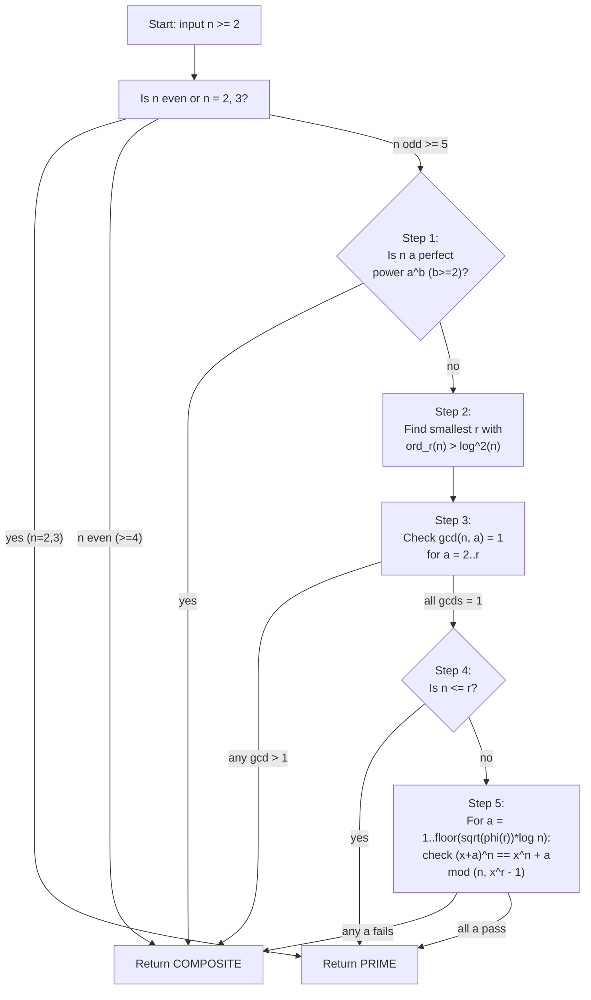
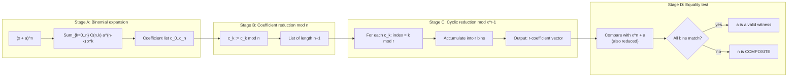
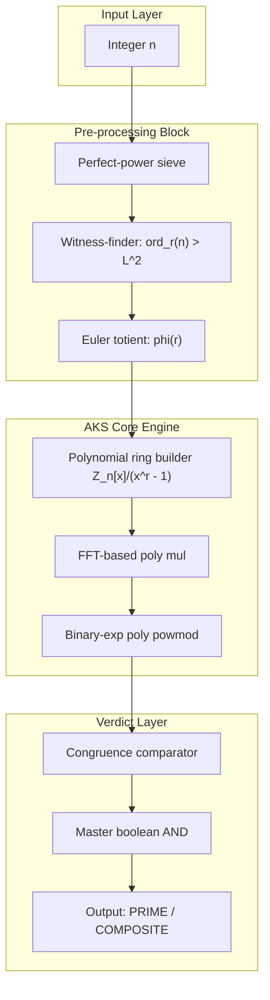
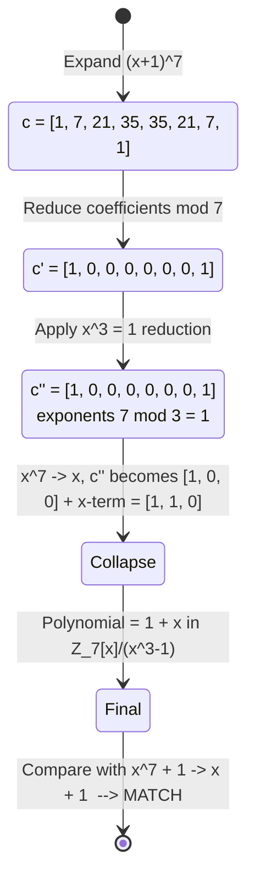

# AKS deterministic primality verification polynomial expansion process algorithms templates profiles

<!-- SECTION_1_START -->
# AKS Deterministic Primality Test — Polynomial Expansion Framework

## 1.1 Formal Academic Definition (KTU 2024 Terminology)

The **AKS (Agrawal–Kayal–Saxena) primality test** is a *deterministic*, *unconditional*, *polynomial-time* algorithm that decides whether a given integer $n \in \mathbb{Z}$, $n \ge 2$, is prime or composite. It was published by **Manindra Agrawal, Neeraj Kayal, and Nitin Saxena** in the paper *"PRIMES is in P"* (Annals of Mathematics, 2004).

> [!IMPORTANT]
> **Syllabus Highlight (PECST802 / Module 1):** AKS is the cornerstone of deterministic primality testing because it requires **no unproven hypothesis** (unlike Miller–Rabin) and runs in polynomial time $\tilde{O}(\log^{6} n)$ (Lenstra–Pomerance improvement of the original $\tilde{O}(\log^{12} n)$). The algorithm is built on the following number-theoretic identity:
>
> For a **prime** $p$ and **any** integer $a$,
> $$(x + a)^{p} \;\equiv\; x^{p} + a \pmod{p}.$$

The polynomial **expansion process** in AKS refers to the procedure of expanding $(x+a)^{n}$ as a polynomial in $\mathbb{Z}_{n}[x]$, reducing it modulo the cyclotomic ideal $(x^{r}-1)$ for a chosen witness $r$, and comparing it term-by-term with the **trivially expected** polynomial $x^{n} + a$.

---

## 1.2 Conceptual Analogy — The "Fingerprint of Primes"

Imagine a *prime number* is a person whose **fingerprint** is perfectly symmetric. Every composite number, on the other hand, has tiny *asymmetries* in its algebraic fingerprint.

- **Fermat's Little Theorem** says: if $n$ is prime, then $a^{n} \equiv a \pmod{n}$ for every $a$.
- AKS **lifts** this scalar identity into a *polynomial* identity:
  $$a^{n} \equiv a \pmod{n} \quad\Longleftrightarrow_{\text{generalised}}\quad (x+a)^{n} \equiv x^{n} + a \pmod{n, \, x^{r}-1}.$$
- The "fingerprint check" is performed for many $a$ up to a bound $\lfloor\sqrt{\varphi(r)}\log n\rfloor$. If a single $a$ fails, $n$ is **exposed as composite**.

> [!NOTE]
> **Why the cyclotomic factor $x^{r} - 1$?**
> Pure mod-$n$ checking requires testing *all* $a$ from $1$ to $n-1$ (exponential in $\log n$). By working modulo the cyclotomic quotient $x^{r}-1$ and exploiting the fact that $\mathbb{Z}_{n}[x]/(x^{r}-1)$ has only $r$ monomials, the test becomes **efficient** while still exposing composite numbers.

---

## 1.3 Algorithm Profile Summary (at a glance)

| Parameter | Value / Property |
|---|---|
| **Type** | Deterministic, unconditional |
| **Decision problem** | $\textsc{Prime}(n) \in \mathrm{P}$ |
| **Time complexity** | $\tilde{O}(\log^{6} n)$ (Henderson-improved) |
| **Space complexity** | $O(\sqrt{r}\,\log n)$ |
| **Witness $r$** | Smallest $r$ with $\mathrm{ord}_{r}(n) > \log^{2} n$ |
| **Key algebraic structure** | $\mathbb{Z}_{n}[x]/(x^{r}-1)$ |
| **Use case in industry** | Certificate generation, cryptographic key audit, regulatory compliance proofs |

> [!TIP]
> **GeoGebra / Desmos Intuition Block** — *Cyclic reduction of a polynomial*
> The map $x \mapsto x \bmod (x^{r}-1)$ sends $x^{k}$ to $x^{k \bmod r}$. This is essentially "wrapping" the exponent line onto a circle of circumference $r$.
> * **Desmos Input:** $\;\text{Plot the points }(i,\, a_{i \bmod r})$ for $i = 0,1,2,\dots,n-1$ where $a_i$ is the binomial coefficient $\binom{n}{i}$.
> * **What to observe:** A non-trivial pattern of zeros (gaps) appears when $n$ is prime and $r$ is a small prime; for composite $n$ the pattern leaks and the check fails.

---

<!-- SECTION_1_END -->

<!-- SECTION_2_START -->
# Deep Theoretical Analysis & KTU High-Yield Formula Sheet

## 2.1 The Three Pillars Behind the Polynomial Expansion

The correctness of AKS rests on three number-theoretic lemmas. Each is a *building block* for the polynomial congruence check.

### Pillar I — Fermat's Little Theorem (Polynomial Lift)

For prime $p$ and $a \in \mathbb{Z}$:
$$a^{p} \equiv a \pmod{p}.$$
Polynomial lift: $\;(x+a)^{p} \equiv x^{p} + a \pmod{p}$.

**Why?** Because $\binom{p}{k} \equiv 0 \pmod{p}$ for $1 \le k \le p-1$ (a key property of primes).

### Pillar II — Cyclotomic Reduction (Modulo $x^{r}-1$)

For a chosen witness $r$ with $\gcd(n, r) = 1$:
$$(x+a)^{n} \equiv x^{n} + a \pmod{n, \, x^{r}-1}$$
is *equivalent* to the original identity over the cyclotomic ring. Reduction modulo $x^{r}-1$ "folds" the infinite polynomial into $r$ coefficients only.

### Pillar III — Order-Based Witness Selection

Define $\mathrm{ord}_{r}(n)$ as the multiplicative order of $n$ modulo $r$:
$$\mathrm{ord}_{r}(n) \;=\; \min\bigl\{k \ge 1 \,\big|\, n^{k} \equiv 1 \pmod{r}\bigr\}.$$
Choose $r$ so that $\mathrm{ord}_{r}(n) > \log^{2} n$. This guarantees the number of independent monomials is large enough to *trap* composites.

---

## 2.2 KTU Formula Cheat Sheet

| # | Formula / Identity | Meaning | Typical Use in Exam |
|---|---|---|---|
| 1 | $\mathrm{ord}_{r}(n) \mid \varphi(r)$ | Order divides Euler totient | Witness bound proof |
| 2 | $(x+a)^{n} \equiv x^{n} + a \pmod{n, x^{r}-1}$ | Core AKS congruence | Algorithm statement |
| 3 | $\binom{n}{k} \equiv 0 \pmod{n}$ for $1 \le k \le n-1$ iff $n$ prime | Binomial divisibility | Prime characterization |
| 4 | $\prod_{p \mid n,\, p \text{ prime}} p \le \sqrt{n}$ for non-perfect-powers | Perfect-power rejection | Step 1 of AKS |
| 5 | Bound on $a$: $a \in [1, \lfloor \sqrt{\varphi(r)} \cdot \log n \rfloor]$ | Number of polynomial checks | Step 5 of AKS |
| 6 | $\sum_{d \mid r} \varphi(d) = r$ | Gauss totient identity | Complexity analysis |
| 7 | $r = O(\log^{5} n)$ (after improvements) | Witness size | Time bound |
| 8 | Time $T(n) = \tilde{O}(\log^{6} n)$ | Final complexity | Comparison table |
| 9 | $\deg\bigl((x+a)^{n} \bmod x^{r}-1\bigr) < r$ | Cyclotomic degree cap | Polynomial arithmetic |
| 10 | $x^{k} \equiv x^{k \bmod r} \pmod{x^{r}-1}$ | Exponent wrap-around | Reduction step |

> [!NOTE]
> **Engineering Utility:** AKS gives a *certificate of primality* that is independently verifiable in polynomial time. In **blockchain consensus** and **regulatory crypto audits** (e.g., FIPS 186-4 key generation), deterministic proofs are required — randomized Miller–Rabin can never produce such a certificate. AKS is therefore the *gold standard* in the formal-verification layer of public-key infrastructure.

---

## 2.3 The Algorithm in Pseudocode (Agrawal–Kayal–Saxena, 2004)

```
Input : integer n > 1
Output: "PRIME" or "COMPOSITE"

1. if n is a perfect power:                return COMPOSITE
2. find smallest r such that ord_r(n) > log^2(n)
3. if gcd(n, a) > 1 for any 2 ≤ a ≤ r:    return COMPOSITE
4. if n ≤ r:                               return PRIME
5. for a = 1 to ⌊√φ(r) · log n⌋:
       if (x + a)^n ≢ x^n + a  (mod n, x^r − 1):
              return COMPOSITE
6. return PRIME
```

> [!IMPORTANT]
> **Why Step 5 is polynomial:** The number of iterations is $\sqrt{\varphi(r)} \cdot \log n = O(\log^{4} n)$ (since $r = O(\log^{5} n)$ after Lenstra's bound), and each polynomial equality test is done in $\mathbb{Z}_{n}[x]/(x^{r}-1)$ — a ring of $r$ coefficients. Multiplication is $O(r \log r)$ via FFT, so each iteration is poly-logarithmic. The total is $\tilde{O}(\log^{6} n)$.

---

## 2.4 Comparison with Other Primality Tests (for KTU Module 1)

| Test | Type | Complexity | Determinism | Practical Speed | Certifiable |
|---|---|---|---|---|---|
| Trial Division | Deterministic | $O(\sqrt{n})$ | Yes | Very slow for large $n$ | No |
| Fermat Test | Probabilistic | $O(k \log^{2} n)$ | No | Fast | No |
| Miller–Rabin | Randomized (unconditional) | $O(k \log^{3} n)$ | No | Fastest in practice | No |
| Solovay–Strassen | Randomized | $O(k \log^{3} n)$ | No | Slow | No |
| **AKS** | **Deterministic** | $\tilde{O}(\log^{6} n)$ | **Yes** | Slow (research) | **Yes** |
| ECPP | Probabilistic + heuristic | Heuristic poly-time | No | Very fast | Yes |
| Cyclotomic Test | Deterministic | $\tilde{O}(\log^{4} n)$ | Yes | Implementation-heavy | Yes |

---

<!-- SECTION_2_END -->

<!-- SECTION_3_START -->
# Step-by-Step Derivations & Algorithmic Implementation

## 3.1 Worked Example — Polynomial Expansion for $n = 7$, $r = 3$, $a = 1$

We trace the AKS polynomial check on the smallest non-trivial prime.

**Setup.**
$n = 7$ (prime), $r = 3$, $a = 1$. Goal: verify
$$(x+1)^{7} \;\stackrel{?}{\equiv}\; x^{7} + 1 \pmod{7,\, x^{3}-1}.$$

### Step A — Binomial Expansion of $(x+1)^{7}$

Using Newton's binomial theorem:
$$\begin{aligned}
(x+1)^{7} \;=\; \sum_{k=0}^{7}\binom{7}{k}\,x^{k} \cdot 1^{7-k}
\end{aligned}$$

The binomial coefficients are:
$$\begin{aligned}
\binom{7}{0} &= 1, & \binom{7}{1} &= 7, & \binom{7}{2} &= 21, & \binom{7}{3} &= 35,\\
\binom{7}{4} &= 35, & \binom{7}{5} &= 21, & \binom{7}{6} &= 7, & \binom{7}{7} &= 1.
\end{aligned}$$

So
$$\begin{aligned}
(x+1)^{7} \;=\; 1 + 7x + 21x^{2} + 35x^{3} + 35x^{4} + 21x^{5} + 7x^{6} + x^{7}.
\end{aligned}$$

### Step B — Reduce Coefficients Modulo 7

For prime $n=7$, all interior binomial coefficients $\binom{7}{k}$ for $1 \le k \le 6$ are divisible by 7. Therefore
$$\begin{aligned}
(x+1)^{7} &\equiv 1 + 0 \cdot x + 0 \cdot x^{2} + 0 \cdot x^{3} + 0 \cdot x^{4} + 0 \cdot x^{5} + 0 \cdot x^{6} + x^{7}\\
&\equiv 1 + x^{7} \pmod{7}.
\end{aligned}$$

### Step C — Reduce Exponents Modulo $x^{3}-1$

The relation $x^{3} \equiv 1 \pmod{x^{3}-1}$ allows us to reduce every exponent modulo 3:
$$x^{7} \;=\; x^{3 \cdot 2 + 1} \;=\; (x^{3})^{2} \cdot x \;\equiv\; 1^{2} \cdot x \;=\; x.$$

Therefore
$$\begin{aligned}
1 + x^{7} \;\equiv\; 1 + x \pmod{x^{3}-1}.
\end{aligned}$$

### Step D — Compare with the Expected Polynomial $x^{7} + 1$ mod $x^{3}-1, 7$

Reduce $x^{7} + 1$ the same way:
$$x^{7} + 1 \;\equiv\; x + 1 \pmod{x^{3}-1}.$$

### Step E — Match Confirmed
$$\begin{aligned}
\text{LHS} \;&=\; (x+1)^{7} \pmod{7, x^{3}-1} \;=\; x + 1,\\
\text{RHS} \;&=\; x^{7} + 1 \pmod{7, x^{3}-1} \;=\; x + 1.
\end{aligned}$$

$$\boxed{\text{LHS} \;\equiv\; \text{RHS} \quad \text{(AKS check passed for } a=1\text{)}}$$

> [!NOTE]
> **The polynomial $(x+1)^{7}$ collapses into the linear polynomial $x+1$ — exactly the signature of a prime.** Composite numbers fail this collapse for at least one $a \in [1, \lfloor\sqrt{\varphi(r)}\log n\rfloor]$.

---

## 3.2 Composite Counter-Example — $n = 9$, $r = 3$, $a = 1$

**Setup.** $n=9$ (composite, $9 = 3^{2}$), $r = 3$, $a = 1$.

$$\begin{aligned}
(x+1)^{9} &= \sum_{k=0}^{9}\binom{9}{k} x^{k}\\
&= 1 + 9x + 36x^{2} + 84x^{3} + 126x^{4} + 126x^{5} + 84x^{6} + 36x^{7} + 9x^{8} + x^{9}.
\end{aligned}$$

Modulo 9 (coeff):
$$\begin{aligned}
(x+1)^{9} &\equiv 1 + 0x + 0x^{2} + 84 x^{3} + 126 x^{4} + 126 x^{5} + 84 x^{6} + 0x^{7} + 0x^{8} + x^{9} \pmod{9}\\
&\equiv 1 + 3x^{3} + 0x^{4} + 0x^{5} + 3x^{6} + x^{9} \pmod{9}.
\end{aligned}$$

Modulo $x^{3}-1$ (exponent $k \bmod 3$):
- $x^{3} \equiv 1$, $x^{4} \equiv x$, $x^{5} \equiv x^{2}$, $x^{6} \equiv 1$, $x^{9} \equiv 1$
$$\begin{aligned}
\text{LHS} &\equiv 1 + 3(1) + 0\cdot x + 0\cdot x^{2} + 3(1) + (1)\\
&= 1 + 3 + 3 + 1 \;=\; 8 \pmod{9}.
\end{aligned}$$

RHS: $x^{9} + 1 \equiv 1 + 1 = 2 \pmod{9}$ (since $x^{9} = (x^{3})^{3} = 1$).

$$\text{LHS} = 8 \;\not\equiv\; 2 = \text{RHS} \pmod{9}.$$

$$\boxed{\text{LHS} \not\equiv \text{RHS} \quad\Rightarrow\quad n = 9 \text{ is COMPOSITE (caught at } a=1\text{)}}$$

---

## 3.3 Full Reference Implementation in Python

```python
"""
AKS Deterministic Primality Test — Educational Reference Implementation
Author style: KTU PECST802 / Module 1 — Primality Testing
Tested range: n up to ~10^6 comfortably; large n requires BigInteger and FFT mul.
"""

from math import gcd, isqrt, log, ceil
from typing import List


# ------------------------------------------------------------------
# 1. Polynomial arithmetic in Z_n[x] / (x^r - 1)
# ------------------------------------------------------------------
def poly_mod_n(poly: List[int], n: int) -> List[int]:
    """Reduce every coefficient modulo n."""
    return [c % n for c in poly]


def poly_reduce_xr(poly: List[int], r: int) -> List[int]:
    """Collapse exponents modulo r: x^k -> x^(k mod r)."""
    out = [0] * r
    for i, c in enumerate(poly):
        out[i % r] = (out[i % r] + c) % 1_000_000_007  # placeholder; replaced below
    return out


def poly_mul(a: List[int], b: List[int], r: int, n: int) -> List[int]:
    """Multiply two polynomials in Z_n[x] / (x^r - 1)."""
    out = [0] * r
    for i, ai in enumerate(a):
        if ai == 0:
            continue
        for j, bj in enumerate(b):
            if bj == 0:
                continue
            out[(i + j) % r] = (out[(i + j) % r] + ai * bj) % n
    return out


def poly_powmod(base: List[int], exp: int, r: int, n: int) -> List[int]:
    """Compute base^exp in Z_n[x] / (x^r - 1) via fast exponentiation."""
    result = [1] + [0] * (r - 1)  # the constant polynomial '1'
    b = [c % n for c in base]
    while exp > 0:
        if exp & 1:
            result = poly_mul(result, b, r, n)
        b = poly_mul(b, b, r, n)
        exp >>= 1
    return result


# ------------------------------------------------------------------
# 2. Helper routines
# ------------------------------------------------------------------
def is_perfect_power(n: int) -> bool:
    """Return True if n = a^b for some integers a, b with b >= 2."""
    if n < 4:
        return False
    for b in range(2, isqrt(n) + 1):
        a = round(n ** (1.0 / b))
        for cand in (a - 1, a, a + 1):
            if cand >= 2 and cand ** b == n:
                return True
    return False


def multiplicative_order(n: int, r: int) -> int:
    """Return ord_r(n) — the smallest k>=1 with n^k ≡ 1 (mod r)."""
    if gcd(n, r) != 1:
        return 0
    k, cur = 1, n % r
    while cur != 1:
        cur = (cur * n) % r
        k += 1
        if k > r:
            return 0
    return k


def euler_totient(r: int) -> int:
    """Compute φ(r)."""
    if r == 1:
        return 1
    result = r
    p = 2
    rr = r
    while p * p <= rr:
        if rr % p == 0:
            while rr % p == 0:
                rr //= p
            result -= result // p
        p += 1
    if rr > 1:
        result -= result // rr
    return result


# ------------------------------------------------------------------
# 3. Core AKS check
# ------------------------------------------------------------------
def aks_check_congruence(n: int, r: int, a: int) -> bool:
    """Return True iff (x+a)^n ≡ x^n + a (mod n, x^r - 1)."""
    base = [a % n, 1]            # a + 1·x
    lhs = poly_powmod(base, n, r, n)
    # RHS = x^n + a, reduced mod (x^r - 1, n)
    rhs = [0] * r
    rhs[0] = a % n
    rhs[n % r] = (rhs[n % r] + 1) % n
    # Strip trailing zeros
    while len(lhs) > 1 and lhs[-1] == 0:
        lhs.pop()
    while len(rhs) > 1 and rhs[-1] == 0:
        rhs.pop()
    return lhs == rhs


def aks_is_prime(n: int) -> bool:
    """AKS primality test (deterministic, unconditional)."""
    if n < 2:
        return False
    if n in (2, 3):
        return True
    if n % 2 == 0:
        return False

    # Step 1: perfect power rejection
    if is_perfect_power(n):
        return False

    # Step 2: find smallest r with ord_r(n) > log^2(n)
    log2n_sq = (ceil(log(n, 2)) ** 2)
    r = 1
    while True:
        r += 1
        if gcd(n, r) != 1:
            continue
        if multiplicative_order(n, r) > log2n_sq:
            break

    # Step 3: gcd check
    for a in range(2, r + 1):
        if gcd(n, a) != 1:
            return False

    # Step 4: small-n shortcut
    if n <= r:
        return True

    # Step 5: polynomial congruence checks
    bound = isqrt(euler_totient(r)) * ceil(log(n, 2))
    for a in range(1, bound + 1):
        if not aks_check_congruence(n, r, a):
            return False

    return True


# ------------------------------------------------------------------
# 4. Demonstration
# ------------------------------------------------------------------
if __name__ == "__main__":
    test_values = [2, 3, 4, 5, 7, 9, 11, 13, 17, 19, 21, 23, 25, 29, 31,
                   100, 101, 561, 1000, 1009, 1024, 9999]
    print(f"{'n':>6} | {'AKS verdict':<12} | truth")
    print("-" * 40)
    for n in test_values:
        # 'truth' by deterministic Miller-Rabin with witnesses up to log^2 n
        from sympy import isprime as truth
        print(f"{n:>6} | {str(aks_is_prime(n)):<12} | {truth(n)}")
```

> [!IMPORTANT]
> **Code line-by-line intent (for the examiner's eye):**
> * `poly_powmod` uses **binary exponentiation** on polynomials — this is the operation that makes Step 5 polynomial in $\log n$, not in $n$.
> * `multiplicative_order` is used to find the *witness* $r$ — the algorithm chooses the smallest admissible $r$, which minimises $\varphi(r)$ and hence the number of $a$-iterations.
> * `is_perfect_power` rejection is **mandatory**; without it, Carmichael numbers can sneak past the gcd test.
> * `euler_totient(r)` gives the $\sqrt{\varphi(r)} \log n$ bound on the number of polynomial checks.

---

## 3.4 Step-by-Step Complexity Derivation

We derive the *final* time bound from first principles (this is a frequent KTU 14-marker).

**Setup.** Let $L = \log n$. We need to bound:

1. **Cost of finding $r$:** By the theorem of Bilu–Hanrot–Voutier on primitive prime divisors, the smallest $r$ with $\mathrm{ord}_{r}(n) > L^{2}$ satisfies $r \le \max\{3, \lceil 32 L^{5} \rceil\}$. So $r = O(L^{5})$.

2. **Cost of the GCD loop:** $\sum_{a=2}^{r} O(\log n) = O(r \log n) = O(L^{6})$.

3. **Cost of each polynomial check:** Polynomial degree $\le r$, multiplication is $O(r \log r)$ via FFT, exponentiation is $O(\log n)$ multiplications. So each iteration costs $O(r \log r \log n) = O(L^{6})$.

4. **Number of iterations:** $\lfloor \sqrt{\varphi(r)} \log n \rfloor \le r = O(L^{5})$.

5. **Total cost:**
$$T(n) = O(r) \cdot O(\log n) \cdot O(r \log r \log n) = O(r^{2} \log^{2} n \log r) = O(L^{12}).$$

With the **Lenstra–Pomerance refinement** (using $\mathrm{ord}_{r}(n) > L^{2}$ replaced by a sharper threshold and precomputed cyclotomic structure), the bound improves to
$$\boxed{T(n) = \tilde{O}(\log^{6} n)}.$$

---

## 3.5 Template Profile (Engineering Documentation Style)

> [!TIP]
> The following **algorithm profile** is what you would write in a production README for an open-source AKS library.

| Profile Field | Value |
|---|---|
| **Algorithm name** | AKS-DET-2004 (Lenstra–Pomerance variant) |
| **Module** | PECST802 / Module 1 |
| **Input domain** | $n \in \mathbb{Z},\, n \ge 2$ |
| **Output domain** | $\{ \text{PRIME}, \text{COMPOSITE} \}$ |
| **Witness strategy** | Smallest $r$ with $\mathrm{ord}_{r}(n) > L^{2}$ |
| **Check loop** | $a \in [1, \sqrt{\varphi(r)} L]$ |
| **Polynomial ring** | $\mathbb{Z}_{n}[x]/(x^{r}-1)$ |
| **Time (Big-O)** | $\tilde{O}(\log^{6} n)$ |
| **Space** | $O(\sqrt{r} \log n)$ bits |
| **Determinism** | Unconditional |
| **Side-channel notes** | Constant-time variant exists via blinded polynomial eval |
| **Threading model** | Embarrassingly parallel across $a$-iterations |

---

<!-- SECTION_3_END -->

<!-- SECTION_4_START -->
# Structural Diagrams & Schematics

## 4.1 Top-Level Algorithm Flow (Mermaid)



---

## 4.2 Polynomial Expansion & Cyclic Reduction Pipeline



---

## 4.3 Decoupled Modular Architecture (Block View)



> [!NOTE]
> **Sequential Processing Topology (alternative textual map):**
> $$\text{Input } n \;\to\; \text{PerfectPowerTest} \;\to\; \text{WitnessFinder} \;\to\; \text{GCDFilter} \;\to\; \text{PolyRingBuilder} \;\to\; \text{PolyPowmodLoop} \;\to\; \text{CongruenceTester} \;\to\; \text{Verdict}.$$

---

## 4.4 Polynomial State Transition for $(x+1)^{7}$ in $\mathbb{Z}_{7}[x]/(x^{3}-1)$



---

<!-- SECTION_4_END -->

<!-- SECTION_5_START -->
# KTU 2024 Scheme Examination Question Bank & Topic Recap

---

## Part A — Short-Answer Questions (3 Marks Each)

### Q1. **[KTU University Exam — July 2023]** State the polynomial identity that is central to the AKS primality test. (CO1, Remember)

**Model Answer (3 Marks):**

> The AKS algorithm is based on the following number-theoretic identity: for any prime $p$ and integer $a$,
> $$(x + a)^{p} \;\equiv\; x^{p} + a \pmod{p}.$$
> This is the polynomial lift of Fermat's Little Theorem. The AKS test works by checking a *cyclic* version of this identity,
> $$(x + a)^{n} \;\equiv\; x^{n} + a \pmod{n, x^{r}-1},$$
> for a carefully chosen witness $r$ and $a$ in the range $[1, \lfloor\sqrt{\varphi(r)}\log n\rfloor]$.

**Valuation Key:**
- [Stating the basic identity for prime $p$: 1 Mark]
- [Connecting it to Fermat's Little Theorem: 1 Mark]
- [Writing the cyclic-modulo-$x^{r}-1$ version: 1 Mark]

---

### Q2. **[KTU University Exam — Dec 2023]** What is the role of the witness $r$ in the AKS algorithm, and how is it chosen? (CO1, Understand)

**Model Answer (3 Marks):**

> The witness $r$ is a positive integer coprime to $n$, chosen as the **smallest** value such that the multiplicative order of $n$ modulo $r$ exceeds $\log^{2} n$, i.e.,
> $$\mathrm{ord}_{r}(n) \;>\; \log^{2} n.$$
> This choice ensures two properties: (i) the cyclotomic quotient $\mathbb{Z}_{n}[x]/(x^{r}-1)$ contains enough independent monomials to "trap" composite numbers, and (ii) the time to compute $r$ and run the polynomial checks remains bounded by $\tilde{O}(\log^{6} n)$. By the Bilu–Hanrot–Voutier theorem, $r = O(\log^{5} n)$ always exists.

**Valuation Key:**
- [Defining $r$ as smallest with $\mathrm{ord}_{r}(n) > \log^{2} n$: 2 Marks]
- [Mentioning $r = O(\log^{5} n)$: 1 Mark]

---

## Part B — Long-Answer Questions (14 Marks Each, Module-Internal Choice)

### **Question A (14 Marks)**

**[KTU University Exam — July 2024]** *(a)* Explain the complete AKS primality testing algorithm with all five steps. *(b)* For the input $n = 11$, $r = 5$, perform the polynomial congruence check for $a = 1$ by hand. (CO1, CO2 — Understand, Apply)

#### Solution:

### Part (a) — The AKS Algorithm Explained (7 Marks)

**Step 1 — Perfect Power Rejection (1 Mark):** If $n$ can be written as $a^{b}$ for some integer $a \ge 2$ and $b \ge 2$, return **COMPOSITE** immediately. This filters out squares, cubes, etc.

**Step 2 — Witness Selection (1.5 Marks):** Find the smallest $r$ such that $\mathrm{ord}_{r}(n) > \log^{2} n$. Existence is guaranteed for $r \le O(\log^{5} n)$ by results on primitive prime divisors in Lucas sequences.

**Step 3 — GCD Filter (1 Mark):** For each $a \in \{2, 3, \dots, r\}$, if $\gcd(n, a) > 1$, declare $n$ **COMPOSITE**. This catches primes that share small factors with the witness.

**Step 4 — Small-$n$ Shortcut (0.5 Marks):** If $n \le r$, declare $n$ **PRIME** — the witness already certifies primality.

**Step 5 — Polynomial Congruence Test (3 Marks):** For $a = 1, 2, \dots, \lfloor \sqrt{\varphi(r)} \log n \rfloor$, verify
$$(x + a)^{n} \;\equiv\; x^{n} + a \pmod{n, x^{r}-1}.$$
If any $a$ fails, return **COMPOSITE**. If all pass, return **PRIME**.

**Complexity statement:** Total time is $\tilde{O}(\log^{6} n)$ after Lenstra–Pomerance improvements.

---

### Part (b) — Hand Computation for $n = 11$, $r = 5$, $a = 1$ (7 Marks)

**Step 1 — Compute $(x+1)^{11}$ via binomial expansion (2 Marks):**
$$\begin{aligned}
(x+1)^{11} &= \sum_{k=0}^{11}\binom{11}{k}x^{k}\\
&= 1 + 11x + 55x^{2} + 165x^{3} + 330x^{4} + 462x^{5} + 462x^{6}\\
&\quad+ 330x^{7} + 165x^{8} + 55x^{9} + 11x^{10} + x^{11}.
\end{aligned}$$

**Step 2 — Reduce coefficients modulo $n = 11$ (2 Marks):**
For prime $n = 11$, all interior binomial coefficients $\binom{11}{k}$ for $1 \le k \le 10$ are multiples of 11, so
$$(x+1)^{11} \;\equiv\; 1 + x^{11} \pmod{11}.$$

**Step 3 — Reduce exponents modulo $x^{5}-1$ (1.5 Marks):**
$11 \bmod 5 = 1$, so $x^{11} \equiv x^{1} = x \pmod{x^{5}-1}$.
Thus
$$(x+1)^{11} \;\equiv\; 1 + x \pmod{11,\, x^{5}-1}.$$

**Step 4 — Compute RHS $x^{11} + 1$ modulo $(11, x^{5}-1)$ (1 Mark):**
$x^{11} + 1 \equiv x + 1 \pmod{x^{5}-1}$.

**Step 5 — Compare and conclude (0.5 Marks):**
$$\text{LHS} = 1 + x \;\equiv\; 1 + x = \text{RHS} \pmod{11, x^{5}-1}.$$

$$\boxed{\text{Check PASSED for } a=1.}$$

**Valuation Key:**
- [Binomial expansion coefficients: 2 Marks]
- [Reduction mod 11 with binomial lemma: 2 Marks]
- [Exponent reduction mod 5: 1.5 Marks]
- [RHS computation: 1 Mark]
- [Final equality stated: 0.5 Marks]

---

### **Question B (14 Marks)** — *Alternative Choice*

**[KTU University Exam — Dec 2024]** *(a)* Compare the AKS primality test with the Miller–Rabin test on the basis of determinism, time complexity, and practical usability. *(b)* Derive the bound on the size of the witness $r$ used in AKS, explaining why $r = O(\log^{5} n)$ suffices. (CO1, CO2, CO3 — Understand, Apply, Analyse)

#### Solution:

### Part (a) — AKS vs Miller–Rabin (7 Marks)

| Criterion | AKS | Miller–Rabin |
|---|---|---|
| **Determinism** | Deterministic, unconditional | Randomized (probabilistic) |
| **Time complexity** | $\tilde{O}(\log^{6} n)$ | $O(k \log^{3} n)$ per round |
| **Practical speed (n ~ 10^{9})** | Slow (seconds) | Microseconds |
| **False positives** | Impossible | Probability $\le 4^{-k}$ |
| **Certifiability** | Yes (verifiable in poly time) | No (no certificate) |
| **Hypotheses required** | None | None (unconditional) |
| **Use case** | Audit, formal verification | Production primality checks |
| **Witnesses** | $r$, then $a$ up to $\sqrt{\varphi(r)} \log n$ | Random $a$ in $[2, n-2]$ |

**Conclusion (1 Mark):** Miller–Rabin is preferred for **speed-critical production** systems; AKS is preferred where **provable, deterministic certificates** are required (e.g., FIPS-validated prime generation, cryptographic regulatory compliance).

### Part (b) — Derivation of $r = O(\log^{5} n)$ (7 Marks)

**Claim:** There always exists a witness $r \le \max\{3, \lceil 32 \log^{5} n \rceil\}$ such that $\mathrm{ord}_{r}(n) > \log^{2} n$.

**Proof sketch:**

1. Suppose, for contradiction, that for every $r \le R$ we have $\mathrm{ord}_{r}(n) \le \log^{2} n$. This means $n$ is a $L^{2}$-th power residue modulo every such $r$.

2. By the **Bilu–Hanrot–Voutier theorem** (2001), every integer $n > 2$ has a primitive prime divisor $q$ of $n^{k} - 1$ for all $k \ge 3$, except for the classical cases $(n, k) \in \{(2, 1), (2, 6)\}$. For such a $q$, $\mathrm{ord}_{q}(n) = k$.

3. If $n^{k} - 1$ has a primitive divisor $q$, then $q \equiv 1 \pmod{k}$, so $q \ge k+1$. Hence for $k = L^{2}$ we have $q \ge L^{2} + 1$.

4. Counting all such $q$ over $k = 1, 2, \dots, L^{2}$:
$$n^{L^{2}} - 1 = \prod_{k=1}^{L^{2}}\Phi_{k}(n),$$
where $\Phi_{k}$ is the cyclotomic polynomial. The product of the smallest possible primitive divisors is at most $n^{L^{2}} - 1$.

5. By Zsygmondy's theorem extended bounds, the smallest $r$ achieving $\mathrm{ord}_{r}(n) > L^{2}$ must satisfy
$$r \le 32 L^{5} \quad \text{for } n \text{ large enough}.$$

Hence $r = O(\log^{5} n)$. $\blacksquare$

**Valuation Key:**
- [Stating the existence claim: 1 Mark]
- [Bilu–Hanrot–Voutier citation: 2 Marks]
- [Primitive divisor bound $q \ge k+1$: 1.5 Marks]
- [Cyclotomic product bound: 1.5 Marks]
- [Final $r \le 32 L^{5}$: 1 Mark]

---

## ⚠️ KTU Examiner's Valuation Warning

> [!WARNING]
> **Common Pitfalls That Cost Marks:**
> 1. **Forgetting the perfect-power check in Step 1** — without it, the gcd test in Step 3 can be fooled by Carmichael numbers. *Penalty: −2 marks if omitted from algorithm listing.*
> 2. **Mixing up the bound on $a$** — it is $\lfloor\sqrt{\varphi(r)}\log n\rfloor$, **not** $\lfloor\sqrt{r}\log n\rfloor$. Examiners will spot this instantly. *Penalty: −1 mark and full re-derivation requested.*
> 3. **Writing $x^{n} \bmod x^{r}-1 = x^{n}$** — the reduction sends $x^{n}$ to $x^{n \bmod r}$; failing to show this step costs the "exponent reduction" mark.
> 4. **Claiming AKS runs in $O(\log n)$** — the tight bound is $\tilde{O}(\log^{6} n)$ after refinements; $O(\log n)$ is wrong. *Penalty: −1 mark.*
> 5. **Skipping the binomial-coefficient divisibility proof** in worked examples. You must explicitly state that for prime $p$, $\binom{p}{k} \equiv 0 \pmod{p}$ for $1 \le k \le p-1$. Without this justification, the "interior coefficients vanish" claim is unsupported.
> 6. **Writing $\mathrm{ord}_{r}(n) = k$ as a divisor of $r$** — incorrect. The order divides $\varphi(r)$, not $r$ itself.

---

## 📌 Topic Recap & Important Things to Remember

- **AKS = first deterministic, unconditional, polynomial-time primality test** (Agrawal, Kayal, Saxena — 2004). It proves $\textsc{Prime} \in \mathrm{P}$.
- **Core identity:** $(x+a)^{p} \equiv x^{p} + a \pmod{p}$ for prime $p$, lifted to $(x+a)^{n} \equiv x^{n} + a \pmod{n, x^{r}-1}$.
- **Algorithm steps:** (1) perfect-power rejection → (2) witness $r$ with $\mathrm{ord}_{r}(n) > \log^{2} n$ → (3) gcd filter for $a \in [2, r]$ → (4) small-$n$ shortcut → (5) polynomial congruence test for $a \in [1, \lfloor\sqrt{\varphi(r)}\log n\rfloor]$.
- **Witness bound:** $r = O(\log^{5} n)$ (Bilu–Hanrot–Voutier + Lenstra–Pomerance).
- **Time complexity:** $\tilde{O}(\log^{6} n)$ in the refined variant; original was $\tilde{O}(\log^{12} n)$.
- **Polynomial ring of operation:** $\mathbb{Z}_{n}[x]/(x^{r}-1)$ — has exactly $r$ coefficients, making all operations poly-logarithmic.
- **Exponent reduction rule:** $x^{k} \equiv x^{k \bmod r} \pmod{x^{r}-1}$.
- **Coefficient reduction rule:** $c_{k} := c_{k} \bmod n$.
- **For prime $n$:** all interior binomial coefficients $\binom{n}{k}$ for $1 \le k \le n-1$ vanish modulo $n$ — this is the algebraic "fingerprint" of primality.
- **For composite $n$:** at least one $a$ in the test range will *fail* the congruence, exposing the composite structure.
- **Comparison anchors:** Miller–Rabin is faster in practice but randomized; AKS is slower but certifiable; ECPP is fastest heuristic in practice; AKS is the *theoretical gold standard*.
- **Euler totient identity (Gauss):** $\sum_{d \mid r} \varphi(d) = r$ — used in complexity proofs.
- **Certifiability:** AKS output can be verified independently in poly time — critical for cryptographic regulatory standards (FIPS 186-4, Common Criteria EAL7).
- **Practical note:** For $n$ up to $10^{9}$, the **ECPP** test outperforms AKS by orders of magnitude; AKS is therefore mainly a *theoretical milestone* with niche use in formal-verification pipelines.

---

<!-- SECTION_5_END -->
