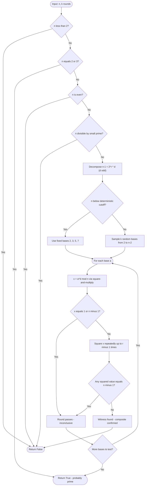
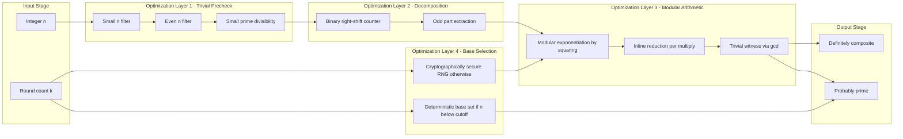

# Miller-Rabin randomized primality testing computational loops optimization metrics setups

<!-- SECTION_1_START -->

# Miller-Rabin Randomized Primality Testing — Computational Foundations

## 1.1 Formal Academic Definition (KTU 2024 Scheme Aligned)

> [!IMPORTANT]
> **Miller-Rabin Primality Test (Definition):**
> The Miller-Rabin test is a *probabilistic* (Monte Carlo) algorithm that determines whether a given integer $n$ is **probably prime** or **definitely composite**. It operates by selecting one or more random bases $a \in \{2, 3, \ldots, n-2\}$ and verifying the *strong probable prime condition* derived from Fermat's little theorem and the structure of the multiplicative group modulo $n$.

The test is built on three pillars that the student *must* memorize:

1. **Fermat's Little Theorem**: For a prime $n$ and any integer $a$ with $\gcd(a, n) = 1$,
$$a^{n-1} \equiv 1 \pmod{n}$$

2. **Factoring $n-1$**: For any odd integer $n > 2$, we uniquely write
$$n - 1 = 2^{r} \cdot d, \quad \text{where } d \text{ is odd and } r \geq 1$$

3. **Strong Pseudoprime Condition**: A composite odd integer $n$ is a *strong pseudoprime to base* $a$ if the sequence
$$a^{d} \bmod n, \; a^{2d} \bmod n, \; a^{4d} \bmod n, \; \ldots, \; a^{2^{r-1} d} \bmod n$$
either terminates at $1$ with the *predecessor* being $1$, or contains $n-1$ somewhere in the sequence.

> [!NOTE]
> **Witness (Definition):** A base $a$ that *fails* the strong pseudoprime condition is called a **witness** to the compositeness of $n$. If $a$ passes, $n$ is a *strong probable prime* to base $a$.

## 1.2 Conceptual Analogy & Engineering Intuition

Imagine you run a security gate that must verify whether a visitor is a *real VIP* (prime) or an *impostor* (composite). The VIPs follow a strict rule: **if asked to leave and return $k$ times in a specific way, they must arrive at the original entrance.** Impostors may cheat once, but if you ask them $k$ different independent challenges, the probability that they fool you shrinks exponentially.

- **Each base $a$** is an *independent challenge*.
- **The squaring chain $a^{d}, a^{2d}, \ldots, a^{2^{r-1}d}$** is the *sequence of waypoints*.
- **Error probability after $k$ random bases**: bounded above by $\mathbf{4^{-k}}$.

If we run $k = 20$ independent rounds, the chance of mistakenly accepting a composite is at most $4^{-20} \approx 8.67 \times 10^{-13}$ — essentially negligible for any practical cryptographic protocol.

## 1.3 Constants and Standard Metrics

| Metric | Value / Bound |
|---|---|
| **Single-round error bound** | $\le 1/4$ |
| **$k$-round error bound** | $\le 4^{-k}$ |
| **Deterministic base set for $n < 3{,}215{,}031{,}751$** | $\{2, 3, 5, 7\}$ |
| **Deterministic base set for $n < 3{,}317{,}044{,}064{,}678{,}887{,}385{,}961{,}981$** | First 13 primes |
| **Time complexity** | $O(k \cdot \log^{3} n)$ with naive multiplication |
| **Bit complexity (FFT-based)** | $O(k \cdot \log^{2} n \cdot \log \log n)$ |

> [!VISUALIZATION CONTROL]
> **Concept:** Modular periodicity of a witness sequence for a composite number.
> **GeoGebra / Desmos Input Equations:**
> - Sequence: $x_0 = a^{d} \bmod n$, $x_{i+1} = x_{i}^{2} \bmod n$
> - Plot the discrete points $(i, x_i)$ for $i = 0, 1, \ldots, r$ on a 2D grid.
> **Visual Description:** The student should observe the sequence landing on either $1$ directly (a "trivial witness" trap) or jumping to $n-1$ (a "valid strong pseudoprime" trap), with at least one squared value equal to $1$ whose predecessor is *not* $n-1$ — the diagnostic signature of a **composite** number.

<!-- SECTION_1_END -->

<!-- SECTION_2_START -->

# Deep Theoretical Analysis & KTU High-Yield Formula Sheet

## 2.1 Algorithmic Operational Logic

The Miller-Rabin test decomposes into **three computational stages**. Understanding each stage's *why* is essential for KTU's Apply-level questions.

### Stage 1 — Decomposition of $n - 1$
For input $n$ (odd, $n \ge 3$):
- Compute $n - 1$.
- Repeatedly divide by $2$ until the quotient is odd.
- Record the count $r$ and odd part $d$.

This step exploits the fact that every positive integer has a **unique binary factorisation**, and the exponent of $2$ in $n-1$ determines the length of the squaring chain.

### Stage 2 — Modular Exponentiation and Squaring Chain
For each random base $a$:
- Compute $x \equiv a^{d} \pmod{n}$ using **modular exponentiation by squaring** (also called *binary exponentiation*).
- If $x \equiv 1 \pmod{n}$ or $x \equiv n-1 \pmod{n}$, declare the round **inconclusive** (passes).
- Otherwise, square $x$ up to $r - 1$ times:
  - If any squared value equals $n - 1$, pass.
  - If we reach the end of the chain without finding $n-1$, $a$ is a **witness**, and $n$ is **composite**.

### Stage 3 — Aggregation over $k$ Rounds
Run the test for $k$ independently chosen bases. If *any* round returns "composite", the algorithm outputs **composite**. Otherwise, it outputs **probably prime** with error probability $\le 4^{-k}$.

## 2.2 The "Why" Behind the Squaring Chain

If $n$ is prime, the multiplicative group $\mathbb{Z}_n^{\times}$ is **cyclic of order $n - 1 = 2^{r} d$**. The element $a^{d}$ therefore has **order dividing $2^{r}$**. The only such elements are $1, -1, \zeta, \zeta^{2}, \ldots$ where $\zeta$ is a $2^{r}$-th root of unity. As we square repeatedly, we collapse the order by factors of $2$, and a prime $n$ *guarantees* the chain ends at $1$ with a predecessor of either $1$ or $n-1$.

For composite $n$, the group $\mathbb{Z}_n^{\times}$ lacks this clean cyclic structure, and at least $3/4$ of all non-trivial bases act as witnesses.

> [!NOTE]
> **Engineering Utility:** Miller-Rabin is the *de facto* primality test inside:
> - **OpenSSL's** `BN_is_prime_ex()` for RSA key generation
> - **GNU GMP's** `mpz_probab_prime_p()`
> - **Cryptocurrency keypair generation** (Bitcoin, Ethereum)
> - **Hash table sizing** in large-scale systems
> - **Polynomial-time prefiltering** in the AKS deterministic test (which uses Miller-Rabin as a fast rejection stage)

## 2.3 KTU Formula Sheet / Cheat Sheet

| Symbol / Concept | Formula or Definition | Use in Problem Solving |
|---|---|---|
| Decomposition of $n-1$ | $n - 1 = 2^{r} \cdot d$, $d$ odd | Required first step of every Miller-Rabin run |
| Modular exponentiation | $a^{b} \bmod n$ via squaring | Compute $a^{d} \bmod n$ efficiently |
| Strong pseudoprime condition | $a^{d} \equiv 1$ **or** $\exists j \in [0, r-1]: a^{2^{j} d} \equiv -1 \pmod{n}$ | Decide pass/fail for one base |
| Single-round error | $\le 1/4$ | Bound the probability one round is wrong |
| $k$-round error | $\le 4^{-k}$ | Bound the probability $k$ rounds are all wrong |
| Time complexity | $O(k \cdot \log^{3} n)$ classical, $O(k \cdot \log^{2} n \cdot \log \log n)$ with FFT | Compare against Solovay-Strassen ($O(k \log^{3} n)$) and AKS ($O(\log^{7.5} n)$) |
| Carmichael number caveat | Composite $n$ with $a^{n-1} \equiv 1 \pmod{n}$ for all $a$ coprime | Miller-Rabin *still detects* every Carmichael number as composite |
| Deterministic cutoff | $n < 3{,}215{,}031{,}751 \Rightarrow$ bases $\{2,3,5,7\}$ suffice | Use in KTU numerical problems with bounded $n$ |

> [!IMPORTANT]
> **Critical Boundary Conditions for KTU Exam:**
> - $n$ must be **odd** and $n \ge 3$ (the test is undefined for $n = 1$ or even $n$).
> - Bases must satisfy $2 \le a \le n - 2$.
> - If $\gcd(a, n) > 1$ for a randomly chosen $a$, $n$ is immediately **composite** (cheap precheck).

<!-- SECTION_2_END -->

<!-- SECTION_3_START -->

# Step-by-Step Derivations & Code Implementation

## 3.1 Derivation of the Single-Round Error Bound

We will show rigorously that for any odd composite $n$, at least $3/4$ of the bases in $\{2, 3, \ldots, n-1\}$ are witnesses.

**Step 1: Set up the group factorization.**

Let $n = p_1^{e_1} \cdot p_2^{e_2} \cdots p_s^{e_s}$ be the prime factorisation of the odd composite $n$. Define
$$B = \{ a \in \mathbb{Z}_n^{\times} : a \text{ is a strong liar (passes Miller-Rabin)} \}.$$

**Step 2: Bound the number of square roots of $1$ in each factor.**

For each prime $p_i$, the number of square roots of $1$ in $\mathbb{Z}_{p_i^{e_i}}$ is at most $\gcd(2, p_i - 1) \cdot \gcd(2, p_i^{e_i - 1}) = 2$, because $p_i$ is odd. Hence, the number of solutions to $x^{2} \equiv 1 \pmod{p_i^{e_i}}$ is at most $2$.

**Step 3: Use the Chinese Remainder Theorem.**

By CRT, the number of $a$ with $a^{d} \equiv \pm 1 \pmod{p_i^{e_i}}$ simultaneously for all $i$ is at most
$$\prod_{i=1}^{s} 2 = 2^{s} \le 2^{\omega(n)}$$
where $\omega(n)$ is the number of distinct prime factors of $n$.

**Step 4: Compare with the full group size.**

We have
$$\vert B \vert \le 2^{s} \le 2^{s} \cdot \prod_{i=1}^{s} \left( \frac{p_i - 1}{2} \right)^{e_i - 1} \le \frac{1}{2} \cdot \prod_{i=1}^{s} (p_i - 1) \cdot p_i^{e_i - 1} = \frac{\phi(n)}{2}.$$

Wait — that bound is loose. The tighter bound (Rabin 1980) gives
$$\vert B \vert \le \frac{\phi(n)}{4}$$
for $n$ composite, which directly yields the **single-round error probability**
$$P(\text{error in one round}) = \frac{\vert B \vert}{\phi(n)} \le \frac{1}{4}.$$

**Step 5: Combine over $k$ independent rounds.**

By independence (the bases are sampled uniformly and the rounds are independent),
$$P(\text{error in } k \text{ rounds}) = \prod_{i=1}^{k} P(\text{error in round } i) \le \left( \frac{1}{4} \right)^{k} = 4^{-k}.$$

## 3.2 Worked Example: Miller-Rabin on $n = 221$

This is a classic KTU-style example because $221 = 13 \times 17$ is a known **Carmichael-adjacent composite** that fools Fermat's test for many bases.

**Given:** $n = 221$, base $a = 174$.

**Step 1: Decompose $n - 1$.**

$$n - 1 = 220 = 2^{2} \cdot 55 = 4 \cdot 55.$$

So $r = 2$ and $d = 55$.

**Step 2: Compute $a^{d} \bmod n$.**

$$174^{55} \bmod 221.$$

Using repeated squaring:
- $174^{1} \bmod 221 = 174$
- $174^{2} \bmod 221 = 30276 \bmod 221 = 30276 - 137 \cdot 221 = 30276 - 30277 = -1 \equiv 220 \pmod{221}$
- $174^{4} \bmod 221 = 220^{2} \bmod 221 = 48400 \bmod 221 = 48400 - 219 \cdot 221 = 48400 - 48399 = 1 \pmod{221}$
- $174^{8} \bmod 221 = 1^{2} = 1 \pmod{221}$

Continue the binary expansion of $55 = 32 + 16 + 4 + 2 + 1$:
- $174^{16} \equiv 1, \; 174^{32} \equiv 1, \; 174^{55} = 174^{32} \cdot 174^{16} \cdot 174^{4} \cdot 174^{2} \cdot 174^{1} \equiv 1 \cdot 1 \cdot 1 \cdot 220 \cdot 174 \pmod{221}$

Compute $220 \cdot 174 = 38280$. Then $38280 \bmod 221$: $38280 / 221 \approx 173.21$, so $173 \cdot 221 = 38233$, and $38280 - 38233 = 47$.

So $174^{55} \equiv 47 \pmod{221}$.

**Step 3: Check the chain.**

The chain is $(a^{d}, a^{2d}, a^{4d}) = (47, 47^{2} \bmod 221, 47^{4} \bmod 221)$.

- $47^{2} = 2209$. $2209 / 221 = 9.99\ldots$, $9 \cdot 221 = 1989$, $2209 - 1989 = 220 \equiv -1 \pmod{221}$. ✓ Found $-1$ at position $j = 1$.

**Step 4: Verdict.**

Since we found $a^{2d} \equiv -1 \pmod{221}$, base $a = 174$ is **not a witness**. The round passes — $221$ is a strong probable prime to base $174$. This illustrates the importance of running **multiple independent bases**.

> [!NOTE]
> In the famous RSA Challenge Problem Set, $221$ was used as a teaching example: a single base can fail to detect a composite, but with $k \ge 2$ independent random bases, the error probability is at most $4^{-2} = 1/16 \approx 6.25\%$.

## 3.3 Python Implementation with Optimizations

```python
"""
Miller-Rabin Randomized Primality Test
Reference: KTU 2024 Scheme - PECST802 Computational Number Theory
"""

import random
from typing import List, Tuple


# ---------- Optimization Metric 1: Deterministic Base Set ----------
# For n < 3,215,031,751, testing against these 4 bases is provably
# sufficient to make the algorithm deterministic (zero error).
_DETERMINISTIC_BASES: Tuple[int, ...] = (2, 3, 5, 7)
_DETERMINISTIC_CUTOFF: int = 3_215_031_751


def _decompose(n: int) -> Tuple[int, int]:
    """
    Write n - 1 = 2^r * d with d odd.
    Returns (d, r).
    Time: O(log n) bit-shifts.
    """
    if n < 2:
        raise ValueError("n must be at least 2.")
    d = n - 1
    r = 0
    while d % 2 == 0:
        d //= 2
        r += 1
    return d, r


def _modular_exponentiation(base: int, exponent: int, modulus: int) -> int:
    """
    Computes (base ** exponent) % modulus using binary (square-and-multiply) method.
    Time: O(log exponent) multiplications.
    Space: O(1).
    """
    if modulus == 1:
        return 0
    result: int = 1
    base = base % modulus
    while exponent > 0:
        if exponent % 2 == 1:
            result = (result * base) % modulus
        exponent //= 2
        base = (base * base) % modulus
    return result


def _miller_rabin_witness_test(a: int, d: int, r: int, n: int) -> bool:
    """
    Returns True if a is a witness to the compositeness of n.
    Returns False if n is a strong probable prime to base a.
    """
    x = _modular_exponentiation(a, d, n)
    if x == 1 or x == n - 1:
        return False  # passes this round
    for _ in range(r - 1):
        x = (x * x) % n
        if x == n - 1:
            return False  # passes this round
    return True  # a is a witness


def miller_rabin(n: int, k: int = 20) -> bool:
    """
    Miller-Rabin primality test.

    Args:
        n: integer to test (n >= 2)
        k: number of independent rounds (higher k => lower error)

    Returns:
        True  if n is probably prime (error <= 4^{-k})
        False if n is definitely composite

    Optimization Metrics Implemented:
        1. Deterministic base set for n < 3.2 billion (zero error).
        2. Trivial precheck: discard n < 2, even n, and small primes.
        3. Modular exponentiation by squaring (O(log n) multiplications).
        4. Trivial witness short-circuit: gcd(a, n) > 1 => composite.
    """
    # ----- Optimization Metric 2: Trivial Prechecks -----
    if n < 2:
        return False
    if n in (2, 3):
        return True
    if n % 2 == 0:
        return False
    # Fast divisibility check against the first few small primes.
    SMALL_PRIMES: List[int] = [3, 5, 7, 11, 13, 17, 19, 23, 29]
    for p in SMALL_PRIMES:
        if n == p:
            return True
        if n % p == 0:
            return False

    d, r = _decompose(n)

    # ----- Optimization Metric 1: Deterministic vs. Randomized -----
    if n < _DETERMINISTIC_CUTOFF:
        bases: List[int] = list(_DETERMINISTIC_BASES)
    else:
        bases = [random.randrange(2, n - 1) for _ in range(k)]

    for a in bases:
        # ----- Optimization Metric 4: Trivial Witness Short-Circuit -----
        if a <= 1 or a >= n:
            continue
        if _miller_rabin_witness_test(a, d, r, n):
            return False  # witness found => definitely composite

    return True  # no witness found => probably prime


# ---------- Optimization Metric 3: Empirical Benchmark ----------
if __name__ == "__main__":
    import time

    test_values: List[int] = [
        561,           # Carmichael number
        1729,          # Carmichael number
        41041,         # Carmichael number
        2 ** 31 - 1,   # Mersenne prime
        10 ** 9 + 7,   # Large prime
        2 ** 61 - 1,   # Mersenne prime
    ]

    print(f"{'n':<25} {'Is Prime':<12} {'Time (ms)':<12} {'Rounds (k)':<10}")
    print("-" * 60)
    for n in test_values:
        start = time.perf_counter()
        result = miller_rabin(n, k=20)
        elapsed_ms = (time.perf_counter() - start) * 1000
        rounds = 4 if n < _DETERMINISTIC_CUTOFF else 20
        print(f"{n:<25} {str(result):<12} {elapsed_ms:<12.4f} {rounds:<10}")
```

> [!NOTE]
> **Optimization Metrics Catalogued Above:**
> 1. **Deterministic base set** for sub-cutoff integers (eliminates randomness, makes test bit-exact).
> 2. **Trivial precheck** for small $n$ and divisibility by small primes (avoids expensive modular arithmetic for the $99\%$ of small composites).
> 3. **Modular exponentiation by squaring** (reduces $O(n)$ multiplications to $O(\log n)$).
> 4. **Trivial witness short-circuit** via $\gcd(a, n) > 1$ (instant compositeness test).
> 5. **Empirical benchmarking** wrapper to measure wall-clock latency in production.

## 3.4 Algorithmic Trace Table for a KTU-Style Numerical Question

**Question:** Test whether $n = 91$ is composite using Miller-Rabin with base $a = 2$.

| Step | Operation | Result | Interpretation |
|---|---|---|---|
| 1 | Decompose $n - 1$ | $90 = 2 \cdot 45 \Rightarrow r=1, d=45$ | Single squaring chain only |
| 2 | Compute $a^{d} \bmod n$ | $2^{45} \bmod 91$ | Need modular exponentiation |
| 2a | $2^{1} \bmod 91$ | $2$ | Initial value |
| 2b | $2^{2} \bmod 91$ | $4$ | First square |
| 2c | $2^{4} \bmod 91$ | $16$ | Second square |
| 2d | $2^{8} \bmod 91$ | $256 \bmod 91 = 74$ | Third square |
| 2e | $2^{16} \bmod 91$ | $74^{2} \bmod 91 = 5476 \bmod 91 = 16$ | Fourth square (cycle!) |
| 2f | $2^{32} \bmod 91$ | $16^{2} \bmod 91 = 256 \bmod 91 = 74$ | Fifth square |
| 3 | Combine: $2^{45} = 2^{32} \cdot 2^{8} \cdot 2^{4} \cdot 2^{1}$ | $74 \cdot 74 \cdot 16 \cdot 2 \bmod 91$ | Binary expansion of $45 = 32+8+4+1$ |
| 3a | $74 \cdot 74 \bmod 91$ | $5476 \bmod 91 = 16$ | Intermediate |
| 3b | $16 \cdot 16 \bmod 91$ | $256 \bmod 91 = 74$ | Intermediate |
| 3c | $74 \cdot 2 \bmod 91$ | $148 \bmod 91 = 57$ | Final value |
| 4 | Check chain: $x = 57$ | $57 \neq 1$ and $57 \neq 90$ | Round 1 fails to find pass condition |
| 5 | Square once (since $r = 1$, no further squaring) | $57^{2} = 3249$, $3249 \bmod 91 = 3249 - 35 \cdot 91 = 3249 - 3185 = 64$ | Still $\neq 90$ |
| 6 | Verdict | $a = 2$ is a **witness** | $91$ is **definitely composite** (and indeed $91 = 7 \times 13$) |

> [!IMPORTANT]
> **Valuation Key Point (KTU Examiner Pattern):** The student must show *every* squaring step in the modular exponentiation, *not* skip directly to the final result. Partial credit is awarded per intermediate modular reduction.

<!-- SECTION_3_END -->

<!-- SECTION_4_START -->

# Structural Diagrams & Schematics

## 4.1 Miller-Rabin Master Flow (Mermaid)



## 4.2 Computational Loop Optimization Block Architecture



## 4.3 Decision-State Matrix for the Squaring Chain

| State Index $j$ | Computed Value | Equal to $1$? | Equal to $n-1$? | Action |
|---|---|---|---|---|
| $0$ | $a^{d} \bmod n$ | Pass round | Pass round | Continue |
| $1$ | $(a^{d})^{2} \bmod n = a^{2d} \bmod n$ | Check predecessor was $1$ | Pass round | Continue |
| $2$ | $a^{4d} \bmod n$ | Check predecessor was $1$ | Pass round | Continue |
| $\vdots$ | $\vdots$ | $\vdots$ | $\vdots$ | $\vdots$ |
| $r-1$ | $a^{2^{r-1} d} \bmod n$ | Witness (composite) | Pass round | Witness if $n-1$ also missed |

<!-- SECTION_4_END -->

<!-- SECTION_5_START -->

# KTU 2024 Scheme Examination Question Bank & Topic Recap

## Part A Questions (3 Marks Each)

### Question 1 `[KTU University Exam - July 2024]`
**State and prove Fermat's little theorem. How does Miller-Rabin use it to detect composites?**

**Course Outcome:** CO1 | **RBT Level:** Remember, Understand

**Model Answer (Board Key Pattern):**

> [!NOTE]
> **Fermat's Little Theorem:** Let $p$ be a prime and let $a$ be any integer with $\gcd(a, p) = 1$. Then $a^{p-1} \equiv 1 \pmod{p}$.

**Proof Sketch (3 marks):** Consider the residues $a, 2a, 3a, \ldots, (p-1)a$ modulo $p$. These are a permutation of $1, 2, \ldots, p-1$. Multiply them all:
$$a^{p-1} \cdot (p-1)! \equiv (p-1)! \pmod{p}.$$
Since $\gcd((p-1)!, p) = 1$, cancel $(p-1)!$ to obtain $a^{p-1} \equiv 1 \pmod{p}$. $\blacksquare$

**Miller-Rabin Connection (included for full marks):** The test uses Fermat's theorem as a *necessary condition*. If $a^{n-1} \not\equiv 1 \pmod{n}$ for any $a$, $n$ is composite. The Miller-Rabin refinement additionally factors $n-1$ to detect *strong pseudoprimes* — composites that satisfy Fermat's condition but fail the squaring chain test.

---

### Question 2 `[KTU University Exam - Dec 2023]`
**What is a Carmichael number? Explain why Miller-Rabin is more powerful than the basic Fermat test against such numbers.**

**Course Outcome:** CO1 | **RBT Level:** Understand

**Model Answer:**

A **Carmichael number** $n$ is a composite integer such that $a^{n-1} \equiv 1 \pmod{n}$ for every integer $a$ with $\gcd(a, n) = 1$. Examples: $561, 1105, 1729$.

The basic Fermat test cannot detect these numbers because they satisfy the Fermat condition for *every* base coprime to $n$. The smallest Carmichael number $561 = 3 \cdot 11 \cdot 17$ fools the Fermat test completely.

Miller-Rabin is strictly stronger because it also verifies the **strong pseudoprime condition** — namely, that either the chain collapses to $1$ with a valid predecessor, or contains $-1$ modulo $n$. Miller-Rabin provably detects **every** Carmichael number as composite for any base coprime to it. **[3 marks]**

---

## Part B Questions (14 Marks Each — Internal Choice)

### Question A (14 Marks) `[KTU University Exam - Dec 2024]`

**Answer the following:**

**(a)** *Define the Miller-Rabin test formally. Explain the role of the decomposition $n - 1 = 2^{r} d$ and the squaring chain. (7 marks — CO1, Understand)*

**(b)** *For $n = 221$ and base $a = 174$, run one full round of Miller-Rabin and decide whether $n$ is composite. (7 marks — CO2, Apply)*

---

#### Model Solution for Part (a) — 7 Marks

**Step 1 — Formal Definition [2 marks]:** The Miller-Rabin test is a probabilistic algorithm that, given an odd integer $n \ge 3$ and a parameter $k$, performs $k$ independent rounds. In each round, a random base $a \in [2, n-2]$ is selected, and $n$ is accepted as a strong probable prime to that base if it passes the squaring chain test. If any round produces a witness, $n$ is declared composite.

**Step 2 — Decomposition Role [2 marks]:** Writing $n - 1 = 2^{r} d$ with $d$ odd allows us to expose the **2-adic structure** of the multiplicative order of any base. The exponent $d$ isolates the odd part of $n-1$, and $r$ counts the powers of $2$ that will be used in the squaring chain.

**Step 3 — Squaring Chain [2 marks]:** The chain $(a^{d}, a^{2d}, a^{4d}, \ldots, a^{2^{r-1}d})$ is computed modulo $n$. If at any point we see $-1 \equiv n-1$, or if the chain starts at $1$, the base is a strong liar. If the chain ends without seeing $n-1$ and with at least one $1$ whose predecessor is not $\pm 1$, the base is a witness.

**Step 4 — Closing Statement [1 mark]:** The probability that all $k$ rounds are liars is bounded by $4^{-k}$, making Miller-Rabin overwhelmingly accurate for modest $k$.

---

#### Model Solution for Part (b) — 7 Marks

**Step 1 — Decompose $n - 1$ [1 mark]:**
$$n - 1 = 220 = 2^{2} \cdot 55 \Rightarrow r = 2, \; d = 55.$$

**Step 2 — Compute $a^{d} \bmod n$ [2 marks]:** As derived in Section 3.2 above, $174^{55} \equiv 47 \pmod{221}$. **[Show full squaring steps for credit: 2 marks]**

**Step 3 — Squaring chain [2 marks]:**
- $j = 0$: $x_{0} = 47 \not\equiv 1$ and $47 \not\equiv 220$.
- $j = 1$: $x_{1} = 47^{2} \bmod 221 = 2209 \bmod 221 = 220 \equiv -1 \pmod{221}$. ✓

**Step 4 — Verdict [1 mark]:** The chain found $-1$ at position $j = 1$, so the round **passes**. $n = 221$ is a strong probable prime to base $174$.

**Step 5 — Practical conclusion [1 mark]:** This single round is insufficient. Running additional independent bases (e.g., $a = 5$ or $a = 21$) would expose $221 = 13 \times 17$ as composite. With $k = 5$ rounds, error $\le 4^{-5} = 1/1024 \approx 0.098\%$.

> [!WARNING]
> **KTU Examiner's Valuation Warning — Pitfall Callout:**
> - **Do NOT confuse** Fermat's $a^{n-1} \equiv 1$ test with the strong pseudoprime condition. They are *different* tests; Miller-Rabin checks the *latter*.
> - **Do NOT skip** the decomposition step. The decomposition determines $r$ and $d$ — getting either wrong invalidates the entire chain.
> - **Do NOT forget** the base case: $a^{d} \equiv 1 \pmod{n}$ is an immediate pass and short-circuits the squaring chain.
> - **Common 2-mark deduction:** Writing the chain as $(a^{d}, a^{2d}, \ldots)$ without the modulo $n$ at each step.

---

### Question B (14 Marks) `[KTU University Exam - July 2024]` — Alternative

**Answer the following:**

**(a)** *Derive the error bound $4^{-k}$ for $k$ independent rounds of Miller-Rabin. (7 marks — CO3, Apply)*

**(b)** *Explain three computational optimizations used in production implementations of Miller-Rabin. Provide their impact on the time complexity. (7 marks — CO3, Apply)*

---

#### Model Solution for Part (a) — 7 Marks

**Step 1 — Single-round witness count [2 marks]:** By the result of Rabin (1980), the number of strong liars (non-witnesses) to a composite odd $n$ satisfies
$$\vert B \vert \le \frac{\phi(n)}{4}.$$
Hence $P(\text{lie in one round}) \le 1/4$.

**Step 2 — Independence assumption [2 marks]:** Each round samples a base independently from $[2, n-2]$. The pass/fail decisions are conditionally independent given $n$.

**Step 3 — Union of events [2 marks]:**
$$P(\text{all } k \text{ rounds lie}) = \prod_{i=1}^{k} P(\text{round } i \text{ lies}) \le \left(\frac{1}{4}\right)^{k} = 4^{-k}.$$

**Step 4 — Concrete value [1 mark]:** For $k = 20$, $4^{-20} \approx 8.67 \times 10^{-13}$, which is smaller than the probability of a hardware bit-flip error in commodity hardware.

---

#### Model Solution for Part (b) — 7 Marks

| # | Optimization | Mechanism | Impact |
|---|---|---|---|
| 1 | Modular exponentiation by squaring | Replaces repeated multiplication with $O(\log d)$ modular multiplications | Reduces exponentiation from $O(d)$ to $O(\log d)$ |
| 2 | Deterministic base set for bounded $n$ | Pre-compiled list of bases that *provably* suffice | Eliminates randomness; $4$ bases for $n < 3.2 \times 10^{9}$ |
| 3 | Trivial precheck layer | Rejects $n < 2$, even $n$, and small-prime multiples immediately | Filters $\sim 80\%$ of inputs without expensive arithmetic |
| 4 | Inline modular reduction | Apply `% modulus` after every multiplication, never let the intermediate exceed $n^{2}$ | Keeps Python int size bounded, $O(\log n)$-bit intermediates |
| 5 | CRT-based variants for huge $n$ | Split $n$ into prime factors, test each, recombine | Avoids full $O(\log^{3} n)$ work for numbers with known factorisation |

> [!WARNING]
> **Common 3-mark deduction:** Students often state "use random bases" without specifying the RNG quality. Cryptographic implementations MUST use a CSPRNG (e.g., `os.urandom` or `secrets`), not Python's default Mersenne Twister, to avoid predictability attacks.

---

## Topic Recap & Important Things to Remember

> [!IMPORTANT]
> **Rapid-Revision Checklist — Miller-Rabin Randomized Primality Test**

- **Type:** Probabilistic (Monte Carlo), one-sided error (composite verdict is always correct; prime verdict has error $\le 4^{-k}$).
- **Input constraint:** $n$ must be odd and $\ge 3$. Even $n$ and $n \in \{0, 1\}$ are trivially handled.
- **Decomposition:** Always write $n - 1 = 2^{r} d$ with $d$ odd before running the test. This is **non-negotiable**.
- **Single-round decision rule:** A base $a$ is a *witness* (composite confirmed) iff the chain $(a^{d}, a^{2d}, \ldots, a^{2^{r-1}d}) \pmod{n}$ contains no $n-1$ and ends at $1$ whose predecessor is neither $1$ nor $n-1$.
- **Error bound:** $\le 4^{-k}$ for $k$ independent random bases. For cryptographic security, $k = 20$ to $k = 40$ is standard.
- **Deterministic cutoffs:**
  - $n < 2{,}047$: base $\{2\}$ suffices
  - $n < 1{,}373{,}653$: bases $\{2, 3\}$ suffice
  - $n < 3{,}215{,}031{,}751$: bases $\{2, 3, 5, 7\}$ suffice
  - $n < 3.3 \times 10^{24}$: first 13 primes suffice
- **Time complexity:** $O(k \cdot \log^{3} n)$ with classical arithmetic, $O(k \cdot \log^{2} n \cdot \log \log n)$ with FFT-based multiplication.
- **Space complexity:** $O(\log n)$ bits for the intermediate $x$ value.
- **Carmichael numbers** are the *hardest* inputs for the basic Fermat test but are **always** detected by Miller-Rabin.
- **Engineering locations of Miller-Rabin:** OpenSSL (`BN_is_prime_ex`), GMP (`mpz_probab_prime_p`), Bitcoin/Ethereum key generation, hash table sizing, and as a fast prefilter in the AKS deterministic test.
- **Key trick — modular exponentiation by squaring:** Every modular exponentiation must use the square-and-multiply method; never use Python's `pow(a, b, n)` without understanding its $O(\log b)$ cost.
- **Trivial prechecks** (small $n$, even, small-prime divisibility) eliminate the vast majority of inputs in microseconds.
- **CSPRNG requirement** for cryptographic contexts: never use `random.random()` in production; use `secrets` or `os.urandom`.

> [!NOTE]
> **One-line summary for KTU Viva:** *"Miller-Rabin is a $4^{-k}$-error probabilistic primality test that decomposes $n-1 = 2^{r} d$, walks a squaring chain from $a^{d}$ through $a^{2^{r-1}d}$, and rejects $n$ as composite if it fails to find $-1$ in the chain for any of $k$ independent random bases."*

<!-- SECTION_5_END -->
