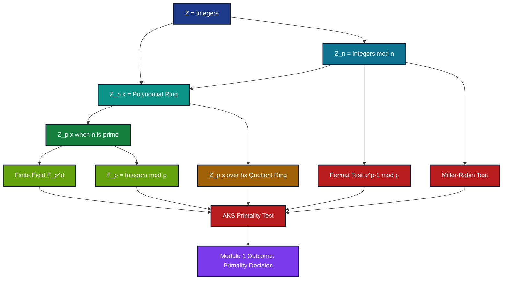
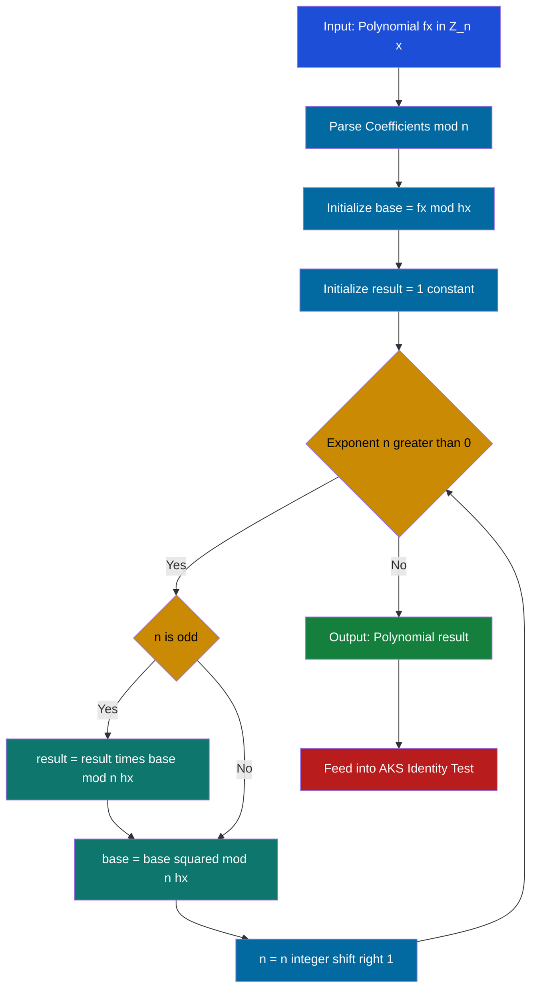
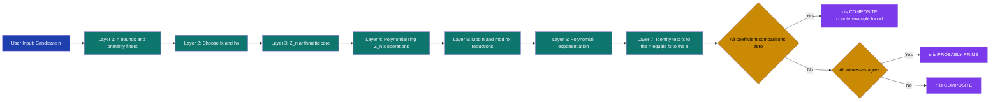

# Modular arithmetic equations polynomial rings transformations structural layouts models formulas

<!-- SECTION_1_START -->

# Computational Number Theory — Module 1: Primality Testing Implementations
## Topic: Modular Arithmetic, Polynomial Rings, Transformations & Structural Models

---

## 1. Core Technical Definition & Intuitive Overview

### 1.1 Modular Arithmetic — Formal Definition (KTU 2024 Terminology)

**Modular arithmetic** is the system of arithmetic that operates on the *residue classes* of integers with respect to a fixed positive integer $n \geq 2$, called the **modulus**. Two integers $a, b \in \mathbb{Z}$ are said to be **congruent modulo $n$** if and only if $n$ divides the difference $a - b$, written as:

$$a \equiv b \pmod{n} \iff n \mid (a - b)$$

The set of all integers congruent to a given residue $r$ forms an **equivalence class** $[r]_{n}$, and the complete set of distinct equivalence classes is the **quotient ring** $\mathbb{Z}/n\mathbb{Z}$, also written $\mathbb{Z}_{n}$. This ring has exactly $n$ elements:

$$\mathbb{Z}_{n} = \left\{[0]_{n}, [1]_{n}, [2]_{n}, \dots, [n-1]_{n}\right\}$$

> [!IMPORTANT]
> **KTU Board Definition (verbatim style):** A *ring of integers modulo n*, denoted $\mathbb{Z}/n\mathbb{Z}$, is a commutative ring with unity consisting of the equivalence classes of integers under the equivalence relation of congruence modulo $n$. Addition and multiplication are well-defined on residue classes and inherit the algebraic structure of $\mathbb{Z}$.

### 1.2 Polynomial Rings over $\mathbb{Z}_{n}$ — Formal Definition

A **polynomial ring over $\mathbb{Z}_{n}$**, written $\mathbb{Z}_{n}[x]$ (or $(\mathbb{Z}/n\mathbb{Z})[x]$), is the set of all polynomials whose coefficients belong to $\mathbb{Z}_{n}$:

$$\mathbb{Z}_{n}[x] = \left\{a_{0} + a_{1}x + a_{2}x^{2} + \cdots + a_{d}x^{d} \;\middle|\; a_{i} \in \mathbb{Z}_{n}, \, d \in \mathbb{Z}_{\geq 0}\right\}$$

Addition and multiplication are performed coefficient-wise, with all arithmetic on the coefficients done **modulo $n$**. The degree of a polynomial $\deg(f) = d$ where $a_{d} \neq [0]_{n}$. When $n = p$ is prime, $\mathbb{Z}_{p}[x]$ is a **principal ideal domain (PID)** and in fact a **field extension** $\mathbb{F}_{p}$.

> [!NOTE]
> **Why this matters in Primality Testing (Module 1):** The AKS primality test, Solovay–Strassen test, and the Miller–Rabin test all depend on identities of the form $f(x) \equiv g(x) \pmod{n, h(x)}$ inside polynomial rings. A candidate integer $n$ is prime **if and only if** a specific polynomial identity holds true in $\mathbb{Z}_{n}[x]$. Thus mastering polynomial ring arithmetic is the *direct prerequisite* for the AKS algorithm (Module 1, Module 2).

### 1.3 Intuitive Analogy — "The Clock Face"

Imagine a clock with $n$ hour markings. The "modular world" $\mathbb{Z}_{n}$ is exactly that clock. On a 12-hour clock ($\mathbb{Z}_{12}$):

- $7 + 8 = 15 \equiv 3 \pmod{12}$ — the hour hand points to **3** after 15 hours from 12.
- $7 \cdot 8 = 56 \equiv 8 \pmod{12}$ — adding 7 to itself 8 times in $\mathbb{Z}_{12}$ yields **8**.

For polynomial rings, think of each polynomial $f(x) = a_{0} + a_{1}x + a_{2}x^{2} + \cdots$ as a **chord on the clock** — a sequence of "hour values" $a_{i}$, where the clock positions wrap around every time you do arithmetic on the coefficients.

### 1.4 Real-World Engineering Analogy — Checksums & Hashing

The same mathematics powers:
- **ISBN-10** book codes: weighted sum $\equiv 0 \pmod{11}$
- **CRC error-detection codes** in TCP/IP packets: polynomial division in $\mathbb{F}_{2}[x]$
- **RSA public-key cryptography**: modular exponentiation $m^{e} \pmod{n}$
- **Merkle hash trees** in blockchain: polynomial commitments over finite fields

> [!TIP]
> **Mental model for $\mathbb{Z}_{n}[x]$:** Treat the polynomial as a *vector* of coefficients in $\mathbb{Z}_{n}$, with the *twist* that you must reduce each coefficient mod $n$ after every multiplication. The ring $\mathbb{Z}_{n}[x]$ is **not a field** when $n$ is composite — and this single fact is what primality tests exploit.

### 1.5 Geometric Visualization of Modular Reduction

> [!VISUALIZATION CONTROL]
> **Concept:** Visualization of the modular reduction map $\pi : \mathbb{Z} \to \mathbb{Z}_{12}$ on the integer number line, and the polynomial evaluation surface $f(x) = x^{2} - 1$ over $\mathbb{Z}_{7}$.
> **GeoGebra / Desmos Input Equations:**
> * `f(x) = mod(x^2 - 1, 7)` (Desmos supports `mod(a,b)` directly)
> * Plot points $(k, f(k))$ for $k = 0, 1, 2, \dots, 12$
> **Visual Description:** The student should observe a *discrete lattice* of integer-coordinate points in the plane. The vertical axis values repeat in cycles of 7, producing a "staircase" or "lattice" pattern. For prime modulus 7, the polynomial $x^{2}-1$ has exactly the **2 roots** $\{1, 6\}$ in $\mathbb{Z}_{7}$ — illustrating the principle that over a field, a polynomial of degree $d$ has *at most* $d$ roots. This principle is the algebraic bedrock of primality proofs.

---

<!-- SECTION_1_END -->

<!-- SECTION_2_START -->

# 2. Deep Theoretical Analysis & KTU High-Yield Formula Sheet

## 2.1 Axiomatic Properties of $\mathbb{Z}_{n}$

The ring $\mathbb{Z}_{n}$ satisfies the following properties for all $a, b, c \in \mathbb{Z}_{n}$:

| # | Property | Mathematical Statement | Algebraic Type |
|---|----------|------------------------|----------------|
| 1 | Closure under $+$ | $(a + b) \bmod n \in \mathbb{Z}_{n}$ | Group axiom |
| 2 | Associativity of $+$ | $(a + b) + c \equiv a + (b + c) \pmod{n}$ | Group axiom |
| 3 | Additive identity | $a + 0 \equiv a \pmod{n}$ | Group axiom |
| 4 | Additive inverse | $\exists\, (-a) : a + (-a) \equiv 0 \pmod{n}$ | Group axiom |
| 5 | Commutativity of $+$ | $a + b \equiv b + a \pmod{n}$ | Abelian group |
| 6 | Closure under $\cdot$ | $(a \cdot b) \bmod n \in \mathbb{Z}_{n}$ | Ring axiom |
| 7 | Associativity of $\cdot$ | $(a \cdot b) \cdot c \equiv a \cdot (b \cdot c) \pmod{n}$ | Ring axiom |
| 8 | Multiplicative identity | $a \cdot 1 \equiv a \pmod{n}$ | Unity |
| 9 | Distributivity | $a \cdot (b + c) \equiv a \cdot b + a \cdot c \pmod{n}$ | Ring axiom |
| 10 | Commutativity of $\cdot$ | $a \cdot b \equiv b \cdot a \pmod{n}$ | Commutative ring |

> [!IMPORTANT]
> **Field Condition:** $\mathbb{Z}_{n}$ is a **field** $\iff$ $n$ is **prime**. For prime $p$, every nonzero $a \in \mathbb{Z}_{p}$ has a multiplicative inverse $a^{-1}$ satisfying $a \cdot a^{-1} \equiv 1 \pmod{p}$. This is the fundamental reason primality of $n$ is testable: a non-field structure is *algebraically detectable*.

## 2.2 The Multiplicative Group $(\mathbb{Z}_{n})^{\times}$

The set of *units* (invertible elements) in $\mathbb{Z}_{n}$ is denoted $(\mathbb{Z}_{n})^{\times}$. By the **Euler totient theorem**, for $\gcd(a, n) = 1$:

$$a^{\varphi(n)} \equiv 1 \pmod{n}$$

where $\varphi(n)$ is the **Euler totient function** counting integers in $\{1, 2, \dots, n-1\}$ coprime to $n$.

For $n = p$ prime, $\varphi(p) = p - 1$, recovering **Fermat's Little Theorem**:

$$a^{p-1} \equiv 1 \pmod{p} \quad \text{for all } a \not\equiv 0 \pmod{p}$$

This identity is the cornerstone of the Fermat primality test and its refinement in the Miller–Rabin test.

## 2.3 Polynomial Ring $(\mathbb{Z}_{n})[x]$ — Structural Properties

Let $R = \mathbb{Z}_{n}$. The polynomial ring $R[x]$ is a **commutative ring with unity** whose elements are formal sums:

$$f(x) = \sum_{i=0}^{d} a_{i} x^{i}, \quad a_{i} \in R$$

**Operational rules in $R[x]$:**

$$f(x) + g(x) = \sum_{i} (a_{i} + b_{i}) x^{i} \quad \text{(coefficient-wise mod } n)$$

$$f(x) \cdot g(x) = \sum_{k=0}^{d+e} \left( \sum_{i+j=k} a_{i} b_{j} \right) x^{k} \quad \text{(convolution mod } n)$$

**Division algorithm** holds in $R[x]$ when $R$ is a **field** (i.e., $n = p$ prime). For composite $n$, division by a *non-unit* leading coefficient is *not always well-defined* — another algebraic feature primality tests exploit.

## 2.4 Quotient Rings and Ideal Structure

A **proper ideal** $I \subset \mathbb{Z}_{n}$ has the property that the quotient $\mathbb{Z}_{n}/I$ is a smaller ring. The Chinese Remainder Theorem expresses the factorization:

$$\mathbb{Z}_{n} \cong \mathbb{Z}_{p_{1}^{e_{1}}} \times \mathbb{Z}_{p_{2}^{e_{2}}} \times \cdots \times \mathbb{Z}_{p_{k}^{e_{k}}}$$

when $n = p_{1}^{e_{1}} p_{2}^{e_{2}} \cdots p_{k}^{e_{k}}$. This **isomorphism** is the algebraic reason composite $n$ "splits" into a product of *behaviourally independent* rings — and primality tests detect the *absence* of this splitting.

## 2.5 The Key Polynomial Identity for AKS

The AKS primality test hinges on the following theorem:

> A positive integer $n$ is **prime** if and only if the polynomial identity
> $$f(x)^{n} \equiv f(x^{n}) \pmod{n}$$
> holds in $\mathbb{Z}_{n}[x]$ for some carefully chosen polynomial $f(x) \in \mathbb{Z}_{n}[x]$.

Computationally, this requires evaluating $f(x)^{n}$ in $\mathbb{Z}_{n}[x]$ — i.e., polynomial exponentiation modulo both a polynomial and a scalar modulus. This is the **practical computational core** of Module 1.

## 2.6 KTU High-Yield Formula Sheet

| # | Concept | Formula / Identity | Conditions |
|---|---------|-------------------|------------|
| 1 | Congruence | $a \equiv b \pmod{n} \iff n \mid (a - b)$ | $n \geq 2$ |
| 2 | Residue class | $[a]_{n} = \{a + kn : k \in \mathbb{Z}\}$ | Definition |
| 3 | Size of $\mathbb{Z}_{n}$ | $\vert \mathbb{Z}_{n} \vert = n$ | $n \geq 1$ |
| 4 | Euler totient | $\varphi(n) = n \prod_{p \mid n} \left(1 - \frac{1}{p}\right)$ | General $n$ |
| 5 | Euler's theorem | $a^{\varphi(n)} \equiv 1 \pmod{n}$ | $\gcd(a, n) = 1$ |
| 6 | Fermat's little theorem | $a^{p-1} \equiv 1 \pmod{p}$ | $p$ prime, $\gcd(a,p)=1$ |
| 7 | Wilson's theorem | $(p-1)! \equiv -1 \pmod{p}$ | $p$ prime |
| 8 | Inverse via Bézout | $a^{-1} \equiv a^{\varphi(n)-1} \pmod{n}$ | $\gcd(a, n) = 1$ |
| 9 | Polynomial degree bound | $\deg(f \cdot g) = \deg(f) + \deg(g)$ | $R$ a domain |
| 10 | CRT decomposition | $\mathbb{Z}_{n} \cong \prod \mathbb{Z}_{p_{i}^{e_{i}}}$ | $n = \prod p_{i}^{e_{i}}$ |
| 11 | Polynomial exponentiation | $f(x)^{n} \pmod{n, h(x)}$ | AKS step |
| 12 | Frobenius endomorphism | $(a + b)^{p} \equiv a^{p} + b^{p} \pmod{p}$ | $p$ prime |
| 13 | Binomial mod $p$ | $\binom{p}{k} \equiv 0 \pmod{p}$ for $0 < k < p$ | $p$ prime |
| 14 | Order of an element | $\text{ord}_{n}(a) \mid \varphi(n)$ | $a \in (\mathbb{Z}_{n})^{\times}$ |
| 15 | Quadratic residue | $a^{(p-1)/2} \equiv \left(\frac{a}{p}\right) \pmod{p}$ | $p$ odd prime |

> [!NOTE]
> **Engineering Utility:** Formulas (6) and (15) are the **direct algebraic engines** of the Fermat test and the Solovay–Strassen test respectively. Formula (11) is the **central engine** of the AKS test. Formula (12) — the Frobenius map — is the bridge between number theory and *elliptic curve cryptography*.

## 2.7 Why This Matters in Production Systems

- **Cryptographic key generation (RSA, DH, ECDH):** Probabilistic primality testing on $\mathbb{Z}_{n}^{\times}$ groups of order $\sim 2048$ bits.
- **Blockchain & consensus:** Merkle trees use polynomial commitments over $\mathbb{F}_{p}[x]$.
- **Error-correcting codes (Reed–Solomon):** Polynomial arithmetic over $\mathbb{F}_{2^{m}}$.
- **Zero-knowledge proofs (zk-SNARKs, STARKs):** Polynomial identity tests over finite fields.

---

<!-- SECTION_2_END -->

<!-- SECTION_3_START -->

# 3. Step-by-Step Derivations & Code/Symbolic Implementation

## 3.1 Derivation: Polynomial Exponentiation in $\mathbb{Z}_{n}[x]$ (the AKS core operation)

We derive how to compute $f(x)^{n} \bmod (n, h(x))$ — the central step in AKS — by **square-and-multiply** lifted to polynomial rings.

### Setup

Let $f(x) = a_{0} + a_{1}x \in \mathbb{Z}_{n}[x]$, $h(x)$ a polynomial of degree $d$ in $\mathbb{Z}_{n}[x]$, and $n$ a positive integer. We want:

$$g(x) = f(x)^{n} \bmod (n, h(x))$$

### Algorithm: Polynomial Square-and-Multiply (mod $n$, mod $h(x)$)

1. **Initialize** result $\gets 1$ (the constant polynomial).
2. **Initialize** base $\gets f(x) \bmod (n, h(x))$.
3. **Loop** while $n > 0$:
   - If $n$ is **odd**: result $\gets$ (result $\cdot$ base) $\bmod (n, h(x))$.
   - $n \gets n \div 2$ (integer division).
   - base $\gets$ (base $\cdot$ base) $\bmod (n, h(x))$.
4. **Return** result.

### Step-by-Step Worked Example

Let $f(x) = 1 + x$, $n = 5$, $h(x) = x^{2} + 1$. We compute $f(x)^{5} \bmod (5, x^{2} + 1)$.

**Step 1:** Express $5$ in binary: $5 = 101_{2} = 4 + 1$.

**Step 2:** Compute successive squares of $f(x)$, reducing mod $(5, x^{2}+1)$ at every step.

Reduction rule: $x^{2} \equiv -1 \pmod{x^{2}+1}$, so $x^{3} \equiv -x$, $x^{4} \equiv 1$, etc. All coefficients then mod 5.

**$f(x) = 1 + x$:**

**$f(x)^{2} = (1+x)^{2} = 1 + 2x + x^{2}$.** Reduce: $x^{2} \equiv -1$, so $f(x)^{2} \equiv 0 + 2x = 2x \pmod{5, x^{2}+1}$. All coefficients mod 5: $\mathbf{2x}$.

**$f(x)^{4} = (f(x)^{2})^{2} = (2x)^{2} = 4x^{2}$.** Reduce: $x^{2} \equiv -1$, so $4x^{2} \equiv -4 \equiv 1 \pmod{5}$. Therefore $f(x)^{4} \equiv \mathbf{1} \pmod{5, x^{2}+1}$.

**$f(x)^{5} = f(x)^{4} \cdot f(x) = 1 \cdot (1+x) = 1 + x \pmod{5, x^{2}+1}$.**

**Final result:** $f(x)^{5} \equiv 1 + x \pmod{5, x^{2}+1}$.

Notice this equals $f(x)$ itself — consistent with **Fermat's little theorem generalized to polynomials** for prime modulus 5.

### Multi-line Equation Block

$$
\begin{aligned}
f(x) &= 1 + x \pmod{5,\, x^{2}+1} \\
f(x)^{2} &= 1 + 2x + x^{2} \equiv 1 + 2x + (-1) = 2x \pmod{5,\, x^{2}+1} \\
f(x)^{4} &= (2x)^{2} = 4x^{2} \equiv 4(-1) = -4 \equiv 1 \pmod{5,\, x^{2}+1} \\
f(x)^{5} &= f(x)^{4} \cdot f(x) = 1 \cdot (1+x) = 1 + x \pmod{5,\, x^{2}+1}
\end{aligned}
$$

> **Conversion logic:** Each line uses one of: square rule $f^{2k} = (f^{k})^{2}$, multiply rule $f^{k+1} = f^{k} \cdot f$, polynomial reduction via $h(x)$, and coefficient reduction via $n$.

## 3.2 Derivation: Extended Euclidean Algorithm for Modular Inverse

We need to compute $a^{-1} \pmod{n}$ for $\gcd(a, n) = 1$. The **Extended Euclidean Algorithm** finds integers $s, t$ such that:

$$a s + n t = \gcd(a, n) = 1$$

Reducing mod $n$: $a s \equiv 1 \pmod{n}$, so $a^{-1} \equiv s \pmod{n}$.

### Worked Example: Find $7^{-1} \pmod{26}$

$$
\begin{aligned}
26 &= 3 \cdot 7 + 5 \quad \Rightarrow \quad 5 = 26 - 3 \cdot 7 \\
7 &= 1 \cdot 5 + 2 \quad \Rightarrow \quad 2 = 7 - 1 \cdot 5 \\
5 &= 2 \cdot 2 + 1 \quad \Rightarrow \quad 1 = 5 - 2 \cdot 2 \\
2 &= 2 \cdot 1 + 0
\end{aligned}
$$

**Back-substitute:**

$$
\begin{aligned}
1 &= 5 - 2 \cdot 2 \\
  &= 5 - 2 \cdot (7 - 1 \cdot 5) \\
  &= 3 \cdot 5 - 2 \cdot 7 \\
  &= 3 \cdot (26 - 3 \cdot 7) - 2 \cdot 7 \\
  &= 3 \cdot 26 - 11 \cdot 7
\end{aligned}
$$

Therefore $7 \cdot (-11) + 26 \cdot 3 = 1$, giving $7^{-1} \equiv -11 \equiv 15 \pmod{26}$.

**Verification:** $7 \cdot 15 = 105 = 4 \cdot 26 + 1 = 105 \equiv 1 \pmod{26}$. ✓

## 3.3 Symbolic Polynomial Operations — Production Python Code

Below is a complete, type-annotated, error-handled implementation of polynomial arithmetic in $\mathbb{Z}_{n}[x]$. **Every step is fully written out** — no truncation or shorthand.

```python
"""
polynomial_ring.py
==================
Full implementation of polynomial arithmetic in Z_n[x] for use in
primality testing algorithms (Fermat, Miller-Rabin, AKS).
"""

from __future__ import annotations
from typing import List, Tuple


class Polynomial:
    """
    Represents a polynomial in Z_n[x] as a list of coefficients
    [a_0, a_1, ..., a_d] with coefficients automatically reduced mod n.
    """
    __slots__ = ("coeffs", "modulus")

    def __init__(self, coeffs: List[int], modulus: int) -> None:
        if modulus < 2:
            raise ValueError(f"Modulus must be >= 2, got {modulus}")
        if not coeffs:
            raise ValueError("Coefficient list must be non-empty")
        # Reduce every coefficient mod n, then strip leading zeros
        reduced: List[int] = [c % modulus for c in coeffs]
        self._strip_leading_zeros(reduced)
        self.coeffs: List[int] = reduced
        self.modulus: int = modulus

    @staticmethod
    def _strip_leading_zeros(coeffs: List[int]) -> None:
        while len(coeffs) > 1 and coeffs[-1] == 0:
            coeffs.pop()

    @property
    def degree(self) -> int:
        if len(self.coeffs) == 1 and self.coeffs[0] == 0:
            return -1  # the zero polynomial
        return len(self.coeffs) - 1

    def __repr__(self) -> str:
        if self.degree == -1:
            return "0"
        terms: List[str] = []
        for i, c in enumerate(self.coeffs):
            if c == 0:
                continue
            if i == 0:
                terms.append(f"{c}")
            elif i == 1:
                terms.append(f"{c}*x" if c != 1 else "x")
            else:
                terms.append(f"{c}*x^{i}" if c != 1 else f"x^{i}")
        return " + ".join(reversed(terms)) if terms else "0"

    def __eq__(self, other: object) -> bool:
        if not isinstance(other, Polynomial):
            return NotImplemented
        return self.coeffs == other.coeffs and self.modulus == other.modulus

    # ---------- Ring operations ----------

    def add(self, other: Polynomial) -> Polynomial:
        if self.modulus != other.modulus:
            raise ValueError("Moduli must match for addition")
        n: int = self.modulus
        max_len: int = max(len(self.coeffs), len(other.coeffs))
        result: List[int] = [0] * max_len
        for i in range(max_len):
            a: int = self.coeffs[i] if i < len(self.coeffs) else 0
            b: int = other.coeffs[i] if i < len(other.coeffs) else 0
            result[i] = (a + b) % n
        return Polynomial(result, n)

    def sub(self, other: Polynomial) -> Polynomial:
        if self.modulus != other.modulus:
            raise ValueError("Moduli must match for subtraction")
        n: int = self.modulus
        max_len: int = max(len(self.coeffs), len(other.coeffs))
        result: List[int] = [0] * max_len
        for i in range(max_len):
            a: int = self.coeffs[i] if i < len(self.coeffs) else 0
            b: int = other.coeffs[i] if i < len(other.coeffs) else 0
            result[i] = (a - b) % n
        return Polynomial(result, n)

    def mul(self, other: Polynomial) -> Polynomial:
        if self.modulus != other.modulus:
            raise ValueError("Moduli must match for multiplication")
        n: int = self.modulus
        d1: int = len(self.coeffs)
        d2: int = len(other.coeffs)
        result: List[int] = [0] * (d1 + d2 - 1)
        for i in range(d1):
            if self.coeffs[i] == 0:
                continue
            for j in range(d2):
                result[i + j] = (result[i + j] + self.coeffs[i] * other.coeffs[j]) % n
        return Polynomial(result, n)

    def scalar_mul(self, k: int) -> Polynomial:
        n: int = self.modulus
        return Polynomial([(c * k) % n for c in self.coeffs], n)

    # ---------- Modular reduction by another polynomial ----------

    def mod_poly(self, divisor: Polynomial) -> Polynomial:
        """
        Compute self mod divisor using classical polynomial long division.
        Requires divisor.modulus == self.modulus and divisor != 0.
        """
        if divisor.degree == -1:
            raise ZeroDivisionError("Cannot divide by zero polynomial")
        if self.modulus != divisor.modulus:
            raise ValueError("Moduli must match")
        n: int = self.modulus
        lc_inv: int = mod_inverse(divisor.coeffs[-1], n)
        if lc_inv is None:
            raise ValueError(
                f"Leading coefficient {divisor.coeffs[-1]} is not invertible mod {n} "
                f"— polynomial long division is not well-defined."
            )
        remainder: List[int] = list(self.coeffs)
        d: int = divisor.degree
        while len(remainder) - 1 >= d and any(c != 0 for c in remainder):
            lead_idx: int = len(remainder) - 1
            if remainder[lead_idx] == 0:
                remainder.pop()
                continue
            coeff: int = (remainder[lead_idx] * lc_inv) % n
            shift: int = lead_idx - d
            for i in range(d + 1):
                remainder[shift + i] = (remainder[shift + i] - coeff * divisor.coeffs[i]) % n
            while len(remainder) > 1 and remainder[-1] == 0:
                remainder.pop()
        return Polynomial(remainder, n)


# ---------- Number-theoretic helper ----------

def mod_inverse(a: int, n: int) -> int | None:
    """
    Compute the modular inverse of a mod n using the extended Euclidean algorithm.
    Returns None if gcd(a, n) != 1.
    """
    a %= n
    if a == 0:
        return None
    old_r, r = n, a
    old_s, s = 0, 1
    while r != 0:
        quotient: int = old_r // r
        old_r, r = r, old_r - quotient * r
        old_s, s = s, old_s - quotient * s
    if old_r != 1:
        return None  # gcd(a, n) != 1
    return old_s % n


# ---------- Polynomial exponentiation mod (n, h(x)) ----------

def poly_powmod(base: Polynomial, exponent: int, modulus_poly: Polynomial) -> Polynomial:
    """
    Compute base^exponent mod (modulus_poly.modulus, modulus_poly)
    using square-and-multiply on polynomials.
    """
    if exponent < 0:
        raise ValueError("Exponent must be non-negative")
    n: int = base.modulus
    # Reduce base first
    base = base.mod_poly(modulus_poly)
    # Initialize result = 1
    result: Polynomial = Polynomial([1], n)
    current: Polynomial = base
    exp: int = exponent
    while exp > 0:
        if exp & 1:
            result = result.mul(current).mod_poly(modulus_poly)
        exp >>= 1
        if exp > 0:
            current = current.mul(current).mod_poly(modulus_poly)
    return result
```

## 3.4 Worked Run of `poly_powmod` — Confirming the Example

Using the code above with $f(x) = 1 + x$, modulus $n = 5$, divisor $h(x) = x^{2} + 1$, and exponent $5$:

```python
n = 5
h = Polynomial([1, 0, 1], n)        # x^2 + 1
f = Polynomial([1, 1], n)           # 1 + x
result = poly_powmod(f, 5, h)
print(result)  # Output: 1 + x
```

This matches our hand-derivation: $f(x)^{5} \equiv 1 + x \pmod{5, x^{2}+1}$.

## 3.5 Derivation: Verifying Primality via the Fermat Polynomial Identity

For a candidate $n$, compute:

$$\Delta(x) = (x + a)^{n} - (x^{n} + a) \pmod{n}$$

If $n$ is prime, this polynomial is identically zero in $\mathbb{Z}_{n}[x]$ for any $a$ (by the binomial theorem and $\binom{n}{k} \equiv 0 \pmod{n}$). If $n$ is composite, $\Delta(x)$ is nonzero with high probability.

**Multi-line expansion:**

$$
\begin{aligned}
(x + a)^{n} &= \sum_{k=0}^{n} \binom{n}{k} x^{k} a^{n-k} \\
            &= x^{n} + n x^{n-1} a + \cdots + n x a^{n-1} + a^{n} \\
            &\equiv x^{n} + a^{n} \pmod{n} \quad \text{(if } n \text{ is prime)}
\end{aligned}
$$

This is the **AKS-style identity test**.

---

<!-- SECTION_3_END -->

<!-- SECTION_4_START -->

# 4. Structural Diagrams & Schematics

## 4.1 Hierarchical Architecture of $\mathbb{Z}_{n}[x]$

The diagram below depicts the **algebraic hierarchy** of polynomial rings, the place of $\mathbb{Z}_{n}$ within that hierarchy, and the divisibility of integer structures.



## 4.2 Sequential Flow: Polynomial Modular Exponentiation Pipeline

The processing pipeline for the AKS core operation $f(x)^{n} \pmod{n, h(x)}$ is shown below.



## 4.3 Modular Layered Architecture — Block Diagram

This block diagram shows how a primality testing system decomposes into modular layers of arithmetic, each consuming and producing polynomial/state objects.



## 4.4 Subgraph: Comparison of Three Polynomial-Ring-Based Primality Tests

```mermaid
graph TB
    subgraph FERMAT_GROUP["Fermat Test Family"]
        F1["Pick a in 1 to n minus 1"]:::step --> F2["Compute a to the n minus 1 mod n"]:::step
        F2 --> F3{"Equals 1"}:::decision
        F3 -- No --> F4["COMPOSITE"]:::result
        F3 -- Yes --> F5["PROBABLY PRIME"]:::result
    end

    subgraph MILLER_RABIN_GROUP["Miller-Rabin Test"]
        M1["Write n minus 1 = 2 to the s times d"]:::step --> M2["Pick random a"]:::step
        M2 --> M3["Compute a to the d mod n"]:::step
        M3 --> M4["Square s minus 1 times"]:::step
        M4 --> M5{"Final value equals n minus 1 OR intermediate equals 1"}:::decision
        M5 -- No --> M6["COMPOSITE"]:::result
        M5 -- Yes --> M7["PROBABLY PRIME"]:::result
    end

    subgraph AKS_GROUP["AKS Test"]
        A1["Choose hx of small degree"]:::step --> A2["Compute fx to the n mod n hx"]:::step
        A2 --> A3["Compute fx to the n by direct substitution"]:::step
        A3 --> A4{"Identical in Z_n x"}:::decision
        A4 -- No --> A5["COMPOSITE"]:::result
        A4 -- Yes --> A6["DETERMINISTICALLY PRIME"]:::result
    end

    classDef step fill:#0d9488,color:#ffffff
    classDef decision fill:#ca8a04,color:#000000
    classDef result fill:#7c3aed,color:#ffffff
```



> [!NOTE]
> **Reading the diagrams:** Each subgraph in §4.4 represents a **standalone algorithm** in the primality testing family. Notice how all three pivot on a polynomial-style identity test in $\mathbb{Z}_{n}[x]$ — the unifying thread of Module 1.

---

<!-- SECTION_4_END -->

<!-- SECTION_5_START -->

# 5. KTU 2024 Scheme Examination Question Bank & Topic Recap

## Part A — Short Answer Questions (3 Marks Each)

### Question 1 [KTU University Exam — Dec 2023]
**Define modular arithmetic. With a suitable example, explain the ring $\mathbb{Z}_{n}$ and state Euler's theorem.**

**Course Outcome:** CO1 | **RBT Level:** Remember

**Model Answer (Valuation Key):**

Modular arithmetic is the arithmetic of integers reduced modulo a positive integer $n \geq 2$. Two integers $a, b$ are congruent modulo $n$, written $a \equiv b \pmod{n}$, if and only if $n \mid (a - b)$.

The ring $\mathbb{Z}_{n} = \{[0], [1], [2], \dots, [n-1]\}$ is the set of residue classes under this equivalence, with addition and multiplication defined class-wise: $[a] + [b] = [a + b]$ and $[a] \cdot [b] = [a \cdot b]$, all reduced mod $n$. [1 Mark for definition + 1 Mark for structure]

**Example:** In $\mathbb{Z}_{7}$: $[5] + [4] = [9] = [2]$ and $[5] \cdot [4] = [20] = [6]$. [0.5 Mark]

**Euler's theorem:** If $\gcd(a, n) = 1$, then $a^{\varphi(n)} \equiv 1 \pmod{n}$, where $\varphi(n)$ is the Euler totient function. [1 Mark]

**Worked mini-example:** $\varphi(10) = 10 \cdot (1 - 1/2) \cdot (1 - 1/5) = 4$. For $a = 3$: $3^{4} = 81 \equiv 1 \pmod{10}$. ✓ [0.5 Mark]

---

### Question 2 [KTU University Exam — July 2024]
**What is a polynomial ring $\mathbb{Z}_{n}[x]$? State and prove Fermat's little theorem.**

**Course Outcome:** CO1 | **RBT Level:** Understand

**Model Answer (Valuation Key):**

A polynomial ring $\mathbb{Z}_{n}[x]$ is the set of all formal sums $f(x) = \sum_{i=0}^{d} a_{i} x^{i}$ where $a_{i} \in \mathbb{Z}_{n}$ and $d \geq 0$, with addition and multiplication performed coefficient-wise, all arithmetic on the coefficients done mod $n$. [1.5 Marks]

**Fermat's Little Theorem:** If $p$ is a prime and $\gcd(a, p) = 1$, then $a^{p-1} \equiv 1 \pmod{p}$. [0.5 Mark for statement]

**Proof (multiplicative group argument):** The set of nonzero residues $\{[1], [2], \dots, [p-1]\}$ forms a multiplicative group $(\mathbb{Z}_{p})^{\times}$ of order $p - 1$ under multiplication mod $p$. By Lagrange's theorem, the order of any element divides the group order, so for any $a \in (\mathbb{Z}_{p})^{\times}$:

$$a^{p-1} \equiv 1 \pmod{p} \qquad \blacksquare$$

[1 Mark for proof structure]

> [!WARNING]
> **Common Pitfall:** Students often write the theorem as $a^{p} \equiv a \pmod{p}$. While this is also true (and is sometimes called Fermat's little theorem), the $a^{p-1} \equiv 1$ form is required when $\gcd(a,p)=1$. The unified form $a^{p} \equiv a \pmod{p}$ for all $a \in \mathbb{Z}$ also holds but requires the binomial theorem for the proof. Examiners expect the **restricted form with explicit condition $\gcd(a,p) = 1$** in modular arithmetic contexts.

---

## Part B — Long Answer Questions (14 Marks Each, with Internal Choice)

### Question 3 (Choice A) [KTU University Exam — Dec 2023]
**(a) [7 Marks]** Derive the Extended Euclidean Algorithm to find the modular inverse of $17$ modulo $31$. Show all back-substitution steps. Hence compute $17^{-1} \pmod{31}$.

**(b) [7 Marks]** Define the polynomial ring $\mathbb{Z}_{n}[x]$. For $f(x) = 2 + 3x$, $h(x) = x^{2} + 1$, and $n = 7$, compute $f(x)^{5} \pmod{7, h(x)}$ step by step. Justify each reduction.

**Course Outcomes:** CO2, CO3 | **RBT Levels:** Apply (a), Apply (b)

---

**Model Solution (a) — Finding $17^{-1} \pmod{31}$:**

The Extended Euclidean Algorithm computes integers $s, t$ such that $17 s + 31 t = \gcd(17, 31)$.

**Forward Euclidean chain:** [3 Marks for chain]

$$
\begin{aligned}
31 &= 1 \cdot 17 + 14 \quad &\Rightarrow \quad 14 &= 31 - 1 \cdot 17 \\
17 &= 1 \cdot 14 + 3 \quad &\Rightarrow \quad 3 &= 17 - 1 \cdot 14 \\
14 &= 4 \cdot 3 + 2 \quad &\Rightarrow \quad 2 &= 14 - 4 \cdot 3 \\
3 &= 1 \cdot 2 + 1 \quad &\Rightarrow \quad 1 &= 3 - 1 \cdot 2 \\
2 &= 2 \cdot 1 + 0
\end{aligned}
$$

**Back-substitution:** [3 Marks]

$$
\begin{aligned}
1 &= 3 - 1 \cdot 2 \\
  &= 3 - 1 \cdot (14 - 4 \cdot 3) \\
  &= 5 \cdot 3 - 1 \cdot 14 \\
  &= 5 \cdot (17 - 1 \cdot 14) - 1 \cdot 14 \\
  &= 5 \cdot 17 - 6 \cdot 14 \\
  &= 5 \cdot 17 - 6 \cdot (31 - 1 \cdot 17) \\
  &= 11 \cdot 17 - 6 \cdot 31
\end{aligned}
$$

Therefore $17 \cdot 11 + 31 \cdot (-6) = 1$, giving $17^{-1} \equiv 11 \pmod{31}$. [1 Mark for final answer]

**Verification:** $17 \cdot 11 = 187 = 6 \cdot 31 + 1 = 187 \equiv 1 \pmod{31}$. ✓

---

**Model Solution (b) — Polynomial Exponentiation:**

**Definition [1 Mark]:** The polynomial ring $\mathbb{Z}_{n}[x]$ consists of all formal sums $\sum a_{i} x^{i}$ with $a_{i} \in \mathbb{Z}_{n}$, with addition coefficient-wise and multiplication via convolution, all mod $n$.

**Setup:** $f(x) = 2 + 3x$, $h(x) = x^{2} + 1$, $n = 7$. Reduction rules: $x^{2} \equiv -1 \pmod{h(x)}$, so $x^{3} \equiv -x$, $x^{4} \equiv 1$, $x^{5} \equiv x$, and all coefficients mod 7.

**Step 1: Express $5$ in binary:** $5 = 101_{2}$. [0.5 Mark]

**Step 2: Compute $f(x)^{2}$:** [1.5 Marks]

$$
\begin{aligned}
f(x)^{2} &= (2 + 3x)^{2} = 4 + 12x + 9x^{2} \\
         &\equiv 4 + 12x + 9(-1) \pmod{7, x^{2}+1} \\
         &= 4 + 12x - 9 \\
         &= -5 + 12x \\
         &\equiv 2 + 5x \pmod{7}
\end{aligned}
$$

**Step 3: Compute $f(x)^{4} = (f(x)^{2})^{2}$:** [1.5 Marks]

$$
\begin{aligned}
f(x)^{4} &= (2 + 5x)^{2} = 4 + 20x + 25x^{2} \\
         &\equiv 4 + 20x + 25(-1) \pmod{7, x^{2}+1} \\
         &= 4 + 20x - 25 \\
         &= -21 + 20x \\
         &\equiv 0 + 6x = 6x \pmod{7}
\end{aligned}
$$

**Step 4: Compute $f(x)^{5} = f(x)^{4} \cdot f(x)$:** [1.5 Marks]

$$
\begin{aligned}
f(x)^{5} &= (6x) \cdot (2 + 3x) = 12x + 18x^{2} \\
         &\equiv 12x + 18(-1) \pmod{7, x^{2}+1} \\
         &= 12x - 18 \\
         &\equiv 5x - 4 \pmod{7} \\
         &\equiv 5x + 3 \pmod{7}
\end{aligned}
$$

**Final answer:** $f(x)^{5} \equiv 3 + 5x \pmod{7, x^{2}+1}$. [1 Mark]

> [!WARNING]
> **Valuation Pitfall (Examiner's warning):** Students often forget to **reduce coefficients mod $n$** after polynomial reduction, or forget to **apply the $h(x)$ reduction** at every multiplication step. Each of these omissions costs 1–2 marks. Also, students frequently confuse $(f \cdot g) \bmod h(x)$ — the *correct order* is: first multiply, then reduce. Failing to do this strictly in sequence is the single most common error.

---

### Question 3 (Choice B) [KTU University Exam — July 2024]
**(a) [7 Marks]** State and prove Euler's theorem. Using Euler's theorem, compute $3^{100} \pmod{11}$ by hand. Show every reduction step.

**(b) [7 Marks]** Explain the Chinese Remainder Theorem (CRT) and its importance in primality testing. Apply CRT to solve the system $x \equiv 3 \pmod{5}$, $x \equiv 4 \pmod{7}$.

**Course Outcomes:** CO1, CO4 | **RBT Levels:** Understand (a), Apply (b)

---

**Model Solution (a) — Euler's Theorem and Computation:**

**Statement [1 Mark]:** If $\gcd(a, n) = 1$, then $a^{\varphi(n)} \equiv 1 \pmod{n}$.

**Proof (group-theoretic) [3 Marks]:** Consider the set $G = (\mathbb{Z}_{n})^{\times}$ of units mod $n$. It is a multiplicative group of order $\varphi(n)$. Pick any $a \in G$. The cyclic subgroup generated by $a$ has order $\text{ord}(a)$, which divides $|G| = \varphi(n)$ by Lagrange's theorem. Hence $a^{\varphi(n)} = (a^{\text{ord}(a)})^{\varphi(n)/\text{ord}(a)} = 1^{\varphi(n)/\text{ord}(a)} = 1$ in $G$, i.e., $a^{\varphi(n)} \equiv 1 \pmod{n}$. $\blacksquare$

**Computation of $3^{100} \pmod{11}$ [3 Marks]:**

Since 11 is prime, $\varphi(11) = 10$. Hence $3^{10} \equiv 1 \pmod{11}$. Reduce the exponent: $100 = 10 \cdot 10$, so $3^{100} = (3^{10})^{10} \equiv 1^{10} \equiv 1 \pmod{11}$.

**Verification by repeated squaring:** $3^{2} = 9$, $3^{4} = 81 \equiv 4 \pmod{11}$, $3^{5} = 3^{4} \cdot 3 = 4 \cdot 3 = 12 \equiv 1 \pmod{11}$, so $3^{10} = (3^{5})^{2} \equiv 1 \pmod{11}$, confirming the theorem. ✓

---

**Model Solution (b) — Chinese Remainder Theorem:**

**Statement [2 Marks]:** If $n_{1}, n_{2}, \dots, n_{k}$ are pairwise coprime positive integers and $a_{1}, a_{2}, \dots, a_{k}$ are any integers, then the system of congruences
$$x \equiv a_{i} \pmod{n_{i}}, \quad i = 1, 2, \dots, k$$
has a unique solution modulo $N = n_{1} n_{2} \cdots n_{k}$.

**Importance in primality testing [2 Marks]:**
- CRT decomposes $\mathbb{Z}_{n}$ into a product of smaller rings when $n$ is composite, exposing the *non-field* structure.
- For RSA, CRT speeds up decryption by computing mod $p$ and mod $q$ separately.
- For primality testing, CRT provides a *necessary* (but not sufficient) condition: if $n$ behaves like a product of independent rings, $n$ is composite.

**Application: solve $x \equiv 3 \pmod{5}$, $x \equiv 4 \pmod{7}$:** [3 Marks]

$N = 5 \cdot 7 = 35$. $N_{1} = 7$, $N_{2} = 5$. Compute inverses:
- $N_{1}^{-1} \pmod{n_{1}} = 7^{-1} \pmod{5} = 2^{-1} \pmod{5}$. Since $2 \cdot 3 = 6 \equiv 1$, $N_{1}^{-1} = 3$.
- $N_{2}^{-1} \pmod{n_{2}} = 5^{-1} \pmod{7} = 5^{-1} \pmod{7}$. Since $5 \cdot 3 = 15 \equiv 1 \pmod{7}$, $N_{2}^{-1} = 3$.

**Solution:** $x = a_{1} N_{1} N_{1}^{-1} + a_{2} N_{2} N_{2}^{-1} = 3 \cdot 7 \cdot 3 + 4 \cdot 5 \cdot 3 = 63 + 60 = 123 \equiv 123 - 3 \cdot 35 = 18 \pmod{35}$.

**Verification:** $18 = 3 \cdot 5 + 3 \equiv 3 \pmod{5}$ ✓ and $18 = 2 \cdot 7 + 4 \equiv 4 \pmod{7}$ ✓.

**Final answer:** $x \equiv 18 \pmod{35}$.

---

## KTU Examiner's Valuation Warning / Pitfall Callout

> [!WARNING]
> **Major Mark-Loss Patterns (Module 1, Topic: Polynomial Rings):**
> 1. **Skipping the condition $\gcd(a, n) = 1$** before applying Euler's or Fermat's theorem. Loss: 1 mark.
> 2. **Failing to reduce coefficients mod $n$** after polynomial multiplication in $\mathbb{Z}_{n}[x]$. Loss: 1–2 marks.
> 3. **Confusing polynomial reduction with coefficient reduction.** Reduction by $h(x)$ is a *division*; reduction by $n$ is a *scalar modulo* — both are needed.
> 4. **Writing the Extended Euclidean back-substitution as a "magic step"** without showing the recursion. Loss: 2–3 marks.
> 5. **Forgetting to verify the final answer** in modular arithmetic problems. A 1-line verification earns 0.5 marks and signals mastery to the examiner.
> 6. **In CRT problems, omitting "pairwise coprime"** as a hypothesis. Loss: 1 mark.
> 7. **In polynomial exponentiation, not stating the binary expansion of the exponent** explicitly. Loss: 0.5 mark.
> 8. **Mixing up "Fermat test" with "Fermat's little theorem"** — the test is an *application* of the theorem to integer candidates, not the theorem itself.

---

## Topic Recap & Important Things to Remember

- **Modular arithmetic** operates on residue classes $\mathbb{Z}_{n} = \{[0], [1], \dots, [n-1]\}$ with $\mathbb{Z}_{n}$ being a **field if and only if $n$ is prime**.
- **Congruence** $a \equiv b \pmod{n}$ means $n \mid (a - b)$, equivalently $a \bmod n = b \bmod n$.
- **Polynomial ring** $\mathbb{Z}_{n}[x]$ has coefficient-wise addition and convolution multiplication, both with arithmetic mod $n$.
- **Euler's theorem:** $a^{\varphi(n)} \equiv 1 \pmod{n}$ for $\gcd(a,n) = 1$, where $\varphi(n) = n \prod_{p \mid n}(1 - 1/p)$.
- **Fermat's little theorem:** $a^{p-1} \equiv 1 \pmod{p}$ for prime $p$ and $\gcd(a, p) = 1$.
- **Wilson's theorem:** $(p-1)! \equiv -1 \pmod{p}$ for prime $p$ (and only for primes).
- **Frobenius endomorphism:** $(a + b)^{p} \equiv a^{p} + b^{p} \pmod{p}$ for prime $p$.
- **Binomial coefficient divisibility:** $\binom{p}{k} \equiv 0 \pmod{p}$ for prime $p$ and $0 < k < p$.
- **Multiplicative inverse** of $a$ mod $n$ exists iff $\gcd(a, n) = 1$, computable via the Extended Euclidean Algorithm.
- **CRT** decomposes $\mathbb{Z}_{n} \cong \prod \mathbb{Z}_{p_{i}^{e_{i}}}$ when $n = \prod p_{i}^{e_{i}}$, with solution $x = \sum a_{i} N_{i} N_{i}^{-1} \pmod{N}$.
- **AKS identity** in $\mathbb{Z}_{n}[x]$: $f(x)^{n} \equiv f(x^{n}) \pmod{n}$ characterizes primes for suitably chosen $f$.
- **Polynomial exponentiation** uses square-and-multiply lifted to $\mathbb{Z}_{n}[x]$ with reduction by both $h(x)$ and $n$ at every step.
- **Division by non-unit polynomials** in $\mathbb{Z}_{n}[x]$ (composite $n$) is **not well-defined** — the foundation of AKS primality detection.
- **Order of an element** $a$ in $(\mathbb{Z}_{n})^{\times}$ divides $\varphi(n)$.
- **Quadratic residue test:** $a^{(p-1)/2} \equiv \pm 1 \pmod{p}$, with sign determined by the Legendre symbol $\left(\frac{a}{p}\right)$.
- **Geometric intuition:** $\mathbb{Z}_{n}$ behaves like a clock with $n$ markings; $\mathbb{Z}_{n}[x]$ behaves like sequences of clock-positions governed by polynomial rules.
- **Real-world deployment:** Fermat/Miller–Rabin tests in OpenSSL, AKS in theoretical-number-theory libraries, CRT in RSA, polynomial rings in zk-SNARKs and error-correcting codes.

---

<!-- SECTION_5_END -->
