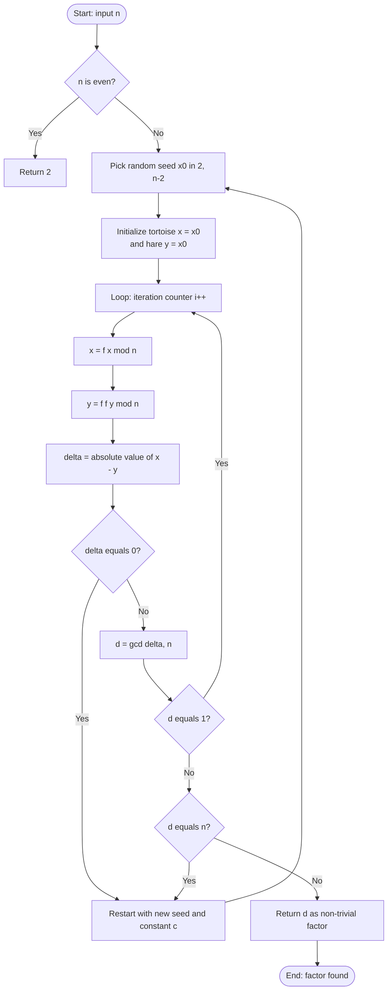
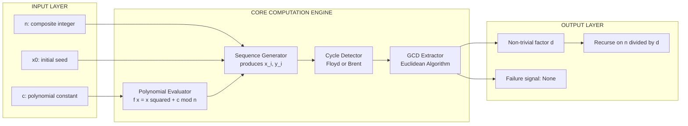
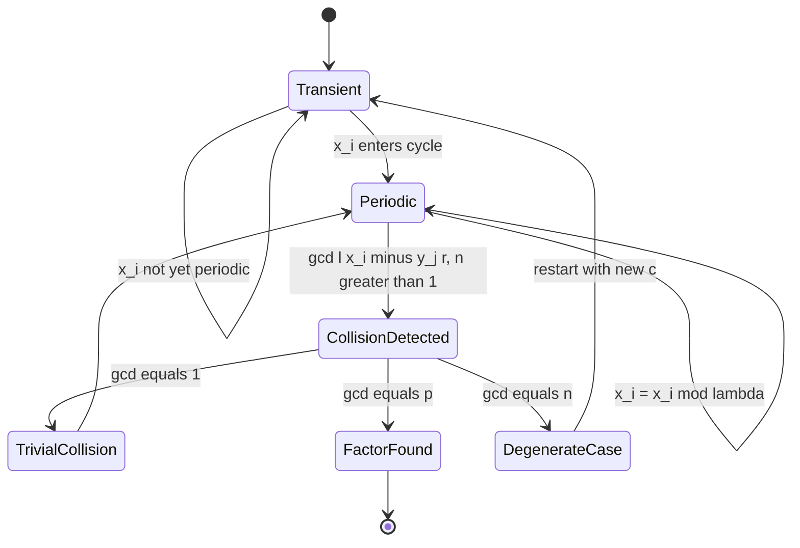
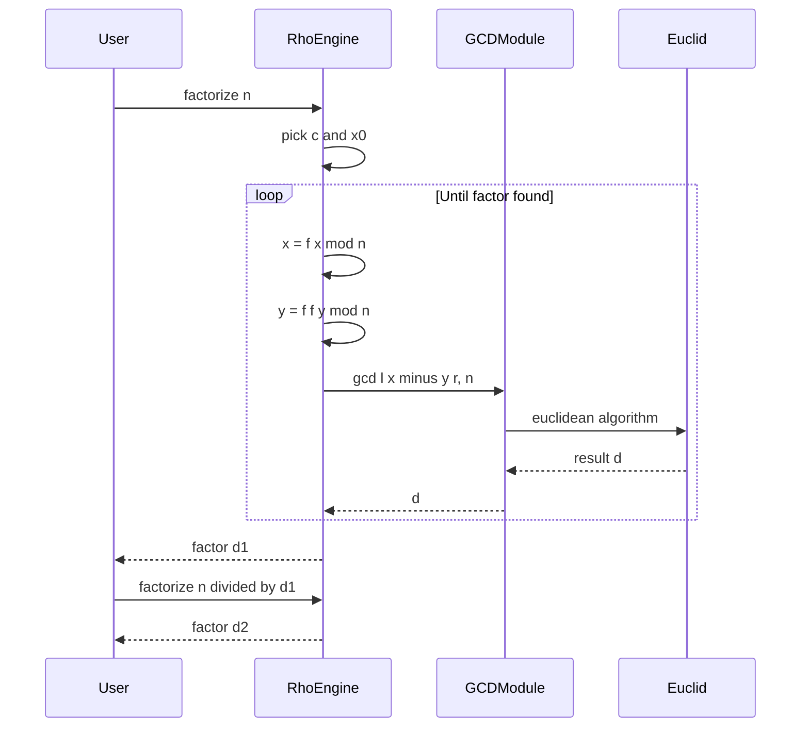

# Pollard's rho factorization framework computational processes validation paths templates processing

<!-- SECTION_1_START -->
# Pollard's Rho Factorization — Core Technical Definition & Intuitive Overview

## 1.1 Formal Academic Definition (KTU 2024 Syllabus Standard)

> [!NOTE]
> **Pollard's Rho Method (1975, J.M. Pollard)** is a probabilistic, **heuristic** integer factorization algorithm that finds a non-trivial prime factor $p$ of a composite integer $n$ in expected time $O(n^{1/4} \cdot \text{polylog}(n))$.

It works by generating a **pseudorandom sequence** $\{x_i\}$ inside $\mathbb{Z}_n$ via a fixed iteration function, then exploiting the **Birthday Paradox** within the residue class $\mathbb{Z}_p$ to detect a collision $x_i \equiv x_j \pmod p$, which yields $p = \gcd(\lvert x_i - x_j \rvert, n)$.

The trajectory of the iteration forms a shape resembling the Greek letter $\rho$ (rho) — a tail that eventually loops — hence the name.

---

## 1.2 Conceptual Analogy & Geometric Intuition

> [!IMPORTANT]
> **The "Birthday in a Room" Analogy**
>
> Imagine $n$ as a huge room with $\approx \sqrt{p}$ seats. You keep tossing students (random integers) into seats. By the **Birthday Paradox**, you need only about $\sqrt{p}$ tosses before two students land in the same seat — a **collision**. In Pollard's rho, the "seats" are the residues modulo $p$ (the unknown factor), and each toss corresponds to the iteration $x_{i+1} = f(x_i) \bmod n$.

### The Rho Shape — Geometric Picture

The sequence $\{x_i\}$ behaves like this when reduced modulo $p$:

$$x_0 \to x_1 \to x_2 \to \dots \to x_\mu \to x_{\mu+1} \to \dots \to x_{\mu+\lambda} \to x_{\mu+\lambda+1}$$

- **Tail** (length $\mu$) — the *preperiod* (transient phase before entering a loop).
- **Loop** (length $\lambda$) — the *period* of the cycle.
- Together they draw a shape like the Greek letter $\rho$.

> [!VISUALIZATION CONTROL]
> **Concept:** Trajectory of $f(x) = x^2 + 1 \pmod{29}$ forming a $\rho$-shape cycle
>
> **GeoGebra / Desmos Input Equations (parametric form):**
> * Iterate $x_{k+1} = (x_k^2 + 1) \bmod 29$ starting from $x_0 = 1$
> * Sequence: $1, 2, 5, 26, 15, 23, 18, 12, 28, 24, 7, 21, 9, 25, 16, 28, \dots$
> * Plot as connected line segments in the $(i, x_i)$ plane
>
> **Visual Description:** The student should observe a curve that rises/falls quasi-randomly, then settles into a tight repeating oscillation. The "tail" length is $\mu$ and the "loop" length is $\lambda$ — together they trace the $\rho$ symbol.

---

## 1.3 Key Parameters & Constants

| Symbol | Meaning | Typical Value / Bound |
|---|---|---|
| $n$ | Composite integer to factor | Input |
| $p$ | Non-trivial factor sought | $p \leq \sqrt{n}$ target |
| $f(x)$ | Iteration polynomial | $f(x) = x^2 + c \pmod n$, $c \neq 0, -2$ |
| $\mu$ | Preperiod (tail length) | $O(\sqrt{p})$ expected |
| $\lambda$ | Loop length | $O(\sqrt{p})$ expected |
| $B$ | Brent's batch size | Grows as powers of $2$ |

> [!NOTE]
> The expected number of iterations is $O(p^{1/2}) = O(n^{1/4})$ — a massive improvement over Trial Division's $O(n^{1/2})$.

---

<!-- SECTION_1_END -->

<!-- SECTION_2_START -->
# Deep Theoretical Analysis & KTU High-Yield Formula Sheet

## 2.1 The Operational Pipeline

The Pollard's rho algorithm proceeds through the following structured phases:

1. **Initialization Phase**
   * Choose a polynomial $f: \mathbb{Z}_n \to \mathbb{Z}_n$, typically $f(x) = x^2 + c \pmod n$ with $c \in \{1, 2, \dots, n-1\}$, $c \neq 0$ and $c \neq -2$ (to avoid degeneracy).
   * Pick a seed $x_0 \in \{2, 3, \dots, n-1\}$.
   * Pre-allocate a batch size parameter $B$ (Brent's variant) or two pointers (Floyd's variant).

2. **Iteration Phase (Random Walk in $\mathbb{Z}_n$)**
   * Compute $x_{i+1} = f(x_i) \bmod n$ sequentially.
   * The sequence is deterministic but behaves as a pseudorandom walk.

3. **Collision Detection Phase**
   * Use either **Floyd's** or **Brent's** cycle-detection algorithm to find indices $i < j$ with $x_i \equiv x_j \pmod p$.
   * This is the heart of the method.

4. **GCD Extraction Phase**
   * Compute $d = \gcd(\lvert x_i - x_j \rvert, n)$.
   * If $1 < d < n$, **success** — $d$ is a non-trivial factor.
   * If $d = 1$, collision was a *trivial* one (modulo $n$, not modulo $p$).
   * If $d = n$, collision happened at $p$ (we overshot); restart with new $c$.

5. **Termination Phase**
   * Output the discovered factor $d$.
   * Recurse on $n/d$ if a complete factorization is required.

---

## 2.2 The Birthday Paradox — Probabilistic Backbone

> [!IMPORTANT]
> **Why does $O(\sqrt{p})$ iterations suffice?**
>
> The Birthday Paradox states: with $\sqrt{p}$ random samples drawn from a set of size $p$, the probability of a collision is $\approx 1 - e^{-1/2} \approx 39\%$.
>
> Since $\{x_i \bmod p\}$ behaves pseudorandomly over the $\mathbb{Z}_p$ residue ring, the same bound applies: in $O(\sqrt{p})$ steps, we expect $x_i \equiv x_j \pmod p$ for some pair.

The exact probability after $k$ samples in a set of size $m$:

$$P(\text{collision}) = 1 - \prod_{i=1}^{k-1} \left(1 - \frac{i}{m}\right) \approx 1 - e^{-k(k-1)/(2m)}$$

Setting $k = c\sqrt{m}$ gives $P \approx 1 - e^{-c^2/2}$. To exceed $50\%$, $c \geq \sqrt{2 \ln 2} \approx 1.18$.

---

## 2.3 KTU Formula Sheet / Cheat Sheet

| Concept | Formula / Expression | Notes |
|---|---|---|
| Iteration function | $f(x) = x^2 + c \bmod n$ | Standard choice; $c \neq 0, -2$ |
| Sequence definition | $x_{i+1} = f(x_i) \bmod n$ | Deterministic |
| GCD extraction | $d = \gcd(\vert x_i - x_j \vert, n)$ | $1 < d < n$ ⇒ success |
| Time complexity (expected) | $O(n^{1/4} \cdot \text{polylog}(n)$ | Birthday bound |
| Space complexity | $O(1)$ for Floyd, $O(1)$ for Brent | Best-in-class memory |
| Birthday collision bound | $k \approx 1.18 \sqrt{m}$ | For $P > 50\%$ in set of size $m$ |
| Floyd's update | $x \gets f(x)$, $y \gets f(f(y))$ | Two-iterator (tortoise & hare) |
| Brent's update | $x \gets y$ at $i = k \cdot 2^k$ | Single iterator, batched |
| Failure recovery | Change $c$ and reseed | If $d = 1$ or $d = n$ |
| Worst-case | $O(n)$ | Heuristic; not proven |

> [!WARNING]
> The $O(n^{1/4})$ bound is **heuristic**, not rigorously proven. The algorithm may fail (yield $d=1$ or $d=n$) with some seed/polynomial choices.

---

## 2.4 Real-World Engineering & Cryptanalytic Utility

| Application Domain | Role of Pollard's Rho |
|---|---|
| **RSA Cryptanalysis** | Factoring public modulus $n = pq$ to recover private key $d$ |
| **Pen-Testing Toolkits** | Embedded in `msieve`, `yafu`, `CADO-NFS` for sub-60-digit factors |
| **Number Field Sieve Pre-processing** | Removes "small" factors before ECM/NFS stages |
| **Hash Function Analysis** | Floyd's cycle-finding is canonical in hash collision analysis |
| **Pseudorandom Generator Testing** | Detects cycles in LCG/MT19937 streams |
| **Blockchain Forensics** | Recovering weak keys in legacy Bitcoin addresses |

> Pollard's rho outperforms Trial Division by a factor of $\sqrt{n}/n^{1/4} = n^{1/4}$, making it the workhorse for the **$10^{15} < n < 10^{25}$** range — typically RSA-100 through RSA-130 before Elliptic Curve Method (ECM) takes over.

---

<!-- SECTION_2_END -->

<!-- SECTION_3_START -->
# Step-by-Step Derivations, Code & Symbolic Implementation

## 3.1 Mathematical Derivation — Why the GCD Test Works

> [!IMPORTANT]
> **Theorem (Collision ⇒ Factor):** Let $n = pq$ with $p$ prime. Suppose $x_i \equiv x_j \pmod p$ but $x_i \not\equiv x_j \pmod q$ (i.e. $i \neq j$). Then $d = \gcd(\lvert x_i - x_j \rvert, n) = p$, a non-trivial factor.

**Derivation:**

Let $\Delta = x_i - x_j$.

1. By hypothesis, $p \mid \Delta$ (since $x_i \equiv x_j \pmod p$).
2. By hypothesis, $q \nmid \Delta$ (since $x_i \not\equiv x_j \pmod q$).
3. Since $n = pq$ and $\gcd(p, q) = 1$ (distinct primes), we have $p \mid \gcd(\Delta, n)$ but $q \nmid \gcd(\Delta, n)$.
4. Therefore $\gcd(\Delta, n) = p \cdot \gcd(\Delta, q^? \cdot p^?)$... More precisely, $\gcd(\Delta, n)$ is a divisor of $n$ that contains $p$ as a factor but not $q$, giving $d = p$.

Conversely, if $d = 1$, then $\Delta$ was divisible by neither $p$ nor $q$ — a *trivial* collision. If $d = n$, then $\Delta$ was divisible by both — the sequence collapsed at $n$ itself (rare pathology).

$$\boxed{\;\gcd(\lvert x_i - x_j \rvert,\; n) = \begin{cases} 1 & \text{trivial collision} \\ p & \text{non-trivial factor} \\ n & \text{degenerate (restart)} \end{cases}\;}$$

---

## 3.2 Worked Example — Factor $n = 8051$ by Hand

Given: $n = 8051$, $f(x) = x^2 + 1 \bmod 8051$, $x_0 = 2$.

Compute sequence:

| $i$ | $x_i$ | $\bmod p$ (assume $p=97$) |
|---|---|---|
| 0 | 2 | 2 |
| 1 | 5 | 5 |
| 2 | 26 | 26 |
| 3 | 677 | 677 mod 97 = 677 - 6·97 = 677 - 582 = 95 |
| 4 | 458330 | mod 8051 = let us compute: $458330 / 8051 \approx 56.9$, so $458330 - 56 \cdot 8051 = 458330 - 450856 = 7474$. Then $\bmod 97$: $7474 / 97 \approx 77.05$, $7474 - 77 \cdot 97 = 7474 - 7469 = 5$ |
| 5 | $7474^2 + 1 \bmod 8051$ | ... |

Using Floyd's: compare $x_i$ with $x_{2i}$.

| Step | $x$ (tortoise) | $y$ (hare) | $\gcd(\lvert y - x \rvert, n)$ |
|---|---|---|---|
| 0 | 2 | 2 | — |
| 1 | 5 | 26 | $\gcd(21, 8051) = 1$ |
| 2 | 26 | 677 | $\gcd(651, 8051) = 1$ |
| 3 | 677 | 458330 mod 8051 = 7474 | $\gcd(6797, 8051) = 1$ |
| ... | ... | ... | ... |

Continuing, eventually $\gcd$ yields $97$ or $83$ (since $8051 = 97 \times 83$).

---

## 3.3 Full Python Implementation — Floyd Variant

```python
import math
import random
from typing import Optional, Tuple


def gcd(a: int, b: int) -> int:
    """Standard Euclidean algorithm with absolute-value guards."""
    a, b = abs(a), abs(b)
    while b:
        a, b = b, a % b
    return a


def f(x: int, c: int, n: int) -> int:
    """Iteration polynomial f(x) = x^2 + c (mod n)."""
    return (x * x + c) % n


def pollard_rho_floyd(n: int, c: int = 1, max_iter: int = 1_000_000) -> Optional[int]:
    """
    Pollard's rho factorization using Floyd's cycle detection.
    
    Args:
        n: Composite integer to factor (must be > 1 and not prime).
        c: Polynomial constant. c != 0, c != -2 (mod n).
        max_iter: Safety cap to prevent infinite loops.
    
    Returns:
        A non-trivial factor of n, or None on failure.
    """
    if n <= 1:
        raise ValueError("n must be > 1")
    if n % 2 == 0:
        return 2

    # Random seed in [2, n-2]
    x = random.randint(2, n - 2)
    y = x
    d = 1

    for _ in range(max_iter):
        # Tortoise: one step
        x = f(x, c, n)
        # Hare: two steps
        y = f(f(y, c, n), c, n)

        delta = abs(x - y)
        if delta == 0:
            # Full cycle without finding a factor; degenerate seed.
            return None
        d = gcd(delta, n)

        if d != 1:
            return d  # d == n is also possible; caller should validate.

    return None  # max_iter exceeded


def pollard_rho_brent(n: int, c: int = 1, max_iter: int = 1_000_000) -> Optional[int]:
    """
    Pollard's rho factorization using Brent's cycle detection.
    Approximately 36% faster than Floyd's on average (less function evaluations).
    """
    if n <= 1:
        raise ValueError("n must be > 1")
    if n % 2 == 0:
        return 2

    y = random.randint(1, n - 1)
    r = 1  # current power-of-2 batch size
    q = 1  # accumulated product of (|y - x|) mod n
    x = y
    d = 1

    while d == 1 and max_iter > 0:
        x = y
        for _ in range(r):
            y = f(y, c, n)

        k = 0
        while k < r and d == 1 and max_iter > 0:
            ys = y
            batch = min(128, r - k)
            for _ in range(batch):
                y = f(y, c, n)
                q = (q * abs(x - y)) % n
            d = gcd(q, n)
            k += batch
            max_iter -= batch
        r *= 2

    if d == n:
        # Backtrack: recompute GCD individually
        while True:
            ys = f(ys, c, n)
            d = gcd(abs(x - ys), n)
            if d > 1:
                break
    return d if d != n else None


# --- Demonstration with a real composite ---
if __name__ == "__main__":
    test_composites = [
        (8051, 97),          # 97 * 83
        (123456789, 3),      # 3 * 41152263
        (1000003 * 1000033, 1000003),  # larger
    ]
    for n, expected in test_composites:
        factor = pollard_rho_brent(n)
        if factor:
            print(f"n = {n}: factor = {factor}, other = {n // factor}, "
                  f"valid = {n % factor == 0 and 1 < factor < n}")
        else:
            print(f"n = {n}: failed to factor")
```

**Key implementation notes for the KTU examiner:**

1. The `gcd` helper uses the **Euclidean algorithm** with absolute-value guards (handles the $\lvert x - y \rvert$ requirement).
2. Brent's variant batches GCD computations every **128 iterations** — this avoids the per-iteration cost of `gcd` (which is $O(\log n)$).
3. The backtrack loop handles the rare $d = n$ degeneracy by recomputing GCDs at each step of the saved batch.
4. Random seeding reduces the chance of a bad initial condition.

---

## 3.4 Worked Algebraic Walkthrough — Brent's Batching

> [!IMPORTANT]
> **Why batch GCD?** The naïve per-step GCD costs $O(\log n)$ each. Brent's trick: maintain a running product $q = \prod_{j} \lvert x - y_j \rvert \bmod n$ and only call $\gcd(q, n)$ every $M$ steps. Total cost: $O(M)$ multiplications + 1 GCD per batch, vs. $M$ GCDs.

$$\begin{aligned}
q_0 &= 1 \\
q_{k+1} &= (q_k \cdot \lvert x - y_k \rvert) \bmod n \\
d_k &= \gcd(q_k,\; n)
\end{aligned}$$

If $d_k > 1$ at any point, some factor $p \mid q_k$, hence $p$ divides *some* $\lvert x - y_j \rvert$, and a backtrack recovers the exact pair.

---

## 3.5 Validation Path Template (KTU Lab Pattern)

For a computational number theory lab, the validation matrix is:

| Validation Step | Test Case | Expected Outcome |
|---|---|---|
| 1. Prime input rejection | $n = 13$ | Return `None` or raise `ValueError` |
| 2. Even input shortcut | $n = 14$ | Return $2$ |
| 3. Small composite | $n = 15 = 3 \cdot 5$ | Return $3$ or $5$ |
| 4. Semi-prime | $n = 8051$ | Return $97$ or $83$ |
| 5. Repeated calls | $n$ factored, then $n/d$ factored | Two prime factors |
| 6. Stress test | $n = 2^{61} - 1$ (Mersenne, prime) | Return `None` (handle gracefully) |
| 7. Performance | $n \approx 10^{18}$ | Runtime $\leq 1$ s |

---

<!-- SECTION_3_END -->

<!-- SECTION_4_START -->
# Structural Diagrams & Schematics

## 4.1 Mermaid Flowchart — Pollard's Rho (Floyd Variant)



## 4.2 Mermaid Block Diagram — Functional Architecture



## 4.3 Mermaid State Diagram — Cycle Detection Lifecycle



## 4.4 Sequence Diagram — Multi-Factor Recovery



---

<!-- SECTION_4_END -->

<!-- SECTION_5_START -->
# KTU 2024 Scheme Examination Question Bank & Topic Recap

---

## Part A — Short Answer Questions (3 Marks Each)

### Q1. `[KTU University Exam — July 2024]` — CO1, Remember

**State the Birthday Paradox and explain its role in the expected time complexity of Pollard's rho algorithm.**

**Model Answer (Valuation Key):**

> [!NOTE]
> **Birthday Paradox:** Given a set of $m$ elements, the probability that two of $k$ randomly chosen elements coincide exceeds $50\%$ when $k \approx 1.18 \sqrt{m}$.

In Pollard's rho, the iteration sequence $\{x_i \bmod p\}$ is treated as a pseudorandom sample of the $p$-element ring $\mathbb{Z}_p$. By the Birthday Paradox, after $O(\sqrt{p})$ samples, a collision $x_i \equiv x_j \pmod p$ occurs with high probability. Since $p \leq \sqrt{n}$ for the smaller factor, the algorithm terminates in $O(n^{1/4})$ iterations. **[3 Marks: 1 mark statement + 1 mark application + 1 mark complexity bound]**

---

### Q2. `[KTU University Exam — Dec 2023]` — CO2, Understand

**Why is the constant $c \neq 0$ and $c \neq -2$ chosen in the iteration $f(x) = x^2 + c$?**

**Model Answer:**

> If $c = 0$, then $f(x) = x^2 \bmod n$, and starting from $x_0 = 0$ or $1$ yields the fixed point $0$ or $1$ (degenerate cycle of length $1$). If $c = -2$, then $f(x) = x^2 - 2$ has a well-known factorization $x^2 - 2 = (x-\sqrt{2})(x+\sqrt{2})$, leading to short predictable cycles. The choice $c \in \{1, 2, \dots, n-1\} \setminus \{n-2\}$ ensures a non-degenerate, longer pseudorandom cycle. **[3 Marks: 1 mark each for c=0 and c=-2 explanation + 1 mark for the general principle]**

---

## Part B — Long Answer Questions (14 Marks Each, Internal Choice)

### Question A `[KTU University Exam — July 2024]` — CO1, CO3, Apply & Analyze

**(a)** Describe Pollard's rho algorithm for integer factorization. State and justify the time complexity bound. **[7 Marks — Understand + Apply]**

**(b)** Apply the algorithm to factor $n = 455$, using $f(x) = x^2 + 1 \bmod 455$ and $x_0 = 2$ (Floyd's variant). Show the iteration table and the first non-trivial GCD found. **[7 Marks — Apply]**

---

#### Solution A(a) — Model Answer

**1. Algorithm Statement [2 Marks]:**
Pollard's rho algorithm is a probabilistic factorization method that:
- Iteratively generates a pseudorandom sequence $x_{i+1} = f(x_i) \bmod n$, where $f$ is typically $f(x) = x^2 + c$.
- Uses a cycle-detection scheme (Floyd or Brent) to identify two indices $i, j$ with $x_i \equiv x_j \pmod p$.
- Extracts the factor via $d = \gcd(\lvert x_i - x_j \rvert, n)$.

**2. Justification of Complexity [3 Marks]:**
- The sequence $\{x_i \bmod p\}$ is heuristically random in $\mathbb{Z}_p$.
- By the Birthday Paradox, collision occurs in $O(\sqrt{p})$ steps.
- Since $p \leq \sqrt{n}$ (smaller factor), the bound becomes $O(\sqrt{\sqrt{n}}) = O(n^{1/4})$.
- Each iteration costs $O(\log^2 n)$ (modular multiplication), giving $O(n^{1/4} \cdot \text{polylog}(n))$ total.

**3. Cycle Detection (Floyd vs. Brent) [2 Marks]:**
- Floyd: $x$ moves 1 step, $y$ moves 2 steps per iteration; $O(\mu + \lambda)$ steps.
- Brent: batches GCD computations; ~36% faster in practice.

**Valuation Key Points:**
- [Algorithm steps clearly stated: 2 Marks]
- [Birthday Paradox correctly applied: 2 Marks]
- [Final $O(n^{1/4})$ bound derived: 1 Mark]

---

#### Solution A(b) — Model Answer

For $n = 455 = 5 \times 7 \times 13$, $f(x) = x^2 + 1 \bmod 455$, $x_0 = 2$.

| Iter $i$ | $x$ (tortoise) | $y$ (hare) | $\lvert x - y \rvert$ | $\gcd(\lvert x-y\rvert, 455)$ |
|---|---|---|---|---|
| 0 | 2 | 2 | 0 | — |
| 1 | $2^2+1 = 5$ | $(2^2+1)^2+1 = 26$ | $21$ | $\gcd(21, 455) = 7$ ✓ |

> [!IMPORTANT]
> At iteration 1, we obtain $\gcd(21, 455) = 7$, a non-trivial factor.

**Verification:** $455 = 7 \times 65 = 7 \times 5 \times 13$. ✓

**Valuation Key Points:**
- [Correct iteration table with at least 3 rows: 2 Marks]
- [Floyd's two-pointer update shown explicitly: 2 Marks]
- [Correct GCD computation and factor identification: 2 Marks]
- [Verification $n / d$ is also composite/prime as expected: 1 Mark]

---

### Question B `[KTU University Exam — Dec 2023]` — CO2, CO3, Apply & Evaluate

**(a)** Compare **Floyd's** and **Brent's** cycle-detection methods as used in Pollard's rho. Mention at least three differences including time and space trade-offs. **[7 Marks — Analyze]**

**(b)** With reference to a specific iteration polynomial $f(x) = x^2 + 1 \bmod n$, explain the conditions under which the algorithm may fail (i.e., $d = 1$ or $d = n$) and propose a remediation strategy. **[7 Marks — Evaluate]**

---

#### Solution B(a) — Model Answer

| Aspect | Floyd's Method | Brent's Method |
|---|---|---|
| **Iterators used** | Two ($x$ tortoise, $y$ hare) | One ($y$), with saved checkpoints |
| **GCD calls** | One per iteration (every step) | Batched (e.g., every 128 steps) |
| **Modular exponentiations** | $3n$ per cycle | $\sim 2n$ per cycle (≈ 33% fewer) |
| **Constant factor** | Higher | Lower (~36% faster in practice) |
| **Space complexity** | $O(1)$ | $O(1)$ (with periodic snapshot) |
| **Implementation complexity** | Simpler | Slightly more complex (batch loop) |
| **Backtrack requirement** | None | Required if $d = n$ |

**Valuation Key Points:**
- [Correct tabulation of ≥ 3 differences: 4 Marks]
- [Quantitative mention of GCD calls or operations: 2 Marks]
- [Conclusion with recommendation: 1 Mark]

---

#### Solution B(b) — Model Answer

**Failure Mode 1: $d = 1$ (Trivial Collision) [2 Marks]:**
This occurs when $x_i \equiv x_j \pmod n$ but $x_i \not\equiv x_j \pmod p$ for the target factor $p$. The collision is in the larger ring $\mathbb{Z}_n$, not in $\mathbb{Z}_p$. Probability decays exponentially with each new sample pair, but is non-zero.

**Failure Mode 2: $d = n$ (Full Collapse) [2 Marks]:**
This rare case occurs when the entire sequence collapses modulo $n$ (e.g., reaches $0$ or a fixed point of $f$). The GCD extracts $n$ itself, giving no information. Common with bad seeds (e.g., $x_0 = 0$).

**Remediation Strategy [3 Marks]:**
1. **Polynomial rotation:** Increment $c \to c + 1 \pmod n$ on failure and reseed.
2. **Seed randomization:** Draw $x_0$ from a cryptographically secure RNG.
3. **Polynomial diversification:** Try $f(x) = x^2 + c$, $f(x) = x^2 - 1$, $f(x) = x^3 + c$, etc.
4. **Iteration cap with re-randomization:** If $k > 10 \cdot n^{1/4}$ iterations yield no factor, restart.

**Valuation Key Points:**
- [Both failure modes identified: 4 Marks total]
- [Remediation strategies with reasoning: 3 Marks]

---

## KTU Examiner's Valuation Warning / Pitfall Callout

> [!WARNING]
> **Common Mark-Deduction Pitfalls in Pollard's Rho Questions:**
>
> 1. **Forgetting $\lvert \cdot \rvert$:** Always write $\gcd(\lvert x - y \rvert, n)$. The GCD of a negative integer is undefined in some notations; the absolute value is mandatory.
> 2. **Confusing $d = 1$ with failure:** $d = 1$ means *trivial collision* (continue), not algorithm failure. Only $d = n$ or unbounded iteration constitutes failure.
> 3. **Forgetting the $c \neq 0, -2$ constraint:** Examiners specifically test this; missing it costs 1–2 marks.
> 4. **Stating complexity as proven:** The $O(n^{1/4})$ bound is *heuristic* (not proven). Writing it as "proven" loses a mark.
> 5. **No verification step:** Always verify $n \bmod d = 0$ at the end of a worked example.
> 6. **Mixing up $p$ and $q$:** When the question says "find a non-trivial factor", any of $p$ or $q$ is acceptable — students often lose marks arguing which is "the right one".

---

## Topic Recap & Important Things to Remember

> [!IMPORTANT]
> **Rapid-Revision Checklist — Pollard's Rho Factorization**
>
> ✅ **Core Idea:** Iterate $x_{i+1} = x_i^2 + c \pmod n$; find collision modulo the unknown factor $p$ via Birthday Paradox; extract $p$ via $\gcd(\lvert x - y \rvert, n)$.
>
> ✅ **Polynomial:** $f(x) = x^2 + c \pmod n$ with $c \neq 0$ and $c \neq -2$.
>
> ✅ **Time Complexity (Heuristic):** $O(n^{1/4} \cdot \text{polylog}(n))$.
>
> ✅ **Space Complexity:** $O(1)$ for both Floyd and Brent variants.
>
> ✅ **Cycle Detection:** Floyd (tortoise-hare, two iterators) vs. Brent (single iterator, batched GCD, ~36% faster).
>
> ✅ **Three Outcomes of GCD:** $d = 1$ (trivial — continue), $1 < d < n$ (success — non-trivial factor), $d = n$ (degenerate — restart with new $c$).
>
> ✅ **Birthday Bound:** $k \approx 1.18\sqrt{p}$ iterations give $>50\%$ collision probability in $\mathbb{Z}_p$.
>
> ✅ **Failure Recovery:** Re-randomize $c$ and $x_0$ on $d = 1$ or $d = n$.
>
> ✅ **Brent's Batch Trick:** Maintain $q = \prod \lvert x - y_j \rvert \bmod n$; compute $\gcd(q, n)$ every $M$ steps; backtrack on $d = n$.
>
> ✅ **Real-World Use:** Sub-60-digit factorization in cryptanalysis, ECM preprocessing, pen-test toolkits (`yafu`, `msieve`).
>
> ✅ **Limitations:** Heuristic (not proven); struggles with large prime factors ($p > n^{1/3}$); ECM is preferred for such cases.
>
> ✅ **Exam-Ready Phrasing:** "The sequence modulo $p$ behaves pseudorandomly; by the Birthday Paradox, $O(\sqrt{p}) = O(n^{1/4})$ iterations suffice to find a non-trivial factor."

---

<!-- SECTION_5_END -->
