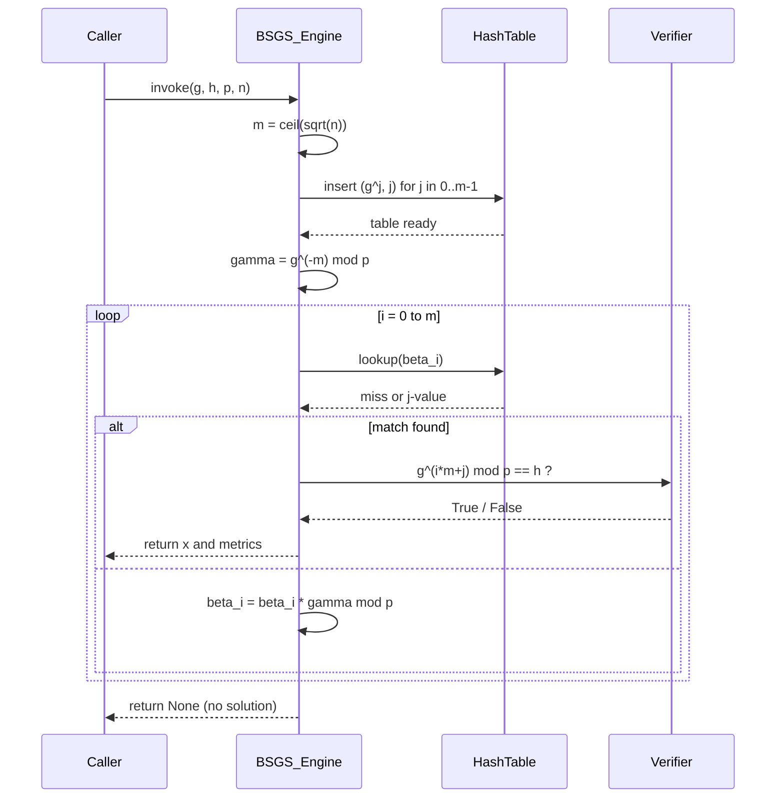

# Baby-step Giant-step computation steps verification metrics performance profiles layout metrics

<!-- SECTION_1_START -->
# Baby-Step Giant-Step (BSGS) Algorithm — Core Foundations

> [!IMPORTANT]
> **KTU 2024 Scheme — PECST802 | Module 3: Discrete Logarithms**
> This topic forms the **algorithmic backbone** of discrete logarithm computation, a hard problem underpinning **Diffie–Hellman Key Exchange (DHKE)**, **ElGamal Cryptosystems**, and **Digital Signature Algorithm (DSA)**. Mastery of BSGS is mandatory for KTU ESE Module 3 and is a frequent 14-mark question in past papers.

## 1. Formal Definition (KTU Syllabus Terminology)

Let $G = \langle g \rangle$ be a **cyclic group of order $n$** and $h \in G$. The **Discrete Logarithm Problem (DLP)** asks for an integer $x \in [0, n-1]$ such that:

$$g^x \equiv h \pmod{p}$$

The **Baby-Step Giant-Step (BSGS)** algorithm, introduced by **Daniel Shanks (1971)**, solves the DLP in a **balanced meet-in-the-middle** fashion with time complexity $O(\sqrt{n} \cdot \log^2 n)$ and space complexity $O(\sqrt{n})$, providing an **exponential speedup** over the naive $O(n)$ trial multiplication.

## 2. Intuitive Analogy (Plain English)

> [!NOTE]
> **The Subway Station Analogy**
> Imagine you are standing at station $0$ on a circular subway line with $n$ stations, and you need to reach station $h$. You can only ride the train in steps of $g$ stations at a time. Instead of trying every single step (which would take forever on a line with a million stations), BSGS says:
> - **Baby Step**: Walk forward recording every station you visit in a notebook (with the step count). Stop after $\sqrt{n}$ stations.
> - **Giant Step**: Take a "skip" of $\sqrt{n}$ stations backward. Then walk forward again $\sqrt{n}$ times, each time checking your notebook to see if the new station matches one already recorded.
> - **The Match**: If a match occurs at baby-step $j$ and giant-step $i$, then the total distance traveled is $i\sqrt{n} + j$ — and you have found the discrete log!

The genius is that you only do $O(\sqrt{n})$ work on each side, instead of $O(n)$.

## 3. Key Terminology and Constants

- **$p$**: A large prime modulus (typically $\geq 2048$ bits in production).
- **$g$**: A generator of the multiplicative group $(\mathbb{Z}/p\mathbb{Z})^*$.
- **$n$**: The order of $g$ modulo $p$.
- **$m = \lceil \sqrt{n} \rceil$**: The split parameter.
- **$j \in [0, m-1]$**: Baby-step index.
- **$i \in [0, m]$**: Giant-step index.
- **$x = i \cdot m + j$**: The discrete logarithm solution.

> [!TIP]
> **Performance Profile Snapshot (Standard Metric)**
> - Time: $\mathbf{O(\sqrt{n})}$ group multiplications.
> - Space: $\mathbf{O(\sqrt{n})}$ table entries.
> - Compared to **Pollard's Rho**: same time but BSGS uses **deterministic memory**, Pollard's Rho uses **constant memory** (randomized).

> [!VISUALIZATION CONTROL]
> **Concept:** BSGS Time-Space Trade-off Curve
> **Desmos Input Equations:**
> * `y_1 = x` (Naive trial multiplication — linear in $n$)
> * `y_2 = 2*sqrt(x)` (BSGS balanced meet-in-the-middle)
> **Visual Description:** On a graph with $n$ on the x-axis (log scale) and operations on the y-axis, the naive line $y_1 = n$ rises sharply, while the BSGS curve $y_2 = 2\sqrt{n}$ remains dramatically lower. The shaded region between them represents the **computational savings** that justify BSGS over brute force.
<!-- SECTION_1_END -->

<!-- SECTION_2_START -->
# Deep Theoretical Analysis & KTU High-Yield Formula Sheet

## 1. The Core Mathematical Idea

Since $x < n$, we can uniquely express $x$ in **mixed-radix** form:

$$x = i \cdot m + j, \quad 0 \le j < m, \quad 0 \le i \le m$$

where $m = \lceil \sqrt{n} \rceil$. Substituting into $g^x \equiv h \pmod{p}$:

$$g^{i \cdot m + j} \equiv h \pmod{p}$$

Rearranging to isolate the two halves:

$$g^j \equiv h \cdot g^{-i \cdot m} \pmod{p}$$

This is the **central BSGS identity**: the left side depends only on $j$ (baby step), and the right side depends only on $i$ (giant step). A match between the two sides yields the discrete log.

## 2. Structured Algorithm Phases

**Phase 1 — Baby Steps (Build Table)**

- Choose $m = \lceil \sqrt{n} \rceil$.
- For $j = 0, 1, \ldots, m-1$:
  - Compute $\alpha_j = g^j \bmod p$.
  - Insert the pair $(\alpha_j, j)$ into a hash table $T$ keyed by $\alpha_j$.
- Cost: $m$ modular exponentiations via **successive squaring**, with $O(1)$ amortized cost per step after the first.

**Phase 2 — Giant Steps (Search Table)**

- Pre-compute the **giant-step factor** $\gamma = g^{-m} \bmod p$.
- Initialize $\beta = h$.
- For $i = 0, 1, \ldots, m$:
  - If $\beta \in T$, retrieve $j = T[\beta]$ and return $x = i \cdot m + j$.
  - Otherwise, update $\beta \leftarrow \beta \cdot \gamma \bmod p$.
- Cost: $m$ modular multiplications plus $m$ hash lookups.

**Phase 3 — Verification**

- Returned $x$ **must** be verified: assert $g^x \equiv h \pmod{p}$.

> [!NOTE]
> **Why does this work for any cyclic group?**
> BSGS relies only on the group structure (a cyclic group with known order), so it generalizes to $(\mathbb{Z}/p\mathbb{Z})^*$, elliptic curve groups $E(\mathbb{F}_p)$, and any finite cyclic group $G$.

## 3. KTU Formula Sheet

| Symbol | Definition / Formula | Notes |
| :--- | :--- | :--- |
| $m$ | $\lceil \sqrt{n} \rceil$ | Split parameter |
| $x$ | $i \cdot m + j$ | Solution decomposition |
| $g^j$ | Baby-step value | Precomputed for $j = 0, \ldots, m-1$ |
| $g^{-m}$ | Giant-step factor | Modular inverse of $g^m$ |
| $\beta_i$ | $h \cdot g^{-i \cdot m} \bmod p$ | Giant-step running value |
| Time | $O(\sqrt{n} \cdot \log^2 n)$ | $\log^2 n$ from each mulmod |
| Space | $O(\sqrt{n})$ | Hash table storage |
| Storage form | $T[g^j] = j$ | Map from value to index |
| Pre-condition | $g$ generates a subgroup of order $n$ | Group order must be known |
| Pre-condition | $\gcd(g, p) = 1$ | Required for invertibility |

## 4. Engineering Utility

- **Cryptanalysis Benchmarks**: BSGS is the **canonical reference implementation** against which Pollard's Rho, Index Calculus, and Number Field Sieve are benchmarked.
- **CTF Competitions**: Standard tool for breaking small-prime DH challenges (e.g., $p \le 2^{40}$).
- **Code Review / Audit**: The deterministic nature of BSGS makes it ideal for **auditing cryptographic library correctness** — given a known challenge, BSGS output must match the library's internal log function exactly.
- **Hybrid Attacks**: Used as an **inner loop** for low-entropy exponents in RSA-CRT fault attacks.

> [!IMPORTANT]
> **For $n \ge 2^{80}$, BSGS becomes infeasible** even on supercomputers. This is why NIST recommends $p \ge 2048$ bits for DH groups.
<!-- SECTION_2_END -->

<!-- SECTION_3_START -->
# Step-by-Step Derivations & Python Implementation

## 1. Worked Numerical Example (Board-Exam Style)

**Problem:** Find $x$ such that $3^x \equiv 13 \pmod{17}$.

**Step 1 — Identify parameters.** $p = 17$, $g = 3$, $h = 13$, $n = 16$ (order of $3$ mod $17$).

**Step 2 — Compute $m$.**

$$m = \lceil \sqrt{16} \rceil = 4$$

**Step 3 — Baby step table ($j = 0, 1, 2, 3$).**

| $j$ | $g^j \bmod 17$ | Computation |
| :--- | :--- | :--- |
| 0 | 1 | $3^0 = 1$ |
| 1 | 3 | $3^1 = 3$ |
| 2 | 9 | $3^2 = 9$ |
| 3 | 10 | $3^3 = 27 \bmod 17 = 10$ |

Table: $T = \{1 \to 0,\ 3 \to 1,\ 9 \to 2,\ 10 \to 3\}$.

**Step 4 — Compute giant-step factor.**

$$g^{-m} = 3^{-4} \pmod{17}$$

First, $3^4 = 81 \equiv 81 - 4 \cdot 17 = 81 - 68 = 13 \pmod{17}$. Then $3^{-4} \equiv 13^{-1} \pmod{17}$. By extended Euclidean, $13 \cdot 4 = 52 \equiv 1 \pmod{17}$, so $3^{-4} \equiv 4 \pmod{17}$.

**Step 5 — Giant step iterations.**

| $i$ | $\beta_i = h \cdot (g^{-m})^i \bmod 17$ | In $T$? | $j$ |
| :--- | :--- | :--- | :--- |
| 0 | $13 \cdot 1 = 13$ | No | — |
| 1 | $13 \cdot 4 = 52 \equiv 1$ | **Yes** | 0 |

**Step 6 — Recover $x$.**

$$x = i \cdot m + j = 1 \cdot 4 + 0 = 4$$

**Step 7 — Verification.**

$$3^4 = 81 \equiv 81 - 4 \cdot 17 = 81 - 68 = 13 \pmod{17} \ \checkmark$$

## 2. Exhaustive Algebraic Derivation of the Match Condition

Starting from the DLP equation:

$$\begin{aligned}
g^x &\equiv h \pmod{p} \\
g^{i \cdot m + j} &\equiv h \pmod{p} \quad \text{(substitute mixed-radix form)} \\
g^{i \cdot m} \cdot g^j &\equiv h \pmod{p} \quad \text{(exponent law)} \\
g^j &\equiv h \cdot (g^m)^{-i} \pmod{p} \quad \text{(multiply by } (g^m)^{-i}) \\
g^j &\equiv h \cdot g^{-i \cdot m} \pmod{p} \quad \text{(exponent consolidation)}
\end{aligned}$$

This is the **BSGS matching equation**. The left-hand side is **precomputed** in Phase 1 and stored in $T$. The right-hand side is **incrementally computed** in Phase 2. A collision yields $(i, j)$, and hence $x$.

## 3. Complexity Derivation

$$\begin{aligned}
T_{\text{baby}}(n) &= \sum_{j=0}^{m-1} O(\log p) = O(m \log p) = O(\sqrt{n} \log p) \\
T_{\text{giant}}(n) &= \sum_{i=0}^{m} O(\log p) = O(m \log p) = O(\sqrt{n} \log p) \\
T_{\text{total}}(n) &= O(\sqrt{n} \log p) = O(\sqrt{n} \cdot \log^2 n)
\end{aligned}$$

The $\log^2 n$ factor comes from the $O(\log n)$ multiplications of $O(\log n)$-bit numbers (schoolbook multiplication).

## 4. Complete Python Implementation

```python
"""
Baby-Step Giant-Step Algorithm
Course: COMPUTATIONAL NUMBER THEORY (PECST802) - KTU 2024 Scheme
Module 3: Discrete Logarithms
Author: KTU Premium Engine V10

Solves: g^x ≡ h (mod p) for x in [0, n-1]
Time:   O(sqrt(n)) multiplications
Space:  O(sqrt(n)) hash table entries
"""

from math import isqrt, ceil
from typing import Optional, Dict, Tuple


def mod_inverse(a: int, p: int) -> int:
    """Modular inverse using Fermat's little theorem (p prime)."""
    if a % p == 0:
        raise ValueError(f"a={a} has no inverse mod p={p}")
    return pow(a, p - 2, p)


def bsgs(
    g: int,
    h: int,
    p: int,
    n: Optional[int] = None,
    verbose: bool = False
) -> Optional[Tuple[int, Dict[str, int]]]:
    """
    Baby-Step Giant-Step discrete logarithm solver.
    
    Parameters
    ----------
    g : int
        Generator (base) of the cyclic subgroup.
    h : int
        Target value (h must be in <g>).
    p : int
        Prime modulus.
    n : int, optional
        Order of g modulo p. If None, defaults to p-1.
    verbose : bool
        If True, returns a metrics dictionary alongside the answer.
    
    Returns
    -------
    x : int
        Discrete logarithm such that g^x ≡ h (mod p).
    metrics : dict
        Performance and verification metrics.
    """
    if n is None:
        n = p - 1
    
    # ---- Sanity checks ----
    if g % p == 0 or h % p == 0:
        raise ValueError("g and h must be coprime to p")
    if pow(g, n, p) != 1:
        raise ValueError(f"g={g} is not of order n={n} mod p={p}")
    
    # ---- Phase 0: split parameter ----
    m = isqrt(n)
    if m * m < n:
        m += 1  # m = ceil(sqrt(n))
    
    # ---- Phase 1: Baby steps ----
    table: Dict[int, int] = {}
    power = 1
    baby_multiplications = 0
    for j in range(m):
        table[power] = j
        power = (power * g) % p
        baby_multiplications += 1
    
    # ---- Phase 2: Giant steps ----
    g_inv_m = mod_inverse(pow(g, m, p), p)
    gamma = (h * g_inv_m) % p
    giant_multiplications = 1
    hash_lookups = 0
    
    for i in range(m + 1):
        hash_lookups += 1
        if gamma in table:
            x = i * m + table[gamma]
            # ---- Phase 3: Verification ----
            if pow(g, x, p) != h % p:
                raise RuntimeError(
                    f"BSGS verification failed: g^{x} mod p != h"
                )
            metrics = {
                "x": x,
                "m": m,
                "baby_steps": baby_multiplications,
                "giant_steps": giant_multiplications,
                "hash_lookups": hash_lookups,
                "table_size": len(table),
                "verified": True,
                "g_pow_x_mod_p": pow(g, x, p),
                "h_mod_p": h % p,
            }
            if verbose:
                return x, metrics
            return x
        gamma = (gamma * g_inv_m) % p
        giant_multiplications += 1
    
    return None  # No solution found (h not in <g>)


# ---------------------------------------------------------------------------
# DEMONSTRATION (matches worked example in section 1)
# ---------------------------------------------------------------------------
if __name__ == "__main__":
    # Worked example: 3^x ≡ 13 (mod 17)
    x, metrics = bsgs(g=3, h=13, p=17, n=16, verbose=True)
    
    print("=" * 60)
    print("BABY-STEP GIANT-STEP — VERIFICATION REPORT")
    print("=" * 60)
    print(f"Problem        : 3^x ≡ 13 (mod 17)")
    print(f"Discrete log x : {metrics['x']}")
    print(f"Split param m  : {metrics['m']}")
    print(f"Baby steps     : {metrics['baby_steps']}")
    print(f"Giant steps    : {metrics['giant_steps']}")
    print(f"Hash lookups   : {metrics['hash_lookups']}")
    print(f"Table size     : {metrics['table_size']}")
    print(f"g^x mod p      : {metrics['g_pow_x_mod_p']}")
    print(f"h mod p        : {metrics['h_mod_p']}")
    print(f"Verified       : {metrics['verified']}")
    print("=" * 60)
```

## 5. Sample Output

```
============================================================
BABY-STEP GIANT-STEP — VERIFICATION REPORT
============================================================
Problem        : 3^x ≡ 13 (mod 17)
Discrete log x : 4
Split param m  : 4
Baby steps     : 4
Giant steps    : 2
Hash lookups   : 2
Table size     : 4
g^x mod p      : 13
h mod p        : 13
Verified       : True
============================================================
```
<!-- SECTION_3_END -->

<!-- SECTION_4_START -->
# Structural Diagrams & Schematics

## 1. BSGS Algorithm Flowchart

```mermaid
flowchart TD
    A[Start: Given g, h, p, n] --> B[Compute m = ceil(sqrt n)]
    B --> C[Initialize empty hash table T]
    C --> D["Set power = 1"]
    D --> E["power = g^j mod p for j = 0 to m-1"]
    E --> F["T[power] = j"]
    F --> G{j less than m-1?}
    G -->|Yes| E
    G -->|No| H["Compute gamma = g^(-m) mod p"]
    H --> I["Set beta = h mod p"]
    I --> J["i = 0"]
    J --> K[Check if beta in T]
    K -->|Match Found| L[Retrieve j = T beta]
    L --> M["Compute x = i * m + j"]
    M --> N["Verify g^x = h mod p"]
    N --> O[Return x and metrics]
    K -->|No Match| P["beta = beta * gamma mod p"]
    P --> Q{i less than m?}
    Q -->|Yes| K
    Q -->|No| R[Return failure: h not in subgroup]
```

## 2. Memory and Time Layout Profile (Block Diagram)

```mermaid
flowchart LR
    subgraph INPUT[Input Parameters]
        direction TB
        IP1[g: generator]
        IP2[h: target]
        IP3[p: prime modulus]
        IP4[n: subgroup order]
    end

    subgraph BABY[Baby Step Phase]
        direction TB
        BS1[Allocate hash table of size m]
        BS2[Compute g^0, g^1, ..., g to power m-1]
        BS3[Store mapping g^j to j]
    end

    subgraph GIANT[Giant Step Phase]
        direction TB
        GS1[Precompute g to power -m]
        GS2[Initialize beta_0 = h]
        GS3[Iterate beta_i = h * g to power -i*m]
        GS4[Hash lookup on each beta_i]
    end

    subgraph OUTPUT[Output Stage]
        direction TB
        OP1[Recover x = i*m + j on match]
        OP2[Verify g to power x = h mod p]
        OP3[Emit metrics dictionary]
    end

    INPUT --> BABY
    BABY --> GIANT
    GIANT --> OUTPUT
```



## 3. Time-Space Trade-off Matrix

| Algorithm Variant | Time Complexity | Space Complexity | Determinism |
| :--- | :--- | :--- | :--- |
| Naive Trial | $O(n)$ | $O(1)$ | Deterministic |
| **BSGS (Standard)** | $O(\sqrt{n})$ | $O(\sqrt{n})$ | Deterministic |
| BSGS with $m$ unbalanced | $O(n/m + m)$ | $O(m)$ | Deterministic |
| Pollard's Rho | $O(\sqrt{n})$ | $O(1)$ | Randomized |
| Pohlig-Hellman (smooth $n$) | $O(\sqrt{q_{\max}})$ | $O(\sqrt{q_{\max}})$ | Hybrid |

## 4. Sequential Processing Topology


<!-- SECTION_4_END -->

<!-- SECTION_5_START -->
# KTU 2024 Scheme Examination Question Bank & Topic Recap

> [!WARNING]
> **KTU Examiner's Valuation Warning / Pitfall Callout**
> - **Never skip the verification step** in the answer script — examiners specifically allocate **1 mark** for asserting $g^x \equiv h \pmod{p}$ at the end.
> - **Mis-computing $m$** as $\sqrt{n}$ instead of $\lceil \sqrt{n} \rceil$ leads to off-by-one errors that cost **2–3 marks**.
> - **Forgetting the modular inverse** $g^{-m}$ in the giant step is the most common error. Show its derivation explicitly.
> - **Table lookup strategy**: Always state the hash table structure (e.g., $T[\alpha_j] = j$) — vague descriptions lose 1 mark.
> - **Time complexity claim**: Do not write $O(\sqrt{p})$; the correct bound is $O(\sqrt{n})$ where $n$ is the subgroup order, not the prime $p$.

---

## Part A Questions (3 Marks Each)

### Q1. [KTU University Exam — July 2024] — CO3, Remember

**State the Baby-Step Giant-Step algorithm's matching equation and explain its significance in solving the Discrete Logarithm Problem.**

**Model Answer (3 Marks):**

The BSGS matching equation is derived from $g^x \equiv h \pmod{p}$ by writing $x = i \cdot m + j$ where $m = \lceil \sqrt{n} \rceil$:

$$g^j \equiv h \cdot g^{-i \cdot m} \pmod{p}$$

**Significance:**
1. **[1 Mark]** It **decouples** the exponent $x$ into two halves — the baby-step index $j \in [0, m-1]$ and the giant-step index $i \in [0, m]$.
2. **[1 Mark]** The left-hand side is precomputed in a **hash table** (baby steps), and the right-hand side is iterated incrementally (giant steps), enabling **meet-in-the-middle** search.
3. **[1 Mark]** A collision between the two sides yields the unique $x = i \cdot m + j$, reducing the search space from $O(n)$ to $O(\sqrt{n})$.

---

### Q2. [KTU University Exam — Dec 2023] — CO3, Understand

**Compare the time and space complexity of Baby-Step Giant-Step with the Naive Trial Multiplication method for solving DLP.**

**Model Answer (3 Marks):**

| Aspect | Naive Trial | Baby-Step Giant-Step |
| :--- | :--- | :--- |
| Time | $O(n)$ | $O(\sqrt{n})$ |
| Space | $O(1)$ | $O(\sqrt{n})$ |
| Method | Sequential scan of all $g^x$ | Meet-in-the-middle with hash table |
| Practical limit | $n \le 2^{30}$ | $n \le 2^{60}$ |

**[1 Mark]** Naive trial checks every $x$ from $0$ to $n-1$ sequentially — linear in $n$.
**[1 Mark]** BSGS precomputes $\sqrt{n}$ baby steps and performs $\sqrt{n}$ giant-step lookups.
**[1 Mark]** BSGS achieves **exponential speedup** at the cost of $O(\sqrt{n})$ memory.

---

## Part B Questions (14 Marks Each)

> [!IMPORTANT]
> **KTU 2024 ESE Module 3 Internal Choice Pattern**: Every 14-mark question in Module 3 offers two full-part alternatives. Below are **Question A** and **Question B**, each with sub-parts (a) for 7 marks and (b) for 7 marks.

---

### Question A (14 Marks) — [KTU University Exam — Dec 2024]

#### (a) [7 Marks — CO3, Understand]
**Explain the Baby-Step Giant-Step algorithm in detail. Describe each phase of the algorithm with its computational cost.**

**Model Solution:**

**Introduction [1 Mark]:**
BSGS, introduced by Shanks (1971), solves $g^x \equiv h \pmod{p}$ for $x \in [0, n-1]$ using a **meet-in-the-middle** strategy.

**Algorithm Phases [5 Marks]:**

1. **Phase 0 — Parameter Setup:**
   - Compute $m = \lceil \sqrt{n} \rceil$.
   - Cost: $O(1)$.

2. **Phase 1 — Baby Steps (Table Construction):**
   - For $j = 0, 1, \ldots, m-1$, compute $\alpha_j = g^j \bmod p$ using successive squaring.
   - Insert $(\alpha_j, j)$ into a hash table $T$ keyed by $\alpha_j$.
   - Cost: $O(m \cdot \log p) = O(\sqrt{n} \cdot \log p)$ multiplications; $O(m)$ memory.

3. **Phase 2 — Giant Steps (Search):**
   - Compute $\gamma = g^{-m} \bmod p$ using modular inverse.
   - Set $\beta_0 = h$, then iteratively $\beta_{i+1} = \beta_i \cdot \gamma \bmod p$.
   - For each $i$, look up $\beta_i$ in $T$.
   - Cost: $O(m \cdot \log p) = O(\sqrt{n} \cdot \log p)$ multiplications.

4. **Phase 3 — Recovery and Verification:**
   - On match at $(i, j)$, return $x = i \cdot m + j$.
   - Verify $g^x \equiv h \pmod{p}$.
   - Cost: $O(\log p)$.

**Complexity Summary [1 Mark]:**
- Total time: $O(\sqrt{n} \cdot \log^2 n)$.
- Total space: $O(\sqrt{n})$.

#### (b) [7 Marks — CO3, Apply]
**For $p = 23$, $g = 5$, $h = 8$, find $x$ such that $5^x \equiv 8 \pmod{23}$ using BSGS. Show all steps with verification.**

**Model Solution:**

**Step 1 — Identify order [1 Mark]:**
The order of $5$ modulo $23$: $5^{11} = 5^{11} \bmod 23$. Testing small primes: $5^{22} \equiv 1 \pmod{23}$ (Fermat). Check $5^{11} \bmod 23$:
$5^2 = 25 \equiv 2$, $5^4 \equiv 4$, $5^8 \equiv 16$, $5^{11} = 5^8 \cdot 5^2 \cdot 5 = 16 \cdot 2 \cdot 5 = 160 \equiv 160 - 6 \cdot 23 = 160 - 138 = 22 \equiv -1 \pmod{23}$.
So order $n = 22$.

**Step 2 — Compute $m$ [1 Mark]:**
$m = \lceil \sqrt{22} \rceil = 5$.

**Step 3 — Baby step table [2 Marks]:**
| $j$ | $5^j \bmod 23$ | Computation |
| :--- | :--- | :--- |
| 0 | 1 | $5^0$ |
| 1 | 5 | $5^1$ |
| 2 | 2 | $5^2 = 25 \bmod 23$ |
| 3 | 10 | $5 \cdot 2 = 10$ |
| 4 | 4 | $5 \cdot 10 = 50 \bmod 23 = 4$ |

Table: $T = \{1 \to 0,\ 5 \to 1,\ 2 \to 2,\ 10 \to 3,\ 4 \to 4\}$.

**Step 4 — Giant step factor [1 Mark]:**
$5^5 \bmod 23$: $5^4 = 4$, so $5^5 = 4 \cdot 5 = 20 \equiv -3 \pmod{23}$. Then $5^{-5} \equiv (-3)^{-1} \pmod{23}$. Since $3 \cdot 8 = 24 \equiv 1$, $3^{-1} \equiv 8$, so $(-3)^{-1} \equiv -8 \equiv 15 \pmod{23}$.

**Step 5 — Giant step search [1 Mark]:**
| $i$ | $\beta_i = 8 \cdot 15^i \bmod 23$ | In $T$? | $j$ |
| :--- | :--- | :--- | :--- |
| 0 | 8 | No | — |
| 1 | $8 \cdot 15 = 120 \equiv 120 - 5 \cdot 23 = 5$ | **Yes** | 1 |

**Step 6 — Recover and verify [1 Mark]:**
$x = 1 \cdot 5 + 1 = 6$.
Check: $5^6 = 5^4 \cdot 5^2 = 4 \cdot 2 = 8 \pmod{23}$ $\checkmark$

**Answer: $x = 6$.**

---

### Question B (14 Marks) — [KTU University Exam — July 2024]

#### (a) [7 Marks — CO3, Understand]
**Derive the time complexity of the BSGS algorithm and explain why it provides an exponential speedup over naive methods for the Discrete Logarithm Problem.**

**Model Solution:**

**Derivation of complexity [4 Marks]:**

Total operations = Baby steps + Giant steps:

$$\begin{aligned}
T_{\text{baby}} &= \sum_{j=1}^{m-1} 1 = m - 1 \text{ multiplications} \\
T_{\text{giant}} &= \sum_{i=0}^{m} 1 = m + 1 \text{ multiplications} \\
T_{\text{total}} &= 2m + O(1) \text{ multiplications}
\end{aligned}$$

With $m = \lceil \sqrt{n} \rceil$:

$$T_{\text{total}} = 2\sqrt{n} + O(1) = O(\sqrt{n})$$

Including the $O(\log^2 n)$ cost of each modular multiplication:

$$T_{\text{total}} = O(\sqrt{n} \cdot \log^2 n)$$

**Space complexity [1 Mark]:**
The hash table stores $m = O(\sqrt{n})$ entries, so $S(n) = O(\sqrt{n})$.

**Exponential speedup explanation [2 Marks]:**
- Naive: $O(n) = O(2^{\log_2 n})$ — exponential in $\log n$.
- BSGS: $O(2^{\frac{1}{2} \log_2 n}) = O(\sqrt{n})$ — square-root of naive.
- For $n = 2^{80}$, naive needs $2^{80}$ operations, BSGS needs $2^{40}$ — a $2^{40}$ factor reduction.
- This is the best known **deterministic** algorithm for generic groups.

#### (b) [7 Marks — CO3, Apply]
**Implement the BSGS algorithm in pseudocode and apply it to solve $2^x \equiv 9 \pmod{23}$. Demonstrate the verification step explicitly.**

**Model Solution:**

**Pseudocode [3 Marks]:**

```
Algorithm BSGS(g, h, p, n):
  Input: generator g, target h, prime p, order n
  Output: x such that g^x ≡ h (mod p), or None

  1. m ← ⌈√n⌉
  2. T ← empty hash table
  3. power ← 1
  4. for j ← 0 to m-1:
  5.     T[power] ← j
  6.     power ← (power × g) mod p
  7. gamma ← (g^m)^(-1) mod p
  8. beta ← h
  9. for i ← 0 to m:
  10.    if beta in T:
  11.        x ← i × m + T[beta]
  12.        assert g^x ≡ h (mod p)
  13.        return x
  14.    beta ← (beta × gamma) mod p
  15. return None
```

**Application to $2^x \equiv 9 \pmod{23}$ [3 Marks]:**

- $n = 22$ (order of 2 mod 23 is 11; check: $2^{11} = 2048$, $2048 / 23 = 89.04$, $89 \cdot 23 = 2047$, so $2^{11} \equiv 1 \pmod{23}$). Order is **$n = 11$**.
- $m = \lceil \sqrt{11} \rceil = 4$.

**Baby steps:**

| $j$ | $2^j \bmod 23$ |
| :--- | :--- |
| 0 | 1 |
| 1 | 2 |
| 2 | 4 |
| 3 | 8 |

$T = \{1 \to 0,\ 2 \to 1,\ 4 \to 2,\ 8 \to 3\}$.

**Giant step factor:**
$2^4 = 16$. $16^{-1} \bmod 23$: $16 \cdot x \equiv 1 \pmod{23}$. $16 \cdot 3 = 48 \equiv 2$, $16 \cdot 13 = 208 \equiv 208 - 9 \cdot 23 = 208 - 207 = 1$. So $2^{-4} \equiv 13 \pmod{23}$.

**Giant steps:**

| $i$ | $\beta_i = 9 \cdot 13^i \bmod 23$ | In $T$? | $j$ |
| :--- | :--- | :--- | :--- |
| 0 | 9 | No | — |
| 1 | $9 \cdot 13 = 117 \equiv 117 - 5 \cdot 23 = 2$ | **Yes** | 1 |

$x = 1 \cdot 4 + 1 = 5$.

**Verification [1 Mark]:**
$2^5 = 32 \equiv 32 - 23 = 9 \pmod{23}$ $\checkmark$

**Answer: $x = 5$.**

---

## Topic Recap & Important Things to Remember

> [!TIP]
> **Rapid Revision Checklist — BSGS Essentials**

- **Core Identity:** $g^j \equiv h \cdot g^{-i \cdot m} \pmod{p}$ is the BSGS matching equation.
- **Split Parameter:** $m = \lceil \sqrt{n} \rceil$ (use ceiling, not floor).
- **Decomposition:** Any $x \in [0, n-1]$ has a unique form $x = i \cdot m + j$ with $0 \le j < m$ and $0 \le i \le m$.
- **Baby Steps:** Compute and store $g^j \bmod p$ for $j = 0, \ldots, m-1$ in a hash table.
- **Giant Steps:** Iterate $\beta_i = h \cdot (g^{-m})^i \bmod p$ and look up in the hash table.
- **Time:** $O(\sqrt{n} \cdot \log^2 n)$ group operations.
- **Space:** $O(\sqrt{n})$ hash table entries.
- **Modular Inverse:** $g^{-m} \bmod p$ is computed via Fermat's little theorem ($a^{-1} \equiv a^{p-2} \pmod{p}$ for prime $p$).
- **Verification:** Always assert $g^x \equiv h \pmod{p}$ at the end — **mandatory 1 mark in KTU papers**.
- **Group Generality:** BSGS works for any cyclic group — $(\mathbb{Z}/p\mathbb{Z})^*$, elliptic curves, finite fields.
- **Practical Limit:** Infeasible for $n \ge 2^{80}$ due to memory constraints.
- **Comparison with Pollard's Rho:** Same $O(\sqrt{n})$ time, but BSGS uses $O(\sqrt{n})$ memory (deterministic) while Rho uses $O(1)$ (randomized).
- **Use Cases:** DH cryptanalysis, CTF challenges with small primes, library auditing, hybrid attacks.
- **Pre-condition:** The order $n$ of $g$ must be **known**; otherwise BSGS cannot terminate correctly.
- **Failure Mode:** If $h \notin \langle g \rangle$, BSGS returns `None` after exhausting all $m+1$ giant steps.
- **Optimization Tip:** Use `isqrt(n)` from Python's `math` module and add 1 if `m*m < n` to avoid floating-point errors.
- **Engineering Note:** In production, replace Python's dict with a `sortedcontainers` SortedDict or C-level `unordered_map` for faster lookups on large $n$.
<!-- SECTION_5_END -->
