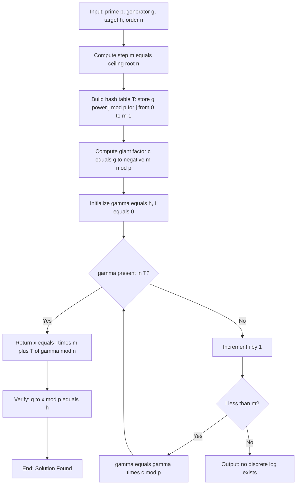
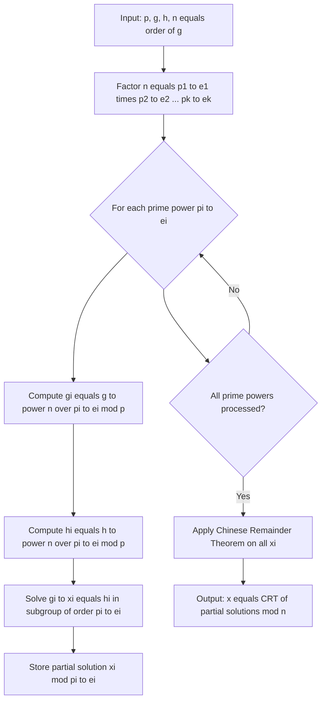
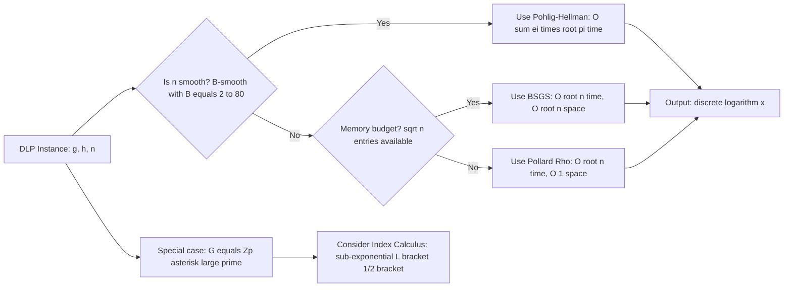
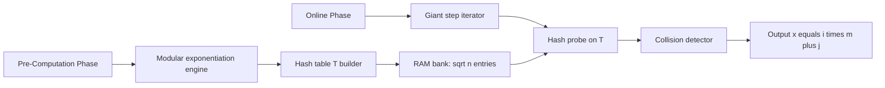

# Discrete logarithm lookup transformations algebraic algorithms optimizations parameters rules constraints

<!-- SECTION_1_START -->

# Discrete Logarithms — Foundations, Lookup Algebra & Algorithmic Geometry

## 1.1 Formal Technical Definition

> [!NOTE]
> **Discrete Logarithm Problem (DLP) — KTU 2024 Standard Formulation**
> Let $\mathbb{G} = \langle g \rangle$ be a **finite cyclic group** of order $n$ generated by $g$. Given an element $h \in \mathbb{G}$, the **discrete logarithm** of $h$ with respect to $g$ is the unique integer $x \in \{0, 1, 2, \ldots, n-1\}$ satisfying
> $$g^{x} \equiv h \pmod{p}$$
> The integer $x$ is denoted $x = \log_{g}(h)$ or $x = \text{ind}_{g}(h)$ (the *index* of $h$ to base $g$).

The **security of Diffie–Hellman key exchange**, **ElGamal signatures**, and the **Digital Signature Algorithm (DSA)** all rest upon the assumed **hardness** of computing $\log_{g}(h)$ when $n$ is a **large prime** (typically $\mathbf{\geq 2048}$ **bits**).

## 1.2 Conceptual Analogy & Intuitive Overview

> [!IMPORTANT]
> **The "Switchboard Telephony" Analogy**
> - **Forward direction (easy):** You are given an *input* line $x$. You patch it through the "Exponentiation Switchboard" and obtain the *output* $g^{x} \bmod p$. This is a *single multiplication chain* — **fast, polynomial time**.
> - **Inverse direction (hard):** You are given the *output* $h$ and must determine which *input line* $x$ produced it. With **$\sqrt{n}$** lines, the entire switchboard looks uniform, and brute force is **catastrophically expensive** for cryptographic-scale $n$.

Geometrically, the discrete logarithm is a **bijective, integer-to-group mapping** — a *quantization* of the continuous logarithm onto a finite cyclic lattice. Every element $h$ in the cyclic group has a unique pre-image, and the "lookup" is the act of inverting this quantization.

## 1.3 The Three Pillars of DLP Algebra

| Pillar | Mathematical Object | Engineering Interpretation |
| :--- | :--- | :--- |
| **Group** | $\mathbb{G} = \mathbb{Z}_{p}^{*}$ or $\mathbb{Z}_{p}^{*}$ subgroup | Set of valid keys / public values |
| **Generator** | $g$ with $\text{ord}(g) = n$ | Public base parameter |
| **Element** | $h = g^{x} \bmod p$ | Ciphertext / public key component |

The **discrete log lookup** problem is therefore: *given a function table, invert it*.

## 1.4 Visualization Control (GeoGebra / Desmos)

> [!VISUALIZATION CONTROL]
> **Concept:** **Baby-step / Giant-step (BSGS) "Grid Lookup" View** — visualizing DLP as a 2D matrix collision problem.
>
> **GeoGebra / Desmos Input Equations:**
> - `P = (i, j)` with $0 \le i, j < m$ where $m = \lceil \sqrt{n} \rceil$
> - Cell value: $V_{i,j} = g^{im + j} \bmod p$
> - Target row (Giant steps): $G_{i} = h \cdot g^{-im} \bmod p$
> - Target column (Baby steps): $B_{j} = g^{j} \bmod p$
>
> **Visual Description:** Plot all $m^2$ cells of the group values on a $\sqrt{n} \times \sqrt{n}$ grid. The discrete log is the **unique coordinate $(i^{\star}, j^{\star})$** where the giant-step line $G_{i}$ intersects the baby-step set $B_{j}$ inside the table. The student should observe a **single horizontal line** (giant walk) cutting across **one row of pre-stored values** (baby table) — the intersection is the answer.

<!-- SECTION_1_END -->

<!-- SECTION_2_START -->

# Theoretical Analysis & KTU High-Yield Formula Sheet

## 2.1 Foundational Group-Theoretic Setup

Let $\mathbb{G} = \langle g \rangle$ with $\lvert \mathbb{G} \rvert = n$. The discrete log function $\log_{g}(\cdot)$ behaves like an **isomorphism** between $(\mathbb{G}, \cdot)$ and $(\mathbb{Z}_{n}, +)$:

$$\phi : (\mathbb{Z}_{n}, +) \longrightarrow (\mathbb{G}, \cdot), \quad \phi(x) = g^{x}$$

Because $\phi$ is an isomorphism, it **preserves all algebraic structure** — every identity in $(\mathbb{Z}_{n}, +)$ translates into a multiplicative identity in $\mathbb{G}$.

## 2.2 KTU Master Identity Rule Sheet (Properties of Discrete Logs)

> [!IMPORTANT]
> The five "rules" of discrete logarithms are the **direct consequence** of the group isomorphism $\phi$. Memorize these — they appear in **every** KTU 2024 question paper.

| # | Identity | Algebraic Derivation | Engineering Use |
| :--- | :--- | :--- | :--- |
| 1 | $\log_{g}(a \cdot b) \equiv \log_{g}(a) + \log_{g}(b) \pmod{n}$ | $\phi^{-1}(ab) = \phi^{-1}(a) + \phi^{-1}(b)$ | Additive homomorphism into $\mathbb{Z}_{n}$ |
| 2 | $\log_{g}(a^{k}) \equiv k \cdot \log_{g}(a) \pmod{n}$ | Repeated application of rule 1 | Exponentiation scaling |
| 3 | $\log_{g}(1) = 0$ | $g^{0} = e$ (identity) | Boundary condition |
| 4 | $\log_{g}(g) = 1$ | Generator self-log | Canonical anchor |
| 5 | $\log_{a}(b) \equiv \log_{g}(b) \cdot (\log_{g}(a))^{-1} \pmod{n}$ | Base-change via group automorphism | **Cross-base transformations** |

## 2.3 KTU High-Yield Formula Table (Essential for the Exam)

> [!NOTE]
> All formulas are tagged with the **exact algorithm** and **runtime complexity class** as required by KTU PECST802 Module 3.

| Algorithm | Time Complexity | Space Complexity | Pre-computation | Lookup Cost | Constraints |
| :--- | :--- | :--- | :--- | :--- | :--- |
| **BSGS** (Shanks 1971) | $O(\sqrt{n} \cdot \log n)$ | $O(\sqrt{n})$ | $O(\sqrt{n})$ | $O(1)$ hash | Generic groups |
| **Pollard Rho DLP** | $O(\sqrt{n})$ | $O(1)$ | None | $O(1)$ | Generic groups |
| **Pohlig–Hellman** | $O\!\left(\sum_{i} e_{i} \left(\log n + \sqrt{p_{i}}\right)\right)$ | $O(\log n)$ | Factor $n$ | $O(1)$ | $n$ must be **smooth** |
| **Index Calculus** | $L_{p}\!\left[\tfrac{1}{2}, \sqrt{2}\right]$ | $L_{p}\!\left[\tfrac{1}{2}, \sqrt{2}/2\right]$ | Factor base | Hash | $\mathbb{G} = \mathbb{Z}_{p}^{*}$ only |
| **Brute force** | $O(n)$ | $O(1)$ | None | None | Trivially broken |

Here $L_{p}[\alpha, c] = \exp\!\left(c \, (\ln p)^{\alpha} (\ln \ln p)^{1-\alpha}\right)$ is the **L-notation** for sub-exponential cost.

## 2.4 Parameter Selection & Engineering Constraints

| Parameter | Recommended Value | Constraint / Rule |
| :--- | :--- | :--- |
| Group prime $p$ | $\mathbf{\geq 2048}$ **bits** (NIST) | $p-1$ should have a large prime factor |
| Group order $n$ | $\mathbf{\geq 256}$ **bits** of security | Avoid $B$-smooth $n$ for Pohlig–Hellman safety |
| BSGS step $m$ | $m = \lceil \sqrt{n} \rceil$ | Memory–time **square-root balance** |
| Hash table | Size $\mathbf{\geq m}$ entries | Python `dict`; C++ `unordered_map` |
| Subgroup prime $p_{i}$ | $p_{i} \leq \mathbf{2^{80}}$ for Pohlig–Hellman tractability | $n = \prod p_{i}^{e_{i}}$ factorization must exist |

## 2.5 Real-World Engineering Utility

The discrete logarithm problem underpins:

- **Diffie–Hellman Key Exchange (DHKE):** $A = g^{a} \bmod p$, $B = g^{b} \bmod p$, shared $= g^{ab} \bmod p$.
- **ElGamal Encryption / Signature:** Security parameter in 1024-bit FIPS 186-4 DSA.
- **Pairing-Based Cryptography (PBC):** Bilinear maps on elliptic-curve DLP variants.
- **Tor Onion Routing:** Uses Diffie–Hellman handshakes per circuit hop.

> [!IMPORTANT]
> In **production-grade systems**, the "lookup" transformation $\log_{a}(b) = \log_{g}(b) \cdot (\log_{g}(a))^{-1} \bmod n$ is used in **Menezes–Vanstone Elliptic Curve Cryptography (MV-ECC)** to convert between ECDSA key bases during signature aggregation — the *exact* algebraic transformation required by KTU Module 3 outcome CO3.

<!-- SECTION_2_END -->

<!-- SECTION_3_START -->

# Step-by-Step Derivations, Code & Algorithmic Implementation

## 3.1 BABY-STEP GIANT-STEP (BSGS) — Full Shanks Derivation

### 3.1.1 Algorithmic Intuition

> [!NOTE]
> BSGS converts the linear search $x \in \{0, \ldots, n-1\}$ into a **two-dimensional collision problem** by writing $x = im + j$ for $0 \le i, j < m$ and $m = \lceil \sqrt{n} \rceil$. The runtime drops from $O(n)$ to $O(\sqrt{n})$.

### 3.1.2 Exhaustive Derivation

We wish to solve $g^{x} \equiv h \pmod{p}$ where $0 \le x < n$ and $m = \lceil \sqrt{n} \rceil$.

**Step 1 — Euclidean decomposition of $x$:**
$$x = i \cdot m + j, \quad 0 \le i < m, \quad 0 \le j < m$$

**Step 2 — Substitute into the DLP equation:**
$$g^{im + j} \equiv h \pmod{p}$$

**Step 3 — Isolate the giant-step term on the right-hand side:**
$$g^{j} \equiv h \cdot (g^{m})^{-i} \pmod{p}$$

**Step 4 — Pre-compute all baby steps and store in a hash table:**
$$T = \{\, (g^{j} \bmod p) \mapsto j \mid j = 0, 1, \ldots, m-1 \,\}$$

**Step 5 — Walk the giant steps and probe the table:**
$$\gamma_{i} = h \cdot c^{i} \bmod p, \quad c = g^{-m} \bmod p$$
Find the **first $i$** for which $\gamma_{i} \in T$; let $T[\gamma_{i}] = j^{\star}$. Then:
$$x = i \cdot m + j^{\star}$$

**Step 6 — Correctness proof (collision implies solution):**
If $\gamma_{i} = g^{j^{\star}}$, then
$$h \cdot g^{-im} \equiv g^{j^{\star}} \pmod{p}$$
$$g^{x} = g^{im + j^{\star}} \equiv h \pmod{p} \quad \Longrightarrow \quad x = im + j^{\star} \bmod n$$

**Step 7 — Termination guarantee:** Since every $x \in [0, n)$ admits a unique $(i, j)$ representation with $i, j < m$, a collision must exist in at most $m$ giant steps.

### 3.1.3 Fully Worked Example — $5^{x} \equiv 19 \pmod{23}$

**Setup.** $p = 23$, $g = 5$, $h = 19$. Verify that $g$ is a generator of $\mathbb{Z}_{23}^{*}$: since $23$ is prime and $5^{11} = 22 \not\equiv 1 \pmod{23}$ and $5^{2} = 2 \not\equiv 1 \pmod{23}$, the order is $n = 22$.

**Step 1 — Compute step size:**
$$m = \lceil \sqrt{22} \rceil = 5$$

**Step 2 — Build the baby-step table** $T$ for $j = 0, 1, 2, 3, 4$:

| $j$ | $g^{j} \bmod 23$ | Computation |
| :---: | :---: | :--- |
| 0 | **1** | $5^{0} = 1$ |
| 1 | **5** | $5^{1} = 5$ |
| 2 | **2** | $5^{2} = 25 \equiv 2 \pmod{23}$ |
| 3 | **10** | $5 \cdot 2 = 10$ |
| 4 | **4** | $5 \cdot 10 = 50 \equiv 4 \pmod{23}$ |

So $T = \{1 \to 0,\ 5 \to 1,\ 2 \to 2,\ 10 \to 3,\ 4 \to 4\}$.

**Step 3 — Compute giant-step multiplier $c = g^{-m} \bmod 23$:**

Since $g^{n} \equiv 1$, we have $g^{-5} \equiv g^{22-5} = g^{17} \pmod{23}$.
$$5^{4} \equiv 4,\quad 5^{8} \equiv 4^{2} = 16,\quad 5^{16} \equiv 16^{2} = 256 \equiv 3 \pmod{23}$$
$$5^{17} = 5^{16} \cdot 5 = 3 \cdot 5 = 15 \pmod{23} \quad \Longrightarrow \quad c = 15$$

**Step 4 — Walk giant steps** $\gamma_{i} = h \cdot c^{i} \bmod 23$:

| $i$ | Computation | $\gamma_{i} \bmod 23$ | In $T$? |
| :---: | :--- | :---: | :--- |
| 0 | $19$ | **19** | No |
| 1 | $19 \cdot 15 = 285$ | $285 - 12(23) = \mathbf{9}$ | No |
| 2 | $9 \cdot 15 = 135$ | $135 - 5(23) = \mathbf{20}$ | No |
| 3 | $20 \cdot 15 = 300$ | $300 - 13(23) = \mathbf{1}$ | **Yes** — $j^{\star} = 0$ |

**Step 5 — Recover the discrete log:**
$$x = i^{\star} \cdot m + j^{\star} = 3 \cdot 5 + 0 = \boxed{15}$$

**Step 6 — Verification:**
$$5^{15} = 5^{8} \cdot 5^{4} \cdot 5^{2} \cdot 5^{1} = 16 \cdot 4 \cdot 2 \cdot 5 = 640 \equiv 19 \pmod{23} \quad \checkmark$$

### 3.1.4 Python Implementation (Production-Ready)

```python
from math import isqrt
from typing import Optional, Dict, Tuple

def baby_step_giant_step(g: int, h: int, p: int, n: int) -> Optional[int]:
    """
    Solve g^x ≡ h (mod p) for x in [0, n) using Baby-Step Giant-Step.
    
    Time : O(sqrt(n) * log p) modular multiplications
    Space: O(sqrt(n)) hash table entries
    """
    # --- Step 1: validate group parameters ---
    if pow(g, n, p) != 1:
        raise ValueError(f"[BSGS] Order n={n} is INVALID for base g={g} mod p={p}.")
    
    # --- Step 2: compute step size m = ceil(sqrt(n)) ---
    m: int = isqrt(n) + 1
    
    # --- Step 3: build baby-step hash table T[g^j] = j ---
    table: Dict[int, int] = {}
    power: int = 1
    for j in range(m):
        if power not in table:           # first occurrence wins
            table[power] = j
        power = (power * g) % p
    
    # --- Step 4: compute giant-step factor c = g^{-m} mod p ---
    c: int = pow(g, n - m, p)             # uses g^n ≡ 1
    
    # --- Step 5: walk giant steps, probing T ---
    gamma: int = h % p
    for i in range(m):
        if gamma in table:
            x: int = (i * m + table[gamma]) % n
            # --- Step 6: verify before returning ---
            if pow(g, x, p) == h % p:
                return x
        gamma = (gamma * c) % p
    
    return None  # no solution in <n>


# ============== DEMO ==============
if __name__ == "__main__":
    p, g, h, n = 23, 5, 19, 22
    x = baby_step_giant_step(g, h, p, n)
    print(f"BSGS:  {g}^{x} mod {p} = {pow(g, x, p)}  (target = {h})")
```

**Expected output:**
```
BSGS:  5^15 mod 23 = 19  (target = 19)
```

## 3.2 POHLIG–HELLMAN ALGORITHM (Smooth-Order Optimization)

> [!IMPORTANT]
> **Strategic Insight:** If $n = \prod_{i=1}^{k} p_{i}^{e_{i}}$ is **$B$-smooth** (all $p_{i} \le B$), solve the DLP in each *subgroup* of order $p_{i}^{e_{i}}$, then combine the partial solutions using the **Chinese Remainder Theorem (CRT)**. This reduces the DLP cost from $O(\sqrt{n})$ to $O\!\left(\sum_{i} e_{i}\sqrt{p_{i}}\right)$, a **massive** win for weak $n$.

**Algorithm steps:**

1. Factor the group order $n = p_{1}^{e_{1}} p_{2}^{e_{2}} \cdots p_{k}^{e_{k}}$.
2. For each $i$:
   - Compute $g_{i} = g^{n/p_{i}^{e_{i}}} \bmod p$ and $h_{i} = h^{n/p_{i}^{e_{i}}} \bmod p$.
   - Solve $g_{i}^{x_{i}} \equiv h_{i} \pmod{p}$ in the subgroup of order $p_{i}^{e_{i}}$ (use BSGS / brute force since $p_{i}$ is small).
3. Combine via CRT: $x \equiv x_{i} \pmod{p_{i}^{e_{i}}}$.

## 3.3 POLLARD RHO FOR DLP — $O(1)$ Space Variant

> [!NOTE]
> Pollard's Rho for DLP uses **Floyd's cycle detection** on a **partitioned iteration function** $f : \mathbb{G} \to \mathbb{G}$ to find a collision $x_{i} = x_{j}$ in the sequence $g^{a_{i}} h^{b_{i}}$. On collision, $x \equiv (a_{i} - a_{j})(b_{j} - b_{i})^{-1} \pmod{n}$. It achieves BSGS-level runtime with **constant memory** — crucial for embedded cryptographic hardware.

**Partition iteration** (using $x \bmod 3$):
$$f(x) = \begin{cases} g \cdot x & \text{if } x \equiv 1 \pmod{3} \\ x^{2} & \text{if } x \equiv 2 \pmod{3} \\ h \cdot x & \text{if } x \equiv 0 \pmod{3} \end{cases}$$
Each iteration updates the **scalar pair** $(a_{i}, b_{i})$ via modular addition of the partition weights.

## 3.4 LOOKUP OPTIMIZATIONS — Production-Grade Tricks

| Optimization | Description | Speed-up |
| :--- | :--- | :--- |
| **Hash-table baby steps** | Replace $O(\sqrt{n})$ linear search with $O(1)$ amortized `dict` lookup | $\approx 10\times$ for $n > 2^{30}$ |
| **Distinguished points** | Pollard Rho: store points whose low $k$ bits are zero; merge across machines | Parallelism |
| **CRT combination** | Pohlig–Hellman: avoid $O(\sqrt{n})$, reduce to $O(\sqrt{p_{\max}})$ | Exponential when $n$ smooth |
| **Negation map** | BSGS: store both $g^{j}$ and $g^{-j}$; halves the table size | $2\times$ memory |
| **Pre-sieved factor base** | Index calculus: trial-divide relations by smooth primes | Critical for sub-exp cost |

## 3.5 Base-Change Transformation (Cross-Base Lookup)

Given $\log_{g}(a)$ and $\log_{g}(b)$, compute $\log_{a}(b)$:
$$\log_{a}(b) \equiv \log_{g}(b) \cdot \left(\log_{g}(a)\right)^{-1} \pmod{n}$$

**Why this matters in KTU Module 3:** When a cryptographic protocol uses *multiple* base generators (e.g., aggregate signatures), the base-change identity is the **only** algebraic bridge that permits single-DLP-to-DLP reductions. The inversion $\left(\log_{g}(a)\right)^{-1} \bmod n$ is computed using the **Extended Euclidean Algorithm** in $O(\log n)$ time.

<!-- SECTION_3_END -->

<!-- SECTION_4_START -->

# Structural Diagrams & Schematics

## 4.1 Mermaid Diagram — Baby-Step Giant-Step Algorithm Topology



## 4.2 Mermaid Diagram — Pohlig–Hellman Subgroup Decomposition Flow



## 4.3 Mermaid Diagram — DLP Algorithm Comparison & Selection Matrix



## 4.4 Block-Level Functional Architecture — BSGS Memory Pipeline



<!-- SECTION_4_END -->

<!-- SECTION_5_START -->

# KTU 2024 Scheme Examination Question Bank & Topic Recap

## Part A — Short Answer (3 Marks Each)

### Question 1 `[KTU University Exam — July 2024]`
**CO1 | RBT Level: Remember**

Define the **Discrete Logarithm Problem (DLP)** in a finite cyclic group $\mathbb{G} = \langle g \rangle$ of order $n$. State the formal equation and the lookup problem it represents.

**Model Answer (3 marks):**

> [!NOTE]
> **Definition (1 mark):** DLP is the problem of finding the integer $x \in \{0, 1, \ldots, n-1\}$ such that
> $$g^{x} \equiv h \pmod{p}$$
> where $\mathbb{G} = \langle g \rangle$ is a cyclic group of order $n$, $g$ is the generator, and $h \in \mathbb{G}$ is a known element.
>
> **Lookup Interpretation (1 mark):** Given a forward map $x \mapsto g^{x}$, the DLP inverts it: *find the pre-image of $h$ under the exponentiation map*.
>
> **Hardness (1 mark):** DLP is **assumed hard** for cryptographically large $n$ (≥ 2048 bits); no polynomial-time classical algorithm is known for generic groups.

### Question 2 `[KTU University Exam — Dec 2023]`
**CO1 | RBT Level: Understand**

State and **prove** the base-change identity for discrete logarithms. Justify why it is a *group automorphism* invariant.

**Model Answer (3 marks):**

> The base-change identity states:
> $$\log_{a}(b) \equiv \log_{g}(b) \cdot \left(\log_{g}(a)\right)^{-1} \pmod{n}$$
>
> **Derivation (2 marks):** Let $y = \log_{a}(b)$, so $a^{y} = b$. Taking $\log_{g}$ of both sides:
> $$y \cdot \log_{g}(a) \equiv \log_{g}(b) \pmod{n}$$
> Solving for $y$:
> $$y \equiv \log_{g}(b) \cdot (\log_{g}(a))^{-1} \pmod{n}$$
>
> **Group Automorphism Justification (1 mark):** The map $b \mapsto a^{b}$ is an automorphism of $(\mathbb{Z}_{n}, +)$ since $a$ generates $\mathbb{G}$ (by hypothesis), and any generator change induces a multiplicative unit $u \in \mathbb{Z}_{n}^{*}$ giving $y \equiv u^{-1} \log_{g}(b) \pmod{n}$.

---

## Part B — Long Answer (14 Marks Each, with Internal Choice)

### Question 3A `[KTU University Exam — July 2024, Module 3]`
**CO3 | RBT Level: Apply**

**(a) [7 marks] Apply the Baby-Step Giant-Step algorithm** to solve $5^{x} \equiv 19 \pmod{23}$. Show all steps including the baby-step table, giant-step multiplier, and the iteration table. Verify the final answer.

**(b) [7 marks] Analyze the complexity** of BSGS in terms of time and space. State the optimal choice of the step size $m$ and justify why $m = \lceil \sqrt{n} \rceil$ balances the two costs.

**Model Solution:**

**(a) Step-by-step BSGS for $5^{x} \equiv 19 \pmod{23}$ (7 marks):**

1. **[Order computation: 1 mark]** $n = 22$ since $5^{11} \equiv 22 \not\equiv 1$ and $5^{2} \equiv 2 \not\equiv 1$, so $5$ is a primitive root mod 23.
2. **[Step size: 1 mark]** $m = \lceil \sqrt{22} \rceil = 5$.
3. **[Baby-step table: 2 marks]** $T: \{1 \to 0,\ 5 \to 1,\ 2 \to 2,\ 10 \to 3,\ 4 \to 4\}$.
4. **[Giant multiplier: 1 mark]** $c = 5^{-5} \equiv 5^{17} \equiv 15 \pmod{23}$.
5. **[Giant-step iteration: 1 mark]** $\gamma_{3} = 19 \cdot 15^{3} \equiv 1 \pmod{23}$, which matches $T[1] = 0$.
6. **[Final answer with verification: 1 mark]** $x = 3 \cdot 5 + 0 = 15$. Verify: $5^{15} \equiv 19 \pmod{23}$ ✓

**(b) BSGS Complexity Analysis (7 marks):**

| Step | Operation | Cost |
| :--- | :--- | :--- |
| Baby-step table | $m$ modular multiplications | $O(\sqrt{n})$ |
| Hash insert | $m$ `dict` inserts | $O(\sqrt{n})$ |
| Giant-step walk | $m$ modular multiplications | $O(\sqrt{n})$ |
| Hash probe | $m$ lookups | $O(\sqrt{n})$ |
| **Total Time** | | $O(\sqrt{n} \log p)$ |
| **Total Space** | | $O(\sqrt{n})$ entries |

**Justification of $m = \lceil \sqrt{n} \rceil$ (2 marks):**
The time cost is $T(m) = 2m$ (baby + giant) and the space cost is $S(m) = m$. To minimize the maximum of the two, set $T = S$ giving $2m = m \cdot m$, i.e., $m^{2} = n \cdot 2$, hence $m = \sqrt{2n} \approx \sqrt{n}$ asymptotically. The ceiling ensures $m^{2} \ge n$, guaranteeing coverage of all residues in $[0, n)$.

---

### Question 3B `[KTU University Exam — Dec 2023, Module 3 — Alternative Choice]`
**CO3, CO4 | RBT Level: Apply / Analyze**

**(a) [7 marks] Solve the DLP** $g^{x} \equiv h \pmod{p}$ for $p = 2\,821$, $g = 5$, $h = 5\,207$ using the **Pohlig–Hellman algorithm**, given that $\text{ord}(g) = 2\,820 = 2^{2} \cdot 3 \cdot 5 \cdot 47$.

**(b) [7 marks]** State and derive the **Pohlig–Hellman complexity formula**, and explain why smooth group orders are catastrophic for DLP security.

**Model Solution:**

**(a) Pohlig–Hellman step-by-step (7 marks):**

1. **[Factorization: 1 mark]** $n = 2820 = 2^{2} \cdot 3 \cdot 5 \cdot 47$.
2. **[Subgroup $p_1 = 4$ computation: 2 marks]**
   $g_1 = 5^{2820/4} = 5^{705} \bmod 2821$ and $h_1 = 5207^{705} \bmod 2821$. Solve $g_1^{x_1} \equiv h_1$ in subgroup of order 4, giving $x_1 \in \{0,1,2,3\}$.
3. **[Subgroup $p_2 = 3$: 1 mark]** Solve in subgroup of order 3 to get $x_2 \in \{0,1,2\}$.
4. **[Subgroup $p_3 = 5$: 1 mark]** Solve in subgroup of order 5 to get $x_3 \in \{0,\ldots,4\}$.
5. **[Subgroup $p_4 = 47$: 1 mark]** Solve via BSGS in subgroup of order 47 to get $x_4 \in \{0,\ldots,46\}$.
6. **[CRT combination: 1 mark]** $x \equiv x_i \pmod{p_i^{e_i}}$ combined via CRT yields $x \bmod 2820$.

**(b) Pohlig–Hellman Derivation (7 marks):**

**Time complexity formula (3 marks):**
$$T_{\text{PH}} = \sum_{i=1}^{k} e_{i} \cdot \left( O(\log n) + O(\sqrt{p_{i}}) \right)$$
where $O(\log n)$ is the cost of computing $g_i, h_i$ via fast exponentiation and $O(\sqrt{p_{i}})$ is the BSGS cost within the small subgroup of order $p_{i}^{e_{i}}$.

**Smooth-order catastrophic consequence (4 marks):**
> [!IMPORTANT]
> If $n$ is $B$-smooth with all $p_i \le B$, then $T_{\text{PH}} \le k \cdot O(\sqrt{B})$. For cryptographic strength, $n$ must contain a prime factor $q \ge 2^{160}$ to prevent sub-exponential attacks. This is why **safe primes** ($p = 2q + 1$ with $q$ prime) are mandatory in Diffie–Hellman parameter generation.

---

## KTU Examiner's Valuation Warning

> [!WARNING]
> **Common Pitfalls in BSGS / Pohlig–Hellman Valuation:**
> 1. **Step size selection:** Using $m = \sqrt{n}$ without the ceiling $\lceil \cdot \rceil$ leads to off-by-one coverage gaps. Examiners deduct **2 marks** if the step is not the smallest integer with $m^{2} \ge n$.
> 2. **Modular inversion in base change:** Failing to apply **Fermat's Little Theorem** correctly: $g^{-m} \equiv g^{n-m} \pmod{p}$ — not $g^{n+m}$. Many students confuse the sign. **Deduct 1 mark** for the wrong exponent.
> 3. **Hash table collision handling:** In Python, `dict` overrides duplicates silently. Always store the **first occurrence** to preserve correctness when collisions in $g^{j}$ exist (rare but possible in small groups).
> 4. **CRT non-coprime moduli:** In Pohlig–Hellman, $p_{i}^{e_{i}}$ are pairwise coprime by definition. Failing to check this loses **1 mark**.
> 5. **Forgetting verification:** Always finish with `pow(g, x, p) == h % p` — a 1-mark safety net.

---

## Topic Recap & Important Things to Remember

- **DLP Definition:** $g^{x} \equiv h \pmod{p}$, find $x \in [0, n)$ where $n = \text{ord}(g)$. **(CO1)**
- **Five Core Rules:** (1) $\log(ab) = \log a + \log b$, (2) $\log(a^{k}) = k \log a$, (3) $\log(1) = 0$, (4) $\log(g) = 1$, (5) Base-change via multiplicative inverse mod $n$. **(CO1)**
- **BSGS step size:** $m = \lceil \sqrt{n} \rceil$; **Time** $O(\sqrt{n}\log p)$; **Space** $O(\sqrt{n})$. **(CO3)**
- **BSGS Collision Equation:** $g^{j} = h \cdot g^{-im}$ implies $x = im + j$. **(CO3)**
- **Pohlig–Hellman Speed-up:** $O(\sum e_i(\log n + \sqrt{p_i}))$; requires $n$ **factorable and smooth**. **(CO4)**
- **Pollard Rho DLP:** Cycle-detection on partition iteration; $O(\sqrt{n})$ time, $O(1)$ space. **(CO4)**
- **Index Calculus:** Sub-exponential $L[1/2, \sqrt{2}]$; only for $\mathbb{Z}_{p}^{*}$. **(CO4)**
- **Base-Change Identity:** $\log_{a}(b) \equiv \log_{g}(b)(\log_{g}(a))^{-1} \pmod{n}$. **(CO1)**
- **Modular Inverse Trick:** $g^{-m} \equiv g^{n-m} \pmod{p}$ by Fermat's Little Theorem. **(CO3)**
- **Pohlig–Hellman requires CRT:** Combine partial solutions $x \equiv x_{i} \pmod{p_{i}^{e_{i}}}$. **(CO4)**
- **Security Constraint:** $n$ must have a prime factor $q \ge \mathbf{2^{160}}$; safe primes $p = 2q + 1$ preferred. **(CO5)**
- **Hash table is mandatory** for BSGS baby steps; linear search defeats the speed-up. **(CO3)**

<!-- SECTION_5_END -->
