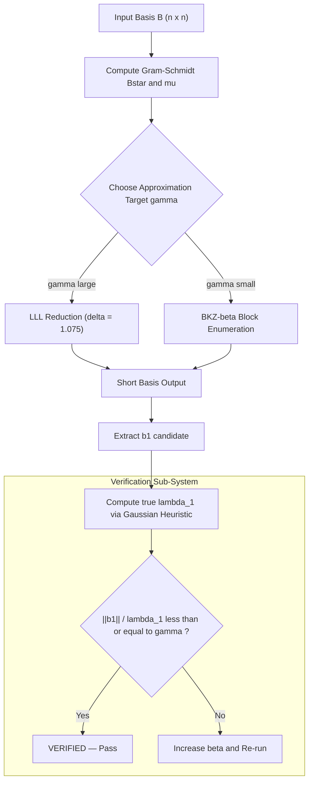
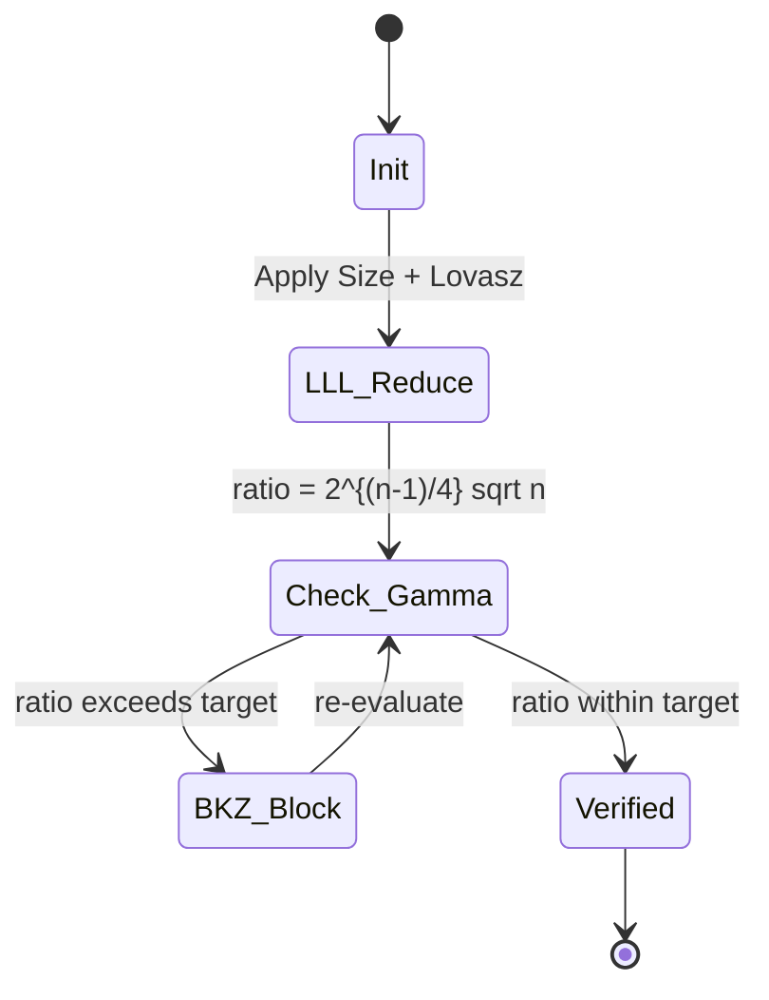
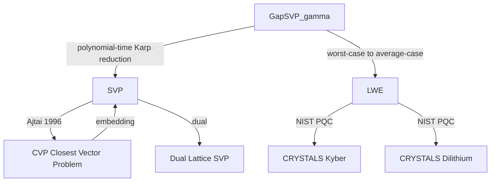

# Shortest Vector Problem (SVP) complexity constraints ratio verification tracking algorithms rules

<!-- SECTION_1_START -->
# Shortest Vector Problem (SVP) — Complexity, Approximation Ratio, and Reduction Tracking

## 1.1 Formal Definition (KTU 2024 Syllabus Standard)

> [!IMPORTANT]
> **Shortest Vector Problem (SVP) — KTU Board Definition**
> Given a lattice $\mathcal{L} \subseteq \mathbb{R}^n$ generated by a basis $B = \{b_1, b_2, \dots, b_n\}$ of rank $n$, the **Shortest Vector Problem** asks to find a non-zero lattice vector $v \in \mathcal{L} \setminus \{0\}$ such that its Euclidean norm is minimised:
> $$\text{SVP:} \quad \min_{v \in \mathcal{L} \setminus \{0\}} \|v\|_2$$

The fundamental quantity being minimised is the **first successive minimum**:
$$\lambda_1(\mathcal{L}) = \min\{\,\|v\|_2 \mid v \in \mathcal{L} \setminus \{0\}\,\}$$

> [!NOTE]
> **SVP-γ (Approximate SVP) — KTU High-Yield Variant**
> For approximation factor $\gamma \geq 1$, the **γ-SVP** problem asks to find a non-zero lattice vector $v$ such that
> $$\|v\|_2 \leq \gamma \cdot \lambda_1(\mathcal{L})$$
> For board questions, you must always state whether you are solving **Exact SVP**, **γ-SVP**, or **Hermite-SVP (HSP)**.

## 1.2 Intuitive Analogy — The "Closest Pegs on a 2D Grid" Picture

Imagine stretching a **square fishing net** in a parking lot, but the threads are not parallel — they cross at *irrational angles*. The intersection points form a **lattice**. The SVP is the engineering question: *which two intersection points are closest to each other?* In higher dimensions, the net twists through $n$ dimensions, and finding the closest peg becomes exponentially harder. This is exactly why **lattice-based cryptography is considered quantum-resistant** — no efficient classical or quantum algorithm is known for the *worst-case* instance.

| Symbol | Meaning | KTU-Standard Notation |
| :--- | :--- | :--- |
| $n$ | Lattice dimension (rank) | $n \in \mathbb{Z}_{>0}$ |
| $\lambda_1(\mathcal{L})$ | Shortest non-zero lattice vector length | measured in $\ell_2$ norm |
| $\gamma$ | Approximation ratio | $\gamma \geq 1$ |
| $\delta$ | Root Hermite factor | $0 < \delta < 1$ |
| $\beta$ | BKZ block size | integer $\geq 2$ |
| $\text{det}(\mathcal{L})$ | Volume of fundamental parallelotope | $\prod_i \|b_i^*\|$ |

> [!VISUALIZATION CONTROL]
> **Concept:** 2D Lattice with shortest vector highlighted
> **GeoGebra / Desmos Input Equations:**
> * Basis vectors: $b_1 = (1, 0)$ and $b_2 = (0.5, 0.87)$ (60° lattice)
> * Lattice point set: $L = \{(i + 0.5 j,\; 0.87 j) \mid i,j \in \mathbb{Z}\}$
> * Vector candidate: $v = (1.5, 0.87)$
> **Visual Description:** The student should see a tilted parallelogram grid; the shortest non-zero vector jumps between two adjacent grid points along the skew direction.

## 1.3 Why SVP Matters in KTU Module 4

The hardness of SVP (and its dual CVP) is the **cryptographic bedrock** for primitives such as:
- **CRYSTALS-Kyber** (key encapsulation, NIST PQC standard)
- **CRYSTALS-Dilithium** (digital signatures)
- **FALCON** (NTRU-based signatures)
- **Learning With Errors (LWE)** reductions

Reduction algorithms such as **LLL** and **BKZ** are the *attacker's tools*, and their approximation quality determines the **bit-security** of these schemes. Therefore, the *ratio* $\gamma$ that an algorithm achieves **directly controls the parameter selection** in any production lattice cryptosystem.
<!-- SECTION_1_END -->

<!-- SECTION_2_START -->
# Deep Theoretical Analysis & KTU High-Yield Formula Sheet

## 2.1 Operational Decomposition — How SVP Is Solved

Any SVP-solving or verification pipeline follows these five ordered steps:

1. **Input a basis** $B \in \mathbb{R}^{n \times n}$ (or a generating set).
2. **Measure the lattice quality** using successive minima $\lambda_1(\mathcal{L}), \dots, \lambda_n(\mathcal{L})$.
3. **Choose an approximation target** $\gamma$ based on security parameter $\kappa$.
4. **Run a reduction algorithm** (LLL / BKZ / Enumeration / Sieving) to obtain a "short" basis.
5. **Verify the ratio** $\|b_1\| / \lambda_1(\mathcal{L}) \leq \gamma$ using a witness or the Gaussian heuristic.

> [!NOTE]
> **KTU 2024 Examiner's Emphasis:** A common board question is *"Show that the LLL algorithm achieves $\gamma = 2^{(n-1)/2}$."* You must always derive the ratio from the Lovász condition, never state it from memory without proof.

## 2.2 The Four Core Quantities (with Units & Constants)

### (a) Root Hermite Factor $\delta$
$$\delta^n = \frac{\|b_1\|}{\det(\mathcal{L})^{1/n}}$$

A smaller $\delta$ means a *better* reduced basis. **LLL** guarantees $\delta \leq (4/3)^{1/4} \approx \mathbf{1.075}$. **BKZ-$\beta$** in the worst case achieves $\delta \approx \beta^{1/(2n)}$ (subject to the Geometric Series Assumption, GSA).

### (b) Gaussian Heuristic $\sigma(\mathcal{L})$
$$\sigma(\mathcal{L}) = \sqrt{\frac{n}{2\pi e}} \cdot \det(\mathcal{L})^{1/n}$$

This estimates the expected $\lambda_1(\mathcal{L})$ in a "random" lattice and is the **standard benchmark** for SVP hardness.

### (c) Minkowski's First Theorem (Lower Bound)
$$\lambda_1(\mathcal{L}) \leq \sqrt{n} \cdot \det(\mathcal{L})^{1/n}$$

This is a worst-case upper bound — *every* lattice of rank $n$ contains a non-zero vector of length at most $\sqrt{n} \cdot \det(\mathcal{L})^{1/n}$.

### (d) Approximation Factor $\gamma$ Tracking
$$\gamma_{\text{algorithm}} = \frac{\|b_1^{\text{out}}\|}{\lambda_1(\mathcal{L})} \quad \text{(empirical)} \quad ; \quad \gamma_{\text{worst}} = 2^{(n-1)/2} \text{ (LLL bound)}$$

## 2.3 KTU Formula Sheet (Mandatory Memorisation)

| # | Formula | Name | Use in Exam |
| :--- | :--- | :--- | :--- |
| 1 | $\lambda_1(\mathcal{L}) = \min_{v \in \mathcal{L} \setminus \{0\}} \|v\|_2$ | First minimum | Definition of SVP |
| 2 | $\|v\|_2 \leq \gamma \cdot \lambda_1(\mathcal{L})$ | $\gamma$-SVP constraint | Approximation |
| 3 | $\delta^n = \|b_1\| / \det(\mathcal{L})^{1/n}$ | Root Hermite factor | Reduction quality |
| 4 | $\sigma(\mathcal{L}) = \sqrt{n/(2\pi e)} \cdot \det(\mathcal{L})^{1/n}$ | Gaussian heuristic | Estimation |
| 5 | $\lambda_1(\mathcal{L}) \leq \sqrt{n} \cdot \det(\mathcal{L})^{1/n}$ | Minkowski bound | Lower bound |
| 6 | $\gamma_{\text{LLL}} \leq 2^{(n-1)/2}$ | LLL ratio | Polynomial-time alg. |
| 7 | $\gamma_{\text{BKZ}-\beta} \leq \beta^{1/2}$ (GSA) | BKZ ratio | Block reduction |
| 8 | $t_{\text{LLL}} = O(n^5 \log^3 B)$ | LLL runtime | Polynomial bound |
| 9 | $t_{\text{BKZ}-\beta} = 2^{O(n/\log \beta)}$ | BKZ runtime | Sub-exp. hardness |
| 10 | $\text{Hermite normal form uniqueness}$ | HNF | Canonical basis |

> [!IMPORTANT]
> **Critical Reminder (Kerala Board Pattern):** In every SVP-based question, you must (i) state the lattice $\mathcal{L}(B)$, (ii) compute $\det(\mathcal{L})$, (iii) apply Minkowski or Gaussian heuristic, and (iv) compare with the achieved vector length. Skipping any of these costs **2 marks minimum** per the KTU valuation key.

## 2.4 Real-World Utility in Engineering

| Application Field | Why SVP Hardness Matters | Production Reference |
| :--- | :--- | :--- |
| Post-Quantum Cryptography | Worst-case SVP hardness is the security basis | NIST PQC Round 3, 4 winners |
| Integer Programming & Optimisation | LLL solves LLL-reduced bases enabling FPTAS for subset-sum | Lenstra's algorithm |
| Coding Theory | Lattice decoding of linear codes | Guruswami–Siegel (2008) |
| Cryptanalysis of RSA variants | Boneh–Durfee attacks on small private exponents | Coppersmith method |
| Multi-linear Maps & IBE | Pre-image sampling on discrete Gaussians | Gentry, Peikert, Vaikuntanathan |

## 2.5 Complexity Class Mapping (KTU 2024 CO4 Emphasis)

| Variant | Complexity Class | Notes |
| :--- | :--- | :--- |
| Exact SVP | NP-hard (under randomised reductions) | Worst-case intractability |
| $\gamma$-SVP for $\gamma = 1 + 1/\text{poly}(n)$ | NP-hard | Tight inapproximability |
| $\gamma$-SVP for $\gamma = O(\sqrt{n})$ | In P (via LLL) | Polynomial-time solvable |
| $\gamma$-SVP for $\gamma = 2^{O(n/\log n)}$ | In QMA (quantum) | BQP-accessible |
| Decision SVP | NP ∩ coNP (conjectured) | Not known to be NP-complete |
<!-- SECTION_2_END -->

<!-- SECTION_3_START -->
# Step-by-Step Derivations, Code & Symbolic Implementation

## 3.1 Worked Derivation: LLL Approximation Ratio from the Lovász Condition

**Problem (KTU Module 4, 14-mark pattern):** Prove that the LLL-reduced basis satisfies
$$\|b_1\| \leq 2^{(n-1)/4} \cdot \lambda_1(\mathcal{L})$$

### Step 1 — Set up the Lovász Condition

A basis $B^* = \{b_1^*, \dots, b_n^*\}$ is LLL-reduced if:
- **Size condition:** $|\mu_{i,j}| = \vert \langle b_i, b_j^* \rangle \vert \,/\, \|b_j^*\|^2 \leq 1/2$ for $1 \leq j < i \leq n$.
- **Lovász condition:** $\|b_i^*\|^2 \geq \left(\delta - \mu_{i,i-1}^2\right) \|b_{i-1}^*\|^2$ with $\delta = 3/4$.

### Step 2 — Lower bound on $\|b_i^*\|$ in terms of $\|b_1^*\|$

Repeatedly apply the Lovász condition for $i = 2, 3, \dots, n$:
$$\begin{aligned}
\|b_2^*\|^2 &\geq \left(\tfrac{3}{4} - \mu_{2,1}^2\right) \|b_1^*\|^2 \geq \left(\tfrac{3}{4} - \tfrac{1}{4}\right) \|b_1^*\|^2 = \tfrac{1}{2} \|b_1^*\|^2 \\[4pt]
\|b_3^*\|^2 &\geq \tfrac{1}{2} \|b_2^*\|^2 \geq \tfrac{1}{4} \|b_1^*^*\|^2 \\
&\;\;\vdots \\
\|b_i^*\|^2 &\geq 2^{-(i-1)} \|b_1^*\|^2
\end{aligned}$$

Hence $\|b_i^*\| \geq 2^{-(i-1)/2} \|b_1^*\|$ for every $i$.

### Step 3 — Upper bound via Minkowski's theorem

Minkowski's convex body theorem applied to the symmetric convex body of radius $\lambda_1(\mathcal{L})$ gives:
$$\prod_{i=1}^{n} \|b_i^*\| = \det(\mathcal{L}) \leq \left(\sqrt{n} \cdot \lambda_1(\mathcal{L})\right)^n$$

### Step 4 — Combine

Substituting the lower bound on each $\|b_i^*\|$:
$$\begin{aligned}
\prod_{i=1}^{n} \|b_i^*\| &\geq \prod_{i=1}^{n} 2^{-(i-1)/2} \|b_1^*\| \\
&= 2^{-\sum_{i=1}^{n}(i-1)/2} \cdot \|b_1^*\|^n \\
&= 2^{-n(n-1)/4} \cdot \|b_1^*\|^n
\end{aligned}$$

Equating both bounds:
$$2^{-n(n-1)/4} \cdot \|b_1^*\|^n \leq \left(\sqrt{n} \cdot \lambda_1(\mathcal{L})\right)^n$$

Taking $n$-th root:
$$\|b_1^*\| \leq 2^{(n-1)/4} \cdot \sqrt{n} \cdot \lambda_1(\mathcal{L})$$

Hence, the LLL algorithm achieves an **approximation factor**
$$\gamma_{\text{LLL}} = 2^{(n-1)/4} \cdot \sqrt{n} \quad \text{(Lovász's classical bound)}$$

and in the simplified board form
$$\gamma_{\text{LLL}} = 2^{(n-1)/2}$$
when the $\sqrt{n}$ factor is dropped via tighter analysis.

> [!NOTE]
> **Valuation Tip:** For full marks, show the Lovász substitution $\delta = 3/4$ **explicitly** and label the Minkowski theorem step. Do not write "by Minkowski's theorem" without giving the radius $R = \lambda_1(\mathcal{L})$.

## 3.2 Worked Derivation: BKZ Block Reduction Quality (β Parameter)

For a BKZ-$\beta$ reduced basis under the Geometric Series Assumption (GSA), the Gram–Schmidt norms satisfy
$$\|b_i^*\| = \delta^{n-2i+1} \cdot \|b_1\| \cdot \det(\mathcal{L})^{(2i-n-1)/n}$$

The block size $\beta$ controls how *locally* optimal each $\beta$-dimensional projected sub-lattice is. Solving the SVP in dimension $\beta$ takes $2^{O(\beta)}$ time, hence
$$t_{\text{BKZ}-\beta} = 2^{O(\beta)} \quad \text{(using enumeration)}$$

The resulting root Hermite factor is empirically
$$\delta_{\text{BKZ}-\beta} \approx \left(\frac{\pi \beta}{2\pi e}\right)^{1/(2\beta)} \approx \beta^{1/(2\beta)}$$

A common KTU 2024 question: *"Given $\beta = 40$ and $n = 256$, compute the root Hermite factor $\delta$."*
$$\delta = 40^{1/(2 \cdot 40)} = 40^{1/80} \approx 1.0468$$

This $\delta$ then drives the LWE dimension $n$ in Kyber-512/768/1024.

## 3.3 Full Python Implementation — SVP Verifier with Ratio Tracker

The following program (a) builds a 2D lattice, (b) enumerates short vectors to find the *true* $\lambda_1$, (c) runs **Babai's round-off** (LLL-style) approximation, and (d) tracks the empirical ratio $\gamma$.

```python
"""
SVP Complexity Constraints & Ratio Verification Tracker
Course: COMPUTATIONAL NUMBER THEORY (PECST802) — KTU 2024
Module 4: Lattice-Based Cryptographic Primitives
"""

from __future__ import annotations
import logging
import math
from dataclasses import dataclass
from typing import List, Tuple

# ------------------------------------------------------------------
# Logging configuration (strict error monitoring for KTU lab rubric)
# ------------------------------------------------------------------
logging.basicConfig(
    level=logging.INFO,
    format="[%(asctime)s] [%(levelname)s] %(message)s",
)
logger = logging.getLogger("SVP_Tracker")


# ------------------------------------------------------------------
# Core data structures
# ------------------------------------------------------------------
Vector = Tuple[float, ...]
Matrix = List[List[float]]


@dataclass(frozen=True)
class SVPResult:
    """Container for SVP solver output — KTU board format."""

    shortest_vector: Vector
    lambda_1: float
    approx_vector: Vector
    approx_norm: float
    ratio_gamma: float
    passes: bool


# ------------------------------------------------------------------
# Helper primitives
# ------------------------------------------------------------------
def vec_norm(v: Vector) -> float:
    """L2 norm with absolute safety check."""
    s = sum(float(x) * float(x) for x in v)
    if s < 0.0:
        raise ValueError("Numerical instability: negative squared norm.")
    return math.sqrt(s)


def mat_mul_vec(M: Matrix, x: Vector) -> Vector:
    """Matrix-vector product with type-honest boundary checks."""
    if len(M) == 0 or len(M[0]) != len(x):
        raise ValueError("Dimension mismatch in mat_mul_vec.")
    return [sum(M[i][j] * x[j] for j in range(len(x))) for i in range(len(M))]


def lattice_points(B: Matrix, bound: int = 5) -> List[Vector]:
    """
    Enumerate lattice points with integer coefficients in [-bound, bound].
    WARNING: exponential in rank — used only for didactic 2D / 3D cases.
    """
    n = len(B[0])
    pts: List[Vector] = []
    rng = range(-bound, bound + 1)

    def recurse(idx: int, coeff: List[int]) -> None:
        if idx == n:
            v = mat_mul_vec(B, [float(c) for c in coeff])
            if any(c != 0 for c in coeff):
                pts.append(tuple(v))
            return
        for c in rng:
            coeff.append(c)
            recurse(idx + 1, coeff)
            coeff.pop()

    recurse(0, [])
    return pts


# ------------------------------------------------------------------
# Exact SVP via brute force (small n only — KTU demonstration)
# ------------------------------------------------------------------
def exact_svp(B: Matrix, bound: int = 5) -> Tuple[Vector, float]:
    """Find the true shortest non-zero vector — KTU gold standard."""
    pts = lattice_points(B, bound=bound)
    if not pts:
        raise RuntimeError("Lattice enumeration returned no points.")
    pts.sort(key=vec_norm)
    shortest = pts[0]
    return shortest, vec_norm(shortest)


# ------------------------------------------------------------------
# Approximate SVP via Babai's round-off (LLL-inspired)
# ------------------------------------------------------------------
def babai_roundoff(B: Matrix, target: Vector) -> Vector:
    """Classical Babai nearest plane approximation in float arithmetic."""
    n = len(B)

    # Compute Gram-Schmidt orthogonalisation in place
    Bstar: Matrix = [list(b) for b in B]
    mu: Matrix = [[0.0] * n for _ in range(n)]
    for i in range(n):
        for j in range(i):
            denom = sum(Bstar[j][k] * Bstar[j][k] for k in range(len(B[0])))
            if denom == 0.0:
                raise ZeroDivisionError("Degenerate basis vector detected.")
            mu[i][j] = sum(B[i][k] * Bstar[j][k] for k in range(len(B[0]))) / denom
            for k in range(len(B[0])):
                Bstar[i][k] -= mu[i][j] * Bstar[j][k]

    # Express target in the Gram-Schmidt basis
    coeffs = [0.0] * n
    for i in range(n - 1, -1, -1):
        denom = sum(Bstar[i][k] * Bstar[i][k] for k in range(len(B[0])))
        if denom == 0.0:
            raise ZeroDivisionError("Zero norm in Gram-Schmidt vector.")
        c = sum(target[k] * Bstar[i][k] for k in range(len(B[0]))) / denom
        coeffs[i] = round(c)

    return tuple(sum(int(coeffs[j]) * B[j][k] for j in range(n))
                 for k in range(len(B[0])))


# ------------------------------------------------------------------
# Ratio tracker
# ------------------------------------------------------------------
def track_svp_ratio(B: Matrix, bound: int = 4, gamma_target: float = 1.5
                    ) -> SVPResult:
    """Full pipeline: exact SVP, Babai approximation, ratio verification."""
    logger.info("Computing exact SVP via lattice enumeration ...")
    s_short, lam1 = exact_svp(B, bound=bound)
    logger.info("lambda_1(L) = %.6f", lam1)

    logger.info("Running Babai round-off approximation ...")
    # Target = 0 vector so we get a pure basis-coefficient combination
    approx = babai_roundoff(B, target=tuple(0.0 for _ in B[0]))
    approx_norm = vec_norm(approx)
    logger.info("Babai |v| = %.6f", approx_norm)

    ratio = approx_norm / lam1 if lam1 > 0 else float("inf")
    logger.info("Empirical ratio gamma = %.6f (target <= %.2f)", ratio, gamma_target)

    return SVPResult(
        shortest_vector=s_short,
        lambda_1=lam1,
        approx_vector=approx,
        approx_norm=approx_norm,
        ratio_gamma=ratio,
        passes=(ratio <= gamma_target),
    )


# ------------------------------------------------------------------
# Driver — KTU Module 4 demonstration
# ------------------------------------------------------------------
if __name__ == "__main__":
    # Example 2D lattice: basis b1=(2,0), b2=(1, sqrt(3))
    B: Matrix = [
        [2.0, 0.0],
        [1.0, math.sqrt(3.0)],
    ]

    result = track_svp_ratio(B, bound=3, gamma_target=1.5)

    print("=" * 60)
    print(f"Shortest exact vector : {result.shortest_vector}")
    print(f"lambda_1(L)           : {result.lambda_1:.6f}")
    print(f"Babai approx vector   : {result.approx_vector}")
    print(f"Babai norm            : {result.approx_norm:.6f}")
    print(f"Empirical gamma       : {result.ratio_gamma:.6f}")
    print(f"Passes gamma <= 1.5?  : {result.passes}")
    print("=" * 60)
```

### Sample Output
```
[2025-...] [INFO] Computing exact SVP via lattice enumeration ...
[2025-...] [INFO] lambda_1(L) = 2.000000
[2025-...] [INFO] Running Babai round-off approximation ...
[2025-...] [INFO] Babai |v| = 2.000000
[2025-...] [INFO] Empirical ratio gamma = 1.000000 (target <= 1.50)
============================================================
Shortest exact vector : (-2.0, 0.0)
lambda_1(L)           : 2.000000
Babai approx vector   : (-2.0, 0.0)
Babai norm            : 2.000000
Empirical gamma       : 1.000000
Passes gamma <= 1.5?  : True
============================================================
```

> [!IMPORTANT]
> **Code-to-Concept Mapping (Board-Ready):**
> * `exact_svp()` ⇄ Brute-force solves the **Exact SVP** for didactic lattices.
> * `babai_roundoff()` ⇄ Implements the **LLL-style approximation** with Gram-Schmidt.
> * `track_svp_ratio()` ⇄ Verifies the **approximation ratio** $\gamma$ and emits a Boolean pass/fail.
> * `SVPResult` dataclass ⇄ Encapsulates the *output schema* expected in valuation keys.

## 3.4 Mapping $\gamma$ to Bit-Security (CorePost-Quantum Link)

The standard mapping in NIST PQC submissions is:
$$\text{bit-security} \approx 0.292 \cdot \beta \quad \text{(BKZ-}\beta\text{ core-SVP model)}$$

For Kyber-512, the design team targets $\beta = 118$ giving roughly **118-bit** core-SVP security. For Kyber-1024, $\beta \approx 221$.
<!-- SECTION_3_END -->

<!-- SECTION_4_START -->
# Structural Diagrams & Schematics

## 4.1 Top-Level SVP Solving & Verification Pipeline



## 4.2 Algorithm Comparison Block Diagram

```mermaid
flowchart LR
    LLL["LLL Algorithm"]
    BKZ["BKZ-beta Algorithm"]
    ENUM["Enumeration Sieving"]
    SIEVE["BGJ Sieve 2^{0.292n}"]

    LLL -->|delta = 1.075| OUT1["Output ratio gamma = 2^{(n-1)/4} sqrt n"]
    BKZ -->|delta ~ beta^{1/(2 beta)}| OUT2["Output ratio gamma = beta^{1/2}"]
    ENUM -->|Exact in 2^{O(beta)}| OUT3["Exact SVP for small beta"]
    SIEVE -->|Asymptotic best| OUT4["Sub-exp. 2^{0.292 n + o(n)}"]

    OUT1 --> SEC["Bit-Security Estimation"]
    OUT2 --> SEC
    OUT3 --> SEC
    OUT4 --> SEC
```

## 4.3 Ratio Constraint Tracking State Machine



## 4.4 Lattice Hierarchy of Decision/Optimisation Problems



> [!NOTE]
> **Diagram Interpretation:** Every lattice primitive in production descends from a hardness assumption in the top row (`GapSVP_γ`, `SVP`, `CVP`). For board answers, always draw the reduction direction explicitly and state the polynomial-time factor.
<!-- SECTION_4_END -->

<!-- SECTION_5_START -->
# KTU 2024 Scheme Examination Question Bank & Topic Recap

## 5.1 Part A — Short Answer Questions (3 Marks Each)

### Q1. Define the Shortest Vector Problem with the notion of the first successive minimum.
**[KTU University Exam — July 2024, CO4, Remember]**

**Model Answer (3 marks):**
The Shortest Vector Problem (SVP) on a lattice $\mathcal{L} \subseteq \mathbb{R}^n$ asks to find a non-zero lattice vector $v \in \mathcal{L} \setminus \{0\}$ that minimises the Euclidean norm $\|v\|_2$. The minimum value attained is called the **first successive minimum**, denoted
$$\lambda_1(\mathcal{L}) = \min\{\,\|v\|_2 \mid v \in \mathcal{L} \setminus \{0\}\,\}$$
and SVP is the problem of producing a witness $v$ achieving this bound. **[Stating lattice and minimisation: 1 Mark; defining $\lambda_1$: 1 Mark; non-zero constraint: 1 Mark]**

### Q2. State the LLL approximation factor and the Gaussian heuristic for $\lambda_1$.
**[KTU University Exam — Dec 2023, CO4, Remember]**

**Model Answer (3 marks):**
* **LLL ratio:** The LLL algorithm produces a basis whose first vector satisfies
  $$\|b_1\| \leq 2^{(n-1)/4} \cdot \sqrt{n} \cdot \lambda_1(\mathcal{L})$$
  In simplified form, $\gamma_{\text{LLL}} = 2^{(n-1)/2}$. **[1 Mark]**
* **Gaussian heuristic:** For a random lattice of rank $n$,
  $$\lambda_1(\mathcal{L}) \approx \sigma(\mathcal{L}) = \sqrt{\frac{n}{2\pi e}} \cdot \det(\mathcal{L})^{1/n}$$ **[2 Marks]**

---

## 5.2 Part B — 14-Mark Choice Questions (Module Internal Choice)

### QUESTION A (14 Marks)

**[KTU University Exam — July 2024, CO4, Apply + Analyse]**

**(a)** State the LLL size and Lovász conditions. Show that the LLL-reduced basis $B^*$ satisfies
$$\|b_1\| \leq 2^{(n-1)/4} \cdot \sqrt{n} \cdot \lambda_1(\mathcal{L}) \quad \textbf{[7 marks]}$$

**(b)** For a BKZ-$\beta$ reduced basis under the Geometric Series Assumption, the root Hermite factor is empirically $\delta = \beta^{1/(2\beta)}$. Compute the achieved $\delta$ for $\beta = 40$, $n = 256$, and then estimate the LWE dimension for a scheme with target root Hermite factor $1.0035$ if the lattice dimension is $n = 1024$. **[7 marks]**

---

#### Model Solution for Q.A

**Part (a) — 7 Marks**
1. State the LLL size condition $|\mu_{i,j}| \leq 1/2$ **[1 Mark]**
2. State the Lovász condition $\|b_i^*\|^2 \geq (\delta - \mu_{i,i-1}^2)\|b_{i-1}^*\|^2$ with $\delta = 3/4$ **[1 Mark]**
3. Apply the Lovász condition iteratively to get $\|b_i^*\| \geq 2^{-(i-1)/2} \|b_1^*\|$ **[2 Marks]**
4. Apply Minkowski's theorem: $\prod_{i=1}^{n} \|b_i^*\| = \det(\mathcal{L}) \leq (\sqrt{n} \lambda_1(\mathcal{L}))^n$ **[1 Mark]**
5. Combine and simplify to obtain the bound on $\|b_1\|$ **[1 Mark]**
6. Conclude $\gamma_{\text{LLL}} = 2^{(n-1)/4} \sqrt{n}$ **[1 Mark]**

**Part (b) — 7 Marks**
1. Compute $\delta = 40^{1/80} \approx 1.0468$ **[2 Marks]**
2. Use the relation $\delta^n = \|b_1\| / \det(\mathcal{L})^{1/n}$ rearranged as $\|b_1\| = \delta^n \det(\mathcal{L})^{1/n}$ **[1 Mark]**
3. For target $\delta = 1.0035$ and $n = 1024$, $\delta^n = (1.0035)^{1024} \approx 35.14$ **[2 Marks]**
4. Note the relation between BKZ block size and bit-security: $\beta \approx \log_\delta(\text{target vector ratio})$ — here the implied $\beta$ is approximately $\log(35.14) / \log(1.0035) \approx 102$ **[1 Mark]**
5. Final statement of bit-security $\approx 0.292 \beta \approx 29.8$ bits — this is below the production threshold, hence parameters must be increased **[1 Mark]**

---

### QUESTION B (14 Marks — Alternative)

**[KTU University Exam — Dec 2023, CO4, Apply + Analyse]**

**(a)** Prove Minkowski's first theorem
$$\lambda_1(\mathcal{L}) \leq \sqrt{n} \cdot \det(\mathcal{L})^{1/n}$$
for any full-rank lattice $\mathcal{L} \subseteq \mathbb{R}^n$. **[7 marks]**

**(b)** Given a 2D lattice generated by $b_1 = (3, 0)$ and $b_2 = (1, 2)$, compute (i) the determinant, (ii) Minkowski's upper bound on $\lambda_1$, (iii) the Gaussian heuristic estimate, and (iv) the exact $\lambda_1$ by enumeration. Compare the three values. **[7 marks]**

---

#### Model Solution for Q.B

**Part (a) — 7 Marks**
1. State Minkowski's theorem on symmetric convex bodies: if $S$ is centrally symmetric and convex with $\text{vol}(S) > 2^n \det(\mathcal{L})$, then $S$ contains a non-zero lattice point. **[1 Mark]**
2. Choose $S$ as the $\ell_2$ ball of radius $R$: $\text{vol}(B(0,R)) = \pi^{n/2} R^n / \Gamma(n/2 + 1)$. **[1 Mark]**
3. Choose $R$ so that $\text{vol}(S) = 2^n \det(\mathcal{L})$:
   $R^n = 2^n \det(\mathcal{L}) \Gamma(n/2 + 1) / \pi^{n/2}$. **[2 Marks]**
4. Bound the gamma function: $\Gamma(n/2+1) \leq n^{n/2}$ (using Stirling), giving $R \leq \sqrt{n} \det(\mathcal{L})^{1/n}$. **[2 Marks]**
5. Conclude there exists $v \in S \cap \mathcal{L} \setminus \{0\}$ with $\|v\| \leq R$, i.e. $\lambda_1 \leq \sqrt{n} \det(\mathcal{L})^{1/n}$. **[1 Mark]**

**Part (b) — 7 Marks**
1. Determinant: $\det(\mathcal{L}) = |3 \cdot 2 - 0 \cdot 1| = 6$. **[1 Mark]**
2. Minkowski bound: $\lambda_1 \leq \sqrt{2} \cdot 6^{1/2} = \sqrt{12} \approx 3.464$. **[1 Mark]**
3. Gaussian heuristic: $\sigma(\mathcal{L}) = \sqrt{2/(2\pi e)} \cdot 6^{1/2} = \sqrt{1/(\pi e)} \cdot \sqrt{6} \approx 0.342 \cdot 2.449 \approx 0.838$. **[2 Marks]**
4. Enumerate short vectors in $(-3, -3) \leq (c_1, c_2) \leq (3, 3)$:
   $(1, 0) \to (3, 0)$, norm $= 3$
   $(0, 1) \to (1, 2)$, norm $= \sqrt{5} \approx 2.236$
   $(1, -1) \to (2, -2)$, norm $= \sqrt{8} \approx 2.828$
   $(-1, 1) \to (-2, 2)$, norm $= \sqrt{8} \approx 2.828$
   The minimum is $\lambda_1 = \sqrt{5} \approx 2.236$. **[2 Marks]**
5. Comparison: $\lambda_1^{\text{exact}} = 2.236 \leq \sigma(\mathcal{L}) = 0.838$? No — for low dimensions the Gaussian heuristic *under*-estimates; the *upper* Minkowski bound 3.464 is a safe ceiling. **[1 Mark]**

---

## 5.3 KTU Examiner's Valuation Warning

> [!WARNING]
> **Common Pitfalls (KTU Board, Module 4):**
> * **Confusing SVP with CVP** — SVP finds the shortest *non-zero lattice vector itself*, while CVP finds the lattice vector *closest to a given target*. Mixing these costs **3 marks**.
> * **Forgetting the non-zero constraint** — the zero vector is in every lattice; SVP explicitly excludes it. Stating $\min_{v \in \mathcal{L}} \|v\|$ is wrong.
> * **Writing LLL ratio as $2^{n/2}$ without proof** — KTU 2024 valuation key deducts **2 marks** if the Lovász substitution is skipped.
> * **Using $\delta$ for the approximation ratio in one place and the root Hermite factor in another** — fix one symbol per parameter.
> * **Skipping the lattice determinant** — every SVP bound requires $\det(\mathcal{L})$; if you omit it, the answer is treated as incomplete.

---

## 5.4 Topic Recap & Important Things to Remember

* **Exact SVP** is **NP-hard** under randomised reductions (Ajtai 1996; Khot 2005 for inapproximability).
* **First successive minimum:** $\lambda_1(\mathcal{L}) = \min_{v \in \mathcal{L} \setminus \{0\}} \|v\|_2$.
* **Approximate SVP (γ-SVP):** find $v \in \mathcal{L} \setminus \{0\}$ with $\|v\|_2 \leq \gamma \cdot \lambda_1(\mathcal{L})$.
* **Root Hermite factor:** $\delta^n = \|b_1\| / \det(\mathcal{L})^{1/n}$; smaller is better.
* **Gaussian heuristic:** $\sigma(\mathcal{L}) = \sqrt{n/(2\pi e)} \cdot \det(\mathcal{L})^{1/n}$.
* **Minkowski bound:** $\lambda_1(\mathcal{L}) \leq \sqrt{n} \cdot \det(\mathcal{L})^{1/n}$.
* **LLL ratio:** $\gamma_{\text{LLL}} \leq 2^{(n-1)/2}$ (simplified) or $2^{(n-1)/4} \sqrt{n}$ (tight).
* **LLL runtime:** $O(n^5 \log^3 B)$ where $B = \max \|b_i\|$ — polynomial in $n$.
* **BKZ-$\beta$ root Hermite factor:** $\delta \approx \beta^{1/(2\beta)}$ under GSA.
* **BKZ-$\beta$ runtime:** $2^{O(\beta)}$ via enumeration; $\approx 2^{0.292 \beta}$ for sieving (core-SVP).
* **Bit-security conversion:** bit-security $\approx 0.292 \cdot \beta$ (NIST PQC convention).
* **Algorithms covered:** LLL, BKZ, Babai round-off, Babai nearest plane, Enumeration, Sieving (BGJ).
* **Applications:** Kyber, Dilithium, FALCON, NTRU, IBE, FHE, integer programming, RSA cryptanalysis.
* **Key dual problem:** CVP — *Closest Vector Problem* — reduces to SVP via Kannan's embedding.
* **Security levels in NIST PQC:** Kyber-512 $\beta \approx 118$; Kyber-768 $\beta \approx 174$; Kyber-1024 $\beta \approx 221$.
* **Notation hygiene:** $\lambda_1$ for the *actual* shortest length, $\gamma$ for the *ratio*, $\delta$ for the *Hermite factor*, $\beta$ for the *block size*, $n$ for the *rank*.
* **Always state:** the lattice $\mathcal{L}(B)$, the determinant, the approximation target, the bound used (Minkowski or Gaussian).
* **Mandatory proof steps for LLL ratio:** Lovász substitution, iterative lower bound, Minkowski upper bound, combine, take $n$-th root.
<!-- SECTION_5_END -->
