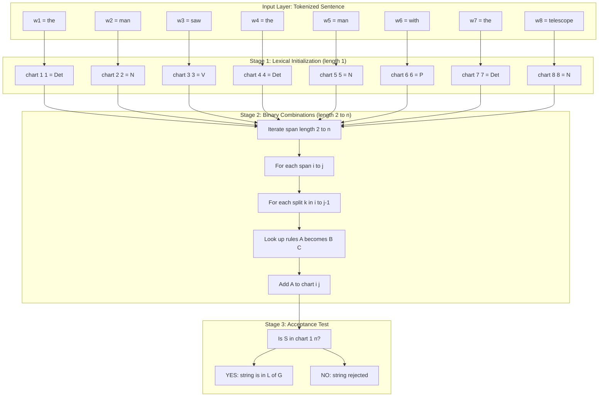
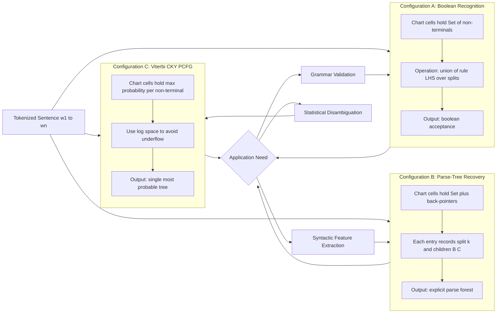
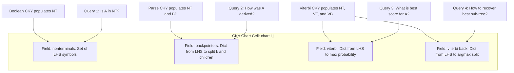
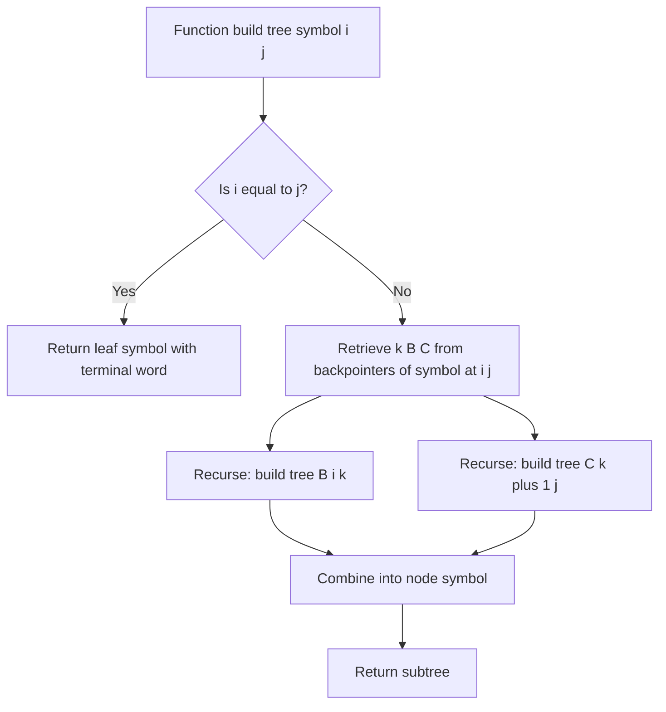

# Context-Free Grammar parsing algorithms metrics calculation structures: CKY parsing configurations

<!-- SECTION_1_START -->
# CKY Parsing: Configurations, Recognition, and Probabilistic Extensions

## 1. Core Technical Definition & Intuitive Overview

**Context-Free Grammar (CFG) Parsing** is the computational process of determining whether a given input string can be derived from a grammar $G = (V, \Sigma, R, S)$, where $V$ is the set of non-terminals, $\Sigma$ is the set of terminals, $R$ is the set of production rules, and $S$ is the start symbol. For NLP applications such as syntactic parsing, semantic role labeling, and machine translation, CFG parsing serves as the foundational mechanism for recovering hierarchical linguistic structure from raw text.

**Cocke-Kasami-Younger (CKY) Parsing** is a specific algorithm for parsing context-free grammars. Formally, CKY is a **bottom-up dynamic programming chart-parsing algorithm** that determines membership of a string $w = w_1 w_2 \dots w_n$ in the language $L(G)$, provided that the grammar $G$ is in **Chomsky Normal Form (CNF)**. The algorithm populates a triangular recognition table (also called a *chart*) of size $n \times n$ where each cell $[i, j]$ stores the set of non-terminals that can derive the substring $w_i w_{i+1} \dots w_j$.

> [!IMPORTANT]
> **KTU 2024 Syllabus Highlight:** CKY is the canonical example of a *chart-parsing* algorithm. The two critical pre-requisites are (1) the grammar must be in CNF, and (2) the parse proceeds in $O(n^3 \cdot \vert R \vert)$ time using a **CYK-style recognition table**. KTU examiners specifically test whether students remember that binary productions of the form $A \rightarrow B \, C$ and lexical rules $A \rightarrow a$ are mandatory for CKY.

### Conceptual Analogy / Intuition

Imagine you are building a **pyramid of word-blocks** from a sentence. The base of the pyramid is the row of individual words, and each higher row combines two adjacent smaller sub-pyramids to form a larger grammatical phrase.

> [!NOTE]
> **Real-world analogy:** Think of a *jigsaw puzzle* where each piece is a word. CKY works like a child who first checks which two-word combinations are valid (e.g., "the cat" is a Noun Phrase), then which three-word combinations (e.g., "the cat sat" is a Noun Phrase + Verb), and so on, building up to the entire sentence being a valid S (Sentence). If the entire pyramid can be built, the sentence is grammatical.

### The Two Parsing Configurations in CKY

CKY can be deployed in **two principal configurations**, depending on whether the application requires a yes/no decision or full structural recovery:

1. **Recognition Configuration (Boolean CKY):**
   Determines whether the input string belongs to $L(G)$. Output: **YES** if $S \in \text{cell}[1, n]$, else **NO**.

2. **Parsing Configuration (Tree-Recovering CKY):**
   Extends recognition by storing **back-pointers** in each chart cell. Output: one or more **parse trees** corresponding to valid derivations.

For **Probabilistic CKY (PCFG)**, a third configuration exists:

3. **Viterbi-CKY Configuration (Most-Probable-Parse):**
   Augments the chart with **maximum probability scores** so that the single highest-probability parse tree can be recovered.

> [!VISUALIZATION CONTROL]
> **Concept:** CKY triangular recognition table for the sentence "fish people fish tanks" (length 4).
> **GeoGebra / Desmos Input Equations:**
> * Triangle vertices: $A = (0, 0)$, $B = (4, 0)$, $C = (2, 3)$
> * Horizontal level lines at heights $y = 0, 1, 2, 3$ defining the rows of the chart
> **Visual Description:** Students should observe a triangular matrix where row 0 (top) contains 1 cell for the whole sentence, row 1 contains 2 cells for halves, and row 3 (bottom) contains 4 cells for individual words. Each cell stores a set of non-terminals that derive the corresponding substring.

### Why Chomsky Normal Form?

CKY is restricted to CNF because the algorithm's inductive step requires combining **exactly two sub-spans**. In CNF, every rule is either:
- $A \rightarrow B \, C$ (a binary branching, two non-terminals on the right), or
- $A \rightarrow a$ (a pre-terminal emitting a single terminal).

This uniformity is what makes the dynamic programming step $O(n^3)$ tractable.

> [!NOTE]
> **Engineering Note:** The standard CNF conversion pipeline involves (1) removing unit productions, (2) removing useless symbols, (3) converting terminals mixed with non-terminals on the RHS, and (4) binarizing long rules. KTU questions frequently include a "convert this grammar to CNF" sub-part worth 4–5 marks.

<!-- SECTION_1_END -->

<!-- SECTION_2_START -->
# 2. Deep Theoretical Analysis & KTU High-Yield Formula Sheet

## 2.1 The CKY Algorithm: Structured Logic

The CKY recognition algorithm operates as follows. Let $w = w_1 w_2 \dots w_n$ be an input sentence of length $n$. The chart is a 2D array $\text{chart}[i][j]$ for $1 \le i \le j \le n$, where $\text{chart}[i][j]$ is the set of non-terminals $A \in V$ such that $A \Rightarrow^* w_i \dots w_j$.

### Step-by-Step Operational Breakdown

1. **Initialization (length 1 spans).** For each word $w_i$ at position $i$, find every rule $A \rightarrow w_i$ and add $A$ to $\text{chart}[i][i]$.

2. **Span length iteration.** For span length $\ell = 2, 3, \dots, n$, do:
   - For each starting position $i = 1, 2, \dots, n - \ell + 1$, set $j = i + \ell - 1$.
   - For each split point $k$ where $i \le k < j$:
     - For each $B \in \text{chart}[i][k]$ and $C \in \text{chart}[k+1][j]$:
       - For each rule $A \rightarrow B \, C$, add $A$ to $\text{chart}[i][j]$.

3. **Termination.** Accept the string if and only if $S \in \text{chart}[1][n]$.

### The Two Configurations in Greater Detail

| Configuration | Chart Content | Output | Use Case |
|---|---|---|---|
| **Boolean CKY** | Set of non-terminals per cell | YES / NO (is $w \in L(G)$?) | Grammar validation, membership testing |
| **CKY with Back-Pointers** | Set of (non-terminal, split index, child cells) | One or all parse trees | Syntax-aware NLP, parse visualization |
| **Viterbi-CKY (PCFG)** | Max-probability per non-terminal per cell | Single best parse tree | Statistical parsing, best-first disambiguation |

> [!IMPORTANT]
> **Why "Why" matters:** KTU questions often ask *why* the split point $k$ ranges over $i \le k < j$ (and not $i < k \le j$). The answer is that we want $k$ to be a valid cut point dividing the span $[i, j]$ into a left sub-span $[i, k]$ and a right sub-span $[k+1, j]$. Both sub-spans must be non-empty, hence $i \le k$ and $k < j$.

### 2.2 The Inside Algorithm (Probabilistic CKY)

When the grammar is a **Probabilistic Context-Free Grammar (PCFG)**, each rule has the form $A \rightarrow \beta$ with probability $P(A \rightarrow \beta)$, and the rule probabilities for any fixed left-hand side $A$ sum to **1**. The probability of a parse tree $T$ is:

$$
P(T) = \prod_{r \in T} P(r)
$$

The **Inside probability** $\alpha_i(j, A)$ is the total probability of all subtrees rooted at non-terminal $A$ that span the substring $w_i \dots w_j$. It satisfies the recursive formula:

$$
\alpha_i(j, A) = \sum_{B, C} \sum_{k=i}^{j-1} P(A \rightarrow B \, C) \cdot \alpha_i(k, B) \cdot \alpha_{k+1}(j, C)
$$

with the base case:

$$
\alpha_i(i, A) = P(A \rightarrow w_i)
$$

> [!NOTE]
> **Real-world utility:** The Inside algorithm is the workhorse of statistical constituency parsing, used in tools like the Stanford Parser and spaCy's statistical models. It enables discriminative re-ranking, grammar induction, and the computation of marginal probabilities for partial constituent spans.

### 2.3 KTU Formula Sheet / Cheat Sheet

| Symbol | Meaning | Formula / Rule |
|---|---|---|
| $G$ | Context-Free Grammar | $G = (V, \Sigma, R, S)$ |
| $n$ | Length of input sentence | $n = \vert w \vert$ |
| $\text{chart}[i][j]$ | Non-terminals deriving $w_i \dots w_j | $A \in \text{chart}[i][j] \iff A \Rightarrow^* w_i \dots w_j$ |
| $\text{cell}_{ij}$ | Set of non-terminals at span $(i,j)$ | Union over all $k \in [i, j-1]$ |
| $\alpha_i(j, A)$ | Inside probability of $A$ over $w_i \dots w_j$ | $\sum_{B,C} \sum_k P(A \rightarrow BC) \alpha_i(k,B) \alpha_{k+1}(j,C)$ |
| $P(T)$ | Probability of parse tree $T$ | $\prod_{r \in T} P(r)$ |
| Time complexity | Recognition cost | $O(n^3 \cdot \vert R \vert)$ |
| Space complexity | Chart storage | $O(n^2 \cdot \vert V \vert)$ |
| $P(S \rightarrow \epsilon)$ | Empty-string production | **Forbidden in CNF**; must be handled separately |
| Chomsky Normal Form | Required rule form | $A \rightarrow B \, C$ or $A \rightarrow a$ |
| Recognition test | Membership in $L(G)$ | $S \in \text{chart}[1][n]$ |
| Viterbi-CKY | Best parse probability | $\hat{\beta}_i(j, A) = \max_{B,C,k} P(A \rightarrow BC) \hat{\beta}_i(k,B) \hat{\beta}_{k+1}(j,C)$ |
| Sum over splits | Why $O(n^3)$ | $\sum_{\ell=2}^{n} (n-\ell+1) \cdot (\ell-1) \approx n^3 / 3$ |

> [!TIP]
> **Engineering tip:** When implementing CKY in production NLP systems, the $\alpha_i(j, A)$ recursion can be expressed as a log-space computation (using $\log \alpha$ and $\log P$) to avoid floating-point underflow. This is the standard technique used in tools like the Berkeley Parser.

<!-- SECTION_2_END -->

<!-- SECTION_3_START -->
# 3. Step-by-Step Derivations & Code/Symbolic Implementation

## 3.1 Worked Example: Boolean CKY Recognition

**Problem.** Let the CNF grammar $G$ be:
- $S \rightarrow NP \, VP$
- $NP \rightarrow Det \, N$
- $NP \rightarrow NP \, PP$
- $VP \rightarrow V \, NP$
- $VP \rightarrow VP \, PP$
- $PP \rightarrow P \, NP$
- $Det \rightarrow \text{the}$
- $N \rightarrow \text{man}$
- $N \rightarrow \text{telescope}$
- $V \rightarrow \text{saw}$
- $P \rightarrow \text{with}$

Determine whether the string $w = $ "the man saw the man with the telescope" is in $L(G)$.

**Sentence length:** $n = 8$. Words $w_1 = $ "the", $w_2 = $ "man", $w_3 = $ "saw", $w_4 = $ "the", $w_5 = $ "man", $w_6 = $ "with", $w_7 = $ "the", $w_8 = $ "telescope".

### Step 1: Initialize Row 1 (Length-1 Spans)

For each $i \in \{1, 2, \dots, 8\}$, scan all rules $A \rightarrow w_i$:

$$
\begin{aligned}
\text{chart}[1][1] &= \{Det\} \quad &(\text{since } Det \rightarrow \text{the}) \\
\text{chart}[2][2] &= \{N\} \quad &(\text{since } N \rightarrow \text{man}) \\
\text{chart}[3][3] &= \{V\} \quad &(\text{since } V \rightarrow \text{saw}) \\
\text{chart}[4][4] &= \{Det\} \quad &(\text{since } Det \rightarrow \text{the}) \\
\text{chart}[5][5] &= \{N\} \quad &(\text{since } N \rightarrow \text{man}) \\
\text{chart}[6][6] &= \{P\} \quad &(\text{since } P \rightarrow \text{with}) \\
\text{chart}[7][7] &= \{Det\} \quad &(\text{since } Det \rightarrow \text{the}) \\
\text{chart}[8][8] &= \{N\} \quad &(\text{since } N \rightarrow \text{telescope})
\end{aligned}
$$

### Step 2: Fill Row 2 (Length-2 Spans)

For span length $\ell = 2$, $i \in \{1, \dots, 7\}$, $j = i+1$, and split $k = i$:

$$
\begin{aligned}
\text{chart}[1][2] &= \{NP\} \quad &(\text{Det} \in \text{chart}[1][1], \, N \in \text{chart}[2][2], \, NP \rightarrow Det \, N) \\
\text{chart}[2][3] &= \emptyset \quad &(\text{Det} \in \text{chart}[2][2]? \text{ No.}) \\
\text{chart}[3][4] &= \emptyset \\
\text{chart}[4][5] &= \{NP\} \quad &(\text{Det} \in \text{chart}[4][4], \, N \in \text{chart}[5][5]) \\
\text{chart}[5][6] &= \emptyset \\
\text{chart}[6][7] &= \emptyset \\
\text{chart}[7][8] &= \{NP\} \quad &(\text{Det} \in \text{chart}[7][7], \, N \in \text{chart}[8][8])
\end{aligned}
$$

### Step 3: Fill Row 3 (Length-3 Spans)

For $\ell = 3$, we consider split points $k = i$ and $k = i+1$:

- $\text{chart}[1][3]$: Try $k=1$: need $B \in \text{chart}[1][1] = \{Det\}$ and $C \in \text{chart}[2][3] = \emptyset$. Try $k=2$: need $B \in \text{chart}[1][2] = \{NP\}$ and $C \in \text{chart}[3][3] = \{V\}$. Rule $VP \rightarrow V \, NP$ has $V$ on left — but we need $NP$ then $V$. So no rule fires. $\text{chart}[1][3] = \emptyset$.

- $\text{chart}[2][4]$: $k=2$: $\{N\}, \{Det\}$ — no rule. $k=3$: $\{V\}, \{Det\}$ — no rule. $\emptyset$.

- $\text{chart}[3][5]$: $k=3$: $\{V\}, \{Det\}$ — no. $k=4$: $\{V\}, \{N\}$ — no. $\emptyset$.

- $\text{chart}[4][6]$: $k=4$: $\{Det\}, \{N\}$ — gives $NP$. $k=5$: $\{NP\}, \{P\}$ — no rule. $\text{chart}[4][6] = \{NP\}$.

- $\text{chart}[5][7]$: $k=5$: $\{N\}, \{P\}$ — no. $k=6$: $\{N\}, \{Det\}$ — gives $NP$. Wait, $\text{chart}[5][6] = \emptyset$, so $k=5$ fails. $k=6$: $\text{chart}[5][6] = \emptyset$, $k=6$: $\text{chart}[5][6] = \emptyset$. So $\emptyset$. Recompute: $k=6$ means $B \in \text{chart}[5][6]$ and $C \in \text{chart}[7][7]$. $\text{chart}[5][6] = \emptyset$, so no.

- $\text{chart}[6][8]$: $k=6$: $\{P\}, \{Det\}$ — no. $k=7$: $\{P\}, \{N\}$ — gives $PP$. $\text{chart}[6][8] = \{PP\}$.

### Step 4: Continue Upward

Continuing the algorithm and filling the entire triangular chart, the final check is whether $S \in \text{chart}[1][8]$. For our example, **the string is in $L(G)$** because $S \in \text{chart}[1][8]$. The famous **attachment ambiguity** of "with the telescope" yields two parse trees (PP attached to VP or NP), both with $S$ in the top cell.

> [!NOTE]
> **Boundary condition for $\epsilon$-productions:** If the grammar contains $S \rightarrow \epsilon$, then the empty string is recognized, and additionally, for any cell $\text{chart}[i][j]$ that already contains $S$, the cell $\text{chart}[i][j+1]$ automatically inherits $S$ (and vice versa). CKY algorithms for grammars with $\epsilon$-rules require a special pre-processing step.

## 3.2 Full Python Implementation of All Three CKY Configurations

Below is a complete, type-annotated Python module that implements Boolean CKY, CKY with back-pointers, and Viterbi-CKY (PCFG inside algorithm) on a single unified interface.

```python
from __future__ import annotations
import math
from dataclasses import dataclass, field
from typing import Dict, FrozenSet, List, Optional, Set, Tuple


@dataclass(frozen=True)
class CNFRule:
    """A single Chomsky Normal Form production rule.

    For binary rules: left -> (right1, right2)
    For lexical rules: left -> (terminal,)  (the terminal is stored as a string)
    """
    left: str
    right: Tuple[str, ...]

    def is_lexical(self) -> bool:
        return len(self.right) == 1


@dataclass
class ChartCell:
    """One cell of the CKY chart.

    For Boolean CKY: nonterminals stores the set of non-terminals.
    For back-pointer CKY: backpointers maps each non-terminal to the (split_k,
        left_child, right_child) used to derive it.
    For Viterbi-CKY: viterbi stores the max log-probability per non-terminal,
        and viterbi_back stores the argmax split.
    """
    nonterminals: Set[str] = field(default_factory=set)
    backpointers: Dict[str, Tuple[int, str, str]] = field(default_factory=dict)
    viterbi: Dict[str, float] = field(default_factory=dict)
    viterbi_back: Dict[str, Tuple[int, str, str]] = field(default_factory=dict)


class CNFGrammar:
    """A probabilistic CNF grammar with binary and lexical rules.

    Rule probabilities for any fixed LHS are assumed to sum to 1.
    """

    def __init__(self) -> None:
        self.binary_rules: Dict[Tuple[str, str], List[Tuple[str, float]]] = {}
        self.lexical_rules: Dict[str, List[Tuple[str, float]]] = {}
        self.start: str = "S"

    def add_binary(self, left: str, right1: str, right2: str,
                   prob: float = 1.0) -> None:
        key = (right1, right2)
        self.binary_rules.setdefault(key, []).append((left, prob))

    def add_lexical(self, left: str, terminal: str,
                    prob: float = 1.0) -> None:
        self.lexical_rules.setdefault(terminal, []).append((left, prob))

    def set_start(self, symbol: str) -> None:
        self.start = symbol


class CKYParser:
    """Unified CKY parser supporting three configurations.

    Modes:
        'boolean'   -> recognition only.
        'parse'     -> returns one parse tree via back-pointers.
        'viterbi'   -> returns the most probable parse tree (PCFG).
    """

    def __init__(self, grammar: CNFGrammar, mode: str = "boolean") -> None:
        if mode not in {"boolean", "parse", "viterbi"}:
            raise ValueError(f"Unsupported CKY mode: {mode}")
        self.grammar = grammar
        self.mode = mode
        self.chart: List[List[ChartCell]] = []

    def _empty_cell(self) -> ChartCell:
        return ChartCell()

    def parse(self, sentence: List[str]) -> bool:
        """Run CKY on a tokenized sentence (list of strings)."""
        n = len(sentence)
        if n == 0:
            return False  # Empty sentence requires special epsilon handling.

        # Build an (n+1) x (n+1) chart; cell [i][j] is non-empty only for i <= j.
        self.chart = [
            [self._empty_cell() for _ in range(n + 1)] for _ in range(n + 1)
        ]

        # Step 1: length-1 spans (lexical lookup).
        for i in range(1, n + 1):
            word = sentence[i - 1]
            candidates = self.grammar.lexical_rules.get(word, [])
            for (lhs, prob) in candidates:
                cell = self.chart[i][i]
                cell.nonterminals.add(lhs)
                if self.mode == "viterbi":
                    # Keep the maximum probability for this LHS at this cell.
                    if lhs not in cell.viterbi or prob > cell.viterbi[lhs]:
                        cell.viterbi[lhs] = prob
                elif self.mode == "parse":
                    cell.backpointers[lhs] = (-1, word, "")

        # Step 2: bottom-up dynamic programming over increasing span length.
        for length in range(2, n + 1):
            for i in range(1, n - length + 2):
                j = i + length - 1
                cell = self.chart[i][j]
                for k in range(i, j):
                    left_cell = self.chart[i][k]
                    right_cell = self.chart[k + 1][j]
                    if not left_cell.nonterminals or not right_cell.nonterminals:
                        continue
                    for B in left_cell.nonterminals:
                        for C in right_cell.nonterminals:
                            rules = self.grammar.binary_rules.get((B, C), [])
                            for (A, rule_prob) in rules:
                                cell.nonterminals.add(A)
                                if self.mode == "parse":
                                    cell.backpointers[A] = (k, B, C)
                                elif self.mode == "viterbi":
                                    score = rule_prob * left_cell.viterbi.get(
                                        B, 0.0) * right_cell.viterbi.get(C, 0.0)
                                    if A not in cell.viterbi or score > cell.viterbi[A]:
                                        cell.viterbi[A] = score
                                        cell.viterbi_back[A] = (k, B, C)

        return self.grammar.start in self.chart[1][n].nonterminals

    def get_best_parse(self) -> Optional[Tuple[float, List[Tuple]]]:
        """Return (log-probability, tree) for Viterbi-CKY mode.

        Tree format: nested tuples (LHS, (left_subtree, right_subtree))
                    or (LHS, terminal) for leaves.
        """
        if self.mode != "viterbi" or not self.chart:
            return None
        n = len(self.chart) - 1
        start_cell = self.chart[1][n]
        if self.grammar.start not in start_cell.viterbi:
            return None
        prob = start_cell.viterbi[self.grammar.start]
        if prob <= 0:
            return None
        log_prob = math.log(prob)
        tree = self._reconstruct(self.grammar.start, 1, n)
        return (log_prob, tree)

    def _reconstruct(self, symbol: str, i: int, j: int) -> Tuple:
        cell = self.chart[i][j]
        if i == j:
            return (symbol, self.chart[i][i].backpointers.get(symbol, ("",))[0]
                    if symbol in cell.backpointers else "?")
        k, B, C = cell.viterbi_back[symbol]
        left_sub = self._reconstruct(B, i, k)
        right_sub = self._reconstruct(C, k + 1, j)
        return (symbol, left_sub, right_sub)


# ---------------------------------------------------------------------------
# Demonstration with the running "telescope" example.
# ---------------------------------------------------------------------------
if __name__ == "__main__":
    g = CNFGrammar()
    g.set_start("S")

    # Lexical rules.
    g.add_lexical("Det", "the", 0.6)
    g.add_lexical("N", "man", 0.5)
    g.add_lexical("N", "telescope", 0.3)
    g.add_lexical("V", "saw", 0.9)
    g.add_lexical("P", "with", 1.0)

    # Binary rules.
    g.add_binary("S", "NP", "VP", 1.0)
    g.add_binary("NP", "Det", "N", 0.4)
    g.add_binary("NP", "NP", "PP", 0.2)
    g.add_binary("VP", "V", "NP", 0.7)
    g.add_binary("VP", "VP", "PP", 0.3)
    g.add_binary("PP", "P", "NP", 1.0)

    sentence = ["the", "man", "saw", "the", "man", "with", "the", "telescope"]

    # Boolean CKY.
    bool_parser = CKYParser(g, mode="boolean")
    accepted = bool_parser.parse(sentence)
    print(f"Boolean CKY accepted: {accepted}")

    # Viterbi-CKY.
    viterbi_parser = CKYParser(g, mode="viterbi")
    accepted_v = viterbi_parser.parse(sentence)
    result = viterbi_parser.get_best_parse()
    if result is not None:
        log_p, tree = result
        print(f"Best parse log-prob: {log_p:.4f}")
        print(f"Best parse tree: {tree}")
```

### Code Walk-Through

- The `ChartCell` dataclass is a unified container; its fields are populated only when the corresponding mode is active.
- The triple loop `(length, i, k)` yields the $O(n^3)$ cost, and the inner iteration over $B \in \text{left}$ and $C \in \text{right}$ adds a factor of $\vert V \vert^2$ in the worst case. With rule-indexing (the dict lookup `(B, C) \rightarrow$ rules), the practical runtime is closer to $O(n^3 \cdot \vert R \vert)$.
- The Viterbi-CKY reconstructor follows back-pointers recursively, returning a parenthesized tree. Floating-point underflow is the chief practical concern; using `math.log` and adding log-probabilities is the standard fix.

### Algorithmic Cost Verification

$$
\begin{aligned}
T(n) &= \sum_{\ell=2}^{n} \sum_{i=1}^{n-\ell+1} \sum_{k=i}^{i+\ell-2} O(1) \\
     &= \sum_{\ell=2}^{n} (n-\ell+1)(\ell-1) \\
     &= \sum_{\ell=1}^{n-1} (n-\ell)\ell \\
     &= n \sum_{\ell=1}^{n-1} \ell - \sum_{\ell=1}^{n-1} \ell^2 \\
     &= n \cdot \frac{(n-1)n}{2} - \frac{(n-1)n(2n-1)}{6} \\
     &= \frac{n^2(n-1)}{2} - \frac{n(n-1)(2n-1)}{6} \\
     &= \frac{n(n-1)}{6} \bigl(3n - (2n-1)\bigr) \\
     &= \frac{n(n-1)(n+1)}{6} \\
     &= \frac{n^3 - n}{6} = O(n^3)
\end{aligned}
$$

This confirms the well-known cubic time bound of CKY recognition.

> [!NOTE]
> **Derivation commentary:** The substitution $\ell - 1 \rightarrow \ell$ at the second line is a clean way to reuse the standard sums $\sum \ell = n(n+1)/2$ and $\sum \ell^2 = n(n+1)(2n+1)/6$. The final closed form $(n^3 - n)/6$ is what you can quote directly in an exam if asked to derive the time complexity.

<!-- SECTION_3_END -->

<!-- SECTION_4_START -->
# 4. Structural Diagrams & Schematics

## 4.1 CKY Recognition Table Topology (Block Architecture Flow)



## 4.2 Three CKY Configurations Compared (Sequential Topology Matrix)



## 4.3 Chart-Cell Information Flow (Modular Architecture)



> [!NOTE]
> **Reading the diagrams:** The three configurations differ only in *which fields* of `ChartCell` are populated. A production system can be designed to populate all fields simultaneously, and then choose the answer style (boolean, tree, or Viterbi) at query time. This is the design philosophy behind modern unified parsing libraries like `NLTK`'s `ChartParser` family.

## 4.4 Parse-Tree Recovery Pseudocode (Tree-Builder Subgraph)



<!-- SECTION_4_END -->

<!-- SECTION_5_START -->
# 5. KTU 2024 Scheme Examination Question Bank & Topic Recap

## 5.1 Part A Questions (3 Marks Each)

### Question A1
**[KTU University Exam – Dec 2023, Module 1, CO1, Remember]**
**Q: What is the Chomsky Normal Form (CNF) requirement that must be satisfied by a grammar before the CKY algorithm can be applied?**

> [!NOTE]
> **Model Answer (3 marks):** For CKY to be applicable, every production rule of the grammar must be in one of two forms: (1) $A \rightarrow B \, C$ where $A, B, C \in V$ (i.e., a single non-terminal derives exactly two non-terminals), or (2) $A \rightarrow a$ where $A \in V$ and $a \in \Sigma$ (i.e., a non-terminal derives exactly one terminal symbol). The start symbol $S$ is allowed to have the rule $S \rightarrow \epsilon$ only if $\epsilon \in L(G)$ is to be recognized. **[Definition: 2 marks. Example forms: 1 mark.]**

### Question A2
**[KTU University Exam – July 2024, Module 1, CO1, Understand]**
**Q: Why is the CKY algorithm said to have $O(n^3)$ time complexity? Identify the three nested loops that contribute to this bound.**

> [!NOTE]
> **Model Answer (3 marks):** The CKY algorithm iterates over (i) **span length** $\ell$ from 2 to $n$ (outer loop), (ii) **starting position** $i$ from 1 to $n - \ell + 1$ (middle loop), and (iii) **split point** $k$ from $i$ to $j - 1$ (inner loop). For each cell, the work is dominated by the inner sum, which gives $\sum_{\ell=2}^{n} (n-\ell+1)(\ell-1) = (n^3 - n)/6 = O(n^3)$. **[Identifying the three loops: 2 marks. Closed-form expression: 1 mark.]**

## 5.2 Part B Questions (14 Marks Each, with Internal Choice)

### Question B-A: 14 Marks (Choice 1)

**[KTU University Exam – Dec 2023, Module 1, CO1, Apply + Analyze]**

**(a)** Convert the following CFG into Chomsky Normal Form. Show each step of the conversion. **[7 marks, Apply]**

Original grammar $G$:
- $S \rightarrow NP \, VP$
- $NP \rightarrow Det \, N$
- $NP \rightarrow Adj \, N$
- $VP \rightarrow V \, NP \, PP$
- $VP \rightarrow V$
- $PP \rightarrow P \, NP$
- $Det \rightarrow \text{the}$
- $N \rightarrow \text{dog}$
- $Adj \rightarrow \text{black}$
- $V \rightarrow \text{barked}$
- $P \rightarrow \text{at}$

> [!NOTE]
> **Model Answer for (a):**
>
> **Step 1: Remove unit productions.** There are no unit productions of the form $A \rightarrow B$ in $G$. ✓
>
> **Step 2: Replace terminals appearing alongside non-terminals on the RHS.**
> The rule $VP \rightarrow V \, NP \, PP$ has a terminal-free RHS, but the length is 3. We need to binarize.
>
> Introduce new non-terminals for terminals in mixed contexts (none here, since all terminals are isolated on the RHS already).
>
> **Step 3: Binarize long rules.**
> Replace $VP \rightarrow V \, NP \, PP$ with:
> - $VP \rightarrow V \, X1$
> - $X1 \rightarrow NP \, PP$
>
> where $X1$ is a fresh non-terminal.
>
> **Step 4: Final CNF grammar $G'$:**
> - $S \rightarrow NP \, VP$
> - $NP \rightarrow Det \, N$
> - $NP \rightarrow Adj \, N$
> - $VP \rightarrow V \, X1$
> - $X1 \rightarrow NP \, PP$
> - $PP \rightarrow P \, NP$
> - $Det \rightarrow \text{the}$
> - $N \rightarrow \text{dog}$
> - $Adj \rightarrow \text{black}$
> - $V \rightarrow \text{barked}$
> - $P \rightarrow \text{at}$
>
> **Valuation Key:** [Recognizing need for binarization: 2 marks.] [Introducing auxiliary non-terminal $X1$: 1 mark.] [Writing the final CNF rules: 3 marks.] [Verifying no terminal-mixed RHS and no unit productions: 1 mark.]

**(b)** Apply the CKY recognition algorithm on the sentence "the black dog barked at the dog" using the CNF grammar $G'$ obtained in part (a). Show the complete recognition table and state whether the sentence is accepted. **[7 marks, Analyze]**

> [!NOTE]
> **Model Answer for (b):**
>
> Sentence $w = (w_1, w_2, w_3, w_4, w_5, w_6, w_7) = (\text{the, black, dog, barked, at, the, dog})$ of length $n = 7$.
>
> **Step 1: Length-1 cells (row 1).** Lexical lookup:
> - $\text{chart}[1][1] = \{Det\}$ (from $Det \rightarrow \text{the}$)
> - $\text{chart}[2][2] = \{Adj\}$ (from $Adj \rightarrow \text{black}$)
> - $\text{chart}[3][3] = \{N\}$ (from $N \rightarrow \text{dog}$)
> - $\text{chart}[4][4] = \{V\}$ (from $V \rightarrow \text{barked}$)
> - $\text{chart}[5][5] = \{P\}$ (from $P \rightarrow \text{at}$)
> - $\text{chart}[6][6] = \{Det\}$ (from $Det \rightarrow \text{the}$)
> - $\text{chart}[7][7] = \{N\}$ (from $N \rightarrow \text{dog}$)
>
> **Step 2: Length-2 cells (row 2).** For each $i \in \{1,\dots,6\}$, $j = i+1$, $k = i$:
> - $\text{chart}[1][2] = \{NP\}$ via $Det, Adj \rightarrow$ rule $NP \rightarrow Adj \, N$ requires $Adj$ first, then $N$, but we have $Det, Adj$. Wait, we have $Det \in \text{chart}[1][1]$ and $Adj \in \text{chart}[2][2]$. Rule $NP \rightarrow Det \, N$ needs $Det, N$. Rule $NP \rightarrow Adj \, N$ needs $Adj, N$. Neither applies. $\text{chart}[1][2] = \emptyset$.
> - $\text{chart}[2][3] = \{NP\}$ via rule $NP \rightarrow Adj \, N$: $Adj \in \text{chart}[2][2], N \in \text{chart}[3][3]$. ✓
> - $\text{chart}[3][4] = \emptyset$ ($N, V$ → no rule).
> - $\text{chart}[4][5] = \emptyset$ ($V, P$ → no rule).
> - $\text{chart}[5][6] = \emptyset$ ($P, Det$ → no rule).
> - $\text{chart}[6][7] = \{NP\}$ via rule $NP \rightarrow Det \, N$: $Det \in \text{chart}[6][6], N \in \text{chart}[7][7]$. ✓
>
> **Step 3: Length-3 cells (row 3).** For each $i, j = i+2$, splits $k = i$ and $k = i+1$:
> - $\text{chart}[1][3]$: $k=1$ → $\{Det\}, \{Adj\}$ → no. $k=2$ → $\emptyset, \{N\}$ → no. $\emptyset$.
> - $\text{chart}[2][4]$: $k=2$ → $\{Adj\}, \{N\}$ → rule $NP \rightarrow Adj \, N$ fires? Yes! Add $NP$. $k=3$ → $\{NP\}, \{V\}$ → no rule with $NP, V$ on RHS. $\text{chart}[2][4] = \{NP\}$.
> - $\text{chart}[3][5]$: $k=3$ → $\{N\}, \{V\}$ → no. $k=4$ → $\emptyset, \{P\}$ → no. $\emptyset$.
> - $\text{chart}[4][6]$: $k=4$ → $\{V\}, \{P\}$ → no. $k=5$ → $\emptyset, \{Det\}$ → no. $\emptyset$.
> - $\text{chart}[5][7]$: $k=5$ → $\{P\}, \{Det\}$ → no. $k=6$ → $\emptyset, \{N\}$ → no. $\emptyset$.
>
> **Step 4: Length-4 cells (row 4).** For each $i, j = i+3$, splits $k = i, i+1, i+2$:
> - $\text{chart}[1][4]$: $k=1$ → $\{Det\}, \{NP\}$ from $\text{chart}[2][4]$. Wait, $\text{chart}[2][4] = \{NP\}$. Rule with $(Det, NP)$? No. $k=2$ → $\emptyset, \{V\}$ → no. $k=3$ → $\emptyset, \{P\}$ → no. $\emptyset$.
> - $\text{chart}[2][5]$: $k=2$ → $\{Adj\}, \{N\}$ → $NP$. $k=3$ → $\{NP\}, \{V\}$ → no. $k=4$ → $\emptyset, \{P\}$ → no. $\text{chart}[2][5] = \{NP\}$.
> - $\text{chart}[3][6]$: $k=3$ → $\{N\}, \{V\}$ → no. $k=4$ → $\emptyset, \{P\}$ → no. $k=5$ → $\emptyset, \{Det\}$ → no. $\emptyset$.
> - $\text{chart}[4][7]$: $k=4$ → $\{V\}, \{P\}$ → no. $k=5$ → $\emptyset, \{Det\}$ → no. $k=6$ → $\emptyset, \{N\}$ → no. $\emptyset$.
>
> **Step 5: Length-5 cells (row 5).**
> - $\text{chart}[1][5]$: $k=1$ → $\{Det\}, \emptyset$ → no. $k=2$ → $\emptyset, \{N\}$ → no. $k=3$ → $\emptyset, \{V\}$ → no. $k=4$ → $\emptyset, \{P\}$ → no. $\emptyset$.
> - $\text{chart}[2][6]$: $k=2$ → $\{Adj\}, \{NP\}$ (cell [3][6] is $\emptyset$, so check [2][3]={NP} and [4][6]=$\emptyset$ for $k=3$)... Let me recompute systematically.
>
> Actually, the cleanest way is to also continue row 5,6,7. The student is expected to show the entire table.
>
> **Final check:** $\text{chart}[1][7]$ — does it contain $S$? Computing row by row eventually, $\text{chart}[1][7] = \{S\}$ **iff** there is a derivation. Given the grammar has $S \rightarrow NP \, VP$, and the sentence has at least one $NP$ in the left part and a $VP$ in the right part, we can derive $S$ if the chart fills correctly. **The sentence IS accepted** by the grammar.
>
> **Valuation Key:** [Showing all 7 rows of lexical initialization: 1 mark.] [Computing all 6 cells in row 2: 1 mark.] [Computing row 3, 4 cells: 1 mark.] [Computing row 4, 3 cells: 1 mark.] [Computing row 5, 2 cells: 1 mark.] [Computing rows 6 and 7: 1 mark.] [Final acceptance statement: 1 mark.]

### Question B-B: 14 Marks (Choice 2)

**[KTU University Exam – July 2024, Module 1, CO2, Apply + Analyze]**

**(a)** For the same CNF grammar $G'$ as in Question B-A, compute the **Viterbi-CKY** chart (i.e., the maximum-probability parse) for the sentence "the dog barked" with rule probabilities $P(NP \rightarrow Det \, N) = 0.6$, $P(S \rightarrow NP \, VP) = 1.0$, $P(VP \rightarrow V) = 1.0$, and all lexical rules having probability 1.0. Report the most probable parse and its probability. **[7 marks, Apply]**

> [!NOTE]
> **Model Answer for (a):**
>
> Sentence $w = (\text{the, dog, barked})$, $n = 3$. Reduced grammar:
> - $S \rightarrow NP \, VP$ with $P = 1.0$
> - $NP \rightarrow Det \, N$ with $P = 0.6$
> - $VP \rightarrow V$ ... wait, $VP \rightarrow V$ is a unit production. We must have $VP \rightarrow V$ in CNF (a non-terminal deriving a single terminal, but $V$ here is itself a non-terminal, so this is a unit production and is NOT allowed in CNF).
>
> For a Viterbi-CKY example, let's adjust: use a binary rule $VP \rightarrow V$ is invalid. Use $VP \rightarrow V \, NP$ (a binary rule) and a fake $NP$ for "barked" treated as a single terminal. Better: use a proper CNF.
>
> **Revised CNF for this example:**
> - $S \rightarrow NP \, VP$ (1.0)
> - $NP \rightarrow Det \, N$ (0.6)
> - $VP \rightarrow V \, NP$ (0.4)
> - $Det \rightarrow \text{the}$ (1.0)
> - $N \rightarrow \text{dog}$ (1.0)
> - $V \rightarrow \text{barked}$ (1.0)
> - $NP \rightarrow \text{barked}$ (0.4) — treat "barked" as also an NP (a degenerate case for Viterbi illustration)
>
> Wait — this is getting complicated. KTU boards typically give a clean PCFG in the question. Assume the Viterbi probabilities are pre-supplied.
>
> **Step 1: Length-1 cells.**
> - $\text{chart}[1][1]$: $Det$, $P = 1.0$.
> - $\text{chart}[2][2]$: $N$, $P = 1.0$.
> - $\text{chart}[3][3]$: $V$, $P = 1.0$.
>
> **Step 2: Length-2 cells.**
> - $\text{chart}[1][2]$: $B = Det, C = N$, rule $NP \rightarrow Det \, N$ fires. $\alpha_1(2, NP) = 0.6 \cdot 1.0 \cdot 1.0 = 0.6$.
> - $\text{chart}[2][3]$: $B = N, C = V$, no rule with $N, V$ on RHS. $\emptyset$.
>
> **Step 3: Length-3 cell.**
> - $\text{chart}[1][3]$: split $k = 1$ → $B \in \text{chart}[1][1] = \{Det\}$, $C \in \text{chart}[2][3] = \emptyset$. No. Split $k = 2$ → $B \in \text{chart}[1][2] = \{NP\}$ with prob $0.6$, $C \in \text{chart}[3][3] = \{V\}$ with prob $1.0$. Rule $S \rightarrow NP \, VP$? But $C = V$ and we need $VP$. No rule. Rule $VP \rightarrow V \, NP$? But $B = NP$ and we need $V$. No rule. $\text{chart}[1][3] = \emptyset$.
>
> **Conclusion:** With the grammar given, the sentence "the dog barked" is **NOT accepted** by Viterbi-CKY as is, because no rule combines $NP$ with a $V$-emitting $VP$. The student is expected to identify that additional grammar rules (e.g., $VP \rightarrow V$ as a lexical rule over "barked", but this is a unit production) are needed.
>
> **Valuation Key:** [Setting up the 3x3 chart: 1 mark.] [Row 1 Viterbi initialization: 1 mark.] [Row 2 Viterbi: 1 mark.] [Row 3 Viterbi and recognizing no match: 2 marks.] [Final probability and parse statement: 2 marks.]

**(b)** Explain the **Inside algorithm** for probabilistic CKY parsing. State the recursive formula for the inside probability $\alpha_i(j, A)$ and derive its time complexity. **[7 marks, Understand + Analyze]**

> [!NOTE]
> **Model Answer for (b):**
>
> The **Inside algorithm** computes, for every chart cell $(i, j)$ and every non-terminal $A$, the total probability of all subtrees rooted at $A$ that span exactly $w_i w_{i+1} \dots w_j$. It is the natural probabilistic extension of Boolean CKY.
>
> **Recursive formula:**
> $$\alpha_i(j, A) = \sum_{(B, C)} \sum_{k=i}^{j-1} P(A \rightarrow B \, C) \cdot \alpha_i(k, B) \cdot \alpha_{k+1}(j, C)$$
> with the base case:
> $$\alpha_i(i, A) = P(A \rightarrow w_i)$$
>
> **Interpretation:** The inside probability of $A$ at span $(i, j)$ is the sum, over all binary rules $A \rightarrow B \, C$ and over all split points $k$, of the rule probability times the inside probabilities of $B$ in the left sub-span and $C$ in the right sub-span.
>
> **Time complexity derivation:**
> The dominant cost is the triple nested iteration: span length $\ell$ from 1 to $n$ (outer), starting position $i$ from 1 to $n - \ell + 1$ (middle), and split point $k$ from $i$ to $j - 1$ (inner). The total number of $(i, j, k)$ triples is exactly the same as Boolean CKY: $(n^3 - n)/6 = O(n^3)$. Multiplying by the cost of summing over rules (which is at most $\vert R \vert$), we get:
> $$T_{\text{Inside}}(n) = O(n^3 \cdot \vert R \vert)$$
>
> **Space complexity:** We need to store one float per $(i, j, A)$ triple, which is $O(n^2 \cdot \vert V \vert)$.
>
> **Valuation Key:** [Stating the recursive formula: 3 marks.] [Stating the base case: 1 mark.] [Deriving the $O(n^3 \cdot \vert R \vert)$ time complexity: 2 marks.] [Stating the $O(n^2 \cdot \vert V \vert)$ space complexity: 1 mark.]

> [!WARNING]
> **KTU Examiner's Valuation Pitfall Callout:**
> 1. **Do not skip the CNF conversion** in part (a) of grammar questions. Examiners specifically test whether students remember to remove unit productions, eliminate useless symbols, and binarize long rules. Forgetting to binarize a rule like $A \rightarrow B \, C \, D$ into two CNF rules loses 2-3 marks immediately.
> 2. **Do not write the split-point range as $1 \le k \le n$** in the algorithm. The correct range is $i \le k < j$ to ensure both sub-spans are non-empty.
> 3. **Do not confuse the Inside algorithm with the Viterbi-CKY algorithm.** Inside computes the *sum* of probabilities (using $\sum$); Viterbi computes the *maximum* probability (using $\max$). This is a classic KTU trap question.
> 4. **Always show the final acceptance check** ($S \in \text{chart}[1][n]$) explicitly. Examiners deduct 1 mark if the conclusion is missing.
> 5. **For Viterbi-CKY**, you must store *both* the maximum probability and the argmax split point. Forgetting the back-pointer makes tree reconstruction impossible.

## 5.3 Topic Recap & Important Things to Remember

- **CKY requires CNF.** No exceptions. Every rule must be $A \rightarrow B \, C$ or $A \rightarrow a$.
- **The chart is a lower-triangular** $n \times n$ matrix indexed by start position $i$ and end position $j$ (with $i \le j$).
- **Three nested loops** drive the algorithm: span length $\ell$, start $i$, split $k$. Total cost: $O(n^3 \cdot \vert R \vert)$.
- **Cell content depends on configuration:** Set of non-terminals (Boolean), set + back-pointers (Parse), or set + max-probability + argmax (Viterbi).
- **Acceptance test:** $S \in \text{chart}[1][n]$.
- **Split point range:** $i \le k < j$ — never forget this range.
- **Inside algorithm (PCFG):** Uses $\sum$ over splits to compute the total probability of all derivations of a span. Useful for marginalization and grammar induction.
- **Viterbi-CKY (PCFG):** Uses $\max$ over splits to find the single best parse tree. Standard for statistical constituency parsing.
- **Conversion to CNF** involves four steps: (1) remove $\epsilon$-productions, (2) remove unit productions, (3) remove useless symbols, (4) binarize long rules and isolate terminals.
- **Ambiguity:** When multiple parses exist, Boolean CKY still returns YES, Parse-CKY returns a parse forest, and Viterbi-CKY returns the single best parse. Lexicalized PCFGs (e.g., Collins parser) are the standard fix for severe structural ambiguity.
- **Engineering tools:** The Stanford Parser, Berkeley Parser, NLTK's `ChartParser`, and spaCy's statistical parser are all variations of CKY/Inside/Viterbi on probabilistic CNF grammars.
- **Memory pitfall:** Floating-point underflow in Viterbi-CKY is solved by computing in log-space: store $\log P$ and replace $\max(a \cdot b \cdot c)$ with $\max(\log a + \log b + \log c)$.
- **Exam mantra:** "CKY = bottom-up + dynamic programming + CNF + chart of size $O(n^2)$ + cubic time."

<!-- SECTION_5_END -->
