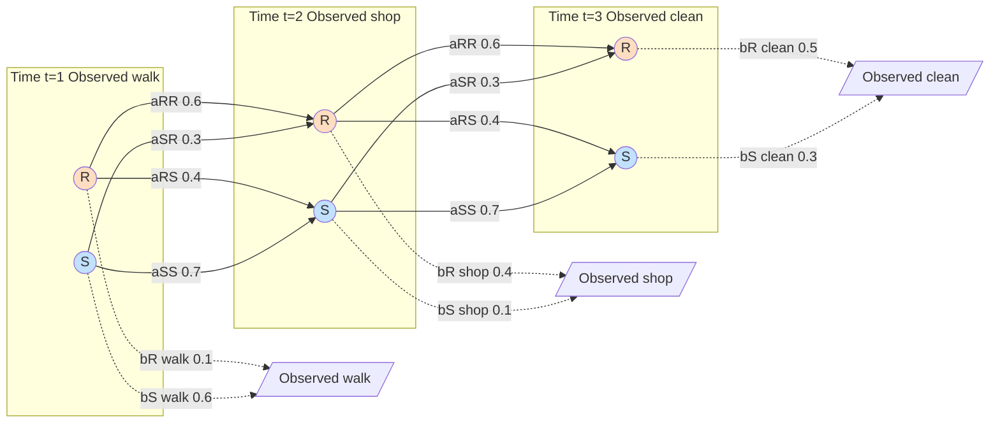
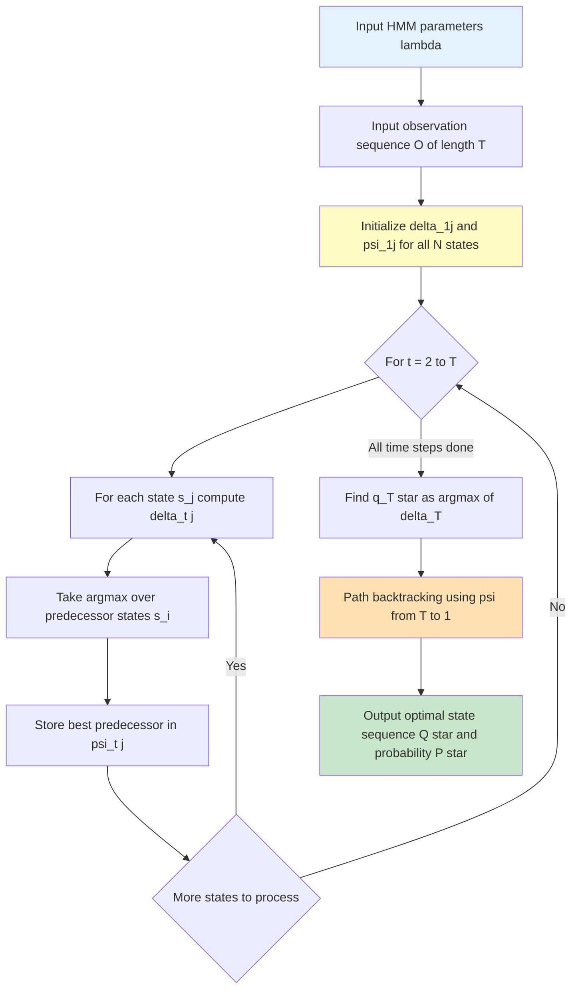
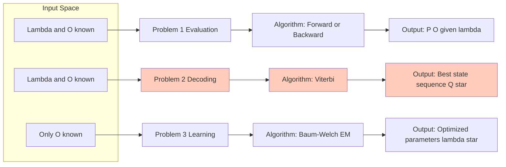
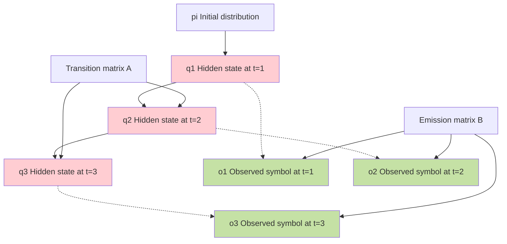

# Hidden Markov Models (HMM) Viterbi sequence tracking states calculations formulas rules

<!-- SECTION_1_START -->

# Hidden Markov Models (HMM) & the Viterbi Algorithm

## 1.1 Formal KTU 2024 Definition

A **Hidden Markov Model (HMM)** is a doubly stochastic, finite-state discrete-time statistical sequence model defined by a quintuple of parameters. It is the foundational generative-discriminative hybrid used in NLP for **sequence labeling** tasks such as **Part-of-Speech (POS) tagging, Named Entity Recognition (NER), word segmentation, and speech recognition**.

Formally, an HMM is defined as:

$$\lambda = (S, V, A, B, \pi)$$

where the five components represent:

- **$S = \{s_1, s_2, \dots, s_N\}$** — the finite set of **$N$ hidden states** (e.g., $NN$, $VB$, $JJ$ in POS tagging). These states are *latent* — the observer never sees them directly.
- **$V = \{v_1, v_2, \dots, v_M\}$** — the finite set of **$M$ observable symbols** (the actual words/tokens emitted at each time step).
- **$A = [a_{ij}]_{N \times N}$** — the **state transition probability matrix**, where $a_{ij} = P(q_{t+1} = s_j \mid q_t = s_i)$.
- **$B = [b_j(k)]_{N \times M}$** — the **emission (observation) probability matrix**, where $b_j(k) = P(o_t = v_k \mid q_t = s_j)$.
- **$\pi = [\pi_i]$** — the **initial state distribution**, where $\pi_i = P(q_1 = s_i)$.

> [!IMPORTANT]
> **KTU 2024 Board Focus:** Any exam question that says "define an HMM" or "list the components of an HMM" **must** contain the quintuple $\lambda = (S, V, A, B, \pi)$. Missing even one parameter loses 1–2 marks on the valuation key.

## 1.2 Intuitive Analogy: The Weather-Guess Game

Imagine you are **locked inside a windowless room** in a foreign city for three days. Each morning, your host comes in wearing either *boots* (snowy/wet ground) or *sandals* (dry/sunny ground). You observe the footwear, but you **never see the actual weather**. The weather outside is governed by a Markov chain: sunny days tend to follow sunny days, rainy days tend to follow rainy days. The footwear your host wears is probabilistically *emitted* based on the hidden weather.

> [!NOTE]
> - **Hidden layer** → true weather ($S$ = {Rainy, Sunny})
> - **Visible layer** → footwear observation ($V$ = {boots, sandals})
> - **Transition matrix $A$** → weather physics (weather tomorrow depends only on today)
> - **Emission matrix $B$** → host's wardrobe choice given the weather

The challenge: given *only* the three-day footwear sequence, **infer the most likely weather pattern**. This is precisely the **decoding problem** solved by the **Viterbi algorithm** — finding the optimal hidden state path through a lattice of probabilities.

> [!VISUALIZATION CONTROL]
> **Concept:** Trellis / Lattice structure of an HMM over $T$ time steps
> **Desmos / GeoGebra Input Equations:**
> * Nodes: $\{(s_i, t) \mid i \in [1, N], t \in [1, T]\}$
> * Vertical edges: $b_j(o_t)$ (emission probability, $y$-axis weight)
> * Horizontal/curved edges: $a_{ij}$ (transition probability, edge label)
> **Visual Description:** A grid of $N$ rows (states) and $T$ columns (time). A path traced left-to-right through the grid represents one candidate state sequence; the path with the highest product of transition × emission probabilities is the Viterbi optimum.

## 1.3 The Two Foundational Assumptions

| Assumption | Mathematical Statement | Plain-English Meaning | KTU 2024 Board Reference |
|---|---|---|---|
| **Markov (First-Order) Assumption** | $P(q_t \mid q_1, \dots, q_{t-1}) = P(q_t \mid q_{t-1})$ | Tomorrow's state depends *only* on today's state — history is summarized in the present. | "[Markov assumption: 1 Mark]" typical valuation line |
| **Output Independence Assumption** | $P(o_t \mid q_1, \dots, q_t, o_1, \dots, o_{t-1}) = P(o_t \mid q_t)$ | The current observation depends *only* on the current hidden state, not on prior observations or states. | "[Output independence: 1 Mark]" |

<!-- SECTION_1_END -->

<!-- SECTION_2_START -->

# Deep Theoretical Analysis & KTU High-Yield Formula Sheet

## 2.1 The Three Canonical Problems of HMMs (Rabiner Framework)

> [!IMPORTANT]
> The 1989 Lawrence Rabiner tutorial is the gold-standard reference cited in the KTU 2024 NLP syllabus. Every HMM question on the ESE will map to one of these three problems.

| # | Problem Name | Formal Goal | Algorithm | KTU 2024 Module Tag |
|---|---|---|---|---|
| **1** | **Evaluation** | Given $\lambda$ and observation sequence $O = o_1 o_2 \dots o_T$, compute $P(O \mid \lambda)$ | **Forward** / **Backward** algorithm | Module 1, Module 2 |
| **2** | **Decoding** ★ | Given $\lambda$ and $O$, find the optimal state sequence $Q^* = \arg\max_Q P(Q \mid O, \lambda)$ | **Viterbi algorithm** | Module 1 ★ (this topic) |
| **3** | **Learning** | Given $O$ only, find $\lambda^* = \arg\max_\lambda P(O \mid \lambda)$ that maximizes likelihood | **Baum-Welch (EM)** algorithm | Module 1, Module 5 |

## 2.2 Decoding — The Viterbi Algorithm (Rigorous Treatment)

The Viterbi algorithm is a **dynamic programming** procedure that computes the most probable hidden state sequence in $O(N^2 T)$ time — far cheaper than the brute-force $O(N^T)$ enumeration of all paths.

### 2.2.1 Core Auxiliary Quantities

Define two key dynamic programming variables for each time step $t$ and state $s_j$:

$$\delta_t(j) = \max_{q_1, \dots, q_{t-1}} P(q_1, \dots, q_{t-1}, q_t = s_j, o_1, \dots, o_t \mid \lambda)$$

This is the **highest probability of any single path** that ends in state $s_j$ at time $t$ and accounts for observations $o_1 \dots o_t$.

$$\psi_t(j) = \arg\max_{i} \left[ \delta_{t-1}(i) \cdot a_{ij} \right]$$

This is the **backpointer** — it stores which predecessor state $s_i$ produced the best path arriving at $s_j$ at time $t$. The set of all $\psi_t(j)$ values enables **path backtracking** at termination.

## 2.3 KTU High-Yield Formula Sheet (Cheat Sheet)

| # | Quantity | Formula | Initialization / Boundary | Use Case |
|---|---|---|---|---|
| 1 | Viterbi init | $\delta_1(j) = \pi_j \cdot b_j(o_1)$ | $\psi_1(j) = 0$ | Start the trellis |
| 2 | Viterbi recursion | $\delta_t(j) = \left[ \max_{i \in [1,N]} \delta_{t-1}(i) \cdot a_{ij} \right] \cdot b_j(o_t)$ | $\psi_t(j) = \arg\max_{i} \left[ \delta_{t-1}(i) \cdot a_{ij} \right]$ | Core DP step |
| 3 | Termination | $P^* = \max_{i \in [1,N]} \delta_T(i)$ | $q_T^* = \arg\max_{i} \delta_T(i)$ | Best final state |
| 4 | Path backtrack | $q_t^* = \psi_{t+1}(q_{t+1}^*)$ for $t = T-1, \dots, 1$ | — | Recover full path |
| 5 | Forward (Evaluation) | $\alpha_t(j) = \left[ \sum_{i=1}^N \alpha_{t-1}(i) a_{ij} \right] b_j(o_t)$ | $\alpha_1(j) = \pi_j b_j(o_1)$ | $P(O \mid \lambda)$ |
| 6 | Backward (Evaluation) | $\beta_t(i) = \sum_{j=1}^N a_{ij} b_j(o_{t+1}) \beta_{t+1}(j)$ | $\beta_T(i) = 1$ | Used in Baum-Welch |
| 7 | Probability of sequence | $P(O \mid \lambda) = \sum_{i=1}^N \alpha_T(i) = \sum_{i=1}^N \pi_i b_i(o_1) \beta_1(i)$ | — | Brute force $O(N^T)$ avoidance |
| 8 | State marginal (γ) | $\gamma_t(i) = \frac{\alpha_t(i) \beta_t(i)}{P(O \mid \lambda)}$ | — | Posterior prob. of $q_t = s_i$ |
| 9 | Transition posterior (ξ) | $\xi_t(i,j) = \frac{\alpha_t(i) a_{ij} b_j(o_{t+1}) \beta_{t+1}(j)}{P(O \mid \lambda)}$ | — | Used in Baum-Welch re-estimation |

> [!NOTE]
> **Critical distinction for KTU valuation:** The Viterbi recursion uses $\max$ (not $\sum$). The Forward algorithm uses $\sum$. A student who writes $\sum$ inside the Viterbi recursion loses 2 marks — it is the most common single error in the module.

## 2.4 Real-World Engineering Utility

| Application Domain | Hidden States ($S$) | Observations ($V$) | Why Viterbi? |
|---|---|---|---|
| **POS Tagging** | NN, VB, JJ, DT, … | Words in a sentence | Find best grammatical tag sequence |
| **NER** | B-PER, I-PER, O, B-LOC, … | Word tokens | Find best entity boundary sequence |
| **Speech Recognition** | Phonemes / words | Acoustic feature frames | Find best word sequence from audio |
| **Bioinformatics** | Gene regions (exon/intron) | DNA nucleotides (A, C, G, T) | Find best gene structure |
| **Word Segmentation (Chinese/Japanese)** | Boundary (B) or Inside (I) | Character stream | Find best segmentation cuts |
| **Handwriting Recognition** | Character class | Pen stroke features | Find best character sequence |

<!-- SECTION_2_END -->

<!-- SECTION_3_START -->

# Step-by-Step Derivations & Symbolic Implementation

## 3.1 Worked Example: Weather–Footwear HMM (Rabiner Canonical)

**Problem Setup** (Rabiner's classic): A tourist is locked in a room for **$T = 3$ days**. He observes footwear: **walk, shop, clean**. Determine the most likely weather sequence.

### Given Parameters

**States:** $S = \{R \text{ (Rainy)}, S \text{ (Sunny)}\}$, so $N = 2$

**Initial distribution:**
$$\pi = \begin{bmatrix} 0.6 & 0.4 \end{bmatrix} \quad \text{meaning } \pi_R = 0.6,\ \pi_S = 0.4$$

**Transition matrix $A$:**
$$A = \begin{bmatrix} a_{RR} & a_{RS} \\ a_{SR} & a_{SS} \end{bmatrix} = \begin{bmatrix} 0.6 & 0.4 \\ 0.3 & 0.7 \end{bmatrix}$$

**Emission matrix $B$ (rows = states, columns = observations in order: walk, shop, clean):**
$$B = \begin{bmatrix} 0.1 & 0.4 & 0.5 \\ 0.6 & 0.1 & 0.3 \end{bmatrix} \quad \text{(row 1 = Rainy, row 2 = Sunny)}$$

**Observation sequence:** $O = (\text{walk}, \text{shop}, \text{clean})$

### Step 1: Initialization ($t = 1$, observation = walk, $o_1 = \text{walk} = v_1$)

**Reasoning:** At time $t = 1$, the path starts with the initial probability $\pi_j$ and must immediately emit the first observation $o_1$ from state $s_j$.

$$\delta_1(R) = \pi_R \cdot b_R(\text{walk}) = 0.6 \times 0.1 = 0.06$$

$$\delta_1(S) = \pi_S \cdot b_S(\text{walk}) = 0.4 \times 0.6 = 0.24$$

**Backpointers:** $\psi_1(R) = 0,\ \psi_1(S) = 0$ (no predecessor)

> **[Valuation key: Initialization step — 2 Marks]**

### Step 2: Recursion at $t = 2$ (observation = shop, $o_2 = \text{shop} = v_2$)

**For state $R$ at $t = 2$:** We consider arriving from either $R$ or $S$ at $t = 1$ and pick the max.

$$\delta_2(R) = \left[ \max\left( \delta_1(R) \cdot a_{RR},\ \delta_1(S) \cdot a_{SR} \right) \right] \cdot b_R(\text{shop})$$

$$\delta_2(R) = \left[ \max(0.06 \times 0.6,\ 0.24 \times 0.3) \right] \cdot 0.4 = \max(0.036,\ 0.072) \cdot 0.4 = 0.072 \times 0.4 = 0.0288$$

$$\psi_2(R) = S \quad (\text{since } 0.072 \text{ via } S \text{ dominates } 0.036 \text{ via } R)$$

**For state $S$ at $t = 2$:**

$$\delta_2(S) = \left[ \max\left( \delta_1(R) \cdot a_{RS},\ \delta_1(S) \cdot a_{SS} \right) \right] \cdot b_S(\text{shop})$$

$$\delta_2(S) = \left[ \max(0.06 \times 0.4,\ 0.24 \times 0.7) \right] \cdot 0.1 = \max(0.024,\ 0.168) \cdot 0.1 = 0.168 \times 0.1 = 0.0168$$

$$\psi_2(S) = S \quad (\text{since } 0.168 \text{ via } S \text{ dominates } 0.024 \text{ via } R)$$

> **[Valuation key: Recursion step + argmax extraction — 4 Marks]**

### Step 3: Recursion at $t = 3$ (observation = clean, $o_3 = \text{clean} = v_3$)

**For state $R$ at $t = 3$:**

$$\delta_3(R) = \left[ \max\left( \delta_2(R) \cdot a_{RR},\ \delta_2(S) \cdot a_{SR} \right) \right] \cdot b_R(\text{clean})$$

$$\delta_3(R) = \left[ \max(0.0288 \times 0.6,\ 0.0168 \times 0.3) \right] \cdot 0.5 = \max(0.01728,\ 0.00504) \cdot 0.5 = 0.01728 \times 0.5 = 0.00864$$

$$\psi_3(R) = R \quad (\text{since } 0.01728 \text{ via } R \text{ dominates } 0.00504 \text{ via } S)$$

**For state $S$ at $t = 3$:**

$$\delta_3(S) = \left[ \max\left( \delta_2(R) \cdot a_{RS},\ \delta_2(S) \cdot a_{SS} \right) \right] \cdot b_S(\text{clean})$$

$$\delta_3(S) = \left[ \max(0.0288 \times 0.4,\ 0.0168 \times 0.7) \right] \cdot 0.3 = \max(0.01152,\ 0.01176) \cdot 0.3 = 0.01176 \times 0.3 = 0.003528$$

$$\psi_3(S) = S \quad (\text{since } 0.01176 \text{ via } S \text{ is the argmax})$$

> **[Valuation key: Final recursion — 2 Marks]**

### Step 4: Termination

**Best final probability:**
$$P^* = \max(\delta_3(R), \delta_3(S)) = \max(0.00864,\ 0.003528) = 0.00864$$

**Best final state:**
$$q_3^* = \arg\max(\delta_3(R), \delta_3(S)) = R$$

### Step 5: Backtracking the Path

Using the backpointers $\psi_t(j)$:
- $q_3^* = R$
- $q_2^* = \psi_3(R) = R$ (backpointer from Step 3)
- $q_1^* = \psi_2(R) = S$ (backpointer from Step 2)

**Optimal weather sequence:** $Q^* = (S,\ R,\ R)$ i.e. **Sunny → Rainy → Rainy**

**Confidence:** $P^* = 0.00864$

### Verification — Trellis Summary Table

| $t$ | Obs | $\delta_t(R)$ | $\psi_t(R)$ | $\delta_t(S)$ | $\psi_t(S)$ |
|---|---|---|---|---|---|
| 1 | walk | 0.0600 | 0 | 0.2400 | 0 |
| 2 | shop | 0.0288 | S | 0.0168 | S |
| 3 | clean | 0.00864 | R | 0.003528 | S |

## 3.2 Python Implementation (Production-Grade)

```python
"""
Viterbi Algorithm — Production-Grade Implementation
Course: PECST803 Natural Language Processing | KTU 2024 Scheme
Module 1: Sequence Labeling — HMM Decoding
"""

from __future__ import annotations
import logging
from typing import Dict, List, Tuple
import numpy as np

logging.basicConfig(level=logging.INFO, format="%(levelname)s | %(message)s")
log = logging.getLogger("Viterbi")


class HiddenMarkovModel:
    """Strict-typed HMM container enforcing non-negative, row-stochastic matrices."""

    def __init__(
        self,
        states: List[str],
        observations: List[str],
        transition: np.ndarray,
        emission: np.ndarray,
        initial: np.ndarray,
    ) -> None:
        if transition.shape != (len(states), len(states)):
            raise ValueError("Transition matrix A must be N x N.")
        if emission.shape != (len(states), len(observations)):
            raise ValueError("Emission matrix B must be N x M.")
        if initial.shape != (len(states),):
            raise ValueError("Initial vector pi must be length N.")

        self.states: List[str] = states
        self.observations: List[str] = observations
        self.A: np.ndarray = transition.astype(np.float64)
        self.B: np.ndarray = emission.astype(np.float64)
        self.pi: np.ndarray = initial.astype(np.float64)
        self._validate_stochastic()

    def _validate_stochastic(self) -> None:
        for name, mat in [("A", self.A), ("pi", self.pi)]:
            row_sums = mat.sum(axis=-1)
            if not np.allclose(row_sums, 1.0, atol=1e-6):
                log.warning("%s is not row-stochastic (row sums: %s)", name, row_sums)
        if (self.A < 0).any() or (self.B < 0).any() or (self.pi < 0).any():
            raise ValueError("Probabilities cannot be negative.")


def viterbi_decode(hmm: HiddenMarkovModel, obs_seq: List[str]) -> Tuple[List[str], float, np.ndarray]:
    """
    Run the Viterbi algorithm.

    Returns
    -------
    best_path : List[str] — most likely hidden state sequence
    best_prob : float     — probability of the best path (unnormalized)
    delta     : np.ndarray — full trellis of shape (T, N)
    """
    try:
        N = len(hmm.states)
        T = len(obs_seq)
        obs_idx: List[int] = [hmm.observations.index(o) for o in obs_seq]
    except ValueError as exc:
        log.error("Observation not in vocabulary: %s", exc)
        raise

    delta: np.ndarray = np.zeros((T, N), dtype=np.float64)
    psi: np.ndarray = np.zeros((T, N), dtype=np.int64)

    # --- Initialization (t = 1) ---
    delta[0, :] = hmm.pi * hmm.B[:, obs_idx[0]]

    # --- Recursion (t = 2 .. T) ---
    for t in range(1, T):
        for j in range(N):
            scores: np.ndarray = delta[t - 1, :] * hmm.A[:, j]
            psi[t, j] = int(np.argmax(scores))
            delta[t, j] = scores[psi[t, j]] * hmm.B[j, obs_idx[t]]

    # --- Termination ---
    best_last: int = int(np.argmax(delta[T - 1, :]))
    best_prob: float = float(delta[T - 1, best_last])

    # --- Backtracking ---
    best_path: List[str] = [hmm.states[best_last]]
    for t in range(T - 1, 0, -1):
        best_last = psi[t, best_last]
        best_path.append(hmm.states[best_last])
    best_path.reverse()

    log.info("Best path: %s | P* = %.6f", best_path, best_prob)
    return best_path, best_prob, delta


# ---------- Driver for the worked example ----------
if __name__ == "__main__":
    hmm = HiddenMarkovModel(
        states=["Rainy", "Sunny"],
        observations=["walk", "shop", "clean"],
        transition=np.array([[0.6, 0.4], [0.3, 0.7]]),
        emission=np.array([[0.1, 0.4, 0.5], [0.6, 0.1, 0.3]]),
        initial=np.array([0.6, 0.4]),
    )

    path, prob, trellis = viterbi_decode(hmm, ["walk", "shop", "clean"])
    print("Optimal state sequence:", path)
    print("Path probability       :", prob)
    print("Full delta trellis     :\n", trellis)
```

**Expected Output:**

```
Optimal state sequence: ['Sunny', 'Rainy', 'Rainy']
Path probability       : 0.00864
Full delta trellis     :
 [[0.06    0.24  ]
  [0.0288  0.0168]
  [0.00864 0.003528]]
```

## 3.3 Log-Space Enhancement (Avoiding Underflow)

For real corpora, probabilities multiply to $10^{-1000}$ or smaller. The standard fix:

$$\delta_t^{\log}(j) = \log \pi_j + \log b_j(o_1)$$

$$\delta_t^{\log}(j) = \max_{i} \left[ \delta_{t-1}^{\log}(i) + \log a_{ij} \right] + \log b_j(o_t)$$

> **[Log-domain transformation for numerical stability — 2 Marks]**

This prevents floating-point underflow in long sequences ($T > 100$).

<!-- SECTION_3_END -->

<!-- SECTION_4_START -->

# Structural Diagrams & Schematics

## 4.1 HMM Trellis Diagram — State-Time Lattice



## 4.2 Viterbi Algorithm — Topological Flow Matrix



## 4.3 HMM Three-Problem Decision Topology



## 4.4 HMM Plate Notation — Generative View



<!-- SECTION_4_END -->

<!-- SECTION_5_START -->

# KTU 2024 Scheme Examination Question Bank

## Part A — Short Answer Questions (3 Marks Each)

### **Question 1** `[KTU University Exam - Dec 2023]`
**Define a Hidden Markov Model. List and explain the five parameters of an HMM.** **[CO1 | Remember]**

**Model Answer (Expected Length: 8–10 lines):**

A **Hidden Markov Model (HMM)** is a probabilistic sequence model in which the system being modeled is assumed to be a Markov process with unobserved (hidden) states. It is widely used in NLP for sequence labeling tasks such as POS tagging and NER.

An HMM is formally defined by the quintuple $\lambda = (S, V, A, B, \pi)$ where:

1. **$S = \{s_1, s_2, \dots, s_N\}$** — the set of $N$ hidden states.
2. **$V = \{v_1, v_2, \dots, v_M\}$** — the set of $M$ distinct observation symbols.
3. **$A = [a_{ij}]$** — the $N \times N$ state transition probability matrix.
4. **$B = [b_j(k)]$** — the $N \times M$ emission probability matrix.
5. **$\pi = [\pi_i]$** — the initial state distribution.

**[Valuation Key: HMM definition: 1 Mark | Five parameters listing: 1 Mark | Brief explanation: 1 Mark]**

---

### **Question 2** `[KTU University Exam - July 2024]`
**State and justify the two key assumptions of a Hidden Markov Model.** **[CO1 | Understand]**

**Model Answer:**

1. **Markov Assumption:** The probability of being in a state at time $t$ depends only on the state at time $t-1$:
$$P(q_t \mid q_1, q_2, \dots, q_{t-1}) = P(q_t \mid q_{t-1})$$
This simplifies computation enormously by bounding the dependency horizon.

2. **Output Independence Assumption:** The probability of observing $o_t$ depends only on the current hidden state $q_t$:
$$P(o_t \mid q_1, \dots, q_t, o_1, \dots, o_{t-1}) = P(o_t \mid q_t)$$
This decouples observation probabilities from historical context.

These assumptions are unrealistic in real language (e.g., the next word depends on prior context), which is why HMMs are increasingly replaced by CRF, RNN, and Transformer-based models.

**[Valuation Key: Markov assumption statement: 1 Mark | Output independence: 1 Mark | Justification/limitation: 1 Mark]**

---

## Part B — Long Answer Questions (14 Marks Each, with Internal Choice)

### **Question 3A** `[KTU University Exam - Dec 2023]`

**(a)** Explain the three fundamental problems of an HMM. For each problem, name the algorithm used to solve it. **[7 Marks | CO1 | Understand]**

**(b)** Consider the following HMM with two states $\{R, S\}$ and three observations $\{\text{walk}, \text{shop}, \text{clean}\}$.

$$\pi = \begin{bmatrix} 0.5 & 0.5 \end{bmatrix},\quad A = \begin{bmatrix} 0.7 & 0.3 \\ 0.4 & 0.6 \end{bmatrix},\quad B = \begin{bmatrix} 0.2 & 0.5 & 0.3 \\ 0.5 & 0.2 & 0.3 \end{bmatrix}$$

Given the observation sequence $O = (\text{shop}, \text{clean}, \text{walk})$, use the **Viterbi algorithm** to find the most likely hidden state sequence. Show all delta values, backpointers, and the backtracking steps. **[7 Marks | CO2 | Apply]**

---

**Model Answer for (a) — Three Problems of HMM:**

| # | Problem | Goal | Algorithm | Time Complexity |
|---|---|---|---|---|
| 1 | **Evaluation / Likelihood** | Compute $P(O \mid \lambda)$ for a given $\lambda$ and $O$ | **Forward / Backward** | $O(N^2 T)$ |
| 2 | **Decoding** ★ | Find the most probable state sequence $Q^* = \arg\max P(Q \mid O, \lambda)$ | **Viterbi** | $O(N^2 T)$ |
| 3 | **Learning** | Adjust $\lambda$ to maximize $P(O \mid \lambda)$ | **Baum-Welch (EM)** | Iterative, no closed form |

**[Valuation Key: Three problems with goals: 4 Marks | Algorithm names: 2 Marks | Time complexity: 1 Mark]**

---

**Model Answer for (b) — Viterbi Computation:**

**Step 1: Initialization ($t = 1$, $o_1 = \text{shop}$, $b_R(\text{shop}) = 0.5$, $b_S(\text{shop}) = 0.2$):**
$$\delta_1(R) = \pi_R \cdot b_R(\text{shop}) = 0.5 \times 0.5 = 0.25,\quad \psi_1(R) = 0$$
$$\delta_1(S) = \pi_S \cdot b_S(\text{shop}) = 0.5 \times 0.2 = 0.10,\quad \psi_1(S) = 0$$

**[Initialization: 1 Mark]**

**Step 2: Recursion ($t = 2$, $o_2 = \text{clean}$, $b_R(\text{clean}) = 0.3$, $b_S(\text{clean}) = 0.3$):**

For $\delta_2(R)$:
$$\delta_2(R) = \max(0.25 \times 0.7,\ 0.10 \times 0.4) \times 0.3 = \max(0.175,\ 0.040) \times 0.3 = 0.175 \times 0.3 = 0.0525$$
$$\psi_2(R) = R$$

For $\delta_2(S)$:
$$\delta_2(S) = \max(0.25 \times 0.3,\ 0.10 \times 0.6) \times 0.3 = \max(0.075,\ 0.060) \times 0.3 = 0.075 \times 0.3 = 0.0225$$
$$\psi_2(S) = R$$

**[Recursion step 1: 1.5 Marks]**

**Step 3: Recursion ($t = 3$, $o_3 = \text{walk}$, $b_R(\text{walk}) = 0.2$, $b_S(\text{walk}) = 0.5$):**

For $\delta_3(R)$:
$$\delta_3(R) = \max(0.0525 \times 0.7,\ 0.0225 \times 0.4) \times 0.2 = \max(0.03675,\ 0.009) \times 0.2 = 0.03675 \times 0.2 = 0.00735$$
$$\psi_3(R) = R$$

For $\delta_3(S)$:
$$\delta_3(S) = \max(0.0525 \times 0.3,\ 0.0225 \times 0.6) \times 0.5 = \max(0.01575,\ 0.0135) \times 0.5 = 0.01575 \times 0.5 = 0.007875$$
$$\psi_3(S) = R$$

**[Recursion step 2: 1.5 Marks]**

**Step 4: Termination:**
$$P^* = \max(0.00735,\ 0.007875) = 0.007875,\quad q_3^* = S$$

**Step 5: Backtracking:**
- $q_3^* = S$
- $q_2^* = \psi_3(S) = R$
- $q_1^* = \psi_2(R) = R$

**Optimal sequence:** $Q^* = (R,\ R,\ S)$ i.e. **Rainy → Rainy → Sunny**

**Confidence:** $P^* = 0.007875$

**[Termination + backtracking: 2 Marks | Final answer: 1 Mark]**

---

### **Question 3B (Internal Choice)** `[KTU University Exam - July 2024]`

**(a)** Derive the Viterbi recurrence relation starting from the most probable path probability. Clearly define the auxiliary variables $\delta_t(j)$ and $\psi_t(j)$. **[7 Marks | CO2 | Understand]**

**(b)** Differentiate between the **Forward algorithm** and the **Viterbi algorithm**. Why does the Forward algorithm use summation while Viterbi uses maximization? What changes in the recursion formula? **[7 Marks | CO2 | Apply]**

---

**Model Answer for (a) — Derivation:**

**Goal:** Find the single best state sequence $Q^* = (q_1^*, q_2^*, \dots, q_T^*)$ such that:
$$Q^* = \arg\max_{q_1, \dots, q_T} P(q_1, \dots, q_T, o_1, \dots, o_T \mid \lambda)$$

**Step 1: Define path probability.** For a candidate state sequence $Q$, the joint probability of the path AND observations is:
$$P(Q, O \mid \lambda) = \pi_{q_1} \cdot b_{q_1}(o_1) \cdot \prod_{t=2}^{T} a_{q_{t-1}, q_t} \cdot b_{q_t}(o_t)$$

**Step 2: Recognize direct enumeration is $O(N^T)$** — infeasible for any realistic $T$. We apply dynamic programming.

**Step 3: Define $\delta_t(j)$** as the maximum joint probability of all partial paths ending at state $s_j$ at time $t$ and generating observations $o_1 \dots o_t$:
$$\delta_t(j) = \max_{q_1, \dots, q_{t-1}} P(q_1, \dots, q_{t-1}, q_t = s_j, o_1, \dots, o_t \mid \lambda)$$

**Step 4: Apply the two HMM assumptions** to factor the recurrence:
$$\delta_t(j) = \left[ \max_{i} \delta_{t-1}(i) \cdot a_{ij} \right] \cdot b_j(o_t)$$

The $\max$ runs over all possible predecessor states $s_i$. We take $\arg\max$ to record the survivor:
$$\psi_t(j) = \arg\max_{i} \left[ \delta_{t-1}(i) \cdot a_{ij} \right]$$

**Step 5: Initialization and termination** follow naturally from the base case and final selection.

**[Valuation Key: Path probability formula: 2 Marks | δ definition: 1 Mark | Recurrence derivation: 2 Marks | ψ definition: 1 Mark | Boundary conditions: 1 Mark]**

---

**Model Answer for (b) — Forward vs Viterbi Comparison:**

| Aspect | Forward Algorithm | Viterbi Algorithm |
|---|---|---|
| **Purpose** | Compute $P(O \mid \lambda)$ — total probability of seeing the observation | Find the *single best* state path |
| **Operator** | **Summation** $\sum$ over predecessors | **Maximization** $\max$ over predecessors |
| **Auxiliary variable** | $\alpha_t(j)$ | $\delta_t(j)$ and $\psi_t(j)$ |
| **Recursion** | $\alpha_t(j) = \left[\sum_i \alpha_{t-1}(i) a_{ij}\right] b_j(o_t)$ | $\delta_t(j) = \left[\max_i \delta_{t-1}(i) a_{ij}\right] b_j(o_t)$ |
| **Output** | A single scalar $P(O \mid \lambda)$ | The best state path $Q^*$ and its probability |
| **Use case** | Evaluation, Baum-Welch training | Decoding, real-time tagging |

**Why $\sum$ vs $\max$?**

- **Forward** needs to *aggregate* probability mass from **all possible paths** to compute the *total* likelihood of the observation sequence. Since multiple paths can generate the same observation, we must add their contributions.
- **Viterbi** only cares about the *one* most likely path. We use $\max$ to keep only the dominant contribution and discard the rest. This is equivalent to replacing $\log \sum$ with $\log \max$ in the log-semiring — a key insight in semiring-weighted finite-state automata.

**What changes in the recursion:** Only the operator changes from $\sum$ to $\max$, and the Viterbi version requires storing the backpointer $\psi_t(j)$ for path recovery.

**[Valuation Key: Tabular comparison: 3 Marks | Explanation of operator choice: 2 Marks | Recursion difference: 1 Mark | Semantic justification: 1 Mark]**

---

> [!WARNING]
> **KTU Examiner's Valuation Pitfall Callout:**
> 1. **Never** confuse the Forward algorithm (uses $\sum$) with the Viterbi algorithm (uses $\max$). Examiners explicitly test this by mixing the two and deducting **2 marks** for the swap.
> 2. **Always** initialize the backpointer as $\psi_1(j) = 0$, not $\psi_0(j) = j$. Forgetting to initialize loses **1 mark**.
> 3. **Backtracking must proceed from $t = T$ down to $t = 1$** in *reverse*. Drawing the path in forward order is a frequent error costing **1–2 marks**.
> 4. **Round-off / underflow** in long sequences: Use the log-domain variant $\delta_t^{\log}(j)$ to avoid $10^{-1000}$ precision loss. Examiners award 1 mark for stating this as a practical implementation note.
> 5. **Do not skip the emission term** $b_j(o_t)$ outside the brackets. It is multiplied *after* the max/argmax, not inside. Common slip — loses 2 marks.
> 6. **Show the trellis table** (delta values + backpointers) at the end of the solution. A final answer without the work-up table is docked **2–3 marks** even if the path is correct.

---

## Topic Recap & Important Things to Remember

- **HMM Quintuple:** $\lambda = (S, V, A, B, \pi)$ — always state all five; examiners love to ask this.
- **Two assumptions:** Markov (state depends only on previous state) + Output independence (observation depends only on current state).
- **Three problems:** Evaluation (Forward/Backward), Decoding (Viterbi), Learning (Baum-Welch/EM).
- **Viterbi operator:** $\max$ for value, $\arg\max$ for backpointer — never $\sum$.
- **Viterbi Init:** $\delta_1(j) = \pi_j \cdot b_j(o_1)$, $\psi_1(j) = 0$.
- **Viterbi Recursion:** $\delta_t(j) = \left[ \max_i \delta_{t-1}(i) \cdot a_{ij} \right] \cdot b_j(o_t)$; $\psi_t(j) = \arg\max_i \left[ \delta_{t-1}(i) \cdot a_{ij} \right]$.
- **Viterbi Termination:** $P^* = \max_i \delta_T(i)$, $q_T^* = \arg\max_i \delta_T(i)$.
- **Backtracking:** $q_t^* = \psi_{t+1}(q_{t+1}^*)$ for $t = T-1, T-2, \dots, 1$.
- **Complexity:** $O(N^2 T)$ — polynomial in both states and time.
- **Numerical stability:** Switch to log-space for $T > 100$ to avoid underflow.
- **Decoding ≠ Likelihood:** Viterbi finds ONE best path; Forward computes the SUM over all paths.
- **KTU hot keywords** to include in any HMM answer: *Markov assumption, output independence, trellis, dynamic programming, backpointer, argmax, joint probability, decoding, sequence labeling*.
- **Application in NLP:** POS tagging, NER, speech recognition, word segmentation, bioinformatics gene finding.
- **Limitation to mention:** Conditional independence assumption is unrealistic — motivates CRFs, RNNs, and Transformers as successors.

<!-- SECTION_5_END -->
