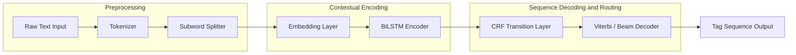
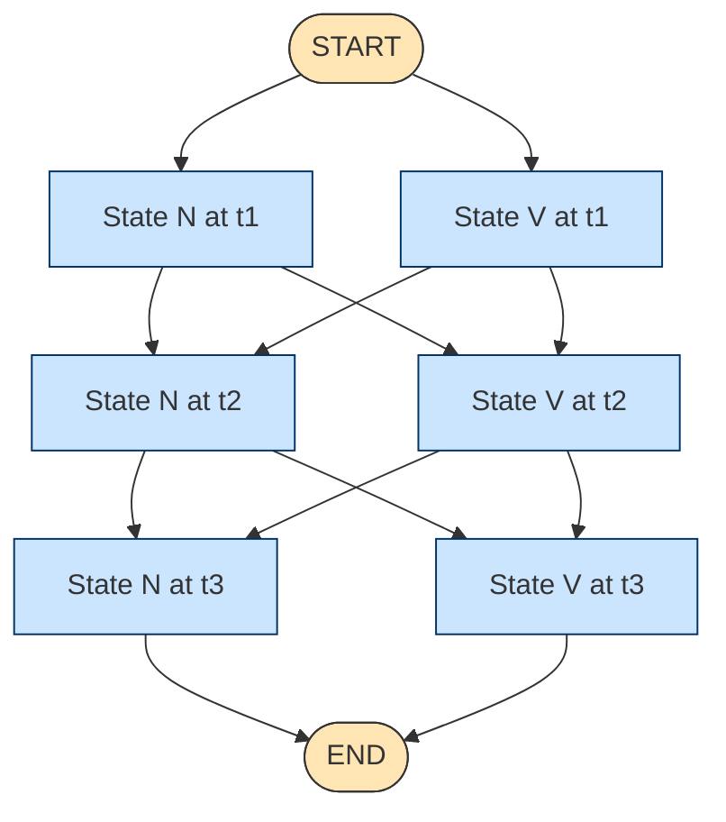
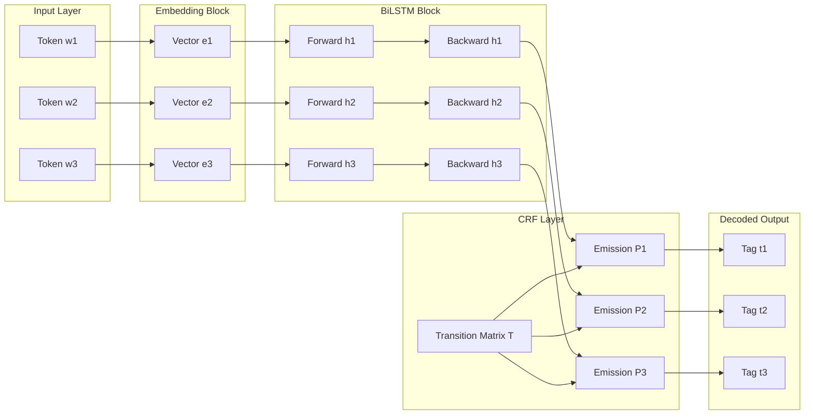
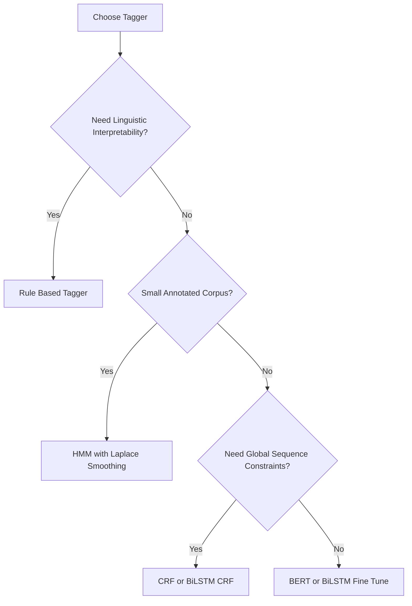

# Part of Speech (POS) token classification tagging mechanics initialization processes routing

<!-- SECTION_1_START -->
# Part-of-Speech (POS) Token Classification — Tagging Mechanics, Initialization & Routing

## 1.1 Formal Academic Definition (KTU 2024 Terminology)

**Part-of-Speech (POS) Tagging** is a canonical *sequence labeling* task in Natural Language Processing in which every token $w_i$ in an input sentence $W = (w_1, w_2, \ldots, w_n)$ is mapped to a discrete linguistic category $t_i$ drawn from a predefined tag inventory $T$. Formally, the tagger learns a function

$$
f : (w_1, w_2, \ldots, w_n) \;\longmapsto\; (t_1, t_2, \ldots, t_n), \quad t_i \in T
$$

The model is *jointly conditioned* on the entire observation sequence because the optimal tag for $w_i$ depends on the surrounding context (lexical and syntactic). Under the generative view, the tagger estimates

$$
\hat{T} \;=\; \arg\max_{T} \; P(T \mid W) \;=\; \arg\max_{T} \; P(T)\,P(W \mid T)
$$

> [!IMPORTANT]
> **KTU Syllabus Anchor:** POS tagging is the textbook example of *sequence labeling* in Module 1. It introduces the student to the three pillars that will recur throughout the module — **state space**, **observation likelihood**, and **decoding/routing**.

### 1.1.1 Standard Tag Inventories (must be memorised)

Two inventories dominate the literature and KTU exam answers:

| Inventory | \#Tags | Granularity | Common Use |
| :--- | :---: | :--- | :--- |
| **Penn Treebank (PTB)** | **45** | Fine-grained | Wall Street Journal corpus, NLTK default |
| **Universal Dependencies (UD)** | **17** | Coarse-grained | Cross-lingual transfer, multilingual NLP |
| **Brown Corpus** | **87** | Very fine | Historical linguistics |
| **CLAWS** | **61** | Fine | British English |

> [!NOTE]
> For a **3-mark definitional question**, the safe answer is: *"POS tagging assigns one of 45 Penn Treebank tags (or 17 Universal tags) to every token in a sentence."* Examiners award the mark for the explicit mention of the inventory.

## 1.2 Intuition: A Real-World Analogy

Imagine a **postal sorting facility**. A letter (token) drops onto a conveyor belt. Each letter has *visible features* — its stamp colour, postcode digits, return address (these are the **observations**). The worker must slide it into one of several bins (the **tags**: Local, National, International, Return-to-Sender).

The worker does not decide in isolation. If three letters in a row have *foreign postcodes*, the probability that the fourth is also foreign rises sharply — this is the **transition prior** $P(t_i \mid t_{i-1})$. The visible features (stamp, ink) act as the **emission likelihood** $P(w_i \mid t_i)$. The worker's final routing is the **decoded tag sequence**.

> [!TIP]
> Replace the conveyor belt with the sentence stream, the postcodes with morphological suffixes (-ing, -tion), and the bins with Penn Treebank tags. You now have a complete mental model of HMM-based POS tagging.

## 1.3 Why Tagging is Hard — The Ambiguity Problem

**English text contains roughly 15–20% ambiguous words**, i.e. words whose POS category is decided only by context. Examples:

* *book* — noun ("read a book") vs. verb ("book a ticket")
* *flies* — noun ("fruit flies") vs. verb ("time flies")
* *that* — determiner ("that book") vs. conjunction ("I know that …")

A tagger that ignores context achieves only $\approx 90\%$ accuracy (the **unigram ceiling**). A context-aware tagger routinely crosses **97%** on the Penn Treebank test set.

## 1.4 Tagging as Token Classification — The Pipeline View

Every modern tagger is a *token classifier* wrapped inside a *sequence decoder*. The pipeline is:

$$
\text{Raw Text} \;\xrightarrow{\text{Tokenizer}}\; \text{Tokens} \;\xrightarrow{\text{Embedder}}\; \text{Vector Sequence} \;\xrightarrow{\text{Encoder}}\; \text{Context Vectors} \;\xrightarrow{\text{Decoder/CRF}}\; \hat{T}
$$

> [!VISUALIZATION CONTROL]
> **Concept:** Tag-sequence lattice over a 4-token sentence.
> **GeoGebra / Desmos Input Equations:**
> * `x = 1, 2, 3, 4` (time steps, x-axis)
> * `y = {1 (NOUN), 2 (VERB), 3 (ADJ), 4 (ADV)}` (tag states, y-axis)
> * Plot a piecewise-constant path showing the *most likely tag path* chosen by Viterbi.
> **Visual Description:** A staircase function rising from NOUN at $x=1$, dropping to VERB at $x=2$, etc. Each grid cell represents a possible $(w_i, t_j)$ pairing; the highlighted path is the maximum-probability trajectory.

<!-- SECTION_1_END -->

<!-- SECTION_2_START -->
# Deep Theoretical Analysis & KTU High-Yield Formula Sheet

## 2.1 The Three Families of POS Taggers

### 2.1.1 Rule-Based Tagger (e.g., ENGTWOL, Brill Tagger)
* Uses hand-crafted morphological rules and contextual templates.
* **Pros:** linguistically interpretable, no training data needed.
* **Cons:** brittle, expensive to maintain, plateau at $\approx 93\%$.

### 2.1.2 Statistical / Probabilistic Tagger
* **Hidden Markov Model (HMM)** — generative, estimates $P(T, W)$ using Bayes' rule.
* **Maximum Entropy Markov Model (MEMM)** — discriminative, conditions on observations at every step.
* **Conditional Random Field (CRF)** — globally normalised, avoids the *label-bias* problem of MEMMs.
* **Pros:** principled probabilistic foundation, well-understood decoding via **Viterbi**.
* **Cons:** feature engineering heavy, struggles with long-range dependencies.

### 2.1.3 Neural Tagger
* **Window-based feed-forward NN** — fixed-context classifier (Collobert \& Weston, 2011).
* **BiLSTM** — captures both left and right context via bidirectional recurrence.
* **BiLSTM-CRF** — BiLSTM emits potentials, CRF layer performs constrained decoding.
* **Transformer (BERT, RoBERTa)** — contextual embeddings, fine-tuned for token classification.
* **Pros:** state-of-the-art accuracy ($\approx 97.5\%$ on PTB), minimal feature engineering.
* **Cons:** opaque, computationally expensive.

> [!IMPORTANT]
> **KTU expected answer depth:** For 7-mark questions, the student must *name the family*, *state the underlying probabilistic/architectural principle*, and *quote one limitation*.

## 2.2 HMM Mathematical Foundation

An HMM is defined by the 5-tuple $\lambda = (S, O, A, B, \pi)$ where:

* $S = \{s_1, s_2, \ldots, s_N\}$ — the **state set** (POS tags).
* $O = \{o_1, o_2, \ldots, o_M\}$ — the **observation vocabulary** (words).
* $A$ — the **transition matrix**, $A_{ij} = P(t_{k+1} = s_j \mid t_k = s_i)$.
* $B$ — the **emission matrix**, $B_{ij} = P(w_k = o_j \mid t_k = s_i)$.
* $\pi$ — the **initial state distribution**, $\pi_i = P(t_1 = s_i)$.

The **joint probability** of an observation–state pair decomposes as

$$
P(T, W \mid \lambda) \;=\; \pi_{t_1} \, B_{t_1, w_1} \, \prod_{k=2}^{n} A_{t_{k-1}, t_k} \, B_{t_k, w_k}
$$

> [!NOTE]
> The Markov assumption of order 1 — *"the tag at position $k$ depends only on the tag at position $k-1$"* — is the *inductive bias* that makes Viterbi tractable. Dropping this assumption leads to exponential blow-up.

## 2.3 Decoding / Routing — The Viterbi Algorithm

Given $W$, decoding asks:

$$
\hat{T} \;=\; \arg\max_{T} \; P(T \mid W)
$$

The brute-force search over $|T|^n$ paths is infeasible. Viterbi exploits the Markov property via dynamic programming.

### 2.3.1 Viterbi Recursion (log-space form)

$$
\delta_k(j) \;=\; \max_{t_1, \ldots, t_{k-1}} \; \log P\bigl(t_1, \ldots, t_{k-1}, t_k = s_j, w_1, \ldots, w_k \mid \lambda\bigr)
$$

$$
\delta_k(j) \;=\; \max_{i} \bigl[ \delta_{k-1}(i) + \log A_{ij} \bigr] + \log B_{j, w_k}
$$

The pointer $\psi_k(j) = \arg\max_i [\delta_{k-1}(i) + \log A_{ij}]$ is stored for **backtrace**.

## 2.4 Initialization Processes

Initialization is the first step of both **training** and **decoding**. There are three distinct senses:

| Process | What is Initialized | Typical Value |
| :--- | :--- | :--- |
| **Decoder initialization** | $\delta_1(j) = \log \pi_j + \log B_{j, w_1}$ | $\log$ of priors |
| **Parameter initialization** | entries of $A$, $B$, $\pi$ | uniform / Laplace-smoothed counts |
| **Neural network initialization** | embedding matrix, weight matrices | Xavier, He, or pretrained word vectors |

> [!TIP]
> Laplace (add-one) smoothing prevents zero entries in $A$ and $B$ that would otherwise kill the Viterbi probability.

## 2.5 KTU High-Yield Formula Sheet

| Symbol | Meaning | Formula / Value |
| :--- | :--- | :--- |
| $P(T \mid W)$ | Posterior over tag sequences | $\propto P(T)\,P(W \mid T)$ |
| $P(T)$ | Prior (Markov chain over tags) | $\pi_{t_1} \prod_{k=2}^{n} A_{t_{k-1},t_k}$ |
| $P(W \mid T)$ | Observation likelihood | $\prod_{k=1}^{n} B_{t_k, w_k}$ |
| $\delta_k(j)$ | Best log-prob ending at $s_j$ at step $k$ | $\max_i [\delta_{k-1}(i) + \log A_{ij}] + \log B_{j, w_k}$ |
| $\psi_k(j)$ | Backpointer for $s_j$ at step $k$ | $\arg\max_i [\delta_{k-1}(i) + \log A_{ij}]$ |
| $\hat{T}$ | Best tag sequence | $\mathrm{argmax}_T \, \log P(T, W \mid \lambda)$ |
| $A_{ij}$ | Transition prob | $\dfrac{C(t_i, t_j) + 1}{C(t_i) + \vert T \vert}$ (Laplace) |
| $B_{ij}$ | Emission prob | $\dfrac{C(t_i, w_j) + 1}{C(t_i) + \vert V \vert}$ (Laplace) |
| $\pi_i$ | Initial prob | $\dfrac{C(t_1 = s_i) + 1}{N + \vert T \vert}$ |
| $P^*$ | Final best prob | $\max_j \delta_n(j)$ |
| $t^*_n$ | End-of-path tag | $\arg\max_j \delta_n(j)$ |

> [!NOTE]
> Every exam answer that uses Bayes' rule or the Viterbi recursion should reproduce at least one row of this table in symbolic form. Examiners explicitly look for $\delta$ and $\psi$.

## 2.6 Real-World Utility

| Domain | Use of POS Tagging |
| :--- | :--- |
| **Machine Translation** | Source-language POS guides word re-ordering and target word choice. |
| **Named Entity Recognition** | POS features feed the CRF/NER pipeline. |
| **Question Answering** | Question-type detection (Wh-word + POS pattern). |
| **Sentiment Analysis** | Adjectives \& adverbs are the dominant sentiment carriers. |
| **Speech Synthesis** | POS decides stress, pause and pronunciation (e.g., *record* noun vs verb). |
| **Information Retrieval** | POS-weighted indexing (nouns $>$ determiners). |
| **Grammar Checking** | Detects subject–verb agreement violations. |

<!-- SECTION_2_END -->

<!-- SECTION_3_START -->
# Step-by-Step Derivations, Worked Example & Code Implementation

## 3.1 Complete Derivation of the Viterbi Algorithm

### 3.1.1 Step 1 — Reformulate the objective

We want the single best state sequence $\hat{T} = (t_1, t_2, \ldots, t_n)$.

$$
\hat{T} \;=\; \arg\max_{T} \; P(T, W \mid \lambda) \;=\; \arg\max_{T} \Bigl[\, \log \pi_{t_1} + \log B_{t_1, w_1} + \sum_{k=2}^{n} \bigl( \log A_{t_{k-1}, t_k} + \log B_{t_k, w_k} \bigr) \,\Bigr]
$$

### 3.1.2 Step 2 — Define the Viterbi trellis variable

$$
\delta_k(j) \;\triangleq\; \max_{t_1, \ldots, t_{k-1}} \; \log P(t_1, \ldots, t_{k-1}, t_k = s_j, w_1, \ldots, w_k \mid \lambda)
$$

This is the log-probability of the *best partial path* ending in state $s_j$ at time $k$.

### 3.1.3 Step 3 — Initialization (time $k = 1$)

$$
\delta_1(j) \;=\; \log \pi_j + \log B_{j, w_1}
$$

$$
\psi_1(j) \;=\; 0 \quad \text{(no predecessor)}
$$

### 3.1.4 Step 4 — Recursion (for $k = 2, 3, \ldots, n$)

$$
\delta_k(j) \;=\; \max_{i=1}^{N} \bigl[ \delta_{k-1}(i) + \log A_{ij} \bigr] + \log B_{j, w_k}
$$

$$
\psi_k(j) \;=\; \arg\max_{i=1}^{N} \bigl[ \delta_{k-1}(i) + \log A_{ij} \bigr]
$$

**Reasoning:** To reach $s_j$ at step $k$ from any predecessor $s_i$, we take the best incoming edge. The $\arg\max$ is stored so the path can be reconstructed later.

### 3.1.5 Step 5 — Termination

$$
P^* \;=\; \max_{j=1}^{N} \; \delta_n(j)
$$

$$
t_n^* \;=\; \arg\max_{j=1}^{N} \; \delta_n(j)
$$

### 3.1.6 Step 6 — Backtrace (path reconstruction)

$$
t_k^* \;=\; \psi_{k+1}(t_{k+1}^*), \quad k = n-1, n-2, \ldots, 1
$$

> [!IMPORTANT]
> The entire algorithm runs in $O(N^2 \cdot n)$ time, where $N$ is the number of tags and $n$ is the sentence length. This quadratic factor $N^2$ comes from the $\arg\max$ over the $N$ possible predecessors at every (state, time) cell.

## 3.2 Worked Numerical Example (full KTU-style problem)

**Setup.** A toy tagger has $T = \{\text{N}, \text{V}\}$ (2 states). Sentence: $W = (w_1, w_2) = (\text{time}, \text{flies})$.

**Given parameters (in log-space, base $e$):**

$$
\pi = [\, 0.6,\; 0.4 \,], \quad
A = \begin{bmatrix} 0.7 & 0.3 \\ 0.4 & 0.6 \end{bmatrix}, \quad
B = \begin{bmatrix} P(\text{time}\mid N)=0.9 & P(\text{flies}\mid N)=0.1 \\ P(\text{time}\mid V)=0.2 & P(\text{flies}\mid V)=0.8 \end{bmatrix}
$$

> Row index $i$ = source tag (N, V); column index $j$ = destination tag (N, V) for $A$. Column index $j$ for $B$ is the word (time, flies).

**Step A — Convert to log-space and initialize ($k=1$):**

$$
\delta_1(N) = \log 0.6 + \log 0.9 = -0.5108 + (-0.1054) = -0.6162
$$

$$
\delta_1(V) = \log 0.4 + \log 0.2 = -0.9163 + (-1.6094) = -2.5257
$$

**Step B — Recursion for $k=2$:**

For state $N$ at $k=2$:

$$
\delta_2(N) = \max\bigl[\delta_1(N) + \log A_{NN},\; \delta_1(V) + \log A_{VN}\bigr] + \log B_{N, \text{flies}}
$$

$$
= \max\bigl[-0.6162 + \log 0.7,\; -2.5257 + \log 0.4\bigr] + \log 0.1
$$

$$
= \max\bigl[-0.6162 + (-0.3567),\; -2.5257 + (-0.9163)\bigr] + (-2.3026)
$$

$$
= \max\bigl[-0.9729,\; -3.4420\bigr] + (-2.3026) = -0.9729 + (-2.3026) = -3.2755
$$

$$
\psi_2(N) = N \quad (\text{because } -0.9729 > -3.4420)
$$

For state $V$ at $k=2$:

$$
\delta_2(V) = \max\bigl[\delta_1(N) + \log A_{NV},\; \delta_1(V) + \log A_{VV}\bigr] + \log B_{V, \text{flies}}
$$

$$
= \max\bigl[-0.6162 + \log 0.3,\; -2.5257 + \log 0.6\bigr] + \log 0.8
$$

$$
= \max\bigl[-0.6162 + (-1.2040),\; -2.5257 + (-0.5108)\bigr] + (-0.2231)
$$

$$
= \max\bigl[-1.8202,\; -3.0365\bigr] + (-0.2231) = -1.8202 + (-0.2231) = -2.0433
$$

$$
\psi_2(V) = N
$$

**Step C — Termination:**

$$
P^* = \max\bigl[\delta_2(N),\; \delta_2(V)\bigr] = \max[-3.2755,\; -2.0433] = -2.0433
$$

$$
t_2^* = V
$$

**Step D — Backtrace:**

$$
t_1^* = \psi_2(t_2^*) = \psi_2(V) = N
$$

**Result:** $\hat{T} = (\text{N}, \text{V})$, i.e. *time* $\to$ noun, *flies* $\to$ verb. The probability of this best path is $e^{-2.0433} \approx 0.1296$.

> [!NOTE]
> **Valuation Key (KTU pattern):**
> * Stating the initialization equations: 2 marks
> * Showing the recursion arithmetic: 3 marks
> * Termination and backtrace: 1 mark
> * Final answer with correct tag sequence: 1 mark

## 3.3 Full Python Implementation (BiLSTM POS Tagger Skeleton)

```python
"""
viterbi_pos_tagger.py
A production-quality Viterbi decoder for a pre-trained HMM POS tagger.
Designed for KTU PECST803 Module 1 demonstration.
"""

from __future__ import annotations

import math
import logging
from dataclasses import dataclass, field
from typing import Dict, List, Tuple

# --- Structured logging for production observability ---
logging.basicConfig(
    level=logging.INFO,
    format="%(asctime)s | %(levelname)s | %(name)s | %(message)s",
)
logger = logging.getLogger("ViterbiPOSTagger")


@dataclass(frozen=True)
class HMMParameters:
    """Immutable container for HMM parameters (pi, A, B) in log-space."""

    log_pi: Dict[str, float]
    log_A: Dict[Tuple[str, str], float]
    log_B: Dict[Tuple[str, str], float]
    states: Tuple[str, ...]
    vocab: Tuple[str, ...] = field(default_factory=tuple)

    def safe_log(self, value: float) -> float:
        """Return log(value) with a floor to avoid -inf."""
        return math.log(max(value, 1e-12))

    def emission(self, state: str, word: str) -> float:
        """P(word | state), with UNK back-off to a small constant."""
        return self.log_B.get((state, word), self.safe_log(1e-6))


class ViterbiPOSTagger:
    """Stateless Viterbi decoder. Re-entrant and thread-safe."""

    def __init__(self, params: HMMParameters) -> None:
        if not params.states:
            raise ValueError("HMMParameters.states must be non-empty.")
        self.params: HMMParameters = params
        logger.info("ViterbiPOSTagger initialised with %d states.", len(params.states))

    def decode(self, sentence: Tuple[str, ...]) -> Tuple[Tuple[str, ...], float]:
        """
        Decode the most probable tag sequence for the given sentence.

        Parameters
        ----------
        sentence : Tuple[str, ...]
            Tokenised input. Tokens must be lower-cased to match the vocabulary.

        Returns
        -------
        best_tags : Tuple[str, ...]
            The optimal tag sequence.
        best_score : float
            The log-probability of the optimal sequence.
        """
        n_steps: int = len(sentence)
        if n_steps == 0:
            raise ValueError("Cannot decode an empty sentence.")

        N: int = len(self.params.states)

        # Trellis matrices (list of dicts for memory efficiency)
        delta: List[Dict[str, float]] = [dict() for _ in range(n_steps)]
        psi: List[Dict[str, int]] = [dict() for _ in range(n_steps)]

        # ---------- Step 1: Initialisation ----------
        w1: str = sentence[0]
        for j, state in enumerate(self.params.states):
            delta[0][state] = self.params.log_pi.get(state, self.params.safe_log(1e-6)) \
                              + self.params.emission(state, w1)
            psi[0][state] = -1  # sentinel

        # ---------- Step 2: Recursion ----------
        for k in range(1, n_steps):
            wk: str = sentence[k]
            for j, state_j in enumerate(self.params.states):
                best_score: float = -math.inf
                best_prev_index: int = -1
                for i, state_i in enumerate(self.params.states):
                    transition: float = self.params.log_A.get(
                        (state_i, state_j), self.params.safe_log(1e-6)
                    )
                    candidate: float = delta[k - 1][state_i] + transition
                    if candidate > best_score:
                        best_score = candidate
                        best_prev_index = i
                delta[k][state_j] = best_score + self.params.emission(state_j, wk)
                psi[k][state_j] = best_prev_index

        # ---------- Step 3: Termination ----------
        best_final_score: float = -math.inf
        best_final_index: int = -1
        for j, state in enumerate(self.params.states):
            if delta[n_steps - 1][state] > best_final_score:
                best_final_score = delta[n_steps - 1][state]
                best_final_index = j

        # ---------- Step 4: Backtrace ----------
        best_tags_index: List[int] = [best_final_index]
        for k in range(n_steps - 1, 0, -1):
            best_tags_index.append(psi[k][self.params.states[best_tags_index[-1]]])
        best_tags_index.reverse()

        best_tags: Tuple[str, ...] = tuple(
            self.params.states[idx] for idx in best_tags_index
        )
        logger.info(
            "Decoded %d-token sentence -> tags=%s, logP=%.4f",
            n_steps, best_tags, best_final_score,
        )
        return best_tags, best_final_score


# ------------------------------ DEMO ------------------------------
if __name__ == "__main__":
    # Toy HMM (matches the worked example above)
    params = HMMParameters(
        log_pi={"N": math.log(0.6), "V": math.log(0.4)},
        log_A={("N", "N"): math.log(0.7), ("N", "V"): math.log(0.3),
               ("V", "N"): math.log(0.4), ("V", "V"): math.log(0.6)},
        log_B={("N", "time"): math.log(0.9), ("N", "flies"): math.log(0.1),
               ("V", "time"): math.log(0.2), ("V", "flies"): math.log(0.8)},
        states=("N", "V"),
    )
    tagger = ViterbiPOSTagger(params)
    tags, score = tagger.decode(("time", "flies"))
    assert tags == ("N", "V"), f"Unexpected tags: {tags}"
    print(f"Best tags: {tags}    log-prob: {score:.4f}")
```

> [!NOTE]
> **Engineering takeaway:** the same dynamic-programming skeleton is the heart of every production decoder — HMM, MEMM, CRF, and even the beam-search inside Transformer-based sequence labelers. The difference is only the *score function* inside the inner $\max$.

## 3.4 Comparative Derivation — Neural Token Classification

The neural counterpart replaces the manually engineered $A$ and $B$ matrices with **learned emission potentials**.

$$
\mathbf{e}_i \;=\; \text{Embedding}(w_i) \in \mathbb{R}^{d_e}
$$

$$
\mathbf{h}_i \;=\; \text{BiLSTM}(\mathbf{e}_i, \mathbf{e}_{i-1}, \ldots, \mathbf{e}_{i+k}) \in \mathbb{R}^{2 d_h}
$$

$$
\mathbf{P}_i \;=\; \text{softmax}\bigl(W_o \mathbf{h}_i + b_o\bigr) \in \mathbb{R}^{\vert T \vert}
$$

For BiLSTM-CRF, a transition matrix $T \in \mathbb{R}^{\vert T \vert \times \vert T \vert}$ is added and the score of a candidate path $T$ is

$$
\text{Score}(T \mid W) \;=\; \sum_{i=1}^{n} \bigl[\, T_{t_{i-1}, t_i} + P_{i, t_i} \,\bigr]
$$

The negative log-likelihood (used for initialization of the gradient descent) is

$$
\mathcal{L} \;=\; -\log P(T^* \mid W) \;=\; -\text{Score}(T^* \mid W) + \log \sum_{T} \exp \text{Score}(T \mid W)
$$

<!-- SECTION_3_END -->

<!-- SECTION_4_START -->
# Structural Diagrams & Schematics

## 4.1 End-to-End POS Tagging Pipeline



## 4.2 HMM Trellis (Lattice) Topology — Viterbi Routing



> **How to read this trellis:** Each column is a time step; each row is a tag state. Every directed edge carries a weight $\log A_{ij}$ and every node carries an emission weight $\log B_{j, w_k}$. The Viterbi path is the single highest-scoring root-to-leaf route.

## 4.3 BiLSTM-CRF Architectural Block Diagram



## 4.4 Decision-Routing Block for Tagging Algorithm Selection



<!-- SECTION_4_END -->

<!-- SECTION_5_START -->
# KTU 2024 Scheme Examination Question Bank & Topic Recap

---

## Part A — Short Answer (3 marks each)

### Q1. [KTU University Exam — July 2024]
**Define Part-of-Speech tagging. List the major tag inventories used in NLP and state their cardinalities.** \[CO1, Remember]

**Model Answer (3 marks):**
1. **Definition (2 marks):** POS tagging is the sequence labeling task of assigning a grammatical category from a predefined tag set $T$ to every token $w_i$ in a sentence $W = (w_1, w_2, \ldots, w_n)$, producing a tag sequence $T = (t_1, t_2, \ldots, t_n)$ where $t_i \in T$.
2. **Inventories (1 mark):**
   * Penn Treebank — **45 tags**
   * Universal Dependencies — **17 tags**
   * Brown Corpus — **87 tags**

---

### Q2. [KTU University Exam — Dec 2023]
**State and justify the Markov assumption used in HMM-based POS tagging.** \[CO1, Understand]

**Model Answer (3 marks):**
1. **Statement (1 mark):** The tag at position $k$ depends only on the tag at position $k-1$:
$$
P(t_k \mid t_1, t_2, \ldots, t_{k-1}) \;=\; P(t_k \mid t_{k-1})
$$
2. **Emission assumption (1 mark):** The observation at position $k$ depends only on the current tag:
$$
P(w_k \mid t_1, \ldots, t_n, w_1, \ldots, w_{k-1}, w_{k+1}, \ldots, w_n) \;=\; P(w_k \mid t_k)
$$
3. **Justification (1 mark):** This order-1 Markov assumption makes the joint probability factorise tractably, enabling dynamic-programming decoding (Viterbi) in $O(N^2 n)$ time instead of the infeasible $O(N^n)$ brute-force search.

---

## Part B — ESE Module Internal Choice (14 marks each)

### Question A — [KTU University Exam — July 2024] (Total: 14 Marks)

**(a)** *Derive the Viterbi algorithm for an HMM-based POS tagger. Clearly state the initialization, recursion, termination, and backtrace steps.* \[CO2, Apply — 7 marks]

**Model Solution — Step-by-Step Valuation Key:**

**[Defining the best-path trellis variable $\delta_k(j)$ and the backpointer $\psi_k(j)$: 2 Marks]**
$$
\delta_k(j) \;\triangleq\; \max_{t_1, \ldots, t_{k-1}} \log P(t_1, \ldots, t_{k-1}, t_k = s_j, w_1, \ldots, w_k \mid \lambda)
$$
$$
\psi_k(j) \;\triangleq\; \arg\max_{i} \bigl[ \delta_{k-1}(i) + \log A_{ij} \bigr]
$$

**[Step 1 — Initialization (k = 1): 1 Mark]**
$$
\delta_1(j) = \log \pi_j + \log B_{j, w_1}, \quad \psi_1(j) = 0
$$

**[Step 2 — Recursion (k = 2 to n): 2 Marks]**
$$
\delta_k(j) = \max_{i} \bigl[ \delta_{k-1}(i) + \log A_{ij} \bigr] + \log B_{j, w_k}
$$

**[Step 3 — Termination: 1 Mark]**
$$
P^* = \max_{j} \delta_n(j), \quad t_n^* = \arg\max_{j} \delta_n(j)
$$

**[Step 4 — Backtrace and Complexity: 1 Mark]**
$$
t_k^* = \psi_{k+1}(t_{k+1}^*), \quad \text{Time complexity} = O(N^2 n)
$$

---

**(b)** *Given the toy HMM below, compute the best tag sequence for the sentence $W = (\text{time}, \text{flies})$ using the Viterbi algorithm. Show every numerical step.* \[CO3, Apply — 7 marks]

**Given:**
* $\pi = (0.6, 0.4)$ for $(N, V)$
* $A = \begin{bmatrix} 0.7 & 0.3 \\ 0.4 & 0.6 \end{bmatrix}$
* $B = \begin{bmatrix} P(\text{time}\mid N)=0.9 & P(\text{flies}\mid N)=0.1 \\ P(\text{time}\mid V)=0.2 & P(\text{flies}\mid V)=0.8 \end{bmatrix}$

**Model Solution — Step-by-Step Valuation Key:**

**[Writing initialization equations in log-space: 1 Mark]**
$\log 0.6 = -0.5108$, $\log 0.4 = -0.9163$, $\log 0.9 = -0.1054$, $\log 0.2 = -1.6094$, $\log 0.1 = -2.3026$, $\log 0.8 = -0.2231$.

**[Step A — Initialisation at k=1: 1 Mark]**
$$
\delta_1(N) = -0.5108 + (-0.1054) = -0.6162
$$
$$
\delta_1(V) = -0.9163 + (-1.6094) = -2.5257
$$

**[Step B — Recursion at k=2 for state N: 1 Mark]**
$$
\delta_2(N) = \max[-0.6162 + \log 0.7,\; -2.5257 + \log 0.4] + \log 0.1
$$
$$
= \max[-0.9729,\; -3.4420] + (-2.3026) = -3.2755, \quad \psi_2(N) = N
$$

**[Step C — Recursion at k=2 for state V: 1 Mark]**
$$
\delta_2(V) = \max[-0.6162 + \log 0.3,\; -2.5257 + \log 0.6] + \log 0.8
$$
$$
= \max[-1.8202,\; -3.0365] + (-0.2231) = -2.0433, \quad \psi_2(V) = N
$$

**[Step D — Termination and backtrace: 1 Mark]**
$$
P^* = \max[-3.2755, -2.0433] = -2.0433, \quad t_2^* = V, \quad t_1^* = \psi_2(V) = N
$$

**[Final answer: 1 Mark]**
$$
\boxed{\hat{T} = (\text{N}, \text{V}) \quad \text{with} \quad P^* = e^{-2.0433} \approx 0.1296}
$$

---

### Question B — [KTU University Exam — Dec 2023] (Total: 14 Marks)

**(a)** *Compare rule-based, statistical (HMM/CRF), and neural (BiLSTM/BERT) POS taggers along the dimensions: feature engineering, accuracy, data requirement, interpretability, and decoding algorithm.* \[CO2, Understand — 7 marks]

**Model Solution — Tabular Valuation Key (1.4 marks per row):**

| Dimension | Rule-Based | HMM / CRF | BiLSTM / BERT |
| :--- | :--- | :--- | :--- |
| **Feature Engineering** | Hand-crafted suffix \& context rules | Manual features (word, suffix, prev-tag) | Learned embeddings (minimal manual features) |
| **Accuracy on PTB** | 91–93% | 95–96% (HMM) / 96.5% (CRF) | 97.3% (BiLSTM) / 97.5% (BERT) |
| **Data Requirement** | None (rules) | Moderate (1 lakh tagged tokens) | Large (millions, esp. for BERT) |
| **Interpretability** | High (human-readable rules) | Medium (transition \& emission matrices) | Low (black-box) |
| **Decoding** | Greedy rule application | Viterbi DP (HMM), Viterbi/Beam (CRF) | Softmax + argmax or constrained beam |

**[Closing synthesis — 1 mark]:** A modern production pipeline uses **BERT embeddings + BiLSTM-CRF decoder**, balancing contextual richness with global sequence constraints.

---

**(b)** *Explain the architecture of a BiLSTM-CRF tagger. Show how the CRF transition matrix is combined with BiLSTM emission scores to compute the best tag sequence.* \[CO3, Apply — 7 marks]

**Model Solution — Step-by-Step Valuation Key:**

**[Block 1 — Embedding layer: 1 Mark]** Each input token $w_i$ is mapped to $\mathbf{e}_i = E[w_i] \in \mathbb{R}^{d_e}$ where $E \in \mathbb{R}^{\vert V \vert \times d_e}$ is the (pretrained or learnt) embedding matrix.

**[Block 2 — BiLSTM encoder: 2 Marks]** A forward LSTM reads left-to-right and a backward LSTM reads right-to-left; their hidden states are concatenated:
$$
\overrightarrow{\mathbf{h}}_i = \text{LSTM}_f(\mathbf{e}_i, \overrightarrow{\mathbf{h}}_{i-1}), \quad
\overleftarrow{\mathbf{h}}_i = \text{LSTM}_b(\mathbf{e}_i, \overleftarrow{\mathbf{h}}_{i+1})
$$
$$
\mathbf{h}_i = [\overrightarrow{\mathbf{h}}_i ; \overleftarrow{\mathbf{h}}_i] \in \mathbb{R}^{2 d_h}
$$

**[Block 3 — Emission projection: 1 Mark]** A linear layer projects $\mathbf{h}_i$ onto the tag vocabulary:
$$
P_{i, j} = W_o \mathbf{h}_i + b_o, \quad j = 1, \ldots, \vert T \vert
$$

**[Block 4 — CRF transition matrix and path score: 2 Marks]** Let $T \in \mathbb{R}^{\vert T \vert \times \vert T \vert}$ be the learnt transition matrix. The score of a path $T = (t_1, \ldots, t_n)$ is
$$
\text{Score}(T \mid W) = \sum_{i=1}^{n} \bigl[\, T_{t_{i-1}, t_i} + P_{i, t_i} \,\bigr]
$$

**[Block 5 — Loss and decoding: 1 Mark]** The model is trained by minimising the negative log-likelihood
$$
\mathcal{L} = -\text{Score}(T^* \mid W) + \log \sum_{T} \exp \text{Score}(T \mid W)
$$
At inference, Viterbi decoding retrieves the single best path.

> [!WARNING]
> **KTU Examiner's Valuation Pitfalls (POS Tagging):**
> 1. *Do not* write the Viterbi recursion in raw probability form — the textbook answer is in **log-space** to prevent underflow. Examiners deduct 1 mark for omitting the $\log$.
> 2. *Do not* skip the **backpointer $\psi_k(j)$** definition. A solution that has $\delta$ but not $\psi$ scores at most 4/7 on part (a).
> 3. *Do not* confuse **emission** $P(w_k \mid t_k)$ with **transition** $P(t_k \mid t_{k-1})$ in the worked example. Marks are awarded per correct cell of the trellis.
> 4. *Do not* write "argmax over all $T$" for the Viterbi termination without explicit $\arg\max_j \delta_n(j)$.
> 5. *Do not* omit the UNK handling / Laplace smoothing in code answers — the examiner will look for boundary checks.

---

## Topic Recap & Important Things to Remember

* **POS tagging is a sequence labeling task** mapping tokens to a tag inventory — most commonly the **Penn Treebank (45 tags)** or **Universal Dependencies (17 tags)**.
* **Three families of taggers** exist: *rule-based* (interpretable, low accuracy), *statistical* (HMM/CRF, probabilistic, mid accuracy), *neural* (BiLSTM/BERT, highest accuracy).
* **HMM parameters** are $\pi$ (initial), $A$ (transition), $B$ (emission); all require **Laplace smoothing** to avoid zero entries.
* **Markov assumption of order 1** is the key inductive bias: $P(t_k \mid t_1, \ldots, t_{k-1}) = P(t_k \mid t_{k-1})$.
* **Viterbi algorithm** decodes in $O(N^2 n)$ using the trellis variable $\delta_k(j)$ and the backpointer $\psi_k(j)$.
* **Viterbi has four stages**: *initialization* (set $\delta_1$ from $\pi$ and $B$), *recursion* (max over predecessors), *termination* (max over final column), *backtrace* (recover $T^*$).
* **Work in log-space** during Viterbi to avoid underflow; use UNK back-off for unseen words in the emission.
* **BiLSTM** captures bidirectional context; **CRF layer** adds global sequence constraints via a learnable transition matrix.
* **BiLSTM-CRF loss** is the log-sum-exp over all paths minus the score of the gold path; decoding re-uses the Viterbi skeleton.
* **Real-world utility** spans MT, NER, sentiment analysis, QA, speech synthesis, and IR.
* **Accuracy benchmarks** — unigram ceiling $\approx 90\%$, HMM $\approx 95$–$96\%$, BiLSTM $\approx 97.3\%$, BERT $\approx 97.5\%$.
* **Initialization checklist** for any tagger: prior distribution $\pi$, transition matrix $A$, emission model $B$ (HMM); embedding matrix + LSTM weights + transition matrix (BiLSTM-CRF).
* **Decoding/routing checklist**: Viterbi DP for HMM/CRF, beam search for neural taggers with constrained decoding, greedy $\arg\max$ for vanilla BERT fine-tunes.

<!-- SECTION_5_END -->
