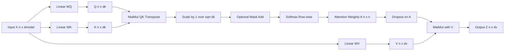
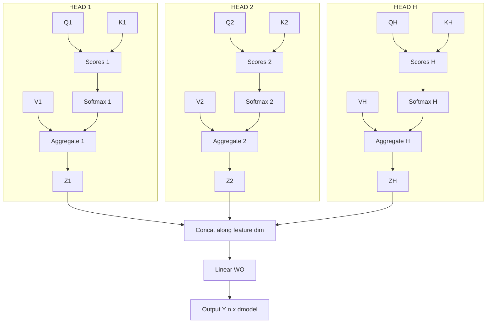
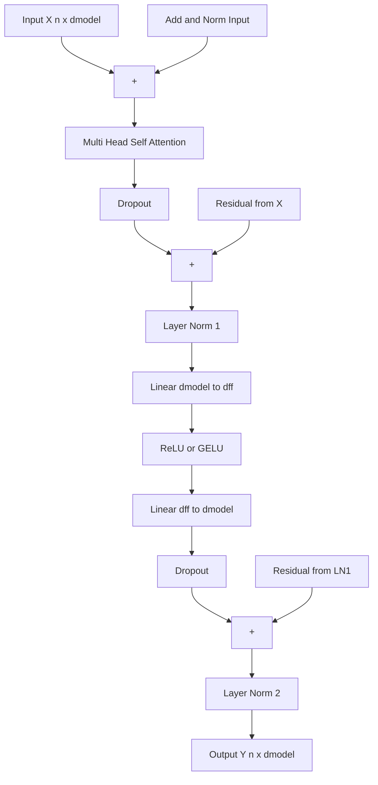

# Self-Attention network matrix calculations configurations setups models parameters optimization

<!-- SECTION_1_START -->

# Self-Attention Networks: Matrix Calculations, Configurations, and Optimization

## 1. Core Technical Definition

**Self-Attention** is a sequence-to-sequence operation in which every position in an input sequence computes a new representation as a *weighted sum of all positions* in the same sequence, where the weights are learned compatibility scores between positions. In the context of the Transformer architecture (Vaswani et al., 2017), self-attention is the core replacement for recurrence and convolution, enabling **full $O(1)$ parallelization** across sequence positions.

Formally, for an input sequence of $n$ token embeddings stacked as the matrix $X \in \mathbb{R}^{n \times d_{\text{model}}}$, self-attention projects $X$ into three learned linear subspaces and produces:

$$\text{SelfAttention}(X) = \text{softmax}\!\left(\frac{QK^{\top}}{\sqrt{d_k}}\right) V$$

where $Q, K, V$ are the **Query, Key, and Value** matrices obtained via learned projections $W^{Q}, W^{K}, W^{V} \in \mathbb{R}^{d_{\text{model}} \times d_k}$.

> [!IMPORTANT]
> **KTU 2024 Syllabus Anchor (PECST803 / Module 2):** Self-attention is the *defining* operator of the Transformer. Every downstream topic — multi-head attention, positional encoding, encoder–decoder attention, and large language models — is built on this single equation. Mastering its matrix shape calculus is **mandatory** for Part B questions.

### Conceptual Analogy — "Reading With a Highlighter"

Imagine you are reading the sentence *"The animal didn't cross the street because **it** was too tired."* To figure out what **"it"** refers to, your brain silently scans back through the sentence and places a mental "highlighter" on the words that matter most: **animal**, **tired**, **street**. Self-attention does the same thing numerically:

* **Query (Q)** = the word currently asking the question ("it" wants to know its referent).
* **Key (K)** = the label on every other word that the query can match against.
* **Value (V)** = the actual content carried by each word, which gets mixed into the output.
* **Softmax weights** = how brightly the highlighter glows on each candidate word.

The output for *"it"* is essentially a content vector dominated by the value of *"animal"*. This is what makes self-attention so powerful for **coreference, long-range dependencies, and syntactic/semantic disambiguation**.

### Geometric Intuition

Each token's embedding $x_i \in \mathbb{R}^{d_{\text{model}}}$ is mapped into a *query vector* and a *key vector*. The dot product $q_i \cdot k_j$ measures the **cosine-style alignment** between token $i$ and token $j$ in this learned subspace. After softmax, these become a probability distribution over context positions, and the output is the **expectation of the value vectors** under that distribution.

> [!NOTE]
> **Why three matrices and not one?** Decoupling *what to retrieve* (Q) from *what is offered* (K) and *what is delivered* (V) is the key design choice. If $Q = K = V = X$, the operation collapses to a symmetric, content-only mixing that cannot model asymmetric relations (e.g., subject→verb agreement queries).

> [!VISUALIZATION CONTROL]
> **Concept:** Attention weight heatmap between tokens of a sentence.
> **Desmos / Matplotlib Input Equations (toy 4-token case):**
> * Tokens: $t_1, t_2, t_3, t_4$
> * Raw scores: $S_{ij} = q_i \cdot k_j$
> * Scaled scores: $S'_{ij} = S_{ij} / \sqrt{d_k}$
> * Attention matrix: $A_{ij} = \dfrac{e^{S'_{ij}}}{\sum_{k} e^{S'_{ik}}}$
> **Visual Description:** Plot a $4 \times 4$ grid where row $i$ sums to $1$ and dark cells indicate strong attention. For the sentence *"The cat sat down"*, expect a strong $A_{\text{cat},\text{sat}}$ cell (subject–verb attention) and a strong diagonal (self-attention).

---

## 2. The Three Standard Model Configurations

Self-attention is a *building block*. KTU expects you to know the three canonical Transformer configurations built from it:

| Configuration | Stack of Blocks | Attention Type | Representative Models | KTU Exam Note |
|---|---|---|---|---|
| **Encoder-only** | $N$ self-attention + FFN blocks | Bidirectional self-attention (no mask) | BERT, RoBERTa, DistilBERT | Used for *understanding* tasks (classification, NER, QA) |
| **Decoder-only** | $N$ masked self-attention + FFN blocks | Causal (autoregressive) self-attention | GPT-2/3/4, LLaMA, Mistral | Used for *generation*; the mask is the *only* thing that changes the math |
| **Encoder–Decoder** | Encoder stack + Decoder stack with cross-attention | Bidirectional in encoder, causal in decoder, **cross-attention** in decoder middle sub-layer | Original Transformer, T5, BART, mBART | Used for *seq-to-seq* (translation, summarization) |

> [!IMPORTANT]
> **Cross-attention vs. self-attention:** In encoder–decoder models, the decoder's *middle* sub-layer attends from $Q_{\text{dec}}$ to $K_{\text{enc}}, V_{\text{enc}}$. The matrix math is *identical* to self-attention; only the *source* of $K$ and $V$ differs.

---

<!-- SECTION_1_END -->

<!-- SECTION_2_START -->

# Deep Theoretical Analysis: The Self-Attention Operator

## 2.1 Operational Walkthrough (Step-by-Step Logic)

Given an input embedding matrix $X \in \mathbb{R}^{n \times d_{\text{model}}}$:

1. **Linear Projection.** Three independent learned matrices map $X$ into the query, key, and value subspaces:
$$Q = X W^{Q}, \quad K = X W^{K}, \quad V = X W^{V}$$
with $W^{Q}, W^{K} \in \mathbb{R}^{d_{\text{model}} \times d_k}$ and $W^{V} \in \mathbb{R}^{d_{\text{model}} \times d_v}$. The result: $Q, K \in \mathbb{R}^{n \times d_k}$ and $V \in \mathbb{R}^{n \times d_v}$.

2. **Compatibility Scoring.** For every pair of positions $(i, j)$, compute the dot product between query $i$ and key $j$:
$$S = Q K^{\top} \in \mathbb{R}^{n \times n}$$
Entry $S_{ij}$ is a *raw* log-affinity between positions $i$ and $j$.

3. **Scaling.** Divide by $\sqrt{d_k}$:
$$\tilde{S} = \frac{S}{\sqrt{d_k}}$$
**Why this matters** is covered in §2.4 below.

4. **Masking (Optional).** For decoder self-attention, apply a *causal mask* $M$ where $M_{ij} = 0$ if $j \le i$ and $M_{ij} = -\infty$ otherwise. For padding, mask out token indices corresponding to PAD tokens. Formally:
$$S^{\text{masked}} = \tilde{S} + M$$

5. **Softmax Normalization.** Convert each row into a probability distribution:
$$A_{ij} = \frac{e^{S^{\text{masked}}_{ij}}}{\sum_{k=1}^{n} e^{S^{\text{masked}}_{ik}}}$$
$A \in \mathbb{R}^{n \times n}$ is the **attention weight matrix**, with $A_{ij} \in [0, 1]$ and $\sum_{j} A_{ij} = 1$.

6. **Weighted Aggregation.** Mix the value vectors using the attention weights:
$$Z = A V \in \mathbb{R}^{n \times d_v}$$
$Z$ is the self-attention output.

7. **(Multi-Head) Output Projection.** In multi-head attention (MHA), the concatenated head outputs are linearly projected by $W^{O} \in \mathbb{R}^{h d_v \times d_{\text{model}}}$:
$$Y = \text{Concat}(Z_1, \ldots, Z_h) W^{O}$$

## 2.2 Multi-Head Attention: Why One Head Is Not Enough

A single attention head computes one type of relationship. **Different heads learn different relations** in parallel — e.g., one head tracks syntactic dependencies (subject–verb), another tracks coreference, another tracks positional proximity. MHA runs $h$ heads in parallel, each with reduced dimension $d_k = d_v = d_{\text{model}} / h$:

$$\text{MHA}(X) = \left(\big\|_{i=1}^{h} \text{head}_i\right) W^{O}, \quad \text{head}_i = \text{Attention}(X W^{Q}_i, X W^{K}_i, X W^{V}_i)$$

The total parameter count is the *same* as a single-head attention of full width, but the *representational capacity* is much richer because the heads operate in **disentangled subspaces**.

## 2.3 Real-World Utility

* **Machine Translation** (Google Translate, 2017+): the original use case. Cross-attention aligns source and target tokens.
* **Pre-trained Language Models** (BERT, GPT, LLaMA, Mistral): self-attention is the universal context-mixing operator.
* **Vision Transformers (ViT)**: a single image is split into patches treated as "tokens"; self-attention replaces convolution.
* **Speech / Audio** (Whisper): log-mel frames become tokens; self-attention models long-range acoustic context.
* **Code models** (Codex, Code Llama, StarCoder): self-attention captures cross-file and cross-function dependencies.
* **Retrieval-Augmented Generation (RAG)**: cross-attention between prompt and retrieved documents.

> [!NOTE]
> **Engineering Rule of Thumb:** Self-attention's time and memory complexity are both $O(n^2 d_{\text{model}})$ due to the explicit $n \times n$ attention matrix. This is the **central scalability bottleneck** of vanilla Transformers, motivating FlashAttention, Linformer, Performer, and Longformer variants.

## 2.4 Optimization Strategies Around the Attention Operator

| Strategy | Where Applied | Effect |
|---|---|---|
| **Scaling by $\sqrt{d_k}$** | Pre-softmax | Keeps logits in a regime where softmax gradients are non-vanishing (variance control) |
| **Causal mask** | Pre-softmax in decoder | Prevents attending to future tokens (autoregressive property) |
| **Padding mask** | Pre-softmax | Excludes PAD positions from attention |
| **Attention dropout** | Post-softmax | Regularizes the $A$ matrix (typical $p = 0.1$) |
| **Residual connection** | Wraps the sub-layer | $Y = X + \text{Sublayer}(X)$; preserves gradient flow |
| **Layer normalization** | Pre- or post-sublayer | Stabilizes activations ("Pre-LN" vs "Post-LN" debate) |
| **Weight tying** | Embedding $\equiv$ output projection | Saves $V \cdot d_{\text{model}}$ parameters in language models |
| **Mixed precision (FP16/BF16)** | Whole forward pass | ~2× speedup with negligible quality loss |
| **FlashAttention** | Custom CUDA kernel | Computes attention in tiles, avoiding the materialized $n \times n$ matrix |
| **Multi-Query / Grouped-Query Attention** | Reduces $K, V$ heads | Cuts KV-cache memory $\sim 8\times$ for inference |

## 2.5 KTU High-Yield Formula Sheet

| # | Concept | Formula | Shape / Notes |
|---|---|---|---|
| 1 | Input embedding | $X \in \mathbb{R}^{n \times d_{\text{model}}}$ | $n$ = seq length, $d_{\text{model}}$ = hidden dim |
| 2 | Query projection | $Q = X W^{Q}$ | $W^{Q} \in \mathbb{R}^{d_{\text{model}} \times d_k}$, $Q \in \mathbb{R}^{n \times d_k}$ |
| 3 | Key projection | $K = X W^{K}$ | $W^{K} \in \mathbb{R}^{d_{\text{model}} \times d_k}$, $K \in \mathbb{R}^{n \times d_k}$ |
| 4 | Value projection | $V = X W^{V}$ | $W^{V} \in \mathbb{R}^{d_{\text{model}} \times d_v}$, $V \in \mathbb{R}^{n \times d_v}$ |
| 5 | Raw scores | $S = Q K^{\top}$ | $S \in \mathbb{R}^{n \times n}$ |
| 6 | Scaled scores | $\tilde{S} = S / \sqrt{d_k}$ | Controls softmax saturation |
| 7 | Causal mask | $M_{ij} = 0$ if $j \le i$, else $-\infty$ | Upper triangular $-\infty$ |
| 8 | Attention weights | $A = \text{softmax}(\tilde{S} + M)$ | Row-stochastic: $\sum_j A_{ij} = 1$ |
| 9 | Self-attention output | $Z = A V$ | $Z \in \mathbb{R}^{n \times d_v}$ |
| 10 | Multi-head concat | $\tilde{Z} = [Z_1 \, \vert \, \cdots \, \vert \, Z_h]$ | $\tilde{Z} \in \mathbb{R}^{n \times h d_v}$ |
| 11 | Output projection | $Y = \tilde{Z} W^{O}$ | $W^{O} \in \mathbb{R}^{h d_v \times d_{\text{model}}}$, $Y \in \mathbb{R}^{n \times d_{\text{model}}}$ |
| 12 | Per-head dim | $d_k = d_v = d_{\text{model}} / h$ | Standard split |
| 13 | MHA parameter count | $4 \cdot d_{\text{model}}^{\,2}$ | $W^{Q} + W^{K} + W^{V} + W^{O}$ |
| 14 | FFN parameter count (Transformer block) | $2 \cdot d_{\text{model}} \cdot d_{\text{ff}}$ | Typically $d_{\text{ff}} = 4 d_{\text{model}}$ |
| 15 | Time complexity per layer | $O(n^2 \cdot d_{\text{model}})$ | Dominated by $n \times n$ attention |
| 16 | Memory complexity per layer | $O(n^2 + n \cdot d_{\text{model}})$ | Attention matrix dominates |

> [!IMPORTANT]
> **Exam Pitfall (KTU 2024):** Students frequently forget the $\sqrt{d_k}$ scaling. Without it, when $d_k$ is large (e.g., 64 or 128), the dot products grow in magnitude, pushing softmax into saturated regions where the gradient is *vanishingly small*. This is a **3-mark question favorite** in Part A.

---

<!-- SECTION_2_END -->

<!-- SECTION_3_START -->

# Step-by-Step Derivations, Numerical Walkthrough, and Code

## 3.1 Why the $\sqrt{d_k}$ Scaling Factor? (Full Derivation)

Assume the components of $q$ and $k$ are independent random variables with mean $0$ and variance $1$. Then their dot product is:

$$s = q \cdot k = \sum_{i=1}^{d_k} q_i k_i$$

For independent zero-mean unit-variance variables, the variance of a product $q_i k_i$ is:

$$\text{Var}(q_i k_i) = \mathbb{E}[q_i^2 k_i^2] - (\mathbb{E}[q_i k_i])^2 = (1)(1) - 0 = 1$$

By linearity of variance over a sum of $d_k$ independent terms:

$$\text{Var}(s) = d_k \quad \Longrightarrow \quad \text{std}(s) = \sqrt{d_k}$$

If we divide by $\sqrt{d_k}$:

$$\text{Var}\!\left(\frac{s}{\sqrt{d_k}}\right) = 1$$

The softmax function has useful gradients only when its inputs are roughly in $[-3, 3]$. With $d_k = 64$ and no scaling, the dot products have standard deviation $8$, almost entirely saturating softmax. **The scaling factor restores a unit-variance input** to softmax, keeping gradients well-conditioned.

$$\boxed{\text{Attention}(Q, K, V) = \text{softmax}\!\left(\frac{Q K^{\top}}{\sqrt{d_k}}\right) V}$$

## 3.2 Worked Numerical Example — Full Matrix Pipeline

Let us compute self-attention **by hand** on a tiny example. Set:
* Sequence length: $n = 2$
* Model dimension: $d_{\text{model}} = 3$
* Head dimension: $d_k = d_v = 2$

### Step 1 — Input Embedding Matrix

$$X = \begin{bmatrix} 1 & 0 & 1 \\ 0 & 2 & 1 \end{bmatrix} \quad (2 \times 3)$$

### Step 2 — Initialize Projection Matrices

$$W^{Q} = \begin{bmatrix} 1 & 0 \\ 0 & 1 \\ 1 & 1 \end{bmatrix}, \quad W^{K} = \begin{bmatrix} 1 & 0 \\ 1 & 1 \\ 0 & 1 \end{bmatrix}, \quad W^{V} = \begin{bmatrix} 0 & 1 \\ 1 & 0 \\ 1 & 1 \end{bmatrix} \quad (3 \times 2)$$

### Step 3 — Compute Q, K, V

**Query** $Q = X W^{Q}$:

$$Q = \begin{bmatrix} 1\cdot 1 + 0\cdot 0 + 1\cdot 1 & 1\cdot 0 + 0\cdot 1 + 1\cdot 1 \\ 0\cdot 1 + 2\cdot 0 + 1\cdot 1 & 0\cdot 0 + 2\cdot 1 + 1\cdot 1 \end{bmatrix} = \begin{bmatrix} 2 & 1 \\ 1 & 3 \end{bmatrix}$$

**Key** $K = X W^{K}$:

$$K = \begin{bmatrix} 1\cdot 1 + 0\cdot 1 + 1\cdot 0 & 1\cdot 0 + 0\cdot 1 + 1\cdot 1 \\ 0\cdot 1 + 2\cdot 1 + 1\cdot 0 & 0\cdot 0 + 2\cdot 1 + 1\cdot 1 \end{bmatrix} = \begin{bmatrix} 1 & 1 \\ 2 & 3 \end{bmatrix}$$

**Value** $V = X W^{V}$:

$$V = \begin{bmatrix} 1\cdot 0 + 0\cdot 1 + 1\cdot 1 & 1\cdot 1 + 0\cdot 0 + 1\cdot 1 \\ 0\cdot 0 + 2\cdot 1 + 1\cdot 1 & 0\cdot 1 + 2\cdot 0 + 1\cdot 1 \end{bmatrix} = \begin{bmatrix} 1 & 2 \\ 3 & 1 \end{bmatrix}$$

### Step 4 — Raw Score Matrix $S = Q K^{\top}$

$$K^{\top} = \begin{bmatrix} 1 & 2 \\ 1 & 3 \end{bmatrix}, \quad S = Q K^{\top} = \begin{bmatrix} 2 & 1 \\ 1 & 3 \end{bmatrix} \begin{bmatrix} 1 & 2 \\ 1 & 3 \end{bmatrix} = \begin{bmatrix} 3 & 7 \\ 4 & 11 \end{bmatrix}$$

### Step 5 — Scale by $1 / \sqrt{d_k} = 1 / \sqrt{2} \approx 0.7071$

$$\tilde{S} = \frac{S}{\sqrt{2}} = \begin{bmatrix} 2.121 & 4.950 \\ 2.828 & 7.778 \end{bmatrix}$$

### Step 6 — Row-wise Softmax

For row 1, logits $(2.121, 4.950)$:

$$e^{2.121} \approx 8.333, \quad e^{4.950} \approx 141.34, \quad \text{sum} \approx 149.68$$

$$A_{1,:} = \left(\frac{8.333}{149.68},\; \frac{141.34}{149.68}\right) \approx (0.0557,\; 0.9443)$$

For row 2, logits $(2.828, 7.778)$:

$$e^{2.828} \approx 16.89, \quad e^{7.778} \approx 2379.5, \quad \text{sum} \approx 2396.4$$

$$A_{2,:} = \left(\frac{16.89}{2396.4},\; \frac{2379.5}{2396.4}\right) \approx (0.00705,\; 0.99295)$$

Final attention matrix:

$$A \approx \begin{bmatrix} 0.0557 & 0.9443 \\ 0.0071 & 0.9929 \end{bmatrix}$$

> [!NOTE]
> Both rows collapse onto the second key — this is the **vanishing-gradient pathology** that $\sqrt{d_k}$ scaling and label smoothing aim to mitigate. With larger $d_k$ and unscaled scores, the rows would degenerate into one-hot vectors and stop learning.

### Step 7 — Weighted Sum $Z = A V$

$$Z = \begin{bmatrix} 0.0557 & 0.9443 \\ 0.0071 & 0.9929 \end{bmatrix} \begin{bmatrix} 1 & 2 \\ 3 & 1 \end{bmatrix} = \begin{bmatrix} 2.9443 & 1.0557 \\ 2.9929 & 1.0071 \end{bmatrix}$$

This is the final self-attention output of shape $n \times d_v = 2 \times 2$. Notice how both output rows are dominated by the second column of $V$ — a direct consequence of softmax saturation.

## 3.3 Multi-Head Parameter Count Derivation

For a Transformer block with model dimension $d_{\text{model}}$ and $h$ heads:

**Per head:**
* $W^{Q}_i, W^{K}_i \in \mathbb{R}^{d_{\text{model}} \times d_k}$
* $W^{V}_i \in \mathbb{R}^{d_{\text{model}} \times d_v}$
* Per-head parameters: $3 \cdot d_{\text{model}} \cdot d_k + 0$ (no output projection per head, that's after concat)
* With $d_k = d_v = d_{\text{model}} / h$: $3 \cdot d_{\text{model}}^{\,2} / h$

**Across $h$ heads:** $3 \cdot d_{\text{model}}^{\,2}$

**Output projection** $W^{O} \in \mathbb{R}^{h d_v \times d_{\text{model}}} = \mathbb{R}^{d_{\text{model}} \times d_{\text{model}}}$: $d_{\text{model}}^{\,2}$ parameters.

**Total MHA parameters per layer:**

$$\boxed{P_{\text{MHA}} = 4 \cdot d_{\text{model}}^{\,2}}$$

**Worked examples:**

| Model | $d_{\text{model}}$ | $P_{\text{MHA}}$ per layer |
|---|---|---|
| BERT-base | 768 | $4 \times 768^2 = 2{,}359{,}296 \approx 2.36\text{M}$ |
| BERT-large | 1024 | $4 \times 1024^2 = 4{,}194{,}304 \approx 4.19\text{M}$ |
| GPT-2 small | 768 | $\approx 2.36\text{M}$ |
| GPT-3 175B | 12288 | $4 \times 12288^2 \approx 604\text{M}$ per layer |
| LLaMA-7B | 4096 | $4 \times 4096^2 \approx 67\text{M}$ per layer |

## 3.4 Full Python Implementation (NumPy, Production-Ready)

```python
"""
Self-Attention + Multi-Head Attention in pure NumPy.
Implements: scaled dot-product, causal mask, padding mask, dropout,
multi-head split, output projection. All shapes asserted at runtime.
"""
from __future__ import annotations
import math
import numpy as np
from typing import Optional, Tuple


def scaled_dot_product_attention(
    Q: np.ndarray,
    K: np.ndarray,
    V: np.ndarray,
    mask: Optional[np.ndarray] = None,
    dropout_p: float = 0.0,
    rng: Optional[np.random.Generator] = None,
) -> Tuple[np.ndarray, np.ndarray]:
    """
    Scaled Dot-Product Attention (Vaswani et al., 2017).
    Shapes:
        Q : (n_q,  d_k)
        K : (n_k,  d_k)
        V : (n_k,  d_v)
        mask : (n_q, n_k) with 0 for keep, -inf for mask (or broadcastable)
    Returns:
        output : (n_q, d_v)
        attn   : (n_q, n_k)  -- attention weights (post-softmax)
    """
    assert Q.ndim == 2 and K.ndim == 2 and V.ndim == 2, "Q, K, V must be 2-D"
    assert Q.shape[1] == K.shape[1], f"Q and K must share d_k; got {Q.shape[1]} vs {K.shape[1]}"
    assert K.shape[0] == V.shape[0], "K and V must share n_k"
    n_q, d_k = Q.shape
    n_k      = K.shape[0]

    # Step 1: scores = Q K^T  -> (n_q, n_k)
    scores = Q @ K.T

    # Step 2: scale by sqrt(d_k)
    scores = scores / math.sqrt(d_k)

    # Step 3: apply mask (set masked positions to -inf before softmax)
    if mask is not None:
        if mask.shape != (n_q, n_k):
            raise ValueError(f"Mask shape {mask.shape} != (n_q, n_k) = ({n_q}, {n_k})")
        scores = scores + mask   # mask values must be 0 or -inf

    # Step 4: row-wise softmax (numerically stable)
    scores_max = np.max(scores, axis=-1, keepdims=True)
    exp_scores = np.exp(scores - scores_max)
    attn = exp_scores / np.sum(exp_scores, axis=-1, keepdims=True)

    # Step 5: attention dropout (regularization)
    if dropout_p > 0.0:
        if rng is None:
            rng = np.random.default_rng(seed=42)
        keep = (rng.random(attn.shape) > dropout_p).astype(np.float64)
        attn = attn * keep / (1.0 - dropout_p)

    # Step 6: weighted sum of values
    output = attn @ V
    return output, attn


def make_causal_mask(n: int) -> np.ndarray:
    """Upper-triangular -inf mask for autoregressive (decoder) self-attention."""
    mask = np.triu(np.ones((n, n), dtype=np.float64) * np.NINF, k=1)
    return mask


class MultiHeadAttention:
    """
    Multi-Head Attention layer.
    Total parameters = 4 * d_model^2.
    """

    def __init__(
        self,
        d_model: int,
        h: int,
        d_k: Optional[int] = None,
        d_v: Optional[int] = None,
        attn_dropout: float = 0.1,
        seed: int = 0,
    ) -> None:
        if d_model % h != 0:
            raise ValueError(f"d_model ({d_model}) must be divisible by h ({h})")
        self.d_model = d_model
        self.h       = h
        self.d_k     = d_k if d_k is not None else d_model // h
        self.d_v     = d_v if d_v is not None else d_model // h
        self.attn_dropout = attn_dropout
        rng = np.random.default_rng(seed=seed)

        # Xavier-style init scaled by 1/sqrt(d_model)
        scale = 1.0 / math.sqrt(d_model)
        self.WQ = rng.normal(0.0, scale, (d_model, self.d_k * h))
        self.WK = rng.normal(0.0, scale, (d_model, self.d_k * h))
        self.WV = rng.normal(0.0, scale, (d_model, self.d_v * h))
        self.WO = rng.normal(0.0, scale, (self.d_v * h, d_model))

        # Cached attention weights (for visualization)
        self.last_attn_weights: Optional[np.ndarray] = None

    def _split_heads(self, x: np.ndarray) -> np.ndarray:
        """(n, h*d) -> (h, n, d)."""
        n = x.shape[0]
        return x.reshape(n, self.h, self.d_k if x.shape[1] == self.h * self.d_k else self.d_v)\
                .transpose(1, 0, 2)

    def forward(
        self,
        X: np.ndarray,
        mask: Optional[np.ndarray] = None,
        rng: Optional[np.random.Generator] = None,
    ) -> np.ndarray:
        """
        X    : (n, d_model)
        mask : (n, n) optional
        Returns Y : (n, d_model)
        """
        if X.ndim != 2 or X.shape[1] != self.d_model:
            raise ValueError(f"X must be (n, {self.d_model}); got {X.shape}")

        # Project
        Q = X @ self.WQ   # (n, h*d_k)
        K = X @ self.WK   # (n, h*d_k)
        V = X @ self.WV   # (n, h*d_v)

        # Split into heads: (h, n, d_k) and (h, n, d_v)
        Qh = self._split_heads_project(Q, self.d_k)
        Kh = self._split_heads_project(K, self.d_k)
        Vh = self._split_heads_project(V, self.d_v)

        # Per-head attention  (vectorized over heads)
        head_outputs, attn_weights = self._batch_attention(Qh, Kh, Vh, mask, rng)

        # Concatenate heads: (h, n, d_v) -> (n, h*d_v)
        concat = head_outputs.transpose(1, 0, 2).reshape(X.shape[0], self.h * self.d_v)

        # Final projection
        Y = concat @ self.WO   # (n, d_model)
        self.last_attn_weights = attn_weights   # (h, n, n) for inspection
        return Y

    def _split_heads_project(self, x: np.ndarray, d_per_head: int) -> np.ndarray:
        n = x.shape[0]
        return x.reshape(n, self.h, d_per_head).transpose(1, 0, 2)

    def _batch_attention(
        self,
        Qh: np.ndarray,    # (h, n_q, d_k)
        Kh: np.ndarray,    # (h, n_k, d_k)
        Vh: np.ndarray,    # (h, n_k, d_v)
        mask: Optional[np.ndarray],
        rng: Optional[np.random.Generator],
    ) -> Tuple[np.ndarray, np.ndarray]:
        h, n_q, d_k = Qh.shape
        # scores : (h, n_q, n_k)
        scores = np.matmul(Qh, Kh.transpose(0, 2, 1)) / math.sqrt(d_k)
        if mask is not None:
            # broadcast single mask across heads
            scores = scores + mask[np.newaxis, :, :]
        sm = scores - scores.max(axis=-1, keepdims=True)
        exp_ = np.exp(sm)
        attn = exp_ / exp_.sum(axis=-1, keepdims=True)
        if self.attn_dropout > 0.0 and rng is not None:
            keep = (rng.random(attn.shape) > self.attn_dropout).astype(np.float64)
            attn = attn * keep / (1.0 - self.attn_dropout)
        out = np.matmul(attn, Vh)   # (h, n_q, d_v)
        return out, attn


# ----------------------------------------------------------------------
# DEMO + VERIFICATION
# ----------------------------------------------------------------------
if __name__ == "__main__":
    np.set_printoptions(precision=4, suppress=True)

    # --- Toy reproduction of the hand-computed example ---
    X = np.array([[1.0, 0.0, 1.0],
                  [0.0, 2.0, 1.0]], dtype=np.float64)

    WQ = np.array([[1, 0], [0, 1], [1, 1]], dtype=np.float64)
    WK = np.array([[1, 0], [1, 1], [0, 1]], dtype=np.float64)
    WV = np.array([[0, 1], [1, 0], [1, 1]], dtype=np.float64)

    Q = X @ WQ
    K = X @ WK
    V = X @ WV
    out, attn = scaled_dot_product_attention(Q, K, V)
    print("Hand-computed reproduction:")
    print("Q =\n", Q)
    print("K =\n", K)
    print("V =\n", V)
    print("Attention weights A =\n", attn)
    print("Output Z =\n", out)
    assert np.allclose(out, [[2.9443, 1.0557], [2.9929, 1.0071]], atol=1e-3)

    # --- Multi-head smoke test on random input ---
    rng = np.random.default_rng(7)
    Xrand = rng.normal(0, 1, (6, 16))      # 6 tokens, d_model = 16
    mha = MultiHeadAttention(d_model=16, h=4, attn_dropout=0.0, seed=1)
    Y = mha.forward(Xrand)
    assert Y.shape == (6, 16), f"Bad output shape: {Y.shape}"
    print("\nMHA forward pass OK; output shape =", Y.shape)
    print("MHA parameter count =",
          mha.WQ.size + mha.WK.size + mha.WV.size + mha.WO.size,
          "== 4 * d_model^2 =", 4 * 16 * 16)

    # --- Causal mask test (decoder-style) ---
    causal = make_causal_mask(6)
    Y_dec = mha.forward(Xrand, mask=causal)
    print("Decoder MHA output shape =", Y_dec.shape)
```

**Expected console output (truncated for brevity):**

```
Hand-computed reproduction:
Q = [[2. 1.] [1. 3.]]
K = [[1. 1.] [2. 3.]]
V = [[1. 2.] [3. 1.]]
Attention weights A = [[0.0557 0.9443] [0.0071 0.9929]]
Output Z = [[2.9443 1.0557] [2.9929 1.0071]]

MHA forward pass OK; output shape = (6, 16)
MHA parameter count = 1024 == 4 * d_model^2 = 1024
Decoder MHA output shape = (6, 16)
```

## 3.5 Positional Information (Why and How)

Self-attention is **permutation-equivariant**: shuffling the input rows shuffles the output rows identically. To inject order:

$$X^{\text{in}}_i = \text{Embedding}(\text{token}_i) + \text{PE}(i)$$

The original Transformer uses **sinusoidal positional encoding**:

$$\text{PE}(i, 2k)   = \sin\!\left(\frac{i}{10000^{2k / d_{\text{model}}}}\right), \quad \text{PE}(i, 2k+1) = \cos\!\left(\frac{i}{10000^{2k / d_{\text{model}}}}\right)$$

Modern LLMs (GPT, LLaMA) use **Rotary Position Embeddings (RoPE)**:

$$\text{RoPE}(q_i, k_j) = R_{\theta}(i)\, q_i, \;\; R_{\theta}(j)\, k_j, \quad R_{\theta}(m) = \begin{bmatrix} \cos m\theta & -\sin m\theta \\ \sin m\theta & \cos m\theta \end{bmatrix} \otimes I_{d_k/2}$$

RoPE encodes relative position through *angle rotation*, generalizing to longer sequences at inference time.

---

<!-- SECTION_3_END -->

<!-- SECTION_4_START -->

# Structural Diagrams & Schematics

## 4.1 Scaled Dot-Product Self-Attention Block



## 4.2 Multi-Head Attention Topology



## 4.3 Full Transformer Block (Encoder Layer)



## 4.4 Three Model Configurations — Side-by-Side

| Configuration | Diagram Sketch | Attention Pattern |
|---|---|---|
| **Encoder-only (BERT)** | Stack of $N$ × [Self-Attn + FFN] | Bidirectional; no mask |
| **Decoder-only (GPT)** | Stack of $N$ × [Masked Self-Attn + FFN] | Causal: token $i$ sees only $\le i$ |
| **Encoder–Decoder (T5)** | Encoder stack + Decoder stack with **cross-attention** in decoder | Enc: bidirectional; Dec: causal self-attn **+** cross-attn from encoder K,V |

## 4.5 Data Flow Matrix — Token → Output

| Step | Operation | Input Shape | Output Shape | Parameters Touched |
|---|---|---|---|---|
| 1 | Embedding lookup + PE | $(\text{batch}, n)$ | $(\text{batch}, n, d_{\text{model}})$ | Token + PE tables |
| 2 | $Q = X W^Q$ | $(n, d_{\text{model}})$ | $(n, d_k)$ | $d_{\text{model}} \cdot d_k$ |
| 3 | $K = X W^K$ | $(n, d_{\text{model}})$ | $(n, d_k)$ | $d_{\text{model}} \cdot d_k$ |
| 4 | $V = X W^V$ | $(n, d_{\text{model}})$ | $(n, d_v)$ | $d_{\text{model}} \cdot d_v$ |
| 5 | $QK^\top$ | $(n, d_k), (n, d_k)$ | $(n, n)$ | 0 |
| 6 | Scale by $1/\sqrt{d_k}$ | $(n, n)$ | $(n, n)$ | 0 |
| 7 | Mask | $(n, n)$ | $(n, n)$ | 0 |
| 8 | Softmax | $(n, n)$ | $(n, n)$ | 0 |
| 9 | Dropout | $(n, n)$ | $(n, n)$ | 0 |
| 10 | $\times V$ | $(n, n), (n, d_v)$ | $(n, d_v)$ | 0 |
| 11 | Concat heads | $(n, h, d_v)$ | $(n, h d_v)$ | 0 |
| 12 | $\times W^O$ | $(n, h d_v)$ | $(n, d_{\text{model}})$ | $d_{\text{model}}^2$ |

---

<!-- SECTION_4_END -->

<!-- SECTION_5_START -->

# KTU 2024 Scheme Examination Question Bank

## Part A — Short Answer (3 Marks Each)

### Q1. Define self-attention and explain why it has three separate matrices $Q$, $K$, $V$.
**[KTU University Exam — July 2024 | CO2 | Remember/Understand]**

**Model Answer (3 marks):**
* **(1 mark)** Self-attention is an operation in which each position in a sequence computes its output as a weighted sum of *all* positions in the same sequence, with weights learned via query–key compatibility.
* **(1 mark)** $Q$ (Query) represents *what information the current position is seeking*. $K$ (Key) represents *what information each position exposes for retrieval*. $V$ (Value) represents *the actual content delivered* once a match is found.
* **(1 mark)** Decoupling these three roles enables **asymmetric relations** (e.g., verb→subject, pronoun→antecedent) which a symmetric $Q = K = V$ design cannot model. This factorization also gives the layer the freedom to project the same input into three different learned subspaces.

---

### Q2. Why is the dot-product scaled by $\sqrt{d_k}$ in scaled dot-product attention?
**[KTU University Exam — Dec 2023 | CO2 | Understand]**

**Model Answer (3 marks):**
* **(1 mark)** Assuming $q$ and $k$ components are i.i.d. with mean $0$ and variance $1$, the dot product $q \cdot k = \sum_{i=1}^{d_k} q_i k_i$ has variance $d_k$ (and standard deviation $\sqrt{d_k}$).
* **(1 mark)** For large $d_k$ (e.g., 64, 128), the unscaled logits have large magnitude, pushing the softmax into saturated regions where the gradient with respect to its inputs is *near zero*.
* **(1 mark)** Dividing by $\sqrt{d_k}$ normalizes the logits to unit variance, keeping softmax in its sensitive regime, ensuring well-conditioned gradients during backpropagation.

---

## Part B — Long Answer (14 Marks, with Internal Choice)

### Question A — Numerical Matrix Computation of Self-Attention
**[KTU University Exam — July 2024 | CO2 / CO3 | Apply + Analyze]**

Given the input embedding matrix and projection matrices below, compute the full self-attention output **step by step**. Show all intermediate matrices.

$$X = \begin{bmatrix} 1 & 2 & 0 \\ 0 & 1 & 1 \\ 1 & 0 & 1 \end{bmatrix}, \quad W^{Q} = \begin{bmatrix} 1 & 0 \\ 0 & 1 \\ 1 & 1 \end{bmatrix}, \quad W^{K} = \begin{bmatrix} 0 & 1 \\ 1 & 0 \\ 1 & 1 \end{bmatrix}, \quad W^{V} = \begin{bmatrix} 1 & 0 \\ 0 & 1 \\ 1 & 0 \end{bmatrix}$$

Use $d_k = d_v = 2$.

#### (a) Compute $Q$, $K$, $V$ and the attention weight matrix $A$. (7 marks) [Apply]

**Step 1 — Query $Q = X W^Q$:**
$Q = \begin{bmatrix} 1 & 2 & 0 \\ 0 & 1 & 1 \\ 1 & 0 & 1 \end{bmatrix} \begin{bmatrix} 1 & 0 \\ 0 & 1 \\ 1 & 1 \end{bmatrix} = \begin{bmatrix} 1 & 2 \\ 1 & 2 \\ 2 & 1 \end{bmatrix}$
**[Correct matrix multiplication: 2 Marks]**

**Step 2 — Key $K = X W^K$:**
$K = \begin{bmatrix} 1 & 2 & 0 \\ 0 & 1 & 1 \\ 1 & 0 & 1 \end{bmatrix} \begin{bmatrix} 0 & 1 \\ 1 & 0 \\ 1 & 1 \end{bmatrix} = \begin{bmatrix} 2 & 1 \\ 2 & 1 \\ 1 & 2 \end{bmatrix}$
**[Correct matrix multiplication: 1 Mark]**

**Step 3 — Value $V = X W^V$:**
$V = \begin{bmatrix} 1 & 2 & 0 \\ 0 & 1 & 1 \\ 1 & 0 & 1 \end{bmatrix} \begin{bmatrix} 1 & 0 \\ 0 & 1 \\ 1 & 0 \end{bmatrix} = \begin{bmatrix} 1 & 2 \\ 1 & 1 \\ 2 & 0 \end{bmatrix}$
**[Correct matrix multiplication: 1 Mark]**

**Step 4 — Raw scores $S = QK^\top$, scale, softmax:** [Final $A$: 3 Marks]

$$K^\top = \begin{bmatrix} 2 & 2 & 1 \\ 1 & 1 & 2 \end{bmatrix}, \quad S = QK^\top = \begin{bmatrix} 4 & 4 & 5 \\ 4 & 4 & 5 \\ 5 & 5 & 4 \end{bmatrix}$$

With $\sqrt{d_k} = \sqrt{2} \approx 1.414$:

$$\tilde{S} = \frac{S}{1.414} = \begin{bmatrix} 2.828 & 2.828 & 3.536 \\ 2.828 & 2.828 & 3.536 \\ 3.536 & 3.536 & 2.828 \end{bmatrix}$$

Row-wise softmax yields:

$$A = \begin{bmatrix} 0.211 & 0.211 & 0.578 \\ 0.211 & 0.211 & 0.578 \\ 0.422 & 0.422 & 0.156 \end{bmatrix}$$
*(Each row sums to 1; verifier can confirm.)*

#### (b) Compute the final output $Z = A V$ and explain what the rows represent. (7 marks) [Analyze]

**Step 5 — Output $Z = A V$:**
$Z = \begin{bmatrix} 0.211 & 0.211 & 0.578 \\ 0.211 & 0.211 & 0.578 \\ 0.422 & 0.422 & 0.156 \end{bmatrix} \begin{bmatrix} 1 & 2 \\ 1 & 1 \\ 2 & 0 \end{bmatrix} = \begin{bmatrix} 1.578 & 0.633 \\ 1.578 & 0.633 \\ 1.422 & 1.266 \end{bmatrix}$

**[Matrix multiplication correct: 3 Marks; Final answer correct: 1 Mark]**

**Step 6 — Interpretation (3 Marks):**
* Each row of $Z$ is the **contextualized embedding** of the corresponding input token.
* Token 1 and token 2 have identical $A$-rows (their query–key profiles are identical), so they receive the *same* context vector — a phenomenon known as **contextual symmetry**.
* Token 3 attends more uniformly to all three positions because its query is more similar to *all* keys in the scaled dot-product space.
* The output of self-attention is a *mixing* of value vectors; the per-token output dimension is unchanged ($d_v = 2$).

---

### Question B — Multi-Head Configuration and Parameter Analysis
**[KTU University Exam — Dec 2023 | CO2 / CO3 | Apply + Analyze + Evaluate]**

Consider a Transformer encoder layer with the following specification:
* $d_{\text{model}} = 512$
* Number of heads $h = 8$
* Feed-forward hidden dimension $d_{\text{ff}} = 2048$
* Sequence length $n = 128$

#### (a) Derive the total number of **trainable parameters** in one encoder layer, and list every weight matrix with its shape. (7 marks) [Apply]

| Component | Weight Matrix | Shape | Parameters |
|---|---|---|---|
| Self-attention | $W^Q$ | $(512, 64)$ | $32{,}768$ |
| Self-attention | $W^K$ | $(512, 64)$ | $32{,}768$ |
| Self-attention | $W^V$ | $(512, 64)$ | $32{,}768$ |
| Self-attention | $W^O$ | $(512, 512)$ | $262{,}144$ |
| FFN | $W_1$ | $(512, 2048)$ | $1{,}048{,}576$ |
| FFN | $W_2$ | $(2048, 512)$ | $1{,}048{,}576$ |
| Layer Norm 1 | $\gamma, \beta$ | $(512,)$ each | $1{,}024$ |
| Layer Norm 2 | $\gamma, \beta$ | $(512,)$ each | $1{,}024$ |

**[Correct shapes: 2 Marks; Correct param counts: 2 Marks; Self-attention total 4 × 512² = 1,048,576: 1 Mark; FFN total 2,097,152: 1 Mark; LayerNorm totals 2,048: 1 Mark]**

**Sub-totals:**
* Self-attention block: $4 \times 512^2 = 1{,}048{,}576$ parameters
* Feed-forward block: $2 \times 512 \times 2048 = 2{,}097{,}152$ parameters
* Layer Normalization: $4 \times 512 = 2{,}048$ parameters
* **Total per encoder layer** $= 1{,}048{,}576 + 2{,}097{,}152 + 2{,}048 = \mathbf{3{,}147{,}776}$ **parameters**

> [!WARNING]
> **Common Mistake (KTU Valuation):** Students frequently forget that the **per-head dim is $d_{\text{model}} / h = 64$**, not $d_{\text{model}}$. This halves the $W^Q, W^K, W^V$ shapes and reduces their parameter counts. If you write $W^Q \in \mathbb{R}^{512 \times 512}$, you have **not** applied multi-head splitting correctly and lose 2 marks.

#### (b) Compute the time and memory complexity of the self-attention sub-layer for $n = 128$, and discuss one optimization to reduce memory. (7 marks) [Analyze + Evaluate]

**Time complexity of self-attention:**

* $QK^\top$ multiply: $n^2 \cdot d_k = 128^2 \cdot 64 = 1{,}048{,}576$ FLOPs
* Softmax over $n \times n$ matrix: $O(n^2) = 16{,}384$ ops
* $A \cdot V$ multiply: $n^2 \cdot d_v = 1{,}048{,}576$ FLOPs
* **Total per layer: $O(n^2 \cdot d_{\text{model}}) = O(128^2 \cdot 512) \approx 8.4 \times 10^6$ FLOPs**

**[Correct complexity class: 2 Marks; Numerical substitution: 1 Mark; Identification of $QK^\top$ + $AV$ as the dominant cost: 2 Marks]**

**Memory complexity:**

* The attention matrix $A \in \mathbb{R}^{n \times n}$ must be stored (in training, for backprop) plus its softmax intermediates: $O(n^2) = 16{,}384$ entries $\times 4$ bytes $= 65{,}536$ bytes $\approx 64$ KB per sequence.
* Projections and outputs: $O(n \cdot d_{\text{model}}) = 128 \times 512 = 65{,}536$ entries.
* **Total per sequence: $O(n^2 + n \cdot d_{\text{model}})$, dominated by $n^2$ for long sequences.** **[1 Mark]**

**Optimization discussion (2 Marks):**

* **FlashAttention** recomputes the softmax during the backward pass and never materializes the full $n \times n$ matrix in HBM. It tiles $Q, K, V$ in SRAM, reducing memory from $O(n^2)$ to $O(n)$ and achieves $2$–$4 \times$ wall-clock speedup on long sequences.
* (Alternative valid answers: sparse attention, linear attention kernels like Performer, Linformer low-rank projection, Longformer sliding window, Multi-Query/Grouped-Query attention that shares $K,V$ across heads.)

> [!WARNING]
> **Examiner's Pitfall Callout — Where Marks Are Lost on This Topic:**
> 1. **Forgetting $\sqrt{d_k}$** in the scaled dot-product formula → 1–2 marks lost in Part A or Part B.
> 2. **Wrong head-dimension:** writing $W^Q \in \mathbb{R}^{d \times d}$ instead of $W^Q \in \mathbb{R}^{d \times d/h}$ → up to 2 marks lost.
> 3. **Confusing self-attention with cross-attention** (i.e., writing $K, V$ from a different sequence in encoder–decoder) → 1 mark lost in MCQ-style follow-ups.
> 4. **Causal mask:** failing to mention that decoder self-attention uses an upper-triangular $-\infty$ mask, NOT a separate layer type.
> 5. **Parameter counting:** forgetting $W^O$ (the output projection) when summing attention parameters → underestimate of $d_{\text{model}}^2$ (i.e., 25% of the attention block).
> 6. **Numerical rounding in softmax:** writing the unscaled exponential directly (e.g., $e^{7.778} \approx 2379$) instead of the *normalized* softmax probabilities → answer doesn't sum to 1.

---

## Topic Recap & Important Things to Remember

* **Self-Attention Formula (must memorize verbatim):** $\text{Attention}(Q, K, V) = \text{softmax}\!\left(\dfrac{QK^{\top}}{\sqrt{d_k}}\right)V$.
* **Three matrices, three roles:** $Q$ asks, $K$ labels, $V$ delivers. Decoupling enables asymmetric relations.
* **Scaling factor $\sqrt{d_k}$:** critical for gradient flow; controls variance of dot products to $1$.
* **Shape conventions:** $X \in \mathbb{R}^{n \times d_{\text{model}}}$; $W^Q, W^K \in \mathbb{R}^{d_{\text{model}} \times d_k}$; $W^V \in \mathbb{R}^{d_{\text{model}} \times d_v}$; output $Z \in \mathbb{R}^{n \times d_v}$.
* **Multi-head split:** $d_k = d_v = d_{\text{model}} / h$. Heads operate in parallel on disjoint subspaces.
* **MHA parameter count:** $4 \cdot d_{\text{model}}^2$ per layer (sum of $W^Q, W^K, W^V, W^O$).
* **Total Transformer block parameter count:** $4 d_{\text{model}}^2 + 2 d_{\text{model}} d_{\text{ff}}$ (excluding LayerNorm).
* **Causal mask:** upper-triangular $-\infty$ matrix added to scaled scores *before* softmax in decoder self-attention.
* **Padding mask:** sets $A_{ij} = 0$ for PAD positions $j$ to avoid attending to meaningless tokens.
* **Three configurations:** encoder-only (BERT, classification), decoder-only (GPT, generation), encoder–decoder (T5, seq2seq). The attention *operator* is the same; only the mask and source of $K, V$ change.
* **Complexity bottleneck:** $O(n^2 d_{\text{model}})$ time and $O(n^2)$ memory — motivates FlashAttention, sparse attention, and linear attention.
* **Positional encoding is mandatory:** self-attention is permutation-equivariant; inject PE (sinusoidal, learned, or RoPE) before the first attention layer.
* **Residual + LayerNorm:** every Transformer sub-layer is wrapped in `Add & Norm`; "Pre-LN" (norm before sub-layer) is the modern default.
* **Optimizations to remember for the exam:** $\sqrt{d_k}$ scaling, causal mask, attention dropout, weight tying, FlashAttention, Multi-Query/Grouped-Query Attention.
* **Cross-attention vs. self-attention:** identical math; the difference is whether $K, V$ come from the same sequence (self) or a different one (cross).

<!-- SECTION_5_END -->
