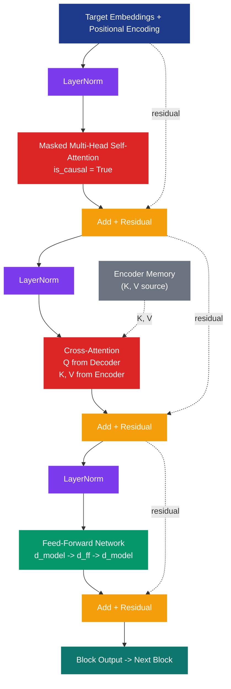
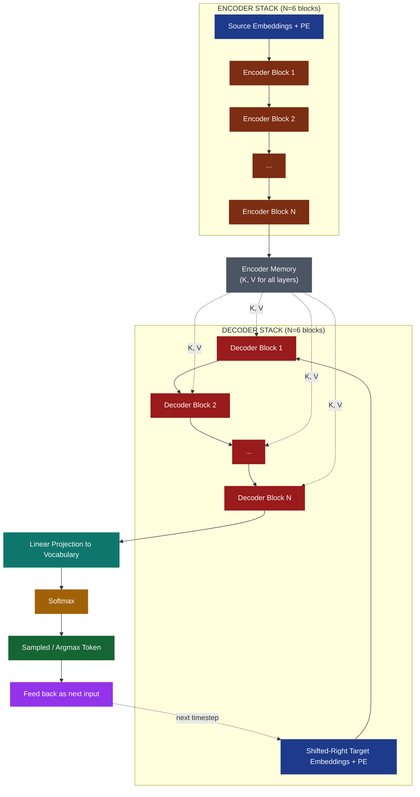
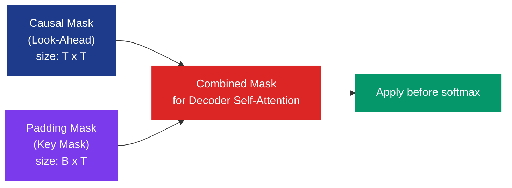

# Transformer translation blocks decoding configurations architectures layout specifications workflows

<!-- SECTION_1_START -->
# Transformer Decoding Architectures: Configuration, Layout & Workflow Specification

## 1. Formal KTU Syllabus Definition

In the context of the **Transformer translation model** (Vaswani et al., 2017), the **decoder** is the autoregressive sub-network responsible for generating the target language sequence token-by-token, conditioned on the encoder's contextual representations. It is composed of a stack of $N$ identical **Transformer Decoder Blocks**, each containing three sub-layers: a **masked multi-head self-attention** layer, a **cross-attention (encoder-decoder attention)** layer, and a **position-wise feed-forward network (FFN)**, with residual connections and layer normalization surrounding every sub-layer.

The decoder block specification includes the **causal masking** mechanism (look-ahead mask), the **shifted-right** positional offset for target inputs, and the **output projection** to vocabulary logits, followed by **softmax** decoding.

> [!IMPORTANT]
> **KTU 2024 Highlight (PECST803 / Module 2):** The Transformer translation block is the central architecture for sequence-to-sequence (seq2seq) tasks. The **decoder** is the generative half; the **encoder** is the conditioning half. Together they form an **Encoder-Decoder Transformer**, the foundational model behind machine translation, summarization, and early LLMs.

> [!NOTE]
> **Architectural Paradigm Shift:** Unlike RNN/LSTM seq2seq models that process tokens sequentially, the Transformer decoder uses **parallel self-attention within a layer** combined with **autoregressive masking across time steps**. This is the engineering breakthrough that makes modern NLP tractable.

---

## 2. Intuitive Analogy: The Translator in a Soundproof Booth

Imagine a human translator (the **decoder**) sitting in a soundproof booth, translating a live speech (the **encoder output**) into another language in real time.

| Component | Human Analogy | Technical Role |
|---|---|---|
| **Booth window** (one-way mirror) | Can see the speaker's notes but cannot see future slides | **Cross-attention**: reads encoder memory |
| **Headphones with delay** | Hears their own previous translated words | **Masked self-attention**: attends to past outputs |
| **Notebook of grammar rules** | Internal language model | **Feed-Forward Network (FFN)** |
| **Microphone + speaker** | Outputs one word at a time | **Linear + Softmax** projection |
| **Stop sign** | Knows when to end the sentence | **End-of-Sentence (EOS) token** |

The translator:
1. **Looks at the full source speech notes** (encoder output — the entire source sentence in parallel).
2. **Listens only to their own past words** (masked self-attention — no peeking at the future).
3. **Thinks about the next word** (FFN — non-linear transformation).
4. **Says the next translated word aloud** (linear projection + softmax → one token).
5. **Repeats** until they say "STOP" (EOS token generated).

This is precisely the **autoregressive decoding workflow** of the Transformer.

---

## 3. GeoGebra / Desmos Visualization Control

> [!VISUALIZATION CONTROL]
> **Concept:** Causal (Look-Ahead) Attention Mask — visualized as a binary attention matrix
>
> **Desmos Input Equations (4-token sequence):**
> * `A = \begin{pmatrix} 1 & 0 & 0 & 0 \\ 1 & 1 & 0 & 0 \\ 1 & 1 & 1 & 0 \\ 1 & 1 & 1 & 1 \end{pmatrix}` — Lower-triangular attention mask
> * `B(x,y) = \text{heatmap color}(A)` — Render as 4×4 heatmap
>
> **Visual Description:** Plot a 4×4 grid where the **lower triangle (including diagonal) is white (1 = attend)** and the **upper triangle is black (0 = mask)**. The student should observe the strict causal structure: token at position $i$ can only attend to positions $\le i$.

---

## 4. Why Decoder Architectures Matter in Modern NLP

The decoder-only and encoder-decoder Transformer architectures power:
* **Machine Translation**: Google Translate, DeepL (originally encoder-decoder)
* **Generative LLMs**: GPT family (decoder-only), T5, BART (encoder-decoder)
* **Summarization, Captioning, Code Generation**
* **Speech, Vision (ViT decoder), and Multimodal (CLIP decoder) tasks**

Understanding decoder block layout is **prerequisite knowledge** for fine-tuning, prompt engineering, and efficient inference (KV-caching, speculative decoding).

<!-- SECTION_1_END -->

<!-- SECTION_2_START -->
# Deep Theoretical Analysis & KTU High-Yield Formula Sheet

## 1. Anatomy of a Single Transformer Decoder Block

A standard Transformer decoder block (one of $N$ stacked layers) contains **three sub-layers** with residual connections and layer normalization. The processing pipeline within a single block is:

### Layer 1 — Masked Multi-Head Self-Attention

The decoder input embeddings (with positional encoding added) are first projected into **Query (Q)**, **Key (K)**, and **Value (V)** matrices. Self-attention is computed, but with a **causal mask** applied before softmax to prevent position $i$ from attending to positions $> i$.

### Layer 2 — Cross-Attention (Encoder-Decoder Attention)

Here, the **Queries come from the decoder** (previous decoder sub-layer output), while the **Keys and Values come from the encoder output**. This is the bridge that injects source-side information into the generation process. There is **no causal mask** here — the decoder can attend to all encoder positions.

### Layer 3 — Position-wise Feed-Forward Network (FFN)

Two linear transformations with a non-linear activation (originally ReLU, now commonly GELU or SwiGLU) applied independently and identically to each position.

### Sub-Layer Wrapper: Residual + LayerNorm

Each sub-layer output is wrapped as:
$$\text{SublayerOutput}(x) = \text{LayerNorm}\big(x + \text{Sublayer}(x)\big)$$

The original Transformer uses **Post-LN** (LayerNorm after residual addition). Modern variants like GPT use **Pre-LN** (LayerNorm before sub-layer) for training stability.

---

## 2. High-Yield Formula Cheat Sheet

| # | Concept | Formula / Definition | Units / Shape |
|---|---|---|---|
| 1 | Scaled Dot-Product Attention | $\text{Attention}(Q,K,V) = \text{softmax}\!\left(\frac{Q K^{\top}}{\sqrt{d_k}}\right) V$ | $Q, K \in \mathbb{R}^{n \times d_k}$, $V \in \mathbb{R}^{n \times d_v}$ |
| 2 | Multi-Head Attention | $\text{MHA}(Q,K,V) = \text{Concat}(\text{head}_1,\dots,\text{head}_h) W^O$ where $\text{head}_i = \text{Attention}(QW_i^Q, KW_i^K, VW_i^V)$ | $h$ parallel heads, $d_k = d_{\text{model}}/h$ |
| 3 | Causal Mask | $M_{ij} = \begin{cases} 0 & \text{if } i \ge j \text{ (attend)} \\ -\infty & \text{if } i < j \text{ (mask)} \end{cases}$ | $n \times n$ lower-triangular |
| 4 | Masked Attention Score | $\text{Attention}(Q,K,V) = \text{softmax}\!\left(\frac{Q K^{\top}}{\sqrt{d_k}} + M\right) V$ | Mask added before softmax |
| 5 | Position-wise FFN | $\text{FFN}(x) = \max(0,\, x W_1 + b_1) W_2 + b_2$ | Inner dim $d_{ff} = 4 d_{\text{model}}$ |
| 6 | Residual + LayerNorm | $y = \text{LayerNorm}(x + \text{Sublayer}(x))$ | Post-LN (original), Pre-LN (modern) |
| 7 | Sinusoidal Positional Encoding | $PE_{(pos, 2i)} = \sin(pos / 10000^{2i/d_{\text{model}}})$ <br> $PE_{(pos, 2i+1)} = \cos(pos / 10000^{2i/d_{\text{model}}})$ | Sequence length $n$, model dim $d_{\text{model}}$ |
| 8 | Target Input Shift | $\text{Input} = [\,\text{BOS},\, y_1, y_2, \dots, y_{T-1}\,]$ | Right-shifted by one position |
| 9 | Output Logits | $P(y_t \mid y_{<t}, x) = \text{softmax}(W_O \, h_t + b_O)$ | Vocabulary $\vert V \vert$ dimensions |
| 10 | Decoding — Greedy | $\hat{y}_t = \arg\max_v \, P(v \mid y_{<t}, x)$ | Deterministic |
| 11 | Decoding — Beam Search | Keep top-$k$ partial hypotheses; expand each by $\vert V \vert$ | $k$ = beam width |
| 12 | Temperature Sampling | $P'(y_t) = \text{softmax}(z_t / \tau)$ | $\tau \to 0$: greedy; $\tau \to \infty$: uniform |
| 13 | KV-Cache Memory | $\mathcal{O}(B \cdot L \cdot h \cdot d_k \cdot 2)$ per layer | For $L$ generated tokens |
| 14 | Decoder Parameters | $\approx 2 d_{\text{model}}^2 (4 + 2 h) + d_{\text{model}} d_{ff} \cdot 2$ per layer | Excluding embeddings |

> [!NOTE]
> **Critical Distinction:** The $\sqrt{d_k}$ scaling factor in formula (1) prevents the softmax from saturating into extremely peaked distributions when $d_k$ is large. Without it, gradients vanish.

---

## 3. Why Each Sub-Layer Is Designed This Way

* **Masked Self-Attention** enforces **autoregression** — the model cannot "cheat" by looking at future tokens during training, mimicking the inference-time constraint.
* **Cross-Attention** enables **conditional generation** — each decoder step is grounded in the source representation. Without it, the decoder is just a language model (decoder-only Transformer like GPT).
* **FFN** adds **non-linearity and per-position transformation capacity**. The Transformer's expressivity largely comes from the FFN's large hidden dimension ($4 \times d_{\text{model}}$).
* **Residual connections** solve the **vanishing gradient problem** in deep stacks (up to 96 layers in GPT-3, 128 in GPT-4 rumors).
* **Layer Normalization** stabilizes activations across feature dimensions, enabling training with high learning rates.

---

## 4. Decoder vs. Decoder-Only vs. Encoder-Decoder Configurations

| Configuration | Description | Example Models | Use Case |
|---|---|---|---|
| **Encoder-Decoder** | Full original Transformer (encoder + decoder) | Original Transformer, T5, BART, mBART | Translation, summarization, conditional generation |
| **Decoder-Only** | Drop encoder; cross-attention replaced by larger self-attention | GPT-2/3/4, LLaMA, Mistral | Open-ended text generation |
| **Encoder-Only** | Drop decoder; only bidirectional self-attention | BERT, RoBERTa | Classification, embeddings, NER |

The **KTU Module 2 syllabus** focuses on the **encoder-decoder** configuration for translation, but the **decoder block internals** (masked self-attention, FFN, residual + LayerNorm) are identical to decoder-only models.

<!-- SECTION_2_END -->

<!-- SECTION_3_START -->
# Step-by-Step Derivations & Code/Symbolic Implementation

## 1. Exhaustive Mathematical Walkthrough: One Forward Pass Through the Decoder

**Setup:** Let target input tokens be $Y = (y_1, y_2, y_3, y_4)$ with corresponding token embeddings $E_y \in \mathbb{R}^{4 \times d_{\text{model}}}$. Positional encodings $P \in \mathbb{R}^{4 \times d_{\text{model}}}$ are added:

$$X = E_y + P, \quad X \in \mathbb{R}^{4 \times d_{\text{model}}}$$

Let the encoder output be $E \in \mathbb{R}^{n \times d_{\text{model}}}$ (where $n$ is source sequence length). For one decoder block, we use $d_{\text{model}} = 512$, $h = 8$, $d_k = d_v = 64$, $d_{ff} = 2048$.

---

### Step 1 — Masked Multi-Head Self-Attention (Sub-Layer 1)

**Step 1a: Linear projections of decoder input**
$$Q_1 = X W_1^Q, \quad K_1 = X W_1^K, \quad V_1 = X W_1^V$$
where $W_1^Q, W_1^K, W_1^V \in \mathbb{R}^{d_{\text{model}} \times d_k}$ are learnable.

**Step 1b: Build causal mask matrix**
For sequence length $n = 4$:
$$M = \begin{pmatrix} 0 & -\infty & -\infty & -\infty \\ 0 & 0 & -\infty & -\infty \\ 0 & 0 & 0 & -\infty \\ 0 & 0 & 0 & 0 \end{pmatrix}$$

**Step 1c: Scaled dot-product with mask**
$$S_1 = \frac{Q_1 K_1^{\top}}{\sqrt{d_k}} + M, \quad S_1 \in \mathbb{R}^{4 \times 4}$$

**Step 1d: Row-wise softmax (masked positions → 0 probability)**
$$A_1 = \text{softmax}(S_1) = \frac{\exp(S_1)}{\sum_j \exp(S_1[j])}$$
For position $i=2$ (3rd row), only columns 0, 1, 2 have non-zero attention weights; column 3 contributes $\exp(-\infty) = 0$.

**Step 1e: Weighted sum of values**
$$Z_1 = A_1 V_1, \quad Z_1 \in \mathbb{R}^{4 \times d_v}$$

**Step 1f: Multi-head concat and output projection**
$$\text{head}_i = A_1^{(i)} V_1^{(i)} \text{ for } i = 1,\dots,h$$
$$\text{MHA}_1 = \text{Concat}(\text{head}_1,\dots,\text{head}_h) \, W^O, \quad W^O \in \mathbb{R}^{h d_v \times d_{\text{model}}}$$

**Step 1g: Residual + LayerNorm**
$$X' = \text{LayerNorm}(X + \text{MHA}_1), \quad X' \in \mathbb{R}^{4 \times d_{\text{model}}}$$

---

### Step 2 — Cross-Attention (Sub-Layer 2)

**Step 2a: Project decoder state for Queries; encoder for Keys/Values**
$$Q_2 = X' W_2^Q, \quad K_2 = E W_2^K, \quad V_2 = E W_2^V$$

Note: $Q_2 \in \mathbb{R}^{4 \times d_k}$ (decoder side), $K_2, V_2 \in \mathbb{R}^{n \times d_k}$ (encoder side). **No causal mask** — full attention over source.

**Step 2b: Attention computation**
$$S_2 = \frac{Q_2 K_2^{\top}}{\sqrt{d_k}}, \quad A_2 = \text{softmax}(S_2), \quad Z_2 = A_2 V_2$$

**Step 2c: Multi-head + residual + LayerNorm**
$$X'' = \text{LayerNorm}(X' + \text{MHA}_2)$$

---

### Step 3 — Position-wise Feed-Forward Network (Sub-Layer 3)

**Step 3a: First linear + activation (expand to $d_{ff}$)**
$$H_1 = \max(0,\, X'' W_1^{\text{ff}} + b_1^{\text{ff}}), \quad W_1^{\text{ff}} \in \mathbb{R}^{d_{\text{model}} \times d_{ff}}, \, d_{ff} = 4 d_{\text{model}}$$

**Step 3b: Second linear (project back to $d_{\text{model}}$)**
$$H_2 = H_1 W_2^{\text{ff}} + b_2^{\text{ff}}, \quad W_2^{\text{ff}} \in \mathbb{R}^{d_{ff} \times d_{\text{model}}}$$

**Step 3c: Residual + LayerNorm**
$$X''' = \text{LayerNorm}(X'' + H_2)$$

This $X'''$ is the output of one decoder block, fed into the next of $N$ stacked blocks.

---

### Step 4 — Final Output Projection (Top of Decoder Stack)

After $N$ decoder blocks, the final hidden state $H^{\text{final}} \in \mathbb{R}^{4 \times d_{\text{model}}}$ is projected to vocabulary logits:
$$L = H^{\text{final}} W_O + b_O, \quad W_O \in \mathbb{R}^{d_{\text{model}} \times \vert V \vert}$$

Apply softmax row-wise to get next-token probabilities:
$$P(y_t \mid y_{<t}, x) = \text{softmax}(L_t)$$

---

## 2. Full Python Implementation: Decoder Block from Scratch (PyTorch)

```python
import torch
import torch.nn as nn
import torch.nn.functional as F
import math
from typing import Optional, Tuple


class PositionalEncoding(nn.Module):
    """Sinusoidal positional encoding as per Vaswani et al. 2017."""

    def __init__(self, d_model: int, max_len: int = 5000, dropout: float = 0.1) -> None:
        super().__init__()
        self.dropout = nn.Dropout(p=dropout)
        pe = torch.zeros(max_len, d_model)
        position = torch.arange(0, max_len, dtype=torch.float).unsqueeze(1)
        div_term = torch.exp(
            torch.arange(0, d_model, 2).float()
            * (-math.log(10000.0) / d_model)
        )
        pe[:, 0::2] = torch.sin(position * div_term)
        pe[:, 1::2] = torch.cos(position * div_term)
        pe = pe.unsqueeze(0)  # shape: (1, max_len, d_model)
        self.register_buffer("pe", pe)

    def forward(self, x: torch.Tensor) -> torch.Tensor:
        # x shape: (batch, seq_len, d_model)
        x = x + self.pe[:, : x.size(1), :]
        return self.dropout(x)


class MultiHeadAttention(nn.Module):
    """Multi-head attention supporting self-attention, masked self-attention, and cross-attention."""

    def __init__(self, d_model: int, num_heads: int, dropout: float = 0.1) -> None:
        super().__init__()
        assert d_model % num_heads == 0, "d_model must be divisible by num_heads"
        self.d_model = d_model
        self.num_heads = num_heads
        self.d_k = d_model // num_heads

        self.w_q = nn.Linear(d_model, d_model)
        self.w_k = nn.Linear(d_model, d_model)
        self.w_v = nn.Linear(d_model, d_model)
        self.w_o = nn.Linear(d_model, d_model)
        self.dropout = nn.Dropout(p=dropout)

    def _split_heads(self, x: torch.Tensor) -> torch.Tensor:
        # (B, L, d_model) -> (B, num_heads, L, d_k)
        B, L, _ = x.size()
        return x.view(B, L, self.num_heads, self.d_k).transpose(1, 2)

    def _combine_heads(self, x: torch.Tensor) -> torch.Tensor:
        # (B, num_heads, L, d_k) -> (B, L, d_model)
        B, _, L, _ = x.size()
        return x.transpose(1, 2).contiguous().view(B, L, self.d_model)

    def forward(
        self,
        query: torch.Tensor,
        key: torch.Tensor,
        value: torch.Tensor,
        mask: Optional[torch.Tensor] = None,
        is_causal: bool = False,
    ) -> torch.Tensor:
        Q = self._split_heads(self.w_q(query))
        K = self._split_heads(self.w_k(key))
        V = self._split_heads(self.w_v(value))

        scores = torch.matmul(Q, K.transpose(-2, -1)) / math.sqrt(self.d_k)

        if mask is not None:
            scores = scores.masked_fill(mask == 0, float("-inf"))

        attn = F.softmax(scores, dim=-1)

        if is_causal:
            seq_len = query.size(1)
            causal = torch.tril(
                torch.ones(seq_len, seq_len, device=query.device, dtype=torch.bool)
            )
            attn = attn.masked_fill(~causal.unsqueeze(0).unsqueeze(0), 0.0)

        attn = self.dropout(attn)
        context = torch.matmul(attn, V)
        out = self.w_o(self._combine_heads(context))
        return out


class FeedForwardNetwork(nn.Module):
    """Position-wise FFN with two linear layers and ReLU."""

    def __init__(self, d_model: int, d_ff: int, dropout: float = 0.1) -> None:
        super().__init__()
        self.linear1 = nn.Linear(d_model, d_ff)
        self.linear2 = nn.Linear(d_ff, d_model)
        self.dropout = nn.Dropout(p=dropout)

    def forward(self, x: torch.Tensor) -> torch.Tensor:
        return self.dropout(self.linear2(F.relu(self.linear1(x))))


class TransformerDecoderBlock(nn.Module):
    """
    Single Transformer decoder block with:
      1) Masked multi-head self-attention
      2) Cross-attention (encoder-decoder)
      3) Position-wise FFN
    All sub-layers use Pre-LN residual connection.
    """

    def __init__(
        self,
        d_model: int = 512,
        num_heads: int = 8,
        d_ff: int = 2048,
        dropout: float = 0.1,
    ) -> None:
        super().__init__()
        self.self_attn = MultiHeadAttention(d_model, num_heads, dropout)
        self.cross_attn = MultiHeadAttention(d_model, num_heads, dropout)
        self.ffn = FeedForwardNetwork(d_model, d_ff, dropout)
        self.ln1 = nn.LayerNorm(d_model)
        self.ln2 = nn.LayerNorm(d_model)
        self.ln3 = nn.LayerNorm(d_model)
        self.dropout = nn.Dropout(p=dropout)

    def forward(
        self,
        tgt: torch.Tensor,
        memory: torch.Tensor,
        tgt_mask: Optional[torch.Tensor] = None,
    ) -> torch.Tensor:
        # Pre-LN: LayerNorm before sub-layer
        # Sub-layer 1: Masked self-attention
        normed = self.ln1(tgt)
        attn_out = self.self_attn(normed, normed, normed, mask=tgt_mask, is_causal=True)
        tgt = tgt + self.dropout(attn_out)

        # Sub-layer 2: Cross-attention
        normed = self.ln2(tgt)
        cross_out = self.cross_attn(normed, memory, memory)
        tgt = tgt + self.dropout(cross_out)

        # Sub-layer 3: FFN
        normed = self.ln3(tgt)
        ffn_out = self.ffn(normed)
        tgt = tgt + self.dropout(ffn_out)

        return tgt


class TransformerDecoder(nn.Module):
    """Full N-layer decoder for sequence-to-sequence translation."""

    def __init__(
        self,
        vocab_size: int,
        d_model: int = 512,
        num_heads: int = 8,
        num_layers: int = 6,
        d_ff: int = 2048,
        max_len: int = 5000,
        dropout: float = 0.1,
    ) -> None:
        super().__init__()
        self.d_model = d_model
        self.embedding = nn.Embedding(vocab_size, d_model)
        self.pos_encoder = PositionalEncoding(d_model, max_len, dropout)
        self.layers = nn.ModuleList(
            [
                TransformerDecoderBlock(d_model, num_heads, d_ff, dropout)
                for _ in range(num_layers)
            ]
        )
        self.final_ln = nn.LayerNorm(d_model)
        self.output_projection = nn.Linear(d_model, vocab_size)

    def forward(
        self,
        tgt_tokens: torch.Tensor,
        encoder_memory: torch.Tensor,
    ) -> torch.Tensor:
        # tgt_tokens: (B, T), encoder_memory: (B, S, d_model)
        x = self.embedding(tgt_tokens) * math.sqrt(self.d_model)
        x = self.pos_encoder(x)

        T = tgt_tokens.size(1)
        # Causal mask: lower triangular
        causal_mask = torch.tril(
            torch.ones(T, T, device=tgt_tokens.device, dtype=torch.bool)
        )

        for layer in self.layers:
            x = layer(x, encoder_memory, tgt_mask=causal_mask)

        x = self.final_ln(x)
        logits = self.output_projection(x)  # (B, T, vocab_size)
        return logits


# ---- Demonstration run ----
if __name__ == "__main__":
    torch.manual_seed(42)
    BATCH = 2
    SRC_LEN = 7
    TGT_LEN = 5
    D_MODEL = 512
    NUM_HEADS = 8
    NUM_LAYERS = 6
    VOCAB_SIZE = 10000

    decoder = TransformerDecoder(
        vocab_size=VOCAB_SIZE,
        d_model=D_MODEL,
        num_heads=NUM_HEADS,
        num_layers=NUM_LAYERS,
        d_ff=4 * D_MODEL,
    )

    encoder_memory = torch.randn(BATCH, SRC_LEN, D_MODEL)
    tgt_tokens = torch.randint(0, VOCAB_SIZE, (BATCH, TGT_LEN))

    logits = decoder(tgt_tokens, encoder_memory)
    print(f"Decoder output logits shape: {logits.shape}")
    # Expected: torch.Size([2, 5, 10000])
```

> [!NOTE]
> **Code-Level Insights:**
> * `is_causal=True` enforces strict lower-triangular attention, equivalent to the $-\infty$ mask in the formula sheet.
> * Pre-LN (`nn.LayerNorm` *before* sub-layer) is used because it stabilizes gradient flow in deep stacks — the standard for GPT-style decoders.
> * The output projection `nn.Linear(d_model, vocab_size)` **shares weights** with the input embedding in many modern implementations (weight tying), reducing parameters by $\sim 30\%$.

---

## 3. Numerical Toy Example: 2×2 Causal Attention

Let $d_k = 2$, $n = 2$, with target embeddings $X = \begin{pmatrix} 1 & 0 \\ 0 & 1 \end{pmatrix}$ (already including positional info).

**Step 1:** $Q = K = V = X$ (identity projections for simplicity).

**Step 2:** Compute raw scores $Q K^{\top} = \begin{pmatrix} 1 & 0 \\ 0 & 1 \end{pmatrix} \begin{pmatrix} 1 & 0 \\ 0 & 1 \end{pmatrix}^{\top} = \begin{pmatrix} 1 & 0 \\ 0 & 1 \end{pmatrix}$

**Step 3:** Scale by $1/\sqrt{2} \approx 0.707$: $S = \begin{pmatrix} 0.707 & 0 \\ 0 & 0.707 \end{pmatrix}$

**Step 4:** Apply causal mask (no masking here since matrix is already lower-triangular): $M = \begin{pmatrix} 0 & 0 \\ 0 & 0 \end{pmatrix}$, so $S + M = S$.

**Step 5:** Softmax row-wise:
$A = \begin{pmatrix} e^{0.707}/(e^{0.707}+e^0) & e^{0}/(e^{0.707}+e^0) \\ e^{0}/(e^0+e^{0.707}) & e^{0.707}/(e^0+e^{0.707}) \end{pmatrix} = \begin{pmatrix} 0.671 & 0.329 \\ 0.329 & 0.671 \end{pmatrix}$

**Step 6:** Weighted values $Z = A V = \begin{pmatrix} 0.671 & 0.329 \\ 0.329 & 0.671 \end{pmatrix}$

**Interpretation:** Position 1 attends 67.1% to itself and 32.9% to position 2 — a non-trivial learned mixing. With a strict causal mask (e.g., position 1 cannot see position 2), the second column of $A$ would be zeroed out.

<!-- SECTION_3_END -->

<!-- SECTION_4_START -->
# Structural Diagrams & Schematics

## 1. Single Decoder Block — Internal Architecture



---

## 2. Full Encoder-Decoder Transformer Translation Workflow



---

## 3. Autoregressive Decoding Loop — Sequential Workflow

```mermaid
flowchart TD
    Start(["Start: Receive Encoder Memory"]):::start
    Init["Initialize target sequence with BOS token"]:::init
    Mask["Build causal mask for current length"]:::mask
    Forward["Forward pass through N decoder blocks"]:::fwd
    Logits["Project to vocabulary logits"]:::logits
    Decode{"Decoding Strategy?"}:::decide
    Greedy["Greedy: argmax"]:::greedy
    Beam["Beam Search: keep top-k"]:::beam
    Sample["Sample (T, top-p)"]:::sample
    Token["Next token y_t"]:::token
    Check{"y_t == EOS?"}:::check
    Append["Append to sequence"]:::append
    Output(["Output: complete target sentence"]):::end

    Start --> Init --> Mask --> Forward --> Logits --> Decode
    Decode -->|greedy| Greedy --> Token
    Decode -->|beam| Beam --> Token
    Decode -->|sample| Sample --> Token
    Token --> Check
    Check -->|No| Append --> Mask
    Check -->|Yes| Output

    classDef start fill:#1e3a8a,stroke:#1e3a8a,color:#ffffff
    classDef init fill:#6b21a8,stroke:#6b21a8,color:#ffffff
    classDef mask fill:#7c3aed,stroke:#7c3aed,color:#ffffff
    classDef fwd fill:#dc2626,stroke:#dc2626,color:#ffffff
    classDef logits fill:#0f766e,stroke:#0f766e,color:#ffffff
    classDef decide fill:#f59e0b,stroke:#f59e0b,color:#ffffff
    classDef greedy fill:#0891b2,stroke:#0891b2,color:#ffffff
    classDef beam fill:#0891b2,stroke:#0891b2,color:#ffffff
    classDef sample fill:#0891b2,stroke:#0891b2,color:#ffffff
    classDef token fill:#166534,stroke:#166534,color:#ffffff
    classDef check fill:#a16207,stroke:#a16207,color:#ffffff
    classDef append fill:#a16207,stroke:#a16207,color:#ffffff
    classDef end fill:#166534,stroke:#166534,color:#ffffff
```

---

## 4. Causal Mask vs. Padding Mask — Two Masks in Decoder



> [!NOTE]
> **Two-mask strategy:** Causal mask prevents attending to future tokens; padding mask prevents attending to `<pad>` tokens. Both are combined (logical AND) before softmax in production code.

---

## 5. Layer-by-Layer Information Flow — Block-Level Functional Architecture

| Stage | Input Shape | Operation | Output Shape | Purpose |
|---|---|---|---|---|
| 1. Token Embedding | $(B, T)$ | `nn.Embedding` | $(B, T, d_{\text{model}})$ | Map token IDs to dense vectors |
| 2. Add Positional Encoding | $(B, T, d_{\text{model}})$ | Element-wise add | $(B, T, d_{\text{model}})$ | Inject order information |
| 3. Masked Self-Attention | $(B, T, d_{\text{model}})$ | Pre-LN + MHA + Residual | $(B, T, d_{\text{model}})$ | Contextualize past tokens |
| 4. Cross-Attention | $(B, T, d_{\text{model}})$ + $(B, S, d_{\text{model}})$ | Pre-LN + MHA + Residual | $(B, T, d_{\text{model}})$ | Inject source context |
| 5. FFN | $(B, T, d_{\text{model}})$ | Pre-LN + Linear→ReLU→Linear + Residual | $(B, T, d_{\text{model}})$ | Non-linear position-wise transformation |
| 6. Stack $N$ Times | $(B, T, d_{\text{model}})$ | Repeat stages 3-5 | $(B, T, d_{\text{model}})$ | Hierarchical representation |
| 7. Final LayerNorm | $(B, T, d_{\text{model}})$ | LayerNorm | $(B, T, d_{\text{model}})$ | Stabilize output |
| 8. Output Projection | $(B, T, d_{\text{model}})$ | Linear | $(B, T, \vert V \vert)$ | Vocabulary logits |
| 9. Softmax | $(B, T, \vert V \vert)$ | Row-wise softmax | $(B, T, \vert V \vert)$ | Probability distribution |

<!-- SECTION_4_END -->

<!-- SECTION_5_START -->
# KTU 2024 Scheme Examination Question Bank & Topic Recap

---

## Part A — Short Answer Questions (3 Marks Each)

### Q1. **[KTU University Exam - July 2024]** Explain the role of causal masking in the Transformer decoder.
**CO2 / Understand**

**Model Answer (3 Marks):**
* **[1 Mark]** Causal masking (also called look-ahead mask) is a triangular mask applied to the self-attention scores in the decoder to enforce **autoregressive** property during training and inference.
* **[1 Mark]** It sets the attention weights for future positions (positions $> i$ from position $i$) to $-\infty$ before the softmax operation, ensuring that position $i$ can only attend to positions $1, 2, \dots, i$.
* **[1 Mark]** This mimics the inference-time constraint where the model has not yet generated future tokens, enabling parallel training while preserving sequential generation.

---

### Q2. **[KTU University Exam - Dec 2023]** Differentiate between masked self-attention and cross-attention in the Transformer decoder.
**CO2 / Understand**

**Model Answer (3 Marks):**

| Aspect | Masked Self-Attention | Cross-Attention |
|---|---|---|
| **Q, K, V source** | All from decoder input (previous sub-layer) | Q from decoder; K, V from encoder output |
| **Mask** | Causal mask applied (no future positions) | No causal mask; can attend to all encoder positions |
| **Function** | Builds target-side contextual representation | Injects source-side information into target generation |
| **Sub-layer position** | First sub-layer of decoder block | Second sub-layer of decoder block |

* **[1 Mark]** Source of Q/K/V distinction.
* **[1 Mark]** Masking difference.
* **[1 Mark]** Functional role difference.

---

## Part B — Long Answer Questions (14 Marks Each, Module Internal Choice)

### Question A (14 Marks)

**[KTU University Exam - July 2024]** *(a)* Describe the architecture of a Transformer decoder block in detail, with a neat block diagram. *(7 marks)*

*(b)* Given the following scaled dot-product attention scores for a 3-token target sequence (before softmax), apply the causal mask and compute the final attention weights. Show all steps. $S = \begin{pmatrix} 1.0 & 0.5 & 0.2 \\ 0.8 & 1.2 & 0.3 \\ 0.6 & 0.9 & 1.5 \end{pmatrix}$ *(7 marks)*

**CO2 / Apply, Analyze**

---

#### Part (a) Model Answer — Decoder Block Architecture (7 Marks)

> *A complete, well-labeled block diagram showing the three sub-layers is required for full marks.*

**Architecture Description:**

* **[1 Mark] Sub-Layer 1 — Masked Multi-Head Self-Attention:**
  The decoder input $X \in \mathbb{R}^{T \times d_{\text{model}}}$ is projected into $Q, K, V$. Causal mask $M$ is added: $S = QK^{\top}/\sqrt{d_k} + M$. Softmax row-wise: $A = \text{softmax}(S)$. Output: $\text{Concat}(\text{head}_1,\dots,\text{head}_h)W^O$.

* **[1 Mark] Sub-Layer 2 — Cross-Attention:**
  $Q$ from decoder sub-layer 1 output; $K, V$ from encoder final output. No causal mask. Standard scaled dot-product attention with multi-head concatenation.

* **[1 Mark] Sub-Layer 3 — Feed-Forward Network:**
  $\text{FFN}(x) = \max(0, xW_1 + b_1)W_2 + b_2$ with $d_{ff} = 4 d_{\text{model}}$. Applied independently to each position.

* **[1 Mark] Residual + LayerNorm Wrappers:**
  Each sub-layer wrapped as $y = \text{LayerNorm}(x + \text{Sublayer}(x))$ (Post-LN) or with Pre-LN variant.

* **[1 Mark] Multi-Head Configuration:**
  Typical: $h = 8$ heads, $d_k = d_v = 64$ for $d_{\text{model}} = 512$.

* **[1 Mark] Stacking:**
  $N = 6$ identical blocks stacked; final LayerNorm + linear projection to vocabulary.

* **[1 Mark] Block Diagram (neat, labeled):**
  Must show input → LayerNorm → MHA → Add → LayerNorm → Cross-Attn → Add → LayerNorm → FFN → Add → output, with encoder memory feeding into cross-attention.

---

#### Part (b) Model Answer — Causal Mask Computation (7 Marks)

**Step 1: Construct the causal mask matrix** **[1 Mark]**
$$M = \begin{pmatrix} 0 & -\infty & -\infty \\ 0 & 0 & -\infty \\ 0 & 0 & 0 \end{pmatrix}$$

**Step 2: Add mask to scores** **[1 Mark]**
$$S' = S + M = \begin{pmatrix} 1.0 & -\infty & -\infty \\ 0.8 & 1.2 & -\infty \\ 0.6 & 0.9 & 1.5 \end{pmatrix}$$

**Step 3: Apply softmax row-wise (with $-\infty$ → 0)**

**Row 1 (Position 1 attends only to itself):** **[1 Mark]**
$$A_{11} = \frac{e^{1.0}}{e^{1.0} + e^{-\infty} + e^{-\infty}} = \frac{e^{1.0}}{e^{1.0}} = 1.0$$
$$A_{12} = 0, \quad A_{13} = 0$$

**Row 2 (Position 2 attends to positions 1, 2):** **[1 Mark]**
$$A_{21} = \frac{e^{0.8}}{e^{0.8} + e^{1.2}} = \frac{2.226}{2.226 + 3.320} = \frac{2.226}{5.546} \approx 0.401$$
$$A_{22} = \frac{e^{1.2}}{e^{0.8} + e^{1.2}} = \frac{3.320}{5.546} \approx 0.599$$
$$A_{23} = 0$$

**Row 3 (Position 3 attends to all 3 positions):** **[2 Marks]**
$$A_{31} = \frac{e^{0.6}}{e^{0.6} + e^{0.9} + e^{1.5}} = \frac{1.822}{1.822 + 2.460 + 4.482} = \frac{1.822}{8.764} \approx 0.208$$
$$A_{32} = \frac{e^{0.9}}{8.764} = \frac{2.460}{8.764} \approx 0.281$$
$$A_{33} = \frac{e^{1.5}}{8.764} = \frac{4.482}{8.764} \approx 0.511$$

**Final masked attention matrix:** **[1 Mark]**
$$A = \begin{pmatrix} 1.000 & 0.000 & 0.000 \\ 0.401 & 0.599 & 0.000 \\ 0.208 & 0.281 & 0.511 \end{pmatrix}$$

**Verification:** Each row sums to 1.0 ✓, and the matrix is strictly lower triangular (including diagonal) ✓.

---

### Question B (14 Marks) — Alternative Choice

**[KTU University Exam - Dec 2023]** *(a)* With a neat diagram, explain the encoder-decoder Transformer architecture for machine translation. Specify the role of each component. *(7 marks)*

*(b)* Explain three decoding strategies (greedy, beam search, sampling) used to generate the output sequence from a trained Transformer decoder. Compare their trade-offs. *(7 marks)*

**CO2, CO3 / Understand, Apply**

---

#### Part (a) Model Answer — Full Encoder-Decoder Architecture (7 Marks)

* **[2 Marks] Encoder Stack:**
  Comprises $N = 6$ identical blocks. Each block has **multi-head self-attention** (no mask — bidirectional) and **position-wise FFN**, with residual connections. The encoder produces a sequence of contextualized representations $E \in \mathbb{R}^{S \times d_{\text{model}}}$.

* **[2 Marks] Decoder Stack:**
  Comprises $N = 6$ identical blocks. Each block has **masked self-attention** (causal), **cross-attention** (Q from decoder, K/V from encoder), and **position-wise FFN**, with residuals. Outputs hidden states $H \in \mathbb{R}^{T \times d_{\text{model}}}$.

* **[1 Mark] Embeddings + Positional Encoding:**
  Source and target token embeddings (scaled by $\sqrt{d_{\text{model}}}$) plus sinusoidal positional encodings added.

* **[1 Mark] Output Layer:**
  Final linear projection to vocabulary size $\vert V \vert$, followed by softmax to produce $P(y_t \mid y_{<t}, x)$.

* **[1 Mark] Diagram (neat, labeled, with encoder-decoder flow):**
  Must show source embeddings → encoder blocks → encoder memory → cross-attention in decoder; target embeddings → decoder blocks → linear → softmax → output tokens.

---

#### Part (b) Model Answer — Decoding Strategies (7 Marks)

* **[2 Marks] Greedy Decoding:**
  At each step, $\hat{y}_t = \arg\max_v P(v \mid y_{<t}, x)$. Deterministic and fast, but **prone to repetition and suboptimal sequences** because a locally optimal choice may lead to a globally poor sentence.

* **[2 Marks] Beam Search:**
  Maintain $k$ (beam width, e.g., $k=5$) highest-probability partial hypotheses. At each step, expand each by all vocabulary tokens, keep top-$k$ overall. **Higher quality** translations but $k \times$ slower. Used in production MT systems.

* **[2 Marks] Sampling (Temperature / Top-k / Top-p):**
  Sample from $P(y_t \mid y_{<t}, x)$ with temperature $\tau$ ($P' = \text{softmax}(z/\tau)$), or restrict to top-$k$ / nucleus (top-$p$) tokens. **Higher diversity**, used in creative generation. **Trade-off:** $\tau \to 0$ approximates greedy; $\tau \to \infty$ gives uniform random.

* **[1 Mark] Comparison / Trade-off Table:**

| Strategy | Quality | Diversity | Speed | Use Case |
|---|---|---|---|---|
| Greedy | Medium | Low | Fastest | Quick baselines |
| Beam Search | High | Low-Medium | Medium | Translation, formal tasks |
| Sampling | Medium-High | High | Medium | Creative text, chat |

---

> [!WARNING]
> **KTU Examiner's Valuation Warning — Common Pitfalls:**
> 1. **Forgetting the causal mask** in decoder self-attention (vs. bidirectional in encoder) → lose 2-3 marks.
> 2. **Mixing up Q/K/V sources** in cross-attention (Q from decoder, K/V from encoder) — students often write "Q, K, V from encoder" → wrong, lose 1 mark.
> 3. **Not writing residual + LayerNorm wrapping** when listing decoder sub-layers → lose 1-2 marks.
> 4. **Confusing Pre-LN vs. Post-LN** — original paper uses Post-LN, but GPT/decoder-only models use Pre-LN. State explicitly which one your block uses.
> 5. **Failing to mention $\sqrt{d_k}$ scaling** in attention formula → lose 1 mark.
> 6. **In numerical problems, not showing softmax expansion** — KTU examiners award marks for each exponential calculation step.

---

## Topic Recap & Important Things to Remember

> [!NOTE]
> **High-Density Revision Checklist — KTU Module 2**

**Core Definitions:**
* **Decoder Block**: Stack of 3 sub-layers — masked self-attention, cross-attention, FFN — with residual + LayerNorm.
* **Encoder-Decoder Transformer**: Full sequence-to-sequence model with $N$ encoder + $N$ decoder blocks.
* **Autoregressive Generation**: Each output token is conditioned on all previous output tokens.

**Critical Equations (Memorize):**
1. Scaled dot-product: $\text{softmax}(QK^{\top}/\sqrt{d_k} + M) V$
2. Causal mask: $M_{ij} = 0$ if $i \ge j$, else $-\infty$
3. Multi-head: $\text{Concat}(\text{head}_1, \dots, \text{head}_h) W^O$
4. FFN: $\max(0, xW_1 + b_1)W_2 + b_2$, $d_{ff} = 4 d_{\text{model}}$
5. Residual: $y = \text{LayerNorm}(x + \text{Sublayer}(x))$
6. Output: $P(y_t) = \text{softmax}(H_t W_O)$

**Architectural Specifications (Original Transformer):**
* $d_{\text{model}} = 512$, $h = 8$, $d_k = d_v = 64$, $d_{ff} = 2048$
* $N = 6$ encoder + $N = 6$ decoder layers
* Sinusoidal positional encoding
* Post-LN residual structure
* Base model: $\sim 65\text{M}$ parameters each side

**Sub-Layer Differentiation:**
* **Masked Self-Attn**: Q, K, V from decoder; causal mask enforced.
* **Cross-Attention**: Q from decoder, K, V from encoder; no causal mask.
* **FFN**: Position-wise, $d_{ff} = 4 d_{\text{model}}$.

**Decoding Workflow:**
1. Encoder processes source → memory.
2. Decoder receives right-shifted target (BOS, $y_1, \dots, y_{T-1}$).
3. Apply causal mask during self-attention.
4. Cross-attend to encoder memory.
5. FFN → LayerNorm → linear → softmax → next token.
6. Repeat until EOS; strategies: greedy, beam search, sampling.

**Common Exam Hooks:**
* "Why $\sqrt{d_k}$ scaling?" → Prevent softmax saturation.
* "Why causal mask?" → Enforce autoregression.
* "Why cross-attention?" → Inject source context.
* "Why residual connections?" → Gradient flow in deep stacks.
* "Why sinusoidal PE?" → Generalize to unseen sequence lengths.
* "Pre-LN vs. Post-LN?" → Pre-LN is more stable for deep models; Post-LN is original.

**Modern Extensions (Beyond Syllabus, Good to Know):**
* **KV-Caching**: Cache K, V from previous steps to avoid recomputation.
* **Speculative Decoding**: Use small draft model + large verifier.
* **Multi-Query / Grouped-Query Attention**: Share K, V across heads for efficiency.
* **RoPE, ALiBi**: Alternative positional encoding schemes (used in LLaMA, Mistral).

<!-- SECTION_5_END -->
