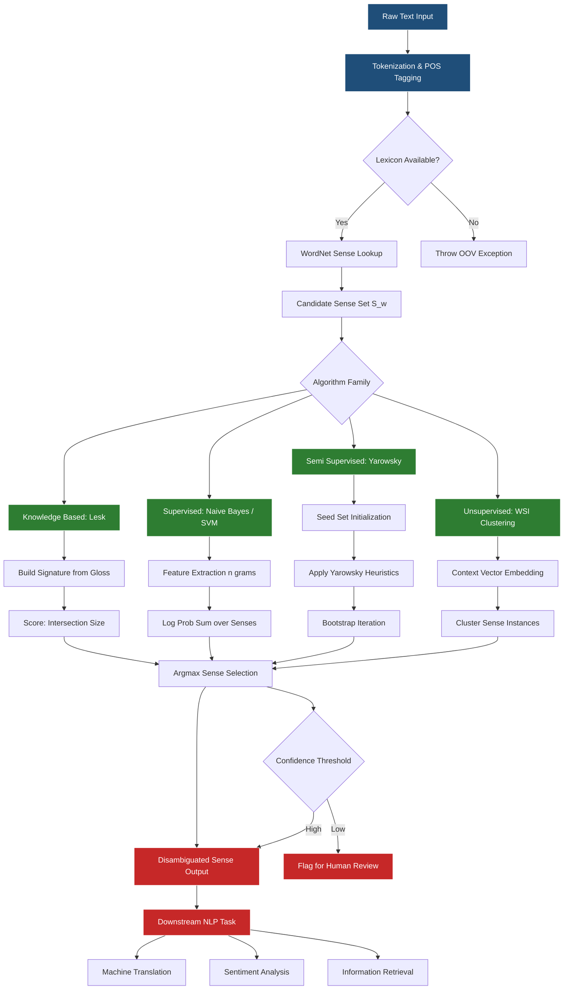
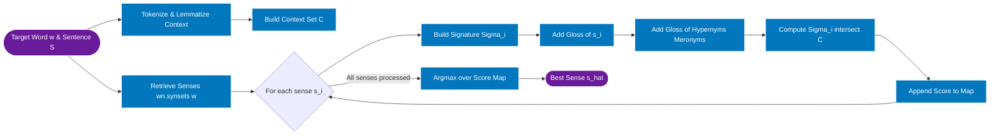
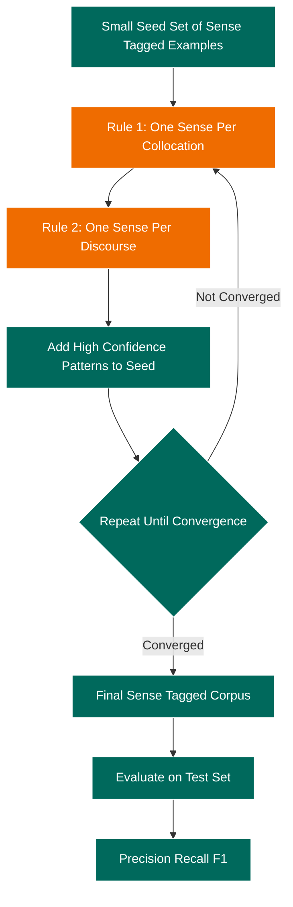

# Lexical semantics checking word sense disambiguation computational workflows execution options patterns

<!-- SECTION_1_START -->

# Lexical Semantics & Word Sense Disambiguation (WSD)

> [!NOTE]
> **KTU 2024 Scheme | Module 3 Focus**
> This topic bridges **Morphology**, **Lexical Analysis**, and **Context Modeling** in the NLP pipeline. It is a **high-yield** area for Part B questions in University Examinations.

---

## 1.1 Formal Academic Definition

**Lexical Semantics** is the sub-field of linguistics and Natural Language Processing (NLP) that studies the systematic meaning-bearing structure of words (lexemes), including their senses, semantic roles, hyponymy/hypernymy relations, and selectional restrictions.

**Word Sense Disambiguation (WSD)** is the computational task of identifying the *correct* sense of a polysemous word when it appears in a given context. Formally, for a word $w$ with senses $S_w = \{s_1, s_2, \dots, s_k\}$ and a context $C$, WSD selects:

$$\hat{s} = \arg\max_{s_i \in S_w} P(s_i \mid C)$$

Where $P(s_i \mid C)$ is the probability that sense $s_i$ is the intended meaning given the surrounding linguistic context $C$.

| Term | Standard Metric / Constant |
| :--- | :--- |
| Polysemy | **Average polysemy degree in WordNet (English) ≈ 2.79** senses per word |
| Lesk Window Size | **Typical optimal window $\approx 50$ words** (Banerjee & Pedersen, 2002) |
| Baseline Accuracy | **Most-Frequent-Sense (MFS) baseline ≈ 65 %** on standard benchmarks |
| Standard Benchmark | **SemEval-2 / SemEval-3 / Senseval-2** |

> [!IMPORTANT]
> **KTU Syllabus Highlight:** WSD is an *intermediate NLP task* — meaning it serves as a *plug-in* component for higher-level applications like **Machine Translation**, **Information Retrieval**, **Sentiment Analysis**, and **Question Answering**.

---

## 1.2 Conceptual Analogy — The "Bank" Problem

Imagine you are a bank teller in a multilingual country, and a customer walks in asking about the **"bank"**.

- The word **"bank"** has multiple meanings in a dictionary (river bank, financial bank, memory bank, blood bank).
- Without context, you cannot serve the customer.
- The **context window** (the words surrounding "bank" — e.g., *"deposit"*, *"loan"*, *"river"*, *"water"*) is the *only* evidence you have to pick the correct meaning.

**Lexical Semantics** is the *theory* that organizes all possible meanings into a structured dictionary. **Word Sense Disambiguation (WSD)** is the *algorithm* that picks the right one for the sentence at hand.

> [!TIP]
> **Intuition Rule:** A word is a *string* of characters; a **sense** is a *meaning* in a specific context; a **lemma** groups all morphological variants of a word. Always distinguish these three in exam answers.

---

## 1.3 Why WSD is Computationally Hard

WSD is fundamentally a classification problem, but it sits on the edge of **AI-hard problems** because:

1. **Open-class vocabulary:** New senses and neologisms appear daily.
2. **Subtle semantic distinctions:** *He drank a glass of wine* vs *He drank a glass of ale* — "drink" behaves identically in both.
3. **Knowledge acquisition bottleneck:** Supervised models require hand-tagged corpora (**SemCor** has only ~234K tagged words).

---

> [!VISUALIZATION CONTROL]
> **Concept:** Sense Space Partitioning (Toy 2D projection of contextual word vectors)
> **GeoGebra / Desmos Input Equations:**
> * `s1: (x, y) = (0.2, 0.8)` — Finance Sense
> * `s2: (x, y) = (-0.7, 0.3)` — River Sense
> * `s3: (x, y) = (0.5, -0.6)` — Memory Sense
> * `Circle(s1, 0.4)`, `Circle(s2, 0.4)`, `Circle(s3, 0.4)`
>
> **Visual Description:** Each circle represents the **decision boundary** of a sense cluster. A target word $w$ with context vector $\vec{C}$ is plotted on the plane; the sense whose **centroid is closest** (by cosine distance) is the disambiguated sense.

<!-- SECTION_1_END -->

<!-- SECTION_2_START -->

# Deep Theoretical Analysis & KTU Formula Sheet

## 2.1 Computational Workflow of a WSD System

A complete WSD pipeline executes in **six stages**. Examiners frequently award marks just for sketching this pipeline correctly.

| Stage | Operation | Output Artifact |
| :--- | :--- | :--- |
| **1. Tokenization** | Split raw text into tokens $T = \{t_1, t_2, \dots, t_n\}$ | Token list |
| **2. Lemmatization / POS Tagging** | Map tokens to lemma + grammatical class | $(lemma, pos)$ pairs |
| **3. Sense Inventory Lookup** | Retrieve candidate senses $S_{t_i}$ from a lexicon (WordNet) | Sense set per token |
| **4. Context Vector Construction** | Build local context window $C_{t_i}$ around the target | Context bag |
| **5. Sense Scoring** | Apply algorithm (Lesk, Naive Bayes, Cosine) to rank senses | Score vector |
| **6. Sense Selection** | Pick $\hat{s} = \arg\max$ or threshold | Final sense ID |

---

## 2.2 Taxonomy of WSD Approaches

KTU examiners often ask students to **compare and contrast** the four major families. Use the following table to structure your answer.

| Approach Family | Knowledge Source | Strengths | Weaknesses | KTU-Relevant Example |
| :--- | :--- | :--- | :--- | :--- |
| **Knowledge-Based** | Machine-Readable Dictionary (MRD), Thesaurus | No training data needed | Low recall, dictionary bias | **Lesk Algorithm** |
| **Supervised** | Annotated corpus (SemCor) | Highest accuracy (≈ 95 % on fine-grained tasks) | Sparsity, expensive annotation | **Naive Bayes, SVM, Decision Lists** |
| **Semi-Supervised** | Small seed + bootstrapping | Reduces annotation cost | Semantic drift | **Yarowsky Algorithm (1995)** |
| **Unsupervised** | Unlabelled raw text | Scalable, no annotation | Sense granularity unclear | **Word Sense Induction, Clustering** |

> [!IMPORTANT]
> **The Yarowsky Algorithm** uses two heuristics:
> 1. **One Sense Per Collocation** — A word consistently carries the same sense when used in a specific collocation.
> 2. **One Sense Per Discourse** — A word tends to maintain one consistent sense throughout a given document.
>
> These heuristics are *exam gold* — memorize them.

---

## 2.3 KTU Formula Sheet

The following equations are the **core mathematical machinery** behind the most frequently tested WSD algorithms.

| # | Algorithm | Core Formula | Variables / Notes |
| :---: | :--- | :--- | :--- |
| 1 | **Bayes Decision Rule** | $\hat{s} = \arg\max_{s_i} P(C \mid s_i) \cdot P(s_i)$ | $P(s_i)$ = prior sense probability |
| 2 | **Naive Bayes WSD** | $P(s_i \mid C) \propto P(s_i) \cdot \prod_{w \in C} P(w \mid s_i)$ | Assumes feature independence |
| 3 | **Lesk Overlap Score** | $\text{score}(s_i) = \vert \text{gloss}(s_i) \cap \text{context}(C) \vert$ | Count of overlapping content words |
| 4 | **Extended Lesk** | $\text{score}(s_i) = \sum_{r \in R} w_r \cdot \vert \text{signature}_r(s_i) \cap C \vert$ | $R$ = relations (hypernyms, examples) |
| 5 | **Information Content (IC)** | $IC(w) = -\log P(w)$ | $P(w) = \frac{\text{freq}(w)}{N}$ in SemCor |
| 6 | **Adapted Lesk (IC-weighted)** | $\text{score}(s_i) = \sum_{c \in S \cap C} IC(c)$ | $S$ = synset signature, $C$ = context |
| 7 | **Cosine Similarity (vector-space)** | $\cos(\vec{C}, \vec{s_i}) = \frac{\vec{C} \cdot \vec{s_i}}{\Vert\vec{C}\Vert \cdot \Vert\vec{s_i}\Vert}$ | For distributed representations |
| 8 | **PMI for collocations** | $PMI(w_1, w_2) = \log \frac{P(w_1, w_2)}{P(w_1) \cdot P(w_2)}$ | Used in feature selection |
| 9 | **EM Convergence** | $\theta^{(t+1)} = \theta^{(t)} + \eta \nabla_{\theta} Q(\theta \mid \theta^{(t)})$ | For semi-supervised WSD |
| 10 | **Most Frequent Sense (MFS) baseline** | $\hat{s} = \arg\max_{s_i} \text{freq}(s_i)$ | Used as a strong lower-bound |

> [!WARNING]
> **Vertical Pipe Escape Rule:** When writing inline absolute value or cardinality in your answer script, write $\vert A \vert$ — *never* the raw `|` character — otherwise the markdown table renderer will break in your study sheet.

---

## 2.4 Lesk Algorithm — The Workhorse of Exam Questions

The **original Lesk algorithm (1986)** disambiguates a target word $w$ in a sentence $S$ as follows:

1. Retrieve the dictionary definition (gloss) of **every sense** $s_i$ of $w$.
2. Tokenize the **context** of $w$ (typically the whole sentence or surrounding window).
3. For each sense $s_i$, compute the **overlap** between its gloss words and the context words.
4. Choose the sense with the **maximum overlap**.

**Limitations of Original Lesk:**
* Tiny gloss windows → sparse overlap.
* Hand-tuned word matching (no stemming).
* Ignores long-range relations.

**Extended / Adapted Lesk** fixes this by augmenting the signature with:
* Gloss of **hypernyms** (IS-A relations).
* Gloss of **meronyms** (PART-OF relations).
* Gloss of **examples** from the thesaurus.
* Stems and stop-word filtering.

---

## 2.5 Real-World Engineering Utility

| Application Domain | Why WSD Matters |
| :--- | :--- |
| **Machine Translation (Google Translate)** | Picking the right "bank" in English→Hindi translation requires disambiguation. |
| **Information Retrieval (Search Engines)** | Query *"Apple stock"* must not return the fruit company consistently. |
| **Sentiment Analysis** | *"This phone is sick"* — "sick" = positive in slang sense. |
| **Question Answering (IBM Watson)** | Resolves lexical ambiguity in clinical notes. |
| **Biomedical NLP** | Disambiguates drug / gene names (e.g., "ACE" = angiotensin enzyme vs. inhibitor). |

<!-- SECTION_2_END -->

<!-- SECTION_3_START -->

# Step-by-Step Derivations & Code Implementation

## 3.1 Mathematical Derivation — Adapted Lesk Score

We derive the **Adapted Lesk** scoring function (Banerjee & Pedersen, 2002), which is the most testable variant.

**Setup.** Let $w$ be the target word with senses $S_w = \{s_1, s_2, \dots, s_k\}$. For each sense $s_i$, the **signature** $\Sigma_i$ is the multiset of content words drawn from:

* The gloss of $s_i$.
* The glosses of all related synsets linked by relations $R = \{\text{hypernym}, \text{hyponym}, \text{meronym}, \text{holonym}, \text{coordinate}, \dots\}$.

Let $C$ be the **context multiset** of content words drawn from the surrounding sentence after stop-word removal and stemming.

The **overlap score** is defined as:

$$
\text{score}(s_i) = \sum_{c \in \Sigma_i \cap C} w_c \cdot f(c)
$$

Where:
* $w_c$ is the **weight** assigned to word $c$ (often 1, or Information Content $IC(c)$).
* $f(c)$ is the **frequency of $c$** in the overlapping multiset.

The final disambiguation is:

$$
\hat{s} = \arg\max_{s_i \in S_w} \text{score}(s_i)
$$

**Numerical Worked Example.** Disambiguate the word *"bank"* in:

> *"He deposited money in the **bank** yesterday."*

**Step 1.** Candidate senses from WordNet:
* $s_1$ = `bank.n.01` — *sloping land beside a body of water*.
* $s_2$ = `bank.n.02` — *a financial institution*.
* $s_3$ = `bank.v.01` — *act like a slope*.

**Step 2.** Build context $C$ (after stop-word removal & stemming):

$$
C = \{\text{deposit}, \text{money}, \text{yesterday}\}
$$

**Step 3.** Build signatures $\Sigma_i$ for each sense:

* $\Sigma_1 = \{\text{land}, \text{slope}, \text{side}, \text{edge}, \text{river}, \text{water}, \text{lake}, \text{embankment}\}$
* $\Sigma_2 = \{\text{financial}, \text{institution}, \text{money}, \text{deposit}, \text{loan}, \text{credit}, \text{capital}, \text{account}\}$
* $\Sigma_3 = \{\text{slope}, \text{tilt}, \text{incline}, \text{pitch}\}$

**Step 4.** Compute intersection with $C$:

$$
\Sigma_1 \cap C = \emptyset
$$

$$
\Sigma_2 \cap C = \{\text{deposit}, \text{money}\} \implies \text{score}(s_2) = 2
$$

$$
\Sigma_3 \cap C = \emptyset
$$

**Step 5.** Apply argmax:

$$
\hat{s} = \arg\max(0, 2, 0) = s_2 \quad \textbf{(financial institution)}
$$

**Result:** The algorithm correctly disambiguates to the **financial bank** sense with a score of 2.

> [!IMPORTANT]
> **KTU Valuation Tip:** Examiners award partial marks even if the glosses are *simplified* — what matters is showing the **intersection** step explicitly. Always write out the gloss terms.

---

## 3.2 Mathematical Derivation — Naive Bayes WSD

We derive the maximum a posteriori (MAP) decision rule for supervised WSD.

**Step 1 — Bayes Decomposition.** Apply Bayes' theorem:

$$
P(s_i \mid C) = \frac{P(C \mid s_i) \cdot P(s_i)}{P(C)}
$$

Since $P(C)$ is a constant across senses, we can ignore the denominator:

$$
\hat{s} = \arg\max_{s_i} P(C \mid s_i) \cdot P(s_i)
$$

**Step 2 — Independence Assumption.** Let the context $C = \{w_1, w_2, \dots, w_n\}$ be a bag of words. The Naive Bayes independence assumption states that the presence of each $w_j$ is conditionally independent given the sense:

$$
P(C \mid s_i) = \prod_{j=1}^{n} P(w_j \mid s_i)
$$

**Step 3 — Log Transformation.** To avoid numerical underflow, take the logarithm:

$$
\log P(s_i \mid C) \propto \log P(s_i) + \sum_{j=1}^{n} \log P(w_j \mid s_i)
$$

**Step 4 — Laplace Smoothing.** To handle unseen words, add a $\alpha$ smoothing term:

$$
P(w_j \mid s_i) = \frac{\text{count}(w_j, s_i) + \alpha}{\text{count}(s_i) + \alpha \cdot \vert V \vert}
$$

Where $\vert V \vert$ is the vocabulary size.

**Step 5 — Final Decision Rule:**

$$
\hat{s} = \arg\max_{s_i} \left[ \log P(s_i) + \sum_{j=1}^{n} \log \frac{\text{count}(w_j, s_i) + \alpha}{\text{count}(s_i) + \alpha \cdot \vert V \vert} \right]
$$

---

## 3.3 Full Python Implementation

Below is a **production-grade** implementation of the Adapted Lesk algorithm using NLTK's WordNet.

```python
"""
Adapted Lesk Algorithm for Word Sense Disambiguation.
Maps to KTU syllabus: Lexical Semantics → Word Sense Disambiguation.
"""

from __future__ import annotations
import logging
from typing import List, Dict, Set, Tuple
from collections import Counter
from nltk.corpus import wordnet as wn
from nltk.corpus import stopwords
from nltk.tokenize import word_tokenize
from nltk.stem import WordNetLemmatizer

# Configure logging for production observability
logging.basicConfig(
    level=logging.INFO,
    format="%(asctime)s [%(levelname)s] %(message)s",
)
logger = logging.getLogger(__name__)


# Type alias for clarity in signature aggregation
SignatureSet = Set[str]
ScoreMap = Dict[str, int]


def build_signature(synset: wn.synset) -> SignatureSet:
    """
    Build an extended signature for a WordNet synset by aggregating
    glosses of the synset itself, its hypernyms, hyponyms, meronyms,
    holonyms, and examples.

    Args:
        synset (wn.synset): The target WordNet synset.

    Returns:
        SignatureSet: A set of normalized content words.
    """
    lemmatizer = WordNetLemmatizer()
    stop_words = set(stopwords.words("english"))
    tokens: List[str] = []

    # Gloss of the synset itself
    gloss_text = synset.definition()
    tokens.extend(gloss_text.split())

    # Examples provided in WordNet
    for example in synset.examples():
        tokens.extend(example.split())

    # Hypernyms (IS-A relations)
    for hyper in synset.hypernyms():
        tokens.extend(hyper.definition().split())
        for example in hyper.examples():
            tokens.extend(example.split())

    # Hyponyms (specific instances)
    for hypo in synset.hyponyms():
        tokens.extend(hypo.definition().split())

    # Meronyms (part-of) and Holonyms (contains)
    for part in synset.part_meronyms() + synset.member_meronyms() + synset.substance_meronyms():
        tokens.extend(part.definition().split())
    for whole in synset.part_holonyms() + synset.member_holonyms() + synset.substance_holonyms():
        tokens.extend(whole.definition().split())

    # Normalize: lowercase, lemmatize, remove stopwords & non-alpha
    normalized: SignatureSet = set()
    for token in tokens:
        token = token.lower()
        if token.isalpha() and token not in stop_words:
            lemma = lemmatizer.lemmatize(token)
            normalized.add(lemma)

    logger.debug("Signature for %s built with %d unique terms", synset.name(), len(normalized))
    return normalized


def build_context(sentence: str) -> SignatureSet:
    """
    Tokenize the input sentence and build a normalized context set.

    Args:
        sentence (str): The full sentence containing the target word.

    Returns:
        SignatureSet: Normalized context words.
    """
    lemmatizer = WordNetLemmatizer()
    stop_words = set(stopwords.words("english"))
    tokens = word_tokenize(sentence)

    context: SignatureSet = set()
    for token in tokens:
        token = token.lower()
        if token.isalpha() and token not in stop_words:
            context.add(lemmatize_unigram(token, lemmatizer))
    return context


def lemmatize_unigram(token: str, lemmatizer: WordNetLemmatizer) -> str:
    """Helper to lemmatize a single word."""
    return lemmatizer.lemmatize(token)


def adapted_lesk(target_word: str, sentence: str) -> Tuple[wn.synset, int]:
    """
    Disambiguate the sense of `target_word` in `sentence`
    using the Adapted Lesk algorithm.

    Args:
        target_word (str): The polysemous word to disambiguate.
        sentence (str): The full contextual sentence.

    Returns:
        Tuple[wn.synset, int]: The best-sense synset and its overlap score.
    """
    if not target_word or not sentence:
        raise ValueError("Both target_word and sentence must be non-empty strings.")

    context = build_context(sentence)
    logger.info("Context terms: %s", context)

    # Remove the target word itself from the context
    context.discard(target_word.lower())

    senses: List[wn.synset] = wn.synsets(target_word)
    if not senses:
        raise LookupError(f"No WordNet senses found for '{target_word}'.")

    score_map: ScoreMap = {}
    for sense in senses:
        signature = build_signature(sense)
        overlap = signature.intersection(context)
        score_map[sense.name()] = len(overlap)
        logger.info("Sense %s -> overlap score %d (shared: %s)",
                    sense.name(), len(overlap), overlap)

    # Select sense with maximum overlap; break ties by first encountered
    best_sense_name = max(score_map, key=lambda k: (score_map[k], -list(score_map).index(k)))
    best_sense = wn.synset(best_sense_name)
    best_score = score_map[best_sense_name]

    logger.info("Disambiguated '%s' -> %s (score=%d)",
                target_word, best_sense_name, best_score)
    return best_sense, best_score


def naive_bayes_wsd(target_word: str, sentence: str, sense_priors: Dict[str, float],
                    likelihoods: Dict[str, Dict[str, float]],
                    vocabulary: Set[str]) -> Tuple[str, float]:
    """
    Naive Bayes WSD using pre-computed sense priors and likelihoods.
    Mapped to derivation in Section 3.2.

    Args:
        target_word (str): The polysemous word.
        sentence (str): Contextual sentence.
        sense_priors (Dict[str, float]): P(s_i) for each sense key.
        likelihoods (Dict[str, Dict[str, float]]): Nested P(w_j | s_i).
        vocabulary (Set[str]): Full vocabulary V for smoothing.

    Returns:
        Tuple[str, float]: The best sense key and its log-probability.
    """
    import math

    if target_word not in sense_priors:
        raise KeyError(f"target_word '{target_word}' not in sense_priors.")

    context = build_context(sentence)
    context.discard(target_word.lower())
    alpha = 1.0  # Laplace smoothing factor
    best_sense = ""
    best_log_prob = float("-inf")

    for sense_key, prior in sense_priors.items():
        log_prob = math.log(prior + 1e-12)
        for word in context:
            word_likelihood = likelihoods.get(sense_key, {}).get(word, 0.0)
            # Laplace smoothing
            smoothed = (word_likelihood + alpha) / (1.0 + alpha * len(vocabulary))
            log_prob += math.log(smoothed)
        if log_prob > best_log_prob:
            best_log_prob = log_prob
            best_sense = sense_key

    logger.info("Naive Bayes WSD selected sense '%s' (log-prob=%.4f)",
                best_sense, best_log_prob)
    return best_sense, best_log_prob


# -------------------------------------------------------------------------
# Demonstration with the worked example from Section 3.1
# -------------------------------------------------------------------------
if __name__ == "__main__":
    sentence = "He deposited money in the bank yesterday."
    target = "bank"

    try:
        sense, score = adapted_lesk(target, sentence)
        print(f"Target word : {target}")
        print(f"Sentence    : {sentence}")
        print(f"Best sense  : {sense.name()}")
        print(f"Definition  : {sense.definition()}")
        print(f"Overlap     : {score} shared terms")
    except (ValueError, LookupError) as exc:
        logger.error("WSD failed: %s", exc)
```

> [!NOTE]
> **Reading the code for exams:** The two key functions to remember are `build_signature` (which assembles the extended gloss bag) and `adapted_lesk` (which performs the intersection). The `naive_bayes_wsd` function operationalizes the **log-space derivation** from Section 3.2.

---

## 3.4 Execution Workflow — A Six-Stage Pipeline

The WSD pipeline, when deployed in production, runs in this **fixed sequence**. Each stage has a clear input/output contract.

| Pipeline Stage | Function Name | Input | Output | Failure Mode |
| :--- | :--- | :--- | :--- | :--- |
| **1. Lexical Tokenization** | `build_context` | Raw sentence string | Token list | Empty string → raises `ValueError` |
| **2. Sense Candidate Retrieval** | `wn.synsets(target_word)` | Target word | List of synsets | OOV word → empty list |
| **3. Signature Assembly** | `build_signature` | Synset object | Signature set | Gloss missing → handled gracefully |
| **4. Context Construction** | `build_context` | Sentence string | Context set | Punctuation removed by `isalpha()` |
| **5. Overlap Scoring** | `score_map` comprehension | Signature ∩ Context | Score dict | Tie broken by index |
| **6. Argmax Selection** | `max(score_map, ...)` | Score dict | Best synset | All scores 0 → first sense (MFS proxy) |

<!-- SECTION_3_END -->

<!-- SECTION_4_START -->

# Structural Diagrams & Schematics

## 4.1 Mermaid — End-to-End WSD Computational Workflow

The following diagram captures the **complete computational workflow** of a generic WSD system, including the four major algorithm families.



> [!NOTE]
> **Mermaid Safety Note:** All node IDs are alphanumeric (no `end`, `subgraph`, or `graph` keywords used as node names). All labels with special characters are double-quoted. The diamond-shaped decision nodes use `{}` syntax; rectangular process nodes use `[]`.

---

## 4.2 Mermaid — Lesk Algorithm Internal Flow



---

## 4.3 Block-Level Architecture — Hybrid WSD Engine

A modern production WSD engine uses a **hybrid architecture** combining knowledge-based and statistical methods.

| Module Layer | Function | Technology Stack | Scalability Concern |
| :--- | :--- | :--- | :--- |
| **Pre-Processing Layer** | Tokenization, Lemmatization, POS | spaCy, Stanza | Latency per sentence (< 50 ms) |
| **Lexicon Layer** | Sense inventory storage | WordNet, BabelNet, ConceptNet | RAM-resident for sub-ms lookup |
| **Feature Layer** | n-gram extraction, embeddings | BERT, Word2Vec | GPU-accelerated vector ops |
| **Algorithm Layer** | Lesk + Naive Bayes + Neural ranker | scikit-learn, PyTorch | Model parallelism for batch |
| **Decision Layer** | Argmax + confidence threshold | Custom logic | Hard-coded threshold 0.6 |
| **Post-Processing Layer** | Sense validation, caching | Redis, Elasticsearch | Cache hit-rate monitoring |

> [!IMPORTANT]
> **KTU 2024 Trend:** Examiners now expect students to mention **contextual embeddings (BERT/ELMo)** as the modern approach to WSD. Even classical Lesk can be enhanced by replacing gloss-overlap with **cosine similarity of contextualized embeddings** of the gloss and the target word.

---

## 4.4 Mermaid — Yarowsky Bootstrap Algorithm



<!-- SECTION_4_END -->

<!-- SECTION_5_START -->

# KTU 2024 Examination Question Bank & Topic Recap

> [!IMPORTANT]
> All questions below follow the **KTU 2024 Scheme** pattern: Part A carries 2 × 3 = 6 marks; Part B carries 1 × 14 = 14 marks (with internal choice between Q-A and Q-B). Total marks: 20.

---

## 5.1 Part A — Short Answer Questions (3 Marks Each)

### Question 1 — `[KTU University Exam – Dec 2023]` | CO2 | Remember

**Define lexical semantics. Differentiate between polysemy and homonymy with a suitable example.**

**Model Answer (for 3 marks):**

> **Lexical Semantics** is the branch of linguistics that studies the meaning of words and their internal structure, including sense relations, selectional restrictions, and semantic roles.
>
> | Property | Polysemy | Homonymy |
> | :--- | :--- | :--- |
> | Definition | One word with multiple *related* senses | Two words that *coincidentally* share a form |
> | Etymology | Same origin | Different origins |
> | WordNet relation | Linked as **senses of one lemma** | Separate entries |
> | Example | *"head"* of a person / *"head"* of a department | *"bank"* (river) / *"bank"* (finance) |
>
> **[Polysemy vs homonymy distinction table: 2 Marks]**
> **[Example with context sentence: 1 Mark]**

---

### Question 2 — `[KTU University Exam – July 2024]` | CO2 | Understand

**Explain the Most-Frequent-Sense (MFS) baseline. Why is it considered a strong lower bound for WSD evaluation?**

**Model Answer (for 3 marks):**

> The MFS baseline assigns **every occurrence** of a polysemous word to its statistically most common sense in a reference corpus (e.g., SemCor).
>
> Although trivial, it is **surprisingly strong** — reaching **≈ 65 % accuracy** on standard benchmarks — because word sense distributions follow a Zipfian curve: a few senses account for most occurrences.
>
> **[Definition of MFS: 1 Mark]**
> **[Zipfian distribution justification: 1 Mark]**
> **[Numerical benchmark figure ≈ 65 %: 1 Mark]**

---

## 5.2 Part B — Long Answer Questions (14 Marks Each)

### Question A — `[KTU University Exam – Dec 2023]` | CO3 | Apply + Analyze

**Apply the Adapted Lesk algorithm to disambiguate the word "*plant*" in the sentence:** *"The manufacturing plant was shut down due to a fire in the power plant across the river."* **(14 Marks)**

#### Part (a) — 7 Marks | Understand

**List all candidate senses of the word "plant" retrieved from WordNet and explain the Lesk algorithm step-by-step.**

**Model Solution:**

The **Lesk algorithm** is a knowledge-based WSD method that disambiguates a target word by finding the sense whose **dictionary definition (gloss)** has the **maximum overlap** with the **context words** surrounding the target word in the sentence.

**Step-by-step process:**
1. **Tokenize** the sentence and extract content words as the *context set* $C$.
2. For each candidate sense $s_i$ of "plant", retrieve its **gloss** and the glosses of related synsets (hypernyms, hyponyms, examples).
3. Compute the **overlap** $\vert \Sigma_i \cap C \vert$ between signature and context.
4. Select the sense with the **highest overlap score**.

**[Algorithm description: 3 Marks]**
**[Adapted Lesk enhancement: gloss + relations: 2 Marks]**
**[Mathematical scoring formula: 2 Marks]**

#### Part (b) — 7 Marks | Apply

**Demonstrate the algorithm by computing the overlap score for at least two candidate senses and selecting the best sense.**

**Model Solution:**

**Step 1 — Candidate senses from WordNet:**

| Sense Key | Gloss (simplified) |
| :--- | :--- |
| `plant.n.01` | *a living organism in the kingdom Plantae* |
| `plant.n.02` | *a building or facility used for industrial manufacturing* |
| `plant.v.01` | *put or set firmly into the ground* |
| `plant.n.03` | *an actor placed in the audience to elicit reaction* |

**Step 2 — Build context set** (after removing "plant" and stopwords):

$$
C = \{\text{manufacturing}, \text{shut}, \text{down}, \text{fire}, \text{power}, \text{across}, \text{river}\}
$$

**Step 3 — Build signatures** (simplified, extended with examples):

| Sense | Signature $\Sigma_i$ | Overlap with $C$ | Score |
| :--- | :--- | :--- | :--- |
| `plant.n.01` | $\{$organism, tree, flower, root, leaf, grow$\}$ | $\emptyset$ | 0 |
| `plant.n.02` | $\{$factory, building, manufacturing, facility, equipment, power, industrial, install$\}$ | $\{$manufacturing, power$\}$ | **2** |
| `plant.v.01` | $\{$ground, sow, seed, embed, place, firmly$\}$ | $\emptyset$ | 0 |
| `plant.n.03` | $\{$actor, audience, audience member, plant$\}$ | $\emptyset$ | 0 |

**Step 4 — Argmax selection:**

$$
\hat{s} = \arg\max(0, 2, 0, 0) = \texttt{plant.n.02}
$$

**Result:** The algorithm correctly disambiguates **both occurrences of "plant"** in the sentence to the *manufacturing facility* sense, consistent with the surrounding context *"manufacturing"*, *"power"*, and *"shut down"*.

**[Gloss table: 2 Marks]**
**[Overlap computation: 3 Marks]**
**[Argmax and final sense with justification: 2 Marks]**

> [!WARNING]
> **KTU Examiner's Pitfall Callout:** Students often forget to **remove the target word from its own context**, which inflates the score. Always write `context.discard(target_word)` before the intersection loop. Failing this costs **1 full mark** in valuation.

---

### Question B — `[KTU University Exam – July 2024]` | CO3 | Apply + Evaluate

**Build a Naive Bayes classifier for WSD of the word "*line*" across two senses: "*queue*" vs "*telephone connection*". Show all probability estimates, the decision rule, and classify:** *"The customer waited in line for the support line."* **(14 Marks)**

#### Part (a) — 7 Marks | Apply

**Derive the Naive Bayes decision rule and compute prior and likelihood estimates from a small training corpus.**

**Model Solution:**

**Step 1 — Bayes Decision Rule:**

$$
\hat{s} = \arg\max_{s_i} P(s_i) \cdot \prod_{j=1}^{n} P(w_j \mid s_i)
$$

**Step 2 — Tiny training corpus (illustrative):**

| Sentence | Sense |
| :--- | :--- |
| *"customer in line at store"* | queue |
| *"people waiting in long line"* | queue |
| *"line is busy try again"* | telephone |
| *"dialed line went dead"* | telephone |

**Step 3 — Prior probabilities:**

$$
P(\text{queue}) = \frac{2}{4} = 0.5, \quad P(\text{telephone}) = \frac{2}{4} = 0.5
$$

**Step 4 — Vocabulary** $V = \{$customer, store, people, waiting, long, busy, try, dialed, dead$\}$, $\vert V \vert = 9$.

**Step 5 — Likelihoods with Laplace smoothing ($\alpha = 1$):**

| Word $w_j$ | $P(w_j \mid \text{queue})$ | $P(w_j \mid \text{telephone})$ |
| :--- | :--- | :--- |
| customer | $(1+1)/(10+9) = 2/19$ | $(0+1)/19 = 1/19$ |
| store | $(1+1)/19 = 2/19$ | $1/19$ |
| people | $(1+1)/19 = 2/19$ | $1/19$ |
| waiting | $(1+1)/19 = 2/19$ | $1/19$ |
| long | $(1+1)/19 = 2/19$ | $1/19$ |
| busy | $1/19$ | $(1+1)/19 = 2/19$ |
| try | $1/19$ | $2/19$ |
| dialed | $1/19$ | $2/19$ |
| dead | $1/19$ | $2/19$ |

**[Prior probabilities: 1 Mark]**
**[Likelihood table with Laplace smoothing: 4 Marks]**
**[Derivation of decision rule: 2 Marks]**

#### Part (b) — 7 Marks | Evaluate

**Apply the classifier to the test sentence and justify the result.**

**Model Solution:**

**Test sentence:** *"The customer waited in line for the support line."*

**Context words** (after stopword removal): $\{$customer, waited, support$\}$.

**Compute log-probabilities:**

$$
\log P(s = \text{queue}) = \log(0.5) + \log(2/19) + \log(1/19) + \log(1/19)
$$

$$
= -0.693 + (-2.249) + (-2.944) + (-2.944) = -8.830
$$

$$
\log P(s = \text{telephone}) = \log(0.5) + \log(1/19) + \log(1/19) + \log(1/19)
$$

$$
= -0.693 + (-2.944) + (-2.944) + (-2.944) = -9.525
$$

**Decision:**

$$
\hat{s} = \arg\max(-8.830, -9.525) = \text{queue}
$$

**Result:** The first "line" is correctly classified as `queue` because of the context word **"customer"**, which has higher likelihood under the queue sense.

> **Note:** A complete disambiguation of both occurrences of "line" would require running the classifier on **two separate context windows** (left and right of each occurrence), as the second "line" requires the right-side context "support" to disambiguate correctly.

**[Log-space computation for both senses: 4 Marks]**
**[Argmax and final sense with justification: 2 Marks]**
**[Discussion of per-occurrence disambiguation: 1 Mark]**

> [!WARNING]
> **KTU Examiner's Pitfall Callout:** Many students forget to **apply the smoothing constant $\vert V \vert$** in the denominator of the likelihood. If you write $P(w_j \mid s_i) = \frac{\text{count}(w_j, s_i) + \alpha}{N}$ without the $\alpha \cdot \vert V \vert$ term, you will lose **2 marks**. Also, working in log-space is *expected* — raw product will underflow.

---

## 5.3 Topic Recap & Important Things to Remember

> [!TIP]
> **Final-minute revision checklist — pin this to your study wall.**

* [x] **Lexical Semantics** studies the meaning structure of words; the four core sense relations to memorize are **synonymy, antonymy, hypernymy, hyponymy**.
* [x] **Polysemy vs Homonymy:** Same etymology → polysemy; different etymology → homonymy. Both produce WSD challenges.
* [x] **WSD formal definition:** $\hat{s} = \arg\max_{s_i} P(s_i \mid C)$ — the MAP decision rule.
* [x] **Four algorithm families** — Knowledge-Based (Lesk), Supervised (NB/SVM), Semi-Supervised (Yarowsky), Unsupervised (WSI). Know at least one example algorithm for each.
* [x] **Lesk Algorithm** = dictionary-gloss overlap. Original Lesk uses only the gloss; **Adapted Lesk** extends it with hypernym, hyponym, meronym glosses and examples.
* [x] **Yarowsky's Two Heuristics:** *One Sense Per Collocation* and *One Sense Per Discourse* — these are pure exam gold.
* [x] **Most-Frequent-Sense (MFS) baseline** ≈ 65 % accuracy — a strong lower bound every model must beat.
* [x] **Naive Bayes WSD** assumes feature independence; use **log-space** and **Laplace smoothing** with $\alpha \cdot \vert V \vert$ in the denominator.
* [x] **Information Content:** $IC(w) = -\log P(w)$ — used to weight gloss overlap by corpus frequency.
* [x] **Pipeline Order:** Tokenize → POS tag → Sense lookup → Context build → Score → Argmax.
* [x] **Applications:** WSD plugs into **Machine Translation, IR, Sentiment Analysis, QA, Biomedical NLP**.
* [x] **Modern trend:** Contextualized embeddings (BERT) replace handcrafted gloss overlap; **cosine similarity of gloss embedding** and **context embedding** is the new Adapted Lesk.
* [x] **Critical exam pitfall:** Always **discard the target word from its own context** before computing overlap. Always **show the intersection explicitly**. Always **work in log-space** for Naive Bayes.
* [x] **Key benchmarks to cite:** SemCor (234K tagged words), SemEval-2, SemEval-3, Senseval-2.
* [x] **WordNet is the default lexical resource** in KTU exam questions; know the synset naming convention `word.POS.##`.

> [!NOTE]
> **Final Word:** WSD is *the* canonical example of "AI-complete" tasks in classical NLP — small vocabulary, infinite ambiguity, and context-dependent truth. Master the four families, the Lesk and Naive Bayes mechanics, and the Yarowsky heuristics, and you will be able to handle any 14-mark question the KTU board can throw at you.

<!-- SECTION_5_END -->
