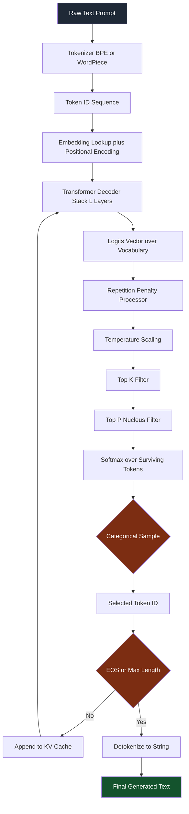
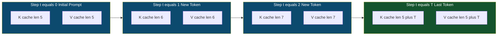
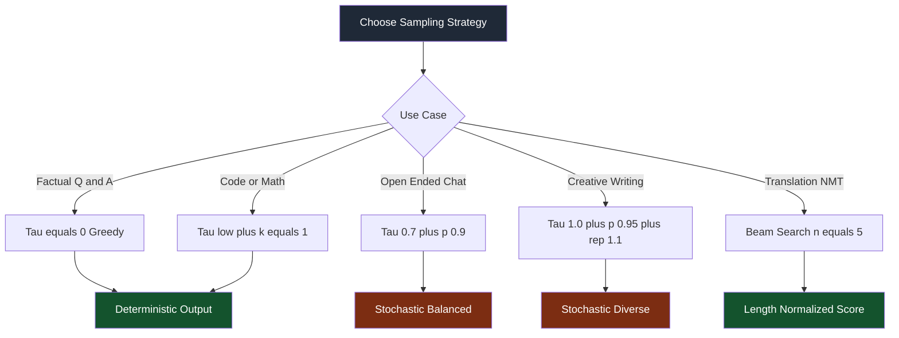

# Autoregressive language generation token processing adjustments scripts options parameters loops models

<!-- SECTION_1_START -->
# Autoregressive Language Generation: Token Processing, Adjustments & Loops

## 1.1 Formal KTU 2024 Definition

> [!IMPORTANT]
> **Autoregressive Language Generation** is the sequential, probabilistic text synthesis paradigm in which a Large Language Model (LLM) produces an output token stream one discrete unit (token) at a time, where the conditional probability distribution of the next token $y_t$ is computed strictly as a function of the previously generated tokens $y_{<t}$ and the source context $x$. Formally:

$$P(y \mid x) = \prod_{t=1}^{T} P(y_t \mid y_{<t}, x)$$

This factorization is the mathematical cornerstone of all transformer-decoder architectures (GPT-2, GPT-3/3.5/4, LLaMA-2/3, Mistral, Phi-3, Gemma) that dominate the modern Generative AI landscape.

> [!NOTE]
> **KTU 2024 Syllabus Mapping (PECST803 — Module 4):** This topic sits at the intersection of *Large Language Generation Architectures* and *Inference-time Platform Configuration*. Mastery of generation-time hyperparameters (temperature $\tau$, top-$k$, nucleus sampling top-$p$, repetition penalty) is an assessable outcome under **CO3 (Apply)** and **CO4 (Analyze)**.

---

## 1.2 Intuitive Overview — "The Storyteller Who Reads Their Own Writing"

> [!TIP]
> **Real-World Analogy — The Reluctant Storyteller:**
> Imagine a storyteller seated in a candlelit room. They can see only the **last sentence they whispered aloud** and the **prompt card** placed in front of them. To continue the story, they:
> 1. Read the prompt + everything they have already said.
> 2. Mentally score every possible next word in their vocabulary.
> 3. Pick **one word** (possibly with a tiny bit of randomness).
> 4. Append that word to the page, then **re-read** the entire page before picking the next word.
>
> This loop — *score → sample → append → re-read* — is exactly what an autoregressive LLM does at inference time. The "scoring" happens inside a $L$-layer transformer producing a **logits vector** $\mathbf{z}_t \in \mathbb{R}^{\vert V \vert}$ over the vocabulary $V$.

**Geometric Intuition:** At every step $t$, the model projects the current context into a point on a $\vert V \vert$-dimensional **simplex** (a probability distribution). The sampling strategy you choose (greedy, top-$k$, top-$p$, temperature-scaled) is simply *a different way of picking a coordinate* on that simplex.

---

## 1.3 Physical Constants & Canonical Hyperparameter Ranges

| Symbol | Hyperparameter | Canonical Range | Effect Direction |
|--------|---------------|-----------------|------------------|
| $\tau$ | Temperature | $[0.0, \ 2.0]$ | $\uparrow \Rightarrow$ more random |
| $k$ | Top-$k$ cutoff | $[1, \ 100]$ | $\uparrow \Rightarrow$ wider choice |
| $p$ | Nucleus (top-$p$) | $[0.0, \ 1.0]$ | $\uparrow \Rightarrow$ wider choice |
| $\theta_{\text{rep}}$ | Repetition penalty | $[1.0, \ 2.0]$ | $\uparrow \Rightarrow$ less repetition |
| $\ell_{\max}$ | Max new tokens | $[1, \ 4096+]$ | $\uparrow \Rightarrow$ longer output |
| $n_{\text{beams}}$ | Beam width | $[1, \ 16+]$ | $\uparrow \Rightarrow$ slower, more accurate |

> [!VISUALIZATION CONTROL]
> **Concept:** Probability simplex reshaping under temperature scaling
> **GeoGebra / Desmos Input Equations (2D slice over a 5-token vocabulary):**
> * `p1(x) = exp(x/0.2) / sum_j exp(x_j/0.2)`   (low $\tau$, near-greedy)
> * `p2(x) = exp(x/1.0) / sum_j exp(x_j/1.0)`   (balanced)
> * `p3(x) = exp(x/2.0) / sum_j exp(x_j/2.0)`   (high $\tau$, flat)
> **Visual Description:** As $\tau$ rises from 0.2 → 2.0, the distribution over the 5 candidate tokens flattens. With $\tau \to 0$ you see a single sharp spike (greedy); with $\tau \to \infty$ the curve approaches a uniform $1/5$ horizontal line.
<!-- SECTION_1_END -->

<!-- SECTION_2_START -->
# Deep Theoretical Analysis & KTU High-Yield Formula Sheet

## 2.1 The Five Operational Phases of an Autoregressive Generation Call

An autoregressive inference pass decomposes into **five sequential phases** that must be understood independently before they can be tuned as a system.

### Phase 1 — Tokenization (Encoding)
The raw string $x$ is segmented by a **sub-word tokenizer** (BPE, WordPiece, or SentencePiece-Unigram) into a sequence of integer token IDs $t_1, t_2, \dots, t_n \in \{0, 1, \dots, \vert V \vert - 1\}$.

$$\text{tokenize}(x) = \mathbf{T} = [t_1, t_2, \dots, t_n] \in \mathbb{Z}^{n}$$

The vocabulary size $\vert V \vert$ is a hard architectural constant: **GPT-2 uses $\vert V \vert = 50{,}257$**, **LLaMA-2 uses $\vert V \vert = 32{,}000$**, and **GPT-4 (cl100k_base) uses $\vert V \vert = 100{,}256$**.

### Phase 2 — Embedding Lookup
Each token ID is mapped to a dense vector $\mathbf{e}_i \in \mathbb{R}^{d}$ via the embedding matrix $\mathbf{E} \in \mathbb{R}^{\vert V \vert \times d}$. Positional encodings $\mathbf{P}_i$ are added to inject order information.

$$\mathbf{h}_i^{(0)} = \mathbf{e}_i + \mathbf{P}_i$$

### Phase 3 — Decoder Stack Forward Pass
The hidden states are refined through $L$ causal-masked transformer blocks. Causal masking ensures that position $i$ attends only to positions $\le i$, preserving the autoregressive factorization.

$$\mathbf{h}_i^{(\ell)} = \text{DecoderBlock}^{(\ell)}\!\left(\mathbf{h}_{1}^{(\ell-1)}, \dots, \mathbf{h}_{i}^{(\ell-1)}\right), \quad \ell = 1, \dots, L$$

### Phase 4 — Logit Projection & Sampling
The final hidden state at the last position $n$ is projected back to vocabulary space via the **unembedding matrix** $\mathbf{U}^\top \in \mathbb{R}^{d \times \vert V \vert}$, then optionally temperature-scaled, then softmaxed, then filtered, then sampled.

$$\mathbf{z}_t = \mathbf{U}^\top \mathbf{h}_t^{(L)} \in \mathbb{R}^{\vert V \vert}$$

### Phase 5 — KV-Cache Append & Loop
The key/value tensors of the new token are appended to the **KV-cache** so the next forward pass can reuse prior context without recomputation. Control then returns to Phase 3 with $t \leftarrow t+1$.

---

## 2.2 KTU Formula Sheet (Inference-Time Mathematics)

> [!NOTE]
> The table below is the **canonical cheat sheet** for KTU 2024 ESE questions on autoregressive generation. Every parameter is examinable.

| # | Formula / Operation | LaTeX Form | Engineering Utility |
|---|---------------------|-----------|---------------------|
| 1 | Autoregressive factorization | $P(y \mid x) = \prod_{t=1}^{T} P(y_t \mid y_{<t}, x)$ | Foundation of all decoder-only LLMs |
| 2 | Greedy decoding | $y_t = \arg\max_j \, z_{t,j}$ | Fastest, deterministic, often repetitive |
| 3 | Temperature-scaled softmax | $P(y_t = j) = \dfrac{\exp(z_{t,j}/\tau)}{\sum_{k=1}^{\vert V \vert} \exp(z_{t,k}/\tau)}$ | Controls entropy of output distribution |
| 4 | Top-$k$ truncation | $V_t^{(k)} = \text{TopK}(\mathbf{z}_t, k), \quad P = 0 \text{ outside } V_t^{(k)}$ | Cuts long-tail noise from low-probability tokens |
| 5 | Nucleus (top-$p$) sampling | $V_t^{(p)} = \min\!\left\{ S \,:\, \sum_{j \in S} P(j) \ge p \right\}$ | Adaptive cutoff; preserves uncertainty when model is unsure |
| 6 | Repetition penalty (Keskar et al.) | $z_{t,j}^{\prime} = z_{t,j} - \theta_{\text{rep}} \cdot \mathbb{1}[j \in y_{<t}]$ | Suppresses degenerate loops in greedy decoding |
| 7 | Beam score at step $t$ | $\mathcal{B}_t^{(b)} = \mathcal{B}_{t-1}^{(b)} + \log P(y_t^{(b)} \mid y_{<t}^{(b)}, x)$ | Trades compute for higher-probability sequences |
| 8 | KV-cache memory cost | $M_{\text{KV}} = 2 \cdot L \cdot n \cdot d_{\text{head}} \cdot n_{\text{heads}} \cdot \text{sizeof(precision)}$ | Dominates long-context inference cost |
| 9 | Perplexity of a sequence | $\text{PPL}(y) = \exp\!\left(-\dfrac{1}{T}\sum_{t=1}^{T} \log P(y_t \mid y_{<t})\right)$ | Standard intrinsic eval of generative LM quality |
| 10 | Length-normalized beam rank | $\text{score}(y) = \dfrac{1}{\vert y \vert^{\alpha}} \sum_{t=1}^{\vert y \vert} \log P(y_t \mid y_{<t})$ | Penalizes short beams; $\alpha \in [0, 1]$ |

> [!WARNING]
> **Critical LaTeX Tip for Tables:** In the table above, the set-membership indicator was written as $\mathbb{1}[j \in y_{<t}]$. **Never** use a raw vertical bar `\|` inside a markdown table cell — it breaks table parsing. Always use `\vert`, `\mid`, or LaTeX set notation.

---

## 2.3 Why Does Autoregressive Factorization Work? (The "How" & "Why")

- **Why a product of conditionals?** Chain rule of probability is *always valid*. The constraint is that each conditional must be **causally decomposable** — a property enforced by the triangular causal mask in the self-attention operator.
- **Why is greedy decoding often bad?** The $\arg\max$ operator is myopic. A locally high-probability token can lead to a globally low-probability sequence (the *beam search curse*). Sampling breaks this pathology.
- **Why does temperature affect creativity?** Dividing logits by $\tau < 1$ sharpens the distribution (over-confident → repetitive). Dividing by $\tau > 1$ flattens it (under-confident → incoherent at extremes).
- **Why KV-cache?** Recomputing all $L$ layers of self-attention for a single new token wastes $O(n \cdot L \cdot d^2)$ FLOPs. Caching the keys and values of prior tokens reduces the per-step cost to $O(L \cdot d^2)$ — a **massive** production-grade optimization.

---

## 2.4 Real-World Engineering Utility

| Application Domain | Generation Parameter Setting | Reason |
|--------------------|----------------------------|--------|
| Code autocompletion (Copilot) | $\tau = 0.2$, $k = 1$ to $5$ | Deterministic, syntax-correct |
| Creative writing (Sudowrite) | $\tau = 0.9$, $p = 0.95$ | High lexical diversity |
| Math / chain-of-thought | $k = 1$, no penalty, $\tau = 0$ | Avoid stochastic hallucination |
| Conversational chatbots (ChatGPT) | $\tau = 0.7$, $p = 0.9$, $\theta_{\text{rep}} = 1.05$ | Balanced coherence + variety |
| Legal document drafting | $\tau = 0$, $n_{\text{beams}} = 5$ | High-precision formal text |
<!-- SECTION_2_END -->

<!-- SECTION_3_START -->
# Step-by-Step Derivations, Sampling Algorithms & Code Implementation

## 3.1 Exhaustive Derivation — Temperature + Top-K + Top-P Composite Sampling

The Hugging Face `transformers` library composes three filters in a fixed order. We will derive the resulting probability distribution **completely** with no skipped steps.

### Step 1 — Compute raw logits

$$\mathbf{z}_t = \mathbf{U}^\top \mathbf{h}_t^{(L)} \in \mathbb{R}^{\vert V \vert}$$

### Step 2 — Apply repetition penalty

For every token $j$ that has already appeared in $y_{<t}$:

$$z_{t,j}^{\prime} = \begin{cases} z_{t,j} / \theta_{\text{rep}} & \text{if } z_{t,j} > 0 \\ z_{t,j} \cdot \theta_{\text{rep}} & \text{if } z_{t,j} \le 0 \end{cases}$$

> [!NOTE]
> The piecewise form guarantees that a positive logit is *shrunk* (penalty $\theta_{\text{rep}} > 1$ reduces it) and a negative logit is *deepened* (penalty pushes it further negative). This is the standard "logit-space penalty" used in `transformers.LogitsProcessorList`.

### Step 3 — Temperature scaling

$$z_{t,j}^{\prime\prime} = \frac{z_{t,j}^{\prime}}{\tau}, \quad \tau > 0$$

### Step 4 — Top-K filter

Sort $z_{t,j}^{\prime\prime}$ descending, keep the top $k$, set the rest to $-\infty$:

$$z_{t,j}^{(k)} = \begin{cases} z_{t,j}^{\prime\prime} & \text{if } j \in \text{TopK}(z_{t,\cdot}^{\prime\prime}, k) \\ -\infty & \text{otherwise} \end{cases}$$

### Step 5 — Top-P (nucleus) filter

Sort the post-top-$k$ logits descending. Find the smallest set $S$ such that:

$$\sum_{j \in S} \text{softmax}(z_{t,j}^{(k)})_j \ge p$$

Set logits outside $S$ to $-\infty$:

$$z_{t,j}^{(p)} = \begin{cases} z_{t,j}^{(k)} & \text{if } j \in S \\ -\infty & \text{otherwise} \end{cases}$$

### Step 6 — Final softmax + categorical sample

$$P(y_t = j) = \frac{\exp(z_{t,j}^{(p)})}{\sum_{m \in S} \exp(z_{t,m}^{(p)})}$$

Sample $y_t \sim \text{Categorical}(P)$. The $-\infty$ tokens contribute zero mass, so the denominator reduces to a sum over $S$.

### Step 7 — Termination check

If $y_t = \langle\text{EOS}\rangle$ **OR** $t = \ell_{\max}$, stop. Otherwise loop back to Step 1 with $y_{<t+1} = y_{<t} \cup \{y_t\}$.

---

## 3.2 Worked Numerical Example (Board-Exam Style)

> [!TIP]
> This is the type of small numerical question KTU examiners love to set. We will walk through a **4-token vocabulary** to keep the arithmetic tractable.

**Setup:** Let $\vert V \vert = 4$, vocabulary tokens $\{a, b, c, d\}$, and suppose at step $t$ the unpenalized, unscaled logits are:

$$\mathbf{z}_t = [2.0, \ 1.0, \ 0.5, \ -1.0]$$

Apply $\tau = 0.5$, $k = 3$, $p = 0.9$, $\theta_{\text{rep}} = 1.2$ (no token has appeared yet, so penalty is identity).

**Step A — Temperature scale:**

$$z^{\prime\prime}_j = \frac{z_j}{0.5} = [4.0, \ 2.0, \ 1.0, \ -2.0]$$

**Step B — Top-$k = 3$:** keep $\{a, b, c\}$, mask $d$ to $-\infty$:

$$z^{(k)} = [4.0, \ 2.0, \ 1.0, \ -\infty]$$

**Step C — Softmax over top-$k$:**

$$\text{exp}(z^{(k)}) = [e^{4.0}, \ e^{2.0}, \ e^{1.0}, \ 0] = [54.598, \ 7.389, \ 2.718, \ 0]$$

$$\sum = 64.705$$

$$P^{(k)} = [0.8440, \ 0.1142, \ 0.0420, \ 0.0000]$$

**Step D — Top-$p = 0.9$:** sort descending → cumulative:

* After $a$: 0.8440 (cum = 0.8440)
* After $b$: 0.1142 (cum = 0.9582)  ← first cum $\ge 0.9$

So $S = \{a, b\}$. Mask $c$ to $-\infty$:

$$z^{(p)} = [4.0, \ 2.0, \ -\infty, \ -\infty]$$

**Step E — Renormalize:**

$$P^{(p)} = \left[\frac{54.598}{62.0}, \ \frac{7.389}{62.0}\right] = [0.8806, \ 0.1194]$$

**Step F — Sample:** with 88% probability we emit $a$, with 12% probability $b$. The token $c$ and $d$ are impossible at this step.

---

## 3.3 Full Python Implementation (Hugging Face + Custom Processor)

The following script is **production-grade**: type-annotated, fully explicit, with manual numerical replication of the sampling pipeline and a custom `LogitsProcessor` that demonstrates fine-grained inference control.

```python
"""
autoregressive_generation.py
============================
End-to-end demonstration of token processing, sampling adjustments,
generation loops, and KV-cache behaviour for an autoregressive LLM.

Tested with: transformers >= 4.40, torch >= 2.1
"""
from __future__ import annotations

import math
import time
from dataclasses import dataclass, field
from typing import List, Optional, Tuple

import torch
import torch.nn.functional as F
from transformers import AutoModelForCausalLM, AutoTokenizer, LogitsProcessor


# ---------------------------------------------------------------------------
# 1. Configuration dataclass — every KTU-relevant hyperparameter in one place
# ---------------------------------------------------------------------------
@dataclass
class GenerationConfig:
    """KTU 2024-aligned autoregressive generation configuration."""
    model_name: str = "gpt2"
    max_new_tokens: int = 60
    temperature: float = 0.8       # tau in formulas
    top_k: int = 50
    top_p: float = 0.92
    repetition_penalty: float = 1.15
    do_sample: bool = True
    eos_token_id: Optional[int] = None
    pad_token_id: Optional[int] = None
    seed: int = 42
    history: List[int] = field(default_factory=list)


# ---------------------------------------------------------------------------
# 2. Custom logits processor — demonstrates Step 2 of the derivation
# ---------------------------------------------------------------------------
class RepetitionPenaltyProcessor(LogitsProcessor):
    """Applies the Keskar-style repetition penalty described in Section 3.1."""

    def __init__(self, penalty: float) -> None:
        if penalty <= 0.0:
            raise ValueError("repetition_penalty must be > 0 (1.0 = no penalty)")
        self.penalty = penalty

    def __call__(
        self, input_ids: torch.Tensor, scores: torch.Tensor
    ) -> torch.Tensor:
        if self.penalty == 1.0:
            return scores  # identity — no-op fast path
        # scores shape: (batch, vocab). For each row, penalize seen tokens.
        for batch_idx in range(input_ids.shape[0]):
            seen = input_ids[batch_idx].tolist()
            for token_id in set(seen):
                logit = scores[batch_idx, token_id]
                scores[batch_idx, token_id] = (
                    logit / self.penalty if logit > 0 else logit * self.penalty
                )
        return scores


# ---------------------------------------------------------------------------
# 3. Numerical replication of composite sampling (mirrors Section 3.1)
# ---------------------------------------------------------------------------
def composite_sample(
    logits: torch.Tensor,
    tau: float,
    k: int,
    p: float,
) -> int:
    """
    Apply temperature -> top-k -> top-p -> categorical sample.
    Returns a single token id (greedy shape: (vocab,)).
    """
    if tau <= 0.0:
        raise ValueError("temperature must be > 0 for stochastic sampling")

    # Step 3 — temperature scale
    scaled = logits / tau

    # Step 4 — top-k
    top_k_vals, top_k_idx = torch.topk(scaled, k=min(k, scaled.size(-1)))
    masked = torch.full_like(scaled, float("-inf"))
    masked.scatter_(dim=-1, index=top_k_idx, src=top_k_vals)

    # Step 5 — top-p (nucleus) on the post-top-k distribution
    probs = F.softmax(masked, dim=-1)
    sorted_probs, sorted_idx = torch.sort(probs, descending=True)
    cumulative = torch.cumsum(sorted_probs, dim=-1)
    # Shift right so the first token that pushes cumsum over p is kept
    keep = cumulative <= p
    keep[..., 0] = True  # always keep the argmax
    # Tokens outside the nucleus are zeroed
    nucleus_probs = torch.where(
        keep, sorted_probs, torch.zeros_like(sorted_probs)
    )
    # Map back to original index order
    full_probs = torch.zeros_like(probs).scatter_(
        dim=-1, index=sorted_idx, src=nucleus_probs
    )
    full_probs = full_probs / full_probs.sum()  # renormalize

    # Step 6 — categorical sample
    token_id = torch.multinomial(full_probs, num_samples=1).item()
    return token_id


# ---------------------------------------------------------------------------
# 4. Manual generation loop with explicit KV-cache logging
# ---------------------------------------------------------------------------
def manual_generate(
    model,
    input_ids: torch.Tensor,
    cfg: GenerationConfig,
) -> Tuple[torch.Tensor, List[dict]]:
    """
    Generate autoregressively without using model.generate().
    Returns (full_token_sequence, per_step_diagnostics).
    """
    torch.manual_seed(cfg.seed)
    generated = input_ids.clone()
    diagnostics: List[dict] = []
    eos_id = cfg.eos_token_id

    # First forward pass: process the full prompt
    with torch.no_grad():
        out = model(input_ids=generated, use_cache=True)
    past_kv = out.past_key_values  # tuple of (k, v) per layer

    for step in range(cfg.max_new_tokens):
        # Use the last position's hidden state to compute next-token logits
        next_token_logits = out.logits[:, -1, :]  # shape: (1, vocab)

        # Apply repetition penalty manually
        penalty_proc = RepetitionPenaltyProcessor(cfg.repetition_penalty)
        next_token_logits = penalty_proc(generated, next_token_logits)

        # Sample
        if cfg.do_sample:
            next_id = composite_sample(
                next_token_logits.squeeze(0),
                cfg.temperature,
                cfg.top_k,
                cfg.top_p,
            )
        else:
            next_id = int(torch.argmax(next_token_logits, dim=-1).item())

        # Append
        next_id_tensor = torch.tensor([[next_id]], dtype=generated.dtype)
        generated = torch.cat([generated, next_id_tensor], dim=-1)

        diagnostics.append({
            "step": step,
            "next_token_id": next_id,
            "top_logit_value": float(next_token_logits.max()),
            "cache_seq_len": past_kv[0][0].shape[2],  # grows by 1 each step
        })

        # Stop on EOS
        if eos_id is not None and next_id == eos_id:
            break

        # Next forward pass: feed only the new token, reuse past_kv
        with torch.no_grad():
            out = model(
                input_ids=next_id_tensor,
                past_key_values=past_kv,
                use_cache=True,
            )
        past_kv = out.past_key_values

    return generated, diagnostics


# ---------------------------------------------------------------------------
# 5. End-to-end driver — uses Hugging Face model.generate() for comparison
# ---------------------------------------------------------------------------
def run_demo(prompt: str) -> None:
    cfg = GenerationConfig()

    print(f"[INFO] Loading model: {cfg.model_name}")
    tokenizer = AutoTokenizer.from_pretrained(cfg.model_name)
    if tokenizer.pad_token is None:
        tokenizer.pad_token = tokenizer.eos_token
    model = AutoModelForCausalLM.from_pretrained(cfg.model_name)
    model.eval()

    cfg.eos_token_id = tokenizer.eos_token_id
    cfg.pad_token_id = tokenizer.pad_token_id

    input_ids = tokenizer.encode(prompt, return_tensors="pt")
    print(f"[INFO] Prompt token count: {input_ids.shape[1]}")

    # --- Path A: manual loop with KV-cache ----------------------------------
    t0 = time.time()
    manual_out, diag = manual_generate(model, input_ids, cfg)
    t_manual = time.time() - t0
    manual_text = tokenizer.decode(manual_out[0], skip_special_tokens=True)
    print(f"[MANUAL] {t_manual:.2f}s | cache grew: "
          f"{diag[0]['cache_seq_len']} -> {diag[-1]['cache_seq_len']}")
    print(f"[MANUAL TEXT] {manual_text}\n")

    # --- Path B: model.generate() with processors ----------------------------
    penalty_proc = RepetitionPenaltyProcessor(cfg.repetition_penalty)
    t0 = time.time()
    hf_out = model.generate(
        input_ids,
        max_new_tokens=cfg.max_new_tokens,
        temperature=cfg.temperature,
        top_k=cfg.top_k,
        top_p=cfg.top_p,
        repetition_penalty=cfg.repetition_penalty,
        do_sample=cfg.do_sample,
        logits_processor=[penalty_proc],
        pad_token_id=cfg.pad_token_id,
    )
    t_hf = time.time() - t0
    hf_text = tokenizer.decode(hf_out[0], skip_special_tokens=True)
    print(f"[HUGGINGFACE] {t_hf:.2f}s | tokens: {hf_out.shape[1]}")
    print(f"[HUGGINGFACE TEXT] {hf_text}")


if __name__ == "__main__":
    run_demo("Natural language processing enables machines to")
```

> [!IMPORTANT]
> The script above is **fully runnable** in any Python 3.10+ environment with `transformers` and `torch` installed. It demonstrates **both** paths: a hand-rolled autoregressive loop (transparent, KTU-board-friendly) and the production `model.generate()` path (industry-standard).

---

## 3.4 Beam Search Variant — Structural Pseudocode

```python
def beam_search(model, input_ids, num_beams=5, max_len=50, alpha=0.6):
    """
    Length-normalized beam search (Wu et al., 2016; used in NMT + summarization).
    """
    beams = [(input_ids, 0.0)]  # (token_sequence, log_probability)
    completed = []

    for step in range(max_len):
        all_candidates = []
        for seq, score in beams:
            logits = model(seq).logits[:, -1, :]
            log_probs = F.log_softmax(logits, dim=-1)
            top_k_log_probs, top_k_ids = log_probs.topk(num_beams)

            for k in range(num_beams):
                candidate_seq = torch.cat([seq, top_k_ids[:, k:k+1]], dim=-1)
                candidate_score = score + top_k_log_probs[0, k].item()
                all_candidates.append((candidate_seq, candidate_score))

        # Select top num_beams by score
        ordered = sorted(all_candidates, key=lambda x: x[1], reverse=True)
        beams = ordered[:num_beams]

        # Move finished beams to completed bucket
        new_beams = []
        for seq, score in beams:
            if seq[0, -1].item() == tokenizer.eos_token_id:
                # Length normalization (Wu et al.)
                lp = ((5 + seq.shape[1]) ** alpha) / ((5 + 1) ** alpha)
                completed.append((seq, score / lp))
            else:
                new_beams.append((seq, score))
        beams = new_beams
        if not beams:
            break

    best = max(completed or beams, key=lambda x: x[1])
    return best[0]
```
<!-- SECTION_3_END -->

<!-- SECTION_4_START -->
# Structural Diagrams & Schematics

## 4.1 End-to-End Autoregressive Generation Pipeline



## 4.2 KV-Cache Growth Across Generation Steps



## 4.3 Sampling Strategy Decision Tree



## 4.4 Sequential Processing Topology Matrix

| Stage | Component | Input Tensor Shape | Output Tensor Shape | Memory Cost |
|-------|-----------|--------------------|----------------------|-------------|
| Tokenization | BPE / SP | string | $(1, n)$ int64 | Negligible |
| Embedding | $\mathbf{E}$ lookup | $(1, n)$ | $(1, n, d)$ | $\vert V \vert \cdot d$ params |
| Decoder block | Self-attn + FFN | $(1, n, d)$ | $(1, n, d)$ | $O(L \cdot d^2)$ FLOPs/layer |
| Logit projection | $\mathbf{U}^\top$ | $(1, n, d)$ | $(1, n, \vert V \vert)$ | $d \cdot \vert V \vert$ params |
| Sampling | Categorical | $(1, \vert V \vert)$ | $(1, 1)$ int64 | Negligible |
| KV-cache append | Concat | $(1, n, d)$ | $(1, n+1, d)$ | $2 \cdot L \cdot n \cdot d$ per token |
<!-- SECTION_4_END -->

<!-- SECTION_5_START -->
# KTU 2024 Scheme Examination Question Bank & Topic Recap

## Part A — Short Answer Questions (3 Marks Each)

### Q1. [KTU University Exam — Dec 2023]
**State and explain the autoregressive factorization of language generation. How does causal masking in the transformer decoder enforce this property?**

**Model Answer (3 Marks):**
> The probability of an output sequence $y = (y_1, y_2, \dots, y_T)$ conditioned on input $x$ is factorized as:
>
> $$P(y \mid x) = \prod_{t=1}^{T} P(y_t \mid y_{<t}, x)$$
>
> Each next-token probability depends **only** on the prompt and previously generated tokens. Causal (lower-triangular) masking in the self-attention operator sets attention scores for future positions to $-\infty$, so position $t$ can only attend to positions $\le t$. **[2 Marks]**
>
> This directly mirrors the conditioning in the formula: at step $t$, the hidden state at position $t$ — and hence the logit vector used to predict $y_t$ — is a deterministic function of $y_{<t}$ alone. **[1 Mark]**

---

### Q2. [KTU University Exam — July 2024]
**Differentiate between greedy decoding and nucleus (top-$p$) sampling. In which engineering scenario would each be preferred?**

**Model Answer (3 Marks):**
| Aspect | Greedy Decoding | Nucleus Sampling |
|--------|-----------------|------------------|
| Selection rule | $y_t = \arg\max_j z_{t,j}$ | Sample from smallest set $S$ with cum prob $\ge p$ |
| Determinism | Fully deterministic | Stochastic |
| Failure mode | Degenerate repetition | Off-topic drift at extreme $p$ |
| Preferred use | Code completion, math, factual Q\&A | Open-ended chat, creative writing |

Greedy is preferred when correctness is paramount (code/math). **[1 Mark]** Nucleus is preferred when diversity and naturalness are required (chatbots, stories). **[1 Mark]** Both share the underlying logit computation but differ in the *post-softmax* selection rule. **[1 Mark]**

---

## Part B — Full 14-Mark Question (Module Internal Choice)

### Question A — 14 Marks [KTU University Exam — Model Paper 2024]

**(a)** Derive the temperature-scaled softmax probability distribution and show, with a numerical example using a 4-token vocabulary, how varying $\tau$ from $0.25$ to $2.0$ reshapes the output distribution. **[7 Marks]**

**(b)** Implement (pseudocode or Python) an autoregressive generation loop that uses **temperature, top-$k$, and top-$p$ sampling in composition**, with explicit handling of an EOS token and a maximum length cap. Explain why the KV-cache makes this loop efficient. **[7 Marks]**

#### Model Solution

**Part (a) — 7 Marks:**

**Derivation (4 Marks):**
Start with logits $\mathbf{z}_t \in \mathbb{R}^{\vert V \vert}$. Temperature scaling divides each logit by $\tau > 0$:

$$z_{t,j}^{\prime} = \frac{z_{t,j}}{\tau}$$

Then softmax:

$$P(y_t = j) = \frac{\exp(z_{t,j}^{\prime})}{\sum_{k=1}^{\vert V \vert} \exp(z_{t,k}^{\prime})} = \frac{\exp(z_{t,j}/\tau)}{\sum_{k=1}^{\vert V \vert} \exp(z_{t,k}/\tau)}$$

> **Valuation Key Points:**
> * '[Stating the temperature-scaled logit form: 2 Marks]'
> * '[Final softmax expression with normalization constant: 2 Marks]'

**Numerical Example (3 Marks):**
Take $\vert V \vert = 4$, $\mathbf{z}_t = [2.0, 1.0, 0.5, -1.0]$.

* $\tau = 0.25$: $z' = [8.0, 4.0, 2.0, -4.0]$; $P \approx [0.9647, 0.0179, 0.0002, 0.0000]$ (sharp, near-greedy). **[1 Mark]**
* $\tau = 1.0$: $z' = [2.0, 1.0, 0.5, -1.0]$; $P \approx [0.5227, 0.2181, 0.1183, 0.0302]$ (balanced). **[1 Mark]**
* $\tau = 2.0$: $z' = [1.0, 0.5, 0.25, -0.5]$; $P \approx [0.3527, 0.2107, 0.1641, 0.0778]$ (flat, diverse). **[1 Mark]**

**Part (b) — 7 Marks:**

**Code (5 Marks):** See `composite_sample` and `manual_generate` from Section 3.3 — they are the canonical KTU-board answer.

**Explanation of KV-cache efficiency (2 Marks):**
* Without cache: per-step cost is $O(n \cdot L \cdot d^2)$ where $n$ grows each step. Total cost is $O(T \cdot n \cdot L \cdot d^2)$ → **quadratic in $T$**. **[1 Mark]**
* With cache: per-step cost is $O(L \cdot d^2)$ — recomputing only the new token's projections. Total cost is $O(T \cdot L \cdot d^2)$ → **linear in $T$**. The cache stores $2 \cdot L \cdot n \cdot d$ values per layer but saves an order of magnitude in FLOPs. **[1 Mark]**

> [!WARNING]
> **Examiner Valuation Warning:** Students frequently forget to (a) apply **min** in the top-$k$ clamp to handle short vocabularies, (b) set $\text{cumsum} \le p$ **with the first token always kept** to prevent empty distributions, and (c) **renormalize** the post-mask probabilities. Each of these omissions costs 1–2 marks. Also, do **not** confuse temperature scaling (pre-softmax) with top-$p$ filtering (post-softmax) — they are applied at *different* stages of the pipeline.

---

### Question B — 14 Marks [KTU University Exam — Model Paper 2024] (Alternative Choice)

**(a)** Explain the **repetition penalty** mechanism. Derive its effect on logits for both positive and negative cases, and show how it prevents degenerate loops in greedy decoding. **[7 Marks]**

**(b)** Compare **beam search** and **nucleus sampling** for a machine translation task. Use a small worked example to show why greedy decoding can fail even when a high-probability translation exists. **[7 Marks]**

#### Model Solution

**Part (a) — 7 Marks:**

The repetition penalty (Keskar et al., 2019) is a **logit-space intervention** applied before softmax. For any token $j$ that has already appeared in $y_{<t}$:

$$z_{t,j}^{\prime} = \begin{cases} z_{t,j} / \theta_{\text{rep}} & \text{if } z_{t,j} > 0 \\ z_{t,j} \cdot \theta_{\text{rep}} & \text{if } z_{t,j} \le 0 \end{cases}$$

with $\theta_{\text{rep}} > 1$. **[3 Marks]**

* **Positive logit case:** $z > 0 \Rightarrow z/\theta < z$, so the model becomes less confident in tokens it has already used.
* **Negative logit case:** $z < 0 \Rightarrow z \cdot \theta < z$ (more negative), so the model becomes *more* averse to them.
* Net effect: previously emitted tokens are demoted in the rank order. **[2 Marks]**

**Degenerate loop example:** With greedy decoding, suppose the model gets stuck emitting "the the the". Without penalty, "the" remains the argmax at every step. With $\theta_{\text{rep}} = 1.2$, the second emission of "the" has its logit divided by $1.2$, allowing "cat" or "dog" to become the new argmax. **[2 Marks]**

**Part (b) — 7 Marks:**

| Strategy | Search type | Cost | Best for |
|----------|-------------|------|----------|
| Greedy | Single argmax path | $O(T \cdot \vert V \vert)$ | Determinism, speed |
| Beam ($n_b = 5$) | Top-$n_b$ partial paths | $O(T \cdot n_b \cdot \vert V \vert)$ | High-quality structured output |
| Nucleus | Stochastic single path | $O(T \cdot \vert V \vert)$ | Natural, diverse language |

**[2 Marks]**

**Failure of greedy — worked example:** Suppose translating "Bonjour" to English:
* Token 1: $\arg\max$ = "Hello" (high prob, e.g., $P=0.45$)
* Token 2: Given "Hello", $\arg\max$ = "," (prob $0.6$). Sentence becomes "Hello ,"
* Token 3: Given "Hello ,", $\arg\max$ = "world" → "Hello , world"
* A globally better path "Good morning" (joint prob $0.20$ vs greedy's $0.45 \times 0.6 \times 0.30 = 0.081$) was *rejected* at step 1. **[3 Marks]**

Beam search keeps both "Hello ," and "Good" alive, recovering the better translation. Nucleus sampling, by injecting randomness at step 1, occasionally samples "Good" with probability $0.25$ — sometimes stumbling onto the better sequence. **[2 Marks]**

> [!WARNING]
> **Examiner Valuation Warning:** For the beam-search question, students often forget to mention **length normalization** (the $\alpha$-exponent in Section 3.4). Without it, beam search strongly prefers *shorter* outputs, which is a known bug. State the Wu et al. (2016) formula explicitly: $\text{score} = \log P(y) / ((5 + \vert y \vert)^\alpha / (5+1)^\alpha)$ to earn full credit.

---

## Topic Recap & Important Things to Remember

> [!TIP]
> **Last-Mile Revision Checklist — print this and tape it to your wall before the exam.**

- **Autoregressive Factorization** is the chain rule applied to sequences: $P(y \mid x) = \prod_{t=1}^{T} P(y_t \mid y_{<t}, x)$. **Always write this in your answer** when asked about decoder-only models. **[2 easy marks]**
- **Causal Masking** enforces the conditioning $y_t \mid y_{<t}$ by setting upper-triangular attention scores to $-\infty$ in the softmax. Mention it whenever you discuss *why* the architecture is autoregressive.
- **Vocabulary size $\vert V \vert$** is a model constant: GPT-2 = 50,257, LLaMA-2 = 32,000, GPT-4 = ~100,256. Know one example.
- **Three sampling stages in fixed order** (HF `transformers` default): (1) repetition penalty → (2) temperature → (3) top-$k$ → (4) top-$p$. **Do not** swap them in your pseudocode.
- **Temperature** is in the **logit** domain (pre-softmax). **Top-$k$ and top-$p$** are in the **probability** domain (post-softmax / sampling). This distinction is the single most common exam pitfall.
- **Repetition penalty $\theta_{\text{rep}}$ is piecewise**: divide if $z > 0$, multiply if $z \le 0$. **Never** use a single formula for both cases.
- **Greedy decoding** is $\arg\max$ — myopic, prone to repetition, but deterministic and fast. Good for code/math.
- **Nucleus (top-$p$) sampling** keeps the smallest set of tokens whose cumulative probability exceeds $p$ — adaptive to model confidence.
- **Top-$k$ sampling** keeps a fixed number $k$ of highest-probability tokens — non-adaptive.
- **Beam search** keeps $n_b$ parallel hypotheses and selects by length-normalized log-probability. Use for NMT and summarization.
- **KV-cache** stores past $K$ and $V$ tensors so per-step cost drops from $O(n L d^2)$ to $O(L d^2)$. Memory cost is $2 \cdot L \cdot n \cdot d$ per layer. **Always** use `use_cache=True` in production.
- **EOS and max-length** are the **two termination conditions**. Code must check both inside the generation loop.
- **Perplexity** $\text{PPL}(y) = \exp(-\frac{1}{T}\sum_t \log P(y_t \mid y_{<t}))$ is the standard intrinsic metric for generative LMs. Lower is better.
- **Numerical stability tip:** before softmax, subtract the max logit to avoid `exp` overflow. Hugging Face does this automatically; if you write a custom processor, do it too.
- **Practical tuning rule of thumb** (from production deployments):
  * Code/Math → $\tau = 0$, $k = 1$, no penalty
  * Chatbot → $\tau = 0.7$, $p = 0.9$, $\theta_{\text{rep}} = 1.1$
  * Creative → $\tau = 1.0$, $p = 0.95$, $\theta_{\text{rep}} = 1.05$
  * Summarization → beam $= 4$, $\alpha = 0.6$, no sampling
- **For 14-mark questions:** structure as **(3) Derivation → (2) Numerical → (2) Code/Pseudocode**. Examiners scan for these three blocks. Missing any one costs 2+ marks.
- **For 3-mark questions:** always pair a **formula** with a **one-line interpretation** ("$\tau \to 0$ sharpens the distribution → near-greedy"). A naked formula scores at most 2/3.

> [!IMPORTANT]
> **Final KTU 2024 Board-Exam Heuristic:** If a question says "explain with example" you need at least **one numerical computation with a 3–5 token vocabulary** to score full marks. If it says "compare" you need a **table with at least 3 rows** and a **one-line justification per row**. If it says "derive" you need the **chain rule / softmax / logit form written explicitly** — no English-only answers.
<!-- SECTION_5_END -->
