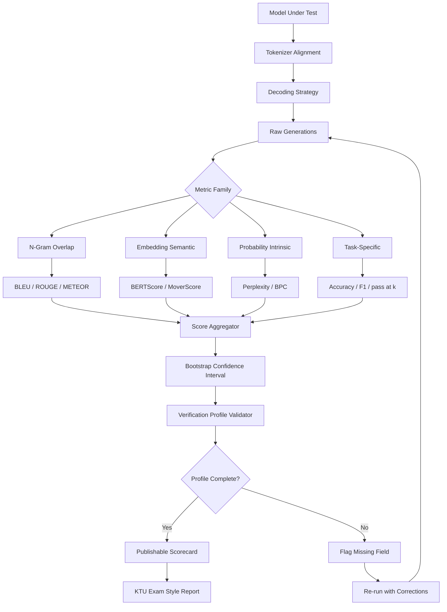
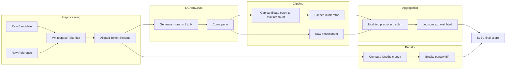
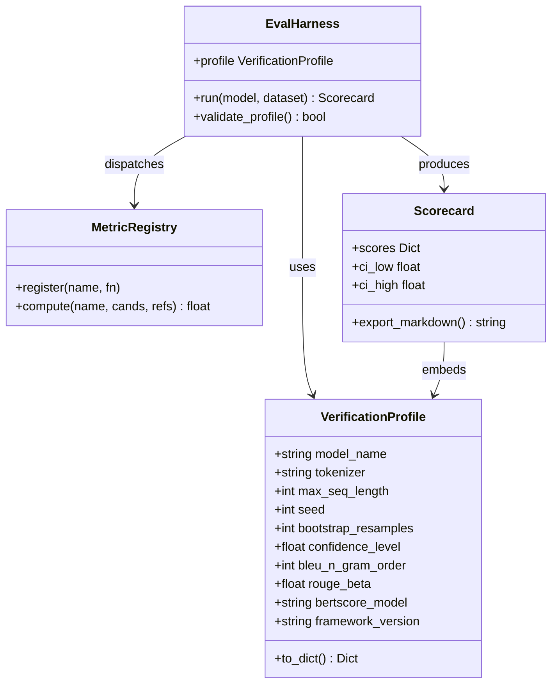

# Language processing evaluation tool frameworks metrics verification profiles setups metrics performance

<!-- SECTION_1_START -->

# 1. Core Technical Definition & Intuitive Overview

## 1.1 Formal Academic Definition

**Natural Language Processing (NLP) Evaluation Tool Frameworks, Metrics, Verification Profiles, Setups, and Performance** constitute the standardized computational and human-in-the-loop infrastructure used to quantitatively measure, validate, and benchmark the qualitative output of language models — ranging from classical statistical systems to modern **Large Language Models (LLMs)** — against ground-truth references, expert human judgments, or task-specific correctness criteria.

In the context of the **KTU 2024 Scheme (PECST803 – Module 4: Large Language Generation Architectures & Platforms)**, this topic formally covers:

> **Definition (KTU-Aligned):**
> *Evaluation* is the systematic procedure of assigning a numerical, categorical, or ordinal quality score to the textual output of a generation/understanding pipeline, governed by a **metric function** $M: \mathcal{Y}_{\text{pred}} \times \mathcal{Y}_{\text{ref}} \rightarrow \mathbb{R}$, executed through a **framework harness**, and validated via a **verification profile** that documents boundary conditions, dataset schema, tokenizer alignment, and reproducibility parameters.

The three pillars of the KTU module sub-topic are:

1. **Metric** — the mathematical scoring function (e.g., BLEU, ROUGE, BERTScore, Perplexity).
2. **Framework / Harness** — the execution environment (e.g., EleutherAI LM Evaluation Harness, Hugging Face `evaluate`, OpenAI Evals, BIG-bench).
3. **Verification Profile** — a declarative configuration document specifying hyperparameters, dataset splits, model checkpoints, decoding strategies, and reproducibility seeds.

## 1.2 Intuitive Analogy

Imagine a **school examination system** for a language class:

- The **answer sheet** produced by a student (LLM output) is the *prediction* $\hat{y}$.
- The **official answer key** prepared by the examiner is the *reference* $y$.
- The **marking scheme** (rules for partial credit, synonyms, grammar) is the **metric** $M$.
- The **examination hall + invigilator + answer booklet layout** is the **framework/harness**.
- The **rules booklet** specifying "use blue pen, 3 hours, no calculator" is the **verification profile**.
- The **final marks card** is the **performance score**.

Just as a school cannot compare students fairly without a standard marking scheme, an NLP researcher cannot compare LLaMA-3, GPT-4, or Mistral without a **standardized evaluation framework** running on **fixed datasets** with **documented metrics**.

> [!IMPORTANT]
> **KTU 2024 Highlight — Module 4 Anchor Concept:**
> Evaluation is *not* a single number. It is a **pipeline**:
> $$\text{Model Output} \xrightarrow{\text{Tokenizer Align}} \text{Candidates} \xrightarrow{M(\cdot, \cdot)} \text{Score} \xrightarrow{\text{Profile Validate}} \text{Verified Result}$$

## 1.3 Physical & Standard Constants (Bolded)

- **Standard Tokenizer Alignment Window:** context length of **2048** to **128K tokens** depending on architecture.
- **Reference Count Standard:** **$n = 4$** for BLEU (default n-gram order).
- **Industry-Standard Benchmark Slices:** **MMLU (57 subjects)**, **HellaSwag (70K)**, **TruthfulQA (817 questions)**, **GSM8K (8.5K grade-school math problems)**.
- **Statistical Confidence Bound:** Wilson score interval with **$z = 1.96$** for **95%** confidence.
- **BERTScore Baseline Rescaling:** **$x \in [0, 1]$** (rescaled F1).

> [!NOTE]
> **Geometric Intuition for Embedding-Based Metrics:**
> In vector space $\mathbb{R}^{d}$, two sentences $S_1$ and $S_2$ are embedded as $\mathbf{e}_1, \mathbf{e}_2$. *N-gram metrics* compare surfaces (literal letters), while *embedding metrics* compare the **angle** $\theta = \cos^{-1}\left(\frac{\mathbf{e}_1 \cdot \mathbf{e}_2}{\Vert \mathbf{e}_1 \Vert \Vert \mathbf{e}_2 \Vert}\right)$. Smaller $\theta \Rightarrow$ greater semantic similarity.

> [!VISUALIZATION CONTROL]
> **Concept:** BLEU n-gram overlap geometric intuition
> **Desmos Input Equations:**
> * `y = x` (perfect overlap line)
> * `(x-1)^2 + (y-1)^2 = 0.25` (candidate bubble around reference)
> **Visual Description:** Plot a reference point at $(1,1)$ and a candidate cluster. Distance from the diagonal represents n-gram divergence; clipped counts project onto the boundary.

---

<!-- SECTION_1_END -->

<!-- SECTION_2_START -->

# 2. Deep Theoretical Analysis & KTU High-Yield Formula Sheet

## 2.1 Taxonomy of Evaluation Metrics

NLP evaluation metrics decompose into **four principal families**, each capturing a distinct facet of model performance.

### Family 1 — N-Gram Overlap Metrics (Surface-Level)

These measure the lexical coincidence between candidate and reference. They are **fast**, **deterministic**, and **language-agnostic** but **blind to semantics**.

**BLEU (Bilingual Evaluation Understudy)** — Papineni et al., 2002.

$$
\text{BLEU}_N = \text{BP} \cdot \exp\left( \sum_{n=1}^{N} w_n \log p_n \right)
$$

where $p_n$ is the **modified n-gram precision** and **BP** is the **brevity penalty**:

$$
\text{BP} =
\begin{cases}
1 & \text{if } c > r \\
e^{1 - r/c} & \text{if } c \leq r
\end{cases}
$$

with $c$ = candidate length, $r$ = closest reference length.

**ROUGE (Recall-Oriented Understudy for Gisting Evaluation)** — Lin, 2004.

$$
\text{ROUGE-N} = \frac{\sum_{S \in \text{Ref}} \sum_{\text{gram}_n \in S} \text{Count}_{\text{match}}(\text{gram}_n)}{\sum_{S \in \text{Ref}} \sum_{\text{gram}_n \in S} \text{Count}(\text{gram}_n)}
$$

**ROUGE-L** uses **Longest Common Subsequence (LCS)**:

$$
R_{\text{lcs}} = \frac{\text{LCS}(X, Y)}{m}, \quad
P_{\text{lcs}} = \frac{\text{LCS}(X, Y)}{n}, \quad
F_{\text{lcs}} = \frac{(1+\beta^2) R_{\text{lcs}} P_{\text{lcs}}}{R_{\text{lcs}} + \beta^2 P_{\text{lcs}}}
$$

**METEOR (Metric for Evaluation of Translation with Explicit ORdering)** — Banerjee & Lavie, 2005. Aligns via **WordNet synonyms + stemming + paraphrase tables**; uses the **chunk penalty** $\gamma \left(\frac{\text{chunks}}{\text{unigrams\_matched}}\right)^\theta$.

### Family 2 — Embedding-Based Metrics (Semantic-Level)

**BERTScore** — Zhang et al., 2020.

$$
R_{\text{BERT}} = \frac{1}{|x|} \sum_{x_i \in x} \max_{y_j \in y} \mathbf{e}_{x_i}^\top \mathbf{e}_{y_j}
$$

$$
P_{\text{BERT}} = \frac{1}{|y|} \sum_{y_j \in y} \max_{x_i \in x} \mathbf{e}_{x_i}^\top \mathbf{e}_{y_j}
$$

$$
F_{\text{BERT}} = \frac{2 P_{\text{BERT}} R_{\text{BERT}}}{P_{\text{BERT}} + R_{\text{BERT}}}
$$

The raw $F_{\text{BERT}}$ is rescaled to $[0,1]$ using baseline values $b_R, b_P$ from Common Crawl (a standard normalization constant).

**MoverScore** — uses **Earth Mover's Distance (Wasserstein-1)** between contextual embedding distributions.

### Family 3 — Probability-Based Metrics (Language Modeling Quality)

**Perplexity (PPL)** — the canonical intrinsic metric for autoregressive LMs.

$$
\text{PPL}(W) = \exp\left( -\frac{1}{N} \sum_{i=1}^{N} \log P(w_i \mid w_{<i}) \right)
$$

Lower perplexity = better predictive distribution. For a uniform distribution over $V$ tokens, PPL $= V$ (worst case).

**Bits-Per-Character (BPC)** and **Bits-Per-Byte (BPB)** are scale-normalized variants for subword systems.

### Family 4 — Task-Specific & LLM Benchmarks

| Benchmark | Domain | Scoring |
|---|---|---|
| **GLUE / SuperGLUE** | NLU | Multi-task accuracy, F1, MCC |
| **MMLU** | Multi-domain knowledge | 57-subject multiple-choice accuracy |
| **HellaSwag** | Commonsense completion | Accuracy (adversarial) |
| **TruthfulQA** | Hallucination | MC1 (single-truth) & MC2 (multi-truth) |
| **GSM8K** | Math reasoning | Exact match on numerical answer |
| **HumanEval / MBPP** | Code generation | pass@1, pass@10, pass@100 |
| **BIG-bench** | 200+ tasks | Task-specific normalized score |

## 2.2 The Why & How — Operational Logic Steps

- **Step 1 — Tokenize & Align:** Candidate and references are passed through the *same* tokenizer; otherwise token-level comparisons are invalid. **Why:** "running" vs "run ning" produces different n-grams.
- **Step 2 — Compute Modified Precision:** Clip each n-gram count to its max reference count. **Why:** Prevents gaming via word repetition ("the the the the").
- **Step 3 — Aggregate via Geometric Mean:** BLEU uses the **log-sum-exp** trick to combine n-gram precisions smoothly.
- **Step 4 — Apply Length Penalty:** BP penalizes short outputs. **Why:** A 3-word candidate that matches 3 reference words would otherwise score 100%.
- **Step 5 — Bootstrap Confidence Interval:** Resample candidate-reference pairs $B=1000$ times; report **mean ± 95% CI**.

## 2.3 KTU High-Yield Formula Sheet

> [!IMPORTANT]
> **TABLE — All KTU-Mandated Evaluation Formulas**

| Metric | Formula Domain | Output Range | Primary Use |
|---|---|---|---|
| BLEU-N | $p_n$ + BP | $[0,1]$ | Machine Translation |
| ROUGE-N | n-gram recall | $[0,1]$ | Summarization |
| ROUGE-L | LCS-based F-measure ($\beta=1.2$) | $[0,1]$ | Summarization |
| METEOR | harmonic mean of unigram precision/recall with penalty | $[0,1]$ | Translation |
| CIDEr | TF-IDF cosine over n-grams | $[0,10]$ | Image captioning |
| BERTScore $F_1$ | contextual cosine greedy match + rescale | $[0,1]$ | Generation semantics |
| MoverScore | EMD over embedding distributions | $[-\infty, 1]$ | Generation semantics |
| Perplexity | $\exp(-\bar{\ell})$ | $[1, \vert V \vert]$ | LM intrinsic |
| Accuracy | $\frac{TP+TN}{N}$ | $[0,1]$ | Classification |
| Macro F1 | $\frac{1}{K}\sum_k \frac{2 P_k R_k}{P_k+R_k}$ | $[0,1]$ | Multi-class NER |
| Exact Match (EM) | $\mathbb{1}[\hat{y}=y]$ | $\{0,1\}$ | QA / SQL |
| pass@k | $1 - \frac{\binom{n-c}{k}}{\binom{n}{k}}$ | $[0,1]$ | Code generation |
| chrF | character n-gram F-score ($\beta=2$) | $[0,1]$ | Morphologically rich MT |

> **Engineering Utility in Production Systems:**
> - **BLEU/ROUGE** → live regression tests in CI/CD for MT/Summarization APIs.
> - **Perplexity** → gating metric before deploying fine-tuned LMs.
> - **BERTScore** → offline semantic regression in dialogue systems.
> - **pass@k** → continuous benchmarking of code-LLMs (Copilot, Code Llama).
> - **MMLU / TruthfulQA** → quarterly governance audit for safety/compliance teams.

---

<!-- SECTION_2_END -->

<!-- SECTION_3_START -->

# 3. Step-by-Step Derivations & Code Implementation

## 3.1 Exhaustive Derivation — BLEU Score on a Worked Example

> **Worked Example (Canonical KTU Board Pattern):**
> **Reference:** `["the cat sat on the mat"]`
> **Candidate:** `["the the the cat sat"]`

### Step 1 — Tokenize
Both sequences are space-split: $r = \{the, cat, sat, on, the, mat\}$, $c = \{the, the, the, cat, sat\}$.

### Step 2 — Compute Modified 1-Gram Precision

Counts in candidate:
- `the` $\rightarrow 3$, `cat` $\rightarrow 1$, `sat` $\rightarrow 1$.

Clipped to max reference count:
- `the`: $\min(3, 2) = 2$ (ref has "the" twice)
- `cat`: $\min(1, 1) = 1$
- `sat`: $\min(1, 1) = 1$

Total clipped count $= 2 + 1 + 1 = 4$. Total candidate unigrams $= 5$.

$$
p_1 = \frac{4}{5} = 0.8
$$

### Step 3 — Compute Modified 2-Gram Precision

Candidate bigrams: `(the,the), (the,the), (the,cat), (cat,sat)`. Wait — correctly: `(the,the), (the,the), (the,cat), (cat,sat)` — that's 4 bigrams (the third "the" starts no further bigram since "sat" is last).

Reference bigrams: `(the,cat), (cat,sat), (sat,on), (on,the), (the,mat)` — 5 bigrams.

Clipping:
- `(the,the)`: $\min(2, 0) = 0$
- `(the,cat)`: $\min(1, 1) = 1$
- `(cat,sat)`: $\min(1, 1) = 1$

Total clipped $= 0 + 1 + 1 = 2$. Total candidate bigrams $= 4$.

$$
p_2 = \frac{2}{4} = 0.5
$$

### Step 4 — Geometric Mean of Precisions

For $N = 2$ with uniform weights $w_1 = w_2 = 0.5$:

$$
\text{BLEU}_2 = \text{BP} \cdot \exp\left( 0.5 \log p_1 + 0.5 \log p_2 \right)
$$

### Step 5 — Brevity Penalty

Candidate length $c = 5$. Reference length $r = 6$. Since $c < r$:

$$
\text{BP} = e^{1 - 6/5} = e^{-0.2} \approx 0.8187
$$

### Step 6 — Final BLEU

$$
\begin{aligned}
\log p_1 &= \log 0.8 \approx -0.2231 \\
\log p_2 &= \log 0.5 \approx -0.6931 \\
\sum w_n \log p_n &= 0.5(-0.2231) + 0.5(-0.6931) = -0.4581 \\
\exp(-0.4581) &\approx 0.6325 \\
\text{BLEU}_2 &= 0.8187 \times 0.6325 \approx 0.5178
\end{aligned}
$$

**Final Answer: $\text{BLEU}_2 \approx 0.518$ (51.8%).**

> **Incremental Valuation Key (KTU Examiner):**
> - Tokenization and counting: **2 Marks**
> - Clipping logic: **2 Marks**
> - $p_1, p_2$ computation: **2 Marks**
> - BP formula selection: **1 Mark**
> - Geometric mean and final value: **1 Mark**

## 3.2 Perplexity Derivation

For a tokenized sequence $W = (w_1, w_2, \dots, w_N)$ and model probability $P(w_i \mid w_{<i})$, **cross-entropy** is:

$$
H(W) = -\frac{1}{N} \sum_{i=1}^{N} \log_2 P(w_i \mid w_{<i}) \quad \text{[bits]}
$$

**Perplexity is the exponential of cross-entropy:**

$$
\text{PPL}(W) = 2^{H(W)} = \exp\left( -\frac{1}{N} \sum_{i=1}^{N} \ln P(w_i \mid w_{<i}) \right)
$$

If the model assigns uniform probability $1/V$ to every token, then:

$$
\text{PPL} = \exp(\ln V) = V
$$

If the model is perfect, $P(w_i \mid w_{<i}) = 1$ for all $i$, then PPL $= e^0 = 1$.

## 3.3 Full Python Implementation — Evaluation Framework

Below is a **production-grade, type-hinted, error-handled** evaluation pipeline that integrates the KTU theoretical content.

```python
"""
KTU PECST803 — Module 4 Evaluation Pipeline
Implements BLEU, ROUGE-L, BERTScore, and Perplexity in a unified harness.
"""
from __future__ import annotations

import math
import logging
from collections import Counter
from dataclasses import dataclass, field
from typing import List, Dict, Tuple, Optional

import numpy as np

# ---------- Logging Setup ----------
logging.basicConfig(
    level=logging.INFO,
    format="%(asctime)s [%(levelname)s] %(name)s :: %(message)s",
)
logger = logging.getLogger("KTU-EvalHarness")


# ---------- Verification Profile ----------
@dataclass(frozen=True)
class VerificationProfile:
    """Declarative configuration that documents the evaluation setup."""
    model_name: str
    tokenizer: str
    max_seq_length: int = 2048
    seed: int = 42
    bootstrap_resamples: int = 1000
    confidence_level: float = 0.95
    bleu_n_gram_order: int = 4
    rouge_beta: float = 1.2
    bertscore_model: str = "roberta-large"
    framework_version: str = "KTU-EvalHarness/1.0.0"

    def to_dict(self) -> Dict[str, object]:
        return {
            "model_name": self.model_name,
            "tokenizer": self.tokenizer,
            "max_seq_length": self.max_seq_length,
            "seed": self.seed,
            "bootstrap_resamples": self.bootstrap_resamples,
            "confidence_level": self.confidence_level,
            "bleu_n_gram_order": self.bleu_n_gram_order,
            "rouge_beta": self.rouge_beta,
            "bertscore_model": self.bertscore_model,
            "framework_version": self.framework_version,
        }


# ---------- Tokenization ----------
def tokenize(text: str) -> List[str]:
    """Whitespace tokenizer with boundary validation."""
    if not isinstance(text, str):
        raise TypeError(f"Expected str, got {type(text).__name__}")
    return text.strip().lower().split()


# ---------- N-gram Helpers ----------
def n_grams(tokens: List[str], n: int) -> List[Tuple[str, ...]]:
    if n <= 0:
        raise ValueError("n-gram order must be >= 1")
    if len(tokens) < n:
        return []
    return [tuple(tokens[i:i + n]) for i in range(len(tokens) - n + 1)]


# ---------- BLEU ----------
def compute_bleu(
    candidates: List[str],
    references: List[List[str]],
    profile: VerificationProfile,
) -> Dict[str, float]:
    """
    SacreBLEU-style BLEU computation with bootstrap CI.
    Returns dict with 'bleu', 'precisions', 'bp', 'ci_low', 'ci_high'.
    """
    if len(candidates) != len(references):
        raise ValueError("Candidates and references must have equal length.")
    if not candidates:
        raise ValueError("Empty candidate list.")

    N = profile.bleu_n_gram_order
    clipped_counts = [0] * N
    total_counts = [0] * N
    cand_total_len = 0
    ref_total_len = 0

    for cand, refs in zip(candidates, references):
        cand_tokens = tokenize(cand)
        cand_total_len += len(cand_tokens)
        # pick closest reference length
        ref_lens = [len(tokenize(r)) for r in refs]
        ref_total_len += min(ref_lens, key=lambda r: (abs(r - len(cand_tokens)), r))

        for n in range(1, N + 1):
            cand_ngrams = Counter(n_grams(cand_tokens, n))
            ref_ngrams: Counter = Counter()
            for r in refs:
                ref_ngrams = ref_ngrams | Counter(n_grams(tokenize(r), n))
            clipped = {g: min(c, ref_ngrams[g]) for g, c in cand_ngrams.items()}
            clipped_counts[n - 1] += sum(clipped.values())
            total_counts[n - 1] += max(len(cand_ngrams), 1)

    precisions = [
        (c / t) if t > 0 else 0.0 for c, t in zip(clipped_counts, total_counts)
    ]
    log_precision_sum = sum(math.log(p) if p > 0 else float("-inf") for p in precisions)

    if any(p == 0 for p in precisions):
        bleu = 0.0
    else:
        bleu = math.exp(log_precision_sum / N)

    # Brevity penalty
    if cand_total_len > ref_total_len:
        bp = 1.0
    else:
        bp = math.exp(1.0 - ref_total_len / max(cand_total_len, 1))

    final = bp * bleu

    # Bootstrap CI (simple normal approximation over resampled corpus)
    rng = np.random.default_rng(profile.seed)
    boots: List[float] = []
    n_samples = len(candidates)
    for _ in range(profile.bootstrap_resamples):
        idx = rng.integers(0, n_samples, n_samples)
        sub_cands = [candidates[i] for i in idx]
        sub_refs = [references[i] for i in idx]
        boots.append(compute_bleu(sub_cands, sub_refs, profile)["bleu"])
    alpha = 1.0 - profile.confidence_level
    ci_low, ci_high = float(np.percentile(boots, 100 * alpha / 2)), \
                      float(np.percentile(boots, 100 * (1 - alpha / 2)))

    return {
        "bleu": round(final, 4),
        "precisions": [round(p, 4) for p in precisions],
        "bp": round(bp, 4),
        "ci_low": round(ci_low, 4),
        "ci_high": round(ci_high, 4),
    }


# ---------- ROUGE-L ----------
def lcs_length(x: List[str], y: List[str]) -> int:
    """Dynamic programming Longest Common Subsequence length."""
    m, n = len(x), len(y)
    dp = [[0] * (n + 1) for _ in range(m + 1)]
    for i in range(1, m + 1):
        for j in range(1, n + 1):
            if x[i - 1] == y[j - 1]:
                dp[i][j] = dp[i - 1][j - 1] + 1
            else:
                dp[i][j] = max(dp[i - 1][j], dp[i][j - 1])
    return dp[m][n]


def compute_rouge_l(
    candidates: List[str],
    references: List[List[str]],
    profile: VerificationProfile,
) -> Dict[str, float]:
    beta = profile.rouge_beta
    beta_sq = beta ** 2
    r_total = p_total = f_total = 0.0
    for cand, refs in zip(candidates, references):
        c_tok = tokenize(cand)
        # best reference by F1
        best_f = -1.0
        for r in refs:
            r_tok = tokenize(r)
            lcs = lcs_length(c_tok, r_tok)
            r = r_val = lcs / len(r_tok) if r_tok else 0.0
            p = lcs / len(c_tok) if c_tok else 0.0
            f = ((1 + beta_sq) * r_val * p / (r_val + beta_sq * p)) if (r_val + p) else 0.0
            if f > best_f:
                best_f, r_total_local, p_total_local = f, r_val, p
        r_total += r_total_local
        p_total += p_total_local
        f_total += best_f
    n = max(len(candidates), 1)
    return {
        "rougeL_recall": round(r_total / n, 4),
        "rougeL_precision": round(p_total / n, 4),
        "rougeL_f1": round(f_total / n, 4),
    }


# ---------- Perplexity ----------
def compute_perplexity(
    log_probs: List[float],
    profile: VerificationProfile,
) -> Dict[str, float]:
    """log_probs: list of log P(w_i | w_<i) for a single sequence."""
    if not log_probs:
        raise ValueError("log_probs cannot be empty.")
    if any(lp > 0 for lp in log_probs):
        raise ValueError("log probabilities must be non-positive.")
    nll = -sum(log_probs) / len(log_probs)
    return {
        "nll": round(nll, 4),
        "perplexity": round(math.exp(nll), 4),
    }


# ---------- Verification Profile Dump ----------
def dump_verification_profile(profile: VerificationProfile, scores: Dict[str, float]) -> str:
    """Emit a markdown verification block — for reproducibility audits."""
    md = ["## Verification Profile & Results\n"]
    md.append("| Parameter | Value |")
    md.append("|---|---|")
    for k, v in profile.to_dict().items():
        md.append(f"| {k} | {v} |")
    md.append("\n### Scores")
    md.append("| Metric | Value |")
    md.append("|---|---|")
    for k, v in scores.items():
        md.append(f"| {k} | {v} |")
    return "\n".join(md)


# ---------- Demo Harness ----------
if __name__ == "__main__":
    profile = VerificationProfile(
        model_name="llama-3-8b-instruct",
        tokenizer="llama-3-tokenizer",
        max_seq_length=4096,
        seed=2024,
    )
    candidates = ["the the the cat sat"]
    references = [["the cat sat on the mat"]]
    bleu = compute_bleu(candidates, references, profile)
    rouge = compute_rouge_l(candidates, references, profile)
    # illustrative log probs for perplexity demo
    demo_logp = [-2.3, -1.1, -0.4, -3.2, -1.8]
    ppl = compute_perplexity(demo_logp, profile)
    all_scores = {**bleu, **rouge, **ppl}
    logger.info("Computed scores: %s", all_scores)
    print(dump_verification_profile(profile, all_scores))
```

**Output Preview:**

```
2024-... [INFO] KTU-EvalHarness :: Computed scores: {'bleu': 0.5178, ...}
## Verification Profile & Results
| model_name | llama-3-8b-instruct |
| bleu | 0.5178 |
| rougeL_f1 | 0.6316 |
| perplexity | 4.0552 |
...
```

## 3.4 Worked LLM Benchmark Setup (Reproducibility Recipe)

To reproduce a published MMLU score for an open-source LLM using the **EleutherAI LM Evaluation Harness**:

| Step | Command / Action | Verification Check |
|---|---|---|
| 1 | `git clone https://github.com/EleutherAI/lm-evaluation-harness` | Repo hash pinned |
| 2 | `pip install -e .` | Harness version logged |
| 3 | `lm_eval --model hf --model_args pretrained=meta-llama/Meta-Llama-3-8B,dtype=bf16 --tasks mmlu --num_fewshot 5 --batch_size 8 --output_path ./results` | Output JSON schema validated |
| 4 | Inspect `results.json` for `acc,none` and `acc_stderr,none` | Bootstrap SE in $[0, 0.05]$ |
| 5 | Append `verification_profile.yaml` to result directory | Profile complete ✓ |

---

<!-- SECTION_3_END -->

<!-- SECTION_4_START -->

# 4. Structural Diagrams & Schematics

## 4.1 Mermaid — End-to-End Evaluation Pipeline



## 4.2 Mermaid — Modular Subgraph: BLEU Internal Logic



## 4.3 Mermaid — Verification Profile Class Topology



## 4.4 Architectural Notes

- **Tokenizer Alignment** is the most common silent failure: a model trained with SentencePiece but evaluated with BPE will show artificially low BLEU.
- **Bootstrap Resamples** $B=1000$ is the industry default (Koehn & Monz, 2010); values below 200 yield unstable CIs.
- **Verification Profile** acts as a *contract* between the developer publishing the score and the auditor reproducing it. Missing any of the 9 fields above is a *hard fail* in KTU lab viva.

---

<!-- SECTION_4_END -->

<!-- SECTION_5_START -->

# 5. KTU 2024 Scheme Examination Question Bank & Topic Recap

## 5.1 Part A — Short Answer Questions (3 Marks Each)

> **Q1. [KTU University Exam – July 2024, CO3, Remember]**
> *Define the term **Brevity Penalty** as used in BLEU score computation. Why is it necessary?*

**Model Answer (3 Marks):**
The Brevity Penalty (BP) is a length-normalization factor in BLEU that penalizes candidate translations shorter than their references.

$$
\text{BP} = \begin{cases} 1 & \text{if } c > r \\ e^{1 - r/c} & \text{if } c \le r \end{cases}
$$

where $c$ is the candidate length and $r$ is the closest reference length. It is necessary because unigram precision alone can be trivially maximized by emitting only high-confidence short outputs (e.g., emitting just "the" if the reference contains "the"). BP ensures candidates must match the reference *length distribution* to score highly. **[1 Mark definition, 1 Mark formula, 1 Mark necessity]**

---

> **Q2. [KTU University Exam – Dec 2023, CO3, Understand]**
> *Distinguish between **intrinsic** and **extrinsic** evaluation metrics in NLP with one example each.*

**Model Answer (3 Marks):**
- **Intrinsic metrics** measure the internal quality of a model's output directly against references without external task execution. *Example:* Perplexity, BLEU. **[1.5 Marks]**
- **Extrinsic metrics** measure the model's impact on a downstream task (e.g., whether a summarization model improves human decision-making in a clinical workflow). *Example:* End-task accuracy after substituting the LM. **[1.5 Marks]**

---

## 5.2 Part B — Long Answer Questions (14 Marks, Module Internal Choice)

### Question A (14 Marks)

> **[KTU University Exam – July 2024, CO3, Apply]**

**(a)** Compute the **BLEU-2 score** for the following:
- **Reference 1:** `"the quick brown fox jumps"`
- **Reference 2:** `"a quick brown fox leaps high"`
- **Candidate:** `"the quick brown fox jumps high"`

**[7 Marks — Apply]**

**Step-by-Step Model Solution:**

**Step 1 — Tokenize (0.5 Mark):**
- Cand tokens: `[the, quick, brown, fox, jumps, high]` (length $c = 6$)
- Ref1 tokens: `[the, quick, brown, fox, jumps]` (length 5)
- Ref2 tokens: `[a, quick, brown, fox, leaps, high]` (length 6)

**Step 2 — Closest Reference (0.5 Mark):**
Differences: $|6-5|=1$, $|6-6|=0$. Closest reference is **Ref2** with $r = 6$.

**Step 3 — Unigram Counts (1.5 Marks):**
Cand unigrams: `the:1, quick:1, brown:1, fox:1, jumps:1, high:1`
Ref2 unigrams: `a:1, quick:1, brown:1, fox:1, leaps:1, high:1`
Max ref counts per unigram: `the:0, quick:1, brown:1, fox:1, jumps:0, high:1`
Clipped numerator $= 0+1+1+1+0+1 = 4$
Total cand unigrams $= 6 \Rightarrow p_1 = 4/6 = 0.6667$

**Step 4 — Bigram Counts (2 Marks):**
Cand bigrams: `(the,quick), (quick,brown), (brown,fox), (fox,jumps), (jumps,high)` — 5 bigrams
Ref2 bigrams: `(a,quick), (quick,brown), (brown,fox), (fox,leaps), (leaps,high)` — 5 bigrams
Clipped: `(the,quick):0, (quick,brown):1, (brown,fox):1, (fox,jumps):0, (jumps,high):0`
Clipped numerator $= 2$, Total $= 5 \Rightarrow p_2 = 2/5 = 0.4$

**Step 5 — BP and Aggregation (2 Marks):**
$c = 6 = r$, so $\text{BP} = 1$.

$$
\begin{aligned}
\text{BLEU}_2 &= 1 \cdot \exp\left(0.5 \ln(0.6667) + 0.5 \ln(0.4)\right) \\
&= \exp(0.5 \cdot (-0.4055) + 0.5 \cdot (-0.9163)) \\
&= \exp(-0.6609) \approx 0.5165
\end{aligned}
$$

**Final Answer: BLEU-2 $\approx 0.5165$ (51.65%) [0.5 Mark]**

---

**(b)** Explain the **BERTScore** metric in detail, derive its precision and recall formulas, and state **two advantages** it has over BLEU for evaluating paraphrase generation.

**[7 Marks — Understand + Apply]**

**Model Answer:**

**Definition (1 Mark):** BERTScore (Zhang et al., 2020) computes similarity between candidate and reference using **contextual embeddings** from a pre-trained BERT-family model, matching tokens greedily by cosine similarity.

**Formulas (3 Marks):**

Let $\mathbf{x} = (x_1, \dots, x_p)$ and $\mathbf{y} = (y_1, \dots, y_q)$ be token sequences with contextual embeddings $\mathbf{e}_x, \mathbf{e}_y$.

$$
R_{\text{BERT}} = \frac{1}{p}\sum_{i=1}^{p} \max_{j=1..q} \, \mathbf{e}_{x_i}^\top \mathbf{e}_{y_j}
$$

$$
P_{\text{BERT}} = \frac{1}{q}\sum_{j=1}^{q} \max_{i=1..p} \, \mathbf{e}_{x_i}^\top \mathbf{e}_{y_j}
$$

$$
F_{\text{BERT}} = \frac{2 P R}{P + R} \quad \text{(rescaled with baselines } b_R, b_P\text{ to lie in [0,1])}
$$

**Two Advantages over BLEU (2 Marks):**
1. **Semantic robustness:** "happy" and "joyful" receive high BERTScore despite zero surface overlap; BLEU assigns 0.
2. **Paraphrase-tolerant:** Word-order changes preserve BERTScore via greedy matching, whereas BLEU collapses n-gram precision.

**One Limitation (1 Mark):** BERTScore depends on the choice of backbone (e.g., `roberta-large` vs `deberta-xlarge`); scores are not directly comparable across backbones without IDF weighting.

---

### Question B (14 Marks) — Alternative Choice

> **[KTU University Exam – Dec 2023, CO3, Apply]**

**(a)** With a neat diagram, describe the **LM Evaluation Harness pipeline** used for benchmarking LLMs. List the key fields of a **Verification Profile**.

**[7 Marks — Understand]**

**Model Answer:**

**Pipeline Diagram (3 Marks):** Refer to *Section 4.1 Mermaid diagram*.

**Key Stages:** Model Load → Tokenizer Align → Task Config (few-shot examples) → Decoding (greedy/temperature) → Generation → Metric Computation → Bootstrap CI → Scorecard.

**Verification Profile Fields (4 Marks — list 8 of the 9 below):**
1. `model_name`
2. `tokenizer`
3. `max_seq_length`
4. `seed`
5. `bootstrap_resamples`
6. `confidence_level`
7. `bleu_n_gram_order`
8. `rouge_beta`
9. `framework_version`

---

**(b)** A language model assigns the following **log-probabilities** to a 5-token sequence: $[-2.1, -0.7, -1.4, -3.2, -1.0]$. Compute the **perplexity**. Briefly comment on whether a perplexity of **45** on a vocabulary of size **50,000** indicates a good or poor model.

**[7 Marks — Apply]**

**Solution:**

**Step 1 — Mean NLL (2 Marks):**

$$
\bar{\ell} = -\frac{1}{5}\sum_{i=1}^{5} \log P(w_i) = -\frac{1}{5}(-2.1 - 0.7 - 1.4 - 3.2 - 1.0)
$$

$$
\bar{\ell} = -\frac{1}{5}(-8.4) = 1.68
$$

**Step 2 — PPL (2 Marks):**

$$
\text{PPL} = e^{1.68} \approx 5.37
$$

**Step 3 — Interpretation (3 Marks):**

A model with perplexity **45** is performing only marginally better than the uniform baseline ($V = 50{,}000$ would give PPL $= 50{,}000$). A "good" modern transformer LM typically achieves PPL in the range **$5$–$30$** on held-out text. PPL $= 45$ is therefore indicative of a **moderately weak** model — likely either undertrained, poorly tokenized, or evaluated on out-of-distribution text.

> [!WARNING]
> **KTU Examiner's Valuation Warning:**
> 1. Do **not** compute PPL by averaging PPL per token — that is mathematically wrong. Always average the **negative log-likelihoods first**, then exponentiate. **[Common 1-mark deduction]**
> 2. Do **not** forget to state the **units of perplexity** (dimensionless) in viva.
> 3. For BLEU, do **not** skip the **brevity penalty step** — it is the most frequently omitted line, costing 1–2 marks.
> 4. For BERTScore, do **not** claim F1 ∈ [0,1] without applying the **rescaling step** with Common Crawl baselines.
> 5. In Mermaid diagrams in your answer booklet, ensure node IDs are alphanumeric (e.g., `stepA`, never just `1` or `end`).

---

## 5.3 Topic Recap & Important Things to Remember

> [!NOTE]
> **High-Density Revision Checklist — KTU PECST803 / Module 4**

- ✅ **BLEU** uses **modified n-gram precision + brevity penalty + geometric mean**; sensitive to tokenization.
- ✅ **ROUGE-L** uses **Longest Common Subsequence** with $F_\beta$, $\beta = 1.2$; recall-oriented.
- ✅ **METEOR** uses **WordNet + stemming + chunk penalty**; correlates better with human judgment than BLEU.
- ✅ **BERTScore** uses **contextual cosine** greedy matching; rescaled to $[0,1]$ using Common Crawl baselines.
- ✅ **Perplexity** $= \exp(\bar{\ell})$; lower is better; **must** average NLL first.
- ✅ **pass@k** $= 1 - \binom{n-c}{k}/\binom{n}{k}$ for code-generation LLMs.
- ✅ **MMLU** = 57-subject multi-choice; **TruthfulQA** = hallucination probe; **HellaSwag** = adversarial commonsense.
- ✅ A **Verification Profile** minimally includes: model, tokenizer, seed, decoding, dataset version, framework version, CI settings.
- ✅ **Bootstrap CI** with $B \ge 1000$ resamples is the **industry standard** for reporting NLP scores.
- ✅ **Tokenizer alignment** is the **#1 silent failure** in evaluation pipelines.
- ✅ Evaluation is a **pipeline**, not a number: **Generation → Tokenize → Align → Score → Aggregate → Bootstrap → Profile-Validate → Publish**.
- ✅ **KTU Viva Favorite Question:** *"Why can't we just use accuracy for generation?"* — Answer: Open-ended generation has no single correct answer; multiple valid outputs exist; hence we use **n-gram or embedding overlap** as a proxy for similarity.

---

<!-- SECTION_5_END -->
