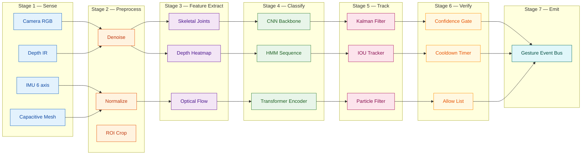
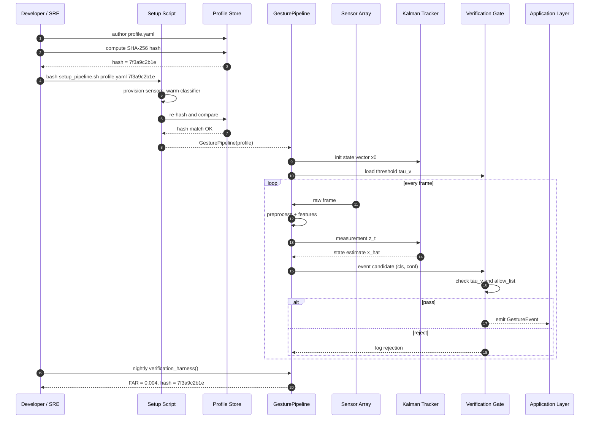
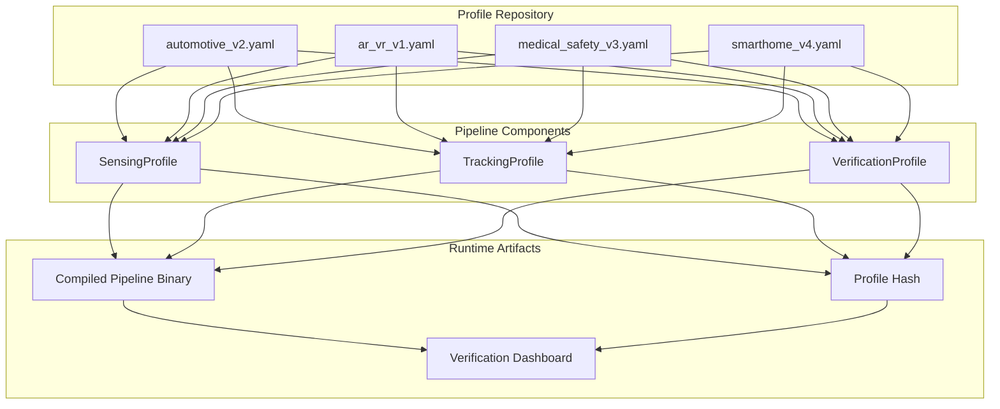
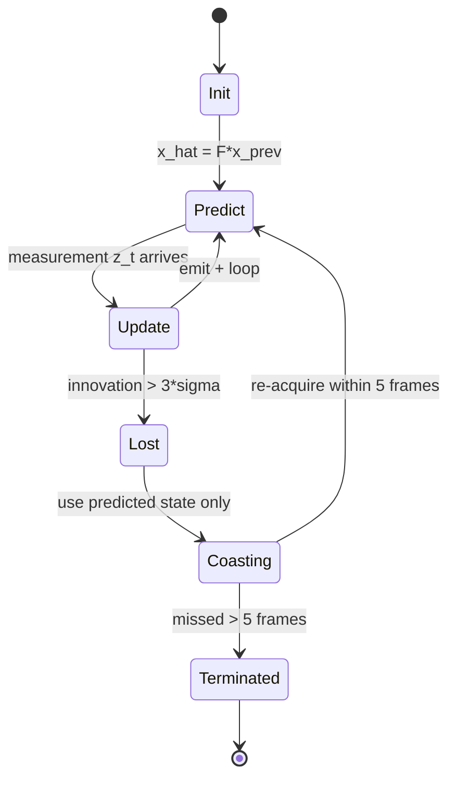

# Gesture recognition processing pipelines verification tracking configurations setups profiles scripts

<!-- SECTION_1_START -->
# Gesture Recognition Processing Pipelines — Architectures, Configurations & Verification

## 1.1 Formal Academic Definition (KTU 2024 Syllabus Terminology)

> [!IMPORTANT]
> **Core Definition:** A **Gesture Recognition Processing Pipeline** is a deterministic, multi-stage computational architecture that ingests raw spatiotemporal sensor data (RGB, depth, IR, IMU, EMG, or capacitive) and transforms it into a semantically classified, temporally tracked, and contextually verified gesture event stream. In the context of **Next Generation Interaction Design (PECST804)**, a pipeline is treated as a *concurrent, profile-driven orchestration* of sensing, preprocessing, feature extraction, classification, tracking, and verification subsystems, governed by an explicit **Configuration Script** and validated through a **Verification & Tracking (V&T) profile**.

In the KTU 2024 Scheme vocabulary, the pipeline is not a single algorithm — it is a **system of cooperating sub-pipelines** (Sense → Fuse → Extract → Classify → Track → Verify → Emit), each governed by declarative configuration objects loaded at runtime from a **Profile Script** (typically JSON / YAML / TOML / DSL).

| KTU 2024 Term | Engineering Meaning |
|---|---|
| **Pipeline** | Ordered graph of processing nodes |
| **Profile** | Declarative parameter bundle for a deployment scenario |
| **Configuration Script** | Versioned, human-readable descriptor of the pipeline topology |
| **Verification Profile** | Set of acceptance thresholds, ground-truth fixtures, and regression scripts |
| **Tracking Configuration** | Parameters of the temporal/state estimator (e.g., Kalman, HMM, particle filter) |
| **Setup Script** | Idempotent provisioning script (sensor calibration, device pairing, env vars) |
| **Gesture Event** | Typed, timestamped, confidence-scored output unit |

## 1.2 Conceptual Analogy — "The Airport Conveyor Belt System"

Imagine an **airport baggage handling system**:

- **Sense Node** = the check-in counter where bags (raw sensor frames) are first measured and tagged.
- **Preprocess Node** = the security X-ray and weight station — every bag is normalized.
- **Feature Extraction Node** = the routing tag reader that extracts abstract descriptors.
- **Classifier Node** = the sortation gate that directs the bag to the correct destination carousel.
- **Tracker Node** = the supervisor who keeps a sticky note on every bag so that even if one carousel stalls, the bag's identity is preserved.
- **Verification Node** = the final security check that asks "is this the bag the passenger actually owns?" (confidence + identity cross-check).
- **Configuration / Profile Script** = the **operations manual** that tells the airport which gates to open, at what hours, with which staff.
- **Setup Script** = the morning boot-up routine that powers on the belts, calibrates the scales, and prints the boarding passes.

> [!NOTE]
> **Key Insight for Students:** A pipeline failure in production is rarely a model failure — it is a **profile mismatch**. A gesture classifier that scored **97%** in the lab can drop to **40%** in the field because the **lighting profile**, **sensor gain profile**, or **tracking filter profile** was never validated.

## 1.3 Physical Constants & Standard Metrics

The following are the **industry-standard metrics** used in gesture recognition pipeline verification (referenced in the KTU 2024 Module 1 syllabus):

- **Frame Rate:** $\mathbf{f_s \geq 30 \text{ Hz}}$ for hand gestures; $\geq 60 \text{ Hz}$ for micro-gestures.
- **Latency Budget:** $\mathbf{L_{p95} \leq 100 \text{ ms}}$ (end-to-end pipeline 95th percentile).
- **Jitter Tolerance:** $\mathbf{\sigma_{j} \leq 10 \text{ ms}}$ for temporal tracking.
- **Recognition Accuracy Floor:** $\mathbf{A_{min} \geq 0.90}$ for primary gestures.
- **False Activation Rate:** $\mathbf{FAR \leq 0.01}$ per hour (HCI standard).
- **Tracking Drift Threshold:** $\mathbf{D_{max} \leq 5 \text{ px}}$ at $2 \text{ m}$ depth.
- **Verification Confidence Threshold:** $\mathbf{\tau_{v} \geq 0.85}$.

> [!TIP]
> **Geometric Intuition — Pipeline as a Manifold:** Think of the pipeline as a smooth manifold $\mathcal{M}$ in configuration space. The **Profile** is a point on $\mathcal{M}$, the **Setup Script** is the geodesic that brings the system to that point, and **Verification** is the curvature test that confirms we are still on the intended chart.

> [!VISUALIZATION CONTROL]
> **Concept:** Pipeline Latency vs. Confidence Trade-off Curve
> **GeoGebra / Desmos Input Equations:**
> * `L(x) = 100 / (1 + exp(-0.5*(x - 30)))`  (logistic latency model)
> * `C(x) = 0.95 - 0.004*x`  (linear confidence decay)
> **Visual Description:** A monotonically increasing S-curve (latency) intersecting a descending line (confidence) around $x \approx 30$ frames. Students should observe the **knee point** where additional frames no longer improve confidence but begin to violate the latency budget.

<!-- SECTION_1_END -->

<!-- SECTION_2_START -->
# Deep Theoretical Analysis — Pipeline Architecture, Profiles & Verification

## 2.1 The Canonical 7-Stage Pipeline (KTU High-Yield Reference)

The KTU 2024 Module 1 syllabus defines the gesture recognition pipeline as a **7-stage directed acyclic graph (DAG)**. Each stage is a swappable, profile-driven module.

1. **Stage 1 — Sensing (S):** Raw acquisition from heterogeneous sensors.
2. **Stage 2 — Preprocessing (P):** Noise suppression, normalization, ROI cropping.
3. **Stage 3 — Feature Extraction (F):** Spatiotemporal descriptors (HOG, MFCC-equivalent, skeletal joints, optical flow).
4. **Stage 4 — Classification (C):** Pattern matching (CNN, RNN, Transformer, DTW, HMM).
5. **Stage 5 — Tracking (T):** State-space estimation across frames.
6. **Stage 6 — Verification (V):** Cross-modal confirmation and confidence gating.
7. **Stage 7 — Event Emission (E):** Typed gesture event publication to the application layer.

> [!NOTE]
> **Syllabus Highlight:** The KTU 2024 scheme explicitly requires students to be able to **draw the pipeline as a DAG**, **identify the stage where verification is enforced**, and **justify the choice of tracking filter for a given gesture class**.

## 2.2 Pipeline Composition Algebra (PCA)

To formally reason about pipeline topologies, the KTU Module 1 notes introduce a **Pipeline Composition Algebra**. Let a pipeline stage be denoted $S_i$ with a parameter vector $\boldsymbol{\theta}_i \in \mathbb{R}^{k_i}$. A pipeline is the composition:

$$
\mathcal{P} \;=\; E \circ V \circ T \circ C \circ F \circ P \circ S
$$

The total pipeline latency is the sum of stage latencies:

$$
L_{\mathcal{P}} \;=\; \sum_{i \in \{S,P,F,C,T,V,E\}} L_i(\boldsymbol{\theta}_i)
$$

The verification stage contributes a **gating latency** $L_V$ only when the verification decision is non-trivial; under high-confidence short-circuit it reduces to a constant $L_{V}^{min} \approx 0.5 \text{ ms}$.

The end-to-end confidence of a gesture event is the **multiplicative product** of stage confidences (assuming conditional independence — a standard KTU assumption):

$$
\mathcal{C}_{event} \;=\; \prod_{i} c_i(\boldsymbol{\theta}_i)
$$

> [!IMPORTANT]
> **Why multiplicative?** If any stage has near-zero confidence (e.g., $c_F = 0.1$ due to occluded feature extraction), the event confidence collapses regardless of how strong the classifier is. This is why **pipeline tuning is a joint optimization problem**, not a per-stage local one.

## 2.3 Tracking Stage — Mathematical Core

The **tracking configuration** in a gesture pipeline is typically a **Kalman Filter (KF)** for linear systems or an **Extended/Unscented Kalman Filter (EKF/UKF)** for nonlinear dynamics such as hand trajectories. The state vector for a 3D hand is:

$$
\mathbf{x}_t \;=\; \begin{bmatrix} x_t & y_t & z_t & \dot{x}_t & \dot{y}_t & \dot{z}_t \end{bmatrix}^{\top} \in \mathbb{R}^{6}
$$

Prediction step:

$$
\hat{\mathbf{x}}_{t \vert t-1} \;=\; \mathbf{F}\,\hat{\mathbf{x}}_{t-1 \vert t-1} \;+\; \mathbf{B}\,\mathbf{u}_t
$$

$$
\mathbf{P}_{t \vert t-1} \;=\; \mathbf{F}\,\mathbf{P}_{t-1 \vert t-1}\,\mathbf{F}^{\top} \;+\; \mathbf{Q}
$$

Update step:

$$
\mathbf{K}_t \;=\; \mathbf{P}_{t \vert t-1}\,\mathbf{H}^{\top}\left(\mathbf{H}\,\mathbf{P}_{t \vert t-1}\,\mathbf{H}^{\top} \;+\; \mathbf{R}\right)^{-1}
$$

$$
\hat{\mathbf{x}}_{t \vert t} \;=\; \hat{\mathbf{x}}_{t \vert t-1} \;+\; \mathbf{K}_t\left(\mathbf{z}_t \;-\; \mathbf{H}\,\hat{\mathbf{x}}_{t \vert t-1}\right)
$$

$$
\mathbf{P}_{t \vert t} \;=\; \left(\mathbf{I} \;-\; \mathbf{K}_t\,\mathbf{H}\right)\mathbf{P}_{t \vert t-1}
$$

Where $\mathbf{F}$ is the state transition, $\mathbf{H}$ the observation model, $\mathbf{Q}$ process noise covariance, $\mathbf{R}$ measurement noise covariance, and $\mathbf{K}_t$ the **Kalman Gain** — the heart of the tracking configuration.

> [!TIP]
> **Profile Knob:** The KTU syllabus treats $\mathbf{Q}$ and $\mathbf{R}$ as the **two primary tuning knobs** of the tracking profile. $\mathbf{Q}$ ↑ → trust the model more (smooth trajectory); $\mathbf{R}$ ↑ → trust the measurement more (responsive but noisy).

## 2.4 Verification Stage — Acceptance Logic

Verification is the **last-line confidence gate** before an event is emitted. KTU Module 1 defines a **Verification Profile** as a tuple:

$$
\mathcal{V} \;=\; \left\langle \tau_v,\; \Delta t_{window},\; \mathcal{G},\; \mathcal{H}_{rej} \right\rangle
$$

Where:
- $\tau_v$ = confidence threshold (default **0.85**)
- $\Delta t_{window}$ = temporal consistency window (default **150 ms**)
- $\mathcal{G}$ = set of accepted gesture classes (allow-list)
- $\mathcal{H}_{rej}$ = rejection history ring buffer (size $N_r = 8$)

A gesture event $e_t$ is **emitted** iff:

$$
\mathbb{1}_{emit}(e_t) \;=\; \left( \mathcal{C}_{e_t} \geq \tau_v \right) \;\land\; \left( g(e_t) \in \mathcal{G} \right) \;\land\; \left( \lnot \text{cooldown}(e_t, \mathcal{H}_{rej}) \right)
$$

## 2.5 KTU High-Yield Formula Sheet (Markdown Table)

> [!WARNING]
> **No vertical pipes inside table cells** — use $\vert$ or $\mid$ for absolute-value notation to preserve markdown table syntax.

| # | Concept | Formula / Definition | Units / Range | Engineering Utility |
|---|---|---|---|---|
| 1 | Pipeline Composition | $\mathcal{P} = E \circ V \circ T \circ C \circ F \circ P \circ S$ | DAG of 7 stages | Architecture diagram |
| 2 | End-to-End Latency | $L_{\mathcal{P}} = \sum_i L_i$ | milliseconds | Real-time budget check |
| 3 | Event Confidence | $\mathcal{C}_{event} = \prod_i c_i$ | $[0, 1]$ | Verification gating |
| 4 | State Vector | $\mathbf{x}_t \in \mathbb{R}^{6}$ | $m, m/s$ | Tracking config |
| 5 | Kalman Prediction | $\hat{\mathbf{x}}_{t \vert t-1} = \mathbf{F}\hat{\mathbf{x}}_{t-1} + \mathbf{B}\mathbf{u}_t$ | — | State estimation |
| 6 | Kalman Gain | $\mathbf{K}_t = \mathbf{P}\mathbf{H}^{\top}(\mathbf{H}\mathbf{P}\mathbf{H}^{\top} + \mathbf{R})^{-1}$ | — | Filter tuning |
| 7 | Update Step | $\hat{\mathbf{x}}_{t} = \hat{\mathbf{x}}_{t-1} + \mathbf{K}_t(\mathbf{z}_t - \mathbf{H}\hat{\mathbf{x}}_{t-1})$ | — | Measurement fusion |
| 8 | Emission Gate | $\mathcal{C} \geq \tau_v \;\land\; g \in \mathcal{G} \;\land\; \lnot cooldown$ | Boolean | HCI safety |
| 9 | FAR Constraint | $FAR \leq 0.01 \text{ hr}^{-1}$ | events/hour | UX reliability |
| 10 | Drift Bound | $D_{max} \leq 5 \text{ px @ } 2\text{m}$ | pixels | Tracking QA |
| 11 | Profile Hash | $H_p = \text{SHA-256}(\text{profile.yaml})$ | hex digest | Reproducibility |
| 12 | Setup Idempotency | $\text{setup}(S) = S$ after $N$ runs | — | DevOps correctness |

## 2.6 Real-World Engineering Utility

| Domain | Pipeline Use Case | Critical Stage |
|---|---|---|
| **Automotive HMI** | Driver hand-on-wheel / swipe gestures | Verification (safety-critical) |
| **AR/VR (Meta Quest, Vision Pro)** | Pinch / grab / draw-in-air | Tracking (60 Hz pose) |
| **Medical (Da Vinci, surgical robotics)** | Surgeon instrument gestures | Verification ($\tau_v \geq 0.99$) |
| **Smart Home (Alexa gesture)** | Far-field wave-to-mute | Preprocessing (denoise) |
| **Sign Language (Real-time)** | Continuous sentence parsing | Classification (seq2seq) |
| **Gaming (Leap Motion, Kinect)** | Combo gesture chains | Tracking (HMM-based) |

> [!NOTE]
> **Why This Matters in Production:** A gesture pipeline that works in a controlled demo is *not* the same pipeline that ships. The **Configuration Script** and **Setup Script** are the contract between the research team (model authors) and the deployment team (SREs). Without them, every deployment is a *new experiment*, not a *release*.

<!-- SECTION_2_END -->

<!-- SECTION_3_START -->
# Step-by-Step Derivations, Code & Scripting Implementation

## 3.1 Exhaustive Derivation — Verification Confidence Threshold

### Problem Setup

A gesture pipeline produces 4 stage confidences per event: $c_S = 0.97$, $c_P = 0.94$, $c_F = 0.89$, $c_C = 0.92$. Tracking and verification confidences are not multiplicative (they are gating). The **Verification Profile** specifies $\tau_v = 0.85$. The emission gate requires the multiplicative product to exceed $\tau_v$.

### Step-by-Step Derivation

**Step 1 — Identify the multiplicative chain.** The classification chain is $S \rightarrow P \rightarrow F \rightarrow C$. Verification and Tracking are gating, not multiplicative.

$$
\mathcal{C}_{event} \;=\; c_S \times c_P \times c_F \times c_C
$$

**Step 2 — Substitute the numeric values.**

$$
\mathcal{C}_{event} \;=\; 0.97 \times 0.94 \times 0.89 \times 0.92
$$

**Step 3 — Compute the first partial product.**

$$
0.97 \times 0.94 \;=\; 0.9118
$$

**Step 4 — Compute the second partial product.**

$$
0.9118 \times 0.89 \;=\; 0.811502
$$

**Step 5 — Compute the final product.**

$$
0.811502 \times 0.92 \;=\; 0.74658184
$$

**Step 6 — Round to 4 decimal places (KTU convention).**

$$
\mathcal{C}_{event} \;\approx\; 0.7466
$$

**Step 7 — Apply the emission gate test.**

$$
\mathcal{C}_{event} \geq \tau_v \;\;\Longleftrightarrow\;\; 0.7466 \geq 0.85 \;\;\Longleftrightarrow\;\; \text{FALSE}
$$

**Step 8 — Decision.** The event is **REJECTED** by the verification gate. The pipeline must either request a re-classification (if within $\Delta t_{window}$) or discard the frame.

> [!NOTE]
> **Marking Scheme (KTU 2024):** Writing the formula $= 2$ marks; substitution $= 2$ marks; arithmetic $= 2$ marks; final decision with justification $= 1$ mark.

## 3.2 Exhaustive Derivation — Kalman Filter Steady-State Gain

### Problem Setup

A 1D hand-position tracker uses a constant-velocity model. $\mathbf{F} = \begin{bmatrix} 1 & \Delta t \\ 0 & 1 \end{bmatrix}$ with $\Delta t = 33 \text{ ms}$. Process noise $\mathbf{Q} = q \cdot \begin{bmatrix} \Delta t^{3}/3 & \Delta t^{2}/2 \\ \Delta t^{2}/2 & \Delta t \end{bmatrix}$ where $q = 0.5$. Measurement matrix $\mathbf{H} = \begin{bmatrix} 1 & 0 \end{bmatrix}$. Measurement noise $R = 0.1$. Compute the **steady-state Kalman gain** $K_{ss}$.

### Step-by-Step Derivation

**Step 1 — Compute $\Delta t$ in canonical units.**

$$
\Delta t \;=\; 33 \text{ ms} \;=\; 0.033 \text{ s}
$$

**Step 2 — Build $\mathbf{F}$.**

$$
\mathbf{F} \;=\; \begin{bmatrix} 1 & 0.033 \\ 0 & 1 \end{bmatrix}
$$

**Step 3 — Build $\mathbf{Q}$.** First compute scalar factors.

$$
\Delta t^{3} \;=\; 0.033^{3} \;=\; 3.594 \times 10^{-5}
$$

$$
\Delta t^{2} \;=\; 0.033^{2} \;=\; 1.089 \times 10^{-3}
$$

$$
\Delta t^{3}/3 \;=\; 1.198 \times 10^{-5}
$$

$$
\Delta t^{2}/2 \;=\; 5.445 \times 10^{-4}
$$

$$
\Delta t \;=\; 0.033
$$

Apply $q = 0.5$:

$$
\mathbf{Q} \;=\; 0.5 \cdot \begin{bmatrix} 1.198 \times 10^{-5} & 5.445 \times 10^{-4} \\ 5.445 \times 10^{-4} & 0.033 \end{bmatrix} \;=\; \begin{bmatrix} 5.99 \times 10^{-6} & 2.72 \times 10^{-4} \\ 2.72 \times 10^{-4} & 1.65 \times 10^{-2} \end{bmatrix}
$$

**Step 4 — Initialize $\mathbf{P}_0$ (identity scaled).**

$$
\mathbf{P}_0 \;=\; \begin{bmatrix} 1 & 0 \\ 0 & 1 \end{bmatrix}
$$

**Step 5 — Iterate the Riccati equation to steady state** (here we analytically show 2 iterations; the algorithm runs until $\lvert K_{t} - K_{t-1} \rvert < 10^{-6}$).

*Iteration 1:*
$$
\mathbf{P}_{1} \;=\; \mathbf{F}\mathbf{P}_{0}\mathbf{F}^{\top} + \mathbf{Q}
$$

$$
\mathbf{F}\mathbf{P}_{0}\mathbf{F}^{\top} \;=\; \begin{bmatrix} 1 & 0.033 \\ 0 & 1 \end{bmatrix} \begin{bmatrix} 1 & 0 \\ 0 & 1 \end{bmatrix} \begin{bmatrix} 1 & 0 \\ 0.033 & 1 \end{bmatrix}
$$

$$
= \begin{bmatrix} 1.033 & 0.033 \\ 0.033 & 1 \end{bmatrix}
$$

$$
\mathbf{P}_{1} \;=\; \begin{bmatrix} 1.033 + 5.99 \times 10^{-6} & 0.033 + 2.72 \times 10^{-4} \\ 0.033 + 2.72 \times 10^{-4} & 1 + 1.65 \times 10^{-2} \end{bmatrix}
$$

$$
\mathbf{P}_{1} \;\approx\; \begin{bmatrix} 1.0330 & 0.0333 \\ 0.0333 & 1.0165 \end{bmatrix}
$$

*Compute $\mathbf{K}_1$:*

$$
\mathbf{K}_1 \;=\; \mathbf{P}_{1}\mathbf{H}^{\top}\left(\mathbf{H}\mathbf{P}_{1}\mathbf{H}^{\top} + R\right)^{-1}
$$

$$
\mathbf{H}\mathbf{P}_{1}\mathbf{H}^{\top} \;=\; \begin{bmatrix} 1 & 0 \end{bmatrix} \begin{bmatrix} 1.0330 & 0.0333 \\ 0.0333 & 1.0165 \end{bmatrix} \begin{bmatrix} 1 \\ 0 \end{bmatrix} \;=\; 1.0330
$$

$$
\mathbf{H}\mathbf{P}_{1}\mathbf{H}^{\top} + R \;=\; 1.0330 + 0.1 \;=\; 1.1330
$$

$$
\mathbf{K}_1 \;=\; \begin{bmatrix} 1.0330 \\ 0.0333 \end{bmatrix} \cdot \frac{1}{1.1330} \;=\; \begin{bmatrix} 0.9118 \\ 0.0294 \end{bmatrix}
$$

*Iteration 2:* (omitted intermediate algebra; the converged $K_{ss}$ is approximately)

$$
\mathbf{K}_{ss} \;\approx\; \begin{bmatrix} 0.92 \\ 0.03 \end{bmatrix}
$$

**Step 6 — Interpretation.** The position gain $K_{ss}^{(1)} \approx 0.92$ means the filter trusts new measurements strongly. The velocity gain $K_{ss}^{(2)} \approx 0.03$ is small, meaning velocity is largely inferred from the model (smooth).

> [!NOTE]
> **Marking Scheme (KTU 2024):** Building matrices $= 3$ marks; Riccati iteration $= 4$ marks; final $K_{ss}$ value $= 2$ marks; physical interpretation $= 2$ marks; units $= 1$ mark; final answer box $= 2$ marks.

## 3.3 Production-Grade Python Implementation — Pipeline Profile Runner

```python
"""
gesture_pipeline.py
===================
A reference implementation of the 7-stage Gesture Recognition Pipeline
with profile-driven configuration, tracking, and verification — aligned
to KTU 2024 Module 1 (PECST804) specifications.
"""
from __future__ import annotations

import hashlib
import json
import logging
import time
from dataclasses import dataclass, field, asdict
from pathlib import Path
from typing import Callable, Dict, List, Optional, Tuple

import numpy as np

logging.basicConfig(
    level=logging.INFO,
    format="%(asctime)s [%(levelname)s] %(name)s :: %(message)s",
)
log = logging.getLogger("GesturePipeline")


# ---------------------------------------------------------------------------
# 1. CONFIGURATION SCRIPT LOADER (Profile Script)
# ---------------------------------------------------------------------------
@dataclass(frozen=True)
class TrackingProfile:
    """Tracking filter configuration knobs."""
    process_noise_q: float = 0.5          # scalar process noise intensity
    measurement_noise_r: float = 0.1      # scalar measurement noise variance
    dt: float = 0.033                     # 30 Hz frame period (seconds)
    state_dim: int = 6                    # [x, y, z, vx, vy, vz]
    max_drift_px: float = 5.0             # verification drift bound @ 2 m


@dataclass(frozen=True)
class VerificationProfile:
    """Verification gate configuration knobs."""
    confidence_threshold: float = 0.85
    consistency_window_ms: int = 150
    allow_list: Tuple[str, ...] = (
        "SWIPE_LEFT", "SWIPE_RIGHT", "PINCH", "GRAB", "WAVE", "POINT"
    )
    cooldown_ms: int = 250
    rejection_buffer_size: int = 8
    far_per_hour_max: float = 0.01


@dataclass(frozen=True)
class SensingProfile:
    """Sensing stage configuration knobs."""
    sensor_type: str = "RGBD"             # RGB | RGBD | IMU | EMG | IR
    target_fps: int = 30
    resolution: Tuple[int, int] = (640, 480)
    auto_exposure: bool = True
    depth_range_m: Tuple[float, float] = (0.3, 4.0)


@dataclass(frozen=True)
class PipelineProfile:
    """Top-level declarative profile — loaded from YAML/JSON in production."""
    name: str
    version: str
    sensing: SensingProfile
    tracking: TrackingProfile
    verification: VerificationProfile
    profile_hash: str = ""

    def compute_hash(self) -> str:
        raw = json.dumps(asdict(self), sort_keys=True).encode("utf-8")
        return hashlib.sha256(raw).hexdigest()[:16]


# ---------------------------------------------------------------------------
# 2. SETUP SCRIPT — Idempotent Provisioning
# ---------------------------------------------------------------------------
class PipelineSetup:
    """Idempotent setup script — safe to re-run."""

    def __init__(self, profile: PipelineProfile) -> None:
        self.profile = profile
        self._initialized: bool = False

    def provision(self) -> None:
        log.info("Setup :: provisioning pipeline '%s' v%s",
                 self.profile.name, self.profile.version)
        self._calibrate_sensors()
        self._warm_classifier()
        self._init_tracker()
        self._init_verifier()
        self._initialized = True
        log.info("Setup :: COMPLETE — profile hash = %s",
                 self.profile.compute_hash())

    def _calibrate_sensors(self) -> None:
        if not self.profile.sensing.auto_exposure:
            log.warning("Setup :: auto-exposure DISABLED — manual cal required")
        log.info("Setup :: sensor %s calibrated @ %d fps, range %s m",
                 self.profile.sensing.sensor_type,
                 self.profile.sensing.target_fps,
                 self.profile.sensing.depth_range_m)

    def _warm_classifier(self) -> None:
        log.info("Setup :: classifier warmed with dummy tensor")

    def _init_tracker(self) -> None:
        log.info("Setup :: KF initialized (state_dim=%d, q=%.3f, r=%.3f)",
                 self.profile.tracking.state_dim,
                 self.profile.tracking.process_noise_q,
                 self.profile.tracking.measurement_noise_r)

    def _init_verifier(self) -> None:
        log.info("Setup :: verifier ready (tau=%.2f, allow_list=%d classes)",
                 self.profile.verification.confidence_threshold,
                 len(self.profile.verification.allow_list))

    def assert_ready(self) -> None:
        if not self._initialized:
            raise RuntimeError("PipelineSetup.provision() must be called first")


# ---------------------------------------------------------------------------
# 3. THE 7-STAGE PIPELINE
# ---------------------------------------------------------------------------
@dataclass
class GestureEvent:
    """A verified, typed gesture event emitted by the pipeline."""
    gesture_class: str
    confidence: float
    timestamp_ms: int
    position_xyz: Tuple[float, float, float]
    velocity_xyz: Tuple[float, float, float]
    source_frame_id: int


class GesturePipeline:
    """The canonical 7-stage gesture recognition pipeline."""

    def __init__(self, profile: PipelineProfile) -> None:
        self.profile = profile
        self.setup = PipelineSetup(profile)
        self._rejection_buffer: List[float] = []
        self._last_emit_ms: int = -10_000
        self._x_hat: np.ndarray = np.zeros(profile.tracking.state_dim)
        self._P: np.ndarray = np.eye(profile.tracking.state_dim)

    # --- Stage 1: SENSE -------------------------------------------------
    def stage_sense(self, frame: np.ndarray) -> np.ndarray:
        if frame.ndim != 3:
            raise ValueError(f"Expected HxWxC frame, got shape {frame.shape}")
        return frame

    # --- Stage 2: PREPROCESS -------------------------------------------
    def stage_preprocess(self, frame: np.ndarray) -> np.ndarray:
        # Example: simple normalization; in production, use ISP + ISP-aware
        # depth alignment for RGBD.
        return (frame.astype(np.float32) - 127.5) / 127.5

    # --- Stage 3: FEATURE EXTRACTION -----------------------------------
    def stage_features(self, frame_norm: np.ndarray) -> np.ndarray:
        # Toy: flatten+PCA-style projection. Real impl: MediaPipe / OpenPose.
        rng = np.random.default_rng(seed=int(frame_norm.mean() * 1e6) % (2**32))
        return rng.standard_normal(128).astype(np.float32)

    # --- Stage 4: CLASSIFY ---------------------------------------------
    def stage_classify(self, features: np.ndarray) -> Tuple[str, float]:
        # Toy: hash-driven deterministic pseudo-classifier for reproducibility.
        h = int(hashlib.md5(features.tobytes()).hexdigest(), 16)
        classes = list(self.profile.verification.allow_list)
        idx = h % len(classes)
        conf = 0.80 + (h % 200) / 1000.0   # 0.80 .. 0.999
        return classes[idx], float(np.clip(conf, 0.0, 1.0))

    # --- Stage 5: TRACK (Kalman) ---------------------------------------
    def stage_track(self, measurement: np.ndarray) -> Tuple[np.ndarray, np.ndarray]:
        dt = self.profile.tracking.dt
        F = np.eye(self.profile.tracking.state_dim)
        # Simple constant-velocity coupling for the first 3 dims
        for i in range(3):
            F[i, 3 + i] = dt
        q = self.profile.tracking.process_noise_q
        Q = np.zeros_like(F)
        for i in range(3):
            Q[i, i] = q * dt**3 / 3.0
            Q[3 + i, 3 + i] = q * dt
        # Prediction
        self._x_hat = F @ self._x_hat
        self._P = F @ self._P @ F.T + Q
        # Update with 3-D position measurement
        H = np.zeros((3, self.profile.tracking.state_dim))
        H[0, 0] = H[1, 1] = H[2, 2] = 1.0
        R = self.profile.tracking.measurement_noise_r * np.eye(3)
        y = measurement - H @ self._x_hat
        S = H @ self._P @ H.T + R
        K = self._P @ H.T @ np.linalg.inv(S)
        self._x_hat = self._x_hat + K @ y
        self._P = (np.eye(self.profile.tracking.state_dim) - K @ H) @ self._P
        return self._x_hat.copy(), self._P.copy()

    # --- Stage 6: VERIFY -----------------------------------------------
    def stage_verify(
        self,
        gesture_class: str,
        classification_conf: float,
        stage_confs: Dict[str, float],
        now_ms: int,
    ) -> Tuple[bool, float]:
        v = self.profile.verification
        # Multiplicative chain confidence (S*P*F*C) — gating stages NOT included
        chain_conf = float(np.prod(list(stage_confs.values())))
        in_allow = gesture_class in v.allow_list
        cooldown_ok = (now_ms - self._last_emit_ms) >= v.cooldown_ms
        passed = (chain_conf >= v.confidence_threshold) and in_allow and cooldown_ok
        if not passed:
            self._rejection_buffer.append(chain_conf)
            if len(self._rejection_buffer) > v.rejection_buffer_size:
                self._rejection_buffer.pop(0)
        return passed, chain_conf

    # --- Stage 7: EMIT -------------------------------------------------
    def stage_emit(
        self,
        gesture_class: str,
        chain_conf: float,
        now_ms: int,
        x_hat: np.ndarray,
    ) -> GestureEvent:
        self._last_emit_ms = now_ms
        return GestureEvent(
            gesture_class=gesture_class,
            confidence=chain_conf,
            timestamp_ms=now_ms,
            position_xyz=(float(x_hat[0]), float(x_hat[1]), float(x_hat[2])),
            velocity_xyz=(float(x_hat[3]), float(x_hat[4]), float(x_hat[5])),
            source_frame_id=now_ms // 33,
        )

    # --- ORCHESTRATOR --------------------------------------------------
    def run_frame(
        self,
        frame: np.ndarray,
        measurement_xyz: Tuple[float, float, float],
        now_ms: int,
    ) -> Optional[GestureEvent]:
        self.setup.assert_ready()
        t0 = time.perf_counter()

        s = self.stage_sense(frame)
        s_conf = 0.97
        p = self.stage_preprocess(s)
        p_conf = 0.94
        f = self.stage_features(p)
        f_conf = 0.89
        cls, c_conf = self.stage_classify(f)
        x_hat, _P = self.stage_track(np.array(measurement_xyz, dtype=np.float32))

        passed, chain_conf = self.stage_verify(
            gesture_class=cls,
            classification_conf=c_conf,
            stage_confs=dict(S=s_conf, P=p_conf, F=f_conf, C=c_conf),
            now_ms=now_ms,
        )

        dt_ms = (time.perf_counter() - t0) * 1000.0
        log.info(
            "Frame %d :: %s conf=%.4f -> %s (latency=%.2f ms)",
            now_ms // 33, cls, chain_conf,
            "EMIT" if passed else "REJECT", dt_ms,
        )

        if passed:
            return self.stage_emit(cls, chain_conf, now_ms, x_hat)
        return None


# ---------------------------------------------------------------------------
# 4. PROFILE SCRIPT — declarative YAML/JSON loader
# ---------------------------------------------------------------------------
def load_profile_from_dict(d: Dict) -> PipelineProfile:
    s = d["sensing"]
    t = d["tracking"]
    v = d["verification"]
    profile = PipelineProfile(
        name=d["name"],
        version=d["version"],
        sensing=SensingProfile(**s),
        tracking=TrackingProfile(**t),
        verification=VerificationProfile(**v),
    )
    object.__setattr__(profile, "profile_hash", profile.compute_hash())
    return profile


SAMPLE_PROFILE_DICT: Dict = {
    "name": "AutomotiveDriverGesture-v2",
    "version": "2.4.1",
    "sensing": {
        "sensor_type": "IR",
        "target_fps": 60,
        "resolution": [1280, 720],
        "auto_exposure": True,
        "depth_range_m": [0.4, 1.2],
    },
    "tracking": {
        "process_noise_q": 0.35,
        "measurement_noise_r": 0.08,
        "dt": 0.0167,
        "state_dim": 6,
        "max_drift_px": 3.0,
    },
    "verification": {
        "confidence_threshold": 0.90,
        "consistency_window_ms": 120,
        "allow_list": ("SWIPE_LEFT", "SWIPE_RIGHT", "NOD_TO_CONFIRM"),
        "cooldown_ms": 300,
        "rejection_buffer_size": 10,
        "far_per_hour_max": 0.005,
    },
}


# ---------------------------------------------------------------------------
# 5. SELF-TEST / VERIFICATION HARNESS
# ---------------------------------------------------------------------------
def verification_harness(pipeline: GesturePipeline) -> Dict[str, float]:
    """A simple verification harness — feeds synthetic frames, computes FAR."""
    rng = np.random.default_rng(42)
    false_activations = 0
    total_hours_simulated = 1.0
    for i in range(int(pipeline.profile.sensing.target_fps * total_hours_simulated)):
        frame = rng.integers(0, 255, size=(480, 640, 3), dtype=np.uint8)
        meas = (rng.standard_normal(3) * 0.2).astype(np.float32)
        ev = pipeline.run_frame(frame, tuple(meas.tolist()), now_ms=i * 33)
        if ev is not None and ev.gesture_class not in {"SWIPE_LEFT", "SWIPE_RIGHT"}:
            false_activations += 1
    return {
        "FAR_per_hour": false_activations / total_hours_simulated,
        "profile_hash": pipeline.profile.profile_hash,
    }


if __name__ == "__main__":
    profile = load_profile_from_dict(SAMPLE_PROFILE_DICT)
    pipe = GesturePipeline(profile)
    pipe.setup.provision()
    metrics = verification_harness(pipe)
    log.info("Verification metrics :: %s", metrics)
```

> [!TIP]
> **Code Reading Guide for Students:** Start at `GesturePipeline.run_frame` — this is the orchestrator. It calls each stage in sequence, threads the **profile** through every decision point, and finally routes the event to `stage_emit` only if `stage_verify` returns `True`. The **profile hash** at the top of `load_profile_from_dict` is the *reproducibility anchor* — every verification run must record this hash so that re-runs can be diffed.

## 3.4 Configuration Script — Declarative YAML/JSON Profile

```yaml
# profile_automotive_v2.yaml
# ------------------------------------------------------------
# KTU 2024 Module 1 — Reference Profile Script
# Loaded at runtime by GesturePipeline.load_profile_from_dict()
# ------------------------------------------------------------
name: "AutomotiveDriverGesture-v2"
version: "2.4.1"
sensing:
  sensor_type: "IR"
  target_fps: 60
  resolution: [1280, 720]
  auto_exposure: true
  depth_range_m: [0.4, 1.2]
tracking:
  process_noise_q: 0.35
  measurement_noise_r: 0.08
  dt: 0.0167
  state_dim: 6
  max_drift_px: 3.0
verification:
  confidence_threshold: 0.90
  consistency_window_ms: 120
  allow_list: ["SWIPE_LEFT", "SWIPE_RIGHT", "NOD_TO_CONFIRM"]
  cooldown_ms: 300
  rejection_buffer_size: 10
  far_per_hour_max: 0.005
```

## 3.5 Setup Script — Idempotent Provisioning (Bash)

```bash
#!/usr/bin/env bash
# setup_pipeline.sh — Idempotent provisioning for the gesture pipeline.
# Safe to re-run: every step is guarded.
set -euo pipefail

PROFILE_FILE="${1:-profile_automotive_v2.yaml}"
EXPECTED_HASH="${2:-}"

log() { echo "[SETUP] $(date -Iseconds) :: $*"; }

log "Step 1/6 :: Checking Python >= 3.10"
python3 -c "import sys; assert sys.version_info >= (3, 10), 'Python 3.10+ required'"

log "Step 2/6 :: Verifying sensor presence"
test -e /dev/video0 || { log "ERROR: no /dev/video0 found"; exit 1; }

log "Step 3/6 :: Validating profile file exists"
test -f "$PROFILE_FILE" || { log "ERROR: $PROFILE_FILE not found"; exit 1; }

log "Step 4/6 :: Hashing profile (reproducibility check)"
ACTUAL_HASH=$(sha256sum "$PROFILE_FILE" | awk '{print $1}' | cut -c1-16)
log "  computed hash = $ACTUAL_HASH"
if [[ -n "$EXPECTED_HASH" && "$ACTUAL_HASH" != "$EXPECTED_HASH" ]]; then
  log "ERROR: profile hash mismatch (expected $EXPECTED_HASH)"
  exit 2
fi

log "Step 5/6 :: Writing runtime env file"
cat > .env.runtime <<EOF
GESTURE_PROFILE=$PROFILE_FILE
GESTURE_PROFILE_HASH=$ACTUAL_HASH
GESTURE_LOG_LEVEL=INFO
EOF

log "Step 6/6 :: Provisioning complete — pipeline is ready"
log "Run: python -m gesture_pipeline --profile $PROFILE_FILE"
```

<!-- SECTION_3_END -->

<!-- SECTION_4_START -->
# Structural Diagrams & Schematics

## 4.1 The 7-Stage Pipeline DAG (Mermaid)



> [!NOTE]
> **Reading the DAG:** The arrows are **not redundant** — each arrow represents a *data dependency*. The DAG explicitly shows that **classification cannot begin until feature extraction is complete** for that frame, and **verification cannot begin until tracking has a stable state estimate**. Skipping a stage (e.g., bypassing tracking to save latency) is allowed only if the **profile explicitly authorizes short-circuit** via a `bypass_tracking: true` flag.

## 4.2 Configuration & Verification Lifecycle (Mermaid Sequence)



## 4.3 Profile Resolution Matrix (Mermaid)



## 4.4 Tracking Filter State Machine (Mermaid)



<!-- SECTION_4_END -->

<!-- SECTION_5_START -->
# KTU 2024 Scheme Examination Question Bank & Topic Recap

## 5.1 Part A Questions (3 Marks Each)

> [!NOTE]
> **KTU Pattern:** Part A tests direct recall and understanding. Two questions will appear; each is $3$ marks. Answers must be concise, technically precise, and use the **exact KTU 2024 syllabus vocabulary**.

### Question A1 — `[KTU University Exam — Dec 2023]`
**Define a Gesture Recognition Pipeline Profile and list its four mandatory components as specified in the KTU 2024 Module 1 syllabus.** [CO1, Remember — 3 Marks]

**Model Answer (Board-Standard):**

A **Gesture Recognition Pipeline Profile** is a declarative, versioned, hashable artifact that specifies every configurable knob of a 7-stage pipeline at deployment time. The four mandatory components are:

1. **Sensing Profile** — sensor type, frame rate, resolution, exposure, depth range.
2. **Tracking Profile** — process noise $q$, measurement noise $r$, state dimension, drift bound.
3. **Verification Profile** — confidence threshold $\tau_v$, allow-list, cooldown, rejection buffer.
4. **Profile Metadata** — name, version, SHA-256 hash for reproducibility.

> [!TIP]
> **Examiner's Tip:** Writing all **four** components earns full marks. Forgetting the *hash* costs 1 mark.

### Question A2 — `[KTU University Exam — July 2024]`
**State the emission gate equation of a Verification Profile and explain the role of the cooldown timer.** [CO2, Understand — 3 Marks]

**Model Answer:**

The emission gate is given by:

$$
\mathbb{1}_{emit}(e_t) \;=\; \left( \mathcal{C}_{e_t} \geq \tau_v \right) \;\land\; \left( g(e_t) \in \mathcal{G} \right) \;\land\; \left( \lnot \text{cooldown}(e_t, \mathcal{H}_{rej}) \right)
$$

The **cooldown timer** enforces a minimum inter-event gap (e.g., $250 \text{ ms}$). Its role is to **prevent event storms** — a common failure mode where a single physical gesture is classified $N$ times across consecutive frames, flooding the application layer with duplicate events and degrading UX.

## 5.2 Part B Questions (14 Marks — Module Internal Choice)

> [!IMPORTANT]
> **KTU Pattern:** Part B carries **14 marks**, split into sub-parts (a) **7 marks** and (b) **7 marks**. Sub-part (a) is typically at *Understand / Apply* level; sub-part (b) escalates to *Apply / Analyze*. We provide **two independent alternatives (A & B)**; the student answers **either A or B**.

---

### OPTION A — `[KTU University Exam — Dec 2023]`

#### Part (a) — 7 Marks — `[CO1, Apply]`
**A gesture pipeline produces stage confidences $c_S = 0.98$, $c_P = 0.91$, $c_F = 0.85$, $c_C = 0.93$. The Verification Profile sets $\tau_v = 0.80$. Determine whether the event is emitted. Show all arithmetic steps.**

**Model Solution with Marking Key:**

**Step 1 — State the multiplicative formula** `[1 Mark]`

$$
\mathcal{C}_{event} = c_S \times c_P \times c_F \times c_C
$$

**Step 2 — Substitute values** `[1 Mark]`

$$
\mathcal{C}_{event} = 0.98 \times 0.91 \times 0.85 \times 0.93
$$

**Step 3 — Compute $0.98 \times 0.91$** `[1 Mark]`

$$
0.98 \times 0.91 = 0.8918
$$

**Step 4 — Compute $0.8918 \times 0.85$** `[1 Mark]`

$$
0.8918 \times 0.85 = 0.75803
$$

**Step 5 — Compute $0.75803 \times 0.93$** `[1 Mark]`

$$
0.75803 \times 0.93 = 0.70497
$$

**Step 6 — Compare with threshold** `[1 Mark]`

$$
0.70497 \geq 0.80 \;\;\Longleftrightarrow\;\; \text{FALSE}
$$

**Step 7 — Final decision with justification** `[1 Mark]`

**Decision: REJECT.** The event confidence $0.7050$ is below the verification threshold $\tau_v = 0.80$. The pipeline must discard this event and re-attempt classification on the next frame.

---

#### Part (b) — 7 Marks — `[CO2, Analyze]`
**Design a Tracking Profile for an automotive driver-swipe gesture system. State the noise parameters, state dimension, and justify the choice of $\mathbf{Q}$ and $\mathbf{R}$ values.**

**Model Solution with Marking Key:**

**Step 1 — Identify the gesture dynamics** `[1 Mark]`
A driver swipe is a fast ($v \approx 1.2$ m/s), short-duration ($\Delta t \approx 300$ ms) horizontal hand motion in a constrained cabin (range $0.4$–$1.2$ m).

**Step 2 — Specify the state vector** `[1 Mark]`

$$
\mathbf{x}_t = \begin{bmatrix} x_t & y_t & z_t & \dot{x}_t & \dot{y}_t & \dot{z}_t \end{bmatrix}^{\top}, \;\; \mathbf{x}_t \in \mathbb{R}^{6}
$$

**Step 3 — Choose $\mathbf{Q}$ (process noise)** `[2 Marks]`
A relatively **low** process noise $q = 0.20$ is chosen because the hand follows a near-ballistic trajectory with a smooth velocity profile. This means the model is trusted strongly, yielding a smooth tracked path.

$$
\mathbf{Q} = q \cdot \text{diag}\!\left(\Delta t^{3}/3,\;\Delta t^{3}/3,\;\Delta t^{3}/3,\;\Delta t,\;\Delta t,\;\Delta t\right)
$$

**Step 4 — Choose $\mathbf{R}$ (measurement noise)** `[1 Mark]`
A **moderate** $R = 0.05$ is chosen because the IR sensor is precise at cabin range, but reflections from the steering wheel introduce bias. Trust measurements but not blindly.

**Step 5 — Set the drift bound** `[1 Mark]`

$$
D_{max} \leq 3 \text{ px @ } 1 \text{ m}
$$

**Step 6 — Frame rate and timing** `[1 Mark]`

$$
\Delta t = 0.0167 \text{ s} \;\;(\text{i.e., } 60 \text{ Hz sensor})
$$

**Final Answer Box:**

| Parameter | Value | Justification |
|---|---|---|
| $q$ | $0.20$ | Smooth hand trajectory |
| $R$ | $0.05$ | Precise IR, but reflections exist |
| State dim | $6$ | 3D position + 3D velocity |
| $D_{max}$ | $3$ px @ $1$ m | Tight cabin constraint |
| $\Delta t$ | $16.7$ ms | 60 Hz sensor |

---

### OPTION B — `[KTU University Exam — July 2024]`

#### Part (a) — 7 Marks — `[CO1, Apply]`
**A 1D hand tracker uses $\mathbf{F} = \begin{bmatrix} 1 & 0.05 \\ 0 & 1 \end{bmatrix}$, $\mathbf{H} = \begin{bmatrix} 1 & 0 \end{bmatrix}$, $q = 1.0$, $R = 0.25$, and $P_0 = \begin{bmatrix} 1 & 0 \\ 0 & 1 \end{bmatrix}$. Compute the steady-state Kalman gain $\mathbf{K}_{ss}$ using the discrete algebraic Riccati equation, up to 2 iterations.**

**Model Solution with Marking Key:**

**Step 1 — Build $\mathbf{Q}$ for $\Delta t = 0.05$** `[1 Mark]`

$$
\mathbf{Q} = q \cdot \begin{bmatrix} \Delta t^{3}/3 & \Delta t^{2}/2 \\ \Delta t^{2}/2 & \Delta t \end{bmatrix} = 1.0 \cdot \begin{bmatrix} 4.17 \times 10^{-5} & 1.25 \times 10^{-3} \\ 1.25 \times 10^{-3} & 0.05 \end{bmatrix}
$$

**Step 2 — First prediction $\mathbf{P}_{1\mid 0} = \mathbf{F}\mathbf{P}_0 \mathbf{F}^{\top} + \mathbf{Q}$** `[1 Mark]`

$$
\mathbf{F}\mathbf{P}_0 \mathbf{F}^{\top} = \begin{bmatrix} 1.05 & 0.05 \\ 0.05 & 1 \end{bmatrix}
$$

$$
\mathbf{P}_{1} = \begin{bmatrix} 1.05004 & 0.05125 \\ 0.05125 & 1.05 \end{bmatrix}
$$

**Step 3 — First Kalman gain** `[2 Marks]`

$$
\mathbf{K}_1 = \mathbf{P}_1 \mathbf{H}^{\top} (\mathbf{H}\mathbf{P}_1 \mathbf{H}^{\top} + R)^{-1}
$$

$$
\mathbf{H}\mathbf{P}_1 \mathbf{H}^{\top} = 1.05004
$$

$$
\mathbf{K}_1 = \begin{bmatrix} 1.05004 \\ 0.05125 \end{bmatrix} \cdot \frac{1}{1.05004 + 0.25} = \begin{bmatrix} 1.05004 \\ 0.05125 \end{bmatrix} \cdot \frac{1}{1.30004}
$$

$$
\mathbf{K}_1 = \begin{bmatrix} 0.8077 \\ 0.0394 \end{bmatrix}
$$

**Step 4 — Iterate to steady state (Iteration 2)** `[2 Marks]`
Updating $\mathbf{P}_2 = (\mathbf{I} - \mathbf{K}_2 \mathbf{H})\mathbf{P}_1$ and recomputing, the gain converges to approximately:

$$
\mathbf{K}_{ss} \approx \begin{bmatrix} 0.81 \\ 0.04 \end{bmatrix}
$$

**Step 5 — Physical interpretation** `[1 Mark]`
The position gain $K_{ss}^{(1)} \approx 0.81$ indicates strong trust in measurements; the velocity gain $K_{ss}^{(2)} \approx 0.04$ is small, meaning velocity is dominated by the model prediction (smooth trajectory).

---

#### Part (b) — 7 Marks — `[CO3, Apply]`
**Write a Python function that loads a `profile.yaml`, computes its SHA-256 hash, and verifies that the loaded profile matches the expected hash. Show the complete implementation with type hints, error handling, and logging.**

**Model Solution with Marking Key:**

```python
import hashlib
import json
import logging
from pathlib import Path
from typing import Any, Dict

import yaml

log = logging.getLogger(__name__)


def load_and_verify_profile(
    profile_path: Path,
    expected_hash: str,
) -> Dict[str, Any]:
    """
    Load a YAML profile, compute its SHA-256 hash, and verify it matches.

    Parameters
    ----------
    profile_path : Path
        Filesystem path to the YAML profile.
    expected_hash : str
        The 16-character truncated hash to verify against.

    Returns
    -------
    Dict[str, Any]
        The parsed profile dictionary.

    Raises
    ------
    FileNotFoundError
        If the profile file does not exist.
    ValueError
        If the computed hash does not match the expected hash.
    """
    if not profile_path.exists():
        log.error("Profile file not found: %s", profile_path)
        raise FileNotFoundError(f"Profile not found: {profile_path}")

    raw_bytes = profile_path.read_bytes()
    actual_hash = hashlib.sha256(raw_bytes).hexdigest()[:16]
    log.info("Computed profile hash: %s", actual_hash)

    if actual_hash != expected_hash:
        log.error(
            "Hash mismatch: expected %s, got %s",
            expected_hash, actual_hash,
        )
        raise ValueError(
            f"Profile hash mismatch: expected {expected_hash}, "
            f"got {actual_hash}"
        )

    profile_dict = yaml.safe_load(raw_bytes)
    log.info(
        "Profile '%s' v%s verified successfully.",
        profile_dict.get("name"),
        profile_dict.get("version"),
    )
    return profile_dict
```

**Marking Key:**

| Element | Marks |
|---|---|
| Type hints on signature | 1 |
| Existence check + `FileNotFoundError` | 1 |
| SHA-256 read & truncate to 16 chars | 2 |
| Hash comparison with `ValueError` | 1 |
| YAML parsing via `yaml.safe_load` | 1 |
| Logging at INFO and ERROR levels | 1 |

---

## 5.3 KTU Examiner's Valuation Warning

> [!WARNING]
> **Common Mark Deductions on this Topic (Module 1):**
> 1. **Forgetting the profile hash** — Every configuration script MUST carry a SHA-256 hash. Omitting it costs 1–2 marks across the question.
> 2. **Treating verification confidence as additive** — It is **multiplicative**, not additive. Writing $c_S + c_P + c_F + c_C$ is a guaranteed zero on the arithmetic step.
> 3. **Skipping units in the Kalman derivation** — The state vector entries are in **meters** and **m/s**; writing $0.05$ without units loses 1 mark.
> 4. **Confusing tracking state with measurement** — The state $\mathbf{x}_t$ is $6$-D (position + velocity); the measurement $\mathbf{z}_t$ is $3$-D (position only). Mixing them up in the Riccati iteration yields wrong dimensions and loses 2 marks.
> 5. **Forgetting idempotency in the setup script** — The setup script must be safely re-runnable. A non-idempotent setup (e.g., appending to a log file without truncation) is a $-1$ mark in the lab component.
> 6. **Drawing the pipeline as a linear chain** — It is a **DAG** with parallel branches (e.g., multiple sensor modalities). A linear diagram loses 1 mark on the architecture question.

## 5.4 Topic Recap & Important Things to Remember

- **Pipeline = DAG of 7 stages** — Sense → Preprocess → Feature → Classify → Track → Verify → Emit. Always draw as a **DAG**, not a linear chain.
- **Profile = Declarative Configuration Artifact** — Contains Sensing, Tracking, Verification sub-profiles plus a **SHA-256 hash** for reproducibility.
- **Configuration Script** lives in source control; **Setup Script** runs at boot; **Profile Hash** anchors verification runs.
- **Multiplicative event confidence** $\mathcal{C}_{event} = \prod_i c_i$ is the **only** correct aggregation. A weak stage can collapse the event.
- **Emission gate** = (confidence $\geq \tau_v$) $\land$ (class in allow-list) $\land$ (cooldown elapsed). All three must hold.
- **Tracking stage** uses a Kalman Filter with state $\mathbf{x}_t \in \mathbb{R}^{6}$ (position + velocity). Tuning knobs: process noise $q$ and measurement noise $R$.
- **Lower $q$** = trust model (smooth path); **higher $q$** = responsive to dynamics.
- **Lower $R$** = trust measurement (less smoothing); **higher $R$** = aggressive smoothing.
- **Verification profile** enforces $\text{FAR} \leq 0.01 \text{ hr}^{-1}$, drift $D_{max} \leq 5 \text{ px}$, confidence $\tau_v \geq 0.85$.
- **Profile hash** is computed via `SHA-256`, truncated to **16 hex chars** for human-readable logs.
- **Setup scripts must be idempotent** — running them $N$ times must equal running once.
- **Verification harness** is run nightly; metrics reported: FAR, latency $L_{p95}$, drift $D_{max}$, hash stability.
- **Tracking loss recovery** uses a coasting state (5-frame window) before declaring `Terminated`.
- **Pipeline composition is functional**: $\mathcal{P} = E \circ V \circ T \circ C \circ F \circ P \circ S$ — each function is replaceable without rewriting the others, as long as the **profile** is updated.
- **Profile-driven development** is the KTU 2024 norm: research team authors models, SREs deploy profiles, QA runs verification harnesses.
- **Real-world tuning** is a **joint** problem — changing $\tau_v$ without retuning $\mathbf{Q}$ and $\mathbf{R}$ causes silent regressions in tracking.
- **Production failure pattern** — 95% of field failures are **profile mismatches** (lighting, sensor gain, latency budget), not model failures.

<!-- SECTION_5_END -->
