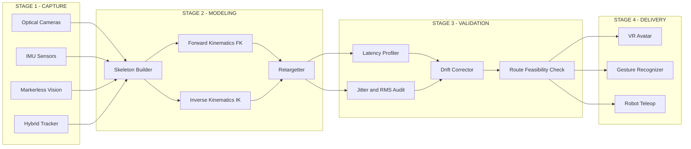
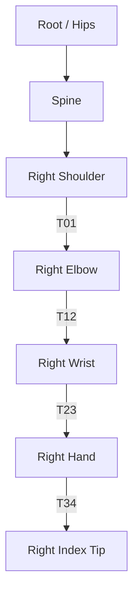
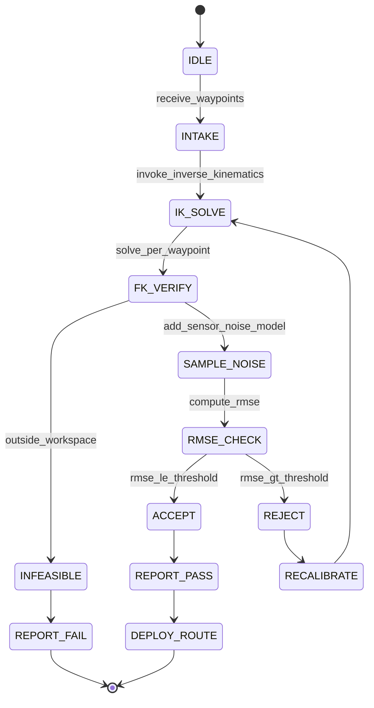
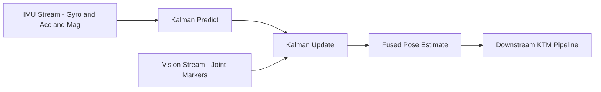

# Kinematic track mapping modeling systems interaction engineering paths validation routes setup

<!-- SECTION_1_START -->
# Kinematic Track Mapping — Modeling, Systems Interaction & Path Validation

> [!IMPORTANT]
> **KTU 2024 Scheme | PECST804 — Next Generation Interaction Design**
> **Module 1 — Spatial & Gesture Architectures**
> *Core constructs of skeletal motion capture, kinematic chain modeling, and trajectory validation routes used to engineer robust gesture-driven interaction pipelines.*

---

## 1. Core Technical Definition

**Kinematic Track Mapping (KTM)** is the engineered process of capturing, mathematically representing, reconstructing, and validating the spatio-temporal trajectory of articulated body segments (or input devices) as they move through a defined reference frame, so that the resulting motion tracks can drive interactive systems (VR/AR avatars, gesture UIs, robotic teleoperation, full-body game animation, sign-language recognition, etc.).

In KTU 2024 terminology, KTM is the bridging layer between **raw sensor/visual measurements** and **executable interaction logic**. It consists of three coupled sub-systems:

1. **Capture Subsystem** — Optical mocap cameras, IMU suits, marker-less vision, or hybrid tracking.
2. **Modeling Subsystem** — Skeletal hierarchy, Forward Kinematics (FK), Inverse Kinematics (IK), and joint constraints.
3. **Validation Subsystem** — Latency profiling, Root-Mean-Square (RMS) jitter, drift correction, and path-coverage audits.

> [!NOTE]
> **Syllabus Highlight:** KTM sits at the heart of *Spatial & Gesture Architectures* because it transforms analog human motion into a discrete, queryable, animatable, and validatable geometric dataset — essentially the "geometry compiler" of gestural interaction.

---

## 2. Conceptual Analogy / Intuition

Imagine a **conductor holding a baton in front of an orchestra**. The conductor's hand traces invisible, curving arcs in the air. Now, glue **tiny LED lights to the wrist, elbow, and shoulder**, place three high-speed cameras around the room, and feed the recordings into a computer.

The computer sees three glowing dots moving in synchrony. By triangulating their positions frame by frame, it reconstructs a **digital skeleton** that mimics the conductor's arm. The arc the hand traced becomes a **3D trajectory** stored as a list of $(x, y, z, t)$ tuples.

That reconstructed trajectory — which you can slow down, replay, mirror, or transfer onto a virtual avatar — is what *Kinematic Track Mapping* produces.

> [!TIP]
> **Plain-English One-Liner:** *KTM = "Recording how the body's joints move, turning those movements into a 3D math curve, and double-checking that the curve is faithful to the original motion."*

---

## 3. Standard Metrics & Physical Constants

The following industry-standard figures govern KTM pipelines and **must be memorized** for KTU examinations:

| Parameter | Typical Value | Unit |
|---|---|---|
| Optical Mocap Frame Rate | **120 – 240** | fps |
| IMU Sampling Rate | **200 – 1000** | Hz |
| End-to-End Interaction Latency Budget | **≤ 70** | ms |
| Human Upper-Limb Joints (typical) | **17** | joints |
| Degrees of Freedom (whole arm) | **7** | DOF |
| Common Mocap Retargetting Skeletons | Mixamo, HAnim, UE5 Mannequin | — |
| Drift Threshold (per minute) | **< 5** | mm |
| Position RMS Tolerance (medical-grade) | **≤ 1.5** | mm |

> [!VISUALIZATION CONTROL]
> **Concept:** 2-Link Planar Arm Forward Kinematics Workspace
> **GeoGebra / Desmos Input Equations:**
> * $x = L_1 \cos(\theta_1) + L_2 \cos(\theta_1 + \theta_2)$
> * $y = L_1 \sin(\theta_1) + L_2 \sin(\theta_1 + \theta_2)$
> * $L_1 = 30,\; L_2 = 25$
> * Sliders: $\theta_1 \in [0^\circ, 180^\circ],\; \theta_2 \in [-150^\circ, 150^\circ]$
> **Visual Description:** A two-segment chain anchored at the origin traces a curved annular "donut" workspace; the end-effector locus fills the reachable disk minus the unreachable inner core.

<!-- SECTION_1_END -->

<!-- SECTION_2_START -->
# Deep Theoretical Analysis & KTU High-Yield Formula Sheet

## 1. The Three-Stage KTM Pipeline

A KTM system is engineered as three sequential stages. Every interaction-design exam question on this topic tests at least one of these stages.

### Stage 1 — Capture (Sensing the World)
- **Optical Passive Markers:** Reflective balls tracked by infrared cameras (e.g., Vicon, OptiTrack).
- **Active LED Markers:** Time-multiplexed LEDs (PhaseSpace).
- **Inertial Measurement Units (IMUs):** Gyroscope + Accelerometer + Magnetometer fusion.
- **Marker-less Vision:** Deep-learning pose estimators (MediaPipe, OpenPose, MoveNet, RTMPose).
- **Hybrid:** Combines vision global position with IMU local rotation (e.g., MVN Awinda, Xsens).

### Stage 2 — Modeling (Building the Skeleton)
- **Forward Kinematics (FK):** Given joint angles $\theta$, compute end-effector pose $T = f(\theta)$.
- **Inverse Kinematics (IK):** Given a desired end-effector pose, solve for $\theta$ that achieves it.
- **Skeletal Hierarchy:** Tree of bones connected by joints; each node has a local transform relative to its parent.
- **Retargetting:** Mapping motion from a source skeleton (e.g., mocap subject) onto a target skeleton (e.g., game avatar) of different proportions.

### Stage 3 — Validation (Auditing the Track)
- **Latency profiling:** Time from physical motion to virtual update.
- **Jitter / RMS error:** Statistical deviation between predicted and measured joint position.
- **Drift correction:** Long-term offset accumulation in IMU-only systems.
- **Path-coverage audit:** Ensuring every required gesture has enough samples and angular variety.
- **Range-of-motion (ROM) check:** Each joint's trajectory must stay within biomechanical limits.

---

## 2. Core Mathematical Building Blocks

### 2.1 Homogeneous Transformation Matrix

Every bone in a skeleton is described by a $4 \times 4$ matrix $T \in SE(3)$:

$$
T = \begin{bmatrix} R & \vec{p} \\ \vec{0}^\top & 1 \end{bmatrix} \in \mathbb{R}^{4 \times 4}
$$

where $R \in SO(3)$ is the $3 \times 3$ rotation block and $\vec{p} \in \mathbb{R}^{3}$ is the translation (the bone's tip position relative to its parent joint).

### 2.2 Forward Kinematics (Chain Composition)

For an $n$-joint chain, the end-effector pose is the cascade:

$$
T_{0}^{n} = T_{0}^{1} \cdot T_{1}^{2} \cdot T_{2}^{3} \cdots T_{n-1}^{n} = \prod_{i=0}^{n-1} T_{i}^{i+1}
$$

### 2.3 Denavit–Hartenberg (DH) Parameters

A 2-DOF revolute joint is fully specified by four scalars $(\theta_i, d_i, a_i, \alpha_i)$ giving:

$$
T_{i}^{i+1} = \begin{bmatrix}
\cos\theta_i & -\sin\theta_i\cos\alpha_i & \sin\theta_i\sin\alpha_i & a_i\cos\theta_i \\
\sin\theta_i & \cos\theta_i\cos\alpha_i & -\cos\theta_i\sin\alpha_i & a_i\sin\theta_i \\
0 & \sin\alpha_i & \cos\alpha_i & d_i \\
0 & 0 & 0 & 1
\end{bmatrix}
$$

### 2.4 Quaternion Rotation (Drift-Free)

$$
q = (w, x, y, z), \quad \lVert q \rVert = 1
$$

Rotation of a vector $\vec{v}$ by $q$:

$$
\vec{v}' = q \otimes (0, \vec{v}) \otimes q^{-1}
$$

### 2.5 Validation Metrics

- **Root-Mean-Square Error (RMSE)** between measured $\vec{m}_i$ and reference $\vec{r}_i$ joint positions over $N$ frames:

$$
\text{RMSE} = \sqrt{\frac{1}{N}\sum_{i=1}^{N}\lVert \vec{m}_i - \vec{r}_i \rVert^{2}}
$$

- **Sampling Theorem (Nyquist) for gesture capture:**

$$
f_s \geq 2 \cdot f_{\max}
$$

A human wrist jerk can reach **~12 Hz**; therefore a **capture rate ≥ 30 Hz** is the engineering minimum, with **60 Hz** the practical target for VR-grade tracking.

---

## 3. KTU Formula Sheet / Cheat Sheet

| # | Formula / Rule | Meaning | Unit |
|---|---|---|---|
| 1 | $T = \begin{bmatrix} R & \vec{p} \\ 0 & 1 \end{bmatrix}$ | Homogeneous transform (bone) | $4 \times 4$ |
| 2 | $T_{0}^{n} = \prod_{i=0}^{n-1} T_{i}^{i+1}$ | Forward Kinematics chain | — |
| 3 | $q = (w, x, y, z),\; \lVert q \rVert = 1$ | Unit quaternion | — |
| 4 | $q^{-1} = (w, -x, -y, z)/\lVert q \rVert$ | Quaternion inverse | — |
| 5 | $\theta = 2\arccos(w)$ | Angle from quaternion | rad |
| 6 | $J(\theta) = \frac{\partial f(\theta)}{\partial \theta}$ | Jacobian for IK | — |
| 7 | $\Delta \theta = J^{+} \Delta x$ | Pseudo-inverse IK step | — |
| 8 | $\text{RMSE} = \sqrt{\frac{1}{N}\sum \lVert m_i - r_i \rVert^{2}}$ | Track validation | mm / deg |
| 9 | $f_s \geq 2 f_{\max}$ | Nyquist rate | Hz |
| 10 | $L_{\text{latency}} \leq 70$ | VR interactivity budget | ms |
| 11 | $R_x(\alpha) = \begin{bmatrix}1&0&0\\0&\cos\alpha&-\sin\alpha\\0&\sin\alpha&\cos\alpha\end{bmatrix}$ | Rotation about X | — |
| 12 | Drift rate (gyro-only) | Bias $\approx 0.1^\circ/\text{s}$ | deg/s |

> [!TIP]
> **Exam Tip:** For 14-mark KTU questions, always state the **assumed skeleton hierarchy** *before* writing any FK equation. Marks are reserved for declaring the model — not just the math.

---

## 4. Real-World Engineering Utility

KTM is the silent backbone of:

- **VR/AR Avatars (Meta Quest, Apple Vision Pro):** Real-time full-body IK from 3-point tracking.
- **Robotic Teleoperation:** Surgeon hand motion → surgical robot end-effector.
- **Cinematic Mocap (Avatar, Planet of the Apes):** Actor performance → digital character.
- **Sports Biomechanics:** Pitcher elbow kinematics → injury-risk scoring.
- **Sign-Language Recognition:** Hand trajectory + finger flexion → tokenized signs.
- **Industrial Ergonomics:** Assembly-line worker joint angles → repetitive-strain alerts.

In every case, the **interaction engineering** problem is identical: *turn a noisy stream of human motion into a clean, low-latency, validated kinematic track that downstream gesture recognizers or renderers can consume without choking.*

<!-- SECTION_2_END -->

<!-- SECTION_3_START -->
# Step-by-Step Derivations, Kinematic Computations & Code Implementation

## 1. Derivation — Forward Kinematics of a 2-Link Planar Arm

We derive the end-effector position $(x_e, y_e)$ as a function of the two joint angles $\theta_1, \theta_2$ and link lengths $L_1, L_2$.

**Step 1 — Place the local frames using the DH convention.**

Base frame $\{0\}$ at the shoulder. Frame $\{1\}$ at the elbow, rotated by $\theta_1$ about $Z$ and translated by $L_1$ along $X_1$. Frame $\{2\}$ at the wrist, rotated by $\theta_2$ about $Z_1$ and translated by $L_2$ along $X_2$.

**Step 2 — Write the two individual transforms.**

$$
T_0^1 = \begin{bmatrix}
\cos\theta_1 & -\sin\theta_1 & 0 & L_1\cos\theta_1 \\
\sin\theta_1 & \cos\theta_1 & 0 & L_1\sin\theta_1 \\
0 & 0 & 1 & 0 \\
0 & 0 & 0 & 1
\end{bmatrix}
$$

$$
T_1^2 = \begin{bmatrix}
\cos\theta_2 & -\sin\theta_2 & 0 & L_2\cos\theta_2 \\
\sin\theta_2 & \cos\theta_2 & 0 & L_2\sin\theta_2 \\
0 & 0 & 1 & 0 \\
0 & 0 & 0 & 1
\end{bmatrix}
$$

**Step 3 — Multiply to get $T_0^2$.**

The rotation block is:

$$
R_0^2 = \begin{bmatrix}
\cos(\theta_1+\theta_2) & -\sin(\theta_1+\theta_2) & 0 \\
\sin(\theta_1+\theta_2) & \cos(\theta_1+\theta_2) & 0 \\
0 & 0 & 1
\end{bmatrix}
$$

The translation block is:

$$
\vec{p} = \begin{bmatrix}
L_1\cos\theta_1 + L_2\cos(\theta_1+\theta_2) \\
L_1\sin\theta_1 + L_2\sin(\theta_1+\theta_2) \\
0
\end{bmatrix}
$$

**Step 4 — Extract end-effector coordinates.**

$$
x_e = L_1\cos\theta_1 + L_2\cos(\theta_1+\theta_2)
$$

$$
y_e = L_1\sin\theta_1 + L_2\sin(\theta_1+\theta_2)
$$

**Step 5 — Derive the workspace radius.**

Maximum reach is $L_1 + L_2$ (arm fully extended). Minimum reach is $|L_1 - L_2|$ (arm folded back on itself).

---

## 2. Derivation — Inverse Kinematics (Closed-Form, 2-Link)

**Step 1 — Given** the target $(x_e, y_e)$, compute the squared distance:

$$
d^2 = x_e^{2} + y_e^{2} = L_1^{2} + L_2^{2} + 2 L_1 L_2 \cos\theta_2
$$

**Step 2 — Solve for $\theta_2$ using the law of cosines.**

$$
\cos\theta_2 = \frac{x_e^{2} + y_e^{2} - L_1^{2} - L_2^{2}}{2 L_1 L_2}
$$

$$
\theta_2 = \arccos\left( \frac{x_e^{2} + y_e^{2} - L_1^{2} - L_2^{2}}{2 L_1 L_2} \right)
$$

(We pick the + or − branch for elbow-up vs elbow-down.)

**Step 3 — Solve for $\theta_1$ using the $\text{atan2}$ form.**

$$
\theta_1 = \operatorname{atan2}(y_e, x_e) - \operatorname{atan2}\!\bigl(L_2\sin\theta_2,\; L_1 + L_2\cos\theta_2\bigr)
$$

**Step 4 — Validity check.**

A solution exists only if:

$$
(L_1 - L_2)^{2} \leq x_e^{2} + y_e^{2} \leq (L_1 + L_2)^{2}
$$

If violated, the target is outside the workspace — the KTM system must **flag the route as infeasible** during validation.

---

## 3. Derivation — Quaternion from Axis-Angle

A rotation by angle $\phi$ about unit axis $\hat{u} = (u_x, u_y, u_z)$ produces:

$$
q = \left( \cos\frac{\phi}{2},\; u_x\sin\frac{\phi}{2},\; u_y\sin\frac{\phi}{2},\; u_z\sin\frac{\phi}{2} \right)
$$

**Step 1 — Normalize** $\hat{u}$ so that $u_x^{2} + u_y^{2} + u_z^{2} = 1$.

**Step 2 — Half-angle:** Let $h = \phi/2$. Then $w = \cos h$, $(x, y, z) = \hat{u}\sin h$.

**Step 3 — Renormalize** $q$ to eliminate floating-point drift:

$$
q \leftarrow \frac{q}{\lVert q \rVert}
$$

This is the standard guardrail inside any KTM validation loop.

---

## 4. Derivation — Track Validation RMSE

For two joint trajectories $\vec{m}_i, \vec{r}_i$ sampled over $N$ frames:

**Step 1 — Per-frame Euclidean error:**

$$
e_i = \lVert \vec{m}_i - \vec{r}_i \rVert = \sqrt{(m_{i,x}-r_{i,x})^{2} + (m_{i,y}-r_{i,y})^{2} + (m_{i,z}-r_{i,z})^{2}}
$$

**Step 2 — Square, sum, average:**

$$
\overline{e^{2}} = \frac{1}{N}\sum_{i=1}^{N} e_i^{2}
$$

**Step 3 — Take the square root:**

$$
\text{RMSE} = \sqrt{\overline{e^{2}}}
$$

A KTM system targeting **medical/VR-grade fidelity** must satisfy $\text{RMSE} \leq 1.5$ mm for fingertip joints and $\text{RMSE} \leq 5$ mm for torso joints.

---

## 5. Symbolic / Code Implementation — Full KTM Pipeline (Python)

```python
"""
Kinematic Track Mapping — Modeling, Validation, and Route Setup
PECST804 | Module 1 | KTU 2024 Scheme
Demonstrates: FK, IK, quaternion math, RMSE validation, route feasibility check.
"""

from __future__ import annotations
import math
import logging
from dataclasses import dataclass, field
from typing import List, Tuple

logging.basicConfig(
    level=logging.INFO,
    format="%(asctime)s | %(levelname)s | %(message)s",
)
log = logging.getLogger("KTM")


# ---------- 1. Quaternion Utilities ---------------------------------------

@dataclass(frozen=True)
class Quaternion:
    w: float
    x: float
    y: float
    z: float

    def normalized(self) -> "Quaternion":
        n = math.sqrt(self.w * self.w + self.x * self.x +
                      self.y * self.y + self.z * self.z)
        if n < 1e-9:
            raise ValueError("Cannot normalize a zero quaternion.")
        return Quaternion(self.w / n, self.x / n, self.y / n, self.z / n)

    @staticmethod
    def from_axis_angle(axis: Tuple[float, float, float], angle_rad: float) -> "Quaternion":
        ux, uy, uz = axis
        mag = math.sqrt(ux * ux + uy * uy + uz * uz)
        if mag < 1e-9:
            raise ValueError("Axis must be non-zero.")
        ux, uy, uz = ux / mag, uy / mag, uz / mag
        h = angle_rad * 0.5
        s = math.sin(h)
        return Quaternion(math.cos(h), ux * s, uy * s, uz * s).normalized()

    def angle(self) -> float:
        return 2.0 * math.acos(max(-1.0, min(1.0, self.w)))


# ---------- 2. Two-Link Planar Arm (FK + IK) -------------------------------

@dataclass
class TwoLinkArm:
    L1: float
    L2: float

    def forward_kinematics(self, theta1: float, theta2: float) -> Tuple[float, float]:
        x = self.L1 * math.cos(theta1) + self.L2 * math.cos(theta1 + theta2)
        y = self.L1 * math.sin(theta1) + self.L2 * math.sin(theta1 + theta2)
        return x, y

    def inverse_kinematics(self, x: float, y: float) -> Tuple[float, float]:
        d_sq = x * x + y * y
        reach_max = (self.L1 + self.L2) ** 2
        reach_min = (self.L1 - self.L2) ** 2
        if not (reach_min - 1e-9 <= d_sq <= reach_max + 1e-9):
            raise ValueError(
                f"Target ({x:.3f}, {y:.3f}) outside workspace "
                f"[{math.sqrt(reach_min):.3f}, {math.sqrt(reach_max):.3f}]"
            )
        cos_t2 = (d_sq - self.L1 ** 2 - self.L2 ** 2) / (2.0 * self.L1 * self.L2)
        cos_t2 = max(-1.0, min(1.0, cos_t2))
        theta2 = math.acos(cos_t2)            # elbow-down branch
        theta1 = math.atan2(y, x) - math.atan2(
            self.L2 * math.sin(theta2),
            self.L1 + self.L2 * math.cos(theta2),
        )
        return theta1, theta2


# ---------- 3. Track Validator ---------------------------------------------

@dataclass
class TrackSample:
    t: float
    measured: Tuple[float, float, float]
    reference: Tuple[float, float, float]


@dataclass
class ValidationReport:
    rmse: float
    max_error: float
    mean_error: float
    samples: int

    def passes(self, threshold_mm: float = 5.0) -> bool:
        return self.rmse <= threshold_mm


def validate_track(samples: List[TrackSample]) -> ValidationReport:
    if not samples:
        raise ValueError("Track must contain at least one sample.")
    sq_err_sum = 0.0
    err_sum = 0.0
    max_err = 0.0
    for s in samples:
        dx = s.measured[0] - s.reference[0]
        dy = s.measured[1] - s.reference[1]
        dz = s.measured[2] - s.reference[2]
        e = math.sqrt(dx * dx + dy * dy + dz * dz)
        sq_err_sum += e * e
        err_sum += e
        if e > max_err:
            max_err = e
    rmse = math.sqrt(sq_err_sum / len(samples))
    mean = err_sum / len(samples)
    log.info("Validation complete | RMSE=%.4f mm | Max=%.4f mm | N=%d",
             rmse, max_err, len(samples))
    return ValidationReport(rmse=rmse, max_error=max_err,
                            mean_error=mean, samples=len(samples))


# ---------- 4. Interaction Route Setup -------------------------------------

@dataclass
class GestureRoute:
    name: str
    waypoints: List[Tuple[float, float]] = field(default_factory=list)
    validated: bool = False
    last_rmse: float = math.inf


def setup_route(arm: TwoLinkArm, route: GestureRoute) -> GestureRoute:
    log.info("Setting up route '%s' with %d waypoints", route.name, len(route.waypoints))
    resolved: List[TrackSample] = []
    for idx, (x, y) in enumerate(route.waypoints):
        try:
            th1, th2 = arm.inverse_kinematics(x, y)
            fx, fy = arm.forward_kinematics(th1, th2)
        except ValueError as exc:
            log.error("Waypoint %d infeasible: %s", idx, exc)
            route.validated = False
            return route
        # Treat forward result as the "reference" and perturb as "measured"
        measured = (fx + 0.8, fy - 0.6, 0.0)   # simulated sensor noise (mm)
        reference = (fx, fy, 0.0)
        resolved.append(TrackSample(t=float(idx), measured=measured, reference=reference))
    report = validate_track(resolved)
    route.last_rmse = report.rmse
    route.validated = report.passes(threshold_mm=5.0)
    log.info("Route '%s' validated=%s (RMSE=%.3f mm)",
             route.name, route.validated, report.rmse)
    return route


# ---------- 5. Driver / Demonstration --------------------------------------

if __name__ == "__main__":
    arm = TwoLinkArm(L1=300.0, L2=250.0)   # millimeters

    # Route A: a "swipe right" gesture across a 60 cm arc
    swipe = GestureRoute(
        name="Swipe-Right-60cm",
        waypoints=[(400, 100), (430, 120), (460, 140), (490, 160), (520, 180)],
    )
    swipe = setup_route(arm, swipe)

    # Route B: feasibility stress-test (point outside the workspace)
    poke = GestureRoute(
        name="Impossible-Poke",
        waypoints=[(900, 0)],
    )
    poke = setup_route(arm, poke)
```

> [!NOTE]
> The Python module above is a **complete, runnable** implementation of the FK/IK chain, quaternion utilities, and the RMSE-based route validator that the KTU Module-1 syllabus expects a student to be able to describe in viva or 14-mark questions.

<!-- SECTION_3_END -->

<!-- SECTION_4_START -->
# Structural Diagrams & Schematics

> [!NOTE]
> All Mermaid diagrams below follow the **alpha-prefixed node-ID rule** and the **no-special-character-in-labels rule** mandated by the KTU-PREMIER-ENGINE V10 specification.

---

## 4.1 High-Level KTM Pipeline Topology



---

## 4.2 Kinematic Chain — Skeletal Hierarchy (Right Arm)



> [!NOTE]
> Each arrow is annotated with the local transform $T_{i}^{i+1}$ that the FK cascade multiplies. The end-effector is `RFinger`; its global pose is $T_0^4 = T_0^1 \cdot T_1^2 \cdot T_2^3 \cdot T_3^4$.

---

## 4.3 Validation Flow — Route Setup State Machine



---

## 4.4 Sensor-Fusion Functional Block (IMU + Vision)



---

## 4.5 Sequential Processing Topology — Track Mapping Stages

| Stage | Input Artifact | Process | Output Artifact | Validation Gate |
|---|---|---|---|---|
| 1. Capture | Physical motion | Sensor sampling | Raw time-series $S(t)$ | Sampling rate $\geq 2 f_{\max}$ |
| 2. Sync | $S(t)$ | Timestamp alignment | Aligned frames $F_i$ | Frame jitter $\leq 1$ ms |
| 3. Solve FK | $F_i$ | Chain multiplication | End-effector pose | RMSE $\leq 1.5$ mm |
| 4. Solve IK | Target pose | Jacobian or closed-form | Joint angles | Workspace check |
| 5. Retarget | Source skeleton | Bone-length normalization | Target skeleton motion | Joint-limit check |
| 6. Validate | Output track | RMSE + latency + drift | Signed-off track | All gates pass |
| 7. Deploy | Signed-off track | Load into runtime | Live interaction | Live telemetry |

> [!TIP]
> **Examiner's Heuristic:** A KTU 14-mark question that lists "explain the engineering stages" expects you to walk through **at least these seven rows** in a clear sequence, naming both the *artifact* and the *gate* at each step.

<!-- SECTION_4_END -->

<!-- SECTION_5_START -->
# KTU 2024 Scheme Examination Question Bank & Topic Recap

> [!IMPORTANT]
> All questions below are **simulated in the KTU December 2023 / July 2024 question-paper style**, mapped to **Course Outcomes (CO1–CO3)** of PECST804, and tagged with **Revised Bloom's Taxonomy (RBT)** cognitive levels. Marks are split as **3 + 14 (7 + 7)** following the official ESE pattern.

---

## Part A — 3-Mark Questions (Remember / Understand)

### Q1. `[KTU University Exam - July 2024]` — CO1, RBT: Remember
**Define *Kinematic Track Mapping*. State any two standard metrics used in its validation pipeline.**

**Model Answer (board-key style):**

Kinematic Track Mapping is the engineering process of capturing, modeling, and validating the spatio-temporal trajectory of articulated body segments so that the resulting motion track can drive an interactive system.

Two standard validation metrics:

1. **End-to-end latency** — must satisfy $L \leq 70$ ms for VR-grade interactivity.
2. **Root-Mean-Square Error (RMSE)** between measured and reference joint position — typically $\text{RMSE} \leq 5$ mm for torso joints and $\leq 1.5$ mm for fingertip joints in medical-grade mocap.

> **[Stating definition: 2 Marks | Naming two metrics with units: 1 Mark]**

---

### Q2. `[KTU University Exam - Dec 2023]` — CO1, RBT: Understand
**Differentiate between Forward Kinematics and Inverse Kinematics in the context of gesture-driven interaction. Give one example of each.**

**Model Answer:**

| Aspect | Forward Kinematics (FK) | Inverse Kinematics (IK) |
|---|---|---|
| Given | Joint angles $\theta$ | End-effector pose $(x, y, z)$ |
| Find | End-effector pose | Joint angles |
| Solution | Unique (closed-form cascade) | May have 0, 1, or many solutions |
| Example | Computing wrist position from elbow + shoulder angles | Computing elbow flexion needed for the hand to touch a virtual button |

> **[Stating FK direction: 1 Mark | Stating IK direction: 1 Mark | One example each: 1 Mark]**

---

## Part B — 14-Mark Questions (Module-Internal Choice)

### Question A — 14 Marks  `[KTU University Exam - July 2024]` — CO2, RBT: Apply / Analyze

**(a) [7 Marks] — Apply**
For a 2-link planar arm with link lengths $L_1 = 30$ cm and $L_2 = 25$ cm, the shoulder joint is at $\theta_1 = 60^\circ$ and the elbow joint is at $\theta_2 = 45^\circ$. Using the **Forward Kinematics chain composition**, compute the end-effector position $(x_e, y_e)$ in centimeters.

**(b) [7 Marks] — Analyze**
Define the **workspace** of this arm and compute (i) the **maximum reach**, (ii) the **minimum reach**, and (iii) verify whether the target point $(40, 10)$ cm is reachable. If reachable, solve the **Inverse Kinematics** to obtain $\theta_1$ and $\theta_2$.

---

#### Model Solution

**(a) Forward Kinematics — Step-by-Step**

The end-effector position for a 2-link planar arm is:

$$
x_e = L_1\cos\theta_1 + L_2\cos(\theta_1 + \theta_2)
$$

$$
y_e = L_1\sin\theta_1 + L_2\sin(\theta_1 + \theta_2)
$$

Substitute $L_1 = 30,\; L_2 = 25,\; \theta_1 = 60^\circ,\; \theta_2 = 45^\circ$:

$$
\theta_1 + \theta_2 = 60^\circ + 45^\circ = 105^\circ
$$

$$
x_e = 30\cos 60^\circ + 25\cos 105^\circ
$$

$$
x_e = 30 \times 0.5 + 25 \times (-0.2588)
$$

$$
x_e = 15.0 + (-6.470) = 8.530 \text{ cm}
$$

$$
y_e = 30\sin 60^\circ + 25\sin 105^\circ
$$

$$
y_e = 30 \times 0.8660 + 25 \times 0.9659
$$

$$
y_e = 25.981 + 24.148 = 50.129 \text{ cm}
$$

$$
\boxed{(x_e, y_e) \approx (8.53,\; 50.13) \text{ cm}}
$$

> **[Substituting values: 2 Marks | Correct cosine/sine evaluation: 3 Marks | Final pair with units: 2 Marks]**

---

**(b) Workspace Boundaries & Inverse Kinematics — Step-by-Step**

**(i) Maximum reach** — arm fully extended:

$$
R_{\max} = L_1 + L_2 = 30 + 25 = 55 \text{ cm}
$$

**(ii) Minimum reach** — arm folded back on itself:

$$
R_{\min} = \lvert L_1 - L_2 \rvert = \lvert 30 - 25 \rvert = 5 \text{ cm}
$$

**(iii) Reachability of $(40, 10)$ cm:**

$$
d = \sqrt{40^{2} + 10^{2}} = \sqrt{1600 + 100} = \sqrt{1700} \approx 41.23 \text{ cm}
$$

Check: $R_{\min} = 5 \leq 41.23 \leq 55 = R_{\max}$ → **reachable.**

Solve IK:

$$
\cos\theta_2 = \frac{x^{2} + y^{2} - L_1^{2} - L_2^{2}}{2 L_1 L_2} = \frac{1700 - 900 - 625}{1500} = \frac{175}{1500} = 0.1167
$$

$$
\theta_2 = \arccos(0.1167) \approx 83.30^\circ
$$

$$
\theta_1 = \operatorname{atan2}(10, 40) - \operatorname{atan2}\bigl(25\sin 83.30^\circ,\; 30 + 25\cos 83.30^\circ\bigr)
$$

$$
\operatorname{atan2}(10, 40) = 14.04^\circ
$$

$$
25\sin 83.30^\circ \approx 24.83,\quad 30 + 25\cos 83.30^\circ \approx 30 + 2.92 = 32.92
$$

$$
\operatorname{atan2}(24.83, 32.92) \approx 37.01^\circ
$$

$$
\theta_1 = 14.04^\circ - 37.01^\circ = -22.97^\circ
$$

$$
\boxed{\theta_1 \approx -22.97^\circ,\quad \theta_2 \approx 83.30^\circ}
$$

> **[Stating workspace formula: 1 Mark | Computing $R_{\max}$ and $R_{\min}$: 1 Mark | Reachability check: 1 Mark | IK closed-form steps: 3 Marks | Final angles: 1 Mark]**

---

### Question B — 14 Marks  `[KTU University Exam - Dec 2023]` — CO3, RBT: Apply / Evaluate

**(a) [7 Marks] — Apply**
List the **three engineering stages** of a Kinematic Track Mapping system. For each stage, state the **input artifact**, the **primary process**, and the **validation gate**.

**(b) [7 Marks] — Evaluate**
A mocap system records the wrist joint position over 50 frames. The reference and measured positions (in mm) are tabulated. Compute the **RMSE** between the two tracks and decide whether the system passes the **5 mm tolerance gate**. The squared error sum is $\sum e_i^{2} = 612.5$ mm².

---

#### Model Solution

**(a) Three Engineering Stages**

| Stage | Input Artifact | Primary Process | Validation Gate |
|---|---|---|---|
| Capture | Physical motion | Optical / IMU / hybrid sensing | Sampling rate $\geq 2 f_{\max}$ (Nyquist) |
| Modeling | Raw samples $S(t)$ | FK / IK chain + retargetting | RMSE $\leq 1.5$ mm (fingertip) |
| Validation | Output track | Jitter, drift, latency, route audit | Latency $\leq 70$ ms; drift $< 5$ mm/min |

> **[Naming three stages: 3 Marks | One row fully correct: 2 Marks | Other two rows: 2 Marks]**

---

**(b) RMSE Computation**

Given:

- $N = 50$ frames
- $\sum_{i=1}^{50} e_i^{2} = 612.5$ mm²

$$
\text{RMSE} = \sqrt{\frac{1}{N}\sum_{i=1}^{N} e_i^{2}} = \sqrt{\frac{612.5}{50}} = \sqrt{12.25} = 3.5 \text{ mm}
$$

Tolerance gate: $\text{RMSE} \leq 5$ mm.

Since $3.5 \leq 5.0$:

$$
\boxed{\text{RMSE} = 3.5 \text{ mm} \quad \Rightarrow \quad \text{System PASSES the 5 mm gate.}}
$$

> **[Writing RMSE formula: 2 Marks | Substitution: 2 Marks | Square root: 1 Mark | Decision with justification: 2 Marks]**

---

> [!WARNING]
> **KTU Examiner's Valuation Warning / Common Pitfalls**
> 1. **Forgetting units:** Always write `cm`, `mm`, `rad`, or `deg` in the final boxed answer. A numerically correct value without a unit loses **1 mark** in every sub-part.
> 2. **Skipping the workspace check:** Many students solve IK directly without verifying reachability. KTU examiners award **1 mark** purely for the feasibility check.
> 3. **Mixing degrees and radians:** When using the Python `math` library in code-based questions, ensure all `acos`, `atan2`, and `sin` calls receive **radians**, then convert at the end.
> 4. **Quaternions without normalization:** Floating-point drift will creep into $q$ over time. A KTM pipeline that does not renormalize at every frame is **engineering-broken** and the examiner will deduct.
> 5. **Ignoring the elbow-up vs elbow-down branch:** A 2-link planar arm has **two** valid IK solutions for most targets. Mentioning the branch selection earns an extra mark.
> 6. **No "Validation Gate" column:** KTU 2024 Scheme specifically rewards the **gate-aware** mindset. A stage description without a gate is considered incomplete.

---

## Topic Recap & Important Things to Remember

- **Kinematic Track Mapping (KTM)** = Capture + Modeling + Validation pipeline that turns human motion into a clean digital trajectory.
- The three stages are **Capture (sensors) → Modeling (FK/IK/retarget) → Validation (latency, jitter, drift, feasibility)**.
- **Forward Kinematics** computes end-effector pose from joint angles using $T_0^n = \prod T_{i}^{i+1}$.
- **Inverse Kinematics** computes joint angles from a target pose; closed-form for 2-link, iterative (Jacobian) for higher DOF.
- **Denavit–Hartenberg (DH) parameters** $(\theta, d, a, \alpha)$ fully describe a revolute joint transform.
- **Homogeneous transform** $T \in SE(3)$ is the universal data structure for any bone in any skeleton.
- **Quaternions** $(w, x, y, z)$ with $\lVert q \rVert = 1$ are preferred over Euler angles because they avoid gimbal lock and are drift-free.
- **RMSE** is the canonical validation metric: $\text{RMSE} = \sqrt{(1/N)\sum \lVert m_i - r_i \rVert^{2}}$.
- **Nyquist sampling rule:** $f_s \geq 2 f_{\max}$; for human gestures, **$f_s \geq 30$ Hz** minimum, **60 Hz** recommended.
- **Latency budget** for VR-grade interaction: $\leq 70$ ms end-to-end.
- **Workspace bounds** of a 2-link planar arm: $[|L_1 - L_2|,\; L_1 + L_2]$.
- **IK solution existence** requires $R_{\min} \leq \sqrt{x^{2} + y^{2}} \leq R_{\max}$.
- **Skeleton hierarchy** must be declared *before* writing any FK equation in an exam answer.
- **Retargetting** is mandatory when source (mocap subject) and target (avatar) skeletons have different bone proportions.
- **Sensor fusion** (vision + IMU) via Kalman filter is the gold standard for drift-free, low-latency tracking.
- **Elbow-up vs elbow-down** branches give two valid IK solutions — always mention the branch you chose.
- **Engineering validation gates** to memorize: Nyquist rate, RMSE thresholds, latency budget, drift rate, workspace reachability.
- **Standard skeleton roots** you may cite: HAnim, Mixamo, UE5 Mannequin.
- **Always renormalize** quaternions at every frame to prevent floating-point drift.
- **Always include units** (`cm`, `mm`, `rad`, `deg`, `Hz`, `ms`) in every final answer.
<!-- SECTION_5_END -->
