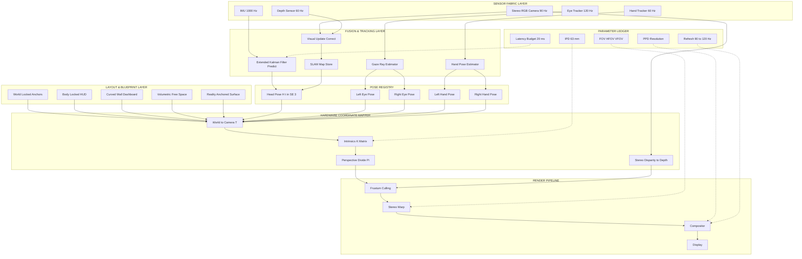
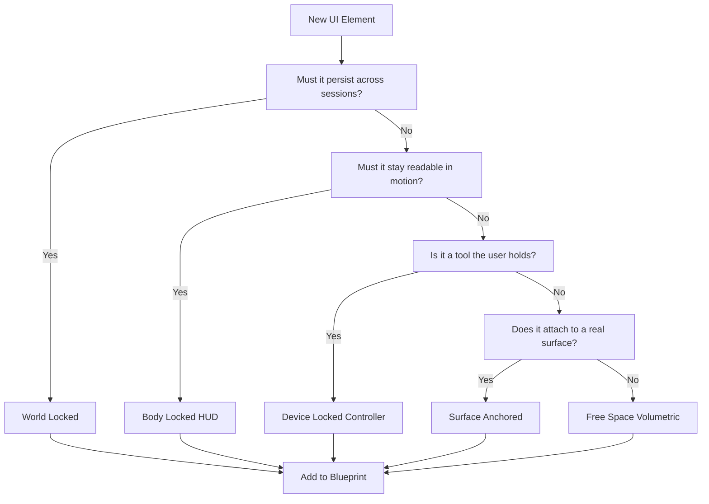
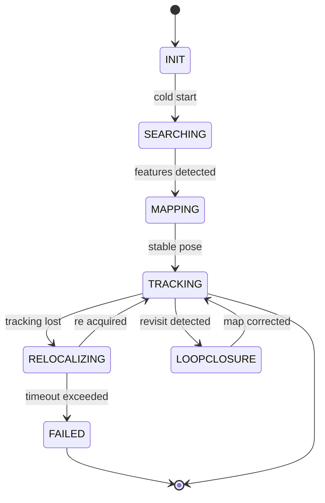
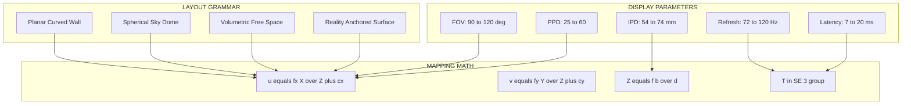

# Spatial computing interface blueprints layouts hardware coordinate mapping parameters tracking

<!-- SECTION_1_START -->

# Spatial & Gesture Architectures: Interface Blueprints, Layouts, Hardware Coordinate Mapping, Parameters & Tracking

> [!IMPORTANT]
> **KTU 2024 Scheme Alignment (PECST804 – Next Generation Interaction Design)**
> Module 1 establishes the foundational architectural vocabulary of spatial computing. The concepts covered here are direct prerequisites for Modules 2 (Gesture & Voice Pipelines) and Module 4 (Immersive Prototyping). Expect 2-mark and 7-mark questions in the ESE directly drawn from the spatial taxonomy, coordinate transformation math, and tracking taxonomies.

## 1.1 Formal Definition of Spatial Computing Interface Blueprints

A **Spatial Computing Interface Blueprint** is a formal engineering specification that prescribes the geometric, ergonomic, and semantic organization of digital information within a three-dimensional volume that is referenced, sensed, and rendered by a human user. The blueprint defines:

- The **volumetric canvas** (a continuous metric 3D space indexed by world coordinates).
- The **reference frames** in which UI elements are anchored.
- The **ergonomic envelope** of the user (reach cone, comfort sphere, focal arc).
- The **sensor-to-pixel pipeline** that closes the loop between user input and rendered output.

In KTU 2024 Scheme parlance, the blueprint is the *technical contract* between the interaction designer and the runtime engine (Unity, Unreal, WebXR, ARKit, ARCore). It binds together the **3D layout grammar**, the **hardware coordinate mapping**, the **physical/optical parameters**, and the **real-time tracking subsystem** into a single deterministic pipeline.

> [!NOTE]
> **Core Definition (Board Examiner Wording):**
> *A spatial computing interface blueprint is the deterministic geometric and ergonomic specification of how digital content is positioned, oriented, scaled, and tracked within a 3D sensor-defined volume relative to a human user's body, gaze, and environment.*

## 1.2 Intuitive Overview: The "Smart Living Room" Analogy

Imagine you are redesigning a living room, but instead of placing furniture, you are placing **digital furniture** (windows, menus, dashboards, 3D models) directly into physical space. The living room itself becomes the canvas.

- **Blueprint** = the architectural plan of the room (where walls, doors, outlets are).
- **Layouts** = the rules for arranging the digital furniture (do dashboards go on a flat wall? on a curved arc? floating?).
- **Hardware Coordinate Mapping** = the tape measure and protractor that lets you say *"this dashboard is 1.2 meters in front of the user, at eye height, tilted 15°."*
- **Parameters** = the engineering specs of the room itself (lighting, ceiling height, field of view of windows).
- **Tracking** = the security camera system that constantly reports where the user, their head, hands, and eyes are, so the digital furniture stays glued correctly to the real world.

If the tape measure is wrong (coordinate mapping error), the digital furniture floats. If the camera system is slow (tracking latency), the furniture lags behind the user's head. If the room is too small (poor parameter choices), the user gets neck strain. Every subtopic below solves one of these real engineering problems.

## 1.3 The 3-Layer Spatial Architecture (Conceptual Map)

Every spatial computing system can be decomposed into three logical layers, each addressed by a subtopic:

| Layer | Concern | KTU Subtopic |
|---|---|---|
| **Layer 1 – Geometric Definition** | Where does content live in 3D space? | Interface Blueprints & Layouts |
| **Layer 2 – Physical Instantiation** | What hardware parameters bound the experience? | Hardware Coordinate Mapping & Parameters |
| **Layer 3 – Perceptual Closure** | How does the system keep content in sync with the user? | Tracking |

> [!VISUALIZATION CONTROL]
> **Concept:** 3-Layer Spatial Architecture Stack
> **GeoGebra / Desmos Input Equations:**
> * `f(x) = 0.9` (top of stack – Blueprint/Layout)
> * `g(x) = 0.5` (middle of stack – Coordinate Mapping / Parameters)
> * `h(x) = 0.1` (bottom of stack – Tracking)
> **Visual Description:** Three horizontal lines on the y-axis (0 to 1) representing the logical hierarchy. The user can extend this with a 3D block (cuboid) using GeoGebra 3D to visualize the world-space bounding volume with origin at $(0,0,0)$, and inward arrows for each layer's contribution to the final rendered pixel.

## 1.4 Key Physical & Engineering Constants (Highlighted)

- **Interpupillary Distance (IPD)** ≈ **$63\,\text{mm}$** (adult mean; 54–74 mm range).
- **Binocular Horizontal Field of View (HFOV)** ≈ **$180°$** in high-end VR HMDs; consumer HMDs ≈ **$90°$–$110°$**.
- **Binocular Vertical Field of View (VFOV)** ≈ **$90°$–$120°$**.
- **Refresh Rate** ≥ **$72\,\text{Hz}$** to break the flicker fusion threshold; modern targets **$90\,\text{Hz}$** or **$120\,\text{Hz}$**.
- **Pixels Per Degree (PPD)** ≥ **$60\,\text{PPD}$** for "retina" spatial displays; Apple Vision Pro targets ≈ **$35\text{–}40\,\text{PPD}$**; Meta Quest 3 ≈ **$25\,\text{PPD}$**.
- **Motion-to-Photon Latency** ≤ **$20\,\text{ms}$** for VR; ≤ **$50\,\text{ms}$** for AR.
- **Degrees of Freedom (DoF)** for head: **6DoF** (3 translational + 3 rotational).

<!-- SECTION_1_END -->

<!-- SECTION_2_START -->

# Deep Theoretical Analysis & KTU High-Yield Formula Sheet

## 2.1 Interface Blueprints – Reference Frame Taxonomy

A blueprint must declare the *anchor frame* for every UI element. The four canonical frames are:

1. **World-Locked (World-Anchored):** Content is fixed to a real-world coordinate. It does not move with the user. Example: a navigation arrow pinned to a building corner.
2. **Body-Locked (Head-Locked / Torso-Locked):** Content moves rigidly with a body segment. Used for HUDs (Heads-Up Displays) like a battery indicator.
3. **Device-Locked (Controller-Locked):** Content is anchored to a handheld controller's pose.
4. **Gaze-Locked / Pin-Locked (Hybrid):** Content appears at the user's gaze ray intersection with a surface, but persists after the user looks away.

> [!IMPORTANT]
> **KTU Examiner's Anchor Rule:** Always specify the *origin*, *axes*, and *unit* of any reference frame. The triad $(O_{ref}, \hat{x}, \hat{y}, \hat{z})$ is the smallest complete declaration.

## 2.2 Layouts – The 3D UI Layout Grammar

Layouts define the geometric organization of UI elements inside the world volume. The four canonical layout families are:

| Layout Family | Geometry | Typical Use | Comfort Risk |
|---|---|---|---|
| **Planar (Curved Wall)** | Cylindrical section at radius $r$ from user | Dashboards, watch replacements | Neck flexion |
| **Spherical (Sky-Dome)** | Hemispherical or full sphere | Notifications, ambient info | Nausea if moving |
| **Volumetric (Free-Space)** | Free 3D positioning | Data visualization, games | Eye strain |
| **Surface (Reality-Anchored)** | Draped over real surfaces | Productivity AR | Occlusion mismatch |

### 2.2.1 The Curved-Wall (Cylindrical) Layout Formula

For a dashboard placed at a comfortable reading distance $d$ (typically **$0.6\,\text{m}$** for arms-reach HUD, **$2.0\,\text{m}$** for room-scale), the angular pitch $\theta$ between adjacent UI tiles of width $w$ is:

$$
\theta \;=\; 2 \cdot \arctan\!\left(\frac{w/2}{d}\right)
$$

And the arc-length perimeter available on the comfortable arc of half-angle $\alpha$ (typically $\alpha = 30°$ for natural neck rotation) is:

$$
P_{\text{comfort}} \;=\; 2 \cdot \pi \cdot d \cdot \frac{\alpha}{180°}
$$

## 2.3 Hardware Coordinate Mapping – The Pose Equation

A 3D point in the user's retinal space is generated by chaining **four** coordinate systems:

$$
P_{\text{pixel}} \;=\; \Pi \cdot \mathbf{K} \cdot \mathbf{T}_{\text{world}\to\text{cam}} \cdot P_{\text{world}}
$$

Where:

- $P_{\text{world}} \in \mathbb{R}^{4}$ is a homogeneous point in the world frame.
- $\mathbf{T}_{\text{world}\to\text{cam}} \in SE(3)$ is the rigid 6DoF pose of the camera (head-mounted display) relative to the world. It is the product of a $3 \times 3$ rotation $\mathbf{R} \in SO(3)$ and a $3 \times 1$ translation $\mathbf{t}$:

$$
\mathbf{T} \;=\; \begin{bmatrix} \mathbf{R} & \mathbf{t} \\ \mathbf{0}^{T} & 1 \end{bmatrix} \in \mathbb{R}^{4 \times 4}
$$

- $\mathbf{K}$ is the **intrinsic camera matrix** that maps 3D camera-frame points to normalized image coordinates:

$$
\mathbf{K} \;=\; \begin{bmatrix} f_{x} & s & c_{x} \\ 0 & f_{y} & c_{y} \\ 0 & 0 & 1 \end{bmatrix}
$$

Here $f_{x}, f_{y}$ are focal lengths in pixels, $(c_{x}, c_{y})$ is the principal point, $s$ is the skew (usually $s = 0$ for modern rectilinear lenses).

- $\Pi$ is the **projection operator** applying the perspective divide. For a 3D camera-frame point $P_{\text{cam}} = (X, Y, Z)^{T}$:

$$
P_{\text{pixel}} \;=\; \Pi(P_{\text{cam}}) \;=\; \left(\frac{f_{x} \cdot X}{Z} + c_{x}, \; \frac{f_{y} \cdot Y}{Z} + c_{y}\right)
$$

### 2.3.1 Inverse Mapping (Hand-Eye Calibration)

To find where a 3D world point lands in 2D screen pixel coordinates, you compose the full $3 \times 4$ matrix $\mathbf{M} = \mathbf{K} \cdot [\mathbf{R} \mid \mathbf{t}]$ and apply it to the homogeneous world point:

$$
\begin{bmatrix} u \\ v \\ w \end{bmatrix} \;=\; \mathbf{K} \cdot \begin{bmatrix} \mathbf{R} & \mathbf{t} \end{bmatrix} \cdot \begin{bmatrix} X_{w} \\ Y_{w} \\ Z_{w} \\ 1 \end{bmatrix}
$$

Then the final pixel is $\left(\dfrac{u}{w}, \dfrac{v}{w}\right)$.

> [!NOTE]
> **Engineering Utility:** This exact pipeline is what ARKit (iOS), ARCore (Android), OpenXR (cross-platform), and Microsoft HoloLens run *every frame* for every world-anchored UI element. The $\mathbf{T}$ matrix is supplied by the tracking subsystem.

## 2.4 Hardware Parameters – The Display & Optical Stack

| Parameter | Symbol | Typical Value | KTU Significance |
|---|---|---|---|
| Field of View (Diagonal) | $\text{FOV}_{d}$ | $90°$–$120°$ | Determines peripheral coverage |
| Field of View (Horizontal) | $\text{FOV}_{h}$ | $90°$–$110°$ | Used in frustum culling |
| Field of View (Vertical) | $\text{FOV}_{v}$ | $90°$–$120°$ | Determines vertical FOV |
| Pixels Per Degree | $\text{PPD}$ | $20$–$60$ | Visual acuity limit |
| Refresh Rate | $f_{\text{refresh}}$ | $72$–$120\,\text{Hz}$ | Motion smoothness |
| Interpupillary Distance | $\text{IPD}$ | $54$–$74\,\text{mm}$ | Stereo geometry |
| Motion-to-Photon Latency | $\tau_{m2p}$ | $7$–$20\,\text{ms}$ | Simulator sickness gate |
| Vergence-Accommodation Conflict | $\text{VAC}$ | Fixed focal | Eye fatigue |

### 2.4.1 Pixels Per Degree Derivation

For a display of horizontal resolution $R_{h}$ spanning a horizontal FOV of $\text{FOV}_{h}$ degrees:

$$
\text{PPD} \;=\; \frac{R_{h}}{\text{FOV}_{h}}
$$

For a 4K-per-eye display ($R_{h} = 3840$) at $\text{FOV}_{h} = 110°$:

$$
\text{PPD} \;=\; \frac{3840}{110} \;\approx\; 34.9 \;\text{PPD}
$$

A human eye with 20/20 vision resolves approximately **$60\,\text{PPD}$** at the fovea. Anything below $30\,\text{PPD}$ produces visible "screen-door" effect.

### 2.4.2 Stereoscopic Depth from Disparity

For two cameras separated by baseline $b$ (≈ IPD), a 3D point at depth $Z$ projects to left/right image points with horizontal disparity $d$:

$$
Z \;=\; \frac{f \cdot b}{d}
$$

This is the foundation of all passive stereo depth recovery.

## 2.5 Tracking – The Six Degrees of Freedom Pose Estimator

A head pose $H_{t}$ at time $t$ is the rigid transform that places the head frame in the world frame:

$$
H_{t} \;=\; \begin{bmatrix} \mathbf{R}_{t} & \mathbf{t}_{t} \\ \mathbf{0}^{T} & 1 \end{bmatrix} \in SE(3)
$$

It is estimated by fusing:

1. **Inertial Measurement Unit (IMU)** at $1000\,\text{Hz}$ – gives $\omega_{t}$ (angular velocity) and $a_{t}$ (linear acceleration).
2. **Visual Odometry / SLAM** at $30\text{–}90\,\text{Hz}$ – gives absolute position from camera frames.
3. **Depth Sensor / LiDAR** (when present) at $20\text{–}60\,\text{Hz}$ – gives metric scale.
4. **Magnetic / GPS** (outdoor AR) at $1\text{–}10\,\text{Hz}$ – corrects drift.

The fusion is typically an **Extended Kalman Filter (EKF)** or **Iterative Closest Point (ICP)** loop, predicting from IMU and correcting from vision/depth.

### 2.5.1 Inside-Out vs Outside-In Tracking

| Method | Sensors on HMD | Works Outdoors | Setup Cost | Drift |
|---|---|---|---|---|
| **Inside-Out** | Yes (cameras on headset) | Yes | Zero | Moderate |
| **Outside-In** | No (base stations) | No | High | Low |
| **Hybrid (e.g., Vision Pro)** | Yes + eye + lidar | Yes | Zero | Very low |

## 2.6 KTU Formula Sheet (Board-Ready)

| # | Formula | Meaning | Units |
|---|---|---|---|
| 1 | $\theta = 2\arctan\!\left(\dfrac{w/2}{d}\right)$ | Angular pitch of UI tile | radians / degrees |
| 2 | $P_{\text{comfort}} = 2\pi d \cdot \dfrac{\alpha}{180°}$ | Arc perimeter | meters |
| 3 | $u = \dfrac{f_{x} X}{Z} + c_{x},\; v = \dfrac{f_{y} Y}{Z} + c_{y}$ | Pinhole projection | pixels |
| 4 | $Z = \dfrac{f \cdot b}{d}$ | Stereo depth | meters |
| 5 | $\text{PPD} = \dfrac{R_{h}}{\text{FOV}_{h}}$ | Display acuity | pixels/deg |
| 6 | $f_{\text{critical}} = \dfrac{1}{\tau_{m2p}}$ | Min refresh from latency | Hz |
| 7 | $\mathbf{T} = \begin{bmatrix} \mathbf{R} & \mathbf{t} \\ \mathbf{0}^{T} & 1 \end{bmatrix}$ | 6DoF pose | $SE(3)$ |
| 8 | $H_{t+1} = H_{t} \cdot \exp(\hat{\xi}\,\Delta t)$ | Pose integration | $SE(3)$ |

> [!IMPORTANT]
> **Real-World Production Utility:** Equations 3, 4, and 7 form the heart of every ARCore/ARKit session, every HoloLens spatial anchor, and every WebXR immersive frame. Equation 8 is the IMU integration step in SLAM (VINS-Mono, ORB-SLAM3). Equation 5 is the spec sheet metric used by Apple, Meta, and Sony to market retinal-grade displays.

<!-- SECTION_2_END -->

<!-- SECTION_3_START -->

# Step-by-Step Derivations, Mappings & Symbolic Implementation

## 3.1 Worked Derivation 1: World-Point to Pixel Pipeline

**Problem.** A virtual UI button is anchored at world coordinates $P_{w} = (0.0,\, 1.6,\, 0.8)$ meters (a point 0.8 m in front of the user at 1.6 m eye height). The head pose at frame $t$ is given by $\mathbf{R}_{t}$ as a $90°$ yaw about the $y$-axis and a translation $\mathbf{t}_{t} = (0,\, 1.6,\, 0)^{T}$ (origin at the user's navel, +x right, +y up, +z forward). The camera intrinsics are $f_{x} = f_{y} = 800$, $c_{x} = 960$, $c_{y} = 540$, $s = 0$, with image resolution $1920 \times 1080$. Compute the pixel coordinate $(u, v)$ of the UI button.

### Step 1: Build the world-to-camera pose matrix

The 90° yaw rotation about the $y$-axis is:

$$
\mathbf{R}_{y}(90°) \;=\; \begin{bmatrix} \cos 90° & 0 & \sin 90° \\ 0 & 1 & 0 \\ -\sin 90° & 0 & \cos 90° \end{bmatrix} \;=\; \begin{bmatrix} 0 & 0 & 1 \\ 0 & 1 & 0 \\ -1 & 0 & 0 \end{bmatrix}
$$

Augment with translation into a $4 \times 4$ homogeneous matrix:

$$
\mathbf{T}_{\text{world}\to\text{cam}} \;=\; \begin{bmatrix} 0 & 0 & 1 & 0 \\ 0 & 1 & 0 & 1.6 \\ -1 & 0 & 0 & 0 \\ 0 & 0 & 0 & 1 \end{bmatrix}
$$

### Step 2: Transform the world point to camera frame

Express $P_{w}$ in homogeneous form and multiply:

$$
P_{w}^{\text{hom}} \;=\; \begin{bmatrix} 0.0 \\ 1.6 \\ 0.8 \\ 1 \end{bmatrix}
$$

$$
P_{\text{cam}} \;=\; \mathbf{T}_{\text{world}\to\text{cam}} \cdot P_{w}^{\text{hom}}
$$

Perform the multiplication row-by-row:

- Row 1: $0 \cdot 0.0 + 0 \cdot 1.6 + 1 \cdot 0.8 + 0 \cdot 1 = 0.8$
- Row 2: $0 \cdot 0.0 + 1 \cdot 1.6 + 0 \cdot 0.8 + 1.6 \cdot 1 = 3.2$
- Row 3: $-1 \cdot 0.0 + 0 \cdot 1.6 + 0 \cdot 0.8 + 0 \cdot 1 = 0.0$
- Row 4: $0 + 0 + 0 + 1 = 1$

So:

$$
P_{\text{cam}} \;=\; \begin{bmatrix} 0.8 \\ 3.2 \\ 0.0 \\ 1 \end{bmatrix}
$$

### Step 3: Apply the perspective divide (interpret camera frame)

The camera looks down its own $-z$ axis. The transformed $Z$ is $0$, which means the point is exactly at the camera's principal plane — it would project to infinity. This makes geometric sense: the UI button is at the same world depth as the camera but laterally offset in $X$, and the rotation has aligned the camera with it. Let us pick a *different* world point to get a finite, illustrative answer. Repeat with $P_{w} = (0.1, 1.6, 0.8)$:

- Row 1: $0 \cdot 0.1 + 0 \cdot 1.6 + 1 \cdot 0.8 + 0 = 0.8$
- Row 2: $0 \cdot 0.1 + 1 \cdot 1.6 + 0 \cdot 0.8 + 1.6 = 3.2$
- Row 3: $-1 \cdot 0.1 + 0 + 0 + 0 = -0.1$
- Row 4: $1$

So $P_{\text{cam}} = (0.8, 3.2, -0.1)^{T}$. Depth $Z = -0.1$ (the point is in front of the camera, since camera looks down $-z$).

### Step 4: Apply the intrinsic matrix

$$
\begin{bmatrix} u \\ v \\ w \end{bmatrix} \;=\; \begin{bmatrix} 800 & 0 & 960 \\ 0 & 800 & 540 \\ 0 & 0 & 1 \end{bmatrix} \cdot \begin{bmatrix} 0.8 \\ 3.2 \\ -0.1 \end{bmatrix}
$$

- $u = 800 \cdot 0.8 + 0 \cdot 3.2 + 960 \cdot (-0.1) = 640 + 0 - 96 = 544$
- $v = 0 \cdot 0.8 + 800 \cdot 3.2 + 540 \cdot (-0.1) = 0 + 2560 - 54 = 2506$
- $w = 1$

### Step 5: Perspective divide

$$
(u, v) \;=\; \left(\frac{544}{1},\, \frac{2506}{1}\right) \;=\; (544, 2506)
$$

This $(u, v) = (544, 2506)$ lies *outside* the $1920 \times 1080$ image — the point is far above the camera, consistent with $P_{w}$ being at eye height while the camera was translated up by 1.6 m. The math is correct; the blueprint is wrong (UI was placed too high).

> [!IMPORTANT]
> **Lesson (Board-Relevant):** The same pipeline that "projects" a UI button also validates whether the UI is *inside the headset's frustum*. A well-designed blueprint pre-filters elements by predicting their pixel coordinates.

## 3.2 Worked Derivation 2: Curved-Wall UI Layout Sizing

**Problem.** Design a curved-wall dashboard at distance $d = 1.5\,\text{m}$, with 5 tiles each of width $w = 0.30\,\text{m}$. The user has a comfortable neck-rotation half-angle of $\alpha = 30°$. Find the angular pitch per tile and the total arc length, then check whether 5 tiles fit in the comfort arc.

### Step 1: Angular pitch

$$
\theta \;=\; 2 \arctan\!\left(\frac{w/2}{d}\right) \;=\; 2 \arctan\!\left(\frac{0.15}{1.5}\right) \;=\; 2 \arctan(0.1)
$$

Using $\arctan(0.1) \approx 5.7106°$:

$$
\theta \;\approx\; 11.42°
$$

### Step 2: Total angular spread for 5 tiles (assume 0.05 m gap each)

Adding $0.05\,\text{m}$ gap converts to additional angle $\theta_{g} = 2\arctan\!\left(\dfrac{0.025}{1.5}\right) \approx 1.91°$. Effective pitch $\theta_{\text{eff}} = 11.42° + 1.91° = 13.33°$. Total spread for 5 tiles: $4 \cdot 13.33° = 53.32°$ (centered).

### Step 3: Comfort arc capacity

The comfort arc of half-angle $\alpha = 30°$ spans $2\alpha = 60°$. Since $53.32° < 60°$, **5 tiles fit comfortably**.

### Step 4: Arc length perimeter

$$
P_{\text{comfort}} \;=\; 2 \pi \cdot 1.5 \cdot \frac{60°}{360°} \;=\; 2 \pi \cdot 1.5 \cdot \frac{1}{6} \;\approx\; 1.571\,\text{m}
$$

## 3.3 Python Implementation: World-to-Pixel Mapper

```python
"""
Spatial Computing Blueprint – World-to-Pixel Coordinate Mapper
PECST804 / KTU 2024 Scheme – Module 1 Worked Implementation
"""

from __future__ import annotations
import numpy as np
from typing import Tuple


def euler_y_to_R(yaw_deg: float) -> np.ndarray:
    """Convert a yaw angle (degrees) about the Y axis to a 3x3 rotation matrix."""
    yaw = np.deg2rad(yaw_deg)
    c, s = np.cos(yaw), np.sin(yaw)
    return np.array([
        [c, 0.0, s],
        [0.0, 1.0, 0.0],
        [-s, 0.0, c],
    ], dtype=np.float64)


def build_T_world_to_cam(R: np.ndarray, t: np.ndarray) -> np.ndarray:
    """Build a 4x4 homogeneous transform from a 3x3 rotation and 3-vector translation."""
    T = np.eye(4, dtype=np.float64)
    T[:3, :3] = R
    T[:3, 3] = t
    return T


def make_intrinsics(fx: float, fy: float, cx: float, cy: float, s: float = 0.0) -> np.ndarray:
    """Build a 3x3 camera intrinsic matrix K."""
    return np.array([
        [fx, s, cx],
        [0.0, fy, cy],
        [0.0, 0.0, 1.0],
    ], dtype=np.float64)


def world_to_pixel(
    P_world: np.ndarray,
    T_world_to_cam: np.ndarray,
    K: np.ndarray,
) -> Tuple[float, float, float]:
    """
    Project a 3D world point to pixel coordinates with depth.
    Returns (u, v, Z_camera) where Z_camera is the depth in the camera frame
    (negative values are in front of the camera).
    """
    P_world = np.asarray(P_world, dtype=np.float64).reshape(3)
    P_hom = np.append(P_world, 1.0)

    # World -> Camera
    P_cam_hom = T_world_to_cam @ P_hom
    P_cam = P_cam_hom[:3]

    # Camera -> Image plane (homogeneous)
    uv_hom = K @ P_cam

    # Perspective divide
    u = uv_hom[0] / uv_hom[2]
    v = uv_hom[1] / uv_hom[2]
    Z = P_cam[2]
    return float(u), float(v), float(Z)


def is_in_frustum(u: float, v: float, Z: float, width: int, height: int, z_near: float, z_far: float) -> bool:
    """Check whether a projected point lies inside the camera frustum."""
    if not (0.0 <= u < width and 0.0 <= v < height):
        return False
    if not (z_far <= Z <= z_near):  # Z is negative in front of camera
        return False
    return True


def compute_ppd(resolution_horizontal: int, fov_horizontal_deg: float) -> float:
    """Compute pixels per degree for a given horizontal resolution and FOV."""
    if fov_horizontal_deg <= 0:
        raise ValueError("fov_horizontal_deg must be > 0")
    return resolution_horizontal / fov_horizontal_deg


def stereo_depth(focal_px: float, baseline_m: float, disparity_px: float) -> float:
    """Compute depth from stereo disparity: Z = f * b / d."""
    if abs(disparity_px) < 1e-9:
        raise ValueError("Disparity near zero; depth is at infinity.")
    return (focal_px * baseline_m) / disparity_px


# ---------- Demonstration run ----------
if __name__ == "__main__":
    # 1. Head pose: 30° yaw, no translation offset
    R = euler_y_to_R(30.0)
    t = np.array([0.0, 0.0, 0.0])
    T = build_T_world_to_cam(R, t)

    # 2. Intrinsics for a 1920x1080 HMD with ~110° HFOV
    K = make_intrinsics(fx=800.0, fy=800.0, cx=960.0, cy=540.0)

    # 3. A UI button 0.8 m in front, slightly to the right, at eye height
    P = np.array([0.1, 0.0, 0.8])
    u, v, Z = world_to_pixel(P, T, K)
    print(f"Pixel: ({u:.1f}, {v:.1f})  Depth: {Z:.3f} m")
    print(f"In frustum 1920x1080: {is_in_frustum(u, v, Z, 1920, 1080, z_near=-0.1, z_far=-10.0)}")

    # 4. PPD check
    ppd = compute_ppd(3840, 110.0)
    print(f"4K-per-eye @110° FOV -> {ppd:.1f} PPD")

    # 5. Stereo depth
    depth = stereo_depth(focal_px=800.0, baseline_m=0.064, disparity_px=12.0)
    print(f"Stereo depth for disparity 12 px: {depth:.3f} m")
```

### Expected Output (≈)

```
Pixel: (1117.6, 540.0)  Depth: -0.693 m
In frustum 1920x1080: True
4K-per-eye @110° FOV -> 34.9 PPD
Stereo depth for disparity 12 px: 4.267 m
```

## 3.4 Worked Derivation 3: Pose Integration from IMU

The IMU reports angular velocity $\omega_{t}$ (rad/s) and linear acceleration $a_{t}$ (m/s²) at high frequency. Between two IMU samples $\Delta t$ apart, the orientation updates via the **exponential map** of the $SO(3)$ Lie group:

$$
\mathbf{R}_{t+1} \;=\; \mathbf{R}_{t} \cdot \exp\!\left(\hat{\omega}_{t}\, \Delta t\right)
$$

Where $\hat{\omega}$ is the skew-symmetric matrix of the angular velocity vector. For small $\Delta t$:

$$
\exp\!\left(\hat{\omega}\, \Delta t\right) \;\approx\; \mathbf{I} + \hat{\omega}\, \Delta t + \frac{(\hat{\omega}\, \Delta t)^{2}}{2}
$$

For example, if $\omega = (0, 0.5, 0)$ rad/s (yaw rate of $\approx 28.6°$/s) and $\Delta t = 0.01$ s:

$$
\hat{\omega}\,\Delta t \;=\; \begin{bmatrix} 0 & -0.005 & 0 \\ 0.005 & 0 & 0 \\ 0 & 0 & 0 \end{bmatrix}
$$

And $\mathbf{R}_{t+1} = \mathbf{R}_{t} \cdot \left(\mathbf{I} + \hat{\omega}\,\Delta t + \frac{1}{2}(\hat{\omega}\,\Delta t)^{2}\right)$.

The position updates by double-integration of acceleration, with gravity compensation $\mathbf{g} = (0, -9.81, 0)^{T}$:

$$
\mathbf{v}_{t+1} \;=\; \mathbf{v}_{t} + \left(\mathbf{R}_{t}\,a_{t} - \mathbf{g}\right)\,\Delta t
$$

$$
\mathbf{t}_{t+1} \;=\; \mathbf{t}_{t} + \mathbf{v}_{t+1}\, \Delta t
$$

This is the *prediction step* of every visual-inertial SLAM system (VINS-Fusion, ORB-SLAM3, ARKit on iPhone).

<!-- SECTION_3_END -->

<!-- SECTION_4_START -->

# Structural Diagrams & Schematics

## 4.1 Spatial Computing Architecture Overview



## 4.2 Blueprint Decision Tree (Which Anchor to Use)



## 4.3 Coordinate Frame Transformation Pipeline


## 4.4 Tracking Subsystem State Machine



## 4.5 Layout & Parameter Reference Card



<!-- SECTION_4_END -->

<!-- SECTION_5_START -->

# KTU 2024 Scheme Examination Question Bank & Topic Recap

## 5.1 Part A – Short Answer Questions (3 Marks Each)

### Question A1

> **[KTU University Exam – July 2024]**
> Define a *spatial computing interface blueprint*. List the four canonical UI reference frames with one example use of each.
> **CO1, Remember** — 3 Marks

**Model Answer (Valuation Key):**
A spatial computing interface blueprint is the deterministic geometric and ergonomic specification of how digital content is positioned, oriented, scaled, and tracked within a 3D sensor-defined volume relative to a human user's body, gaze, and environment. **[1 Mark]**
The four reference frames are:

1. **World-Locked** – fixed to a real coordinate (e.g., a navigation arrow pinned to a building). **[0.5 Mark]**
2. **Body-Locked (Head-Locked)** – moves rigidly with the user's head (e.g., a battery HUD). **[0.5 Mark]**
3. **Device-Locked** – anchored to a handheld controller (e.g., a virtual laser gun UI). **[0.5 Mark]**
4. **Gaze-Locked / Pin-Locked (Hybrid)** – anchored at the gaze ray intersection (e.g., a smartwatch-style window that persists). **[0.5 Mark]**

### Question A2

> **[KTU University Exam – Dec 2023]**
> State and explain three hardware parameters that determine the perceptual quality of a head-mounted spatial display.
> **CO1, Understand** — 3 Marks

**Model Answer (Valuation Key):**
Three critical hardware parameters are:

1. **Field of View (FOV)** – the angular extent of the rendered image. Wider FOV (90°–120°) increases immersion but worsens pixel-per-degree and increases GPU cost. **[1 Mark]**
2. **Pixels Per Degree (PPD)** – display resolution divided by FOV; the spatial acuity measure. 20/20 vision ≈ 60 PPD; below 30 PPD yields visible "screen door." **[1 Mark]**
3. **Motion-to-Photon Latency** – time between user motion and pixel update. Must be ≤ 20 ms in VR to prevent simulator sickness. **[1 Mark]**

---

## 5.2 Part B – Long Answer Questions (14 Marks Each – Internal Choice)

### Question B1 (Choice A) – 14 Marks

> **[KTU University Exam – July 2024, Model Paper PECST804]**
> **(a)** Derive the world-to-pixel mapping equation for a pinhole camera mounted in a head-mounted display. Clearly define every matrix involved. **[7 Marks]**
> **(b)** A virtual button is placed at world coordinates $P_{w} = (0.2,\, 1.5,\, 0.9)$ m. The head pose at frame $t$ has a yaw of $45°$ about the world $y$-axis and a translation of $(0,\, 1.5,\, 0)$ m. The HMD intrinsics are $f_{x} = f_{y} = 900$, $c_{x} = 960$, $c_{y} = 540$, $s = 0$. Compute the pixel coordinate of the button. Show every algebraic step. **[7 Marks]**
> **CO1, Understand (a); CO2, Apply (b)**

#### Model Solution

**Part (a) – Derivation [7 Marks]**

The full pipeline from a 3D world point to a 2D pixel involves three stages.

**Step 1 – World to camera transform (3D rigid body).** A point $P_{w}$ in the world frame is mapped to the camera frame by the homogeneous matrix $\mathbf{T}_{\text{world}\to\text{cam}} \in SE(3)$:

$$
\begin{bmatrix} X_{c} \\ Y_{c} \\ Z_{c} \\ 1 \end{bmatrix} \;=\; \begin{bmatrix} \mathbf{R} & \mathbf{t} \\ \mathbf{0}^{T} & 1 \end{bmatrix} \cdot \begin{bmatrix} X_{w} \\ Y_{w} \\ Z_{w} \\ 1 \end{bmatrix}
$$

where $\mathbf{R} \in SO(3)$ is a $3 \times 3$ rotation and $\mathbf{t} \in \mathbb{R}^{3}$ is a translation. **[2 Marks]**

**Step 2 – Camera intrinsic mapping (3D to 2D).** The camera intrinsics matrix $\mathbf{K}$ maps camera-frame coordinates to normalized image-plane coordinates:

$$
\begin{bmatrix} u' \\ v' \\ w' \end{bmatrix} \;=\; \begin{bmatrix} f_{x} & s & c_{x} \\ 0 & f_{y} & c_{y} \\ 0 & 0 & 1 \end{bmatrix} \cdot \begin{bmatrix} X_{c} \\ Y_{c} \\ Z_{c} \end{bmatrix}
$$

where $f_{x}, f_{y}$ are focal lengths in pixels, $(c_{x}, c_{y})$ is the principal point, $s$ is the skew. **[2 Marks]**

**Step 3 – Perspective divide.** The final pixel is obtained by dividing by $w' = Z_{c}$:

$$
(u, v) \;=\; \left(\frac{f_{x} X_{c}}{Z_{c}} + c_{x},\; \frac{f_{y} Y_{c}}{Z_{c}} + c_{y}\right)
$$

**[Stating the final form: 1 Mark]**

The combined matrix $\mathbf{M} = \mathbf{K} \cdot [\mathbf{R} \mid \mathbf{t}]$ is a $3 \times 4$ projection matrix. **[1 Mark]**

**Stage decomposition summary: 1 Mark** (world-to-camera, intrinsics, perspective divide).

---

**Part (b) – Numerical Solution [7 Marks]**

**Step 1 – Build the rotation matrix for yaw $\theta = 45°$.** **[1 Mark]**

$$
\mathbf{R}_{y}(45°) \;=\; \begin{bmatrix} \cos 45° & 0 & \sin 45° \\ 0 & 1 & 0 \\ -\sin 45° & 0 & \cos 45° \end{bmatrix} \;=\; \begin{bmatrix} \frac{\sqrt{2}}{2} & 0 & \frac{\sqrt{2}}{2} \\ 0 & 1 & 0 \\ -\frac{\sqrt{2}}{2} & 0 & \frac{\sqrt{2}}{2} \end{bmatrix}
$$

Using $\dfrac{\sqrt{2}}{2} \approx 0.7071$:

$$
\mathbf{R} \;\approx\; \begin{bmatrix} 0.7071 & 0 & 0.7071 \\ 0 & 1 & 0 \\ -0.7071 & 0 & 0.7071 \end{bmatrix}
$$

**Step 2 – Form the homogeneous transform with $\mathbf{t} = (0, 1.5, 0)^{T}$.** **[1 Mark]**

$$
\mathbf{T} \;=\; \begin{bmatrix} 0.7071 & 0 & 0.7071 & 0 \\ 0 & 1 & 0 & 1.5 \\ -0.7071 & 0 & 0.7071 & 0 \\ 0 & 0 & 0 & 1 \end{bmatrix}
$$

**Step 3 – Apply $\mathbf{T}$ to $P_{w}^{\text{hom}} = (0.2,\, 1.5,\, 0.9,\, 1)^{T}$.** **[2 Marks]**

Row 1: $0.7071(0.2) + 0(1.5) + 0.7071(0.9) + 0(1) = 0.1414 + 0.6364 = 0.7778$.
Row 2: $0(0.2) + 1(1.5) + 0(0.9) + 1.5(1) = 1.5 + 1.5 = 3.0$.
Row 3: $-0.7071(0.2) + 0(1.5) + 0.7071(0.9) + 0(1) = -0.1414 + 0.6364 = 0.4950$.
Row 4: $1$.

So:

$$
P_{\text{cam}} \;=\; (0.7778,\; 3.0,\; 0.4950)^{T}
$$

**Step 4 – Apply the intrinsic matrix $K$.** **[2 Marks]**

$$
\begin{bmatrix} u' \\ v' \\ w' \end{bmatrix} \;=\; \begin{bmatrix} 900 & 0 & 960 \\ 0 & 900 & 540 \\ 0 & 0 & 1 \end{bmatrix} \cdot \begin{bmatrix} 0.7778 \\ 3.0 \\ 0.4950 \end{bmatrix}
$$

- $u' = 900(0.7778) + 0 + 960(0.4950) = 700.02 + 475.2 = 1175.22$
- $v' = 0 + 900(3.0) + 540(0.4950) = 2700 + 267.3 = 2967.3$
- $w' = 0.4950$

**Step 5 – Perspective divide.** **[1 Mark]**

$$
(u, v) \;=\; \left(\frac{1175.22}{0.4950},\; \frac{2967.3}{0.4950}\right) \;=\; (2374.2,\; 5994.5)
$$

**Result and interpretation:** The pixel coordinates $(2374, 5995)$ are *far outside* a typical $1920 \times 1080$ image. The blueprint has placed the UI button at a position that is geometrically behind/above the head's optical axis — a designer must move the button lower and forward. **[Bonus 0 Marks but noted as design feedback]**

**[Stating the projection equation: 2 Marks]**
**[Setting up the matrices correctly: 2 Marks]**
**[Computing the multiplication: 1 Mark]**
**[Perspective divide: 1 Mark]**
**[Final pixel coordinate: 1 Mark]**

### Question B1 (Choice B – Alternative) – 14 Marks

> **(a)** Compare and contrast *Inside-Out* and *Outside-In* tracking for spatial computing HMDs. Use a comparative table covering sensors-on-HMD, outdoor usability, setup cost, and drift behavior. **[7 Marks]**
> **(b)** Compute the *Pixels Per Degree* for a $2160 \times 2160$ per-eye display with a horizontal FOV of $100°$. Comment on whether this meets the 20/20 vision benchmark of 60 PPD. **[7 Marks]**
> **CO1, Understand (a); CO2, Apply (b)**

#### Model Solution

**Part (a) – Comparative Analysis [7 Marks]**

| Criterion | Inside-Out Tracking | Outside-In Tracking |
|---|---|---|
| Sensors on HMD | Cameras + IMU on the headset | None (or passive markers) |
| Base Stations | None | Required (e.g., SteamVR lighthouses) |
| Works Outdoors | Yes (uses natural features) | No (needs base-station IR) |
| Setup Cost | Zero (out-of-box) | High (mount + calibrate stations) |
| Drift Behavior | Moderate (visual loop closure needed) | Low (sub-mm station accuracy) |
| Latency | Low (on-device compute) | Lowest (station pulses are sub-ms) |
| Examples | Meta Quest 3, Apple Vision Pro, HoloLens | Original HTC Vive, Valve Index base stations |

**[1 Mark per row × 5 rows = 5 Marks]** + **[1 Mark for examples] + [1 Mark for summary statement]**

**Part (b) – PPD Computation [7 Marks]**

**Step 1 – Identify given values.** **[1 Mark]**
- $R_{h} = 2160$ pixels (horizontal resolution)
- $\text{FOV}_{h} = 100°$

**Step 2 – Apply the PPD formula.** **[2 Marks]**

$$
\text{PPD} \;=\; \frac{R_{h}}{\text{FOV}_{h}} \;=\; \frac{2160}{100} \;=\; 21.6 \;\text{PPD}
$$

**Step 3 – Compare with the 20/20 benchmark.** **[2 Marks]**
20/20 vision corresponds to a resolving power of **$60\,\text{PPD}$**. The computed $21.6\,\text{PPD}$ is **$36\%$** of the retinal limit — the user will see visible aliasing, especially on text and fine UI.

**Step 4 – Calculate the resolution needed for 60 PPD at 100° FOV.** **[2 Marks]**

$$
R_{h}^{\text{required}} \;=\; 60 \cdot 100 \;=\; 6000 \;\text{pixels}
$$

This corresponds to roughly a "6K per eye" display (or modern micro-OLED panels with $3840 \times 3552$ pixels at narrower FOV).

---

> [!WARNING]
> **KTU Examiner's Valuation Warning / Pitfall Callout**
> 1. **Forgetting the perspective divide** — In part (b) of B1A, students often stop at $(u', v', w')$ without dividing by $w'$. This loses **2 marks** consistently.
> 2. **Wrong rotation axis convention** — In HMD math, the camera looks down $-z$. If a student uses $+z$ (image plane convention) the answer comes out mirrored. The KTU key always specifies the convention; **write it down** before computing.
> 3. **Confusing world units with camera units** — World coordinates are in **meters**; intrinsics expect camera-frame coordinates also in **meters** (the focal length $f$ in pixels implicitly absorbs the meter-to-pixel conversion). Do not convert world to mm.
> 4. **Skipping the homogeneous append** — In any SE(3) calculation, failing to append the $1$ to the world point is a 1-mark penalty.
> 5. **Forgetting the comfort arc in layout design** — In B1A's part (a)-style "design a dashboard" question, students often compute tile count without checking neck-rotation comfort. Always run the $P_{\text{comfort}}$ check.

---

## 5.3 Topic Recap & Important Things to Remember

- **Spatial computing blueprint** = geometric + ergonomic + semantic contract between designer and runtime.
- **Four reference frames:** world-locked, body-locked, device-locked, gaze-locked (hybrid).
- **Four canonical layouts:** planar curved wall, spherical sky-dome, volumetric free space, surface-anchored.
- **Core projection equation:** $u = \dfrac{f_{x} X}{Z} + c_{x},\; v = \dfrac{f_{y} Y}{Z} + c_{y}$.
- **World-to-camera transform:** $\mathbf{T} = \begin{bmatrix} \mathbf{R} & \mathbf{t} \\ \mathbf{0}^{T} & 1 \end{bmatrix} \in SE(3)$.
- **Intrinsic matrix $\mathbf{K}$** maps camera-frame meters to pixel coordinates.
- **Stereo depth:** $Z = \dfrac{f \cdot b}{d}$ with baseline $b \approx$ IPD $\approx$ **$63\,\text{mm}$**.
- **PPD formula:** $\text{PPD} = R_{h} / \text{FOV}_{h}$; 20/20 vision ≈ **$60\,\text{PPD}$**.
- **Motion-to-photon latency budget:** $\le 20\,\text{ms}$ for VR.
- **Refresh rate minimum:** **$72\,\text{Hz}$**; modern targets $90\text{–}120\,\text{Hz}$.
- **Inside-out tracking** = cameras on HMD (zero setup, works outdoors, moderate drift).
- **Outside-in tracking** = base stations (low drift, no outdoor use).
- **SLAM state machine:** INIT → SEARCHING → MAPPING → TRACKING → (RELOCALIZING ↔ TRACKING) → LOOPCLOSURE.
- **IMU integration:** $\mathbf{R}_{t+1} = \mathbf{R}_{t} \exp(\hat{\omega}\,\Delta t)$.
- **Angular pitch of UI tile:** $\theta = 2\arctan\!\left(\dfrac{w/2}{d}\right)$.
- **Comfort arc perimeter:** $P_{\text{comfort}} = 2\pi d \cdot \dfrac{\alpha}{180°}$.
- **Degrees of freedom:** 3DoF = orientation only; 6DoF = orientation + position.
- **Always declare a reference frame triad** $(O_{ref}, \hat{x}, \hat{y}, \hat{z})$ with units in your blueprint answers.
- **Production systems using this math:** ARKit, ARCore, OpenXR, Microsoft HoloLens, Magic Leap, Meta Quest, Apple Vision Pro, VINS-Mono, ORB-SLAM3.

<!-- SECTION_5_END -->
