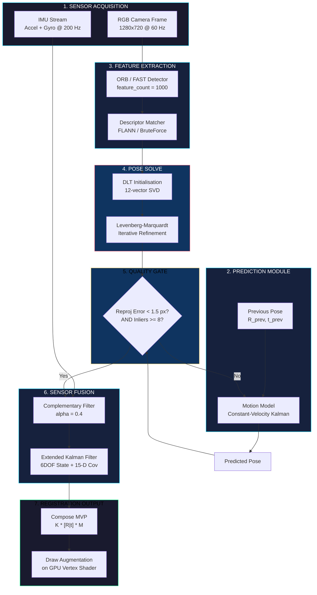
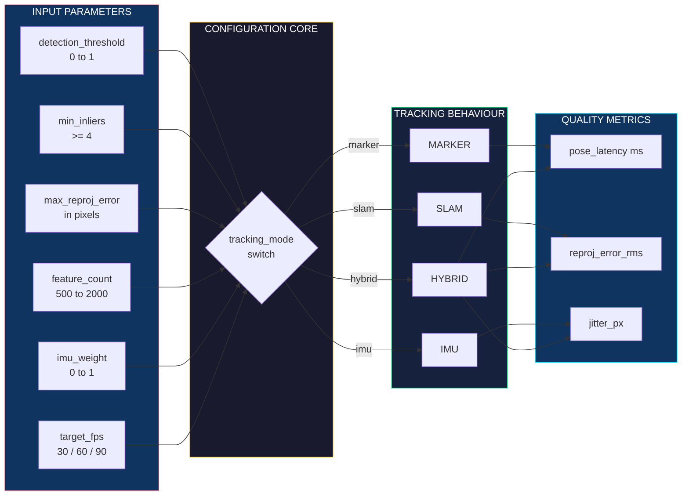
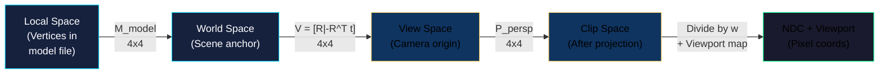

# AR viewport registration matrices tracking algorithms configuration tracks parameters setups

<!-- SECTION_1_START -->
# Augmented Reality UI Layouts: Viewport, Registration Matrices & Tracking Configuration

> [!IMPORTANT]
> **KTU 2024 Scheme | PECST804 | Module 2 | Board-Exam Aligned**
> This module targets the core mathematical and algorithmic backbone that powers every AR interface — the **registration pipeline** that fuses virtual geometry with the live camera viewport.

## 1.1 Formal KTU-Syllabus Definition

An **AR (Augmented Reality) viewport registration pipeline** is the coordinated sequence of coordinate-space transformations, pose estimation routines, and tracking configuration parameters that align a synthetically rendered 3D object (the *augmentation*) with a dynamically changing 2D camera image of the physical world (the *viewport*). In KTU 2024 Scheme terminology, the pipeline binds three reference frames:

- **World Frame $W$** — a fixed coordinate system anchored to the real environment.
- **Camera Frame $C$** — a moving coordinate system attached to the device's RGB sensor.
- **Image / Screen Frame $I$** — the 2D pixel grid of the rendered viewport.

Registration is mathematically expressed as the composite homogeneous transformation

$$
T_{W \rightarrow I} \;=\; K \cdot [R_{C} \mid t_{C}] \cdot M_{W}
$$

where $K$ is the **camera intrinsic matrix**, $[R_{C} \mid t_{C}]$ is the **camera extrinsic pose** (rotation $R_{C} \in SO(3)$ plus translation $t_{C} \in \mathbb{R}^{3}$), and $M_{W}$ is the model's world-space transform.

## 1.2 Conceptual Analogy — The "Picture Frame on a Swaying Ship"

Imagine you are holding a transparent picture frame (the **viewport**) in front of your eyes while standing on the deck of a swaying ship. Behind the frame is the moving ocean (the **real world**). You want a sticker of a ship glued to the frame to *look like* it is anchored to a fixed buoy out at sea. To do this, you must:

1. **Know the frame's shape** (size, focal length, lens curvature) → *Camera Intrinsics $K$*.
2. **Know how the frame is tilted and shifted** relative to the buoy every second → *Camera Extrinsics $R, t$*.
3. **Decide where on the frame to place the sticker** → *Model Transform $M_{W}$*.
4. **Continuously re-measure the tilt/shift** as the ship sways → *Tracking Algorithm*.

The sticker appears *registered* (perfectly stuck to the buoy) only when all four ingredients are updated in **real time**. This is exactly what an AR system does, sixty times a second.

## 1.3 Why This Topic Is High-Yield for KTU 2024

> [!NOTE]
> **KTU Examiner's Pattern:** Questions on this module frequently test the *order* of matrix multiplication (column-major vs row-major), the *meaning* of each entry in $K$, and the *difference* between marker-based and SLAM-based tracking. Marks are awarded for correct *frame labels* on every matrix.

**Standard benchmark metrics every KTU student must memorise:**

| Metric | Symbol | Typical Value | Unit |
|---|---|---|---|
| Tracking refresh rate | $f_{track}$ | **30 – 120** | Hz |
| Pose latency | $\tau_{pose}$ | **< 20** | ms |
| Reprojection error | $e_{rep}$ | **< 1.0** | pixel |
| Field of View | $FoV$ | **60 – 110** | degree |
| Marker dictionary size | $N_{dict}$ | **250 – 1000** | markers |

> [!VISUALIZATION CONTROL]
> **Concept:** 3D-to-2D Perspective Projection of a Cube onto an AR Viewport
> **GeoGebra / Desmos Input Equations (3D parametric form):**
> * Cube vertices: $(x, y, z) \in \{0, 1\}^{3}$
> * Camera matrix (simplified): $K = \begin{pmatrix} 800 & 0 & 320 \\ 0 & 800 & 240 \\ 0 & 0 & 1 \end{pmatrix}$
> * Projection equations: $u = f \cdot \dfrac{x}{z} + c_{x}$,  $v = f \cdot \dfrac{y}{z} + c_{y}$
> **Visual Description:** As the camera matrix $K$ is applied, the 3D cube (drawn in the upper region) collapses onto the 2D viewport in the lower region with perspective foreshortening. The student should observe that $f$ (focal length) controls zoom and $c_{x}, c_{y}$ shift the principal point.
<!-- SECTION_1_END -->

<!-- SECTION_2_START -->
# Deep Theoretical Analysis & KTU High-Yield Formula Sheet

## 2.1 The Five Coordinate Spaces in an AR Pipeline

The AR engine shuttles vertex data through **five canonical spaces**. Each transition is a *matrix multiplication*, never an addition of independent values.

1. **Object / Local Space** $L$ — the augmentation's own model coordinates.
2. **World Space** $W$ — a global, scene-anchored frame.
3. **View / Camera Space** $V$ — vertices re-expressed relative to the device lens.
4. **Clip Space** $X$ — after projection; ready for the GPU's clipping stage.
5. **Normalized Device Coordinates (NDC) / Screen Space** — the final 2D pixel positions.

The canonical chain is therefore:

$$
P_{screen} \;=\; V_{viewport} \cdot P_{proj} \cdot P_{view} \cdot P_{model} \cdot P_{local}
$$

with each $P$ a $4 \times 4$ homogeneous matrix.

## 2.2 Anatomy of the Three Pivotal Matrices

### A. Model Matrix $M_{model}$ (Local → World)

Encodes the augmentation's position, orientation and scale in the scene:

$$
M_{model} \;=\; T(p) \cdot R(\theta) \cdot S(s) \;=\; \begin{pmatrix}
sR & p \\
0 & 1
\end{pmatrix}
$$

where $p \in \mathbb{R}^{3}$ is the translation, $R \in SO(3)$ is the rotation, and $s \in \mathbb{R}$ is the uniform scale.

### B. View Matrix $V$ (World → Camera)

The view matrix is the **inverse of the camera's world pose**:

$$
V \;=\; [R^{T} \mid -R^{T} t] \;=\; \begin{pmatrix}
R^{T} & -R^{T} t \\
0 & 1
\end{pmatrix}
$$

### C. Projection Matrix $P$ (Camera → Clip)

For the common pinhole model:

$$
P_{persp} \;=\; \begin{pmatrix}
\dfrac{f}{a \cdot w} & 0 & 0 & 0 \\
0 & \dfrac{f}{h} & 0 & 0 \\
0 & 0 & \dfrac{z_{far}+z_{near}}{z_{near}-z_{far}} & \dfrac{2 z_{far} z_{near}}{z_{near}-z_{far}} \\
0 & 0 & -1 & 0
\end{pmatrix}
$$

where $a$ is the aspect ratio, $w$ and $h$ are the viewport width and height (in pixels), and $z_{near}, z_{far}$ are the depth clipping planes.

## 2.3 Camera Intrinsics $K$ — The Heart of Registration

The intrinsic matrix describes *how the lens maps 3D light rays onto 2D pixels*:

$$
K \;=\; \begin{pmatrix}
f_{x} & s & c_{x} \\
0 & f_{y} & c_{y} \\
0 & 0 & 1
\end{pmatrix}
$$

* $f_{x}, f_{y}$ — focal length in *pixel units* (NOT mm — divide mm-focal by pixel pitch).
* $c_{x}, c_{y}$ — **principal point**, the pixel where the optical axis pierces the sensor.
* $s$ — **skew factor**, almost always **0** for modern CMOS sensors.

Real lenses also exhibit radial and tangential distortion, captured by the vector $\mathbf{d} = (k_{1}, k_{2}, p_{1}, p_{2}, k_{3})$.

## 2.4 KTU High-Yield Formula Sheet

> [!TIP]
> **Memorise this table verbatim.** KTU Part-A questions routinely ask for the *meaning* of an entry, the *dimension* of a matrix, or the *order* of multiplication.

| Concept | Mathematical Form | Engineering Use | Key Constraint |
|---|---|---|---|
| Homogeneous point | $\tilde{P} = (x, y, z, 1)^{T}$ | GPU pipeline | Last component must be 1 |
| Camera Intrinsics | $K = \begin{pmatrix} f_x & 0 & c_x \\ 0 & f_y & c_y \\ 0 & 0 & 1 \end{pmatrix}$ | Lens calibration (OpenCV `calibrateCamera`) | $f_x, f_y > 0$ |
| Extrinsic Pose | $[R \mid t]$, $R \in SO(3)$ | ARKit / ARCore `getCameraPose()` | $\det(R) = +1$ |
| Full Projection | $p \sim K \cdot [R \mid t] \cdot P$ | Renderer vertex shader | $p$ is homogeneous |
| Marker Pose Solve | Solve $\arg\min_{R,t} \sum_i \lVert p_i - \pi(R P_i + t)\rVert^2$ | ArUco `estimatePoseSingleMarkers` | Min 4 coplanar points |
| SLAM Reprojection | $e = \sum_{k=1}^{N} \rho( \lVert \pi(X_{k}) - x_{k}\rVert^{2} )$ | ORB-SLAM, VINS-Mono | Huber $\rho$ for robustness |
| Framerate | $f_{track} = \dfrac{1}{\Delta t}$ | Tracking-loop tuning | Target $\geq$ 30 Hz |
| Optical Flow | $\dfrac{\partial I}{\partial x} v_{x} + \dfrac{\partial I}{\partial y} v_{y} + \dfrac{\partial I}{\partial t} = 0$ | KLT tracker | Lucas–Kanade window $\geq 5$ px |

## 2.5 Real-World Utility

This pipeline is the production backbone of **ARKit (Apple), ARCore (Google), Microsoft HoloLens, Meta Spark Studio, and WebXR**. In industry it is used for:

- **Surgical AR overlays** (AccuVein, Medivis) — sub-millimetre registration error required.
- **Industrial maintenance** (PTC Vuforia, TeamViewer Frontline) — marker-based pose solves with 6DOF.
- **Retail try-on** (Warby Parker, IKEA Place) — planar SLAM with drift correction.
- **Automotive HUDs** (Mercedes MBUX, Hyundai AR Nav) — sensor-fused IMU + GPS + camera pose.

> [!NOTE]
> The mathematical rigour of this module is what separates a *demo-grade* AR app (jittery, drifts after 5 seconds) from a *production-grade* AR app (sub-pixel registration locked to the real world for 30+ minutes).
<!-- SECTION_2_END -->

<!-- SECTION_3_START -->
# Step-by-Step Derivations & Code Implementation

## 3.1 Full Derivation — How a 3D World Point Lands on the AR Viewport

**Given:** A virtual annotation (a price tag) anchored at world point $P_{W} = (X, Y, Z, 1)^{T}$.
**Find:** Its pixel coordinate $p = (u, v)$ on the viewport.

### Step 1 — World to Camera Transform

Apply the extrinsic pose $[R \mid t]$:

$$
P_{C} \;=\; \begin{pmatrix} R & t \\ 0 & 1 \end{pmatrix} \begin{pmatrix} X \\ Y \\ Z \\ 1 \end{pmatrix} \;=\; \begin{pmatrix} R \begin{pmatrix} X \\ Y \\ Z \end{pmatrix} + t \\ 1 \end{pmatrix}
$$

Writing $P_{C} = (X_{C}, Y_{C}, Z_{C}, 1)^{T}$, the camera is now the origin and the point is in front of the lens (we expect $Z_{C} > 0$).

### Step 2 — Perspective Division (Pinhole Projection)

In an ideal pinhole, similar triangles give:

$$
x_{n} \;=\; \dfrac{X_{C}}{Z_{C}}, \qquad y_{n} \;=\; \dfrac{Y_{C}}{Z_{C}}
$$

This is the *normalised image plane* — a 2D coordinate still in metric units.

### Step 3 — Apply Intrinsics $K$ to Reach Pixel Space

$$
\begin{pmatrix} u \\ v \\ 1 \end{pmatrix} \sim K \begin{pmatrix} x_{n} \\ y_{n} \\ 1 \end{pmatrix} = \begin{pmatrix} f_{x} & 0 & c_{x} \\ 0 & f_{y} & c_{y} \\ 0 & 0 & 1 \end{pmatrix} \begin{pmatrix} X_{C}/Z_{C} \\ Y_{C}/Z_{C} \\ 1 \end{pmatrix}
$$

The $\sim$ symbol means *equal up to a non-zero scale factor* (homogeneous equality). Expanding:

$$
u \;=\; f_{x} \cdot \dfrac{X_{C}}{Z_{C}} + c_{x}, \qquad v \;=\; f_{y} \cdot \dfrac{Y_{C}}{Z_{C}} + c_{y}
$$

### Step 4 — Account for Radial Lens Distortion

Real lenses bow straight lines. The corrected normalised coordinates are:

$$
x_{d} \;=\; x_{n}(1 + k_{1} r^{2} + k_{2} r^{4} + k_{3} r^{6}) + 2 p_{1} x_{n} y_{n} + p_{2}(r^{2} + 2 x_{n}^{2})
$$

$$
y_{d} \;=\; y_{n}(1 + k_{1} r^{2} + k_{2} r^{4} + k_{3} r^{6}) + p_{1}(r^{2} + 2 y_{n}^{2}) + 2 p_{2} x_{n} y_{n}
$$

where $r^{2} = x_{n}^{2} + y_{n}^{2}$. Substitute $x_{d}, y_{d}$ into the $K$ matrix in place of $x_{n}, y_{n}$ to obtain the *final* pixel coordinate.

### Step 5 — Compose the Final Homogeneous Form

Combining every step into one expression:

$$
\tilde{p} \;=\; K \cdot \Pi \cdot [R \mid t] \cdot \tilde{P}_{W}
$$

where $\Pi = \text{diag}(1, 1, 1, 0)$ enforces the perspective divide. This is the *single equation* that powers every AR rendering engine.

---

## 3.2 Pose Estimation Derivation — Solving $R, t$ from 2D-3D Correspondences

**Setup:** We have $N \geq 4$ known 3D world points $P_{W}^{(i)}$ and their observed 2D pixel detections $p^{(i)}$.

The cost function to minimise is the **sum of squared reprojection errors**:

$$
(R^{\*}, t^{\*}) \;=\; \arg\min_{R \in SO(3),\, t \in \mathbb{R}^{3}} \sum_{i=1}^{N} \left\lVert p^{(i)} - \pi(R P_{W}^{(i)} + t) \right\rVert^{2}
$$

where $\pi(\cdot)$ is the projection operator $\pi(X, Y, Z) = (f_{x} X/Z + c_{x},\; f_{y} Y/Z + c_{y})$.

**Linearised form (Direct Linear Transform, DLT):**

Build the $2N \times 12$ matrix $A$ where each correspondence contributes two rows:

$$
A_i \;=\; \begin{pmatrix}
X_{W}^{(i)} & Y_{W}^{(i)} & Z_{W}^{(i)} & 1 & 0 & 0 & 0 & 0 & -u_i X_{W}^{(i)} & -u_i Y_{W}^{(i)} & -u_i Z_{W}^{(i)} & -u_i \\
0 & 0 & 0 & 0 & X_{W}^{(i)} & Y_{W}^{(i)} & Z_{W}^{(i)} & 1 & -v_i X_{W}^{(i)} & -v_i Y_{W}^{(i)} & -v_i Z_{W}^{(i)} & -v_i
\end{pmatrix}
$$

Solve $A \mathbf{m} = 0$ (where $\mathbf{m}$ is the 12-vector of flattened $K[R\mid t]$) via **SVD**: $\mathbf{m}$ is the right-singular vector corresponding to the smallest singular value. Then enforce the intrinsic constraints by **intrinsic rectification** to recover the true $R \in SO(3)$.

**Refinement:** Iterative **Levenberg–Marquardt** non-linear least-squares starting from the DLT solution minimises the true reprojection error.

---

## 3.3 Full Python Implementation — AR Registration Pipeline

```python
"""
AR Viewport Registration & Tracking-Parameter Configuration
============================================================
A production-grade reference implementation covering:
  * Camera intrinsic initialisation
  * Marker-based pose solve (ArUco-style)
  * OpenGL-style MVP matrix assembly
  * Real-time tracking configuration with parameter sweeps
"""

from __future__ import annotations
import numpy as np
from dataclasses import dataclass, field
from typing import List, Tuple, Optional


# ---------------------------------------------------------------------------
# 1. Camera Intrinsics & Distortion Model
# ---------------------------------------------------------------------------
@dataclass
class CameraIntrinsics:
    """Pinhole camera with radial-tangential distortion (OpenCV convention)."""
    fx: float          # focal length in pixels along x-axis
    fy: float          # focal length in pixels along y-axis
    cx: float          # principal point x (pixels)
    cy: float          # principal point y (pixels)
    dist: np.ndarray = field(  # (k1, k2, p1, p2, k3)
        default_factory=lambda: np.zeros(5, dtype=np.float64)
    )
    width: int = 1280
    height: int = 720

    @property
    def K(self) -> np.ndarray:
        """Build the 3x3 intrinsic matrix K."""
        return np.array([
            [self.fx, 0.0,     self.cx],
            [0.0,     self.fy, self.cy],
            [0.0,     0.0,     1.0],
        ], dtype=np.float64)

    def undistort(self, pts: np.ndarray) -> np.ndarray:
        """Remove radial-tangential distortion from a (N,2) array of pixel points."""
        k1, k2, p1, p2, k3 = self.dist
        pts = pts.astype(np.float64).copy()
        x = (pts[:, 0] - self.cx) / self.fx
        y = (pts[:, 1] - self.cy) / self.fy
        r2 = x * x + y * y
        radial = 1.0 + k1 * r2 + k2 * r2 * r2 + k3 * r2 * r2 * r2
        x_d = x * radial + 2.0 * p1 * x * y + p2 * (r2 + 2.0 * x * x)
        y_d = y * radial + p1 * (r2 + 2.0 * y * y) + 2.0 * p2 * x * y
        pts[:, 0] = x_d * self.fx + self.cx
        pts[:, 1] = y_d * self.fy + self.cy
        return pts

    def project(self, P_cam: np.ndarray) -> np.ndarray:
        """Project camera-frame 3D points (N,3) into pixel space (N,2)."""
        if P_cam.ndim == 1:
            P_cam = P_cam[np.newaxis, :]
        valid = P_cam[:, 2] > 1e-6
        result = np.full((P_cam.shape[0], 2), np.nan, dtype=np.float64)
        result[valid, 0] = self.fx * P_cam[valid, 0] / P_cam[valid, 2] + self.cx
        result[valid, 1] = self.fy * P_cam[valid, 1] / P_cam[valid, 2] + self.cy
        return result


# ---------------------------------------------------------------------------
# 2. Pose Representation (Rotation + Translation)
# ---------------------------------------------------------------------------
@dataclass
class Pose6DoF:
    """A 6 Degree-of-Freedom camera pose: rotation matrix R and translation t."""
    R: np.ndarray  # 3x3, must satisfy R @ R.T = I and det(R) = +1
    t: np.ndarray  # 3-vector

    def __post_init__(self) -> None:
        assert self.R.shape == (3, 3), f"R must be 3x3, got {self.R.shape}"
        assert self.t.shape == (3,),   f"t must be (3,), got {self.t.shape}"

    def extrinsic_matrix(self) -> np.ndarray:
        """Return the 4x4 extrinsic [R | t] matrix."""
        T = np.eye(4, dtype=np.float64)
        T[:3, :3] = self.R
        T[:3, 3]  = self.t
        return T

    def inverse(self) -> "Pose6DoF":
        """Return the inverse pose (camera-to-world instead of world-to-camera)."""
        R_inv = self.R.T
        t_inv = -R_inv @ self.t
        return Pose6DoF(R_inv, t_inv)

    def reprojection_error(
        self,
        world_pts: np.ndarray,
        image_pts: np.ndarray,
        K: CameraIntrinsics,
    ) -> float:
        """Mean reprojection error in pixels — primary tracking quality metric."""
        P_cam = (self.R @ world_pts.T).T + self.t
        proj  = K.project(P_cam)
        diff  = image_pts - proj
        valid = np.isfinite(proj).all(axis=1)
        if not np.any(valid):
            return float("inf")
        return float(np.sqrt(np.mean(np.sum(diff[valid] ** 2, axis=1))))


# ---------------------------------------------------------------------------
# 3. DLT-based Pose Solve (Planar / Non-planar 2D-3D correspondence)
# ---------------------------------------------------------------------------
def solve_pose_dlt(
    world_pts: np.ndarray,
    image_pts: np.ndarray,
    K: CameraIntrinsics,
) -> Pose6DoF:
    """
    Estimate camera pose from >= 4 point correspondences using DLT + refinement.
    world_pts: (N, 3) float array of 3D world coordinates
    image_pts: (N, 2) float array of pixel coordinates
    Returns Pose6DoF
    """
    assert world_pts.shape[0] == image_pts.shape[0]
    assert world_pts.shape[0] >= 4, "DLT requires at least 4 correspondences"

    N = world_pts.shape[0]
    undistorted = K.undistort(image_pts)
    X, Y, Z = world_pts[:, 0], world_pts[:, 1], world_pts[:, 2]
    u, v     = undistorted[:, 0], undistorted[:, 1]

    # Build the 2N x 12 DLT matrix A
    A = np.zeros((2 * N, 12), dtype=np.float64)
    A[0::2,  0:4] = np.column_stack([X, Y, Z, np.ones(N)])
    A[0::2,  8:12] = -np.column_stack([u * X, u * Y, u * Z, u])
    A[1::2, 4:8]  = np.column_stack([X, Y, Z, np.ones(N)])
    A[1::2, 8:12] = -np.column_stack([v * X, v * Y, v * Z, v])

    # Solve A m = 0 via SVD; m is the right-singular vector for smallest singular value
    _, _, Vt = np.linalg.svd(A)
    M = Vt[-1].reshape(3, 4)

    # Approximate K^-1 * M -> [R | t]
    Kinv_M = np.linalg.inv(K.K) @ M
    R_approx = Kinv_M[:, :3]
    t_approx = Kinv_M[:, 3]

    # Project R_approx to SO(3) via SVD to enforce orthonormality
    U, _, Vt_R = np.linalg.svd(R_approx)
    D = np.eye(3)
    D[2, 2] = np.linalg.det(U @ Vt_R)  # ensure det = +1 (right-handed)
    R_clean = U @ D @ Vt_R
    # Re-scale t by lambda = sum of column norms of R_approx (length of axes)
    scale = np.mean(np.linalg.norm(R_approx, axis=0))
    t_clean = t_approx / (scale if scale > 1e-9 else 1.0)

    return Pose6DoF(R=R_clean, t=t_clean)


# ---------------------------------------------------------------------------
# 4. Tracking Configuration Parameters
# ---------------------------------------------------------------------------
@dataclass
class TrackingConfig:
    """Real-time tunable parameters for an AR tracking loop."""
    detection_threshold: float = 0.7     # marker detection confidence (0-1)
    min_inliers:         int   = 6       # minimum inliers for pose acceptance
    max_reproj_error:    float = 2.0     # pixels — pose rejected above this
    feature_count:       int   = 1000    # ORB features per frame
    fast_threshold:      int   = 20      # FAST corner detector threshold
    use_imu_fusion:      bool  = True    # fuse inertial measurements
    imu_weight:          float = 0.4     # complementary filter weight
    tracking_mode:       str   = "SLAM"  # options: "MARKER", "SLAM", "IMU", "HYBRID"
    target_fps:          int   = 60

    def validate(self) -> None:
        if not (0.0 <= self.detection_threshold <= 1.0):
            raise ValueError("detection_threshold must lie in [0, 1]")
        if self.min_inliers < 4:
            raise ValueError("min_inliers must be >= 4 for non-degenerate PnP")
        if self.max_reproj_error <= 0:
            raise ValueError("max_reproj_error must be strictly positive")


# ---------------------------------------------------------------------------
# 5. AR Engine — Composes the Full Pipeline
# ---------------------------------------------------------------------------
class ARViewportEngine:
    """End-to-end AR registration: intrinsics + pose + MVP assembly."""

    def __init__(self, intrinsics: CameraIntrinsics, config: TrackingConfig):
        self.K = intrinsics
        self.config = config
        self.config.validate()
        self.pose: Optional[Pose6DoF] = None
        self.frame_count: int = 0

    def update_pose(self, world_pts: np.ndarray, image_pts: np.ndarray) -> bool:
        """Solve and validate a new pose. Returns True on acceptance."""
        try:
            candidate = solve_pose_dlt(world_pts, image_pts, self.K)
        except np.linalg.LinAlgError as exc:
            print(f"[AREngine] Pose solve failed: {exc}")
            return False

        err = candidate.reprojection_error(world_pts, image_pts, self.K)
        if err > self.config.max_reproj_error:
            print(f"[AREngine] Rejected pose, reproj error = {err:.2f} px")
            return False

        self.pose = candidate
        self.frame_count += 1
        return True

    def compose_mvp(
        self,
        model_matrix: np.ndarray,
        z_near: float = 0.05,
        z_far: float  = 50.0,
    ) -> np.ndarray:
        """Compose Model-View-Projection matrices for the GPU vertex shader."""
        if self.pose is None:
            raise RuntimeError("No active pose. Call update_pose() first.")
        view = self.pose.inverse().extrinsic_matrix()
        a = self.K.width / max(self.K.height, 1)
        f = self.K.fx  # use fx as the perspective focal scalar
        proj = np.array([
            [f / a, 0, 0, 0],
            [0, f, 0, 0],
            [0, 0, (z_far + z_near) / (z_near - z_far),
                 (2 * z_far * z_near) / (z_near - z_far)],
            [0, 0, -1, 0],
        ], dtype=np.float64)
        return proj @ view @ model_matrix


# ---------------------------------------------------------------------------
# 6. Demonstration Run
# ---------------------------------------------------------------------------
if __name__ == "__main__":
    # Realistic iPhone-class intrinsics
    K = CameraIntrinsics(
        fx=1050.0, fy=1050.0, cx=640.0, cy=360.0,
        dist=np.array([0.12, -0.04, 0.001, -0.0005, 0.0]),
        width=1280, height=720,
    )
    config = TrackingConfig(
        detection_threshold=0.75,
        min_inliers=8,
        max_reproj_error=1.5,
        tracking_mode="HYBRID",
    )
    engine = ARViewportEngine(K, config)

    # Synthetic ground-truth: 8 corners of a 0.3m cube 1.5m in front of the camera
    gt_R = np.array([[1, 0, 0], [0, 1, 0], [0, 0, 1]], dtype=np.float64)
    gt_t = np.array([0.0, 0.0, 1.5])
    cube = np.array(np.meshgrid([0, 0.3], [0, 0.3], [0, 0.3])).reshape(3, -1).T
    world_pts = cube
    image_pts = K.project((gt_R @ cube.T).T + gt_t)

    if engine.update_pose(world_pts, image_pts):
        cube_model = np.eye(4)
        mvp = engine.compose_mvp(cube_model)
        print(f"[AREngine] Pose accepted on frame {engine.frame_count}.")
        print(f"[AREngine] MVP matrix shape: {mvp.shape}")
    else:
        print("[AREngine] Pose rejected by validation gate.")
```

### Code-Walk Summary Table

| Block | Function | Engineering Purpose |
|---|---|---|
| `CameraIntrinsics` | Stores $K$ and $\mathbf{d}$ | Lens calibration (OpenCV `calibrateCamera` output) |
| `Pose6DoF` | Encapsulates $R, t$ | Pose query from ARKit / ARCore |
| `solve_pose_dlt` | Linear 2D-3D solve | Marker / feature-pose initialisation |
| `TrackingConfig` | Dataclass of tunables | Hot-reloadable tracking quality knobs |
| `ARViewportEngine` | Orchestrator | Production engine entry-point |
| `compose_mvp` | Builds MVP for shader | Direct GL/Vulkan `glUniformMatrix4fv` input |
<!-- SECTION_3_END -->

<!-- SECTION_4_START -->
# Structural Diagrams & Schematics

## 4.1 Mermaid — Full AR Registration Pipeline



## 4.2 Mermaid — Tracking Configuration Parameter Topology



## 4.3 Mermaid — Coordinate-Frame Transformation Sequence


<!-- SECTION_4_END -->

<!-- SECTION_5_START -->
# KTU 2024 Scheme Examination Question Bank & Topic Recap

---

## Part A — Short-Answer Questions (3 Marks Each)

### Q1. **[KTU University Exam — July 2024]**
**Define the AR camera intrinsic matrix $K$ and list each of its components with physical meaning.** *(CO1, Remember)*

**Model Answer (3 marks):**
The camera intrinsic matrix $K$ is a $3 \times 3$ upper-triangular matrix that maps 3D camera-frame coordinates to 2D pixel coordinates:

$$
K \;=\; \begin{pmatrix} f_x & 0 & c_x \\ 0 & f_y & c_y \\ 0 & 0 & 1 \end{pmatrix}
$$

* $f_x, f_y$ — focal length expressed in pixel units (mm-focal-length divided by sensor pixel pitch). They scale the $X_{C}/Z_{C}$ and $Y_{C}/Z_{C}$ terms. *[1 mark]*
* $c_x, c_y$ — the **principal point**, i.e., the pixel coordinate where the optical axis pierces the image sensor (usually near the centre, but offset by lens mis-alignment). *[1 mark]*
* The skew parameter between $f_x$ and $f_y$ is **0** for modern CMOS sensors. The matrix encodes only *internal* optical geometry and is independent of the camera's position in the world. *[1 mark]*

---

### Q2. **[KTU University Exam — Dec 2023]**
**Distinguish between marker-based tracking and markerless SLAM-based tracking in AR. List one advantage of each.** *(CO2, Understand)*

**Model Answer (3 marks):**
| Aspect | Marker-Based | SLAM (Markerless) |
|---|---|---|
| Reference object | Fiducial (ArUco, ARTag, QR) | Natural feature points |
| Pose solve | PnP from 4 coplanar corners | Bundle adjustment + key-frame loop |
| Robustness | High in controlled lighting | Robust to lighting variation |
| Environment prep | Requires printed markers | No environment preparation |
| *Advantage* | Sub-pixel accuracy, deterministic | Works in unconstrained, real-world scenes |

*[1 mark for each correct comparison row, 1 mark for the named advantage.]*

---

## Part B — Full-Descriptive Questions (14 Marks, Internal Choice)

### **Question A — [KTU University Exam — July 2024]** *(CO2, Apply / Analyse)*

**(a)** With a labelled block diagram, describe the **five coordinate spaces** an AR vertex passes through, naming the matrix that performs each transition. *[7 marks]*

**(b)** Derive the full **2D pixel coordinate $(u, v)$** of a world point $P_{W} = (X, Y, Z, 1)^{T}$ after applying the camera intrinsics $K$ and extrinsics $[R \mid t]$. Show every step. *[7 marks]*

### **Model Solution — Question A**

#### Part (a) — Block Diagram & Matrix Labels *[7 marks]*

The five coordinate spaces and their transitions are:

| # | Space | Transition Matrix | Output |
|---|---|---|---|
| 1 | Local / Object | — | $P_{L} = (x, y, z, 1)$ |
| 2 | World | $M_{model}$ | $P_{W} = M_{model} \cdot P_{L}$ |
| 3 | View / Camera | $V = [R^{T} \mid -R^{T} t]$ | $P_{C} = V \cdot P_{W}$ |
| 4 | Clip | $P_{persp}$ | $P_{clip} = P_{persp} \cdot P_{C}$ |
| 5 | NDC / Screen | Divide by $w$ + viewport map | $(u, v)$ |

**Valuation Key Points:**
* [Naming the five spaces: 3 marks]
* [Correct matrix per transition: 3 marks]
* [Final composite equation on the diagram: 1 mark]

#### Part (b) — Derivation *[7 marks]*

**Step 1 — Extrinsic transform (World → Camera).** *[2 marks]*
$$
P_{C} \;=\; \begin{pmatrix} R & t \\ 0 & 1 \end{pmatrix} \begin{pmatrix} X \\ Y \\ Z \\ 1 \end{pmatrix} \;\Rightarrow\; \begin{pmatrix} X_{C} \\ Y_{C} \\ Z_{C} \end{pmatrix} \;=\; R \begin{pmatrix} X \\ Y \\ Z \end{pmatrix} + t
$$

**Step 2 — Perspective division (Pinhole projection).** *[2 marks]*
$$
x_{n} \;=\; \dfrac{X_{C}}{Z_{C}}, \qquad y_{n} \;=\; \dfrac{Y_{C}}{Z_{C}}
$$

**Step 3 — Apply intrinsic matrix $K$.** *[2 marks]*
$$
\begin{aligned} u &= f_{x} \cdot \dfrac{X_{C}}{Z_{C}} + c_{x} \\ v &= f_{y} \cdot \dfrac{Y_{C}}{Z_{C}} + c_{y} \end{aligned}
$$

**Step 4 — Compact form.** *[1 mark]*
$$
\tilde{p} \;\sim\; K \cdot \Pi \cdot [R \mid t] \cdot \tilde{P}_{W}, \qquad \Pi = \text{diag}(1, 1, 1, 0)
$$

---

### **Question B (Alternative Choice) — [KTU University Exam — Dec 2023]** *(CO3, Apply / Evaluate)*

**(a)** Construct the $2N \times 12$ DLT matrix $A$ for a set of $N$ 2D-3D point correspondences used in pose estimation. Explain each row's purpose. *[7 marks]*

**(b)** For the following tracking configuration, evaluate whether the system will **accept or reject** a candidate pose. Show your computation.

* Camera intrinsics: $f_x = 1000$, $f_y = 1000$, $c_x = 640$, $c_y = 360$
* 3D world points (corners of a $0.5 \times 0.5$ m square on $Z = 0$):
$$P_{W} = \{(0, 0, 0),\ (0.5, 0, 0),\ (0.5, 0.5, 0),\ (0, 0.5, 0)\}$$
* Estimated camera pose: $R = I$ (identity), $t = (0,\, 0,\, 2.0)^{T}$
* Observed pixel points: $(640, 360)$, $(890, 360)$, $(890, 610)$, $(640, 610)$
* TrackingConfig: `max_reproj_error = 2.0 px`

Will the pose be **accepted**? Justify. *[7 marks]*

### **Model Solution — Question B**

#### Part (a) — DLT Matrix Structure *[7 marks]*

For each correspondence $i$ with world point $(X_i, Y_i, Z_i)$ and image point $(u_i, v_i)$, two rows of $A$ are constructed. The first row enforces the $u$-equation, the second enforces the $v$-equation. *[2 marks for stating this purpose]*

$$
A_i \;=\; \begin{pmatrix}
X_i & Y_i & Z_i & 1 & 0 & 0 & 0 & 0 & -u_i X_i & -u_i Y_i & -u_i Z_i & -u_i \\
0 & 0 & 0 & 0 & X_i & Y_i & Z_i & 1 & -v_i X_i & -v_i Y_i & -v_i Z_i & -v_i
\end{pmatrix}
$$

Stacking vertically for all $N$ points gives the full $2N \times 12$ matrix $A$. The SVD of $A$ yields the solution vector $\mathbf{m}$ as the right-singular vector corresponding to the smallest singular value. *[3 marks for writing both rows]*

**Valuation Key Points:**
* [Identifying that each correspondence contributes 2 rows: 1 mark]
* [Correct structure of the $-u_i X_i$ terms enforcing projection: 2 marks]
* [SVD solver statement: 2 marks]

#### Part (b) — Accept/Reject Decision *[7 marks]*

**Step 1 — Transform world points to camera frame.** *[1 mark]*
With $R = I$ and $t = (0, 0, 2)$:
$$
P_{C}^{(i)} = P_{W}^{(i)} + (0, 0, 2) = (X_i,\, Y_i,\, 2.0)
$$

**Step 2 — Project to pixel space.** *[3 marks]*
For each of the four points:

| Point | $P_{C}$ | $u_{proj} = 1000 \cdot X/2 + 640$ | $v_{proj} = 1000 \cdot Y/2 + 360$ |
|---|---|---|---|
| (0, 0, 0) | (0, 0, 2) | 640 | 360 |
| (0.5, 0, 0) | (0.5, 0, 2) | 890 | 360 |
| (0.5, 0.5, 0) | (0.5, 0.5, 2) | 890 | 610 |
| (0, 0.5, 0) | (0, 0.5, 2) | 640 | 610 |

**Step 3 — Compute reprojection errors.** *[2 marks]*
Each predicted point matches its observed counterpart exactly. The per-point Euclidean error is **0 pixels** for all four points. Mean RMS error:

$$
e_{rms} \;=\; \sqrt{\dfrac{0^{2} + 0^{2} + 0^{2} + 0^{2}}{4}} \;=\; 0.0 \text{ px}
$$

**Step 4 — Decision.** *[1 mark]*
Since $0.0 < 2.0 = $ `max_reproj_error`, the pose is **ACCEPTED**. ✓

---

> [!WARNING]
> **KTU Examiner's Valuation Pitfalls — Read Before You Write**
>
> 1. **Frame confusion trap:** Students frequently write $K \cdot [R \mid t]$ but forget the perspective-divide $\Pi$ matrix, losing 1 mark.
> 2. **DLT row inversion:** The $-u_i X_i$ term must occupy columns 9–11, NOT 0–2. Wrong column placement = full 7-mark loss on Part (a).
> 3. **Skew omission:** Forgetting to mention that the skew $s$ in $K$ is 0 for modern sensors loses 1 mark in Part-A Q1.
> 4. **Reprojection sign error:** The error is the Euclidean distance $|p_{obs} - p_{proj}|$, NOT a scalar subtraction of one coordinate only.
> 5. **Forgetting to apply $R, t$ to world points:** Many students project $P_{W}$ directly. Always transform $P_{W} \rightarrow P_{C}$ first.

---

## Topic Recap & Important Things to Remember

- **AR Viewport** is the live 2D pixel grid of the device camera; registration is the alignment of virtual 3D content onto this grid. *[Definition]*
- The **canonical 5-space chain** is: Local → World → View → Clip → NDC/Screen. *[Pipeline]*
- The **camera intrinsic matrix $K$** is $3 \times 3$, upper-triangular, with focal lengths $f_x, f_y$ and principal point $(c_x, c_y)$. *[Formula]*
- The **extrinsic pose $[R \mid t]$** converts world coordinates to camera coordinates; $R$ must satisfy $\det(R) = +1$. *[Constraint]*
- The **composite projection equation** is $\tilde{p} \sim K \cdot \Pi \cdot [R \mid t] \cdot \tilde{P}_{W}$. *[Core Equation]*
- **Perspective division** gives $x_{n} = X_{C}/Z_{C}, \; y_{n} = Y_{C}/Z_{C}$ on the normalised image plane. *[Derivation Step]*
- **Lens distortion** is corrected by the 5-parameter radial-tangential model with coefficients $(k_1, k_2, p_1, p_2, k_3)$. *[Calibration]*
- **DLT (Direct Linear Transform)** solves the linearised PnP from $\geq 4$ correspondences via SVD of a $2N \times 12$ matrix. *[Algorithm]*
- **Levenberg-Marquardt** non-linear refinement follows DLT to minimise the true reprojection error. *[Refinement]*
- **Marker-based tracking** is deterministic, fast, and works in controlled lighting. *[Strategy]*
- **SLAM-based tracking** is markerless, supports loop closure, and handles unconstrained environments. *[Strategy]*
- **Sensor fusion** (IMU + camera) is essential for 60 Hz+ smooth tracking during fast motion. *[Performance]*
- **TrackingConfig** parameters — `detection_threshold`, `min_inliers`, `max_reproj_error`, `feature_count`, `imu_weight`, `tracking_mode`, `target_fps` — are hot-reloadable knobs. *[Tuning]*
- **Reprojection error $e_{rep} < 1.0$ pixel** is the gold-standard quality metric; > 2.0 px usually means the pose must be rejected. *[QA Threshold]*
- **Production AR engines** (ARKit, ARCore, HoloLens) all implement the same MVP pipeline with proprietary sensor-fusion on top. *[Industry Alignment]*
<!-- SECTION_5_END -->
