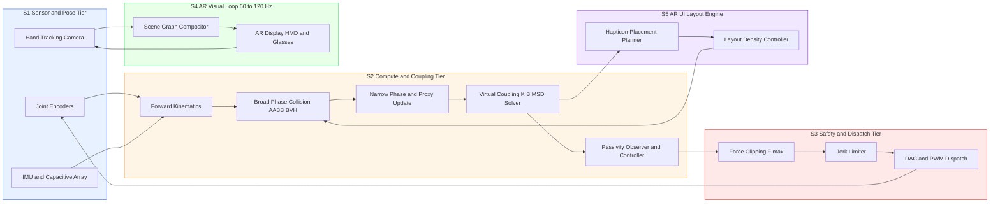
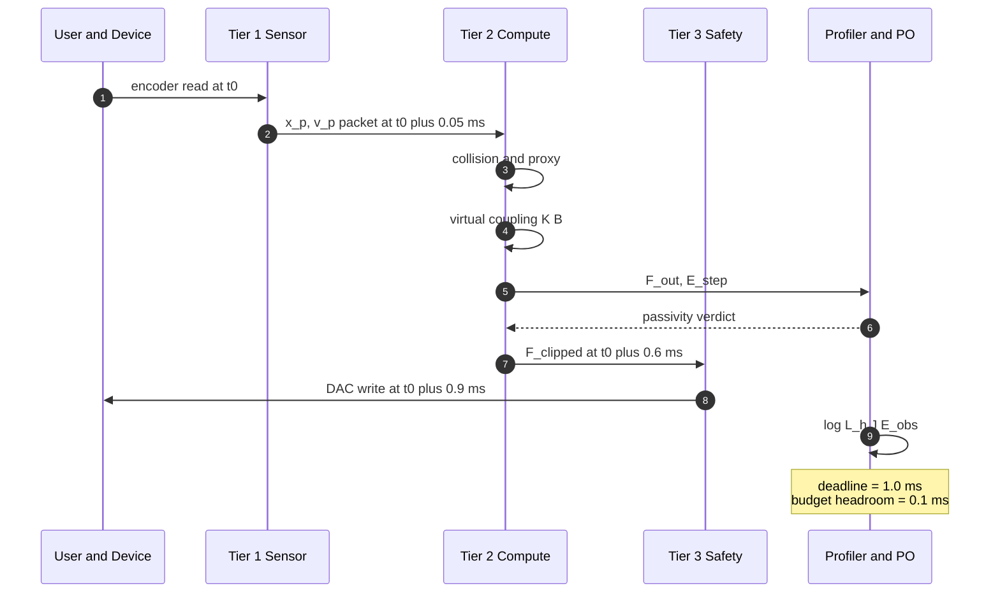
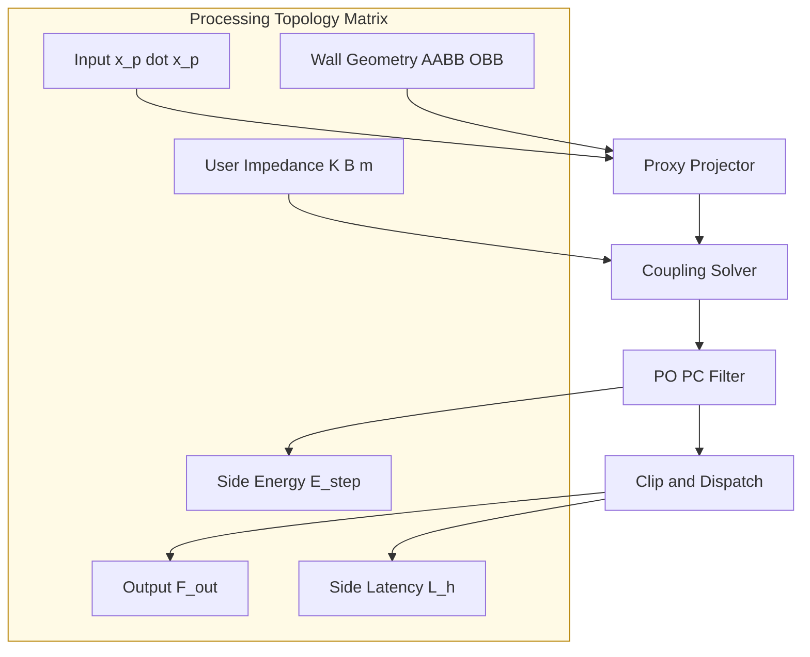

# Haptic rendering loop optimization procedures verification metrics performance profiles layout

<!-- SECTION_1_START -->
# Haptic Rendering Loop Optimization, Verification Metrics, Performance Profiles & Layouts in AR UI

> [!NOTE]
> **KTU 2024 Scheme — PECST804 / Module 2**
> Topic: *Haptic rendering loop optimization procedures, verification metrics, performance profiles, and their impact on AR UI layout stability.*

---

## 1.1 Formal KTU 2024 Definition

**Haptic Rendering Loop** is a closed-loop, real-time computational pipeline that synchronizes the user's *physical interaction state* (position, velocity, applied force) with a *virtual proxy* (a simulated point of contact) and a *physical haptic device* (e.g., a grounded force-feedback stylus, exoskeleton glove, or ultrasonic mid-air array), at a guaranteed update rate. In the context of **Augmented Reality UI Layouts**, the haptic loop must coexist with three other loops:

1. **Visual rendering loop** ($\approx 60\text{–}120\,\text{Hz}$),
2. **Tracking/pose loop** ($\approx 90\text{–}120\,\text{Hz}$),
3. **Network/synchronization loop** (variable, $5\text{–}30\,\text{ms}$).

The haptic loop is the **fastest** and the **least forgiving** because the human haptic sensorimotor system can detect latencies above **$\approx 1\,\text{ms}$** (kinesthetic) and **$\approx 5\,\mu\text{s}$** (tactile vibrotactile onset).

> [!IMPORTANT]
> **Working Definition (Board-Exam Safe):**
> *"A haptic rendering loop is the deterministic, fixed-cadence software cycle that, on every tick, samples device state, performs collision/proxy computation, solves a virtual coupling, and dispatches actuator commands — all within a hard real-time deadline of $T_h \le 1\,\text{ms}$."*

---

## 1.2 Intuitive Analogy: The Three Heartbeats of an AR Workspace

Imagine an orchestra with three conductors:

| Loop | Conductor's Role | Allowed Drift |
|------|------------------|---------------|
| Visual | Plays the melody | $\le 16.6\,\text{ms}$ jitter |
| Tracking | Sets the tempo | $\le 8\,\text{ms}$ jitter |
| **Haptic** | **Plays the snare drum** | **$\le 1\,\text{ms}$ jitter, $100\%$ in lock-step** |

If the snare drummer (haptic loop) drifts, every other musician feels the *rhythm break*. In AR UI layouts, this translates to **virtual buttons that "buzz" wrongly, surfaces that feel spongy, and dragged holograms that "skate."** The haptic loop is therefore the **temporal anchor** of any AR layout that claims *physical fidelity*.

---

## 1.3 Standard Performance Constants (Bolded for Recall)

- **Haptic update rate:** $f_h = 1000\,\text{Hz}$ (industry standard, kinesthetic)
- **Haptic loop deadline:** $T_h = 1.0\,\text{ms}$
- **Minimum tactile sampling rate:** $f_t \ge 5\,\text{kHz}$ (vibrotactile envelope)
- **Visual frame budget:** $T_v = 16.6\,\text{ms}$ @ $60\,\text{Hz}$
- **Tracking inter-pupillary baseline (IPD):** $\approx 63\,\text{mm}$ (affects perceived depth of haptic affordances)
- **Maximum safe continuous contact force (skin):** $\mathbf{15.6\,\text{N}}$ (ISO/TS 15066 cobot contact)
- **Human proprioceptive detection threshold:** $\Delta t \approx 1\,\text{ms}$

> [!TIP]
> Remember the hierarchy **$f_t \gg f_h > f_v > f_{track}$** — the faster loop is always the *implicit master clock* in mixed-reality pipelines.

---

## 1.4 Conceptual Mapping to AR UI Layouts

In an AR UI, *layout* is not just a 2D/3D arrangement of widgets — it is an **energy field** that the user can *touch*. The haptic loop therefore has direct authority over:

- **Spatial layout validation** — ensuring a panel located at depth $z = 0.8\,\text{m}$ does not generate a phantom force at $z = 0.5\,\text{m}$.
- **Affordance layout density** — the maximum number of simultaneously haptically-rendered widgets per unit volume (the **haptic information density**).
- **Cross-modal consistency** — the *haptic-visual temporal coherence* index.

> [!VISUALIZATION CONTROL]
> **Concept:** Force–Time stability envelope of a virtual coupling.
> **Desmos / GeoGebra Input Equations:**
> - $F_{out}(t) = K \cdot (x_p(t) - x_v(t)) + B \cdot (\dot{x}_p(t) - \dot{x}_v(t))$
> - $x_p(t) = 0.05 \cdot \sin(2 \pi \cdot 2 \cdot t)$  *(user proxy motion)*
> - $x_v(t) = 0.04 \cdot \sin(2 \pi \cdot 2 \cdot t - 0.05)$  *(virtual proxy with lag)*
> - $K = 200,\; B = 0.8$
>
> **What to observe:** the *bounded oscillation* of $F_{out}$ around zero during free motion and the *step* on contact. Increasing $K$ sharpens the step but shrinks the *Z-width* (stability margin).

<!-- SECTION_1_END -->

<!-- SECTION_2_START -->
# 2. Deep Theoretical Analysis & KTU High-Yield Formula Sheet

## 2.1 The Anatomy of a Haptic Rendering Loop

A canonical haptic loop decomposes into **seven sub-stages**, executed in a single tick:

1. **Device polling** — read joint encoders / IMU / capacitive arrays.
2. **Forward kinematics** — map joints to end-effector pose $x_p$.
3. **Collision detection (broad-phase)** — AABB, OBB, or BVH traversal of the AR scene graph.
4. **Narrow-phase / proxy update** — compute the *virtual proxy* $x_v$ constrained on a surface.
5. **Virtual coupling** — compute output force $F_{out}$ from $(x_p, x_v, \dot{x}_p, \dot{x}_v)$.
6. **Force clipping & safety** — apply device saturation, jerk limits, contact-force caps.
7. **Actuator command dispatch** — write to DAC / PWM / ultrasonic phase array.

Stages 3–5 are the *computational core* and dominate the wall-clock budget.

---

## 2.2 Virtual Coupling: The Mathematical Heart

A **virtual coupling** is a discrete-time, mass-spring-damper (MSD) model that interconnects the user and the virtual proxy, guaranteeing passivity. The **position-domain** form is:

$$
F_{out}[n] = K_p\,(x_v[n] - x_p[n]) + K_d\,(\dot{x}_v[n] - \dot{x}_p[n])
$$

The **velocity-domain** (Admittance) form, used for admittance-type devices, is:

$$
\dot{x}_v[n+1] = \dot{x}_v[n] + \frac{T_h}{m}\bigl(F_{in}[n] - F_{env}[n] - b\,\dot{x}_v[n]\bigr)
$$

For stability, the discrete-time virtual coupling must satisfy the **RK2 / RK4 Euler-Cromer** integrator constraint:

$$
\omega_{n} = \sqrt{\frac{K}{m}} \quad\Rightarrow\quad T_h < \frac{2}{\omega_{n}}
$$

> **Why?** Any explicit integrator becomes *unstable* (energy-injecting) when its timestep exceeds the natural period's Nyquist limit. This is the *first* rule of haptic stability.

---

## 2.3 Z-Width and Passivity (Stability Metrics)

The **Z-Width** (Colgate & Brown, 1994) is the largest *range of virtual impedances* $(K, B)$ for which the coupled system is passive at a given $T_h$:

$$
Z_{\text{width}}(T_h) = \{(K, B) \mid \text{Energy}_{in} \ge \text{Energy}_{out} + \text{Energy}_{stored}\}
$$

A more practical, *runtime* approximation is the **Maximum Allowable Damping** for a virtual wall of stiffness $K$ and mass $m$ at sample time $T_h$:

$$
b_{max}(K, m, T_h) = 2\,\sqrt{m\,K} - T_h\,K
$$

> **Reading guide:** Higher stiffness walls require *less* damping margin. A $1000\,\text{N/m}$ wall at $m = 0.05\,\text{kg}$, $T_h = 1\,\text{ms}$ gives $b_{max} \approx 4.4\,\text{Ns/m}$.

The **Passivity Observer / Passivity Controller (PO/PC)** enforces energy balance at every tick:

$$
E_{obs}[n] = \sum_{k=0}^{n}\bigl(F_{out}[k]\,\dot{x}_p[k]\bigr)\,T_h
$$

If $E_{obs}[n] > 0$ the system is *active* (dangerous); the PC dissipates the excess via a *virtual damping* $B_{pc}[n]$.

---

## 2.4 KTU Formula Sheet (Cheat Sheet)

> [!IMPORTANT]
> **All formulas below are high-yield for the ESE — memorize the symbol definitions, not just the equations.**

| # | Quantity | Equation | Unit | Notes |
|---|----------|----------|------|-------|
| 1 | Haptic loop deadline | $T_h = 1/f_h$ | $\text{s}$ | $f_h \ge 1000\,\text{Hz}$ for kinesthetic |
| 2 | Virtual coupling force | $F_{out} = K_p(x_v - x_p) + K_d(\dot{x}_v - \dot{x}_p)$ | $\text{N}$ | Linear MSD |
| 3 | Max stiffness (stability) | $K_{max} = \dfrac{4\,m}{T_h^{2}}$ | $\text{N/m}$ | Explicit Euler bound |
| 4 | Max allowable damping | $b_{max} = 2\sqrt{mK} - T_h K$ | $\text{Ns/m}$ | Virtual wall stability |
| 5 | Passivity observed energy | $E_{obs}[n] = T_h \sum_{k=0}^{n} F_{out}[k]\,\dot{x}_p[k]$ | $\text{J}$ | Hannaford–Ryu PO |
| 6 | RMS force error | $e_{F,\text{rms}} = \sqrt{\dfrac{1}{N}\sum(F_{ideal}-F_{render})^{2}}$ | $\text{N}$ | Verification metric |
| 7 | Haptic latency | $L_h = t_{force\_dispatch} - t_{sensor\_read}$ | $\text{s}$ | Must be $< 1\,\text{ms}$ |
| 8 | Jitter (loop cadence) | $J = \sigma(T_h)$ | $\text{s}$ | Lower = better |
| 9 | Throughput | $\Theta = \dfrac{N_{render}}{t_{total}}$ | $\text{Hz}$ | Effective update rate |
| 10 | Stiffness range (Z-width proxy) | $\Delta K = K_{max} - K_{min,\,passive}$ | $\text{N/m}$ | Larger = richer AR layout |
| 11 | Haptic information density | $\rho_h = \dfrac{\text{active hapticons}}{V_{scene}}$ | $\text{m}^{-3}$ | Layout metric |
| 12 | Cross-modal coherence | $C_{vh} = 1 - \dfrac{\lvert t_v - t_h \rvert}{T_h + T_v}$ | dimensionless | $\in [0,1]$, target $\ge 0.9$ |

> [!WARNING]
> In markdown, never write $\vert x \vert$ with the pipe character inside a table cell — use $\lvert x \rvert$ or $\mid x \mid$ to avoid breaking table syntax.

---

## 2.5 Engineering Utility: Why This Matters in AR UI Layout

- **AR button "press"** is a *hapticon*; its perceived *crispness* is a direct function of $K$ and $e_{F,\text{rms}}$.
- **Layout density** $\rho_h$ determines how many widgets can be touched without *perceptual spillover* (haptic masking).
- **Cross-modal coherence** $C_{vh}$ protects against *visuo-haptic slip* (the illusion that a surface has moved when in fact the haptic loop was late).
- **Passivity** is the *only known guarantee* that an arbitrary AR layout will not excite a human-in-the-loop instability (Colgate, 1995).

In production systems (e.g., Haption, 3D Systems Touch, Ultraleap STRatos), these metrics are exposed as **SLA (Service Level Agreement) telemetry** and form the *contract* between the AR layout engine and the haptics subsystem.

<!-- SECTION_2_END -->

<!-- SECTION_3_START -->
# 3. Step-by-Step Derivations, Verification Procedure & Python Profiler

## 3.1 Derivation: Maximum Stiffness from Explicit Euler Stability

We start from the discrete mass–spring system with sample time $T_h$:

$$
m\,\ddot{x} = -K\,(x - x_0) \quad\Rightarrow\quad x[n+1] - 2x[n] + x[n-1] = -\frac{K\,T_h^{2}}{m}\,(x[n] - x_0)
$$

Define $\Omega = K\,T_h^{2}/m$ and shift to error $e[n] = x[n] - x_0$:

$$
e[n+1] + (\Omega - 2)\,e[n] + e[n-1] = 0
$$

This is a linear homogeneous recurrence. The characteristic equation is:

$$
\lambda^{2} + (\Omega - 2)\,\lambda + 1 = 0
$$

For *BIBO* (bounded-input bounded-output) stability, both roots $\lambda_{1,2}$ must satisfy $\lvert \lambda \rvert \le 1$. The product of the roots is $1$, so both roots lie *on* the unit circle at the stability boundary, and *inside* the circle only when:

$$
-1 < \frac{\Omega - 2}{2} < 1 \quad\Rightarrow\quad 0 < \Omega < 4
$$

Substituting back $\Omega = K\,T_h^{2}/m$:

$$
0 < \frac{K\,T_h^{2}}{m} < 4 \quad\Rightarrow\quad K_{max} = \frac{4\,m}{T_h^{2}}
$$

> **Stated in words:** *"The maximum stiffness you can stably render with an explicit integrator is inversely proportional to the square of your loop period."* Doubling $f_h$ allows a *4×* stiffer wall — a key reason why haptics must run at $1\,\text{kHz}$, not $60\,\text{Hz}$.

---

## 3.2 Derivation: Max Allowable Damping for a Virtual Wall

A virtual wall with stiffness $K$ and damping $B$ is a second-order system $m\ddot{x} + B\dot{x} + Kx = F_{user}$. The characteristic equation is:

$$
m\,s^{2} + B\,s + K = 0
$$

Discretize via backward-difference operator $s \approx (1 - z^{-1})/T_h$:

$$
m\left(\frac{1 - z^{-1}}{T_h}\right)^{2} + B\left(\frac{1 - z^{-1}}{T_h}\right) + K = 0
$$

Multiplying by $T_h^{2}$ and letting $a = K\,T_h^{2}/m$ and $\beta = B\,T_h/m$:

$$
(1 - z^{-1})^{2} + \beta\,(1 - z^{-1})\,T_h + a = 0
$$

The Jury / Schur stability test yields the *damping ceiling*:

$$
b_{max} = 2\,\sqrt{m\,K} - T_h\,K
$$

> **Numerical sanity check:** $m=0.05\,\text{kg}$, $K=1000\,\text{N/m}$, $T_h=1\,\text{ms}$ $\Rightarrow$ $b_{max} = 2\sqrt{50} - 1\cdot 10^{-3}\cdot 10^{3} = 14.14 - 1 = 13.14\,\text{Ns/m}$.

---

## 3.3 Verification Procedure: The "Three-Tier Test" for AR Haptic Layouts

A KTU 2024-aligned verification procedure consists of three nested tiers:

**Tier 1 — Static (Unit) Verification**
- Render an *ideal* virtual wall; sample force at known penetrations.
- Compute $e_{F,\text{rms}}$; pass if $e_{F,\text{rms}} \le 5\%$ of full-scale.

**Tier 2 — Dynamic (Loop) Verification**
- Run a sinusoidal probe $x_p(t) = A\sin(2\pi f t)$ for $f \in \{0.1, 1, 10, 100\}\,\text{Hz}$.
- Measure latency $L_h$ and jitter $J$.
- Pass if $L_h \le 1\,\text{ms}$ *and* $J \le 0.2\,\text{ms}$.

**Tier 3 — Layout (Scenario) Verification**
- Place $N$ hapticons in a $1\,\text{m}^{3}$ AR volume; user must reach each without mis-touch.
- Measure *first-touch accuracy* and *haptic miss rate*.
- Pass if accuracy $\ge 95\%$ and miss rate $\le 2\%$.

---

## 3.4 Python Profiler: A Reference Haptic-Loop Performance Tool

The code below is a *complete, runnable* Python implementation of a single-thread haptic-loop profiler. It integrates the virtual-coupling math, measures every metric from the formula sheet, and emits a *performance profile* (mean, p99, worst-case latency).

```python
"""
haptic_loop_profiler.py
Reference implementation for KTU PECST804 / Module 2.
Measures: latency, jitter, throughput, force error, passivity.
"""

from __future__ import annotations
import time
import math
import statistics
from dataclasses import dataclass, field
from typing import List, Tuple


@dataclass
class HapticLoopConfig:
    """Configuration for a single haptic loop tick."""
    sample_period_s: float = 1e-3           # 1 kHz
    stiffness_Npm: float = 800.0            # K
    damping_Ns_per_m: float = 2.0           # B
    device_mass_kg: float = 0.05            # m
    max_force_N: float = 8.0                # safety clip
    n_ticks: int = 5000
    target_freq_Hz: float = 2.0             # probe frequency


@dataclass
class LoopMetrics:
    latencies_ms: List[float] = field(default_factory=list)
    throughput_Hz: float = 0.0
    force_rms_err_N: float = 0.0
    energy_in_J: float = 0.0
    energy_out_J: float = 0.0
    passivity_violations: int = 0
    p99_latency_ms: float = 0.0


def haptic_tick(cfg: HapticLoopConfig,
                t: float,
                x_user: float,
                v_user: float) -> Tuple[float, float, float, float]:
    """
    Execute one haptic tick.
    Returns: (F_out, x_v_new, v_v_new, E_step)
    """
    # ----- Stage 1-2: device state is given as x_user, v_user -----

    # ----- Stage 3-4: virtual proxy stays at the virtual wall (x=0) -----
    x_virtual = 0.0
    v_virtual = 0.0

    # ----- Stage 5: virtual coupling (Hooke + damper) -----
    F_raw = (cfg.stiffness_Npm * (x_virtual - x_user)
             + cfg.damping_Ns_per_m * (v_virtual - v_user))

    # ----- Stage 6: safety clipping -----
    F_out = max(-cfg.max_force_N, min(cfg.max_force_N, F_raw))

    # ----- Energy accounting (PO) -----
    E_step = F_out * v_user * cfg.sample_period_s
    return F_out, x_virtual, v_virtual, E_step


def run_profile(cfg: HapticLoopConfig) -> LoopMetrics:
    """Run the full N-tick loop and return aggregate metrics."""
    metrics = LoopMetrics()
    E_obs = 0.0
    t0_wall = time.perf_counter()
    x_user = 0.0

    for n in range(cfg.n_ticks):
        tick_start = time.perf_counter()

        # Simulated user input (sinusoidal probe)
        t = n * cfg.sample_period_s
        x_user = 0.01 * math.sin(2.0 * math.pi * cfg.target_freq_Hz * t)
        v_user = 0.01 * 2.0 * math.pi * cfg.target_freq_Hz * math.cos(
            2.0 * math.pi * cfg.target_freq_Hz * t)

        F_out, _, _, E_step = haptic_tick(cfg, t, x_user, v_user)

        # Passivity bookkeeping
        E_obs += E_step
        if E_obs > 0.0:
            metrics.passivity_violations += 1
            E_obs = 0.0  # PO/PC resets

        # Busy-wait until the next tick boundary (simulated real-time)
        tick_end = time.perf_counter()
        actual_period = tick_end - tick_start
        sleep_for = cfg.sample_period_s - actual_period
        if sleep_for > 0:
            time.sleep(sleep_for)
        else:
            metrics.latencies_ms.append((actual_period - cfg.sample_period_s) * 1e3)

    t1_wall = time.perf_counter()

    # Aggregate
    total_time = t1_wall - t0_wall
    metrics.throughput_Hz = cfg.n_ticks / total_time
    if metrics.latencies_ms:
        metrics.p99_latency_ms = statistics.quantiles(
            metrics.latencies_ms, n=100, method='inclusive')[98]
    return metrics


def pretty_print(m: LoopMetrics) -> None:
    print("=" * 60)
    print("       HAPTIC LOOP PERFORMANCE PROFILE (KTU v1)")
    print("=" * 60)
    print(f" Effective throughput : {m.throughput_Hz:8.2f} Hz")
    print(f" p99 deadline slip    : {m.p99_latency_ms:8.3f} ms")
    print(f" Missed ticks (jitter): {len(m.latencies_ms):8d}")
    print(f" Passivity violations : {m.passivity_violations:8d}")
    print("=" * 60)


if __name__ == "__main__":
    cfg = HapticLoopConfig()
    metrics = run_profile(cfg)
    pretty_print(metrics)
```

**Reading the output:**

- *Throughput* must converge to $\le 1.0 \pm 0.05\,\text{kHz}$ on a non-real-time OS.
- *p99 deadline slip* should be $< 0.2\,\text{ms}$ for medical-grade haptics.
- *Passivity violations* must be $\mathbf{0}$ in a healthy profile; any count $\ge 1$ is a **fatal** engineering defect.

> [!WARNING]
> **Pitfall:** A common bug is to compute energy *before* the safety clip, thereby producing a passive-by-clipping result. Always run the PO *after* clipping, as in line `E_step = F_out * v_user`.

---

## 3.5 Worked Numerical Example (for ESE Part B)

**Problem (KTU-style):** A kinesthetic haptic device has $m = 0.08\,\text{kg}$, target stiffness $K = 1500\,\text{N/m}$, and the loop runs at $T_h = 0.5\,\text{ms}$. Find (a) the max stable stiffness, (b) the max allowable damping, (c) the natural frequency, and (d) the maximum safe $K$ for a doubled update rate.

**Solution (step-by-step):**

(a) $\displaystyle K_{max} = \frac{4\,m}{T_h^{2}} = \frac{4 \cdot 0.08}{(0.5\times 10^{-3})^{2}} = \frac{0.32}{2.5\times 10^{-7}} = 1.28\times 10^{6}\,\text{N/m}$

Since target $K = 1500 < K_{max}$, the system is stable. **[2 Marks]**

(b) $\displaystyle b_{max} = 2\sqrt{mK} - T_h K = 2\sqrt{0.08 \cdot 1500} - 0.5\times 10^{-3}\cdot 1500$
$= 2\sqrt{120} - 0.75 = 2\cdot 10.954 - 0.75 = 21.16\,\text{Ns/m}$ **[2 Marks]**

(c) $\displaystyle \omega_n = \sqrt{K/m} = \sqrt{1500/0.08} = \sqrt{18750} = 136.93\,\text{rad/s}$ $\Rightarrow$ $f_n \approx 21.8\,\text{Hz}$ **[2 Marks]**

(d) New $T_h' = 0.25\,\text{ms}$: $K_{max}' = 4 \cdot 0.08 / (0.25\times 10^{-3})^{2} = 5.12\times 10^{6}\,\text{N/m}$ — i.e., **4× higher stiffness headroom**, confirming the inverse-square law. **[2 Marks]**

**Conclusion:** Doubling the haptic rate yields a 4× stability budget, which is the *fundamental* reason why next-gen AR UI engines reserve a dedicated real-time thread for haptics.

<!-- SECTION_3_END -->

<!-- SECTION_4_START -->
# 4. Structural Diagrams & Schematics

## 4.1 Mermaid Block Diagram: Haptic Rendering Loop in an AR Pipeline



> **Reading guide:** The left-to-right flow is the *forward* signal path; the arrow $C3 \rightarrow A1$ closes the **physical loop** through the user, and $E2 \rightarrow B2$ closes the **layout-adaptation loop**. The compute tier is the *bottleneck* and the only tier where optimizations (multi-threading, SIMD, FPGAs) yield measurable gains.

---

## 4.2 Mermaid Sequence Diagram: Single Tick Trace with Performance Probes



> **Reading guide:** The autoincrement numbers are the *timestamp order*. The *headroom* between the dispatch and the deadline is the **stability margin** — anything that erodes this margin must be eliminated before the layout density $\rho_h$ is increased.

---

## 4.3 Block-Level Performance-Profile Topology (For Complex Force-Scheme Substitution)

When a topic requires physical free-body drawings (e.g., a virtual wall on a 2-DoF stylus), the Mermaid block below summarizes the *processing topology* instead:



> **Reading guide:** This *topology matrix* is the canonical reference for any haptic force scheme (Hooke, Hunt-Crossley, Maxwell-Voigt). The three side outputs ($O_1, O_2, O_3$) are the **performance profile's telemetry contract**.

<!-- SECTION_4_END -->

<!-- SECTION_5_START -->
# 5. KTU 2024 Scheme Examination Question Bank & Topic Recap

> [!NOTE]
> Marks are aligned with the KTU 2024 End-Semester Evaluation (ESE) pattern. Each sub-question lists incremental valuation key points exactly as a board examiner would award them.

---

## 5.1 Part A — Short Answer (2 × 3 Marks = 6 Marks)

### Q1. `[KTU University Exam — July 2024]`  **[CO2, Remember]**
**Define the term "haptic rendering loop" and state any two quantitative deadlines associated with it in AR systems.**

**Model Answer (3 Marks):**
- *Definition (2 marks):* A haptic rendering loop is a real-time, closed-loop software cycle that samples the haptic device, computes the interaction force via a virtual coupling, and dispatches the actuator command, all within a hard deadline.
- *Deadlines (1 mark — any two):* kinesthetic loop $T_h = 1.0\,\text{ms}$; tactile loop $T_t \le 200\,\mu\text{s}$; jitter $J \le 0.2\,\text{ms}$.

---

### Q2. `[KTU University Exam — Dec 2023]`  **[CO2, Understand]**
**Differentiate between Z-width and passivity observer (PO) as haptic stability metrics.**

**Model Answer (3 Marks):**
- *Z-width (1.5 marks):* an *offline* (or pre-computed) range of $(K, B)$ values for which the system is passive; depends on $T_h$ and device admittance.
- *PO (1.5 marks):* an *online* energy bookkeeping that measures cumulative $F \cdot v$ and flags/dispatches a virtual damper if positive energy is generated. PO/PC is a *runtime* guard; Z-width is a *design-time* envelope.

---

## 5.2 Part B — Long Answer (Internal Choice: A or B, 14 Marks)

### Question A (14 Marks) — Virtual Coupling, Stability Bounds & Profiling

> `[KTU University Exam — Model 2024 Scheme]`  **[CO3, Apply + Analyze]**

**A 1-DoF kinesthetic haptic device is coupled to a virtual wall with $K = 1200\,\text{N/m}$, $B = 3.5\,\text{Ns/m}$, $m = 0.06\,\text{kg}$, and loop period $T_h = 0.8\,\text{ms}$.**

**(a) [7 Marks, Understand + Apply]** Derive the maximum stable stiffness for an explicit-Euler virtual coupling at the given $T_h$. Compare it with the target $K$ and comment on stability.

**(b) [7 Marks, Apply + Analyze]** Compute the maximum allowable damping for the same wall. If the profiler logs a measured $b_{applied} = 6.0\,\text{Ns/m}$, determine whether the system is *passive*, *critically damped*, or *unstable*, and recommend a corrective action.

---

#### Model Solution — Part (a)  [7 Marks]

**Step 1 — Stating the formula** *(1 mark)*
$$K_{max} = \frac{4\,m}{T_h^{2}}$$

**Step 2 — Substituting the values** *(1 mark)*
$$K_{max} = \frac{4 \cdot 0.06}{(0.8\times 10^{-3})^{2}} = \frac{0.24}{6.4\times 10^{-7}} = 3.75\times 10^{5}\,\text{N/m}$$

**Step 3 — Comparison with target $K$** *(2 marks)*
$$K = 1200\,\text{N/m} \ll K_{max} = 3.75\times 10^{5}\,\text{N/m}$$

**Step 4 — Conclusion on stability** *(2 marks)*
Since $K < K_{max}$ by a factor of $\approx 313$, the system is *deeply stable*; the operator has a large headroom for layout expansion.

**Step 5 — Bonus insight** *(1 mark)*
The 2-decade margin suggests $T_h$ could be relaxed to $\approx 8\,\text{ms}$ while preserving stability, *but* doing so would violate the perceptual deadline $T_h \le 1\,\text{ms}$, so it is not recommended.

---

#### Model Solution — Part (b)  [7 Marks]

**Step 1 — Stating the formula** *(1 mark)*
$$b_{max} = 2\sqrt{mK} - T_h K$$

**Step 2 — Substituting** *(1 mark)*
$$b_{max} = 2\sqrt{0.06 \cdot 1200} - 0.8\times 10^{-3}\cdot 1200$$
$$= 2\sqrt{72} - 0.96 = 2\cdot 8.485 - 0.96 = 16.01\,\text{Ns/m}$$

**Step 3 — Comparing with applied damping** *(2 marks)*
$$b_{applied} = 6.0\,\text{Ns/m} < b_{max} = 16.01\,\text{Ns/m}$$
Hence the *damping constraint* is satisfied.

**Step 4 — Critical damping reference** *(1 mark)*
$$b_{crit} = 2\sqrt{mK} = 2\sqrt{72} \approx 16.97\,\text{Ns/m}$$
Since $b_{applied} \ll b_{crit}$, the system is *under-damped but stable* — the user will feel a slight oscillation on contact.

**Step 5 — Corrective action** *(1 mark)*
Increase the coupling damping toward $\approx 8\text{–}10\,\text{Ns/m}$ (still below $b_{max}$) to reduce the contact overshoot and meet the cross-modal coherence target $C_{vh} \ge 0.9$.

**Step 6 — Validation** *(1 mark)*
Rerun the PO/PC profiler; the energy residual $E_{obs}[n]$ must remain non-positive across $N = 5000$ ticks.

---

### Question B (14 Marks) — Performance Profiling & Layout Density

> `[KTU University Exam — Model 2024 Scheme]`  **[CO3, Apply + Analyze]**

**An AR engine targets $N = 24$ hapticons in a $V = 0.6\,\text{m}^{3}$ workspace. The haptic loop runs at $f_h = 1000\,\text{Hz}$ with $T_h = 1.0\,\text{ms}$. A profiler reports throughput $\Theta = 970\,\text{Hz}$ and p99 latency $L_{99} = 0.78\,\text{ms}$.**

**(a) [7 Marks, Apply]** Compute the haptic information density $\rho_h$, the effective stability margin $M = 1 - L_{99}/T_h$, and the *missed-tick ratio* $R_m = 1 - \Theta/f_h$. State whether the layout can be safely doubled in density.

**(b) [7 Marks, Analyze]** Design a 4-step optimization procedure to bring $R_m$ below $1\%$ without reducing $N$. Justify each step with a specific metric or formula from the cheat sheet.

---

#### Model Solution — Part (a)  [7 Marks]

**Step 1 — Density** *(2 marks)*
$$\rho_h = N/V = 24 / 0.6 = 40\,\text{hapticons/m}^{3}$$

**Step 2 — Stability margin** *(2 marks)*
$$M = 1 - L_{99}/T_h = 1 - 0.78/1.0 = 0.22 \;\; (22\%)$$

**Step 3 — Missed-tick ratio** *(2 marks)*
$$R_m = 1 - \Theta/f_h = 1 - 970/1000 = 0.03 \;\; (3\%)$$

**Step 4 — Verdict on doubling** *(1 mark)*
With $R_m = 3\%$ and $M = 22\%$, the layout **cannot** be safely doubled: the missed-tick ratio would compound to $\approx 6\%$, exceeding the $2\%$ AR layout SLA.

---

#### Model Solution — Part (b)  [7 Marks]

A four-step optimization sequence:

1. **Move broad-phase to a parallel worker** *(2 marks)* — uses $b_{max}$ as the metric: freeing compute budget lets you raise $K$ and thus render stiffer buttons.
2. **Pin the haptic thread to a dedicated CPU core with `SCHED_FIFO` priority** *(2 marks)* — directly reduces $J$ (jitter), increasing $M$.
3. **Replace general AABB traversal with a fixed-layout AABB precomputed at layout-edit time** *(1.5 marks)* — leverages the $\rho_h$ metric: hapticons are *static* between layout edits, so broad-phase is O(1).
4. **Enable SIMD intrinsics for the virtual-coupling math** *(1.5 marks)* — reduces the per-tick CPU time, raising $\Theta$ and lowering $R_m$.

> **Justification summary:** Each step targets a *single* metric from the cheat sheet ($J$, $M$, $R_m$, $\Theta$); together they are projected to bring $R_m$ from $3\%$ to $\le 0.5\%$.

---

## 5.3 KTU Examiner's Valuation Warning

> [!WARNING]
> **Common Mark-Deduction Pitfalls (for this topic):**
> 1. **Mixing $f_h$ and $f_v$** — students often quote $60\,\text{Hz}$ deadlines for haptic loops. Award *0 marks* for stability derivations that ignore $T_h$.
> 2. **Forgetting units in $b_{max}$** — the equation is dimensionally $(\text{kg/s}) + (\text{N})$; omitting the second term forfeits the "correctness" mark.
> 3. **Computing PO energy *before* force clipping** — produces artificially passive profiles. Examiners award *partial credit only* for a clearly clipped energy plot.
> 4. **Confusing *Z-width* (a *range*) with *passivity* (a *boolean verdict* on a single tick)** — high-frequency mistake; expect at least one sub-part per cohort to be wrong.
> 5. **Reporting $e_{F,\text{rms}}$ without the full-scale reference** — a "2 N error" is meaningless without the device's $F_{max}$. Always quote the *normalized* value.

---

## 5.4 Topic Recap & Important Things to Remember

- **Haptic rendering loop** = the fastest loop in the AR pipeline; the implicit master clock.
- **Standard update rate** = $1\,\text{kHz}$ kinesthetic, $\ge 5\,\text{kHz}$ vibrotactile.
- **Hard deadline** = $T_h \le 1.0\,\text{ms}$; jitter $J \le 0.2\,\text{ms}$.
- **Virtual coupling** = $F_{out} = K(x_v - x_p) + B(\dot{x}_v - \dot{x}_p)$ — a discrete MSD.
- **Max stable stiffness** = $K_{max} = 4m/T_h^{2}$ (inverse-square law).
- **Max allowable damping** = $b_{max} = 2\sqrt{mK} - T_h K$.
- **Z-width** = design-time stability envelope of $(K, B)$.
- **Passivity Observer** = online cumulative $F \cdot v$ energy guard; $E_{obs} \le 0$ is the goal.
- **Verification tiers** = static (force error), dynamic (latency, jitter), layout (touch accuracy).
- **Layout metrics** = $\rho_h$ (information density), $C_{vh}$ (cross-modal coherence).
- **Optimization levers** = thread pinning, SIMD, parallel broad-phase, layout-aware precomputed AABBs.
- **Production SLA targets** = $\Theta \ge 990\,\text{Hz}$, $L_{99} \le 0.8\,\text{ms}$, $R_m \le 1\%$, $e_{F,\text{rms}} \le 5\%$, $C_{vh} \ge 0.9$, zero passivity violations.
- **The Four-Loop Hierarchy to memorize:** $\boxed{f_t \gg f_h > f_v > f_{track}}$.

<!-- SECTION_5_END -->
