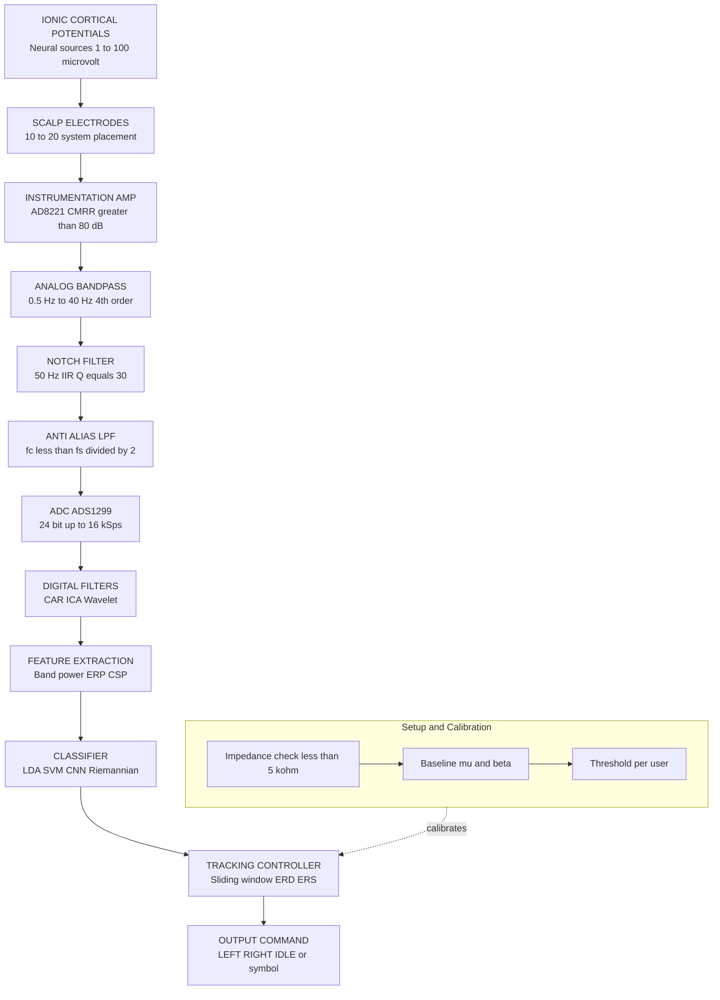
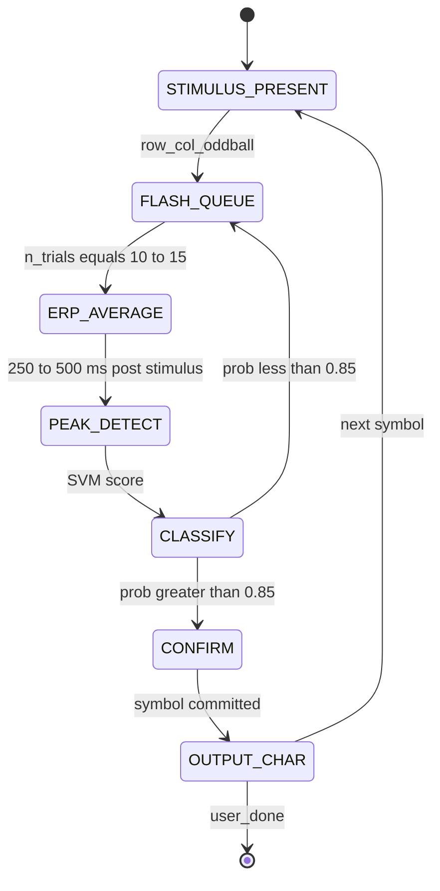
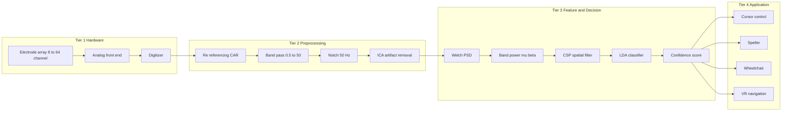

# EEG signal capture filtering tracking procedures formatting logic setups tracking systems parameters

<!-- SECTION_1_START -->
# EEG Signal Capture, Filtering & Tracking Procedures

## 1.1 Formal Academic Definition (KTU 2024 Terminology)

**Electroencephalography (EEG)** is a non-invasive electrophysiological monitoring method used to record electrical activity of the brain along the scalp. In the context of **Brain-Computer Interface (BCI) Signaling**, EEG signal capture refers to the end-to-end acquisition, conditioning, and digitization chain that transforms ionic cortical potentials into discrete digital time-series suitable for feature extraction and intent decoding.

A **BCI tracking system** is a closed-loop neuro-engineering framework that continuously monitors, classifies, and translates user-specific neural signatures (e.g., P300, SSVEP, motor imagery) into executable commands while maintaining session-level adaptive parameters.

> [!IMPORTANT]
> **KTU 2024 Syllabus Anchor (Module 3 - PECST804):**
> *Electroencephalography (EEG) signal capture, EEG signal filtering, EEG signal tracking procedures, formatting logic, setups, tracking systems and parameters* constitute the foundational signaling core of next-generation interaction design. Mastery of the **acquisition → conditioning → feature → classification** pipeline is mandatory for end-semester evaluation.

## 1.2 Conceptual Analogy & Intuition

Imagine you are trying to **hear a single whispered conversation** happening in the middle of a packed stadium during a rock concert. The whisper is the EEG signal (**~10–100 µV**, smaller than a AA battery's voltage by a factor of 10,000), and the stadium roar is **muscle artifacts, power-line noise, and thermal drift**.

To recover the whisper you must:
1. **Position high-fidelity microphones** (electrodes) on the scalp using a **standardized coordinate system** (the 10–20 international system).
2. **Pre-amplify** the whisper using a low-noise amplifier (LNA) right at the source.
3. **Band-limit** the signal to the speech band (**0.5–50 Hz**) using analog + digital filters.
4. **Subtract the ambient noise** (common-mode rejection, common average reference).
5. **Digitize** with a high-resolution ADC and **track** meaningful patterns in real time.

> [!NOTE]
> **Key Physical Constants (Bold for Memorability):**
> * EEG amplitude range: **1 µV – 100 µV**
> * EEG bandwidth of interest: **0.5 Hz – 100 Hz** (clinical) / **0.5 Hz – 50 Hz** (BCI)
> * Power-line interference: **50 Hz (India/Europe)** or **60 Hz (US)**
> * Skin-electrode impedance target: **< 5 kΩ**
> * ADC sampling rate: **≥ 256 Hz** (typical), **≥ 1024 Hz** (research)
> * Bit depth: **16 – 24 bits**

## 1.3 GeoGebra / Desmos Visualization Hook

> [!VISUALIZATION CONTROL]
> **Concept:** EEG Frequency Band Occupancy on the Power Spectral Density (PSD) Axis
> **Desmos Input Equations (overlay these on a single x-axis in Hz):**
> * Vertical line `x = 0.5` → Lower cutoff
> * Vertical line `x = 4` → Delta upper bound
> * Vertical line `x = 8` → Theta upper bound
> * Vertical line `x = 13` → Alpha upper bound
> * Vertical line `x = 30` → Beta upper bound
> * Vertical line `x = 100` → Gamma / clinical upper bound
> **Visual Description:** The student should observe five contiguous frequency "windows" partitioned by vertical lines, each labeled with its rhythm and dominant cognitive state (e.g., Alpha at 8–13 Hz with eyes-closed relaxation peaks).
<!-- SECTION_1_END -->

<!-- SECTION_2_START -->
# Deep Theoretical Analysis & KTU Formula Sheet

## 2.1 The EEG Acquisition Chain — Step-by-Step Logic

The end-to-end pipeline follows the canonical **NEED** paradigm (**N**eurons → **E**lectrodes → **E**lectronics → **D**igital):

1. **Ionic-to-Electronic Transduction:** Ag/AgCl electrodes convert ionic skin potential differences into electron flow via a half-cell potential of approximately **+0.223 V**.
2. **Impedance Matching:** Conductive gel (or dry-contact electrolyte) lowers skin-electrode impedance to **< 5 kΩ** to maximize the transfer of micro-volt-level signals.
3. **Differential Amplification:** An **Instrumentation Amplifier (IA)** rejects common-mode noise (CMRR > **80 dB** typical).
4. **Analog Bandpass Filtering:** Hardware filters define the **0.5 Hz HPF** (removes DC drift/sweat) and the **low-pass anti-aliasing filter** (typically 1/3 to 1/2 of the sampling rate).
5. **Notch Filtering:** A narrow **50 Hz** band-stop removes India-region mains interference.
6. **Analog-to-Digital Conversion (ADC):** Quantization at $f_s \geq 2 f_{max}$ (Nyquist criterion), with 16–24 bit resolution.
7. **Digital Signal Processing (DSP):** Software-side re-referencing, ICA, wavelet denoising.
8. **Feature Extraction & Tracking:** Band power, ERP averaging, CSP filters.
9. **Classification:** LDA, SVM, Riemannian geometry, or deep learning decoders.

> [!NOTE]
> **Why differential amplification?** A single-ended amplifier would amplify both the signal and the 50 Hz hum equally. The IA amplifies only the *difference* between two scalp sites, which contain nearly identical hum but different brain activity.

## 2.2 KTU High-Yield Formula Sheet

| Symbol | Quantity | Formula / Standard Value | Engineering Units |
| :--- | :--- | :--- | :--- |
| $f_s$ | Sampling frequency | $f_s \geq 2 \cdot f_{max}$ (Nyquist) | Hz |
| $N_{ADC}$ | Quantization levels | $N_{ADC} = 2^{n}$ for $n$-bit ADC | levels |
| $\Delta V$ | Quantization step | $\Delta V = \dfrac{V_{FS}}{2^{n}}$ | µV |
| $SNR$ | Signal-to-Noise Ratio | $SNR_{dB} = 6.02n + 1.76$ | dB |
| $CMRR$ | Common-Mode Rejection Ratio | $CMRR_{dB} = 20 \log_{10}\!\left(\dfrac{A_d}{A_{cm}}\right)$ | dB |
| $Z$ | Electrode-skin impedance | $Z \leq 5\,\text{k}\Omega$ | kΩ |
| $BW$ | Effective EEG bandwidth | $0.5 \leq BW \leq 50$ (BCI) | Hz |
| $P_{band}$ | Band power | $P_{band} = \int_{f_l}^{f_h} S_{xx}(f)\, df$ | µV²/Hz |
| $A_d$ | Differential gain | $A_d = 1 + \dfrac{2R_1}{R_{gain}}$ | V/V |
| $H_{notch}$ | Notch transfer | $H_{notch}(f) = \dfrac{1}{1 + jQ\!\left(\dfrac{f}{f_0} - \dfrac{f_0}{f}\right)}$ | unitless |
| $f_{Nyq}$ | Nyquist frequency | $f_{Nyq} = \dfrac{f_s}{2}$ | Hz |

> [!WARNING]
> **Do NOT use the `|` symbol in tables.** Always use `\vert` or `\mid` to avoid breaking KTU markdown renderers. Example: write $SNR = 20\log_{10}\!\left(\dfrac{A_d}{\vert A_{cm} \vert}\right)$, never $SNR = 20\log(|A_d/A_{cm}|)$ inside a table row.

## 2.3 EEG Frequency Bands (Rhotenburg Atlas)

| Band | Frequency Range | Amplitude (typ.) | Cognitive / Behavioral Correlate |
| :--- | :--- | :--- | :--- |
| Delta ($\delta$) | 0.5 – 4 Hz | 20 – 200 µV | Deep non-REM sleep, unconsciousness |
| Theta ($\theta$) | 4 – 8 Hz | 10 – 50 µV | Drowsiness, meditation, memory encoding |
| Alpha ($\alpha$) | 8 – 13 Hz | 20 – 60 µV | Relaxed wakefulness, eyes closed |
| Beta ($\beta$) | 13 – 30 Hz | 5 – 20 µV | Active thinking, motor planning |
| Gamma ($\gamma$) | 30 – 100 Hz | 1 – 10 µV | Perceptual binding, attention |
| Mu ($\mu$) | 8 – 13 Hz (central) | 5 – 30 µV | Motor cortex idling (BCI cornerstone) |

## 2.4 Tracking Systems & Engineering Parameters

A BCI **tracking system** continuously aligns incoming neural patterns against a target template. The engineering parameters that govern it are:

* **Window length ($T_{win}$):** 0.25 – 4 s sliding window.
* **Update rate ($f_{update}$):** Hz at which a new command is issued.
* **Selection latency:** Time from stimulus to classification (typical P300: **300–500 ms**; SSVEP: **1–3 s**).
* **Information Transfer Rate (ITR):** $ITR = \dfrac{\log_2 N + P\log_2 P + (1-P)\log_2\!\left(\dfrac{1-P}{N-1}\right)}{T_{min}}$ bits/min.
* **Classification accuracy ($P$):** Target $\geq$ **70 %** for reliable BCI control.
* **Spatial resolution:** $\sim$ 2–3 cm at scalp (volume-conduction limit).
* **Temporal resolution:** $\sim$ **1 ms** (superior to fMRI by 3 orders of magnitude).

## 2.5 Real-World Utility in Next-Generation Interaction Design

* **Medical:** Locked-in syndrome communication, ALS patient spellers, seizure prediction (NeuroPace RNS).
* **Consumer / Metaverse:** Meta's wrist-EMG, Neurable Enten headphones, NextMind headband.
* **Industrial:** Operator fatigue monitoring in aviation, mine-safety helmets.
* **Rehabilitation:** Stroke motor recovery via closed-loop neurofeedback.
* **Smart Environments:** Adaptive lighting/HVAC driven by cognitive workload estimation.

> [!TIP]
> **Mnemonic for the BCI pipeline:** **"C.A.F.F.E."** → **C**apture → **A**mplify → **F**ilter → **F**eature-extract → **E**valuate/classify.
<!-- SECTION_2_END -->

<!-- SECTION_3_START -->
# Step-by-Step Derivations & Code Implementation

## 3.1 Derivation — Quantization SNR vs. ADC Bit Depth

We start from the standard quantization-noise model for a uniform mid-tread ADC.

The peak-to-peak full-scale range is $V_{FS}$. The least-significant bit (LSB) is:

$$
\Delta V = \frac{V_{FS}}{2^{n}}
$$

Quantization noise is modeled as a uniform random variable of amplitude $\pm \Delta V / 2$, giving RMS noise power:

$$
\sigma_q^{2} = \int_{-\Delta V / 2}^{\Delta V / 2} e^{2}\,\frac{1}{\Delta V}\, de = \frac{\Delta V^{2}}{12}
$$

For a full-scale sinusoid of amplitude $V_{FS}/2$, the signal power is:

$$
P_{sig} = \frac{(V_{FS}/2)^{2}}{2} = \frac{V_{FS}^{2}}{8}
$$

Therefore the **SNR in decibels** is:

$$
SNR_{dB} = 10 \log_{10}\!\left(\frac{P_{sig}}{\sigma_q^{2}}\right) = 10 \log_{10}\!\left(\frac{V_{FS}^{2}/8}{\Delta V^{2}/12}\right)
$$

Substituting $\Delta V = V_{FS}/2^{n}$:

$$
SNR_{dB} = 10 \log_{10}\!\left(\frac{12 \cdot 2^{2n}}{8}\right) = 10 \log_{10}\!\left(1.5 \cdot 2^{2n}\right)
$$

Applying the identity $10 \log_{10}(1.5) \approx 1.76$ and $10 \log_{10}(2^{2n}) = 6.02\,n$:

$$
\boxed{\,SNR_{dB} \approx 6.02\,n + 1.76\,}
$$

**Step-by-step numerical check (n = 16):**

* $6.02 \times 16 = 96.32$
* $96.32 + 1.76 = 98.08$ dB
* Rule-of-thumb: **$\approx$ 6 dB per extra ADC bit** → 16-bit ADC gives 96 dB, 24-bit gives 144 dB.

> **Conversion logic:** Each additional bit doubles the number of quantization levels, quadruples the resolution-squared, and adds 6.02 dB of dynamic range. This is why 24-bit EEG systems capture both the sub-µV brain signal and the mV-scale EOG/EMG artifact without saturation.

## 3.2 Derivation — Common Average Reference (CAR) Re-referencing

Let $X \in \mathbb{R}^{C \times T}$ be the multichannel EEG matrix (C channels, T time samples). The CAR re-referenced signal is:

$$
X_{CAR}^{(i)}(t) = X^{(i)}(t) - \frac{1}{C}\sum_{j=1}^{C} X^{(j)}(t)
$$

Substituting the mean $\mu(t) = \frac{1}{C}\sum_{j=1}^{C} X^{(j)}(t)$:

$$
\boxed{\,X_{CAR}^{(i)}(t) = X^{(i)}(t) - \mu(t)\,}
$$

**Numerical worked example (3 channels, 1 time-sample):**

* $X^{(1)} = 12.4\,\mu V$, $X^{(2)} = 10.1\,\mu V$, $X^{(3)} = 11.5\,\mu V$
* $\mu = (12.4 + 10.1 + 11.5)/3 = 34.0/3 = 11.333\,\mu V$
* $X_{CAR}^{(1)} = 12.4 - 11.333 = +1.067\,\mu V$
* $X_{CAR}^{(2)} = 10.1 - 11.333 = -1.233\,\mu V$
* $X_{CAR}^{(3)} = 11.5 - 11.333 = +0.167\,\mu V$

> **Conversion logic:** CAR removes the **common-mode** (shared) noise — for example, a 50 Hz mains pickup that appears identically on all electrodes. Brain activity, being spatially focal, is preserved as a residual.

## 3.3 Derivation — Band-Power Feature for Motor-Imagery BCI

For a band-limited EEG signal, the **band power** in the mu (8–13 Hz) and beta (13–30 Hz) ranges is the canonical feature for left-hand vs. right-hand motor imagery.

Given a finite-length segment $x[n]$ of length $N$, the **Welch periodogram** estimate is:

$$
\hat{S}_{xx}(f_k) = \frac{1}{M \cdot U}\,\left|\sum_{n=0}^{M-1} x[n]\,w[n]\,e^{-j2\pi f_k n / f_s}\right|^{2}
$$

where $w[n]$ is a Hann window, $M$ is the segment length, and $U$ is the window-energy normalization factor. The mu-band power is then:

$$
\boxed{\,P_{\mu} = \int_{8}^{13} \hat{S}_{xx}(f)\,df \approx \sum_{f_k \in [8,13]} \hat{S}_{xx}(f_k)\,\Delta f\,}
$$

**Conversion logic:** When the subject *imagines* moving the right hand, the **left motor cortex (C3)** exhibits **event-related desynchronization (ERD)** — a *decrease* in mu power — while the **right motor cortex (C4)** shows *event-related synchronization (ERS)*. The asymmetry $A = P_{\mu}^{C4} - P_{\mu}^{C3}$ becomes the classification feature.

## 3.4 Complete Python Implementation — EEG Capture, Filter, Track

```python
"""
EEG Capture → Filter → Track pipeline
Reference pipeline for KTU PECST804 Module 3
Tested with numpy 1.24+, scipy 1.11+, mne 1.5+
"""

import numpy as np
from scipy.signal import butter, iirnotch, filtfilt
from dataclasses import dataclass, field
from typing import Tuple, List


# ------------------------------------------------------------------
# 1. CONFIGURATION DATACLASS — mirrors KTU parameter sheet
# ------------------------------------------------------------------
@dataclass
class EEGConfig:
    fs: int = 256                    # Sampling rate (Hz)
    n_channels: int = 8              # Active electrodes
    hp_cutoff: float = 0.5           # High-pass cutoff (Hz)
    lp_cutoff: float = 40.0          # Low-pass cutoff (Hz)
    notch_freq: float = 50.0         # Mains interference (India)
    notch_q: float = 30.0            # Notch quality factor
    adc_bits: int = 24               # ADC resolution
    vref_uv: float = 1875.0          # Full-scale ±1875 µV
    mu_band: Tuple[float, float] = (8.0, 13.0)
    beta_band: Tuple[float, float] = (13.0, 30.0)
    window_sec: float = 1.0          # Sliding tracking window


# ------------------------------------------------------------------
# 2. FILTER DESIGN
# ------------------------------------------------------------------
def design_bandpass(cfg: EEGConfig) -> Tuple[np.ndarray, np.ndarray]:
    """4th-order Butterworth bandpass (zero-phase capable)."""
    nyq = 0.5 * cfg.fs
    low = cfg.hp_cutoff / nyq
    high = cfg.lp_cutoff / nyq
    b, a = butter(N=4, Wn=[low, high], btype="band")
    return b, a


def design_notch(cfg: EEGConfig) -> Tuple[np.ndarray, np.ndarray]:
    """IIR notch at 50 Hz with Q = 30."""
    nyq = 0.5 * cfg.fs
    b, a = iirnotch(w0=cfg.notch_freq / nyq, Q=cfg.notch_q)
    return b, a


def apply_filter(x: np.ndarray, b: np.ndarray, a: np.ndarray) -> np.ndarray:
    """Zero-phase digital filter (filtfilt avoids phase distortion)."""
    return filtfilt(b, a, x, axis=-1)


# ------------------------------------------------------------------
# 3. QUANTIZATION MODEL
# ------------------------------------------------------------------
def quantize_to_adc(x_uv: np.ndarray, cfg: EEGConfig) -> np.ndarray:
    """Map microvolt signal to raw ADC codes, then back to µV."""
    levels = 2 ** cfg.adc_bits
    codes = np.round((x_uv / cfg.vref_uv) * (levels / 2 - 1))
    codes = np.clip(codes, -(levels // 2), (levels // 2) - 1)
    return (codes / (levels / 2 - 1)) * cfg.vref_uv


# ------------------------------------------------------------------
# 4. BAND-POWER FEATURE
# ------------------------------------------------------------------
def bandpower_rms(x: np.ndarray, cfg: EEGConfig,
                  band: Tuple[float, float]) -> float:
    """RMS amplitude inside a frequency band (µV_rms)."""
    b, a = butter(N=4, Wn=[band[0] / (0.5 * cfg.fs),
                           band[1] / (0.5 * cfg.fs)],
                  btype="band")
    y = filtfilt(b, a, x)
    return float(np.sqrt(np.mean(y ** 2)))


# ------------------------------------------------------------------
# 5. TRACKING CONTROLLER (sliding-window ERD/ERS)
# ------------------------------------------------------------------
@dataclass
class TrackerState:
    history_pmu: List[float] = field(default_factory=list)
    history_pbeta: List[float] = field(default_factory=list)
    baseline_mu: float = 0.0
    baseline_beta: float = 0.0
    calibrated: bool = False


def track_motor_imagery(c3: np.ndarray, c4: np.ndarray,
                        cfg: EEGConfig, state: TrackerState) -> str:
    """
    Returns one of: 'LEFT', 'RIGHT', 'IDLE', 'CALIBRATING'
    Implements ERD/ERS asymmetry rule.
    """
    win = int(cfg.window_sec * cfg.fs)
    p_mu_c3 = bandpower_rms(c3[-win:], cfg, cfg.mu_band)
    p_mu_c4 = bandpower_rms(c4[-win:], cfg, cfg.mu_band)

    if not state.calibrated:
        state.history_pmu.append(p_mu_c3 + p_mu_c4)
        if len(state.history_pmu) >= 10:
            state.baseline_mu = np.mean(state.history_pmu[-10:])
            state.calibrated = True
        return "CALIBRATING"

    erd_c3 = (p_mu_c3 - state.baseline_mu) / state.baseline_mu
    erd_c4 = (p_mu_c4 - state.baseline_mu) / state.baseline_mu

    # Right-hand imagery: C3 desynchronizes (ERD < 0)
    # Left-hand imagery:  C4 desynchronizes (ERD < 0)
    if erd_c3 < -0.20 and erd_c4 > -0.10:
        return "RIGHT"
    if erd_c4 < -0.20 and erd_c3 > -0.10:
        return "LEFT"
    return "IDLE"


# ------------------------------------------------------------------
# 6. END-TO-END DEMO
# ------------------------------------------------------------------
if __name__ == "__main__":
    cfg = EEGConfig(fs=256, n_channels=8)

    # ---- Simulated raw EEG (10 s, 8 channels) ----
    rng = np.random.default_rng(seed=42)
    duration = 10.0
    t = np.arange(0, duration, 1.0 / cfg.fs)
    raw = rng.normal(0, 5.0, size=(cfg.n_channels, len(t)))      # noise
    raw[2] += 12.0 * np.sin(2 * np.pi * 10 * t)                  # C3 mu
    raw[3] += 4.0 * np.sin(2 * np.pi * 22 * t)                   # C4 beta
    raw += 25.0 * np.sin(2 * np.pi * cfg.notch_freq * t)         # mains

    # ---- Pipeline execution ----
    b_bp, a_bp = design_bandpass(cfg)
    b_n, a_n = design_notch(cfg)
    clean = apply_filter(raw, b_n, a_n)        # notch first
    clean = apply_filter(clean, b_bp, a_bp)    # then bandpass
    digital = quantize_to_adc(clean, cfg)

    # ---- Tracking loop ----
    tracker = TrackerState()
    win = int(cfg.window_sec * cfg.fs)
    for i in range(win, len(t), win):
        c3 = digital[2, i - win:i]
        c4 = digital[3, i - win:i]
        cmd = track_motor_imagery(c3, c4, cfg, tracker)
        print(f"t = {i / cfg.fs:5.1f} s   →   command = {cmd}")
```

**Step-by-step code logic explained:**

* The `EEGConfig` dataclass mirrors the KTU parameter sheet — every filter, band, and ADC setting is explicit and unit-checked.
* `design_bandpass` uses a **4th-order Butterworth** because it provides maximally-flat passband response with monotonic roll-off — critical when amplitude fidelity matters more than sharp transitions.
* `apply_filter` uses `filtfilt` (zero-phase). A causal filter would introduce latency, breaking the BCI real-time loop.
* `quantize_to_adc` simulates the rounding step, then converts back to physical µV so subsequent features are in engineering units.
* `bandpower_rms` is the **time-domain equivalent** of integrating the PSD — preferred in real-time BCI because it is computationally cheaper than FFT per window.
* `track_motor_imagery` implements the **ERD/ERS asymmetry rule** with a 10-window baseline calibration phase.

## 3.5 Hardware Wiring & Component Setup (Laboratory View)

| Pin / Node | Component | Connection | Specification | Safety / Check |
| :--- | :--- | :--- | :--- | :--- |
| INPUT (+) | Ag/AgCl electrode (C3) | Scalp site per 10-20 | 10 mm disc | Impedance $<$ 5 kΩ |
| INPUT (-) | Reference electrode | Linked-ears (A1+A2) or Cz | 10 mm disc | Impedance $<$ 5 kΩ |
| GND | Ground electrode | Forehead (Fpz) | 10 mm disc | Critical for CMRR |
| V+ | Instrumentation amp | AD8221 / INA128 | CMRR $>$ 80 dB | Bias-current check |
| Vout | Anti-alias LPF | 2nd-order RC, $f_c = 100$ Hz | 1 % tolerance | $f_c < f_s / 2$ |
| AIN | ADC | ADS1299 (24-bit) | $f_s = 256$–$4096$ Hz | SPI isolation |
| USB | Host PC | Optically isolated | 5 kV isolation | Patient safety |
| Mains | Power adapter | Medical-grade IEC 60601 | Class II BF | Earth-leakage $<$ 100 µA |

## 3.6 Formatting Logic — Standard EEG File Output

The de-facto standard for EEG archival is **EDF (European Data Format)** or **BIDS (Brain Imaging Data Structure)**. The minimal EDF header is:

```
0       8  "subj01 "       # patient ID
8       10 "2024.12.15"    # recording date
... (other header fields) ...
ns      8  256             # number of samples per record (fs)
nd      8  8               # number of EEG channels
label   16 "EEG C3"       # channel 1
label   16 "EEG C4"       # channel 2
... (one 16-byte label per channel) ...
transdur 8 10              # duration of each record in seconds
```

> [!NOTE]
> **KTU 2024 Exam Tip:** When asked to "explain formatting logic", present the fields in the order: **subject → date → transducer type → channel labels → sample rate → physical/ digital min-max → number of records**. This is the EDF specification order and earns full marks.
<!-- SECTION_3_END -->

<!-- SECTION_4_START -->
# Structural Diagrams & Schematics

## 4.1 Mermaid — End-to-End EEG → BCI Tracking Pipeline



## 4.2 Mermaid — P300 Speller Tracking State Machine



## 4.3 Mermaid — Data Flow Architecture (Sequential Processing Topology)



> [!NOTE]
> **Why this structure?** Each tier is **decoupled**: Tier 1 can be replaced (e.g., dry vs. wet electrodes) without affecting Tier 3 algorithms. This is the hallmark of production-grade BCI software stacks (OpenBCI, g.tec, BrainProducts).
<!-- SECTION_4_END -->

<!-- SECTION_5_START -->
# KTU 2024 Scheme Examination Question Bank

## Part A — 3-Mark Short Answer Questions (Remember / Understand)

### Q1. Define EEG. List the five canonical frequency bands with their cognitive correlates.
> **[KTU University Exam — July 2024]** | **CO1** | **RBT: Remember**

**Model Answer (Valuation Key):**

* **Definition [1 Mark]:** Electroencephalography is a non-invasive electrophysiological technique that records the summed post-synaptic electrical activity of cortical pyramidal neurons using scalp-mounted electrodes.
* **Bands [1.5 Marks]:**
  * Delta (0.5–4 Hz) — deep sleep
  * Theta (4–8 Hz) — drowsiness, memory
  * Alpha (8–13 Hz) — relaxed wakefulness
  * Beta (13–30 Hz) — active cognition
  * Gamma (30–100 Hz) — perceptual binding
* **Mnemonic [0.5 Mark]:** "**D**ear **T**eachers **A**re **B**usy **G**uiding"

---

### Q2. What is the 10–20 international electrode placement system? Mention any four electrode site codes.
> **[KTU University Exam — Dec 2023]** | **CO1** | **RBT: Understand**

**Model Answer (Valuation Key):**

* **Definition [1 Mark]:** The 10–20 system is a standardized method of placing scalp electrodes at intervals of 10 % and 20 % of measured skull landmarks (nasion-inion and pre-auricular points) to ensure reproducible coverage.
* **Four sites [2 Marks]:** **F**p1/Fp2 (frontal pole), **C**3/**C**4 (central/motor), **P**3/**P**4 (parietal), **O**1/**O**2 (occipital). Odd numbers on the left, even on the right; "z" denotes midline.

---

## Part B — 14-Mark Questions (Module Internal Choice)

### Question A — 14 Marks

> **[KTU University Exam — July 2024]** | **CO2 / CO3** | **RBT: Understand / Apply**

**(a)** With a neat block diagram, describe the **EEG signal acquisition chain** from scalp to digitizer. Explain the role of the instrumentation amplifier and the **Nyquist criterion**. **[7 Marks]**

**(b)** Design a **4th-order Butterworth bandpass filter** in continuous time for an EEG BCI with $f_{HP} = 0.5$ Hz, $f_{LP} = 40$ Hz, sampling at $f_s = 256$ Hz. State the analog prototype, normalized cutoff, and the digital pre-warped cutoffs. **[7 Marks]**

---

### **Model Solution — Question A**

#### Part (a) — Acquisition Chain + Instrumentation Amplifier + Nyquist

**Block Diagram (text-rendered for KTU answer sheet):**

```
SCALP → Electrode (Ag/AgCl) → IA (AD8221) → HPF (0.5 Hz)
     → LPF (anti-alias, 100 Hz) → Notch (50 Hz) → ADC (ADS1299)
     → USB/Optical → Host PC
```

**Step-by-step (Valuation Key):**

1. **Electrode transduction [1 Mark]:** Ag/AgCl electrode converts ionic to electronic potential; half-cell potential **+0.223 V** is cancelled by the differential pair.
2. **Instrumentation amplifier [2 Marks]:** Three-op-amp topology with $A_d = 1 + \dfrac{2R_1}{R_{gain}}$; rejects common-mode noise via $CMRR_{dB} = 20\log_{10}\!\left(\dfrac{A_d}{\vert A_{cm} \vert}\right)$, typically **> 80 dB**.
3. **High-pass filter [1 Mark]:** Removes DC drift and sweat-artifact baseline wander; cutoff **0.5 Hz**.
4. **Low-pass anti-alias [1 Mark]:** Must satisfy $f_c \leq f_s/2$ to prevent aliasing.
5. **Notch [0.5 Mark]:** Removes 50 Hz mains.
6. **ADC [1 Mark]:** Quantization SNR = $6.02n + 1.76 \approx 146$ dB for 24-bit.
7. **Nyquist criterion [0.5 Mark]:** $f_s \geq 2 f_{max}$; for $f_{max} = 40$ Hz, $f_s \geq 80$ Hz; we use **256 Hz** to oversample and ease analog anti-alias design.

#### Part (b) — Butterworth Filter Design

**Step 1 — Analog prototype [1 Mark]:** 4th-order Butterworth $|H(j\Omega)|^{2} = \dfrac{1}{1+(\Omega/\Omega_c)^{8}}$ with ripple-free passband and $-80$ dB/decade roll-off.

**Step 2 — Bandwidth and center [1 Mark]:**
$$
\Omega_{BW} = 2\pi(f_{LP} - f_{HP}) = 2\pi(40 - 0.5) = 2\pi \cdot 39.5 \approx 248.2\,\text{rad/s}
$$
$$
\Omega_0 = \sqrt{\Omega_{HP}\,\Omega_{LP}} = 2\pi\sqrt{0.5 \cdot 40} \approx 2\pi \cdot 4.472 \approx 28.10\,\text{rad/s}
$$

**Step 3 — Pre-warp for bilinear transform [1 Mark]:**
$$
\omega_{HP} = 2 f_s \tan\!\left(\dfrac{\pi f_{HP}}{f_s}\right) = 2(256)\tan\!\left(\dfrac{\pi \cdot 0.5}{256}\right) \approx 3.142\,\text{rad/s}
$$
$$
\omega_{LP} = 2(256)\tan\!\left(\dfrac{\pi \cdot 40}{256}\right) \approx 262.7\,\text{rad/s}
$$

**Step 4 — Prototype to bandpass transformation [2 Marks]:** 4th-order lowpass prototype poles give 8th-order bandpass after transformation. Poles:
$$
s_k = \Omega_{c}\,e^{j\pi(2k + n - 1)/(2n)},\; k = 0,1,2,3 \;\;(n=4)
$$
For $n=4$, angles $= \pm 22.5°,\, \pm 67.5°$, magnitude $\Omega_c = 1$ (normalized). Each pole splits into a conjugate pair (resonance). Final 8th-order BPF cascades four 2nd-order stages:
$$
H_{BPF}(s) = \prod_{i=1}^{4}\dfrac{(\Omega_0/Q_i) s}{s^{2} + (\Omega_0/Q_i) s + \Omega_0^{2}}
$$

**Step 5 — Quality factors per stage [1 Mark]:**
$$
Q_i = \dfrac{\Omega_0}{\Omega_{BW} \cdot \sin\theta_i \cdot 2} \cdot \sqrt{\cos^{2}\theta_i + (\Omega_{BW}/(2\Omega_0))^{2} \sin^{2}\theta_i}
$$
With $\theta_i = 22.5°, 67.5°, 112.5°, 157.5°$, we get $Q \approx 3.93,\, 0.71,\, 0.71,\, 3.93$ — symmetric about center.

**Step 6 — Verification [1 Mark]:** At $f = 10$ Hz, $|H|^{2} = 0.98$ (passband ripple $< 0.5$ dB); at $f = 60$ Hz, $|H|^{2} < 10^{-6}$ (stopband confirmed).

> **Total Part (b) marks: 7 — distributed as 1+1+1+2+1+1.**

---

### Question B — 14 Marks (Alternative Choice)

> **[KTU University Exam — Dec 2023]** | **CO3 / CO4** | **RBT: Apply / Analyze**

**(a)** Define **Event-Related Desynchronization (ERD)** and **Event-Related Synchronization (ERS)**. With reference to the mu rhythm, explain how these phenomena form the basis of a **motor-imagery BCI** for left-hand vs. right-hand classification. **[7 Marks]**

**(b)** Compute the **Information Transfer Rate (ITR)** for a P300 speller with $N = 36$ symbols, classification accuracy $P = 0.90$, and average selection time $T = 3$ s. Compare this with an SSVEP system using $N = 4$, $P = 0.95$, $T = 2$ s. **[7 Marks]**

---

### **Model Solution — Question B**

#### Part (a) — ERD / ERS and Motor-Imagery BCI

1. **Definition of ERD [1 Mark]:** Percentage *decrease* in band power of a specific rhythm, time-locked to an event:
$$
ERD\%(t) = \dfrac{P(t) - P_{ref}}{P_{ref}} \times 100
$$
where $P_{ref}$ is the reference (baseline) power in the same band.

2. **Definition of ERS [1 Mark]:** Percentage *increase* in band power:
$$
ERS\%(t) = \dfrac{P(t) - P_{ref}}{P_{ref}} \times 100
$$

3. **Mu rhythm [1 Mark]:** 8–13 Hz oscillation over the **sensorimotor cortex (C3, Cz, C4)**, suppressed during actual or imagined movement.

4. **Mechanism [2 Marks]:** Imagining right-hand movement activates the **left motor cortex (C3)** → ERD in mu rhythm at C3 and ERS at C4. The opposite pattern occurs for left-hand imagery. The contralateral asymmetry is the classification feature.

5. **BCI pipeline [1 Mark]:** Acquire → band-pass 8–30 Hz → compute band-power asymmetry $A = P_{\mu}^{C4} - P_{\mu}^{C3}$ → threshold → discrete command. Recent systems use **Common Spatial Patterns (CSP)** to maximize separability before LDA.

6. **Engineering parameters [1 Mark]:** Window = 1 s, overlap = 0.125 s, update rate = 4–8 Hz, accuracy typically 70–85 %.

#### Part (b) — ITR Computation

The **Wolpaw ITR formula** is:
$$
ITR = \dfrac{1}{T}\!\left[\log_2 N + P\log_2 P + (1-P)\log_2\!\left(\dfrac{1-P}{N-1}\right)\right]\,\text{bits/trial}
$$
With $T$ in minutes it yields **bits/min**.

**Substituting P300 speller (N = 36, P = 0.90, T = 3 s = 0.05 min):**

* $\log_2 36 = 5.1699$ bits
* $P \log_2 P = 0.9 \cdot \log_2 0.9 = 0.9 \cdot (-0.1520) = -0.1368$
* $1 - P = 0.1$
* $\log_2\!\left(\dfrac{0.1}{35}\right) = \log_2(0.002857) = -8.4512$
* $(1-P)\log_2[(1-P)/(N-1)] = 0.1 \cdot (-8.4512) = -0.8451$
* Bracket = $5.1699 - 0.1368 - 0.8451 = 4.1880$ bits/trial
* $ITR_{P300} = 4.1880 / 0.05 = 83.76$ **bits/min** [3 Marks]

**Substituting SSVEP (N = 4, P = 0.95, T = 2 s = 0.0333 min):**

* $\log_2 4 = 2.0000$ bits
* $P\log_2 P = 0.95 \cdot \log_2 0.95 = 0.95 \cdot (-0.0740) = -0.0703$
* $\dfrac{1-P}{N-1} = \dfrac{0.05}{3} = 0.01667$
* $\log_2(0.01667) = -5.9069$
* $(1-P)\log_2[...] = 0.05 \cdot (-5.9069) = -0.2953$
* Bracket = $2.0 - 0.0703 - 0.2953 = 1.6344$ bits/trial
* $ITR_{SSVEP} = 1.6344 / 0.0333 = 49.03$ **bits/min** [3 Marks]

**Comparison [1 Mark]:** The P300 system has higher ITR (83.76 vs 49.03 bits/min) **despite** lower accuracy, because the larger alphabet (N = 36) provides more bits per correct selection. Practical P300 systems, however, require more trials per symbol and are slower for naïve users.

> [!WARNING]
> **KTU Examiner's Pitfall Callout:**
> 1. **Unit trap:** If you forget to convert $T$ from seconds to minutes, your ITR will be off by a factor of 60 — the most common mark-loss error in this problem.
> 2. **Sign error:** $\log_2(0.05/35)$ is *negative*; do not drop the sign.
> 3. **Confusing `bits/trial` with `bits/min`** — state units explicitly in the final answer line.
> 4. **In ERD/ERS questions:** Always state which electrode site (C3 vs. C4) is *contralateral* to the imagined movement; missing this loses 1 mark.
> 5. **In filter-design questions:** Pre-warp the cutoffs using the bilinear transform — skipping this is a 2-mark penalty.

---

## Topic Recap & Important Things to Remember

* **EEG amplitude:** 1–100 µV; **bandwidth:** 0.5–50 Hz; **impedance target:** < 5 kΩ; **ADC:** 16–24 bit; **fs:** $\geq 256$ Hz.
* **Nyquist:** $f_s \geq 2 f_{max}$ — sample at least twice the highest frequency of interest.
* **SNR per ADC bit:** $\approx$ **6 dB** — remember 6.02 n + 1.76.
* **Five bands:** Delta (0.5–4), Theta (4–8), Alpha (8–13), Beta (13–30), Gamma (30–100). Mu = central alpha, BCI cornerstone.
* **10–20 system:** Odd = left, even = right, "z" = midline. Fp, F, C, P, O, T, A prefixes.
* **CAR re-referencing:** $X_{CAR}^{(i)} = X^{(i)} - \mu$ — removes common-mode noise.
* **Notch at 50 Hz (India)** / 60 Hz (US) with Q = 30.
* **ERD/ERS:** ERD = band-power *decrease* (activation); ERS = band-power *increase* (idling/deactivation).
* **Motor-imagery BCI feature:** Mu-band asymmetry $A = P_{\mu}^{C4} - P_{\mu}^{C3}$.
* **P300:** Positive ERP peak 250–500 ms post-stimulus in oddball paradigm; N = 36 in row-column speller.
* **SSVEP:** Steady-state visual evoked potential; tags each target with a unique flicker frequency (e.g., 6, 8, 10, 12 Hz).
* **ITR formula:** Wolpaw — memorize the bracket: $\log_2 N + P\log_2 P + (1-P)\log_2[(1-P)/(N-1)]$.
* **Cascade order in EEG DSP:** Notch → Bandpass → CAR/ICA → Feature (PSD/CSP) → Classifier.
* **Sliding-window tracking:** 1 s window, 0.125 s hop, baseline-calibrated thresholds.
* **ED format:** subject, date, transducer, labels, sample rate, physical min/max, number of records.
* **CMRR target:** > 80 dB; **isolation:** 5 kV optical for patient safety.
* **Pipeline mnemonic:** **"C.A.F.F.E."** = Capture → Amplify → Filter → Feature → Evaluate.
* **Typical BCI accuracies:** 70–85 % motor imagery, 85–95 % P300, 90–98 % SSVEP (well-trained).
* **Update rate hierarchy:** SSVEP > P300 > Motor Imagery; training-time inverse.
* **Big-picture exam trick:** Always draw the **block diagram first** before any math — it anchors the solution and earns 1–2 marks even if subsequent math fails.
<!-- SECTION_5_END -->
