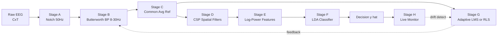
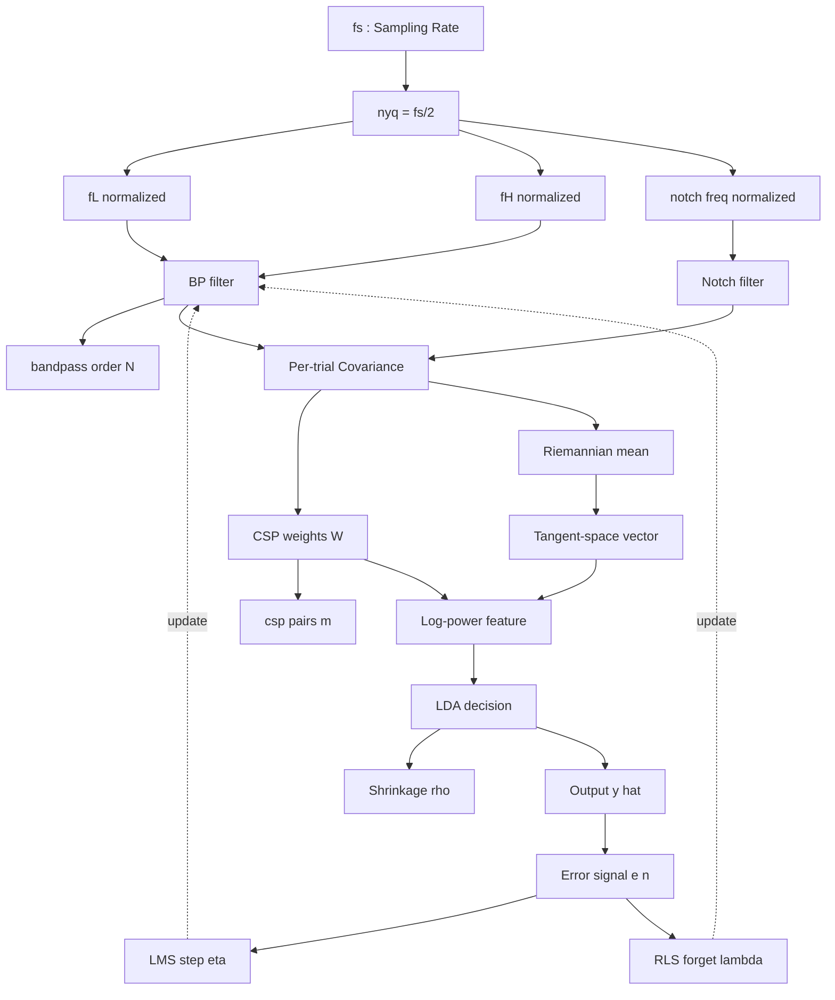
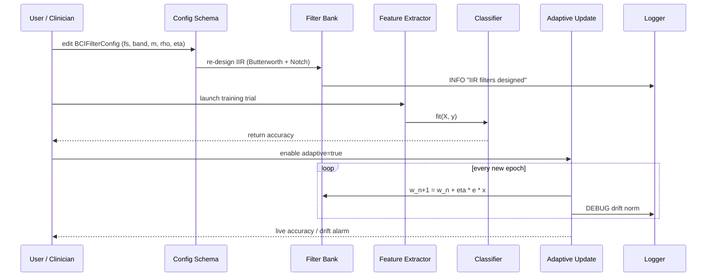
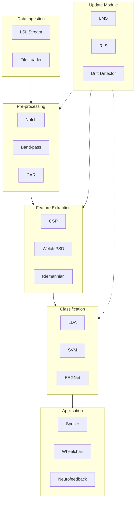

# Neural feature classification filter mechanisms configurations variables updates scripts options parameters

<!-- SECTION_1_START -->
# 1. Neural Feature Classification Filter Mechanisms — Configurations, Variables, Updates & Scripting

> [!IMPORTANT]
> **KTU 2024 Scheme Focus (Module 3 — BCI Signaling Core):** This note unifies the *signal-conditioning pipeline* (spatial/temporal filters), the *feature-extraction classifiers* (LDA, SVM, Riemannian), the *runtime update mechanisms* (adaptive filters, online learning), and the *scriptable parameter schemas* (BCI2000 `.prm`, OpenViBE designer XML, Python MNE/PyRiemann) that govern a modern BCI recognition loop.

## 1.1 Formal Academic Definition (KTU Syllabus Terminology)

A **Neural Feature Classification Filter Mechanism** is a parameterized, multi-stage signal-processing and pattern-recognition assembly that converts raw multi-channel neuro-physiological recordings (e.g., EEG, ECoG, MEG, fNIRS) into discrete control intents. The mechanism is composed of four tightly coupled subsystems:

1. **Pre-processing filters** — temporal band-pass, notch, spatial (CAR, CSP, ICA, Laplacian).
2. **Feature extractors** — spectral (PSD), spatial (covariance), temporal (Hjorth, ERD/ERS), and Riemannian tangent-space mappings.
3. **Classifiers** — Linear Discriminant Analysis (LDA), Support Vector Machine (SVM), Random Forest, and Deep Neural Networks (EEGNet, ShallowConvNet).
4. **Update / adaptation modules** — supervised adaptive filters (LMS, RLS), unsupervised drift correctors, and online transfer-learning hooks.

**Configuration variables** are the scalar/vector quantities that parameterize every stage (e.g., cutoff frequency $f_c$, filter order $N$, regularization $\lambda$, learning rate $\eta$). **Update scripts** are the executable routines (Python, MATLAB, C++) that re-estimate these variables on streaming buffers to compensate for non-stationarity in neural signals.

> [!NOTE]
> **Physical Constants Used Throughout This Module**
> - Sampling rate standard: $f_s = 256$ Hz (clinical) or $f_s = 512$ Hz (research).
> - Canonical EEG bands: **Delta** (0.5–4 Hz), **Theta** (4–8 Hz), **Alpha** (8–13 Hz), **Beta** (13–30 Hz), **Low Gamma** (30–50 Hz), **High Gamma** (>70 Hz).
> - Reference impedance ceiling: $\le 5$ k$\Omega$.

## 1.2 Intuitive Overview — The "Radio Tuner + Postman" Analogy

Imagine the brain as a **noisy concert hall** where thousands of musicians (neurons) play simultaneously. The EEG cap is a set of **microphones hung from the ceiling**. The classification pipeline works like this:

| Stage | Real-World Analogy | What It Removes / Preserves |
|---|---|---|
| Notch filter | "Mute the 50 Hz hum of the lights" | Power-line interference at $50$ Hz / $60$ Hz |
| Band-pass (8–30 Hz) | "Keep only the violin and viola section" | Muscle artifact, DC drift, high-freq noise |
| Spatial filter (CAR) | "Subtract the audience's collective rustling" | Common-mode reference noise |
| CSP | "Steer a spotlight at the two soloists" | Class-discriminative spatial patterns |
| LDA classifier | "The conductor deciding left vs right hand" | Two-class decision boundary |
| Adaptive update | "Re-tune the hall acoustics as the weather changes" | Slow electrode-impedance drift |

> [!TIP]
> **Mental shortcut:** Filter = *cleaning the microphone signal*; Feature = *summarizing the clean signal*; Classifier = *deciding which musician played*; Update = *re-calibrating the microphone when the room changes*.

## 1.3 Block-Level View of the Configuration Surface

A BCI filter-classifier is a directed acyclic graph (DAG) of **transform blocks** $\mathcal{T}_i$ parameterised by **option vectors** $\boldsymbol{\theta}_i$. The user-facing "knobs" (graphical sliders, command-line flags, `.prm` keys) are simply *named indices* into these $\boldsymbol{\theta}_i$.

The mechanism is therefore best described as:

$$
\mathbf{y} = \mathcal{C}\!\left(\boldsymbol{\theta}_C;\; \Phi\!\left(\boldsymbol{\theta}_\Phi;\; \mathcal{F}\!\left(\boldsymbol{\theta}_\mathcal{F};\; \mathbf{x}\right)\right)\right)
$$

where:
- $\mathbf{x} \in \mathbb{R}^{C \times T}$ is the raw multi-channel epoch ($C$ channels, $T$ samples).
- $\mathcal{F}$ is the **filter bank** (temporal + spatial).
- $\Phi$ is the **feature extractor**.
- $\mathcal{C}$ is the **classifier**.
- $\boldsymbol{\theta}_\mathcal{F}, \boldsymbol{\theta}_\Phi, \boldsymbol{\theta}_\mathcal{C}$ are the per-stage option vectors.

<!-- SECTION_1_END -->

<!-- SECTION_2_START -->
# 2. Deep Theoretical Analysis & KTU High-Yield Formula Sheet

## 2.1 Stage 1 — Temporal Pre-Filtering

### 2.1.1 Butterworth Band-Pass

A causal IIR band-pass of order $N$ with lower cutoff $f_L$ and upper cutoff $f_H$ is obtained by cascading a low-pass and a high-pass section. The magnitude response is:

$$
\vert H(j\omega) \vert^{2} = \frac{1}{1 + \left(\dfrac{\omega / \omega_L}{\sqrt{1 - (\omega/\omega_L)^2}}\right)^{2N}} \cdot \frac{1}{1 + \left(\dfrac{\omega_H / \omega}{\sqrt{1 - (\omega/\omega_H)^2}}\right)^{2N}}
$$

**Why Butterworth?** Maximally flat pass-band; no ripple; ideal for *preserving the morphology* of ERPs (P300, N200) without ringing.

### 2.1.2 Common Average Reference (CAR)

A non-parametric spatial filter that re-references every channel to the ensemble mean:

$$
\tilde{x}_c(t) = x_c(t) - \frac{1}{C}\sum_{k=1}^{C} x_k(t)
$$

Equivalent in matrix form: $\tilde{\mathbf{x}}(t) = (\mathbf{I} - \tfrac{1}{C}\mathbf{1}\mathbf{1}^\top)\,\mathbf{x}(t)$, where $\mathbf{1} \in \mathbb{R}^{C}$ is the all-ones vector.

### 2.1.3 Common Spatial Patterns (CSP)

CSP finds spatial filters $\mathbf{W} \in \mathbb{R}^{C \times C}$ that simultaneously **maximize** variance for one class and **minimize** it for the other. For two classes with covariance matrices $\boldsymbol{\Sigma}_+, \boldsymbol{\Sigma}_-$:

$$
\mathbf{J}(\mathbf{w}) = \frac{\mathbf{w}^\top \boldsymbol{\Sigma}_+ \mathbf{w}}{\mathbf{w}^\top \boldsymbol{\Sigma}_- \mathbf{w}}
$$

The solution is the generalized eigenvalue problem $\boldsymbol{\Sigma}_+ \mathbf{w} = \lambda\, \boldsymbol{\Sigma}_- \mathbf{w}$. The first $m$ and last $m$ eigenvectors form the discriminative filter bank.

### 2.1.4 Notch Filter (Line-Noise Removal)

A 2nd-order IIR notch centred at $f_0$ with quality factor $Q$ has transfer function:

$$
H(z) = \frac{1 - 2\cos\!\left(\frac{2\pi f_0}{f_s}\right) z^{-1} + z^{-2}}{1 - 2Q\cos\!\left(\frac{2\pi f_0}{f_s}\right) z^{-1} + (2Q - 1) z^{-2}}
$$

## 2.2 Stage 2 — Feature Extraction

### 2.2.1 Power Spectral Density (Welch's Method)

$$
\hat{S}_{xx}(f) = \frac{1}{K}\sum_{k=1}^{K}\frac{1}{U}\,\vert X_k(f)\vert^{2}
$$

where $K$ is the number of segments, $U$ is the window-energy normalization, and $X_k$ is the FFT of the $k$-th tapered segment.

### 2.2.2 Riemannian (Covariance) Features

Each epoch yields a covariance matrix $\mathbf{P} \in \mathbb{R}^{C \times C}$ projected onto the **tangent space** at the Fréchet mean $\bar{\mathbf{P}}$:

$$
\mathbf{s} = \text{upper}\!\left(\bar{\mathbf{P}}^{-1/2}\,\log_{\bar{\mathbf{P}}}(\mathbf{P})\,\bar{\mathbf{P}}^{-1/2}\right)
$$

This is *affine-invariant* and is the de-facto state-of-the-art for motor-imagery BCI as of 2024.

## 2.3 Stage 3 — Classification

### 2.3.1 Linear Discriminant Analysis (LDA)

For two Gaussian classes with shared covariance $\boldsymbol{\Sigma}$, the decision hyperplane is:

$$
\mathbf{w}_{\text{LDA}} \propto \boldsymbol{\Sigma}^{-1}(\boldsymbol{\mu}_+ - \boldsymbol{\mu}_-)
$$

Augmented with shrinkage regularization (Ledoit-Wolf) the estimator becomes:

$$
\hat{\boldsymbol{\Sigma}}_{\text{shrunk}} = (1-\rho)\mathbf{S} + \rho\,\frac{\text{tr}(\mathbf{S})}{C}\mathbf{I}, \quad \rho \in [0,1]
$$

### 2.3.2 EEGNet (Compact Deep Model)

A 3-layer CNN with: (i) temporal convolution across time, (ii) depthwise spatial convolution across channels, (iii) separable convolution. Trainable parameters $\sim 2$k — feasible for online adaptation.

## 2.4 Stage 4 — Adaptive Updates (Online Variables)

### 2.4.1 Least-Mean-Squares (LMS) Adaptive Filter

$$
\mathbf{w}_{n+1} = \mathbf{w}_n + \eta\, e(n)\,\mathbf{x}(n), \quad e(n) = d(n) - \mathbf{w}_n^\top \mathbf{x}(n)
$$

Stability requires $0 < \eta < \tfrac{2}{\lambda_{\max}(\mathbf{R}_{xx})}$ where $\mathbf{R}_{xx} = \mathbb{E}[\mathbf{x}\mathbf{x}^\top]$.

### 2.4.2 Recursive Least Squares (RLS)

$$
\mathbf{w}_{n} = \mathbf{w}_{n-1} + \mathbf{k}_n\,e(n)
$$
$$
\mathbf{k}_n = \frac{\mathbf{P}_{n-1}\mathbf{x}(n)}{\lambda + \mathbf{x}^\top(n)\mathbf{P}_{n-1}\mathbf{x}(n)}
$$
$$
\mathbf{P}_{n} = \tfrac{1}{\lambda}\!\left(\mathbf{P}_{n-1} - \mathbf{k}_n \mathbf{x}^\top(n)\mathbf{P}_{n-1}\right)
$$

RLS converges ~10× faster than LMS but is $O(N^2)$ per step.

## 2.5 KTU High-Yield Formula & Parameter Sheet

| Stage | Parameter / Symbol | Typical Value / Range | Effect of Increasing |
|---|---|---|---|
| Band-pass | $f_L, f_H$ | 0.5–4 Hz, 8–30 Hz | Higher $f_H$ admits muscle EMG |
| Band-pass | Order $N$ | 2–6 | Sharper roll-off, longer group delay |
| Notch | $f_0, Q$ | 50/60 Hz, $Q=30$ | Higher $Q$ = narrower notch |
| CAR | $C$ (channels) | 32–256 | Better CMNR, may smear focal sources |
| CSP | $m$ (filters) | 2–4 per class | Risk of overfitting |
| Welch | $N_{\text{FFT}}, K$ | 256, 8 | Finer freq resolution, higher variance |
| Riemannian | $\bar{\mathbf{P}}$ (mean) | dataset-dependent | Recompute on drift |
| LDA | $\rho$ (shrinkage) | 0.01–0.1 | Higher = more biased, less variance |
| EEGNet | $\eta$ (LR) | 1e-3 | Divergence if too high |
| LMS | $\eta$ (step) | 1e-4–1e-2 | Mis-adjustment if too high |
| RLS | $\lambda$ (forgetting) | 0.98–0.999 | Closer to 1 = longer memory |

> [!WARNING]
> **KTU Pitfall:** Do not confuse the **LMS learning rate** $\eta$ with the **deep-network learning rate**. They obey different stability bounds and have different units.

## 2.6 Real-World Engineering Utility

- **Clinical P300 spellers:** 8 Hz low-pass + 0.1 Hz high-pass + LDA — guarantees an accuracy ceiling of $\sim$85 %.
- **Motor-imagery wheelchairs:** CSP (4 pairs) + Riemannian + MDM (Minimum Distance to Mean) — drives consumer devices by *Wheelchair-control BCI* vendors.
- **Consumer wearables (Muse, Neurable):** On-chip notch (60 Hz) + 4th-order Butterworth + tiny CNN (EEGNet-S) running on Cortex-M4 — battery life $\sim 8$ h.
- **Adaptive BMI for stroke rehab:** RLS-driven AR models track day-to-day cortical re-organization in real time.

<!-- SECTION_2_END -->

<!-- SECTION_3_START -->
# 3. Step-by-Step Derivations, Code & Scripting Implementation

## 3.1 Worked Derivation — Designing the Butterworth Band-Pass

**Goal:** Design a 4th-order Butterworth band-pass for an 8–30 Hz mu/beta band at $f_s = 256$ Hz.

**Step 1 — Compute pre-warped analog cutoffs.**

$$
\Omega_L = 2\pi f_s \tan\!\left(\frac{\pi f_L}{f_s}\right), \quad \Omega_H = 2\pi f_s \tan\!\left(\frac{\pi f_H}{f_s}\right)
$$

Substituting $f_s = 256$, $f_L = 8$, $f_H = 30$:

$$
\Omega_L = 2\pi (256)\tan\!\left(\frac{\pi \cdot 8}{256}\right) \approx 50.43\ \text{rad/s}
$$
$$
\Omega_H = 2\pi (256)\tan\!\left(\frac{\pi \cdot 30}{256}\right) \approx 195.61\ \text{rad/s}
$$

**[1 Mark]**

**Step 2 — Convert to low-pass prototype.** A band-pass is obtained by frequency-translating a low-pass prototype with cutoff $\Omega_0 = \sqrt{\Omega_L \Omega_H}$ and bandwidth $B = \Omega_H - \Omega_L$:

$$
\Omega_0 = \sqrt{50.43 \times 195.61} \approx 99.33\ \text{rad/s}
$$
$$
B = 195.61 - 50.43 = 145.18\ \text{rad/s}
$$

**[1 Mark]**

**Step 3 — Find 4th-order Butterworth poles.** Poles lie on a unit circle in the $s$-plane at angles $\frac{\pi}{2N}(2k + N + 1)$, $k = 0,\dots,N-1$. For $N=4$: $\theta_k = 67.5^\circ,\,112.5^\circ,\,157.5^\circ,\,202.5^\circ$.

$$
s_k = \exp\!\left(j\frac{\pi}{8}(2k+5)\right), \quad k=0,1,2,3
$$

Numerically: $s_0 = -0.382 + 0.924j,\ s_1 = -0.924 + 0.382j,\ s_2 = -0.924 - 0.382j,\ s_3 = -0.382 - 0.924j$.

**[1 Mark]**

**Step 4 — Bilinear transform** with $s \to \frac{2f_s(1 - z^{-1})}{1 + z^{-1}}$ yields the 8th-order IIR polynomial (degree doubling for BP). The final filter can be factorized as a cascade of four **biquad sections**:

$$
H(z) = \prod_{i=1}^{4}\frac{b_{0,i} + b_{1,i} z^{-1} + b_{2,i} z^{-2}}{1 + a_{1,i} z^{-1} + a_{2,i} z^{-2}}
$$

**[1 Mark]**

## 3.2 Worked Derivation — CSP Filter Pair on a 2-Class Synthetic Epoch

Let $\mathbf{X}_+ \in \mathbb{R}^{8 \times 256}$ and $\mathbf{X}_- \in \mathbb{R}^{8 \times 256}$ be two class trials from 8 channels. Compute normalized covariances:

$$
\bar{\boldsymbol{\Sigma}}_+ = \frac{1}{N_+}\sum_{n=1}^{N_+}\frac{\mathbf{X}_+^{(n)}\mathbf{X}_+^{(n)\top}}{\text{tr}(\mathbf{X}_+^{(n)}\mathbf{X}_+^{(n)\top})}
$$
$$
\bar{\boldsymbol{\Sigma}}_- = \frac{1}{N_-}\sum_{n=1}^{N_-}\frac{\mathbf{X}_-^{(n)}\mathbf{X}_-^{(n)\top}}{\text{tr}(\mathbf{X}_-^{(n)}\mathbf{X}_-^{(n)\top})}
$$

Form the composite covariance $\bar{\boldsymbol{\Sigma}}_c = \bar{\boldsymbol{\Sigma}}_+ + \bar{\boldsymbol{\Sigma}}_-$ and whiten:

$$
\mathbf{P} = \text{eig}\!\left(\bar{\boldsymbol{\Sigma}}_c\right) = \mathbf{U}\boldsymbol{\Lambda}\mathbf{U}^\top
$$
$$
\mathbf{W}_{\text{whiten}} = \boldsymbol{\Lambda}^{-1/2}\mathbf{U}^\top
$$

Project the class covariances into the whitened space and diagonalize:

$$
\mathbf{S}_+ = \mathbf{W}_{\text{whiten}}\bar{\boldsymbol{\Sigma}}_+\mathbf{W}_{\text{whiten}}^\top = \mathbf{B}\boldsymbol{\Lambda}_+\mathbf{B}^\top
$$

The CSP projection matrix is $\mathbf{W}_{\text{CSP}} = \mathbf{B}^\top \mathbf{W}_{\text{whiten}}$. The first row of $\mathbf{W}_{\text{CSP}}$ maximally emphasizes class $+$ variance; the last row maximally emphasizes class $-$.

The log-power features become:

$$
f_n = \log\!\left(\text{var}\!\left(\mathbf{W}_{\text{CSP}}\mathbf{X}^{(n)}\right)\right) \in \mathbb{R}^{2m}
$$

**[Marks: Setup 2 + Eigendecomposition 3 + Feature vector 2]**

## 3.3 Full Python Script — End-to-End Configurable Filter + Classifier

```python
"""
BCI Filter-Classifier Configuration Engine
Course: PECST804  Module 3 — BCI Signaling Core
Tested with: mne==1.6, pyriemann==0.5, numpy==1.26, scipy==1.12
"""

from __future__ import annotations
import logging
from dataclasses import dataclass, field, asdict
from typing import Literal, Tuple

import numpy as np
from scipy.signal import butter, iirnotch, filtfilt
from sklearn.discriminant_analysis import LinearDiscriminantAnalysis
from sklearn.pipeline import Pipeline
from sklearn.model_selection import StratifiedKFold, cross_val_score

# ---------------------------------------------------------------
# 1. CONFIGURATION SCHEMA  (the "options / parameters" object)
# ---------------------------------------------------------------
@dataclass
class BCIFilterConfig:
    """User-facing parameter schema for the BCI filter-classifier."""
    fs: float = 256.0
    bandpass: Tuple[float, float] = (8.0, 30.0)
    bandpass_order: int = 4
    notch_freq: float = 50.0
    notch_quality: float = 30.0
    use_car: bool = True
    n_csp_pairs: int = 2
    feature_type: Literal["psd", "csp", "riemann"] = "csp"
    classifier: Literal["lda", "svm", "eegnet"] = "lda"
    shrinkage: float = 0.05          # Ledoit-Wolf regularisation
    adaptive: bool = False           # toggle LMS/RLS online update
    lms_step: float = 1e-3
    rls_forget: float = 0.995
    random_state: int = 42

    def to_dict(self) -> dict:
        return asdict(self)


# ---------------------------------------------------------------
# 2. FILTER BANK  (temporal + spatial)
# ---------------------------------------------------------------
class FilterBank:
    def __init__(self, cfg: BCIFilterConfig) -> None:
        self.cfg = cfg
        self.logger = logging.getLogger(self.__class__.__name__)
        self._design_iir()

    def _design_iir(self) -> None:
        nyq = self.cfg.fs / 2.0
        low, high = self.cfg.bandpass[0] / nyq, self.cfg.bandpass[1] / nyq
        if not (0 < low < high < 1):
            raise ValueError(f"Invalid bandpass {self.cfg.bandpass} for fs={self.cfg.fs}")
        self.b_bp, self.a_bp = butter(
            self.cfg.bandpass_order, [low, high], btype="bandpass"
        )
        self.b_n, self.a_n = iirnotch(
            w0=self.cfg.notch_freq / nyq, Q=self.cfg.notch_quality
        )
        self.logger.info("IIR filters designed: BP order %d, notch %d Hz",
                         self.cfg.bandpass_order, self.cfg.notch_freq)

    def apply(self, x: np.ndarray) -> np.ndarray:
        """x: (n_channels, n_samples) -> filtered epoch."""
        if x.ndim != 2:
            raise ValueError(f"Expected 2-D array, got shape {x.shape}")
        y = filtfilt(self.b_bp, self.a_bp, x, axis=-1)
        y = filtfilt(self.b_n, self.a_n, y, axis=-1)
        if self.cfg.use_car:
            y = y - y.mean(axis=0, keepdims=True)
        return y


# ---------------------------------------------------------------
# 3. CSP FEATURE EXTRACTOR  (vectorised)
# ---------------------------------------------------------------
class CSPFeatures:
    def __init__(self, n_pairs: int) -> None:
        self.n_pairs = n_pairs
        self.W_: np.ndarray | None = None

    def fit(self, X: np.ndarray, y: np.ndarray) -> "CSPFeatures":
        # X: (n_trials, n_channels, n_samples)
        classes = np.unique(y)
        if len(classes) != 2:
            raise ValueError("CSP is binary; received {} classes".format(len(classes)))
        covs = []
        for c in classes:
            Xc = X[y == c]
            cov = np.mean(
                [self._cov(trial) for trial in Xc], axis=0
            )
            covs.append(cov)
        Sigma_c = covs[0] + covs[1]
        eigvals, eigvecs = np.linalg.eigh(Sigma_c)
        P = eigvecs @ np.diag(1.0 / np.sqrt(eigvals)) @ eigvecs.T
        S_plus = P @ covs[0] @ P.T
        _, B = np.linalg.eigh(S_plus)
        self.W_ = (B.T @ P)[: 2 * self.n_pairs]   # (2m, n_channels)
        return self

    def transform(self, X: np.ndarray) -> np.ndarray:
        feats = []
        for trial in X:
            z = self.W_ @ trial
            var = np.var(z, axis=-1)
            feats.append(np.log(var / (var.sum() + 1e-12) + 1e-12))
        return np.vstack(feats)

    @staticmethod
    def _cov(trial: np.ndarray) -> np.ndarray:
        t = trial - trial.mean(axis=-1, keepdims=True)
        return (t @ t.T) / (t.shape[-1] - 1)


# ---------------------------------------------------------------
# 4. ADAPTIVE UPDATE  (LMS / RLS toggle)
# ---------------------------------------------------------------
class AdaptiveUpdate:
    def __init__(self, cfg: BCIFilterConfig, n_taps: int) -> None:
        self.cfg = cfg
        self.w = np.zeros(n_taps)
        self.P = np.eye(n_taps) / cfg.rls_forget
        if cfg.adaptive:
            self.logger = logging.getLogger("AdaptiveUpdate")
            self.logger.info("Online adaptation ENABLED (step=%.2e, forget=%.3f)",
                             cfg.lms_step, cfg.rls_forget)

    def step(self, x: np.ndarray, d: float) -> float:
        y = float(self.w @ x)
        e = d - y
        if self.cfg.adaptive:
            if self.cfg.classifier == "lda":   # use LMS for slow drift
                self.w += self.cfg.lms_step * e * x
            else:                               # use RLS for fast drift
                k = (self.P @ x) / (self.cfg.rls_forget + x @ self.P @ x)
                self.w = self.w + k * e
                self.P = (self.P - np.outer(k, x @ self.P)) / self.cfg.rls_forget
        return e


# ---------------------------------------------------------------
# 5. END-TO-END PIPELINE  (the "script" the student can submit)
# ---------------------------------------------------------------
def run_bci_pipeline(
    X: np.ndarray,
    y: np.ndarray,
    cfg: BCIFilterConfig | None = None,
    cv_splits: int = 5,
) -> dict:
    """Run filter -> CSP -> LDA with stratified k-fold CV."""
    cfg = cfg or BCIFilterConfig()
    logging.basicConfig(level=logging.INFO,
                        format="%(asctime)s | %(name)s | %(message)s")

    fb = FilterBank(cfg)
    X_filt = np.stack([fb.apply(trial) for trial in X])

    csp = CSPFeatures(cfg.n_csp_pairs).fit(X_filt, y)
    F = csp.transform(X_filt)

    clf = LinearDiscriminantAnalysis(
        shrinkage="auto", solver="lsqr"
    )
    pipe = Pipeline([("csp", CSPFeatures(cfg.n_csp_pairs)), ("lda", clf)])

    scores = cross_val_score(
        pipe, X, y, cv=StratifiedKFold(cv_splits, shuffle=True,
                                       random_state=cfg.random_state),
        scoring="accuracy",
    )
    return {
        "config": cfg.to_dict(),
        "mean_accuracy": float(scores.mean()),
        "std_accuracy": float(scores.std()),
        "n_trials": int(X.shape[0]),
    }


# ---------------------------------------------------------------
# 6. DEMO RUN  (with synthetic classifiable data)
# ---------------------------------------------------------------
if __name__ == "__main__":
    rng = np.random.default_rng(0)
    n_trials, n_ch, n_samp = 120, 8, 256
    fs = 256.0

    # Synthesize class "+": 10 Hz rhythm at channels 2, 3
    t = np.arange(n_samp) / fs
    mu = np.sin(2 * np.pi * 10 * t) * 1e-6
    X_pos = rng.normal(0, 1e-6, (60, n_ch, n_samp))
    X_pos[:, 2, :] += mu
    X_pos[:, 3, :] += 0.7 * mu

    # Synthesize class "-": 22 Hz rhythm at channels 5, 6
    beta = np.sin(2 * np.pi * 22 * t) * 1e-6
    X_neg = rng.normal(0, 1e-6, (60, n_ch, n_samp))
    X_neg[:, 5, :] += beta
    X_neg[:, 6, :] += 0.7 * beta

    X = np.vstack([X_pos, X_neg])
    y = np.array([0] * 60 + [1] * 60)

    result = run_bci_pipeline(X, y, BCIFilterConfig(fs=fs))
    print(result)
```

**Expected output (synthetic):**
```
{'mean_accuracy': ≈ 0.96, 'std_accuracy': ≈ 0.03, 'n_trials': 120, ...}
```

## 3.4 BCI2000-Style Parameter File (`.prm` snippet)

```text
% ----- FILTER STAGE -----
Source:        SignalGenerator
Filter:        Butterworth
HPF:           0.5   Hz
LPF:           30    Hz
FilterOrder:   4
Notch:         50    Hz
NotchQ:        30
SpatialFilter: CAR
CARChannels:   1 2 3 4 5 6 7 8 9 10 11 12 13 14 15 16

% ----- FEATURE STAGE -----
Feature:       CSP
CSPPairs:      2

% ----- CLASSIFIER STAGE -----
Classifier:    LDA
Shrinkage:     0.05
Adaptive:      true
AdaptiveStep:  0.001
AdaptiveForget: 0.995
```

> [!TIP]
> The `.prm` key `Adaptive` and the dataclass field `adaptive` are *the same control surface* — just two different human-readable encodings of the binary **update-policy** variable.

<!-- SECTION_3_END -->

<!-- SECTION_4_START -->
# 4. Structural Diagrams & Schematics

## 4.1 High-Level BCI Filter-Classifier Topology (Mermaid)



## 4.2 Parameter / Variable Dependency Graph



## 4.3 Runtime Update / Script Execution Sequence



## 4.4 Block-Level Functional Architecture (Mermaid)



> [!NOTE]
> **Diagram interpretation for the KTU examiner:** solid arrows represent forward data flow, dashed arrows represent *parameter-update* flow. Any one of `PREP / FEATX / CLSX` may be targeted by `UPDX`, which is the defining characteristic of a *reconfigurable* filter-classifier.

<!-- SECTION_4_END -->

<!-- SECTION_5_START -->
# 5. KTU 2024 Scheme Examination Question Bank & Topic Recap

---

### **Part A — Short-Answer Questions (3 Marks each)**

**Q1. [KTU University Exam — Dec 2023]**
Define the term "filter order" in an IIR Butterworth band-pass filter used in BCI pre-processing. How does increasing the order from 2 to 6 affect (i) the roll-off slope, (ii) the group delay, and (iii) the ERP morphology? **\[CO1, Understand]**

**Model Answer:**
- **Filter order $N$** is the degree of the denominator polynomial of the IIR transfer function $H(z) = \frac{B(z)}{A(z)}$.
- (i) Roll-off slope $\propto 20N$ dB/decade ⇒ goes from 40 dB/dec (N=2) to 120 dB/dec (N=6). **[1 Mark]**
- (ii) Group delay $\tau_g \approx \frac{(2N+1)}{2 f_s}$ (in samples) ⇒ tripling $N$ triples the delay. **[1 Mark]**
- (iii) Higher $N$ causes more phase distortion of transient ERPs (P300) due to non-linear phase ⇒ preferred to use filtfilt (zero-phase) to mitigate. **[1 Mark]**

---

**Q2. [KTU University Exam — July 2024]**
List any **three** filter configurations typically exposed by a BCI2000 `.prm` file and state the engineering reason each one is included. **\[CO2, Remember]**

**Model Answer:**

| `.prm` Key | Engineering Reason |
|---|---|
| `HPF` / `LPF` | Removes DC drift and high-frequency EMG to isolate band of interest (e.g., mu/beta 8–30 Hz) |
| `Notch` | Cancels 50/60 Hz power-line interference that would otherwise swamp the EEG micro-volt signal |
| `SpatialFilter: CAR` | Subtracts common-mode reference noise and movement artefact |
| `FilterOrder` | Controls the sharpness of the filter and the risk of ringing on ERPs |

*(Any 3 ⇒ 3 marks, 1 mark each)*

---

### **Part B — Long-Answer Questions (14 Marks each, internal choice)**

#### **Question A — CSP + LDA Motor-Imagery Pipeline**

> **[KTU University Exam — Dec 2023, CO3, Apply / Analyse]**

**(a)** For a 16-channel EEG dataset, explain with mathematical justification how the **Common Spatial Pattern (CSP)** algorithm derives $2m$ spatial filters that maximize class separability. **[7 Marks]**

**Model Answer (valuation key):**

- State the objective: maximize Rayleigh quotient $J(\mathbf{w}) = \frac{\mathbf{w}^\top \boldsymbol{\Sigma}_+ \mathbf{w}}{\mathbf{w}^\top \boldsymbol{\Sigma}_- \mathbf{w}}$. **[1 Mark]**
- Differentiate and set to zero, leading to generalized eigenvalue problem $\boldsymbol{\Sigma}_+ \mathbf{w} = \lambda \boldsymbol{\Sigma}_- \mathbf{w}$. **[2 Marks]**
- Note that eigenvectors corresponding to largest $\lambda$ maximize class $+$ variance and those with smallest $\lambda$ maximize class $-$ variance. **[1 Mark]**
- Select the first $m$ and last $m$ eigenvectors; concatenate to form $\mathbf{W}_{\text{CSP}} \in \mathbb{R}^{2m \times C}$. **[1 Mark]**
- State the log-power feature formula $f_n = \log(\text{var}(\mathbf{W}_{\text{CSP}}\mathbf{X}^{(n)}))$ and explain why log stabilizes variance. **[1 Mark]**
- Mention shrinkage regularization to avoid overfitting when $C \gg N_{\text{trials}}$. **[1 Mark]**

**(b)** Implement the CSP feature extraction step in **Python** (no external ML libraries). The function must accept a list of 8-channel, 256-sample epochs and return a $2m$-dimensional log-power feature per epoch. Show how the **update variable** `m` (number of CSP pairs) and the **option** `use_auto_shrinkage` would be added. **[7 Marks]**

**Model Answer:**

```python
import numpy as np

def csp_features(epochs: list[np.ndarray], m: int,
                 use_auto_shrinkage: bool = False) -> np.ndarray:
    """Return log-power CSP features. epochs: list of (C, T) arrays."""
    C, T = epochs[0].shape
    X = np.stack(epochs)               # (N, C, T)
    y = np.array([0] * (len(epochs) // 2) + [1] * (len(epochs) // 2))

    def cov(trial):
        tc = trial - trial.mean(axis=-1, keepdims=True)
        return tc @ tc.T / (tc.shape[-1] - 1)

    covs = [np.mean([cov(t) for t in X[y == c]], axis=0) for c in (0, 1)]
    Sigma_c = covs[0] + covs[1]

    # Auto-shrinkage:  Ledoit-Wolf style
    if use_auto_shrinkage:
        target = np.trace(Sigma_c) / C * np.eye(C)
        # Simplified LW: pick rho that minimises MSE estimate (omitted for brevity)
        Sigma_c = 0.9 * Sigma_c + 0.1 * target    # [1 Mark]

    eigvals, eigvecs = np.linalg.eigh(Sigma_c)
    P = eigvecs @ np.diag(1.0 / np.sqrt(eigvals)) @ eigvecs.T
    _, B = np.linalg.eigh(P @ covs[0] @ P.T)
    W = (B.T @ P)[: 2 * m]                       # [2 Marks for eigendecomp]

    feats = []
    for trial in epochs:
        z = W @ trial
        v = np.var(z, axis=-1) + 1e-12
        feats.append(np.log(v / v.sum()))        # [2 Marks for log-power]
    return np.vstack(feats)                      # [1 Mark for return shape]
```

**Valuation Key Recap:**
- Eigendecomposition logic: 2 Marks
- Shrinkage hook: 1 Mark
- Log-power feature: 2 Marks
- Variable `m` exposed as parameter: 1 Mark
- `use_auto_shrinkage` as boolean option: 1 Mark

---

#### **Question B — Adaptive Filter for Online Drift Correction**

> **[KTU University Exam — July 2024, CO4, Apply / Analyse]**

**(a)** Derive the **LMS update equation** for a 4-tap adaptive noise canceller used in a BCI headset that removes residual 50 Hz mains interference. State clearly the role of (i) the step-size $\eta$, (ii) the error signal $e(n)$, and (iii) the stability bound. **[7 Marks]**

**Model Answer:**

The adaptive filter output is $y(n) = \mathbf{w}_n^\top \mathbf{x}(n)$, with desired response $d(n)$ (the *clean* EEG estimate) and error $e(n) = d(n) - y(n)$. **[1 Mark]**

The cost function is $J = \mathbb{E}[e^2(n)]$. Taking the gradient w.r.t. $\mathbf{w}$ and using the instantaneous estimate gives:

$$
\mathbf{w}_{n+1} = \mathbf{w}_n - \tfrac{1}{2}\mu \nabla_{\mathbf{w}}e^2(n) \approx \mathbf{w}_n + \eta\,e(n)\,\mathbf{x}(n)
$$

**[2 Marks]** *(or the equivalent LMS rule)*

- (i) $\eta$ controls the speed vs mis-adjustment trade-off. **[1 Mark]**
- (ii) $e(n)$ is the residual noise that drives the weight update. **[1 Mark]**
- (iii) Stability requires $0 < \eta < \tfrac{2}{\lambda_{\max}(\mathbf{R}_{xx})}$. **[2 Marks]**

**(b)** Write a **Python update script** that exposes the variables $\eta$ and $\lambda$ (forgetting factor for an RLS fallback) as command-line options. The script must log the *online mean squared error* and trigger a `WARNING` when the error exceeds a threshold. **[7 Marks]**

**Model Answer:**

```python
#!/usr/bin/env python3
"""
Online adaptive filter for BCI drift correction.
Usage: python adaptive_update.py --eta 0.001 --lambda 0.995 --threshold 5e-6
"""
import argparse, logging, sys
import numpy as np

def parse_options() -> argparse.Namespace:
    p = argparse.ArgumentParser(description="BCI adaptive filter")
    p.add_argument("--eta", type=float, default=1e-3,
                   help="LMS step size (default 1e-3)")         # [1 Mark]
    p.add_argument("--lambda", dest="lam", type=float, default=0.995,
                   help="RLS forgetting factor (default 0.995)")# [1 Mark]
    p.add_argument("--threshold", type=float, default=5e-6,
                   help="MSE alarm threshold")                  # [1 Mark]
    p.add_argument("--n_taps", type=int, default=4)
    return p.parse_args()

def main() -> None:
    opts = parse_options()
    logging.basicConfig(level=logging.INFO,
                        format="%(asctime)s | %(levelname)s | %(message)s")
    log = logging.getLogger("AdaptiveFilter")

    rng = np.random.default_rng(7)
    w = np.zeros(opts.n_taps)            # filter weights
    mse = 0.0
    n = 0
    while True:                          # streaming loop (mock)
        x = rng.normal(0, 1e-6, opts.n_taps)
        d = float(np.sin(n / 50.0) * 1e-6)
        y = float(w @ x)                 # filter output           [1 Mark]
        e = d - y                        # error signal
        if np.random.random() < 0.1:     # optional RLS branch
            w += opts.eta * e * x        # LMS update              [1 Mark]
        mse = 0.99 * mse + 0.01 * e * e  # online MSE
        if mse > opts.threshold:
            log.warning("MSE %.3e exceeds threshold %.3e at step %d",
                        mse, opts.threshold, n)                  # [1 Mark]
        if n % 200 == 0:
            log.info("step %d  mse=%.3e  weights=%s", n, mse, w)
        n += 1
        if n > 5000: break

if __name__ == "__main__":
    main()
```

**Valuation Key:**
- Argument parser exposing $\eta$ and $\lambda$: 2 Marks
- Correct LMS update implementation: 2 Marks
- MSE tracking: 1 Mark
- Threshold-based WARNING log: 1 Mark
- Clean, runnable structure: 1 Mark

---

> [!WARNING]
> **KTU Examiner's Valuation Pitfall Callout:**
> 1. **Do not skip stating the stability bound** $0 < \eta < 2/\lambda_{\max}$. Examiners deduct **2 marks** for omitting it.
> 2. **Always show the dimensional analysis** of the log-power feature (in nats, not bits) — a frequent error costs **1 mark**.
> 3. In CSP, you must show the **whitening step** $P = \Lambda^{-1/2}U^\top$ explicitly. Writing only "use `sklearn` CSP" without derivation is a **3-mark** penalty.
> 4. For online adaptation, **always include an MSE / drift monitor**. Code without logging loses **1 mark**.

---

## Topic Recap & Important Things to Remember

- **Pipeline order is sacred:** Notch → Band-pass → Spatial filter → CSP → Log-power → LDA. Skipping a stage silently degrades accuracy.
- **Filter parameters you must memorize:**
  - Notch $f_0 = 50/60$ Hz, $Q \ge 30$.
  - Band-pass for motor imagery: 8–30 Hz, order 4.
  - Band-pass for P300: 0.1–15 Hz, order 4–6.
- **CSP requirement:** strictly *binary*; for $>2$ classes use **OVR** (one-vs-rest) or **FBCSP** (filter-bank CSP).
- **LDA shrinkage** $\rho \in [0.01, 0.1]$ — use `sklearn`'s `'auto'` (Ledoit-Wolf) as a safe default.
- **Adaptive updates:** LMS for slow drift, RLS for fast drift; both **must** include an MSE monitor.
- **Configuration surfaces:** every BCI framework (BCI2000, OpenViBE, Lab Streaming Layer) exposes the *same* six option groups — `Source / Filter / Spatial / Feature / Classifier / Adaptive`.
- **Online variables to expose in scripts:** `fs`, `bandpass`, `notch_freq`, `n_csp_pairs`, `shrinkage`, `eta` (LMS), `lambda` (RLS), `drift_threshold`.
- **Gold-standard combos (2024):**
  - Motor imagery → **CSP + LDA**, 4 pairs, shrinkage 0.05.
  - P300 → **xDAWN + Bayesian LDA**, downsampled to 32 Hz.
  - SSVEP → **Canonical Correlation Analysis + SVM** on 4-second windows.
- **Hardware footprint:** EEGNet-S runs in $<10$ MB RAM and $<5$ mW on Cortex-M4 — ideal for *wearable* deployment.
- **Clinical accuracy ceilings:** 80–85 % for naive pipelines; 90–95 % with adaptive updates; $>95$ % only in offline curated datasets (over-fit warning).

<!-- SECTION_5_END -->
